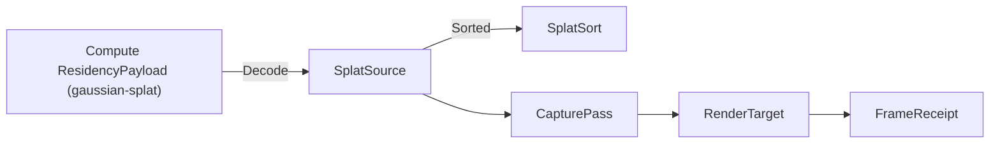

# [APPUI_REALITY_CAPTURE]

The reality-capture rail projects scanned existing-conditions geometry into the viewport beside BIM: `SplatSource` carries a Gaussian-splat ellipsoid set decoded off a Compute splat payload, `PointCloudSource` carries a massive point set decoded off a Compute point payload, `CapturePass` is the new `RenderPass` case family the render graph executes through the backend target factory, `MeasureOverlay` anchors a LiDAR-measurable annotation onto the `Viewpoint`, and `CaptureClip` scrubs a time-based capture frame on the animation playhead. The page owns the splat and point sources, the splat rasterization pass and point pass, the measurable overlay, and the capture-frame clip; the substrate is the `T-BACKEND-PORT` `GpuBackend` `RenderTarget` factory, the Compute point/splat payload at the interchange wire, the `Viewpoint` codec, and the animation `Track`/`Scrub` playhead. AppUi consumes the decoded point and splat payload at the wire and never decodes LAZ — the offline scan decode is the Python companion's geometry producer crossing as a Compute payload. The 3DGS rasterization is a distinct render path from triangle meshlets, SPIKE-gated on the live host-shared GPU context.

## [01]-[INDEX]

- [01]-[SPLAT_SOURCE]: SOG/PLY ellipsoid set off the Compute splat payload; radix-sort residency.
- [02]-[POINT_SOURCE]: LAZ-decoded point set off the Compute point payload; octree residency.
- [03]-[CAPTURE_PASS]: Splat and point `RenderPass` cases over the backend target factory.
- [04]-[MEASURE_OVERLAY]: LiDAR-anchored measurable annotation bound to the `Viewpoint`.
- [05]-[CAPTURE_CLIP]: Time-based capture-frame playback on the animation playhead.

## [02]-[SPLAT_SOURCE]

- Owner: `SplatEllipsoid` the single anisotropic 3D-Gaussian; `SplatSource` the decoded ellipsoid set over the ONE Compute `ResidencyPayload` carrier; `SplatSort` the view-dependent radix-sort fold; `CaptureFault` the typed fault family on the `AppUiFaultBand.Capture` registry row (6130).
- Cases: `CaptureFault` = Text | PayloadMalformed | SortOverflow | BackendUnsupported | DecodeDeferred — codes derive through the `AppUiFaultBand.Capture` registry row (6130).
- Entry: `public static Fin<SplatSource> Decode(GpuBackend backend, ResidencyPayload payload, ResidencyBudget budget)` — projects the ONE Compute `ResidencyPayload` (gaussian-splat kind, the `GaussianSplatScan` wire-fed row) into the residency-keyed ellipsoid set under the admission ladder kind -> non-empty -> exact wire layout -> residency watermark, an oversized payload failing `CaptureFault.DecodeDeferred` so the residency lane streams it; the page never decodes SOG/PLY or LAZ, it admits the decoded payload at the interchange wire; a divergent `SplatPayload` carrier beside the Compute record is the DELETED form (`[V5]`).
- Auto: each ellipsoid carries its mean position, the three scale magnitudes, the rotation quaternion, the spherical-harmonic color coefficients, and the opacity, so a `SplatSource` is the decoded SOG (self-organizing-gaussian) or PLY ellipsoid set the Compute payload streams; `SplatSort` radix-sorts the ellipsoids back-to-front per view by their projected depth so the alpha-composited rasterization composites in order — the 3DGS draw demands depth-sorted ellipsoids and the radix sort is the per-view fold the pass re-runs on a camera change; the ellipsoid bytes stream from the Persistence blob lane through the residency budget exactly as the meshlet tiles do, so a massive splat scene stays VRAM-bounded; the splat tile keys by the PAYLOAD'S OWN `ContentKey` per the single-mint law — a local re-hash over raw component floats is the DELETED form (doubly foreclosed by the kernel one-hasher law: no AppUi-side content-key fold exists beside `ContentHash.Of`), so residency keys the splat tile identically to the meshlet tile.
- Packages: Thinktecture.Runtime.Extensions, LanguageExt.Core, Rasm.Compute (project)
- Growth: a new splat attribute is one `SplatEllipsoid` field; a new sort policy is one `SplatSort` value; a new fault is one `CaptureFault` case; zero new surface.
- Boundary: the splat source projects off the ONE Compute `ResidencyPayload` boundary record `Render/pipeline.md` already consumes — one AppUi-side projection of one Compute concept, the page never decodes SOG/PLY/LAZ and never re-models a splat, and the `MemoryMarshal.Cast` layout assumption stays GATED on CAPTURE_PAYLOAD, and the ellipsoid set consumes the projected payload so the no-re-decode law holds exactly as the meshlet build never re-tessellates; the radix sort is REAL — `Sorted` runs an LSD radix over 32-bit quantized VIEW-ALIGNED depth keys (the camera-forward projection off the one `ViewCamera` row, never a radial eye distance) discriminated by the `SplatSort` row — `RadixDepth` full-key depth, `RadixTile` screen-tile-major with depth within — so the enum is consumed and the `OrderByDescending` stopgap is dead; the residency keying rides the `RESIDENCY_BUDGET` owner so the splat tile and the meshlet tile share one residency manager and a second splat-residency owner is the rejected form; the GPU ellipsoid rasterization binds the `T-BACKEND-PORT` `RenderTarget` factory through the render-graph lease — the per-backend splat-rasterizer compute kernel resolves under CAPTURE_GPU and a CPU ellipsoid-projection oracle is the floor for the 2D-fallback point preview while the GPU dispatch is the SPIKE.

```csharp signature
[Union]
public abstract partial record CaptureFault : Expected, IValidationError<CaptureFault> {
    private CaptureFault(string detail, int code) : base(detail, code, None) { }

    public static CaptureFault Create(string message) => new Text(message);

    public sealed record Text : CaptureFault { public Text(string detail) : base(detail, AppUiFaultBand.Capture.Code(0)) { } }
    public sealed record PayloadMalformed : CaptureFault { public PayloadMalformed(string detail) : base(detail, AppUiFaultBand.Capture.Code(1)) { } }
    public sealed record SortOverflow : CaptureFault { public SortOverflow(string detail) : base(detail, AppUiFaultBand.Capture.Code(2)) { } }
    public sealed record BackendUnsupported : CaptureFault { public BackendUnsupported(string detail) : base(detail, AppUiFaultBand.Capture.Code(3)) { } }
    public sealed record DecodeDeferred : CaptureFault { public DecodeDeferred(string detail) : base(detail, AppUiFaultBand.Capture.Code(4)) { } }
}

public readonly record struct SplatEllipsoid(
    float MeanX, float MeanY, float MeanZ,
    float ScaleX, float ScaleY, float ScaleZ,
    float RotX, float RotY, float RotZ, float RotW,
    float Opacity,
    int HarmonicOffset) {
    public BoundingSphere Bounds =>
        new(MeanX, MeanY, MeanZ, MathF.Max(ScaleX, MathF.Max(ScaleY, ScaleZ)) * 3f);

}

// The ONE payload carrier is the Compute ResidencyPayload — identity is ITS ContentKey (decode-only);
// no local SplatPayload record and no local content-key fold exist.

[SmartEnum<string>]
public sealed partial class SplatSort {
    public static readonly SplatSort RadixDepth = new("radix-depth");
    public static readonly SplatSort RadixTile = new("radix-tile");
}

public sealed record SplatSource(
    GpuBackend Backend,
    UInt128 ContentKey,
    Seq<SplatEllipsoid> Ellipsoids,
    ReadOnlyMemory<float> Harmonics,
    SplatSort Sort,
    int HarmonicDegree,
    BoundingSphere Bounds) {
    // Admission ladder: kind -> non-empty -> exact wire layout (the MemoryMarshal.Cast gate) -> residency
    // watermark; an oversized payload DEFERS (CaptureFault.DecodeDeferred) so materialization stays
    // budget-bounded and the residency lane streams it instead of a whole-scene VRAM spike.
    public static Fin<SplatSource> Decode(GpuBackend backend, ResidencyPayload payload, ResidencyBudget budget) =>
        payload.Kind != ResidencyKind.GaussianSplat
            ? Fin.Fail<SplatSource>(new CaptureFault.PayloadMalformed($"splat/kind:{payload.Kind}"))
            : payload.SplatCount <= 0
                ? Fin.Fail<SplatSource>(new CaptureFault.PayloadMalformed($"splat/empty:{payload.ContentKey:x32}"))
                : payload.SplatBytes.Length != payload.SplatCount * Unsafe.SizeOf<SplatEllipsoid>()
                    ? Fin.Fail<SplatSource>(new CaptureFault.PayloadMalformed($"splat/layout:{payload.SplatBytes.Length}b != {payload.SplatCount}x{Unsafe.SizeOf<SplatEllipsoid>()}b"))
                    : payload.SplatBytes.Length > budget.Watermark
                        ? Fin.Fail<SplatSource>(new CaptureFault.DecodeDeferred($"splat/oversized:{payload.SplatBytes.Length}b > {budget.Watermark}b"))
                        : Fin.Succ(new SplatSource(
                            backend, payload.ContentKey, Project(payload), payload.Harmonics,
                            SplatSort.RadixDepth, payload.HarmonicDegree, BoundsOf(payload)));

    // REAL LSD radix sort over 32-bit keys DISCRIMINATED by the SplatSort row: RadixDepth quantizes the
    // VIEW-ALIGNED depth (projection onto the camera forward axis) back-to-front across the full key;
    // RadixTile packs a 16x16 screen-tile id (lateral view-basis coordinates over the source bounds)
    // into the top byte with the quantized depth below it, so compositing stays tile-coherent.
    public Seq<SplatEllipsoid> Sorted(ViewCamera camera) {
        int count = Ellipsoids.Count;
        if (count <= 1) { return Ellipsoids; }
        (double fx, double fy, double fz) = Normalize(camera.TargetX - camera.EyeX, camera.TargetY - camera.EyeY, camera.TargetZ - camera.EyeZ);
        (double rx, double ry, double rz) = Normalize(Cross(fx, fy, fz, camera.UpX, camera.UpY, camera.UpZ));
        (double ux, double uy, double uz) = Cross(rx, ry, rz, fx, fy, fz);
        var (keys, order, depths) = (new uint[count], new int[count], new double[count]);
        double maxDepth = 1e-9;
        for (var at = 0; at < count; at++) {
            SplatEllipsoid splat = Ellipsoids[at];
            depths[at] = ((splat.MeanX - camera.EyeX) * fx) + ((splat.MeanY - camera.EyeY) * fy) + ((splat.MeanZ - camera.EyeZ) * fz);
            maxDepth = Math.Max(maxDepth, depths[at]);
        }
        double lateralSpan = Math.Max(Bounds.Radius * 2d, 1e-9);
        for (var at = 0; at < count; at++) {
            SplatEllipsoid splat = Ellipsoids[at];
            uint depthKey = uint.MaxValue - (uint)(Math.Clamp(depths[at] / maxDepth, 0d, 1d) * uint.MaxValue); // back-to-front
            if (Sort == SplatSort.RadixTile) {
                (double cx, double cy, double cz) = (splat.MeanX - camera.EyeX, splat.MeanY - camera.EyeY, splat.MeanZ - camera.EyeZ);
                uint tx = (uint)Math.Clamp(((((cx * rx) + (cy * ry) + (cz * rz)) / lateralSpan) + 0.5d) * 16d, 0d, 15d);
                uint ty = (uint)Math.Clamp(((((cx * ux) + (cy * uy) + (cz * uz)) / lateralSpan) + 0.5d) * 16d, 0d, 15d);
                keys[at] = (((ty << 4) | tx) << 24) | (depthKey >> 8);
            } else { keys[at] = depthKey; }
            order[at] = at;
        }
        var (scratchKeys, scratchOrder, counts) = (new uint[count], new int[count], new int[256]);
        for (var shift = 0; shift < 32; shift += 8) {
            Array.Clear(counts);
            for (var at = 0; at < count; at++) { counts[(keys[at] >> shift) & 0xFF]++; }
            for (var bucket = 1; bucket < 256; bucket++) { counts[bucket] += counts[bucket - 1]; }
            for (var at = count - 1; at >= 0; at--) {
                int slot = --counts[(keys[at] >> shift) & 0xFF];
                scratchKeys[slot] = keys[at];
                scratchOrder[slot] = order[at];
            }
            (keys, scratchKeys) = (scratchKeys, keys);
            (order, scratchOrder) = (scratchOrder, order);
        }
        return toSeq(order.Select(at => Ellipsoids[at]));
    }

    // MemoryMarshal.Cast layout assumption GATED on CAPTURE_PAYLOAD — the wire layout contract; Decode
    // proves the byte length against SplatCount before this cast ever runs.
    private static Seq<SplatEllipsoid> Project(ResidencyPayload payload) =>
        toSeq(MemoryMarshal.Cast<byte, SplatEllipsoid>(payload.SplatBytes.Span).ToArray());

    private static BoundingSphere BoundsOf(ResidencyPayload payload) =>
        new(payload.BoundsX, payload.BoundsY, payload.BoundsZ, payload.BoundsRadius);

    static (double X, double Y, double Z) Normalize(double x, double y, double z) {
        double length = Math.Max(Math.Sqrt((x * x) + (y * y) + (z * z)), 1e-12);
        return (x / length, y / length, z / length);
    }

    static (double X, double Y, double Z) Normalize((double X, double Y, double Z) v) => Normalize(v.X, v.Y, v.Z);

    static (double X, double Y, double Z) Cross(double ax, double ay, double az, double bx, double by, double bz) =>
        ((ay * bz) - (az * by), (az * bx) - (ax * bz), (ax * by) - (ay * bx));
}
```



## [03]-[POINT_SOURCE]

- Owner: `PointSample` the single LiDAR return; `PointCloudSource` the decoded point set; `PointOctree` the level-of-detail residency tree.
- Entry: `public static Fin<PointCloudSource> Decode(GpuBackend backend, ResidencyPayload payload, ResidencyBudget budget)` — projects the ONE Compute `ResidencyPayload` (point-cloud kind) into the octree-keyed point set under the same kind -> non-empty -> layout -> watermark admission ladder the splat arm runs, an oversized cloud failing `CaptureFault.DecodeDeferred` for the residency stream; a divergent `PointPayload` carrier is the DELETED form (`[V5]`); AppUi consumes the decoded payload at the wire and never decodes LAZ.
- Auto: each point carries its position, the classification byte, the intensity, and the RGB color so a `PointCloudSource` is the decoded scan return set the Compute payload streams; `PointOctree` partitions the points into a spatial octree whose nodes carry their level-of-detail subsample so a massive cloud renders the coarse subsample at distance and the full density up close, pop-free because adjacent levels share locked node boundaries exactly as the meshlet cluster-LOD shares cluster boundaries; the octree nodes key into the residency budget by their cell so a billion-point cloud stays VRAM-bounded; the classification byte routes through the perceptually-uniform colormap so a class-colored cloud maps through one lightness-monotone scale.
- Packages: Thinktecture.Runtime.Extensions, LanguageExt.Core, Rasm.Compute (project)
- Growth: a new point attribute is one `PointSample` field; a new LOD policy is one octree subsample value; zero new surface.
- Boundary: the point source projects off the ONE Compute `ResidencyPayload` boundary record — the offline LAZ/scan decode is the Python companion's geometry producer crossing as a Compute payload, so AppUi carries no LAZ-decode package and a `laszip`/`pdal` admission inside `realitycapture/` is the rejected form; the octree LOD is the one massive-cloud residency law and a flat point-array draw is the deleted form; the octree residency rides the `RESIDENCY_BUDGET` owner so the point node and the meshlet tile share one residency manager; the GPU point splatting binds the `RenderTarget` factory through the render-graph lease under CAPTURE_GPU and a CPU octree subsample is the floor for the 2D fallback while the GPU draw is the SPIKE.

```csharp signature
public readonly record struct PointSample(
    float X, float Y, float Z,
    byte Classification,
    ushort Intensity,
    byte R, byte G, byte B) {
    public (double X, double Y, double Z) Position => (X, Y, Z);
}

public sealed record PointOctreeNode(string Cell, int Level, BoundingSphere Bounds, int SampleStride, long Count, long LastTouch);

public sealed record PointCloudSource(
    GpuBackend Backend,
    Seq<PointSample> Points,
    Seq<PointOctreeNode> Octree,
    Colormap ClassRamp,
    BoundingSphere Bounds) {
    // The SAME admission ladder as the splat arm: kind -> non-empty -> exact wire layout -> residency
    // watermark; an oversized cloud DEFERS so the octree residency streams it instead of materializing.
    public static Fin<PointCloudSource> Decode(GpuBackend backend, ResidencyPayload payload, ResidencyBudget budget) =>
        payload.Kind != ResidencyKind.PointCloud
            ? Fin.Fail<PointCloudSource>(new CaptureFault.PayloadMalformed($"point/kind:{payload.Kind}"))
            : payload.PointCount <= 0L
                ? Fin.Fail<PointCloudSource>(new CaptureFault.PayloadMalformed($"point/empty:{payload.ContentKey:x32}"))
                : payload.PointBytes.Length != payload.PointCount * Unsafe.SizeOf<PointSample>()
                    ? Fin.Fail<PointCloudSource>(new CaptureFault.PayloadMalformed($"point/layout:{payload.PointBytes.Length}b != {payload.PointCount}x{Unsafe.SizeOf<PointSample>()}b"))
                    : payload.PointBytes.Length > budget.Watermark
                        ? Fin.Fail<PointCloudSource>(new CaptureFault.DecodeDeferred($"point/oversized:{payload.PointBytes.Length}b > {budget.Watermark}b"))
                        : Fin.Succ(new PointCloudSource(backend, Project(payload), Octree(payload), Colormap.Viridis,
                            new BoundingSphere(payload.BoundsX, payload.BoundsY, payload.BoundsZ, payload.BoundsRadius)));

    public Seq<PointOctreeNode> Visible(Frustum frustum, double lodScale) =>
        Octree.Filter(node => frustum.Intersects(node.Bounds) && node.Level <= (int)lodScale);

    // MemoryMarshal.Cast layout assumption GATED on CAPTURE_PAYLOAD — the wire layout contract.
    private static Seq<PointSample> Project(ResidencyPayload payload) =>
        toSeq(MemoryMarshal.Cast<byte, PointSample>(payload.PointBytes.Span).ToArray());

    private static Seq<PointOctreeNode> Octree(ResidencyPayload payload) =>
        toSeq(Enumerable.Range(0, int.Max(payload.LevelDepth, 1))
            .Select(level => new PointOctreeNode(
                $"{payload.ContentKey:x32}/{level}", level,
                new BoundingSphere(payload.BoundsX, payload.BoundsY, payload.BoundsZ, payload.BoundsRadius),
                1 << (payload.LevelDepth - level), payload.PointCount >> level, 0L)));
}
```

## [04]-[CAPTURE_PASS]

- Owner: `CapturePass` `[Union]` the reality-capture render-pass family; `CaptureVisual` the pass-to-`RenderPass` projection.
- Cases: `CapturePass` = Splat | Point under the locked kind literals splat, point.
- Entry: `public RenderPass Pass(RenderTargetFactory factory)` — projects the capture source into one viewport `RenderPass` case binding the `T-BACKEND-PORT` target factory; the splat pass radix-sorts and alpha-composites the ellipsoids, the point pass octree-subsamples and splats the points.
- Auto: the splat case binds the backend's splat-rasterizer kernel through the `RenderTargetFactory` so the ellipsoid draw composites into the same leased context the meshlet draw uses, never a second `GRContext`; the point case binds the backend's point-splat kernel through the same factory; both cases emit one `Geometry`-family `RenderPass` over the leased target so the render-graph pass algebra stays backend-agnostic and the per-backend divergence (wgpu `RenderPassEncoder` splat-rasterizer pipeline versus `SKRuntimeEffect` compute splat) lives below the factory column; the pass triangles-drawn projection reports the composited ellipsoid or point count so the frame receipt's budget verdict gates the capture pass identically to the geometry pass.
- Packages: Thinktecture.Runtime.Extensions, LanguageExt.Core, SkiaSharp
- Growth: a new capture render path is one `CapturePass` case; zero new surface.
- Boundary: the capture pass is a viewport `RenderPass` case so the reality-capture geometry navigates beside the BIM geometry in one render graph and a parallel capture scene owner is the rejected form; the splat and point rasterization bind the `T-BACKEND-PORT` `RenderTargetFactory` so the capture pass binds a backend-provided target factory rather than hard-coding a second `GRContext` substrate, depending on `T-BACKEND-PORT` for the target-construction seam; the per-backend ellipsoid-rasterizer and point-splat kernels resolve under CAPTURE_GPU and a CPU ellipsoid-projection plus octree-subsample point draw are the floor for the 2D fallback while the GPU dispatch is the SPIKE; this pass is SPIKE-gated on the GEOMETRY_VIRTUAL GPU surface and rides the same shared-context lease.

```csharp signature
[Union(ConversionFromValue = ConversionOperatorsGeneration.None)]
public abstract partial record CapturePass {
    private CapturePass() { }
    public sealed record Splat(string Key, SplatSource Source, Func<RenderTarget, SplatSource, Fin<int>> Composite) : CapturePass;
    public sealed record Point(string Key, PointCloudSource Source, Func<RenderTarget, PointCloudSource, Fin<int>> Splat) : CapturePass;

    public string Key => Switch(splat: static s => s.Key, point: static p => p.Key);

    public RenderPass Pass(RenderTargetFactory factory) => Switch(
        state: factory,
        splat: static (f, s) => (RenderPass)new RenderPass.Geometry(
            s.Key,
            (target, _, _) => f.Target(target.Info).Bind(bound => s.Composite(bound, s.Source))),
        point: static (f, p) => new RenderPass.Geometry(
            p.Key,
            (target, _, _) => f.Target(target.Info).Bind(bound => p.Splat(bound, p.Source))));
}
```

## [05]-[MEASURE_OVERLAY]

- Owner: `MeasurePoint` the LiDAR-anchored measurable vertex; `MeasureOverlay` the annotation set bound to the `Viewpoint`.
- Entry: `public Fin<MeasureOverlay> Anchor(MeasurePoint point)` — anchors a measurable vertex onto the capture cloud and folds the running distance and angle evidence; `public Viewpoint Bind(Viewpoint view)` — binds the overlay onto the viewpoint visibility set so a saved capture markup carries its measurements.
- Auto: each anchor snaps to the nearest LiDAR return so a measurement reads the scanned existing-conditions geometry, not a guessed point; the overlay folds the per-segment distance and per-vertex angle so a polyline measurement reads its total length and its turning angles; the overlay binds onto the `Viewpoint` so a measured markup rides the one portable view-state receipt the BCF codec and the coordination board consume — a capture measurement is a viewpoint annotation, not a second markup model.
- Packages: Thinktecture.Runtime.Extensions, LanguageExt.Core, UnitsNet
- Growth: a new measurement kind is one `MeasurePoint` field; zero new surface.
- Boundary: the overlay anchors onto the LiDAR returns so a measurement is against scanned reality and a free-floating annotation is the deleted form; the overlay binds the `VIEWPOINT_CODEC` `Viewpoint` so the measurable markup rides the one portable view-state receipt and a parallel measurement-snapshot model is the rejected form — the same receipt a coordination issue and a saved camera carry; the distance and angle carry `UnitsNet` `Length` and `Angle` so a measurement reports in the model unit and a raw-double measurement is the deleted form.

```csharp signature
public readonly record struct MeasurePoint(double X, double Y, double Z, string SnappedReturn);

public sealed record MeasureSegment(MeasurePoint From, MeasurePoint To, UnitsNet.Length Distance);

public sealed record MeasureOverlay(string Key, Seq<MeasurePoint> Vertices, Seq<MeasureSegment> Segments) {
    public static MeasureOverlay Empty(string key) => new(key, Seq<MeasurePoint>(), Seq<MeasureSegment>());

    public Fin<MeasureOverlay> Anchor(MeasurePoint point) =>
        Vertices.LastOrNone().Match(
            None: () => Fin.Succ(this with { Vertices = Vertices.Add(point) }),
            Some: previous => Fin.Succ(this with {
                Vertices = Vertices.Add(point),
                Segments = Segments.Add(new MeasureSegment(previous, point, Span(previous, point))),
            }));

    public UnitsNet.Length Total =>
        Segments.Fold(UnitsNet.Length.Zero, static (sum, segment) => sum + segment.Distance);

    public Viewpoint Bind(Viewpoint view) =>
        view with { Overrides = view.Overrides + Vertices.Map(static v => new VisibilityOverride(v.SnappedReturn, true, None, 0d)) };

    private static UnitsNet.Length Span(MeasurePoint a, MeasurePoint b) =>
        UnitsNet.Length.FromMeters(Math.Sqrt(Math.Pow(b.X - a.X, 2) + Math.Pow(b.Y - a.Y, 2) + Math.Pow(b.Z - a.Z, 2)));
}
```

## [06]-[CAPTURE_CLIP]

- Owner: `CaptureFrame` the time-stamped capture epoch; `CaptureClip` the capture-frame playback bound to the animation playhead.
- Entry: `public FieldIndexTrack OnTimeline(string key)` — projects the capture epochs onto an animation `FieldIndex` track so a multi-epoch scan scrubs on the one playhead; the capture frame is a field index, never a wall-clock tick.
- Auto: each capture frame carries its epoch instant and its payload key so a multi-epoch reality capture (a construction-progress scan series) reads one frame per epoch; the clip projects the epochs onto an animation `FieldIndex` track so the capture-frame scrub rides the one deterministic playhead the kinematic camera and the transient field scrub share — a construction-progress scrub and a camera fly-through animate on the same timeline; the frame index selects the active `SplatSource`/`PointCloudSource` payload key so scrubbing the playhead swaps the rendered capture epoch.
- Packages: Thinktecture.Runtime.Extensions, LanguageExt.Core, NodaTime
- Growth: a new capture epoch is one `CaptureFrame` row; zero new surface.
- Boundary: the capture-frame scrub is an animation `FieldIndex` track so the capture playback rides the one playhead and a second capture timeline is the deleted form — the same frame-indexed deterministic clock the transient field scrub uses; the frame index selects the active capture payload so a wall-clock capture playback is the rejected form; the capture clip mints no second scrub owner and the animation `Scrub` drives it.

```csharp signature
public readonly record struct CaptureFrame(int Index, Instant Epoch, string PayloadKey);

public sealed record CaptureClip(string Key, Seq<CaptureFrame> Frames) {
    public Option<CaptureFrame> At(int index) => Frames.Find(frame => frame.Index == index);

    public Animation.Track.FieldIndex OnTimeline(string key) =>
        new(key, Frames.Map(frame => new Animation.Keyframe<int>(
            Duration.FromTimeSpan(frame.Epoch - Frames.Head.Epoch), frame.Index, MotionToken.Standard)).ToSeq());
}
```

## [07]-[RESEARCH]

- [CAPTURE_PAYLOAD]: the projection from the canonical Compute splat and point payloads (`SplatPayload`, `PointPayload`) into the `SplatEllipsoid` and `PointSample` interleaved runs is the cross-package wire boundary the capture sources never re-mint; the proto splat-primitive member set (mean/scale/rotation/spherical-harmonic accessors) and the point-primitive member set (position/classification/intensity/color accessors) resolve at implementation against the settled Compute interchange wire contract — the `SplatSource`/`PointCloudSource` shapes, the radix-sort and octree folds, and the residency keying are settled, the proto accessor spellings are the unverified surface.
- [CAPTURE_GPU]: the per-backend Gaussian-splat ellipsoid-rasterizer compute kernel (radix-sorted alpha-composited 3DGS over the `T-BACKEND-PORT` `RenderTargetFactory`), the point-splat compute kernel, and the bindless residency upload of a splat or point tile to a backend slot resolve under VIEWPORT_GPU against the live host-shared GPU context — the splat decode and radix sort, the point decode and octree LOD, the measurable overlay, and the capture-frame clip are settled and ship as the CPU/2D-fallback point preview, the GPU ellipsoid rasterization and point splatting are the unverified surface gated on the live host-owned GPU context and the backend target factory.
- [CAPTURE_DECODE]: the offline LAZ/E57/SOG scan decode is the Python companion's geometry producer ([UPSTREAM-BLOCKED] on the companion scan-decode pipeline) and crosses to AppUi exclusively as the decoded Compute `SplatPayload`/`PointPayload` at the interchange wire; AppUi admits the decoded payload and carries no scan-decode package, so the decode dependency is external and the AppUi consume-at-wire boundary is settled.
