# [APPUI_REALITY_CAPTURE]

The reality-capture rail projects scanned existing-conditions geometry into the viewport beside BIM: `SplatSource` carries a Gaussian-splat ellipsoid set decoded from a Compute residency payload, `PointCloudSource` carries a massive point set decoded from the same carrier, and `CapturePass` projects both onto the render graph's active `RenderTarget`. `MeasureOverlay` anchors LiDAR measurement onto the `Viewpoint`, and `CaptureClip` scrubs a time-based capture frame on the animation playhead. The page owns the splat and point sources, raster passes, measurable overlay, and capture-frame clip; the substrate is the pipeline target lease, Compute residency payload, `Viewpoint` codec, and animation playhead. AppUi consumes compressed payload streams through `CaptureDecode` and never admits a scan-file decoder.

## [01]-[INDEX]

- [01]-[SPLAT_SOURCE]: SOG/PLY ellipsoid set off the Compute splat payload; radix-sort residency.
- [02]-[POINT_SOURCE]: LAZ-decoded point set off the Compute point payload; octree residency.
- [03]-[CAPTURE_PASS]: Splat and point `RenderPass` cases over the active render-graph target.
- [04]-[MEASURE_OVERLAY]: LiDAR-anchored measurable annotation bound to the `Viewpoint`.
- [05]-[CAPTURE_CLIP]: Time-based capture-frame playback on the animation playhead.

## [02]-[SPLAT_SOURCE]

- Owner: `SplatEllipsoid` the single anisotropic 3D-Gaussian; `SplatSource` the decoded ellipsoid set over the ONE Compute `ResidencyPayload` carrier; `SplatSort` the view-dependent radix-sort fold; `CaptureFault` the typed fault family on the `AppUiFaultBand.Capture` registry row (6130).
- Cases: `CaptureFault` = Text | PayloadMalformed | SortOverflow | BackendUnsupported | DecodeDeferred — codes derive through the `AppUiFaultBand.Capture` registry row (6130).
- Entry: `public static Fin<SplatSource> Decode(GpuBackend backend, ResidencyPayload payload, ResidencyBudget budget, CaptureDecode decode)` projects a gaussian-splat `ResidencyPayload` into the residency-keyed ellipsoid set under the admission ladder kind → resident count → payload bytes → residency watermark. `CaptureDecode.Decode` returns the `CaptureDecoded.Splats` case from the canonical `Blob`/`Layout` columns; an oversized monolithic payload fails `CaptureFault.DecodeDeferred`, directing the producer to the per-cell `CaptureTileSet.Resident` path.
- Auto: each ellipsoid carries its mean position, the three scale magnitudes, the rotation quaternion, the spherical-harmonic color coefficients, and the opacity, so a `SplatSource` is the decoded SOG (self-organizing-gaussian) or PLY ellipsoid set the Compute payload streams; `SplatSort` radix-sorts the ellipsoids back-to-front per view by their projected depth so the alpha-composited rasterization composites in order — the 3DGS draw demands depth-sorted ellipsoids and the radix sort is the per-view fold the pass re-runs on a camera change; the ellipsoid bytes stream from the Persistence blob lane through the residency budget exactly as the meshlet tiles do, so a massive splat scene stays VRAM-bounded; the splat tile keys by the PAYLOAD'S OWN `ContentKey` per the single-mint law — a local re-hash over raw component floats is the DELETED form (doubly foreclosed by the kernel one-hasher law: no AppUi-side content-key fold exists beside `ContentHash.Of`), so residency keys the splat tile identically to the meshlet tile.
- Packages: Thinktecture.Runtime.Extensions, LanguageExt.Core, Rasm.Compute (project)
- Growth: a new splat attribute is one `SplatEllipsoid` field; a new sort policy is one `SplatSort` value; a new fault is one `CaptureFault` case; zero new surface.
- Boundary: the splat source consumes the one Compute `ResidencyPayload` boundary record that `Render/pipeline.md` already projects. `CaptureDecode` is the composition-bound interpreter for the payload's compressed `Blob` and typed `Layout`; the AppUi owner never invents flat payload members or assumes native struct packing. The radix sort runs an LSD radix over 32-bit quantized view-aligned depth keys, discriminated by `SplatSort.RadixDepth` versus `RadixTile`. Residency keying rides `ResidencyBudget`, and `CapturePass` draws only through the active target supplied by `RenderGraph`.

```csharp signature
[Union]
public abstract partial record CaptureFault : Expected, IValidationError<CaptureFault> {
    private CaptureFault(string detail, int code) : base(detail, code, None) { }

    public static CaptureFault Create(string message) => new Text(message);

    public sealed record Text : CaptureFault { public Text(string detail) : base(detail, AppUiFaultBand.Capture.Code(0)) { } }
    public sealed record PayloadMalformed : CaptureFault { public PayloadMalformed(string detail) : base(detail, AppUiFaultBand.Capture.Code(1)) { } }
    public sealed record SortOverflow : CaptureFault { public SortOverflow(string detail) : base(detail, AppUiFaultBand.Capture.Code(2)) { } }
    public sealed record BackendUnsupported : CaptureFault { public BackendUnsupported(string detail) : base(detail, AppUiFaultBand.Capture.Code(3)) { } }
    public sealed record DecodeDeferred : CaptureFault { public DecodeDeferred(string detail) : base(detail, AppUiFaultBand.Capture.Code(4)) { } }
    public sealed record SnapAbsent : CaptureFault { public SnapAbsent(string detail) : base(detail, AppUiFaultBand.Capture.Code(5)) { } }
}

public readonly record struct SplatEllipsoid(
    float MeanX, float MeanY, float MeanZ,
    float ScaleX, float ScaleY, float ScaleZ,
    float RotX, float RotY, float RotZ, float RotW,
    float Opacity,
    int HarmonicOffset) {
    public BoundingSphere Bounds =>
        new(MeanX, MeanY, MeanZ, MathF.Max(ScaleX, MathF.Max(ScaleY, ScaleZ)) * 3f);

}

// The ONE payload carrier is the Compute ResidencyPayload, and one decoder dispatches its Kind into this
// closed result family. AppUi never invents flat byte members or reinterprets encoded bytes as structs.
[Union(ConversionFromValue = ConversionOperatorsGeneration.None)]
public abstract partial record CaptureDecoded {
    private CaptureDecoded() { }
    public sealed record Splats(Seq<SplatEllipsoid> Ellipsoids, ReadOnlyMemory<float> Harmonics) : CaptureDecoded;
    public sealed record Points(Seq<PointSample> Samples, int OctreeDepth) : CaptureDecoded;
}

public sealed record CaptureDecode(Func<ResidencyPayload, Fin<CaptureDecoded>> Decode);

[SmartEnum<string>]
public sealed partial class SplatSort {
    public static readonly SplatSort RadixDepth = new("radix-depth");
    public static readonly SplatSort RadixTile = new("radix-tile");
}

public sealed record SplatSource(
    GpuBackend Backend,
    UInt128 ContentKey,
    Seq<SplatEllipsoid> Ellipsoids,
    ReadOnlyMemory<float> Harmonics,
    SplatSort Sort,
    int HarmonicDegree,
    BoundingSphere Bounds) {
    // Admission ladder: kind -> non-empty -> composition-bound decode -> residency watermark; an oversized
    // payload DEFERS (CaptureFault.DecodeDeferred) so materialization stays
    // budget-bounded and the residency lane streams it instead of a whole-scene VRAM spike.
    public static Fin<SplatSource> Decode(GpuBackend backend, ResidencyPayload payload, ResidencyBudget budget, CaptureDecode decode) =>
        payload.Kind != ResidencyKind.GaussianSplat
            ? Fin.Fail<SplatSource>(new CaptureFault.PayloadMalformed($"splat/kind:{payload.Kind}"))
            : payload.ResidentCount <= 0
                ? Fin.Fail<SplatSource>(new CaptureFault.PayloadMalformed($"splat/empty:{payload.ContentKey:x32}"))
            : payload.EncodedBytes > budget.Watermark
                ? Fin.Fail<SplatSource>(new CaptureFault.DecodeDeferred($"splat/oversized:{payload.EncodedBytes}b > {budget.Watermark}b"))
                : decode.Decode(payload).Bind(decoded => decoded is CaptureDecoded.Splats splats
                    ? Fin.Succ(new SplatSource(
                        backend, payload.ContentKey, splats.Ellipsoids, splats.Harmonics,
                        SplatSort.RadixDepth, payload.HarmonicDegree, BoundsOf(payload)))
                    : Fin.Fail<SplatSource>(new CaptureFault.PayloadMalformed($"splat/decode:{payload.ContentKey:x32}")));

    // REAL LSD radix sort over 32-bit keys DISCRIMINATED by the SplatSort row: RadixDepth quantizes the
    // VIEW-ALIGNED depth (projection onto the camera forward axis) back-to-front across the full key;
    // RadixTile packs a 16x16 screen-tile id (lateral view-basis coordinates over the source bounds)
    // into the top byte with the quantized depth below it, so compositing stays tile-coherent.
    public Seq<SplatEllipsoid> Sorted(ViewCamera camera) {
        int count = Ellipsoids.Count;
        if (count <= 1) { return Ellipsoids; }
        CameraFrame frame = camera.Frame;
        (double fx, double fy, double fz) = Normalize(frame.Target.X - frame.Eye.X, frame.Target.Y - frame.Eye.Y, frame.Target.Z - frame.Eye.Z);
        (double rx, double ry, double rz) = Normalize(Cross(fx, fy, fz, frame.Up.X, frame.Up.Y, frame.Up.Z));
        (double ux, double uy, double uz) = Cross(rx, ry, rz, fx, fy, fz);
        (uint[] keys, int[] order, double[] depths) = (new uint[count], new int[count], new double[count]);
        double maxDepth = 1e-9;
        for (int at = 0; at < count; at++) {
            SplatEllipsoid splat = Ellipsoids[at];
            depths[at] = ((splat.MeanX - frame.Eye.X) * fx) + ((splat.MeanY - frame.Eye.Y) * fy) + ((splat.MeanZ - frame.Eye.Z) * fz);
            maxDepth = Math.Max(maxDepth, depths[at]);
        }
        double lateralSpan = Math.Max(Bounds.Radius * 2d, 1e-9);
        for (int at = 0; at < count; at++) {
            SplatEllipsoid splat = Ellipsoids[at];
            uint depthKey = uint.MaxValue - (uint)(Math.Clamp(depths[at] / maxDepth, 0d, 1d) * uint.MaxValue); // back-to-front
            if (Sort == SplatSort.RadixTile) {
                (double cx, double cy, double cz) = (splat.MeanX - frame.Eye.X, splat.MeanY - frame.Eye.Y, splat.MeanZ - frame.Eye.Z);
                uint tx = (uint)Math.Clamp(((((cx * rx) + (cy * ry) + (cz * rz)) / lateralSpan) + 0.5d) * 16d, 0d, 15d);
                uint ty = (uint)Math.Clamp(((((cx * ux) + (cy * uy) + (cz * uz)) / lateralSpan) + 0.5d) * 16d, 0d, 15d);
                keys[at] = (((ty << 4) | tx) << 24) | (depthKey >> 8);
            } else { keys[at] = depthKey; }
            order[at] = at;
        }
        (uint[] scratchKeys, int[] scratchOrder, int[] counts) = (new uint[count], new int[count], new int[256]);
        for (int shift = 0; shift < 32; shift += 8) {
            Array.Clear(counts);
            for (int at = 0; at < count; at++) { counts[(keys[at] >> shift) & 0xFF]++; }
            for (int bucket = 1; bucket < 256; bucket++) { counts[bucket] += counts[bucket - 1]; }
            for (int at = count - 1; at >= 0; at--) {
                int slot = --counts[(keys[at] >> shift) & 0xFF];
                scratchKeys[slot] = keys[at];
                scratchOrder[slot] = order[at];
            }
            (keys, scratchKeys) = (scratchKeys, keys);
            (order, scratchOrder) = (scratchOrder, order);
        }
        return toSeq(order.Select(at => Ellipsoids[at]));
    }

    private static BoundingSphere BoundsOf(ResidencyPayload payload) =>
        new(payload.Center.X, payload.Center.Y, payload.Center.Z, payload.Radius);

    private static (double X, double Y, double Z) Normalize(double x, double y, double z) {
        double length = Math.Max(Math.Sqrt((x * x) + (y * y) + (z * z)), 1e-12);
        return (x / length, y / length, z / length);
    }

    private static (double X, double Y, double Z) Normalize((double X, double Y, double Z) v) => Normalize(v.X, v.Y, v.Z);

    private static (double X, double Y, double Z) Cross(double ax, double ay, double az, double bx, double by, double bz) =>
        ((ay * bz) - (az * by), (az * bx) - (ax * bz), (ax * by) - (ay * bx));
}
```



```mermaid
---
config:
  theme: base
  look: classic
  layout: elk
  flowchart:
    curve: linear
    padding: 25
  themeVariables:
    darkMode: true
    fontFamily: "SF Mono, Menlo, Cascadia Mono, Segoe UI Mono, Consolas, monospace"
    useGradient: false
    dropShadow: "none"
    background: "#282A36"
    primaryColor: "#44475A"
    primaryTextColor: "#F8F8F2"
    primaryBorderColor: "#BD93F9"
    lineColor: "#FF79C6"
    textColor: "#F8F8F2"
    edgeLabelBackground: "#21222C"
    labelBackgroundColor: "#21222C"
  themeCSS: ".nodeLabel{font-size:13px;font-weight:500}.edgeLabel{font-size:12px;font-weight:500}.cluster-label .nodeLabel{font-size:13.5px;font-weight:700;letter-spacing:.08em}.edge-thickness-normal{stroke-width:2px}.edge-thickness-thick{stroke-width:3px}.edge-pattern-dashed,.edge-pattern-dotted{stroke-width:1.5px;stroke-dasharray:4 6}.node rect,.node circle,.node polygon,.node path,.node .outer-path{stroke-width:1.5px;filter:none!important}.cluster rect{stroke-width:1px!important;stroke-dasharray:5 4!important;filter:none!important}.marker path{transform:scale(.8);transform-origin:5px 5px}.marker circle{transform:scale(.48);transform-origin:5px 5px}.edgeLabel rect{transform-box:fill-box;transform-origin:center;transform:scale(1.1,1.2)}"
---
flowchart LR
    accTitle: Reality capture rendering flow
    accDescr: Residency payloads decode into splat and point sources that execute as capture passes on the active target.
    Payload["Compute ResidencyPayload (gaussian-splat)"] -->|Decode| SplatSource
    SplatSource -->|Sorted| SplatSort
    SplatSource --> CapturePass
    CapturePass --> RenderTarget
    RenderTarget --> FrameReceipt
    linkStyle 4 stroke:#50FA7B,color:#F8F8F2
    classDef primary fill:#44475A,stroke:#FF79C6,color:#F8F8F2
    classDef data fill:#FFB86CBF,stroke:#FFB86C,color:#282A36
    classDef boundary fill:#282A36,stroke:#BD93F9,color:#F8F8F2
    class SplatSource,SplatSort,CapturePass primary
    class Payload,RenderTarget data
    class FrameReceipt boundary
```

## [03]-[POINT_SOURCE]

- Owner: `PointSample` the single LiDAR return; `PointCloudSource` the decoded point set; `PointOctree` the level-of-detail residency tree.
- Entry: `public static Fin<PointCloudSource> Decode(GpuBackend backend, ResidencyPayload payload, ResidencyBudget budget, CaptureDecode decode)` projects a point-splat `ResidencyPayload` into the octree-keyed point set under the same kind → resident count → payload bytes → watermark ladder. `CaptureDecode.Decode` returns the `CaptureDecoded.Points` case plus octree depth; an oversized monolithic cloud fails `CaptureFault.DecodeDeferred`, while `CaptureTileSet.Resident` executes the tiled path.
- Auto: each point carries its position, the classification byte, the intensity, and the RGB color so a `PointCloudSource` is the decoded scan return set the Compute payload streams; `PointOctree` partitions the points into a spatial octree — level L subdivides the bounding cube into `2^L` divisions per axis, occupied cells only, each node carrying ITS OWN cell bounds, resident count, and coarse-level `SampleStride` — so a massive cloud renders the coarse subsample at distance and the full density up close, pop-free because adjacent levels share locked node boundaries exactly as the meshlet cluster-LOD shares cluster boundaries; the octree nodes key into the residency budget by their Morton cell key and the per-cell payload census streams through `CaptureTileSet.Resident` so a billion-point cloud stays VRAM-bounded by the plan itself and adjacent cells sort near for tile-coherent upload; the classification byte routes through the perceptually-uniform colormap so a class-colored cloud maps through one lightness-monotone scale.
- Packages: Thinktecture.Runtime.Extensions, LanguageExt.Core, Rasm.Compute (project)
- Growth: a new point attribute is one `PointSample` field; a new LOD policy is one octree subsample value; zero new surface.
- Boundary: the point source projects off the ONE Compute `ResidencyPayload` boundary record — the offline LAZ/scan decode is the Python companion's geometry producer crossing as a Compute payload, so AppUi carries no LAZ-decode package and a `laszip`/`pdal` admission inside `realitycapture/` is the rejected form; the octree LOD is the one massive-cloud residency law and a flat point-array draw is the deleted form; the octree residency rides the `RESIDENCY_BUDGET` owner so the point node and the meshlet tile share one residency manager; the GPU point splatting binds the `RenderTarget` factory through the render-graph lease under CAPTURE_GPU and a CPU octree subsample is the floor for the 2D fallback while the GPU draw is the SPIKE.

```csharp signature
public readonly record struct PointSample(
    float X, float Y, float Z,
    byte Classification,
    ushort Intensity,
    byte R, byte G, byte B) {
    public (double X, double Y, double Z) Position => (X, Y, Z);
}

public sealed record PointOctreeNode(
    string Cell,
    int Level,
    BoundingSphere Bounds,
    int SampleStride,
    long Count,
    long LastTouch,
    Seq<int> Samples);

public sealed record PointCloudSource(
    GpuBackend Backend,
    UInt128 ContentKey,
    Seq<PointSample> Points,
    Seq<PointOctreeNode> Octree,
    Colormap ClassRamp,
    BoundingSphere Bounds) {
    // The SAME admission ladder as the splat arm: kind -> non-empty -> exact wire layout -> residency
    // watermark; an oversized cloud DEFERS so the octree residency streams it instead of materializing.
    public static Fin<PointCloudSource> Decode(GpuBackend backend, ResidencyPayload payload, ResidencyBudget budget, CaptureDecode decode) =>
        payload.Kind != ResidencyKind.PointSplat
            ? Fin.Fail<PointCloudSource>(new CaptureFault.PayloadMalformed($"point/kind:{payload.Kind}"))
            : payload.ResidentCount <= 0
                ? Fin.Fail<PointCloudSource>(new CaptureFault.PayloadMalformed($"point/empty:{payload.ContentKey:x32}"))
            : payload.EncodedBytes > budget.Watermark
                ? Fin.Fail<PointCloudSource>(new CaptureFault.DecodeDeferred($"point/oversized:{payload.EncodedBytes}b > {budget.Watermark}b"))
                : decode.Decode(payload).Bind(decoded => decoded is CaptureDecoded.Points points
                    ? Fin.Succ(Materialized(backend, payload, (points.Samples, points.OctreeDepth)))
                    : Fin.Fail<PointCloudSource>(new CaptureFault.PayloadMalformed($"point/decode:{payload.ContentKey:x32}")));

    public Seq<PointOctreeNode> Visible(Frustum frustum, double lodScale) =>
        Octree.Filter(node => frustum.Intersects(node.Bounds) && node.Level <= (int)lodScale);

    public Option<MeasurePoint> Nearest(
        (double X, double Y, double Z) requested,
        UnitsNet.Length tolerance) {
        if (Octree.IsEmpty) { return None; }
        int leaf = Octree.Map(static node => node.Level).Max();
        double reach = tolerance.Meters;
        return Octree
            .Filter(node => node.Level == leaf && Distance(requested, (node.Bounds.X, node.Bounds.Y, node.Bounds.Z)) <= reach + node.Bounds.Radius)
            .Bind(static node => node.Samples)
            .Distinct()
            .Map(index => (Index: index, Sample: Points[index], Gap: Distance(requested, Points[index].Position)))
            .Filter(candidate => candidate.Gap <= reach)
            .OrderBy(static candidate => candidate.Gap)
            .HeadOrNone()
            .Map(candidate => new MeasurePoint(ContentKey, candidate.Index, candidate.Sample));
    }

    private static PointCloudSource Materialized(
        GpuBackend backend,
        ResidencyPayload payload,
        (Seq<PointSample> Points, int OctreeDepth) decoded) =>
        new(backend, payload.ContentKey, decoded.Points, Octree(payload, decoded.Points, decoded.OctreeDepth), Colormap.Viridis,
            new BoundingSphere(payload.Center.X, payload.Center.Y, payload.Center.Z, payload.Radius));

    // A REAL spatial octree: level L partitions the bounding cube into 2^L divisions per axis, occupied
    // cells only, each node carrying ITS cell bounds, its resident count, and the coarse-level SampleStride
    // (1 << (depth-1-level)) the LOD subsample reads — the flat one-node-per-level list is the deleted form.
    private static Seq<PointOctreeNode> Octree(ResidencyPayload payload, Seq<PointSample> points, int decodedDepth) {
        int depth = int.Max(decodedDepth, 1);
        (float ox, float oy, float oz) = (payload.Center.X - payload.Radius, payload.Center.Y - payload.Radius, payload.Center.Z - payload.Radius);
        float span = float.Max(payload.Radius * 2f, 1e-6f);
        return toSeq(Enumerable.Range(0, depth).SelectMany(level => {
            int divisions = 1 << level;
            float cell = span / divisions;
            return points
                .Select((point, index) => (Point: point, Index: index))
                .GroupBy(row => Cell(row.Point, ox, oy, oz, cell, divisions))
                .Select(bucket => new PointOctreeNode(
                    $"{payload.ContentKey:x32}/{level}/{Morton(bucket.Key)}", level,
                    new BoundingSphere(
                        ox + ((bucket.Key.X + 0.5f) * cell), oy + ((bucket.Key.Y + 0.5f) * cell), oz + ((bucket.Key.Z + 0.5f) * cell),
                        cell * 0.8660254f),
                    1 << (depth - 1 - level), bucket.LongCount(), 0L,
                    level == depth - 1 ? toSeq(bucket.Select(static row => row.Index)) : Seq<int>()));
        }));
    }

    private static double Distance((double X, double Y, double Z) a, (double X, double Y, double Z) b) =>
        Math.Sqrt(Math.Pow(a.X - b.X, 2d) + Math.Pow(a.Y - b.Y, 2d) + Math.Pow(a.Z - b.Z, 2d));

    private static (int X, int Y, int Z) Cell(PointSample p, float ox, float oy, float oz, float cell, int divisions) =>
        ((int)float.Clamp((p.X - ox) / cell, 0f, divisions - 1),
         (int)float.Clamp((p.Y - oy) / cell, 0f, divisions - 1),
         (int)float.Clamp((p.Z - oz) / cell, 0f, divisions - 1));

    // 10-bit-per-axis 3D Morton interleave — the compact residency cell key adjacent cells sort near.
    private static uint Morton((int X, int Y, int Z) cell) =>
        Spread((uint)cell.X) | (Spread((uint)cell.Y) << 1) | (Spread((uint)cell.Z) << 2);

    private static uint Spread(uint v) {
        v &= 0x3FF;
        v = (v | (v << 16)) & 0x030000FF;
        v = (v | (v << 8)) & 0x0300F00F;
        v = (v | (v << 4)) & 0x030C30C3;
        return (v | (v << 2)) & 0x09249249;
    }
}
```

## [04]-[CAPTURE_PASS]

- Owner: `CapturePass` `[Union]` the reality-capture render-pass family; `CaptureVisual` the pass-to-`RenderPass` projection; `CaptureTileSet` the out-of-core continuation folding the `Render/meshlets` `ResidencyPlan` into decoded per-tile capture passes.
- Cases: `CapturePass` = Splat | Point under the locked kind literals splat, point.
- Residency: a massive scan arrives as MANY per-cell Compute payloads — each under the watermark, each carrying its OWN `ContentKey` — and `CaptureTileSet.Resident` folds the ONE `ResidencyBudget` plan into decoded passes: only admitted, frustum-visible tiles decode, an evicted tile's decode drops with its plan row, and the resident byte total is the plan's own bound, so the billion-point and whole-city-splat cases have a REPRESENTABLE executable path and whole-cloud materialization never occurs; the `DecodeDeferred` fault narrows to a monolithic payload above the watermark — the typed instruction that the producer must deliver the tiled census.
- Entry: `public RenderPass Pass()` projects the capture source into one viewport `RenderPass` case. The render graph hands its already leased `RenderTarget` to the composition-bound splat or point draw delegate, so the pass cannot allocate a nested target or leak a second native lease.
- Auto: both cases emit one `Geometry`-family `RenderPass` over the active target. The composition-bound draw delegate owns backend divergence below the pass algebra, and its returned primitive count feeds the same frame-budget verdict as meshlet geometry.
- Packages: Thinktecture.Runtime.Extensions, LanguageExt.Core, SkiaSharp
- Growth: a new capture render path is one `CapturePass` case plus its `CaptureTileSet.Resident` dispatch arm; zero new surface.
- Boundary: the capture pass is a viewport `RenderPass` case, so reality-capture geometry and BIM geometry share one graph and one target lease. The splat and point delegates consume the active `RenderTarget`; allocating through `GpuBinding.Target` inside a pass creates a nested native lease and is rejected. Backend divergence stays inside the composition-bound draw delegates, with CPU ellipsoid projection and octree subsampling as the floor.

```csharp signature
[Union(ConversionFromValue = ConversionOperatorsGeneration.None)]
public abstract partial record CapturePass {
    private CapturePass() { }
    public sealed record Splat(string Key, SplatSource Source, Func<RenderTarget, SplatSource, Fin<int>> Composite) : CapturePass;
    public sealed record Point(string Key, PointCloudSource Source, Func<RenderTarget, PointCloudSource, Fin<int>> Splat) : CapturePass;

    public string Key => Switch(splat: static s => s.Key, point: static p => p.Key);

    public RenderPass Pass() => Switch(
        splat: static s => (RenderPass)new RenderPass.Geometry(
            s.Key,
            (target, _, _) => s.Composite(target, s.Source)),
        point: static p => new RenderPass.Geometry(
            p.Key,
            (target, _, _) => p.Splat(target, p.Source)));
}

// The out-of-core continuation: the census maps each per-cell payload by its OWN ContentKey, and Resident
// folds the meshlets ResidencyPlan into decoded passes — kind-dispatched through the same Decode admissions,
// budget-bounded by the plan itself, so an oversized scan streams as tiles and never materializes whole.
public sealed record CaptureTileSet(
    GpuBackend Backend,
    HashMap<UInt128, ResidencyPayload> Census,
    ResidencyBudget Budget,
    CaptureDecode Decode,
    Func<RenderTarget, SplatSource, Fin<int>> CompositeSplat,
    Func<RenderTarget, PointCloudSource, Fin<int>> SplatPoints) {
    public Fin<Seq<CapturePass>> Resident(ResidencyPlan plan) =>
        plan.Resident
            .Choose(tile => Census.Find(tile.ContentKey))
            .Choose(payload => payload.Kind == ResidencyKind.PointSplat
                ? Some(PointCloudSource.Decode(Backend, payload, Budget, Decode)
                    .Map(source => (CapturePass)new CapturePass.Point($"point/{payload.ContentKey:x32}", source, SplatPoints)))
                : payload.Kind == ResidencyKind.GaussianSplat
                    ? Some(SplatSource.Decode(Backend, payload, Budget, Decode)
                        .Map(source => (CapturePass)new CapturePass.Splat($"splat/{payload.ContentKey:x32}", source, CompositeSplat)))
                    : Option<Fin<CapturePass>>.None)
            .TraverseM(identity).As();
}
```

## [05]-[MEASURE_OVERLAY]

- Owner: `MeasurePoint` the LiDAR-anchored measurable vertex; `MeasureOverlay` the annotation set bound to the `Viewpoint`.
- Entry: `public Fin<MeasureOverlay> Anchor(MeasurePoint point)` — anchors a measurable vertex onto the capture cloud and folds the running distance and angle evidence; `public Viewpoint Bind(Viewpoint view)` — binds the overlay onto the viewpoint visibility set so a saved capture markup carries its measurements.
- Auto: each anchor snaps to the nearest LiDAR return so a measurement reads the scanned existing-conditions geometry, not a guessed point; the overlay folds the per-segment distance and per-vertex angle so a polyline measurement reads its total length and its turning angles; the overlay binds onto the `Viewpoint` so a measured markup rides the one portable view-state receipt the BCF codec and the coordination board consume — a capture measurement is a viewpoint annotation, not a second markup model.
- Packages: Thinktecture.Runtime.Extensions, LanguageExt.Core, UnitsNet
- Growth: a new measurement kind is one `MeasurePoint` field; zero new surface.
- Boundary: the overlay anchors onto the LiDAR returns so a measurement is against scanned reality and a free-floating annotation is the deleted form; the overlay binds the `VIEWPOINT_CODEC` `Viewpoint` so the measurable markup rides the one portable view-state receipt and a parallel measurement-snapshot model is the rejected form — the same receipt a coordination issue and a saved camera carry; the distance and angle carry `UnitsNet` `Length` and `Angle` so a measurement reports in the model unit and a raw-double measurement is the deleted form.

```csharp signature
public readonly record struct MeasurePoint(UInt128 SourceKey, int SampleIndex, PointSample Sample) {
    public (double X, double Y, double Z) Position => Sample.Position;
}

public sealed record MeasureSegment(MeasurePoint From, MeasurePoint To, UnitsNet.Length Distance);

public sealed record MeasureOverlay(string Key, Seq<MeasurePoint> Vertices, Seq<MeasureSegment> Segments) {
    public static MeasureOverlay Empty(string key) => new(key, Seq<MeasurePoint>(), Seq<MeasureSegment>());

    public Fin<MeasureOverlay> Anchor(
        PointCloudSource cloud,
        (double X, double Y, double Z) requested,
        UnitsNet.Length tolerance) =>
        cloud.Nearest(requested, tolerance)
            .ToFin(new CaptureFault.SnapAbsent($"measure/snap:{Key}:{tolerance.Meters:R}m"))
            .Map(point => Vertices.LastOrNone().Match(
                None: () => this with { Vertices = Vertices.Add(point) },
                Some: previous => this with {
                    Vertices = Vertices.Add(point),
                    Segments = Segments.Add(new MeasureSegment(previous, point, Span(previous, point))),
                }));

    public UnitsNet.Length Total =>
        Segments.Fold(UnitsNet.Length.Zero, static (sum, segment) => sum + segment.Distance);

    // The per-interior-vertex turning angle between consecutive segments — the angle evidence a polyline
    // measurement reads beside its running length.
    public Seq<UnitsNet.Angle> Angles =>
        Segments.Zip(Segments.Tail).Map(static pair => Turn(pair.Item1, pair.Item2)).ToSeq();

    public Viewpoint Bind(Viewpoint view) =>
        view with {
            Measurements = view.Measurements.Add(new ViewMeasurement(
                Key,
                Vertices.Map(static point => new ViewMeasurementPoint(
                    point.SourceKey,
                    point.SampleIndex,
                    new System.Numerics.Vector3((float)point.Position.X, (float)point.Position.Y, (float)point.Position.Z))),
                Total,
                Angles)),
        };

    private static UnitsNet.Length Span(MeasurePoint a, MeasurePoint b) =>
        UnitsNet.Length.FromMeters(Math.Sqrt(
            Math.Pow(b.Position.X - a.Position.X, 2d)
            + Math.Pow(b.Position.Y - a.Position.Y, 2d)
            + Math.Pow(b.Position.Z - a.Position.Z, 2d)));

    private static UnitsNet.Angle Turn(MeasureSegment ab, MeasureSegment bc) {
        (double ux, double uy, double uz) = (
            ab.To.Position.X - ab.From.Position.X,
            ab.To.Position.Y - ab.From.Position.Y,
            ab.To.Position.Z - ab.From.Position.Z);
        (double vx, double vy, double vz) = (
            bc.To.Position.X - bc.From.Position.X,
            bc.To.Position.Y - bc.From.Position.Y,
            bc.To.Position.Z - bc.From.Position.Z);
        double dot = ((ux * vx) + (uy * vy) + (uz * vz))
            / (Math.Max(Math.Sqrt((ux * ux) + (uy * uy) + (uz * uz)) * Math.Sqrt((vx * vx) + (vy * vy) + (vz * vz)), double.Epsilon));
        return UnitsNet.Angle.FromDegrees(Math.Acos(Math.Clamp(dot, -1d, 1d)) * 180d / Math.PI);
    }
}
```

## [06]-[CAPTURE_CLIP]

- Owner: `CaptureFrame` the time-stamped capture epoch; `CaptureClip` the capture-frame playback bound to the animation playhead.
- Entry: `public Fin<Track> OnTimeline(string key)` — projects the capture epochs through the animation `Track.OfFieldIndex` admission rail so a multi-epoch scan scrubs on the one playhead under the sorted non-empty track invariant; the capture frame is a field index, never a wall-clock tick, and an epoch-free clip faults typed.
- Auto: each capture frame carries its epoch instant and its payload key so a multi-epoch reality capture (a construction-progress scan series) reads one frame per epoch; the clip projects the epochs onto an animation `FieldIndex` track so the capture-frame scrub rides the one deterministic playhead the kinematic camera and the transient field scrub share — a construction-progress scrub and a camera fly-through animate on the same timeline; the frame index selects the active `SplatSource`/`PointCloudSource` payload key so scrubbing the playhead swaps the rendered capture epoch.
- Packages: Thinktecture.Runtime.Extensions, LanguageExt.Core, NodaTime
- Growth: a new capture epoch is one `CaptureFrame` row; zero new surface.
- Boundary: the capture-frame scrub is an animation `FieldIndex` track so the capture playback rides the one playhead and a second capture timeline is the deleted form — the same frame-indexed deterministic clock the transient field scrub uses; the frame index selects the active capture payload so a wall-clock capture playback is the rejected form; the capture clip mints no second scrub owner and the animation `Scrub` drives it.

```csharp signature
public readonly record struct CaptureFrame(int Index, Instant Epoch, string PayloadKey);

public sealed record CaptureClip(string Key, Seq<CaptureFrame> Frames) {
    public Option<CaptureFrame> At(int index) => Frames.Find(frame => frame.Index == index);

    // Routes through the Track.OfFieldIndex admission rail so the sorted non-empty track invariant holds
    // at construction; an epoch-free clip faults typed instead of dereferencing an absent head.
    public Fin<Track> OnTimeline(string key) =>
        Frames.HeadOrNone().Match(
            None: () => Fin.Fail<Track>(new CaptureFault.PayloadMalformed($"clip/empty:{Key}")),
            Some: head => Track.OfFieldIndex(key, Frames.Map(frame => new Keyframe<int>(
                frame.Epoch - head.Epoch, frame.Index, MotionToken.Standard)).ToSeq()));
}
```

## [07]-[CAPTURE_BOUNDARY]

- [CAPTURE_PAYLOAD]: `CaptureDecode` projects the canonical Compute `ResidencyPayload.Blob`/`Layout` pair into `SplatEllipsoid` or `PointSample` runs while retaining `ContentKey`, `Center`, `Radius`, `ResidentCount`, and `HarmonicDegree` from the payload owner. No `SplatPayload`, `PointPayload`, native cast, or invented primitive accessor exists on the AppUi side.
- [CAPTURE_GPU]: the composition-bound Gaussian-splat and point-splat delegates record against the active `RenderTarget`; bindless tile upload resolves against the live host-shared GPU context. Decode, radix sort, octree LOD, measurable overlay, and capture-frame clip form the CPU floor, while GPU rasterization remains host-probed.
- [CAPTURE_DECODE]: offline LAZ/E57/SOG decoding remains the geometry producer's responsibility and crosses to AppUi as the compressed canonical Compute `ResidencyPayload`. The composition root supplies `CaptureDecode` against that payload's declared stream layout; AppUi carries no scan-file decoder and admits no parallel payload carrier.
