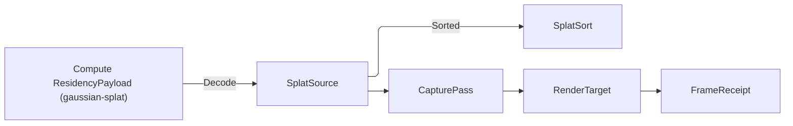

# [APPUI_REALITY_CAPTURE]

The reality-capture rail projects scanned existing-conditions geometry into the viewport beside BIM: `SplatSource` carries a Gaussian-splat ellipsoid set decoded from a Compute residency payload, `PointCloudSource` carries a massive point set decoded from the same carrier, and `CapturePass` projects both onto the render graph's active `RenderTarget`. `MeasureOverlay` anchors LiDAR measurement onto the `Viewpoint`, and `CaptureClip` scrubs a time-based capture frame on the animation playhead. The page owns the splat and point sources, raster passes, measurable overlay, and capture-frame clip; the substrate is the pipeline target lease, Compute residency payload, `Viewpoint` codec, and animation playhead. AppUi consumes compressed payload streams through `CaptureDecode` and never admits a scan-file decoder.

## [01]-[INDEX]

- [02]-[SPLAT_SOURCE]: SOG/PLY ellipsoid set off the Compute splat payload; radix-sort residency.
- [03]-[POINT_SOURCE]: LAZ-decoded point set off the Compute point payload; octree residency.
- [04]-[CAPTURE_PASS]: Splat and point `RenderPass` cases over the active render-graph target.
- [05]-[MEASURE_OVERLAY]: LiDAR-anchored measurable annotation bound to the `Viewpoint`.
- [06]-[CAPTURE_CLIP]: Time-based capture-frame playback on the animation playhead.

## [02]-[SPLAT_SOURCE]

- Owner: `SplatEllipsoid` the single anisotropic 3D-Gaussian; `SplatSource` the decoded ellipsoid set over the ONE Compute `ResidencyPayload` carrier; `SplatSort` the view-dependent radix-sort fold; `CaptureFault` the typed fault family on the `AppUiFaultBand.Capture` registry row (6130).
- Cases: `CaptureFault` = Text | PayloadMalformed | BackendUnsupported | DecodeDeferred | SnapAbsent — codes derive through the `AppUiFaultBand.Capture` registry row (6130), each case holding the ordinal it was allocated so a retired case leaves its ordinal spent rather than shifting every wire code below it.
- Entry: `public static Fin<SplatSource> Decode(GpuBackend backend, ResidencyPayload payload, ResidencyBudget budget, CaptureDecode decode)` projects a gaussian-splat `ResidencyPayload` into the residency-keyed ellipsoid set under the admission ladder kind → resident count → payload bytes → residency watermark. `CaptureDecode.Decode` returns the `CaptureDecoded.Splats` case from the canonical `Blob`/`Layout` columns; an oversized monolithic payload fails `CaptureFault.DecodeDeferred`, directing the producer to the per-cell `CaptureTileSet.Resident` path.
- Auto: each ellipsoid carries its mean position, the three scale magnitudes, the rotation quaternion, the spherical-harmonic color coefficients, and the opacity, so a `SplatSource` is the decoded SOG (self-organizing-gaussian) or PLY ellipsoid set the Compute payload streams; `SplatSort` radix-sorts the ellipsoids back-to-front per view by their projected depth so the alpha-composited rasterization composites in order — the 3DGS draw demands depth-sorted ellipsoids and the radix sort is the per-view fold the pass re-runs on a camera change; the ellipsoid bytes stream from the Persistence blob lane through the residency budget exactly as the meshlet tiles do, so a massive splat scene stays VRAM-bounded; the splat tile keys by the PAYLOAD'S OWN `ContentKey` per the single-mint law — a local re-hash over raw component floats is the DELETED form (doubly foreclosed by the kernel one-hasher law: no AppUi-side content-key fold exists beside `ContentHash.Of`), so residency keys the splat tile identically to the meshlet tile.
- Packages: Thinktecture.Runtime.Extensions, LanguageExt.Core, Rasm.Compute (project)
- Growth: a new splat attribute is one `SplatEllipsoid` field; a new sort policy is one `SplatSort` value; a new fault is one `CaptureFault` case; zero new surface.
- Boundary: the splat source consumes the one Compute `ResidencyPayload` boundary record that `Render/pipeline.md` already projects. `CaptureDecode` is the composition-bound interpreter for the payload's compressed `Blob` and typed `Layout`; the AppUi owner never invents flat payload members or assumes native struct packing. The radix sort runs an LSD radix over 32-bit quantized view-aligned depth keys, discriminated by `SplatSort.RadixDepth` versus `RadixTile`, its view basis the `Render/pathtrace#BSDF_SHADING` `OracleFrame.OfCamera` triad — the compilation unit's one camera-basis and unit/cross owner, a page-local copy the deleted form. Residency keying rides `ResidencyBudget`, and `CapturePass` draws only through the active target supplied by `RenderGraph`.

```csharp signature
[Union]
public abstract partial record CaptureFault : Expected, IValidationError<CaptureFault> {
    private CaptureFault(string detail, int code) : base(detail, code, None) { }

    public static CaptureFault Create(string message) => new Text(message);

    public sealed record Text : CaptureFault { public Text(string detail) : base(detail, AppUiFaultBand.Capture.Code(0)) { } }
    public sealed record PayloadMalformed : CaptureFault { public PayloadMalformed(string detail) : base(detail, AppUiFaultBand.Capture.Code(1)) { } }
    public sealed record BackendUnsupported : CaptureFault { public BackendUnsupported(string detail) : base(detail, AppUiFaultBand.Capture.Code(3)) { } }
    public sealed record DecodeDeferred : CaptureFault { public DecodeDeferred(string detail) : base(detail, AppUiFaultBand.Capture.Code(4)) { } }
    public sealed record SnapAbsent : CaptureFault { public SnapAbsent(string detail) : base(detail, AppUiFaultBand.Capture.Code(5)) { } }
}

public readonly record struct SplatEllipsoid(
    float MeanX, float MeanY, float MeanZ,
    float ScaleX, float ScaleY, float ScaleZ,
    float RotX, float RotY, float RotZ, float RotW,
    float Opacity,
    int HarmonicOffset) {
    public BoundingSphere Bounds =>
        new(MeanX, MeanY, MeanZ, MathF.Max(ScaleX, MathF.Max(ScaleY, ScaleZ)) * 3f);

}

// The ONE payload carrier is the Compute ResidencyPayload, and one decoder dispatches its Kind into this
// closed result family. AppUi never invents flat byte members or reinterprets encoded bytes as structs.
[Union(ConversionFromValue = ConversionOperatorsGeneration.None)]
public abstract partial record CaptureDecoded {
    private CaptureDecoded() { }
    public sealed record Splats(Seq<SplatEllipsoid> Ellipsoids, ReadOnlyMemory<float> Harmonics) : CaptureDecoded;
    public sealed record Points(Seq<PointSample> Samples, int OctreeDepth) : CaptureDecoded;
}

public sealed record CaptureDecode(Func<ResidencyPayload, Fin<CaptureDecoded>> Decode);

[SmartEnum<string>]
public sealed partial class SplatSort {
    public static readonly SplatSort RadixDepth = new("radix-depth");
    public static readonly SplatSort RadixTile = new("radix-tile");
}

public sealed record SplatSource(
    GpuBackend Backend,
    UInt128 ContentKey,
    Seq<SplatEllipsoid> Ellipsoids,
    ReadOnlyMemory<float> Harmonics,
    SplatSort Sort,
    int HarmonicDegree,
    BoundingSphere Bounds) {
    // Admission ladder: kind -> non-empty -> composition-bound decode -> residency watermark; an oversized
    // payload DEFERS (CaptureFault.DecodeDeferred) so materialization stays
    // budget-bounded and the residency lane streams it instead of a whole-scene VRAM spike.
    public static Fin<SplatSource> Decode(GpuBackend backend, ResidencyPayload payload, ResidencyBudget budget, CaptureDecode decode) =>
        payload.Kind != ResidencyKind.GaussianSplat
            ? Fin.Fail<SplatSource>(new CaptureFault.PayloadMalformed($"splat/kind:{payload.Kind}"))
            : payload.ResidentCount <= 0
                ? Fin.Fail<SplatSource>(new CaptureFault.PayloadMalformed($"splat/empty:{ResidencyMarshal.KeyHex(payload.ContentKey)}"))
            : payload.EncodedBytes > budget.Watermark
                ? Fin.Fail<SplatSource>(new CaptureFault.DecodeDeferred($"splat/oversized:{payload.EncodedBytes}b > {budget.Watermark}b"))
                : decode.Decode(payload).Bind(decoded => decoded is CaptureDecoded.Splats splats
                    ? Fin.Succ(new SplatSource(
                        backend, payload.ContentKey, splats.Ellipsoids, splats.Harmonics,
                        SplatSort.RadixDepth, payload.HarmonicDegree, BoundsOf(payload)))
                    : Fin.Fail<SplatSource>(new CaptureFault.PayloadMalformed($"splat/decode:{ResidencyMarshal.KeyHex(payload.ContentKey)}")));

    // The sort policy is selected where the PASS is built, because tile coherence is a multi-tile property:
    // `CaptureTileSet.Resident` takes `RadixTile` for a resident set spanning more than one tile and
    // `RadixDepth` for a single source, so both rows have an admission and neither is an unreachable branch.
    // REAL LSD radix sort over 32-bit keys DISCRIMINATED by the SplatSort row: RadixDepth quantizes the
    // VIEW-ALIGNED depth (projection onto the camera forward axis) back-to-front across the full key;
    // RadixTile packs a 16x16 screen-tile id (lateral view-basis coordinates over the source bounds)
    // into the top byte with the quantized depth below it, so compositing stays tile-coherent.
    public Seq<SplatEllipsoid> Sorted(ViewCamera camera) {
        int count = Ellipsoids.Count;
        if (count <= 1) { return Ellipsoids; }
        CameraFrame frame = camera.Frame;
        // ONE camera triad — the pathtrace OracleFrame.OfCamera owner shared with the HZB projection and the
        // primary-ray fold, so the sort's view basis cannot drift from the basis the render reads.
        ((double fx, double fy, double fz), (double rx, double ry, double rz), (double ux, double uy, double uz)) = OracleFrame.OfCamera(frame);
        (uint[] keys, int[] order, double[] depths) = (new uint[count], new int[count], new double[count]);
        double maxDepth = 1e-9;
        for (int at = 0; at < count; at++) {
            SplatEllipsoid splat = Ellipsoids[at];
            depths[at] = ((splat.MeanX - frame.Eye.X) * fx) + ((splat.MeanY - frame.Eye.Y) * fy) + ((splat.MeanZ - frame.Eye.Z) * fz);
            maxDepth = Math.Max(maxDepth, depths[at]);
        }
        double lateralSpan = Math.Max(Bounds.Radius * 2d, 1e-9);
        for (int at = 0; at < count; at++) {
            SplatEllipsoid splat = Ellipsoids[at];
            uint depthKey = uint.MaxValue - (uint)(Math.Clamp(depths[at] / maxDepth, 0d, 1d) * uint.MaxValue); // back-to-front
            if (Sort == SplatSort.RadixTile) {
                (double cx, double cy, double cz) = (splat.MeanX - frame.Eye.X, splat.MeanY - frame.Eye.Y, splat.MeanZ - frame.Eye.Z);
                uint tx = (uint)Math.Clamp(((((cx * rx) + (cy * ry) + (cz * rz)) / lateralSpan) + 0.5d) * 16d, 0d, 15d);
                uint ty = (uint)Math.Clamp(((((cx * ux) + (cy * uy) + (cz * uz)) / lateralSpan) + 0.5d) * 16d, 0d, 15d);
                keys[at] = (((ty << 4) | tx) << 24) | (depthKey >> 8);
            } else { keys[at] = depthKey; }
            order[at] = at;
        }
        (uint[] scratchKeys, int[] scratchOrder, int[] counts) = (new uint[count], new int[count], new int[256]);
        for (int shift = 0; shift < 32; shift += 8) {
            Array.Clear(counts);
            for (int at = 0; at < count; at++) { counts[(keys[at] >> shift) & 0xFF]++; }
            for (int bucket = 1; bucket < 256; bucket++) { counts[bucket] += counts[bucket - 1]; }
            for (int at = count - 1; at >= 0; at--) {
                int slot = --counts[(keys[at] >> shift) & 0xFF];
                scratchKeys[slot] = keys[at];
                scratchOrder[slot] = order[at];
            }
            (keys, scratchKeys) = (scratchKeys, keys);
            (order, scratchOrder) = (scratchOrder, order);
        }
        return toSeq(order.Select(at => Ellipsoids[at]));
    }

    private static BoundingSphere BoundsOf(ResidencyPayload payload) =>
        new(payload.Center.X, payload.Center.Y, payload.Center.Z, payload.Radius);
}
```


```mermaid
---
config:
  layout: elk
  flowchart:
    curve: linear
    padding: 25
---
flowchart LR
    accTitle: Reality capture rendering flow
    accDescr: Residency payloads decode into splat and point sources that execute as capture passes on the active target.
    Payload["Compute ResidencyPayload (gaussian-splat)"] -->|Decode| SplatSource
    SplatSource -->|Sorted| SplatSort
    SplatSource --> CapturePass
    CapturePass --> RenderTarget
    RenderTarget --> FrameReceipt
```

## [03]-[POINT_SOURCE]

- Owner: `PointSample` the single LiDAR return; `PointClass` `[SmartEnum<byte>]` the ASPRS classification vocabulary carrying each standard code's own colour; `PointCloudSource` the decoded point set; `PointOctree` the level-of-detail residency tree.
- Entry: `public static Fin<PointCloudSource> Decode(GpuBackend backend, ResidencyPayload payload, ResidencyBudget budget, CaptureDecode decode)` projects a point-splat `ResidencyPayload` into the octree-keyed point set under the same kind → resident count → payload bytes → watermark ladder. `CaptureDecode.Decode` returns the `CaptureDecoded.Points` case plus octree depth; an oversized monolithic cloud fails `CaptureFault.DecodeDeferred`, while `CaptureTileSet.Resident` executes the tiled path.
- Auto: each point carries its position, the classification byte, the intensity, and the RGB color so a `PointCloudSource` is the decoded scan return set the Compute payload streams; `PointOctree` partitions the points into a spatial octree in ONE Morton-ordered pass — the leaf code's high `3*level` bits ARE that level's cell key, so every level is a prefix of one ordering, the leaf cells are its sorted runs, and each coarser level FOLDS the level below it (bounds, count, and the child union taken at `SampleStride`) rather than re-sweeping all N points; every level therefore ships a drawable run, so a massive cloud renders the coarse subsample at distance and the full density up close, pop-free because adjacent levels share locked node boundaries exactly as the meshlet cluster-LOD shares cluster boundaries; the octree nodes key into the residency budget by their Morton cell key — the code is the one cell identity and each node recovers its cell index from it rather than carrying a redundant triple — and the per-cell payload census streams through `CaptureTileSet.Resident` so a billion-point cloud stays VRAM-bounded by the plan itself and adjacent cells sort near for tile-coherent upload; the classification byte resolves through the categorical `PointClass` row table, because ASPRS codes are a nominal vocabulary and a sequential lightness-monotone ramp over names asserts an order the codes do not carry.
- Packages: Thinktecture.Runtime.Extensions, LanguageExt.Core, Rasm.Compute (project)
- Growth: a new point attribute is one `PointSample` field; a new classification code is one `PointClass` row; a new LOD policy is one octree subsample value; zero new surface.
- Boundary: the point source projects off the one Compute `ResidencyPayload` boundary record. Offline LAZ/scan decode crosses as a Compute payload, so AppUi carries no LAZ decoder. Octree LOD and the shared `ResidencyBudget` govern massive clouds; GPU point splatting records through the active render-graph target, and the CPU octree subsample supplies the deterministic 2D fallback.

```csharp signature
public readonly record struct PointSample(
    float X, float Y, float Z,
    byte Classification,
    ushort Intensity,
    byte R, byte G, byte B) {
    public (double X, double Y, double Z) Position => (X, Y, Z);
}

// ASPRS LAS classification is a NOMINAL vocabulary keyed by the wire byte, not a scalar. Projecting the code
// through a sequential lightness-monotone ramp orders ground under building under vegetation as if the codes
// measured a quantity — two unrelated classes read as neighbours, one class reads as MORE than another, and the
// ramp's whole perceptual guarantee is spent on an axis that has no order. Each standard code carries its own
// ARGB as row DATA; the reserved and user-definable blocks carry no row, so an unlisted code is a typed miss the
// draw answers with the return's own stored RGB rather than an invented pigment.
[SmartEnum<byte>]
public sealed partial class PointClass {
    public static readonly PointClass Created = new(0, 0xFF9E9E9Eu);
    public static readonly PointClass Unclassified = new(1, 0xFFBDBDBDu);
    public static readonly PointClass Ground = new(2, 0xFF8D6E63u);
    public static readonly PointClass LowVegetation = new(3, 0xFF9CCC65u);
    public static readonly PointClass MediumVegetation = new(4, 0xFF66BB6Au);
    public static readonly PointClass HighVegetation = new(5, 0xFF2E7D32u);
    public static readonly PointClass Building = new(6, 0xFFEF5350u);
    public static readonly PointClass LowPoint = new(7, 0xFF6D4C41u);
    public static readonly PointClass Water = new(9, 0xFF29B6F6u);
    public static readonly PointClass Rail = new(10, 0xFF8E24AAu);
    public static readonly PointClass RoadSurface = new(11, 0xFF455A64u);
    public static readonly PointClass WireGuard = new(13, 0xFFFFB300u);
    public static readonly PointClass WireConductor = new(14, 0xFFFFEE58u);
    public static readonly PointClass TransmissionTower = new(15, 0xFFFF7043u);
    public static readonly PointClass WireConnector = new(16, 0xFFAB47BCu);
    public static readonly PointClass BridgeDeck = new(17, 0xFF26A69Au);
    public static readonly PointClass HighNoise = new(18, 0xFFE91E63u);

    public uint Argb { get; }
}

public sealed record PointOctreeNode(
    UInt128 ContentKey,
    uint Morton,
    int Level,
    BoundingSphere Bounds,
    int SampleStride,
    long Count,
    Seq<int> Samples);

public sealed record PointCloudSource(
    GpuBackend Backend,
    UInt128 ContentKey,
    Seq<PointSample> Points,
    Seq<PointOctreeNode> Octree,
    BoundingSphere Bounds) {
    // The SAME admission ladder as the splat arm: kind -> non-empty -> exact wire layout -> residency
    // watermark; an oversized cloud DEFERS so the octree residency streams it instead of materializing.
    public static Fin<PointCloudSource> Decode(GpuBackend backend, ResidencyPayload payload, ResidencyBudget budget, CaptureDecode decode) =>
        payload.Kind != ResidencyKind.PointSplat
            ? Fin.Fail<PointCloudSource>(new CaptureFault.PayloadMalformed($"point/kind:{payload.Kind}"))
            : payload.ResidentCount <= 0
                ? Fin.Fail<PointCloudSource>(new CaptureFault.PayloadMalformed($"point/empty:{ResidencyMarshal.KeyHex(payload.ContentKey)}"))
            : payload.EncodedBytes > budget.Watermark
                ? Fin.Fail<PointCloudSource>(new CaptureFault.DecodeDeferred($"point/oversized:{payload.EncodedBytes}b > {budget.Watermark}b"))
                : decode.Decode(payload).Bind(decoded => decoded is CaptureDecoded.Points points
                    ? Fin.Succ(Materialized(backend, payload, (points.Samples, points.OctreeDepth)))
                    : Fin.Fail<PointCloudSource>(new CaptureFault.PayloadMalformed($"point/decode:{ResidencyMarshal.KeyHex(payload.ContentKey)}")));

    // Point LOD reads the SAME camera-projected error the meshlet cut reads, so `lodScale` keeps one meaning
    // estate-wide: a node draws where its own cell radius projects below the pixel threshold and its parent
    // cell does not, which is the half-open partition the geometry cut already holds. Truncating an error
    // multiplier into an octree depth ignores the camera entirely and gives one parameter two meanings.
    public Seq<PointOctreeNode> Visible(Frustum frustum, ViewCamera camera, double lodScale, LodPolicy lod) =>
        Octree.Filter(node =>
            frustum.Intersects(node.Bounds)
            && ClusterCull.Projected(node.Bounds.Radius, node.Bounds, camera) * lodScale <= lod.PixelThreshold
            && (node.Level == 0 || ClusterCull.Projected(node.Bounds.Radius * 2d, node.Bounds, camera) * lodScale > lod.PixelThreshold));

    public Option<MeasurePoint> Nearest(
        (double X, double Y, double Z) requested,
        UnitsNet.Length tolerance) {
        if (Octree.IsEmpty) { return None; }
        int leaf = Octree.Map(static node => node.Level).Max();
        double reach = tolerance.Meters;
        // One min-fold answers the nearest candidate: an O(n log n) sort read only at its head, and the
        // phantom Seq.HeadOrNone it fed, are both the deleted form — Seq carries Head as an Option property.
        return Octree
            .Filter(node => node.Level == leaf && Distance(requested, (node.Bounds.X, node.Bounds.Y, node.Bounds.Z)) <= reach + node.Bounds.Radius)
            .Bind(static node => node.Samples)
            .Distinct()
            .Map(index => (Index: index, Sample: Points[index], Gap: Distance(requested, Points[index].Position)))
            .Filter(candidate => candidate.Gap <= reach)
            .Fold(
                Option<(int Index, PointSample Sample, double Gap)>.None,
                static (best, candidate) => best.Match(
                    Some: held => candidate.Gap < held.Gap ? Some(candidate) : best,
                    None: () => Some(candidate)))
            .Map(candidate => new MeasurePoint(ContentKey, candidate.Index, candidate.Sample));
    }

    private static PointCloudSource Materialized(
        GpuBackend backend,
        ResidencyPayload payload,
        (Seq<PointSample> Points, int OctreeDepth) decoded) =>
        new(backend, payload.ContentKey, decoded.Points, Octree(payload, decoded.Points, decoded.OctreeDepth),
            new BoundingSphere(payload.Center.X, payload.Center.Y, payload.Center.Z, payload.Radius));

    // A REAL spatial octree in ONE Morton-ordered pass. Level L partitions the bounding cube into 2^L divisions
    // per axis, occupied cells only, each node carrying ITS cell bounds, its resident count, and the coarse-level
    // SampleStride (1 << (leaf-level)) the LOD subsample reads. The leaf Morton code's high 3*L bits ARE level L's
    // cell key, so every level is a PREFIX of one ordering and the depth-times-N GroupBy sweep over all points is
    // deleted: the leaf cells fall out of the sorted runs, and each coarser level FOLDS the level below it —
    // bounds, count, and a strided sample union — so no level re-reads the point set and a distance draw gets a
    // real subsample rather than an empty run.
    private static Seq<PointOctreeNode> Octree(ResidencyPayload payload, Seq<PointSample> points, int decodedDepth) {
        int leaf = int.Max(decodedDepth, 1) - 1;
        (float ox, float oy, float oz) = (payload.Center.X - payload.Radius, payload.Center.Y - payload.Radius, payload.Center.Z - payload.Radius);
        float span = float.Max(payload.Radius * 2f, 1e-6f);
        float leafCell = span / (1 << leaf);
        IGrouping<uint, int>[] runs = [.. points
            .Select((point, index) => (Code: Morton(Cell(point, ox, oy, oz, leafCell, 1 << leaf)), Index: index))
            .OrderBy(static row => row.Code)
            .GroupBy(static row => row.Code, static row => row.Index)];
        Seq<PointOctreeNode> finest = toSeq(runs.Select(run => Node(
            payload, run.Key, leaf, leaf, span, ox, oy, oz, run.LongCount(), toSeq(run))));
        return toSeq(Enumerable.Range(0, leaf).Reverse())
            .Fold((Tree: finest, Finer: finest), (state, level) =>
                Coarsened(payload, state.Finer, level, leaf, span, ox, oy, oz) switch {
                    var coarser => (state.Tree + coarser, coarser),
                }).Tree;
    }

    // One coarse level folded off the level below: the eight children sharing a 3-bit Morton prefix are one cell,
    // its count their sum, and its sample run their union taken at THIS level's stride — so `SampleStride` is a
    // read column the draw consumes rather than a decoration, and a coarse node is drawable.
    private static Seq<PointOctreeNode> Coarsened(
        ResidencyPayload payload, Seq<PointOctreeNode> finer, int level, int leaf, float span, float ox, float oy, float oz) =>
        toSeq(finer
            .GroupBy(static child => child.Morton >> 3)
            .Select(run => Node(
                payload, run.Key, level, leaf, span, ox, oy, oz,
                run.Sum(static child => child.Count),
                toSeq(run
                    .SelectMany(static child => child.Samples)
                    .Where((_, at) => at % (1 << (leaf - level)) == 0)))));

    // One node from its Morton code: the code's per-axis digits recover the cell index, the cell's circumsphere
    // radius is half its diagonal (cell x sqrt(3)/2), and the stride is this level's own subsample step.
    private static PointOctreeNode Node(
        ResidencyPayload payload, uint morton, int level, int leaf, float span, float ox, float oy, float oz,
        long count, Seq<int> samples) =>
        (Cell: span / (1 << level), Index: Unspread(morton)) switch {
            var seat => new PointOctreeNode(
                payload.ContentKey, morton, level,
                new BoundingSphere(
                    ox + ((seat.Index.X + 0.5f) * seat.Cell),
                    oy + ((seat.Index.Y + 0.5f) * seat.Cell),
                    oz + ((seat.Index.Z + 0.5f) * seat.Cell),
                    seat.Cell * 0.8660254f),
                1 << (leaf - level), count, samples),
        };

    private static double Distance((double X, double Y, double Z) a, (double X, double Y, double Z) b) =>
        Math.Sqrt(Math.Pow(a.X - b.X, 2d) + Math.Pow(a.Y - b.Y, 2d) + Math.Pow(a.Z - b.Z, 2d));

    private static (int X, int Y, int Z) Cell(PointSample p, float ox, float oy, float oz, float cell, int divisions) =>
        ((int)float.Clamp((p.X - ox) / cell, 0f, divisions - 1),
         (int)float.Clamp((p.Y - oy) / cell, 0f, divisions - 1),
         (int)float.Clamp((p.Z - oz) / cell, 0f, divisions - 1));

    // 10-bit-per-axis 3D Morton interleave — the compact residency cell key adjacent cells sort near.
    private static uint Morton((int X, int Y, int Z) cell) =>
        Spread((uint)cell.X) | (Spread((uint)cell.Y) << 1) | (Spread((uint)cell.Z) << 2);

    private static uint Spread(uint v) {
        v &= 0x3FF;
        v = (v | (v << 16)) & 0x030000FF;
        v = (v | (v << 8)) & 0x0300F00F;
        v = (v | (v << 4)) & 0x030C30C3;
        return (v | (v << 2)) & 0x09249249;
    }

    // The interleave inverted: a node recovers its cell index from the code it is keyed by, so the code is the
    // ONE cell identity and no node carries a redundant (x, y, z) triple beside it.
    private static (int X, int Y, int Z) Unspread(uint morton) =>
        ((int)Gather(morton), (int)Gather(morton >> 1), (int)Gather(morton >> 2));

    private static uint Gather(uint v) {
        v &= 0x09249249;
        v = (v | (v >> 2)) & 0x030C30C3;
        v = (v | (v >> 4)) & 0x0300F00F;
        v = (v | (v >> 8)) & 0x030000FF;
        return (v | (v >> 16)) & 0x3FF;
    }
}
```

## [04]-[CAPTURE_PASS]

- Owner: `CapturePass` `[Union]` the reality-capture render-pass family; `CaptureVisual` the pass-to-`RenderPass` projection; `SplatPlacement` the projected-and-shaded splat value; `CaptureRaster` the Skia CPU composite floor both draw delegates bind when no GPU backend row claims them; `CaptureTileSet` the out-of-core continuation folding the `Render/meshlets` `ResidencyPlan` into decoded per-tile capture passes.
- Cases: `CapturePass` = Splat | Point under the locked kind literals splat, point.
- Law: a massive scan arrives as MANY per-cell Compute payloads — each under the watermark, each carrying its OWN `ContentKey` — and `CaptureTileSet.Resident` folds the ONE `ResidencyBudget` plan into decoded passes: only admitted, frustum-visible tiles decode, an evicted tile's decode drops with its plan row, and the resident byte total is the plan's own bound, so the billion-point and whole-city-splat cases have a REPRESENTABLE executable path and whole-cloud materialization never occurs; the `DecodeDeferred` fault narrows to a monolithic payload above the watermark — the typed instruction that the producer must deliver the tiled census.
- Entry: `public RenderPass Pass()` projects the capture source into one viewport `RenderPass` case. The render graph hands its already leased `RenderTarget` to the composition-bound splat or point draw delegate, so the pass cannot allocate a nested target or leak a second native lease.
- Auto: both cases emit one `Geometry`-family `RenderPass` over the active target. The composition-bound draw delegate owns backend divergence below the pass algebra, and its returned primitive count feeds the same frame-budget verdict as meshlet geometry. `CaptureRaster` is the floor those delegates bind: a Gaussian splat is a similarity transform of ONE kernel sprite, so the whole sorted ellipsoid set composites in a SINGLE `DrawAtlas` over `SKRotationScaleMatrix.Create` transforms under `SKBlendMode.Plus`, and a resident point cell composites in a SINGLE `DrawVertices` over one `SKVertices.CreateCopy` batch — N per-primitive draw calls are the deleted form on both arms.
- Packages: Thinktecture.Runtime.Extensions, LanguageExt.Core, SkiaSharp
- Growth: a new capture render path is one `CapturePass` case plus its `CaptureTileSet.Resident` dispatch arm; a retuned point footprint is one `CaptureRaster.PointRadius` value; zero new surface.
- Boundary: the capture pass is a viewport `RenderPass` case, so reality-capture geometry and BIM geometry share one graph and one target lease. The splat and point delegates consume the active `RenderTarget`; allocating through `GpuBinding.Target` inside a pass creates a nested native lease and is rejected. Backend divergence stays inside the composition-bound draw delegates, with `CaptureRaster` as the floor: it draws only into `RenderTarget.Surface`, so a target leased from a GPU backend row refuses as `CaptureFault.BackendUnsupported` rather than drawing nowhere. The floor's back-to-front ordering IS `SplatSort.RadixDepth` realized on the projected depth `SplatPlacement` already carries — the radix variants are the GPU path's key-quantized form of that SAME order, not a second ordering, so the two paths composite identically. `SKVertexMode` carries no point mode and `DrawPoints` admits one paint, so per-return classification colour rides the three-vertex expansion; a single-paint point draw silently erases classification and is the rejected form.

```csharp signature
[Union(ConversionFromValue = ConversionOperatorsGeneration.None)]
public abstract partial record CapturePass(string Key) {
    public sealed record Splat(string Key, SplatSource Source, Func<RenderTarget, SplatSource, Fin<int>> Composite) : CapturePass(Key);
    public sealed record Point(string Key, PointCloudSource Source, Func<RenderTarget, PointCloudSource, Fin<int>> Splat) : CapturePass(Key);

    // Splat and point composites draw no triangles, so both arms charge zero and return zero drawn triangles
    // under the RenderPass.Geometry triangle contract — the pass-local primitive count stays each composite's own
    // Fin<int> measure and never folds into FrameReceipt.Triangles. Both take CutPhase.Whole: a capture composite
    // sits outside the meshlet occlusion ladder and consumes no phase of its cut, so naming a ladder phase here
    // would claim a scheduling position the pass does not hold, and its cut is the empty one either way.
    public RenderPass Pass() => Switch(
        splat: static s => (RenderPass)new RenderPass.Geometry(
            s.Key,
            CutPhase.Whole,
            static _ => 0L,
            (target, _, _) => s.Composite(target, s.Source).Map(static _ => 0L)),
        point: static p => new RenderPass.Geometry(
            p.Key,
            CutPhase.Whole,
            static _ => 0L,
            (target, _, _) => p.Splat(target, p.Source).Map(static _ => 0L)));
}

// Skia is the CPU floor both composites bind when no GPU backend row claims them. A Gaussian splat is
// a similarity transform of ONE kernel sprite — scale, in-plane rotation, translation — which is
// exactly SKRotationScaleMatrix, so the whole sorted ellipsoid set draws in a SINGLE DrawAtlas call
// rather than N per-ellipsoid draws: one atlas image, one sprite rect per ellipsoid, one transform per
// ellipsoid, one tint modulated by opacity, and SKBlendMode.Plus for the additive alpha composite the
// back-to-front order already sequenced. Points collapse the same way over SKVertices — one coloured
// batch drawn once, never a per-point DrawCircle loop.
// One projected splat: the similarity placement the atlas draw consumes, the view depth the composite
// orders on, and the shaded tint the spherical harmonics resolved to. The composition binds ONE delegate
// because projection, depth, and harmonic shading all read the same camera — a second knob would let the
// three drift apart.
public readonly record struct SplatPlacement(float Scale, float Radians, float X, float Y, float Depth, SKColor Tint);

public sealed record CaptureRaster(SKImage Kernel, SKSamplingOptions Sampling, SKRect Cull, float PointRadius) {
    // Every atlas sprite is the WHOLE kernel image; per-ellipsoid variation lives entirely in the
    // transform and the tint, so the sprite roster is one rect repeated and carries no per-splat state.
    // Projected depth IS the back-to-front order the alpha composite demands, so the sort is this draw's
    // own fold rather than a prior pass the caller must remember to run.
    public Fin<int> Composite(RenderTarget target, SplatSource source, Func<SplatSource, SplatEllipsoid, SplatPlacement> place) =>
        Raster(target, $"splat/{ResidencyMarshal.KeyHex(source.ContentKey)}", canvas => {
            SplatPlacement[] ordered = [.. source.Ellipsoids
                .Map(ellipsoid => place(source, ellipsoid))
                .OrderByDescending(static placement => placement.Depth)];
            SKRect sprite = SKRect.Create(Kernel.Width, Kernel.Height);
            float anchorX = Kernel.Width / 2f;
            float anchorY = Kernel.Height / 2f;
            SKRect[] sprites = [.. ordered.Select(_ => sprite)];
            SKRotationScaleMatrix[] transforms = [.. ordered.Select(placement =>
                SKRotationScaleMatrix.Create(placement.Scale, placement.Radians, placement.X, placement.Y, anchorX, anchorY))];
            SKColor[] tints = [.. ordered.Select(static placement => placement.Tint)];
            using SKPaint paint = new() { IsAntialias = true };
            canvas.DrawAtlas(Kernel, sprites, transforms, tints, SKBlendMode.Plus, Sampling, Cull, paint);
            return transforms.Length;
        });

    // Points draw as ONE coloured vertex batch, so a million-return cell is one DrawVertices and the
    // octree subsample stays the only density knob — a per-point DrawCircle loop is the deleted form.
    // SKVertexMode carries no point mode (Triangles, TriangleStrip, TriangleFan only) and DrawPoints
    // takes ONE paint, so per-return classification colour survives exactly one way: each return expands
    // to one screen-space triangle covering PointRadius whose three vertices carry that return's colour.
    // Classification colour reads the CATEGORICAL PointClass row, never a sequential ramp sampled at
    // code/255 — the ASPRS codes are names, and a lightness-monotone ramp over names asserts an order the
    // vocabulary does not carry. A code outside the standard block (reserved or user-definable) has no row and
    // falls to the return's own stored RGB rather than to an invented colour.
    public Fin<int> Points(RenderTarget target, PointCloudSource source, Func<PointSample, SKPoint> project) =>
        Raster(target, $"point/{ResidencyMarshal.KeyHex(source.ContentKey)}", canvas => {
            Seq<(SKPoint At, SKColor Tint)> placed = source.Points.Map(sample => (
                At: project(sample),
                Tint: PointClass.TryGet(sample.Classification, out PointClass? row)
                    ? new SKColor(row.Argb)
                    : new SKColor(sample.R, sample.G, sample.B)));
            SKPoint[] positions = [.. placed.Bind(point => Seq(
                new SKPoint(point.At.X, point.At.Y - PointRadius),
                new SKPoint(point.At.X - PointRadius, point.At.Y + PointRadius),
                new SKPoint(point.At.X + PointRadius, point.At.Y + PointRadius)))];
            SKColor[] colors = [.. placed.Bind(point => Seq(point.Tint, point.Tint, point.Tint))];
            using SKVertices vertices = SKVertices.CreateCopy(SKVertexMode.Triangles, positions, colors);
            using SKPaint paint = new() { IsAntialias = true };
            canvas.DrawVertices(vertices, SKBlendMode.SrcOver, paint);
            return placed.Count;
        });

    // The floor is a CPU floor by construction: it draws into the target's raster surface, and a target
    // leased from a GPU backend row carries none, so the mismatch refuses by name instead of drawing
    // nowhere. Both arms share this one admission — a second surface probe beside it is the deleted form.
    private static Fin<int> Raster(RenderTarget target, string key, Func<SKCanvas, int> draw) =>
        target.Surface.Match(
            Some: surface => Fin.Succ(draw(surface.Canvas)),
            None: () => Fin.Fail<int>(new CaptureFault.BackendUnsupported($"raster/{key}: {target.Backend.Key} leases no raster surface")));
}

// The out-of-core continuation: the census maps each per-cell payload by its OWN ContentKey, and Resident
// folds the meshlets ResidencyPlan into decoded passes — kind-dispatched through the same Decode admissions,
// budget-bounded by the plan itself, so an oversized scan streams as tiles and never materializes whole.
public sealed record CaptureTileSet(
    GpuBackend Backend,
    HashMap<UInt128, ResidencyPayload> Census,
    ResidencyBudget Budget,
    CaptureDecode Decode,
    Func<RenderTarget, SplatSource, Fin<int>> CompositeSplat,
    Func<RenderTarget, PointCloudSource, Fin<int>> SplatPoints) {
    // The resident set's own cardinality selects the splat sort: one tile sorts by depth alone, while a
    // multi-tile set sorts tile-major so adjacent cells composite coherently — the policy is a property of
    // the RESIDENT SET, so it is decided here rather than frozen at each source's decode.
    public Fin<Seq<CapturePass>> Resident(ResidencyPlan plan) =>
        plan.Resident.Choose(tile => Census.Find(tile.ContentKey)) switch {
            var payloads => payloads
                .Choose(payload => Sorted(payloads.Count) switch {
                    var sort => payload.Kind == ResidencyKind.PointSplat
                        ? Some(PointCloudSource.Decode(Backend, payload, Budget, Decode)
                            .Map(source => (CapturePass)new CapturePass.Point($"point/{ResidencyMarshal.KeyHex(payload.ContentKey)}", source, SplatPoints)))
                        : payload.Kind == ResidencyKind.GaussianSplat
                            ? Some(SplatSource.Decode(Backend, payload, Budget, Decode)
                                .Map(source => (CapturePass)new CapturePass.Splat(
                                    $"splat/{ResidencyMarshal.KeyHex(payload.ContentKey)}", source with { Sort = sort }, CompositeSplat)))
                            : Option<Fin<CapturePass>>.None,
                })
                .TraverseM(identity).As(),
        };

    private static SplatSort Sorted(int tiles) => tiles > 1 ? SplatSort.RadixTile : SplatSort.RadixDepth;
}
```

## [05]-[MEASURE_OVERLAY]

- Owner: `PointCloudSource.Nearest` the leaf-octree spatial query; `MeasurePoint` the content-keyed LiDAR sample identity; `MeasureOverlay` the annotation set bound to the `Viewpoint`.
- Entry: `public Fin<MeasureOverlay> Anchor(PointCloudSource cloud, (double X, double Y, double Z) requested, UnitsNet.Length tolerance)` — resolves the nearest resident LiDAR return within tolerance before folding distance and angle evidence; `public Viewpoint Bind(Viewpoint view)` — projects the overlay into the viewpoint's `ViewMeasurement` run.
- Auto: `PointCloudSource.Nearest` prunes the deepest octree cells by bounding sphere, compares their indexed sample runs, and returns the minimum-distance sample within the unit-typed tolerance. `MeasurePoint` preserves the source payload `ContentKey`, sample index, classification, intensity, and color through `PointSample`; `MeasureOverlay` folds segment distance and turning angles, and `Bind` projects source-addressed vertices into the portable `Viewpoint` receipt whose BCF codec emits the segments as `BcfLine` rows.
- Packages: Thinktecture.Runtime.Extensions, LanguageExt.Core, UnitsNet
- Growth: a new point attribute extends `PointSample`; a new derived measurement extends `ViewMeasurement`; zero new surface.
- Boundary: `Anchor` admits only an indexed resident sample within `tolerance`; an absent candidate returns `CaptureFault.SnapAbsent`, and a free-floating coordinate cannot enter `MeasureOverlay`. `Bind` projects onto `Viewpoint.Measurements`, so saved views, BCF lines, the browser wire, and capture review consume one source-addressed measurement identity. Distance and angle carry `UnitsNet.Length` and `UnitsNet.Angle`, and raw-double evidence never crosses the receipt.

```csharp signature
public readonly record struct MeasurePoint(UInt128 SourceKey, int SampleIndex, PointSample Sample) {
    public (double X, double Y, double Z) Position => Sample.Position;
}

public sealed record MeasureSegment(MeasurePoint From, MeasurePoint To, UnitsNet.Length Distance);

public sealed record MeasureOverlay(string Key, Seq<MeasurePoint> Vertices, Seq<MeasureSegment> Segments) {
    public static MeasureOverlay Empty(string key) => new(key, Seq<MeasurePoint>(), Seq<MeasureSegment>());

    public Fin<MeasureOverlay> Anchor(
        PointCloudSource cloud,
        (double X, double Y, double Z) requested,
        UnitsNet.Length tolerance) =>
        cloud.Nearest(requested, tolerance)
            .ToFin(new CaptureFault.SnapAbsent(
                $"measure/snap:{Key}:{tolerance.Meters.ToString("R", System.Globalization.CultureInfo.InvariantCulture)}m"))
            .Map(point => Vertices.Last.Match(
                None: () => this with { Vertices = Vertices.Add(point) },
                Some: previous => this with {
                    Vertices = Vertices.Add(point),
                    Segments = Segments.Add(new MeasureSegment(previous, point, Span(previous, point))),
                }));

    public UnitsNet.Length Total =>
        Segments.Fold(UnitsNet.Length.Zero, static (sum, segment) => sum + segment.Distance);

    // The per-interior-vertex turning angle between consecutive segments — the angle evidence a polyline
    // measurement reads beside its running length.
    public Seq<UnitsNet.Angle> Angles =>
        Segments.Zip(Segments.Tail).Map(static pair => Turn(pair.Item1, pair.Item2)).ToSeq();

    public Viewpoint Bind(Viewpoint view) =>
        view with {
            Measurements = view.Measurements.Add(new ViewMeasurement(
                Key,
                Vertices.Map(static point => new ViewMeasurementPoint(
                    point.SourceKey,
                    point.SampleIndex,
                    new System.Numerics.Vector3((float)point.Position.X, (float)point.Position.Y, (float)point.Position.Z))),
                Total,
                Angles)),
        };

    private static UnitsNet.Length Span(MeasurePoint a, MeasurePoint b) =>
        UnitsNet.Length.FromMeters(Math.Sqrt(
            Math.Pow(b.Position.X - a.Position.X, 2d)
            + Math.Pow(b.Position.Y - a.Position.Y, 2d)
            + Math.Pow(b.Position.Z - a.Position.Z, 2d)));

    private static UnitsNet.Angle Turn(MeasureSegment ab, MeasureSegment bc) {
        (double ux, double uy, double uz) = (
            ab.To.Position.X - ab.From.Position.X,
            ab.To.Position.Y - ab.From.Position.Y,
            ab.To.Position.Z - ab.From.Position.Z);
        (double vx, double vy, double vz) = (
            bc.To.Position.X - bc.From.Position.X,
            bc.To.Position.Y - bc.From.Position.Y,
            bc.To.Position.Z - bc.From.Position.Z);
        double dot = ((ux * vx) + (uy * vy) + (uz * vz))
            / (Math.Max(Math.Sqrt((ux * ux) + (uy * uy) + (uz * uz)) * Math.Sqrt((vx * vx) + (vy * vy) + (vz * vz)), double.Epsilon));
        return UnitsNet.Angle.FromDegrees(Math.Acos(Math.Clamp(dot, -1d, 1d)) * 180d / Math.PI);
    }
}
```

## [06]-[CAPTURE_CLIP]

- Owner: `CaptureFrame` the time-stamped capture epoch; `CaptureClip` the capture-frame playback bound to the animation playhead.
- Entry: `public Fin<Track> OnTimeline(string key)` — projects the capture epochs through the animation `Track.OfFieldIndex` admission rail so a multi-epoch scan scrubs on the one playhead under the sorted non-empty track invariant; the capture frame is a field index, never a wall-clock tick, and an epoch-free clip faults typed.
- Auto: each capture frame carries its epoch instant and its payload key so a multi-epoch reality capture (a construction-progress scan series) reads one frame per epoch; the clip projects the epochs onto an animation `FieldIndex` track so the capture-frame scrub rides the one deterministic playhead the kinematic camera and the transient field scrub share — a construction-progress scrub and a camera fly-through animate on the same timeline; the frame index selects the active `SplatSource`/`PointCloudSource` payload key so scrubbing the playhead swaps the rendered capture epoch.
- Packages: Thinktecture.Runtime.Extensions, LanguageExt.Core, NodaTime
- Growth: a new capture epoch is one `CaptureFrame` row; zero new surface.
- Boundary: the capture-frame scrub is an animation `FieldIndex` track so the capture playback rides the one playhead and a second capture timeline is the deleted form — the same frame-indexed deterministic clock the transient field scrub uses; the frame index selects the active capture payload so a wall-clock capture playback is the rejected form; the capture clip mints no second scrub owner and the animation `Scrub` drives it.

```csharp signature
public readonly record struct CaptureFrame(int Index, Instant Epoch, UInt128 PayloadKey);

public sealed record CaptureClip(string Key, Seq<CaptureFrame> Frames) {
    public Option<CaptureFrame> At(int index) => Frames.Find(frame => frame.Index == index);

    // Routes through the Track.OfFieldIndex admission rail so the sorted non-empty track invariant holds
    // at construction; an epoch-free clip faults typed instead of dereferencing an absent head.
    public Fin<Track> OnTimeline(string key) =>
        Frames.Head.Match(
            None: () => Fin.Fail<Track>(new CaptureFault.PayloadMalformed($"clip/empty:{Key}")),
            Some: head => Track.OfFieldIndex(key, Frames.Map(frame => new Keyframe<int>(
                frame.Epoch - head.Epoch, frame.Index, MotionToken.Standard)).ToSeq()));
}
```

## [07]-[CAPTURE_BOUNDARY]

- [CAPTURE_PAYLOAD]: `CaptureDecode` projects the canonical Compute `ResidencyPayload.Blob`/`Layout` pair into `SplatEllipsoid` or `PointSample` runs while retaining `ContentKey`, `Center`, `Radius`, `ResidentCount`, and `HarmonicDegree` from the payload owner. No `SplatPayload`, `PointPayload`, native cast, or invented primitive accessor exists on the AppUi side.
- [CAPTURE_GPU]: the composition-bound Gaussian-splat and point-splat delegates record against the active `RenderTarget`; bindless tile upload resolves against the host-shared GPU context. Decode, radix sort, octree LOD, source-addressed spatial measurement, and capture-frame playback form the CPU path, while GPU rasterization remains a render-pass delegate under the same target lease.
- [CAPTURE_DECODE]: offline LAZ/E57/SOG decoding remains the geometry producer's responsibility and crosses to AppUi as the compressed canonical Compute `ResidencyPayload`. The composition root supplies `CaptureDecode` against that payload's declared stream layout; AppUi carries no scan-file decoder and admits no parallel payload carrier.

## [08]-[RESEARCH]

(none)
