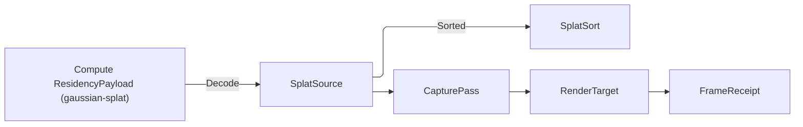

# [APPUI_REALITY_CAPTURE]

The reality-capture rail projects scanned existing-conditions geometry into the viewport beside BIM: `SplatSource` carries a Gaussian-splat ellipsoid set decoded from a Compute residency payload, `PointCloudSource` carries a massive point set decoded from the same carrier, and `CapturePass` projects both onto the render graph's active `RenderTarget`. `MeasureOverlay` anchors LiDAR measurement onto the `Viewpoint`, and `CaptureClip` scrubs a time-based capture frame on the animation playhead. The page owns the splat and point sources, raster passes, measurable overlay, and capture-frame clip; the substrate is the pipeline target lease, Compute residency payload, `Viewpoint` codec, and animation playhead. AppUi consumes compressed payload streams through `CaptureDecode` and never admits a scan-file decoder.

## [01]-[INDEX]

- [02]-[SPLAT_SOURCE]: SOG/PLY ellipsoid set off the Compute splat payload; radix-sort residency.
- [03]-[POINT_SOURCE]: LAZ-decoded point set off the Compute point payload; kernel-built octree residency.
- [04]-[CAPTURE_PASS]: Splat and point `RenderPass` cases over the active render-graph target.
- [05]-[MEASURE_OVERLAY]: LiDAR-anchored measurable annotation bound to the `Viewpoint`.
- [06]-[CAPTURE_CLIP]: Time-based capture-frame playback on the animation playhead.

## [02]-[SPLAT_SOURCE]

- Owner: `SplatEllipsoid` the single anisotropic 3D-Gaussian; `SplatSource` the decoded ellipsoid set over the ONE Compute `ResidencyPayload` carrier; `SplatSort` the view-dependent radix-sort fold; `CaptureFault` the typed fault family on the `AppUiFaultBand.Capture` registry row (6130).
- Cases: `CaptureFault` = Text | PayloadMalformed | BackendUnsupported | DecodeDeferred | SnapAbsent — codes derive through the `AppUiFaultBand.Capture` registry row (6130), each case holding the ordinal it was allocated so a retired case leaves its ordinal spent rather than shifting every wire code below it.
- Exemption: `Sorted` is a measured kernel — an LSD radix over 32-bit keys, statement-bodied because the four byte passes write slot-addressed scratch and swap their buffers, which no expression fold expresses without allocating a sequence per pass on the frame's hottest loop.
- Entry: `public static Fin<SplatSource> Decode(GpuBackend backend, ResidencyPayload payload, ResidencyBudget budget, CaptureDecode decode)` projects a gaussian-splat `ResidencyPayload` into the residency-keyed ellipsoid set under the admission ladder kind → resident count → payload bytes → residency watermark. `CaptureDecode.Decode` returns the `CaptureDecoded.Splats` case from the canonical `Blob`/`Layout` columns; an oversized monolithic payload fails `CaptureFault.DecodeDeferred`, directing the producer to the per-cell `CaptureTileSet.Resident` path. `public Seq<SplatEllipsoid> Sorted(ViewCamera camera, Frustum frustum)` is the per-view cull-then-back-to-front fold BOTH composite paths consume — one owner narrows the set by each ellipsoid's own three-sigma `Bounds` and sequences what survives, so the floor and the GPU path draw the same splats in the same order; the pass hands its `FrameView` to the composite delegate, so both are taken against the camera the frame is drawing, never a camera bound a frame earlier.
- Auto: each ellipsoid carries its mean position, the three scale magnitudes, the rotation quaternion, the spherical-harmonic color coefficients, and the opacity, so a `SplatSource` is the decoded SOG (spatially-ordered-gaussians) or PLY ellipsoid set the Compute payload streams; `SplatSort` radix-sorts the ellipsoids back-to-front per view by their projected depth so the alpha-composited rasterization composites in order — the 3DGS draw demands depth-sorted ellipsoids and the radix sort is the per-view fold the pass re-runs on a camera change, reached through the `FrameView` the render graph already threads into every `RenderPass.Geometry` draw; the ellipsoid bytes stream from the Persistence blob lane through the residency budget exactly as the meshlet tiles do, so a massive splat scene stays VRAM-bounded; the splat tile keys by the PAYLOAD'S OWN `ContentKey` per the single-mint law — a local re-hash over raw component floats is the DELETED form (doubly foreclosed by the kernel one-hasher law: no AppUi-side content-key fold exists beside `ContentHash.Of`), so residency keys the splat tile identically to the meshlet tile.
- Packages: Thinktecture.Runtime.Extensions, LanguageExt.Core, Rasm.Compute (project)
- Growth: a new splat attribute is one `SplatEllipsoid` field; a new sort policy is one `SplatSort` value; a new fault is one `CaptureFault` case; zero new surface.
- Boundary: the splat source consumes the one Compute `ResidencyPayload` boundary record that `Render/pipeline.md` already projects. `CaptureDecode` is the composition-bound interpreter for the payload's compressed `Blob` and typed `Layout`; the AppUi owner never invents flat payload members or assumes native struct packing. `SplatEllipsoid.Opacity` fills from the Compute `SplatScan.Alphas` column — the sigmoid-activated opacity the wire's `alphas=8` field carries, appended additive-only and gated by `SplatShapeValid` at the producer — so this end reads a decoded column and never re-derives opacity from the harmonic DC band. The radix sort runs an LSD radix over 32-bit quantized view-aligned depth keys, discriminated by `SplatSort.RadixDepth` versus `RadixTile`, its view basis the `Render/pathtrace#BSDF_SHADING` `OracleFrame.OfCamera` triad — the compilation unit's one camera-basis and unit/cross owner, a page-local copy the deleted form. Residency keying rides `ResidencyBudget`, and `CapturePass` draws only through the active target supplied by `RenderGraph`.

```csharp signature
[Union]
public abstract partial record CaptureFault : Expected, IValidationError<CaptureFault> {
    private CaptureFault(string detail, int code) : base(detail, code, None) { }

    public static CaptureFault Create(string message) => new Text(message);

    public sealed record Text : CaptureFault { public Text(string detail) : base(detail, AppUiFaultBand.Capture.Code(0)) { } }
    public sealed record PayloadMalformed : CaptureFault { public PayloadMalformed(string detail) : base(detail, AppUiFaultBand.Capture.Code(1)) { } }
    public sealed record BackendUnsupported : CaptureFault { public BackendUnsupported(string detail) : base(detail, AppUiFaultBand.Capture.Code(3)) { } }
    public sealed record DecodeDeferred : CaptureFault { public DecodeDeferred(string detail) : base(detail, AppUiFaultBand.Capture.Code(4)) { } }
    public sealed record SnapAbsent : CaptureFault { public SnapAbsent(string detail) : base(detail, AppUiFaultBand.Capture.Code(5)) { } }
}

public readonly record struct SplatEllipsoid(
    float MeanX, float MeanY, float MeanZ,
    float ScaleX, float ScaleY, float ScaleZ,
    float RotX, float RotY, float RotZ, float RotW,
    float Opacity,
    int HarmonicOffset) {
    public BoundingSphere Bounds =>
        new(MeanX, MeanY, MeanZ, MathF.Max(ScaleX, MathF.Max(ScaleY, ScaleZ)) * 3f);
}

// The ONE payload carrier is the Compute ResidencyPayload, and one decoder dispatches its Kind into this
// closed result family. AppUi never invents flat byte members or reinterprets encoded bytes as structs.
[Union(ConversionFromValue = ConversionOperatorsGeneration.None)]
public abstract partial record CaptureDecoded {
    private CaptureDecoded() { }
    public sealed record Splats(Seq<SplatEllipsoid> Ellipsoids, ReadOnlyMemory<float> Harmonics) : CaptureDecoded;
    public sealed record Points(Seq<PointSample> Samples, int OctreeDepth) : CaptureDecoded;
}

public sealed record CaptureDecode(Func<ResidencyPayload, Fin<CaptureDecoded>> Decode);

[SmartEnum<string>]
public sealed partial class SplatSort {
    public static readonly SplatSort RadixDepth = new("radix-depth");
    public static readonly SplatSort RadixTile = new("radix-tile");
}

public sealed record SplatSource(
    GpuBackend Backend,
    UInt128 ContentKey,
    Seq<SplatEllipsoid> Ellipsoids,
    ReadOnlyMemory<float> Harmonics,
    SplatSort Sort,
    int HarmonicDegree,
    BoundingSphere Bounds) {
    // Admission ladder: kind -> non-empty -> composition-bound decode -> residency watermark; an oversized
    // payload DEFERS (CaptureFault.DecodeDeferred) so materialization stays
    // budget-bounded and the residency lane streams it instead of a whole-scene VRAM spike.
    public static Fin<SplatSource> Decode(GpuBackend backend, ResidencyPayload payload, ResidencyBudget budget, CaptureDecode decode) =>
        payload.Kind != ResidencyKind.GaussianSplat
            ? Fin.Fail<SplatSource>(new CaptureFault.PayloadMalformed($"splat/kind:{payload.Kind}"))
            : payload.ResidentCount <= 0
                ? Fin.Fail<SplatSource>(new CaptureFault.PayloadMalformed($"splat/empty:{ResidencyMarshal.KeyHex(payload.ContentKey)}"))
            : payload.EncodedBytes > budget.Watermark
                ? Fin.Fail<SplatSource>(new CaptureFault.DecodeDeferred($"splat/oversized:{payload.EncodedBytes}b > {budget.Watermark}b"))
                : decode.Decode(payload).Bind(decoded => decoded is CaptureDecoded.Splats splats
                    ? Fin.Succ(new SplatSource(
                        backend, payload.ContentKey, splats.Ellipsoids, splats.Harmonics,
                        SplatSort.RadixDepth, payload.HarmonicDegree, BoundsOf(payload)))
                    : Fin.Fail<SplatSource>(new CaptureFault.PayloadMalformed($"splat/decode:{ResidencyMarshal.KeyHex(payload.ContentKey)}")));

    // The sort policy is selected where the PASS is built, because tile coherence is a multi-tile property:
    // `CaptureTileSet.Resident` takes `RadixTile` for a resident set spanning more than one tile and
    // `RadixDepth` for a single source, so both rows have an admission and neither is an unreachable branch.
    // REAL LSD radix sort over 32-bit keys DISCRIMINATED by the SplatSort row: RadixDepth quantizes the
    // VIEW-ALIGNED depth (projection onto the camera forward axis) back-to-front across the full key;
    // RadixTile packs a 16x16 screen-tile id (lateral view-basis coordinates over the source bounds)
    // into the top byte with the quantized depth below it, so compositing stays tile-coherent.
    // The cull rides the ORDERING owner rather than the composite, so the floor and the GPU path draw the
    // same set as well as the same sequence: an ellipsoid whose own three-sigma ball misses the frame's volume
    // contributes nothing to an additive composite, and placing, tinting, and sorting it is work the frame
    // pays for a sprite it then discards. `SplatEllipsoid.Bounds` is that ball — three sigma of the largest
    // scale axis, the extent past which the Gaussian's contribution is under a quantization step — so the cull
    // reads the ellipsoid's own bound and never the source's whole-set one.
    public Seq<SplatEllipsoid> Sorted(ViewCamera camera, Frustum frustum) {
        Seq<SplatEllipsoid> visible = Ellipsoids.Filter(splat => frustum.Intersects(splat.Bounds));
        int count = visible.Count;
        if (count <= 1) { return visible; }
        CameraFrame frame = camera.Frame;
        // ONE camera triad — the pathtrace OracleFrame.OfCamera owner shared with the HZB projection and the
        // primary-ray fold, so the sort's view basis cannot drift from the basis the render reads.
        ((double fx, double fy, double fz), (double rx, double ry, double rz), (double ux, double uy, double uz)) = OracleFrame.OfCamera(frame);
        (uint[] keys, int[] order, double[] depths) = (new uint[count], new int[count], new double[count]);
        double maxDepth = 1e-9;
        for (int at = 0; at < count; at++) {
            SplatEllipsoid splat = visible[at];
            depths[at] = ((splat.MeanX - frame.Eye.X) * fx) + ((splat.MeanY - frame.Eye.Y) * fy) + ((splat.MeanZ - frame.Eye.Z) * fz);
            maxDepth = Math.Max(maxDepth, depths[at]);
        }
        double lateralSpan = Math.Max(Bounds.Radius * 2d, 1e-9);
        for (int at = 0; at < count; at++) {
            SplatEllipsoid splat = visible[at];
            uint depthKey = uint.MaxValue - (uint)(Math.Clamp(depths[at] / maxDepth, 0d, 1d) * uint.MaxValue); // back-to-front
            if (Sort == SplatSort.RadixTile) {
                (double cx, double cy, double cz) = (splat.MeanX - frame.Eye.X, splat.MeanY - frame.Eye.Y, splat.MeanZ - frame.Eye.Z);
                uint tx = (uint)Math.Clamp(((((cx * rx) + (cy * ry) + (cz * rz)) / lateralSpan) + 0.5d) * 16d, 0d, 15d);
                uint ty = (uint)Math.Clamp(((((cx * ux) + (cy * uy) + (cz * uz)) / lateralSpan) + 0.5d) * 16d, 0d, 15d);
                keys[at] = (((ty << 4) | tx) << 24) | (depthKey >> 8);
            } else { keys[at] = depthKey; }
            order[at] = at;
        }
        (uint[] scratchKeys, int[] scratchOrder, int[] counts) = (new uint[count], new int[count], new int[256]);
        for (int shift = 0; shift < 32; shift += 8) {
            Array.Clear(counts);
            for (int at = 0; at < count; at++) { counts[(keys[at] >> shift) & 0xFF]++; }
            for (int bucket = 1; bucket < 256; bucket++) { counts[bucket] += counts[bucket - 1]; }
            for (int at = count - 1; at >= 0; at--) {
                int slot = --counts[(keys[at] >> shift) & 0xFF];
                scratchKeys[slot] = keys[at];
                scratchOrder[slot] = order[at];
            }
            (keys, scratchKeys) = (scratchKeys, keys);
            (order, scratchOrder) = (scratchOrder, order);
        }
        return toSeq(order.Select(at => visible[at]));
    }

    private static BoundingSphere BoundsOf(ResidencyPayload payload) =>
        new(payload.Center.X, payload.Center.Y, payload.Center.Z, payload.Radius);
}
```


```mermaid
---
config:
  layout: elk
  flowchart:
    curve: linear
    padding: 25
---
flowchart LR
    accTitle: Reality capture rendering flow
    accDescr: Residency payloads decode into splat and point sources that execute as capture passes on the active target.
    Payload["Compute ResidencyPayload (gaussian-splat)"] -->|Decode| SplatSource
    SplatSource -->|Sorted| SplatSort
    SplatSource --> CapturePass
    CapturePass --> RenderTarget
    RenderTarget --> FrameReceipt
```

## [03]-[POINT_SOURCE]

- Owner: `PointSample` the single LiDAR return; `PointClass` `[SmartEnum<byte>]` the ASPRS classification vocabulary carrying each standard code's own colour; `PointCloudSource` the decoded point set; `PointOctreeNode` the render-domain LOD node folded onto the kernel-decoded octree node stream. The octree itself is `Rasm/.planning/Spatial/index.md#[02]-[SPATIAL_INDEX]`'s — the partition, the Morton ordering, and the cell cut are `SpatialKind.Octree`'s through `Spatial.Apply`, the node stream arrives through the one sanctioned `SpatialAnswer.Wire` egress exactly as `Render/pathtrace`'s `Bvh` takes its broad phase, and page-local remains ONLY the render-domain fold over the decoded nodes.
- Exemption: the wire decode is a measured kernel — two index sweeps over the node stream, statement-bodied because the depth sweep and the bottom-up sample fold both write per-node slots keyed by ordinal, exactly as `Sorted`'s LSD radix is.
- Entry: `public static Fin<PointCloudSource> Decode(GpuBackend backend, ResidencyPayload payload, ResidencyBudget budget, CaptureDecode decode, Op? key = null)` projects a point-splat `ResidencyPayload` into the octree-keyed point set under the same kind → resident count → payload bytes → watermark ladder, then through the kernel broad phase. `CaptureDecode.Decode` returns the `CaptureDecoded.Points` case plus octree depth; an oversized monolithic cloud fails `CaptureFault.DecodeDeferred`, while `CaptureTileSet.Resident` executes the tiled path.
- Auto: each point carries its position, the classification byte, the intensity, and the RGB color so a `PointCloudSource` is the decoded scan return set the Compute payload streams; the LOD tree is BUILT by the kernel — every return admits as its own degenerate `BoundingBox` into `Spatial.Apply` `SpatialOp.Build` under `SpatialKind.Octree`, the `BuildPolicy` DERIVES from the payload's own declared octree depth and reads the kernel's `IsAdmitted` verdict, and `SpatialOp.Wire` yields the frozen `(float[] Bounds, long[] Nodes)` stream the render fold decodes ONCE per build; that fold lands the render-domain columns the draw reads — each node's `Level` from one forward sweep over the parent-before-child stream, its resident `Count` and its strided sample-index run from one bottom-up sweep, and its `SampleStride` from its own depth below the deepest level — the pair `Visible`'s ceiling leg charges and ranks by, so a cut that overruns the batch drops fine detail and keeps the coarse cover rather than paying for returns the frame then discards; residency keys off the SOURCE's payload `ContentKey`, one per cloud, never a mirror on every node — so every level ships a drawable run, a massive cloud renders the coarse subsample at distance and the full density up close, pop-free because the levels share the kernel's own locked node boundaries exactly as the meshlet cluster-LOD shares cluster boundaries; the node's wire ordinal is its one cell identity and the kernel allocates those ordinals in Morton-sorted order, so adjacent cells still sort near for tile-coherent upload while the per-cell payload census streams through `CaptureTileSet.Resident` and a billion-point cloud stays VRAM-bounded by the plan itself; the classification byte resolves through the categorical `PointClass` row table, because ASPRS codes are a nominal vocabulary and a sequential lightness-monotone ramp over names asserts an order the codes do not carry.
- Packages: Thinktecture.Runtime.Extensions, LanguageExt.Core, Rasm.Compute (project), Rasm (project — `Spatial.Apply`/`SpatialOp`/`SpatialAnswer.Wire`/`SpatialKind.Octree`/`BuildPolicy` the federation broad phase, `Op` the rail key)
- Growth: a new point attribute is one `PointSample` field; a new classification code is one `PointClass` row; a new build knob is one `BuildPolicy` column at the kernel owner; zero new surface.
- Boundary: the point source projects off the one Compute `ResidencyPayload` boundary record. Offline LAZ/scan decode crosses as a Compute payload, so AppUi carries no LAZ decoder. The spatial partition is the kernel's — a page-local Morton interleave, cell-index recovery, or level-folding sweep is the DELETED form, and the kernel's own errors lower onto the `AppUiFaultBand.Capture` band so a refused build reads as a capture payload fault rather than a geometry fault crossing the render rail untyped. Node bounds are the kernel's unioned primitive extents, not the full cell, so a sparse cell's sphere is tight and the half-open LOD partition compares a node against its own PARENT's bounds rather than a doubled-radius stand-in. Octree LOD and the shared `ResidencyBudget` govern massive clouds; GPU point splatting records through the active render-graph target, and the CPU octree subsample supplies the deterministic 2D fallback.

```csharp signature
// (Continues the Rasm.AppUi.Render compilation unit, plus:)
using Rasm.Domain;                                    // Op — the one rail key the federation broad phase takes
using Rasm.Spatial;                                   // Spatial.Apply, SpatialOp, SpatialAnswer, SpatialKind, BuildPolicy, SpatialIndex

public readonly record struct PointSample(
    float X, float Y, float Z,
    byte Classification,
    ushort Intensity,
    byte R, byte G, byte B) {
    public (double X, double Y, double Z) Position => (X, Y, Z);
}

// ASPRS LAS classification is a NOMINAL vocabulary keyed by the wire byte, not a scalar. Projecting the code
// through a sequential lightness-monotone ramp orders ground under building under vegetation as if the codes
// measured a quantity — two unrelated classes read as neighbours, one class reads as MORE than another, and the
// ramp's whole perceptual guarantee is spent on an axis that has no order. Each standard code carries its own
// ARGB as row DATA; the reserved and user-definable blocks carry no row, so an unlisted code is a typed miss the
// draw answers with the return's own stored RGB rather than an invented pigment.
[SmartEnum<byte>]
public sealed partial class PointClass {
    public static readonly PointClass Created = new(0, 0xFF9E9E9Eu);
    public static readonly PointClass Unclassified = new(1, 0xFFBDBDBDu);
    public static readonly PointClass Ground = new(2, 0xFF8D6E63u);
    public static readonly PointClass LowVegetation = new(3, 0xFF9CCC65u);
    public static readonly PointClass MediumVegetation = new(4, 0xFF66BB6Au);
    public static readonly PointClass HighVegetation = new(5, 0xFF2E7D32u);
    public static readonly PointClass Building = new(6, 0xFFEF5350u);
    public static readonly PointClass LowPoint = new(7, 0xFF6D4C41u);
    public static readonly PointClass Water = new(9, 0xFF29B6F6u);
    public static readonly PointClass Rail = new(10, 0xFF8E24AAu);
    public static readonly PointClass RoadSurface = new(11, 0xFF455A64u);
    public static readonly PointClass WireGuard = new(13, 0xFFFFB300u);
    public static readonly PointClass WireConductor = new(14, 0xFFFFEE58u);
    public static readonly PointClass TransmissionTower = new(15, 0xFFFF7043u);
    public static readonly PointClass WireConnector = new(16, 0xFFAB47BCu);
    public static readonly PointClass BridgeDeck = new(17, 0xFF26A69Au);
    public static readonly PointClass HighNoise = new(18, 0xFFE91E63u);

    public uint Argb { get; }
}

// One kernel octree node in render-domain terms. Node is the wire ordinal — the ONE cell identity, and the
// kernel allocates ordinals over its own Morton-sorted runs, so adjacent ordinals stay adjacent cells and the
// residency upload stays tile-coherent with no cell code carried here. Parent is the wire's own link (-1 at
// the root), which is what lets the LOD cut project the PARENT's real bounds instead of doubling this node's
// radius — the kernel bounds a cell to the returns it actually holds, so a doubled radius states an extent no
// cell has. ChildCount carries the wire fan so leafhood is structural: the kernel cuts a leaf at its LeafSize
// floor OR its depth cap, so leaves live at MANY levels and a deepest-level filter silently drops every
// early-terminated cell's returns.
// The node carries no content key: the SOURCE holds the payload's own, one per decoded cloud, and mirroring
// it onto every node duplicates one value N times where a single mismatch is unrepresentable anyway.
public sealed record PointOctreeNode(
    int Node,
    int Parent,
    int Level,
    int ChildCount,
    BoundingSphere Bounds,
    int SampleStride,
    long Count,
    Seq<int> Samples) {
    public bool Leaf => ChildCount == 0;
}

public sealed record PointCloudSource(
    GpuBackend Backend,
    UInt128 ContentKey,
    Seq<PointSample> Points,
    Seq<PointOctreeNode> Octree,
    BoundingSphere Bounds) {
    // The SAME admission ladder as the splat arm: kind -> non-empty -> exact wire layout -> residency
    // watermark; an oversized cloud DEFERS so the octree residency streams it instead of materializing.
    public static Fin<PointCloudSource> Decode(
        GpuBackend backend, ResidencyPayload payload, ResidencyBudget budget, CaptureDecode decode, Op? key = null) =>
        payload.Kind != ResidencyKind.PointSplat
            ? Fin.Fail<PointCloudSource>(new CaptureFault.PayloadMalformed($"point/kind:{payload.Kind}"))
            : payload.ResidentCount <= 0
                ? Fin.Fail<PointCloudSource>(new CaptureFault.PayloadMalformed($"point/empty:{ResidencyMarshal.KeyHex(payload.ContentKey)}"))
            : payload.EncodedBytes > budget.Watermark
                ? Fin.Fail<PointCloudSource>(new CaptureFault.DecodeDeferred($"point/oversized:{payload.EncodedBytes}b > {budget.Watermark}b"))
                : decode.Decode(payload).Bind(decoded => decoded is CaptureDecoded.Points points
                    ? Materialized(backend, payload, points, key.OrDefault())
                    : Fin.Fail<PointCloudSource>(new CaptureFault.PayloadMalformed($"point/decode:{ResidencyMarshal.KeyHex(payload.ContentKey)}")));

    // Point LOD reads the SAME camera-projected error the meshlet cut reads, so `lodScale` keeps one meaning
    // estate-wide: a node draws where its own bound projects below the pixel threshold and its PARENT's bound
    // does not, which is the half-open partition the geometry cut already holds. The parent projects from the
    // wire's own link, because the kernel bounds a cell to the returns it holds — a doubled child radius
    // stands in for an extent no cell has, and on a sparse cell it selects the wrong level. Truncating an
    // error multiplier into an octree depth ignores the camera entirely and gives one parameter two meanings.
    // The whole narrow is ONE owner's: frustum, half-open LOD partition, then the batch CEILING. The ceiling
    // leg reads the node's own columns — `Count` is the resident-return charge a node adds to the batch and
    // `SampleStride` the rate its run was folded at — and admits in DESCENDING stride, so a ceiling that bites
    // keeps the coarse subsamples covering the whole scan and drops fine detail first, which is the
    // degradation a distance draw already asked for. Applying it HERE is what makes the octree subsample the
    // real density knob: a cut narrowed after the batch is built has already paid for every return it drops,
    // and a frame that overran reports the overrun after the cost. A ceiling no cut reaches changes nothing.
    public Seq<PointOctreeNode> Visible(Frustum frustum, ViewCamera camera, double lodScale, LodPolicy lod, long ceiling) =>
        toSeq(Octree
            .Filter(node =>
                frustum.Intersects(node.Bounds)
                && ClusterCull.Projected(node.Bounds.Radius, node.Bounds, camera) * lodScale <= lod.PixelThreshold
                && (node.Parent < 0
                    || ClusterCull.Projected(Octree[node.Parent].Bounds.Radius, Octree[node.Parent].Bounds, camera) * lodScale > lod.PixelThreshold))
            .OrderByDescending(static node => node.SampleStride))
            .Fold(
                (Kept: Seq<PointOctreeNode>(), Charge: 0L),
                (state, node) => state.Charge + node.Count <= ceiling
                    ? (state.Kept.Add(node), state.Charge + node.Count)
                    : state)
            .Kept;

    public Option<MeasurePoint> Nearest(
        (double X, double Y, double Z) requested,
        UnitsNet.Length tolerance) {
        if (Octree.IsEmpty) { return None; }
        double reach = tolerance.Meters;
        // The prune is over LEAF cells, and leafhood is the wire's own fan rather than a deepest-level test:
        // the kernel cuts a cell the moment its resident count reaches the LeafSize floor, so a sparse region
        // terminates shallow and a deepest-level filter would drop its returns from every snap.
        // One min-fold answers the nearest candidate: an O(n log n) sort read only at its head, and the
        // phantom Seq.HeadOrNone it fed, are both the deleted form — Seq carries Head as an Option property.
        return toSeq(Octree
            .Filter(node => node.Leaf && Distance(requested, (node.Bounds.X, node.Bounds.Y, node.Bounds.Z)) <= reach + node.Bounds.Radius)
            .Bind(static node => node.Samples)
            .Distinct())
            .Map(index => (Index: index, Sample: Points[index], Gap: Distance(requested, Points[index].Position)))
            .Filter(candidate => candidate.Gap <= reach)
            .Fold(
                Option<(int Index, PointSample Sample, double Gap)>.None,
                static (best, candidate) => best.Match(
                    Some: held => candidate.Gap < held.Gap ? Some(candidate) : best,
                    None: () => Some(candidate)))
            .Map(candidate => new MeasurePoint(ContentKey, candidate.Index, candidate.Sample));
    }

    // Wire node-link packing NodeLinkProjection freezes: interior = (FirstChild << 21) | ChildCount,
    // leaf = -(((LeafStart − NodeCount) << 21) | LeafCount) − 1, primitive ordinals on the tail; decoders
    // recover the node count as Bounds.Length / 6. The `Render/pathtrace` Bvh walk reads this same packing.
    private const int ChildShift = 21;
    private const long ChildMask = (1L << ChildShift) - 1L;

    // The kernel broad phase OWNS the partition: the returns admit as degenerate boxes, the kernel Morton-orders
    // their centroids and cuts cells at its own LeafSize floor, and the node stream crosses through the ONE
    // sanctioned egress. The page-local Morton interleave, its inverse gather, the per-level GroupBy sweep, and
    // the cell-index recovery that re-derived the kernel's own machinery over points are deleted; page-local
    // remains the render-domain fold below. Kernel errors lower onto this page's band, so a refused build names
    // the capture payload instead of surfacing as an untyped geometry fault on the render rail.
    private static Fin<PointCloudSource> Materialized(
        GpuBackend backend, ResidencyPayload payload, CaptureDecoded.Points decoded, Op op) =>
        (from policy in Broadphase(decoded.OctreeDepth)
         from built in Spatial.Apply(new SpatialOp.Build(SpatialKind.Octree, [.. decoded.Samples.Map(Box)], policy), op)
         from index in built is SpatialAnswer.Index seated ? Fin.Succ(seated.Value) : Fin.Fail<SpatialIndex>(op.InvalidResult())
         from projected in Spatial.Apply(new SpatialOp.Wire(index), op)
         from stream in projected is SpatialAnswer.Wire wire ? Fin.Succ(wire) : Fin.Fail<SpatialAnswer.Wire>(op.InvalidResult())
         select new PointCloudSource(
             backend, payload.ContentKey, decoded.Samples, Decoded(stream),
             new BoundingSphere(payload.Center.X, payload.Center.Y, payload.Center.Z, payload.Radius)))
            .MapFail(fault => (Error)new CaptureFault.PayloadMalformed(
                $"point/octree:{ResidencyMarshal.KeyHex(payload.ContentKey)}: {fault.Message}"));

    // The kernel policy DERIVES from the payload's own declared depth rather than being with-injected past
    // BuildPolicy's construction: IsAdmitted is the kernel's verdict on the value it will actually run, so a
    // payload declaring a non-positive depth faults naming the capture payload rather than reaching the build
    // as an opaque admission refusal. The kernel clamps octree recursion at its own Morton depth, so a payload
    // asking for more levels than the code carries gets the code's depth and never a silent deeper split.
    private static Fin<BuildPolicy> Broadphase(int declaredDepth) =>
        BuildPolicy.Canonical with { MaxDepth = declaredDepth } switch {
            { IsAdmitted: true } policy => Fin.Succ(policy),
            var policy => Fin.Fail<BuildPolicy>(new CaptureFault.PayloadMalformed($"point/octree-depth: the kernel refused {policy}")),
        };

    // A LiDAR return has no extent, so its own collapsed box IS the primitive the broad phase indexes and the
    // kernel's centroid partition reads the return's position unchanged.
    private static BoundingBox Box(PointSample sample) =>
        new(new Point3d(sample.X, sample.Y, sample.Z), new Point3d(sample.X, sample.Y, sample.Z));

    // The wire decoded into the render-domain LOD tree. The kernel writes every parent before its children and
    // gives each interior node a contiguous child range, so ONE forward sweep fixes every depth and parent link
    // and ONE backward sweep folds the resident count and the strided sample run up the tree — no level re-reads
    // the point set, and a coarse node ships a real subsample rather than an empty run. Bounds are the kernel's
    // unioned primitive extents rather than the full cell, so a sparse cell's circumsphere is tight and its cut
    // fires at the distance its returns actually occupy.
    private static Seq<PointOctreeNode> Decoded(SpatialAnswer.Wire wire) {
        int count = wire.Bounds.Length / 6;
        (int[] level, int[] parent, long[] resident, Seq<int>[] runs) =
            (new int[count], new int[count], new long[count], new Seq<int>[count]);
        parent[0] = -1;
        for (int node = 0; node < count; node++) {
            if (wire.Nodes[node] < 0L) { continue; }
            (int first, int fan) = ((int)(wire.Nodes[node] >> ChildShift), (int)(wire.Nodes[node] & ChildMask));
            for (int child = first; child < first + fan; child++) { (level[child], parent[child]) = (level[node] + 1, node); }
        }
        int deepest = toSeq(level).Fold(0, static (held, at) => int.Max(held, at));
        for (int node = count - 1; node >= 0; node--) {
            long packed = wire.Nodes[node];
            long slot = -(packed + 1L);
            (int first, int fan) = packed < 0L
                ? (count + (int)(slot >> ChildShift), (int)(slot & ChildMask))
                : ((int)(packed >> ChildShift), (int)(packed & ChildMask));
            int stride = 1 << (deepest - level[node]);
            (runs[node], resident[node]) = packed < 0L
                ? (toSeq(Enumerable.Range(first, fan).Select(at => (int)wire.Nodes[at])), (long)fan)
                : (toSeq(Enumerable.Range(first, fan).SelectMany(child => runs[child]).Where((_, at) => at % stride == 0)),
                   Enumerable.Range(first, fan).Sum(child => resident[child]));
        }
        return toSeq(Enumerable.Range(0, count).Select(node => new PointOctreeNode(
            node, parent[node], level[node], Fan(wire.Nodes[node]),
            Ball(wire.Bounds, node), 1 << (deepest - level[node]), resident[node], runs[node])));
    }

    private static int Fan(long packed) => packed < 0L ? 0 : (int)(packed & ChildMask);

    // The node's circumsphere: the wire carries min and max triples per node, so the centre is their midpoint
    // and the radius half the diagonal — exact for the axis-aligned bound the kernel froze.
    private static BoundingSphere Ball(float[] bounds, int node) =>
        (Lo: 6 * node, Hi: (6 * node) + 3) switch {
            var at => new BoundingSphere(
                (bounds[at.Lo] + bounds[at.Hi]) * 0.5d,
                (bounds[at.Lo + 1] + bounds[at.Hi + 1]) * 0.5d,
                (bounds[at.Lo + 2] + bounds[at.Hi + 2]) * 0.5d,
                0.5d * Math.Sqrt(
                    Math.Pow(bounds[at.Hi] - bounds[at.Lo], 2d)
                    + Math.Pow(bounds[at.Hi + 1] - bounds[at.Lo + 1], 2d)
                    + Math.Pow(bounds[at.Hi + 2] - bounds[at.Lo + 2], 2d))),
        };

    private static double Distance((double X, double Y, double Z) a, (double X, double Y, double Z) b) =>
        Math.Sqrt(Math.Pow(a.X - b.X, 2d) + Math.Pow(a.Y - b.Y, 2d) + Math.Pow(a.Z - b.Z, 2d));
}
```

## [04]-[CAPTURE_PASS]

- Owner: `CapturePass` `[Union]` the reality-capture render-pass family; `CaptureVisual` the pass-to-`RenderPass` projection; `SplatPlacement` the projected-and-shaded splat value; `CaptureRaster` the Skia CPU composite floor both draw delegates bind when no GPU backend row claims them; `CaptureTileSet` the out-of-core continuation folding the `Render/meshlets` `ResidencyPlan` into decoded per-tile capture passes over one plan-mirroring decode cell.
- Cases: `CapturePass` = Splat | Point under the locked kind literals splat, point.
- Law: a massive scan arrives as MANY per-cell Compute payloads — each under the watermark, each carrying its OWN `ContentKey` — and `CaptureTileSet.Resident` folds the ONE `ResidencyBudget` plan into decoded passes: only admitted, frustum-visible tiles decode, a tile the plan still holds REUSES the decode it already paid for, an evicted tile's decode drops in the same transition, and the resident byte total is the plan's own bound, so the billion-point and whole-city-splat cases have a REPRESENTABLE executable path, whole-cloud materialization never occurs, and a stable resident set costs one decode rather than one per frame; the `DecodeDeferred` fault narrows to a monolithic payload above the watermark — the typed instruction that the producer must deliver the tiled census.
- Entry: `public RenderPass Pass()` projects the capture source into one viewport `RenderPass` case. The render graph hands its already leased `RenderTarget` AND the frame's own `FrameView` to the composition-bound splat or point draw delegate, so the pass cannot allocate a nested target or leak a second native lease, and neither composite can order or project against a camera the frame is not drawing.
- Auto: both cases emit one `Geometry`-family `RenderPass` over the active target. The composition-bound draw delegate owns backend divergence below the pass algebra, and its returned primitive count feeds the same frame-budget verdict as meshlet geometry. Both arms take the frame's `FrameView` — the carrier `RenderPass.Geometry.Draw` already receives — so the splat composite culls and orders through `SplatSource.Sorted(view.Camera, Volume(view))` and the point composite cuts through `PointCloudSource.Visible` at `view.LodScale` under the floor's own `PointCeiling`: ONE ordering owner and ONE density owner, both reading the frame's camera and the frame's own volume, each narrowing BEFORE the batch is built. `CaptureRaster` is the floor those delegates bind: a Gaussian splat is a similarity transform of ONE kernel sprite, so the whole sorted ellipsoid set composites in a SINGLE `DrawAtlas` over `SKRotationScaleMatrix.Create` transforms under `SKBlendMode.Plus`, and a resident point cell composites in a SINGLE `DrawVertices` over one `SKVertices.CreateCopy` batch — N per-primitive draw calls are the deleted form on both arms.
- Packages: Thinktecture.Runtime.Extensions, LanguageExt.Core, SkiaSharp
- Growth: a new capture render path is one `CapturePass` case plus its `CaptureTileSet` mint arm, the retention and sort re-take folding it with no further edit; a retuned point footprint is one `CaptureRaster.PointRadius` value; zero new surface.
- Boundary: the capture pass is a viewport `RenderPass` case, so reality-capture geometry and BIM geometry share one graph and one target lease. The splat and point delegates consume the active `RenderTarget`; allocating through `GpuBinding.Target` inside a pass creates a nested native lease and is rejected. Backend divergence stays inside the composition-bound draw delegates, with `CaptureRaster` as the floor: it draws only into `RenderTarget.Surface`, so a target leased from a GPU backend row refuses as `CaptureFault.BackendUnsupported` rather than drawing nowhere. The floor's back-to-front ordering IS `SplatSource.Sorted` — the source's own `SplatSort` row decides depth-major or tile-major and runs the LSD radix over the quantized key, so the floor and the GPU path composite the SAME sequence and a floor-local re-ordering over a projected-depth column is the deleted twin. `SKVertexMode` carries no point mode and `DrawPoints` admits one paint, so per-return classification colour rides the three-vertex expansion; a single-paint point draw silently erases classification and is the rejected form.

```csharp signature
[Union(ConversionFromValue = ConversionOperatorsGeneration.None)]
public abstract partial record CapturePass(string Key) {
    public sealed record Splat(string Key, SplatSource Source, Func<RenderTarget, FrameView, SplatSource, Fin<int>> Composite) : CapturePass(Key);
    public sealed record Point(string Key, PointCloudSource Source, Func<RenderTarget, FrameView, PointCloudSource, Fin<int>> Splat) : CapturePass(Key);

    // Splat and point composites draw no triangles, so both arms charge zero and return zero drawn triangles
    // under the RenderPass.Geometry triangle contract — the pass-local primitive count stays each composite's own
    // Fin<int> measure and never folds into FrameReceipt.Triangles. Both take CutPhase.Whole: a capture composite
    // sits outside the meshlet occlusion ladder and consumes no phase of its cut, so naming a ladder phase here
    // would claim a scheduling position the pass does not hold, and its cut is the empty one either way. The
    // FrameView the Draw arrow already carries threads THROUGH to both composites: a view-dependent splat order
    // and a camera-dependent point projection resolved from a closure bound at composition read the camera of
    // whichever frame built the delegate, which is the stale-camera form a discarded parameter hides.
    // The payload identity the pass carries, read off whichever source it holds — the ONE key the census, the
    // residency plan, and the retained decode set all key on, so a tile set keeps no parallel key beside the
    // source that already answers it.
    public UInt128 Content => Switch(
        splat: static s => s.Source.ContentKey,
        point: static p => p.Source.ContentKey);

    public RenderPass Pass() => Switch(
        splat: static s => (RenderPass)new RenderPass.Geometry(
            s.Key,
            CutPhase.Whole,
            static _ => 0L,
            (target, view, _) => s.Composite(target, view, s.Source).Map(static _ => 0L)),
        point: static p => new RenderPass.Geometry(
            p.Key,
            CutPhase.Whole,
            static _ => 0L,
            (target, view, _) => p.Splat(target, view, p.Source).Map(static _ => 0L)));
}

// Skia is the CPU floor both composites bind when no GPU backend row claims them. A Gaussian splat is
// a similarity transform of ONE kernel sprite — scale, in-plane rotation, translation — which is
// exactly SKRotationScaleMatrix, so the whole sorted ellipsoid set draws in a SINGLE DrawAtlas call
// rather than N per-ellipsoid draws: one atlas image, one sprite rect per ellipsoid, one transform per
// ellipsoid, one tint modulated by opacity, and SKBlendMode.Plus for the additive alpha composite the
// back-to-front order already sequenced. Points collapse the same way over SKVertices — one coloured
// batch drawn once, never a per-point DrawCircle loop.
// One projected splat: the similarity placement the atlas draw consumes and the shaded tint the spherical
// harmonics resolved to. The composition binds ONE delegate because projection and harmonic shading read the
// same camera — a second knob would let the two drift apart. The placement carries no depth column: order is
// `SplatSource.Sorted`'s and a second depth beside it is a second ordering the two paths can disagree on.
public readonly record struct SplatPlacement(float Scale, float Radians, float X, float Y, SKColor Tint);

public sealed record CaptureRaster(
    SKImage Kernel,
    SKSamplingOptions Sampling,
    SKRect Cull,
    float PointRadius,
    // The frame's point CEILING. A resident cut is still tens of millions of returns on a city scan, and one
    // DrawVertices batch over that is a frame the budget verdict reports as an overrun only after it has been
    // paid. This is the floor's own density knob beside PointRadius, not a caller argument, because the floor
    // is the arm whose cost it bounds.
    long PointCeiling,
    LodPolicy Lod,
    Func<FrameView, Frustum> Volume) {
    // Every atlas sprite is the WHOLE kernel image; per-ellipsoid variation lives entirely in the
    // transform and the tint, so the sprite roster is one rect repeated and carries no per-splat state.
    // The order arrives already taken: Sorted runs the source's own SplatSort row against the FRAME's camera,
    // so the floor and the GPU path emit one sequence. A floor-local descending sort over a projected depth
    // agreed with RadixDepth by coincidence and contradicted RadixTile by construction, which is a
    // multi-tile composite whose two paths differ — the exact divergence one ordering owner forecloses.
    public Fin<int> Composite(RenderTarget target, FrameView view, SplatSource source, Func<SplatSource, SplatEllipsoid, SplatPlacement> place) =>
        Raster(target, $"splat/{ResidencyMarshal.KeyHex(source.ContentKey)}", canvas => {
            SplatPlacement[] ordered = [.. source.Sorted(view.Camera, Volume(view)).Map(ellipsoid => place(source, ellipsoid))];
            SKRect sprite = SKRect.Create(Kernel.Width, Kernel.Height);
            float anchorX = Kernel.Width / 2f;
            float anchorY = Kernel.Height / 2f;
            SKRect[] sprites = [.. ordered.Select(_ => sprite)];
            SKRotationScaleMatrix[] transforms = [.. ordered.Select(placement =>
                SKRotationScaleMatrix.Create(placement.Scale, placement.Radians, placement.X, placement.Y, anchorX, anchorY))];
            SKColor[] tints = [.. ordered.Select(static placement => placement.Tint)];
            using SKPaint paint = new() { IsAntialias = true };
            canvas.DrawAtlas(Kernel, sprites, transforms, tints, SKBlendMode.Plus, Sampling, Cull, paint);
            return transforms.Length;
        });

    // Points draw as ONE coloured vertex batch, so a million-return cell is one DrawVertices and the
    // octree subsample IS the density knob rather than a claim beside a whole-cloud draw: the batch is the
    // frame's own LOD cut — Visible narrows to the nodes whose bound projects under the threshold and whose
    // parent's does not, and their strided sample runs deduplicate into the drawn set, so a distance draw
    // pays the coarse subsample the decode already folded. A per-point DrawCircle loop and a batch over the
    // un-narrowed point set are both deleted forms.
    // SKVertexMode carries no point mode (Triangles, TriangleStrip, TriangleFan only) and DrawPoints
    // takes ONE paint, so per-return classification colour survives exactly one way: each return expands
    // to one screen-space triangle covering PointRadius whose three vertices carry that return's colour.
    // Classification colour reads the CATEGORICAL PointClass row, never a sequential ramp sampled at
    // code/255 — the ASPRS codes are names, and a lightness-monotone ramp over names asserts an order the
    // vocabulary does not carry. A code outside the standard block (reserved or user-definable) has no row and
    // falls to the return's own stored RGB rather than to an invented colour.
    public Fin<int> Points(RenderTarget target, FrameView view, PointCloudSource source, Func<FrameView, PointSample, SKPoint> project) =>
        Raster(target, $"point/{ResidencyMarshal.KeyHex(source.ContentKey)}", canvas => {
            Seq<(SKPoint At, SKColor Tint)> placed = toSeq(source
                .Visible(Volume(view), view.Camera, view.LodScale, Lod, PointCeiling)
                .Bind(static node => node.Samples)
                .Distinct())
                .Map(index => source.Points[index])
                .Map(sample => (
                    At: project(view, sample),
                    Tint: PointClass.TryGet(sample.Classification, out PointClass? row)
                        ? new SKColor(row.Argb)
                        : new SKColor(sample.R, sample.G, sample.B)));
            SKPoint[] positions = [.. placed.Bind(point => Seq(
                new SKPoint(point.At.X, point.At.Y - PointRadius),
                new SKPoint(point.At.X - PointRadius, point.At.Y + PointRadius),
                new SKPoint(point.At.X + PointRadius, point.At.Y + PointRadius)))];
            SKColor[] colors = [.. placed.Bind(point => Seq(point.Tint, point.Tint, point.Tint))];
            using SKVertices vertices = SKVertices.CreateCopy(SKVertexMode.Triangles, positions, colors);
            using SKPaint paint = new() { IsAntialias = true };
            canvas.DrawVertices(vertices, SKBlendMode.SrcOver, paint);
            return placed.Count;
        });

    // The floor is a CPU floor by construction: it draws into the target's raster surface, and a target
    // leased from a GPU backend row carries none, so the mismatch refuses by name instead of drawing
    // nowhere. Both arms share this one admission — a second surface probe beside it is the deleted form.
    private static Fin<int> Raster(RenderTarget target, string key, Func<SKCanvas, int> draw) =>
        target.Surface.Match(
            Some: surface => Fin.Succ(draw(surface.Canvas)),
            None: () => Fin.Fail<int>(new CaptureFault.BackendUnsupported($"raster/{key}: {target.Backend.Key} leases no raster surface")));
}

// The out-of-core continuation: the census maps each per-cell payload by its OWN ContentKey, and Resident
// folds the meshlets ResidencyPlan into decoded passes — kind-dispatched through the same Decode admissions,
// budget-bounded by the plan itself, so an oversized scan streams as tiles and never materializes whole.
// A sealed CLASS, not a record: it holds one RETAINED decode set keyed by the same content key the plan keys
// on, and a `with` copy would share that cell by reference while presenting as an independent tile set.
public sealed class CaptureTileSet(
    GpuBackend backend,
    HashMap<UInt128, ResidencyPayload> census,
    ResidencyBudget budget,
    CaptureDecode decode,
    Func<RenderTarget, FrameView, SplatSource, Fin<int>> compositeSplat,
    Func<RenderTarget, FrameView, PointCloudSource, Fin<int>> splatPoints) {
    public GpuBackend Backend { get; } = backend;
    public HashMap<UInt128, ResidencyPayload> Census { get; } = census;
    public ResidencyBudget Budget { get; } = budget;
    public CaptureDecode Decode { get; } = decode;
    public Func<RenderTarget, FrameView, SplatSource, Fin<int>> CompositeSplat { get; } = compositeSplat;
    public Func<RenderTarget, FrameView, PointCloudSource, Fin<int>> SplatPoints { get; } = splatPoints;

    // The decode cell MIRRORS the plan. Decode is the expensive half of this page — a per-cell SOG expansion
    // or a LAZ run plus a whole kernel octree build — and the resident set is stable across most frames, so
    // re-running it per frame pays the entire cost the out-of-core design exists to avoid, on a plan that
    // reports it admitted nothing new. A newly admitted tile decodes, a held tile reuses, and every key this
    // frame's plan no longer names drops in the same transition, so no source outlives the residency that
    // admitted it and the plan stays the one bound.
    private readonly Atom<HashMap<UInt128, CapturePass>> decoded = Atom(HashMap<UInt128, CapturePass>());

    // The resident set's own cardinality selects the splat sort: one tile sorts by depth alone, while a
    // multi-tile set sorts tile-major so adjacent cells composite coherently — the policy is a property of
    // the RESIDENT SET, so it is decided here, re-taken every frame off the retained source rather than
    // frozen at a decode the set has since outgrown.
    public Fin<Seq<CapturePass>> Resident(ResidencyPlan plan) =>
        (Held: decoded.Value, Payloads: plan.Resident.Choose(tile => Census.Find(tile.ContentKey))) switch {
            var frame => frame.Payloads
                .Choose(payload => frame.Held.Find(payload.ContentKey).Match(
                    Some: static pass => Some(Fin<CapturePass>.Succ(pass)),
                    None: () => Minted(payload)))
                .TraverseM(identity).As()
                .Map(passes => Seated(passes, Sorted(frame.Payloads.Count))),
        };

    private Option<Fin<CapturePass>> Minted(ResidencyPayload payload) =>
        payload.Kind == ResidencyKind.PointSplat
            ? Some(PointCloudSource.Decode(Backend, payload, Budget, Decode)
                .Map(source => (CapturePass)new CapturePass.Point($"point/{ResidencyMarshal.KeyHex(payload.ContentKey)}", source, SplatPoints)))
            : payload.Kind == ResidencyKind.GaussianSplat
                ? Some(SplatSource.Decode(Backend, payload, Budget, Decode)
                    .Map(source => (CapturePass)new CapturePass.Splat(
                        $"splat/{ResidencyMarshal.KeyHex(payload.ContentKey)}", source, CompositeSplat)))
                : Option<Fin<CapturePass>>.None;

    // The seat installs the frame's answer AS the whole cell, so eviction is the absence of a key rather than
    // a second sweep that could disagree with the plan, and it rides the SUCCESS rail alone — a frame whose
    // decode refused seats nothing and the next admitted frame reconciles, where a partial seat would leave
    // the cell mirroring a plan no frame ever drew. The swap body is a pure rebuild from the value the fold
    // already produced — nothing it touches is a native handle and nothing it does is re-run to a different
    // outcome under the CAS retry loop.
    private Seq<CapturePass> Seated(Seq<CapturePass> passes, SplatSort sort) =>
        passes.Map(pass => Tuned(pass, sort)) switch {
            var tuned => decoded.Swap(_ => toHashMap(tuned.Map(static pass => (pass.Content, pass)))) switch {
                _ => tuned,
            },
        };

    // Sort is a property of the resident SET and a retained source carries whichever policy its first frame
    // took, so every pass re-takes it here — a set that grew past one tile switches to tile-major with no
    // decode repeated, and a set that shrank back to one stops paying for tile keys it no longer spans.
    private static CapturePass Tuned(CapturePass pass, SplatSort sort) => pass switch {
        CapturePass.Splat splat => splat with { Source = splat.Source with { Sort = sort } },
        var held => held,
    };

    private static SplatSort Sorted(int tiles) => tiles > 1 ? SplatSort.RadixTile : SplatSort.RadixDepth;
}
```

## [05]-[MEASURE_OVERLAY]

- Owner: `PointCloudSource.Nearest` the leaf-octree spatial query; `MeasurePoint` the content-keyed LiDAR sample identity; `MeasureOverlay` the annotation set bound to the `Viewpoint`.
- Entry: `public Fin<MeasureOverlay> Anchor(PointCloudSource cloud, (double X, double Y, double Z) requested, UnitsNet.Length tolerance)` — resolves the nearest resident LiDAR return within tolerance before folding distance and angle evidence; `public Viewpoint Bind(Viewpoint view)` — projects the overlay into the viewpoint's `ViewMeasurement` run.
- Auto: `PointCloudSource.Nearest` prunes the deepest octree cells by bounding sphere, compares their indexed sample runs, and returns the minimum-distance sample within the unit-typed tolerance. `MeasurePoint` preserves the source payload `ContentKey`, sample index, classification, intensity, and color through `PointSample`; `MeasureOverlay` folds segment distance and turning angles, and `Bind` projects source-addressed vertices into the portable `Viewpoint` receipt whose BCF codec emits the segments as `BcfLine` rows.
- Packages: Thinktecture.Runtime.Extensions, LanguageExt.Core, UnitsNet
- Growth: a new point attribute extends `PointSample`; a new derived measurement extends `ViewMeasurement`; zero new surface.
- Boundary: `Anchor` admits only an indexed resident sample within `tolerance`; an absent candidate returns `CaptureFault.SnapAbsent`, and a free-floating coordinate cannot enter `MeasureOverlay`. `Bind` projects onto `Viewpoint.Measurements`, so saved views, BCF lines, the browser wire, and capture review consume one source-addressed measurement identity. Distance and angle carry `UnitsNet.Length` and `UnitsNet.Angle`, and raw-double evidence never crosses the receipt.

```csharp signature
public readonly record struct MeasurePoint(UInt128 SourceKey, int SampleIndex, PointSample Sample) {
    public (double X, double Y, double Z) Position => Sample.Position;
}

public sealed record MeasureSegment(MeasurePoint From, MeasurePoint To, UnitsNet.Length Distance);

public sealed record MeasureOverlay(string Key, Seq<MeasurePoint> Vertices, Seq<MeasureSegment> Segments) {
    public static MeasureOverlay Empty(string key) => new(key, Seq<MeasurePoint>(), Seq<MeasureSegment>());

    public Fin<MeasureOverlay> Anchor(
        PointCloudSource cloud,
        (double X, double Y, double Z) requested,
        UnitsNet.Length tolerance) =>
        cloud.Nearest(requested, tolerance)
            .ToFin(new CaptureFault.SnapAbsent(
                $"measure/snap:{Key}:{tolerance.Meters.ToString("R", System.Globalization.CultureInfo.InvariantCulture)}m"))
            .Map(point => Vertices.Last.Match(
                None: () => this with { Vertices = Vertices.Add(point) },
                Some: previous => this with {
                    Vertices = Vertices.Add(point),
                    Segments = Segments.Add(new MeasureSegment(previous, point, Span(previous, point))),
                }));

    public UnitsNet.Length Total =>
        Segments.Fold(UnitsNet.Length.Zero, static (sum, segment) => sum + segment.Distance);

    // The per-interior-vertex turning angle between consecutive segments — the angle evidence a polyline
    // measurement reads beside its running length.
    public Seq<UnitsNet.Angle> Angles =>
        Segments.Zip(Segments.Tail).Map(static pair => Turn(pair.Item1, pair.Item2)).ToSeq();

    public Viewpoint Bind(Viewpoint view) =>
        view with {
            Measurements = view.Measurements.Add(new ViewMeasurement(
                Key,
                Vertices.Map(static point => new ViewMeasurementPoint(
                    point.SourceKey,
                    point.SampleIndex,
                    new System.Numerics.Vector3((float)point.Position.X, (float)point.Position.Y, (float)point.Position.Z))),
                Total,
                Angles)),
        };

    private static UnitsNet.Length Span(MeasurePoint a, MeasurePoint b) =>
        UnitsNet.Length.FromMeters(Math.Sqrt(
            Math.Pow(b.Position.X - a.Position.X, 2d)
            + Math.Pow(b.Position.Y - a.Position.Y, 2d)
            + Math.Pow(b.Position.Z - a.Position.Z, 2d)));

    private static UnitsNet.Angle Turn(MeasureSegment ab, MeasureSegment bc) {
        (double ux, double uy, double uz) = (
            ab.To.Position.X - ab.From.Position.X,
            ab.To.Position.Y - ab.From.Position.Y,
            ab.To.Position.Z - ab.From.Position.Z);
        (double vx, double vy, double vz) = (
            bc.To.Position.X - bc.From.Position.X,
            bc.To.Position.Y - bc.From.Position.Y,
            bc.To.Position.Z - bc.From.Position.Z);
        double dot = ((ux * vx) + (uy * vy) + (uz * vz))
            / (Math.Max(Math.Sqrt((ux * ux) + (uy * uy) + (uz * uz)) * Math.Sqrt((vx * vx) + (vy * vy) + (vz * vz)), double.Epsilon));
        return UnitsNet.Angle.FromDegrees(Math.Acos(Math.Clamp(dot, -1d, 1d)) * 180d / Math.PI);
    }
}
```

## [06]-[CAPTURE_CLIP]

- Owner: `CaptureFrame` the time-stamped capture epoch; `CaptureClip` the capture-frame playback bound to the animation playhead.
- Entry: `public Fin<Track> OnTimeline(string key)` — projects the capture epochs through the animation `Track.OfFieldIndex` admission rail so a multi-epoch scan scrubs on the one playhead under the sorted non-empty track invariant; the capture frame is a field index, never a wall-clock tick, and an epoch-free clip faults typed. `public Option<TSource> Active<TSource>(int index, HashMap<UInt128, TSource> resident)` performs the epoch swap over `At` — generic because a splat clip and a point clip scrub identically.
- Auto: each capture frame carries its epoch instant and its payload key so a multi-epoch reality capture (a construction-progress scan series) reads one frame per epoch; the clip projects the epochs onto an animation `FieldIndex` track so the capture-frame scrub rides the one deterministic playhead the kinematic camera and the transient field scrub share — a construction-progress scrub and a camera fly-through animate on the same timeline; `Active` is the swap itself — the frame index selects the epoch and the epoch's own payload key selects the decoded `SplatSource`/`PointCloudSource` among the resident set, so scrubbing the playhead swaps the rendered capture epoch and a key with no resident decode answers absence rather than leaving the previous epoch on screen.
- Packages: Thinktecture.Runtime.Extensions, LanguageExt.Core, NodaTime
- Growth: a new capture epoch is one `CaptureFrame` row; zero new surface.
- Boundary: the epoch swap is `Active`'s and nothing else's — a scrub claim with the selection left to an unnamed caller is the deleted form; the capture-frame scrub is an animation `FieldIndex` track so the capture playback rides the one playhead and a second capture timeline is the deleted form — the same frame-indexed deterministic clock the transient field scrub uses; the frame index selects the active capture payload so a wall-clock capture playback is the rejected form; the capture clip mints no second scrub owner and the animation `Scrub` drives it.

```csharp signature
public readonly record struct CaptureFrame(int Index, Instant Epoch, UInt128 PayloadKey);

public sealed record CaptureClip(string Key, Seq<CaptureFrame> Frames) {
    public Option<CaptureFrame> At(int index) => Frames.Find(frame => frame.Index == index);

    // The epoch SWAP, generic over the decoded source family because a splat clip and a point clip scrub
    // identically: the playhead's frame index selects the epoch, the epoch's own `PayloadKey` selects the
    // decoded source among the resident set, and a key with no resident decode answers None rather than
    // holding the previous epoch on screen under a scrubbed playhead. Naming this at the seam and leaving the
    // selection to a caller is what let the scrub claim stand with nothing performing it.
    public Option<TSource> Active<TSource>(int index, HashMap<UInt128, TSource> resident) =>
        At(index).Bind(frame => resident.Find(frame.PayloadKey));

    // Routes through the Track.OfFieldIndex admission rail so the sorted non-empty track invariant holds
    // at construction; an epoch-free clip faults typed instead of dereferencing an absent head.
    public Fin<Track> OnTimeline(string key) =>
        Frames.Head.Match(
            None: () => Fin.Fail<Track>(new CaptureFault.PayloadMalformed($"clip/empty:{Key}")),
            Some: head => Track.OfFieldIndex(key, Frames.Map(frame => new Keyframe<int>(
                frame.Epoch - head.Epoch, frame.Index, MotionToken.Standard)).ToSeq()));
}
```

## [07]-[CAPTURE_BOUNDARY]

- [CAPTURE_PAYLOAD]: `CaptureDecode` projects the canonical Compute `ResidencyPayload.Blob`/`Layout` pair into `SplatEllipsoid` or `PointSample` runs while retaining `ContentKey`, `Center`, `Radius`, `ResidentCount`, and `HarmonicDegree` from the payload owner. No `SplatPayload`, `PointPayload`, native cast, or invented primitive accessor exists on the AppUi side.
- [CAPTURE_GPU]: the composition-bound Gaussian-splat and point-splat delegates record against the active `RenderTarget` and take the frame's `FrameView` beside it; bindless tile upload resolves against the host-shared GPU context. Decode, radix sort, the octree LOD cut over the kernel-built node stream, source-addressed spatial measurement, and capture-frame playback form the CPU path, while GPU rasterization remains a render-pass delegate under the same target lease.
- [CAPTURE_DECODE]: offline LAZ/E57/SOG decoding remains the geometry producer's responsibility and crosses to AppUi as the compressed canonical Compute `ResidencyPayload`. The composition root supplies `CaptureDecode` against that payload's declared stream layout; AppUi carries no scan-file decoder and admits no parallel payload carrier.

## [08]-[RESEARCH]

(none)
