# [APPUI_RENDER_SHADING]

One GPU shader-asset owner with a per-backend pipeline-state cache feeds the path tracer's `SurfaceShade`: `ShaderAsset` caches a compiled shader keyed per `GpuBackend` (`SKRuntimeEffect` for the Skia Ganesh family, `Silk.NET.WebGPU` pipeline state for the Wgpu family), and `ShaderShade` is the GPU shading pass consuming the `LayeredBsdf` the path-trace integrator also shades from. The page owns shader compilation, retained program lifetime, cache identity, and the GPU shading pass while sharing the viewport's one `Wgpu` device, consuming the Materials appearance model, and confining `SKSurface` ownership to `Offscreen`. `SKRuntimeEffect`, `Silk.NET.WebGPU`, Thinktecture, and LanguageExt supply the substrate; the CPU `LayeredBsdf` evaluation is the reference path.

## [01]-[INDEX]

- [01]-[SHADER_ASSET]: Per-`GpuBackend` shader-asset cache; `SKRuntimeEffect` and wgpu pipeline-state compile.
- [02]-[SURFACE_SHADE]: The GPU shading pass consuming the Materials `LayeredBsdf` at the path tracer.

## [02]-[SHADER_ASSET]

- Owner: `ShaderAsset` the per-backend compiled-shader cache row; `ShaderProgram` the closed Ganesh-or-Wgpu retained native program; `ShaderSource` the backend-neutral shader source; `WgpuShaderCompiler` the composition-bound wgpu compile capsule with its owned `WgpuPipelineState`; `ShaderReceipt` the compile evidence; `ShaderFault` the fault family on `AppUiFaultBand.Shader`.
- Cases: `ShaderFault` = Text | CompileFailed | BackendUnsupported | UniformAbsent — codes derive through the `AppUiFaultBand.Shader` registry row (6110); the hex band is dead.
- Entry: `public Fin<ShaderAsset> Compile(ShaderSource source, GpuBackend backend)` probes the `(Key, Revision, Backend)` cache before compiling the backend-neutral source. Ganesh compiles through `SKRuntimeEffect.Create`, while Wgpu compiles WGSL into a module and render pipeline whose `Bind(ShadeUniforms)` creates an owned per-draw bind group and whose `Mount(RenderTarget, nint)` records it on the active encoder before release. `public Option<ShaderAsset> Cached(string key, string revision, GpuBackend backend)` exposes the exact probe.
- Auto: a shader source compiles once per `(Key, Revision, GpuBackend)` cell. The entry probes before native construction, a miss compiles, and a concurrent-race loser disposes its minted handle, so a revision change cannot reuse stale code and a re-shade of the same revision reuses one retained pipeline state. Ganesh binds `SKRuntimeShaderBuilder.Uniforms`; Wgpu binds the current `ShadeUniforms` through `WgpuPipelineState.Bind` and records the resulting group through `Mount`, so neither arm can return success without mounting executable state.
- Receipt: `ShaderReceipt` — shader key, backend, compile outcome, uniform count, `Instant`; `TelemetryRow` contributes the shader-compiled and shader-failed instruments inward through the AppHost `TelemetryContributorPort`.
- Packages: SkiaSharp, Silk.NET.WebGPU, Thinktecture.Runtime.Extensions, LanguageExt.Core, NodaTime
- Growth: a new shader is one `ShaderSource` keyed into the cache; a new backend is one compile arm over the existing `GpuBackend` family; one shader instrument is one `InstrumentRow` on `ShaderAssets.TelemetryRow`; zero new surface.
- Boundary: the shader-asset cache is keyed per `GpuBackend` — a per-host `GpuBackend`/`GRContext` construction in a shading arm is the `[05]-[PROHIBITIONS]` rejected form, so the cache folds the leased context through the `Render/pipeline` `GpuBackend` target-factory column and a backend swap re-compiles one cell; the Ganesh shader is `SKRuntimeEffect` confined to the `Offscreen` capsule so an `SKSurface` outside the capsule is the `[05]-[PROHIBITIONS]` rejected form; the wgpu pipeline-state shares the one `Wgpu` device the viewport leases through the branch `ONE_WGPU_DEVICE` `EMBED_CAPSULE` law so a second GPU device for shading is the rejected form (`Render/shading ⇄ csharp:Rasm.Compute # [SHAPE]: shared ONE_WGPU_DEVICE`); the runtime arm is SPIKE-gated exactly as the viewport — the CPU `LayeredBsdf` reference shade is the floor and the GPU compile is the SPIKE; the shader source is backend-neutral so a backend-specific shader literal is the rejected form, the per-backend lowering living in the compile arm.

```csharp signature
[Union]
public abstract partial record ShaderFault : Expected, IValidationError<ShaderFault> {
    private ShaderFault(string detail, int code) : base(detail, code, None) { }

    public static ShaderFault Create(string message) => new Text(message);

    public sealed record Text : ShaderFault { public Text(string detail) : base(detail, AppUiFaultBand.Shader.Code(0)) { } }
    public sealed record CompileFailed : ShaderFault { public CompileFailed(string detail) : base(detail, AppUiFaultBand.Shader.Code(1)) { } }
    public sealed record BackendUnsupported : ShaderFault { public BackendUnsupported(string detail) : base(detail, AppUiFaultBand.Shader.Code(2)) { } }
    public sealed record UniformAbsent : ShaderFault { public UniformAbsent(string detail) : base(detail, AppUiFaultBand.Shader.Code(3)) { } }
}

public sealed record ShaderSource(string Key, string Revision, string Sksl, string Wgsl, Seq<(string Name, ShaderUniformKind Kind)> Uniforms);

[SmartEnum<string>]
public sealed partial class ShaderUniformKind {
    public static readonly ShaderUniformKind Float = new("float");
    public static readonly ShaderUniformKind Float2 = new("float2");
    public static readonly ShaderUniformKind Float3 = new("float3");
    public static readonly ShaderUniformKind Float4 = new("float4");
    public static readonly ShaderUniformKind Matrix = new("matrix");
    public static readonly ShaderUniformKind Int = new("int");
    public static readonly ShaderUniformKind Texture = new("texture");
}

public sealed record ShaderReceipt(string Key, GpuBackend Backend, bool Compiled, int Uniforms, Instant At) {
    public const string Kind = "shader";
}

// The wgpu pipeline state owns the retained module and render pipeline. Bind returns the current owned
// bind group, Mount records and releases it, and Release drops retained handles.
public sealed record WgpuPipelineState(
    nint Module,
    nint Pipeline,
    Func<ShadeUniforms, Fin<(nint Handle, IDisposable Release)>> Bind,
    Func<RenderTarget, nint, Fin<Unit>> Mount,
    IDisposable Release) : IDisposable {
    public void Dispose() => Release.Dispose();
}

// The composition-bound compile capsule over the ONE_WGPU_DEVICE lease: the render-graph device seam
// builds it once, so the cache compiles wgpu pipeline state with zero device reach of its own.
public sealed record WgpuShaderCompiler(Func<ShaderSource, Fin<WgpuPipelineState>> Build);

[Union(ConversionFromValue = ConversionOperatorsGeneration.None)]
public abstract partial record ShaderProgram {
    private ShaderProgram() { }
    public sealed record Ganesh(SKRuntimeEffect Effect) : ShaderProgram;
    public sealed record Wgpu(WgpuPipelineState State) : ShaderProgram;

    public void Release() => Switch(
        ganesh: static program => program.Effect.Dispose(),
        wgpu: static program => program.State.Dispose());
}

public sealed record ShaderAsset(
    string Key,
    GpuBackend Backend,
    ShaderProgram Program,
    Seq<(string Name, ShaderUniformKind Kind)> Uniforms) : IDisposable {
    public void Dispose() => Program.Release();
}

public sealed record ShaderAssetCache(
    System.Collections.Concurrent.ConcurrentDictionary<(string Key, string Revision, string Backend), ShaderAsset> Assets,
    Option<WgpuShaderCompiler> Compiler) {
    public static ShaderAssetCache Of(Option<WgpuShaderCompiler> compiler = default) => new(new(), compiler);

    // Probe-first, compile-on-miss: a cache hit never constructs a native handle, and the loser of a
    // concurrent GetOrAdd race disposes its freshly minted asset — one retained compiled handle per
    // (Key, Revision, GpuBackend) cell, so the compile-once invariant is the cache's own behavior.
    public Fin<ShaderAsset> Compile(ShaderSource source, GpuBackend backend) =>
        Cached(source.Key, source.Revision, backend).Match(
            Some: Fin<ShaderAsset>.Succ,
            None: () => backend.Family == GpuFamily.SkiaGanesh || backend.Family == GpuFamily.SkiaRaster
                ? CompileGanesh(source, backend)
                : backend.Family == GpuFamily.Wgpu || backend.Family == GpuFamily.WebGpu
                    ? CompileWgpu(source, backend)
                    : Fin.Fail<ShaderAsset>(new ShaderFault.BackendUnsupported(backend.Key)));

    public Option<ShaderAsset> Cached(string key, string revision, GpuBackend backend) =>
        Assets.TryGetValue((key, revision, backend.Key), out ShaderAsset? asset) ? Some(asset) : None;

    private ShaderAsset Retained(string revision, ShaderAsset minted) {
        ShaderAsset held = Assets.GetOrAdd((minted.Key, revision, minted.Backend.Key), minted);
        if (!ReferenceEquals(held, minted)) { minted.Dispose(); }
        return held;
    }

    private Fin<ShaderAsset> CompileGanesh(ShaderSource source, GpuBackend backend) =>
        SKRuntimeEffect.CreateShader(source.Sksl, out string error) is { } effect
            ? Fin.Succ(Retained(source.Revision, new ShaderAsset(
                source.Key, backend, new ShaderProgram.Ganesh(effect), source.Uniforms)))
            : Fin.Fail<ShaderAsset>(new ShaderFault.CompileFailed($"{source.Key}: {error}"));

    // The Wgpu arm compiles through the bound capsule: an unbound compiler is the typed no-device state
    // and a compile error carries its WGSL diagnostic — a no-op asset or a Ganesh fallback mislabelled as
    // Wgpu cannot type.
    private Fin<ShaderAsset> CompileWgpu(ShaderSource source, GpuBackend backend) =>
        Compiler
            .ToFin(new ShaderFault.BackendUnsupported($"{backend.Key}: no wgpu compiler bound"))
            .Bind(compiler => compiler.Build(source)
                .MapFail(fault => (Error)new ShaderFault.CompileFailed($"{source.Key}: {fault.Message}")))
            .Map(state => Retained(source.Revision, new ShaderAsset(
                source.Key, backend, new ShaderProgram.Wgpu(state), source.Uniforms)));

    public const string CompiledInstrument = "rasm.appui.shader.compiled";
    public const string FailedInstrument = "rasm.appui.shader.failed";

    public static TelemetryContributorPort TelemetryRow(string version, string schemaUrl) =>
        AppUiTelemetry.Contribute(version, schemaUrl,
            new(CompiledInstrument, InstrumentKind.Count, "{shader}", "shader compiles by backend"),
            new(FailedInstrument, InstrumentKind.Count, "{shader}", "shader compile failures by backend"));
}
```

## [03]-[SURFACE_SHADE]

- Owner: `ShaderShade` the GPU shading pass consuming the Materials `LayeredBsdf`; `ShadeUniforms` the per-material uniform binding.
- Entry: `public Fin<RenderPass> Pass(ShaderAsset asset, LayeredBsdf bsdf, SurfaceShade shade)` — projects the compiled shader plus the Materials `LayeredBsdf`/`SurfaceShade` into one `Render/pipeline` `RenderPass` the render graph schedules, binding the BSDF lobe weights and the assembled shade as shader uniforms.
- Auto: the shading pass consumes the `Rasm.Materials/Appearance` `LayeredBsdf` the `SlabStack` lowering produces and the `SurfaceShade` the `MaterialGraph.Evaluate` sink assembles, projecting the seven-lobe weights and the assembled base-color/roughness/metallic/emission through `ShadeUniforms.From(bsdf, shade)` into the `ShadeUniforms` vector the `RenderPass.Geometry` body binds and MOUNTS (`asset.Bound` yielding the `BoundShade` artifact — the Ganesh `SKShader` off `BuildShader()`/`Build()` onto the pass paint, the wgpu bind group onto the encoder — never a discarded builder) so the GPU shader evaluates the same `LayeredBsdf` the CPU `Render/pathtrace` integrator shades from — one BSDF, two evaluators; the Ganesh-or-Wgpu compiled handle drives the one geometry shade pass through a single arm (the present `SKRuntimeEffect` or wgpu pipeline-state — the per-backend split lives in the compile, not the pass), so the shading rides the one render graph; the shader uniforms bind the BSDF lobe weights so a material is a uniform set, never a per-material shader.
- Packages: SkiaSharp, Silk.NET.WebGPU, Thinktecture.Runtime.Extensions, LanguageExt.Core, Rasm.Materials (project)
- Growth: a new shading parameter is one `ShadeUniforms` row; zero new surface — the shader consumes the BSDF, never re-derives it.
- Boundary: the shading pass consumes the Materials `LayeredBsdf -> SurfaceShade` so a re-minted appearance model and a Render-side BSDF are the rejected forms — the `csharp:Rasm.Materials/Appearance` seam supplies `LayeredBsdf`/`SurfaceShade` and the shading owner reads it (`Render <- csharp:Rasm.Materials/Appearance # [BOUNDARY]: LayeredBsdf / SurfaceShade at path tracer`); the GPU shader and the CPU integrator evaluate the same `LayeredBsdf` so the shading is consistent across the fast GPU path and the reference CPU path; the pass mounts on the one `Render/pipeline` render graph through a `RenderPass` so the shading is one graph stage, never a parallel shading engine; the shader uniforms bind the BSDF lobe weights so a material is a uniform set bound at shade time, and a per-material shader compile is the deleted form (one shader, many materials via uniforms); the LIGHTS this pass evaluates are the ONE `Render/pathtrace.md#LIGHT_RIG` `LightSource` row family — one light rig, two integrators (this raster path and the path-trace oracle), comparability by construction, and a shading-local light list is the deleted form; the shared `Wgpu` device the shading uses is the one the viewport leases so no second GPU device exists.

```csharp signature
public readonly record struct ShadeUniforms(
    Arr<float> LobeWeights,
    Arr<float> BaseColor,
    float Roughness,
    float Metallic,
    Arr<float> Emission) {
    public const int LobeCount = 7;

    public static ShadeUniforms From(
        Rasm.Materials.Appearance.Bsdf.LayeredBsdf bsdf,
        Rasm.Materials.Appearance.Graph.SurfaceShade shade,
        Func<Wacton.Unicolour.Unicolour, Arr<float>> rgb) =>
        new(bsdf.Lobes.Map(static lobe => (float)lobe.Weight.Value).ToArr(), rgb(shade.BaseColorLinear),
            (float)shade.Roughness, (float)shade.Metalness, rgb(shade.EmissionLinear));
}

// The bound per-frame shading artifact the geometry pass MOUNTS — never a discarded builder: the Ganesh
// SKShader lands on the pass paint's Shader slot, the Wgpu bind group lands on the RenderPassEncoder at the
// encoder seam. One shade, two mount points; uniform values change per frame, the compiled handle never.
[Union(ConversionFromValue = ConversionOperatorsGeneration.None)]
public abstract partial record BoundShade {
    private BoundShade() { }
    public sealed record GaneshShader(SKShader Shader) : BoundShade;
    public sealed record WgpuBindGroup(
        nint BindGroup,
        Func<RenderTarget, nint, Fin<Unit>> Bind,
        IDisposable Release) : BoundShade {
        public Fin<Unit> Mount(RenderTarget target) {
            try { return Bind(target, BindGroup); }
            finally { Release.Dispose(); }
        }
    }

    // The floor mounts the shader on the composited paint, while the Wgpu arm executes the compiler-bound
    // encoder-side SetBindGroup delegate against the active target.
    public Fin<Unit> Mount(RenderTarget target) => Switch(
        state: target,
        ganeshShader: static (active, ganesh) => active.Surface.Match(
            Some: surface => {
                using SKShader shader = ganesh.Shader;
                using SKPaint paint = new() { Shader = shader };
                surface.Canvas.DrawPaint(paint);
                return FinSucc(unit);
            },
            None: () => Fin.Fail<Unit>(new ShaderFault.BackendUnsupported("shade/mount: no raster surface"))),
        wgpuBindGroup: static (active, wgpu) => wgpu.Mount(active));
}

public static class ShaderShade {
    extension(ShaderAsset asset) {
        public Fin<RenderPass> Pass(
            Rasm.Materials.Appearance.Bsdf.LayeredBsdf bsdf,
            Rasm.Materials.Appearance.Graph.SurfaceShade shade,
            Func<Wacton.Unicolour.Unicolour, Arr<float>> rgb) =>
            ShadeUniforms.From(bsdf, shade, rgb) switch {
                ShadeUniforms uniforms => Fin<RenderPass>.Succ(new RenderPass.Geometry(
                    $"shade/{asset.Key}",
                    (target, _, visible) => asset.Bound(uniforms).Bind(bound => bound.Mount(target)).Map(_ => visible))),
            };

        // The Ganesh arm rides the catalogued builder rail: effect.BuildShader() yields the
        // SKRuntimeShaderBuilder, the named uniform rows write onto Uniforms, and Build() produces the
        // SKShader the paint mounts; the Wgpu arm uploads the vector through QueueWriteBuffer against the
        // owned bind-group buffer at the device seam the compiler capsule carries.
        private Fin<BoundShade> Bound(ShadeUniforms uniforms) =>
            asset.Uniforms.IsEmpty
                ? Fin.Fail<BoundShade>(new ShaderFault.UniformAbsent(asset.Key))
                : asset.Program.Switch(
                    state: uniforms,
                    ganesh: static (values, program) => {
                        using SKRuntimeShaderBuilder builder = program.Effect.BuildShader();
                        builder.Uniforms["lobeWeights"] = values.LobeWeights.ToArray();
                        builder.Uniforms["baseColor"] = values.BaseColor.ToArray();
                        builder.Uniforms["roughness"] = values.Roughness;
                        builder.Uniforms["metallic"] = values.Metallic;
                        builder.Uniforms["emission"] = values.Emission.ToArray();
                        return Fin.Succ<BoundShade>(new BoundShade.GaneshShader(builder.Build()));
                    },
                    wgpu: static (values, program) => program.State.Bind(values)
                        .Map(group => (BoundShade)new BoundShade.WgpuBindGroup(
                            group.Handle, program.State.Mount, group.Release)));
    }
}
```



```mermaid
---
config:
  theme: base
  look: classic
  layout: elk
  flowchart:
    curve: linear
    padding: 25
  themeVariables:
    darkMode: true
    fontFamily: "SF Mono, Menlo, Cascadia Mono, Segoe UI Mono, Consolas, monospace"
    useGradient: false
    dropShadow: "none"
    background: "#282A36"
    primaryColor: "#44475A"
    primaryTextColor: "#F8F8F2"
    primaryBorderColor: "#BD93F9"
    lineColor: "#FF79C6"
    textColor: "#F8F8F2"
    edgeLabelBackground: "#21222C"
    labelBackgroundColor: "#21222C"
  themeCSS: ".nodeLabel{font-size:13px;font-weight:500}.edgeLabel{font-size:12px;font-weight:500}.cluster-label .nodeLabel{font-size:13.5px;font-weight:700;letter-spacing:.08em}.edge-thickness-normal{stroke-width:2px}.edge-thickness-thick{stroke-width:3px}.edge-pattern-dashed,.edge-pattern-dotted{stroke-width:1.5px;stroke-dasharray:4 6}.node rect,.node circle,.node polygon,.node path,.node .outer-path{stroke-width:1.5px;filter:none!important}.cluster rect{stroke-width:1px!important;stroke-dasharray:5 4!important;filter:none!important}.marker path{transform:scale(.8);transform-origin:5px 5px}.marker circle{transform:scale(.48);transform-origin:5px 5px}.edgeLabel rect{transform-box:fill-box;transform-origin:center;transform:scale(1.1,1.2)}"
---
flowchart LR
    accTitle: Shader compilation and mounting flow
    accDescr: Backend compilation produces retained shader assets whose bound shades mount on render passes.
    ShaderSource --> ShaderAssetCache
    ShaderAssetCache -->|Ganesh| SKRuntimeEffect
    ShaderAssetCache -->|Wgpu| WgpuPipelineState
    ShaderAssetCache --> ShaderAsset
    ShaderAsset -->|Bound| BoundShade
    BoundShade -->|Mount| RenderPass
    LayeredBsdf --> ShaderShade
    SurfaceShade --> ShaderShade
    RenderPass --> RenderGraph
    classDef primary fill:#44475A,stroke:#FF79C6,color:#F8F8F2
    classDef data fill:#FFB86CBF,stroke:#FFB86C,color:#282A36
    classDef boundary fill:#282A36,stroke:#BD93F9,color:#F8F8F2
    class ShaderAssetCache,ShaderShade,BoundShade primary
    class ShaderSource,ShaderAsset,SKRuntimeEffect,WgpuPipelineState,LayeredBsdf,SurfaceShade data
    class RenderPass,RenderGraph boundary
```

## [04]-[NATIVE_BOUNDARY]

- [SHADER_COMPILE]: `ShaderProgram` closes native program ownership over exactly one `SKRuntimeEffect` or `WgpuPipelineState`. `ShaderAssetCache` probes before native construction, disposes a concurrent insertion loser, and retains one program for each `(Key, Revision, GpuBackend)` cell.
- [BSDF_SHADE_SEAM]: `ShadeUniforms.From` projects `LayeredBsdf.Lobes`, `SurfaceShade.BaseColorLinear`, `Roughness`, `Metalness`, and `EmissionLinear` into immutable uniform runs. `ShaderProgram` binds those values through `SKRuntimeEffect.BuildShader` or the composition-bound wgpu bind-group column, and both arms mount through `BoundShade` on the active `RenderTarget`.

## [05]-[RESEARCH]

(none)
