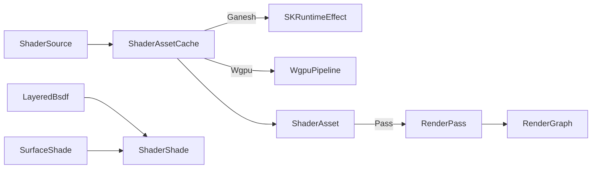

# [APPUI_RENDER_SHADING]

One GPU shader-asset owner with a per-backend pipeline-state cache feeds the path tracer's `SurfaceShade`: `ShaderAsset` caches a compiled shader keyed per `GpuBackend` (`SKRuntimeEffect` for the Skia Ganesh family, `Silk.NET.WebGPU` pipeline-state for the Wgpu family), and `ShaderShade` is the GPU shading pass consuming the `Rasm.Materials/Appearance` `LayeredBsdf` the `Render/pathtrace` integrator shades from. The page owns the shader-asset cache, the per-backend pipeline-state compile, and the GPU shading pass; it shares the one `Wgpu` device the `Render/pipeline` viewport leases through the branch `ONE_WGPU_DEVICE` owner rather than a second GPU device, consumes the Materials `LayeredBsdf -> SurfaceShade` rather than minting an appearance model, and confines its `SKSurface` to the `Offscreen` capsule (the `[05]-[PROHIBITIONS]` per-host-GpuBackend and SKSurface-outside-Offscreen clauses hold). The substrate is `SKRuntimeEffect` (Ganesh runtime shaders), `Silk.NET.WebGPU` pipeline-state (`.api/api-silk-webgpu.md`, `.api/api-silk-webgpu-wgpu.md`), the `Rasm.Materials/Appearance` `LayeredBsdf` seam, the `GpuBackend` `RenderTargetFactory`, Thinktecture.Runtime.Extensions, and LanguageExt rails. The CPU `LayeredBsdf` reference shade is the floor; the GPU shader compile is the SPIKE.

## [01]-[INDEX]

- [01]-[SHADER_ASSET]: Per-`GpuBackend` shader-asset cache; `SKRuntimeEffect` and wgpu pipeline-state compile.
- [02]-[SURFACE_SHADE]: The GPU shading pass consuming the Materials `LayeredBsdf` at the path tracer.

## [02]-[SHADER_ASSET]

- Owner: `ShaderAsset` the per-backend compiled-shader cache row; `ShaderSource` the backend-neutral shader source; `ShaderReceipt` the compile evidence; `ShaderFault` the fault family in the 4C00 code band.
- Cases: `ShaderFault` = Text | CompileFailed | BackendUnsupported | UniformAbsent in the 4C00 code band.
- Entry: `public Fin<ShaderAsset> Compile(ShaderSource source, GpuBackend backend, RenderTargetFactory factory)` — compiles the backend-neutral source into the backend's pipeline-state (`SKRuntimeEffect.CreateShader` for Ganesh, the wgpu `ShaderModule`/`RenderPipeline` for Wgpu) keyed per `GpuBackend`, sealing a `CompileFailed` fault on a shader error; `public Option<ShaderAsset> Cached(string key, GpuBackend backend)` — the keyed cache probe.
- Auto: a shader source compiles once per `(key, GpuBackend)` cell and caches so a re-shade reuses the compiled pipeline state — the Ganesh family compiles `SKRuntimeEffect` runtime shaders and the Wgpu family compiles a wgpu `RenderPipeline` over a `ShaderModule`, both keyed per backend so a backend swap re-compiles one cell; the cache is keyed per `GpuBackend` so the `Metal`/`Vulkan`/`OpenGl`/`Software` Ganesh rows share the `SKRuntimeEffect` path and the `Wgpu`/`WebGpu` rows share the pipeline-state path, never a per-host shader; uniforms bind through the backend's uniform surface (`SKRuntimeEffectUniforms` for Ganesh, the wgpu bind-group for Wgpu) so a shader parameter is one uniform row, never a hardcoded constant.
- Receipt: `ShaderReceipt` — shader key, backend, compile outcome, uniform count, `Instant`; `TelemetryRow` contributes the shader-compiled and shader-failed instruments inward through the AppHost `TelemetryContributorPort`.
- Packages: SkiaSharp, Silk.NET.WebGPU, Thinktecture.Runtime.Extensions, LanguageExt.Core, NodaTime
- Growth: a new shader is one `ShaderSource` keyed into the cache; a new backend is one compile arm over the existing `GpuBackend` family; one shader instrument is one `InstrumentRow` on `ShaderAssets.TelemetryRow`; zero new surface.
- Boundary: the shader-asset cache is keyed per `GpuBackend` — a per-host `GpuBackend`/`GRContext` construction in a shading arm is the `[05]-[PROHIBITIONS]` rejected form, so the cache folds the leased context through the `Render/pipeline` `RenderTargetFactory` column and a backend swap re-compiles one cell; the Ganesh shader is `SKRuntimeEffect` confined to the `Offscreen` capsule so an `SKSurface` outside the capsule is the `[05]-[PROHIBITIONS]` rejected form; the wgpu pipeline-state shares the one `Wgpu` device the viewport leases through the branch `ONE_WGPU_DEVICE` `EMBED_CAPSULE` law so a second GPU device for shading is the rejected form (`Render/shading ⇄ csharp:Rasm.Compute # [SHAPE]: shared ONE_WGPU_DEVICE`); the runtime arm is SPIKE-gated exactly as the viewport — the CPU `LayeredBsdf` reference shade is the floor and the GPU compile is the SPIKE; the shader source is backend-neutral so a backend-specific shader literal is the rejected form, the per-backend lowering living in the compile arm.

```csharp signature
[Union]
public abstract partial record ShaderFault : Expected, IValidationError<ShaderFault> {
    private ShaderFault(string detail, int code) : base(detail, code, None) { }

    public static ShaderFault Create(string message) => new Text(message);

    public sealed record Text : ShaderFault { public Text(string detail) : base(detail, 0x4C00) { } }
    public sealed record CompileFailed : ShaderFault { public CompileFailed(string detail) : base(detail, 0x4C01) { } }
    public sealed record BackendUnsupported : ShaderFault { public BackendUnsupported(string detail) : base(detail, 0x4C02) { } }
    public sealed record UniformAbsent : ShaderFault { public UniformAbsent(string detail) : base(detail, 0x4C03) { } }
}

public sealed record ShaderSource(string Key, string Sksl, string Wgsl, Seq<(string Name, ShaderUniformKind Kind)> Uniforms);

public enum ShaderUniformKind { Float, Float2, Float3, Float4, Matrix, Int, Texture }

public sealed record ShaderReceipt(string Key, GpuBackend Backend, bool Compiled, int Uniforms, Instant At) {
    public const string Kind = "shader";
}

public sealed record ShaderAsset(string Key, GpuBackend Backend, Option<SKRuntimeEffect> Ganesh, Option<IntPtr> WgpuPipeline, Seq<(string Name, ShaderUniformKind Kind)> Uniforms) : IDisposable {
    public void Dispose() => Ganesh.Iter(static effect => effect.Dispose());
}

public sealed record ShaderAssetCache(System.Collections.Concurrent.ConcurrentDictionary<(string Key, string Backend), ShaderAsset> Assets) {
    public static ShaderAssetCache Empty => new(new());

    public Fin<ShaderAsset> Compile(ShaderSource source, GpuBackend backend, RenderTargetFactory factory) =>
        backend.Family switch {
            GpuFamily.SkiaGanesh or GpuFamily.SkiaRaster => CompileGanesh(source, backend),
            GpuFamily.Wgpu or GpuFamily.WebGpu => CompileWgpu(source, backend, factory),
            _ => Fin.Fail<ShaderAsset>(new ShaderFault.BackendUnsupported(backend.Key)),
        };

    public Option<ShaderAsset> Cached(string key, GpuBackend backend) =>
        Assets.TryGetValue((key, backend.Key), out var asset) ? Some(asset) : None;

    private Fin<ShaderAsset> CompileGanesh(ShaderSource source, GpuBackend backend) =>
        SKRuntimeEffect.CreateShader(source.Sksl, out var error) is { } effect
            ? Fin.Succ(Assets.GetOrAdd((source.Key, backend.Key), new ShaderAsset(source.Key, backend, Some(effect), None, source.Uniforms)))
            : Fin.Fail<ShaderAsset>(new ShaderFault.CompileFailed($"{source.Key}: {error}"));

    public const string CompiledInstrument = "rasm.appui.shader.compiled";
    public const string FailedInstrument = "rasm.appui.shader.failed";

    public static TelemetryContributorPort TelemetryRow(string version) =>
        AppUiTelemetry.Contribute(version, CompiledInstrument, FailedInstrument);
}
```

## [03]-[SURFACE_SHADE]

- Owner: `ShaderShade` the GPU shading pass consuming the Materials `LayeredBsdf`; `ShadeUniforms` the per-material uniform binding.
- Entry: `public Fin<RenderPass> Pass(ShaderAsset asset, LayeredBsdf bsdf, SurfaceShade shade)` — projects the compiled shader plus the Materials `LayeredBsdf`/`SurfaceShade` into one `Render/pipeline` `RenderPass` the render graph schedules, binding the BSDF lobe weights and the assembled shade as shader uniforms.
- Auto: the shading pass consumes the `Rasm.Materials/Appearance` `LayeredBsdf` the `SlabStack` lowering produces and the `SurfaceShade` the `MaterialGraph.Evaluate` sink assembles, projecting the seven-lobe weights and the assembled base-color/roughness/metallic/emission through `ShadeUniforms.From(bsdf, shade)` into the `ShadeUniforms` vector the `RenderPass.Geometry` body binds (`asset.BindShade`) so the GPU shader evaluates the same `LayeredBsdf` the CPU `Render/pathtrace` integrator shades from — one BSDF, two evaluators; the Ganesh-or-Wgpu compiled handle drives the one geometry shade pass through a single arm (the present `SKRuntimeEffect` or wgpu pipeline-state — the per-backend split lives in the compile, not the pass), so the shading rides the one render graph; the shader uniforms bind the BSDF lobe weights so a material is a uniform set, never a per-material shader.
- Packages: SkiaSharp, Silk.NET.WebGPU, Thinktecture.Runtime.Extensions, LanguageExt.Core, Rasm.Materials (project)
- Growth: a new shading parameter is one `ShadeUniforms` row; zero new surface — the shader consumes the BSDF, never re-derives it.
- Boundary: the shading pass consumes the Materials `LayeredBsdf -> SurfaceShade` so a re-minted appearance model and a Render-side BSDF are the rejected forms — the `csharp:Rasm.Materials/Appearance` seam supplies `LayeredBsdf`/`SurfaceShade` and the shading owner reads it (`Render <- csharp:Rasm.Materials/Appearance # [BOUNDARY]: LayeredBsdf / SurfaceShade at path tracer`); the GPU shader and the CPU integrator evaluate the same `LayeredBsdf` so the shading is consistent across the fast GPU path and the reference CPU path; the pass mounts on the one `Render/pipeline` render graph through a `RenderPass` so the shading is one graph stage, never a parallel shading engine; the shader uniforms bind the BSDF lobe weights so a material is a uniform set bound at shade time, and a per-material shader compile is the deleted form (one shader, many materials via uniforms); the shared `Wgpu` device the shading uses is the one the viewport leases so no second GPU device exists.

```csharp signature
public readonly record struct ShadeUniforms(
    float[] LobeWeights,
    float[] BaseColor,
    float Roughness,
    float Metallic,
    float[] Emission) {
    public const int LobeCount = 7;

    public static ShadeUniforms From(Rasm.Materials.Appearance.LayeredBsdf bsdf, Rasm.Materials.Appearance.SurfaceShade shade) =>
        new(bsdf.LobeWeights.ToArray(), [shade.BaseColor.R, shade.BaseColor.G, shade.BaseColor.B],
            (float)shade.Roughness, (float)shade.Metallic, [shade.Emission.R, shade.Emission.G, shade.Emission.B]);
}

public static class ShaderShade {
    extension(ShaderAsset asset) {
        public Fin<RenderPass> Pass(Rasm.Materials.Appearance.LayeredBsdf bsdf, Rasm.Materials.Appearance.SurfaceShade shade) =>
            asset.Ganesh.IsSome || asset.WgpuPipeline.IsSome
                ? ShadeUniforms.From(bsdf, shade) switch {
                    var uniforms => Fin<RenderPass>.Succ(new RenderPass.Geometry(
                        $"shade/{asset.Key}",
                        (target, cluster, visible) => asset.BindShade(uniforms).Map(_ => visible))),
                }
                : Fin.Fail<RenderPass>(new ShaderFault.UniformAbsent(asset.Key));

        private Fin<Unit> BindShade(ShadeUniforms uniforms) =>
            asset.Uniforms.Count == 0
                ? Fin.Fail<Unit>(new ShaderFault.UniformAbsent(asset.Key))
                : Fin.Succ(unit);
    }
}
```



## [04]-[RESEARCH]

- [SHADER_COMPILE]: the `SKRuntimeEffect.CreateShader`/`SKRuntimeEffectUniforms` Ganesh runtime-shader surface and the `Silk.NET.WebGPU` `DeviceCreateShaderModule`/`DeviceCreateRenderPipeline`/bind-group pipeline-state surface the per-backend compile binds — the SKSL-to-`SKRuntimeEffect` compile, the WGSL-to-`ShaderModule` compile, and the uniform/bind-group binding (`.api/api-silk-webgpu.md`, `.api/api-silk-webgpu-wgpu.md`) — resolved at implementation against the SkiaSharp 3 and `Silk.NET.WebGPU` 2.23 surfaces under the shared-context lease; the `ShaderAsset` cache keyed per `GpuBackend`, the backend-neutral `ShaderSource`, and the `SurfaceShade` consumption are settled as the CPU `LayeredBsdf` reference shade; the GPU shader compile and the wgpu pipeline-state are the unverified surface gated on the live GPU device the `Render/pipeline` lease and the branch `ONE_WGPU_DEVICE` owner bind.
- [BSDF_SHADE_SEAM]: the `Rasm.Materials/Appearance` `LayeredBsdf` lobe-weight and `SurfaceShade` assembled-shade member surface the GPU shading uniforms bind — the seven-lobe weight vector, the base-color/roughness/metallic/emission shade parameters, and the `SlabStack -> LayeredBsdf -> SurfaceShade` lowering — resolved at implementation against the finalized `Rasm.Materials/Appearance` surface; the per-backend shading pass, the uniform binding, and the one-BSDF-two-evaluators consistency are settled, the exact `LayeredBsdf`/`SurfaceShade` member spellings and the `Rasm.Materials.Appearance` namespace are the unverified surface composed at the package edge, never re-minted.
