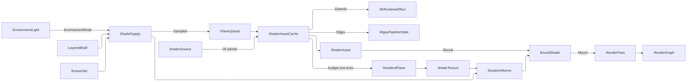

# [APPUI_RENDER_SHADING]

One GPU shader-asset owner with a per-backend, byte-budgeted residency cache feeds the path tracer's Materials closure: `ShaderAssetCache` retains a compiled shader keyed per `GpuBackend` (`SKRuntimeEffect` for the Skia Ganesh family, `Silk.NET.WebGPU` pipeline state for the Wgpu family) beside every native plane a bound roster row addresses, and `ShaderShade` is the GPU shading pass consuming the `LayeredBsdf` the path-trace integrator also shades from. `ShaderAssetCache` owns shader compilation, plane residency and its eviction, retained program and native-texture lifetime, and cache identity, while `ShaderShade` owns the GPU shading pass; both share the viewport's one `Wgpu` device, consume the Materials appearance model, and confine `SKSurface` ownership to `Offscreen`.

`ShaderSource` declares its bindings as DATA — one admitted `ShaderBinding` row per shader slot naming its `ShadeSource`, so a uniform write is a roster fold and a shader-local uniform name never appears as a literal in a bind arm. Every source resolves through ONE `ShadeSupply` answer, so a scalar run, a sampled plane, and a packed lane are three rows of one resolution rather than three bind arms. Texture slots key on the Materials `Rasm.Materials.Raster.TextureChannel` roster, never an AppUi-local channel vocabulary; `TextureSet` supplies the channel and packed pyramids and `EnvironmentLight` supplies the prefiltered dome the raster pass reads instead of marching, so this page uploads and binds and never mints a plane, a transfer, a sampler law, a channel name, or a lighting integral. `SKRuntimeEffect`, `Silk.NET.WebGPU`, Thinktecture, and LanguageExt supply the substrate; the CPU `LayeredBsdf` evaluation is the reference path.

## [01]-[INDEX]

- [02]-[SHADER_ASSET]: Per-`GpuBackend` shader and budgeted plane residency; `SKRuntimeEffect` and wgpu pipeline-state compile; the admitted `ShaderBinding` roster and its one `ShadeSupply` resolution.
- [03]-[SURFACE_SHADE]: `ShaderShade` shades on the GPU from the Materials `LayeredBsdf`, channel-value closure, bound `TextureSet`, and resolved `EnvironmentLight`.

## [02]-[SHADER_ASSET]

- Owner: `ShaderAsset` the per-backend compiled-shader cell; `ShaderProgram` the closed Ganesh-or-Wgpu retained native program; `ShadeTexture` the closed Ganesh-or-Wgpu retained native texture; `ResidentPlane` the native plane beside its byte cost and eviction touch; `ShaderBinding` the shader-slot roster row; `ShadeSource` the value each row pulls; `EnvironmentRead` the image-based-lighting row family; `ShadeSupply` the ONE answer a source resolves to; `ShaderSource` the admitted backend-neutral shader source; `PlaneUpload` the backend-neutral upload request; `WgpuShaderCompiler` the composition-bound wgpu compile-and-upload capsule with its owned `WgpuPipelineState`; `ShaderAssetCache` the one residency owner over both retained kinds; `ShaderReceipt` the compile evidence; `ShaderFault` the fault family on `AppUiFaultBand.Shader`.
- Cases: `ShaderFault` = Text | CompileFailed | BackendUnsupported | UniformAbsent | PlaneUnbindable — codes derive through the `AppUiFaultBand.Shader` registry row (6110); the hex band is dead. `ShadeSource` = Channel | Lobes | Ambient — a binding pulls one `TextureChannel` column, the `LayeredBsdf` weight vector, or one `EnvironmentRead` row, and a fourth source is a case, never a second uniform struct. `ShadeSupply` = Lanes | Plane | Absent — a scalar run, a native-bound level chain with its lane offset, or the typed nothing a set that does not carry the row resolves to.
- Law: the binding roster is the ONLY place a shader slot name exists. Bind arms fold `ShaderSource.Bindings` and ask each row for its `ShadeSupply`, so adding a channel to the shader is one roster row and a hardcoded `"baseColor"` write in a bind arm is the deleted form. `Group`/`Slot` on the row carry the wgpu binding coordinates the compiler capsule reads, while the Ganesh arm addresses by `Name` alone, so one roster serves both layouts without a per-backend roster.
- Law: the roster ADMITS at `ShaderSource.Of` and never at draw time. Duplicate slot names, a colliding `(Group, Slot)` pair, a second `Lobes` row, a fixed-lane `ShaderUniformKind` disagreeing with its source's own arity, and a sampled channel row carrying no `Swizzle` companion each refuse ONCE at construction; the Ganesh compile gates every row name against `SKRuntimeEffect.Uniforms`/`Children`, the effect's own declared slot lists, so `ShaderFault.UniformAbsent` is a compile verdict rather than a per-frame surprise. Draw-time re-validation of an admitted roster is the deleted form.
- Law: a PACKED channel binds its sheet AND its lane. `ChannelPack.Lane` is the one slot correspondence, so the sheet a roughness rides inside resolves to `(plane, lane)` and the bind fold writes the lane through the row's own `Swizzle` uniform — a WGSL or SkSL swizzle literal chosen by the shader author is the fork this forecloses, because the pack order is set data the shader cannot see.
- Law: the sampler follows the SET, never a literal. Address mode reads the set's own periodicity evidence — a `TileProof`-carrying set repeats, an ingested or UDIM set clamps, because repeating a plane `TileGate` never graded shows the seam the proof exists to certify and repeating a UDIM tile bleeds its neighbour — and filter follows the level count. Every environment plane takes its address axes from the FROZEN equirect correspondence on its own `EnvironmentRead` row.
- Law: plane residency keys on the plane CONTENT key — a channel pyramid's own `Key`, an environment product's `ContentAddress.Value` — never the channel, the set, or the light. One plane shared by many sets or many lights uploads once, an edited plane re-keys and re-uploads, and a rebind at identical bytes reuses every resident handle. Residency is BUDGETED: the cache carries a byte ceiling, charges each plane its extent times its storage width, and evicts least-recently-touched cells until the total fits, so texture VRAM is governed exactly as the `Render/meshlets` `ResidencyBudget` governs geometry VRAM rather than growing until the device refuses. Eviction is ONE ordered pass per admission — candidates snapshot and sort once, the walk releases in that order — because re-scanning the whole residency per victim makes a single over-budget frame quadratic while finding the order the first sort already held. Residency is MEASURED on the same key: every admission lands one of three outcomes — a mint, a reuse of a resident handle, or a refusal the byte ceiling or a backend's own layer contract raised — so the content-key sharing this law buys reads as reuse over admissions, and a refusal, which leaves the slot `Absent` and the shade drawing on its scalar fallback, is counted rather than invisible.
- Law: ONLY the roster's own planes upload. Residency folds the bindings, not the set, so a shader naming three slots makes three planes resident out of the full frozen TextureChannel roster and a whole-set upload is the deleted form — a set-wide residency is a roster that names every channel, never a second entry.
- Exemption: three statement bodies, each a native-lifetime or measured seam and nothing else on the page — `UploadGanesh` sweeps rows through the plane's own decode rail into a caller-owned `SpanOwner<float>` staging rental, the ref-struct rental and the row-major write making an expression fold unrepresentable; `Charge` and `Refuse` bracket a minted native handle across an admission that can refuse, so the release rides both exits; `Evict` walks one pre-ordered candidate snapshot, releasing until the charge fits.
- Entry: `public Fin<ShaderAsset> Compile(ShaderSource source, GpuBackend backend)` probes the `(Key, Revision, Backend)` cell before compiling the admitted source; `public Fin<ShadeTexture> Resident(PlaneUpload request, GpuBackend backend, long generation)` makes one plane native under the budget; `public long Generation()` opens a resolution and is what the eviction pass protects; `public Option<ShaderAsset> Cached(string key, string revision, GpuBackend backend)` is the compile probe `Compile` itself reads — the plane side carries no twin, because `Resident` is probe-and-upload in one and a bare plane probe beside it answers a handle no caller can safely hold across a generation. Ganesh compiles through `SKRuntimeEffect.CreateShader` and uploads through `SKImage.FromPixelCopy`/`SKShader.CreateImage`; Wgpu compiles WGSL into a module and render pipeline whose `Bind(ShadeUniforms)` creates an owned per-draw bind group and whose `Mount(RenderTarget, nint)` records it on the active encoder before release, and uploads through the same capsule's `Upload`.
- Auto: a shader source compiles once per `(Key, Revision, GpuBackend)` cell and a plane chain uploads once per `(Key, GpuBackend)` cell. Each entry probes before native construction, a miss constructs, and a concurrent-race loser disposes its minted handle, so a revision change cannot reuse stale code and a re-shade of the same revision reuses one retained pipeline state and one retained texture per plane. `PlaneUpload` carries `TexturePlane` LEVELS rather than a materialized sampler image, so one upload shape serves a channel pyramid, a packed sheet, the stored equirect, the GGX prefilter ladder, and the split-sum LUT — the `AsImage` lift stays the CPU sampler's bridge and never allocates a whole `ShadeVec4` chain to hand the GPU one level. `UploadGanesh` stages level 0 alone and lets `SKMipmapMode.Linear` build Skia's own box chain, so the authored `MipPolicy` — Kaiser, renormalize, or the variance coupling — survives on the Wgpu arm ONLY; that divergence is the declared Ganesh quality floor the receipt records, never a silent equivalence — a catalog-settled verdict, because no SkiaSharp surface accepts a caller-supplied mip chain: the `SKImage` family admits `FromPixelCopy`/`FromPixels` level-0 images and `ToTextureImage`'s Ganesh-generated chain alone. `EnvironmentRead.Nearest` is the same verdict's LADDER arm — no SkiaSharp surface binds an explicit level set either, so a `Nearest` row seats the roughness-nearest authored level as its own single-level upload cell on a Skia-family backend while a chain-capable family keeps every authored level.
- Receipt: `ShaderReceipt` — shader key, backend, compile outcome, binding count, resident-plane count, resident bytes, the mint/reuse/refuse admission triple and the eviction count SINCE the previous seal, mip fidelity, `Instant`; `TelemetryRow` contributes the shader-compiled, shader-failed, plane-admit, plane-resident, plane-byte, and plane-evicted instruments inward through the AppHost `TelemetryContributorPort`, and `ShaderAssetCache.Seal` is the ONE mint (the cache owns every counter, so a caller-assembled receipt would read six cells across a race it owns) and `Observe` the ONE recording projection composition binds beside it — a contributed row with no writer, and a receipt type read by two projections and constructed by none, are the declared-but-unrecorded defects this pairing forecloses.
- Packages: SkiaSharp, Silk.NET.WebGPU, CommunityToolkit.HighPerformance, Thinktecture.Runtime.Extensions, LanguageExt.Core, NodaTime, Rasm.Materials (project)
- Growth: a new shader is one `ShaderSource` keyed into the cache; a new shader slot is one `ShaderBinding` row; a new lighting product is one `EnvironmentRead` row carrying its own `ShadeSupply` column; a new backend is one compile arm and one upload arm over the existing `GpuBackend` family; one shader instrument is one `InstrumentSpec` row on `ShaderAssets.TelemetryRow`; zero new surface.
- Boundary: the residency cache is keyed per `GpuBackend` — a per-host `GpuBackend`/`GRContext` construction in a shading arm is the `[04]-[BOUNDARIES]` rejected form, so the cache folds the leased context through the `Render/pipeline` `GpuBackend` target-factory column and a backend swap re-compiles and re-uploads one cell; the Ganesh shader is `SKRuntimeEffect` confined to the `Offscreen` capsule so an `SKSurface` outside the capsule is the `[04]-[BOUNDARIES]` rejected form; the wgpu pipeline-state and every wgpu texture share the one `Wgpu` device the viewport leases through the branch `ONE_WGPU_DEVICE` `EMBED_CAPSULE` law so a second GPU device for shading is the rejected form (`Render/shading ⇄ csharp:Rasm.Compute # [SHAPE]: shared ONE_WGPU_DEVICE`) — the raw `DeviceCreateTexture`/`TextureCreateView`/`DeviceCreateSampler`/`QueueWriteTexture` table stays inside the composition-bound `WgpuShaderCompiler`, this page holding `nint` handles alone; the runtime arm is SPIKE-gated exactly as the viewport — the CPU `LayeredBsdf` reference shade is the floor and the GPU compile is the SPIKE; this cache is the 3D-APPEARANCE half of the runtime-shader TYPE-DOMAIN partition and holds appearance programs alone — the 2D chrome roster at `Vfx/shader#EFFECT_PROGRAM` carries no backend variant, no resident plane, and a CPU-side program-and-picture budget, so a chrome program forced through this cache would arrive holding a wgpu pipeline-state arm it can never take, and neither cache holds the other's programs; both rosters are ESTATE-SHIPPED source, so caller-supplied shader text has no admission on either; the shader source is backend-neutral so a backend-specific shader literal is the rejected form, the per-backend lowering living in the compile arm; texel lanes arrive DECODED and scene-linear from `TexturePlane.Read`, the plane's own decode ladder — INCLUDING the `pq`/`hlg` display transfers the frozen environment row alone admits, whose ST 2084 and HLG inverses are that ladder's own rows, so a `pq` dome reaches this pass already scene-linear and a transfer this pass cannot name never uploads display-referred — so the uploaded `SKImage` carries no tagged colour space (a tagged space re-transforms lanes the Materials decode already resolved) and a Render-side transfer curve, gamma divide, normal-map decode, SH reconstruction, or prefilter integral is the deleted form.

```csharp signature
// (Continues the Rasm.AppUi.Render compilation unit, plus:)
using System.Runtime.InteropServices;                 // MemoryMarshal.AsBytes — the one staging reinterpretation
using CommunityToolkit.HighPerformance.Buffers;       // SpanOwner<T> — the staging and row rentals
using Rasm.Materials.Appearance;                      // EnvironmentLight the resolved dome, Sh9 the frozen band layout
using Rasm.Materials.Appearance.Bsdf;                 // LayeredBsdf
using Rasm.Materials.Appearance.Texture;              // ShadeVec4, SamplerState, AddressMode, FilterMode
using Rasm.Materials.Raster;                          // TextureChannel, TextureSet, TexturePlane, TexturePyramid, ChannelPack, AlphaMode, MipPolicy

[Union]
public abstract partial record ShaderFault : Expected, IValidationError<ShaderFault> {
    private ShaderFault(string detail, int code) : base(detail, code, None) { }

    public static ShaderFault Create(string message) => new Text(message);

    public sealed record Text : ShaderFault { public Text(string detail) : base(detail, AppUiFaultBand.Shader.Code(0)) { } }
    public sealed record CompileFailed : ShaderFault { public CompileFailed(string detail) : base(detail, AppUiFaultBand.Shader.Code(1)) { } }
    public sealed record BackendUnsupported : ShaderFault { public BackendUnsupported(string detail) : base(detail, AppUiFaultBand.Shader.Code(2)) { } }
    public sealed record UniformAbsent : ShaderFault { public UniformAbsent(string detail) : base(detail, AppUiFaultBand.Shader.Code(3)) { } }
    public sealed record PlaneUnbindable : ShaderFault { public PlaneUnbindable(string detail) : base(detail, AppUiFaultBand.Shader.Code(4)) { } }
}

// Lanes is the float run a fixed-width slot writes; Sampled marks the slot the texture arm binds; Run declares a
// variable-length float run whose length its own source carries. All three columns exist so the write arm and the
// admission gate dispatch on DATA — a kind-name switch inside either is the deleted form.
[SmartEnum<string>]
[KeyMemberEqualityComparer<ComparerAccessors.StringOrdinal, string>]
public sealed partial class ShaderUniformKind {
    public static readonly ShaderUniformKind Float = new("float", lanes: 1, sampled: false);
    public static readonly ShaderUniformKind Float2 = new("float2", lanes: 2, sampled: false);
    public static readonly ShaderUniformKind Float3 = new("float3", lanes: 3, sampled: false);
    public static readonly ShaderUniformKind Float4 = new("float4", lanes: 4, sampled: false);
    public static readonly ShaderUniformKind Matrix = new("matrix", lanes: 16, sampled: false);
    public static readonly ShaderUniformKind Int = new("int", lanes: 1, sampled: false);
    public static readonly ShaderUniformKind Run = new("run", lanes: 0, sampled: false);
    public static readonly ShaderUniformKind Texture = new("texture", lanes: 0, sampled: true);

    private ShaderUniformKind(string key, int lanes, bool sampled) : this(key) => (Lanes, Sampled) = (lanes, sampled);

    public int Lanes { get; }
    public bool Sampled { get; }
    public bool Fixed => Lanes > 0;
}

// ShadeSupply answers every source with ONE value. Run is the float lane run a scalar slot writes; Sampled is a level
// chain the residency arm makes native beside the lane offset a packed sheet's slot occupies; Absent is the typed
// nothing a set that does not carry the row resolves to, so a partially-baked material draws on its scalar fallbacks
// rather than railing. A fourth answer is a case, never a nullable column on Sampled.
[Union(ConversionFromValue = ConversionOperatorsGeneration.None)]
public abstract partial record ShadeSupply {
    private ShadeSupply() { }
    public sealed record Run(Arr<float> Values) : ShadeSupply;
    // Mip is OPTIONAL: Some(row) names the fold that built a pyramid, Some(None-row) a single-level plane, and
    // ABSENCE the GGX ladder — a level set of INDEPENDENT authored integrals no frozen fold row describes, which a
    // consumer must bind level-exact and never re-generate or blend-synthesize.
    public sealed record Sampled(UInt128 Key, Seq<TexturePlane> Levels, SamplerState Sampler, Option<MipPolicy> Mip, int Lane) : ShadeSupply;
    public sealed record Absent : ShadeSupply;

    public static readonly ShadeSupply Nothing = new Absent();

    // ONE polymorphic admission over three input shapes — a double span, a double Seq, and a level chain — so a
    // caller never picks a factory by name and an empty chain resolves to the typed nothing rather than a bound
    // handle over no levels. The double-to-float narrowing lives HERE alone: the domain is double-precision and the
    // GPU lane is float, so the crossing is one site rather than a cast at every write.
    public static ShadeSupply Of(ReadOnlySpan<double> values) {
        float[] lanes = new float[values.Length];
        for (int at = 0; at < values.Length; at++) { lanes[at] = (float)values[at]; }
        return lanes.Length is 0 ? Nothing : new Run(toArr(lanes));
    }

    public static ShadeSupply Of(Seq<double> values) => Of(values.ToArray().AsSpan());

    public static ShadeSupply Of(UInt128 key, Seq<TexturePlane> levels, SamplerState sampler, Option<MipPolicy> mip, int lane = 0) =>
        levels.IsEmpty ? Nothing : new Sampled(key, levels, sampler, mip, lane);
}

// EnvironmentRead rows carry the image-based-lighting products a RASTER pass reads off the ONE EnvironmentLight the
// light rig resolved. A raster shade cannot march the dome the way Render/pathtrace integrates it, so it consumes the
// prefilter's own reduction: the SH9 irradiance run, the GGX roughness ladder AS DATA (never the level formula
// re-derived here), the stored orientation the shader un-rotates by, and three sampled planes. Each row carries ONE
// Supply column, so the bind fold asks a row for its answer exactly as it asks a channel — an ambient-specific bind
// arm does not exist.
//
// Lanes is the PRODUCT'S OWN arity, declared independently of any slot's ShaderUniformKind — 27 for the frozen SH9
// run, 1 for each scalar, 0 for a plane or an extent-derived ladder. Reading the arity off the binding's own kind
// made the roster gate a tautology (a row echoing its own declaration compares equal to itself always), so this
// column is what discriminates: a Float2 slot over a one-lane orientation refuses at declaration, and a fixed-arity
// row whose resolved run comes back the wrong length refuses at resolution, which is where the frozen `sh9`
// twenty-seven-value admit gate has to sit because that is where the values first exist.
[SmartEnum<string>]
[KeyMemberEqualityComparer<ComparerAccessors.StringOrdinal, string>]
public sealed partial class EnvironmentRead {
    // Arity READS off the producing owner — Sh9.Slots, the frozen nine-band RGB-interleaved layout the
    // prefilter admits against — never a local copy of the same number, which diverges silently the first time the
    // band order moves and takes the whole reconstruction with it.
    public static readonly EnvironmentRead Irradiance = new("irradiance", ShaderUniformKind.Run, lanes: Sh9.Slots,
        static light => ShadeSupply.Of(light.Products.Irradiance.Bands.Span));
    // The ladder's length IS the prefiltered pyramid's depth, a set fact no roster can pin, so it declares zero and
    // the resolution gate stands down on it — a declared length here would refuse every dome of another depth.
    public static readonly EnvironmentRead SpecularLadder = new("specularLadder", ShaderUniformKind.Run, lanes: 0,
        static light => ShadeSupply.Of(light.Products.RoughnessPerMip));
    // Two independent frozen fields, two rows — intensity is no orientation, and a shader author reading a
    // packed pair named for one of its halves mis-seats the other.
    // Intensity reads the admitted radiometric scalar off the UnitEvidence carrier — the dome's authored unit
    // already lowered at Materials admission, so the shader uniform is one dimensionless SI multiplier.
    public static readonly EnvironmentRead Intensity = new("intensity", ShaderUniformKind.Float, lanes: 1,
        static light => ShadeSupply.Of(Seq(light.Map.Intensity.RadiometricSi)));
    public static readonly EnvironmentRead Rotation = new("rotation", ShaderUniformKind.Float, lanes: 1,
        static light => ShadeSupply.Of(Seq(light.Map.Rotation)));
    public static readonly EnvironmentRead Specular = new("specular", ShaderUniformKind.Texture, lanes: 0, nearest: true,
        // The GGX ladder is authored data — independent per-roughness integrals, not a fold — so the mip column is
        // ABSENT rather than a `none` claiming a single level over a multi-level chain, and Nearest declares the
        // Skia-family seat: Skia's own box chain over level 0 would blend levels the prefilter never wrote.
        static light => ShadeSupply.Of(light.Blobs.Specular.Value, light.Products.Specular, DomeSampler, Option<MipPolicy>.None));
    public static readonly EnvironmentRead BrdfLut = new("brdfLut", ShaderUniformKind.Texture, lanes: 0,
        static light => ShadeSupply.Of(light.Blobs.BrdfLut.Value, Seq(light.Products.BrdfLut), LutSampler, Some(MipPolicy.None)));
    public static readonly EnvironmentRead Equirect = new("equirect", ShaderUniformKind.Texture, lanes: 0,
        static light => ShadeSupply.Of(light.Blobs.Equirect.Value, Seq(light.Map.Plane), DomeSampler, Some(MipPolicy.None)));

    // DomeSampler carries the FROZEN equirect correspondence's own address law — longitude wraps, latitude clamps
    // at the poles — and LutSampler the LUT's two clamped axes. Both are the mapping the prefilter integrated under,
    // carried as row data so the sampler a level set binds under can never diverge from the one the products were
    // built for.
    static readonly SamplerState DomeSampler = new(AddressMode.Repeat, AddressMode.Clamp, FilterMode.Trilinear, UvFrame.Identity);
    static readonly SamplerState LutSampler = new(AddressMode.Clamp, AddressMode.Clamp, FilterMode.Bilinear, UvFrame.Identity);

    public ShaderUniformKind Kind { get; }

    public int Lanes { get; }

    // The catalog-settled ladder seat: no SkiaSharp surface binds an explicit level set — the SKImage family admits
    // FromPixelCopy/FromPixels level-0 images and ToTextureImage's Ganesh-generated chain alone, with SKMipmapMode
    // the only mip selection — so a Nearest row narrows its chain to the roughness-nearest authored level on a
    // Skia-family backend and declares the interpolation loss the chain-capable arm keeps. Row data, never a
    // bind-arm branch: Specular alone declares it, and every other row defaults false.
    public bool Nearest { get; }

    // The generator emits the private ctor itself — (key, kind, lanes, nearest, supply): plain non-key columns in
    // DECLARATION order, the [UseDelegateFromConstructor] delegate LAST and named for its partial method, no
    // parameter defaults, and ValidateConstructorArguments covering key plus columns but never the delegate —
    // probe-proven on the live generator. This declared overload chains the common Nearest=false rows, so only the
    // ladder row spells the column.
    private EnvironmentRead(string key, ShaderUniformKind kind, int lanes, Func<EnvironmentLight, ShadeSupply> supply)
        : this(key, kind, lanes, nearest: false, supply) {
    }

    [UseDelegateFromConstructor]
    public partial ShadeSupply Supply(EnvironmentLight light);
}

// What a shader slot pulls. Channel names a Materials roster row — the SAME closed vocabulary the frozen texture-set
// wire carries — so an AppUi channel spelling cannot fork from the producer's. Lobes is the LayeredBsdf weight
// vector, the one value no channel row describes. Ambient is one EnvironmentRead row. Lanes is the SOURCE'S own
// declared arity — the channel row's component count, the environment product's own width, zero where the supply carries the length — never a
// re-read of the binding's ShaderUniformKind, because the roster admission compares the two and a source echoing
// the kind it is checked against proves nothing. Zero declares a plane or a run whose length its supply carries.
[Union(ConversionFromValue = ConversionOperatorsGeneration.None)]
public abstract partial record ShadeSource {
    private ShadeSource() { }
    public sealed record Channel(TextureChannel Row) : ShadeSource;
    public sealed record Lobes : ShadeSource;
    public sealed record Ambient(EnvironmentRead Read) : ShadeSource;

    public static readonly ShadeSource LobeWeights = new Lobes();
    public static ShadeSource Of(TextureChannel row) => new Channel(row);
    public static ShadeSource Of(EnvironmentRead read) => new Ambient(read);

    // The lobe vector's length is a PER-MATERIAL fact — `LayeredBsdf.Lobes` is the weighted row list a material's
    // parameter row produced, one row for gold and two for plastic — so the arm declares ZERO and its supply carries
    // the length; a `7` here was a stale count of the closed `BsdfLobe` CASE family, which is not the vector's arity.
    public int Lanes => Switch(
        channel: static slot => slot.Row.Components,
        lobes: static _ => 0,
        ambient: static slot => slot.Read.Lanes);
}

// One shader slot. Name is the SkSL/WGSL identifier, Source the value it pulls, (Group, Slot) the wgpu binding
// coordinates the compiler capsule lays out, and Swizzle the int slot a SAMPLED channel row writes its packed lane
// into — the Ganesh arm addresses by Name and ignores both coordinates. Swizzle is Some on exactly the rows whose
// plane may arrive as one lane of an orm or mra sheet, and the admission gate enforces that correspondence.
public readonly record struct ShaderBinding(
    string Name, ShaderUniformKind Kind, ShadeSource Source, int Group, int Slot, Option<string> Swizzle);

// ShaderSource admits the backend-neutral source. Of is the ONE construction: a roster that reaches a draw has
// already proven its names unique, its wgpu coordinates disjoint, its lane widths agreed, and its packed rows
// swizzle-bearing, so the draw fold reads data it can no longer disbelieve.
public sealed record ShaderSource(string Key, string Revision, string Sksl, string Wgsl, Seq<ShaderBinding> Bindings) {
    public static Fin<ShaderSource> Of(string key, string revision, string sksl, string wgsl, Seq<ShaderBinding> bindings) =>
        from _ in guard(!bindings.IsEmpty, (Error)new ShaderFault.UniformAbsent($"{key}: roster carries no binding"))
        from __ in guard(bindings.Map(static row => row.Name).Distinct().Count() == bindings.Count,
                (Error)new ShaderFault.UniformAbsent($"{key}: duplicate slot name"))
        from ___ in guard(bindings.Map(static row => (row.Group, row.Slot)).Distinct().Count() == bindings.Count,
                (Error)new ShaderFault.UniformAbsent($"{key}: colliding wgpu (group, slot)"))
        from ____ in guard(bindings.Count(static row => row.Source is ShadeSource.Lobes) <= 1,
                (Error)new ShaderFault.UniformAbsent($"{key}: a second lobe-weight slot"))
        from _____ in bindings.Fold(Fin.Succ(unit), (acc, row) => acc.Bind(_ => Admit(key, row)))
        select new ShaderSource(key, revision, sksl, wgsl, bindings);

    // Five row gates, each naming the offending slot: a fixed-width kind must match its source's INDEPENDENTLY
    // declared arity, a sampled kind must sit on a source that can supply a plane at all — the lobe vector and every
    // lane-valued environment product are refused there by the same column — a lane-valued ambient row's binding kind
    // must match the kind its product publishes, and a sampled CHANNEL row must carry the swizzle slot its packed
    // lane rides, a pack order being set data no shader author can see, so an absent swizzle is a silent wrong-lane
    // read rather than a visible refusal.
    static Fin<Unit> Admit(string key, ShaderBinding row) =>
        (row.Kind.Fixed && row.Kind.Lanes != row.Source.Lanes, row.Kind.Sampled, row.Source, row.Swizzle.IsSome) switch {
            (true, _, _, _) => Fin.Fail<Unit>(new ShaderFault.UniformAbsent(
                $"{key}/{row.Name}: {row.Kind.Key} takes {row.Kind.Lanes} lanes, source carries {row.Source.Lanes}")),
            (_, true, ShadeSource.Lobes, _) => Fin.Fail<Unit>(new ShaderFault.UniformAbsent(
                $"{key}/{row.Name}: the lobe-weight vector is no plane")),
            (_, true, ShadeSource.Ambient ambient, _) when ambient.Read.Lanes > 0 => Fin.Fail<Unit>(new ShaderFault.UniformAbsent(
                $"{key}/{row.Name}: {ambient.Read.Key} supplies {ambient.Read.Lanes} lanes, never a plane")),
            // The product's OWN declared kind against the binding's. Lane count alone does not settle it — a four-lane
            // product bound as a two-by-two matrix agrees on arity and disagrees on layout, and the shader then reads
            // a transposed orientation with no signal. The row publishes the kind it was built as, so the gate
            // compares two independent declarations exactly as the arity gate above does.
            (_, false, ShadeSource.Ambient ambient, _) when ambient.Read.Lanes > 0 && row.Kind != ambient.Read.Kind =>
                Fin.Fail<Unit>(new ShaderFault.UniformAbsent(
                    $"{key}/{row.Name}: {ambient.Read.Key} publishes {ambient.Read.Kind.Key}, the binding declares {row.Kind.Key}")),
            (_, true, ShadeSource.Channel, false) => Fin.Fail<Unit>(new ShaderFault.UniformAbsent(
                $"{key}/{row.Name}: a sampled channel row carries no swizzle slot")),
            (_, false, _, true) => Fin.Fail<Unit>(new ShaderFault.UniformAbsent(
                $"{key}/{row.Name}: a scalar row carries a swizzle slot")),
            _ => Fin.Succ(unit),
        };
}

// PlaneUpload requests upload over the plane's OWN levels — never a materialized sampler image. The chain is whatever
// its source published: a channel pyramid's fold, a GGX prefilter's independent roughness ladder, or one standalone
// LUT. Every remaining column reads off the base plane, so no column is a caller knob.
public readonly record struct PlaneUpload(
    UInt128 Key, Seq<TexturePlane> Levels, SamplerState Sampler, Option<MipPolicy> Mip) {
    public TexturePlane Base => Levels.Head;

    // Real device cost: the extent times the layer stack times the storage width the format row declares. A handle
    // count is not a budget — a 16k Rgba16 plane and an 8-bit mask cost the same handle and 512× the memory.
    public long Bytes => Levels.Fold(0L, static (sum, level) => sum + (level.Texels * level.Lanes * level.Format.Depth.Bytes));

    public static PlaneUpload Of(ShadeSupply.Sampled supply) => new(supply.Key, supply.Levels, supply.Sampler, supply.Mip);
}

// One resident plane: the native handle, its charged bytes, and the monotonic touch the eviction order reads.
public sealed record ResidentPlane(ShadeTexture Texture, long Bytes, long Touch) : IDisposable {
    public void Dispose() => Texture.Dispose();
}

// ShadeTexture retains the native texture. Ganesh keeps the image AND the shader built over it, because
// SKRuntimeEffect children bind an SKShader and rebuilding one per draw re-wraps the same pixels every frame.
[Union(ConversionFromValue = ConversionOperatorsGeneration.None)]
public abstract partial record ShadeTexture : IDisposable {
    private ShadeTexture() { }
    public sealed record GaneshImage(SKImage Image, SKShader Sampled) : ShadeTexture;
    public sealed record WgpuTexture(nint View, nint Sampler, IDisposable Release) : ShadeTexture;

    public void Dispose() => Switch(
        ganeshImage: static texture => { texture.Sampled.Dispose(); texture.Image.Dispose(); },
        wgpuTexture: static texture => texture.Release.Dispose());
}

// WgpuPipelineState owns the retained module and render pipeline. Bind returns the current owned bind group, Mount
// records and releases it, and Release drops retained handles.
public sealed record WgpuPipelineState(
    nint Module,
    nint Pipeline,
    Func<ShadeUniforms, Fin<(nint Handle, IDisposable Release)>> Bind,
    Func<RenderTarget, nint, Fin<Unit>> Mount,
    IDisposable Release) : IDisposable {
    public void Dispose() => Release.Dispose();
}

// WgpuShaderCompiler binds at composition over the ONE_WGPU_DEVICE lease: the render-graph device seam builds it
// once, so the cache compiles pipeline state AND uploads texture planes with zero device reach of its own. Upload
// owns the whole authored level chain, which is why the mip policy survives on this arm alone.
public sealed record WgpuShaderCompiler(
    Func<ShaderSource, Fin<WgpuPipelineState>> Build,
    Func<PlaneUpload, Fin<ShadeTexture>> Upload);

[Union(ConversionFromValue = ConversionOperatorsGeneration.None)]
public abstract partial record ShaderProgram {
    private ShaderProgram() { }
    public sealed record Ganesh(SKRuntimeEffect Effect) : ShaderProgram;
    public sealed record Wgpu(WgpuPipelineState State) : ShaderProgram;

    public void Release() => Switch(
        ganesh: static program => program.Effect.Dispose(),
        wgpu: static program => program.State.Dispose());
}

public sealed record ShaderAsset(
    string Key,
    GpuBackend Backend,
    ShaderProgram Program,
    Seq<ShaderBinding> Bindings) : IDisposable {
    public void Dispose() => Program.Release();
}

// The three admission columns are the residency's own outcome partition — a plane uploaded, a resident plane reused,
// a plane the ceiling or a backend layer contract refused — so reuse over admissions IS the atlas ruling's payoff and
// a refusal is a fact rather than a shade that merely draws flat.
public sealed record ShaderReceipt(
    string Key, GpuBackend Backend, bool Compiled, int Bindings, int ResidentPlanes, long ResidentBytes,
    long MintedPlanes, long ReusedPlanes, long RefusedPlanes, long EvictedPlanes, bool AuthoredMips, Instant At) {
    public const string Kind = "shader";
}

// A sealed CLASS, not a record: the cache is one identity owning mutable native state — two concurrent maps, a
// monotonic touch clock, a charged-byte sum — and record semantics fork exactly that state (`with` copies share the
// maps while resetting both counters, so the charge silently diverges from the residency it accounts for, and value
// equality over live native handles answers nothing a caller can use).
public sealed class ShaderAssetCache {
    private ShaderAssetCache(Option<WgpuShaderCompiler> compiler, long planeBudgetBytes) =>
        (Compiler, PlaneBudgetBytes) = (compiler, planeBudgetBytes);

    private readonly System.Collections.Concurrent.ConcurrentDictionary<(string Key, string Revision, string Backend), ShaderAsset> Assets = new();
    private readonly System.Collections.Concurrent.ConcurrentDictionary<(UInt128 Plane, string Backend), ResidentPlane> Planes = new();
    private Option<WgpuShaderCompiler> Compiler { get; }
    private long PlaneBudgetBytes { get; }

    // The clock and the charge are the cache's two measured cells — an eviction order needs a monotonic touch and a
    // budget needs a running sum no dictionary derives in constant time.
    private long clock;
    private long charged;

    public static ShaderAssetCache Of(long planeBudgetBytes, Option<WgpuShaderCompiler> compiler = default) =>
        new(compiler, planeBudgetBytes);

    public long ChargedBytes => Interlocked.Read(ref charged);

    // Generation opens a resolution: every plane a single ShadeUniforms.Of makes resident touches at or above this
    // value, and eviction never releases a cell at or above the generation it was handed. That one comparison is what
    // makes a handle a bound draw holds unreleasable — a budgeted cache without it disposes the texture the current
    // frame is reading the moment the next material overruns the ceiling.
    public long Generation() => Interlocked.Increment(ref clock);

    // Probe-first, compile-on-miss: a cache hit never constructs a native handle, and the loser of a
    // concurrent GetOrAdd race disposes its freshly minted asset — one retained compiled handle per
    // (Key, Revision, GpuBackend) cell, so the compile-once invariant is the cache's own behavior.
    public Fin<ShaderAsset> Compile(ShaderSource source, GpuBackend backend) =>
        Cached(source.Key, source.Revision, backend).Match(
            Some: Fin<ShaderAsset>.Succ,
            None: () => backend.Family.Skia
                ? CompileGanesh(source, backend)
                : backend.Family.Chained
                    ? CompileWgpu(source, backend)
                    : Fin.Fail<ShaderAsset>(new ShaderFault.BackendUnsupported(backend.Key)));

    public Option<ShaderAsset> Cached(string key, string revision, GpuBackend backend) =>
        Assets.TryGetValue((key, revision, backend.Key), out ShaderAsset? asset) ? Some(asset) : None;

    // ONE residency entry over ONE plane chain, whatever published it — a channel pyramid, a packed sheet, the stored
    // equirect, the GGX ladder, the split-sum LUT. A hit RE-TOUCHES so the eviction order tracks use rather than
    // upload age; a miss uploads on the backend's own arm and charges the budget.
    public Fin<ShadeTexture> Resident(PlaneUpload request, GpuBackend backend, long generation) =>
        Planes.TryGetValue((request.Key, backend.Key), out ResidentPlane? cell)
            ? Fin.Succ(Touched((request.Key, backend.Key), cell, generation))
            : ((backend.Family.Skia, backend.Family.Chained) switch {
                (true, _) => UploadGanesh(request),
                (_, true) => Compiler.ToFin(new ShaderFault.BackendUnsupported($"{backend.Key}: no wgpu compiler bound"))
                    .Bind(compiler => compiler.Upload(request)),
                _ => Fin.Fail<ShadeTexture>(new ShaderFault.BackendUnsupported(backend.Key)),
            }).Bind(minted => Charge(request, backend, minted, generation))
              .BindFail(Refuse);

    // Every plane the byte ceiling turns away and every layered chain a backend's own contract refuses lands HERE,
    // on the one rail both refusals already share. Each one leaves the slot Absent and the draw falls back to its
    // scalar — the estate's own texture failure mode — so the refusal is a counted admission outcome rather than a
    // shade that merely looks flat. A BackendUnsupported carries no plane and takes no seat.
    Fin<ShadeTexture> Refuse(Error fault) {
        if (fault is ShaderFault.PlaneUnbindable) { Interlocked.Increment(ref refused); }
        return Fin.Fail<ShadeTexture>(fault);
    }

    ShaderAsset Retained(string revision, ShaderAsset minted) {
        ShaderAsset held = Assets.GetOrAdd((minted.Key, revision, minted.Backend.Key), minted);
        if (!ReferenceEquals(held, minted)) { minted.Dispose(); }
        return held;
    }

    // Touched tolerates a lost TryUpdate race: the older touch survives and only makes the cell a slightly better
    // eviction candidate — never a correctness fork, so the re-touch stays lock-free. It is also the REUSE seat:
    // every path reaching a resident handle passes here, so the atlas ruling's payoff — N sets sharing one plane by
    // content address — reads off this count against the mint count instead of standing asserted.
    ShadeTexture Touched((UInt128 Plane, string Backend) at, ResidentPlane held, long generation) {
        Planes.TryUpdate(at, held with { Touch = generation }, held);
        Interlocked.Increment(ref reused);
        return held.Texture;
    }

    // Admit under the ceiling. A chain larger than the WHOLE budget refuses rather than evicting the estate to fail
    // anyway; a concurrent-insertion loser disposes its own handle; the winner charges the total and evicts.
    Fin<ShadeTexture> Charge(PlaneUpload request, GpuBackend backend, ShadeTexture minted, long generation) {
        if (request.Bytes > PlaneBudgetBytes) {
            minted.Dispose();
            return Fin.Fail<ShadeTexture>(new ShaderFault.PlaneUnbindable(
                $"{request.Key:X32}: {request.Bytes} bytes over the {PlaneBudgetBytes} byte plane ceiling"));
        }
        ResidentPlane cell = new(minted, request.Bytes, generation);
        ResidentPlane held = Planes.GetOrAdd((request.Key, backend.Key), cell);
        // A lost insertion race still RE-TOUCHES the winner's cell: the racer's draw holds that handle under its own
        // generation, and returning it untouched leaves the plane the current frame reads first in the eviction order.
        if (!ReferenceEquals(held, cell)) { cell.Dispose(); return Fin.Succ(Touched((request.Key, backend.Key), held, generation)); }
        Interlocked.Add(ref charged, request.Bytes);
        Interlocked.Increment(ref uploads);
        Interlocked.Add(ref evicted, Evict(backend, generation));
        return Fin.Succ(minted);
    }

    // Residency fact cells the seal DRAINS: three admission outcomes and the evictions the ceiling forced.
    // Mint against reuse is the atlas measure — a shared blob resolves to one upload and every later set
    // reuses it — and refuse is the byte-ceiling and layered-chain fallback the shade would otherwise draw
    // silently. All four feed COUNT instruments, so they are per-seal deltas the seal exchanges to zero and
    // never lifetime running totals a caller can read: the lifetime total is what a counter's own series sums
    // to, and publishing it per seal is the polarity defect the level/count split below forecloses for the two
    // gauges. Resident planes and charged bytes are the LEVELS and stay standing reads.
    private long uploads;
    private long reused;
    private long refused;
    private long evicted;
    public int ResidentPlanes => Planes.Count;

    // Least-recently-touched eviction within the SAME backend, protecting every cell the live resolution touched, in
    // ONE ordered pass per admission: the releasable cells snapshot and sort once, then the walk releases in that
    // order until the charge fits. Re-scanning and re-sorting per victim prices an O(n·log n) sweep of the whole
    // residency on every single release — the shape that turns one over-budget frame into a quadratic stall — and it
    // buys nothing, because a concurrent admission cannot make an already-ordered candidate a worse victim and the
    // pass that charged those bytes evicts for them itself. The charged total re-reads per release so a racing
    // admitter's own pass is credited, and exhausting the snapshot ends the pass: an over-budget frame whose every
    // plane is live draws rather than thrashing.
    int Evict(GpuBackend backend, long generation) {
        int count = 0;
        if (Interlocked.Read(ref charged) <= PlaneBudgetBytes) { return count; }
        foreach ((UInt128 Plane, string Backend) victim in Planes
            .Where(pair => pair.Key.Backend == backend.Key && pair.Value.Touch < generation)
            .OrderBy(static pair => pair.Value.Touch)
            .Select(static pair => pair.Key)
            .ToArray()) {
            if (Interlocked.Read(ref charged) <= PlaneBudgetBytes) { return count; }
            if (!Planes.TryRemove(victim, out ResidentPlane? released)) { continue; }
            Interlocked.Add(ref charged, -released.Bytes);
            released.Dispose();
            count++;
        }
        return count;
    }

    Fin<ShaderAsset> CompileGanesh(ShaderSource source, GpuBackend backend) =>
        SKRuntimeEffect.CreateShader(source.Sksl, out string error) is { } effect
            ? Declared(source, effect).Map(_ => Retained(source.Revision, new ShaderAsset(
                source.Key, backend, new ShaderProgram.Ganesh(effect), source.Bindings)))
            : Fin.Fail<ShaderAsset>(new ShaderFault.CompileFailed($"{source.Key}: {error}"));

    // SKRuntimeEffect publishes its OWN declared slot names on Uniforms and Children, so a roster row — or the
    // swizzle companion a packed row rides — naming a slot the SkSL does not declare refuses HERE, at the one place
    // where both vocabularies meet, instead of writing into a builder that silently drops it. Declared disposes a
    // refused effect, so a rejected compile leaks no native handle.
    static Fin<Unit> Declared(ShaderSource source, SKRuntimeEffect effect) =>
        source.Bindings
            .Bind(row => Seq<(string Name, bool Sampled)>((row.Name, row.Kind.Sampled))
                + row.Swizzle.Map(static name => (Name: name, Sampled: false)).ToSeq())
            .Find(slot => !(slot.Sampled ? effect.Children : effect.Uniforms).Contains(slot.Name))
            .Match(
                Some: slot => {
                    effect.Dispose();
                    return Fin.Fail<Unit>(new ShaderFault.UniformAbsent($"{source.Key}/{slot.Name}: the effect declares no such slot"));
                },
                None: () => Fin.Succ(unit));

    // CompileWgpu compiles through the bound capsule: an unbound compiler is the typed no-device state and a compile
    // error carries its WGSL diagnostic — a no-op asset or a Ganesh fallback mislabelled as Wgpu cannot type.
    Fin<ShaderAsset> CompileWgpu(ShaderSource source, GpuBackend backend) =>
        Compiler
            .ToFin(new ShaderFault.BackendUnsupported($"{backend.Key}: no wgpu compiler bound"))
            .Bind(compiler => compiler.Build(source)
                .MapFail(fault => (Error)new ShaderFault.CompileFailed($"{source.Key}: {fault.Message}")))
            .Map(state => Retained(source.Revision, new ShaderAsset(
                source.Key, backend, new ShaderProgram.Wgpu(state), source.Bindings)));

    // Level 0 staged as RGBA32F through the plane's OWN decode rail: Read yields scene-linear lanes with the transfer
    // already resolved, so the info carries NO colour space and Skia re-transforms nothing. The single-lane broadcast
    // and the opaque alpha default are SKIA'S format concession, not a Materials law — SKColorType ships no one- or
    // two-component float row, so a mask uploads as a grey texel and the shader reads the lane its swizzle names.
    // Association follows the plane, so the reconstruction filter weights coverage exactly as the CPU sampler does; a
    // LAYERED chain refuses, because one SKImage carries one layer and the cube and array arms are the Wgpu arm's.
    static Fin<ShadeTexture> UploadGanesh(PlaneUpload request) {
        TexturePlane level = request.Base;
        if (level.Layers.Value is not 1) {
            return Fin.Fail<ShadeTexture>(new ShaderFault.PlaneUnbindable($"{request.Key:X32}: {level.Layers.Value} layers on the Ganesh arm"));
        }
        (int width, int height, int lanes) = (level.Width.Value, level.Height.Value, level.Lanes);
        using SpanOwner<float> staging = SpanOwner<float>.Allocate(width * height * 4);
        using SpanOwner<double> row = SpanOwner<double>.Allocate(width * lanes);
        for (int y = 0; y < height; y++) {
            level.Read(y, layer: 0, row.Span);
            for (int x = 0; x < width; x++) {
                ReadOnlySpan<double> texel = row.Span.Slice(x * lanes, lanes);
                int at = ((y * width) + x) * 4;
                (staging.Span[at], staging.Span[at + 1], staging.Span[at + 2], staging.Span[at + 3]) = (
                    (float)texel[0],
                    (float)(lanes > 1 ? texel[1] : texel[0]),
                    (float)(lanes > 2 ? texel[2] : texel[0]),
                    (float)(level.Alpha.Carries ? texel[lanes - 1] : 1.0));
            }
        }
        SKImageInfo info = new(width, height, SKColorType.RgbaF32, Association(level.Alpha));
        return SKImage.FromPixelCopy(info, MemoryMarshal.AsBytes(staging.Span)) is { } image
            ? Fin.Succ<ShadeTexture>(new ShadeTexture.GaneshImage(image, SKShader.CreateImage(
                image, Tile(request.Sampler.AddressU), Tile(request.Sampler.AddressV), Sampling(request.Sampler))))
            : Fin.Fail<ShadeTexture>(new ShaderFault.PlaneUnbindable($"{request.Key:X32}: pixel copy refused"));
    }

    // Three mechanical projections of Materials axes onto Skia axes — each a total row map, never a new vocabulary.
    static SKAlphaType Association(AlphaMode alpha) =>
        alpha == AlphaMode.Associated ? SKAlphaType.Premul : alpha == AlphaMode.Straight ? SKAlphaType.Unpremul : SKAlphaType.Opaque;

    static SKShaderTileMode Tile(AddressMode address) =>
        address == AddressMode.Clamp ? SKShaderTileMode.Clamp : address == AddressMode.Mirror ? SKShaderTileMode.Mirror : SKShaderTileMode.Repeat;

    static SKSamplingOptions Sampling(SamplerState sampler) =>
        sampler.Filter == FilterMode.Nearest
            ? new SKSamplingOptions(SKFilterMode.Nearest, SKMipmapMode.None)
            : new SKSamplingOptions(SKFilterMode.Linear, sampler.Filter == FilterMode.Trilinear ? SKMipmapMode.Linear : SKMipmapMode.None);

    public const string CompiledInstrument = "rasm.appui.shader.compiled";
    public const string FailedInstrument = "rasm.appui.shader.failed";
    public const string PlaneAdmitInstrument = "rasm.appui.shader.plane.admit";
    public const string PlaneInstrument = "rasm.appui.shader.plane.resident";
    public const string PlaneByteInstrument = "rasm.appui.shader.plane.bytes";
    public const string PlaneEvictInstrument = "rasm.appui.shader.plane.evicted";

    // Polarity follows the fact SHAPE: admissions and evictions are events a resolution produces and count, while
    // resident planes and charged bytes are levels the collection cadence pulls off the live cache — a level pushed
    // through a counter re-adds the whole standing residency at every collection and reads as unbounded growth.
    public static TelemetryContributorPort TelemetryRow(string version) =>
        AppUiTelemetry.Contribute(version,
            InstrumentSpec.Count(CompiledInstrument, "{shader}", "shader compiles by backend", MeasureForm.Whole, AppUiTelemetry.BackendSlot),
            InstrumentSpec.Count(FailedInstrument, "{shader}", "shader compile failures by backend", MeasureForm.Whole, AppUiTelemetry.BackendSlot),
            InstrumentSpec.Count(PlaneAdmitInstrument, "{plane}", "plane admissions by backend and outcome", MeasureForm.Whole,
                AppUiTelemetry.BackendSlot, AppUiTelemetry.OutcomeSlot),
            InstrumentSpec.Level(PlaneInstrument, "{plane}", "planes resident under the residency ceiling", MeasureForm.Whole),
            InstrumentSpec.Level(PlaneByteInstrument, "By", "plane bytes charged against the residency ceiling", MeasureForm.Whole),
            InstrumentSpec.Count(PlaneEvictInstrument, "{plane}", "planes the residency ceiling released", MeasureForm.Whole, AppUiTelemetry.BackendSlot));

    // Plane admissions are a fanned dimension over ONE keyed family, so the atlas ruling's payoff — planes reused
    // over planes admitted, the whole point of keying residency on the plane content address — is a partition of one
    // series rather than a ratio nobody can compute from three unrelated counters, and the byte-ceiling and
    // layered-chain refusals stop being an Absent slot with a silent fallback draw. A fourth outcome is one row here.
    static readonly Seq<(string Outcome, Func<ShaderReceipt, long> Read)> AdmitRows = Seq(
        ("mint", (Func<ShaderReceipt, long>)(static receipt => receipt.MintedPlanes)),
        ("reuse", static receipt => receipt.ReusedPlanes),
        ("refuse", static receipt => receipt.RefusedPlanes));

    // Seal is the ONE mint AND the one drain: the cache holds every cell the receipt carries, so a caller
    // assembling one from outside would read six of them across a race the cache owns, and the four admission
    // cells EXCHANGE to zero here so each receipt carries what happened since the last seal. Handing a counter
    // instrument the lifetime total instead re-adds the whole history at every seal — the series then sums
    // 1+2+3+… and reads as runaway admission on a cache that admitted one plane. AuthoredMips is a BACKEND
    // fact — the Ganesh family binds one authored level set while the wgpu arm generates its chain — so it
    // derives from the row rather than riding as a caller argument.
    public ShaderReceipt Seal(ShaderSource source, GpuBackend backend, bool compiled, ClockPolicy clocks) =>
        new(source.Key, backend, compiled, source.Bindings.Count, ResidentPlanes, ChargedBytes,
            Interlocked.Exchange(ref uploads, 0L), Interlocked.Exchange(ref reused, 0L),
            Interlocked.Exchange(ref refused, 0L), Interlocked.Exchange(ref evicted, 0L),
            backend.Family.Chained, clocks.Now);

    // The receipt projection IS the recording site — composition binds it where the typed receipt is in hand, so
    // every contributed row above has exactly one writer and none stands declared-but-unrecorded.
    public static Fin<Unit> Observe(InstrumentSet set, ShaderReceipt receipt) =>
        InstrumentSet.Tags((AppUiTelemetry.BackendSlot, receipt.Backend.Key)) switch {
            var backend => set.Write(receipt.Compiled ? CompiledInstrument : FailedInstrument, 1L, backend)
                .Bind(_ => AdmitRows.TraverseM(row => set.Write(PlaneAdmitInstrument, row.Read(receipt),
                    InstrumentSet.Tags(
                        (AppUiTelemetry.BackendSlot, receipt.Backend.Key),
                        (AppUiTelemetry.OutcomeSlot, row.Outcome)))).As())
                .Bind(_ => set.Level(PlaneInstrument, receipt.ResidentPlanes))
                .Bind(_ => set.Level(PlaneByteInstrument, receipt.ResidentBytes))
                .Bind(_ => set.Write(PlaneEvictInstrument, receipt.EvictedPlanes, backend)),
        };
}
```

## [03]-[SURFACE_SHADE]

- Owner: `ShaderShade` the GPU shading pass consuming the Materials `LayeredBsdf`; `ShadeUniforms` the per-material slot map every binding row resolves into; `BoundSlot` the resolved per-slot value; `BoundShade` the mounted per-frame shading artifact.
- Entry: `public Fin<RenderPass> Pass(ShadeUniforms uniforms)` on `ShaderAsset` projects the compiled shader and resolved slot map into one `Render/pipeline` `RenderPass` the render graph schedules; `public static Fin<ShadeUniforms> Of(ShaderSource source, LayeredBsdf bsdf, Func<TextureChannel, ShadeVec4> fallback, Option<TextureSet> set, UvFrame frame, Option<EnvironmentLight> dome, ShaderAssetCache cache, GpuBackend backend)` is the ONE resolution — it folds the admitted roster, resolves each source to its `ShadeSupply`, and makes exactly the sampled answers resident under one generation. The `UvFrame` sits at the MATERIAL grain between the set and the dome because the transform is a bind fact the Materials owner deliberately keeps off its content-addressed set: every sampled slot the material resolves inherits it, while the dome and LUT slots state `UvFrame.Identity` because the prefilter integrated under exactly that mapping.
- Law: ONE resolution answers every source. Each scalar channel reads the Materials closure, a sampled channel reads the set, the lobe row reads the layered weights, and an ambient row reads its own `EnvironmentRead` column — four inputs, one `ShadeSupply` answer, so a fifth source is a row rather than a second uniform struct and a second bind arm. `Absent` answers bind nothing and the shader's declared scalar fallback stands, so a partially-baked material draws.
- Law: image-based lighting is READ, never integrated. `EnvironmentLight` already holds the SH9 irradiance run, the GGX roughness ladder, the split-sum LUT, the stored equirect, and the dome's own intensity and rotation on the owner that prefiltered them, so this pass binds those products and the shader reconstructs a shade the `Render/pathtrace` integrator reaches by transport instead. The prefilter integral and the roughness-to-level formula are the deleted forms — the ladder crosses AS DATA and the shader picks its level by inverse interpolation of that bound `roughnessPerMip` run, the SAME table `IblProducts.SpecularLevel` reads on the producer, so the level a raster shade picks and the level the prefilter wrote agree because both read one table. The shader body carries the WHOLE frozen read law in the frozen ORDER — un-rotate the interpolated normal by the bound `rotation`, reconstruct `E(n) = Σ Â_l(i)·L_i·Y_i(n)` against the stored-frame bands, scale by the bound `intensity` after — because the SH run, the specular ladder, and the CDF are STORED-FRAME products and a shader applying either policy out of order re-lights every dome sharing the digest. That reconstruction is a frozen transcription the shared `tests/contracts/appearance-vocabulary.schema.json` `sh9Basis` fragment binds — its `$comment` names this shader-side reconstruction beside the C# prefilter, the python projection, and three's PMREM, and its `const` roster carries the nine `(l, m, basis, constant)` rows — proven at its landing against both `sh9Golden` vectors INCLUDING the reconstruction expectation `E(+ẑ) = 2π/3 = 2.0943951023931953` on the directional fixture, never a re-derivation with its own spelling. The frozen `sh9` twenty-seven-value gate is CODE at two altitudes over one column: `EnvironmentRead.Lanes` carries each product's own arity — the irradiance row reading the producer's own `Sh9.Slots` — independently of any slot's `ShaderUniformKind`, so the roster admission compares two independent numbers instead of a kind against its own echo, and `ShadeUniforms.Of` refuses a resolved run whose length disagrees with that arity — the general form of the SH gate, sitting where the values first exist because a run row declares no fixed width at compile. A ladder whose depth is a set fact declares zero and stands down; every fixed-arity product is gated by construction.
- Auto: the shading pass consumes the `Rasm.Materials/Appearance` `LayeredBsdf` and channel-value closure the Materials lowering produces, the `TextureSet` the `Raster/press` bake or `Raster/set` ingest produced, and the `EnvironmentLight` the `Appearance/environment` prefilter resolved. `ShadeUniforms.Of` resolves them once per material and `RenderPass.Geometry` mounts the resulting `BoundShade`, so the GPU shader evaluates the same `LayeredBsdf`, the same planes, and the same dome the CPU `Render/pathtrace` integrator shades from — the two integrators are comparable because they read one appearance model and one light rig, not because they were written to match. Compile and upload keep the per-backend split, so shading rides the one render graph.
- Packages: SkiaSharp, Silk.NET.WebGPU, Thinktecture.Runtime.Extensions, LanguageExt.Core, Rasm.Materials (project)
- Growth: a new shading parameter is one `TextureChannel` row at the Materials owner and one `ShaderBinding` row here; a new lighting product is one `EnvironmentRead` row; zero new surface — the shader consumes the roster, never re-derives it, and the roster's cardinality tracks the OpenPBR vector by construction.
- Boundary: the shading pass consumes the Materials `LayeredBsdf`, channel-value closure, `TextureSet`, and `EnvironmentLight`; the `csharp:Rasm.Materials/Appearance` seam supplies the closure and the resolved dome and the `csharp:Rasm.Materials/Raster` seam supplies planes (`Render <- csharp:Rasm.Materials/Appearance # [BOUNDARY]: LayeredBsdf / channel-value closure / EnvironmentLight at the shading pass`, `Render <- csharp:Rasm.Materials/Raster # [BOUNDARY]: TextureSet / TexturePlane levels at the sampler bind`). GPU shader and CPU integrator evaluate the same `LayeredBsdf` over the same planes and the same dome. `ShaderShade` mounts the pass through the one `Render/pipeline` graph. Every material resolves to one slot map and bind group at shade time. `Render/pathtrace#LIGHT_RIG` supplies the shared `LightSource` family and resolves the same `EnvironmentLight` row this pass binds. Viewport leases the shared `Wgpu` device. LAYERED sets and cube-face domes reach the Wgpu arm alone, the Ganesh upload declaring the single-layer refusal rather than binding face zero as the whole map. The per-bind `UvFrame` enters at the material grain and rides every sampled slot the material resolves — the Materials owner keeps the transform OFF the set so one content-addressed atlas serves N sets, so a set-borne tiling column here would fork that key per consumer and an identity frame assumed at the sampler would silently drop the caller's KHR transform; the dome and LUT samplers state `UvFrame.Identity` because the prefilter integrated under exactly that mapping.

```csharp signature
// One resolved slot: the lane run a scalar write takes, or the native plane a sampled write takes beside the packed
// lane its swizzle companion carries. An unresolved slot is ABSENT from the map rather than a null cell.
[Union(ConversionFromValue = ConversionOperatorsGeneration.None)]
public abstract partial record BoundSlot {
    private BoundSlot() { }
    public sealed record Lanes(Arr<float> Values) : BoundSlot;
    public sealed record Sampled(ShadeTexture Texture, int Lane) : BoundSlot;
}

// ShadeUniforms maps every slot per material, keyed by the admitted roster's own slot names. Draw folds to a lookup,
// because every resolution — the closure read, the set probe, the pack lane, the dome product, the device upload —
// already ran here.
public readonly record struct ShadeUniforms(HashMap<string, BoundSlot> Slots) {
    // ONE generation opens the resolution and every plane it touches carries it, so the eviction pass cannot release a
    // handle this map is about to hand a draw. The fold is over the ROSTER, never the set — a shader naming three
    // slots makes three planes resident out of the full frozen TextureChannel roster.
    // The UV transform is a BIND fact, never a set column: the Materials owner keeps its content-addressed atlas
    // shared across N sets, so a per-tiling column inside a set would fork that key per consumer. The frame therefore
    // enters at the material grain and every sampled slot the material resolves inherits it with no per-slot edit.
    public static Fin<ShadeUniforms> Of(
        ShaderSource source,
        LayeredBsdf bsdf,
        Func<TextureChannel, ShadeVec4> fallback,
        Option<TextureSet> set,
        UvFrame frame,
        Option<EnvironmentLight> dome,
        ShaderAssetCache cache,
        GpuBackend backend) =>
        cache.Generation() switch {
            var generation => source.Bindings
                .Fold(Fin.Succ(HashMap<string, BoundSlot>.Empty), (acc, row) => acc.Bind(map =>
                    Resolve(row, bsdf, fallback, set, frame, dome, cache, backend, generation)
                        .Map(slot => slot.Match(Some: bound => map.Add(row.Name, bound), None: () => map))))
                .Map(static map => new ShadeUniforms(map)),
        };

    // Supply first, device second: only a Sampled answer reaches the residency arm, so a scalar row costs no probe and
    // an Absent row costs nothing at all. A resolved RUN proves its length against the source's own declared arity
    // before it binds — this is the frozen `sh9` twenty-seven-value admit gate, general rather than SH-specific: the arity
    // lives on the source row, so an irradiance run of any other length, a lobe vector short of its weights, or a
    // future fixed-width product all refuse at the one place the values first exist. A source declaring zero carries
    // its length in its own supply and stands down.
    static Fin<Option<BoundSlot>> Resolve(
        ShaderBinding row, LayeredBsdf bsdf, Func<TextureChannel, ShadeVec4> fallback,
        Option<TextureSet> set, UvFrame frame, Option<EnvironmentLight> dome,
        ShaderAssetCache cache, GpuBackend backend, long generation) =>
        Supply(row, bsdf, fallback, set, frame, dome, backend) switch {
            ShadeSupply.Run run when row.Source.Lanes > 0 && run.Values.Count != row.Source.Lanes =>
                Fin.Fail<Option<BoundSlot>>(new ShaderFault.UniformAbsent(
                    $"{row.Name}: source declares {row.Source.Lanes} lanes, resolved run carries {run.Values.Count}")),
            ShadeSupply.Run run => Fin.Succ(Some<BoundSlot>(new BoundSlot.Lanes(run.Values))),
            ShadeSupply.Sampled plane => cache.Resident(PlaneUpload.Of(plane), backend, generation)
                .Map(texture => Some<BoundSlot>(new BoundSlot.Sampled(texture, plane.Lane))),
            _ => Fin.Succ(Option<BoundSlot>.None),
        };

    // Supply folds every source to its answer. Channel rows consult the SET when the slot samples and the Materials
    // closure when it does not — one row, two modalities, discriminated by the binding's own Kind rather than by two
    // rosters. Lobes projects the layered weight vector; Ambient asks its own EnvironmentRead row for the prefiltered
    // product.
    static ShadeSupply Supply(
        ShaderBinding row, LayeredBsdf bsdf, Func<TextureChannel, ShadeVec4> fallback,
        Option<TextureSet> set, UvFrame frame, Option<EnvironmentLight> dome, GpuBackend backend) =>
        row.Source.Switch(
            state: (Sampled: row.Kind.Sampled, Bsdf: bsdf, Fallback: fallback, Set: set, Frame: frame, Dome: dome,
                Chain: backend.Family.Chained),
            channel: static (context, slot) => context.Sampled
                ? context.Set.Map(bound => Plane(bound, slot.Row, context.Frame)).IfNone(ShadeSupply.Nothing)
                : ShadeSupply.Of(Take(context.Fallback(slot.Row), slot.Row.Components)),
            lobes: static (context, _) => ShadeSupply.Of(context.Bsdf.Lobes.Map(static lobe => lobe.Weight.Value).ToSeq()),
            ambient: static (context, slot) => context.Dome.Map(light =>
                slot.Read.Supply(light) switch {
                    ShadeSupply.Sampled ladder when slot.Read.Nearest && !context.Chain => Seat(ladder, light, context.Fallback),
                    var supply => supply,
                }).IfNone(ShadeSupply.Nothing));

    // The Nearest seat. A Skia-family backend binds ONE image, so the ladder narrows to the authored level whose
    // roughness is nearest the material's scalar specular_roughness — chosen through the SAME IblProducts.SpecularLevel
    // table the prefilter wrote and the shader's inverse interpolation reads, so the seated level and the level a
    // chain-capable arm converges on agree by construction. The narrowed supply keys by the SELECTED level's own
    // digest, so two materials seating two levels of one dome occupy two residency cells rather than colliding on the
    // chain key, and it reads Bilinear because no second level exists to filter across.
    static ShadeSupply Seat(ShadeSupply.Sampled ladder, EnvironmentLight light, Func<TextureChannel, ShadeVec4> fallback) {
        UnitInterval roughness = UnitInterval.TryCreate(fallback(TextureChannel.SpecularRoughness).X, out UnitInterval unit) ? unit : default;
        int seat = Math.Clamp((int)Math.Round(light.SpecularLevel(roughness)), 0, ladder.Levels.Count - 1);
        TexturePlane level = ladder.Levels[seat];
        return ShadeSupply.Of(level.Key, Seq(level),
            new SamplerState(ladder.Sampler.AddressU, ladder.Sampler.AddressV, FilterMode.Bilinear, ladder.Sampler.Frame), Option<MipPolicy>.None, ladder.Lane);
    }

    // Standalone first, then the packed sheet. A set whose roughness rides inside an orm plane resolves the roughness
    // slot to that sheet AND to the lane ChannelPack.Lane names, so the shader reads the right component without a
    // swizzle literal the pack order would silently invalidate.
    static ShadeSupply Plane(TextureSet set, TextureChannel channel, UvFrame frame) =>
        set.Channels.Find(channel)
            .Map(pyramid => ShadeSupply.Of(pyramid.Key, pyramid.Levels, Sampler(set, pyramid.Levels.Count, frame), Some(pyramid.Policy)))
            .IfNone(() => set.Packs
                .Find(pack => pack.Present.Contains(channel))
                .Bind(pack => pack.Pack.Lane(channel).Map(lane => ShadeSupply.Of(
                    pack.Plane.Key, pack.Plane.Levels, Sampler(set, pack.Plane.Levels.Count, frame), Some(pack.Plane.Policy), lane)))
                .IfNone(ShadeSupply.Nothing));

    // Sampler reads its address axes off SET DATA. A TileProof-carrying set repeats because the gate graded its
    // periodicity, while an ingested or UDIM set clamps — repeating an ungraded plane shows the seam the proof exists
    // to certify, and repeating a UDIM tile bleeds its neighbour across the tile boundary.
    static SamplerState Sampler(TextureSet set, int levels, UvFrame frame) =>
        new(Address(set), Address(set), levels > 1 ? FilterMode.Trilinear : FilterMode.Bilinear, frame);

    static AddressMode Address(TextureSet set) =>
        set.Tiled.IsSome && set.Udim.IsEmpty ? AddressMode.Repeat : AddressMode.Clamp;

    // Components on the roster row carries the semantic count while the texel is always four lanes, so the prefix IS
    // that channel's value — a per-arity switch re-describes a number the row already carries.
    static Seq<double> Take(ShadeVec4 texel, int components) => Seq(texel.X, texel.Y, texel.Z, texel.W).Take(components);
}

// BoundShade carries the per-frame shading artifact the geometry pass MOUNTS — never a discarded builder: the Ganesh
// SKShader lands on the pass paint's Shader slot, the Wgpu bind group lands on the RenderPassEncoder at the encoder
// seam. One shade, two mount points; uniform values change per frame, the compiled handle never.
[Union(ConversionFromValue = ConversionOperatorsGeneration.None)]
public abstract partial record BoundShade {
    private BoundShade() { }
    public sealed record GaneshShader(SKShader Shader) : BoundShade;
    public sealed record WgpuBindGroup(
        nint BindGroup,
        Func<RenderTarget, nint, Fin<Unit>> Bind,
        IDisposable Release) : BoundShade {
        public Fin<Unit> Mount(RenderTarget target) {
            try { return Bind(target, BindGroup); }
            finally { Release.Dispose(); }
        }
    }

    // GaneshShader mounts the shader on the composited paint, while the Wgpu arm executes the compiler-bound
    // encoder-side SetBindGroup delegate against the active target.
    public Fin<Unit> Mount(RenderTarget target) => Switch(
        state: target,
        ganeshShader: static (active, ganesh) => active.Surface.Match(
            Some: surface => {
                using SKShader shader = ganesh.Shader;
                using SKPaint paint = new() { Shader = shader };
                surface.Canvas.DrawPaint(paint);
                return Fin.Succ(unit);
            },
            None: () => Fin.Fail<Unit>(new ShaderFault.BackendUnsupported("shade/mount: no raster surface"))),
        wgpuBindGroup: static (active, wgpu) => wgpu.Mount(active));
}

public static class ShaderShade {
    extension(ShaderAsset asset) {
        // The mount honours the `Render/pipeline` triangle contract with both halves ZERO: a shade pass re-shades
        // geometry the meshlet draw already submitted, so it charges the budget nothing and reports drawing nothing.
        // Returning the visible-cluster count — N materials each publishing the whole cut as if it were triangles it
        // drew — is what made `FrameReceipt.Triangles` a fabricated measure and deferred shade passes spuriously.
        // It takes `CutPhase.Whole` because a shade mount sits outside the meshlet occlusion ladder and consumes
        // no phase of its cut.
        public Fin<RenderPass> Pass(ShadeUniforms uniforms) =>
            Fin<RenderPass>.Succ(new RenderPass.Geometry(
                $"shade/{asset.Key}",
                CutPhase.Whole,
                static _ => 0L,
                (target, _, _) => asset.Bound(uniforms).Bind(bound => bound.Mount(target)).Map(static _ => 0L)));

        // Both arms fold the SAME binding roster over the SAME resolved map: the Ganesh arm writes each lane run onto
        // Uniforms, each sampled plane onto Children (SKRuntimeEffectChild converts implicitly from SKShader), and each
        // packed lane onto the row's own Swizzle slot, while the Wgpu arm hands the whole map to the capsule's Bind,
        // which lays the group out from the rows' own (Group, Slot). A slot absent from the map writes nothing and the
        // shader's declared fallback stands, so a partially-baked set draws rather than refusing — and the roster's own
        // well-formedness is ShaderSource.Of's verdict, never a per-frame re-check here.
        private Fin<BoundShade> Bound(ShadeUniforms uniforms) =>
            asset.Program.Switch(
                state: (Asset: asset, Values: uniforms),
                ganesh: static (context, program) => {
                    using SKRuntimeShaderBuilder builder = program.Effect.BuildShader();
                    context.Asset.Bindings.Iter(row => context.Values.Slots.Find(row.Name).Iter(slot => slot.Switch(
                        state: (Builder: builder, Row: row),
                        lanes: static (bind, run) => bind.Builder.Uniforms[bind.Row.Name] = run.Values.ToArray(),
                        sampled: static (bind, plane) => {
                            if (plane.Texture is ShadeTexture.GaneshImage image) {
                                bind.Builder.Children[bind.Row.Name] = image.Sampled;
                                bind.Row.Swizzle.Iter(name => bind.Builder.Uniforms[name] = plane.Lane);
                            }
                        })));
                    return Fin.Succ<BoundShade>(new BoundShade.GaneshShader(builder.Build()));
                },
                wgpu: static (context, program) => program.State.Bind(context.Values)
                    .Map(group => (BoundShade)new BoundShade.WgpuBindGroup(
                        group.Handle, program.State.Mount, group.Release)));
    }
}
```


```mermaid
---
config:
  layout: elk
  flowchart:
    curve: linear
    padding: 25
---
flowchart LR
    accTitle: Shader compilation, supply resolution, budgeted plane residency, and mounting flow
    accDescr: An admitted roster compiles per backend while every binding source resolves to one supply whose sampled answers become budgeted resident planes feeding the bound shade a render pass mounts.
    ShaderSource -->|Of admits| ShaderAssetCache
    ShaderAssetCache -->|Ganesh| SKRuntimeEffect
    ShaderAssetCache -->|Wgpu| WgpuPipelineState
    ShaderAssetCache --> ShaderAsset
    ShaderAssetCache -->|budget and evict| ResidentPlane
    ResidentPlane --> ShadeTexture
    LayeredBsdf --> ShadeSupply
    TextureSet --> ShadeSupply
    EnvironmentLight -->|EnvironmentRead| ShadeSupply
    ShadeSupply -->|Sampled| PlaneUpload
    PlaneUpload --> ShaderAssetCache
    ShadeSupply --> ShadeUniforms
    ShadeTexture --> ShadeUniforms
    ShaderAsset -->|Bound| BoundShade
    ShadeUniforms --> BoundShade
    BoundShade -->|Mount| RenderPass
    RenderPass --> RenderGraph
```

## [04]-[NATIVE_BOUNDARY]

- [SHADER_COMPILE]: `ShaderProgram` closes native program ownership over exactly one `SKRuntimeEffect` or `WgpuPipelineState`, and `ShadeTexture` closes native texture ownership over exactly one `SKImage`+`SKShader` pair or one wgpu view/sampler pair. `ShaderAssetCache` probes before native construction on both kinds, disposes a concurrent insertion loser, retains one program per `(Key, Revision, GpuBackend)` cell and one plane per `(plane content key, GpuBackend)` cell, and releases a plane only through the budgeted eviction pass that protects the live resolution's own generation. `SKRuntimeEffect.Uniforms` and `.Children` publish the compiled slot names the roster gates against; a refused compile disposes the effect.
- [BSDF_SHADE_SEAM]: `ShadeUniforms.Of` projects `LayeredBsdf.Lobes` into the weight run, reads each scalar `TextureChannel` through the Materials closure, and reads each `EnvironmentRead` off `EnvironmentLight.Products`/`.Map`/`.Blobs` — `Sh9.Bands` the irradiance run, `IblProducts.RoughnessPerMip` the roughness ladder, `EnvironmentMap.Intensity`/`.Rotation` the stored orientation. `ShaderProgram` binds those values through `SKRuntimeShaderBuilder.Uniforms`/`Children` or the composition-bound wgpu bind-group column, and both arms mount through `BoundShade` on the active `RenderTarget`.
- [PLANE_UPLOAD_SEAM]: `TexturePlane.Read(int, int, Span<double>)` yields decoded scene-linear lanes off the plane's own ladder, so the upload path consumes plane LEVELS — `TexturePyramid.Levels`, `IblProducts.Specular`, `IblProducts.BrdfLut`, `EnvironmentMap.Plane` — and leaves `AsImage` to the CPU sampler. `UploadGanesh` stages level 0 as RGBA32F through `SKImage.FromPixelCopy(SKImageInfo, ReadOnlySpan<byte>)` and wraps it with `SKShader.CreateImage`, while the Wgpu arm hands the whole `PlaneUpload` to the composition-bound capsule, which owns `DeviceCreateTexture`, `TextureCreateView`, `DeviceCreateSampler`, and `QueueWriteTexture` behind the one device lease.

## [05]-[RESEARCH]

(none)
