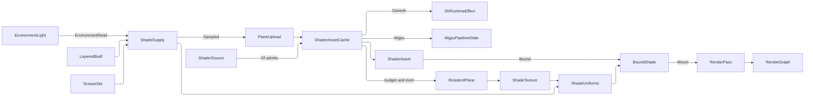

# [APPUI_RENDER_SHADING]

One GPU shader-asset owner with a per-backend, byte-budgeted residency cache feeds the path tracer's Materials closure: `ShaderAssetCache` retains a compiled shader keyed per `GpuBackend` (`SKRuntimeEffect` for the Skia Ganesh family, `Silk.NET.WebGPU` pipeline state for the Wgpu family) beside every native plane a bound roster row addresses, and `ShaderShade` is the GPU shading pass consuming the `LayeredBsdf` the path-trace integrator also shades from. The page owns shader compilation, plane residency and its eviction, retained program and native-texture lifetime, cache identity, and the GPU shading pass while sharing the viewport's one `Wgpu` device, consuming the Materials appearance model, and confining `SKSurface` ownership to `Offscreen`.

`ShaderSource` declares its bindings as DATA — one admitted `ShaderBinding` row per shader slot naming its `ShadeSource`, so a uniform write is a roster fold and a shader-local uniform name never appears as a literal in a bind arm. Every source resolves through ONE `ShadeSupply` answer, so a scalar run, a sampled plane, and a packed lane are three rows of one resolution rather than three bind arms. Texture slots key on the Materials `Rasm.Materials.Raster.TextureChannel` roster, never an AppUi-local channel vocabulary; `TextureSet` supplies the channel and packed pyramids and `EnvironmentLight` supplies the prefiltered dome the raster pass reads instead of marching, so this page uploads and binds and never mints a plane, a transfer, a sampler law, a channel name, or a lighting integral. `SKRuntimeEffect`, `Silk.NET.WebGPU`, Thinktecture, and LanguageExt supply the substrate; the CPU `LayeredBsdf` evaluation is the reference path.

## [01]-[INDEX]

- [02]-[SHADER_ASSET]: Per-`GpuBackend` shader and budgeted plane residency; `SKRuntimeEffect` and wgpu pipeline-state compile; the admitted `ShaderBinding` roster and its one `ShadeSupply` resolution.
- [03]-[SURFACE_SHADE]: The GPU shading pass consuming the Materials `LayeredBsdf`, channel-value closure, bound `TextureSet`, and resolved `EnvironmentLight`.

## [02]-[SHADER_ASSET]

- Owner: `ShaderAsset` the per-backend compiled-shader cell; `ShaderProgram` the closed Ganesh-or-Wgpu retained native program; `ShadeTexture` the closed Ganesh-or-Wgpu retained native texture; `ResidentPlane` the native plane beside its byte cost and eviction touch; `ShaderBinding` the shader-slot roster row; `ShadeSource` the value each row pulls; `EnvironmentRead` the image-based-lighting row family; `ShadeSupply` the ONE answer a source resolves to; `ShaderSource` the admitted backend-neutral shader source; `PlaneUpload` the backend-neutral upload request; `WgpuShaderCompiler` the composition-bound wgpu compile-and-upload capsule with its owned `WgpuPipelineState`; `ShaderAssetCache` the one residency owner over both retained kinds; `ShaderReceipt` the compile evidence; `ShaderFault` the fault family on `AppUiFaultBand.Shader`.
- Cases: `ShaderFault` = Text | CompileFailed | BackendUnsupported | UniformAbsent | PlaneUnbindable — codes derive through the `AppUiFaultBand.Shader` registry row (6110); the hex band is dead. `ShadeSource` = Channel | Lobes | Ambient — a binding pulls one `TextureChannel` column, the `LayeredBsdf` weight vector, or one `EnvironmentRead` row, and a fourth source is a case, never a second uniform struct. `ShadeSupply` = Lanes | Plane | Absent — a scalar run, a native-bound level chain with its lane offset, or the typed nothing a set that does not carry the row resolves to.
- Law: the binding roster is the ONLY place a shader slot name exists. A bind arm folds `ShaderSource.Bindings` and asks each row for its `ShadeSupply`, so adding a channel to the shader is one roster row and a hardcoded `"baseColor"` write in a bind arm is the deleted form. The row's `Group`/`Slot` are the wgpu binding coordinates the compiler capsule reads; the Ganesh arm addresses by `Name` alone, so one roster serves both layouts without a per-backend roster.
- Law: the roster ADMITS at `ShaderSource.Of` and never at draw time. Duplicate slot names, a colliding `(Group, Slot)` pair, a second `Lobes` row, a fixed-lane `ShaderUniformKind` disagreeing with its source's own arity, and a sampled channel row carrying no `Swizzle` companion each refuse ONCE at construction; the Ganesh compile gates every row name against `SKRuntimeEffect.Uniforms`/`Children`, the effect's own declared slot lists, so `ShaderFault.UniformAbsent` is a compile verdict rather than a per-frame surprise. Draw-time re-validation of an admitted roster is the deleted form.
- Law: a PACKED channel binds its sheet AND its lane. `ChannelPack.Lane` is the one slot correspondence, so the sheet a roughness rides inside resolves to `(plane, lane)` and the bind fold writes the lane through the row's own `Swizzle` uniform — a WGSL or SkSL swizzle literal chosen by the shader author is the fork this forecloses, because the pack order is set data the shader cannot see.
- Law: the sampler follows the SET, never a literal. Address mode reads the set's own periodicity evidence — a `TileProof`-carrying set repeats, an ingested or UDIM set clamps, because repeating a plane `TileGate` never graded shows the seam the proof exists to certify and repeating a UDIM tile bleeds its neighbour — and filter follows the level count. An environment plane takes its address axes from the FROZEN equirect correspondence on its own `EnvironmentRead` row.
- Law: plane residency keys on the plane CONTENT key — a channel pyramid's own `Key`, an environment product's `ContentAddress.Value` — never the channel, the set, or the light. One plane shared by many sets or many lights uploads once, an edited plane re-keys and re-uploads, and a rebind at identical bytes reuses every resident handle. Residency is BUDGETED: the cache carries a byte ceiling, charges each plane its extent times its storage width, and evicts least-recently-touched cells until the total fits, so texture VRAM is governed exactly as the `Render/meshlets` `ResidencyBudget` governs geometry VRAM rather than growing until the device refuses.
- Law: ONLY the roster's own planes upload. Residency folds the bindings, not the set, so a shader naming three slots makes three planes resident out of a twenty-six-channel set and a whole-set upload is the deleted form — a set-wide residency is a roster that names every channel, never a second entry.
- Exemption: `UploadGanesh` is the page's one statement-bodied kernel — a row sweep through the plane's own decode rail into a caller-owned `SpanOwner<float>` staging rental, the ref-struct rental and the row-major write making an expression fold unrepresentable.
- Entry: `public Fin<ShaderAsset> Compile(ShaderSource source, GpuBackend backend)` probes the `(Key, Revision, Backend)` cell before compiling the admitted source; `public Fin<ShadeTexture> Resident(PlaneUpload request, GpuBackend backend, long generation)` makes one plane native under the budget; `public long Generation()` opens a resolution and is what the eviction pass protects; `public Option<ShaderAsset> Cached(string key, string revision, GpuBackend backend)` and `public Option<ShadeTexture> Held(UInt128 plane, GpuBackend backend)` expose the exact probes. Ganesh compiles through `SKRuntimeEffect.CreateShader` and uploads through `SKImage.FromPixelCopy`/`SKShader.CreateImage`; Wgpu compiles WGSL into a module and render pipeline whose `Bind(ShadeUniforms)` creates an owned per-draw bind group and whose `Mount(RenderTarget, nint)` records it on the active encoder before release, and uploads through the same capsule's `Upload`.
- Auto: a shader source compiles once per `(Key, Revision, GpuBackend)` cell and a plane chain uploads once per `(Key, GpuBackend)` cell. Each entry probes before native construction, a miss constructs, and a concurrent-race loser disposes its minted handle, so a revision change cannot reuse stale code and a re-shade of the same revision reuses one retained pipeline state and one retained texture per plane. `PlaneUpload` carries `TexturePlane` LEVELS rather than a materialized sampler image, so one upload shape serves a channel pyramid, a packed sheet, the stored equirect, the GGX prefilter ladder, and the split-sum LUT — the `AsImage` lift stays the CPU sampler's bridge and never allocates a whole `ShadeVec4` chain to hand the GPU one level. The Ganesh upload stages level 0 alone and lets `SKMipmapMode.Linear` build Skia's own box chain, so the authored `MipPolicy` — Kaiser, renormalize, or the variance coupling — survives on the Wgpu arm ONLY; that divergence is the declared Ganesh quality floor the receipt records, never a silent equivalence.
- Receipt: `ShaderReceipt` — shader key, backend, compile outcome, binding count, resident-plane count, resident bytes, mip fidelity, `Instant`; `TelemetryRow` contributes the shader-compiled, shader-failed, plane-resident, plane-byte, and plane-evicted instruments inward through the AppHost `TelemetryContributorPort`.
- Packages: SkiaSharp, Silk.NET.WebGPU, CommunityToolkit.HighPerformance, Thinktecture.Runtime.Extensions, LanguageExt.Core, NodaTime, Rasm.Materials (project)
- Growth: a new shader is one `ShaderSource` keyed into the cache; a new shader slot is one `ShaderBinding` row; a new lighting product is one `EnvironmentRead` row carrying its own `ShadeSupply` column; a new backend is one compile arm and one upload arm over the existing `GpuBackend` family; one shader instrument is one `InstrumentSpec` row on `ShaderAssets.TelemetryRow`; zero new surface.
- Boundary: the residency cache is keyed per `GpuBackend` — a per-host `GpuBackend`/`GRContext` construction in a shading arm is the `[04]-[BOUNDARIES]` rejected form, so the cache folds the leased context through the `Render/pipeline` `GpuBackend` target-factory column and a backend swap re-compiles and re-uploads one cell; the Ganesh shader is `SKRuntimeEffect` confined to the `Offscreen` capsule so an `SKSurface` outside the capsule is the `[04]-[BOUNDARIES]` rejected form; the wgpu pipeline-state and every wgpu texture share the one `Wgpu` device the viewport leases through the branch `ONE_WGPU_DEVICE` `EMBED_CAPSULE` law so a second GPU device for shading is the rejected form (`Render/shading ⇄ csharp:Rasm.Compute # [SHAPE]: shared ONE_WGPU_DEVICE`) — the raw `DeviceCreateTexture`/`TextureCreateView`/`DeviceCreateSampler`/`QueueWriteTexture` table stays inside the composition-bound `WgpuShaderCompiler`, this page holding `nint` handles alone; the runtime arm is SPIKE-gated exactly as the viewport — the CPU `LayeredBsdf` reference shade is the floor and the GPU compile is the SPIKE; the shader source is backend-neutral so a backend-specific shader literal is the rejected form, the per-backend lowering living in the compile arm; texel lanes arrive DECODED and scene-linear from `TexturePlane.Read`, the plane's own decode ladder, so the uploaded `SKImage` carries no tagged colour space (a tagged space re-transforms lanes the Materials decode already resolved) and a Render-side transfer curve, gamma divide, normal-map decode, SH reconstruction, or prefilter integral is the deleted form.

```csharp signature
// (Continues the Rasm.AppUi.Render compilation unit, plus:)
using System.Runtime.InteropServices;                 // MemoryMarshal.AsBytes — the one staging reinterpretation
using CommunityToolkit.HighPerformance.Buffers;       // SpanOwner<T> — the staging and row rentals
using Rasm.Materials.Appearance;                      // EnvironmentLight — the resolved dome the raster pass reads
using Rasm.Materials.Appearance.Bsdf;                 // LayeredBsdf
using Rasm.Materials.Appearance.Texture;              // ShadeVec4, SamplerState, AddressMode, FilterMode
using Rasm.Materials.Raster;                          // TextureChannel, TextureSet, TexturePlane, TexturePyramid, ChannelPack, AlphaMode, MipPolicy

[Union]
public abstract partial record ShaderFault : Expected, IValidationError<ShaderFault> {
    private ShaderFault(string detail, int code) : base(detail, code, None) { }

    public static ShaderFault Create(string message) => new Text(message);

    public sealed record Text : ShaderFault { public Text(string detail) : base(detail, AppUiFaultBand.Shader.Code(0)) { } }
    public sealed record CompileFailed : ShaderFault { public CompileFailed(string detail) : base(detail, AppUiFaultBand.Shader.Code(1)) { } }
    public sealed record BackendUnsupported : ShaderFault { public BackendUnsupported(string detail) : base(detail, AppUiFaultBand.Shader.Code(2)) { } }
    public sealed record UniformAbsent : ShaderFault { public UniformAbsent(string detail) : base(detail, AppUiFaultBand.Shader.Code(3)) { } }
    public sealed record PlaneUnbindable : ShaderFault { public PlaneUnbindable(string detail) : base(detail, AppUiFaultBand.Shader.Code(4)) { } }
}

// Lanes is the float run a fixed-width slot writes; Sampled marks the slot the texture arm binds; Run declares a
// variable-length float run whose length its own source carries. All three columns exist so the write arm and the
// admission gate dispatch on DATA — a kind-name switch inside either is the deleted form.
[SmartEnum<string>]
[KeyMemberEqualityComparer<ComparerAccessors.StringOrdinal, string>]
public sealed partial class ShaderUniformKind {
    public static readonly ShaderUniformKind Float = new("float", lanes: 1, sampled: false);
    public static readonly ShaderUniformKind Float2 = new("float2", lanes: 2, sampled: false);
    public static readonly ShaderUniformKind Float3 = new("float3", lanes: 3, sampled: false);
    public static readonly ShaderUniformKind Float4 = new("float4", lanes: 4, sampled: false);
    public static readonly ShaderUniformKind Matrix = new("matrix", lanes: 16, sampled: false);
    public static readonly ShaderUniformKind Int = new("int", lanes: 1, sampled: false);
    public static readonly ShaderUniformKind Run = new("run", lanes: 0, sampled: false);
    public static readonly ShaderUniformKind Texture = new("texture", lanes: 0, sampled: true);

    public int Lanes { get; }
    public bool Sampled { get; }
    public bool Fixed => Lanes > 0;
}

// The ONE answer a source resolves to. Run is the float lane run a scalar slot writes; Sampled is a level chain the
// residency arm makes native beside the lane offset a packed sheet's slot occupies; Absent is the typed nothing a set
// that does not carry the row resolves to, so a partially-baked material draws on its scalar fallbacks rather than
// railing. A fourth answer is a case, never a nullable column on Sampled.
[Union(ConversionFromValue = ConversionOperatorsGeneration.None)]
public abstract partial record ShadeSupply {
    private ShadeSupply() { }
    public sealed record Run(Arr<float> Values) : ShadeSupply;
    public sealed record Sampled(UInt128 Key, Seq<TexturePlane> Levels, SamplerState Sampler, MipPolicy Mip, int Lane) : ShadeSupply;
    public sealed record Absent : ShadeSupply;

    public static readonly ShadeSupply Nothing = new Absent();

    // ONE polymorphic admission over three input shapes — a double span, a double Seq, and a level chain — so a
    // caller never picks a factory by name and an empty chain resolves to the typed nothing rather than a bound
    // handle over no levels. The double-to-float narrowing lives HERE alone: the domain is double-precision and the
    // GPU lane is float, so the crossing is one site rather than a cast at every write.
    public static ShadeSupply Of(ReadOnlySpan<double> values) {
        float[] lanes = new float[values.Length];
        for (int at = 0; at < values.Length; at++) { lanes[at] = (float)values[at]; }
        return lanes.Length is 0 ? Nothing : new Run(toArr(lanes));
    }

    public static ShadeSupply Of(Seq<double> values) => Of(values.ToArray().AsSpan());

    public static ShadeSupply Of(UInt128 key, Seq<TexturePlane> levels, SamplerState sampler, MipPolicy mip, int lane = 0) =>
        levels.IsEmpty ? Nothing : new Sampled(key, levels, sampler, mip, lane);
}

// The image-based-lighting products a RASTER pass reads off the ONE EnvironmentLight the light rig resolved. A raster
// shade cannot march the dome the way Render/pathtrace integrates it, so it consumes the prefilter's own reduction:
// the SH9 irradiance run, the GGX roughness ladder AS DATA (never the level formula re-derived here), the stored
// orientation the shader un-rotates by, and three sampled planes. Each row carries ONE Supply column, so the bind fold
// asks a row for its answer exactly as it asks a channel — an ambient-specific bind arm does not exist.
[SmartEnum<string>]
[KeyMemberEqualityComparer<ComparerAccessors.StringOrdinal, string>]
public sealed partial class EnvironmentRead {
    public static readonly EnvironmentRead Irradiance = new("irradiance", ShaderUniformKind.Run,
        static light => ShadeSupply.Of(light.Products.Irradiance.Bands.Span));
    public static readonly EnvironmentRead SpecularLadder = new("specularLadder", ShaderUniformKind.Run,
        static light => ShadeSupply.Of(light.Products.RoughnessPerMip));
    public static readonly EnvironmentRead Orientation = new("orientation", ShaderUniformKind.Float2,
        static light => ShadeSupply.Of(Seq(light.Map.Intensity, light.Map.Rotation)));
    public static readonly EnvironmentRead Specular = new("specular", ShaderUniformKind.Texture,
        static light => ShadeSupply.Of(light.Blobs.Specular.Value, light.Products.Specular, DomeSampler, MipPolicy.None));
    public static readonly EnvironmentRead BrdfLut = new("brdfLut", ShaderUniformKind.Texture,
        static light => ShadeSupply.Of(light.Blobs.BrdfLut.Value, Seq1(light.Products.BrdfLut), LutSampler, MipPolicy.None));
    public static readonly EnvironmentRead Equirect = new("equirect", ShaderUniformKind.Texture,
        static light => ShadeSupply.Of(light.Blobs.Equirect.Value, Seq1(light.Map.Plane), DomeSampler, MipPolicy.None));

    // The FROZEN equirect correspondence's own address law — longitude wraps, latitude clamps at the poles — and the
    // LUT's two clamped axes. Both are the mapping the prefilter integrated under, carried as row data so the sampler
    // a level set binds under can never diverge from the one the products were built for.
    static readonly SamplerState DomeSampler = new(AddressMode.Repeat, AddressMode.Clamp, FilterMode.Trilinear);
    static readonly SamplerState LutSampler = new(AddressMode.Clamp, AddressMode.Clamp, FilterMode.Bilinear);

    public ShaderUniformKind Kind { get; }

    [UseDelegateFromConstructor]
    public partial ShadeSupply Supply(EnvironmentLight light);
}

// What a shader slot pulls. Channel names a Materials roster row — the SAME closed vocabulary the frozen texture-set
// wire carries — so an AppUi channel spelling cannot fork from the producer's. Lobes is the LayeredBsdf weight vector,
// the one value no channel row describes. Ambient is one EnvironmentRead row. Lanes is the source's own declared
// arity, which the roster admission checks its ShaderUniformKind against; zero declares a variable run or a plane.
[Union(ConversionFromValue = ConversionOperatorsGeneration.None)]
public abstract partial record ShadeSource {
    private ShadeSource() { }
    public sealed record Channel(TextureChannel Row) : ShadeSource;
    public sealed record Lobes : ShadeSource;
    public sealed record Ambient(EnvironmentRead Read) : ShadeSource;

    public static readonly ShadeSource LobeWeights = new Lobes();
    public static ShadeSource Of(TextureChannel row) => new Channel(row);
    public static ShadeSource Of(EnvironmentRead read) => new Ambient(read);

    public int Lanes => Switch(
        channel: static slot => slot.Row.Components,
        lobes: static _ => ShadeUniforms.LobeCount,
        ambient: static slot => slot.Read.Kind.Lanes);
}

// One shader slot. Name is the SkSL/WGSL identifier, Source the value it pulls, (Group, Slot) the wgpu binding
// coordinates the compiler capsule lays out, and Swizzle the int slot a SAMPLED channel row writes its packed lane
// into — the Ganesh arm addresses by Name and ignores both coordinates. Swizzle is Some on exactly the rows whose
// plane may arrive as one lane of an orm or mra sheet, and the admission gate enforces that correspondence.
public readonly record struct ShaderBinding(
    string Name, ShaderUniformKind Kind, ShadeSource Source, int Group, int Slot, Option<string> Swizzle);

// The admitted backend-neutral source. Of is the ONE construction: a roster that reaches a draw has already proven its
// names unique, its wgpu coordinates disjoint, its lane widths agreed, and its packed rows swizzle-bearing, so the
// draw fold reads data it can no longer disbelieve.
public sealed record ShaderSource(string Key, string Revision, string Sksl, string Wgsl, Seq<ShaderBinding> Bindings) {
    public static Fin<ShaderSource> Of(string key, string revision, string sksl, string wgsl, Seq<ShaderBinding> bindings) =>
        from _ in guard(!bindings.IsEmpty, (Error)new ShaderFault.UniformAbsent($"{key}: roster carries no binding"))
        from __ in guard(bindings.Map(static row => row.Name).Distinct().Count() == bindings.Count,
                (Error)new ShaderFault.UniformAbsent($"{key}: duplicate slot name"))
        from ___ in guard(bindings.Map(static row => (row.Group, row.Slot)).Distinct().Count() == bindings.Count,
                (Error)new ShaderFault.UniformAbsent($"{key}: colliding wgpu (group, slot)"))
        from ____ in guard(bindings.Count(static row => row.Source is ShadeSource.Lobes) <= 1,
                (Error)new ShaderFault.UniformAbsent($"{key}: a second lobe-weight slot"))
        from _____ in bindings.Fold(Fin.Succ(unit), (acc, row) => acc.Bind(_ => Admit(key, row)))
        select new ShaderSource(key, revision, sksl, wgsl, bindings);

    // Three row gates, each naming the offending slot: a fixed-width kind must match its source's declared arity, a
    // sampled kind must sit on a source that can supply a plane, and a sampled CHANNEL row must carry the swizzle slot
    // its packed lane rides — a pack order is set data no shader author can see, so an absent swizzle is a silent
    // wrong-lane read rather than a visible refusal.
    static Fin<Unit> Admit(string key, ShaderBinding row) =>
        (row.Kind.Fixed && row.Kind.Lanes != row.Source.Lanes, row.Kind.Sampled, row.Source, row.Swizzle.IsSome) switch {
            (true, _, _, _) => Fin.Fail<Unit>(new ShaderFault.UniformAbsent(
                $"{key}/{row.Name}: {row.Kind.Key} takes {row.Kind.Lanes} lanes, source carries {row.Source.Lanes}")),
            (_, true, ShadeSource.Lobes, _) => Fin.Fail<Unit>(new ShaderFault.UniformAbsent(
                $"{key}/{row.Name}: the lobe-weight vector is no plane")),
            (_, true, ShadeSource.Channel, false) => Fin.Fail<Unit>(new ShaderFault.UniformAbsent(
                $"{key}/{row.Name}: a sampled channel row carries no swizzle slot")),
            (_, false, _, true) => Fin.Fail<Unit>(new ShaderFault.UniformAbsent(
                $"{key}/{row.Name}: a scalar row carries a swizzle slot")),
            _ => Fin.Succ(unit),
        };
}

// The backend-neutral upload request over the plane's OWN levels — never a materialized sampler image. The chain is
// whatever the source published: a channel pyramid's fold, a GGX prefilter's independent roughness ladder, or one
// standalone LUT. Every remaining column reads off the base plane, so no column is a caller knob.
public readonly record struct PlaneUpload(
    UInt128 Key, Seq<TexturePlane> Levels, SamplerState Sampler, MipPolicy Mip) {
    public TexturePlane Base => Levels.Head;

    // Real device cost: the extent times the layer stack times the storage width the format row declares. A handle
    // count is not a budget — a 16k Rgba16 plane and an 8-bit mask cost the same handle and 512× the memory.
    public long Bytes => Levels.Fold(0L, static (sum, level) => sum + (level.Texels * level.Lanes * level.Format.Depth.Bytes));

    public static PlaneUpload Of(ShadeSupply.Sampled supply) => new(supply.Key, supply.Levels, supply.Sampler, supply.Mip);
}

// One resident plane: the native handle, its charged bytes, and the monotonic touch the eviction order reads.
public sealed record ResidentPlane(ShadeTexture Texture, long Bytes, long Touch) : IDisposable {
    public void Dispose() => Texture.Dispose();
}

// The retained native texture. The Ganesh arm keeps the image AND the shader built over it, because SKRuntimeEffect
// children bind an SKShader and rebuilding one per draw would re-wrap the same pixels every frame.
[Union(ConversionFromValue = ConversionOperatorsGeneration.None)]
public abstract partial record ShadeTexture : IDisposable {
    private ShadeTexture() { }
    public sealed record GaneshImage(SKImage Image, SKShader Sampled) : ShadeTexture;
    public sealed record WgpuTexture(nint View, nint Sampler, IDisposable Release) : ShadeTexture;

    public void Dispose() => Switch(
        ganeshImage: static texture => { texture.Sampled.Dispose(); texture.Image.Dispose(); },
        wgpuTexture: static texture => texture.Release.Dispose());
}

// The wgpu pipeline state owns the retained module and render pipeline. Bind returns the current owned
// bind group, Mount records and releases it, and Release drops retained handles.
public sealed record WgpuPipelineState(
    nint Module,
    nint Pipeline,
    Func<ShadeUniforms, Fin<(nint Handle, IDisposable Release)>> Bind,
    Func<RenderTarget, nint, Fin<Unit>> Mount,
    IDisposable Release) : IDisposable {
    public void Dispose() => Release.Dispose();
}

// The composition-bound wgpu capsule over the ONE_WGPU_DEVICE lease: the render-graph device seam builds it once, so
// the cache compiles pipeline state AND uploads texture planes with zero device reach of its own. Upload owns the
// whole authored level chain, which is why the mip policy survives on this arm alone.
public sealed record WgpuShaderCompiler(
    Func<ShaderSource, Fin<WgpuPipelineState>> Build,
    Func<PlaneUpload, Fin<ShadeTexture>> Upload);

[Union(ConversionFromValue = ConversionOperatorsGeneration.None)]
public abstract partial record ShaderProgram {
    private ShaderProgram() { }
    public sealed record Ganesh(SKRuntimeEffect Effect) : ShaderProgram;
    public sealed record Wgpu(WgpuPipelineState State) : ShaderProgram;

    public void Release() => Switch(
        ganesh: static program => program.Effect.Dispose(),
        wgpu: static program => program.State.Dispose());
}

public sealed record ShaderAsset(
    string Key,
    GpuBackend Backend,
    ShaderProgram Program,
    Seq<ShaderBinding> Bindings) : IDisposable {
    public void Dispose() => Program.Release();
}

public sealed record ShaderReceipt(
    string Key, GpuBackend Backend, bool Compiled, int Bindings, int ResidentPlanes, long ResidentBytes, bool AuthoredMips, Instant At) {
    public const string Kind = "shader";
}

public sealed record ShaderAssetCache(
    System.Collections.Concurrent.ConcurrentDictionary<(string Key, string Revision, string Backend), ShaderAsset> Assets,
    System.Collections.Concurrent.ConcurrentDictionary<(UInt128 Plane, string Backend), ResidentPlane> Planes,
    Option<WgpuShaderCompiler> Compiler,
    long PlaneBudgetBytes) {
    // The residency clock and the charged total are the cache's two measured cells — the page's ONLY mutable state,
    // seated beside the concurrent maps that already own theirs, because an eviction order needs a monotonic touch and
    // a budget needs a running sum no dictionary derives in constant time.
    private long _clock;
    private long _charged;

    public static ShaderAssetCache Of(long planeBudgetBytes, Option<WgpuShaderCompiler> compiler = default) =>
        new(new(), new(), compiler, planeBudgetBytes);

    public long ChargedBytes => Interlocked.Read(ref _charged);

    // A resolution GENERATION: every plane a single ShadeUniforms.Of makes resident touches at or above this value,
    // and eviction never releases a cell at or above the generation it was handed. That one comparison is what makes a
    // handle a bound draw holds unreleasable — a budgeted cache without it disposes the texture the current frame is
    // reading the moment the next material overruns the ceiling.
    public long Generation() => Interlocked.Increment(ref _clock);

    // Probe-first, compile-on-miss: a cache hit never constructs a native handle, and the loser of a
    // concurrent GetOrAdd race disposes its freshly minted asset — one retained compiled handle per
    // (Key, Revision, GpuBackend) cell, so the compile-once invariant is the cache's own behavior.
    public Fin<ShaderAsset> Compile(ShaderSource source, GpuBackend backend) =>
        Cached(source.Key, source.Revision, backend).Match(
            Some: Fin<ShaderAsset>.Succ,
            None: () => Ganeshy(backend)
                ? CompileGanesh(source, backend)
                : Wgpuey(backend)
                    ? CompileWgpu(source, backend)
                    : Fin.Fail<ShaderAsset>(new ShaderFault.BackendUnsupported(backend.Key)));

    public Option<ShaderAsset> Cached(string key, string revision, GpuBackend backend) =>
        Assets.TryGetValue((key, revision, backend.Key), out ShaderAsset? asset) ? Some(asset) : None;

    public Option<ShadeTexture> Held(UInt128 plane, GpuBackend backend) =>
        Planes.TryGetValue((plane, backend.Key), out ResidentPlane? cell) ? Some(cell.Texture) : None;

    // ONE residency entry over ONE plane chain, whatever published it — a channel pyramid, a packed sheet, the stored
    // equirect, the GGX ladder, the split-sum LUT. A hit RE-TOUCHES so the eviction order tracks use rather than
    // upload age; a miss uploads on the backend's own arm and charges the budget.
    public Fin<ShadeTexture> Resident(PlaneUpload request, GpuBackend backend, long generation) =>
        Planes.TryGetValue((request.Key, backend.Key), out ResidentPlane? cell)
            ? Fin.Succ(Touched((request.Key, backend.Key), cell, generation))
            : ((Ganeshy(backend), Wgpuey(backend)) switch {
                (true, _) => UploadGanesh(request),
                (_, true) => Compiler.ToFin(new ShaderFault.BackendUnsupported($"{backend.Key}: no wgpu compiler bound"))
                    .Bind(compiler => compiler.Upload(request)),
                _ => Fin.Fail<ShadeTexture>(new ShaderFault.BackendUnsupported(backend.Key)),
            }).Bind(minted => Charge(request, backend, minted, generation));

    static bool Ganeshy(GpuBackend backend) => backend.Family == GpuFamily.SkiaGanesh || backend.Family == GpuFamily.SkiaRaster;
    static bool Wgpuey(GpuBackend backend) => backend.Family == GpuFamily.Wgpu || backend.Family == GpuFamily.WebGpu;

    ShaderAsset Retained(string revision, ShaderAsset minted) {
        ShaderAsset held = Assets.GetOrAdd((minted.Key, revision, minted.Backend.Key), minted);
        if (!ReferenceEquals(held, minted)) { minted.Dispose(); }
        return held;
    }

    // A lost TryUpdate race leaves the older touch, which only makes the cell a slightly better eviction candidate —
    // never a correctness fork, so the re-touch stays lock-free.
    ShadeTexture Touched((UInt128 Plane, string Backend) at, ResidentPlane held, long generation) {
        Planes.TryUpdate(at, held with { Touch = generation }, held);
        return held.Texture;
    }

    // Admit under the ceiling. A chain larger than the WHOLE budget refuses rather than evicting the estate to fail
    // anyway; a concurrent-insertion loser disposes its own handle; the winner charges the total and evicts.
    Fin<ShadeTexture> Charge(PlaneUpload request, GpuBackend backend, ShadeTexture minted, long generation) {
        if (request.Bytes > PlaneBudgetBytes) {
            minted.Dispose();
            return Fin.Fail<ShadeTexture>(new ShaderFault.PlaneUnbindable(
                $"{request.Key:X32}: {request.Bytes} bytes over the {PlaneBudgetBytes} byte plane ceiling"));
        }
        ResidentPlane cell = new(minted, request.Bytes, generation);
        ResidentPlane held = Planes.GetOrAdd((request.Key, backend.Key), cell);
        if (!ReferenceEquals(held, cell)) { cell.Dispose(); return Fin.Succ(held.Texture); }
        Interlocked.Add(ref _charged, request.Bytes);
        Evict(backend, generation);
        return Fin.Succ(minted);
    }

    // Least-recently-touched eviction within the SAME backend, protecting every cell the live resolution touched. The
    // loop re-reads the charged total each pass because a concurrent admission moves it, and it exits when no
    // releasable victim remains — an over-budget frame whose every plane is live draws rather than thrashing.
    void Evict(GpuBackend backend, long generation) {
        while (Interlocked.Read(ref _charged) > PlaneBudgetBytes) {
            (UInt128 Plane, string Backend) victim = Planes
                .Where(pair => pair.Key.Backend == backend.Key && pair.Value.Touch < generation)
                .OrderBy(static pair => pair.Value.Touch)
                .Select(static pair => pair.Key)
                .FirstOrDefault();
            if (victim.Backend is null || !Planes.TryRemove(victim, out ResidentPlane? released)) { return; }
            Interlocked.Add(ref _charged, -released.Bytes);
            released.Dispose();
        }
    }

    Fin<ShaderAsset> CompileGanesh(ShaderSource source, GpuBackend backend) =>
        SKRuntimeEffect.CreateShader(source.Sksl, out string error) is { } effect
            ? Declared(source, effect).Map(_ => Retained(source.Revision, new ShaderAsset(
                source.Key, backend, new ShaderProgram.Ganesh(effect), source.Bindings)))
            : Fin.Fail<ShaderAsset>(new ShaderFault.CompileFailed($"{source.Key}: {error}"));

    // The compiled effect publishes its OWN declared slot names on Uniforms and Children, so a roster row — or the
    // swizzle companion a packed row rides — naming a slot the SkSL does not declare refuses HERE, at the one place
    // the two vocabularies meet, instead of writing into a builder that silently drops it. A refused effect disposes,
    // so a rejected compile leaks no native handle.
    static Fin<Unit> Declared(ShaderSource source, SKRuntimeEffect effect) =>
        source.Bindings
            .Bind(row => Seq<(string Name, bool Sampled)>((row.Name, row.Kind.Sampled))
                .Concat(row.Swizzle.Map(static name => (Name: name, Sampled: false)).ToSeq()))
            .Find(slot => !(slot.Sampled ? effect.Children : effect.Uniforms).Contains(slot.Name))
            .Match(
                Some: slot => {
                    effect.Dispose();
                    return Fin.Fail<Unit>(new ShaderFault.UniformAbsent($"{source.Key}/{slot.Name}: the effect declares no such slot"));
                },
                None: () => Fin.Succ(unit));

    // The Wgpu arm compiles through the bound capsule: an unbound compiler is the typed no-device state
    // and a compile error carries its WGSL diagnostic — a no-op asset or a Ganesh fallback mislabelled as
    // Wgpu cannot type.
    Fin<ShaderAsset> CompileWgpu(ShaderSource source, GpuBackend backend) =>
        Compiler
            .ToFin(new ShaderFault.BackendUnsupported($"{backend.Key}: no wgpu compiler bound"))
            .Bind(compiler => compiler.Build(source)
                .MapFail(fault => (Error)new ShaderFault.CompileFailed($"{source.Key}: {fault.Message}")))
            .Map(state => Retained(source.Revision, new ShaderAsset(
                source.Key, backend, new ShaderProgram.Wgpu(state), source.Bindings)));

    // Level 0 staged as RGBA32F through the plane's OWN decode rail: Read yields scene-linear lanes with the transfer
    // already resolved, so the info carries NO colour space and Skia re-transforms nothing. The single-lane broadcast
    // and the opaque alpha default are SKIA'S format concession, not a Materials law — SKColorType ships no one- or
    // two-component float row, so a mask uploads as a grey texel and the shader reads the lane its swizzle names.
    // Association follows the plane, so the reconstruction filter weights coverage exactly as the CPU sampler does; a
    // LAYERED chain refuses, because one SKImage carries one layer and the cube and array arms are the Wgpu arm's.
    static Fin<ShadeTexture> UploadGanesh(PlaneUpload request) {
        TexturePlane level = request.Base;
        if (level.Layers.Value is not 1) {
            return Fin.Fail<ShadeTexture>(new ShaderFault.PlaneUnbindable($"{request.Key:X32}: {level.Layers.Value} layers on the Ganesh arm"));
        }
        (int width, int height, int lanes) = (level.Width.Value, level.Height.Value, level.Lanes);
        using SpanOwner<float> staging = SpanOwner<float>.Allocate(width * height * 4);
        using SpanOwner<double> row = SpanOwner<double>.Allocate(width * lanes);
        for (int y = 0; y < height; y++) {
            level.Read(y, layer: 0, row.Span);
            for (int x = 0; x < width; x++) {
                ReadOnlySpan<double> texel = row.Span.Slice(x * lanes, lanes);
                int at = ((y * width) + x) * 4;
                (staging.Span[at], staging.Span[at + 1], staging.Span[at + 2], staging.Span[at + 3]) = (
                    (float)texel[0],
                    (float)(lanes > 1 ? texel[1] : texel[0]),
                    (float)(lanes > 2 ? texel[2] : texel[0]),
                    (float)(level.Alpha.Carries ? texel[lanes - 1] : 1.0));
            }
        }
        SKImageInfo info = new(width, height, SKColorType.RgbaF32, Association(level.Alpha));
        return SKImage.FromPixelCopy(info, MemoryMarshal.AsBytes(staging.Span)) is { } image
            ? Fin.Succ<ShadeTexture>(new ShadeTexture.GaneshImage(image, SKShader.CreateImage(
                image, Tile(request.Sampler.AddressU), Tile(request.Sampler.AddressV), Sampling(request.Sampler))))
            : Fin.Fail<ShadeTexture>(new ShaderFault.PlaneUnbindable($"{request.Key:X32}: pixel copy refused"));
    }

    // Three mechanical projections of Materials axes onto Skia axes — each a total row map, never a new vocabulary.
    static SKAlphaType Association(AlphaMode alpha) =>
        alpha == AlphaMode.Associated ? SKAlphaType.Premul : alpha == AlphaMode.Straight ? SKAlphaType.Unpremul : SKAlphaType.Opaque;

    static SKShaderTileMode Tile(AddressMode address) =>
        address == AddressMode.Clamp ? SKShaderTileMode.Clamp : address == AddressMode.Mirror ? SKShaderTileMode.Mirror : SKShaderTileMode.Repeat;

    static SKSamplingOptions Sampling(SamplerState sampler) =>
        sampler.Filter == FilterMode.Nearest
            ? new SKSamplingOptions(SKFilterMode.Nearest, SKMipmapMode.None)
            : new SKSamplingOptions(SKFilterMode.Linear, sampler.Filter == FilterMode.Trilinear ? SKMipmapMode.Linear : SKMipmapMode.None);

    public const string CompiledInstrument = "rasm.appui.shader.compiled";
    public const string FailedInstrument = "rasm.appui.shader.failed";
    public const string PlaneInstrument = "rasm.appui.shader.plane.resident";
    public const string PlaneByteInstrument = "rasm.appui.shader.plane.bytes";
    public const string PlaneEvictInstrument = "rasm.appui.shader.plane.evicted";

    public static TelemetryContributorPort TelemetryRow(string version) =>
        AppUiTelemetry.Contribute(version,
            InstrumentSpec.Count(CompiledInstrument, "{shader}", "shader compiles by backend", MeasureForm.Whole),
            InstrumentSpec.Count(FailedInstrument, "{shader}", "shader compile failures by backend", MeasureForm.Whole),
            InstrumentSpec.Count(PlaneInstrument, "{plane}", "planes uploaded by backend and source", MeasureForm.Whole),
            InstrumentSpec.Level(PlaneByteInstrument, "By", "plane bytes charged against the residency ceiling", MeasureForm.Whole),
            InstrumentSpec.Count(PlaneEvictInstrument, "{plane}", "planes the residency ceiling released", MeasureForm.Whole));
}
```

## [03]-[SURFACE_SHADE]

- Owner: `ShaderShade` the GPU shading pass consuming the Materials `LayeredBsdf`; `ShadeUniforms` the per-material slot map every binding row resolves into; `BoundSlot` the resolved per-slot value; `BoundShade` the mounted per-frame shading artifact.
- Entry: `public Fin<RenderPass> Pass(ShadeUniforms uniforms)` on `ShaderAsset` projects the compiled shader and resolved slot map into one `Render/pipeline` `RenderPass` the render graph schedules; `public static Fin<ShadeUniforms> Of(ShaderSource source, LayeredBsdf bsdf, Func<TextureChannel, ShadeVec4> fallback, Option<TextureSet> set, Option<EnvironmentLight> dome, ShaderAssetCache cache, GpuBackend backend)` is the ONE resolution — it folds the admitted roster, resolves each source to its `ShadeSupply`, and makes exactly the sampled answers resident under one generation.
- Law: ONE resolution answers every source. A scalar channel reads the Materials closure, a sampled channel reads the set, the lobe row reads the layered weights, and an ambient row reads its own `EnvironmentRead` column — four inputs, one `ShadeSupply` answer, so a fifth source is a row rather than a second uniform struct and a second bind arm. An `Absent` answer binds nothing and the shader's declared scalar fallback stands, so a partially-baked material draws.
- Law: image-based lighting is READ, never integrated. `EnvironmentLight` already holds the SH9 irradiance run, the GGX roughness ladder, the split-sum LUT, the stored equirect, and the dome's own intensity and rotation on the owner that prefiltered them, so this pass binds those products and the shader reconstructs a shade the `Render/pathtrace` integrator reaches by transport instead. A Render-side SH reconstruction, prefilter integral, or roughness-to-level formula is the deleted form — the ladder crosses AS DATA, so the level a raster shade picks and the level the prefilter wrote agree by construction.
- Auto: the shading pass consumes the `Rasm.Materials/Appearance` `LayeredBsdf` and channel-value closure the Materials lowering produces, the `TextureSet` the `Raster/press` bake or `Raster/set` ingest produced, and the `EnvironmentLight` the `Appearance/environment` prefilter resolved. `ShadeUniforms.Of` resolves them once per material and `RenderPass.Geometry` mounts the resulting `BoundShade`, so the GPU shader evaluates the same `LayeredBsdf`, the same planes, and the same dome the CPU `Render/pathtrace` integrator shades from — the two integrators are comparable because they read one appearance model and one light rig, not because they were written to match. The per-backend split remains in compile and upload, so shading rides the one render graph.
- Packages: SkiaSharp, Silk.NET.WebGPU, Thinktecture.Runtime.Extensions, LanguageExt.Core, Rasm.Materials (project)
- Growth: a new shading parameter is one `TextureChannel` row at the Materials owner and one `ShaderBinding` row here; a new lighting product is one `EnvironmentRead` row; zero new surface — the shader consumes the roster, never re-derives it, and the roster's cardinality tracks the OpenPBR vector by construction.
- Boundary: the shading pass consumes the Materials `LayeredBsdf`, channel-value closure, `TextureSet`, and `EnvironmentLight`; the `csharp:Rasm.Materials/Appearance` seam supplies the closure and the resolved dome and the `csharp:Rasm.Materials/Raster` seam supplies planes (`Render <- csharp:Rasm.Materials/Appearance # [BOUNDARY]: LayeredBsdf / channel-value closure / EnvironmentLight at the shading pass`, `Render <- csharp:Rasm.Materials/Raster # [BOUNDARY]: TextureSet / TexturePlane levels at the sampler bind`). The GPU shader and CPU integrator evaluate the same `LayeredBsdf` over the same planes and the same dome. The pass mounts through the one `Render/pipeline` graph. A material resolves to one slot map and bind group at shade time. `Render/pathtrace#LIGHT_RIG` supplies the shared `LightSource` family and resolves the same `EnvironmentLight` row this pass binds. The viewport leases the shared `Wgpu` device. A LAYERED set or a cube-face dome reaches the Wgpu arm alone, the Ganesh upload declaring the single-layer refusal rather than binding face zero as the whole map.

```csharp signature
// One resolved slot: the lane run a scalar write takes, or the native plane a sampled write takes beside the packed
// lane its swizzle companion carries. An unresolved slot is ABSENT from the map rather than a null cell.
[Union(ConversionFromValue = ConversionOperatorsGeneration.None)]
public abstract partial record BoundSlot {
    private BoundSlot() { }
    public sealed record Lanes(Arr<float> Values) : BoundSlot;
    public sealed record Sampled(ShadeTexture Texture, int Lane) : BoundSlot;
}

// The per-material slot map, keyed by the admitted roster's own slot names. The draw fold is a lookup, because every
// resolution — the closure read, the set probe, the pack lane, the dome product, the device upload — already ran here.
public readonly record struct ShadeUniforms(HashMap<string, BoundSlot> Slots) {
    public const int LobeCount = 7;

    // ONE generation opens the resolution and every plane it touches carries it, so the eviction pass cannot release a
    // handle this map is about to hand a draw. The fold is over the ROSTER, never the set — a shader naming three
    // slots makes three planes resident out of a twenty-six-channel set.
    public static Fin<ShadeUniforms> Of(
        ShaderSource source,
        LayeredBsdf bsdf,
        Func<TextureChannel, ShadeVec4> fallback,
        Option<TextureSet> set,
        Option<EnvironmentLight> dome,
        ShaderAssetCache cache,
        GpuBackend backend) =>
        cache.Generation() switch {
            var generation => source.Bindings
                .Fold(Fin.Succ(HashMap<string, BoundSlot>.Empty), (acc, row) => acc.Bind(map =>
                    Resolve(row, bsdf, fallback, set, dome, cache, backend, generation)
                        .Map(slot => slot.Match(Some: bound => map.Add(row.Name, bound), None: () => map))))
                .Map(static map => new ShadeUniforms(map)),
        };

    // Supply first, device second: only a Sampled answer reaches the residency arm, so a scalar row costs no probe and
    // an Absent row costs nothing at all.
    static Fin<Option<BoundSlot>> Resolve(
        ShaderBinding row, LayeredBsdf bsdf, Func<TextureChannel, ShadeVec4> fallback,
        Option<TextureSet> set, Option<EnvironmentLight> dome,
        ShaderAssetCache cache, GpuBackend backend, long generation) =>
        Supply(row, bsdf, fallback, set, dome) switch {
            ShadeSupply.Run run => Fin.Succ(Some<BoundSlot>(new BoundSlot.Lanes(run.Values))),
            ShadeSupply.Sampled plane => cache.Resident(PlaneUpload.Of(plane), backend, generation)
                .Map(texture => Some<BoundSlot>(new BoundSlot.Sampled(texture, plane.Lane))),
            _ => Fin.Succ(Option<BoundSlot>.None),
        };

    // The source-to-supply fold. A Channel row consults the SET when its slot samples and the Materials closure when it
    // does not — the same row, two modalities, discriminated by the binding's own Kind rather than by two rosters.
    // Lobes projects the layered weight vector; Ambient asks its own EnvironmentRead row for the prefiltered product.
    static ShadeSupply Supply(
        ShaderBinding row, LayeredBsdf bsdf, Func<TextureChannel, ShadeVec4> fallback,
        Option<TextureSet> set, Option<EnvironmentLight> dome) =>
        row.Source.Switch(
            state: (Sampled: row.Kind.Sampled, Bsdf: bsdf, Fallback: fallback, Set: set, Dome: dome),
            channel: static (context, slot) => context.Sampled
                ? context.Set.Map(bound => Plane(bound, slot.Row)).IfNone(ShadeSupply.Nothing)
                : ShadeSupply.Of(Take(context.Fallback(slot.Row), slot.Row.Components)),
            lobes: static (context, _) => ShadeSupply.Of(context.Bsdf.Lobes.Map(static lobe => lobe.Weight.Value).ToSeq()),
            ambient: static (context, slot) => context.Dome.Map(light => slot.Read.Supply(light)).IfNone(ShadeSupply.Nothing));

    // Standalone first, then the packed sheet. A set whose roughness rides inside an orm plane resolves the roughness
    // slot to that sheet AND to the lane ChannelPack.Lane names, so the shader reads the right component without a
    // swizzle literal the pack order would silently invalidate.
    static ShadeSupply Plane(TextureSet set, TextureChannel channel) =>
        set.Channels.Find(channel)
            .Map(pyramid => ShadeSupply.Of(pyramid.Key, pyramid.Levels, Sampler(set, pyramid.Levels.Count), pyramid.Policy))
            .IfNone(() => set.Packs
                .Find(pack => pack.Present.Contains(channel))
                .Bind(pack => pack.Pack.Lane(channel).Map(lane => ShadeSupply.Of(
                    pack.Plane.Key, pack.Plane.Levels, Sampler(set, pack.Plane.Levels.Count), pack.Plane.Policy, lane)))
                .IfNone(ShadeSupply.Nothing));

    // The address axes are SET DATA. A TileProof-carrying set repeats because the gate graded its periodicity, while an
    // ingested or UDIM set clamps — repeating an ungraded plane shows the seam the proof exists to certify, and
    // repeating a UDIM tile bleeds its neighbour across the tile boundary.
    static SamplerState Sampler(TextureSet set, int levels) =>
        new(Address(set), Address(set), levels > 1 ? FilterMode.Trilinear : FilterMode.Bilinear);

    static AddressMode Address(TextureSet set) =>
        set.Tiled.IsSome && set.Udim.IsEmpty ? AddressMode.Repeat : AddressMode.Clamp;

    // The roster's Components column is the semantic count and the texel is always four lanes, so the prefix IS the
    // channel's value — a per-arity switch would re-describe a number the row already carries.
    static Seq<double> Take(ShadeVec4 texel, int components) => Seq(texel.X, texel.Y, texel.Z, texel.W).Take(components);
}

// The bound per-frame shading artifact the geometry pass MOUNTS — never a discarded builder: the Ganesh
// SKShader lands on the pass paint's Shader slot, the Wgpu bind group lands on the RenderPassEncoder at the
// encoder seam. One shade, two mount points; uniform values change per frame, the compiled handle never.
[Union(ConversionFromValue = ConversionOperatorsGeneration.None)]
public abstract partial record BoundShade {
    private BoundShade() { }
    public sealed record GaneshShader(SKShader Shader) : BoundShade;
    public sealed record WgpuBindGroup(
        nint BindGroup,
        Func<RenderTarget, nint, Fin<Unit>> Bind,
        IDisposable Release) : BoundShade {
        public Fin<Unit> Mount(RenderTarget target) {
            try { return Bind(target, BindGroup); }
            finally { Release.Dispose(); }
        }
    }

    // The floor mounts the shader on the composited paint, while the Wgpu arm executes the compiler-bound
    // encoder-side SetBindGroup delegate against the active target.
    public Fin<Unit> Mount(RenderTarget target) => Switch(
        state: target,
        ganeshShader: static (active, ganesh) => active.Surface.Match(
            Some: surface => {
                using SKShader shader = ganesh.Shader;
                using SKPaint paint = new() { Shader = shader };
                surface.Canvas.DrawPaint(paint);
                return FinSucc(unit);
            },
            None: () => Fin.Fail<Unit>(new ShaderFault.BackendUnsupported("shade/mount: no raster surface"))),
        wgpuBindGroup: static (active, wgpu) => wgpu.Mount(active));
}

public static class ShaderShade {
    extension(ShaderAsset asset) {
        public Fin<RenderPass> Pass(ShadeUniforms uniforms) =>
            Fin<RenderPass>.Succ(new RenderPass.Geometry(
                $"shade/{asset.Key}",
                (target, _, visible) => asset.Bound(uniforms).Bind(bound => bound.Mount(target)).Map(_ => visible)));

        // Both arms fold the SAME binding roster over the SAME resolved map: the Ganesh arm writes each lane run onto
        // Uniforms, each sampled plane onto Children (SKRuntimeEffectChild converts implicitly from SKShader), and each
        // packed lane onto the row's own Swizzle slot, while the Wgpu arm hands the whole map to the capsule's Bind,
        // which lays the group out from the rows' own (Group, Slot). A slot absent from the map writes nothing and the
        // shader's declared fallback stands, so a partially-baked set draws rather than refusing — and the roster's own
        // well-formedness is ShaderSource.Of's verdict, never a per-frame re-check here.
        private Fin<BoundShade> Bound(ShadeUniforms uniforms) =>
            asset.Program.Switch(
                state: (Asset: asset, Values: uniforms),
                ganesh: static (context, program) => {
                    using SKRuntimeShaderBuilder builder = program.Effect.BuildShader();
                    context.Asset.Bindings.Iter(row => context.Values.Slots.Find(row.Name).Iter(slot => slot.Switch(
                        state: (Builder: builder, Row: row),
                        lanes: static (bind, run) => bind.Builder.Uniforms[bind.Row.Name] = run.Values.ToArray(),
                        sampled: static (bind, plane) => {
                            if (plane.Texture is ShadeTexture.GaneshImage image) {
                                bind.Builder.Children[bind.Row.Name] = image.Sampled;
                                bind.Row.Swizzle.Iter(name => bind.Builder.Uniforms[name] = plane.Lane);
                            }
                        })));
                    return Fin.Succ<BoundShade>(new BoundShade.GaneshShader(builder.Build()));
                },
                wgpu: static (context, program) => program.State.Bind(context.Values)
                    .Map(group => (BoundShade)new BoundShade.WgpuBindGroup(
                        group.Handle, program.State.Mount, group.Release)));
    }
}
```


```mermaid
---
config:
  layout: elk
  flowchart:
    curve: linear
    padding: 25
---
flowchart LR
    accTitle: Shader compilation, supply resolution, budgeted plane residency, and mounting flow
    accDescr: An admitted roster compiles per backend while every binding source resolves to one supply whose sampled answers become budgeted resident planes feeding the bound shade a render pass mounts.
    ShaderSource -->|Of admits| ShaderAssetCache
    ShaderAssetCache -->|Ganesh| SKRuntimeEffect
    ShaderAssetCache -->|Wgpu| WgpuPipelineState
    ShaderAssetCache --> ShaderAsset
    ShaderAssetCache -->|budget and evict| ResidentPlane
    ResidentPlane --> ShadeTexture
    LayeredBsdf --> ShadeSupply
    TextureSet --> ShadeSupply
    EnvironmentLight -->|EnvironmentRead| ShadeSupply
    ShadeSupply -->|Sampled| PlaneUpload
    PlaneUpload --> ShaderAssetCache
    ShadeSupply --> ShadeUniforms
    ShadeTexture --> ShadeUniforms
    ShaderAsset -->|Bound| BoundShade
    ShadeUniforms --> BoundShade
    BoundShade -->|Mount| RenderPass
    RenderPass --> RenderGraph
```

## [04]-[NATIVE_BOUNDARY]

- [SHADER_COMPILE]: `ShaderProgram` closes native program ownership over exactly one `SKRuntimeEffect` or `WgpuPipelineState`, and `ShadeTexture` closes native texture ownership over exactly one `SKImage`+`SKShader` pair or one wgpu view/sampler pair. `ShaderAssetCache` probes before native construction on both kinds, disposes a concurrent insertion loser, retains one program per `(Key, Revision, GpuBackend)` cell and one plane per `(plane content key, GpuBackend)` cell, and releases a plane only through the budgeted eviction pass that protects the live resolution's own generation. `SKRuntimeEffect.Uniforms` and `.Children` publish the compiled slot names the roster gates against; a refused compile disposes the effect.
- [BSDF_SHADE_SEAM]: `ShadeUniforms.Of` projects `LayeredBsdf.Lobes` into the weight run, reads each scalar `TextureChannel` through the Materials closure, and reads each `EnvironmentRead` off `EnvironmentLight.Products`/`.Map`/`.Blobs` — `Sh9.Bands` the irradiance run, `IblProducts.RoughnessPerMip` the roughness ladder, `EnvironmentMap.Intensity`/`.Rotation` the stored orientation. `ShaderProgram` binds those values through `SKRuntimeShaderBuilder.Uniforms`/`Children` or the composition-bound wgpu bind-group column, and both arms mount through `BoundShade` on the active `RenderTarget`.
- [PLANE_UPLOAD_SEAM]: `TexturePlane.Read(int, int, Span<double>)` yields decoded scene-linear lanes off the plane's own ladder, so the upload path consumes plane LEVELS — `TexturePyramid.Levels`, `IblProducts.Specular`, `IblProducts.BrdfLut`, `EnvironmentMap.Plane` — and leaves `AsImage` to the CPU sampler. The Ganesh arm stages level 0 as RGBA32F through `SKImage.FromPixelCopy(SKImageInfo, ReadOnlySpan<byte>)` and wraps it with `SKShader.CreateImage`; the Wgpu arm hands the whole `PlaneUpload` to the composition-bound capsule, which owns `DeviceCreateTexture`, `TextureCreateView`, `DeviceCreateSampler`, and `QueueWriteTexture` behind the one device lease.

## [05]-[RESEARCH]

- [GANESH_MIP_CHAIN]-[OPEN]: does an `SKImage` built from `FromPixelCopy` accept a caller-supplied mip chain on any SkiaSharp surface, or is `SKMipmapMode.Linear` the only Ganesh path and therefore the declared authored-policy loss?; verify against the landed SkiaSharp catalogue and, if a chain admits, upload every authored level on both arms and delete the fidelity column from `ShaderReceipt`.
- [GANESH_LADDER_LEVELS]-[OPEN]: the GGX prefilter ladder is a set of INDEPENDENT roughness integrals rather than a downsample chain, so binding it through `SKMipmapMode.Linear` would blend levels Skia generated instead of the levels the prefilter wrote; does any SkiaSharp surface bind an explicit level set, or does the Ganesh arm bind the roughness-nearest level alone and declare the interpolation loss the Wgpu arm keeps?; verify against the landed SkiaSharp catalogue and record the answer as an `EnvironmentRead` row column rather than a bind-arm branch.
