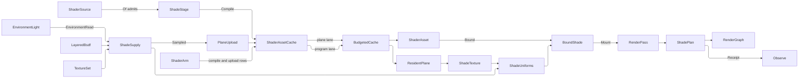

# [APPUI_RENDER_SHADING]

One GPU shader-asset owner with a per-backend, byte-budgeted residency cache feeds the path tracer's Materials closure: `ShaderAssetCache` composes the folder's ONE `Theme/assets` `BudgetedCache` twice — a program lane retaining a compiled shader per `GpuBackend` (`SKRuntimeEffect` for the Skia Ganesh family, `Silk.NET.WebGPU` pipeline state for the Wgpu family) and a plane lane holding every native plane a bound roster row addresses under a VRAM ceiling — and `ShaderShade` is the GPU shading pass consuming the `LayeredBsdf` the path-trace integrator also shades from. `ShaderAssetCache` owns shader compilation, plane residency, retained program and native-texture lifetime, and cache identity, while `ShadeStage` resolves a frame's materials and `ShaderShade` mounts the pass; all three share the viewport's one `Wgpu` device, consume the Materials appearance model, and confine `SKSurface` ownership to `Offscreen`.

`ShaderSource` declares its bindings as DATA — one admitted `ShaderBinding` row per shader slot naming its `ShadeSource`, so a uniform write is a roster fold and a shader-local uniform name never appears as a literal in a bind arm. Every source resolves through ONE `ShadeSupply` answer, so a scalar run, a sampled plane, and a packed lane are three rows of one resolution rather than three bind arms. Texture slots key on the Materials `Rasm.Materials.Raster.TextureChannel` roster, never an AppUi-local channel vocabulary; `TextureSet` supplies the channel and packed pyramids and `EnvironmentLight` supplies the prefiltered dome the raster pass reads instead of marching, so this page uploads and binds and never mints a plane, a transfer, a sampler law, a channel name, or a lighting integral. `SKRuntimeEffect`, `Silk.NET.WebGPU`, Thinktecture, and LanguageExt supply the substrate; the CPU `LayeredBsdf` evaluation is the reference path.

## [01]-[INDEX]

- [02]-[SHADER_ASSET]: Per-`GpuBackend` shader and budgeted plane residency over the folder's one `BudgetedCache`; `SKRuntimeEffect` and wgpu pipeline-state compile; the admitted `ShaderBinding` roster and its one `ShadeSupply` resolution.
- [03]-[SURFACE_SHADE]: `ShadeStage` resolves and mounts the shade pass from the Materials `LayeredBsdf`, channel-value closure, bound `TextureSet`, and resolved `EnvironmentLight`.

## [02]-[SHADER_ASSET]

- Owner: `ShaderAsset` the per-backend compiled-shader cell; `ShaderProgram` the closed Ganesh-or-Wgpu retained native program; `ShadeTexture` the closed Ganesh-or-Wgpu retained native texture; `ResidentPlane` the native plane beside its charged bytes; `SlotWidth` the closed slot-width family a uniform kind carries; `ShaderBinding` the shader-slot roster row; `ShadeSource` the value each row pulls; `EnvironmentRead` the image-based-lighting row family; `ShadeSupply` the ONE answer a source resolves to; `ShaderArm` the per-family compile, upload, and ladder-seat delegate rows; `AdmitOutcome` the residency admission partition; `ShaderSource` the admitted backend-neutral shader source; `PlaneUpload` the backend-neutral upload request; `WgpuShaderCompiler` the composition-bound wgpu compile-and-upload capsule with its owned `WgpuPipelineState`; `ShaderAssetCache` the one residency owner over both retained kinds; `ShaderReceipt` the compile evidence; `ShaderFault` the direct generated `[Union]` with one `[FaultCase]` leaf per shader failure.
- Cases: `ShaderFault` = CompileFailed | BackendUnsupported | UniformAbsent | PlaneUnbindable | DeviceLost; `ShadeSource` = Channel | Lobes | Ambient; `ShadeSupply` = Run | Sampled | Absent; `SlotWidth` = Exact | Run | Plane.
- Law: the binding roster is the ONLY place a shader slot name exists. Bind arms fold `ShaderSource.Bindings` and ask each row for its `ShadeSupply`, so adding a channel to the shader is one roster row and a hardcoded `"baseColor"` write in a bind arm is the deleted form. `Group`/`Slot` on the row carry the wgpu binding coordinates the compiler capsule reads, while the Ganesh arm addresses by `Name` alone, so one roster serves both layouts without a per-backend roster.
- Law: the roster ADMITS at `ShaderSource.Of` and never at draw time, and it refuses APPLICATIVELY — every roster gate and every row gate resolves against the same candidate, so a roster wrong on three slots names all three instead of the first the ladder met. Duplicate slot names, a colliding `(Group, Slot)` pair, a second `Lobes` row, a fixed-width `SlotWidth` disagreeing with its source's own arity, and a sampled channel row carrying no `Swizzle` companion each refuse at construction; the Ganesh compile gates every row name against `SKRuntimeEffect.Uniforms`/`Children`, the effect's own declared slot lists, so `ShaderFault.UniformAbsent` is a compile verdict rather than a per-frame surprise. Draw-time re-validation of an admitted roster is the deleted form.
- Law: a PACKED channel binds its sheet AND its lane. `ChannelPack.Lane` is the one slot correspondence, so the sheet a roughness rides inside resolves to `(plane, lane)` and the bind fold writes the lane through the row's own `Swizzle` uniform — a WGSL or SkSL swizzle literal chosen by the shader author is the fork this forecloses, because the pack order is set data the shader cannot see.
- Law: the sampler follows the SET, never a literal. Address mode reads the set's own periodicity evidence — only a set whose `Tiled` `Evidence<TileProof>` holds a measured proof the bar ACCEPTED repeats, while an ingested, refused, below-bar, or UDIM set clamps, because repeating a plane the gate never certified shows the seam the proof exists to certify (a below-bar proof MEASURED that seam) and repeating a UDIM tile bleeds its neighbour — and filter follows the level count. Every environment plane takes its address axes from the FROZEN equirect correspondence on its own `EnvironmentRead` row.
- Law: plane residency keys on the plane CONTENT key — a channel pyramid's own `Key`, an environment product's `ContentAddress.Value` — never the channel, the set, or the light. One plane shared by many sets or many lights uploads once, an edited plane re-keys and re-uploads, and a rebind at identical bytes reuses every resident handle.
- Law: residency is BUDGETED by the folder's one cache owner. The plane lane charges each plane its extent times its storage width and releases least-touched cells until the total fits, so texture VRAM is governed exactly as the `Render/meshlets` `ResidencyBudget` governs geometry VRAM rather than growing until the device refuses. The pressure sweep respects the live GENERATION floor `RetentionPosture.Bound` carries: a resolution opens the generation, every plane it makes resident is stamped at that value, and a stamped cell is unreleasable while it stands — the one comparison that makes a handle a bound draw holds unreleasable, because a budgeted cache without it releases the texture the current frame is reading the moment the next material overruns the ceiling.
- Law: residency is MEASURED on the same key. Every admission lands one `AdmitOutcome` — a mint, a reuse of a resident handle, or a refusal the byte ceiling or a backend's own layer contract raised — so the content-key sharing this law buys reads as reuse over admissions, and a refusal, which leaves the slot `Absent` and the shade drawing on its scalar fallback, is counted rather than invisible. A refusal degrades ONE slot; every other fault fails the resolution, because an arity disagreement or an unsupported backend is a roster defect no fallback covers.
- Law: ONLY the roster's own planes upload. Residency folds the bindings, not the set, so a shader naming three slots makes three planes resident out of the full frozen TextureChannel roster and a whole-set upload is the deleted form — a set-wide residency is a roster that names every channel, never a second entry.
- Exemption: three statement bodies, each a native-lifetime or measured seam and nothing else on the page — `UploadGanesh` sweeps rows through the plane's own decode rail into caller-owned `SpanOwner` rentals, the ref-struct rentals and the row-major scatter making an expression fold unrepresentable; `ShadeSupply.Of(ReadOnlySpan<double>)` crosses a span into the strided narrowing operator; `Resident` captures its own mint's identity, which is what separates a mint from the reuse a CAS loser became.
- Entry: `public static Fin<ShaderAssetCache> Of(long planeBudgetBytes, IClock clock, Option<WgpuShaderCompiler> compiler)` mints both lanes — the capsule is a REQUIRED argument, a Ganesh-only composition passing `None` being a real case rather than an omitted knob; `public Fin<ShaderAsset> Compile(ShaderSource source, GpuBackend backend)` elects the arm and takes the program lane, which probes before compiling and disposes a race loser's mint; `public Fin<(ShadeTexture Texture, AdmitOutcome Outcome)> Resident(PlaneUpload request, GpuBackend backend, ShaderArm arm)` makes one plane native under the budget and names which of the three outcomes it was; `public long Open()` raises the plane lane's generation and is what the pressure sweep protects; `public ShaderReceipt Seal(...)` drains the lane's counts into one receipt. Ganesh compiles through `SKRuntimeEffect.CreateShader` and uploads through `SKImage.FromPixelCopy`/`SKShader.CreateImage`; Wgpu compiles WGSL into a module and render pipeline whose `Bind(ShadeUniforms)` creates an owned per-draw bind group and whose `Mount(RenderTarget, nint)` records it on the active encoder before release, and uploads through the same capsule's `Upload`.
- Auto: a shader source compiles once per `(Key, Revision, GpuBackend)` cell and a plane chain uploads once per `(Key, GpuBackend)` cell; both probes, both race-loser releases, and the byte ceiling are the cache owner's, so this page states the cost, the release, and the refusal and holds no admission mechanism of its own. `PlaneUpload` carries `TexturePlane` LEVELS rather than a materialized sampler image, so one upload shape serves a channel pyramid, a packed sheet, the stored equirect, the GGX prefilter ladder, and the split-sum LUT — the `AsImage` lift stays the CPU sampler's bridge and never allocates a whole `ShadeVec4` chain to hand the GPU one level.
- Auto: `UploadGanesh` stages level 0 alone and lets `SKMipmapMode.Linear` build Skia's own box chain, so the authored `MipPolicy` — Kaiser, renormalize, or the variance coupling — survives on the Wgpu arm ONLY; that divergence is the declared Ganesh quality floor the receipt's own `Backend` column names, never a silent equivalence — a catalog-settled verdict, because no SkiaSharp surface accepts a caller-supplied mip chain: the `SKImage` family admits `FromPixelCopy`/`FromPixels` level-0 images and `ToTextureImage`'s Ganesh-generated chain alone. `EnvironmentRead.Nearest` is the same verdict's LADDER arm — no SkiaSharp surface binds an explicit level set either, so a `Nearest` row seats the roughness-nearest authored level as its own single-level upload cell on a Skia-family backend while a chain-capable family keeps every authored level. Which family seats is the ARM's own `Seats` column, never a family probe at the resolution site.
- Receipt: `ShaderReceipt` — shader key, backend, the compile refusal or its absence, binding count, resolution generation, resident-plane count, resident bytes, the admission tally by `AdmitOutcome` and the release count SINCE the previous seal, `Instant`; `TelemetryRow` contributes the shader-compiled, shader-failed, plane-admit, plane-resident, plane-byte, and plane-evicted rows inward through the AppHost `TelemetryContributorPort`, and `ShaderAssetCache.Seal` is the ONE mint (the cache owns every cell, so a caller-assembled receipt would read them across a race it owns) and `Observe` the ONE recording projection composition binds beside it — a contributed row with no writer, and a receipt type read by two projections and constructed by none, are the declared-but-unrecorded defects this pairing forecloses.
- Packages: SkiaSharp, Silk.NET.WebGPU, CommunityToolkit.HighPerformance, System.Numerics.Tensors, Thinktecture.Runtime.Extensions, LanguageExt.Core, NodaTime, Rasm (project — `Custody`, `Op`, `FaultBand`), Rasm.Materials (project)
- Growth: a new shader is one `ShaderSource` keyed into the cache; a new shader slot is one `ShaderBinding` row; a new roster or row gate is one `RowGates` row; a new lighting product is one `EnvironmentRead` row carrying its own `Supply` column; a new backend FAMILY is one `ShaderArm` row carrying its compile, upload, and seat columns; a new admission outcome is one `AdmitOutcome` row the fan picks up with no edit; one shader instrument is one `InstrumentSpec` row on `ShaderAssetCache.TelemetryRow`; zero new surface.
- Boundary: the residency cache is keyed per `GpuBackend` — a per-host `GpuBackend`/`GRContext` construction in a shading arm is the `[04]-[BOUNDARIES]` rejected form, so the cache folds the leased context through the `Render/pipeline` `GpuBackend` target-factory column and a backend swap re-compiles and re-uploads one cell; the Ganesh shader is `SKRuntimeEffect` confined to the `Offscreen` capsule so an `SKSurface` outside the capsule is the rejected form.
- Boundary: the wgpu pipeline-state and every wgpu texture share the one `Wgpu` device the viewport leases through the branch `ONE_WGPU_DEVICE` `EMBED_CAPSULE` law, so a second GPU device for shading is the rejected form (`Render/shading ⇄ csharp:Rasm.Compute # [SHAPE]: shared ONE_WGPU_DEVICE`) — the raw `DeviceCreateTexture`/`TextureCreateView`/`DeviceCreateSampler`/`QueueWriteTexture` table stays inside the composition-bound `WgpuShaderCompiler`, this page holding `nint` handles alone. The runtime arm is SPIKE-gated exactly as the viewport: the CPU `LayeredBsdf` reference shade is the floor and the GPU compile is the SPIKE.
- Boundary: this cache is the 3D-APPEARANCE half of the runtime-shader TYPE-DOMAIN partition and holds appearance programs alone — the 2D chrome roster at `Vfx/shader#EFFECT_PROGRAM` carries no backend variant, no resident plane, and a CPU-side program-and-picture budget, so a chrome program forced through this cache would arrive holding a wgpu pipeline-state arm it can never take, and neither cache holds the other's programs; both rosters are ESTATE-SHIPPED source, so caller-supplied shader text has no admission on either, and the shader source is backend-neutral so a backend-specific shader literal is the rejected form, the per-backend lowering living in the arm row.
- Boundary: texel lanes arrive DECODED and scene-linear from `TexturePlane.Read`, the plane's own decode ladder — INCLUDING the `pq`/`hlg` display transfers the frozen environment row alone admits, whose ST 2084 and HLG inverses are that ladder's own rows, so a `pq` dome reaches this pass already scene-linear and a transfer this pass cannot name never uploads display-referred — so the uploaded `SKImage` carries no tagged colour space (a tagged space re-transforms lanes the Materials decode already resolved) and a Render-side transfer curve, gamma divide, normal-map decode, SH reconstruction, or prefilter integral is the deleted form.

```csharp signature
// (Continues the Rasm.AppUi.Render compilation unit, plus:)
using System.Numerics.Tensors;
using System.Runtime.InteropServices;
using CommunityToolkit.HighPerformance.Buffers;
using Rasm.AppUi.Theme;
using Rasm.Domain;
using Rasm.Materials.Appearance;
using Rasm.Materials.Appearance.Bsdf;
using Rasm.Materials.Appearance.Texture;
using Rasm.Materials.Raster;

// --- [TYPES] --------------------------------------------------------------------------------
// The union admits exactly a fixed run, a variable run, or a sampled plane.
[Union(ConversionFromValue = ConversionOperatorsGeneration.None)]
public abstract partial record SlotWidth {
    private SlotWidth() { }
    public sealed record Exact(int Lanes) : SlotWidth;
    public sealed record Run : SlotWidth;
    public sealed record Plane : SlotWidth;

    public static readonly SlotWidth Variable = new Run();
    public static readonly SlotWidth Sampler = new Plane();
    public static SlotWidth Of(int lanes) => new Exact(lanes);
}

// The slot-kind vocabulary is the SHADER LANGUAGE's, not this page's usage: `Matrix` and `Int` are declarable
// slots the arity gate proves, and `Int` is the seat a packed row's `Swizzle` companion writes its lane into.
[SmartEnum<string>]
[KeyMemberEqualityComparer<ComparerAccessors.StringOrdinal, string>]
public sealed partial class ShaderUniformKind {
    public static readonly ShaderUniformKind Float = new("float", SlotWidth.Of(1));
    public static readonly ShaderUniformKind Float2 = new("float2", SlotWidth.Of(2));
    public static readonly ShaderUniformKind Float3 = new("float3", SlotWidth.Of(3));
    public static readonly ShaderUniformKind Float4 = new("float4", SlotWidth.Of(4));
    public static readonly ShaderUniformKind Matrix = new("matrix", SlotWidth.Of(16));
    public static readonly ShaderUniformKind Int = new("int", SlotWidth.Of(1));
    public static readonly ShaderUniformKind Run = new("run", SlotWidth.Variable);
    public static readonly ShaderUniformKind Texture = new("texture", SlotWidth.Sampler);

    public SlotWidth Width { get; }
}

// ShadeSupply answers every source with ONE value. Run is the float lane run a scalar slot writes; Sampled is the
// upload request the residency arm makes native beside the lane offset a packed sheet's slot occupies; Absent is
// the typed nothing a set that does not carry the row resolves to, so a partially-baked material draws on its
// scalar fallbacks rather than railing. A fourth answer is a case, never a nullable column on Sampled.
[Union(ConversionFromValue = ConversionOperatorsGeneration.None)]
public abstract partial record ShadeSupply {
    private ShadeSupply() { }
    public sealed record Run(Arr<float> Values) : ShadeSupply;
    // Sampled COMPOSES the upload request rather than transcribing its four columns: the request is what the
    // residency entry takes, and the lane is the bind fact the request must not carry, because two materials
    // reading two lanes of one packed sheet share one plane and one residency cell.
    public sealed record Sampled(PlaneUpload Upload, int Lane) : ShadeSupply;
    public sealed record Absent : ShadeSupply;

    public static readonly ShadeSupply Nothing = new Absent();

    // ONE polymorphic admission over three input shapes — a double span, a double Seq, and a level chain — so a
    // caller never picks a factory by name and an empty chain resolves to the typed nothing rather than a bound
    // handle over no levels. The double-to-float narrowing lives HERE alone: the domain is double-precision and the
    // GPU lane is float, so the crossing is one site rather than a cast at every write.
    public static ShadeSupply Of(ReadOnlySpan<double> values) {
        if (values.IsEmpty) { return Nothing; }
        float[] lanes = new float[values.Length];
        TensorPrimitives.ConvertTruncating<double, float>(values, lanes);
        return new Run(toArr(lanes));
    }

    // A Seq carries no contiguous window, so the strided `ConvertTruncating` the span arm binds has nothing to bind
    // to here and the projection IS the narrowing — the retired `ToArray().AsSpan()` forward paid a whole double
    // array per environment read to reach an operator it could not use.
    public static ShadeSupply Of(Seq<double> values) =>
        values.IsEmpty ? Nothing : new Run(values.Map(static value => (float)value).ToArr());

    public static ShadeSupply Of(UInt128 key, Seq<TexturePlane> levels, SamplerState sampler, Option<MipPolicy> mip, int lane) =>
        levels.IsEmpty ? Nothing : new Sampled(new PlaneUpload(key, levels, sampler, mip), lane);
}

// EnvironmentRead rows carry the image-based-lighting products a RASTER pass reads off the ONE EnvironmentLight the
// light rig resolved. A raster shade cannot march the dome the way Render/pathtrace integrates it, so it consumes the
// prefilter's own reduction: the SH9 irradiance run, the GGX roughness ladder AS DATA (never the level formula
// re-derived here), the stored orientation the shader un-rotates by, and three sampled planes. Each row carries ONE
// Supply column, so the bind fold asks a row for its answer exactly as it asks a channel — an ambient-specific bind
// arm does not exist.
//
// Lanes is the PRODUCT'S OWN arity, declared independently of any slot's ShaderUniformKind — 27 for the frozen SH9
// run, 1 for each scalar, 0 for a plane or an extent-derived ladder. Reading the arity off the binding's own kind
// made the roster gate a tautology (a row echoing its own declaration compares equal to itself always), so this
// column is what discriminates: a Float2 slot over a one-lane orientation refuses at declaration, and a fixed-arity
// row whose resolved run comes back the wrong length refuses at resolution, which is where the frozen `sh9`
// twenty-seven-value admit gate has to sit because that is where the values first exist.
[SmartEnum<string>]
[KeyMemberEqualityComparer<ComparerAccessors.StringOrdinal, string>]
public sealed partial class EnvironmentRead {
    // Arity READS off the producing owner — Sh9.Slots, the frozen nine-band RGB-interleaved layout the
    // prefilter admits against — never a local copy of the same number, which diverges silently the first time the
    // band order moves and takes the whole reconstruction with it.
    public static readonly EnvironmentRead Irradiance = new("irradiance", ShaderUniformKind.Run, lanes: Sh9.Slots,
        static light => ShadeSupply.Of(light.Products.Irradiance.Bands.Span));
    // The ladder's length IS the prefiltered pyramid's depth, a set fact no roster can pin, so it declares zero and
    // the resolution gate stands down on it — a declared length here would refuse every dome of another depth.
    public static readonly EnvironmentRead SpecularLadder = new("specularLadder", ShaderUniformKind.Run, lanes: 0,
        static light => ShadeSupply.Of(light.Products.RoughnessPerMip));
    // Two independent frozen fields, two rows — intensity is no orientation, and a shader author reading a
    // packed pair named for one of its halves mis-seats the other.
    // Intensity reads the admitted radiometric scalar off the EmissionEvidence carrier — the dome's authored unit
    // already lowered at Materials admission, so the shader uniform is one dimensionless SI multiplier.
    public static readonly EnvironmentRead Intensity = new("intensity", ShaderUniformKind.Float, lanes: 1,
        static light => ShadeSupply.Of(Seq(light.Map.Intensity.RadiometricSi)));
    public static readonly EnvironmentRead Rotation = new("rotation", ShaderUniformKind.Float, lanes: 1,
        static light => ShadeSupply.Of(Seq(light.Map.Rotation)));
    public static readonly EnvironmentRead Specular = new("specular", ShaderUniformKind.Texture, lanes: 0, nearest: true,
        // The GGX ladder is authored data — independent per-roughness integrals, not a fold — so the mip column is
        // ABSENT rather than a `none` claiming a single level over a multi-level chain, and Nearest declares the
        // Skia-family seat: Skia's own box chain over level 0 would blend levels the prefilter never wrote.
        static light => ShadeSupply.Of(light.Blobs.Specular.Value, light.Products.Specular, DomeSampler, Option<MipPolicy>.None, lane: 0));
    public static readonly EnvironmentRead BrdfLut = new("brdfLut", ShaderUniformKind.Texture, lanes: 0,
        static light => ShadeSupply.Of(light.Blobs.BrdfLut.Value, Seq(light.Products.BrdfLut), LutSampler, Some(MipPolicy.None), lane: 0));
    public static readonly EnvironmentRead Equirect = new("equirect", ShaderUniformKind.Texture, lanes: 0,
        static light => ShadeSupply.Of(light.Blobs.Equirect.Value, Seq(light.Map.Plane), DomeSampler, Some(MipPolicy.None), lane: 0));

    // DomeSampler carries the FROZEN equirect correspondence's own address law — longitude wraps, latitude clamps
    // at the poles — and LutSampler the LUT's two clamped axes. Both are the mapping the prefilter integrated under,
    // carried as row data so the sampler a level set binds under can never diverge from the one the products were
    // built for.
    static readonly SamplerState DomeSampler = new(AddressMode.Repeat, AddressMode.Clamp, FilterMode.Trilinear, UvFrame.Identity);
    static readonly SamplerState LutSampler = new(AddressMode.Clamp, AddressMode.Clamp, FilterMode.Bilinear, UvFrame.Identity);

    public ShaderUniformKind Kind { get; }

    public int Lanes { get; }

    // The catalog-settled ladder seat: no SkiaSharp surface binds an explicit level set — the SKImage family admits
    // FromPixelCopy/FromPixels level-0 images and ToTextureImage's Ganesh-generated chain alone, with SKMipmapMode
    // the only mip selection — so a Nearest row declares that its chain must not be blended and the ARM decides
    // whether that declaration seats. Row data, never a bind-arm branch: Specular alone declares it.
    public bool Nearest { get; }

    // The generator emits the private ctor itself — (key, kind, lanes, nearest, supply): plain non-key columns in
    // DECLARATION order, the [UseDelegateFromConstructor] delegate LAST and named for its partial method, no
    // parameter defaults, and ValidateConstructorArguments covering key plus columns but never the delegate —
    // probe-proven on the live generator. This declared overload chains the common Nearest=false rows, so only the
    // ladder row spells the column.
    private EnvironmentRead(string key, ShaderUniformKind kind, int lanes, Func<EnvironmentLight, ShadeSupply> supply)
        : this(key, kind, lanes, nearest: false, supply) {
    }

    [UseDelegateFromConstructor]
    public partial ShadeSupply Supply(EnvironmentLight light);
}

// What a shader slot pulls. Channel names a Materials roster row — the SAME closed vocabulary the frozen texture-set
// wire carries — so an AppUi channel spelling cannot fork from the producer's. Lobes is the LayeredBsdf weight
// vector, the one value no channel row describes. Ambient is one EnvironmentRead row. Lanes is the SOURCE'S own
// declared arity — the channel row's component count, the environment product's own width, zero where the supply
// carries the length — never a re-read of the binding's ShaderUniformKind, because the roster admission compares the
// two and a source echoing the kind it is checked against proves nothing.
[Union(ConversionFromValue = ConversionOperatorsGeneration.None)]
public abstract partial record ShadeSource {
    private ShadeSource() { }
    public sealed record Channel(TextureChannel Row) : ShadeSource;
    public sealed record Lobes : ShadeSource;
    public sealed record Ambient(EnvironmentRead Read) : ShadeSource;

    public static readonly ShadeSource LobeWeights = new Lobes();
    public static ShadeSource Of(TextureChannel row) => new Channel(row);
    public static ShadeSource Of(EnvironmentRead read) => new Ambient(read);

    // The lobe vector's length is a PER-MATERIAL fact — `LayeredBsdf.Lobes` is the weighted row list a material's
    // parameter row produced, one row for gold and two for plastic — so the arm declares ZERO and its supply carries
    // the length; a `7` here was a stale count of the closed `BsdfLobe` CASE family, which is not the vector's arity.
    public int Lanes => Switch(
        channel: static slot => slot.Row.Components,
        lobes: static _ => 0,
        ambient: static slot => slot.Read.Lanes);
}

// ShaderArm carries the per-FAMILY divergence as row data: compile, upload, and whether an authored ladder seats to
// one level. `Of` is the ONE family read on the page — three separate `Family.Skia`/`Family.Chained` ladders read a
// row's boolean columns at three sites and made a fourth family three edits. The generator emits the private ctor
// with the plain columns first and the delegates in partial-method declaration order.
[SmartEnum<string>]
[KeyMemberEqualityComparer<ComparerAccessors.StringOrdinal, string>]
public sealed partial class ShaderArm {
    public static readonly ShaderArm Ganesh = new("ganesh",
        compile: static (cache, source, backend) => cache.CompileGanesh(source, backend),
        upload: static (_, request, _) => ShaderAssetCache.UploadGanesh(request),
        seats: static read => read.Nearest);
    public static readonly ShaderArm Chained = new("chained",
        compile: static (cache, source, backend) => cache.CompileWgpu(source, backend),
        upload: static (cache, request, backend) => cache.Capsule(backend).Bind(capsule => capsule.Upload(request)),
        seats: static _ => false);

    public static Fin<ShaderArm> Of(GpuBackend backend) =>
        backend.Family.Skia
            ? Fin.Succ(Ganesh)
            : backend.Family.Chained
                ? Fin.Succ(Chained)
                : Fin.Fail<ShaderArm>(new ShaderFault.BackendUnsupported(backend.Key));

    [UseDelegateFromConstructor]
    public partial Fin<ShaderAsset> Compile(ShaderAssetCache cache, ShaderSource source, GpuBackend backend);

    [UseDelegateFromConstructor]
    public partial Fin<ShadeTexture> Upload(ShaderAssetCache cache, PlaneUpload request, GpuBackend backend);

    [UseDelegateFromConstructor]
    public partial bool Seats(EnvironmentRead read);
}

// The residency outcome partition: a fanned dimension over ONE keyed family, so reuse over admissions — the whole
// point of keying residency on the plane content address — is a partition of one series rather than a ratio nobody
// can compute from three unrelated counters. A fourth outcome is one row and the fan picks it up unedited.
[SmartEnum<string>]
[KeyMemberEqualityComparer<ComparerAccessors.StringOrdinal, string>]
public sealed partial class AdmitOutcome {
    public static readonly AdmitOutcome Mint = new("mint");
    public static readonly AdmitOutcome Reuse = new("reuse");
    public static readonly AdmitOutcome Refuse = new("refuse");
}

// The two cache keys are VALUES, not tuples: a residency map keyed by a positional triple compares by structural
// luck and renders in a refusal message as `(a, b, c)`.
[ComplexValueObject]
public readonly partial struct ProgramKey {
    public string Key { get; }
    public string Revision { get; }
    public string Backend { get; }
}

[ComplexValueObject]
public readonly partial struct PlaneKey {
    public UInt128 Plane { get; }
    public string Backend { get; }
}

// --- [ERRORS] -------------------------------------------------------------------------------
[Union(ConversionFromValue = ConversionOperatorsGeneration.None)]
public abstract partial record ShaderFault : Fault {
    private static readonly FaultBand FamilyBand = FaultBand.Shader;
    private ShaderFault(string detail) { Detail = detail; }

    public string Detail { get; }
    public override string Message => Detail;

    [FaultCase(0)]
    public sealed partial record CompileFailed(string Detail)      : ShaderFault(Detail);
    [FaultCase(1)]
    public sealed partial record BackendUnsupported(string Detail) : ShaderFault(Detail);
    [FaultCase(2)]
    public sealed partial record UniformAbsent(string Detail)      : ShaderFault(Detail);
    [FaultCase(3)]
    public sealed partial record PlaneUnbindable(string Detail)    : ShaderFault(Detail);

    // A lost device is the one TRANSIENT shader fault: the WGSL that failed to build is the same WGSL that will
    // build against the next device, so the kernel `Redrive` curve at the composing IO seam re-drives exactly this
    // case and leaves a syntax refusal terminal. The capsule states the transience and this arm preserves it.
    [FaultCase(4)]
    public sealed partial record DeviceLost(Error Cause) : ShaderFault(Cause.Message), ICausedFault {
        public override Retriability Retriability => Retriability.Transient;
    }

    // The ONE admission slot for this family: every roster gate, every row gate, and every declared-slot probe
    // refuses through it, so the applicative accumulates one fault vocabulary.
    internal static Validation<Error, Unit> Gate(bool holds, string detail) =>
        holds ? Validation<Error, Unit>.Success(unit) : Validation<Error, Unit>.Fail((Error)new UniformAbsent(detail));
}

// --- [MODELS] -------------------------------------------------------------------------------
// One shader slot. Name is the SkSL/WGSL identifier, Source the value it pulls, (Group, Slot) the wgpu binding
// coordinates the compiler capsule lays out, and Swizzle the int slot a SAMPLED channel row writes its packed lane
// into — the Ganesh arm addresses by Name and ignores both coordinates. Swizzle is Some on exactly the rows whose
// plane may arrive as one lane of an orm or mra sheet, and the admission gate enforces that correspondence.
public readonly record struct ShaderBinding(
    string Name, ShaderUniformKind Kind, ShadeSource Source, int Group, int Slot, Option<string> Swizzle);

// ShaderSource admits the backend-neutral source. Of is the ONE construction: a roster that reaches a draw has
// already proven its names unique, its wgpu coordinates disjoint, its lane widths agreed, and its packed rows
// swizzle-bearing, so the draw fold reads data it can no longer disbelieve.
public sealed record ShaderSource(string Key, string Revision, string Sksl, string Wgsl, Seq<ShaderBinding> Bindings) {
    // Six row gates as DATA, each answering the detail it refuses on: a fixed-width kind must match its source's
    // INDEPENDENTLY declared arity, a sampled kind must sit on a source that can supply a plane at all — the lobe
    // vector and every lane-valued environment product are refused there by the same column — a lane-valued ambient
    // row's binding kind must match the kind its product publishes (lane count alone does not settle it, because a
    // four-lane product bound as a two-by-two matrix agrees on arity and disagrees on layout and the shader then
    // reads a transposed orientation with no signal), and a sampled CHANNEL row must carry the swizzle slot its
    // packed lane rides, a pack order being set data no shader author can see, so an absent swizzle is a silent
    // wrong-lane read rather than a visible refusal. A seventh gate is one row; the retired six-arm tuple switch
    // named six of the sixteen states a four-tuple admits.
    static readonly Seq<Func<ShaderBinding, Option<string>>> RowGates = Seq<Func<ShaderBinding, Option<string>>>(
        static row => row.Kind.Width is SlotWidth.Exact width && width.Lanes != row.Source.Lanes
            ? Some($"{row.Kind.Key} takes {width.Lanes} lanes, source carries {row.Source.Lanes}")
            : None,
        static row => row.Kind.Width is SlotWidth.Plane && row.Source is ShadeSource.Lobes
            ? Some("the lobe-weight vector is no plane")
            : None,
        static row => row.Kind.Width is SlotWidth.Plane && row.Source is ShadeSource.Ambient { Read.Lanes: > 0 } ambient
            ? Some($"{ambient.Read.Key} supplies {ambient.Read.Lanes} lanes, never a plane")
            : None,
        static row => row.Kind.Width is not SlotWidth.Plane && row.Source is ShadeSource.Ambient { Read.Lanes: > 0 } ambient
            && row.Kind != ambient.Read.Kind
            ? Some($"{ambient.Read.Key} publishes {ambient.Read.Kind.Key}, the binding declares {row.Kind.Key}")
            : None,
        static row => row.Kind.Width is SlotWidth.Plane && row.Source is ShadeSource.Channel && row.Swizzle.IsNone
            ? Some("a sampled channel row carries no swizzle slot")
            : None,
        static row => row.Kind.Width is not SlotWidth.Plane && row.Swizzle.IsSome
            ? Some("a scalar row carries a swizzle slot")
            : None);

    public static Fin<ShaderSource> Of(string key, string revision, string sksl, string wgsl, Seq<ShaderBinding> bindings) => (
        ShaderFault.Gate(!bindings.IsEmpty, $"{key}: roster carries no binding"),
        ShaderFault.Gate(bindings.Map(static row => row.Name).Distinct().Count() == bindings.Count,
            $"{key}: duplicate slot name"),
        ShaderFault.Gate(bindings.Map(static row => (row.Group, row.Slot)).Distinct().Count() == bindings.Count,
            $"{key}: colliding wgpu (group, slot)"),
        ShaderFault.Gate(bindings.Count(static row => row.Source is ShadeSource.Lobes) <= 1,
            $"{key}: a second lobe-weight slot"),
        bindings.Traverse(row => Admit(key, row)).As())
        .Apply((_, _, _, _, _) => new ShaderSource(key, revision, sksl, wgsl, bindings)).As().ToFin();

    static Validation<Error, Unit> Admit(string key, ShaderBinding row) =>
        RowGates.Traverse(gate => gate(row).Match(
            Some: detail => Validation<Error, Unit>.Fail((Error)new ShaderFault.UniformAbsent($"{key}/{row.Name}: {detail}")),
            None: static () => Validation<Error, Unit>.Success(unit))).As().Map(static _ => unit);
}

// PlaneUpload requests upload over the plane's OWN levels — never a materialized sampler image. The chain is whatever
// its source published: a channel pyramid's fold, a GGX prefilter's independent roughness ladder, or one standalone
// LUT. Every remaining column reads off the base plane, so no column is a caller knob.
public readonly record struct PlaneUpload(
    UInt128 Key, Seq<TexturePlane> Levels, SamplerState Sampler, Option<MipPolicy> Mip) {
    // Real device cost: the extent times the layer stack times the storage width the format row declares. A handle
    // count is not a budget — a 16k Rgba16 plane and an 8-bit mask cost the same handle and 512× the memory.
    public long Bytes => Levels.Fold(0L, static (sum, level) => sum + (level.Texels * level.Lanes * level.Format.Depth.Bytes));
}

// A CLASS, not a record: a resident plane is one identity over a live native handle, and value equality across two
// cells holding two device textures of equal byte cost answers nothing a caller can act on.
public sealed class ResidentPlane(ShadeTexture texture, long bytes) : IDisposable {
    public ShadeTexture Texture { get; } = texture;
    public long Bytes { get; } = bytes;
    public void Dispose() => Texture.Dispose();
}

// ShadeTexture retains the native texture. Ganesh keeps the image AND the shader built over it, because
// SKRuntimeEffect children bind an SKShader and rebuilding one per draw re-wraps the same pixels every frame.
[Union(ConversionFromValue = ConversionOperatorsGeneration.None)]
public abstract partial record ShadeTexture : IDisposable {
    private ShadeTexture() { }
    public sealed record GaneshImage(SKImage Image, SKShader Sampled) : ShadeTexture;
    public sealed record WgpuTexture(nint View, nint Sampler, IDisposable Release) : ShadeTexture;

    public void Dispose() => Switch(
        ganeshImage: static texture => { texture.Sampled.Dispose(); texture.Image.Dispose(); },
        wgpuTexture: static texture => texture.Release.Dispose());
}

// WgpuPipelineState owns the retained module and render pipeline. Bind returns the current owned bind group, Mount
// records and releases it, and Release drops retained handles.
public sealed record WgpuPipelineState(
    nint Module,
    nint Pipeline,
    Func<ShadeUniforms, Fin<(nint Handle, IDisposable Release)>> Bind,
    Func<RenderTarget, nint, Fin<Unit>> Mount,
    IDisposable Release) : IDisposable {
    public void Dispose() => Release.Dispose();
}

// WgpuShaderCompiler binds at composition over the ONE_WGPU_DEVICE lease: the render-graph device seam builds it
// once, so the cache compiles pipeline state AND uploads texture planes with zero device reach of its own. Upload
// owns the whole authored level chain, which is why the mip policy survives on this arm alone.
public sealed record WgpuShaderCompiler(
    Func<ShaderSource, Fin<WgpuPipelineState>> Build,
    Func<PlaneUpload, Fin<ShadeTexture>> Upload);

[Union(ConversionFromValue = ConversionOperatorsGeneration.None)]
public abstract partial record ShaderProgram {
    private ShaderProgram() { }
    public sealed record Ganesh(SKRuntimeEffect Effect) : ShaderProgram;
    public sealed record Wgpu(WgpuPipelineState State) : ShaderProgram;

    public void Release() => Switch(
        ganesh: static program => program.Effect.Dispose(),
        wgpu: static program => program.State.Dispose());
}

public sealed record ShaderAsset(
    string Key,
    GpuBackend Backend,
    ShaderProgram Program,
    Seq<ShaderBinding> Bindings) : IDisposable {
    public void Dispose() => Program.Release();
}

// Refusal is the compile outcome as a VALUE: absence is a compile, presence carries the generated code the
// fault dimension publishes, so a failed compile names WHY on the same series a bare boolean left mute. Mip
// fidelity needs no column — the arm the Backend elects is what decides whether the authored chain survives.
public sealed record ShaderReceipt(
    string Key, GpuBackend Backend, Option<Error> Refusal, int Bindings, long Generation,
    int ResidentPlanes, long ResidentBytes, HashMap<AdmitOutcome, long> Admissions, int ReleasedPlanes, Instant At);

// --- [SERVICES] -----------------------------------------------------------------------------
// A sealed CLASS, not a record: the cache is one identity owning two lanes of live native state, and record
// semantics fork exactly that state (`with` copies share the lanes while the copy's seals drain counts the original
// accrued, and value equality over live native handles answers nothing a caller can use).
public sealed class ShaderAssetCache : IDisposable {
    static readonly Op Shading = Op.Of(name: "appui.shader.cache");

    // The program lane charges NOTHING: a compiled pipeline's device cost is not a byte total this page can measure,
    // so its cost column is zero, its ceiling is inert, and it states the minimum the owner admits. What it does buy
    // is the owner's whole admission mechanism — probe, build-on-miss, and a CAS loser releasing its own mint —
    // which this page used to spell as a GetOrAdd plus a ReferenceEquals dispose.
    const long ProgramCeiling = 1L;

    readonly BudgetedCache<ProgramKey, ShaderAsset> programs;
    readonly BudgetedCache<PlaneKey, ResidentPlane> planes;
    readonly IClock clock;

    ShaderAssetCache(
        BudgetedCache<ProgramKey, ShaderAsset> programs, BudgetedCache<PlaneKey, ResidentPlane> planes,
        Option<WgpuShaderCompiler> compiler, IClock clock) =>
        (this.programs, this.planes, Compiler, this.clock) = (programs, planes, compiler, clock);

    internal Option<WgpuShaderCompiler> Compiler { get; }

    // The plane lane takes the BOUND retention posture: a cell is readable at any generation, because a plane
    // resident from an earlier resolution is exactly the reuse the content key exists to buy, and releasable only
    // BELOW the live generation, because a cell this resolution touched backs a handle a draw is about to
    // dereference.
    public static Fin<ShaderAssetCache> Of(long planeBudgetBytes, IClock clock, Option<WgpuShaderCompiler> compiler) =>
        from programs in BudgetedCache<ProgramKey, ShaderAsset>.Of(ProgramCeiling, RetentionPosture.Holder,
            static _ => 0L, static asset => asset.Dispose(),
            static (at, _) => new ShaderFault.CompileFailed(at.ToString()), Shading)
        from planes in BudgetedCache<PlaneKey, ResidentPlane>.Of(planeBudgetBytes, RetentionPosture.Bound,
            static cell => cell.Bytes, static cell => cell.Dispose(),
            static (at, cost) => new ShaderFault.PlaneUnbindable($"{at.Plane:X32}: {cost} bytes over the plane ceiling"), Shading)
        select new ShaderAssetCache(programs, planes, compiler, clock);

    // Open raises the plane lane's generation, which is what the pressure sweep will not release across. The seal
    // always precedes the next open, so the admission counts drain at the receipt and never at this fence.
    public long Open() => planes.Retire(static (_, _) => false, advance: true).Generation;

    public Fin<ShaderAsset> Compile(ShaderSource source, GpuBackend backend) =>
        ShaderArm.Of(backend).Bind(arm => programs.Take(
            ProgramKey.Create(source.Key, source.Revision, backend.Key),
            () => arm.Compile(this, source, backend)));

    // ONE residency entry over ONE plane chain, whatever published it — a channel pyramid, a packed sheet, the
    // stored equirect, the GGX ladder, the split-sum LUT. The outcome needs the MINT's own identity: `Take` answers
    // the winner, so comparing it against the cell this call minted is what separates a mint from a reuse, and it
    // reports the CAS loser as the reuse it became rather than as the upload it paid for.
    public Fin<(ShadeTexture Texture, AdmitOutcome Outcome)> Resident(PlaneUpload request, GpuBackend backend, ShaderArm arm) {
        ResidentPlane? mint = null;
        return planes
            .Take(PlaneKey.Create(request.Key, backend.Key),
                () => arm.Upload(this, request, backend).Map(texture => mint = new ResidentPlane(texture, request.Bytes)))
            .Map(held => (held.Texture, ReferenceEquals(held, mint) ? AdmitOutcome.Mint : AdmitOutcome.Reuse));
    }

    internal Fin<WgpuShaderCompiler> Capsule(GpuBackend backend) =>
        Compiler.ToFin(new ShaderFault.BackendUnsupported($"{backend.Key}: no wgpu compiler bound"));

    // --- [OPERATIONS] -----------------------------------------------------------------------
    // Custody transfers on SUCCESS and rolls back on refusal, so a rejected compile leaks no native handle and the
    // retired hand `effect.Dispose()` inside the refusal arm — the shape that disposes twice the day a second
    // refusal path lands — has no spelling.
    internal Fin<ShaderAsset> CompileGanesh(ShaderSource source, GpuBackend backend) =>
        SKRuntimeEffect.CreateShader(source.Sksl, out string error) is { } effect
            ? Declared(source, effect)
                .Map(_ => new ShaderAsset(source.Key, backend, new ShaderProgram.Ganesh(effect), source.Bindings))
                .Rollback(effect)
            : Fin.Fail<ShaderAsset>(new ShaderFault.CompileFailed($"{source.Key}: {error}"));

    // SKRuntimeEffect publishes its OWN declared slot names on Uniforms and Children, so a roster row — or the
    // swizzle companion a packed row rides — naming a slot the SkSL does not declare refuses HERE, at the one place
    // where both vocabularies meet, instead of writing into a builder that silently drops it. Every missing slot
    // accumulates, so a shader edit that renamed four slots reports four.
    static Fin<Unit> Declared(ShaderSource source, SKRuntimeEffect effect) =>
        source.Bindings
            .Bind(row => Seq<(string Name, bool Sampled)>((row.Name, row.Kind.Width is SlotWidth.Plane))
                + row.Swizzle.Map(static name => (Name: name, Sampled: false)).ToSeq())
            .Traverse(slot => ShaderFault.Gate((slot.Sampled ? effect.Children : effect.Uniforms).Contains(slot.Name),
                $"{source.Key}/{slot.Name}: the effect declares no such slot"))
            .As().Map(static _ => unit).ToFin();

    // CompileWgpu compiles through the bound capsule: an unbound compiler is the typed no-device state and a compile
    // error carries its WGSL diagnostic — a no-op asset or a Ganesh fallback mislabelled as Wgpu cannot type.
    internal Fin<ShaderAsset> CompileWgpu(ShaderSource source, GpuBackend backend) =>
        Capsule(backend)
            .Bind(compiler => compiler.Build(source).MapFail(Classify))
            .Map(state => new ShaderAsset(source.Key, backend, new ShaderProgram.Wgpu(state), source.Bindings));

    // Retriability crosses the capsule seam as a VALUE: the device layer states whether its refusal was transient
    // and this arm preserves that verdict on the shader band, so `Redrive` re-drives a lost device and leaves a
    // WGSL syntax error terminal without either side re-classifying the other's fault text.
    static Error Classify(Error fault) =>
        fault is Fault { Retriability: Retriability.TransientCase }
            ? new ShaderFault.DeviceLost(fault)
            : fault;

    // Level 0 staged as RGBA32F through the plane's OWN decode rail: Read yields scene-linear lanes with the transfer
    // already resolved, so the info carries NO colour space and Skia re-transforms nothing. Each row narrows through
    // the strided ConvertTruncating in ONE call and the scatter that follows carries the broadcast alone. The
    // single-lane broadcast and the opaque alpha default are SKIA'S format concession, not a Materials law —
    // SKColorType ships no one- or two-component float row, so a mask uploads as a grey texel and the shader reads
    // the lane its swizzle names. Association follows the plane, so the reconstruction filter weights coverage
    // exactly as the CPU sampler does; a LAYERED chain refuses, because one SKImage carries one layer and the cube
    // and array arms are the Wgpu arm's.
    internal static Fin<ShadeTexture> UploadGanesh(PlaneUpload request) {
        TexturePlane level = request.Levels.Head;
        if (level.Layers.Value is not 1) {
            return Fin.Fail<ShadeTexture>(new ShaderFault.PlaneUnbindable($"{request.Key:X32}: {level.Layers.Value} layers on the Ganesh arm"));
        }
        (int width, int height, int lanes) = (level.Width.Value, level.Height.Value, level.Lanes);
        using SpanOwner<float> staging = SpanOwner<float>.Allocate(width * height * 4, AllocationMode.Clear);
        using SpanOwner<double> row = SpanOwner<double>.Allocate(width * lanes, AllocationMode.Default);
        using SpanOwner<float> lane = SpanOwner<float>.Allocate(width * lanes, AllocationMode.Default);
        for (int y = 0; y < height; y++) {
            level.Read(y, layer: 0, row.Span);
            TensorPrimitives.ConvertTruncating<double, float>(row.Span, lane.Span);
            for (int x = 0; x < width; x++) {
                ReadOnlySpan<float> texel = lane.Span.Slice(x * lanes, lanes);
                int at = ((y * width) + x) * 4;
                (staging.Span[at], staging.Span[at + 1], staging.Span[at + 2], staging.Span[at + 3]) = (
                    texel[0],
                    lanes > 1 ? texel[1] : texel[0],
                    lanes > 2 ? texel[2] : texel[0],
                    level.Alpha.Carries ? texel[lanes - 1] : 1f);
            }
        }
        SKImageInfo info = new(width, height, SKColorType.RgbaF32, Association(level.Alpha));
        return SKImage.FromPixelCopy(info, MemoryMarshal.AsBytes(staging.Span)) is { } image
            ? Fin.Succ<ShadeTexture>(new ShadeTexture.GaneshImage(image, SKShader.CreateImage(
                image, Tile(request.Sampler.AddressU), Tile(request.Sampler.AddressV), Sampling(request.Sampler))))
            : Fin.Fail<ShadeTexture>(new ShaderFault.PlaneUnbindable($"{request.Key:X32}: pixel copy refused"));
    }

    // Three TOTAL row maps of Materials axes onto Skia axes: each is the generated switch over its roster, so a
    // fourth Materials row breaks these at compile time rather than falling through an `else` — which is what
    // silently downgraded a Bicubic sampler to linear on every Ganesh upload.
    static SKAlphaType Association(AlphaMode alpha) => alpha.Map(
        straight: SKAlphaType.Unpremul,
        associated: SKAlphaType.Premul,
        none: SKAlphaType.Opaque);

    static SKShaderTileMode Tile(AddressMode address) => address.Map(
        repeat: SKShaderTileMode.Repeat,
        clamp: SKShaderTileMode.Clamp,
        mirror: SKShaderTileMode.Mirror);

    static SKSamplingOptions Sampling(SamplerState sampler) => sampler.Filter.Map(
        nearest: new SKSamplingOptions(SKFilterMode.Nearest, SKMipmapMode.None),
        bilinear: new SKSamplingOptions(SKFilterMode.Linear, SKMipmapMode.None),
        bicubic: new SKSamplingOptions(SKCubicResampler.Mitchell),
        trilinear: new SKSamplingOptions(SKFilterMode.Linear, SKMipmapMode.Linear));

    public static readonly InstrumentSpec Compiled = InstrumentSpec.Create(
        "rasm.appui.shader.compiled", InstrumentKind.Count, MeasureForm.Whole, "{shader}",
        "shader compiles by backend", Seq(AppUiTelemetry.BackendSlot), None, None, None);

    public static readonly InstrumentSpec Failed = InstrumentSpec.Create(
        "rasm.appui.shader.failed", InstrumentKind.Count, MeasureForm.Whole, "{shader}",
        "shader compile failures by backend and fault", Seq(AppUiTelemetry.BackendSlot, AppUiTelemetry.FaultSlot), None, None, None);

    public static readonly InstrumentSpec PlaneAdmit = InstrumentSpec.Create(
        "rasm.appui.shader.plane.admit", InstrumentKind.Count, MeasureForm.Whole, "{plane}",
        "plane admissions by backend and outcome", Seq(AppUiTelemetry.BackendSlot, AppUiTelemetry.OutcomeSlot), None, None, None);

    public static readonly InstrumentSpec Plane = InstrumentSpec.Create(
        "rasm.appui.shader.plane.resident", InstrumentKind.Level, MeasureForm.Whole, "{plane}",
        "planes resident under the residency ceiling", Seq<string>(), None, None, None);

    public static readonly InstrumentSpec PlaneByte = InstrumentSpec.Create(
        "rasm.appui.shader.plane.bytes", InstrumentKind.Level, MeasureForm.Whole, "By",
        "plane bytes charged against the residency ceiling", Seq<string>(), None, None, None);

    public static readonly InstrumentSpec PlaneEvict = InstrumentSpec.Create(
        "rasm.appui.shader.plane.evicted", InstrumentKind.Count, MeasureForm.Whole, "{plane}",
        "planes the residency ceiling released", Seq(AppUiTelemetry.BackendSlot), None, None, None);

    // Polarity follows the fact SHAPE: admissions and releases are events a resolution produces and count, while
    // resident planes and charged bytes are levels the collection cadence pulls off the live cache — a level pushed
    // through a counter re-adds the whole standing residency at every collection and reads as unbounded growth.
    public static TelemetryContributorPort TelemetryRow(string version) =>
        AppUiTelemetry.Contribute(version, Compiled, Failed, PlaneAdmit, Plane, PlaneByte, PlaneEvict);

    // Seal is the ONE mint AND the one drain: the cache holds every cell the receipt carries, and the lane's own
    // seal reports-and-zeroes the pressure counts so each receipt carries what happened since the last one. Handing
    // a counter instrument the lifetime total instead re-adds the whole history at every seal — the series then sums
    // 1+2+3+… and reads as runaway release on a cache that released one plane. A field-by-field `[Mapper]` is
    // refused here: this is a construction across four live sources, not a type-to-type correspondence a mapper's
    // completeness proof would cover.
    public ShaderReceipt Seal(
        ShaderSource source, GpuBackend backend, Option<Error> refusal, long generation, HashMap<AdmitOutcome, long> admissions) =>
        planes.Seal() switch {
            var sweep => new ShaderReceipt(source.Key, backend, refusal, source.Bindings.Count, generation,
                sweep.Live, sweep.Bytes, admissions, sweep.Retired, clock.GetCurrentInstant()),
        };

    // The receipt projection IS the recording site — composition binds it where the typed receipt is in hand, so
    // every contributed row above has exactly one writer and none stands declared-but-unrecorded. The admission fan
    // walks the OUTCOME roster, so an outcome no resolution produced publishes its honest zero.
    public static Fin<Unit> Observe(InstrumentSet set, ShaderReceipt receipt) =>
        InstrumentSet.Tags((AppUiTelemetry.BackendSlot, receipt.Backend.Key)) switch {
            var backend => receipt.Refusal.Match(
                    Some: fault => FaultObservation.Of(fault).Code.Match(
                        Some: code => set.Write(Failed, 1d, InstrumentSet.Tags(
                            (AppUiTelemetry.BackendSlot, receipt.Backend.Key),
                            (AppUiTelemetry.FaultSlot, code))),
                        None: () => set.Write(Failed, 1d, backend)),
                    None: () => set.Write(Compiled, 1d, backend))
                .Bind(_ => toSeq(AdmitOutcome.Items).TraverseM(row => set.Write(PlaneAdmit,
                    receipt.Admissions.Find(row).IfNone(0L),
                    InstrumentSet.Tags(
                        (AppUiTelemetry.BackendSlot, receipt.Backend.Key),
                        (AppUiTelemetry.OutcomeSlot, row.Key)))).As())
                .Bind(_ => set.Level(Plane, receipt.ResidentPlanes))
                .Bind(_ => set.Level(PlaneByte, receipt.ResidentBytes))
                .Bind(_ => set.Write(PlaneEvict, receipt.ReleasedPlanes, backend)),
        };

    public void Dispose() { planes.Dispose(); programs.Dispose(); }
}
```

## [03]-[SURFACE_SHADE]

- Owner: `ShadeStage` the frame-constant half of a resolution beside the cache and the elected arm; `ShadeMaterial` the per-material half; `ShadeUniforms` the per-material slot map every binding row resolves into beside its own admission tally; `SlotAdmit` the one resolved row; `BoundSlot` the resolved per-slot value; `BoundShade` the mounted per-frame shading artifact; `ShadePlan` the pass rows beside the sealed receipt; `ShaderShade` the pass mount on `ShaderAsset`.
- Entry: `public ShadePlan Plan(Seq<ShadeMaterial> materials)` on `ShadeStage` is the ONE composition seam — it opens a residency generation, compiles once, resolves each material into a `ShadeUniforms`, mounts one `RenderPass` per material, and seals one receipt; composition hands `Plan.Passes` to the `Render/pipeline` `RenderGraph` it constructs and `Plan.Receipt` to `ShaderAssetCache.Observe`, which is the same shape `Render/pipeline`'s `SectionDrag.Passes` already takes. `public Fin<RenderPass> Pass(string key, ShadeUniforms uniforms)` on `ShaderAsset` projects the compiled shader and resolved slot map into one `RenderPass` under the material's own key; `public static Fin<ShadeUniforms> Of(ShadeStage stage, ShadeMaterial material)` is the ONE resolution.
- Exemption: one statement body — the composited Ganesh draw, because `SKCanvas.DrawPaint` answers void and the paint it draws through is already the bracket's.
- Law: the resolution splits FRAME-constant from MATERIAL-varying and takes two values. The source, the cache, the backend's elected arm, and the dome hold for every material a frame shades, so re-threading them per material as four of eight positional arguments is the deleted form; the `UvFrame` sits on the MATERIAL because the transform is a bind fact the Materials owner deliberately keeps off its content-addressed set — every sampled slot the material resolves inherits it, while the dome and LUT slots state `UvFrame.Identity` because the prefilter integrated under exactly that mapping.
- Law: ONE resolution answers every source. Each scalar channel reads the Materials closure, a sampled channel reads the set, the lobe row reads the layered weights, and an ambient row reads its own `EnvironmentRead` column — four inputs, one `ShadeSupply` answer, so a fifth source is a row rather than a second uniform struct and a second bind arm. `Absent` answers bind nothing and the shader's declared scalar fallback stands, so a partially-baked material draws.
- Law: the resolution ANSWERS its own ledger. Each `SlotAdmit` carries the admission outcome its row produced or the typed nothing a scalar row produces, and the fold tallies them by `AdmitOutcome` row, so the receipt's counts are the resolution's own facts rather than four mutable cells a seal races to drain. A `WriterT` ledger is refused here: the traversal already threads the accumulation it would carry, and a transformer over a fold with one writer buys a second rail and no new fact.
- Law: image-based lighting is READ, never integrated. `EnvironmentLight` already holds the SH9 irradiance run, the GGX roughness ladder, the split-sum LUT, the stored equirect, and the dome's own intensity and rotation on the owner that prefiltered them, so this pass binds those products and the shader reconstructs a shade the `Render/pathtrace` integrator reaches by transport instead. The prefilter integral and the roughness-to-level formula are the deleted forms — the ladder crosses AS DATA and the shader picks its level by inverse interpolation of that bound `roughnessPerMip` run, the SAME table `IblProducts.SpecularLevel` reads on the producer, so the level a raster shade picks and the level the prefilter wrote agree because both read one table.
- Law: the shader body carries the WHOLE frozen read law in the frozen ORDER — un-rotate the interpolated normal by the bound `rotation`, reconstruct `E(n) = Σ Â_l(i)·L_i·Y_i(n)` against the stored-frame bands, scale by the bound `intensity` after — because the SH run, the specular ladder, and the CDF are STORED-FRAME products and a shader applying either policy out of order re-lights every dome sharing the digest. That reconstruction is a frozen transcription the shared `tests/contracts/schema/appearance-vocabulary.schema.json` `sh9Basis` fragment binds — its `$comment` names this shader-side reconstruction beside the C# prefilter, the python projection, and three's PMREM, and its `const` roster carries the nine `(l, m, basis, constant)` rows — proven at its landing against both `sh9Golden` vectors INCLUDING the reconstruction expectation `E(+ẑ) = 2π/3 = 2.0943951023931953` on the directional fixture, never a re-derivation with its own spelling.
- Law: the frozen `sh9` twenty-seven-value gate is CODE at two altitudes over one column. `EnvironmentRead.Lanes` carries each product's own arity — the irradiance row reading the producer's own `Sh9.Slots` — independently of any slot's `ShaderUniformKind`, so the roster admission compares two independent numbers instead of a kind against its own echo, and the resolution refuses a resolved run whose length disagrees with that arity, which is the general form of the SH gate sitting where the values first exist because a run row declares no fixed width at compile. A ladder whose depth is a set fact declares zero and stands down; every fixed-arity product is gated by construction.
- Law: the roughness the ladder seats on is ADMITTED, never defaulted. `UnitInterval` admission rides the kernel `Op.AcceptValidated` bridge, so an out-of-domain specular roughness refuses on the rail rather than collapsing to the struct default and silently seating level zero — the brightest mirror level of every dome.
- Auto: the shading pass consumes the `Rasm.Materials/Appearance` `LayeredBsdf` and channel-value closure the Materials lowering produces, the `TextureSet` the `Raster/press` bake or `Raster/set` ingest produced, and the `EnvironmentLight` the `Appearance/environment` prefilter resolved. `Plan` resolves them once per material and `RenderPass.Geometry` mounts the resulting `BoundShade`, so the GPU shader evaluates the same `LayeredBsdf`, the same planes, and the same dome the CPU `Render/pathtrace` integrator shades from — the two integrators are comparable because they read one appearance model and one light rig, not because they were written to match. A plane the ceiling refuses degrades ONE slot and counts a refusal; a roster fault fails the whole plan and the receipt carries it, so a frame whose shader will not compile draws no shade pass and says why.
- Packages: SkiaSharp, Silk.NET.WebGPU, Thinktecture.Runtime.Extensions, LanguageExt.Core, Rasm (project — `Custody`, `Op`), Rasm.Materials (project)
- Growth: a new shading parameter is one `TextureChannel` row at the Materials owner and one `ShaderBinding` row here; a new lighting product is one `EnvironmentRead` row; zero new surface — the shader consumes the roster, never re-derives it, and the roster's cardinality tracks the OpenPBR vector by construction.
- Boundary: the shading pass consumes the Materials `LayeredBsdf`, channel-value closure, `TextureSet`, and `EnvironmentLight`; the `csharp:Rasm.Materials/Appearance` seam supplies the closure and the resolved dome and the `csharp:Rasm.Materials/Raster` seam supplies planes (`Render <- csharp:Rasm.Materials/Appearance # [BOUNDARY]: LayeredBsdf / channel-value closure / EnvironmentLight at the shading pass`, `Render <- csharp:Rasm.Materials/Raster # [BOUNDARY]: TextureSet / TexturePlane levels at the sampler bind`). GPU shader and CPU integrator evaluate the same `LayeredBsdf` over the same planes and the same dome.
- Boundary: `ShadeStage` mounts through the one `Render/pipeline` graph and mints VALUES — the graph is constructed with its pass rows, so this page schedules nothing and holds no frame. Every material resolves to one slot map and bind group at shade time. `Render/pathtrace#LIGHT_RIG` supplies the shared `LightSource` family and resolves the same `EnvironmentLight` row this pass binds. Viewport leases the shared `Wgpu` device. LAYERED sets and cube-face domes reach the Wgpu arm alone, the Ganesh upload declaring the single-layer refusal rather than binding face zero as the whole map, and a wgpu texture reaching the Ganesh bind refuses on the rail rather than writing nothing and letting the shader fall back.
- Boundary: the per-bind `UvFrame` enters at the material grain and rides every sampled slot the material resolves — the Materials owner keeps the transform OFF the set so one content-addressed atlas serves N sets, so a set-borne tiling column here would fork that key per consumer and an identity frame assumed at the sampler would silently drop the caller's KHR transform; the dome and LUT samplers state `UvFrame.Identity` because the prefilter integrated under exactly that mapping.

```csharp signature
// --- [MODELS] -------------------------------------------------------------------------------
// One resolved slot: the lane run a scalar write takes, or the native plane a sampled write takes beside the packed
// lane its swizzle companion carries. An unresolved slot is ABSENT from the map rather than a null cell.
[Union(ConversionFromValue = ConversionOperatorsGeneration.None)]
public abstract partial record BoundSlot {
    private BoundSlot() { }
    public sealed record Lanes(Arr<float> Values) : BoundSlot;
    public sealed record Sampled(ShadeTexture Texture, int Lane) : BoundSlot;
}

// One resolved ROW: the slot it filled or the typed absence it resolved to, beside the admission outcome it
// produced — None for every scalar row, because a run costs the residency nothing and counting it as an admission
// would make reuse-over-admissions read against a denominator no plane contributed to.
public readonly record struct SlotAdmit(string Name, Option<BoundSlot> Bound, Option<AdmitOutcome> Outcome);

// Everything one material varies: the layered weights, the channel-value closure, its set, and the bind transform.
public sealed record ShadeMaterial(
    string Key, LayeredBsdf Bsdf, Func<TextureChannel, ShadeVec4> Fallback, Option<TextureSet> Set, UvFrame Frame);

// ShadeUniforms maps every slot per material, keyed by the admitted roster's own slot names, and carries the
// admission tally that resolution produced. Draw folds to a lookup, because every resolution — the closure read,
// the set probe, the pack lane, the dome product, the device upload — already ran here.
public readonly record struct ShadeUniforms(HashMap<string, BoundSlot> Slots, HashMap<AdmitOutcome, long> Admissions) {
    // The fold is over the ROSTER, never the set — a shader naming three slots makes three planes resident out of
    // the full frozen TextureChannel roster. Rows resolve INDEPENDENTLY under the stage's open generation, so the
    // traversal replaces the accumulator-Bind ladder the retired fold spelled.
    public static Fin<ShadeUniforms> Of(ShadeStage stage, ShadeMaterial material) =>
        stage.Source.Bindings.Traverse(row => Resolve(stage, material, row)).As().Map(Fold);

    static ShadeUniforms Fold(Seq<SlotAdmit> rows) =>
        rows.Fold(
            (Slots: HashMap<string, BoundSlot>(), Admissions: HashMap<AdmitOutcome, long>()),
            static (held, row) => (
                row.Bound.Match(Some: bound => held.Slots.Add(row.Name, bound), None: () => held.Slots),
                row.Outcome.Match(
                    Some: outcome => held.Admissions.AddOrUpdate(outcome, static count => count + 1L, 1L),
                    None: () => held.Admissions)))
        switch {
            var folded => new ShadeUniforms(folded.Slots, folded.Admissions),
        };

    // Supply first, device second: only a Sampled answer reaches the residency arm, so a scalar row costs no probe
    // and an Absent row costs nothing at all. A resolved RUN proves its length against the source's own declared
    // arity before it binds — the frozen `sh9` admit gate, general rather than SH-specific. A byte-ceiling or
    // layered-chain refusal DEGRADES the slot and counts, because the shader's own scalar fallback is the estate's
    // declared texture failure mode; every other fault fails the resolution, because no fallback covers an arity
    // disagreement or an unsupported backend.
    static Fin<SlotAdmit> Resolve(ShadeStage stage, ShadeMaterial material, ShaderBinding row) =>
        Supply(stage, material, row).Bind(supply => supply switch {
            ShadeSupply.Run run when row.Source.Lanes > 0 && run.Values.Count != row.Source.Lanes =>
                Fin.Fail<SlotAdmit>(new ShaderFault.UniformAbsent(
                    $"{row.Name}: source declares {row.Source.Lanes} lanes, resolved run carries {run.Values.Count}")),
            ShadeSupply.Run run => Fin.Succ(new SlotAdmit(row.Name, Some<BoundSlot>(new BoundSlot.Lanes(run.Values)), None)),
            ShadeSupply.Sampled plane => stage.Cache.Resident(plane.Upload, stage.Backend, stage.Arm).Match(
                Succ: admitted => Fin.Succ(new SlotAdmit(
                    row.Name, Some<BoundSlot>(new BoundSlot.Sampled(admitted.Texture, plane.Lane)), Some(admitted.Outcome))),
                Fail: fault => fault is ShaderFault.PlaneUnbindable
                    ? Fin.Succ(new SlotAdmit(row.Name, None, Some(AdmitOutcome.Refuse)))
                    : Fin.Fail<SlotAdmit>(fault)),
            _ => Fin.Succ(new SlotAdmit(row.Name, None, None)),
        });

    // Supply folds every source to its answer. Channel rows consult the SET when the slot samples and the Materials
    // closure when it does not — one row, two modalities, discriminated by the binding's own width rather than by two
    // rosters. Lobes projects the layered weight vector; Ambient asks its own EnvironmentRead row for the prefiltered
    // product and the ARM decides whether an authored ladder seats to one level.
    static Fin<ShadeSupply> Supply(ShadeStage stage, ShadeMaterial material, ShaderBinding row) =>
        row.Source.Switch(
            state: (Stage: stage, Material: material, Sampled: row.Kind.Width is SlotWidth.Plane),
            channel: static (context, slot) => Fin.Succ(context.Sampled
                ? context.Material.Set.Map(bound => Plane(bound, slot.Row, context.Material.Frame)).IfNone(ShadeSupply.Nothing)
                : ShadeSupply.Of(Take(context.Material.Fallback(slot.Row), slot.Row.Components))),
            lobes: static (context, _) => Fin.Succ(
                ShadeSupply.Of(context.Material.Bsdf.Lobes.Map(static lobe => lobe.Weight.Value).ToSeq())),
            ambient: static (context, slot) => context.Stage.Dome.Match(
                Some: light => slot.Read.Supply(light) switch {
                    ShadeSupply.Sampled ladder when context.Stage.Arm.Seats(slot.Read) =>
                        Seat(ladder, light, context.Material.Fallback),
                    var supply => Fin.Succ(supply),
                },
                None: static () => Fin.Succ(ShadeSupply.Nothing)));

    // The Nearest seat. A Skia-family backend binds ONE image, so the ladder narrows to the authored level whose
    // roughness is nearest the material's scalar specular_roughness — chosen through the SAME IblProducts.SpecularLevel
    // table the prefilter wrote and the shader's inverse interpolation reads, so the seated level and the level a
    // chain-capable arm converges on agree by construction. The narrowed supply keys by the SELECTED level's own
    // digest, so two materials seating two levels of one dome occupy two residency cells rather than colliding on the
    // chain key, and it reads Bilinear because no second level exists to filter across.
    static Fin<ShadeSupply> Seat(ShadeSupply.Sampled ladder, EnvironmentLight light, Func<TextureChannel, ShadeVec4> fallback) =>
        Shading.AcceptValidated<UnitInterval>(fallback(TextureChannel.SpecularRoughness).X)
            .Map(roughness => ladder.Upload.Levels[Math.Clamp((int)Math.Round(light.SpecularLevel(roughness)), 0, ladder.Upload.Levels.Count - 1)])
            .Map(level => ShadeSupply.Of(level.Key, Seq(level),
                new SamplerState(ladder.Upload.Sampler.AddressU, ladder.Upload.Sampler.AddressV, FilterMode.Bilinear, ladder.Upload.Sampler.Frame),
                Option<MipPolicy>.None, ladder.Lane));

    // Standalone first, then the packed sheet. A set whose roughness rides inside an orm plane resolves the roughness
    // slot to that sheet AND to the lane ChannelPack.Lane names, so the shader reads the right component without a
    // swizzle literal the pack order would silently invalidate.
    static ShadeSupply Plane(TextureSet set, TextureChannel channel, UvFrame frame) =>
        set.Channels.Find(channel)
            .Map(pyramid => ShadeSupply.Of(pyramid.Key, pyramid.Levels, Sampler(set, pyramid.Levels.Count, frame),
                Some(pyramid.Policy), lane: 0))
            .IfNone(() => set.Packs
                .Find(pack => pack.Present.Contains(channel))
                .Bind(pack => pack.Pack.Lane(channel).Map(lane => ShadeSupply.Of(
                    pack.Plane.Key, pack.Plane.Levels, Sampler(set, pack.Plane.Levels.Count, frame), Some(pack.Plane.Policy), lane)))
                .IfNone(ShadeSupply.Nothing));

    // Sampler reads its address axes off SET DATA. Only a set whose Tiled evidence holds a Measured proof the bar
    // ACCEPTED repeats — a below-bar proof measured the very seam repeating would show, and a Refused or Absent
    // grade certified nothing — while an ingested, refused, below-bar, or UDIM set clamps: repeating an uncertified
    // plane shows the seam the proof exists to certify, and repeating a UDIM tile bleeds its neighbour across the
    // tile boundary. The Value() collapse is lawful here because both non-measured states fold to the same clamp.
    static SamplerState Sampler(TextureSet set, int levels, UvFrame frame) =>
        new(Address(set), Address(set), levels > 1 ? FilterMode.Trilinear : FilterMode.Bilinear, frame);

    static AddressMode Address(TextureSet set) =>
        set.Tiled.Value().Exists(static proof => proof.Accepted) && set.Udim.IsEmpty ? AddressMode.Repeat : AddressMode.Clamp;

    // Components on the roster row carries the semantic count while the texel is always four lanes, so the prefix IS
    // that channel's value — a per-arity switch re-describes a number the row already carries.
    static Seq<double> Take(ShadeVec4 texel, int components) => Seq(texel.X, texel.Y, texel.Z, texel.W).Take(components);

    static readonly Op Shading = Op.Of(name: "appui.shader.shade");
}

// BoundShade carries the per-frame shading artifact the geometry pass MOUNTS — never a discarded builder: the Ganesh
// SKShader lands on the pass paint's Shader slot, the Wgpu bind group lands on the RenderPassEncoder at the encoder
// seam. One shade, two mount points; uniform values change per frame, the compiled handle never.
[Union(ConversionFromValue = ConversionOperatorsGeneration.None)]
public abstract partial record BoundShade {
    private BoundShade() { }
    public sealed record GaneshShader(SKShader Shader) : BoundShade;
    public sealed record WgpuBindGroup(
        nint BindGroup,
        Func<RenderTarget, nint, Fin<Unit>> Bind,
        IDisposable Release) : BoundShade {
        // Custody releases on both exits, so the per-draw group's lifetime is the bracket's and the try/finally this
        // shape used to force has no spelling in domain flow.
        public Fin<Unit> Mount(RenderTarget target) => Custody.Bracket(() => Bind(target, BindGroup), Release);
    }

    // GaneshShader mounts the shader on the composited paint, while the Wgpu arm executes the compiler-bound
    // encoder-side SetBindGroup delegate against the active target.
    public Fin<Unit> Mount(RenderTarget target) => Switch(
        state: target,
        ganeshShader: static (active, ganesh) => active.Surface.Match(
            Some: surface => Custody.Bracket(
                acquire: () => new SKPaint { Shader = ganesh.Shader },
                project: paint => Painted(surface, paint),
                key: Mounting),
            None: static () => Fin.Fail<Unit>(new ShaderFault.BackendUnsupported("shade/mount: no raster surface"))),
        wgpuBindGroup: static (active, wgpu) => wgpu.Mount(active));

    // SKCanvas.DrawPaint answers void, so the one composited draw is a statement — the paint's own lifetime is the
    // bracket's above, not this body's.
    static Fin<Unit> Painted(SKSurface surface, SKPaint paint) {
        surface.Canvas.DrawPaint(paint);
        return Fin.Succ(unit);
    }

    static readonly Op Mounting = Op.Of(name: "appui.shader.mount");
}

// The pass rows a frame's shade produces beside the receipt that resolution sealed: composition hands the rows to
// the RenderGraph it constructs and the receipt to Observe, so neither the passes nor the evidence needs a second
// producer and a resolution that refused publishes empty rows with the refusal named.
public readonly record struct ShadePlan(Seq<RenderPass> Passes, ShaderReceipt Receipt);

// --- [COMPOSITION] --------------------------------------------------------------------------
// ShadeStage is the frame-constant half of a resolution: the admitted source, the cache, the backend, the arm its
// family elected ONCE, and the resolved dome. Every material a frame shades reads the same five.
public sealed record ShadeStage(
    ShaderSource Source, ShaderAssetCache Cache, GpuBackend Backend, ShaderArm Arm, Option<EnvironmentLight> Dome) {
    public static Fin<ShadeStage> Of(
        ShaderSource source, ShaderAssetCache cache, GpuBackend backend, Option<EnvironmentLight> dome) =>
        ShaderArm.Of(backend).Map(arm => new ShadeStage(source, cache, backend, arm, dome));

    // ONE generation opens the resolution and every plane it touches carries it, so the pressure sweep cannot
    // release a handle this plan is about to hand a draw. The material traversal is FAIL-FAST: a roster fault is a
    // defect of the source every material shares, so the first one settles the whole plan rather than publishing
    // some passes and hiding the rest.
    public ShadePlan Plan(Seq<ShadeMaterial> materials) =>
        Cache.Open() switch {
            var generation => Cache.Compile(Source, Backend)
                .Bind(asset => materials.Traverse(material => Shade(asset, material)).As())
                .Match(
                    Succ: rows => Sealed(generation, rows.Map(static row => row.Pass),
                        rows.Fold(HashMap<AdmitOutcome, long>(), static (tally, row) => Merge(tally, row.Admissions)), None),
                    Fail: fault => Sealed(generation, Seq<RenderPass>(), HashMap<AdmitOutcome, long>(), Some(fault))),
        };

    Fin<(RenderPass Pass, HashMap<AdmitOutcome, long> Admissions)> Shade(ShaderAsset asset, ShadeMaterial material) =>
        from uniforms in ShadeUniforms.Of(this, material)
        from pass in asset.Pass($"{Source.Key}/{material.Key}", uniforms)
        select (pass, uniforms.Admissions);

    ShadePlan Sealed(long generation, Seq<RenderPass> passes, HashMap<AdmitOutcome, long> admissions, Option<Error> refusal) =>
        new(passes, Cache.Seal(Source, Backend, refusal, generation, admissions));

    static HashMap<AdmitOutcome, long> Merge(HashMap<AdmitOutcome, long> tally, HashMap<AdmitOutcome, long> rows) =>
        rows.Fold(tally, static (held, entry) => held.AddOrUpdate(entry.Key, count => count + entry.Value, entry.Value));
}

public static class ShaderShade {
    extension(ShaderAsset asset) {
        // The mount honours the `Render/pipeline` triangle contract with both halves ZERO: a shade pass re-shades
        // geometry the meshlet draw already submitted, so it charges the budget nothing and reports drawing nothing.
        // Returning the visible-cluster count — N materials each publishing the whole cut as if it were triangles it
        // drew — is what made `FrameReceipt.Triangles` a fabricated measure and deferred shade passes spuriously.
        // It takes `CutPhase.Whole` because a shade mount sits outside the meshlet occlusion ladder and consumes
        // no phase of its cut. The key carries the MATERIAL, because one shader shades N materials in one frame and
        // a per-shader key would collide every row after the first in the graph's own pass table.
        public Fin<RenderPass> Pass(string key, ShadeUniforms uniforms) =>
            Fin<RenderPass>.Succ(new RenderPass.Geometry(
                $"shade/{key}",
                CutPhase.Whole,
                static _ => 0L,
                (target, _, _) => asset.Bound(uniforms).Bind(bound => bound.Mount(target)).Map(static _ => 0L)));

        // Both arms fold the SAME binding roster over the SAME resolved map: the Ganesh arm writes each lane run onto
        // Uniforms, each sampled plane onto Children (SKRuntimeEffectChild converts implicitly from SKShader), and each
        // packed lane onto the row's own Swizzle slot, while the Wgpu arm hands the whole map to the capsule's Bind,
        // which lays the group out from the rows' own (Group, Slot). A slot absent from the map writes nothing and the
        // shader's declared fallback stands, so a partially-baked set draws rather than refusing — and the roster's own
        // well-formedness is ShaderSource.Of's verdict, never a per-frame re-check here.
        private Fin<BoundShade> Bound(ShadeUniforms uniforms) =>
            asset.Program.Switch(
                state: (Asset: asset, Values: uniforms),
                ganesh: static (context, program) => Custody.Bracket(
                    acquire: program.Effect.BuildShader,
                    project: builder => context.Asset.Bindings
                        .Traverse(row => context.Values.Slots.Find(row.Name).Match(
                            Some: slot => Write(builder, row, slot),
                            None: static () => Fin.Succ(unit)))
                        .As()
                        .Map(_ => (BoundShade)new BoundShade.GaneshShader(builder.Build())),
                    key: Binding),
                wgpu: static (context, program) => program.State.Bind(context.Values)
                    .Map(group => (BoundShade)new BoundShade.WgpuBindGroup(
                        group.Handle, program.State.Mount, group.Release)));
    }

    // The SkSL builder writes through indexers, so each write lifts onto the rail rather than into a statement body,
    // and the texture dispatch is TOTAL: a wgpu texture reaching the Ganesh arm refuses by name instead of writing
    // nothing and leaving the shader on a fallback no one counted.
    static Fin<Unit> Write(SKRuntimeShaderBuilder builder, ShaderBinding row, BoundSlot slot) =>
        slot.Switch(
            state: (Builder: builder, Row: row),
            lanes: static (seat, run) => Fin.Succ(ignore(seat.Builder.Uniforms[seat.Row.Name] = run.Values.ToArray())),
            sampled: static (seat, plane) => plane.Texture.Switch(
                state: (seat.Builder, seat.Row, plane.Lane),
                ganeshImage: static (bind, image) =>
                    Fin.Succ(ignore(bind.Builder.Children[bind.Row.Name] = image.Sampled))
                        .Map(_ => bind.Row.Swizzle.Iter(name => ignore(bind.Builder.Uniforms[name] = bind.Lane))),
                wgpuTexture: static (bind, _) => Fin.Fail<Unit>(new ShaderFault.PlaneUnbindable(
                    $"{bind.Row.Name}: a wgpu texture reached the Ganesh bind"))));

    static readonly Op Binding = Op.Of(name: "appui.shader.bind");
}
```


```mermaid
---
config:
  layout: elk
  flowchart:
    curve: linear
    padding: 25
---
flowchart LR
    accTitle: Shader compilation, supply resolution, budgeted plane residency, and mounting flow
    accDescr: An admitted roster compiles per backend over the folder's budgeted cache while every binding source resolves to one supply whose sampled answers become budgeted resident planes feeding the bound shade a render pass mounts.
    ShaderSource -->|Of admits| ShadeStage
    ShadeStage -->|Compile| ShaderAssetCache
    ShaderArm -->|compile and upload rows| ShaderAssetCache
    ShaderAssetCache -->|program lane| BudgetedCache
    ShaderAssetCache -->|plane lane| BudgetedCache
    BudgetedCache --> ShaderAsset
    BudgetedCache --> ResidentPlane
    ResidentPlane --> ShadeTexture
    LayeredBsdf --> ShadeSupply
    TextureSet --> ShadeSupply
    EnvironmentLight -->|EnvironmentRead| ShadeSupply
    ShadeSupply -->|Sampled| PlaneUpload
    PlaneUpload --> ShaderAssetCache
    ShadeSupply --> ShadeUniforms
    ShadeTexture --> ShadeUniforms
    ShaderAsset -->|Bound| BoundShade
    ShadeUniforms --> BoundShade
    BoundShade -->|Mount| RenderPass
    RenderPass --> ShadePlan
    ShadePlan --> RenderGraph
    ShadePlan -->|Receipt| Observe
```

## [04]-[NATIVE_BOUNDARY]

- [SHADER_COMPILE]: `ShaderProgram` closes native program ownership over exactly one `SKRuntimeEffect` or `WgpuPipelineState`, and `ShadeTexture` closes native texture ownership over exactly one `SKImage`+`SKShader` pair or one wgpu view/sampler pair. Both lanes of `ShaderAssetCache` probe before native construction, release a concurrent-insertion loser's own mint, retain one program per `(Key, Revision, GpuBackend)` cell and one plane per `(plane content key, GpuBackend)` cell, and release a plane only through the pressure sweep the live generation fences. `SKRuntimeEffect.Uniforms` and `.Children` publish the compiled slot names the roster gates against; a refused compile rolls the effect back through `Custody`.
- [BSDF_SHADE_SEAM]: `ShadeUniforms.Of` projects `LayeredBsdf.Lobes` into the weight run, reads each scalar `TextureChannel` through the Materials closure, and reads each `EnvironmentRead` off `EnvironmentLight.Products`/`.Map`/`.Blobs` — `Sh9.Bands` the irradiance run, `IblProducts.RoughnessPerMip` the roughness ladder, `EnvironmentMap.Intensity`/`.Rotation` the stored orientation. `ShaderProgram` binds those values through `SKRuntimeShaderBuilder.Uniforms`/`Children` or the composition-bound wgpu bind-group column, and both arms mount through `BoundShade` on the active `RenderTarget` under `Custody.Bracket`.
- [PLANE_UPLOAD_SEAM]: `TexturePlane.Read(int, int, Span<double>)` yields decoded scene-linear lanes off the plane's own ladder, so the upload path consumes plane LEVELS — `TexturePyramid.Levels`, `IblProducts.Specular`, `IblProducts.BrdfLut`, `EnvironmentMap.Plane` — and leaves `AsImage` to the CPU sampler. `UploadGanesh` stages level 0 as RGBA32F through `SKImage.FromPixelCopy(SKImageInfo, ReadOnlySpan<byte>)` and wraps it with `SKShader.CreateImage`, while the Wgpu arm hands the whole `PlaneUpload` to the composition-bound capsule, which owns `DeviceCreateTexture`, `TextureCreateView`, `DeviceCreateSampler`, and `QueueWriteTexture` behind the one device lease.

## [05]-[RESEARCH]

(none)
