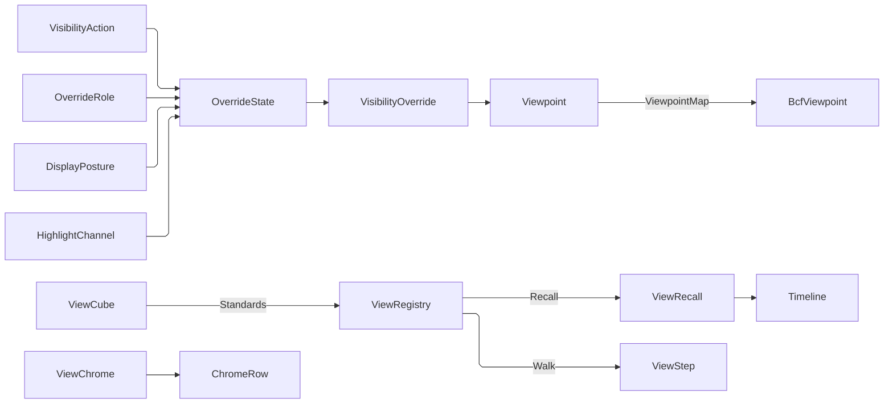

# [APPUI_RENDER_VIEWPOINT]

`Viewpoint` is the portable view-state receipt the whole package addresses a saved view by: one `ViewCamera` lens, an optional `SectionBox` clip volume, the `VisibilityOverride` rows every posture and every interaction fold answers, the selection, and the source-addressed measurements — captured once, serialized through the package wire context, and projected onto the `cs:Rasm.Bim/Review/issues#BCF_ARCHIVE` `BcfViewpoint` exchange contract through one generated seam. `OverrideState` is the closed vocabulary of what a renderer can do to an element, so a hidden element carrying a transparency has no spelling; `OverrideRole` is the one row family the version-diff and analysis-participation postures both project through. `ViewRegistry` is the one named-view owner — standard views derived from the view cube's own signed axis triples, user bookmarks, captured cameras, and traversal history as one row family under one `ViewKey` address space, recalled through the `Render/animation` camera track. This page owns the view-state receipt, the override vocabulary and its folds, the BCF projection seam, the named-view registry with its cube and projection toggle, and the viewport chrome key roster; the render graph that consumes a `FrameView` lives in `Render/pipeline`, the overlay-plane manipulators in `Render/measure`.

## [01]-[INDEX]

- [02]-[VIEWPOINT_CODEC]: Camera, section box, override state and role, the interaction fold, the display postures, and the generated `BcfViewpoint` seam.
- [03]-[VIEW_REGISTRY]: The `ViewKey` address, the view cube, the one named-view registry over standard views, bookmarks, captures and traversal history, the projection toggle, recall motion, and the viewport chrome keys.

## [02]-[VIEWPOINT_CODEC]

- Owner: `CameraFrame` the common eye/target/up product; `ViewCamera` `[Union]` the perspective, orthographic, or asymmetric-XR lens; `SectionBox` the axis-aligned clip volume; `OverrideState` `[Union]` the closed hidden/ghosted/tinted vocabulary a renderer can answer; `VisibilityOverride` the per-element row pairing a scene key with that state; `OverrideRole` `[SmartEnum<string>]` the one tinted-row family both the version-diff projection and the analysis-participation posture read, partitioned by its `Family` column; `VisibilityAction` `[SmartEnum]` the isolate/hide/x-ray/highlight/reset interaction fold; `VersionGhost` and `HighlightChannel` the two projections onto those rows; `PropertyDomain` `[Union]` the derived categorical-or-sequential property axis electing palette and legend together; `DisplayPosture` `[Union]` the colour-by, participation, and precision-wireframe posture family; `ViewMeasurement`/`ViewMeasurementPoint` the source-addressed measurement markup; `Viewpoint` the portable receipt; `ViewpointMap` the generated `[Mapper]` seam over the BCF camera and markup correspondences; `ViewpointCodec` the union dispatch and preservation fold binding the receipt to `Rasm.Bim`'s `BcfViewpoint`.
- Cases: `OverrideState` = Hidden | Ghosted | Tinted; `OverrideRole` = added | removed | modified | unchanged (family `diff`) and target | obstacle | excluded (family `participation`); `ViewCamera` = Perspective | Orthographic | Asymmetric; `PropertyDomain` = Categorical | Sequential; `DisplayPosture` = ColorBy | Participation | Wireframe.
- Entry: `Viewpoint.Capture(key, camera, section, overrides, selection, measurements, at)` — the six-column admission, every defect named on one `Validation` fold; `Viewpoint.Encode()`/`Viewpoint.Decode(blob)` — the round trip through `EvidenceOps.Wire`, the one package serialization posture; `ViewpointCodec.ToBcf(guid, view, source)`/`FromBcf(key, bcf, at)` — the exchange projection.
- Auto: a viewpoint captures the full reproducible view state in one receipt — one `ViewCamera` case carries only its live lens scalar, `Option<SectionBox>` distinguishes absence from a real clip volume, override rows key by scene id, and `ViewMeasurement` preserves the capture payload key and point-sample index behind every vertex; BCF projection maps the camera onto the typed `BcfCamera` union, the override rows onto `BcfVisibility` and `BcfColoring`, section bounds onto six `BcfClippingPlane` rows, and measurement segments onto `BcfLine` rows.
- Law: `OverrideState` is the WHOLE discriminant of what a renderer does to an element, so the visible/transparent/tinted product a four-column row admitted collapses to the three states a frame can answer — a hidden element carrying a 0.85 transparency was representable and meaningless, and `VisibilityAction.Isolate` spelled that exact pair. `Visible`, `ColorArgb`, and `Transparency` survive as DERIVATIONS the wire and the BCF projection read, so the crossing columns are unchanged in both directions and nothing downstream re-derives the inversion.
- Law: `VisibilityAction` folds a selection onto the one override vocabulary — `Isolate` hides every unselected element, `Hide` hides the selection, `Xray` ghosts the unselected rest hard as a posture the user issues, `Highlight` ghosts it lightly as the transient hover row every brushing surface reads and emits a row for EVERY element so a hover restores what the previous hover ghosted, `Reset` clears the set — each row constructed with its fold delegate so the interactive state, the saved viewpoint, and the animation visibility track speak one visibility language. The Shell verb binding raising these folds as `CommandRow`s is `Shell/commands#INTENT_TABLE`'s row.
- Law: the version-diff classification and the analysis-participation vocabulary are ONE row family. Both were `[SmartEnum<string>]` rosters carrying an identical tint-and-transparency pair, projected by an identical `Map`, differing only in their label namespace — so they are one `OverrideRole` roster whose `Family` column partitions the two, each row carrying its `OverrideState` outright rather than the two columns a consumer had to re-pair. A legend over either family is `OverrideRole.In(family)`, so adding a fifth diff class or a fourth participation class is one row and no fold moves.
- Law: a DISPLAY POSTURE is a fold onto the one override vocabulary, exactly as the interaction fold and the version-diff projection are — colour-by-property, participation-role recolouring, and precision wireframe each answer the same rows, so postures compose with isolate, hide, and x-ray through `HighlightChannel.Over` rather than each posture carrying its own compositing rule. A viewer-local display mode beside this channel is the deleted form: it would render a state no saved view could reproduce and no shared link could carry.
- Law: a colour-by session's PALETTE CLASS and its LEGEND ARM are one fact the property domain answers, and the domain is DERIVED from the values rather than declared per property — a categorical property has no numeric distance between its values, so a sequential ramp over it reads as a magnitude the data never carried, and a numeric property binned to swatches loses the ordering that is its whole content. The parse runs ONCE at derivation and the parsed magnitudes ride the `Sequential` case, because re-parsing every value at every `Position` call made the ramp sample cost scale with the scene.
- Law: every legend a posture publishes crosses `Charts/grammar#LEGEND_VOCABULARY` `LegendSpec.Admit`, so a posture's legend and a chart's legend prove the same ramp-stop, column, and dock rules — a bare `LegendSpec` construction beside that gate is the deleted form.
- Receipt: `Viewpoint` serializes through `Diagnostics/evidence#RECEIPT_UNION` `EvidenceOps.Wire` — the one merged suite options every AppUi crossing takes — so the dashboard, the markup, and the cross-process coordination read one posture and this page mints no second serializer context.
- Packages: Thinktecture.Runtime.Extensions, LanguageExt.Core, Riok.Mapperly, UnitsNet, NodaTime, Rasm (project), Rasm.Bim (project), BCL inbox
- Growth: a new camera projection is one `ViewCamera` case with its `ViewpointMap` arm; a new view-state field is one `Viewpoint` member; a new render treatment is one `OverrideState` case breaking every fold at compile time; a new diff class or participation class is one `OverrideRole` row; a new interaction verb is one `VisibilityAction` row carrying its own fold; a new display posture is one `DisplayPosture` case with its projection and its legend arm; zero new surface.
- Boundary: `Viewpoint` is the one portable view-state owner for camera, optional section, visibility, colour, selection, and measurements. A posture PROJECTS and never queries — `Editing/inspector#INSPECTOR_SURFACE` `PostureSource.Read` is the ONE reader seat producing the resolved `(element, value)` pairs `DisplayPosture.Project` consumes and `PostureSource.Electable` the colour-by election roster over that same merged descriptor set, so this owner runs no property read and the same fold serves a live session, a captured viewpoint, and an animation keyframe; palettes are `Theme/tokens#TOKEN_CATALOG` `Colormap` rows under their declared class, so a posture-local colour table is the deleted form; legends are `Charts/grammar#LEGEND_VOCABULARY` `LegendSpec` declarations, so a posture's legend and a chart's legend are one owner with two producers. `ViewpointCodec` projects onto Bim's `BcfViewpoint` family and preserves source snapshot, line, bitmap, index, view-hint, and arbitrary clipping-plane columns during re-encode; the BCF camera is `Option`-valued under that owner's own `BcfCamera.Admit` gate, so a selection-only viewpoint decodes as typed absence and never a degenerate origin view. Arbitrary BCF plane sets do not counterfeit an axis-aligned `SectionBox`: decode carries `None` while the source record retains those planes. `[MapProperty]` rows carry every divergence the wire and the exchange keep — the exchange spells `Visibility`/`Hints` where the wire keeps `DefaultVisibility`/`VisibilityExceptions`/`ViewSetupHints`, and the seam is where that divergence is stated once. `ElementId` is a raw scene key on this channel and joins TWO identity regimes — the BCF `GlobalId` IFC attribute string and the Persistence version-compare fold whose `(ElementId, OverrideRole)` pairs `VersionGhost` takes — with no owner for the stringification between them; the escalation is stated, not papered over.

```csharp signature
// --- [TYPES] --------------------------------------------------------------------------------
// What a frame can DO to one element, closed: not drawn, drawn plainly at some transparency, or drawn in the
// row's own colour. The four-column product it replaces admitted `Visible:false` beside `Transparency:0.85` —
// an isolate ghost no renderer answers and every consumer had to guard. `Visible`, `ColorArgb`, and
// `Transparency` stay as DERIVATIONS, so the wire columns and the BCF exchange are untouched in both
// directions while the illegal corners stop being spellable.
[Union(ConversionFromValue = ConversionOperatorsGeneration.None)]
public abstract partial record OverrideState {
    private OverrideState() { }

    public sealed record Hidden : OverrideState;
    public sealed record Ghosted(double Transparency) : OverrideState;
    public sealed record Tinted(uint Argb, double Transparency) : OverrideState;

    public static readonly OverrideState Opaque = new Ghosted(0d);

    public bool Visible => this is not Hidden;

    public Option<uint> ColorArgb => Switch(
        hidden: static _ => Option<uint>.None,
        ghosted: static _ => Option<uint>.None,
        tinted: static row => Some(row.Argb));

    public double Transparency => Switch(
        hidden: static _ => 0d,
        ghosted: static row => row.Transparency,
        tinted: static row => row.Transparency);

    // The wire and BCF INGRESS arm: three foreign columns land on the one state, so an inbound
    // `visible:false` carrying a colour resolves to `Hidden` here rather than at each reader.
    public static OverrideState Of(bool visible, Option<uint> argb, double transparency) =>
        visible
            ? argb.Match(Some: colour => (OverrideState)new Tinted(colour, transparency), None: () => new Ghosted(transparency))
            : new Hidden();
}

// ONE tinted-row family, partitioned by `Family`. The version-diff classification and the analysis
// participation vocabulary were two `[SmartEnum<string>]` rosters with identical `(TintArgb, Transparency)`
// columns and an identical projection, differing only in their label namespace — the discriminant is the
// column, and each row now carries the override state outright rather than the pair a caller re-assembled.
// The obstacle row is distinctly inked because a context building accidentally left as a target is the single
// most expensive analysis mistake, and it is invisible in a uniformly shaded model.
[SmartEnum<string>]
[KeyMemberEqualityComparer<ComparerAccessors.StringOrdinal, string>]
public sealed partial class OverrideRole {
    public const string Diff = "diff";
    public const string Participation = "participation";

    public static readonly OverrideRole Added = new("added", Diff, new OverrideState.Tinted(0xFF2E7D32u, 0d));
    public static readonly OverrideRole Removed = new("removed", Diff, new OverrideState.Tinted(0xFFB71C1Cu, 0.7d));
    public static readonly OverrideRole Modified = new("modified", Diff, new OverrideState.Tinted(0xFFF9A825u, 0d));
    public static readonly OverrideRole Unchanged = new("unchanged", Diff, new OverrideState.Ghosted(0.6d));
    public static readonly OverrideRole Target = new("target", Participation, new OverrideState.Tinted(0xFF1E88E5u, 0d));
    public static readonly OverrideRole Obstacle = new("obstacle", Participation, new OverrideState.Tinted(0xFF6D4C41u, 0.25d));
    public static readonly OverrideRole Excluded = new("excluded", Participation, new OverrideState.Ghosted(0.85d));

    public string Family { get; }

    public OverrideState State { get; }

    public string LabelKey => $"posture.{Family}.{Key}";

    // The family's own roster, which is what a legend and a filter member list both read — so a fifth diff
    // class is one row above and neither the legend nor the filter moves.
    public static Seq<OverrideRole> In(string family) =>
        toSeq(Items).Filter(row => row.Family == family);

    public Seq<VisibilityOverride> Project(Seq<string> elements) =>
        elements.Map(id => new VisibilityOverride(id, State));
}

// Isolate/hide/x-ray/highlight/reset, each row constructed with its override-set delegate over
// (scene ids, selection), so the core viewer loop is five rows on the ONE vocabulary the viewpoint captures
// and the animation visibility track steps.
[SmartEnum<string>]
[KeyMemberEqualityComparer<ComparerAccessors.StringOrdinal, string>]
public sealed partial class VisibilityAction {
    public static readonly VisibilityAction Isolate = new("isolate", static (scene, picked) =>
        scene.Filter(id => !picked.Contains(id)).Map(static id => new VisibilityOverride(id, new OverrideState.Hidden())));
    public static readonly VisibilityAction Hide = new("hide", static (_, picked) =>
        picked.Map(static id => new VisibilityOverride(id, new OverrideState.Hidden())));
    public static readonly VisibilityAction Xray = new("xray", static (scene, picked) =>
        scene.Filter(id => !picked.Contains(id)).Map(static id => new VisibilityOverride(id, new OverrideState.Ghosted(XrayGhost))));
    // Highlight is the TRANSIENT hover row and Xray the USER VERB, and the two differ in exactly the way that
    // matters: an x-ray is a posture a user issues and lives inside, so it ghosts hard and emits nothing for
    // the picked set; a highlight tracks a pointer over rows the user is scanning, so it ghosts lightly enough
    // that the surrounding model stays readable and it emits a row for EVERY element — the matched ones fully
    // opaque — because a hover must restore what the previous hover ghosted without waiting for a reset.
    // Folding hover onto the x-ray row is why a scan across a metric table read as a strobing model.
    public static readonly VisibilityAction Highlight = new("highlight", static (scene, picked) =>
        scene.Map(id => new VisibilityOverride(
            id, picked.Contains(id) ? OverrideState.Opaque : new OverrideState.Ghosted(HighlightGhost))));
    public static readonly VisibilityAction Reset = new("reset", static (_, _) => Seq<VisibilityOverride>());

    private const double XrayGhost = 0.85d;
    private const double HighlightGhost = 0.6d;

    [UseDelegateFromConstructor]
    public partial Seq<VisibilityOverride> Fold(Seq<string> scene, LanguageExt.HashSet<string> picked);
}

// --- [MODELS] -------------------------------------------------------------------------------
public readonly record struct CameraFrame(
    System.Numerics.Vector3 Eye,
    System.Numerics.Vector3 Target,
    System.Numerics.Vector3 Up);

[Union(ConversionFromValue = ConversionOperatorsGeneration.None)]
public abstract partial record ViewCamera(CameraFrame Frame) {
    public sealed record Perspective(CameraFrame Frame, double FieldOfViewDeg) : ViewCamera(Frame);
    // RetainedFieldDeg is the lens the projection toggle must hand BACK: an orthographic view minted from a
    // 60-degree perspective carries that 60 so the inverse re-derives the distance that framed it. A constant
    // on the toggle made every round trip land on one hardcoded field and silently rescaled the lens, which is
    // the exact identity `RULINGS [02]:93` states. A lens that was never perspective carries the estate
    // default, so the column is total without a second case.
    public sealed record Orthographic(CameraFrame Frame, double ViewHeight, double RetainedFieldDeg = DefaultFieldDeg) : ViewCamera(Frame);
    // An XR eye frustum is asymmetric — four signed angles off the view axis in radians (left and down
    // negative, the OpenXR Fovf convention), never one symmetric field-of-view scalar — so the immersive eye
    // pass states its lens in the graph's own vocabulary rather than smuggling a Fovf through a symmetric case.
    public sealed record Asymmetric(CameraFrame Frame, double AngleLeft, double AngleRight, double AngleUp, double AngleDown) : ViewCamera(Frame);

    public const double DefaultFieldDeg = 45d;

    // The one symmetric vertical envelope in degrees every symmetric consumer reads — the BCF exchange, the
    // browser wire, and the projection toggle — so the asymmetric-to-symmetric collapse is spelled ONCE.
    // AngleDown is signed negative, so the envelope is the difference.
    public double VerticalFieldDeg => Switch(
        perspective: static camera => camera.FieldOfViewDeg,
        orthographic: static camera => camera.RetainedFieldDeg,
        asymmetric: static camera => (camera.AngleUp - camera.AngleDown) * (180d / Math.PI));
}

public readonly record struct SectionBox(
    double MinX, double MinY, double MinZ,
    double MaxX, double MaxY, double MaxZ) {
    public bool Ordered => MinX < MaxX && MinY < MaxY && MinZ < MaxZ;
}

public readonly record struct VisibilityOverride(string ElementId, OverrideState State) {
    public bool Visible => State.Visible;

    public Option<uint> ColorArgb => State.ColorArgb;

    public double Transparency => State.Transparency;
}

public readonly record struct ViewMeasurementPoint(UInt128 SourceKey, int SampleIndex, System.Numerics.Vector3 Position);

public sealed record ViewMeasurement(
    string Key,
    Seq<ViewMeasurementPoint> Vertices,
    UnitsNet.Length Total,
    Seq<UnitsNet.Angle> Angles);

// The portable receipt. Every column has a silently-wrong render behind it rather than a crash, so admission
// ACCUMULATES — a duplicate override, a duplicate measurement key, and an inverted section box all name
// themselves at once instead of the caller repairing one defect per round trip.
public sealed record Viewpoint(
    string Key,
    int Version,
    ViewCamera Camera,
    Option<SectionBox> Section,
    Seq<VisibilityOverride> Overrides,
    Seq<string> Selection,
    Seq<ViewMeasurement> Measurements,
    Instant At) {
    public const int Schema = 2;

    public static Fin<Viewpoint> Capture(
        string key,
        ViewCamera camera,
        Option<SectionBox> section,
        Seq<VisibilityOverride> overrides,
        Seq<string> selection,
        Seq<ViewMeasurement> measurements,
        Instant at) =>
        (Col(!string.IsNullOrWhiteSpace(key), "a non-blank key"),
         Col(Distinct(overrides.Map(static row => row.ElementId)), "distinct override element ids"),
         Col(Distinct(selection), "a duplicate-free selection"),
         Col(Distinct(measurements.Map(static row => row.Key)), "distinct measurement keys"),
         Col(measurements.ForAll(static row => !row.Vertices.IsEmpty), "no vertex-less measurement"),
         Col(section.ForAll(static box => box.Ordered), "an ordered section box"))
        .Apply((_, _, _, _, _, _) => new Viewpoint(key, Schema, camera, section, overrides, selection, measurements, at))
        .ToFin();

    private static bool Distinct(Seq<string> ids) => toSeq(ids.Distinct()).Count == ids.Count;

    private static Validation<Error, Unit> Col(bool holds, string requirement) =>
        holds ? Validation<Error, Unit>.Success(unit) : Validation<Error, Unit>.Fail((Error)new ViewportFault.ContextUnavailable($"viewpoint: {requirement}"));

    // Serialization is the package's ONE posture: `EvidenceOps.Wire` is the merged suite options whose app-root
    // mint folds `AppUiWireContext.Default` in, so a viewpoint blob, an evidence payload, and a residency
    // manifest all cross under one converter set and this owner declares no context of its own.
    public string Encode() => JsonSerializer.Serialize(this, EvidenceOps.Wire);

    public static Fin<Viewpoint> Decode(string blob) =>
        Op.Of(name: "appui.viewpoint.decode").Catch(() => Fin.Succ(Optional(JsonSerializer.Deserialize<Viewpoint>(blob, EvidenceOps.Wire))))
            .Bind(static held => held.ToFin(new ViewportFault.ContextUnavailable("viewpoint/decode: malformed blob")))
            .Bind(static view => view.Version == Schema
                ? Fin.Succ(view)
                : Fin.Fail<Viewpoint>(new ViewportFault.ContextUnavailable($"viewpoint/decode: schema {view.Version} is not {Schema}")));
}

// The property domain decides the PALETTE CLASS and the legend arm together, because they are one fact. The
// derivation PARSES ONCE: `Sequential` carries the parsed magnitudes beside its extent, because re-parsing
// every raw value at every `Position` call made a ramp sample cost scale with the scene and read the same
// string through two different parse configurations.
[Union(ConversionFromValue = ConversionOperatorsGeneration.None)]
public abstract partial record PropertyDomain {
    private PropertyDomain() { }

    public sealed record Categorical(Seq<string> Members) : PropertyDomain;
    public sealed record Sequential(double Low, double High, HashMap<string, double> Magnitudes) : PropertyDomain;

    // A value set that parses wholly as finite numbers is sequential over its own measured extent; anything
    // else is categorical over its distinct members in FIRST-SEEN order, because a category order a user
    // recognizes beats one a collator invents.
    public static PropertyDomain Of(Seq<string> values) =>
        values.Choose(static value => Magnitude(value).Map(magnitude => (Text: value, Magnitude: magnitude))) switch {
            var parsed when !values.IsEmpty && parsed.Count == values.Count => new Sequential(
                parsed.Map(static row => row.Magnitude).Min(),
                parsed.Map(static row => row.Magnitude).Max(),
                parsed.ToHashMap(static row => row.Text, static row => row.Magnitude)),
            _ => new Categorical(toSeq(values.Distinct())),
        };

    private static Option<double> Magnitude(string value) =>
        double.TryParse(value, System.Globalization.NumberStyles.Float,
            System.Globalization.CultureInfo.InvariantCulture, out double parsed) && double.IsFinite(parsed)
            ? Some(parsed)
            : None;

    // The colormap class the domain admits: qualitative rows separate categories and sequential rows carry
    // magnitude, so the palette election is the domain's own answer and never a session author's taste.
    public Colormap Palette => Switch(
        categorical: static _ => Colormap.Tableau,
        sequential: static _ => Colormap.Viridis);

    // The legend declaration the domain projects, proved through the one legend admission so a posture legend
    // and a chart legend cross the same ramp-stop and dock rules. A categorical domain places its members at
    // their own ordinal positions because the categorized arm draws discrete swatches at declared values.
    public Fin<LegendSpec> Legend(string key, Option<MeasureRole> measure, int segments) => Switch(
        state: (Key: key, Measure: measure, Segments: segments),
        categorical: static (s, d) => LegendSpec.Admit(new LegendSpec(
            s.Key, new LegendDomain.Categorized(d.Members.Map(static (member, index) => (member, (double)index))),
            LegendDock.BottomRight, Seq<LegendColumn>(), s.Measure, d.Members.Count, Some(s.Key), None)),
        sequential: static (s, d) => LegendSpec.Admit(new LegendSpec(
            s.Key, new LegendDomain.Continuous(d.Low, d.High),
            LegendDock.BottomRight, Seq<LegendColumn>(), s.Measure, Math.Max(s.Segments, 2), Some(s.Key), None)));

    // The unit interval a value samples the ramp at. A categorical member samples at its own ordinal share so
    // the qualitative map's discrete stops land on distinct categories; a sequential value samples at its
    // position in the measured extent, read off the parse the derivation already did. A degenerate extent
    // samples the midpoint rather than dividing by zero and painting every element the ramp's first colour —
    // the `double.Epsilon` here guards a DIVISOR, not a domain tolerance, so it stays a float-arithmetic test.
    public double Position(string value) => Switch(
        state: value,
        categorical: static (v, d) => d.Members.Count <= 1 ? 0d : Math.Max(d.Members.IndexOf(v), 0) / (double)(d.Members.Count - 1),
        sequential: static (v, d) => d.High - d.Low > double.Epsilon
            ? d.Magnitudes.Find(v).Match(
                Some: magnitude => Math.Clamp((magnitude - d.Low) / (d.High - d.Low), 0d, 1d),
                None: static () => 0.5d)
            : 0.5d);
}

// Three folds onto the ONE override channel, exactly as the interaction fold and the version-diff projection
// already are. Each posture answers the same shape — the override rows the scene renders — so postures COMPOSE
// through one merge rather than each carrying its own compositing rule.
[Union(ConversionFromValue = ConversionOperatorsGeneration.None)]
public abstract partial record DisplayPosture(string Key) {
    // The property session: a property key, the values the scene answers for it, and the derived domain that
    // elects both palette and legend. The session is startable from a SELECTED element's property, which is
    // what makes "show me everything like this" one pick rather than a dialog.
    public sealed record ColorBy(string Key, string PropertyKey, PropertyDomain Domain, Option<MeasureRole> Measure, int Segments) : DisplayPosture(Key);
    public sealed record Participation(string Key) : DisplayPosture(Key);
    // Precision wireframe renders every element ghosted with its edges inked, so the override rows carry the
    // transparency and the render pass reads the posture for its edge emphasis.
    public sealed record Wireframe(string Key, double Ghost) : DisplayPosture(Key);

    // The one projection every posture answers. The scene arrives as (element, value) pairs
    // `Editing/inspector#INSPECTOR_SURFACE` `PostureSource.Read` resolved, so a posture is pure and the same
    // fold serves a live session, a saved viewpoint, and an animation visibility keyframe.
    public Fin<Seq<VisibilityOverride>> Project(Seq<(string ElementId, string Value)> scene) => Switch(
        state: scene,
        colorBy: static (rows, posture) => rows
            .Map(row => posture.Domain.Palette.Sample(posture.Domain.Position(row.Value))
                .Map(colour => new VisibilityOverride(row.ElementId, new OverrideState.Tinted(Argb(colour), 0d))))
            .Traverse(static row => row).As().Map(static rows => rows.ToSeq()),
        // The value column IS the role key here, so a participation session and a colour-by session read the
        // same pair shape and no second scene projection exists. A value naming no row in the participation
        // family is a typed refusal rather than an element silently rendered as excluded.
        participation: static (rows, _) => rows
            .Map(static row => OverrideRole.TryGet(row.Value, out OverrideRole? role)
                && role is { Family: OverrideRole.Participation }
                ? Fin.Succ(new VisibilityOverride(row.ElementId, role.State))
                : Fin.Fail<VisibilityOverride>(new ViewportFault.ContextUnavailable($"posture/role:{row.Value}")))
            .Traverse(static row => row).As().Map(static rows => rows.ToSeq()),
        wireframe: static (rows, posture) => Fin.Succ(
            rows.Map(row => new VisibilityOverride(row.ElementId, new OverrideState.Ghosted(posture.Ghost)))));

    // The legend the posture publishes, so the board's legend algebra renders a posture's key exactly as it
    // renders a chart's — one legend owner, two producers. The two roleless postures carry a categorized
    // legend over their own row family, because a participation key and a wireframe are still things a viewer
    // needs named.
    public Fin<LegendSpec> Legend => Switch(
        colorBy: static posture => posture.Domain.Legend(posture.Key, posture.Measure, posture.Segments),
        participation: static posture => OverrideRole.In(OverrideRole.Participation) switch {
            var family => LegendSpec.Admit(new LegendSpec(
                posture.Key,
                new LegendDomain.Categorized(family.Map(static (role, index) => (role.LabelKey, (double)index))),
                LegendDock.BottomRight, Seq<LegendColumn>(), None, family.Count, Some(posture.Key), None)),
        },
        wireframe: static posture => LegendSpec.Admit(LegendSpec.Swatches with { Key = posture.Key, Dock = LegendDock.Hidden }));

    // The colormap rail answers a kernel `Color`; the override channel carries packed ARGB because that is what
    // the viewpoint receipt and the BCF colouring both cross as, so the pack happens ONCE here.
    private static uint Argb(Color colour) =>
        ((uint)colour.A << 24) | ((uint)colour.R << 16) | ((uint)colour.G << 8) | colour.B;
}

// --- [OPERATIONS] ---------------------------------------------------------------------------
// Version-compare ghosting on the same override channel. The `(ElementId, OverrideRole)` classification
// arrives as VALUES off the Persistence version-compare fold (`ReplayWindow` / commit-DAG — AppUi runs no
// ledger read) and the projection is the role family's own, so an A/B model comparison renders through the
// channel a viewpoint already carries and a parallel ghost-overlay owner never exists.
public static class VersionGhost {
    public static Seq<VisibilityOverride> Project(Seq<(string ElementId, OverrideRole Class)> classified) =>
        classified.Map(static row => new VisibilityOverride(row.ElementId, row.Class.State));
}

// The HOVER highlight is this channel's pipeline end and it has three named consumers — the metric panel's row
// hover (`Charts/telemetry#METRIC_PANEL`), the measure panel's row hover (`Render/measure#MEASURE_MODE`), and
// the history plane's touched-element projection (`Editing/history`) — all publishing the element keys they
// address and all folding through the ONE `VisibilityAction.Highlight` row, so what "highlighted" looks like is
// one value three surfaces read rather than three transparencies that drift.
public static class HighlightChannel {
    public static Seq<VisibilityOverride> Focus(Seq<string> scene, LanguageExt.HashSet<string> matched) =>
        VisibilityAction.Highlight.Fold(scene, matched);

    // The empty hover: a pointer leaving every row publishes the CLEAR rather than an absent seq, because a
    // consumer that stops publishing leaves the last hover's ghosts standing and the scene reads as if the
    // pointer never left.
    public static Seq<VisibilityOverride> Clear(Seq<string> scene) =>
        VisibilityAction.Reset.Fold(scene, LanguageExt.HashSet<string>.Empty);

    // Composition is LAST-WRITER-BY-ELEMENT over the posture beneath, and the merge keeps the posture's TINT
    // where the hover row carries none — which is exactly what makes hovering a cost category readable against
    // a colour-by session. Concatenating the two seqs instead publishes two rows per element and leaves the
    // renderer to pick by arrival order, a highlight that works or does not depending on fold order.
    public static Seq<VisibilityOverride> Over(Seq<VisibilityOverride> posture, Seq<VisibilityOverride> highlight) =>
        toSeq(highlight.Fold(
            posture.Fold(HashMap<string, VisibilityOverride>(), static (map, row) => map.AddOrUpdate(row.ElementId, row)),
            static (map, row) => map.AddOrUpdate(row.ElementId, map.Find(row.ElementId).Match(
                Some: held => Blended(held.State, row.State) switch { var state => row with { State = state } },
                None: () => row))))
            .Map(static entry => entry.Value);

    // The blend rule as ONE expression: a hover keeps its own visibility and transparency and INHERITS the
    // posture's colour when it has none of its own, so a tinted element hovered at full opacity keeps its tint.
    private static OverrideState Blended(OverrideState held, OverrideState hover) =>
        (held.ColorArgb, hover) switch {
            (_, OverrideState.Tinted) or (_, OverrideState.Hidden) => hover,
            ({ IsSome: true, Case: uint argb }, OverrideState.Ghosted ghost) => new OverrideState.Tinted(argb, ghost.Transparency),
            _ => hover,
        };
}

// --- [BOUNDARIES] ---------------------------------------------------------------------------
// The generated half of the BCF seam: every member-wise correspondence between the AppUi camera cases and the
// `Rasm.Bim` `BcfCamera` cases, plus the markup row projections. `Direction` is a WHOLE-SOURCE read
// (target minus eye) and `AspectRatio` a constant the codec re-applies from the source viewpoint, so the two
// non-member-wise columns are declared rows here rather than hand assignments in a fan body. The reader-free
// completeness carve does not apply — `[MapPropertyFromSource]` suppresses RMG020 for every source member of
// its mapping, so the source side is proved by the TARGET strategy and the explicit rows, not by an ignore
// roster. `ExplicitCast` is cleared because LanguageExt carriers cross this seam and the default conversion set
// binds `Option<T>`'s THROWING explicit cast ahead of any registered user mapping.
[Mapper(RequiredMappingStrategy = RequiredMappingStrategy.Target,
        EnabledConversions = MappingConversionType.All & ~MappingConversionType.ExplicitCast)]
public static partial class ViewpointMap {
    [MapProperty([nameof(ViewCamera.Perspective.Frame), nameof(CameraFrame.Eye)], [nameof(BcfCamera.Perspective.Position)])]
    [MapProperty([nameof(ViewCamera.Perspective.Frame), nameof(CameraFrame.Up)], [nameof(BcfCamera.Perspective.Up)])]
    [MapPropertyFromSource(nameof(BcfCamera.Perspective.Direction), Use = nameof(Gaze))]
    [MapProperty(nameof(ViewCamera.Perspective.FieldOfViewDeg), nameof(BcfCamera.Perspective.FieldOfViewDeg))]
    [MapValue(nameof(BcfCamera.Perspective.AspectRatio), 0d)]
    public static partial BcfCamera.Perspective ToBcf(ViewCamera.Perspective camera);

    [MapProperty([nameof(ViewCamera.Orthographic.Frame), nameof(CameraFrame.Eye)], [nameof(BcfCamera.Orthogonal.Position)])]
    [MapProperty([nameof(ViewCamera.Orthographic.Frame), nameof(CameraFrame.Up)], [nameof(BcfCamera.Orthogonal.Up)])]
    [MapPropertyFromSource(nameof(BcfCamera.Orthogonal.Direction), Use = nameof(Gaze))]
    [MapProperty(nameof(ViewCamera.Orthographic.ViewHeight), nameof(BcfCamera.Orthogonal.ViewToWorldScale))]
    [MapValue(nameof(BcfCamera.Orthogonal.AspectRatio), 0d)]
    public static partial BcfCamera.Orthogonal ToBcf(ViewCamera.Orthographic camera);

    [MapPropertyFromSource(nameof(ViewCamera.Perspective.Frame), Use = nameof(PerspectiveFrame))]
    public static partial ViewCamera.Perspective FromBcf(BcfCamera.Perspective camera);

    // BCF's orthogonal camera carries no field of view, so the retained lens is the estate default — the value
    // an orthographic view that was never a perspective one hands back on the first toggle.
    [MapPropertyFromSource(nameof(ViewCamera.Orthographic.Frame), Use = nameof(OrthogonalFrame))]
    [MapProperty(nameof(BcfCamera.Orthogonal.ViewToWorldScale), nameof(ViewCamera.Orthographic.ViewHeight))]
    [MapValue(nameof(ViewCamera.Orthographic.RetainedFieldDeg), ViewCamera.DefaultFieldDeg)]
    public static partial ViewCamera.Orthographic FromBcf(BcfCamera.Orthogonal camera);

    // BCF stores an eye and a gaze DIRECTION; the receipt stores an eye and a TARGET. The correspondence is
    // one addition each way, declared once here rather than at four construction sites. The reader takes the
    // camera BASE, so both outbound arms reach the one arrow.
    private static System.Numerics.Vector3 Gaze(ViewCamera camera) => camera.Frame.Target - camera.Frame.Eye;

    private static CameraFrame PerspectiveFrame(BcfCamera.Perspective camera) =>
        new(camera.Position, camera.Position + camera.Direction, camera.Up);

    private static CameraFrame OrthogonalFrame(BcfCamera.Orthogonal camera) =>
        new(camera.Position, camera.Position + camera.Direction, camera.Up);

    // A measurement's segments are its consecutive vertex pairs; the per-pair converter is non-generic because
    // a `Seq<T>` TARGET has no proven native construction on this generator.
    [UserMapping]
    public static Seq<BcfLine> ToBcf(ViewMeasurement measurement) =>
        measurement.Vertices.Zip(measurement.Vertices.Tail)
            .Map(static pair => new BcfLine(pair.Item1.Position, pair.Item2.Position));

    // Six outward axis planes off the box, in the plane vocabulary's own min-then-max order per axis.
    [UserMapping]
    public static Seq<BcfClippingPlane> ToBcf(SectionBox box) => Seq(
        new BcfClippingPlane(new System.Numerics.Vector3((float)box.MinX, 0f, 0f), new System.Numerics.Vector3(-1f, 0f, 0f)),
        new BcfClippingPlane(new System.Numerics.Vector3((float)box.MaxX, 0f, 0f), new System.Numerics.Vector3(1f, 0f, 0f)),
        new BcfClippingPlane(new System.Numerics.Vector3(0f, (float)box.MinY, 0f), new System.Numerics.Vector3(0f, -1f, 0f)),
        new BcfClippingPlane(new System.Numerics.Vector3(0f, (float)box.MaxY, 0f), new System.Numerics.Vector3(0f, 1f, 0f)),
        new BcfClippingPlane(new System.Numerics.Vector3(0f, 0f, (float)box.MinZ), new System.Numerics.Vector3(0f, 0f, -1f)),
        new BcfClippingPlane(new System.Numerics.Vector3(0f, 0f, (float)box.MaxZ), new System.Numerics.Vector3(0f, 0f, 1f)));
}

// The union dispatch and the preservation fold — the half a member-wise generator cannot own. Every arm
// composes a GENERATED per-case mapper above; the totality is the union's own `Switch`, so a fourth camera case
// breaks this fan at compile time. `Rasm.Bim` owns the openBIM contract and AppUi re-mints no BCF schema.
public static class ViewpointCodec {
    public static BcfViewpoint ToBcf(string guid, Viewpoint view, Option<BcfViewpoint> source = default) =>
        (Camera: Lens(view.Camera, source),
         Visibility: BcfVisibility.Of(
             source.Match(Some: static row => row.Visibility.Default, None: static () => false),
             Exceptions(view, source))) switch {
            var mint => source.Match(
                Some: row => row with {
                    Camera = Some(mint.Camera),
                    SelectedGlobalIds = view.Selection,
                    Visibility = mint.Visibility,
                    Coloring = ColoringOf(view.Overrides),
                    Lines = toSeq((row.Lines + view.Measurements.Bind(ViewpointMap.ToBcf)).Distinct()),
                    ClippingPlanes = view.Section.Match(ViewpointMap.ToBcf, () => row.ClippingPlanes),
                },
                None: () => new BcfViewpoint(
                    Guid: guid,
                    Camera: Some(mint.Camera),
                    SelectedGlobalIds: view.Selection,
                    Visibility: mint.Visibility,
                    Snapshot: Option<ReadOnlyMemory<byte>>.None,
                    Coloring: ColoringOf(view.Overrides),
                    Lines: view.Measurements.Bind(ViewpointMap.ToBcf),
                    ClippingPlanes: view.Section.Match(ViewpointMap.ToBcf, static () => Seq<BcfClippingPlane>()))),
        };

    // The exception set is whatever DISAGREES with the source's own default-visibility convention, so a
    // re-encode preserves the convention the sending tool used rather than re-normalizing every viewpoint.
    private static Seq<string> Exceptions(Viewpoint view, Option<BcfViewpoint> source) =>
        source.Match(Some: static row => row.Visibility.Default, None: static () => false) switch {
            var convention => view.Overrides.Filter(o => o.Visible != convention).Map(static o => o.ElementId),
        };

    // The aspect ratio is the SOURCE viewpoint's own column — the receipt carries no aspect because a viewport
    // derives it from its target extent — so the mapper mints zero and the source's value re-lands here. A
    // no-source encode legitimately carries zero, which the schema reads as unstated.
    private static BcfCamera Lens(ViewCamera camera, Option<BcfViewpoint> source) =>
        source.Bind(static row => row.Camera).Match(
            Some: static held => held.Switch(perspective: static p => p.AspectRatio, orthogonal: static o => o.AspectRatio),
            None: static () => 0d) switch {
            var aspect => camera.Switch(
                state: aspect,
                perspective: static (ratio, lens) => (BcfCamera)(ViewpointMap.ToBcf(lens) with { AspectRatio = ratio }),
                orthographic: static (ratio, lens) => ViewpointMap.ToBcf(lens) with { AspectRatio = ratio },
                // BCF carries no asymmetric frustum, so an XR eye lens crosses as its symmetric vertical
                // envelope — the exchange keeps the pose while the asymmetry stays a live-session fact.
                asymmetric: static (ratio, lens) => new BcfCamera.Perspective(
                    lens.Frame.Eye, lens.Frame.Target - lens.Frame.Eye, lens.Frame.Up, lens.VerticalFieldDeg, ratio)),
        };

    // A selection-only BCF viewpoint carries NO camera, which is legal BCF and typed absence at the Bim owner
    // — so decode refuses by name rather than fabricating an origin view every receiving tool would render.
    public static Fin<Viewpoint> FromBcf(string key, BcfViewpoint bcf, Instant at) =>
        bcf.Camera.ToFin(new ViewportFault.ContextUnavailable($"viewpoint/bcf-camera:{bcf.Guid}"))
            .Map(camera => camera.Switch(
                perspective: static p => (ViewCamera)ViewpointMap.FromBcf(p),
                orthogonal: static o => ViewpointMap.FromBcf(o)))
            .Bind(camera => Viewpoint.Capture(
                key, camera,
                // Arbitrary inbound planes exceed the axis-aligned receipt, so the section decodes absent and
                // the re-encode keeps the source's own plane set untouched.
                Option<SectionBox>.None,
                OverridesOf(bcf), bcf.SelectedGlobalIds, Seq<ViewMeasurement>(), at));

    // Visibility exceptions seed the rows against the source's own convention and colouring overlays them, so a
    // hidden-and-coloured element lands as ONE row. The colour is a hex string in the schema and a bad one is
    // dropped rather than failing the whole viewpoint, because a malformed swatch loses a tint, not a view.
    private static Seq<VisibilityOverride> OverridesOf(BcfViewpoint bcf) =>
        toSeq(bcf.Coloring.Fold(
            bcf.Visibility.Exceptions.Fold(
                HashMap<string, OverrideState>(),
                (held, id) => held.AddOrUpdate(id, OverrideState.Of(!bcf.Visibility.Default, None, 0d))),
            static (held, coloring) => uint.TryParse(
                coloring.Color.TrimStart('#'), System.Globalization.NumberStyles.HexNumber,
                System.Globalization.CultureInfo.InvariantCulture, out uint argb)
                ? coloring.GlobalIds.Fold(held, (rows, id) => rows.AddOrUpdate(
                    id, rows.Find(id).Match(
                        Some: state => OverrideState.Of(state.Visible, Some(argb), state.Transparency),
                        None: () => OverrideState.Of(true, Some(argb), 0d))))
                : held))
            .Map(static entry => new VisibilityOverride(entry.Key, entry.Value));

    private static Seq<BcfColoring> ColoringOf(Seq<VisibilityOverride> overrides) =>
        toSeq(overrides.Fold(
            HashMap<uint, Seq<string>>(),
            static (held, row) => row.ColorArgb.Match(
                Some: argb => held.AddOrUpdate(argb, held.Find(argb).Match(Some: ids => ids.Add(row.ElementId), None: () => Seq(row.ElementId))),
                None: () => held)))
            .Map(static row => new BcfColoring(
                row.Key.ToString("X8", System.Globalization.CultureInfo.InvariantCulture), row.Value));
}
```

## [03]-[VIEW_REGISTRY]

- Owner: `ViewKey` `[ValueObject<string>]` the registry address and its deep-link grammar; `AxisLabel` `[SmartEnum<string>]` the three axis label rows with their read/write pair; `ViewOrigin` `[SmartEnum<string>]` the registry-row provenance; `CubeTarget` the view-cube pick target DERIVED from a signed axis triple; `ViewCube` the target derivation, hit test, and standard-row seeding; `ProjectionToggle` the extent-preserving lens flip; `NamedView` the registry row carrying camera, section, visibility context, and its recall motion; `ViewRing` the bounded traversal history over registry keys; `ViewRegistry` the one named-view owner; `ViewStep` the traversal receipt; `ViewRecall` the recall product; `ViewChrome` the viewport chrome key roster and its HUD rows.
- Cases: `ViewOrigin` = standard | bookmark | capture | visited under the locked provenance literals; `AxisLabel` = x | y | z; `StepDirection` = back | forward.
- Entry: `ViewRegistry.Recall(ViewKey key, ViewCamera from)` — resolves the row and mints the two-keyframe camera timeline the scrub drives, so a standard-view snap, a bookmark jump, and a back step are ONE arrow; `ViewRegistry.Walk(int delta, ViewCamera from)` — N SINGLE traversal steps under one direction row, answering the total actually taken; `ViewRegistry.Visit(camera, section, overrides, at)` — the settle hook that appends a `visited` row and advances the ring; `ViewCube.Pick(FrameView view, (double X, double Y) ndc)` — the cube hit test.
- Auto: the cube's twenty-six targets DERIVE from the twenty-seven signed axis triples less the zero one, so faces, edges, and corners are one derivation rather than a hand roster, each target's camera is its own normalized direction at the registry's orbit radius, and the three face pairs alone carry axis labels because an edge and a corner name no axis; the projection toggle is a `ViewCamera` case swap that PRESERVES the framed extent — a perspective view at distance `d` with vertical field `f` frames `2·d·tan(f/2)`, which becomes the orthographic view height, and the inverse re-derives the distance at the field the orthographic case RETAINED — so toggling twice returns the original lens exactly; recall runs through the `Render/animation` camera track, so a named view arrives under its own `MotionToken` on the deterministic playhead; the traversal ring is a bounded seq of registry keys with a cursor, so back and forward are cursor moves over rows the registry already holds and a visited row is an ordinary row a user can promote to a bookmark by renaming it; a row's key is its deep-link address, so a shared view link resolves through the routing spine's own grammar.
- Law: standard views, user bookmarks, captured cameras, and traversal history are ONE row family under one `ViewKey` space, distinguished only by a `ViewOrigin` column — so back and forward read the same rows a bookmark list renders, a standard view is bookmarkable, and a shared link addresses any of them identically. Two registries with a shared verb set is the deleted form: it forces every consumer to ask which one holds a key, and the answer changes the moment a user bookmarks the view they just stepped back to.
- Law: traversal is N SINGLE STEPS, never an absolute cursor move beside a one-step recall. `Walk(-3)` takes three back steps under the `back` row and recalls the row it LANDED on, answering how many it actually took against how many were asked — the shape that moved the cursor by the delta while recalling one step away rendered a camera the history cursor no longer pointed at, and a history end silently swallowed the difference.
- Law: the 2D canvas plane's `SaveView`/`RestoreView`/`NavigateBack` registry (`Shell/input#POINTER_GESTURES`, the package's own `ZoomBorder` state) is a DISJOINT owner and not a rung of this one — a canvas view is a 2D transform matrix and a named view is a camera, a section volume, and a visibility context, so the two carry no common row and merging them would force each to hold the other's absent half.
- Receipt: a recall folds through `Viewpoint.Capture` when the caller pins it, so a named view and a shared BCF viewpoint are the same receipt with the registry key as its own.
- Packages: Thinktecture.Runtime.Extensions, LanguageExt.Core, NodaTime, System.Numerics (inbox)
- Growth: a new provenance is one `ViewOrigin` row; a new cube target is a signed triple the derivation already admits, so the cube grows nothing; a new recall motion is one `MotionToken` on the row; a new registry verb is one member on `ViewRegistry`; a new viewport chrome verb is one `ViewChrome` deck row; zero new surface.
- Boundary: the registry holds VALUES and drives no frame — `Recall` answers a timeline and a state pair, and the composing surface scrubs it through `Render/animation` `Scrub.To`, so this owner mints no clock, no playhead, and no second interpolation; the recall camera track is `Track.OfCamera` under `TrackInterp.Pose`, so a component-wise eye/target/up blend here is the deleted form; the cube renders through `RenderPass.Overlay` on the frame's own target and the HUD chips are `ChromeContent.Chip` rows on `ChromeSlot.Hud`, so no chrome surface is minted here; every `ViewChrome` key is a `Shell/commands#INTENT_TABLE` deck row by construction, because `ShellChrome.Materialize` refuses a row naming a key the deck does not carry — a declared key with no chip row and a chip row with no deck key are the two halves of the same defect; the section chip is a measured FACT rather than a verb, so it seats with its own owner at `Render/measure#SECTION_MANIPULATOR` and never on this verb roster; the section and override state a row carries are `[02]-[VIEWPOINT_CODEC]`'s vocabularies unchanged; a row is addressed by its KEY alone and the ring stores keys rather than cameras, so a renamed row keeps its history position and a deleted row's history entries drop with it.

```csharp signature
// --- [TYPES] --------------------------------------------------------------------------------
// The registry address AND its deep-link grammar as one owner: the prefix carries its own separator, so the
// parse is a slice at a declared length rather than a length-plus-one arithmetic every reader re-derives.
[ValueObject<string>]
[KeyMemberEqualityComparer<ComparerAccessors.StringOrdinal, string>]
[KeyMemberComparer<ComparerAccessors.StringOrdinal, string>]
[ValidationError]
public readonly partial struct ViewKey {
    public const string LinkPrefix = "view/";

    static partial void ValidateFactoryArguments(ref ValidationError? validationError, ref string value) {
        value = value.Trim();
        validationError = value is [_, ..] && !value.Any(char.IsWhiteSpace)
            ? null
            : new ValidationError(string.Join(" | ", new object?[] { $"view-key: a non-blank whitespace-free address, saw '{value}'" }));
    }

    public string Link => $"{LinkPrefix}{Value}";

    // The one deep-link resolve, so a pasted link and a cube pick reach the same row through the same fold.
    // The prefix CARRIES its separator, so the slice is `LinkPrefix.Length` and the length-plus-one arithmetic
    // a separator-less prefix forced on every reader has no site.
    public static Option<ViewKey> Parse(string link) =>
        link.StartsWith(LinkPrefix, StringComparison.Ordinal) && TryCreate(link[LinkPrefix.Length..], out ViewKey key)
            ? Some(key)
            : None;
}

[SmartEnum<string>]
[KeyMemberEqualityComparer<ComparerAccessors.StringOrdinal, string>]
public sealed partial class ViewOrigin {
    public static readonly ViewOrigin Standard = new("standard", pinned: true);
    public static readonly ViewOrigin Bookmark = new("bookmark", pinned: true);
    public static readonly ViewOrigin Capture = new("capture", pinned: true);
    public static readonly ViewOrigin Visited = new("visited", pinned: false);

    // A pinned row survives the ring's eviction; a visited row is the ring's own and evicts with it. The column
    // is what lets ONE row family carry both without a second collection: promoting a visited row to a bookmark
    // is a provenance rewrite, not a move between owners.
    public bool Pinned { get; }
}

[SmartEnum<string>]
[KeyMemberEqualityComparer<ComparerAccessors.StringOrdinal, string>]
public sealed partial class AxisLabel {
    public static readonly AxisLabel X = new("x", static v => v.X, static (v, s) => v with { X = s });
    public static readonly AxisLabel Y = new("y", static v => v.Y, static (v, s) => v with { Y = s });
    public static readonly AxisLabel Z = new("z", static v => v.Z, static (v, s) => v with { Z = s });

    // The label key derives from the row, so a cube face caption and a coordinate readout column head are one
    // string vocabulary and an axis renamed in one place cannot read differently in the other.
    public string LabelKey => $"view.axis.{Key}";

    [UseDelegateFromConstructor]
    public partial float Read(System.Numerics.Vector3 vector);

    [UseDelegateFromConstructor]
    public partial System.Numerics.Vector3 Write(System.Numerics.Vector3 vector, float scalar);
}

// Traversal direction as a ROW carrying its own ring read and its cursor step, so `Walk` folds one arrow N
// times instead of branching on the sign of a delta at three places.
[SmartEnum<string>]
[KeyMemberEqualityComparer<ComparerAccessors.StringOrdinal, string>]
public sealed partial class StepDirection {
    public static readonly StepDirection Back = new("back", -1, static ring => ring.Back);
    public static readonly StepDirection Forward = new("forward", 1, static ring => ring.Forward);

    public int Step { get; }

    public static StepDirection Of(int delta) => delta < 0 ? Back : Forward;

    [UseDelegateFromConstructor]
    public partial Option<ViewKey> Next(ViewRing ring);
}

// --- [MODELS] -------------------------------------------------------------------------------
// The cube's pick targets are DERIVED, not authored: every signed triple in {-1,0,1}^3 except the origin is a
// target, which is the six faces, twelve edges, and eight corners a modeller's view cube carries. A face is a
// triple with one nonzero component, so `Axis` answers a label for faces alone and `None` for the edges and
// corners that name no single axis.
public readonly record struct CubeTarget(int Sx, int Sy, int Sz) {
    public System.Numerics.Vector3 Direction =>
        System.Numerics.Vector3.Normalize(new System.Numerics.Vector3(Sx, Sy, Sz));

    public int Rank => Math.Abs(Sx) + Math.Abs(Sy) + Math.Abs(Sz);

    public Option<(AxisLabel Axis, bool Positive)> Axis =>
        Rank is 1
            ? Some(Sx != 0 ? (AxisLabel.X, Sx > 0) : Sy != 0 ? (AxisLabel.Y, Sy > 0) : (AxisLabel.Z, Sz > 0))
            : Option<(AxisLabel, bool)>.None;

    // The key is the signed triple in the axis vocabulary's own letters, so a cube pick, a registry standard
    // row, and a deep link all spell one identifier and no target needs a name authored beside it.
    public ViewKey Key =>
        ViewKey.Create($"{Spelled(AxisLabel.X, Sx)}{Spelled(AxisLabel.Y, Sy)}{Spelled(AxisLabel.Z, Sz)}" switch {
            var spelled => spelled.Length is 0 ? "iso" : spelled,
        });

    private static string Spelled(AxisLabel axis, int sign) =>
        sign switch { 0 => string.Empty, > 0 => $"+{axis.Key}", _ => $"-{axis.Key}" };
}

// The registry row. Camera, section, and visibility travel TOGETHER because a view that restored its camera and
// left the model sectioned by a different study is not the view that was saved — the three are one reproducible
// state, which is exactly what the viewpoint receipt already codecs. The recall motion is a row column so a
// snap-to-front is instant and a review bookmark eases, both from the one motion vocabulary.
public sealed record NamedView(
    ViewKey Key,
    string LabelKey,
    ViewOrigin Origin,
    ViewCamera Camera,
    Option<SectionBox> Section,
    Seq<VisibilityOverride> Overrides,
    MotionToken Motion,
    Instant At) {
    public string Link => Key.Link;
}

// The traversal ring stores KEYS, never cameras: a renamed row keeps its position in history and a deleted
// row's entries drop with it, where stored cameras would leave the ring holding views the registry can no
// longer name. The cursor is what makes back and forward cursor moves rather than a second stack.
public readonly record struct ViewRing(Seq<ViewKey> Keys, int Cursor, int Capacity) {
    public static ViewRing Of(int capacity) => new(Seq<ViewKey>(), -1, Math.Max(capacity, 1));

    // A visit TRUNCATES the forward tail, exactly as every traversal history does: stepping back and then
    // moving the camera means the branch that was ahead is no longer reachable, and keeping it would let
    // forward walk into a history the user left.
    public ViewRing Visit(ViewKey key) =>
        Keys.Take(Cursor + 1).ToSeq().Add(key) switch {
            var walked => walked.Count > Capacity
                ? new ViewRing(walked.Skip(walked.Count - Capacity).ToSeq(), Capacity - 1, Capacity)
                : new ViewRing(walked, walked.Count - 1, Capacity),
        };

    public Option<ViewKey> Back => Cursor > 0 ? Keys.At(Cursor - 1) : None;

    public Option<ViewKey> Forward => Cursor + 1 < Keys.Count ? Keys.At(Cursor + 1) : None;

    public ViewRing Stepped(int delta) =>
        this with { Cursor = Math.Clamp(Cursor + delta, 0, Math.Max(Keys.Count - 1, 0)) };

    // Eviction and deletion share one fold, so a dropped row cannot survive in the ring under either path.
    public ViewRing Without(ViewKey key) =>
        Keys.Filter(held => held != key) switch {
            var kept => new ViewRing(kept, Math.Clamp(Cursor, -1, kept.Count - 1), Capacity),
        };
}

// A recall is a TIMELINE plus the state the transition lands, never a camera the caller assigns: the camera
// arrives through the one animation engine so a recall, a tour stop, and a walkthrough frame interpolate
// identically, and the section and override state land at the transition's end because a cut volume that eased
// in would render partial geometry for the whole flight.
public sealed record ViewRecall(NamedView View, Timeline Motion, Option<SectionBox> Section, Seq<VisibilityOverride> Overrides);

// The traversal receipt. `Taken` against `Asked` is the whole point: a three-step back walk that met the end of
// history after one step SAYS SO, where the shape it replaces moved the cursor three and recalled one.
public sealed record ViewStep(ViewRegistry Registry, ViewRecall Recall, StepDirection Direction, int Taken, int Asked) {
    public bool Whole => Taken == Asked;
}

// --- [OPERATIONS] ---------------------------------------------------------------------------
// The cube is a PROJECTION, not a control: it derives its targets, hit-tests a normalized pick, and draws
// through the frame's own overlay pass. A cube widget owning a camera would be a second camera authority
// beside the registry the pick resolves into. The name is `ViewCube` because `Orientation` collides with the
// Avalonia layout enum every chrome fence spells and with the kernel context row.
public static class ViewCube {
    // The cube occupies a fixed NDC corner square, so its hit test is a local-space ray against the unit box
    // and never a scene pick. The picked target is the one whose direction the local ray most nearly opposes —
    // a face wins over the edges beside it because its direction is the closest, and the tie a corner creates
    // is broken by RANK so the smaller feature wins, which is what a user aiming at a corner means.
    public static readonly Seq<CubeTarget> Targets =
        toSeq(from sx in Seq(-1, 0, 1) from sy in Seq(-1, 0, 1) from sz in Seq(-1, 0, 1)
              where (sx, sy, sz) is not (0, 0, 0)
              select new CubeTarget(sx, sy, sz));

    public static Option<CubeTarget> Pick(FrameView view, (double X, double Y) ndc) =>
        Local(view, ndc) switch {
            var ray => toSeq(Targets
                .Map(target => (Target: target, Dot: System.Numerics.Vector3.Dot(target.Direction, ray)))
                .Filter(static hit => hit.Dot > 0f)
                .OrderByDescending(static hit => hit.Dot)
                .ThenByDescending(static hit => hit.Target.Rank))
                .Head.Map(static hit => hit.Target),
        };

    // The pick ray is the cube's own local direction: the NDC offset within the cube square rotates by the
    // camera basis, so aiming at the drawn face selects the axis the drawing showed and not the axis a
    // world-space ray would have hit.
    private static System.Numerics.Vector3 Local(FrameView view, (double X, double Y) ndc) {
        ((double fx, double fy, double fz), (double rx, double ry, double rz), (double ux, double uy, double uz)) =
            OracleFrame.OfCamera(view.Camera.Frame);
        System.Numerics.Vector3 forward = new((float)fx, (float)fy, (float)fz);
        System.Numerics.Vector3 right = new((float)rx, (float)ry, (float)rz);
        System.Numerics.Vector3 up = new((float)ux, (float)uy, (float)uz);
        return System.Numerics.Vector3.Normalize(
            (right * (float)ndc.X) + (up * (float)ndc.Y) - (forward * CubeDepth));
    }

    private const float CubeDepth = 1f;

    // The standard rows the registry seeds with: every DERIVED target is a standard view, so the roster IS the
    // derivation and adding a corner view is not an edit. A face row carries its axis label key and the edge
    // and corner rows carry their own signed key, which is what a view cube's unlabeled corners are.
    public static Seq<NamedView> Standards(double radius, ViewCamera lens, Instant at) =>
        Targets.Map(target => new NamedView(
            Key: target.Key,
            LabelKey: target.Axis.Match(
                Some: axis => $"{axis.Axis.LabelKey}.{(axis.Positive ? "positive" : "negative")}",
                None: () => $"view.corner.{target.Key.Value}"),
            Origin: ViewOrigin.Standard,
            Camera: Framed(lens, target.Direction, radius),
            Section: None,
            Overrides: Seq<VisibilityOverride>(),
            Motion: MotionToken.Standard,
            At: at));

    // A standard view keeps the LIVE lens and re-poses it: snapping to front on a perspective camera must not
    // silently become orthographic, and the up vector picks the world axis least parallel to the new forward so
    // a top view has a defined up instead of a degenerate cross product.
    private static ViewCamera Framed(ViewCamera lens, System.Numerics.Vector3 direction, double radius) =>
        new CameraFrame(lens.Frame.Target + (direction * (float)radius), lens.Frame.Target, UpFor(direction)) switch {
            var posed => lens.Switch(
                state: posed,
                perspective: static (frame, camera) => (ViewCamera)(camera with { Frame = frame }),
                orthographic: static (frame, camera) => camera with { Frame = frame },
                asymmetric: static (frame, camera) => camera with { Frame = frame }),
        };

    // Above this dot with world Z the forward axis is nearly the up axis, so the cross product that builds the
    // camera basis degenerates and the view has no defined roll.
    private const float PolarLimit = 0.9f;

    private static System.Numerics.Vector3 UpFor(System.Numerics.Vector3 direction) =>
        MathF.Abs(direction.Z) > PolarLimit ? System.Numerics.Vector3.UnitY : System.Numerics.Vector3.UnitZ;
}

// The projection toggle preserves the FRAMED EXTENT, so a double toggle is the identity: a perspective lens at
// distance d with vertical field f frames 2·d·tan(f/2) at the focus, which becomes the orthographic view
// height; the inverse re-derives the distance that frames the same height AT THE FIELD THE ORTHOGRAPHIC CASE
// RETAINED. A constant retained field made a 60-degree lens round-trip to 45 and quietly rescaled the view —
// the extent survived and the lens did not, which is the half of the identity that reads as a zoom.
public static class ProjectionToggle {
    public static ViewCamera Flip(ViewCamera camera) => camera.Switch(
        perspective: static p => (ViewCamera)new ViewCamera.Orthographic(
            p.Frame,
            2d * System.Numerics.Vector3.Distance(p.Frame.Eye, p.Frame.Target)
               * Math.Tan(double.DegreesToRadians(p.FieldOfViewDeg) / 2d),
            p.FieldOfViewDeg),
        orthographic: static o => new ViewCamera.Perspective(
            o.Frame with {
                Eye = o.Frame.Target + (System.Numerics.Vector3.Normalize(o.Frame.Eye - o.Frame.Target)
                    * (float)(o.ViewHeight / (2d * Math.Tan(double.DegreesToRadians(o.RetainedFieldDeg) / 2d)))),
            },
            o.RetainedFieldDeg),
        // An XR eye frustum is the runtime's, not the user's: a projection toggle on a stereo lens would spell
        // a monocular camera for a device that renders two asymmetric ones, so the eye lens passes through
        // unchanged and the toggle is a no-op the immersive chrome never offers.
        asymmetric: static a => a);
}

// The ONE named-view owner. Standard rows seed frozen, user rows and visited rows share the same map, and the
// ring indexes into it — so a bookmark list, a back step, and a cube snap all resolve one row type through one
// lookup, and promoting a visited row is a provenance rewrite in place.
public sealed record ViewRegistry(HashMap<ViewKey, NamedView> Rows, ViewRing Ring, double OrbitRadius) {
    public static ViewRegistry Of(ViewCamera lens, double orbitRadius, int historyDepth, Instant at) =>
        new(toHashMap(ViewCube.Standards(orbitRadius, lens, at).Map(static row => (row.Key, row))),
            ViewRing.Of(historyDepth),
            orbitRadius);

    // Recall mints the two-keyframe camera timeline the scrub drives. The row's own motion token eases the
    // flight, the frame rate is the timeline's declared policy value, and the section and override state ride
    // beside the timeline because they LAND at the end rather than interpolating — a cut volume easing in
    // renders partial geometry for the whole transition and an isolation fading in renders the model twice.
    public Fin<ViewRecall> Recall(ViewKey key, ViewCamera from) =>
        Rows.Find(key).ToFin(new ViewportFault.ContextUnavailable($"view/unknown:{key.Value}")).Bind(row =>
            Track.OfCamera($"{row.Key.Value}/camera", Seq(
                    new Keyframe<ViewCamera>(Duration.Zero, from, row.Motion),
                    new Keyframe<ViewCamera>(row.Motion.Duration, row.Camera, row.Motion)))
                .Bind(track => Timeline.Of($"{RecallPrefix}{row.Key.Value}", Seq(track), RecallFps, PlaybackMode.Once))
                .Map(timeline => new ViewRecall(row, timeline, row.Section, row.Overrides)));

    private const string RecallPrefix = "view-recall/";
    private const double RecallFps = 60d;

    // A settle appends a visited row keyed on the ring's own ordinal and advances the cursor, so the history
    // rows are ordinary registry rows a user can rename into bookmarks. Eviction drops the row the ring drops,
    // which is why the map and the ring retire together rather than the map growing without bound.
    public ViewRegistry Visit(ViewCamera camera, Option<SectionBox> section, Seq<VisibilityOverride> overrides, Instant at) =>
        ViewKey.Create($"{VisitedPrefix}{Ring.Keys.Count}") switch {
            var key => Ring.Visit(key) switch {
                var ring => this with {
                    Ring = ring,
                    Rows = Rows
                        .Filter(row => row.Origin.Pinned || ring.Keys.Contains(row.Key))
                        .AddOrUpdate(key, new NamedView(
                            key, "view.history.entry", ViewOrigin.Visited, camera, section, overrides, MotionToken.Fast, at)),
                },
            },
        };

    private const string VisitedPrefix = "visited-";

    public Fin<ViewRegistry> Save(ViewKey key, string labelKey, ViewCamera camera, Option<SectionBox> section, Seq<VisibilityOverride> overrides, Instant at) =>
        Rows.Find(key).Exists(static row => row.Origin == ViewOrigin.Standard)
            ? Fin.Fail<ViewRegistry>(new ViewportFault.ContextUnavailable($"view/standard-row:{key.Value}"))
            : Fin.Succ(this with {
                Rows = Rows.AddOrUpdate(key, new NamedView(
                    key, labelKey, ViewOrigin.Bookmark, camera, section, overrides, MotionToken.Emphasized, at)),
            });

    // A standard row refuses deletion because the derivation mints it: deleting one would leave the cube with a
    // pick target no registry row answers, which is the dangling target a roster-authored cube grows.
    public Fin<ViewRegistry> Delete(ViewKey key) =>
        Rows.Find(key).ToFin(new ViewportFault.ContextUnavailable($"view/unknown:{key.Value}")).Bind(row =>
            row.Origin == ViewOrigin.Standard
                ? Fin.Fail<ViewRegistry>(new ViewportFault.ContextUnavailable($"view/standard-row:{key.Value}"))
                : Fin.Succ(this with { Rows = Rows.Remove(key), Ring = Ring.Without(key) }));

    // N SINGLE steps under one direction row: each step reads the ring's own neighbour and advances the cursor
    // by one, so the row recalled and the cursor position are the same fact. The fold stops at the end of
    // history and the receipt reports how many steps it actually took — a walk that asked for three and took
    // one is a legitimate answer, not a silent clamp.
    public Fin<ViewStep> Walk(int delta, ViewCamera from) =>
        StepDirection.Of(delta) switch {
            var direction => toSeq(Enumerable.Range(0, Math.Abs(delta)))
                .Fold(
                    (Registry: this, Landed: Option<ViewKey>.None, Taken: 0),
                    (held, _) => direction.Next(held.Registry.Ring).Match(
                        Some: key => (held.Registry with { Ring = held.Registry.Ring.Stepped(direction.Step) }, Some(key), held.Taken + 1),
                        None: () => held)) switch {
                var walked => walked.Landed
                    .ToFin(new ViewportFault.ContextUnavailable($"view/history-end:{direction.Key}"))
                    .Bind(key => walked.Registry.Recall(key, from)
                        .Map(recall => new ViewStep(walked.Registry, recall, direction, walked.Taken, Math.Abs(delta)))),
            },
        };

    // The bookmark roster a list surface renders: pinned rows in save order, so the visited entries stay in the
    // traversal ring where they belong and never flood a user's own saved views.
    public Seq<NamedView> Bookmarks =>
        toSeq(toSeq(Rows.Values)
            .Filter(static row => row.Origin != ViewOrigin.Visited && row.Origin != ViewOrigin.Standard)
            .OrderBy(static row => row.At));
}

// --- [COMPOSITION] --------------------------------------------------------------------------
// Viewport chrome is CHROME ROWS, not a viewport-local widget set: the cube chip, the projection toggle, the
// bookmark list, and the traversal verbs are `Shell/navigation#SHELL_CHROME` rows on the HUD slot, so they take
// the identical slot admission, materialization, and mirroring every other chrome row takes. The deck row and
// the chip row are ONE roster here, because `ShellChrome.Materialize` refuses a row whose key the
// `Shell/commands#INTENT_TABLE` deck does not carry — three declared keys with no chip row was exactly a deck
// entry no surface could reach.
public static class ViewChrome {
    public const string OrientationKey = "view.orientation";
    public const string ProjectionKey = "view.projection";
    public const string BookmarksKey = "view.bookmarks";
    public const string BackKey = "view.back";
    public const string ForwardKey = "view.forward";
    // The measurement mode's own key seats here rather than at the measure session, because every `view.*` verb
    // the deck carries resolves through one declaration and a headset button naming a literal is how a renamed
    // key silently stops reaching anything.
    public const string MeasureKey = "view.measure.mode";

    // The chips seat by corner, which is a `ProportionalCanvas` placement value on the chrome row and never a
    // viewport-local layout: the cube takes the top-trailing corner every modeller puts it in and the traversal
    // verbs the top-leading corner a back button already lives in.
    private static readonly Seq<(string Key, CornerPosition Corner, int Rank)> Deck = Seq(
        (OrientationKey, CornerPosition.TopRight, 10),
        (ProjectionKey, CornerPosition.TopRight, 20),
        (BookmarksKey, CornerPosition.TopRight, 30),
        (BackKey, CornerPosition.TopLeft, 40),
        (ForwardKey, CornerPosition.TopLeft, 50),
        (MeasureKey, CornerPosition.BottomRight, 60));

    public static Seq<ChromeRow> Rows =>
        Deck.Map(static row => new ChromeRow(
            row.Key, ChromeSlot.Hud, row.Rank, static _ => true, new ChromeContent.Chip(row.Corner, row.Key)));
}
```



## [04]-[RESEARCH]

(none)
