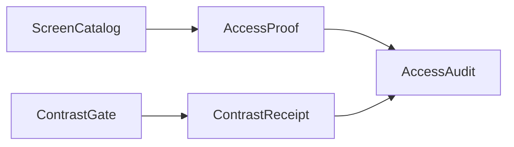

# [APPUI_ACCESSIBILITY]

Rasm.AppUi accessibility is columns on existing catalogs plus one gate fold: automation identity and live-region announcements source from `ScreenCatalogRow` columns, keyboard reachability rides the attached `KeyboardNavigation` surface, and the WCAG contrast gate is the suite's single luminance implementation asserting receipts over theme-token candidate pairs. The page owns the announcement row family, the focus law, the contrast floor axis, and the per-row compliance audit the headless lanes execute, composing the screen catalog, theme tokens, dialog sessions, motion degrade state, and the Avalonia.Headless substrate as settled vocabulary.

## [01]-[INDEX]

- [01]-[AUTOMATION_PEERS]: Catalog-sourced automation identity; live-region announcement rows.
- [02]-[KEYBOARD_NAV]: Tab-order, trap, and refocus law over attached navigation.
- [03]-[CONTRAST_GATE]: The suite's single WCAG luminance gate and floor rows.
- [04]-[COMPLIANCE_PROOF]: Per-catalog-row audit law executed by the headless lanes.

## [02]-[AUTOMATION_PEERS]

- Owner: `AnnouncementRow` live-region record; `SceneAccessNode` the 3D-scene accessibility tree; `SpatialCue` the spatial-audio cue; `AccessOps` identity fold over catalog columns.
- Cases: toast, progress, validation over stock peers; chart-tile, preview, custom-visual, scene-element over Skia-drawn visuals carrying the `Synthesized` flag — the seven announcement rows.
- Entry: `public StyledElement Identify(ScreenCatalogRow row)` — the one automation-identity admission per surface root; `public StyledElement FocusGeometry(SceneAccessNode node)` — the one focus-over-geometry admission projecting a scene node's name and role onto the focused element.
- Auto: the mount transaction applies `Identify` at every surface root; `Announce` subscriptions join the activation scope's disposal; the `AutomationName` column is the single name source for every derived dockable, palette entry, and proof lane; the `Synthesized` column declares which live regions sit on Skia-drawn visuals lacking a stock peer, so the peer-presence audit reads the contract from the row, not a per-visual probe.
- Packages: Avalonia, System.Reactive, BCL inbox
- Growth: one announcement row per live source; one `Synthesized` flag per Skia-drawn region; one scene-element kind per 3D node role; zero new surface.
- Boundary: stock Avalonia peers own every retained control — a per-control peer class is the deleted pattern; a `Synthesized` row marks a Skia-drawn chart, tile, preview, custom-visual, or scene-element region whose automation peer the `Control.OnCreateAutomationPeer` override constructs as a `ControlAutomationPeer` over the synthesized region, so one synthesized-peer construction rides the row flag rather than a per-visual peer class, and the live-region `SetLiveSetting`/`SetName` transitions ride that peer; the 3D scene accessibility tree is `SceneAccessNode` — the geometry and node-graph elements project into one accessibility tree mirroring the scene hierarchy so a screen reader walks the model the same way it walks the control tree, `Nearest` and `Step` resolve geometry focus by spatial proximity and direction so arrow-key or gaze navigation moves focus element-to-element through the scene, and `FocusGeometry` projects the focused node's name and role onto the synthesized peer so the reader announces the geometry under focus; spatial-audio cues ride `SpatialCue` — a focused scene element emits a stereo-panned, distance-attenuated cue so a non-sighted user localizes the element in space, the pan and gain derived from the listener-relative position, with the audio-output sink a composition-bound delegate; the 3D scene a11y is SPIKE-gated on the viewport scene surface over the scene-node tree the viewport and the host emit; the macOS automation-backend projection of those transitions across the embedded NSView boundary stays a research row until the backend reach confirms; per-call automation-name literals are deleted by the catalog column.

```csharp signature
public sealed record AnnouncementRow(string Key, AutomationLiveSetting Setting, IObservable<string> Texts, bool Synthesized);

public sealed record SceneAccessNode(
    string ElementId,
    string Name,
    string Role,
    (double X, double Y, double Z) Center,
    Seq<SceneAccessNode> Children) {
    public Seq<SceneAccessNode> Flatten() => Seq(this) + Children.Bind(static child => child.Flatten());

    public Option<SceneAccessNode> Nearest((double X, double Y, double Z) from) =>
        Flatten().OrderBy(node => Distance(node.Center, from)).HeadOrNone();

    public Option<SceneAccessNode> Step((double X, double Y, double Z) from, (double X, double Y, double Z) direction) =>
        Flatten()
            .Filter(node => Dot(Delta(node.Center, from), direction) > 0d)
            .OrderBy(node => Distance(node.Center, from))
            .HeadOrNone();

    static (double X, double Y, double Z) Delta((double X, double Y, double Z) a, (double X, double Y, double Z) b) => (a.X - b.X, a.Y - b.Y, a.Z - b.Z);
    static double Dot((double X, double Y, double Z) a, (double X, double Y, double Z) b) => (a.X * b.X) + (a.Y * b.Y) + (a.Z * b.Z);
    static double Distance((double X, double Y, double Z) a, (double X, double Y, double Z) b) => Math.Sqrt(Dot(Delta(a, b), Delta(a, b)));
}

public readonly record struct SpatialCue(string ElementId, double Pan, double Distance, double Gain) {
    public static SpatialCue For(SceneAccessNode node, (double X, double Y, double Z) listener, (double X, double Y, double Z) right) {
        var dx = node.Center.X - listener.X;
        var dy = node.Center.Y - listener.Y;
        var dz = node.Center.Z - listener.Z;
        var distance = Math.Sqrt((dx * dx) + (dy * dy) + (dz * dz));
        var pan = Math.Clamp(((dx * right.X) + (dy * right.Y) + (dz * right.Z)) / (distance + double.Epsilon), -1d, 1d);
        return new SpatialCue(node.ElementId, pan, distance, 1d / (1d + distance));
    }
}

public static class AccessOps {
    extension(StyledElement element) {
        public StyledElement Identify(ScreenCatalogRow row) {
            AutomationProperties.SetAutomationId(element, row.Id);
            AutomationProperties.SetName(element, row.AutomationName);
            AutomationProperties.SetHelpText(element, row.Title);
            return element;
        }

        public IDisposable Announce(AnnouncementRow row) {
            AutomationProperties.SetAutomationId(element, row.Key);
            AutomationProperties.SetLiveSetting(element, row.Setting);
            return row.Texts.Subscribe(text => AutomationProperties.SetName(element, text));
        }

        public StyledElement FocusGeometry(SceneAccessNode node) {
            AutomationProperties.SetAutomationId(element, node.ElementId);
            AutomationProperties.SetName(element, node.Name);
            AutomationProperties.SetHelpText(element, node.Role);
            return element;
        }
    }
}
```

| [INDEX] | [ROW]         | [SETTING]   | [TEXT_SOURCE]                                          | [SYNTHESIZED] |
| :-----: | :------------ | :---------- | :----------------------------------------------------- | :------------ |
|  [01]   | toast         | `Polite`    | notification text at presentation                      | no            |
|  [02]   | progress      | `Polite`    | phase-transition text from progress streams            | no            |
|  [03]   | validation    | `Assertive` | `AdmissionState` fail text                             | no            |
|  [04]   | chart-tile    | `Polite`    | series summary at render from the spec fold            | yes           |
|  [05]   | preview       | `Polite`    | offscreen-preview caption at capture                   | yes           |
|  [06]   | custom-visual | `Polite`    | custom-visual summary at render from the kind fold     | yes           |
|  [07]   | scene-element | `Polite`    | scene-node name and role at focus from the access tree | yes           |

## [03]-[KEYBOARD_NAV]

- Owner: `FocusOps` keyboard fold over the attached navigation surface.
- Cases: navigation-mode rows — screen root, dialog overlay, grid body, embedded panel root.
- Entry: `public InputElement TabOrder(params ReadOnlySpan<(IInputElement Stop, int Rank)> stops)` — rank assignment per region in one fold.
- Auto: tab ranks derive from layout order at mount; dialog sessions apply the `Cycle` row on open and return focus to the captured opener through `Focus` on close; access keys derive as one fold over the command table's gesture column through `SetAccessKey`.
- Packages: Avalonia, LanguageExt.Core, BCL inbox
- Growth: one navigation-mode row per region kind; zero new surface.
- Boundary: focus visuals resolve from theme tokens at the focus pseudo-classes — local focus styling is the deleted pattern; arrow navigation inside grids and flattened trees rides the grid's own key surface, never a parallel handler; a second key table beside the command table is the rejected form.

```csharp signature
public static class FocusOps {
    extension(InputElement region) {
        public InputElement TabOrder(params ReadOnlySpan<(IInputElement Stop, int Rank)> stops) {
            toSeq(stops.ToArray()).Iter(static stop => KeyboardNavigation.SetTabIndex(stop.Stop, stop.Rank));
            return region;
        }

        public InputElement Mode(KeyboardNavigationMode mode) {
            KeyboardNavigation.SetTabNavigation(region, mode);
            return region;
        }
    }
}
```

| [INDEX] | [REGION]                     | [MODE]      |
| :-----: | :--------------------------- | :---------- |
|  [01]   | screen root                  | `Continue`  |
|  [02]   | dialog session overlay root  | `Cycle`     |
|  [03]   | grid and flattened-tree body | `Contained` |
|  [04]   | embedded panel root          | `Local`     |

## [04]-[CONTRAST_GATE]

- Owner: `ContrastGate` static surface; `ContrastReceipt` receipt record.
- Cases: floor rows — body-text, large-text, non-text, high-contrast — plus the one luminance-offset value.
- Entry: `public static ContrastReceipt Measure(string pairKey, string variant, Color foreground, Color background, double floor)` — one ratio assertion per candidate pair.
- Auto: token resolve and every variant swap emit candidate pairs through `Measure`; the high-contrast variant gates at the elevated floor row; receipts join the evidence stream.
- Receipt: `ContrastReceipt` per candidate pair, keyed pair key plus variant.
- Packages: Avalonia.Controls.ColorPicker, Avalonia, BCL inbox
- Growth: one floor row per pair class; zero new surface.
- Boundary: the one luminance implementation suite-wide — a second ratio computation anywhere is the deleted pattern; theme tokens emit pairs and consume receipts, never ratios; `GetRelativeLuminance` is the only luminance primitive.

```csharp signature
public readonly record struct ContrastReceipt(string PairKey, string Variant, double Ratio, double Floor, bool Pass);

public static class ContrastGate {
    public static double Ratio(Color foreground, Color background) {
        var first = ColorHelper.GetRelativeLuminance(foreground);
        var second = ColorHelper.GetRelativeLuminance(background);
        return (Math.Max(first, second) + 0.05) / (Math.Min(first, second) + 0.05);
    }

    public static ContrastReceipt Measure(string pairKey, string variant, Color foreground, Color background, double floor) {
        var ratio = Ratio(foreground, background);
        return new(pairKey, variant, ratio, floor, ratio >= floor);
    }
}
```

| [INDEX] | [ROW]            | [VALUE] | [BINDS]                                     |
| :-----: | :--------------- | :-----: | :------------------------------------------ |
|  [01]   | body-text        |   4.5   | text pairs at body sizes                    |
|  [02]   | large-text       |   3.0   | display and headline pairs                  |
|  [03]   | non-text         |   3.0   | focus visuals, icon tints, chart strokes    |
|  [04]   | high-contrast    |   7.0   | every pair on the high-contrast variant row |
|  [05]   | luminance-offset |  0.05   | both ratio terms                            |

## [05]-[COMPLIANCE_PROOF]

- Owner: `AccessAudit` audit row record; `AccessProof` sweep fold.
- Cases: focus walk, peer presence, name coverage, reduced-motion conformance, contrast sweep — the five audit checks.
- Entry: `public static Seq<AccessAudit> Sweep(ScreenCatalog catalog, Seq<(ThemeVariantRow Variant, DensityRow Density)> grid, Func<ScreenCatalogRow, ThemeVariantRow, DensityRow, AccessAudit> probe)` — every headless catalog row crossed with every variant-density cell; audit keys materialize from the row keys.
- Auto: `KeyPressQwerty` traversal proves the focus walk; name coverage asserts the applied `AutomationName` column; reduced-motion conformance reads the one motion degrade switch; the contrast sweep folds `Measure` over the variant's candidate pairs; the evidence derivation engine executes every audit, deleting hand-written per-screen accessibility smoke specs.
- Receipt: `AccessAudit` rows keyed screen id, variant, and density into the evidence stream.
- Packages: Avalonia.Headless, Avalonia.Headless.XUnit, LanguageExt.Core
- Growth: one audit row per new variant or density cell; zero new surface.
- Boundary: the cluster declares the audit law only — spec execution and capture lanes stay with the evidence engine; `UseHeadlessDrawing` disabled selects the Skia backend on every capture lane; `HeadlessLane` filters to `HeadlessProof` rows, so host-bound screens exit the sweep structurally.

```csharp signature
public sealed record AccessAudit(
    string ScreenId,
    string Variant,
    string Density,
    bool FocusWalk,
    bool PeerPresence,
    bool NameCoverage,
    bool ReducedMotion,
    Seq<ContrastReceipt> Contrast) {
    public bool Pass =>
        FocusWalk && PeerPresence && NameCoverage && ReducedMotion && Contrast.ForAll(static receipt => receipt.Pass);
}

public static class AccessProof {
    public static Seq<AccessAudit> Sweep(
        ScreenCatalog catalog,
        Seq<(ThemeVariantRow Variant, DensityRow Density)> grid,
        Func<ScreenCatalogRow, ThemeVariantRow, DensityRow, AccessAudit> probe) =>
        catalog.HeadlessLane.Bind(row => grid.Map(cell => probe(row, cell.Variant, cell.Density)));
}
```



## [06]-[RESEARCH]

- [PEER_SYNTHESIS]: the `ControlAutomationPeer` subclass shape synthesizing automation-peer presence over Skia-drawn chart, tile, and preview visuals — the `GetNameCore`, `GetAutomationControlTypeCore`, and `GetClassNameOverrideCore` overrides the synthesized region returns and the live-region update path on the synthesized peer.
- [EMBEDDED_VOICEOVER]: VoiceOver reach into embedded-root content across the NSView boundary on Rhino panel rows; live-region projection of `SetLiveSetting` and `SetName` transitions through the macOS automation backend.
