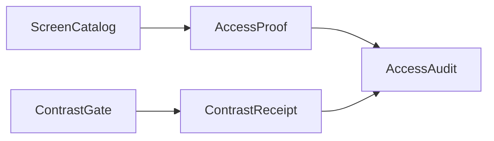

# [APPUI_ACCESSIBILITY]

Rasm.AppUi accessibility is columns on existing catalogs plus one gate fold: automation identity and live-region announcements source from `ScreenCatalogRow` columns, keyboard reachability rides the attached `KeyboardNavigation` surface, and the WCAG contrast gate is the suite's single luminance implementation asserting receipts over theme-token candidate pairs. The page owns the announcement row family, the focus law, the contrast floor axis, and the per-row compliance audit the headless lanes execute, composing the screen catalog, theme tokens, dialog sessions, motion degrade state, and the Avalonia.Headless substrate as settled vocabulary.

## [01]-[INDEX]

- [01]-[AUTOMATION_PEERS]: Catalog-sourced automation identity; live-region announcement rows.
- [02]-[KEYBOARD_NAV]: Tab-order, trap, and refocus law over attached navigation.
- [03]-[CONTRAST_GATE]: The suite's single WCAG luminance gate and floor rows.
- [04]-[COMPLIANCE_PROOF]: Per-catalog-row audit law executed by the headless lanes.

## [02]-[AUTOMATION_PEERS]

- Owner: `AnnouncementRow` live-region record; `AnnouncementHost` the closed stock-or-synthesized host discriminant; `SynthesizedRegion` the one peer-producing host for Skia-drawn regions; `SceneAccessTree` the keyed 3D-scene accessibility topology; `SpatialCue` the spatial-audio cue; `AccessOps` identity fold over catalog columns.
- Cases: toast, progress, validation over stock peers; chart-tile, preview, custom-visual, scene-element over Skia-drawn visuals carrying the `AnnouncementHost.Synthesized` case — the seven announcement rows.
- Entry: `public StyledElement Identify(ScreenCatalogRow row)` — the one automation-identity admission per surface root; `public (StyledElement Region, IDisposable Live) Materialize(IScheduler scheduler)` — the row host case mints either its admitted stock element or the one synthesized peer host and schedules distinct announcements on the UI scheduler; `public StyledElement FocusGeometry(SceneAccessNode node)` — the one focus-over-geometry admission projecting a scene node's name and role onto the focused element.
- Auto: the mount transaction applies `Identify` at every surface root; `Materialize` joins the returned subscription to the activation scope; the `AutomationName` column is the single name source for every derived dockable, palette entry, and proof lane; the `AnnouncementHost` case makes peer synthesis a closed admission decision, so a stock row cannot call a synthesized-only mint and a synthesized row cannot omit its peer host.
- Packages: Avalonia, System.Reactive, BCL inbox
- Growth: one announcement row per live source; one `AnnouncementHost` case only for a genuinely distinct peer-admission regime; one scene-element kind per 3D node role; zero new surface.
- Boundary: stock Avalonia peers own every retained control — a per-control peer class is the deleted pattern; `AnnouncementHost.Synthesized` materializes through the one `SynthesizedRegion` host, a hit-test-transparent `Control` whose `OnCreateAutomationPeer` override returns a `ControlAutomationPeer`, mounted as the Skia visual's sibling by the row's `Materialize` fold; `SceneAccessTree` stores one keyed node set with parent identities instead of recursive child payloads, so shared lookup, hierarchy projection, nearest focus, and direction-ranked focus operate over the same topology without recursive stack growth or cousin admission; `FocusGeometry` projects the focused node's name and role onto the synthesized peer; `SpatialCue.For` validates the listener basis and returns a typed fault before emitting its stereo-pan and distance-gain value to the composition-bound audio sink; the 3D scene accessibility contract is SPIKE-gated on the viewport scene surface over the scene-node tree the viewport and host emit; the macOS automation-backend projection of those transitions across the embedded NSView boundary stays a research row until backend reach confirms; per-call automation-name literals are deleted by the catalog column.

```csharp signature
[Union]
public abstract partial record AnnouncementHost {
    private AnnouncementHost() { }

    public sealed record Stock(StyledElement Element) : AnnouncementHost;
    public sealed record Synthesized : AnnouncementHost;
}

public sealed record AnnouncementRow(string Key, AutomationLiveSetting Setting, IObservable<string> Texts, AnnouncementHost Host);

public sealed record SceneAccessNode(
    string ElementId,
    string Name,
    string Role,
    (double X, double Y, double Z) Center,
    Option<string> ParentId,
    int Rank);

public sealed record SceneAccessTree(FrozenDictionary<string, SceneAccessNode> Nodes) {
    public Seq<SceneAccessNode> Flatten() =>
        toSeq(Nodes.Values).OrderBy(static node => node.ElementId, StringComparer.Ordinal).ToSeq();

    public Option<SceneAccessNode> Nearest((double X, double Y, double Z) from) =>
        Flatten().OrderBy(node => Distance(node.Center, from)).ThenBy(static node => node.ElementId, StringComparer.Ordinal).HeadOrNone();

    public Fin<Option<SceneAccessNode>> Step((double X, double Y, double Z) from, (double X, double Y, double Z) direction) =>
        Length(direction) switch {
            <= double.Epsilon => FinFail<Option<SceneAccessNode>>(new AccessFault.GeometryRejected("zero-direction")),
            double magnitude => FinSucc(Flatten()
                .Map(node => (Node: node, Delta: Delta(node.Center, from)))
                .Map(candidate => (candidate.Node, Distance: Length(candidate.Delta), Alignment: Dot(candidate.Delta, direction) / (Length(candidate.Delta) * magnitude + double.Epsilon)))
                .Filter(candidate => candidate.Alignment > 0d)
                .OrderByDescending(static candidate => candidate.Alignment)
                .ThenBy(static candidate => candidate.Distance)
                .ThenBy(static candidate => candidate.Node.ElementId, StringComparer.Ordinal)
                .Map(static candidate => candidate.Node)
                .HeadOrNone()),
        };

    public Seq<SceneAccessNode> Roots =>
        Flatten()
            .Filter(static node => node.ParentId.IsNone)
            .OrderBy(static node => node.Rank)
            .ThenBy(static node => node.ElementId, StringComparer.Ordinal)
            .ToSeq();

    public Seq<SceneAccessNode> ChildrenOf(string parentId) =>
        Flatten()
            .Filter(node => node.ParentId.Exists(parent => string.Equals(parent, parentId, StringComparison.Ordinal)))
            .OrderBy(static node => node.Rank)
            .ThenBy(static node => node.ElementId, StringComparer.Ordinal)
            .ToSeq();

    private static (double X, double Y, double Z) Delta((double X, double Y, double Z) a, (double X, double Y, double Z) b) => (a.X - b.X, a.Y - b.Y, a.Z - b.Z);
    private static double Dot((double X, double Y, double Z) a, (double X, double Y, double Z) b) => (a.X * b.X) + (a.Y * b.Y) + (a.Z * b.Z);
    private static double Length((double X, double Y, double Z) vector) => Math.Sqrt(Dot(vector, vector));
    private static double Distance((double X, double Y, double Z) a, (double X, double Y, double Z) b) => Length(Delta(a, b));
}

public readonly record struct SpatialCue(string ElementId, double Pan, double Distance, double Gain) {
    public static Fin<SpatialCue> For(SceneAccessNode node, (double X, double Y, double Z) listener, (double X, double Y, double Z) right) =>
        (Delta: (node.Center.X - listener.X, node.Center.Y - listener.Y, node.Center.Z - listener.Z),
         RightLength: Math.Sqrt((right.X * right.X) + (right.Y * right.Y) + (right.Z * right.Z))) switch {
            { RightLength: <= double.Epsilon } => FinFail<SpatialCue>(new AccessFault.GeometryRejected("zero-right-axis")),
            var basis => Math.Sqrt((basis.Delta.Item1 * basis.Delta.Item1) + (basis.Delta.Item2 * basis.Delta.Item2) + (basis.Delta.Item3 * basis.Delta.Item3)) switch {
                var distance when double.IsFinite(distance) => FinSucc(new SpatialCue(
                    node.ElementId,
                    Math.Clamp(((basis.Delta.Item1 * right.X) + (basis.Delta.Item2 * right.Y) + (basis.Delta.Item3 * right.Z)) / (distance * basis.RightLength + double.Epsilon), -1d, 1d),
                    distance,
                    1d / (1d + distance))),
                _ => FinFail<SpatialCue>(new AccessFault.GeometryRejected("non-finite-position")),
            },
        };
}

[Union]
public abstract partial record AccessFault : Expected, IValidationError<AccessFault> {
    private AccessFault(string detail, int code) : base(detail, code, None) { }

    public static AccessFault Create(string message) => new GeometryRejected(message);

    public sealed record GeometryRejected : AccessFault { public GeometryRejected(string detail) : base(detail, AppUiFaultBand.Accessibility.Code(0)) { } }
}

// The one peer-producing host for Skia-drawn regions: hit-test-transparent, so it never intercepts
// the visual it voices, and its peer is a stock ControlAutomationPeer — never a per-visual peer class.
public sealed class SynthesizedRegion : Control {
    public SynthesizedRegion() => IsHitTestVisible = false;

    protected override AutomationPeer OnCreateAutomationPeer() => new ControlAutomationPeer(this);
}

public static class AccessOps {
    extension(AnnouncementRow row) {
        public (StyledElement Region, IDisposable Live) Materialize(IScheduler scheduler) =>
            row.Host.Switch(
                state: (Row: row, Scheduler: scheduler),
                stock: static (state, host) => (host.Element, host.Element.Announce(state.Row, state.Scheduler)),
                synthesized: static (state, _) => new SynthesizedRegion() switch {
                    SynthesizedRegion region => (region, region.Announce(state.Row, state.Scheduler)),
                });
    }

    extension(StyledElement element) {
        public StyledElement Identify(ScreenCatalogRow row) {
            AutomationProperties.SetAutomationId(element, row.Id);
            AutomationProperties.SetName(element, row.AutomationName);
            AutomationProperties.SetHelpText(element, row.Title);
            return element;
        }

        public IDisposable Announce(AnnouncementRow row, IScheduler scheduler) {
            AutomationProperties.SetAutomationId(element, row.Key);
            AutomationProperties.SetLiveSetting(element, row.Setting);
            return row.Texts
                .DistinctUntilChanged(StringComparer.Ordinal)
                .ObserveOn(scheduler)
                .Subscribe(text => AutomationProperties.SetName(element, text));
        }

        public StyledElement FocusGeometry(SceneAccessNode node) {
            AutomationProperties.SetAutomationId(element, node.ElementId);
            AutomationProperties.SetName(element, node.Name);
            AutomationProperties.SetHelpText(element, node.Role);
            return element;
        }
    }
}
```

| [INDEX] | [ROW]         | [SETTING]   | [TEXT_SOURCE]                                          | [HOST]        |
| :-----: | :------------ | :---------- | :----------------------------------------------------- | :------------ |
|  [01]   | toast         | `Polite`    | notification text at presentation                      | stock         |
|  [02]   | progress      | `Polite`    | phase-transition text from progress streams            | stock         |
|  [03]   | validation    | `Assertive` | `AdmissionState` fail text                             | stock         |
|  [04]   | chart-tile    | `Polite`    | series summary at render from the spec fold            | synthesized   |
|  [05]   | preview       | `Polite`    | offscreen-preview caption at capture                   | synthesized   |
|  [06]   | custom-visual | `Polite`    | custom-visual summary at render from the kind fold     | synthesized   |
|  [07]   | scene-element | `Polite`    | scene-node name and role at focus from the access tree | synthesized   |

## [03]-[KEYBOARD_NAV]

- Owner: `FocusOps` keyboard fold over the attached navigation surface.
- Cases: navigation-mode rows — screen root, dialog overlay, grid body, embedded panel root.
- Entry: `public InputElement TabOrder(params ReadOnlySpan<(IInputElement Stop, int Rank)> stops)` — rank assignment per region in one fold.
- Auto: tab ranks derive from layout order at mount; dialog sessions apply the `Cycle` row on open and return focus to the captured opener through `Focus` on close; access keys derive as one fold over the command table's gesture column through `SetAccessKey`.
- Packages: Avalonia, LanguageExt.Core, BCL inbox
- Growth: one navigation-mode row per region kind; zero new surface.
- Boundary: focus visuals resolve from theme tokens at the focus pseudo-classes — local focus styling is the deleted pattern; arrow navigation inside grids and flattened trees rides the grid's own key surface, never a parallel handler; a second key table beside the command table is the rejected form.

```csharp signature
public static class FocusOps {
    extension(InputElement region) {
        public InputElement TabOrder(params ReadOnlySpan<(IInputElement Stop, int Rank)> stops) {
            toSeq(stops.ToArray()).Iter(static stop => KeyboardNavigation.SetTabIndex(stop.Stop, stop.Rank));
            return region;
        }

        public InputElement Mode(KeyboardNavigationMode mode) {
            KeyboardNavigation.SetTabNavigation(region, mode);
            return region;
        }
    }
}
```

| [INDEX] | [REGION]                     | [MODE]      |
| :-----: | :--------------------------- | :---------- |
|  [01]   | screen root                  | `Continue`  |
|  [02]   | dialog session overlay root  | `Cycle`     |
|  [03]   | grid and flattened-tree body | `Contained` |
|  [04]   | embedded panel root          | `Local`     |

## [04]-[CONTRAST_GATE]

- Owner: `ContrastFloor` `[SmartEnum<string>]` the admitted floor vocabulary; `ContrastGate` static surface carrying BOTH perceptual assertions — the WCAG luminance ratio and the CVD distinguishability distance; `ContrastReceipt` and `CvdReceipt` receipt records.
- Cases: `ContrastFloor` = BodyText 4.5 | LargeText 3.0 | NonText 3.0 | HighContrast 7.0 — the four floor rows; no fifth threshold source exists.
- Entry: `public static ContrastReceipt Measure(string pairKey, string variant, Color foreground, Color background, Color canvas, ContrastFloor floor)` — one alpha-composited ratio assertion per candidate pair; the floor arrives as a vocabulary row, so a caller-selected scalar is unrepresentable and every receipt names the admitted policy it was gated by; `public static CvdReceipt Distinct(string pairKey, string variant, Color left, Color right, Cvd deficiency, CvdSeverity severity, DifferenceFloor floor)` — one distinguishability assertion per safety-load-bearing pair: both colors pass through `Unicolour.Simulate(cvd, severity)` and the simulated pair measures `Difference(reference, DeltaE.Ciede2000)` against a validated floor, so a red/green status pair indistinguishable under deuteranopia fails a receipt no luminance ratio catches.
- Auto: token resolve and every variant swap emit candidate pairs through `Measure`, each pair class resolving its `ContrastFloor` row from the frozen token vocabulary; the high-contrast variant gates every pair at `ContrastFloor.HighContrast`; status-paint and colormap-stop pairs additionally sweep `Distinct` across the composition-supplied `Cvd` deficiency grid; receipts join the evidence stream.
- Receipt: `ContrastReceipt` per candidate pair, keyed pair key plus variant, carrying the floor row key and its value so the compliance sweep distinguishes a violated declared floor from a malformed or absent policy selection; `CvdReceipt` per (pair × deficiency), carrying the simulated ΔE and its floor.
- Packages: Wacton.Unicolour, Avalonia, Thinktecture.Runtime.Extensions, BCL inbox
- Growth: one `ContrastFloor` row per pair class; one `Cvd` deficiency per sweep cell and one ΔE floor value per pair class, both composition-supplied; zero new surface.
- Boundary: the one WCAG implementation suite-wide rides the Unicolour color kernel (`Theme/tokens.md` seals Unicolour as the suite colour owner) — `Ratio` composites foreground and background over the candidate canvas through `Unicolour.Blend(..., BlendMode.Normal)` before one `Unicolour.Contrast(other)` call, so translucent token pairs cannot pass against an imaginary opaque color; a hand-folded luminance pair and the Avalonia `ColorHelper.GetRelativeLuminance` call are the deleted forms (`[V10]`); the CVD lens rides the same kernel — `Simulate` plus `Difference(DeltaE.Ciede2000)`, never a hand-rolled deficiency matrix — and the deficiency grid with its validated ΔE floor arrives from the theme pair vocabulary at composition, so the gate asserts distinguishability without owning the pair census; theme tokens emit pairs and consume receipts, never ratios.

```csharp signature
[SmartEnum<string>]
[KeyMemberEqualityComparer<ComparerAccessors.StringOrdinal, string>]
[KeyMemberComparer<ComparerAccessors.StringOrdinal, string>]
public sealed partial class ContrastFloor {
    public static readonly ContrastFloor BodyText = new("body-text", floor: 4.5);
    public static readonly ContrastFloor LargeText = new("large-text", floor: 3.0);
    public static readonly ContrastFloor NonText = new("non-text", floor: 3.0);
    public static readonly ContrastFloor HighContrast = new("high-contrast", floor: 7.0);

    public double Floor { get; }
}

[ValueObject<double>]
public readonly partial struct CvdSeverity {
    private static ValidationError? ValidateFactoryArguments(double value) =>
        double.IsFinite(value) && value is >= 0d and <= 1d ? null : new ValidationError($"CVD severity outside [0,1]: {value}");
}

[ValueObject<double>]
public readonly partial struct DifferenceFloor {
    private static ValidationError? ValidateFactoryArguments(double value) =>
        double.IsFinite(value) && value > 0d ? null : new ValidationError($"difference floor must be finite and positive: {value}");
}

public readonly record struct ContrastReceipt(string PairKey, string Variant, double Ratio, ContrastFloor Floor, bool Pass);

public readonly record struct CvdReceipt(string PairKey, string Variant, Cvd Deficiency, double Difference, DifferenceFloor Floor, bool Distinct);

public static class ContrastGate {
    // WCAG ratio through the Unicolour kernel's own Contrast member — one color-science owner suite-wide.
    public static double Ratio(Color foreground, Color background, Color canvas) =>
        Composite(background, canvas) switch {
            Unicolour backdrop => Admit(foreground).Blend(backdrop, BlendMode.Normal).Contrast(backdrop),
        };

    public static ContrastReceipt Measure(string pairKey, string variant, Color foreground, Color background, Color canvas, ContrastFloor floor) =>
        Ratio(foreground, background, canvas) switch {
            var ratio => new(pairKey, variant, ratio, floor, ratio >= floor.Floor),
        };

    // The second perceptual axis: the pair simulates under the deficiency, then measures CIEDE2000
    // distance — distinguishability the luminance ratio cannot assert, same kernel, same receipt rail.
    public static CvdReceipt Distinct(string pairKey, string variant, Color left, Color right, Cvd deficiency, CvdSeverity severity, DifferenceFloor floor) =>
        Admit(left).Simulate(deficiency, severity.ToValue()).Difference(Admit(right).Simulate(deficiency, severity.ToValue()), DeltaE.Ciede2000) switch {
            var difference => new(pairKey, variant, deficiency, difference, floor, difference >= floor.ToValue()),
        };

    private static Unicolour Composite(Color foreground, Color background) => Admit(foreground).Blend(Admit(background), BlendMode.Normal);

    private static Unicolour Admit(Color color) => new(ColourSpace.Rgb255, color.R, color.G, color.B, alpha: color.A / 255d);
}
```

| [INDEX] | [ROW]           | [VALUE] | [BINDS]                                     |
| :-----: | :-------------- | :-----: | :------------------------------------------ |
|  [01]   | `BodyText`      |   4.5   | text pairs at body sizes                    |
|  [02]   | `LargeText`     |   3.0   | display and headline pairs                  |
|  [03]   | `NonText`       |   3.0   | focus visuals, icon tints, chart strokes    |
|  [04]   | `HighContrast`  |   7.0   | every pair on the high-contrast variant row |

## [05]-[COMPLIANCE_PROOF]

- Owner: `AccessCheck` closed structural-check vocabulary, `AccessCheckReceipt` keyed result, `AccessAudit` audit row record, and `AccessProof` sweep fold.
- Cases: focus walk, peer presence, name coverage, reduced-motion conformance, contrast sweep, CVD distinguishability sweep — the six audit checks.
- Entry: `public static Seq<AccessAudit> Sweep(ScreenCatalog catalog, Seq<(ThemeVariantRow Variant, DensityRow Density)> grid, Func<ScreenCatalogRow, ThemeVariantRow, DensityRow, AccessAudit> probe)` — every headless catalog row crossed with every variant-density cell; audit keys materialize from the row keys.
- Auto: `KeyPressQwerty` traversal proves the focus walk; name coverage asserts the applied `AutomationName` column; peer presence reads the actual automation-peer boundary — a `Synthesized` row proves through its mounted `SynthesizedRegion`, never the declaration flag; reduced-motion conformance reads the one motion degrade switch; the contrast sweep folds `Measure` and the distinguishability sweep folds `Distinct` over the variant's candidate pairs and deficiency grid; the evidence derivation engine executes every audit, deleting hand-written per-screen accessibility smoke specs.
- Receipt: `AccessAudit` rows keyed screen id, variant, and density into the evidence stream; `Checks` is keyed by the closed `AccessCheck` vocabulary, and `Pass` requires one passing receipt for every admitted check, so adding a check without producing it fails closed.
- Packages: Avalonia.Headless, Avalonia.Headless.XUnit, LanguageExt.Core
- Growth: one audit row per new variant or density cell; zero new surface.
- Boundary: the cluster declares the audit law only — spec execution and capture lanes stay with the evidence engine; `UseHeadlessDrawing` disabled selects the Skia backend on every capture lane; `HeadlessLane` filters to `ProofLane.Headless` rows, so host-bound screens exit the sweep structurally.

```csharp signature
[SmartEnum<string>]
[KeyMemberEqualityComparer<ComparerAccessors.StringOrdinal, string>]
[KeyMemberComparer<ComparerAccessors.StringOrdinal, string>]
public sealed partial class AccessCheck {
    public static readonly AccessCheck FocusWalk = new("focus-walk");
    public static readonly AccessCheck PeerPresence = new("peer-presence");
    public static readonly AccessCheck NameCoverage = new("name-coverage");
    public static readonly AccessCheck ReducedMotion = new("reduced-motion");
}

public readonly record struct AccessCheckReceipt(AccessCheck Check, bool Pass);

public sealed record AccessAudit(
    string ScreenId,
    string Variant,
    string Density,
    HashMap<AccessCheck, AccessCheckReceipt> Checks,
    Seq<ContrastReceipt> Contrast,
    Seq<CvdReceipt> Distinguish) {
    public bool Pass =>
        toSeq(AccessCheck.Items).ForAll(check => Checks.Find(check).Exists(static receipt => receipt.Pass))
        && Contrast.ForAll(static receipt => receipt.Pass)
        && Distinguish.ForAll(static receipt => receipt.Distinct);
}

public static class AccessProof {
    public static Seq<AccessAudit> Sweep(
        ScreenCatalog catalog,
        Seq<(ThemeVariantRow Variant, DensityRow Density)> grid,
        Func<ScreenCatalogRow, ThemeVariantRow, DensityRow, AccessAudit> probe) =>
        catalog.HeadlessLane.Bind(row => grid.Map(cell => probe(row, cell.Variant, cell.Density)));
}
```



## [06]-[RESEARCH]

- [EMBEDDED_VOICEOVER]: VoiceOver reach into embedded-root content across the NSView boundary on Rhino panel rows; live-region projection of `SetLiveSetting` and `SetName` transitions — including those raised through the `SynthesizedRegion` peer — through the macOS automation backend.
