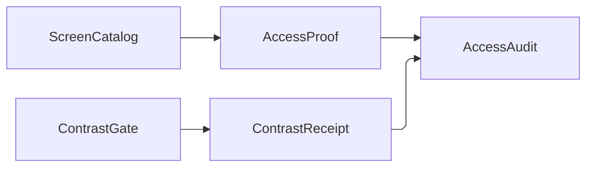

# [APPUI_ACCESSIBILITY]

Rasm.AppUi accessibility is columns on existing catalogs plus one gate fold: automation identity and live-region announcements source from `ScreenCatalogRow` columns, keyboard reachability rides the attached `KeyboardNavigation` surface, and the WCAG contrast gate is the suite's single luminance implementation asserting receipts over theme-token candidate pairs. The page owns the announcement row family, the focus law, the contrast floor axis, and the per-row compliance audit the headless lanes execute, composing the screen catalog, theme tokens, dialog sessions, motion degrade state, and the Avalonia.Headless substrate as settled vocabulary.

## [01]-[INDEX]

- [02]-[AUTOMATION_PEERS]: Catalog-sourced automation identity; live-region announcement rows.
- [03]-[KEYBOARD_NAV]: Tab-order, trap, and refocus law over attached navigation.
- [04]-[CONTRAST_GATE]: The suite's single WCAG luminance gate and floor rows.
- [05]-[COMPLIANCE_PROOF]: Per-catalog-row audit law executed by the headless lanes.

## [02]-[AUTOMATION_PEERS]

- Owner: `AnnouncementRow` live-region record carrying its locale-owned `AnnouncementPhrase`, its host voice sink, and its optional cue sink; `AnnouncementHost` the closed stock-or-synthesized host discriminant; `SynthesizedRegion` the one peer-producing host for Skia-drawn regions; `SceneAccessTree` the keyed 3D-scene accessibility topology; `SpatialCue` the spatial-audio cue; `AccessOps` identity fold over catalog columns; `AccessFault` the typed fault family on the `AppUiFaultBand.Accessibility` registry row (6090).
- Cases: toast, progress, validation over stock peers; chart-tile, preview, custom-visual, scene-element over Skia-drawn visuals carrying the `AnnouncementHost.Synthesized` case — the seven announcement rows.
- Entry: `public StyledElement Identify(ScreenCatalogRow row)` — the one automation-identity admission per surface root; `public (StyledElement Region, IDisposable Live) Materialize(IScheduler scheduler)` — the row host case mints either its admitted stock element or the one synthesized peer host and schedules each distinct text onto the UI scheduler, writing the element's identity pair and voicing the text through the row's host sink in one pass; `SceneAccessTree.Admit` accumulates duplicate identity, missing-parent, and cycle faults before freezing the keyed topology; `public Fin<IO<Unit>> Focus(SceneAccessNode node, StyledElement peer, (double X, double Y, double Z) listener, (double X, double Y, double Z) right)` is the scene-element leg — one focus transition projecting the node's name and role onto its peer and emitting the validated `SpatialCue` to the row's bound sink.
- Auto: the mount transaction applies `Identify` at every surface root; `Materialize` joins the returned subscription to the activation scope; the `AutomationName` column is the single name source for every derived dockable, palette entry, and proof lane; the `AnnouncementHost` case makes peer synthesis a closed admission decision, so a stock row cannot call a synthesized-only mint and a synthesized row cannot omit its peer host.
- Packages: Avalonia, System.Reactive, QuikGraph, LanguageExt.Core, BCL inbox
- Law: an announcement row states no posture and no literal text of its own — both read off the locale-owned `AnnouncementPhrase`, so the announcement plane carries zero authored strings.
- Growth: one announcement row per live source; one `AnnouncementHost` case only for a genuinely distinct peer-admission regime; one scene-element kind per 3D node role; zero new surface.
- Boundary: stock Avalonia peers own every retained control — a per-control peer class is the deleted pattern; `AnnouncementHost.Synthesized` materializes through the one `SynthesizedRegion` host, a hit-test-transparent `Control` whose `OnCreateAutomationPeer` override returns a `ControlAutomationPeer`, mounted as the Skia visual's sibling by the row's `Materialize` fold; `SceneAccessTree` stores one admitted keyed node set with parent identities instead of recursive child payloads, and QuikGraph `IsDirectedAcyclicGraph` discharges topology closure before lookup, hierarchy projection, nearest focus, or direction-ranked focus can run; `Focus` is the only reader of both — it projects the focused node's name and role onto the synthesized peer through `FocusGeometry` and hands the validated `SpatialCue` to the announcement row's `Cue` column, so a row whose surface carries no audio plane holds `None` and voices name and role alone while a cue that fails its listener basis returns the typed fault before either output runs; the announced TEXT and its urgency are one locale fact, not two: `AnnouncementPhrase.Say` resolves the spoken string through the same label walk the visible caption takes and `AnnouncementPhrase.Setting` projects the platform live setting off that phrase's own speech posture, so a reader hears the localized phrasing a sighted user reads and a posture authored beside the phrase could never disagree with the urgency the phrase declares; identity and delivery are two planes and the row carries both: the attached pair (`.api/api-avalonia.md` `[AUTOMATION_TYPES]`/`[AUTOMATION_OPERATIONS]`) states identity and posture — `AutomationProperties.SetLiveSetting(element, AutomationLiveSetting.Polite | Assertive)` declares the posture, `AutomationProperties.SetName(element, text)` carries the current text for the audit lane and for any root the platform automation backend walks itself, `Off` is the row that declares silence rather than an absent setting, and the `Assertive` row is earned by a fact that must interrupt the reader mid-utterance — while DELIVERY leaves through the row's `Voice` column alone, because an embedded root projects nothing into the host's accessibility tree: the platform's native view gates its whole accessibility surface — peer children, hit-test, and the live-region announcement post — on the owning window being the platform's own window class, so under a foreign host window the mounted view reads as a non-element with an unknown role and zero accessibility children however the managed tree is annotated and whatever posture the peer carries, and an announcement design resting on the attached writes announces nothing; `Voice` is the composition-bound host announcement delegate — the host's own accessibility surface posts the notification against the view the reader actually walks, on ONE host element (window or application, never both, because both deliver and a double post doubles the utterance), the macOS spelling being `NSAccessibility.PostNotification(element, NSAccessibilityElement.AnnouncementRequestedNotification, userInfo)` with `NSAccessibilityNotificationUserInfoKeys.AnnouncementKey` carrying the text and `PriorityKey` the `NSAccessibilityPriorityLevel` the posture maps to — and the delivery contract is machine-verifiable end to end: a post from the host process crosses the accessibility wire to an external observer with text and priority intact while no screen reader runs, because an accessibility client's attachment is itself what activates the target, so the sink's custody proves without any assistive service and the only irreducibly human remainder is the spoken interpretation — intelligibility, whether the `Assertive` posture interrupts where `Polite` queues at the reader, and the rotor walk — which no automated run reaches and no design here waits on; the two writes plus the one voice are the whole contract, a focus steal or a synthetic peer event is the deleted form, and a second announcement channel beside `Voice` is unrepresentable because every row carries exactly one; the 3D scene accessibility contract is SPIKE-gated on the viewport scene surface over the scene-node tree the viewport and host emit; per-call automation-name literals are deleted by the catalog column.

```csharp signature
[Union]
public abstract partial record AnnouncementHost {
    private AnnouncementHost() { }

    public sealed record Stock(StyledElement Element) : AnnouncementHost;
    public sealed record Synthesized : AnnouncementHost;
}

// Voice is the REQUIRED host announcement sink — the embedded tree's automation peers reach no reader, so a
// row without one is a row that cannot announce and is therefore not a row. Cue is the optional composition-
// bound audio sink the scene-element row binds and every other row leaves None, so a spatial cue has exactly
// one admitted destination and no row fabricates one. The live setting is the platform's own three-member
// vocabulary reached through the phrase's `Setting` projection — `Off` names the row that never announces, so
// a row carrying no posture at all is unrepresentable and a fourth posture is a platform change, not a column.
public sealed record AnnouncementRow(
    string Key,
    // Posture and text BOTH source from the locale-owned phrase: `AnnouncementPhrase.Setting` projects the
    // platform live-setting off its own speech posture and `Say` resolves the spoken string through the one
    // label walk, so a screen reader hears the localized phrasing a sighted user reads and an urgency
    // authored here could never disagree with the urgency the phrase itself declares.
    AnnouncementPhrase Phrase,
    IObservable<string> Texts,
    AnnouncementHost Host,
    Func<AutomationLiveSetting, string, IO<Unit>> Voice,
    Option<Func<SpatialCue, IO<Unit>>> Cue);

public sealed record SceneAccessNode(
    string ElementId,
    string Name,
    string Role,
    (double X, double Y, double Z) Center,
    Option<string> ParentId,
    int Rank);

public sealed record SceneAccessTree(FrozenDictionary<string, SceneAccessNode> Nodes) {
    public static Validation<Error, SceneAccessTree> Admit(Seq<SceneAccessNode> nodes) =>
        Failures(nodes) switch {
            { IsEmpty: true } => (Validation<Error, SceneAccessTree>)new SceneAccessTree(
                nodes.ToFrozenDictionary(static node => node.ElementId, static node => node, StringComparer.Ordinal)),
            Seq<Error> failures => (Validation<Error, SceneAccessTree>)Error.Many([.. failures]),
        };

    public Seq<SceneAccessNode> Flatten() =>
        toSeq(Nodes.Values.OrderBy(static node => node.ElementId, StringComparer.Ordinal));

    public Option<SceneAccessNode> Nearest((double X, double Y, double Z) from) =>
        toSeq(Flatten().OrderBy(node => Distance(node.Center, from)).ThenBy(static node => node.ElementId, StringComparer.Ordinal)).Head;

    public Fin<Option<SceneAccessNode>> Step((double X, double Y, double Z) from, (double X, double Y, double Z) direction) =>
        Length(direction) switch {
            <= double.Epsilon => Fin.Fail<Option<SceneAccessNode>>(new AccessFault.GeometryRejected("zero-direction")),
            double magnitude => Fin.Succ(toSeq(Flatten()
                    .Map(node => (Node: node, Delta: Delta(node.Center, from)))
                    .Map(candidate => (candidate.Node, Distance: Length(candidate.Delta), Alignment: Dot(candidate.Delta, direction) / (Length(candidate.Delta) * magnitude + double.Epsilon)))
                    .Filter(candidate => candidate.Alignment > 0d)
                    .OrderByDescending(static candidate => candidate.Alignment)
                    .ThenBy(static candidate => candidate.Distance)
                    .ThenBy(static candidate => candidate.Node.ElementId, StringComparer.Ordinal))
                .Map(static candidate => candidate.Node)
                .Head),
        };

    public Seq<SceneAccessNode> Roots =>
        toSeq(Flatten()
            .Filter(static node => node.ParentId.IsNone)
            .OrderBy(static node => node.Rank)
            .ThenBy(static node => node.ElementId, StringComparer.Ordinal));

    public Seq<SceneAccessNode> ChildrenOf(string parentId) =>
        toSeq(Flatten()
            .Filter(node => node.ParentId.Exists(parent => string.Equals(parent, parentId, StringComparison.Ordinal)))
            .OrderBy(static node => node.Rank)
            .ThenBy(static node => node.ElementId, StringComparer.Ordinal));

    private static (double X, double Y, double Z) Delta((double X, double Y, double Z) a, (double X, double Y, double Z) b) => (a.X - b.X, a.Y - b.Y, a.Z - b.Z);
    private static double Dot((double X, double Y, double Z) a, (double X, double Y, double Z) b) => (a.X * b.X) + (a.Y * b.Y) + (a.Z * b.Z);
    private static double Length((double X, double Y, double Z) vector) => Math.Sqrt(Dot(vector, vector));
    private static double Distance((double X, double Y, double Z) a, (double X, double Y, double Z) b) => Length(Delta(a, b));

    private static Seq<Error> Failures(Seq<SceneAccessNode> nodes) =>
        toSeq(nodes.Map(static node => node.ElementId)
            .CountBy(identity, StringComparer.Ordinal)
            .Where(static row => row.Value > 1)
            .Select(static row => (Error)new AccessFault.GeometryRejected($"duplicate-node:{row.Key}")))
        + nodes
            .Choose(node => node.ParentId.Map(parent => (Node: node.ElementId, Parent: parent)))
            .Filter(edge => !nodes.Exists(node => string.Equals(node.ElementId, edge.Parent, StringComparison.Ordinal)))
            .Map(static edge => (Error)new AccessFault.GeometryRejected($"missing-parent:{edge.Node}:{edge.Parent}"))
        + (nodes
            .Choose(node => node.ParentId.Map(parent => new Edge<string>(parent, node.ElementId)))
            .AsEnumerable()
            .IsDirectedAcyclicGraph()
                ? Seq<Error>()
                : Seq<Error>(new AccessFault.GeometryRejected("cyclic-scene-tree")));
}

public readonly record struct SpatialCue(string ElementId, double Pan, double Distance, double Gain) {
    public static Fin<SpatialCue> For(SceneAccessNode node, (double X, double Y, double Z) listener, (double X, double Y, double Z) right) =>
        (Delta: (node.Center.X - listener.X, node.Center.Y - listener.Y, node.Center.Z - listener.Z),
         RightLength: Math.Sqrt((right.X * right.X) + (right.Y * right.Y) + (right.Z * right.Z))) switch {
            { RightLength: <= double.Epsilon } => Fin.Fail<SpatialCue>(new AccessFault.GeometryRejected("zero-right-axis")),
            var basis => Math.Sqrt((basis.Delta.Item1 * basis.Delta.Item1) + (basis.Delta.Item2 * basis.Delta.Item2) + (basis.Delta.Item3 * basis.Delta.Item3)) switch {
                var distance when double.IsFinite(distance) => Fin.Succ(new SpatialCue(
                    node.ElementId,
                    Math.Clamp(((basis.Delta.Item1 * right.X) + (basis.Delta.Item2 * right.Y) + (basis.Delta.Item3 * right.Z)) / (distance * basis.RightLength + double.Epsilon), -1d, 1d),
                    distance,
                    1d / (1d + distance))),
                _ => Fin.Fail<SpatialCue>(new AccessFault.GeometryRejected("non-finite-position")),
            },
        };
}

[Union]
public abstract partial record AccessFault : Expected, IValidationError<AccessFault> {
    private AccessFault(string detail, int code) : base(detail, code, None) { }

    public static AccessFault Create(string message) => new GeometryRejected(message);

    public sealed record GeometryRejected : AccessFault { public GeometryRejected(string detail) : base(detail, AppUiFaultBand.Accessibility.Code(0)) { } }
    public sealed record PaintUnresolved : AccessFault { public PaintUnresolved(string key) : base(key, AppUiFaultBand.Accessibility.Code(1)) { } }
}

// The one peer-producing host for Skia-drawn regions: hit-test-transparent, so it never intercepts
// the visual it voices, and its peer is a stock ControlAutomationPeer — never a per-visual peer class.
public sealed class SynthesizedRegion : Control {
    public SynthesizedRegion() => IsHitTestVisible = false;

    protected override AutomationPeer OnCreateAutomationPeer() => new ControlAutomationPeer(this);
}

public static class AccessOps {
    extension(AnnouncementRow row) {
        public (StyledElement Region, IDisposable Live) Materialize(IScheduler scheduler) =>
            row.Host.Switch(
                state: (Row: row, Scheduler: scheduler),
                stock: static (state, host) => (host.Element, host.Element.Announce(state.Row, state.Scheduler)),
                synthesized: static (state, _) => new SynthesizedRegion() switch {
                    SynthesizedRegion region => (region, region.Announce(state.Row, state.Scheduler)),
                });

        // The scene-element leg: one focus transition, two admitted outputs. The cue validates FIRST, so a
        // degenerate listener basis returns its typed fault before the peer is renamed, and a row with no
        // bound sink voices name and role alone rather than needing a second focus path.
        public Fin<IO<Unit>> Focus(
            SceneAccessNode node, StyledElement peer,
            (double X, double Y, double Z) listener, (double X, double Y, double Z) right) =>
            SpatialCue.For(node, listener, right)
                .Map(cue => (peer.FocusGeometry(node), row.Cue.Match(Some: sink => sink(cue), None: static () => IO.pure(unit))).Item2);
    }

    extension(StyledElement element) {
        public StyledElement Identify(ScreenCatalogRow row) {
            AutomationProperties.SetAutomationId(element, row.Id);
            AutomationProperties.SetName(element, row.AutomationName);
            AutomationProperties.SetHelpText(element, row.Title);
            return element;
        }

        // The live region writes identity and posture onto the element — `SetLiveSetting` states what the
        // backend would poll (`Off` silent, `Polite` queued behind the reader's current utterance,
        // `Assertive` interrupting) and `SetName` carries the current text the audit lane reads — and hands
        // the SAME text to the host voice, which is the leg the reader actually hears on an embedded root
        // whose peers project nowhere. An `Off` row subscribes to nothing, so silence costs no stream, and
        // the distinct gate keeps a re-emitted identical text from re-announcing a fact already spoken.
        // The voice runs behind `Try` because `IO.Run` returns a bare value and THROWS: the host post crosses
        // an accessibility wire whose refusal is ordinary, and an escaping throw here terminates the Rx
        // subscription, which silences the live region for the surface's whole lifetime over one lost
        // utterance — the announcement plane degrades per utterance or it is not a plane.
        public IDisposable Announce(AnnouncementRow row, IScheduler scheduler) {
            AutomationProperties.SetAutomationId(element, row.Key);
            AutomationProperties.SetLiveSetting(element, row.Phrase.Setting);
            return row.Phrase.Setting == AutomationLiveSetting.Off
                ? Disposable.Empty
                : row.Texts
                    .DistinctUntilChanged(StringComparer.Ordinal)
                    .ObserveOn(scheduler)
                    .Subscribe(text => {
                        AutomationProperties.SetName(element, text);
                        ignore(Try.lift(() => row.Voice(row.Phrase.Setting, text).Run()).Run());
                    });
        }

        public StyledElement FocusGeometry(SceneAccessNode node) {
            AutomationProperties.SetAutomationId(element, node.ElementId);
            AutomationProperties.SetName(element, node.Name);
            AutomationProperties.SetHelpText(element, node.Role);
            return element;
        }
    }
}
```

| [INDEX] | [ROW]         | [POSTURE]   | [TEXT_SOURCE]                                            | [HOST]      |
| :-----: | :------------ | :---------- | :------------------------------------------------------- | :---------- |
|  [01]   | toast         | `Polite`    | notification text at presentation                        | stock       |
|  [02]   | progress      | `Polite`    | phase-transition text from progress streams              | stock       |
|  [03]   | validation    | `Assertive` | `AdmissionState` fail text                               | stock       |
|  [04]   | chart-tile    | `Polite`    | series summary at render from the spec fold              | synthesized |
|  [05]   | preview       | `Polite`    | offscreen-preview caption at capture                     | synthesized |
|  [06]   | custom-visual | `Polite`    | custom-visual summary at render from the kind fold       | synthesized |
|  [07]   | scene-element | `Polite`    | scene-node name and role at focus, cue to the bound sink | synthesized |

## [03]-[KEYBOARD_NAV]

- Owner: `FocusOps` keyboard fold over the attached navigation surface.
- Cases: navigation-mode rows — screen root, dialog overlay, grid body, embedded panel root.
- Entry: `public InputElement TabOrder(params ReadOnlySpan<(IInputElement Stop, int Rank)> stops)` — rank assignment per region in one fold; `public InputElement Mode(KeyboardNavigationMode mode)` — the region admission the mode table's every row lands through, so a trap, a contained body, and a local root differ by one platform value; `public InputElement AccessKeys(CommandDeck deck, Func<string, Option<StyledElement>> targetOf)` — the access-key fold over the deck's gesture column, stamping each row's platform chord onto the automation access-key slot of the target its key resolves.
- Auto: tab ranks derive from layout order at mount; dialog sessions apply the `Cycle` row through `Mode` on open and return focus to the captured opener through `InputElement.Focus`, the trap-and-return machinery itself being `Shell/dialogs#SESSION_ALGEBRA` `DialogSurface.Opener`/`Restore` off the `TopLevel()`->`FocusManager` seam and keyed on the crossing's own end by `Awaits`; access keys derive as one fold over the command table's gesture column through `AutomationProperties.SetAccessKey`.
- Packages: Avalonia, LanguageExt.Core, BCL inbox
- Growth: one navigation-mode row per region kind; zero new surface.
- Boundary: tab order, region mode, and the access-key stamp are the three attached writes this fold owns (`.api/api-avalonia.md` `[AUTOMATION_OPERATIONS]`), and `KeyboardNavigationMode` is the platform's own six-row vocabulary the region table selects from — a package-local navigation enum beside it is the deleted twin; focus visuals resolve from theme tokens at the focus pseudo-classes — local focus styling is the deleted pattern; arrow navigation inside grids and flattened trees rides the grid's own key surface, never a parallel handler; a second key table beside the command table is the rejected form, and the access-key fold reads the same `Option<KeyGesture>` column through the deck's own `Chord` transform, so the text a screen reader announces and the chord the binding fires are one value and a row with no gesture or no resolved target stamps nothing.

```csharp signature
public static class FocusOps {
    extension(InputElement region) {
        public InputElement TabOrder(params ReadOnlySpan<(IInputElement Stop, int Rank)> stops) {
            toSeq(stops.ToArray()).Iter(static stop => KeyboardNavigation.SetTabIndex(stop.Stop, stop.Rank));
            return region;
        }

        public InputElement Mode(KeyboardNavigationMode mode) {
            KeyboardNavigation.SetTabNavigation(region, mode);
            return region;
        }

        // One fold over the command table's gesture column: each row carrying both a gesture and a target
        // this region resolves stamps its PLATFORM chord — the deck's own Chord transform, never the
        // authored one — onto the automation access-key slot, so no surface spells an accelerator literal
        // and the announced key text cannot drift from the binding that fires it.
        public InputElement AccessKeys(CommandDeck deck, Func<string, Option<StyledElement>> targetOf) {
            toSeq(deck.Rows.Values)
                .Choose(row => row.Gesture
                    .Map(deck.Chord)
                    .Bind(chord => targetOf(row.Key).Map(target => (Target: target, Chord: chord))))
                .Iter(static bound => AutomationProperties.SetAccessKey(bound.Target, bound.Chord.ToString()));
            return region;
        }
    }
}
```

| [INDEX] | [REGION]                     | [MODE]      |
| :-----: | :--------------------------- | :---------- |
|  [01]   | screen root                  | `Continue`  |
|  [02]   | dialog session overlay root  | `Cycle`     |
|  [03]   | grid and flattened-tree body | `Contained` |
|  [04]   | embedded panel root          | `Local`     |

## [04]-[CONTRAST_GATE]

- Owner: `ContrastFloor` `[SmartEnum<string>]` the admitted floor vocabulary; `ContrastGate` static surface carrying BOTH perceptual assertions over the kernel colour owner — the WCAG luminance ratio and the CVD distinguishability distance; `ContrastReceipt` and `CvdReceipt` receipt records.
- Cases: `ContrastFloor` = BodyText 4.5 | LargeText 3.0 | NonText 3.0 | HighContrast 7.0 — the four floor rows; no fifth threshold source exists.
- Entry: `public static Fin<ContrastReceipt> Measure(TokenKey foregroundKey, TokenKey backgroundKey, ThemeVariantRow variant, Color foreground, Color background, Color canvas, ContrastFloor floor)` — one alpha-composited ratio assertion per candidate pair; the floor arrives as a theme vocabulary value, so every receipt names the declared floor and this owner carries no compositing policy of its own; `public static Fin<CvdReceipt> Distinct(TokenKey leftKey, TokenKey rightKey, ThemeVariantRow variant, Color left, Color right, Cvd deficiency, UnitInterval severity, PositiveMagnitude floor, DeltaMetric? metric = null)` — one distinguishability assertion per safety-load-bearing pair: both colours admit into `PerceptualColor`, pass through `Simulate(deficiency, severity)`, and the simulated pair measures `Difference(other, metric)` against an admitted floor, the metric arriving beside the floor exactly as the contrast class does and landing on the receipt so a distance names the scale that produced it.
- Auto: token resolve and every variant swap emit candidate pairs through `Measure`, each pair carrying its `ContrastFloor` row from the frozen token vocabulary; the high-contrast variant gates every pair at `ContrastFloor.HighContrast`; status-paint and colormap-stop pairs sweep `Distinct` across the composition-supplied `Cvd` deficiency grid; receipts join the evidence stream.
- Receipt: `ContrastReceipt` per candidate pair, keyed pair key plus variant, carrying the floor row key and its value so the compliance sweep distinguishes a violated declared floor from a malformed or absent policy selection; `CvdReceipt` per (pair × deficiency), carrying the simulated ΔE and its floor.
- Packages: Rasm (project — `PerceptualColor` with `Blend`/`Contrast`/`Simulate`/`Difference`, the `DeltaMetric` difference-axis rows, `UnitInterval`, `PositiveMagnitude`), Wacton.Unicolour (the `Cvd` and `BlendMode` selector rows the kernel signatures name — no construction crosses here, and the raw `DeltaE` enum stays behind `DeltaMetric`), Avalonia, Thinktecture.Runtime.Extensions, BCL inbox
- Growth: one `ContrastFloor` row per pair class; one `Cvd` deficiency per sweep cell and one ΔE floor value per pair class, both composition-supplied; a stricter difference scale is one `DeltaMetric` row at the composition, and an appearance metric carries its own viewing condition into the receipt with no column added here; zero new surface.
- Boundary: a candidate pair is TWO `TokenKey` values end to end — the `ThemeRail` rosters carry them, both gate entries take them, and each receipt holds the pair rather than a composed label, so the pair key a violation report reads is derived from the same mint the resolve emitted and a caller cannot address a candidate by a string it assembled; the one WCAG implementation suite-wide rides the kernel `PerceptualColor` owner — `Ratio` composites foreground and background over the candidate canvas through `PerceptualColor.Blend(PerceptualColor, BlendMode)` before one `Contrast(other)` call, so translucent token pairs cannot pass against an imaginary opaque colour; the flatten is that member's own default alpha compositing, so the gate carries no mode argument and a parameter threaded solely to name it is deleted; a hand-folded luminance pair, the Avalonia `ColorHelper.GetRelativeLuminance` call, and a package-local `Wacton.Unicolour` construction are deleted; the WCAG ratio is DECLARED condition-free and that is a convention this gate states rather than a gap it carries — the ratio is sRGB relative luminance under the standard observer and reference white the specification itself fixes, so `Contrast` takes no `CamConfiguration` at the kernel and a viewing condition threaded onto a `ContrastReceipt` would name a measurement the ratio never reads; the two rows that DO depend on the viewer's adaptation are the appearance interpolation and difference rows, and those carry their condition in their own payload, so the receipt naming a `DeltaMetric` carries the condition wherever one exists and states its absence wherever one does not; the CVD lens rides `Simulate(Cvd, UnitInterval)` plus `Difference(other, metric)`, never a hand-rolled deficiency matrix; severity and the difference floor admit through the kernel's `UnitInterval` and `PositiveMagnitude` owners, so no package-local scalar twin survives; both receipts carry the `ThemeVariantRow` the sweep resolved rather than its key text, so an audit row and the `Diagnostics/proof#HEADLESS_DERIVATION` `ProofSpec` beside it name one variant vocabulary and no consumer re-resolves a row from a string.

```csharp signature
[SmartEnum<string>]
[KeyMemberEqualityComparer<ComparerAccessors.StringOrdinal, string>]
[KeyMemberComparer<ComparerAccessors.StringOrdinal, string>]
public sealed partial class ContrastFloor {
    public static readonly ContrastFloor BodyText = new("body-text", floor: 4.5);
    public static readonly ContrastFloor LargeText = new("large-text", floor: 3.0);
    public static readonly ContrastFloor NonText = new("non-text", floor: 3.0);
    public static readonly ContrastFloor HighContrast = new("high-contrast", floor: 7.0);

    public double Floor { get; }
}

// The distinguishability floor is a positive perceptual distance, so it admits through the kernel's own
// positive-magnitude owner rather than a package-local twin; severity is the kernel `UnitInterval` the
// `Simulate` signature already demands, and the former local `CvdSeverity` value object was that owner
// re-declared one stratum up.
// The pair travels as its two GENERATED keys, never as a composed label: the label a report reads derives
// from the same mint the resolve emitted, so a receipt naming a rung the generation never produced is
// unspellable and no reader re-splits a slash-joined string to recover the pair it was measured on.
public readonly record struct ContrastReceipt(
    TokenKey Foreground, TokenKey Background, ThemeVariantRow Variant, double Ratio, ContrastFloor Floor, bool Pass) {
    public string PairKey => $"{Foreground.Value}/{Background.Value}";
}

// The metric rides the receipt because a bare ΔE is unattributable — CIEDE2000 and CAM16 disagree by a factor
// on the same pair — and because the kernel row carries the viewing condition on its appearance case, so an
// appearance-metric receipt states the surround it was measured under and an opponent-metric one states that
// no condition applies. A separate condition column would be that same fact re-declared, dead on every
// opponent row and forgeable on an appearance one.
public readonly record struct CvdReceipt(
    TokenKey Left, TokenKey Right, ThemeVariantRow Variant, Cvd Deficiency, DeltaMetric Metric, double Difference,
    PositiveMagnitude Floor, bool Distinct) {
    public string PairKey => $"{Left.Value}/{Right.Value}";
}

public static class ContrastGate {
    // Both perceptual assertions ride the kernel `PerceptualColor` — one colour-science owner suite-wide,
    // one stratum down. The WCAG ratio composites the pair over the candidate canvas through `Blend` before one
    // `Contrast` call, so a translucent token pair cannot pass against an imaginary opaque colour; the flatten IS
    // alpha compositing, which is `Blend`'s own default mode, so no theme value threads through here — a gamut
    // argument carried only to select that one mode was the deleted knob. A hand-folded luminance pair, the
    // Avalonia `ColorHelper.GetRelativeLuminance` call, and a direct `Wacton.Unicolour` construction at this edge
    // are the deleted forms. Admission is fallible at the host edge and total thereafter.
    // The ratio takes NO viewing condition and that is the specification's own convention, not this gate's
    // omission: WCAG relative luminance is defined against a fixed observer and reference white, so the kernel
    // `Contrast` member is condition-free by law and a surround threaded in here would state an adaptation the
    // formula never reads — a dark-surround overlay and a bright-office light theme genuinely produce the same
    // WCAG number, and the axis that DOES separate them is the appearance one the difference metric carries.
    public static Fin<double> Ratio(Color foreground, Color background, Color canvas) =>
        from ink in Admit(foreground)
        from over in Admit(background)
        from under in Admit(canvas)
        let backdrop = over.Blend(under)
        select ink.Blend(backdrop).Contrast(backdrop);

    public static Fin<ContrastReceipt> Measure(
        TokenKey foregroundKey, TokenKey backgroundKey, ThemeVariantRow variant,
        Color foreground, Color background, Color canvas, ContrastFloor floor) =>
        Ratio(foreground, background, canvas).Map(ratio =>
            new ContrastReceipt(foregroundKey, backgroundKey, variant, ratio, floor, ratio >= floor.Floor));

    // The second perceptual axis: the pair simulates under the deficiency, then measures perceptual distance
    // under the composition's own scale — distinguishability the luminance ratio cannot assert, same owner, same
    // receipt rail. The scale is a `DeltaMetric` row rather than a raw package enum, so an opponent metric is
    // condition-free by construction while an appearance one is unspellable without the surround it measures
    // under; the resolved row stamps the receipt, so no reader re-pairs a distance with an asserted scale.
    public static Fin<CvdReceipt> Distinct(
        TokenKey leftKey, TokenKey rightKey, ThemeVariantRow variant, Color left, Color right,
        Cvd deficiency, UnitInterval severity, PositiveMagnitude floor, DeltaMetric? metric = null) =>
        from a in Admit(left)
        from b in Admit(right)
        let scale = metric ?? DeltaMetric.Ciede2000
        let difference = a.Simulate(deficiency, severity).Difference(b.Simulate(deficiency, severity), scale)
        select new CvdReceipt(leftKey, rightKey, variant, deficiency, scale, difference, floor, difference >= floor.Value);

    private static Fin<PerceptualColor> Admit(Color color) =>
        PerceptualColor.OfRgb(red: color.R, green: color.G, blue: color.B, alpha: color.A / 255d);
}
```

| [INDEX] | [ROW]          | [VALUE] | [BINDS]                                     |
| :-----: | :------------- | :-----: | :------------------------------------------ |
|  [01]   | `BodyText`     |   4.5   | text pairs at body sizes                    |
|  [02]   | `LargeText`    |   3.0   | display and headline pairs                  |
|  [03]   | `NonText`      |   3.0   | focus visuals, icon tints, chart strokes    |
|  [04]   | `HighContrast` |   7.0   | every pair on the high-contrast variant row |

## [05]-[COMPLIANCE_PROOF]

- Owner: `AccessCheck` closed structural-check vocabulary, `AccessCheckReceipt` keyed result, `AccessAudit` audit row record, and `AccessProof` sweep fold.
- Cases: focus walk, peer presence, name coverage, reduced-motion conformance, contrast sweep, CVD distinguishability sweep — the six audit checks.
- Entry: `public static Seq<AccessAudit> Sweep(ScreenCatalog catalog, Seq<(ThemeVariantRow Variant, DensityRow Density)> grid, Func<ScreenCatalogRow, ThemeVariantRow, DensityRow, AccessAudit> probe)` — every headless catalog row crossed with every variant-density cell; audit keys materialize from the row keys; `public static Validation<Error, Seq<ContrastReceipt>> Contrast(ThemeVariantRow variant, Func<TokenKey, Option<Color>> paint, Color canvas)` and `public static Validation<Error, Seq<CvdReceipt>> Distinguish(ThemeVariantRow variant, Func<TokenKey, Option<Color>> paint, PositiveMagnitude floor, DeltaMetric? metric = null)` — the two candidate folds a `probe` composes, each reading its whole roster from the theme rail and each carrying the grid cell's own variant row rather than its key text; `paint` resolves a GENERATED key off the resolved theme, so the sweep cannot address a bucket by a string it composed.
- Auto: `KeyPressQwerty` traversal proves the focus walk; name coverage asserts the applied `AutomationName` column; peer presence reads the actual automation-peer boundary — a `Synthesized` row proves through its mounted `SynthesizedRegion`, never the declaration flag; reduced-motion conformance reads the one motion degrade switch; the contrast sweep folds `Measure` over `ThemeRail.ContrastCandidates` and the distinguishability sweep folds `Distinct` over `ThemeRail.CvdCandidates`, each candidate carrying the floor, lens, and severity the gate applies; the evidence derivation engine executes every audit, deleting hand-written per-screen accessibility smoke specs.
- Receipt: `AccessAudit` rows keyed screen id, variant, and density into the evidence stream; `Checks` is keyed by the closed `AccessCheck` vocabulary and `Pass` requires one passing receipt for every admitted check — the `Contrast` and `CvdDistinct` rows derive from their evidence streams with an EMPTY stream failing closed, so a missing probe receipt and missing required evidence both fail structurally, and an unresolvable candidate paint accumulates `AccessFault.PaintUnresolved` rather than publishing a ratio no probe measured.
- Packages: Avalonia.Headless, Avalonia.Headless.XUnit, Avalonia, Rasm (project — `PositiveMagnitude`), LanguageExt.Core
- Growth: one audit row per new variant or density cell; a new candidate pair is one `ThemeRail` roster row; zero new surface.
- Boundary: the cluster declares the audit law only — spec execution and capture lanes stay with the evidence engine; the theme rail owns the candidate rosters and this sweep is their one reader, so a pair roster restated here would be the mirrored-roster rejected form and a pair class re-resolved from a string is deleted by the typed floor the row already carries; the `Diagnostics/proof#HEADLESS_DERIVATION` `ProofCheck.ContrastAudit` row sweeps this gate's derivation, so the proof derivation and the compliance sweep consume one contrast law; `UseHeadlessDrawing` disabled selects the Skia backend on every capture lane; `HeadlessLane` filters to `ProofLane.Headless` rows, so host-bound screens exit the sweep structurally.

```csharp signature
[SmartEnum<string>]
[KeyMemberEqualityComparer<ComparerAccessors.StringOrdinal, string>]
[KeyMemberComparer<ComparerAccessors.StringOrdinal, string>]
public sealed partial class AccessCheck {
    public static readonly AccessCheck FocusWalk = new("focus-walk");
    public static readonly AccessCheck PeerPresence = new("peer-presence");
    public static readonly AccessCheck NameCoverage = new("name-coverage");
    public static readonly AccessCheck ReducedMotion = new("reduced-motion");
    public static readonly AccessCheck Contrast = new("contrast");
    public static readonly AccessCheck CvdDistinct = new("cvd-distinct");
}

public readonly record struct AccessCheckReceipt(AccessCheck Check, bool Pass);

public sealed record AccessAudit(
    string ScreenId,
    ThemeVariantRow Variant,
    DensityRow Density,
    HashMap<AccessCheck, AccessCheckReceipt> Checks,
    Seq<ContrastReceipt> Contrast,
    Seq<CvdReceipt> Distinguish) {
    // The two evidence-backed checks derive from their receipt streams — an EMPTY stream fails closed,
    // so missing required contrast or CVD evidence can never pass by vacuous quantification.
    public AccessCheckReceipt ContrastCheck => new(AccessCheck.Contrast, !Contrast.IsEmpty && Contrast.ForAll(static receipt => receipt.Pass));

    public AccessCheckReceipt DistinctCheck => new(AccessCheck.CvdDistinct, !Distinguish.IsEmpty && Distinguish.ForAll(static receipt => receipt.Distinct));

    public bool Pass =>
        toSeq(AccessCheck.Items)
            .Map(check =>
                check == AccessCheck.Contrast ? ContrastCheck
                : check == AccessCheck.CvdDistinct ? DistinctCheck
                : Checks.Find(check).IfNone(new AccessCheckReceipt(check, false)))
            .ForAll(static receipt => receipt.Pass);
}

public static class AccessProof {
    public static Seq<AccessAudit> Sweep(
        ScreenCatalog catalog,
        Seq<(ThemeVariantRow Variant, DensityRow Density)> grid,
        Func<ScreenCatalogRow, ThemeVariantRow, DensityRow, AccessAudit> probe) =>
        catalog.HeadlessLane.Bind(row => grid.Map(cell => probe(row, cell.Variant, cell.Density)));

    // The theme rosters ARE this sweep's pair source: each contrast candidate carries its own ContrastFloor
    // and each CVD candidate its own lens and severity, so the gate resolves no pair class a second time and
    // holds no roster of its own. Accumulating carriers, because a variant's pairs are independent and the
    // audit needs every violation, not the first.
    public static Validation<Error, Seq<ContrastReceipt>> Contrast(ThemeVariantRow variant, Func<TokenKey, Option<Color>> paint, Color canvas) =>
        ThemeRail.ContrastCandidates
            .Traverse(pair => Pair(paint, pair.Foreground, pair.Background)
                .Bind(both => ContrastGate.Measure(pair.Foreground, pair.Background, variant, both.Ink, both.Over, canvas, pair.Class).ToValidation()))
            .As();

    // The difference scale travels beside the floor because the two are one policy — a floor value means
    // nothing apart from the metric it is stated in — so a composition retuning either states both.
    public static Validation<Error, Seq<CvdReceipt>> Distinguish(
        ThemeVariantRow variant, Func<TokenKey, Option<Color>> paint, PositiveMagnitude floor, DeltaMetric? metric = null) =>
        ThemeRail.CvdCandidates
            .Traverse(pair => Pair(paint, pair.A, pair.B)
                .Bind(both => ContrastGate.Distinct(pair.A, pair.B, variant, both.Ink, both.Over, pair.Lens, pair.Severity, floor, metric).ToValidation()))
            .As();

    // A candidate naming a paint the resolve never produced is a ROSTER defect, not a failed measurement —
    // it accumulates its own fault rather than publishing a zero ratio no probe ever took.
    private static Validation<Error, (Color Ink, Color Over)> Pair(Func<TokenKey, Option<Color>> paint, TokenKey first, TokenKey second) =>
        (Admitted(paint, first), Admitted(paint, second)).Apply(static (ink, over) => (Ink: ink, Over: over)).As();

    private static Validation<Error, Color> Admitted(Func<TokenKey, Option<Color>> paint, TokenKey key) =>
        paint(key).Match(
            Some: static color => Success<Error, Color>(color),
            None: () => (Validation<Error, Color>)new AccessFault.PaintUnresolved(key.Value));
}
```


```mermaid
---
config:
  layout: elk
  flowchart:
    curve: linear
    padding: 25
---
flowchart LR
    accTitle: Accessibility proof and contrast audit fold
    accDescr: The screen catalog producing an access proof and the contrast gate producing a contrast receipt, both folding into one accessibility audit.
    ScreenCatalog --> AccessProof
    AccessProof --> AccessAudit
    ContrastGate --> ContrastReceipt
    ContrastReceipt --> AccessAudit
```

## [06]-[RESEARCH]

(none)
