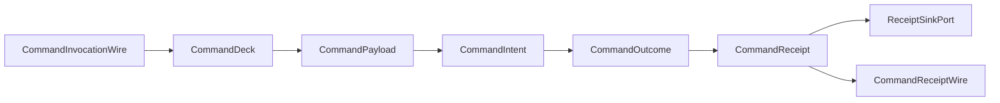

# [APPUI_COMMANDS_AVAILABILITY]

Rasm.AppUi runs one command rail: a single `CommandIntent` row table is the only command vocabulary in the package, and menus, toolbars, access keys, hotkeys, tray items, palette entries, deep links, and remote verbs are derivation folds over it. The page owns the intent row shape with its payload union, the typed availability algebra over the degradation vocabulary, the execution receipt family sealed through the receipt sink, the palette and remote invocation folds, and the command wire contract, over ReactiveUI commands, System.Reactive streams, LanguageExt rails, NodaTime durations, and the settled AppHost port records.

## [1]-[INDEX]

- [1]-[INTENT_TABLE]: One frozen row table, payload shapes, per-surface deck freeze.
- [2]-[AVAILABILITY_ALGEBRA]: Typed availability inputs fold into one `CanExecute` stream.
- [3]-[EXECUTION_RECEIPTS]: Total outcome rail; receipts sealed through the sink envelope.
- [4]-[PALETTE_AND_REMOTE]: Derivation folds, span-ranked palette search, remote and control verbs.
- [5]-[TS_PROJECTION]: Intent, availability, invocation, and receipt wire shapes.
## [2]-[INTENT_TABLE]

- Owner: `CommandIntent` row record with its nested `Availability` input struct; `CommandPayload` `[Union]` argument shapes; `CommandDeck` per-surface frozen result carrying the row table, the normalized palette index, and the gesture-conflict fold.
- Cases: `CommandPayload` = None | Single | Many | Text under the locked kind literals none, single, many, text — parameterized intents discriminate on payload shape, never on name suffixes.
- Entry: `public static Fin<CommandDeck> Freeze` — `Fin` aborts on a duplicate intent key or duplicate palette label; one freeze per mounted surface.
- Auto: the `Surfaces` predicate filters rows exactly once at freeze, so a row absent from a surface never materializes there; the mount transaction sinks every `GestureConflicts` row as one envelope of kind `ConflictKind`.
- Receipt: `GestureConflicts` is the freeze-time evidence fold — each conflict names the chord and every intent key bound to it.
- Packages: Thinktecture.Runtime.Extensions, Avalonia, LanguageExt.Core, BCL inbox
- Growth: one `CommandIntent` row absorbs a new verb across every derived surface and one `CommandPayload` case absorbs a new argument shape; zero new surface.
- Boundary: the locked row shape — intent key, availability delegate with `DegradationLevel` input, `Option<KeyGesture>`, surface predicate — deletes menu registries, toolbar registries, palette registries, hotkey tables, and deep-link maps in one stroke; the intent key is simultaneously the localization string key the `label` resolver consumes and the icon catalog key, so a label column and an icon column are the deleted forms; the `chord` delegate is the host-agnostic Cmd/Ctrl column transform, so duplicate per-platform gesture rows are the rejected form; `Execute` delegates bind host work at composition and no case body names a host API outside its own row.

```csharp signature
public sealed record CommandIntent(
    string Key,
    Seq<Capability> Requires,
    Func<CommandIntent.Availability, bool> When,
    Option<KeyGesture> Gesture,
    Func<SurfaceHost, bool> Surfaces,
    Func<CommandPayload, IO<Unit>> Execute) {
    public readonly record struct Availability(DegradationLevel Level, bool Valid, int Selected, bool Busy);

    public bool Admits(Availability input) => Requires.ForAll(input.Level.Permits) && When(input);
}

[Union(ConversionFromValue = ConversionOperatorsGeneration.None)]
[JsonPolymorphic(TypeDiscriminatorPropertyName = "kind")]
[JsonDerivedType(typeof(CommandPayload.None), "none")]
[JsonDerivedType(typeof(CommandPayload.Single), "single")]
[JsonDerivedType(typeof(CommandPayload.Many), "many")]
[JsonDerivedType(typeof(CommandPayload.Text), "text")]
public abstract partial record CommandPayload {
    private CommandPayload() { }
    public sealed record None : CommandPayload;
    public sealed record Single(string Id) : CommandPayload;
    public sealed record Many(Seq<string> Ids) : CommandPayload;
    public sealed record Text(string Value) : CommandPayload;
}

public sealed record CommandDeck(
    FrozenDictionary<string, CommandIntent> Rows,
    FrozenDictionary<string, string> Index,
    string SurfaceKey,
    Func<KeyGesture, KeyGesture> Chord,
    IObservable<CommandIntent.Availability> Inputs,
    Func<CommandIntent.Availability> Snapshot,
    IScheduler Scheduler,
    TimeProvider Time,
    CorrelationId Correlation,
    TenantContext Tenant,
    ReceiptSinkPort Sink,
    JsonSerializerOptions Wire) {
    public const string ConflictKind = "hotkey-conflict";

    public static Fin<CommandDeck> Freeze(
        SurfaceHost surface, string surfaceKey, Func<KeyGesture, KeyGesture> chord, Func<string, string> label,
        IObservable<CommandIntent.Availability> inputs, Func<CommandIntent.Availability> snapshot,
        IScheduler scheduler, TimeProvider time, CorrelationId correlation, TenantContext tenant, ReceiptSinkPort sink,
        JsonSerializerOptions wire, params ReadOnlySpan<CommandIntent> rows) =>
        Admitted(toSeq(rows.ToArray()).Filter(row => row.Surfaces(surface)), label)
            .Map(admitted => new CommandDeck(
                admitted.Map(static row => KeyValuePair.Create(row.Key, row)).ToFrozenDictionary(StringComparer.Ordinal),
                admitted.Map(row => KeyValuePair.Create(label(row.Key).ToLowerInvariant(), row.Key)).ToFrozenDictionary(StringComparer.Ordinal),
                surfaceKey, chord, inputs, snapshot, scheduler, time, correlation, tenant, sink, wire));

    public Seq<(KeyGesture Gesture, Seq<string> Keys)> GestureConflicts() =>
        toSeq(Rows.Values)
            .Bind(row => row.Gesture.Map(Chord).ToSeq().Map(gesture => (Gesture: gesture, row.Key)))
            .GroupBy(static bound => bound.Gesture)
            .AsIterable()
            .Map(static group => (group.Key, toSeq(group).Map(static bound => bound.Key)))
            .Filter(static conflict => conflict.Item2.Length > 1)
            .ToSeq();

    static Fin<Seq<CommandIntent>> Admitted(Seq<CommandIntent> rows, Func<string, string> label) =>
        rows.Map(static row => row.Key).Distinct().Length == rows.Length
            && rows.Map(row => label(row.Key).ToLowerInvariant()).Distinct().Length == rows.Length
            ? Fin<Seq<CommandIntent>>.Succ(rows)
            : Fin<Seq<CommandIntent>>.Fail(Error.New(nameof(CommandDeck) + " duplicate intent key or palette label"));
}
```

## [3]-[AVAILABILITY_ALGEBRA]

- Owner: `CommandGate` — the one availability fold from typed input streams to the `CanExecute` stream every materialized command consumes.
- Entry: `public IObservable<bool> CanExecute(IObservable<CommandIntent.Availability> inputs)` — one gate stream per row, derived, never hand-written at call sites.
- Auto: the level stream attaches through `UiSchedulerPort.Degradation`, the valid stream is the screen validation fold, the selected count rides selection state, and the busy stream is the compute receipt-stream projection — all four enter as delegate-supplied streams, no sibling type is re-modeled; `Observe` seeds match `DegradationState.Boot` so the gate is total before the first emission.
- Packages: System.Reactive, LanguageExt.Core, BCL inbox
- Growth: one `Availability` field row plus one `Observe` source row absorbs a new availability driver; zero new surface.
- Boundary: `DegradationLevel.LocalOnly` retains no `Capability.HostDocument`, so every host-targeting row — its `Requires` set naming `Capability.HostDocument` — folds unavailable structurally when the host is absent; per-call-site CanExecute lambdas and availability policy enums are the deleted forms; `IsExecuting` on the materialized command drives progress presentation and suppresses re-entrancy, so manual busy flags are the rejected form; a batch verb materialized through `CommandExecution.Combine` derives its availability as the all-true fold `CreateCombined` computes over the child rows' `CanExecute` streams, so the macro verb shares the one seeded `CombineLatest` algebra and a hand-written aggregate gate is the rejected form.

```csharp signature
public static class CommandGate {
    public static IObservable<CommandIntent.Availability> Observe(
        IObservable<DegradationLevel> level,
        IObservable<bool> valid,
        IObservable<int> selected,
        IObservable<bool> busy) =>
        Observable.CombineLatest(
            level.StartWith(DegradationLevel.Full),
            valid.StartWith(true),
            selected.StartWith(0),
            busy.StartWith(false),
            static (current, admit, count, running) => new CommandIntent.Availability(current, admit, count, running))
        .DistinctUntilChanged();

    extension(CommandIntent row) {
        public IObservable<bool> CanExecute(IObservable<CommandIntent.Availability> inputs) =>
            inputs.Select(row.Admits).DistinctUntilChanged();
    }
}
```

## [4]-[EXECUTION_RECEIPTS]

- Owner: `CommandOutcome` `[Union]` total result vocabulary; `CommandReceipt` execution evidence record; `CommandExecution` — the materialize-run-seal fold, the batch-combine projection, and the telemetry contribution.
- Cases: `CommandOutcome` = Completed | Cancelled | Rejected | Faulted under the locked kind literals completed, cancelled, rejected, faulted.
- Entry: `public ReactiveCommand<CommandPayload, CommandReceipt> Materialize(CommandDeck deck)` — one generated command per admitted row; the receipt is the command result.
- Auto: the `Catch` rail makes the outcome total, so every execution seals a receipt before any fault surfaces; residual throws ride `ThrownExceptions` into the one screen fault state and the error dialog intent row — never per-control handling; elapsed derives from the injected `TimeProvider` timestamp pair; `Combine` resolves each batch key through one `TryGetValue` probe and a fail-closed `Traverse` into `Fin`, so an unknown intent key aborts the macro rather than silently dropping, and the admitted child rows fold into one `CombinedReactiveCommand` whose availability is the all-true fold over child `CanExecute` — a macro verb spending several rows in one gesture is a `CreateCombined` projection over existing rows, never a new payload case.
- Receipt: `CommandReceipt` — intent key, surface key, elapsed `Duration`, outcome, payload digest, `CorrelationId` — sealed through `ReceiptSinkPort.Send` as kind `command` with the boot-bound `CommandDeck.Tenant` threaded so the envelope partitions per tenant; the HLC envelope is the only cross-process correlation carrier and `TenantContext` rides the deck as settled AppHost vocabulary, never re-minted; `TelemetryRow` contributes the command-outcome and command-elapsed instruments inward through the AppHost `TelemetryContributorPort`.
- Packages: ReactiveUI, LanguageExt.Core, NodaTime, System.IO.Hashing, Rasm.AppHost (project), BCL inbox
- Growth: one `CommandOutcome` case absorbs a new result class and breaks every dispatch site at compile time, and one command instrument is one `InstrumentRow` on `CommandExecution.TelemetryRow`; zero new surface.
- Boundary: the receipt record lands as one `[JsonSerializable]` row on the package wire context merged at app roots; ICommand wrapper classes are the deleted form and a generic receipt or ledger abstraction is the rejected form; the digest is the XxHash128 hex of the serialized payload, so receipt payloads stay fixed-size on the hot path; `Combine` is the only batch-verb spelling — a sibling `Batch` payload case beside the closed four-case union and a per-macro registry are the rejected forms, an unknown batch key aborts the macro on the `Fin` rail rather than dropping under a `ContainsKey` filter, and the combined command's child execution still seals one `CommandReceipt` per child through the same sink so batch evidence never collapses into one opaque receipt.

```csharp signature
[Union(ConversionFromValue = ConversionOperatorsGeneration.None)]
[JsonPolymorphic(TypeDiscriminatorPropertyName = "kind")]
[JsonDerivedType(typeof(CommandOutcome.Completed), "completed")]
[JsonDerivedType(typeof(CommandOutcome.Cancelled), "cancelled")]
[JsonDerivedType(typeof(CommandOutcome.Rejected), "rejected")]
[JsonDerivedType(typeof(CommandOutcome.Faulted), "faulted")]
public abstract partial record CommandOutcome {
    private CommandOutcome() { }
    public sealed record Completed : CommandOutcome;
    public sealed record Cancelled : CommandOutcome;
    public sealed record Rejected : CommandOutcome;
    public sealed record Faulted(string Detail, int Code) : CommandOutcome;
}

public sealed record CommandReceipt(
    string Key,
    string Surface,
    Duration Elapsed,
    CommandOutcome Outcome,
    string PayloadDigest,
    CorrelationId Correlation) {
    public const string Kind = "command";
}

public static class CommandExecution {
    extension(CommandIntent row) {
        public ReactiveCommand<CommandPayload, CommandReceipt> Materialize(CommandDeck deck) =>
            ReactiveCommand.CreateFromTask<CommandPayload, CommandReceipt>(
                (payload, token) => row.Run(payload, deck).RunAsync(EnvIO.New(token: token)).AsTask(),
                row.CanExecute(deck.Inputs),
                deck.Scheduler);

        public IO<CommandReceipt> Run(CommandPayload payload, CommandDeck deck) =>
            from mark in IO.lift(deck.Time.GetTimestamp)
            from outcome in row.Execute(payload)
                .Map(static _ => (CommandOutcome)new CommandOutcome.Completed())
                .Catch(static error => error.Is(Errors.Cancelled), static _ => IO.pure((CommandOutcome)new CommandOutcome.Cancelled()))
                .Catch(static _ => true, static error => IO.pure((CommandOutcome)new CommandOutcome.Faulted(error.Message, error.Code)))
            from receipt in deck.Seal(row.Key, outcome, Duration.FromTimeSpan(deck.Time.GetElapsedTime(mark)), payload.Digest(deck.Wire))
            select receipt;
    }

    extension(CommandDeck deck) {
        public IO<CommandReceipt> Seal(string key, CommandOutcome outcome, Duration elapsed, string digest) =>
            IO.pure(new CommandReceipt(key, deck.SurfaceKey, elapsed, outcome, digest, deck.Correlation))
                .Bind(receipt => deck.Sink
                    .Send(deck.Correlation, deck.Tenant, "Rasm.AppUi", CommandReceipt.Kind, JsonSerializer.SerializeToElement(receipt, deck.Wire))
                    .Map(_ => receipt));

        public Fin<CombinedReactiveCommand<CommandPayload, CommandReceipt>> Combine(params ReadOnlySpan<string> keys) =>
            toSeq(keys.ToArray())
                .Traverse(key => deck.Rows.TryGetValue(key, out var row)
                    ? Fin<ReactiveCommand<CommandPayload, CommandReceipt>>.Succ(row.Materialize(deck))
                    : Fin<ReactiveCommand<CommandPayload, CommandReceipt>>.Fail(Error.New(nameof(Combine) + " unknown intent key " + key)))
                .As()
                .Map(children => ReactiveCommand.CreateCombined(children, outputScheduler: deck.Scheduler));
    }

    extension(CommandPayload payload) {
        public string Digest(JsonSerializerOptions wire) =>
            Convert.ToHexStringLower(XxHash128.Hash(JsonSerializer.SerializeToUtf8Bytes(payload, wire)));
    }

    public const string OutcomeInstrument = "rasm.appui.command.outcome";
    public const string ElapsedInstrument = "rasm.appui.command.elapsed";

    public static TelemetryContributorPort TelemetryRow(string version) =>
        AppUiTelemetry.Contribute(version, OutcomeInstrument, ElapsedInstrument);
}
```

## [5]-[PALETTE_AND_REMOTE]

- Owner: `CommandProjections` — one polymorphic derivation fold, one span-ranked palette search over the frozen index, one remote admission entry.
- Entry: `public IO<CommandReceipt> Invoke(string key, JsonElement payload)` — the single remote, deep-link, and journal-replay route; an unknown key or an inadmissible row seals a `Rejected` receipt with zero elapsed.
- Auto: `Project` is the one derivation — menu rows, toolbar rows, tray rows, access keys, and deep-link rows are each one shape function over it, zero per-surface registries; host-mutating rows bind `Execute` through the abstract `DocumentEdit.Commit` surface-host port the app root binds to the live host so `DocumentTransaction` undo scope and redraw batching stay host-owned, the `Fin`-railed `DocumentReceipt` projects into the receipt payload, and the wire ExecuteTransaction response mirrors that receipt field-for-field as settled parity.
- Receipt: remote and replay invocations seal the same `CommandReceipt` family as interactive execution — one evidence stream for every caller modality.
- Packages: LanguageExt.Core, BCL inbox
- Growth: one shape function absorbs a new derived surface and one table row absorbs a new remote verb; zero new surface.
- Boundary: ReactiveUI MessageBus is the named rejected form — decoupled invocation is an intent key through the one table; a palette-specific command registry is the second rejected form, absorbed by `Search` over the freeze-built index; `Search` and its `Score` kernel are the page's one language-owned boundary capsule carrying statement forms for the alternate-lookup probe and the span walk; intent keys cross every boundary as ordinal strings.

```csharp signature
public static class CommandProjections {
    extension(CommandDeck deck) {
        public Seq<T> Project<T>(Func<CommandIntent, T> shape) =>
            toSeq(deck.Rows.Values).Map(shape);

        public Seq<(string Key, int Rank)> Search(ReadOnlySpan<char> query) {
            var lookup = deck.Index.GetAlternateLookup<ReadOnlySpan<char>>();
            if (lookup.TryGetValue(query, out var exact)) { return [(exact, 0)]; }
            var ranked = new List<(string Key, int Rank)>();
            foreach (var entry in deck.Index) {
                var rank = Score(entry.Key.AsSpan(), query);
                if (rank is { IsSome: true, Case: int hit }) { ranked.Add((entry.Value, hit)); }
            }
            return toSeq(ranked.OrderBy(static found => found.Rank));
        }

        public IO<CommandReceipt> Invoke(string key, JsonElement payload) =>
            deck.Rows.TryGetValue(key, out var row) && row.Admits(deck.Snapshot())
                ? IO.lift(() => payload.Deserialize<CommandPayload>(deck.Wire) ?? new CommandPayload.None())
                    .Bind(decoded => row.Run(decoded, deck))
                : deck.Seal(key, new CommandOutcome.Rejected(), Duration.Zero, string.Empty);
    }

    static Option<int> Score(ReadOnlySpan<char> label, ReadOnlySpan<char> query) {
        var cursor = 0;
        var spread = 0;
        for (var at = 0; at < label.Length && cursor < query.Length; at++) {
            var match = label[at] == char.ToLowerInvariant(query[cursor]);
            cursor += match ? 1 : 0;
            spread += match ? at - cursor : 0;
        }
        return cursor == query.Length ? Some(spread) : None;
    }
}
```

The ControlService operational verbs surface as ordinary table rows on companion-control surfaces; each `Execute` binding lands on the settled AppHost rail at composition:

| [INDEX] | [INTENT_KEY]            | [EXECUTE_BINDING]                                    |
| :-----: | :---------------------- | :--------------------------------------------------- |
|   [1]   | control.capture-support | SupportTrigger.ExternalCommand admission             |
|   [2]   | control.set-degradation | OperatorOverride force input to the degradation fold |
|   [3]   | control.reload-options  | ReloadOutcome transition on the options rail         |



## [6]-[TS_PROJECTION]

- Owner: `CommandIntentWire`, `CommandAvailabilityWire`, `CommandInvocationWire`, `CommandPayloadWire`, `CommandOutcomeWire`, `CommandReceiptWire` — the command wire contract the TS layer consumes today while `SurfaceHost` WebBrowser stays a designed-only growth case.
- Packages: BCL inbox
- Growth: one wire member row per new receipt field and one kind literal per new payload or outcome case; zero new surface.
- Boundary: shapes transcribe the camelCase emission of the suite wire law — intent keys cross as ordinal strings, the level field crosses as the degradation smart-enum string key, elapsed crosses as ISO-8601 duration text, correlation crosses as a guid string, gesture crosses as its parse-round-trip text, and payload and outcome discriminate on the locked kind literals; the receipt binds as the payload type parameter on the envelope wire record from the suite wire law.

```ts contract
type CommandPayloadWire =
  | { readonly kind: "none" }
  | { readonly kind: "single"; readonly id: string }
  | { readonly kind: "many"; readonly ids: readonly string[] }
  | { readonly kind: "text"; readonly value: string };

type CommandOutcomeWire =
  | { readonly kind: "completed" }
  | { readonly kind: "cancelled" }
  | { readonly kind: "rejected" }
  | { readonly kind: "faulted"; readonly detail: string; readonly code: number };

interface CommandIntentWire { readonly key: string; readonly gesture: string | null; }
interface CommandAvailabilityWire { readonly key: string; readonly available: boolean; readonly level: string; }
interface CommandInvocationWire { readonly key: string; readonly payload: CommandPayloadWire; }
interface CommandReceiptWire { readonly key: string; readonly surface: string; readonly elapsed: string; readonly outcome: CommandOutcomeWire; readonly payloadDigest: string; readonly correlation: string; }
```

## [7]-[RESEARCH]

- [WIRE_DECODE]: Seq-typed payload member round-trip through the Strict camelCase wire options on the inbound remote decode.
