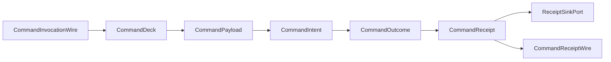

# [APPUI_COMMANDS_AVAILABILITY]

Rasm.AppUi runs one command rail: a single `CommandIntent` row table is the only command vocabulary in the package, and menus, toolbars, access keys, hotkeys, tray items, palette entries, deep links, and remote verbs are derivation folds over it. The page owns the intent row shape with its payload union, the typed availability algebra over the degradation vocabulary, the execution receipt family sealed through the receipt sink, the palette and remote invocation folds, and the command wire contract, over ReactiveUI commands, System.Reactive streams, LanguageExt rails, NodaTime durations, and the settled AppHost port records.

## [01]-[INDEX]

- [01]-[INTENT_TABLE]: One frozen row table, payload shapes, per-surface deck freeze.
- [02]-[AVAILABILITY_ALGEBRA]: Typed availability inputs fold into one `CanExecute` stream.
- [03]-[EXECUTION_RECEIPTS]: Total outcome rail; receipts sealed through the sink envelope.
- [04]-[PALETTE_AND_REMOTE]: Derivation folds, span-ranked palette search, remote and control verbs.
- [05]-[TS_PROJECTION]: Intent, availability, invocation, and receipt wire shapes.

## [02]-[INTENT_TABLE]

- Owner: `CommandIntent` row record with its nested `Availability` input struct; `CommandPayload` `[Union]` argument shapes; `CommandDeck` per-surface frozen result carrying the row table, the normalized palette index, and the gesture-conflict fold.
- Cases: `CommandPayload` = None | Single | Many | Text under the locked kind literals none, single, many, text — parameterized intents discriminate on payload shape, never on name suffixes; each row's `Accepts` set names its admitted kind domain, and `Admit` seals `CommandFault.PayloadRejected` before `Execute` on every invocation modality.
- Entry: `public static Fin<CommandDeck> Freeze(CommandComposition composition, params ReadOnlySpan<CommandIntent> rows)` — `Fin` aborts on a duplicate intent key, duplicate palette label, or scope-local gesture collision with a typed `CommandFault` case deriving through the `AppUiFaultBand.Command` registry row (6070); one freeze per mounted surface, and the composition-time services travel as one carrier.
- Auto: the `Surfaces` predicate filters rows exactly once at freeze, so a row absent from a surface never materializes there; `GestureConflicts` groups on scope plus normalized chord, and `Freeze` refuses the first deterministic row before any command materializes.
- Receipt: `CommandComposition.Conflict` seals the deterministic `GestureConflict` through the composition-bound evidence sink immediately before `Freeze` returns `CommandFault.GestureConflict`; execution receipts begin only after a conflict-free deck exists.
- Packages: Thinktecture.Runtime.Extensions, Avalonia, LanguageExt.Core, BCL inbox
- Growth: one `CommandIntent` row absorbs a new verb across every derived surface and one `CommandPayload` case absorbs a new argument shape; zero new surface.
- Boundary: the locked row shape — intent key, availability delegate with `DegradationLevel` input, `Option<KeyGesture>`, surface predicate — deletes menu registries, toolbar registries, palette registries, hotkey tables, and deep-link maps in one stroke; the intent key is simultaneously the localization string key the `label` resolver consumes and the icon catalog key, so a label column and an icon column are the deleted forms; the `chord` delegate is the host-agnostic Cmd/Ctrl column transform, so duplicate per-platform gesture rows are the rejected form; `Execute` delegates bind host work at composition and no case body names a host API outside its own row; `ViewportVerbs.Visibility` projects the `Render/pipeline.md` `VisibilityAction` folds into `viewport.*` rows so viewport interaction, palette, and remote invocation share the one visibility language, and the media transport verbs enter as rows keyed by the `Document/media.md` `TransportVerb.Intent` derivation (`media.track`, `media.subtitle`, `media.section-loop` beside the existing `media.*` keys) with their payloads bound at composition — a second verb registry beside the one table is the deleted form.

```csharp signature
public sealed record CommandIntent(
    string Key,
    CommandScope Scope,
    Seq<Capability> Requires,
    FrozenSet<string> Accepts,
    Func<CommandIntent.Availability, bool> When,
    Option<KeyGesture> Gesture,
    Func<SurfaceHost, bool> Surfaces,
    Func<CommandPayload, IO<Unit>> Execute) {
    public readonly record struct Availability(DegradationLevel Level, bool Valid, SelectionSnapshot Selection, bool Busy);

    public bool Admits(Availability input) => Requires.ForAll(input.Level.Permits) && When(input);

    // The one payload-admission fold: every invocation modality routes through Run, so a syntactically
    // valid payload outside the row's admitted kind domain seals PayloadRejected before Execute.
    public Fin<CommandPayload> Admit(CommandPayload payload) =>
        Accepts.Contains(payload.Kind)
            ? Fin.Succ(payload)
            : Fin.Fail<CommandPayload>(new CommandFault.PayloadRejected($"{Key}: '{payload.Kind}' outside the row's admitted domain"));
}

[SmartEnum<string>]
public sealed partial class CommandScope {
    public static readonly CommandScope Global = new("global");
    public static readonly CommandScope Screen = new("screen");
    public static readonly CommandScope Viewport = new("viewport");
    public static readonly CommandScope Dialog = new("dialog");
}

[ComplexValueObject]
public readonly partial struct SelectionSnapshot {
    public int Count { get; }
    public FrozenSet<string> Kinds { get; }

    static partial void ValidateFactoryArguments(ref ValidationError? validationError, ref int count, ref FrozenSet<string> kinds) =>
        validationError = count >= kinds.Count && (count > 0 || kinds.Count == 0)
            ? validationError
            : new ValidationError($"selection count {count} cannot carry {kinds.Count} kinds");
}

[Union(ConversionFromValue = ConversionOperatorsGeneration.None)]
[JsonPolymorphic(TypeDiscriminatorPropertyName = "kind")]
[JsonDerivedType(typeof(CommandPayload.None), "none")]
[JsonDerivedType(typeof(CommandPayload.Single), "single")]
[JsonDerivedType(typeof(CommandPayload.Many), "many")]
[JsonDerivedType(typeof(CommandPayload.Text), "text")]
public abstract partial record CommandPayload {
    private CommandPayload() { }
    public sealed record None : CommandPayload;
    public sealed record Single(string Id) : CommandPayload;
    public sealed record Many(Seq<string> Ids) : CommandPayload;
    public sealed record Text(string Value) : CommandPayload;

    public string Kind => Switch(
        none: static _ => "none", single: static _ => "single", many: static _ => "many", text: static _ => "text");
}

[Union(ConversionFromValue = ConversionOperatorsGeneration.None)]
public abstract partial record CommandFault : Expected {
    private CommandFault(string detail, int code) : base(detail, code) { }
    public sealed record DuplicateRow(string Detail)
        : CommandFault($"command/duplicate: {Detail}", AppUiFaultBand.Command.Code(0));
    public sealed record UnknownIntent(string Key)
        : CommandFault($"command/unknown-intent: {Key}", AppUiFaultBand.Command.Code(1));
    public sealed record GestureConflict(string Detail)
        : CommandFault($"command/gesture-conflict: {Detail}", AppUiFaultBand.Command.Code(2));
    public sealed record PayloadRejected(string Detail)
        : CommandFault($"command/payload: {Detail}", AppUiFaultBand.Command.Code(3));
}

public sealed record GestureConflict(CommandScope Scope, string Gesture, Seq<string> Keys);

public sealed record CommandComposition(
    SurfaceHost Surface,
    string SurfaceKey,
    Func<KeyGesture, KeyGesture> Chord,
    Func<string, string> Label,
    IObservable<CommandIntent.Availability> Inputs,
    Func<CommandIntent.Availability> Snapshot,
    IScheduler Scheduler,
    TimeProvider Time,
    CorrelationId Correlation,
    TenantContext Tenant,
    ReceiptSinkPort Sink,
    Func<GestureConflict, Unit> Conflict,
    JsonSerializerOptions Wire);

public sealed record CommandDeck(
    FrozenDictionary<string, CommandIntent> Rows,
    FrozenDictionary<string, string> Index,
    CommandComposition Composition) {
    public string SurfaceKey => Composition.SurfaceKey;
    public Func<KeyGesture, KeyGesture> Chord => Composition.Chord;
    public IObservable<CommandIntent.Availability> Inputs => Composition.Inputs;
    public Func<CommandIntent.Availability> Snapshot => Composition.Snapshot;
    public IScheduler Scheduler => Composition.Scheduler;
    public TimeProvider Time => Composition.Time;
    public CorrelationId Correlation => Composition.Correlation;
    public TenantContext Tenant => Composition.Tenant;
    public ReceiptSinkPort Sink => Composition.Sink;
    public JsonSerializerOptions Wire => Composition.Wire;

    public static Fin<CommandDeck> Freeze(
        CommandComposition composition,
        params ReadOnlySpan<CommandIntent> rows) =>
        Admitted(toSeq(rows.ToArray()).Filter(row => row.Surfaces(composition.Surface)), composition.Label)
            .Map(admitted => new CommandDeck(
                admitted.Map(static row => KeyValuePair.Create(row.Key, row)).ToFrozenDictionary(StringComparer.Ordinal),
                admitted.Map(row => KeyValuePair.Create(composition.Label(row.Key).ToLowerInvariant(), row.Key)).ToFrozenDictionary(StringComparer.Ordinal),
                composition))
            .Bind(deck => deck.GestureConflicts().HeadOrNone().Match(
                Some: conflict => (deck.SealConflict(conflict), Fin.Fail<CommandDeck>(new CommandFault.GestureConflict(
                    $"{conflict.Scope.Key}:{conflict.Gesture}:{string.Join(',', conflict.Keys)}"))).Item2,
                None: () => Fin.Succ(deck)));

    public Unit SealConflict(GestureConflict conflict) => Composition.Conflict(conflict);

    public Seq<GestureConflict> GestureConflicts() =>
        toSeq(Rows.Values)
            .Bind(row => row.Gesture.Map(Chord).ToSeq().Map(gesture => (row.Scope, Gesture: gesture, row.Key)))
            .GroupBy(static bound => (bound.Scope, bound.Gesture))
            .AsIterable()
            .Map(static group => new GestureConflict(
                group.Key.Scope,
                group.Key.Gesture.ToString(),
                toSeq(group).Map(static bound => bound.Key).Order(StringComparer.Ordinal).ToSeq()))
            .Filter(static conflict => conflict.Keys.Length > 1)
            .OrderBy(static conflict => conflict.Scope.Key, StringComparer.Ordinal)
            .ThenBy(static conflict => conflict.Gesture, StringComparer.Ordinal)
            .ToSeq();

    private static Fin<Seq<CommandIntent>> Admitted(Seq<CommandIntent> rows, Func<string, string> label) =>
        rows.Map(static row => row.Key).Distinct().Length == rows.Length
            && rows.Map(row => label(row.Key).ToLowerInvariant()).Distinct().Length == rows.Length
            ? Fin<Seq<CommandIntent>>.Succ(rows)
            : Fin<Seq<CommandIntent>>.Fail(new CommandFault.DuplicateRow("intent key or palette label"));
}

// The viewport visibility verbs: one row per Render/pipeline VisibilityAction fold — isolate, hide, and
// xray admit the selection payload and require a non-empty selection, reset admits none and stays always
// available. The raise delegate binds the viewport scene fold at composition, so the verb table raises
// the one override vocabulary without naming a render API.
public static class ViewportVerbs {
    public static Seq<CommandIntent> Visibility(Func<VisibilityAction, CommandPayload, IO<Unit>> raise) =>
        toSeq(VisibilityAction.Items).Map(action => action == VisibilityAction.Reset
            ? new CommandIntent(
                $"viewport.{action.Key}", CommandScope.Viewport, [],
                new[] { "none" }.ToFrozenSet(StringComparer.Ordinal),
                static _ => true, None, static _ => true, payload => raise(action, payload))
            : new CommandIntent(
                $"viewport.{action.Key}", CommandScope.Viewport, [],
                new[] { "single", "many" }.ToFrozenSet(StringComparer.Ordinal),
                static input => input.Selection.Count > 0, None, static _ => true, payload => raise(action, payload)));
}
```

## [03]-[AVAILABILITY_ALGEBRA]

- Owner: `CommandGate` — the one availability fold from typed input streams to the `CanExecute` stream every materialized command consumes.
- Entry: `public IObservable<bool> CanExecute(IObservable<CommandIntent.Availability> inputs)` — one gate stream per row, derived, never hand-written at call sites.
- Auto: the level stream attaches through `UiSchedulerPort.Degradation`, the valid stream is the screen validation fold, the selected count rides selection state, and the busy stream is the compute receipt-stream projection — all four enter as delegate-supplied streams, no sibling type is re-modeled; `Observe` seeds match `DegradationState.Boot` so the gate is total before the first emission.
- Packages: System.Reactive, LanguageExt.Core, BCL inbox
- Growth: one `Availability` field row plus one `Observe` source row absorbs a new availability driver; zero new surface.
- Boundary: `DegradationLevel.LocalOnly` retains no `Capability.HostDocument`, so every host-targeting row — its `Requires` set naming `Capability.HostDocument` — folds unavailable structurally when the host is absent; per-call-site CanExecute lambdas and availability policy enums are the deleted forms; `IsExecuting` on the materialized command drives progress presentation and suppresses re-entrancy, so manual busy flags are the rejected form; a batch verb materialized through `CommandExecution.Combine` derives its availability as the all-true fold `CreateCombined` computes over the child rows' `CanExecute` streams, so the macro verb shares the one seeded `CombineLatest` algebra and a hand-written aggregate gate is the rejected form.

```csharp signature
public static class CommandGate {
    public static IObservable<CommandIntent.Availability> Observe(
        IObservable<DegradationLevel> level,
        IObservable<bool> valid,
        IObservable<SelectionSnapshot> selected,
        IObservable<bool> busy) =>
        Observable.CombineLatest(
            level.StartWith(DegradationLevel.Full),
            valid.StartWith(false),
            selected.StartWith(SelectionSnapshot.Create(0, Array.Empty<string>().ToFrozenSet(StringComparer.Ordinal))),
            busy.StartWith(false),
            static (current, admit, count, running) => new CommandIntent.Availability(current, admit, count, running))
        .DistinctUntilChanged()
        .Catch(Observable.Return(new CommandIntent.Availability(
            DegradationLevel.Full,
            false,
            SelectionSnapshot.Create(0, Array.Empty<string>().ToFrozenSet(StringComparer.Ordinal)),
            false)))
        .Replay(1)
        .RefCount();

    extension(CommandIntent row) {
        public IObservable<bool> CanExecute(IObservable<CommandIntent.Availability> inputs) =>
            inputs.Select(row.Admits)
                .Catch(Observable.Return(false))
                .StartWith(false)
                .DistinctUntilChanged()
                .Replay(1)
                .RefCount();
    }
}
```

## [04]-[EXECUTION_RECEIPTS]

- Owner: `CommandOutcome` `[Union]` total result vocabulary; `CommandReceipt` execution evidence record; `CommandExecution` — the materialize-run-seal fold, the batch-combine projection, and the telemetry contribution.
- Cases: `CommandOutcome` = Completed | Cancelled | Rejected | Faulted under the locked kind literals completed, cancelled, rejected, faulted.
- Entry: `public ReactiveCommand<CommandPayload, CommandReceipt> Materialize(CommandDeck deck)` — one generated command per admitted row; the receipt is the command result.
- Auto: the `Catch` rail makes the outcome total, so every execution seals a receipt before any fault surfaces; residual throws ride `ThrownExceptions` into the one screen fault state and the error dialog intent row — never per-control handling; elapsed derives from the injected `TimeProvider` timestamp pair; `Combine` resolves each batch key through one `TryGetValue` probe and a fail-closed `Traverse` into `Fin`, so an unknown intent key aborts the macro rather than silently dropping, and the admitted child rows fold into one `CombinedReactiveCommand` whose availability is the all-true fold over child `CanExecute` — a macro verb spending several rows in one gesture is a `CreateCombined` projection over existing rows, never a new payload case.
- Receipt: `CommandReceipt` — intent key, surface key, elapsed `Duration`, outcome, payload digest, `CorrelationId` — sealed through `ReceiptSinkPort.Send` as kind `command` with the boot-bound `CommandDeck.Tenant` threaded so the envelope partitions per tenant; the HLC envelope is the only cross-process correlation carrier and `TenantContext` rides the deck as settled AppHost vocabulary, never re-minted; `TelemetryRow` contributes the command-outcome and command-elapsed instruments inward through the AppHost `TelemetryContributorPort`.
- Packages: ReactiveUI, LanguageExt.Core, NodaTime, System.IO.Hashing, Rasm.AppHost (project), BCL inbox
- Growth: one `CommandOutcome` case absorbs a new result class and breaks every dispatch site at compile time, and one command instrument is one `InstrumentRow` on `CommandExecution.TelemetryRow`; zero new surface.
- Boundary: the receipt record lands as one `[JsonSerializable]` row on the package wire context merged at app roots; ICommand wrapper classes are the deleted form and a generic receipt or ledger abstraction is the rejected form; the digest is the kernel `ContentHash.Of` hex of the serialized payload (the federation one-hasher; seed zero), so receipt payloads stay fixed-size on the hot path; `Combine` is the only batch-verb spelling — a sibling `Batch` payload case beside the closed four-case union and a per-macro registry are the rejected forms, an unknown batch key aborts the macro on the `Fin` rail rather than dropping under a `ContainsKey` filter, and the combined command's child execution still seals one `CommandReceipt` per child through the same sink so batch evidence never collapses into one opaque receipt.

```csharp signature
[Union(ConversionFromValue = ConversionOperatorsGeneration.None)]
[JsonPolymorphic(TypeDiscriminatorPropertyName = "kind")]
[JsonDerivedType(typeof(CommandOutcome.Completed), "completed")]
[JsonDerivedType(typeof(CommandOutcome.Cancelled), "cancelled")]
[JsonDerivedType(typeof(CommandOutcome.Rejected), "rejected")]
[JsonDerivedType(typeof(CommandOutcome.Faulted), "faulted")]
public abstract partial record CommandOutcome {
    private CommandOutcome() { }
    public sealed record Completed : CommandOutcome;
    public sealed record Cancelled : CommandOutcome;
    public sealed record Rejected(string Detail, int Code) : CommandOutcome;
    public sealed record Faulted(string Detail, int Code) : CommandOutcome;
}

public sealed record CommandReceipt(
    string Key,
    string Surface,
    Duration Elapsed,
    CommandOutcome Outcome,
    string PayloadDigest,
    CorrelationId Correlation) {
    public const string Kind = "command";
}

public static class CommandExecution {
    extension(CommandIntent row) {
        public ReactiveCommand<CommandPayload, CommandReceipt> Materialize(CommandDeck deck) =>
            ReactiveCommand.CreateFromTask<CommandPayload, CommandReceipt>(
                (payload, token) => row.Run(payload, deck).RunAsync(EnvIO.New(token: token)).AsTask(),
                row.CanExecute(deck.Inputs),
                deck.Scheduler);

        // Payload admission precedes execution on EVERY modality — interactive, remote, replay, and
        // device invocation all end here, so one admission fold covers the whole caller surface.
        public IO<CommandReceipt> Run(CommandPayload payload, CommandDeck deck) =>
            from mark in IO.lift(deck.Time.GetTimestamp)
            from outcome in row.Admit(payload).Match(
                Succ: admitted => row.Execute(admitted)
                    .Map(static _ => (CommandOutcome)new CommandOutcome.Completed())
                    .Catch(static error => error.Is(Errors.Cancelled), static _ => IO.pure((CommandOutcome)new CommandOutcome.Cancelled()))
                    .Catch(static _ => true, static error => IO.pure((CommandOutcome)new CommandOutcome.Faulted(error.Message, error.Code))),
                Fail: static fault => IO.pure((CommandOutcome)new CommandOutcome.Rejected(fault.Message, fault.Code)))
            from receipt in deck.Seal(row.Key, outcome, Duration.FromTimeSpan(deck.Time.GetElapsedTime(mark)), payload.Digest(deck.Wire))
            select receipt;
    }

    extension(CommandDeck deck) {
        public IO<CommandReceipt> Seal(string key, CommandOutcome outcome, Duration elapsed, string digest) =>
            IO.pure(new CommandReceipt(key, deck.SurfaceKey, elapsed, outcome, digest, deck.Correlation))
                .Bind(receipt => deck.Sink
                    .Send(deck.Correlation, deck.Tenant, "Rasm.AppUi", CommandReceipt.Kind, JsonSerializer.SerializeToElement(receipt, deck.Wire))
                    .Map(_ => receipt));

        public Fin<CombinedReactiveCommand<CommandPayload, CommandReceipt>> Combine(params ReadOnlySpan<string> keys) =>
            toSeq(keys.ToArray())
                .Traverse(key => deck.Rows.TryGetValue(key, out CommandIntent? row)
                    ? Fin<ReactiveCommand<CommandPayload, CommandReceipt>>.Succ(row.Materialize(deck))
                    : Fin<ReactiveCommand<CommandPayload, CommandReceipt>>.Fail(new CommandFault.UnknownIntent(key)))
                .As()
                .Map(children => ReactiveCommand.CreateCombined(children, outputScheduler: deck.Scheduler));
    }

    extension(CommandPayload payload) {
        // The one-hasher law: the digest mints through the kernel Rasm.Domain ContentHash.Of seed-zero
        // entry; the lowercase-hex spelling is this boundary's wire projection of the UInt128.
        public string Digest(JsonSerializerOptions wire) =>
            $"{ContentHash.Of(JsonSerializer.SerializeToUtf8Bytes(payload, wire)):x32}";
    }

    public const string OutcomeInstrument = "rasm.appui.command.outcome";
    public const string ElapsedInstrument = "rasm.appui.command.elapsed";

    public static TelemetryContributorPort TelemetryRow(string version) =>
        AppUiTelemetry.Contribute(version,
            new(OutcomeInstrument, InstrumentKind.Count, "{command}", "command executions by outcome"),
            new(ElapsedInstrument, InstrumentKind.Distribution, "s", "command execution wall duration", UiBuckets.InteractionSeconds));

    // Outcome counts ride the evidence fan's command arm; elapsed records direct off the sealed receipt
    // — composition binds this projection beside the deck's sink send, so the fan never parses duration text.
    public static Unit Observe(InstrumentSet set, CommandReceipt receipt) =>
        ignore(set.Record(ElapsedInstrument, receipt.Elapsed.TotalSeconds,
            new KeyValuePair<string, object?>("key", receipt.Key)));
}
```

## [05]-[PALETTE_AND_REMOTE]

- Owner: `CommandProjections` — one polymorphic derivation fold, one span-ranked palette search over the frozen index, one remote admission entry; `PaletteProvider` — the closed search-provider row family making the palette the one federated query surface; `PaletteHit` — the typed ranked result row every provider contributes.
- Entry: `public IO<CommandReceipt> Invoke(string key, JsonElement payload)` — the single remote, deep-link, and journal-replay route; an unknown key or an inadmissible row seals a `Rejected` receipt with zero elapsed; `public static Seq<PaletteHit> Federate(Seq<PaletteProvider> providers, string query)` — one merged rank fold over every provider row, the command provider deriving from the frozen deck through `Provider`.
- Auto: `Project` is the one derivation — menu rows, toolbar rows, tray rows, access keys, and deep-link rows are each one shape function over it, zero per-surface registries; host-mutating rows bind `Execute` through the abstract `DocumentEdit.Commit` surface-host port the app root binds to the live host so `DocumentTransaction` undo scope and redraw batching stay host-owned, the `Fin`-railed `DocumentReceipt` projects into the receipt payload, and the wire ExecuteTransaction response mirrors that receipt field-for-field as settled parity.
- Receipt: remote and replay invocations seal the same `CommandReceipt` family as interactive execution — one evidence stream for every caller modality.
- Packages: LanguageExt.Core, BCL inbox
- Growth: one shape function absorbs a new derived surface and one table row absorbs a new remote verb; a new searchable domain — routes and screens, model elements through Bim-owned receipt rows, BCF issues, notebook cells — is one `PaletteProvider` row bound at composition, so the palette federates every queryable plane without a second search engine; zero new surface.
- Boundary: ReactiveUI MessageBus is the named rejected form — decoupled invocation is an intent key through the one table; a palette-specific command registry is the second rejected form, absorbed by `Search` over the freeze-built index; the palette is the one federated query surface — every provider contributes typed `PaletteHit` rows into one merged rank fold, the command provider derives from the deck, an element provider consumes Bim-owned `ElementSet` receipt rows (queries enter as receipts, never an AppUi query engine — the `ARCHITECTURE.md` Bim-receipt boundary), and a provider-local result vocabulary beside `PaletteHit` is the rejected form; a hit's activation routes by its `Kind` — a command hit raises `Invoke`, a route hit raises the navigation verb, an element or issue hit raises its reveal intent row — so federation adds providers, never a second invocation path; label normalization is a property of the frozen index owner — `Search` folds the query to lowercase once through `MemoryExtensions.ToLowerInvariant` so the exact and fuzzy branches share one normalized comparison domain and equivalent queries differing only by case return identical keys and rank order, a search-local normalization rule beside the index admission being the rejected form; `Search` and its `Score` kernel are the page's one language-owned boundary capsule carrying statement forms for the alternate-lookup probe and the span walk; intent keys cross every boundary as ordinal strings.

```csharp signature
// The federated palette vocabulary: every searchable plane contributes typed ranked rows through one
// provider shape — commands derive from the deck, elements arrive as Bim-owned receipt rows, routes,
// issues, and notebook cells each bind one row at composition.
public sealed record PaletteHit(string Kind, string Key, string Label, int Rank);

public sealed record PaletteProvider(string Kind, Func<string, Seq<(string Key, string Label, int Rank)>> Query);

public static class CommandProjections {
    public static Seq<PaletteHit> Federate(Seq<PaletteProvider> providers, string query) =>
        toSeq(providers.Bind(provider => provider.Query(query).Map(hit => new PaletteHit(provider.Kind, hit.Key, hit.Label, hit.Rank)))
            .OrderBy(static hit => hit.Rank)
            .ThenBy(static hit => hit.Kind, StringComparer.Ordinal)
            .ThenBy(static hit => hit.Key, StringComparer.Ordinal));

    extension(CommandDeck deck) {
        // The command provider: the deck's span-ranked Search projected onto the shared hit shape.
        public PaletteProvider Provider(Func<string, string> label) =>
            new("command", query => deck.Search(query).Map(found => (found.Key, label(found.Key), found.Rank)));

        public Seq<T> Project<T>(Func<CommandIntent, T> shape) =>
            toSeq(deck.Rows.Values).Map(shape);

        public Seq<(string Key, int Rank)> Search(ReadOnlySpan<char> query) {
            // One normalized comparison domain: the query folds to lowercase ONCE, so the exact probe and
            // the fuzzy walk both read the same casing the freeze-built index admitted.
            Span<char> folded = query.Length <= 128 ? stackalloc char[query.Length] : new char[query.Length];
            ignore(query.ToLowerInvariant(folded));
            FrozenDictionary<string, string>.AlternateLookup<ReadOnlySpan<char>> lookup = deck.Index.GetAlternateLookup<ReadOnlySpan<char>>();
            if (lookup.TryGetValue(folded, out string? exact)) { return [(exact, 0)]; }
            List<(string Key, int Rank)> ranked = [];
            foreach (KeyValuePair<string, string> entry in deck.Index) {
                Option<int> rank = Score(entry.Key.AsSpan(), folded);
                if (rank is { IsSome: true, Case: int hit }) { ranked.Add((entry.Value, hit)); }
            }
            return toSeq(ranked
                .OrderBy(static found => found.Rank)
                .ThenBy(static found => found.Key, StringComparer.Ordinal));
        }

        public IO<CommandReceipt> Invoke(string key, JsonElement payload) =>
            deck.Rows.TryGetValue(key, out CommandIntent? row) && row.Admits(deck.Snapshot())
                ? Try.lift(() => payload.Deserialize<CommandPayload>(deck.Wire))
                    .Run()
                    .Bind(decoded => Optional(decoded).ToFin(new CommandFault.PayloadRejected(key)))
                    .Match(
                        Succ: decoded => row.Run(decoded, deck),
                        Fail: failure => deck.Seal(
                            key,
                            new CommandOutcome.Rejected(failure.Message, failure.Code),
                            Duration.Zero,
                            string.Empty))
                : deck.Seal(
                    key,
                    new CommandOutcome.Rejected(
                        $"command unavailable or unknown: {key}",
                        AppUiFaultBand.Command.Code(1)),
                    Duration.Zero,
                    string.Empty);
    }

    // Both spans arrive pre-normalized — label from the freeze-built index, query from Search's fold —
    // so the walk is a pure ordinal subsequence rank with no per-char case work.
    private static Option<int> Score(ReadOnlySpan<char> label, ReadOnlySpan<char> query) {
        int cursor = 0;
        int spread = 0;
        for (int at = 0; at < label.Length && cursor < query.Length; at++) {
            bool match = label[at] == query[cursor];
            spread += match ? at - cursor : 0;
            cursor += match ? 1 : 0;
        }
        return cursor == query.Length ? Some(spread) : None;
    }
}
```

The ControlService operational verbs surface as ordinary table rows on companion-control surfaces; each `Execute` binding lands on the settled AppHost rail at composition:

| [INDEX] | [INTENT_KEY]            | [EXECUTE_BINDING]                                    |
| :-----: | :---------------------- | :--------------------------------------------------- |
|  [01]   | control.capture-support | SupportTrigger.ExternalCommand admission             |
|  [02]   | control.set-degradation | OperatorOverride force input to the degradation fold |
|  [03]   | control.reload-options  | ReloadOutcome transition on the options rail         |



## [06]-[TS_PROJECTION]

- Owner: `CommandIntentWire`, `CommandGateWire`, `CommandInvocationWire`, `CommandPayloadWire`, `CommandOutcomeWire`, `CommandReceiptWire` — the command wire contract the TS layer consumes today while `SurfaceHost` WebBrowser stays a designed-only growth case.
- Packages: BCL inbox
- Growth: one wire member row per new receipt field and one kind literal per new payload or outcome case; zero new surface.
- Boundary: shapes transcribe the camelCase emission of the suite wire law — intent keys cross as ordinal strings, the level field crosses as the degradation smart-enum string key, elapsed crosses as ISO-8601 duration text, correlation crosses as a guid string, gesture crosses as its parse-round-trip text, and payload and outcome discriminate on the locked kind literals; the receipt binds as the payload type parameter on the envelope wire record from the suite wire law; `CommandGateWire` transcribes the per-row `CanExecute` gate verdict — the frozen name `CommandAvailabilityWire` is `Rasm.AppHost/Observability` health.md's `DegradationLevel` command-availability snapshot, a different carrier this palette wire never shadows.

```ts signature
type CommandPayloadWire =
  | { readonly kind: "none" }
  | { readonly kind: "single"; readonly id: string }
  | { readonly kind: "many"; readonly ids: readonly string[] }
  | { readonly kind: "text"; readonly value: string };

type CommandOutcomeWire =
  | { readonly kind: "completed" }
  | { readonly kind: "cancelled" }
  | { readonly kind: "rejected"; readonly detail: string; readonly code: number }
  | { readonly kind: "faulted"; readonly detail: string; readonly code: number };

interface CommandIntentWire { readonly key: string; readonly scope: "global" | "screen" | "viewport" | "dialog"; readonly requires: readonly string[]; readonly gesture: string | null; }
interface CommandGateWire { readonly key: string; readonly available: boolean; readonly level: string; }
interface CommandInvocationWire { readonly key: string; readonly payload: CommandPayloadWire; }
interface CommandReceiptWire { readonly key: string; readonly surface: string; readonly elapsed: string; readonly outcome: CommandOutcomeWire; readonly payloadDigest: string; readonly correlation: string; }
```

## [07]-[RESEARCH]

- [WIRE_DECODE]: Seq-typed payload member round-trip through the Strict camelCase wire options on the inbound remote decode.
