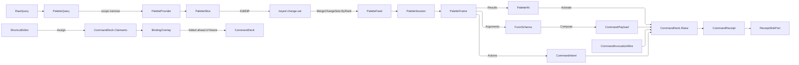

# [APPUI_COMMANDS_AVAILABILITY]

Rasm.AppUi runs one command rail: a single `CommandIntent` row table is the only command vocabulary in the package, and menus, toolbars, access keys, hotkeys, tray items, palette entries, deep links, and remote verbs are derivation folds over it. The page owns the intent row shape with its payload union, the typed availability algebra over the degradation vocabulary, the execution receipt family sealed through the receipt sink, the federated palette with its streaming provider rows and its presentation frames, the binding-overlay family and the shortcut editor projected off the same frozen deck, and the command wire contract, over ReactiveUI commands, DynamicData change-sets, System.Reactive streams, LanguageExt rails, NodaTime durations, and the settled AppHost port records.

## [01]-[INDEX]

- [02]-[INTENT_TABLE]: One frozen row table, payload shapes, binding overlays, per-surface deck freeze.
- [03]-[AVAILABILITY_ALGEBRA]: Typed availability inputs fold into one `CanExecute` stream.
- [04]-[EXECUTION_RECEIPTS]: Total outcome rail; receipts sealed through the sink envelope.
- [05]-[PALETTE_FEDERATION]: Scoped query, streaming provider rows, one merged rank fold, one activation.
- [06]-[PALETTE_SURFACE]: The top-anchored overlay, its frames, its action sub-panel, its argument forms.
- [07]-[BINDING_EDITOR]: Every binding listed, captured, conflict-checked, swapped, and cheat-sheeted.
- [08]-[TS_PROJECTION]: Intent, availability, invocation, and receipt wire shapes.

## [02]-[INTENT_TABLE]

- Owner: `CommandIntent` row record with its nested `Availability` input struct; `CommandPayload` `[Union]` argument shapes; `BindingOverlay` the per-user gesture-and-alias overlay folded ahead of the freeze; `CommandDeck` per-surface frozen result carrying the row table, the normalized palette index, the chord-claimant oracle, and the gesture-conflict fold.
- Cases: `CommandPayload` = None | Single | Many | Text | Fields under the locked kind literals none, single, many, text, fields — parameterized intents discriminate on payload shape, never on name suffixes; each row's `Accepts` set names its admitted kind domain, and `Admit` seals `CommandFault.PayloadRejected` before `Execute` on every invocation modality.
- Entry: `public static Fin<CommandDeck> Freeze(CommandComposition composition, params ReadOnlySpan<CommandIntent> rows)` — `Fin` aborts on a duplicate intent key, a duplicate palette label or alias, or a scope-local gesture collision with a typed `CommandFault` case deriving through the `AppUiFaultBand.Command` registry row (6070); one freeze per mounted surface, and the composition-time services travel as one carrier.
- Auto: the `Surfaces` predicate filters rows exactly once at freeze against the supplied `ConsumptionProfile` and the resolved `SurfaceMount`, so a row absent from a surface never materializes there; the composition's `BindingOverlay` rebinds each surviving row's gesture and widens the index with its aliases BEFORE the conflict fold runs, so a user chord collides on the same oracle a default one does; `Claimants` is the one chord-ownership read and `GestureConflicts` is that read filtered to contested chords, so `Freeze` refuses the first deterministic row before any command materializes and the editor asks the identical question at assignment time.
- Receipt: `CommandComposition.Conflict` seals the deterministic `GestureConflict` through the composition-bound evidence sink immediately before `Freeze` returns `CommandFault.GestureConflict`; execution receipts begin only after a conflict-free deck exists.
- Packages: Thinktecture.Runtime.Extensions, Avalonia, LanguageExt.Core, Rasm.AppHost (project), BCL inbox
- Growth: one `CommandIntent` row absorbs a new verb across every derived surface, one `CommandPayload` case absorbs a new argument shape, and one `BindingOverlay` row absorbs a whole named keymap; zero new surface.
- Boundary: the locked row shape — intent key, availability delegate over the two-plane `Availability` input, `Option<KeyGesture>`, surface predicate, palette-kind target set, argument schema — deletes menu registries, toolbar registries, palette registries, hotkey tables, keymap files, and deep-link maps in one stroke; `CommandPayload.Many` and `CommandPayload.Fields` decode through the suite mint's `LanguageExtJsonConverterFactory` — `Seq<A>` and `HashMap<K, V>` carry no serializer-visible population hook and LanguageExt ships no converter of its own, so the `Rasm.AppHost/Runtime/ports#WIRE_LAW` factory registered before the options freeze is the one decode path for both carriers and a member-level `[JsonConverter]` or page-local converter class beside it is the second spelling this row deletes; the intent key is simultaneously the localization string key the `label` resolver consumes and the icon catalog key, so a label column and an icon column are the deleted forms; the `chord` delegate is the host-agnostic Cmd/Ctrl column transform, so duplicate per-platform gesture rows are the rejected form; `Execute` delegates bind host work at composition and no case body names a host API outside its own row; `Targets` names the `PaletteKind` keys a verb acts on as a CONTEXTUAL action, so the palette's per-hit action panel is a filter over this one table and a second action registry beside it is the deleted form, while an empty target set is the ordinary row that never appears as a contextual action; `Arguments` carries the `Editing/forms#FORM_SCHEMA` schema a parameterized verb collects its own arguments through, so a command needing three typed values renders its own inline mini-form and a bespoke argument dialog per verb is the deleted form — the schema's `SubmitIntent` and this row's key are the same value by construction, which is what forecloses a schema pointed at a verb it does not parameterize; `DeckRows.Row` is the ONE row mint every projection takes, so a family states the five columns that differ — key, scope, admitted payload domain, required capability, availability — and a second row shape cannot drift from it, the capability column being what keeps a host-targeting family row answerable to the two-plane gate rather than permanently empty; `ViewportVerbs.Visibility` projects the `Render/pipeline.md` `VisibilityAction` folds into `viewport.*` rows so viewport interaction, palette, and remote invocation share the one visibility language, `ActivityVerbs.Rows` and `WorkspaceVerbs.Rows` lift the `Shell/dialogs#ACTIVITY_CENTER` and `Shell/navigation#DOCK_LAYOUTS` verb constants onto the same table so an inbox affordance and a workspace switch are bindable, palette-searchable, and journal-replayable exactly as every other verb is, and `DeckRows` lifts every remaining owner roster the same way — the `Render/animation#TIMELINE_EDITOR` `TransportVerb.IntentKey` roster carries the nine `transport.*` keys a 4D sequence and a media clip both drive, `Document/media.md`'s payload-bearing `media.*` rows bind their own arguments at composition beside them, `Editing/graph#CANVAS_VERBS` hands its whole generated `graph.*` projection over rather than being re-spelled, and the view, immersive, collaboration, analysis, and saved-set families each bind the intent constant their own owner declares; `DeckRows.History` lifts the history plane's own row projection beside its timeline expansion, `DeckRows.Surfaces` carries the shell-surface verbs the screens and inspector planes declare, `DeckRows.Documents` carries the document plane's — the results band's expansion command, the seven cell verbs generated off `CellVerb`, and the export run beside its two sealed-artifact verbs — and `DeckRows.Reveal` mints the palette's own reveal keys — a surface verb absent from this table is not a dead button but a screen that FAILS TO MATERIALIZE, because a tree resolves its expansion command and a strip its jump command against this frozen deck and both abort the materialize on a miss, and a palette kind whose reveal key no row carries refuses every hit of its plane; the `media.*` roster is the ONE family that stays composition-bound rather than gaining a projection, and the reason is structural rather than an omission — no media control binds a `media.*` key as its `IntentBinding.Command`, the transport bar's own command-postured segments carrying `TransportVerb` keys this table already freezes, so no media surface resolves against the deck and the roster's per-key payload domain stays its owner's to declare; a family whose keys generate off a bounded vocabulary generates here too — `SessionAction`, `BakeVerb`, and `ConflictIntent` rows mint their verbs without an authored roster, the conflict family claiming the Dialog scope its modal pane presents under and reading its keys off the pane's NON-GENERIC vocabulary, because a key held on a generic projection type is unspellable from a table that freezes before any receipt type exists — so the arrows travel as one `DeckArrows` carrier exactly as the freeze's own services do, and a second verb registry beside the one table is the deleted form.

```csharp signature
// --- [MODELS] ---------------------------------------------------------------------------

public sealed partial record CommandIntent(
    string Key,
    CommandScope Scope,
    Seq<Capability> Requires,
    FrozenSet<string> Accepts,
    Func<CommandIntent.Availability, bool> When,
    Option<KeyGesture> Gesture,
    Func<ConsumptionProfile, SurfaceMount, bool> Surfaces,
    // The palette-kind keys this verb acts ON. A row naming `document` is offered as an action of every
    // document hit the federation surfaces; the empty set is the ordinary verb that appears in the result
    // list and never in a hit's action panel. Keys rather than rows, because the set crosses the intent
    // wire and a row reference would drag the palette vocabulary into a shape a remote caller mints.
    FrozenSet<string> Targets,
    // The verb's own argument form. A parameterized command collects its values through the schema engine
    // and lowers them onto `CommandPayload.Fields`, so the palette invokes it without leaving the surface
    // and the same schema serves a menu invocation that has nowhere else to ask.
    Option<FormSchema> Arguments,
    // The token is an EXPLICIT column on the work delegate, not an ambient read: a synchronous kernel fold
    // below the effect floor takes its governance as parameters (`ArrangementPolicy.Governed`), so a bound
    // body that reaches one seats it there and a long solve ends on the gesture that cancelled it. Left
    // inside `EnvIO` alone the token reaches the awaiting task and nothing else, so a runaway solve was
    // ABANDONED while its receipt still read `cancelled` — the outcome the caller sees and the work still
    // burning a core disagreed, and no case count or wire literal changes by closing that gap.
    Func<CommandPayload, CancellationToken, IO<Unit>> Execute) {
    // TWO capability planes, both total over the roster: the level is what the process still SERVES and
    // Reach is what the mounted surface structurally TOUCHES (`Shell/hosts` `SurfaceSession.Reach`). Level
    // alone is not the fact — `DegradationLevel.Full` retains `Capability.HostDocument` on every healthy
    // process, so a level-only gate admitted every host-targeting verb against a standalone shell that
    // owns no document, and no health rule can ever fire for a mount shape that was never unhealthy.
    // Equality is generated: Reach is a FrozenSet the synthesized form compares by reference, so an identical
    // availability re-emission read as a change and the gate's distinct fold never settled.
    [Equatable]
    public readonly partial record struct Availability(
        DegradationLevel Level, [property: UnorderedEquality] FrozenSet<Capability> Reach, bool Valid, SelectionSnapshot Selection, bool Busy) {
        public bool Permits(Capability capability) => Level.Permits(capability) && Reach.Contains(capability);
    }

    public bool Admits(Availability input) => Requires.ForAll(input.Permits) && When(input);

    // The one payload-admission fold: every invocation modality routes through Run, so a syntactically
    // valid payload outside the row's admitted kind domain seals PayloadRejected before Execute.
    public Fin<CommandPayload> Admit(CommandPayload payload) =>
        Accepts.Contains(payload.Kind)
            ? Fin.Succ(payload)
            : Fin.Fail<CommandPayload>(new CommandFault.PayloadRejected($"{Key}: '{payload.Kind}' outside the row's admitted domain"));

    // The argument fold: the schema accumulates every visible field rule and the admitted state lowers onto
    // the one erased payload case, so a half-filled form refuses HERE with every failure at once rather than
    // reaching `Execute` with a key its body then has to defend against.
    public Fin<CommandPayload> Compose(FormState state) =>
        Arguments.Match(
            Some: schema => schema.Admit(state).ToFin().Map(static admitted => (CommandPayload)new CommandPayload.Fields(admitted.Values)),
            None: () => Fin.Fail<CommandPayload>(new CommandFault.PayloadRejected($"{Key}: carries no argument schema")));

    public bool Acts(PaletteKind kind) => Targets.Contains(kind.Key);
}

[SmartEnum<string>]
public sealed partial class CommandScope {
    public static readonly CommandScope Global = new("global");
    public static readonly CommandScope Screen = new("screen");
    public static readonly CommandScope Viewport = new("viewport");
    public static readonly CommandScope Dialog = new("dialog");
}

[ComplexValueObject]
public readonly partial struct SelectionSnapshot {
    public int Count { get; }
    public FrozenSet<string> Kinds { get; }

    static partial void ValidateFactoryArguments(ref ValidationError? validationError, ref int count, ref FrozenSet<string> kinds) =>
        validationError = count >= kinds.Count && (count > 0 || kinds.Count == 0)
            ? validationError
            : new ValidationError($"selection count {count} cannot carry {kinds.Count} kinds");
}

[Union(ConversionFromValue = ConversionOperatorsGeneration.None)]
[JsonPolymorphic(TypeDiscriminatorPropertyName = "kind")]
[JsonDerivedType(typeof(CommandPayload.None), "none")]
[JsonDerivedType(typeof(CommandPayload.Single), "single")]
[JsonDerivedType(typeof(CommandPayload.Many), "many")]
[JsonDerivedType(typeof(CommandPayload.Text), "text")]
[JsonDerivedType(typeof(CommandPayload.Fields), "fields")]
public abstract partial record CommandPayload {
    private CommandPayload() { }
    public sealed record None : CommandPayload;
    public sealed record Single(string Id) : CommandPayload;
    public sealed record Many(Seq<string> Ids) : CommandPayload;
    public sealed record Text(string Value) : CommandPayload;

    // The keyed-argument case. Values stay ERASED `JsonElement` exactly as the form state stores them, so
    // the payload is the schema's own admitted output rather than a second typed shape the schema would then
    // have to be kept in step with; the field key is the wire key and the row's schema is the only decoder.
    public sealed record Fields(HashMap<string, JsonElement> Values) : CommandPayload;

    public string Kind => Switch(
        none: static _ => "none", single: static _ => "single", many: static _ => "many",
        text: static _ => "text", fields: static _ => "fields");
}

// The per-user binding overlay: one named set of gesture rebinds and label aliases, folded over the authored
// rows AHEAD of the freeze so the authored table stays pure data and every downstream reader — the conflict
// fold, the scope-narrowed binding table, the palette index, the cheat sheet — sees exactly one deck. A
// present gesture entry mapping to `None` is an explicit UNBIND, an absent key keeps the row's own chord, so
// "no opinion" and "deliberately unbound" are different values rather than one missing entry.
public sealed record BindingOverlay(
    string SetKey,
    string LabelKey,
    FrozenDictionary<string, Option<KeyGesture>> Gestures,
    FrozenDictionary<string, Seq<string>> Aliases) {
    public static readonly BindingOverlay Defaults = new(
        "defaults", "shortcuts.set.defaults",
        FrozenDictionary<string, Option<KeyGesture>>.Empty,
        FrozenDictionary<string, Seq<string>>.Empty);

    public CommandIntent Rebind(CommandIntent row) =>
        Gestures.TryGetValue(row.Key, out Option<KeyGesture> user) ? row with { Gesture = user } : row;

    // Every text a query can reach this row through: the resolved label first, then the user's aliases. The
    // label resolver is the deck's own, so an alias and a label share one normalization domain.
    public Seq<string> Texts(CommandIntent row, Func<string, string> label) =>
        Seq(label(row.Key)) + (Aliases.TryGetValue(row.Key, out Seq<string> aliases) ? aliases : Seq<string>());

    public bool Rebound(string key) => Gestures.ContainsKey(key);

    public BindingOverlay With(string key, Option<KeyGesture> gesture) =>
        this with { Gestures = Gestures.ToSeq().Filter(entry => entry.Key != key).Append((key, gesture)).ToFrozenDictionary(StringComparer.Ordinal) };

    public BindingOverlay Without(string key) =>
        this with { Gestures = Gestures.ToSeq().Filter(entry => entry.Key != key).ToFrozenDictionary(StringComparer.Ordinal) };
}

// The persisted shortcut section, shaped exactly as the theme section is: a named active set plus the rows
// the user authored, so a swap is one key write and a reload re-admits every row through the same freeze.
public sealed record ShortcutPolicy(string ActiveSet, Seq<BindingOverlay> Sets) {
    public const string Section = nameof(ShortcutPolicy);

    public static readonly ShortcutPolicy Default = new(BindingOverlay.Defaults.SetKey, Seq(BindingOverlay.Defaults));

    public BindingOverlay Active =>
        Sets.Find(row => string.Equals(row.SetKey, ActiveSet, StringComparison.Ordinal)).IfNone(BindingOverlay.Defaults);
}

// --- [ERRORS] ---------------------------------------------------------------------------

[Union(ConversionFromValue = ConversionOperatorsGeneration.None)]
public abstract partial record CommandFault : Expected {
    private CommandFault(string detail, int code) : base(detail, code) { }
    public sealed record DuplicateRow(string Detail)
        : CommandFault($"command/duplicate: {Detail}", AppUiFaultBand.Command.Code(0));
    public sealed record UnknownIntent(string Key)
        : CommandFault($"command/unknown-intent: {Key}", AppUiFaultBand.Command.Code(1));
    public sealed record GestureConflict(string Detail)
        : CommandFault($"command/gesture-conflict: {Detail}", AppUiFaultBand.Command.Code(2));
    public sealed record PayloadRejected(string Detail)
        : CommandFault($"command/payload: {Detail}", AppUiFaultBand.Command.Code(3));
    public sealed record UnknownSet(string Key)
        : CommandFault($"command/unknown-set: {Key}", AppUiFaultBand.Command.Code(4));
    public sealed record ProviderFailed(string Detail)
        : CommandFault($"command/provider: {Detail}", AppUiFaultBand.Command.Code(5));
}

public sealed record GestureConflict(CommandScope Scope, string Gesture, Seq<string> Keys);

// --- [SERVICES] -------------------------------------------------------------------------

public sealed record CommandComposition(
    ConsumptionProfile Profile,
    SurfaceMount Mount,
    string SurfaceKey,
    BindingOverlay Overlay,
    Func<KeyGesture, KeyGesture> Chord,
    Func<string, string> Label,
    IObservable<CommandIntent.Availability> Inputs,
    Func<CommandIntent.Availability> Snapshot,
    IScheduler Scheduler,
    TimeProvider Time,
    CorrelationId Correlation,
    TenantContext Tenant,
    ReceiptSinkPort Sink,
    Func<GestureConflict, Unit> Conflict,
    JsonSerializerOptions Wire);

public sealed record CommandDeck(
    FrozenDictionary<string, CommandIntent> Rows,
    FrozenDictionary<string, string> Index,
    CommandComposition Composition) {
    public string SurfaceKey => Composition.SurfaceKey;
    public BindingOverlay Overlay => Composition.Overlay;
    public Func<KeyGesture, KeyGesture> Chord => Composition.Chord;
    public Func<string, string> Label => Composition.Label;
    public IObservable<CommandIntent.Availability> Inputs => Composition.Inputs;
    public Func<CommandIntent.Availability> Snapshot => Composition.Snapshot;
    public IScheduler Scheduler => Composition.Scheduler;
    public TimeProvider Time => Composition.Time;
    public CorrelationId Correlation => Composition.Correlation;
    public TenantContext Tenant => Composition.Tenant;
    public ReceiptSinkPort Sink => Composition.Sink;
    public JsonSerializerOptions Wire => Composition.Wire;

    public static Fin<CommandDeck> Freeze(
        CommandComposition composition,
        params ReadOnlySpan<CommandIntent> rows) =>
        Admitted(
            toSeq(rows.ToArray())
                .Filter(row => row.Surfaces(composition.Profile, composition.Mount))
                .Map(composition.Overlay.Rebind),
            composition)
            .Map(admitted => new CommandDeck(
                admitted.Rows.Map(static row => KeyValuePair.Create(row.Key, row)).ToFrozenDictionary(StringComparer.Ordinal),
                admitted.Index.Map(static entry => KeyValuePair.Create(entry.Text, entry.Key)).ToFrozenDictionary(StringComparer.Ordinal),
                composition))
            .Bind(deck => deck.GestureConflicts().Head.Match(
                Some: conflict => (deck.SealConflict(conflict), Fin.Fail<CommandDeck>(new CommandFault.GestureConflict(
                    $"{conflict.Scope.Key}:{conflict.Gesture}:{string.Join(',', conflict.Keys)}"))).Item2,
                None: () => Fin.Succ(deck)));

    public Unit SealConflict(GestureConflict conflict) => Composition.Conflict(conflict);

    // The ONE chord-ownership read. The freeze asks it to refuse a contested default and the binding editor
    // asks it to refuse a contested assignment, so the two answers cannot drift; a scope-local claimant list
    // is the honest shape because the freeze's own law lets a Global row and a Screen row share one chord.
    public Seq<string> Claimants(CommandScope scope, KeyGesture gesture) =>
        toSeq(Rows.Values
            .Where(row => row.Scope == scope && row.Gesture.Map(Chord).Filter(bound => bound.Equals(gesture)).IsSome)
            .Select(static row => row.Key)
            .Order(StringComparer.Ordinal));

    // The one keyed read every fold on this page takes: `FrozenDictionary` answers through an out-parameter
    // probe, so the lift onto `Option` lands once here rather than at each call site.
    public Option<CommandIntent> Row(string key) =>
        Rows.TryGetValue(key, out CommandIntent? row) ? Optional(row) : None;

    public Seq<GestureConflict> GestureConflicts() =>
        toSeq(toSeq(Rows.Values)
            .Bind(row => row.Gesture.Map(Chord).ToSeq().Map(gesture => (row.Scope, Gesture: gesture)))
            .Distinct()
            .Map(bound => new GestureConflict(bound.Scope, bound.Gesture.ToString(), Claimants(bound.Scope, bound.Gesture)))
            .Filter(static conflict => conflict.Keys.Length > 1)
            .OrderBy(static conflict => conflict.Scope.Key, StringComparer.Ordinal)
            .ThenBy(static conflict => conflict.Gesture, StringComparer.Ordinal));

    // Identity admission covers the WHOLE searchable text set, not the label alone: an alias colliding with
    // another row's label resolves one query to two verbs, which is the same defect a duplicate label is and
    // arrives through the one surface a user can edit.
    private static Fin<(Seq<CommandIntent> Rows, Seq<(string Text, string Key)> Index)> Admitted(
        Seq<CommandIntent> rows, CommandComposition composition) =>
        rows.Bind(row => composition.Overlay.Texts(row, composition.Label)
                .Map(text => (Text: text.ToLowerInvariant(), row.Key)))
            switch {
            var index => rows.Map(static row => row.Key).Distinct().Length == rows.Length
                && index.Map(static entry => entry.Text).Distinct().Length == index.Length
                ? Fin.Succ((rows, index))
                : Fin.Fail<(Seq<CommandIntent>, Seq<(string, string)>)>(
                    new CommandFault.DuplicateRow("intent key, palette label, or alias")),
        };
}
```

```csharp signature
// --- [SERVICES] -------------------------------------------------------------------------

// The composition-bound folds the cross-page families raise, travelling as ONE carrier exactly as the
// freeze's own services do. Every member is an arrow the owning page already implements — this record binds
// them, never re-models them — so a family's reachability lands here and its behaviour stays at its owner.
public sealed record DeckArrows(
    Func<int, IO<Unit>> ViewStep,
    Func<IO<Unit>> ViewOrientation,
    Func<IO<Unit>> ViewProjection,
    Func<CommandPayload, IO<Unit>> ViewBookmarks,
    Func<IO<Unit>> ViewMeasure,
    Func<IO<Unit>> XrCaptureIssue,
    Func<IO<Unit>> XrPassthrough,
    Func<IO<Unit>> XrRecenter,
    Func<TransportVerb, IO<Unit>> Transport,
    Func<IO<Unit>> FollowRelease,
    Func<IO<Unit>> Reconnect,
    Func<IO<Unit>> QueueReveal,
    Func<IO<Unit>> CompareLayout,
    Func<int, IO<Unit>> CompareHunk,
    Func<CommandPayload, IO<Unit>> CompareReveal,
    Func<CommandPayload, IO<Unit>> CompareJump,
    Func<IO<Unit>> CompareLegend,
    Func<CommandPayload, IO<Unit>> IssueTransition,
    Func<CommandPayload, IO<Unit>> IssueAssign,
    Func<CommandPayload, IO<Unit>> IssueLabel,
    Func<CommandPayload, IO<Unit>> IssueAttach,
    Func<CommandPayload, IO<Unit>> IssueOpen,
    Func<int, IO<Unit>> TourStep,
    Func<IO<Unit>> TourSteps,
    Func<SessionAction, CommandPayload, IO<Unit>> SessionGovern,
    Func<CommandPayload, IO<Unit>> SessionReveal,
    Func<CommandPayload, IO<Unit>> LayerToggle,
    Func<CommandPayload, IO<Unit>> LayerDrop,
    Func<CommandPayload, IO<Unit>> LayerRaise,
    Func<CommandPayload, IO<Unit>> LayerExpand,
    Func<CommandPayload, IO<Unit>> LayerDim,
    Func<CommandPayload, IO<Unit>> LayerAdopt,
    Func<BakeVerb, CommandPayload, IO<Unit>> LayerBake,
    Func<CommandPayload, IO<Unit>> ProbePin,
    Func<IO<Unit>> ProbeClear,
    Func<IO<Unit>> ProbeExport,
    Func<CommandPayload, IO<Unit>> CompareCellSwap,
    Func<CommandPayload, IO<Unit>> CompareCellPin,
    Func<IO<Unit>> CompareSheet,
    Func<CommandPayload, IO<Unit>> ContextScrub,
    Func<CommandPayload, IO<Unit>> ContextGrain,
    Func<CommandPayload, IO<Unit>> ContextScenario,
    Func<IO<Unit>> SelectionSetList,
    Func<CommandPayload, IO<Unit>> SelectionSetApply,
    Func<CommandPayload, IO<Unit>> SelectionSetRename,
    Func<CommandPayload, IO<Unit>> SelectionSetDrop,
    Func<CommandPayload, IO<Unit>> SelectSimilar,
    Func<CommandPayload, IO<Unit>> DocumentReveal,
    Func<CommandPayload, IO<Unit>> ElementReveal,
    Func<CommandPayload, IO<Unit>> RouteOpen,
    Func<CommandPayload, IO<Unit>> QueueExpand,
    Func<CommandPayload, IO<Unit>> QueueCancel,
    Func<CommandPayload, IO<Unit>> QueueRetry,
    Func<CommandPayload, IO<Unit>> TimelineExpand,
    Func<CommandPayload, IO<Unit>> CodeJump,
    Func<CommandPayload, IO<Unit>> CoachDismiss,
    Func<IO<Unit>> ReportSubmit,
    Func<IO<Unit>> ReportRestore,
    Func<IO<Unit>> ReportDiscard,
    Func<CommandPayload, IO<Unit>> DocumentOpen,
    Func<CommandPayload, IO<Unit>> DocumentSave,
    Func<CommandPayload, IO<Unit>> DocumentRecover,
    Func<CommandPayload, IO<Unit>> SettingsResetRow,
    Func<CommandPayload, IO<Unit>> SettingsResetSection,
    Func<CommandPayload, IO<Unit>> SearchBandExpand,
    Func<CellVerb, CommandPayload, IO<Unit>> NotebookCell,
    Func<CommandPayload, IO<Unit>> ExportRun,
    Func<CommandPayload, IO<Unit>> ExportOpen,
    Func<CommandPayload, IO<Unit>> ExportReveal,
    Func<ConflictIntent, CommandPayload, IO<Unit>> ConflictResolve);

// --- [OPERATIONS] -----------------------------------------------------------------------

// The ONE row mint every projection on this page takes. A family supplies the five columns that differ — key,
// scope, admitted payload domain, required capability, availability — and the shared columns land once, so a
// new family costs one member and never a second row shape that drifts from this one the first time either
// gains a column. `requires` is a PARAMETER rather than an empty literal, because the two-plane gate is the
// whole reason a host-targeting verb folds unavailable on a shell that owns no document, and a mint that could
// only ever produce an empty requirement set left every family row on this page naming none.
public static class DeckRows {
    public static CommandIntent Row(
        string key,
        CommandScope scope,
        string[] accepts,
        Func<CommandIntent.Availability, bool> when,
        Func<CommandPayload, CancellationToken, IO<Unit>> execute,
        Option<KeyGesture> gesture = default,
        Option<FormSchema> arguments = default,
        Seq<Capability> requires = default) =>
        new(key, scope, requires, accepts.ToFrozenSet(StringComparer.Ordinal), when, gesture,
            static (_, _) => true, FrozenSet<string>.Empty, arguments, execute);

    // The no-payload row every reveal, toggle, and step verb is: the owner holds the fold, this table holds
    // the reachability. `Addressed` is the subject-bearing sibling — a layer key, an issue id, a peer id, a
    // saved-set name — and `Marked` is that row under the selection gate the availability input answers.
    public static CommandIntent Bare(string key, CommandScope scope, Func<IO<Unit>> run, Seq<Capability> requires = default) =>
        Row(key, scope, ["none"], static _ => true, (_, _) => run(), requires: requires);

    public static CommandIntent Addressed(string key, CommandScope scope, Func<CommandPayload, IO<Unit>> run, Seq<Capability> requires = default) =>
        Row(key, scope, ["single", "fields"], static _ => true, (payload, _) => run(payload), requires: requires);

    public static CommandIntent Marked(string key, CommandScope scope, Func<CommandPayload, IO<Unit>> run, Seq<Capability> requires = default) =>
        Row(key, scope, ["single", "many"], static input => input.Selection.Count > 0, (payload, _) => run(payload), requires: requires);

    // The named-view family. Traversal, orientation, projection, bookmarks, and the measure mode all move the
    // ONE `Render/pipeline#VIEW_REGISTRY` registry, so the batch is five bound arrows over one owner and the
    // bookmark row discriminates on its own payload — bare reveals the roster, a key recalls that row.
    public static Seq<CommandIntent> View(DeckArrows arrows) => Seq(
        Bare(ViewChrome.BackKey, CommandScope.Viewport, () => arrows.ViewStep(-1)),
        Bare(ViewChrome.ForwardKey, CommandScope.Viewport, () => arrows.ViewStep(1)),
        Bare(ViewChrome.OrientationKey, CommandScope.Viewport, arrows.ViewOrientation),
        Bare(ViewChrome.ProjectionKey, CommandScope.Viewport, arrows.ViewProjection),
        Row(ViewChrome.BookmarksKey, CommandScope.Viewport, ["none", "single"], static _ => true,
            (payload, _) => arrows.ViewBookmarks(payload)),
        Bare(ViewChrome.MeasureKey, CommandScope.Viewport, arrows.ViewMeasure));

    // The immersive family. Each key is the `Render/immersive#XR_INPUT_PASSTHROUGH` `XrReviewVerb` row's own, so a
    // controller button, a chord, and a palette hit reach one row under one availability rule. Presence is
    // the gate rather than a capability row: a surface that never opened a session composes these rows
    // nowhere, and `XrReviewVerb.Bound` refuses a key the frozen deck does not carry.
    public static Seq<CommandIntent> Immersive(DeckArrows arrows) => Seq(
        Bare(XrReviewVerb.CaptureIssueIntent, CommandScope.Viewport, arrows.XrCaptureIssue),
        Bare(XrReviewVerb.PassthroughIntent, CommandScope.Viewport, arrows.XrPassthrough),
        Bare(XrReviewVerb.RecenterIntent, CommandScope.Viewport, arrows.XrRecenter));

    // The nine transport verbs are a MAP over the `Render/animation#TIMELINE_EDITOR` roster, so a tenth row
    // landing there reaches every bindable surface here with no edit and the keys stay at one owner.
    public static Seq<CommandIntent> Transport(DeckArrows arrows) =>
        toSeq(TransportVerb.Items).Map(verb =>
            Bare(verb.IntentKey, CommandScope.Screen, () => arrows.Transport(verb)));

    // The graph canvas roster arrives WHOLE off its own owner — the alignment, distribution, and order rows
    // generate there off the package's own case sets — so this table takes the projection and re-spells none
    // of its thirty keys; the overview jump row rides beside it because the strip raises it by key.
    public static Seq<CommandIntent> Graph(
        IDrawingNode drawing, GraphCamera camera, GraphFind find, Func<Seq<GraphNodeRow>> selected) =>
        GraphVerbs.Rows(drawing, camera, find, selected).Add(GraphVerbs.Jump(camera));

    // The collaboration families. Every key is its owner's own constant and every fold its owner's own arrow,
    // so the follow lease, the connection strip, the compare surface, the issue board, the tour strip, and the
    // seat roster keep their state while this table keeps their reachability. The governance rows generate off
    // `SessionAction`, whose row already carries the capability the surface checks.
    public static Seq<CommandIntent> Collab(DeckArrows arrows) => Seq(
        Bare(PresenceFollow.ReleaseIntent, CommandScope.Global, arrows.FollowRelease),
        Bare(ConnectionStrip.RetryIntent, CommandScope.Global, arrows.Reconnect),
        Bare(ConnectionStrip.QueueIntent, CommandScope.Global, arrows.QueueReveal),
        Bare(DiffSurface.LayoutIntent, CommandScope.Screen, arrows.CompareLayout),
        Bare(DiffSurface.NextIntent, CommandScope.Screen, () => arrows.CompareHunk(1)),
        Bare(DiffSurface.PreviousIntent, CommandScope.Screen, () => arrows.CompareHunk(-1)),
        Addressed(DiffSurface.RevealIntent, CommandScope.Screen, arrows.CompareReveal),
        Addressed(CompareSession.JumpIntent, CommandScope.Screen, arrows.CompareJump),
        Bare(CompareSession.LegendIntent, CommandScope.Screen, arrows.CompareLegend),
        Addressed(BoardSurface.DropIntent, CommandScope.Screen, arrows.IssueTransition),
        Addressed(BoardSurface.AssignIntent, CommandScope.Screen, arrows.IssueAssign),
        Addressed(BoardSurface.LabelIntent, CommandScope.Screen, arrows.IssueLabel),
        Addressed(BoardSurface.AttachIntent, CommandScope.Screen, arrows.IssueAttach),
        Addressed(BoardSurface.JumpIntent, CommandScope.Global, arrows.IssueOpen),
        Bare(PresenterStrip.PreviousIntent, CommandScope.Global, () => arrows.TourStep(-1)),
        Bare(PresenterStrip.NextIntent, CommandScope.Global, () => arrows.TourStep(1)),
        Bare(PresenterStrip.PeekIntent, CommandScope.Global, arrows.TourSteps),
        Addressed(SeatCluster.RevealIntent, CommandScope.Global, arrows.SessionReveal))
        + toSeq(SessionAction.Items).Map(action =>
            Addressed(action.Key, CommandScope.Global, payload => arrows.SessionGovern(action, payload)));

    // The analysis plane's families. The layer, probe, compare-cell, and context rows each bind the intent
    // constant their own owner declares, and the four bake rows GENERATE off `BakeVerb` so a fifth deliverable
    // landing there gains its verb, its chord slot, and its palette entry with no row edit here. The bake key
    // is the ROW'S OWN `Intent` member rather than a stem re-composed here: the owner already derives it from
    // the same stem, so two spellings of one key would drift the moment either side moved.
    public static Seq<CommandIntent> Analysis(DeckArrows arrows) => Seq(
        Addressed(AnalysisLayers.ToggleIntent, CommandScope.Screen, arrows.LayerToggle),
        Addressed(AnalysisLayers.DropIntent, CommandScope.Screen, arrows.LayerDrop),
        Addressed(AnalysisLayers.RaiseIntent, CommandScope.Screen, arrows.LayerRaise),
        Addressed(AnalysisLayers.ExpandIntent, CommandScope.Screen, arrows.LayerExpand),
        Addressed(AnalysisLayers.DimIntent, CommandScope.Screen, arrows.LayerDim),
        Addressed(RunQueueSurface.AdoptIntent, CommandScope.Global, arrows.LayerAdopt),
        Addressed(ProbeChannel.PinIntent, CommandScope.Screen, arrows.ProbePin),
        Bare(ProbeChannel.ClearIntent, CommandScope.Screen, arrows.ProbeClear),
        Bare(ProbeChannel.ExportIntent, CommandScope.Screen, arrows.ProbeExport),
        Addressed(CompareBoard.SwapIntent, CommandScope.Screen, arrows.CompareCellSwap),
        Addressed(CompareBoard.PinIntent, CommandScope.Screen, arrows.CompareCellPin),
        Bare(CompareBoard.SheetIntent, CommandScope.Screen, arrows.CompareSheet),
        Addressed(ContextChannel.ScrubIntent, CommandScope.Screen, arrows.ContextScrub),
        Addressed(ContextChannel.GrainIntent, CommandScope.Screen, arrows.ContextGrain),
        Addressed(ContextChannel.ScenarioIntent, CommandScope.Screen, arrows.ContextScenario))
        + toSeq(BakeVerb.Items).Map(verb =>
            Addressed(verb.Intent, CommandScope.Screen, payload => arrows.LayerBake(verb, payload)));

    // The saved-set family. `Editing/forms#SELECTION_MODEL` owns the sets, their algebra, and their store, and
    // states that their recall verbs are table intents — so these five rows ARE that surface: listing takes no
    // payload, apply/rename/drop address a set by key, and select-similar reads the live selection as seeds.
    public static Seq<CommandIntent> SelectionSets(DeckArrows arrows) => Seq(
        Bare(SelectionSet.ListIntent, CommandScope.Global, arrows.SelectionSetList),
        Addressed(SelectionSet.ApplyIntent, CommandScope.Global, arrows.SelectionSetApply),
        Addressed(SelectionSet.RenameIntent, CommandScope.Global, arrows.SelectionSetRename),
        Addressed(SelectionSet.DropIntent, CommandScope.Global, arrows.SelectionSetDrop),
        Marked(SelectionSet.SimilarIntent, CommandScope.Global, arrows.SelectSimilar));

    // The palette's own reveal verbs. `Activate` raises a non-command hit through its kind's reveal key, so a
    // kind whose key this vocabulary mints owes a row HERE or its whole plane refuses on the unknown-intent
    // rail; the issue kind is absent because its act is `BoardSurface.JumpIntent`, already a `Collab` row,
    // and a second key for one act is exactly what the owner-declares law forecloses.
    public static Seq<CommandIntent> Reveal(DeckArrows arrows) => Seq(
        Addressed(PaletteKind.DocumentRevealIntent, CommandScope.Global, arrows.DocumentReveal),
        Addressed(PaletteKind.ElementRevealIntent, CommandScope.Global, arrows.ElementReveal),
        Addressed(PaletteKind.RouteRevealIntent, CommandScope.Global, arrows.RouteOpen));

    // The history plane arrives WHOLE off its own row projection — undo, redo, and the scrub row whose
    // availability reads the live recorder this table never holds — and the timeline's tree-expansion verb
    // rides beside it, because a `ControlIntent.Tree` resolves its expansion command against this frozen deck
    // and aborts the whole surface on a miss.
    public static Seq<CommandIntent> History(
        EditHistory history,
        Func<RevertDirection, CancellationToken, IO<Unit>> turn,
        Func<int, CancellationToken, IO<Unit>> jump,
        Func<double, Fin<int>> ordinalOf,
        DeckArrows arrows) =>
        HistoryIntents.Rows(history, turn, jump, ordinalOf)
            .Add(Addressed(TimelineSurface.ExpandVerb, CommandScope.Screen, arrows.TimelineExpand));

    // The shell-surface plane. Every key is `Shell/screens`' or `Editing/inspector`'s own constant and every
    // fold its owner's arrow, so a queue card, a coach bubble, a consent gate, a recents row, a settings
    // reset, and a code-pane ruler are each bindable, palette-searchable, and journal-replayable. A tree's
    // expansion command and a strip's jump command resolve against this deck at materialize, so an unrostered
    // surface verb is a screen that fails to materialize rather than a button that does nothing. The three
    // document verbs name `Capability.HostDocument`, so they fold unavailable both on a degraded process and
    // on a mount whose surface never reached a document — the exact pair the availability algebra's two planes
    // exist to answer, and the class of verb that stayed enabled until its `Execute` reached for nothing.
    public static Seq<CommandIntent> Surfaces(DeckArrows arrows) => Seq(
        Addressed(RunQueueSurface.ExpandIntent, CommandScope.Screen, arrows.QueueExpand),
        Addressed(RunQueueSurface.CancelIntent, CommandScope.Screen, arrows.QueueCancel),
        Addressed(RunQueueSurface.RetryIntent, CommandScope.Screen, arrows.QueueRetry),
        Addressed(CodePane.JumpVerb, CommandScope.Screen, arrows.CodeJump),
        Addressed(CoachMarks.DismissVerb, CommandScope.Global, arrows.CoachDismiss),
        Bare(FaultReport.SubmitVerb, CommandScope.Screen, arrows.ReportSubmit),
        Bare(FaultReport.RestoreVerb, CommandScope.Screen, arrows.ReportRestore),
        Bare(FaultReport.DiscardVerb, CommandScope.Screen, arrows.ReportDiscard),
        Addressed(ProductPrograms.OpenVerb, CommandScope.Global, arrows.DocumentOpen, Seq(Capability.HostDocument)),
        Addressed(ProductPrograms.SaveVerb, CommandScope.Global, arrows.DocumentSave, Seq(Capability.HostDocument)),
        Addressed(ProductPrograms.RecoverVerb, CommandScope.Global, arrows.DocumentRecover, Seq(Capability.HostDocument)),
        Addressed(SettingsSurface.ResetRowVerb, CommandScope.Screen, arrows.SettingsResetRow),
        Addressed(SettingsSurface.ResetSectionVerb, CommandScope.Screen, arrows.SettingsResetSection));

    // The document plane. Every key is its own owner's declared constant and every fold its owner's arrow, so
    // a cell toolbar, a results band, and a sealed artifact are each bindable, palette-searchable, and
    // journal-replayable. These rows are the ones the page's own materialize law bites hardest on: a cell
    // toolbar button binds `Command = Some(verb.Intent)` and a results band binds its `ExpansionCommand`, so a
    // missing row is not a dead button but a notebook and a results panel that FAIL TO MATERIALIZE, and the
    // abort names the control rather than the key. The seven cell rows GENERATE off `CellVerb`, so an eighth
    // cell action reaches its chord and its palette entry with no row edit here; the cell rides the PAYLOAD
    // because the deck freezes before any cell exists, which is why every one of them is `Addressed`.
    // No row names a `Requires` capability: no document owner declares one, and a gate asserted here would
    // disable a live verb on the strength of a guess — the exact failure the capability column exists to end.
    public static Seq<CommandIntent> Documents(DeckArrows arrows) => Seq(
        Addressed(ResultsPresentation.ExpandIntent, CommandScope.Screen, arrows.SearchBandExpand),
        // The export run collects its whole configuration through the target's own form schema, so it admits
        // the fields payload beside the addressed one; the two artifact verbs are `OutputRow.Adopt` keys the
        // run queue raises with the sealed destination as a `Single`, so they take the addressed shape alone.
        Addressed(ExportForm.RunIntent, CommandScope.Screen, arrows.ExportRun),
        Addressed(ExportForm.OpenIntent, CommandScope.Global, arrows.ExportOpen),
        Addressed(ExportForm.RevealIntent, CommandScope.Global, arrows.ExportReveal))
        + toSeq(CellVerb.Items).Map(verb =>
            Addressed(verb.Intent, CommandScope.Screen, payload => arrows.NotebookCell(verb, payload)));

    // The conflict-resolution family GENERATES off the pane's own `Editing/inspector#CONFLICT_RESOLUTION`
    // `ConflictIntent` roster — the non-generic owner that exists precisely so this table, frozen before any
    // conflict receipt type does, can read the keys — and every row claims the Dialog scope because the pane
    // presents through the Form dialog intent and its chords attach on the session root. The admitted payload
    // domain, the side, and the default chord are the row's own columns, so a resolution chord, a gutter press
    // lowered through `ConflictIntent.ForHunk`, and a replayed journal entry raise ONE frozen row and a ninth
    // resolution verb lands at the owner with no edit here.
    public static Seq<CommandIntent> Conflict(DeckArrows arrows) =>
        toSeq(ConflictIntent.Items).Map(row =>
            Row(row.Key, CommandScope.Dialog, row.Accepts, static _ => true,
                (payload, _) => arrows.ConflictResolve(row, payload), gesture: row.Chord));
}

// The viewport visibility verbs: one row per Render/pipeline VisibilityAction fold — isolate, hide, and
// xray admit the selection payload and require a non-empty selection, reset admits none and stays always
// available. The raise delegate binds the viewport scene fold at composition, so the verb table raises
// the one override vocabulary without naming a render API.
public static class ViewportVerbs {
    public static Seq<CommandIntent> Visibility(Func<VisibilityAction, CommandPayload, IO<Unit>> raise) =>
        toSeq(VisibilityAction.Items).Map(action => action == VisibilityAction.Reset
            ? DeckRows.Row($"viewport.{action.Key}", CommandScope.Viewport, ["none"], static _ => true,
                (payload, _) => raise(action, payload))
            : DeckRows.Marked($"viewport.{action.Key}", CommandScope.Viewport, payload => raise(action, payload)));
}

// The activity-centre verbs. The inbox owns its accrual and its clear fold; the deck owns their reachability,
// so an inbox affordance, a chord, and a replayed journal entry raise one verb. `activity.clear` stays
// available under a running entry because the fold itself SKIPS running rows rather than refusing whole.
public static class ActivityVerbs {
    public static Seq<CommandIntent> Rows(ActivityCenter centre, Func<IO<Unit>> open) => Seq(
        DeckRows.Bare(ActivityCenter.OpenKey, CommandScope.Global, open) with {
            Gesture = Some(new KeyGesture(Key.I, KeyModifiers.Control | KeyModifiers.Shift)),
        },
        DeckRows.Row(ActivityCenter.ClearKey, CommandScope.Global, ["none"],
            _ => centre.Unread > 0 || centre.Entries.Value.Length > 0,
            (_, _) => IO.lift(() => ignore(centre.Clear()))));
}

// The workspace verbs. `Enter` and `Reset` address a workspace by key so a palette hit, a chord, and a remote
// caller all name the same row through `Workspaces.Find`, and an unknown key refuses on the nav band rather
// than silently entering the current arrangement; `Save` carries no payload because the checkpoint flush
// captures whatever the live surface holds.
public static class WorkspaceVerbs {
    public static Seq<CommandIntent> Rows(WorkspaceCell cell, Func<IO<Unit>> save) => Seq(
        Entered(Workspaces.EnterVerb, cell, static (workspace, row) => workspace.Enter(row)),
        DeckRows.Bare(Workspaces.SaveVerb, CommandScope.Global, save) with {
            Gesture = Some(new KeyGesture(Key.S, KeyModifiers.Control | KeyModifiers.Alt)),
        },
        Entered(Workspaces.ResetVerb, cell, static (workspace, row) => workspace.Reset(row)));

    static CommandIntent Entered(
        string key, WorkspaceCell cell, Func<WorkspaceCell, WorkspaceRow, IO<Fin<Seq<RouteRestoreFact>>>> run) =>
        DeckRows.Row(key, CommandScope.Global, ["single"], static _ => true,
            (payload, _) => payload is CommandPayload.Single addressed
                ? Workspaces.Find(addressed.Id).Match(
                    Succ: row => run(cell, row).Bind(static outcome => outcome.Match(
                        Succ: static _ => IO.pure(unit),
                        Fail: static error => IO.fail<Unit>(error))),
                    Fail: static error => IO.fail<Unit>(error))
                : IO.fail<Unit>(new CommandFault.PayloadRejected($"{key}: workspace key absent")));
}
```

Every family below binds keys its own owner declares, so the deck states reachability and the owner states behaviour:

| [INDEX] | [FAMILY]                   | [KEY_OWNER]                                                    | [DECK_PROJECTION]          |
| :-----: | :------------------------- | :------------------------------------------------------------- | :------------------------- |
|  [01]   | viewport.*                 | `Render/pipeline` `VisibilityAction`                           | `ViewportVerbs.Visibility` |
|  [02]   | view.*                     | `Render/pipeline` `ViewChrome`                                 | `DeckRows.View`            |
|  [03]   | xr.* review.*              | `Render/immersive` `XrReviewVerb`                              | `DeckRows.Immersive`       |
|  [04]   | transport.*                | `Render/animation` `TransportVerb.IntentKey`                   | `DeckRows.Transport`       |
|  [05]   | graph.*                    | `Editing/graph` `GraphVerbs`                                   | `DeckRows.Graph`           |
|  [06]   | collab.*                   | `Collab/sync` `PresenceFollow`, `ConnectionStrip`              | `DeckRows.Collab`          |
|  [07]   | compare.*                  | `Collab/sync` `DiffSurface`, `CompareSession`                  | `DeckRows.Collab`          |
|  [08]   | issue.*                    | `Collab/issues` `BoardSurface`                                 | `DeckRows.Collab`          |
|  [09]   | tour.*                     | `Collab/tour` `PresenterStrip`                                 | `DeckRows.Collab`          |
|  [10]   | session.*                  | `Collab/session` `SessionAction`, `SeatCluster`                | `DeckRows.Collab`          |
|  [11]   | analysis.*                 | `Analysis/layers`, `compare`, `context`                        | `DeckRows.Analysis`        |
|  [12]   | selection.*                | `Editing/forms` `SelectionSet`                                 | `DeckRows.SelectionSets`   |
|  [13]   | activity.*                 | `Shell/dialogs` `ActivityCenter`                               | `ActivityVerbs.Rows`       |
|  [14]   | workspace.*                | `Shell/navigation` `Workspaces`                                | `WorkspaceVerbs.Rows`      |
|  [15]   | media.*                    | `Document/media` `MediaCommand`                                | composition-bound payloads |
|  [16]   | history.*                  | `Editing/history` `HistoryIntents`, `TimelineSurface`          | `DeckRows.History`         |
|  [17]   | run.queue.*                | `Shell/screens` `RunQueueSurface`                              | `DeckRows.Surfaces`        |
|  [18]   | product.* report.*         | `Shell/screens` `ProductPrograms`, `FaultReport`, `CoachMarks` | `DeckRows.Surfaces`        |
|  [19]   | settings.reset.*           | `Shell/screens` `SettingsSurface`                              | `DeckRows.Surfaces`        |
|  [20]   | inspector.code.*           | `Editing/inspector` `CodePane`                                 | `DeckRows.Surfaces`        |
|  [21]   | document.* element.* nav.* | `Shell/commands` `PaletteKind`                                 | `DeckRows.Reveal`          |
|  [22]   | search.band.*              | `Document/search` `ResultsPresentation`                        | `DeckRows.Documents`       |
|  [23]   | notebook.cell.*            | `Document/notebook` `CellVerb`                                 | `DeckRows.Documents`       |
|  [24]   | export.*                   | `Document/export` `ExportForm`                                 | `DeckRows.Documents`       |
|  [25]   | conflict.*                 | `Editing/inspector` `ConflictIntent`                           | `DeckRows.Conflict`        |

## [03]-[AVAILABILITY_ALGEBRA]

- Owner: `CommandGate` — the one availability fold from typed input streams to the `CanExecute` stream every materialized command consumes.
- Entry: `public IObservable<bool> CanExecute(IObservable<CommandIntent.Availability> inputs)` — one gate stream per row, derived, never hand-written at call sites.
- Auto: the level stream attaches through `UiSchedulerPort.Degradation`, the valid stream is the screen validation fold, the selected count rides selection state, and the busy stream is the compute receipt-stream projection — all four enter as delegate-supplied streams, no sibling type is re-modeled; the mount reach enters once as the frozen `SurfaceSession.Reach` value beside them; `Observe` seeds match `DegradationState.Boot` so the gate is total before the first emission.
- Packages: System.Reactive, LanguageExt.Core, BCL inbox
- Growth: one `Availability` field row plus one `Observe` source row absorbs a new availability driver; zero new surface.
- Boundary: capability admission is TWO total planes folded by one `Availability.Permits` predicate — the health-derived level and the mount reach — so a `Requires` set naming `Capability.HostDocument` folds unavailable both when the host degrades (`DegradationLevel.LocalOnly` retains no `Capability.HostDocument`) and when the surface never reached one (`Shell/hosts` `SurfaceRow.Reach` withholds it from every windowed and offscreen mount); the level alone is the rejected gate, because `DegradationLevel.Full` retains that capability on every healthy process and no health rule grades a mounting shape, so a host-targeting verb stayed enabled on a standalone shell until its `Execute` reached for a document nothing had bound; per-call-site CanExecute lambdas and availability policy enums are the deleted forms; `IsExecuting` on the materialized command drives progress presentation and suppresses re-entrancy, so manual busy flags are the rejected form; a batch verb materialized through `CommandExecution.Combine` derives its availability as the all-true fold `CreateCombined` computes over the child rows' `CanExecute` streams, so the macro verb shares the one seeded `CombineLatest` algebra and a hand-written aggregate gate is the rejected form.

```csharp signature
public static class CommandGate {
    // Reach is a MOUNT fact, so it enters as a frozen value rather than a fifth stream: the mounted surface
    // cannot change shape under a live deck, and a stream would invite a shape edge no mount can produce.
    // It rides the fault fallback unchanged for the same reason — a broken input stream degrades what the
    // process serves, never what the surface structurally touches.
    public static IObservable<CommandIntent.Availability> Observe(
        IObservable<DegradationLevel> level,
        FrozenSet<Capability> reach,
        IObservable<bool> valid,
        IObservable<SelectionSnapshot> selected,
        IObservable<bool> busy) =>
        Observable.CombineLatest(
            level.StartWith(DegradationLevel.Full),
            valid.StartWith(false),
            selected.StartWith(SelectionSnapshot.Create(0, Array.Empty<string>().ToFrozenSet(StringComparer.Ordinal))),
            busy.StartWith(false),
            (current, admit, count, running) => new CommandIntent.Availability(current, reach, admit, count, running))
        .DistinctUntilChanged()
        .Catch(Observable.Return(new CommandIntent.Availability(
            DegradationLevel.Full,
            reach,
            false,
            SelectionSnapshot.Create(0, Array.Empty<string>().ToFrozenSet(StringComparer.Ordinal)),
            false)))
        .Replay(1)
        .RefCount();

    extension(CommandIntent row) {
        public IObservable<bool> CanExecute(IObservable<CommandIntent.Availability> inputs) =>
            inputs.Select(row.Admits)
                .Catch(Observable.Return(false))
                .StartWith(false)
                .DistinctUntilChanged()
                .Replay(1)
                .RefCount();
    }
}
```

## [04]-[EXECUTION_RECEIPTS]

- Owner: `CommandOutcome` `[Union]` total result vocabulary; `CommandReceipt` execution evidence record; `CommandExecution` — the materialize-run-seal fold, the batch-combine projection, and the telemetry contribution.
- Cases: `CommandOutcome` = Completed | Cancelled | Rejected | Faulted under the locked kind literals completed, cancelled, rejected, faulted.
- Entry: `public ReactiveCommand<CommandPayload, CommandReceipt> Materialize(CommandDeck deck)` — one generated command per admitted row; the receipt is the command result; `public IO<CommandReceipt> Run(CommandPayload payload, CommandDeck deck, CancellationToken cancel = default)` — the one admission-then-execute fold every modality ends at, the token reaching the row's work delegate as a parameter beside the effect chain it also cuts.
- Auto: the `Catch` rail makes the outcome total, so every execution seals a receipt before any fault surfaces; residual throws ride `ThrownExceptions` into the one screen fault state and the error dialog intent row — never per-control handling; elapsed derives from the injected `TimeProvider` timestamp pair; `Combine` resolves each batch key through one `TryGetValue` probe and a fail-closed `Traverse` into `Fin`, so an unknown intent key aborts the macro rather than silently dropping, and the admitted child rows fold into one `CombinedReactiveCommand` whose availability is the all-true fold over child `CanExecute` — a macro verb spending several rows in one gesture is a `CreateCombined` projection over existing rows, never a new payload case.
- Receipt: `CommandReceipt` — intent key, surface key, elapsed `Duration`, outcome, payload digest, `CorrelationId` — sealed through `ReceiptSinkPort.Send` as kind `command` with the boot-bound `CommandDeck.Tenant` threaded so the envelope partitions per tenant; the HLC envelope is the only cross-process correlation carrier and `TenantContext` rides the deck as settled AppHost vocabulary, never re-minted; `TelemetryRow` contributes the command-outcome and command-elapsed instruments inward through the AppHost `TelemetryContributorPort`.
- Packages: ReactiveUI, LanguageExt.Core, NodaTime, System.IO.Hashing, Rasm.AppHost (project), BCL inbox
- Growth: one `CommandOutcome` case absorbs a new result class and breaks every dispatch site at compile time, and one command instrument is one `InstrumentSpec` row on `CommandExecution.TelemetryRow`; zero new surface.
- Boundary: cancellation crosses as ONE token on two planes — `EnvIO` cuts the effect chain and the same value passes explicitly to the row's own work delegate, so a bound body driving a synchronous kernel fold seats it in that fold's governance parameters (`ArrangementPolicy.Governed`) and the work stops where the receipt says it stopped; a token living only inside `EnvIO` abandons the computation while sealing `cancelled`, and the repair adds no outcome case and no wire literal because `cancelled` was already the truthful spelling of a fact nothing enforced; the receipt record lands as one `[JsonSerializable]` row on the package wire context merged at app roots; ICommand wrapper classes are the deleted form and a generic receipt or ledger abstraction is the rejected form; the digest is the kernel `ContentHash.Of` hex of the serialized payload (the federation one-hasher; seed zero), so receipt payloads stay fixed-size on the hot path and an argument form's whole field map digests to the same width a bare `none` does; `Combine` is the only batch-verb spelling — a sibling `Batch` payload case beside the closed union and a per-macro registry are the rejected forms, an unknown batch key aborts the macro on the `Fin` rail rather than dropping under a `ContainsKey` filter, and the combined command's child execution still seals one `CommandReceipt` per child through the same sink so batch evidence never collapses into one opaque receipt.

```csharp signature
[Union(ConversionFromValue = ConversionOperatorsGeneration.None)]
[JsonPolymorphic(TypeDiscriminatorPropertyName = "kind")]
[JsonDerivedType(typeof(CommandOutcome.Completed), "completed")]
[JsonDerivedType(typeof(CommandOutcome.Cancelled), "cancelled")]
[JsonDerivedType(typeof(CommandOutcome.Rejected), "rejected")]
[JsonDerivedType(typeof(CommandOutcome.Faulted), "faulted")]
public abstract partial record CommandOutcome {
    private CommandOutcome() { }
    public sealed record Completed : CommandOutcome;
    public sealed record Cancelled : CommandOutcome;
    public sealed record Rejected(string Detail, int Code) : CommandOutcome;
    public sealed record Faulted(string Detail, int Code) : CommandOutcome;
}

public sealed record CommandReceipt(
    string Key,
    string Surface,
    Duration Elapsed,
    CommandOutcome Outcome,
    string PayloadDigest,
    CorrelationId Correlation) {
    public const string Kind = "command";
}

public static class CommandExecution {
    extension(CommandIntent row) {
        // ReactiveUI's own token reaches BOTH governance planes from one binding: `EnvIO` cancels the
        // effect chain, and the same token passes explicitly so the bound body can seat it in whatever
        // synchronous fold it drives.
        public ReactiveCommand<CommandPayload, CommandReceipt> Materialize(CommandDeck deck) =>
            ReactiveCommand.CreateFromTask<CommandPayload, CommandReceipt>(
                (payload, token) => row.Run(payload, deck, token).RunAsync(EnvIO.New(token: token)).AsTask(),
                row.CanExecute(deck.Inputs),
                deck.Scheduler);

        // Payload admission precedes execution on EVERY modality — interactive, remote, replay, and
        // device invocation all end here, so one admission fold covers the whole caller surface. Each
        // modality supplies the token its own lifetime owns; an absent one is the uncancellable default,
        // which is a caller fact this fold states rather than a shape it hides.
        public IO<CommandReceipt> Run(CommandPayload payload, CommandDeck deck, CancellationToken cancel = default) =>
            from mark in IO.lift(deck.Time.GetTimestamp)
            from outcome in row.Admit(payload).Match(
                Succ: admitted => row.Execute(admitted, cancel)
                    .Map(static _ => (CommandOutcome)new CommandOutcome.Completed())
                    .Catch(static error => error.Is(Errors.Cancelled), static _ => IO.pure((CommandOutcome)new CommandOutcome.Cancelled()))
                    .Catch(static _ => true, static error => IO.pure((CommandOutcome)new CommandOutcome.Faulted(error.Message, error.Code))),
                Fail: static fault => IO.pure((CommandOutcome)new CommandOutcome.Rejected(fault.Message, fault.Code)))
            from receipt in deck.Seal(row.Key, outcome, Duration.FromTimeSpan(deck.Time.GetElapsedTime(mark)), payload.Digest(deck.Wire))
            select receipt;
    }

    extension(CommandDeck deck) {
        public IO<CommandReceipt> Seal(string key, CommandOutcome outcome, Duration elapsed, string digest) =>
            IO.pure(new CommandReceipt(key, deck.SurfaceKey, elapsed, outcome, digest, deck.Correlation))
                .Bind(receipt => deck.Sink
                    .Send(deck.Correlation, deck.Tenant, "Rasm.AppUi", CommandReceipt.Kind, JsonSerializer.SerializeToElement(receipt, deck.Wire))
                    .Map(_ => receipt));

        public Fin<CombinedReactiveCommand<CommandPayload, CommandReceipt>> Combine(params ReadOnlySpan<string> keys) =>
            toSeq(keys.ToArray())
                .Traverse(key => deck.Rows.TryGetValue(key, out CommandIntent? row)
                    ? Fin<ReactiveCommand<CommandPayload, CommandReceipt>>.Succ(row.Materialize(deck))
                    : Fin<ReactiveCommand<CommandPayload, CommandReceipt>>.Fail(new CommandFault.UnknownIntent(key)))
                .As()
                .Map(children => ReactiveCommand.CreateCombined(children, outputScheduler: deck.Scheduler));
    }

    extension(CommandPayload payload) {
        // The one-hasher law: the digest mints through the kernel Rasm.Domain ContentHash.Of seed-zero
        // entry; the lowercase-hex spelling is this boundary's wire projection of the UInt128.
        public string Digest(JsonSerializerOptions wire) =>
            $"{ContentHash.Of(JsonSerializer.SerializeToUtf8Bytes(payload, wire)):x32}";
    }

    public const string OutcomeInstrument = "rasm.appui.command.outcome";
    public const string ElapsedInstrument = "rasm.appui.command.elapsed";

    public static TelemetryContributorPort TelemetryRow(string version) =>
        AppUiTelemetry.Contribute(version,
            InstrumentSpec.Count(OutcomeInstrument, "{command}", "command executions by outcome", MeasureForm.Whole, AppUiTelemetry.OutcomeSlot),
            InstrumentSpec.Advised(ElapsedInstrument, "s", "command execution wall duration", MeasureForm.Real, Buckets.InteractionSeconds, AppUiTelemetry.CommandSlot));

    // Outcome counts ride the evidence fan's command arm; elapsed records direct off the sealed receipt
    // — composition binds this projection beside the deck's sink send, so the fan never parses duration text.
    public static Fin<Unit> Observe(InstrumentSet set, CommandReceipt receipt) =>
        set.Write(ElapsedInstrument, receipt.Elapsed.TotalSeconds,
            InstrumentSet.Tags((AppUiTelemetry.CommandSlot, receipt.Key)));
}
```

## [05]-[PALETTE_FEDERATION]

- Owner: `PaletteKind` — the closed provider vocabulary carrying each kind's label key and activation verb; `PaletteScope` — the typed prefix rows that narrow the federation; `PaletteQuery` — the parsed request both the narrowing and every provider read; `PaletteHit` — the presentation-complete ranked row; `PaletteStatus` and `PaletteSlice` — the per-provider progress carrier; `PaletteProvider` — the streaming row family; `PaletteFeed` — the merged change-set and the per-kind status map; `CommandProjections` — the derivation fold, the span-ranked command search, the federation, and the one remote entry.
- Cases: `PaletteKind` = command · document · element · route · issue; `PaletteScope` = all · commands · documents · elements · routes · issues; `PaletteStatus` = Pending | Streaming | Settled | Refused.
- Law: scope narrows the federation BEFORE any provider opens, so a scoped query costs exactly the legs it names; rank ascends and the merge keeps the LOWEST-ranked row per key, so a hit two providers found collapses to its better answer rather than to whichever leg emitted last.
- Entry: `public IO<CommandReceipt> Invoke(string key, JsonElement payload, CancellationToken cancel = default)` — the single remote, deep-link, and journal-replay route, carrying the caller's own lifetime token onto the same execution fold the interactive modality takes; an unknown key or an inadmissible row seals a `Rejected` receipt with zero elapsed; `public static PaletteFeed Federate(Seq<PaletteProvider> providers, IObservable<PaletteQuery> queries, IScheduler scheduler)` — one live merged rank fold over every admitted provider row, the command provider deriving from the frozen deck through `Provider`; `public IO<CommandReceipt> Activate(PaletteHit hit, CommandDeck deck, CancellationToken cancel = default)` — the one activation every kind takes.
- Auto: `Project` is the one derivation — menu rows, toolbar rows, tray rows, access keys, and deep-link rows are each one shape function over it, zero per-surface registries; each provider leg re-opens on every admitted query through `Switch`, so a superseded query's subscription tears down rather than racing its successor; a leg's slice sequence lowers through `EditDiff` into a keyed change-set, so a narrower answer REMOVES the rows it dropped; the legs merge through `MergeChangeSets` under the rank comparer, so cross-provider key collisions resolve on rank rather than on arrival; host-mutating rows bind `Execute` through the abstract `DocumentEdit.Commit` surface-host port the app root binds to the live host so `DocumentTransaction` undo scope and redraw batching stay host-owned, the `Fin`-railed `DocumentReceipt` projects into the receipt payload, and the wire ExecuteTransaction response mirrors that receipt field-for-field as settled parity.
- Receipt: remote, palette, and replay invocations seal the same `CommandReceipt` family as interactive execution — one evidence stream for every caller modality.
- Packages: DynamicData, System.Reactive, LanguageExt.Core, BCL inbox
- Growth: one shape function absorbs a new derived surface, one table row absorbs a new remote verb, and a new searchable domain — routes and screens, model elements through element-selection receipt rows, BCF issues, notebook cells — is one `PaletteKind` row plus one `PaletteProvider` bound at composition (the document-content plane's `SearchPlane.Provider` is the landed exemplar of exactly this row), so the palette federates every queryable plane without a second search engine; zero new surface.
- Boundary: ReactiveUI MessageBus is the named rejected form — decoupled invocation is an intent key through the one table; a palette-specific command registry is the second rejected form, absorbed by `Search` over the freeze-built index; the palette is the one federated query surface — every provider contributes typed `PaletteHit` rows into one merged rank fold, the command provider derives from the deck, an element provider consumes element-selection receipt rows under the `ARCHITECTURE.md` scope-qualified split — the `Rasm.Bim` `Model/query` predicate algebra or the `Rasm.Persistence` `Query/lane#ELEMENT_SET_ALGEBRA` durable receipt struct, queries entering as receipts, never an AppUi query engine, the document-content provider is `Document/search#RANKED_WINDOW`'s `SearchPlane.Provider` and that plane is the ENGINE this surface composes — federation owns the merged fold and never a second engine, exactly as it never owns the element query — and a provider-local result vocabulary beside `PaletteHit` is the rejected form; a provider that must run a query DRIVES it inside its own `Open`, so an ordering obligation on the app root — run the plane, then federate — no longer exists to be forgotten and a leg cannot answer a window its query never filled; PROGRESS is a column of the slice rather than a second stream, because a provider answering rows and a provider answering "still working" are one emission from one subscription and two streams would let a settled status arrive beside a stale row set; `ToObservableChangeSet` is the rejected lowering — it upserts every emitted item and removes NONE, so a narrowed second answer would leave the first query's hits standing; activation is ONE fold over the kind row — a command hit invokes its own key and every other kind invokes its kind's reveal verb with the hit key as a `Single` payload — so federation adds providers and never a second invocation path, and a hit whose kind names an unbound reveal verb refuses on the same `UnknownIntent` rail a bad deep link does; label normalization is a property of the frozen index owner — `Search` folds the query to lowercase once through `MemoryExtensions.ToLowerInvariant` so the exact and fuzzy branches share one normalized comparison domain and equivalent queries differing only by case return identical keys and rank order, a search-local normalization rule beside the index admission being the rejected form; `Search` and its `Score` kernel are the page's one language-owned boundary capsule carrying statement forms for the alternate-lookup probe and the span walk; intent keys cross every boundary as ordinal strings.

```csharp signature
// --- [TYPES] ----------------------------------------------------------------------------

// The provider vocabulary. Each row carries the badge label a hit wears and the verb its activation raises,
// so a new searchable plane states its whole attribution and routing contract in one row and the palette's
// activation fold stays total over the family.
[SmartEnum<string>]
[KeyMemberEqualityComparer<ComparerAccessors.StringOrdinal, string>]
[KeyMemberComparer<ComparerAccessors.StringOrdinal, string>]
public sealed partial class PaletteKind {
    // The reveal verbs this vocabulary OWNS, declared as constants because `DeckRows.Reveal` mints their rows
    // off these same names — a composed literal here would name a verb the frozen deck never carries and
    // every hit of that kind would refuse on the `UnknownIntent` rail, which reads as a dead result list
    // rather than as a missing row. A kind whose act another plane already declares names THAT plane's
    // constant instead, so one act keeps one key.
    public const string DocumentRevealIntent = "document.reveal";
    public const string ElementRevealIntent = "element.reveal";
    public const string RouteRevealIntent = "nav.open";

    // The command row's reveal is None because a command hit's key IS an intent key: it invokes ITSELF.
    public static readonly PaletteKind Command = new("command", "palette.kind.command", None);
    public static readonly PaletteKind Document = new("document", "palette.kind.document", Some(DocumentRevealIntent));
    public static readonly PaletteKind Element = new("element", "palette.kind.element", Some(ElementRevealIntent));
    public static readonly PaletteKind Route = new("route", "palette.kind.route", Some(RouteRevealIntent));
    public static readonly PaletteKind Issue = new("issue", "palette.kind.issue", Some(BoardSurface.JumpIntent));

    public string LabelKey { get; }

    public Option<string> Reveal { get; }

    public string Intent(PaletteHit hit) => Reveal.IfNone(hit.Key);

    public CommandPayload Payload(PaletteHit hit) =>
        Reveal.IsNone ? new CommandPayload.None() : new CommandPayload.Single(hit.Key);
}

// The typed scope prefixes. A prefix is a TOKEN the query parser strips, and the row it resolves to names the
// kinds the federation opens — so narrowing is a data read that precedes every provider subscription rather
// than a filter over rows the legs already paid to produce. `All` carries the empty prefix and admits every
// kind, which is what makes an unprefixed query the ordinary case rather than a special one.
[SmartEnum<string>]
[KeyMemberEqualityComparer<ComparerAccessors.StringOrdinal, string>]
[KeyMemberComparer<ComparerAccessors.StringOrdinal, string>]
public sealed partial class PaletteScope {
    public static readonly PaletteScope All = new("all", "", "palette.scope.all", toSeq(PaletteKind.Items));
    public static readonly PaletteScope Commands = new("commands", ">", "palette.scope.commands", Seq(PaletteKind.Command));
    public static readonly PaletteScope Documents = new("documents", "#", "palette.scope.documents", Seq(PaletteKind.Document));
    public static readonly PaletteScope Elements = new("elements", "@", "palette.scope.elements", Seq(PaletteKind.Element));
    public static readonly PaletteScope Routes = new("routes", "/", "palette.scope.routes", Seq(PaletteKind.Route));
    public static readonly PaletteScope Issues = new("issues", "!", "palette.scope.issues", Seq(PaletteKind.Issue));

    public string Prefix { get; }

    public string LabelKey { get; }

    public Seq<PaletteKind> Kinds { get; }

    public bool Admits(PaletteKind kind) => Kinds.Exists(row => row == kind);

    // Longest prefix first, so a future two-character token cannot be shadowed by its own first character.
    public static Seq<PaletteScope> Prefixed =>
        toSeq(Items.Where(static row => row.Prefix.Length > 0)
            .OrderByDescending(static row => row.Prefix.Length)
            .ThenBy(static row => row.Key, StringComparer.Ordinal));
}

// --- [MODELS] ---------------------------------------------------------------------------

// The parsed request. Scope and terms are separated ONCE at the surface edge, so no provider re-parses the
// raw text and a scope the user typed cannot survive into the terms a match engine then searches for.
public readonly record struct PaletteQuery(PaletteScope Scope, string Terms) {
    public static PaletteQuery Parse(string raw) =>
        PaletteScope.Prefixed.Find(scope => raw.StartsWith(scope.Prefix, StringComparison.Ordinal)) switch {
            { IsSome: true, Case: PaletteScope scope } => new PaletteQuery(scope, raw[scope.Prefix.Length..].TrimStart()),
            _ => new PaletteQuery(PaletteScope.All, raw),
        };

    public bool Admits(PaletteKind kind) => Scope.Admits(kind);
}

// The presentation-complete hit. Every column a result row RENDERS lives here, because a surface that had to
// re-resolve a label, a snippet, or a badge from the key would re-open the plane the fold already answered.
// `Badge` is the row's own sub-source inside its kind — the document plane's coverage row, the command's
// scope — so grouping and attribution derive from one column rather than a second grouping vocabulary.
public sealed record PaletteHit(
    PaletteKind Kind,
    string Key,
    string Label,
    int Rank,
    Option<string> Secondary,
    Option<string> Badge,
    Option<AssetKey> Icon,
    Seq<KeyGesture> Gestures) {
    // The intent key IS the icon catalog key, so a provider that knows its row's key already knows its
    // glyph; a row whose provider names none resolves the catalogue's own placeholder rather than leaving a
    // blank slot the list then has to reserve space for anyway.
    public AssetKey Glyph => Icon.IfNone(AssetKeys.IconPlaceholder);

    // Grouping is DERIVED: a hit groups under its own sub-source where it has one and under its kind
    // otherwise, so a result list buckets document hits by coverage row and command hits by scope with no
    // group column a provider could fill inconsistently.
    public string Group => Badge.IfNone(Kind.Key);

    // The merge collision resolver AND the ordering snapshot are ONE comparer: `MergeChangeSets` keeps the
    // value comparing LESS than the incumbent, so ascending rank means the better answer wins a shared key,
    // and the ordered projection a grouped result list reads is the same sequence.
    public static readonly IComparer<PaletteHit> ByRank =
        Comparer<PaletteHit>.Create(static (left, right) => left.Rank != right.Rank
            ? left.Rank.CompareTo(right.Rank)
            : string.CompareOrdinal(left.Key, right.Key));
}

// Per-provider progress as a VALUE. `Pending` is a dispatched query with nothing back, `Streaming` is a
// partial answer still filling, `Settled` is complete coverage, and `Refused` carries the leg's own failure —
// so an empty result list under `Settled` reads as an honest empty while the same list under `Pending` reads
// as a loading state, and a broken leg is shown beside the answers instead of silently narrowing them.
[Union(ConversionFromValue = ConversionOperatorsGeneration.None)]
public abstract partial record PaletteStatus {
    private PaletteStatus() { }
    public sealed record Pending : PaletteStatus;
    public sealed record Streaming : PaletteStatus;
    public sealed record Settled : PaletteStatus;
    public sealed record Refused(Error Fault) : PaletteStatus;

    public bool Working => this is Pending or Streaming;
}

// One emission carries both facts: the rows a leg has so far and where that leg stands. Two streams would let
// a settled status arrive beside a stale row set, which is exactly the state an honest empty must exclude.
public sealed record PaletteSlice(PaletteKind Kind, PaletteStatus Status, Seq<PaletteHit> Hits) {
    // The out-of-scope answer: a leg the scope excluded is SETTLED with no rows, not pending, because the
    // federation asked it nothing and a working status would hold the whole surface in a loading state
    // waiting on a query that will never be dispatched.
    public static PaletteSlice Idle(PaletteKind kind) => new(kind, new PaletteStatus.Settled(), Seq<PaletteHit>());
}

public sealed record PaletteProvider(PaletteKind Kind, Func<PaletteQuery, IObservable<PaletteSlice>> Open);

// The federation's one answer: the merged keyed change-set every result surface realizes, and the per-kind
// status map the footer, the empty state, and the loading state all read.
public sealed record PaletteFeed(
    IObservable<IChangeSet<PaletteHit, string>> Hits,
    IObservable<HashMap<PaletteKind, PaletteStatus>> Statuses);
```

```csharp signature
// --- [OPERATIONS] -----------------------------------------------------------------------

public static class CommandProjections {
    // The whole federation. Each provider becomes ONE leg: the query stream is narrowed by scope before the
    // leg opens, `Switch` tears down a superseded query's subscription rather than racing it, `EditDiff`
    // lowers successive slices into a keyed change-set that REMOVES what a narrower answer dropped, and
    // `MergeChangeSets` folds the legs under the rank comparer so a key two providers found resolves to its
    // better row. `completable: false` because the feed outlives any one leg — a provider whose stream
    // completes must not complete the palette.
    public static PaletteFeed Federate(
        Seq<PaletteProvider> providers, IObservable<PaletteQuery> queries, IScheduler scheduler) {
        Seq<IObservable<PaletteSlice>> legs = providers.Map(provider => queries
            .Select(query => query.Admits(provider.Kind) ? provider.Open(query) : Observable.Return(PaletteSlice.Idle(provider.Kind)))
            .Switch()
            // A leg that throws refuses AS A VALUE on this page's own band: `OnError` is terminal, so an
            // exception left to propagate would dead-end the whole federation for the surface's lifetime
            // rather than marking one provider broken beside the answers the others still give.
            .Catch<PaletteSlice, Exception>(error => Observable.Return(new PaletteSlice(
                provider.Kind,
                new PaletteStatus.Refused(new CommandFault.ProviderFailed($"{provider.Kind.Key}: {error.Message}")),
                Seq<PaletteHit>())))
            .Replay(1)
            .RefCount());

        return new PaletteFeed(
            legs.Map(static leg => leg.Select(static slice => (IEnumerable<PaletteHit>)slice.Hits).EditDiff(static hit => hit.Key))
                .ToArray()
                .MergeChangeSets(PaletteHit.ByRank, scheduler, completable: false),
            Observable.CombineLatest(legs.Map(static leg => leg.Select(static slice => (slice.Kind, slice.Status))))
                .Select(static pairs => toHashMap(pairs.Select(static pair => (pair.Kind, pair.Status))))
                .Replay(1)
                .RefCount());
    }

    // The ONE activation. A command hit invokes its own key with the payload its row admits; every other kind
    // invokes the reveal verb its kind row names with the hit key as a `Single`, so a new searchable plane
    // reaches its surface through the deck rather than through an activation branch minted for it.
    extension(PaletteHit hit) {
        public IO<CommandReceipt> Activate(CommandDeck deck, CancellationToken cancel = default) =>
            deck.Raise(hit.Kind.Intent(hit), hit.Kind.Payload(hit), cancel);
    }

    extension(CommandDeck deck) {
        // The command provider: the deck's span-ranked Search projected onto the shared hit shape, answered
        // in one settled slice because the frozen index is already resident — a leg that cannot be pending
        // states so rather than emitting a loading frame nothing is waiting for. The label reads the frozen
        // index's OWN source, so displayed text and rank basis are one value; the scope is the badge, so the
        // result list groups global, screen, viewport, and dialog verbs without a second grouping column;
        // the bound chord rides the hit as its keycap, so the palette renders gestures with zero local state.
        public PaletteProvider Provider() =>
            new(PaletteKind.Command, query => Observable.Return(new PaletteSlice(
                PaletteKind.Command,
                new PaletteStatus.Settled(),
                deck.Search(query.Terms).Choose(found => deck.Row(found.Key).Map(row => new PaletteHit(
                    Kind: PaletteKind.Command,
                    Key: found.Key,
                    Label: deck.Label(found.Key),
                    Rank: found.Rank,
                    Secondary: deck.Overlay.Texts(row, deck.Label).Tail.Head,
                    Badge: Some(row.Scope.Key),
                    Icon: Some(AssetKey.Create(found.Key)),
                    Gestures: row.Gesture.Map(deck.Chord).ToSeq()))))));

        public Seq<T> Project<T>(Func<CommandIntent, T> shape) =>
            toSeq(deck.Rows.Values).Map(shape);

        // The contextual actions a hit offers: every admitted row whose target set names the hit's kind, in
        // the deck's own label order. The panel is therefore a FILTER over the one table and a verb becomes
        // contextual by carrying one more key in its `Targets` column.
        public Seq<CommandIntent> Actions(PaletteHit hit) =>
            toSeq(deck.Rows.Values
                .Where(row => row.Acts(hit.Kind) && row.Admits(deck.Snapshot()))
                .OrderBy(row => deck.Label(row.Key), StringComparer.Ordinal));

        public Seq<(string Key, int Rank)> Search(ReadOnlySpan<char> query) {
            // One normalized comparison domain: the query folds to lowercase ONCE, so the exact probe and
            // the fuzzy walk both read the same casing the freeze-built index admitted.
            Span<char> folded = query.Length <= 128 ? stackalloc char[query.Length] : new char[query.Length];
            ignore(query.ToLowerInvariant(folded));
            FrozenDictionary<string, string>.AlternateLookup<ReadOnlySpan<char>> lookup = deck.Index.GetAlternateLookup<ReadOnlySpan<char>>();
            if (lookup.TryGetValue(folded, out string? exact)) { return [(exact, 0)]; }
            List<(string Key, int Rank)> ranked = [];
            foreach (KeyValuePair<string, string> entry in deck.Index) {
                Option<int> rank = Score(entry.Key.AsSpan(), folded);
                if (rank is { IsSome: true, Case: int hit }) { ranked.Add((entry.Value, hit)); }
            }
            // One key reachable through both its label and an alias ranks once, at its best spread.
            return toSeq(ranked
                .GroupBy(static found => found.Key, StringComparer.Ordinal)
                .Select(static group => (Key: group.Key, Rank: group.Min(static found => found.Rank)))
                .OrderBy(static found => found.Rank)
                .ThenBy(static found => found.Key, StringComparer.Ordinal));
        }

        // The one raise every non-wire modality ends at: the palette's activation, the action panel's
        // invocation, and the argument form's submit all arrive here with a payload the row's own `Accepts`
        // set then admits, so no caller constructs a receipt and none skips the availability read.
        public IO<CommandReceipt> Raise(string key, CommandPayload payload, CancellationToken cancel = default) =>
            deck.Rows.TryGetValue(key, out CommandIntent? row) && row.Admits(deck.Snapshot())
                ? row.Run(payload, deck, cancel)
                : deck.Seal(
                    key,
                    new CommandOutcome.Rejected($"command unavailable or unknown: {key}", AppUiFaultBand.Command.Code(1)),
                    Duration.Zero,
                    string.Empty);

        public IO<CommandReceipt> Invoke(string key, JsonElement payload, CancellationToken cancel = default) =>
            deck.Rows.TryGetValue(key, out CommandIntent? row) && row.Admits(deck.Snapshot())
                ? Try.lift(() => payload.Deserialize<CommandPayload>(deck.Wire))
                    .Run()
                    .Bind(decoded => Optional(decoded).ToFin(new CommandFault.PayloadRejected(key)))
                    .Match(
                        Succ: decoded => row.Run(decoded, deck, cancel),
                        Fail: failure => deck.Seal(
                            key,
                            new CommandOutcome.Rejected(failure.Message, failure.Code),
                            Duration.Zero,
                            string.Empty))
                : deck.Raise(key, new CommandPayload.None(), cancel);
    }

    // Both spans arrive pre-normalized — label from the freeze-built index, query from Search's fold —
    // so the walk is a pure ordinal subsequence rank with no per-char case work.
    private static Option<int> Score(ReadOnlySpan<char> label, ReadOnlySpan<char> query) {
        int cursor = 0;
        int spread = 0;
        for (int at = 0; at < label.Length && cursor < query.Length; at++) {
            bool match = label[at] == query[cursor];
            spread += match ? at - cursor : 0;
            cursor += match ? 1 : 0;
        }
        return cursor == query.Length ? Some(spread) : None;
    }
}
```

The ControlService operational verbs surface as ordinary table rows on companion-control surfaces; each `Execute` binding lands on the settled AppHost rail at composition:

| [INDEX] | [INTENT_KEY]            | [EXECUTE_BINDING]                                    |
| :-----: | :---------------------- | :--------------------------------------------------- |
|  [01]   | control.capture-support | SupportTrigger.ExternalCommand admission             |
|  [02]   | control.set-degradation | OperatorOverride force input to the degradation fold |
|  [03]   | control.reload-options  | ReloadOutcome transition on the options rail         |

## [06]-[PALETTE_SURFACE]

- Owner: `PaletteFrame` `[Union]` — the surface's frame vocabulary; `PaletteStep` `[Union]` — the one advance result; `PaletteSession` — the frame stack, the query subject, and the realized result window; `PaletteGroup` — the grouped projection a result list binds; `PaletteVerdict` — the total loading, empty, broken, and populated read over the feed.
- Cases: `PaletteFrame` = Results | Actions | Arguments — a search frame, a per-hit action panel, and an inline argument form, each carrying exactly the state its own render needs.
- Law: the surface is a STACK of frames, so drilling into a hit's actions and drilling again into a nested action panel are one push each and retreat is one pop — an action panel that replaced the results frame would make the escape key ambiguous between "leave the panel" and "close the palette".
- Entry: `public static PaletteSession Open(CommandDeck deck, Seq<PaletteProvider> providers, VirtualWindow<PaletteHit, string> window)` — the session over one federated feed and the one shared cache it materializes; `public IO<Fin<PaletteStep>> Choose(PaletteHit hit)` and `public IO<Fin<PaletteStep>> Choose(CommandIntent action, PaletteHit subject)` — one polymorphic advance whose arms decide between raising a verb and pushing the frame that collects what the verb still needs; `public bool Retreat()` — pops one frame and answers whether the surface survives, so the caller closes the layer at the root alone.
- Auto: the query subject debounces on the settled interaction cadence before it reaches `Federate`, so a keystroke burst opens one leg per provider rather than one per character; the realized result set rides `Shell/virtualization`'s window over the merged change-set under the same comparer the merge resolves collisions with, and the grouped sections are a second projection of that one ordering, so a hundred-thousand-row federation realizes exactly the viewport and section order can never disagree with row order; the empty and loading states are READS of the feed's status map beside the realized count, so no surface flag tracks them; the layer's entry and departure choreograph through `OverlayShape.Palette`'s own `MotionPlan.Flyout` against the measured extent and its top anchor rides that same row, exactly as every other canvas modality takes its placement and motion from one row.
- Packages: DynamicData, System.Reactive, Irihi.Ursa, Avalonia, LanguageExt.Core, BCL inbox
- Growth: one `PaletteFrame` case absorbs a new drill-in shape and breaks the render dispatch at compile time; a new hit column is one `PaletteHit` member every provider already fills; zero new surface.
- Boundary: the palette seats on the CANVAS stack as `Shell/dialogs#SESSION_ALGEBRA`'s `OverlayShape.Palette` row through the `DialogIntent.Palette` case, so it co-resides over a peek and a drawer, contributes nothing to the host's modal count, light-dismisses, and takes its chrome, depth, material, and choreography from that one row — a palette that opened its own root would need its own registration, chrome, teardown, and modal accounting, which is precisely what the canvas stack exists to hold once; the surface owns NO ranking, NO scoping, and NO invocation — `Federate` ranks, `PaletteQuery.Parse` scopes, and `CommandDeck.Raise` invokes, so this cluster is presentation over settled law and a surface-local score, filter, or command construction are the three deleted forms; the state a frame carries is exactly the state its render needs and nothing derivable — the results frame carries its query, the actions frame its subject hit, the arguments frame the intent it collects for and the form state it has collected, and a frame carrying the whole feed would be a second cache beside the one the session realizes; a hit's action panel offers only verbs the deck's own availability admits at the moment it opens, so an action a surface renders is an action that will run; the argument frame commits through `CommandIntent.Compose`, so every visible field rule accumulates into one refusal and a partially-filled form cannot reach `Execute`; a verb with no argument schema never opens an argument frame at all, because `Actions` offers it and `Choose` raises it in one step; shortcut assignment reaches the palette the same way every other contextual verb does — a binding-editor verb carrying `command` in its `Targets` appears in a command hit's action panel and its argument schema collects the chord, so the palette and the editor share one assignment path rather than a palette-local rebind affordance; the search field is the `Shell/controls#CONTROL_INTENT` `TextInput` with a leading icon slot and a change trigger — the admission roster's own answer for a search input — so no palette-local text control exists; keycaps, kind badges, and the group header take their appearance from `Theme/tokens#CONTROL_THEMES` rows, so the surface writes no paint.

```csharp signature
// --- [TYPES] ----------------------------------------------------------------------------

// The frame vocabulary. Each case carries exactly what its own render needs and nothing the session already
// holds, so a frame is a position in the drill-down rather than a snapshot of the surface.
[Union(ConversionFromValue = ConversionOperatorsGeneration.None)]
public abstract partial record PaletteFrame {
    private PaletteFrame() { }

    public sealed record Results(PaletteQuery Query) : PaletteFrame;

    public sealed record Actions(PaletteHit Subject) : PaletteFrame;

    // The inline argument form: the verb it collects for, the schema that describes the collection, and the
    // state collected so far. The schema is the ROW's own — carried rather than re-read — so the frame and
    // the submit admit against one value even if the deck is re-frozen underneath a long-lived surface.
    public sealed record Arguments(PaletteHit Subject, string IntentKey, FormSchema Schema, FormState State) : PaletteFrame;
}

// One advance result: the surface either went somewhere or ran something. Refusal rides the `Fin` rail, so a
// third "refused" case would be the same fact spelled twice.
[Union(ConversionFromValue = ConversionOperatorsGeneration.None)]
public abstract partial record PaletteStep {
    private PaletteStep() { }
    public sealed record Pushed(PaletteFrame Frame) : PaletteStep;
    public sealed record Ran(CommandReceipt Receipt) : PaletteStep;
}

// The grouped projection a result list binds: one section per `PaletteHit.Group`, ordered by the best row it
// holds so a group whose top hit outranks another's leads, and rows inside a group hold the merged order.
public sealed record PaletteGroup(string Key, Seq<PaletteHit> Rows) {
    public int Rank => Rows.Head.Match(Some: static hit => hit.Rank, None: static () => int.MaxValue);
}

// --- [SERVICES] -------------------------------------------------------------------------

// The session OWNS its shared cache, because a change-set stream cannot be replayed to a late subscriber —
// a replayed delta is not a state — so the merged federation materializes ONCE here and the window, the
// grouped sections, and the verdict are three reads of that one cache rather than three merges.
public sealed record PaletteSession(
    CommandDeck Deck,
    PaletteFeed Feed,
    IObservableCache<PaletteHit, string> Cache,
    BehaviorSubject<string> Raw,
    Atom<Seq<PaletteFrame>> Frames,
    VirtualWindow<PaletteHit, string> Window) : IDisposable {
    public static PaletteSession Open(
        CommandDeck deck, Seq<PaletteProvider> providers, VirtualWindow<PaletteHit, string> window) {
        BehaviorSubject<string> raw = new(string.Empty);
        PaletteFeed feed = CommandProjections.Federate(
            providers,
            raw.Throttle(MotionApplication.Debounce.ToTimeSpan(), deck.Scheduler)
                .Select(PaletteQuery.Parse)
                .DistinctUntilChanged()
                .Replay(1)
                .RefCount(),
            deck.Scheduler);
        return new PaletteSession(
            deck,
            feed,
            feed.Hits.AsObservableCache(),
            raw,
            Atom(Seq<PaletteFrame>(new PaletteFrame.Results(new PaletteQuery(PaletteScope.All, string.Empty)))),
            window);
    }

    public PaletteFrame Top =>
        Frames.Value.Last.IfNone(() => new PaletteFrame.Results(PaletteQuery.Parse(Raw.Value)));

    // The realized window over the merged federation under the ONE comparer the merge itself resolves
    // collisions with, so the rows a viewport shows are ordered by exactly what ranked them. It crosses as a
    // stream the window re-sorts in place, and this surface publishes exactly one value: rank is the merge's
    // own resolution, so a palette that re-ordered its window would be showing an order nothing merged by.
    public IObservable<IChangeSet<RealizedItem<PaletteHit>, string>> Realize(IObservable<ViewportRange> viewport) =>
        Window.Realize(new OrderedChangeSet<PaletteHit, string>(Cache.Connect(), Observable.Return(PaletteHit.ByRank)), viewport);

    // Grouped sections off the same ordering: a section leads on the best row it holds, so section order and
    // row order come from one comparison and cannot disagree.
    public IObservable<Seq<PaletteGroup>> Groups =>
        Cache.Connect().ToCollection().Select(static hits => toSeq(
            toSeq(hits.Order(PaletteHit.ByRank).GroupBy(static hit => hit.Group, StringComparer.Ordinal))
                .Map(static group => new PaletteGroup(group.Key, toSeq(group)))
                .OrderBy(static section => section.Rank)
                .ThenBy(static section => section.Key, StringComparer.Ordinal)));

    // Honest states as READS. A federation with a working leg is loading, a settled federation with no rows
    // is empty, and a settled federation whose legs refused says which — each derived from the same status
    // map, so no surface flag can disagree with the feed.
    public IObservable<PaletteVerdict> Verdict =>
        Feed.Statuses.CombineLatest(Cache.CountChanged.StartWith(0), static (statuses, count) => Read(statuses, count));

    public Unit Query(string raw) => ignore(fun(() => Raw.OnNext(raw))());

    // Retreat pops ONE frame and answers whether the surface survives, so the escape key has one meaning per
    // depth and the caller closes the layer only at the root.
    public bool Retreat() =>
        Frames.Swap(static stack => stack.Length > 1 ? stack.Init : stack).Length is 1;

    public void Dispose() {
        Cache.Dispose();
        Raw.Dispose();
    }

    static PaletteVerdict Read(HashMap<PaletteKind, PaletteStatus> statuses, int count) =>
        count > 0 ? new PaletteVerdict.Populated(count)
        : toSeq(statuses.Values).Exists(static status => status.Working) ? new PaletteVerdict.Loading()
        : toSeq(statuses).Filter(static entry => entry.Value is PaletteStatus.Refused).Map(static entry => entry.Key) switch {
            { IsEmpty: false } broken => new PaletteVerdict.Broken(broken.ToSeq()),
            _ => new PaletteVerdict.Empty(),
        };
}

// The three honest answers a result surface renders, and the one that carries a count so the footer states
// coverage rather than restating the list.
[Union(ConversionFromValue = ConversionOperatorsGeneration.None)]
public abstract partial record PaletteVerdict {
    private PaletteVerdict() { }
    public sealed record Loading : PaletteVerdict;
    public sealed record Empty : PaletteVerdict;
    public sealed record Broken(Seq<PaletteKind> Kinds) : PaletteVerdict;
    public sealed record Populated(int Count) : PaletteVerdict;
}
```

```csharp signature
// --- [OPERATIONS] -----------------------------------------------------------------------

public static class PaletteAdvance {
    extension(PaletteSession session) {
        // Choosing a HIT. A command hit carrying an argument schema pushes the form that collects them; a
        // command hit without one runs; every other kind raises its reveal verb. The action panel is a
        // separate gesture rather than an arm here, because a hit's primary answer must not depend on
        // whether the deck happens to hold contextual verbs for its kind today.
        public IO<Fin<PaletteStep>> Choose(PaletteHit hit) =>
            session.Deck.Row(hit.Kind.Intent(hit)).Match(
                Some: row => row.Arguments.Match(
                    Some: schema => IO.pure(Fin.Succ(session.Push(
                        new PaletteFrame.Arguments(hit, row.Key, schema, FormState.Empty)))),
                    None: () => hit.Activate(session.Deck).Map(static receipt => Fin.Succ((PaletteStep)new PaletteStep.Ran(receipt)))),
                None: () => IO.pure(Fin.Fail<PaletteStep>(new CommandFault.UnknownIntent(hit.Kind.Intent(hit)))));

        // Opening a hit's ACTION panel: one push, and the panel's own rows come off `Actions` at render, so
        // the frame stays a position rather than a snapshot of verbs that may have gone unavailable.
        public PaletteStep Drill(PaletteHit hit) => session.Push(new PaletteFrame.Actions(hit));

        // Choosing an ACTION against a subject hit. The same two-arm decision as a hit — collect first if the
        // verb is parameterized, run otherwise — so nesting an action panel inside an action panel needs no
        // third rule and the recursion is the stack itself.
        public IO<Fin<PaletteStep>> Choose(CommandIntent action, PaletteHit subject) =>
            action.Arguments.Match(
                Some: schema => IO.pure(Fin.Succ(session.Push(
                    new PaletteFrame.Arguments(subject, action.Key, schema, FormState.Empty)))),
                None: () => session.Deck
                    .Raise(action.Key, action.Accepts.Contains("single") ? new CommandPayload.Single(subject.Key) : new CommandPayload.None())
                    .Map(static receipt => Fin.Succ((PaletteStep)new PaletteStep.Ran(receipt))));

        // Editing one argument field. The schema admits the erased value at ITS boundary before the state
        // write, so heterogeneous storage never becomes untyped admission and the affected-field walk is the
        // schema's own — the palette re-materializes exactly the rows the change reached.
        public Fin<PaletteFrame.Arguments> Edit(PaletteFrame.Arguments frame, string field, JsonElement value) =>
            frame.Schema.With(frame.State, field, value).ToFin()
                .Map(next => frame with { State = next.Next });

        // Submitting the argument frame: one accumulated admission, one lowered payload, one raise. A form
        // that fails states every failure at once, and nothing partially filled reaches `Execute`.
        public IO<Fin<PaletteStep>> Submit(PaletteFrame.Arguments frame) =>
            session.Deck.Row(frame.IntentKey)
                .ToFin(new CommandFault.UnknownIntent(frame.IntentKey))
                .Bind(row => row.Compose(frame.State))
                .Match(
                    Succ: payload => session.Deck.Raise(frame.IntentKey, payload)
                        .Map(static receipt => Fin.Succ((PaletteStep)new PaletteStep.Ran(receipt))),
                    Fail: fault => IO.pure(Fin.Fail<PaletteStep>(fault)));

        // The argument form's controls come from the ONE schema-to-intent fold, so a palette field and the
        // same field in a full form dialog are the same materialized control under the same validation.
        public ControlIntent Fields(PaletteFrame.Arguments frame) =>
            frame.Schema.Layout($"palette-args:{frame.IntentKey}", frame.State);

        internal PaletteStep Push(PaletteFrame frame) =>
            (session.Frames.Swap(stack => stack.Add(frame)), new PaletteStep.Pushed(frame)).Item2;
    }
}
```

The presentation columns are a projection of the hit shape, so a result row renders without reaching past the fold that produced it:

| [INDEX] | [ROW_ZONE]  | [SOURCE_COLUMN]        | [THEME_ROW]     | [ABSENT_MEANS]                                     |
| :-----: | :---------- | :--------------------- | :-------------- | :------------------------------------------------- |
|  [01]   | glyph       | `PaletteHit.Glyph`     | palette row     | the catalogue placeholder; never a blank slot      |
|  [02]   | label       | `PaletteHit.Label`     | palette row     | unreachable — the fold refuses an unlabelled row   |
|  [03]   | secondary   | `PaletteHit.Secondary` | palette row     | the row renders one line and claims no context     |
|  [04]   | badge       | `PaletteHit.Badge`     | palette badge   | the kind badge alone; attribution never disappears |
|  [05]   | keycaps     | `PaletteHit.Gestures`  | keycap          | the verb carries no chord on this surface          |
|  [06]   | group head  | `PaletteHit.Group`     | palette row     | unreachable — the projection is total              |
|  [07]   | footer hint | `PaletteVerdict`       | palette overlay | unreachable — the verdict is total over the feed   |

## [07]-[BINDING_EDITOR]

- Owner: `ShortcutRow` — the per-command editor row carrying its binding, its source, and its live claimants; `BindingSource` — the user-versus-default column; `ShortcutProbe` `[Union]` — the one search request over text or a captured chord; `ShortcutEditor` — the projection, assignment, and set-swap fold over the frozen deck and the active overlay; `KeycapCell` — the capture boundary capsule over the shipped chord-capture control.
- Cases: `ShortcutProbe` = Text | Chord; `BindingSource` = default | user | unbound.
- Law: a user binding is an OVERLAY row folded ahead of the freeze, never an edit of the authored table — so the authored gesture stays data a reset restores, a whole keymap swaps by naming one set, and the conflict oracle, the scope-narrowed binding table, the palette index, and the cheat sheet all read one deck rather than four reconciled views.
- Entry: `public Seq<ShortcutRow> Rows()` — every command the deck admits, bound and unbound alike; `public Seq<ShortcutRow> Find(ShortcutProbe probe)` — one polymorphic search over command text or a captured keystroke; `public Fin<BindingOverlay> Assign(string key, KeyGesture gesture)` — conflict-checked against the row's own scope; `public Fin<BindingOverlay> Unbind(string key)` and `public BindingOverlay Reset(string key)`; `public Fin<ShortcutPolicy> Swap(string setKey)`; `public Seq<(CommandScope Scope, Seq<ShortcutRow> Rows)> Sheet()`; `public CommandIntent Verb(Func<ShortcutPolicy, IO<Unit>> commit)` — the `shortcuts.capture` table row the shortcut screen's chord chips and a command hit's action panel both raise, whose collected payload ends at `Capture`.
- Auto: the editor holds no key table — `Rows` projects the frozen deck, `Claimants` answers every conflict question, and `GesturePolicy.Chord` is the deck's own platform transform, so an assignment is checked against exactly the chord the surface will bind; an assignment that would contest an existing claim refuses BEFORE the overlay changes, so a conflict surfaces at assignment instead of at dispatch; a captured chord searches by exact `KeyGesture` value equality, so "what owns this keystroke" and "what will fire" are one question.
- Packages: Irihi.Ursa, Avalonia, Thinktecture.Runtime.Extensions, LanguageExt.Core, BCL inbox
- Growth: a new keymap is one `BindingOverlay` row on the persisted policy; a new editor column is one `ShortcutRow` member derived from the deck; zero new surface.
- Boundary: the editor seats on the CANVAS stack as `Shell/dialogs#SESSION_ALGEBRA`'s `OverlayShape.Editor` row through the `DialogIntent.Editor` case — a full-surface modality of the layer plane the host already gives every overlay, so it takes the whole canvas bound without a root, a registration, or a teardown of its own; `Ursa.Controls.KeyGestureInput` is the ONE capture surface and it is a page-local boundary capsule exactly as the confirm ladder's mounted `PopConfirm` is, because a recording affordance whose value is a chord is not a screen field the control fold materializes; the capture control's `ConsiderKeyModifiers` stays TRUE, because its false posture writes the bare-key gesture and then falls through to the modifier switch and overwrites it — the column filters lone modifier keys and never strips modifiers, so binding it false yields exactly the gesture true yields plus a silently dropped keystroke class; a lone modifier press under only its own modifier records as a bare-key gesture of that modifier key, so the cell REFUSES a modifier-only capture on this page's own rail rather than committing a chord no verb can be reached by; `AcceptableKeys` stays unset so every key is capturable and the refusal lives in one place; the shipped `:empty` pseudo-class is the cleared state and `Clear()` is the unbind gesture, so an unbound row and an empty capture cell are one visual fact; assignment reaches the table as ONE row — `CaptureIntent` carries `command` in its targets and a two-field argument schema, so the screen's chord chip, the palette's action panel, and a remote caller collect the same `intent` and `gesture` fields and end at the same `Capture` fold; the chord crosses that schema as its parse-round-trip text because the capture cell RECORDS a value the palette's field TYPES and only one spelling can serve both, so a capture-only assignment path and a palette-local rebind affordance are both the deleted forms; conflict evidence is `CommandDeck.Claimants`, so this surface mints no second conflict fold and the freeze's refusal and the editor's refusal are the same computation; the cheat sheet groups by `CommandScope` because the scope IS the attach owner the binding table narrows to — a sheet grouped by anything else would show a chord under a heading it does not fire in; the persisted section is `ShortcutPolicy` on the options rail, so a rejected write keeps prior bindings live as `ReloadOutcome.Rejected` exactly as the theme section does and cross-process propagation rides the same op-log cursor.

```csharp signature
// --- [TYPES] ----------------------------------------------------------------------------

[SmartEnum<string>]
[KeyMemberEqualityComparer<ComparerAccessors.StringOrdinal, string>]
[KeyMemberComparer<ComparerAccessors.StringOrdinal, string>]
public sealed partial class BindingSource {
    public static readonly BindingSource Default = new("default");
    public static readonly BindingSource User = new("user");
    public static readonly BindingSource Unbound = new("unbound");
}

// One search request, two admitted shapes. A typed search and a captured keystroke answer the same question
// against the same rows, so a caller never selects between two entrypoints and a chord probe cannot be
// mistaken for a literal string of its own text.
[Union(ConversionFromValue = ConversionOperatorsGeneration.None)]
public abstract partial record ShortcutProbe {
    private ShortcutProbe() { }
    public sealed record Text(string Terms) : ShortcutProbe;
    public sealed record Chord(KeyGesture Gesture) : ShortcutProbe;
}

// --- [MODELS] ---------------------------------------------------------------------------

// The editor row. Every column is DERIVED from the deck and the overlay, so the surface holds no state that
// could disagree with what the shell will actually bind; `Contested` is the live claimant list minus this
// row, which is what lets the editor show the conflict rather than merely refusing it.
public sealed record ShortcutRow(
    string Key,
    string Label,
    CommandScope Scope,
    Option<KeyGesture> Gesture,
    BindingSource Source,
    Seq<string> Contested) {
    public bool Conflicted => !Contested.IsEmpty;
}

// --- [SERVICES] -------------------------------------------------------------------------

public sealed record ShortcutEditor(CommandDeck Deck, ShortcutPolicy Policy) {
    // The capture verb. It is an ORDINARY table row carrying `command` in its targets and a one-field
    // argument schema, so the shortcut screen's chord chips, a command hit's action panel, and a remote
    // caller all reach one assignment path; a screen-local capture command would be a second `Assign`.
    public const string CaptureIntent = "shortcuts.capture";
    public const string SubjectField = "intent";
    public const string GestureField = "gesture";

    public BindingOverlay Overlay => Policy.Active;

    // The chord crosses this schema as its PARSE-ROUND-TRIP TEXT, which is the one gesture spelling the wire
    // law already carries: the editor's `KeycapCell` records the value and the palette's argument frame types
    // it, and both lower onto the same field key under the same admission — so the two entry affordances are
    // one collection rather than two assignment paths, and a chord no parse admits refuses HERE.
    public static Option<FormSchema> Schema =>
        FormSchema.Create(
            CaptureIntent, CaptureIntent, CaptureIntent, FormGeometry.Inline,
            Seq(FormField.Of(SubjectField, "shortcuts.field.intent",
                    new ControlIntent.TextInput(SubjectField, "shortcuts.watermark.intent", Multiline: false,
                        IntentBinding.Of(PaintRole.Text)),
                    FieldEntry.Words, static _ => Validation<Error, Unit>.Success(unit)),
                FormField.Of(GestureField, "shortcuts.field.gesture",
                    new ControlIntent.TextInput(GestureField, "shortcuts.watermark.gesture", Multiline: false,
                        IntentBinding.Of(PaintRole.Text)),
                    FieldEntry.Words, Parses)),
            Seq(FormSection.Of(CaptureIntent, "shortcuts.section.capture", Seq(SubjectField, GestureField))))
            .ToOption();

    // The verb row itself: the editor supplies the assignment fold and the persistence commit, the deck
    // supplies the reachability, and the row's own schema supplies the two values the fold needs.
    public CommandIntent Verb(Func<ShortcutPolicy, IO<Unit>> commit) =>
        DeckRows.Row(CaptureIntent, CommandScope.Global, ["fields"], static _ => true,
            (payload, _) => payload is CommandPayload.Fields collected
                ? Capture(collected).Match(
                    Succ: next => commit(next),
                    Fail: static error => IO.fail<Unit>(error))
                : IO.fail<Unit>(new CommandFault.PayloadRejected($"{CaptureIntent}: field payload absent")),
            arguments: Schema) with {
            Targets = new[] { PaletteKind.Command.Key }.ToFrozenSet(StringComparer.Ordinal),
        };

    // One collected admission: the subject must be a deck row, the chord must parse, and the assignment must
    // survive the same claimant read the freeze takes — so the palette and the editor refuse identically.
    public Fin<ShortcutPolicy> Capture(CommandPayload.Fields collected) =>
        (Text(collected, SubjectField), Text(collected, GestureField)) switch {
            (var subject, var gesture) => subject.Bind(key => gesture
                .Bind(text => Try.lift(() => KeyGesture.Parse(text)).Run()
                    .MapFail(static error => (Error)new CommandFault.PayloadRejected($"shortcut/capture: {error.Message}")))
                .Bind(chord => Assign(key, chord))
                .Map(Commit)),
        };

    static Fin<string> Text(CommandPayload.Fields collected, string field) =>
        collected.Values.Find(field)
            .Map(static value => value.GetString() ?? string.Empty)
            .Filter(static value => value.Length > 0)
            .ToFin(new CommandFault.PayloadRejected($"shortcut/capture: {field} absent"));

    // An unfilled field is not yet wrong — the section's own required rule states that — so the parse rule
    // admits absence and refuses only text no chord grammar accepts.
    static Validation<Error, Unit> Parses(FormState state) =>
        state.Values.Find(GestureField).Bind(static value => value.Uniform).Map(static value => value.GetString()) switch {
            { IsSome: true, Case: string text } when !KeyGesture.TryParse(text, out _) =>
                Validation<Error, Unit>.Fail(new CommandFault.PayloadRejected($"shortcut/capture: {text} is not a chord")),
            _ => Validation<Error, Unit>.Success(unit),
        };

    public Seq<ShortcutRow> Rows() =>
        toSeq(Deck.Rows.Values
            .Select(Row)
            .OrderBy(static row => row.Scope.Key, StringComparer.Ordinal)
            .ThenBy(static row => row.Label, StringComparer.Ordinal));

    // The one search. Text matches the deck's own normalized index — so a command reachable through a user
    // alias is findable here by that alias — while a chord matches by `KeyGesture` value equality against the
    // bound chord, which is the identical comparison the surface's key binding will make.
    public Seq<ShortcutRow> Find(ShortcutProbe probe) => probe.Switch(
        text: found => Deck.Search(found.Terms).Choose(hit => Deck.Row(hit.Key)).Map(Row),
        chord: found => toSeq(Deck.Rows.Values)
            .Filter(row => row.Gesture.Map(Deck.Chord).Filter(bound => bound.Equals(found.Gesture)).IsSome)
            .Map(Row));

    // Assignment refuses on the CONFLICT rather than landing it: the claimant read is the freeze's own, so a
    // binding the editor accepts is a binding the next freeze accepts, and a chord already owned inside the
    // row's scope names its owner in the refusal.
    public Fin<BindingOverlay> Assign(string key, KeyGesture gesture) =>
        Deck.Row(key)
            .ToFin(new CommandFault.UnknownIntent(key))
            .Bind(row => Deck.Claimants(row.Scope, Deck.Chord(gesture)).Filter(claimant => claimant != key) switch {
                { IsEmpty: true } => Fin.Succ(Overlay.With(key, Some(gesture))),
                var held => Fin.Fail<BindingOverlay>(new CommandFault.GestureConflict(
                    $"{row.Scope.Key}:{Deck.Chord(gesture)}:{string.Join(',', held)}")),
            });

    // An explicit unbind is a PRESENT entry carrying None, so a later default gaining a chord cannot
    // resurrect a binding the user deliberately removed; a reset drops the entry and the authored chord
    // returns, which is why the authored table stays untouched data.
    public Fin<BindingOverlay> Unbind(string key) =>
        Deck.Rows.ContainsKey(key)
            ? Fin.Succ(Overlay.With(key, None))
            : Fin.Fail<BindingOverlay>(new CommandFault.UnknownIntent(key));

    public BindingOverlay Reset(string key) => Overlay.Without(key);

    public ShortcutPolicy Commit(BindingOverlay overlay) =>
        Policy with { Sets = Policy.Sets.Map(row => row.SetKey == overlay.SetKey ? overlay : row) };

    // The settings registration this policy owes the registry. The section carries ONE field — the active
    // set — because every other shortcut fact is the editor's own surface and a settings pane duplicating the
    // per-row binding table would be a second assignment path beside `Assign`. `Apply` routes through `Swap`,
    // so a set the policy no longer carries refuses as `ReloadOutcome.Rejected` with prior bindings live.
    public Validation<Error, SettingsRow> Settings(
        Func<HashMap<string, SettingScope>> scopes,
        Func<ShortcutPolicy, IO<ReloadOutcome>> commit,
        double pickerExtent) =>
        SetSchema(Policy.Sets.Map(static row => row.SetKey), pickerExtent).Map(schema => new SettingsRow(
            Section: ShortcutPolicy.Section,
            LabelKey: $"{ShortcutPolicy.Section}.title",
            Schema: schema,
            Read: () => State(Policy.ActiveSet),
            Scopes: scopes,
            Defaults: State(ShortcutPolicy.Default.ActiveSet),
            Apply: state => Swap(Read(state).IfNone(Policy.ActiveSet)).Match(
                Succ: commit,
                Fail: error => IO.pure<ReloadOutcome>(
                    new ReloadOutcome.Rejected(ShortcutPolicy.Section, ConfigError.Create(error.Message))))));

    // The picker's rows are the POLICY'S own sets, so a keymap the user imported appears the moment it lands
    // and a roster authored here could offer a set the swap then refuses. The name differs from the capture
    // schema above because one type cannot carry a property and a method under one name, and the two schemas
    // describe different collections — a chord assignment and a keymap election.
    static Validation<Error, FormSchema> SetSchema(Seq<string> sets, double pickerExtent) =>
        FormSchema.Create(
            ShortcutPolicy.Section, ShortcutPolicy.Section, ShortcutPolicy.Section, FormGeometry.Inline,
            Seq(FormField.Of(nameof(ShortcutPolicy.ActiveSet), $"{ShortcutPolicy.Section}.set",
                new ControlIntent.Select(nameof(ShortcutPolicy.ActiveSet), SelectPosture.Closed,
                    new OptionSource.Inline(sets.Map(static set => new OptionRow(set, $"shortcuts.set.{set}", None, None))),
                    VirtualWindowSpec.FixedRow(pickerExtent), IntentBinding.Of(PaintRole.Text)),
                FieldEntry.Choice, static _ => Validation<Error, Unit>.Success(unit))),
            Seq(FormSection.Of(ShortcutPolicy.Section, $"{ShortcutPolicy.Section}.title",
                Seq(nameof(ShortcutPolicy.ActiveSet)))));

    static FormState State(string activeSet) =>
        FormState.Empty.Seat(nameof(ShortcutPolicy.ActiveSet),
            FieldValue.Of(JsonSerializer.SerializeToElement(activeSet), ValueOrigin.Declared));

    static Option<string> Read(FormState state) =>
        state.Values.Find(nameof(ShortcutPolicy.ActiveSet))
            .Bind(static value => value.Uniform)
            .Map(static value => value.GetString() ?? string.Empty)
            .Filter(static value => value.Length > 0);

    // A whole keymap swaps by NAMING one set: the next freeze folds the named overlay and every derived
    // surface moves together, so a locale-specific or a migrating-user keymap costs one row and no code.
    public Fin<ShortcutPolicy> Swap(string setKey) =>
        Policy.Sets.Exists(row => string.Equals(row.SetKey, setKey, StringComparison.Ordinal))
            ? Fin.Succ(Policy with { ActiveSet = setKey })
            : Fin.Fail<ShortcutPolicy>(new CommandFault.UnknownSet(setKey));

    // The cheat sheet is the SAME rows grouped by the scope that owns their attachment, so what the sheet
    // prints under a heading is exactly what fires while that owner holds focus.
    public Seq<(CommandScope Scope, Seq<ShortcutRow> Rows)> Sheet() =>
        toSeq(toSeq(Rows().Filter(static row => row.Gesture.IsSome).GroupBy(static row => row.Scope))
            .Map(static group => (group.Key, toSeq(group)))
            .OrderBy(static section => section.Key.Key, StringComparer.Ordinal));

    ShortcutRow Row(CommandIntent row) =>
        new(row.Key,
            Deck.Label(row.Key),
            row.Scope,
            row.Gesture.Map(Deck.Chord),
            row.Gesture.IsNone ? BindingSource.Unbound : Overlay.Rebound(row.Key) ? BindingSource.User : BindingSource.Default,
            row.Gesture.Map(Deck.Chord).Match(
                Some: gesture => Deck.Claimants(row.Scope, gesture).Filter(claimant => claimant != row.Key),
                None: static () => Seq<string>()));
}
```

```csharp signature
// --- [BOUNDARIES] -----------------------------------------------------------------------

// The capture capsule. The shipped control records a chord on its own `OnKeyDown` and publishes it on a
// styled property whose default binding mode is one-way, so the cell binds two-way explicitly and reads the
// value back through one subscription rather than mirroring it into local state.
public static class KeycapCell {
    // The six modifier keys and the two platform keys record as BARE-key gestures when pressed under only
    // their own modifier, so an operator tapping Control alone would otherwise commit a chord no key binding
    // can ever match. The refusal lives here because the control publishes the value either way.
    static readonly FrozenSet<Key> Modifiers = new[] {
        Key.LeftShift, Key.RightShift, Key.LeftCtrl, Key.RightCtrl,
        Key.LeftAlt, Key.RightAlt, Key.LWin, Key.RWin,
    }.ToFrozenSet();

    // `ConsiderKeyModifiers` stays TRUE: the false posture writes the bare gesture and then FALLS THROUGH to
    // the modifier switch, which overwrites it with the modified one — so false costs a dropped keystroke
    // class and buys no stripping at all. `AcceptableKeys` stays unset so every key reaches the refusal here.
    public static KeyGestureInput Mount(Action<Fin<KeyGesture>> captured) {
        KeyGestureInput cell = new() { ConsiderKeyModifiers = true };
        ignore(cell.GetObservable(KeyGestureInput.GestureProperty)
            .Subscribe(gesture => captured(Admit(Optional(gesture)))));
        return cell;
    }

    public static Fin<KeyGesture> Admit(Option<KeyGesture> captured) =>
        captured.ToFin(new CommandFault.PayloadRejected("shortcut/capture: no chord recorded"))
            .Bind(static gesture => Modifiers.Contains(gesture.Key)
                ? Fin.Fail<KeyGesture>(new CommandFault.PayloadRejected($"shortcut/capture: {gesture.Key} is a modifier, not a chord"))
                : Fin.Succ(gesture));

    // The clear gesture is the shipped one: `Clear()` nulls the property and the control's own `:empty`
    // pseudo-class states the cleared visual, so an unbound row and an empty cell are one fact.
    public static Unit Clear(KeyGestureInput cell) => ignore(fun(cell.Clear)());
}
```


```mermaid
---
config:
  layout: elk
  flowchart:
    curve: linear
    padding: 25
---
flowchart LR
    accTitle: Query scoping, provider federation, and the one invocation spine
    accDescr: A raw palette query parsed into a scope and terms, the scope narrowing which provider legs open, each leg lowering its slices into a keyed change-set merged under the rank comparer, the surface frames drilling from results into actions into an argument form, and every path ending on the one deck raise that seals a command receipt.
    RawQuery --> PaletteQuery
    PaletteQuery -->|scope narrows| PaletteProvider
    PaletteProvider --> PaletteSlice
    PaletteSlice -->|EditDiff| ProviderChangeSet["keyed change-set"]
    ProviderChangeSet -->|MergeChangeSets ByRank| PaletteFeed
    PaletteFeed --> PaletteSession
    PaletteSession --> PaletteFrame
    PaletteFrame -->|Results| PaletteHit
    PaletteFrame -->|Actions| CommandIntent
    PaletteFrame -->|Arguments| FormSchema
    FormSchema -->|Compose| CommandPayload
    PaletteHit -->|Activate| DeckRaise["CommandDeck.Raise"]
    CommandIntent --> DeckRaise
    CommandPayload --> DeckRaise
    CommandInvocationWire --> DeckRaise
    DeckRaise --> CommandReceipt
    CommandReceipt --> ReceiptSinkPort
    ShortcutEditor -->|Assign| Claimants["CommandDeck.Claimants"]
    Claimants --> BindingOverlay
    BindingOverlay -->|folded ahead of freeze| CommandDeck
```

## [08]-[TS_PROJECTION]

- Owner: `CommandPayloadWire` and `CommandGateWire` the two census families this deck mints outward; `CommandIntentWire`, `CommandInvocationWire`, `CommandOutcomeWire`, and `CommandReceiptWire` the sibling records riding inside them — `tests/contracts/MANIFEST.md` `[02.22]` seats family members inside their family's registration, so a sibling record earns no census row of its own and the emission stands whole while the browser host row carries `HostSurface.None`, mounts no shell, and stays a designed-only growth case.
- Packages: BCL inbox
- Growth: one wire member row per new receipt field and one kind literal per new payload or outcome case; zero new surface.
- Boundary: shapes transcribe the camelCase emission of the suite wire law — intent keys cross as ordinal strings, the level field crosses as the degradation smart-enum string key, elapsed crosses as ISO-8601 duration text, correlation crosses as a guid string, gesture crosses as its parse-round-trip text, and payload and outcome discriminate on the locked kind literals; the `many` payload crosses as a bare JSON string array on `ids` and the `fields` payload as a bare JSON object on `values` whose members stay opaque to this contract, because the field vocabulary is the addressed row's own schema and re-spelling it here would fork the one owner that validates it — the suite mint's `LanguageExtJsonConverterFactory` carries both `Seq` and `HashMap` off one registration, so the converter moves the C# binding alone and the camelCase Strict bytes stay identical to what a `string[]` and a `Dictionary<string, object>` member emit, and a converter reshaping either into a collection envelope is the rejected form; `targets` crosses as the palette-kind key array and `arguments` as the argument schema's key or null, so a remote head knows which verbs are contextual and which still need collection without receiving the schema itself; the palette's own presentation vocabulary — hits, slices, frames, verdicts — and the binding editor's rows and overlays are HOST-LOCAL and cross nothing, because a remote caller reaches the estate through `CommandInvocationWire` and never through a surface's frames; the receipt binds as the payload type parameter on the envelope wire record from the suite wire law; `CommandPayloadWire` is the ARGUMENT union alone and `CommandInvocationWire` the key-plus-argument closer, so the counterpart carve is that the registered landing at `typescript:core/interchange/invoke` decodes the family name onto a gateway ENVELOPE carrying `verb`, `tenant`, and `stamp` this deck never emits over an opaque body slot the argument union fits — this mint stands at the argument grain and the envelope's three transport columns belong to the caller that frames it; `CommandGateWire` transcribes the per-row `CanExecute` gate verdict — the frozen name `CommandAvailabilityWire` is `Rasm.AppHost/Observability` health.md's `DegradationLevel` command-availability snapshot, a different carrier this palette wire never shadows.

```ts signature
type CommandPayloadWire =
  | { readonly kind: "none" }
  | { readonly kind: "single"; readonly id: string }
  | { readonly kind: "many"; readonly ids: readonly string[] }
  | { readonly kind: "text"; readonly value: string }
  | { readonly kind: "fields"; readonly values: Readonly<Record<string, unknown>> };

type CommandOutcomeWire =
  | { readonly kind: "completed" }
  | { readonly kind: "cancelled" }
  | { readonly kind: "rejected"; readonly detail: string; readonly code: number }
  | { readonly kind: "faulted"; readonly detail: string; readonly code: number };

interface CommandIntentWire { readonly key: string; readonly scope: "global" | "screen" | "viewport" | "dialog"; readonly requires: readonly string[]; readonly gesture: string | null; readonly targets: readonly string[]; readonly arguments: string | null; }
interface CommandGateWire { readonly key: string; readonly available: boolean; readonly level: string; }
interface CommandInvocationWire { readonly key: string; readonly payload: CommandPayloadWire; }
interface CommandReceiptWire { readonly key: string; readonly surface: string; readonly elapsed: string; readonly outcome: CommandOutcomeWire; readonly payloadDigest: string; readonly correlation: string; }
```

## [09]-[RESEARCH]

(none)
