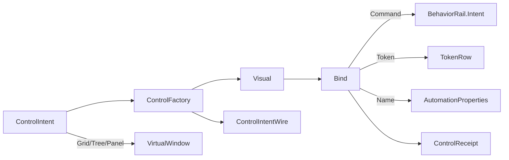

# [APPUI_CONTROL_MATERIALIZATION]

One typed `ControlIntent` family materializes every interactive control from a declarative shape: a screen body is a control-intent stream, not a per-screen XAML literal. `ControlIntent` is the closed `[Union]` over the whole interactive-control vocabulary where arity, provider, and modality live in the intent shape rather than parallel control names, `ControlFactory` is the one polymorphic fold projecting each intent onto its compiled-template Avalonia control, `BehaviorRail.Intent` is the single binding bridge every materialized command rides, `Theme/tokens` roles resolve every visual, and `Shell/accessibility` derives every automation name from the one intent row. The page owns the intent vocabulary, the materialize fold and its boundary capsule, and the `ControlIntentWire` projection; it mints no parallel binding, token, automation, or template path — the `[05]-[PROHIBITIONS]` parallel-control-framework clause forecloses it. The spine is Avalonia compiled `ControlTemplate`/`DataTemplate`/`ControlTheme`, ReactiveUI commands, `Xaml.Behaviors.Avalonia`, Thinktecture.Runtime.Extensions, and LanguageExt rails.

## [01]-[INDEX]

- [01]-[CONTROL_INTENT]: One closed control vocabulary; per-kind typed shape, binding, token, and automation columns.
- [02]-[MATERIALIZE_FOLD]: The `ControlFactory` intent-to-control fold; one `BehaviorRail.Intent` bridge; total automation derivation.
- [03]-[CONTROL_RECYCLING]: The recycling-aware materialization boundary the `VirtualWindow` grid/tree/canvas kinds consume.
- [04]-[TS_PROJECTION]: `ControlIntentWire` kind-discriminated control vocabulary the web head materializes.

## [02]-[CONTROL_INTENT]

- Owner: `ControlIntent` `[Union]` the interactive-control family; `IntentBinding` the per-intent command-and-token column carrier; `ControlFault` the typed fault family on the `AppUiFaultBand.Control` registry row (6010).
- Cases: `ControlIntent` = Button | TextInput | NumberInput | DateInput | PathInput | Select | Slider | Toggle | Radio | Grid | Tree | Menu | Toolbar | Tab | Accordion | Panel | Dock | Splitter under the locked kind literals; `ControlFault` = Text | UnboundIntent | TokenUnresolved | TemplateMissing | RecyclingViolation — codes derive through the `Diagnostics/evidence.md#FAULT_TABLES` registry.
- Entry: every case is one record whose fields carry the control's typed shape (value type, range, option set, child intents) and whose `IntentBinding` carries the `Option<string>` command key, token-role key, optional value key, and optional activation trigger — arity, provider, and modality live in the shape, so a number editor is `NumberInput` not a `GetNumberControl` name.
- Auto: the `EditorFactory` eleven-row typed-shape→control precedent already proven in `PropertyGrid` cells (`Inspector/editor-factories`) is the inspector specialization of this vocabulary — `ControlIntent` generalizes it from property cells to whole screens, so a grid cell editor and a screen field materialize through one fold; `Theme/tokens` `TokenRow` resolves every appearance and `Shell/accessibility` derives automation identity from `ControlIntent.Key`, so per-control token and automation literals are deleted.
- Packages: Thinktecture.Runtime.Extensions, LanguageExt.Core, BCL inbox
- Growth: a new control is one `ControlIntent` case carrying its shape plus `IntentBinding`; a new container is one case nesting child intents; zero new surface — the closed eighteen-case family is the axis and a nineteenth parallel control name beside it is the rejected form.
- Boundary: `ControlIntent` is the one control vocabulary in the package — a per-screen control-builder, a second control-generation framework, and a parallel binding/token/automation path are the `[05]-[PROHIBITIONS]` parallel-control-framework rejected forms; the command column is `Option<string>` carrying the `CommandIntent` key the materialized control's `ICommand` resolves through `BehaviorRail.Intent`, never a `ReactiveCommand` instance on the intent (the intent is a serializable shape, the command resolves at materialize) so the intent crosses the `ControlIntentWire` seam unchanged; container kinds (`Grid`, `Tree`, `Tab`, `Accordion`, `Panel`, `Dock`, `Splitter`, `Toolbar`, `Menu`) carry their child-intent sequence so a whole screen is one nested intent tree; the `Grid` and `Tree` kinds carry the `VirtualWindow` window spec the `GENERIC_VIRTUALIZATION_FABRIC` owner consumes — the spec crosses the wire so a remote head windows the same viewport contract — and a windowed control mints no second virtualizer; value-carrying kinds (`TextInput`, `NumberInput`, `DateInput`, `PathInput`, `Slider`, `Toggle`) carry a typed two-way binding path read at materialize; the `Select` and `Radio` option sets are the bounded-choice column; the `Dock` and `Splitter` kinds defer their layout to the `LayoutConstraint`/`LayoutSolver` owner (`Shell/solver`) so the intent names the constraint program and the panel solves it.

```csharp signature
[Union]
public abstract partial record ControlFault : Expected, IValidationError<ControlFault> {
    private ControlFault(string detail, int code) : base(detail, code, None) { }

    public static ControlFault Create(string message) => new Text(message);

    public sealed record Text : ControlFault { public Text(string detail) : base(detail, AppUiFaultBand.Control.Code(0)) { } }
    public sealed record UnboundIntent : ControlFault { public UnboundIntent(string detail) : base(detail, AppUiFaultBand.Control.Code(1)) { } }
    public sealed record TokenUnresolved : ControlFault { public TokenUnresolved(string detail) : base(detail, AppUiFaultBand.Control.Code(2)) { } }
    public sealed record TemplateMissing : ControlFault { public TemplateMissing(string detail) : base(detail, AppUiFaultBand.Control.Code(3)) { } }
    public sealed record RecyclingViolation : ControlFault { public RecyclingViolation(string detail) : base(detail, AppUiFaultBand.Control.Code(4)) { } }
}

public sealed record IntentBinding(
    string TokenRole,
    string AutomationName,
    Option<string> Command,
    Option<string> ValueKey,
    Option<ControlTrigger> Trigger);

[SmartEnum<string>]
public sealed partial class ControlTrigger {
    public static readonly ControlTrigger Activate = new("activate");
    public static readonly ControlTrigger Change = new("change");
    public static readonly ControlTrigger Commit = new("commit");
}

[Union(ConversionFromValue = ConversionOperatorsGeneration.None)]
public abstract partial record ControlIntent(string Key, IntentBinding Binding) {
    public sealed record Button(string Key, string Content, IntentBinding Binding) : ControlIntent(Key, Binding);
    public sealed record TextInput(string Key, string Watermark, bool Multiline, IntentBinding Binding) : ControlIntent(Key, Binding);
    public sealed record NumberInput(string Key, double Min, double Max, double Increment, IntentBinding Binding) : ControlIntent(Key, Binding);
    public sealed record DateInput(string Key, Option<LocalDate> Min, Option<LocalDate> Max, IntentBinding Binding) : ControlIntent(Key, Binding);
    public sealed record PathInput(string Key, PathBrowseMode Mode, Seq<string> Filters, IntentBinding Binding) : ControlIntent(Key, Binding);
    public sealed record Select(string Key, Seq<(string Value, string Label)> Options, IntentBinding Binding) : ControlIntent(Key, Binding);
    public sealed record Slider(string Key, double Min, double Max, double Step, IntentBinding Binding) : ControlIntent(Key, Binding);
    public sealed record Toggle(string Key, string Label, IntentBinding Binding) : ControlIntent(Key, Binding);
    public sealed record Radio(string Key, Seq<(string Value, string Label)> Options, IntentBinding Binding) : ControlIntent(Key, Binding);
    public sealed record Grid(string Key, Seq<ControlIntent> Columns, VirtualWindowSpec Window, IntentBinding Binding) : ControlIntent(Key, Binding);
    public sealed record Tree(string Key, VirtualWindowSpec Window, IntentBinding Binding) : ControlIntent(Key, Binding);
    public sealed record Menu(string Key, Seq<ControlIntent> Items, IntentBinding Binding) : ControlIntent(Key, Binding);
    public sealed record Toolbar(string Key, Seq<ControlIntent> Items, IntentBinding Binding) : ControlIntent(Key, Binding);
    public sealed record Tab(string Key, Seq<(string Header, ControlIntent Body)> Pages, IntentBinding Binding) : ControlIntent(Key, Binding);
    public sealed record Accordion(string Key, Seq<(string Header, ControlIntent Body)> Sections, IntentBinding Binding) : ControlIntent(Key, Binding);
    public sealed record Panel(string Key, Seq<ControlIntent> Children, string ConstraintProgram, IntentBinding Binding) : ControlIntent(Key, Binding);
    public sealed record Dock(string Key, Seq<ControlIntent> Regions, string ConstraintProgram, IntentBinding Binding) : ControlIntent(Key, Binding);
    public sealed record Splitter(string Key, ControlIntent First, ControlIntent Second, Orientation Orientation, IntentBinding Binding) : ControlIntent(Key, Binding);

    public Seq<ControlIntent> Children => Switch(
        grid: static c => c.Columns, menu: static c => c.Items, toolbar: static c => c.Items,
        tab: static c => c.Pages.Map(static p => p.Body), accordion: static c => c.Sections.Map(static s => s.Body),
        panel: static c => c.Children, dock: static c => c.Regions, splitter: static c => Seq(c.First, c.Second),
        button: static _ => Seq<ControlIntent>(), textInput: static _ => Seq<ControlIntent>(), numberInput: static _ => Seq<ControlIntent>(),
        dateInput: static _ => Seq<ControlIntent>(), pathInput: static _ => Seq<ControlIntent>(), select: static _ => Seq<ControlIntent>(),
        slider: static _ => Seq<ControlIntent>(), toggle: static _ => Seq<ControlIntent>(), radio: static _ => Seq<ControlIntent>(),
        tree: static _ => Seq<ControlIntent>());
}

[SmartEnum<string>]
public sealed partial class PathBrowseMode {
    public static readonly PathBrowseMode File = new("file");
    public static readonly PathBrowseMode Directory = new("directory");
    public static readonly PathBrowseMode SaveFile = new("save-file");
}
```

## [03]-[MATERIALIZE_FOLD]

- Owner: `ControlFactory` the one intent-to-control fold; `MaterializeContext` the composition-bound resolution columns; `ControlReceipt` the materialization evidence record.
- Entry: `public Fin<Control> Materialize(ControlIntent intent, MaterializeContext context)` — one polymorphic fold (intent → realized control) over the closed family; the `Fin` rail aborts on an unbound command key, an unresolved token role, or a recycling violation, sealing the typed `ControlFault`.
- Auto: each arm constructs the compiled-template Avalonia control (`Button`, `TextBox`, `NumericUpDown`, `CalendarDatePicker`, `ComboBox`, `Slider`, `ToggleSwitch`, `RadioButton` group, `DataGrid` over the `VirtualWindow` source, `TreeView`-as-flat-`TreeRow` over the same window, `Menu`, `ToolBar`, `TabControl`, `Expander` accordion, the `LayoutSolver` panel, `DockControl`, `GridSplitter`), binds its `ICommand` through `BehaviorRail.Intent(context.Command(key))` exclusively, resolves every brush and metric through `context.Token(role)`, derives automation identity from the intent key, and admits values and activation through the typed `MaterializeContext.Value` and `MaterializeContext.Activate` boundaries — no reflection path, per-kind materializer call site, runtime-XAML emission, or second binding bridge.
- Receipt: `ControlReceipt` — intent key, control type name, bound command key, resolved token role, `Instant` — minted by `Materialize` on every successful fold through the `MaterializeContext.Evidence` column bound at composition to the screen evidence stream, so a receipt record with no mint path is unrepresentable; `TelemetryRow` contributes the control-materialized and control-rejected instruments inward through the AppHost `TelemetryContributorPort`.
- Packages: Avalonia, Avalonia.Controls.DataGrid, Xaml.Behaviors.Avalonia, ReactiveUI, LanguageExt.Core, NodaTime
- Growth: one fold arm per new `ControlIntent` case; a new container is one nesting arm recursing `Materialize` over child intents; one control instrument is one `InstrumentRow` on `ControlFactory.TelemetryRow`; zero new surface.
- Boundary: `ControlFactory` is the named boundary capsule for the control-construction statement carve-out — each arm carries the Avalonia control-construction statements while the dispatch stays one total generated `Switch`, so a new case breaks every site at compile time and a runtime `_` arm is the rejected form; the only `ICommand` binding bridge is `BehaviorRail.Intent`, so `PropertyBinderImplementation.Bind`/`OneWayBind`/`BindTo`, `CommandBinder.BindCommand`, and `IViewFor` property-expression wiring are rejected wholesale (the `[05]-[PROHIBITIONS]` ReactiveUI-code-behind clause); the materialized control's value bridge resolves the typed `IntentBinding.ValueKey` through `MaterializeContext.Value`, never reflection over a string property path; templates are compiled `ControlTemplate`/`DataTemplate`/`ControlTheme`, the core `AvaloniaXamlLoader.Load(this)` call remains the compiled-XAML materializer, and only runtime `AvaloniaRuntimeXamlLoader` inflation is rejected by `Surfaces.RejectRuntimeInflation`; the `Grid` and `Tree` arms hand their `VirtualWindowSpec` to the `Shell/virtualization` `VirtualWindow` owner so windowing rides the one fabric and a factory-local virtualizer is the rejected form; the `Panel` and `Dock` arms hand their `ConstraintProgram` to the `Shell/solver` `LayoutSolver` panel and mount their children through `Mounted`, which stamps `LayoutSolver.ChildKeyProperty` from each child intent's `Key` before the child enters the panel — the one admitted source of solver child identity; the command key resolves against the boot-frozen `CommandDeck` so an unknown key aborts the materialize on the `Fin` rail rather than binding a dead control.

```csharp signature
public sealed record MaterializeContext(
    Func<string, Option<ICommand>> Command,
    Func<string, Option<IBrush>> Token,
    Func<string, Option<double>> Metric,
    Func<ControlIntent.DateInput, Fin<Control>> Date,
    Func<ControlIntent.PathInput, Fin<Control>> Path,
    Func<ControlIntent.Grid, Fin<DataGrid>> Grid,
    Func<ControlIntent.Tree, Fin<Control>> Tree,
    Func<VirtualWindowSpec, Fin<WindowLease>> Window,
    Func<string, Fin<Control>> Layout,
    Func<string, Control, Fin<IDisposable>> Value,
    Func<ControlTrigger, Control, ICommand, Fin<IDisposable>> Activate,
    Func<Control, IDisposable, Unit> Own,
    Func<Control, Unit> Release,
    Func<ControlReceipt, Unit> Evidence,
    ClockPolicy Clocks);

public sealed record WindowLease(ReadOnlyObservableCollection<RealizedItem<object>> View, IDisposable Lifetime);

public sealed record ControlReceipt(string IntentKey, string ControlType, Option<string> Command, string TokenRole, Instant At) {
    public const string Kind = "control";
}

public static class ControlFactory {
    public const string MaterializedInstrument = "rasm.appui.control.materialized";
    public const string RejectedInstrument = "rasm.appui.control.rejected";

    public static TelemetryContributorPort TelemetryRow(string version) =>
        AppUiTelemetry.Contribute(version, MaterializedInstrument, RejectedInstrument);

    // Every successful materialization seals its ControlReceipt through the context's evidence column
    // — the one mint the screen evidence stream consumes; a rejected materialize carries its fault only.
    public static Fin<Control> Materialize(ControlIntent intent, MaterializeContext context) =>
        Visual(intent, context)
            .Bind(control => Bind(intent, control, context))
            .Map(control => (context.Evidence(new ControlReceipt(
                intent.Key, control.GetType().Name, intent.Binding.Command, intent.Binding.TokenRole, context.Clocks.Now)), control).Item2);

    private static Fin<Control> Visual(ControlIntent intent, MaterializeContext context) => intent.Switch(
        state: context,
        button: static (ctx, c) => Fin<Control>.Succ(new Button { Content = c.Content }),
        textInput: static (ctx, c) => Fin<Control>.Succ(new TextBox { Watermark = c.Watermark, AcceptsReturn = c.Multiline }),
        numberInput: static (ctx, c) => Fin<Control>.Succ(new NumericUpDown { Minimum = (decimal)c.Min, Maximum = (decimal)c.Max, Increment = (decimal)c.Increment }),
        dateInput: static (ctx, c) => ctx.Date(c),
        pathInput: static (ctx, c) => ctx.Path(c),
        select: static (ctx, c) => Fin<Control>.Succ(new ComboBox { ItemsSource = c.Options.Map(static o => o.Label).ToArray() }),
        slider: static (ctx, c) => Fin<Control>.Succ(new Slider { Minimum = c.Min, Maximum = c.Max, TickFrequency = c.Step }),
        toggle: static (ctx, c) => Fin<Control>.Succ(new ToggleSwitch { Content = c.Label }),
        radio: static (ctx, c) => Fin<Control>.Succ(RadioGroup(c.Key, c.Options)),
        grid: static (ctx, c) => (ctx.Grid(c), ctx.Window(c.Window)).Apply((grid, lease) => Windowed(grid, lease, ctx)).As(),
        tree: static (ctx, c) => (ctx.Tree(c), ctx.Window(c.Window)).Apply((tree, lease) => Windowed(tree, lease, ctx)).As(),
        menu: static (ctx, c) => Children(c.Items, ctx).Map(static items => (Control)new Menu { ItemsSource = items.ToArray() }),
        toolbar: static (ctx, c) => Children(c.Items, ctx).Map(static items => (Control)new ItemsControl { ItemsSource = items.ToArray() }),
        tab: static (ctx, c) => Pages(c.Pages, ctx).Map(static pages => (Control)new TabControl { ItemsSource = pages.ToArray() }),
        accordion: static (ctx, c) => Sections(c.Sections, ctx).Map(static panels => {
            StackPanel stack = new();
            panels.Iter(panel => stack.Children.Add(panel));
            return (Control)stack;
        }),
        panel: static (ctx, c) => Mounted(ctx.Layout(c.ConstraintProgram), c.Children, ctx),
        dock: static (ctx, c) => Mounted(ctx.Layout(c.ConstraintProgram), c.Regions, ctx),
        splitter: static (ctx, c) => Split(c, ctx));

    // The solver child-identity admission: every solved child is stamped ChildKeyProperty from its OWN
    // intent Key here, so LayoutSolver.SolvedRect always resolves a program-owner key and a keyless
    // child is structurally unmountable — never a post-arrange failure.
    private static Fin<Control> Mounted(Fin<Control> layout, Seq<ControlIntent> children, MaterializeContext context) =>
        layout.Bind(host => host is Panel panel
            ? children
                .TraverseM(child => Materialize(child, context).Map(control => {
                    control.SetValue(LayoutSolver.ChildKeyProperty, child.Key);
                    return control;
                }))
                .As()
                .Map(mounted => {
                    mounted.Iter(control => panel.Children.Add(control));
                    return (Control)panel;
                })
            : Fin<Control>.Fail(new ControlFault.TemplateMissing(nameof(LayoutSolver))));

    // Container legs are ONE recursive traverse each — a child failure aborts the whole container on
    // the Fin rail, so a half-materialized screen tree is unrepresentable.
    private static Fin<Seq<Control>> Children(Seq<ControlIntent> items, MaterializeContext context) =>
        items.TraverseM(item => Materialize(item, context)).As();

    private static Fin<Seq<TabItem>> Pages(Seq<(string Header, ControlIntent Body)> pages, MaterializeContext context) =>
        pages.TraverseM(page => Materialize(page.Body, context).Map(body => new TabItem { Header = page.Header, Content = body })).As();

    private static Fin<Seq<Expander>> Sections(Seq<(string Header, ControlIntent Body)> sections, MaterializeContext context) =>
        sections.TraverseM(section => Materialize(section.Body, context).Map(body => new Expander { Header = section.Header, Content = body })).As();

    // Radio exclusivity keys on the intent key: one GroupName per Radio intent, so two radio intents
    // on one screen never cross-steal checks.
    private static Control RadioGroup(string key, Seq<(string Value, string Label)> options) {
        StackPanel panel = new();
        options.Iter(option => panel.Children.Add(new RadioButton { Content = option.Label, GroupName = key, Tag = option.Value }));
        return panel;
    }

    private static Fin<Control> Split(ControlIntent.Splitter intent, MaterializeContext context) =>
        (Materialize(intent.First, context), Materialize(intent.Second, context))
            .Apply((first, second) => Divided(first, second, intent.Orientation)).As();

    // The splitter host: star tracks either side of an Auto splitter track, orientation selecting the
    // axis — one Grid + GridSplitter, never a bespoke split control.
    private static Control Divided(Control first, Control second, Orientation orientation) {
        Grid grid = new();
        GridSplitter splitter = new() { ResizeDirection = orientation == Orientation.Horizontal ? GridResizeDirection.Columns : GridResizeDirection.Rows };
        if (orientation == Orientation.Horizontal) {
            grid.ColumnDefinitions = new ColumnDefinitions("*,Auto,*");
            Grid.SetColumn(first, 0); Grid.SetColumn(splitter, 1); Grid.SetColumn(second, 2);
        }
        else {
            grid.RowDefinitions = new RowDefinitions("*,Auto,*");
            Grid.SetRow(first, 0); Grid.SetRow(splitter, 1); Grid.SetRow(second, 2);
        }
        grid.Children.Add(first); grid.Children.Add(splitter); grid.Children.Add(second);
        return grid;
    }

    // The recycling re-entry: Refresh re-applies every intent-carried visual field before the one Bind
    // fold re-attaches command, token, trigger, and automation state — a reused control reflects its
    // CURRENT intent completely, and stale content, watermark, bounds, options, or limits cannot survive.
    public static Fin<Control> Rebind(ControlIntent intent, Control control, MaterializeContext context) =>
        Refresh(intent, control, context).Bind(fresh => Bind(intent, fresh, context));

    // The hot self-constructed leaf kinds re-dress the parked control in place; every context-constructed
    // or container kind reconstructs through the ONE Visual fold instead — correct either way, pooled
    // where hot, and construction truth keeps exactly one owner per case.
    private static Fin<Control> Refresh(ControlIntent intent, Control control, MaterializeContext context) =>
        (intent, control) switch {
            (ControlIntent.Button c, Button b) => Field(b, () => b.Content = c.Content),
            (ControlIntent.TextInput c, TextBox t) => Field(t, () => { t.Watermark = c.Watermark; t.AcceptsReturn = c.Multiline; }),
            (ControlIntent.NumberInput c, NumericUpDown n) => Field(n, () => { n.Minimum = (decimal)c.Min; n.Maximum = (decimal)c.Max; n.Increment = (decimal)c.Increment; }),
            (ControlIntent.Select c, ComboBox box) => Field(box, () => box.ItemsSource = c.Options.Map(static o => o.Label).ToArray()),
            (ControlIntent.Slider c, Slider s) => Field(s, () => { s.Minimum = c.Min; s.Maximum = c.Max; s.TickFrequency = c.Step; }),
            (ControlIntent.Toggle c, ToggleSwitch t) => Field(t, () => t.Content = c.Label),
            _ => Visual(intent, context),
        };

    private static Fin<Control> Field<TControl>(TControl control, Action assign) where TControl : Control {
        assign();
        return Fin<Control>.Succ(control);
    }

    private static Fin<Control> Bind(ControlIntent intent, Control control, MaterializeContext context) =>
        from command in intent.Binding.Command.Match(
            Some: key => context.Command(key).Map(Fin<Option<ICommand>>.Succ).IfNone(() => Fin<Option<ICommand>>.Fail(new ControlFault.UnboundIntent(key))),
            None: () => Fin<Option<ICommand>>.Succ(None))
        from brush in context.Token(intent.Binding.TokenRole).Map(Fin<IBrush>.Succ).IfNone(() => Fin<IBrush>.Fail(new ControlFault.TokenUnresolved(intent.Binding.TokenRole)))
        from bound in Apply(intent, control, command, brush, context)
        select bound;

    // The one bound-collection hop: the realized change-set binds ONCE into a ReadOnlyObservableCollection
    // the grid consumes — ItemsSource never receives the raw stream — and the subscription parks weak-keyed
    // on the control so a freed grid frees its window binding with it.
    private static Control Windowed(Control control, WindowLease lease, MaterializeContext context) {
        control.SetValue(ItemsControl.ItemsSourceProperty, lease.View);
        ignore(context.Own(control, lease.Lifetime));
        return control;
    }

    // Apply covers the full token set the role carries: brush, metric (font size + min touch height),
    // value-path binding, automation identity, and the one behavior bridge — idempotent for recycling:
    // the prior binding disposes before the new one registers, so a re-applied control never stacks two.
    private static Fin<Control> Apply(ControlIntent intent, Control control, Option<ICommand> command, IBrush brush, MaterializeContext context) {
        AutomationProperties.SetAutomationId(control, intent.Key);
        AutomationProperties.SetName(control, intent.Binding.AutomationName);
        control.SetValue(TemplatedControl.ForegroundProperty, brush);
        context.Metric($"{intent.Binding.TokenRole}.font-size").Iter(size => control.SetValue(TemplatedControl.FontSizeProperty, size));
        context.Metric($"{intent.Binding.TokenRole}.min-height").Iter(height => control.SetValue(Layoutable.MinHeightProperty, height));
        return intent.Binding.ValueKey.Match(
                Some: key => context.Value(key, control).Map(lifetime => context.Own(control, lifetime)),
                None: () => Fin.Succ(unit))
            .Bind(_ => intent.Binding.Trigger.Match(
                Some: trigger => command.Match(
                    Some: resolved => context.Activate(trigger, control, resolved).Map(lifetime => context.Own(control, lifetime)),
                    None: () => Fin.Succ(unit)),
                None: () => Fin.Succ(unit)))
            .Map(_ => control);
    }

    // Per-control value property (TextBox.Text, NumericUpDown.Value, ...) — one table, no per-kind binder.
    internal static AvaloniaProperty ContentPropertyOf(Control control) => control switch {
        TextBox => TextBox.TextProperty,
        NumericUpDown => NumericUpDown.ValueProperty,
        Slider => RangeBase.ValueProperty,
        ToggleSwitch => ToggleButton.IsCheckedProperty,
        ComboBox => SelectingItemsControl.SelectedItemProperty,
        _ => ContentControl.ContentProperty,
    };

}
```

[MATERIALIZE_LAW]:
- One bridge: every `ICommand` rides `BehaviorRail.Intent` — a `BindCommand` call site is the deleted form and the intent never carries a live command, only its key.
- One token: every brush, metric, and motion resolves through `MaterializeContext.Token` from the `TokenRow` vocabulary — a hardcoded brush is the deleted form.
- One automation: every control's id and name derive from `ControlIntent.Key` through the one `Apply` fold — a per-control automation call site is the deleted form.
- Compiled templates only: controls construct against compiled `ControlTemplate`/`ControlTheme`; only runtime `AvaloniaRuntimeXamlLoader` inflation is rejected.
- Recursive containers: container arms recurse `Materialize` over child intents so a whole screen is one fold over one nested intent tree.

## [04]-[CONTROL_RECYCLING]

- Owner: `RecycleScope` the realized-control reuse pool; `MaterializePool` the recycling-aware materialization over the `VirtualWindow` window.
- Entry: `public Fin<Control> Realize(ControlIntent intent, MaterializeContext context, RecycleScope scope)` — materializes through the pool, reusing a parked control of the same intent key when the window scrolls a row out and back, sealing a `RecyclingViolation` when an intent key crosses control types.
- Auto: the `Grid`, `Tree`, and `Panel` kinds materialize their row/cell controls through `MaterializePool` keyed by intent key so the `VirtualWindow` recycles realized controls over a data window rather than re-materializing per scroll tick; a parked control releases every owned binding and activation lifetime before the full replacement intent re-enters `ControlFactory.Rebind`, whose `Refresh` fold re-applies every intent-carried visual field — or reconstructs a context-constructed or container kind through the one `Visual` fold — before `Bind` re-attaches, so a recycled cell carries no stale value, field, command, trigger, token, or automation state; the pool capacity is composition-bound to the realized-window overscan bound.
- Packages: Avalonia, LanguageExt.Core, BCL inbox
- Growth: a new recyclable kind is one pool-key entry; zero new surface.
- Boundary: control recycling rides the one `VirtualWindow` owner (`Shell/virtualization`) — a per-surface recycling pool is the `[05]-[PROHIBITIONS]` per-surface-virtualizer rejected form, and the pool is keyed by intent key so a recycled control always matches its intent type; the pool resets bindings on reuse so a recycled control never leaks the prior row's value; the realized-item count bounds the pool so recycling is constant-cost; a `RecyclingViolation` fault fires when an intent key reuses a control of a different type, so a pool-key collision aborts on the `Fin` rail rather than mounting a mismatched control.

```csharp signature
public sealed record RecycleScope(
    string WindowKey,
    int Capacity,
    System.Collections.Generic.Dictionary<string, System.Collections.Generic.Stack<Control>> Pool) {
    public static RecycleScope Of(string windowKey, int capacity) => new(windowKey, capacity, new(StringComparer.Ordinal));

    public Option<Control> Park(string intentKey) =>
        Pool.TryGetValue(intentKey, out System.Collections.Generic.Stack<Control>? stack) && stack.Count > 0 ? Some(stack.Pop()) : None;

    public Unit Return(string intentKey, Control control, MaterializeContext context) =>
        (context.Release(control), Pool.Values.Sum(static stack => stack.Count) >= Capacity
            ? unit
            : fun(() => (Pool.TryGetValue(intentKey, out System.Collections.Generic.Stack<Control>? stack)
                ? stack
                : Pool[intentKey] = new()).Push(control))()).Item2;
}

public static class MaterializePool {
    extension(RecycleScope scope) {
        public Fin<Control> Realize(ControlIntent intent, MaterializeContext context) =>
            scope.Park(intent.Key).Match(
                Some: parked => Rebind(parked, intent, context),
                None: () => ControlFactory.Materialize(intent, context));

        // Every owned lifetime releases before the replacement intent re-enters the one Bind fold.
        private static Fin<Control> Rebind(Control parked, ControlIntent intent, MaterializeContext context) =>
            parked.GetType().Name == ControlTypeOf(intent)
                ? Reset(parked, context).Bind(cleared => ControlFactory.Rebind(intent, cleared, context))
                : Fin<Control>.Fail(new ControlFault.RecyclingViolation($"{intent.Key}:{parked.GetType().Name}!={ControlTypeOf(intent)}"));

        private static Fin<Control> Reset(Control parked, MaterializeContext context) {
            parked.ClearValue(ControlFactory.ContentPropertyOf(parked)); // clears the resolved value surface
            parked.ClearValue(TemplatedControl.ForegroundProperty);
            parked.ClearValue(TemplatedControl.FontSizeProperty);
            parked.ClearValue(Layoutable.MinHeightProperty);
            parked.DataContext = null;
            Interaction.GetBehaviors(parked).Clear();
            return Fin<Control>.Succ(parked);
        }
    }
}
```



## [05]-[TS_PROJECTION]

- Owner: `ControlIntentWire`, `IntentBindingWire`, `ControlReceiptWire` — the kind-discriminated control wire contract the TypeScript head materializes; the `csharp:Rasm.AppUi/Controls` mint emits `ControlIntentWire` over the `ControlIntent` family that `typescript:core/interchange/codec` decodes and `typescript:ui/viewer` materializes (`viewer/panel`), so a web/remote caller materializes the same control vocabulary the desktop renders.
- Packages: BCL inbox
- Growth: one wire member row per new intent field; one kind literal per new control case; zero new surface.
- Boundary: shapes transcribe the camelCase Strict emission — the control kind crosses as the locked kind literal, the command crosses as the `CommandIntent` ordinal-string key, the token role crosses as the `TokenRow` string key, the value key crosses as an ordinal string, the trigger crosses as its locked smart-enum key, and automation identity derives from the intent key on both heads; date bounds cross as ISO-8601 date text or null, the `Grid`/`Tree` window spec crosses whole as `VirtualWindowSpecWire`, and container kinds carry their child-intent arrays; every field a wire-visible `ControlIntent` case owns has a wire representation, so a web-only default for an omitted field is rejected; realized controls, bound commands, and resolved brushes never cross because each head materializes them from the same vocabulary; this is the `ONE_UI_INTENT_WIRE` counterpart, so `ControlIntentWire` kind parity matches the `LayoutConstraintWire` ordered-program invariant.

```ts signature
interface IntentBindingWire {
  readonly tokenRole: string;
  readonly command: string | null;
  readonly valueKey: string | null;
  readonly trigger: "activate" | "change" | "commit" | null;
}

interface VirtualWindowSpecWire {
  readonly extent: number;
  readonly overscan: number;
  readonly mode: "fixed" | "measured";
  readonly fixedItemExtent: number;
}

type ControlIntentWire =
  | { readonly kind: "button"; readonly key: string; readonly content: string; readonly binding: IntentBindingWire }
  | { readonly kind: "textInput"; readonly key: string; readonly watermark: string; readonly multiline: boolean; readonly binding: IntentBindingWire }
  | { readonly kind: "numberInput"; readonly key: string; readonly min: number; readonly max: number; readonly increment: number; readonly binding: IntentBindingWire }
  | { readonly kind: "dateInput"; readonly key: string; readonly min: string | null; readonly max: string | null; readonly binding: IntentBindingWire }
  | { readonly kind: "pathInput"; readonly key: string; readonly mode: string; readonly filters: readonly string[]; readonly binding: IntentBindingWire }
  | { readonly kind: "select"; readonly key: string; readonly options: readonly { readonly value: string; readonly label: string }[]; readonly binding: IntentBindingWire }
  | { readonly kind: "slider"; readonly key: string; readonly min: number; readonly max: number; readonly step: number; readonly binding: IntentBindingWire }
  | { readonly kind: "toggle"; readonly key: string; readonly label: string; readonly binding: IntentBindingWire }
  | { readonly kind: "radio"; readonly key: string; readonly options: readonly { readonly value: string; readonly label: string }[]; readonly binding: IntentBindingWire }
  | { readonly kind: "grid"; readonly key: string; readonly columns: readonly ControlIntentWire[]; readonly window: VirtualWindowSpecWire; readonly binding: IntentBindingWire }
  | { readonly kind: "tree"; readonly key: string; readonly window: VirtualWindowSpecWire; readonly binding: IntentBindingWire }
  | { readonly kind: "menu"; readonly key: string; readonly items: readonly ControlIntentWire[]; readonly binding: IntentBindingWire }
  | { readonly kind: "toolbar"; readonly key: string; readonly items: readonly ControlIntentWire[]; readonly binding: IntentBindingWire }
  | { readonly kind: "tab"; readonly key: string; readonly pages: readonly { readonly header: string; readonly body: ControlIntentWire }[]; readonly binding: IntentBindingWire }
  | { readonly kind: "accordion"; readonly key: string; readonly sections: readonly { readonly header: string; readonly body: ControlIntentWire }[]; readonly binding: IntentBindingWire }
  | { readonly kind: "panel"; readonly key: string; readonly children: readonly ControlIntentWire[]; readonly constraintProgram: string; readonly binding: IntentBindingWire }
  | { readonly kind: "dock"; readonly key: string; readonly regions: readonly ControlIntentWire[]; readonly constraintProgram: string; readonly binding: IntentBindingWire }
  | { readonly kind: "splitter"; readonly key: string; readonly first: ControlIntentWire; readonly second: ControlIntentWire; readonly orientation: string; readonly binding: IntentBindingWire };

interface ControlReceiptWire { readonly intentKey: string; readonly controlType: string; readonly command: string | null; readonly tokenRole: string; readonly at: string; }
```

## [06]-[RESEARCH]

- [CONTROL_TEMPLATE]: the compiled `ControlTemplate`/`ControlTheme` resolution the materialize fold reads per kind — the `TemplatedControl.Template` and `ControlTheme` lookup against the theme dictionary the `Theme/tokens` owner emits, and the `DataGridTemplateColumn.CellTemplate` compiled-template binding for the `Grid`/`Tree` cell intents — resolved at implementation against the Avalonia 12 compiled-template surface; the `ControlIntent` union, the `ControlFactory` fold, the `BehaviorRail.Intent` bridge, and the `AutomationProperties.SetName` derivation are settled, the per-kind compiled-template member spellings are the unverified surface bound at composition.
