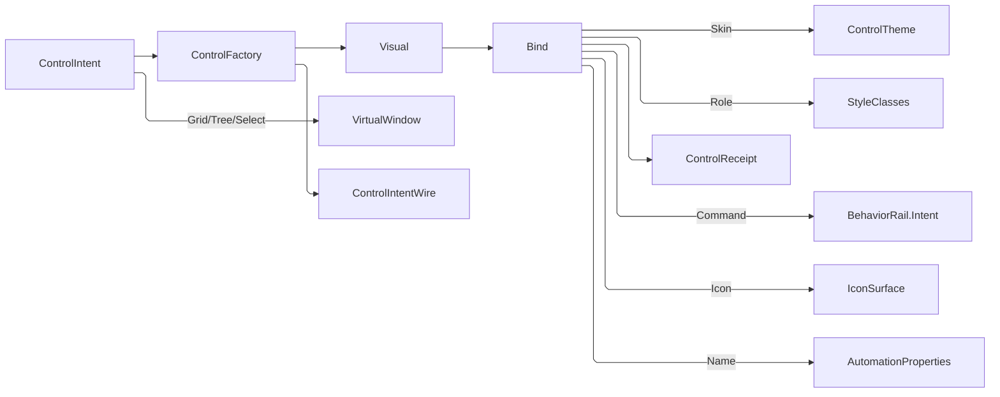

# [APPUI_CONTROL_MATERIALIZATION]

One typed `ControlIntent` family materializes every interactive control from a declarative shape: a screen body is a control-intent stream, not a per-screen XAML literal. `ControlIntent` is the closed `[Union]` over the whole professional control vocabulary where arity, provider, modality, emphasis, iconography, and pending state live in the intent shape rather than parallel control names, `ControlFactory` is the one polymorphic fold projecting each intent onto its compiled-template control, `BehaviorRail.Intent` is the single binding bridge every materialized command rides, appearance reaches every control through its `ControlTheme` and its style classes alone, and `Shell/accessibility` derives every automation name from the one intent row. The page owns the intent vocabulary, the materialize fold and its boundary capsule, the context-column and package admission law, and the `ControlIntentWire` projection; it mints no parallel binding, token, automation, or template path — the `[04]-[BOUNDARIES]` parallel-control-framework clause forecloses it. The spine is Avalonia compiled `ControlTemplate`/`DataTemplate`/`ControlTheme`, the `Irihi.Ursa` extended-control suite, ReactiveUI commands, `Xaml.Behaviors.Avalonia`, Thinktecture.Runtime.Extensions, and LanguageExt rails.

Appearance is the page's ruling shape: the fold writes NO resolved paint, metric, or shadow onto a control. Emphasis resolves to one `ControlTheme` row of the `Theme/tokens#CONTROL_THEMES` table through `StyledElement.Theme`, the semantic `PaintRole` and the `TypographyRole` land as style classes the theme's own selectors match, and every value inside those themes binds `{DynamicResource}` — so a variant swap re-tints a materialized screen through Avalonia's own resource resolution, exactly as the `RULINGS.md` resolved-token law requires, and a `SetValue` of a resolved brush is unspellable in this fold.

## [01]-[INDEX]

- [02]-[CONTROL_INTENT]: One closed control vocabulary; per-case typed shape with the emphasis, icon, pending, and hint columns.
- [03]-[MATERIALIZE_FOLD]: The `ControlFactory` intent-to-control fold; the context-column and package admission law; one `BehaviorRail.Intent` bridge; total automation derivation.
- [04]-[CONTROL_RECYCLING]: The recycling-aware materialization boundary the `VirtualWindow` grid/tree/panel kinds consume.
- [05]-[TS_PROJECTION]: `ControlIntentWire` kind-discriminated control vocabulary the web head materializes.

## [02]-[CONTROL_INTENT]

- Owner: `ControlIntent` `[Union]` the interactive-control family; `IntentBinding` the per-intent command, emphasis, icon, and hint carrier; `ControlEmphasis` the emphasis ladder; `ControlSkin` the control-theme row every arm addresses; `NumericKind`/`NumericRange`, `TemporalKind`, `BannerSeverity`/`BannerPlacement`, and the posture rows the polymorphic cases discriminate on; `ControlFault` the typed fault family on the `AppUiFaultBand.Control` registry row (6010).
- Cases: `ControlIntent` = Button | Label | TextInput | NumberInput | DateInput | PathInput | ColorInput | Select | MultiSelect | Slider | Range | Toggle | Radio | Segmented | Chip | Progress | Avatar | Breadcrumb | Tooltip | Banner | EmptyState | Grid | Tree | Overview | Menu | Toolbar | Tab | Accordion | Panel | Dock | Splitter under the locked kind literals; `ControlEmphasis` = quiet | secondary | primary | danger | inverted | link; `NumericRange` = Integral | Unsigned | Real | Precise; `OptionSource` = Inline | Bound; `ControlFault` = Text | UnboundIntent | SkinUnresolved | TemplateMissing | RecyclingViolation | SlotUnavailable | PayloadRejected — codes derive through the `Diagnostics/evidence#FAULT_TABLES` registry.
- Law: emphasis, icon, pending, and hint are COLUMNS on `IntentBinding`, never cases — a quiet button and a danger button are one `Button` intent under two emphasis rows, so both heads materialize the ladder identically and a per-emphasis control name is unspellable.
- Law: a pending column lives ON the icon slot, so in-control progress always replaces a leading visual and a spinner that widens its own control is structurally unrepresentable; the control stays enabled-disabled honest because pending drives the loading slot alone and never `IsEnabled`.
- Law: numeric entry is the typed spinner matching the bound CLR type — `NumericKind` names the type, `NumericRange` carries the bounds in the widest form that type admits, and the narrowing runs through generic-math checked conversion, so a `double` field keeps `NaN` and full range while a `ulong` field keeps its top decade; a single `decimal` bound column across every numeric field is the deleted form.
- Entry: every case is one record whose fields carry the control's typed shape and whose `IntentBinding` carries the semantic `PaintRole`, the `ControlEmphasis` row, the `Option<string>` command key, the value key, the activation trigger, the optional `IconSlot`, and the optional `HintRow` — arity, provider, modality, and emphasis live in the shape, so a quiet icon-leading pending button is `Button` with three columns set, not a `GetQuietPendingIconButton` name.
- Auto: the `EditorFactory` typed-shape→control precedent already proven in `PropertyGrid` cells (`Editing/inspector#EDITOR_FACTORIES`) is the inspector specialization of this vocabulary — `ControlIntent` generalizes it from property cells to whole screens, so a grid cell editor and a screen field materialize through one fold; `Theme/tokens` control-theme rows resolve every appearance and `Shell/accessibility` derives automation identity from `ControlIntent.Key`, so per-control token and automation literals are deleted.
- Packages: Irihi.Ursa, Avalonia, Thinktecture.Runtime.Extensions, NodaTime, LanguageExt.Core, BCL inbox
- Growth: a new control is one `ControlIntent` case carrying its shape plus `IntentBinding`; a new emphasis is one `ControlEmphasis` row naming its skin; a new numeric type is one `NumericKind` row; a new temporal shape is one `TemporalKind` row; a new banner level is one `BannerSeverity` row carrying its own dismissibility; a new modality on an existing case is one posture row; zero new surface — the closed family is the axis and a parallel control name beside it is the rejected form.
- Boundary: `ControlIntent` is the one control vocabulary in the package — a per-screen control-builder, a second control-generation framework, and a parallel binding, token, or automation path are the `[04]-[BOUNDARIES]` parallel-control-framework rejected forms; the command column is `Option<string>` carrying the `CommandIntent` key the materialized control's `ICommand` resolves through `BehaviorRail.Intent`, never a `ReactiveCommand` instance on the intent (the intent is a serializable shape, the command resolves at materialize) so the intent crosses the `ControlIntentWire` seam unchanged; container kinds (`Grid`, `Tree`, `Tab`, `Accordion`, `Panel`, `Dock`, `Splitter`, `Toolbar`, `EmptyState`, `Banner`) carry their child-intent sequence so a whole screen is one nested intent tree, while `Menu`, `Breadcrumb`, and the option-bearing kinds carry their own structured ROW shapes rather than child intents, because a menu row's check posture, submenu, and gesture hint are fields no control intent owns; the `Grid`, `Tree`, `Select`, and `MultiSelect` kinds carry the `VirtualWindow` window spec the `Shell/virtualization` fabric owner consumes — the spec crosses the wire so a remote head windows the same viewport contract — and a windowed control mints no second virtualizer; the `Tree` kind materializes the `FlatNode` union the flatten emits, so a hierarchy and a GROUPED list ride one item template and a grouped surface needs no second container kind; the `Overview` kind is the one minimap primitive and it names its frame producer by key rather than carrying geometry, so the editor ruler, the graph minimap, the long-list strip, and the history timeline compose one control and a per-surface minimap is the rejected form; value-carrying kinds carry a typed two-way binding path read at materialize, and `Range` carries the second path its upper thumb round-trips, because one value key over a two-thumb control would leave half the value unreachable; the `Dock` and `Splitter` kinds defer their layout to the `LayoutConstraint`/`LayoutSolver` owner (`Shell/solver`) so the intent names the constraint program and the panel solves it; `IconSlot` is a CONTROL-level shape and its per-row seats take a narrower contract by construction: on `OptionRow`, `CrumbRow`, and `MenuRow` the glyph resolves and the other two columns have no channel — the item template fixes the leading slot so `Placement` has no reader, and `Pending` would need a per-row value key plus a per-row lifetime the recycling pool would have to own, which is a second binding path beside `MaterializeContext.Value`; one column cannot close that, so the row seats carry the ASSET and the size alone as a documented narrowing and a per-row spinner routes through the row's own progress intent rather than through this slot; placement, overflow, picker mode, and toggle vocabulary are the packages' own enums (`Ursa.Common` `Position`, `Ursa.Controls` `OverflowMode` and `UsePickerTypes`, Avalonia `HorizontalAlignment`, `Orientation`, `MenuItemToggleType`, `DataGridLength`), because re-spelling an admitted package's own axis as a local vocabulary is a rename shell — `DataGridLength` already carries the auto, size-to-cells, size-to-header, pixel, and star extent algebra a column row needs.

```csharp signature
// --- [ERRORS] ---------------------------------------------------------------------------

[Union]
public abstract partial record ControlFault : Expected, IValidationError<ControlFault> {
    private ControlFault(string detail, int code) : base(detail, code, None) { }

    public static ControlFault Create(string message) => new Text(message);

    public sealed record Text : ControlFault { public Text(string detail) : base(detail, AppUiFaultBand.Control.Code(0)) { } }
    public sealed record UnboundIntent : ControlFault { public UnboundIntent(string detail) : base(detail, AppUiFaultBand.Control.Code(1)) { } }
    public sealed record SkinUnresolved : ControlFault { public SkinUnresolved(string detail) : base(detail, AppUiFaultBand.Control.Code(2)) { } }
    public sealed record TemplateMissing : ControlFault { public TemplateMissing(string detail) : base(detail, AppUiFaultBand.Control.Code(3)) { } }
    public sealed record RecyclingViolation : ControlFault { public RecyclingViolation(string detail) : base(detail, AppUiFaultBand.Control.Code(4)) { } }
    public sealed record SlotUnavailable : ControlFault { public SlotUnavailable(string detail) : base(detail, AppUiFaultBand.Control.Code(5)) { } }
    public sealed record PayloadRejected : ControlFault { public PayloadRejected(string detail) : base(detail, AppUiFaultBand.Control.Code(6)) { } }
}

// --- [TYPES] ----------------------------------------------------------------------------

// The control-theme rows this fold addresses. The Key IS the dictionary resource key, so a row is an ADDRESS
// and never a second copy of the table's derivation and pseudo-class columns: a kebab key addresses a product
// row of `Theme/tokens#CONTROL_THEMES`, and a shipped key addresses the vendor theme verbatim, because forking
// a shipped ring or capsule into a product row to gain an address is a fork with no edit in it. An arm naming
// no row falls to the shipped type-keyed theme, which is why the chip toggle and the removable chip carry none.
[SmartEnum<string>]
[KeyMemberEqualityComparer<ComparerAccessors.StringOrdinal, string>]
[KeyMemberComparer<ComparerAccessors.StringOrdinal, string>]
public sealed partial class ControlSkin {
    public static readonly ControlSkin ProgressRing = new("ProgressRing");
    public static readonly ControlSkin CommandButton = new("command-button");
    public static readonly ControlSkin SecondaryButton = new("secondary-button");
    public static readonly ControlSkin QuietButton = new("quiet-button");
    public static readonly ControlSkin DangerButton = new("danger-button");
    public static readonly ControlSkin InvertedButton = new("inverted-button");
    public static readonly ControlSkin LinkButton = new("link-button");
    public static readonly ControlSkin TextEntry = new("text-entry");
    public static readonly ControlSkin RadioItem = new("radio-item");
    public static readonly ControlSkin SegmentedItem = new("segmented-item");
    public static readonly ControlSkin SegmentedIndicator = new("segmented-indicator");
    public static readonly ControlSkin GridRow = new("grid-row");
    public static readonly ControlSkin StatusChip = new("status-chip");
    public static readonly ControlSkin PaletteRow = new("palette-row");
    public static readonly ControlSkin EmptyStatePanel = new("empty-state-panel");
    public static readonly ControlSkin Tooltip = new("tooltip");
    public static readonly ControlSkin ButtonGroupItem = new("button-group-item");
    public static readonly ControlSkin AvatarCluster = new("avatar-cluster");
    public static readonly ControlSkin Banner = new("banner");
    public static readonly ControlSkin OverviewStrip = new("overview-strip");
}

// The emphasis ladder. `Derived` marks the rows whose shipped base carries `:disabled` ALONE — the borderless
// and hyperlink themes — so their control-theme rows author their own pointerover, pressed, and selected arms
// instead of inheriting arms that do not exist and shipping a control with no state feedback. `Control` names
// the type the button family constructs: the link row takes the shipped hyperlink control because its theme
// owns the trailing link glyph, which is exactly why the same row refuses a second icon slot.
[SmartEnum<string>]
[KeyMemberEqualityComparer<ComparerAccessors.StringOrdinal, string>]
[KeyMemberComparer<ComparerAccessors.StringOrdinal, string>]
public sealed partial class ControlEmphasis {
    public static readonly ControlEmphasis Quiet = new("quiet", ControlSkin.QuietButton, derived: true, iconable: true);
    public static readonly ControlEmphasis Secondary = new("secondary", ControlSkin.SecondaryButton, derived: false, iconable: true);
    public static readonly ControlEmphasis Primary = new("primary", ControlSkin.CommandButton, derived: false, iconable: true);
    public static readonly ControlEmphasis Danger = new("danger", ControlSkin.DangerButton, derived: false, iconable: true);
    public static readonly ControlEmphasis Inverted = new("inverted", ControlSkin.InvertedButton, derived: true, iconable: true);
    public static readonly ControlEmphasis Link = new("link", ControlSkin.LinkButton, derived: true, iconable: false);

    public ControlSkin Skin { get; }

    public bool Derived { get; }

    public bool Iconable { get; }

    public string Control(bool icon) =>
        this == Link ? nameof(HyperlinkButton) : icon ? nameof(IconButton) : nameof(Avalonia.Controls.Button);
}

[SmartEnum<string>]
[KeyMemberEqualityComparer<ComparerAccessors.StringOrdinal, string>]
[KeyMemberComparer<ComparerAccessors.StringOrdinal, string>]
public sealed partial class ControlTrigger {
    public static readonly ControlTrigger Activate = new("activate");
    public static readonly ControlTrigger Change = new("change");
    public static readonly ControlTrigger Commit = new("commit");
}

[SmartEnum<string>]
[KeyMemberEqualityComparer<ComparerAccessors.StringOrdinal, string>]
[KeyMemberComparer<ComparerAccessors.StringOrdinal, string>]
public sealed partial class SelectPosture {
    public static readonly SelectPosture Closed = new("closed", nameof(ComboBox));
    public static readonly SelectPosture Editable = new("editable", nameof(AutoCompleteBox));

    public string Control { get; }
}

[SmartEnum<string>]
[KeyMemberEqualityComparer<ComparerAccessors.StringOrdinal, string>]
[KeyMemberComparer<ComparerAccessors.StringOrdinal, string>]
public sealed partial class MultiPosture {
    // Bound multi-select picks from a closed option set and reads back as chips; free multi-select accepts
    // arbitrary tokens, which is the one thing a bound picker cannot express and the whole reason both seats.
    public static readonly MultiPosture Bound = new("bound", nameof(MultiComboBox));
    public static readonly MultiPosture Free = new("free", nameof(TagInput));

    public string Control { get; }
}

[SmartEnum<string>]
[KeyMemberEqualityComparer<ComparerAccessors.StringOrdinal, string>]
[KeyMemberComparer<ComparerAccessors.StringOrdinal, string>]
public sealed partial class SegmentPosture {
    // Select coerces to single selection and slides one indicator between segments; Command gives every
    // segment its own verb, so the two postures differ in what a segment MEANS, never in how it is painted.
    public static readonly SegmentPosture Select = new("select", nameof(SelectionList));
    public static readonly SegmentPosture Command = new("command", nameof(ButtonGroup));

    public string Control { get; }
}

[SmartEnum<string>]
[KeyMemberEqualityComparer<ComparerAccessors.StringOrdinal, string>]
[KeyMemberComparer<ComparerAccessors.StringOrdinal, string>]
public sealed partial class ChipPosture {
    public static readonly ChipPosture Static = new("static", nameof(ContentControl), Some(ControlSkin.StatusChip));
    public static readonly ChipPosture Toggle = new("toggle", nameof(ToggleButton), Option<ControlSkin>.None);
    public static readonly ChipPosture Removable = new("removable", nameof(ClosableTag), Option<ControlSkin>.None);

    public string Control { get; }

    public Option<ControlSkin> Skin { get; }
}

[SmartEnum<string>]
[KeyMemberEqualityComparer<ComparerAccessors.StringOrdinal, string>]
[KeyMemberComparer<ComparerAccessors.StringOrdinal, string>]
public sealed partial class ColorPosture {
    public static readonly ColorPosture Inline = new("inline", nameof(ColorView));
    public static readonly ColorPosture Flyout = new("flyout", nameof(ColorPicker));

    public string Control { get; }
}

// Severity carries its own DISMISSIBILITY, because non-dismissible is a posture of the severity and never a
// caller's flag: a condition the operator cannot clear is exactly the condition a close button would lie
// about, and a boolean beside these rows would let one screen ship a dismissible failure strip.
[SmartEnum<string>]
[KeyMemberEqualityComparer<ComparerAccessors.StringOrdinal, string>]
[KeyMemberComparer<ComparerAccessors.StringOrdinal, string>]
public sealed partial class BannerSeverity {
    public static readonly BannerSeverity Information = new("information", NotificationType.Information, dismissible: true);
    public static readonly BannerSeverity Success = new("success", NotificationType.Success, dismissible: true);
    public static readonly BannerSeverity Warning = new("warning", NotificationType.Warning, dismissible: true);
    public static readonly BannerSeverity Error = new("error", NotificationType.Error, dismissible: false);

    public NotificationType Type { get; }

    public bool Dismissible { get; }
}

// Placement is CHROME, not layout: the tree position already says where the strip sits, and this row says
// whether it bleeds to the page edge or insets inside a section, which is the edge treatment the control
// theme selects on and nothing the parent panel can express.
[SmartEnum<string>]
[KeyMemberEqualityComparer<ComparerAccessors.StringOrdinal, string>]
[KeyMemberComparer<ComparerAccessors.StringOrdinal, string>]
public sealed partial class BannerPlacement {
    public static readonly BannerPlacement Page = new("page");
    public static readonly BannerPlacement Section = new("section");
}

// Bar and Ring are ONE control under two themes — the shipped ring key is a control theme over the same
// progress control, so a ring mints no second progress type and both forms read one fraction. Skeleton is a
// different fact: a shimmer standing in for content that has not arrived, so it carries no fraction at all.
[SmartEnum<string>]
[KeyMemberEqualityComparer<ComparerAccessors.StringOrdinal, string>]
[KeyMemberComparer<ComparerAccessors.StringOrdinal, string>]
public sealed partial class ProgressForm {
    public static readonly ProgressForm Bar = new("bar", nameof(ProgressBar));
    public static readonly ProgressForm Ring = new("ring", nameof(ProgressBar));
    public static readonly ProgressForm Skeleton = new("skeleton", nameof(Skeleton));

    public string Control { get; }
}

// The temporal axis. Each row constructs its own picker, names the value slot the two-way binding rides, and
// declares whether it carries a calendar — the time row carries none, so a bounded time entry refuses at
// materialize instead of silently dropping its bounds into a control with nowhere to put them.
[SmartEnum<string>]
[KeyMemberEqualityComparer<ComparerAccessors.StringOrdinal, string>]
[KeyMemberComparer<ComparerAccessors.StringOrdinal, string>]
public sealed partial class TemporalKind {
    public static readonly TemporalKind Date = new("date", nameof(DateOnlyPicker),
        static () => new DateOnlyPicker(), DatePickerBase<DateOnly>.SelectedDateProperty, calendar: true);
    public static readonly TemporalKind Time = new("time", nameof(TimeOnlyPicker),
        static () => new TimeOnlyPicker(), TimePickerBase<TimeOnly>.SelectedTimeProperty, calendar: false);
    public static readonly TemporalKind Moment = new("datetime", nameof(DateTimePicker),
        static () => new DateTimePicker(), DateTimePickerBase<DateTime>.SelectedDateProperty, calendar: true);
    public static readonly TemporalKind Span = new("range", nameof(DateOnlyRangePicker),
        static () => new DateOnlyRangePicker(), DateRangePickerBase<DateOnly>.SelectedStartDateProperty, calendar: true);

    public string Control { get; }

    public Func<Control> Construct { get; }

    public AvaloniaProperty Slot { get; }

    public bool Calendar { get; }

    // The range row round-trips two dates, so its upper slot is a member of the row rather than a second column
    // every other temporal row would have to carry as None.
    public Option<AvaloniaProperty> Upper =>
        this == Span ? Some((AvaloniaProperty)DateRangePickerBase<DateOnly>.SelectedEndDateProperty) : None;
}

// Bounds cross in the WIDEST form each numeric family admits, so no field pays another family's ceiling: the
// real arm keeps the full binary64 range and NaN, the unsigned arm keeps its top decade, and the precise arm
// keeps decimal significance. One decimal column for every numeric field lost all three at once.
[Union(ConversionFromValue = ConversionOperatorsGeneration.None)]
public abstract partial record NumericRange {
    private NumericRange() { }

    public sealed record Integral(long Min, long Max, long Step) : NumericRange;
    public sealed record Unsigned(ulong Min, ulong Max, ulong Step) : NumericRange;
    public sealed record Real(double Min, double Max, double Step) : NumericRange;
    public sealed record Precise(decimal Min, decimal Max, decimal Step) : NumericRange;
}

// The typed numeric family: one row per CLR type the spinner suite admits, each row constructing and re-dressing
// its own spinner through ONE generic-math narrowing owner, so eleven types cost eleven addresses rather than
// eleven conversion bodies. Every spinner styles as the shared spinner key by its own StyleKeyOverride, so the
// row set needs no per-type theme.
[SmartEnum<string>]
[KeyMemberEqualityComparer<ComparerAccessors.StringOrdinal, string>]
[KeyMemberComparer<ComparerAccessors.StringOrdinal, string>]
public sealed partial class NumericKind {
    public static readonly NumericKind Byte = new("byte", nameof(NumericByteUpDown), Slot<byte>(), Spin<NumericByteUpDown, byte>, Dress<NumericByteUpDown, byte>);
    public static readonly NumericKind SByte = new("sbyte", nameof(NumericSByteUpDown), Slot<sbyte>(), Spin<NumericSByteUpDown, sbyte>, Dress<NumericSByteUpDown, sbyte>);
    public static readonly NumericKind Short = new("short", nameof(NumericShortUpDown), Slot<short>(), Spin<NumericShortUpDown, short>, Dress<NumericShortUpDown, short>);
    public static readonly NumericKind UShort = new("ushort", nameof(NumericUShortUpDown), Slot<ushort>(), Spin<NumericUShortUpDown, ushort>, Dress<NumericUShortUpDown, ushort>);
    public static readonly NumericKind Int = new("int", nameof(NumericIntUpDown), Slot<int>(), Spin<NumericIntUpDown, int>, Dress<NumericIntUpDown, int>);
    public static readonly NumericKind UInt = new("uint", nameof(NumericUIntUpDown), Slot<uint>(), Spin<NumericUIntUpDown, uint>, Dress<NumericUIntUpDown, uint>);
    public static readonly NumericKind Long = new("long", nameof(NumericLongUpDown), Slot<long>(), Spin<NumericLongUpDown, long>, Dress<NumericLongUpDown, long>);
    public static readonly NumericKind ULong = new("ulong", nameof(NumericULongUpDown), Slot<ulong>(), Spin<NumericULongUpDown, ulong>, Dress<NumericULongUpDown, ulong>);
    public static readonly NumericKind Float = new("float", nameof(NumericFloatUpDown), Slot<float>(), Spin<NumericFloatUpDown, float>, Dress<NumericFloatUpDown, float>);
    public static readonly NumericKind Double = new("double", nameof(NumericDoubleUpDown), Slot<double>(), Spin<NumericDoubleUpDown, double>, Dress<NumericDoubleUpDown, double>);
    public static readonly NumericKind Decimal = new("decimal", nameof(NumericDecimalUpDown), Slot<decimal>(), Spin<NumericDecimalUpDown, decimal>, Dress<NumericDecimalUpDown, decimal>);

    public string Control { get; }

    // The spinner base registers its value property PER CLOSED GENERIC, so the slot is a row column rather than
    // one shared field a type probe could recover; the float and double rows additionally pass NaN through
    // their own coercion override, so an unset scientific field stays unset instead of snapping to a bound.
    public AvaloniaProperty Value { get; }

    public Func<NumericRange, Fin<Control>> Construct { get; }

    public Func<Control, NumericRange, Fin<Unit>> Redress { get; }

    static AvaloniaProperty Slot<T>() where T : struct, IComparable<T> => NumericUpDownBase<T>.ValueProperty;

    static Fin<Control> Spin<TControl, T>(NumericRange range)
        where TControl : NumericUpDownBase<T>, new()
        where T : struct, IComparable<T>, INumberBase<T> =>
        Narrow<T>(range).Map(static bound => (Control)new TControl { Minimum = bound.Min, Maximum = bound.Max, Step = bound.Step });

    static Fin<Unit> Dress<TControl, T>(Control control, NumericRange range)
        where TControl : NumericUpDownBase<T>
        where T : struct, IComparable<T>, INumberBase<T> =>
        control is TControl typed
            ? Narrow<T>(range).Map(bound => {
                typed.Minimum = bound.Min;
                typed.Maximum = bound.Max;
                typed.Step = bound.Step;
                return unit;
            })
            : Fin<Unit>.Fail(new ControlFault.RecyclingViolation(typeof(TControl).Name));

    // ONE narrowing owner for every kind and every range form: generic-math CHECKED conversion, so a bound the
    // bound type cannot hold seals a typed payload refusal at materialize instead of wrapping silently into a
    // spinner whose clamp then hides it forever.
    static Fin<(T Min, T Max, T Step)> Narrow<T>(NumericRange range) where T : INumberBase<T> =>
        Try.lift(() => range.Switch(
                integral: static row => (T.CreateChecked(row.Min), T.CreateChecked(row.Max), T.CreateChecked(row.Step)),
                unsigned: static row => (T.CreateChecked(row.Min), T.CreateChecked(row.Max), T.CreateChecked(row.Step)),
                real: static row => (T.CreateChecked(row.Min), T.CreateChecked(row.Max), T.CreateChecked(row.Step)),
                precise: static row => (T.CreateChecked(row.Min), T.CreateChecked(row.Max), T.CreateChecked(row.Step))))
            .Run()
            .MapFail(static error => (Error)new ControlFault.PayloadRejected(error.Message));
}
```

```csharp signature
// --- [MODELS] ---------------------------------------------------------------------------

// The icon slot carries its own pending key, so in-control progress can only ever REPLACE a leading visual:
// a pending column with no icon beside it is unspellable, and the control's width therefore never moves when
// work starts. Size is a `MetricFamily.Icon` STEP, never a pixel count — the asset rail resolves the step
// against the live density, text scale, and contrast projection, so a glyph re-derives its geometry with the
// surface beside it and an off-axis step refuses at that one owner rather than rasterizing a blur here.
public sealed record IconSlot(AssetKey Asset, Position Placement, int Size, Option<string> Pending);

// One hint shape serving both uses: the standalone Tooltip case materializes it as a body, and the binding's
// hint column attaches that same body to any control — so a gesture hint reads identically whether the head
// renders a native tooltip or an inline affordance, and there is exactly one construction site.
public sealed record HintRow(string Body, Option<KeyGesture> Gesture);

// No automation-name column: the announced name derives from Key through the one locale label resolver the
// screen catalog already reads, so an authored per-intent literal cannot drift from the id the same fold
// stamps, and the wire carries no name field because each head resolves it from the key it already holds.
public sealed record IntentBinding(
    PaintRole Role,
    ControlEmphasis Emphasis,
    Option<string> Command,
    Option<string> ValueKey,
    Option<ControlTrigger> Trigger,
    Option<IconSlot> Icon,
    Option<HintRow> Hint) {
    public static IntentBinding Of(PaintRole role, ControlEmphasis? emphasis = null) =>
        new(role, emphasis ?? ControlEmphasis.Secondary, None, None, None, None, None);
}

public sealed record OptionRow(string Value, string LabelKey, Option<string> Group, Option<IconSlot> Icon);

// The projections a package's own binding-driven surface consumes. A binding triple reads member PATHS off the
// bound item, so the item handed to it carries resolved text and a resolved image — an option row's label key
// bound straight into a segment would paint the key itself, and the icon slot has no image until the asset
// rail answers.
public sealed record OptionView(string Label, string Value);

public sealed record CrumbView(string Label, string Value, Option<IImage> Icon);

// Inline options are the option set itself; a bound source NAMES a screen-owned collection the window fabric
// realizes. Both reach the fold as ONE `Shell/virtualization` `WindowLease<OptionRow>`, so a windowed dropdown
// and a fixed six-row picker take the same path, neither mints a second virtualizer, and the carrier is the
// fabric's own lease rather than a per-consumer record repeating its two fields under a local name.
[Union(ConversionFromValue = ConversionOperatorsGeneration.None)]
public abstract partial record OptionSource {
    private OptionSource() { }

    public sealed record Inline(Seq<OptionRow> Rows) : OptionSource;
    public sealed record Bound(string SourceKey) : OptionSource;
}

// A real column row: the header key resolves through the label resolver, the cell intent materializes through
// this same fold, the extent is the grid's own length algebra, the sort key names the member the grid sorts on,
// and the editor is the intent the EDITING template materializes — its absence IS the read-only verdict, so a
// template column can never enter edit with no editor.
public sealed record ColumnRow(
    string HeaderKey,
    ControlIntent Cell,
    Option<ControlIntent> Editor,
    DataGridLength Extent,
    Option<string> SortKey,
    HorizontalAlignment Align);

[SmartEnum<string>]
[KeyMemberEqualityComparer<ComparerAccessors.StringOrdinal, string>]
[KeyMemberComparer<ComparerAccessors.StringOrdinal, string>]
public sealed partial class MenuPosture {
    public static readonly MenuPosture Command = new("command", Some(MenuItemToggleType.None));
    public static readonly MenuPosture Check = new("check", Some(MenuItemToggleType.CheckBox));
    public static readonly MenuPosture Radio = new("radio", Some(MenuItemToggleType.Radio));
    public static readonly MenuPosture Divider = new("separator", Option<MenuItemToggleType>.None);

    // The separator row carries no toggle because it carries no item at all — the None IS the discriminant the
    // fold reads to construct a rule instead of a menu item.
    public Option<MenuItemToggleType> Toggle { get; }
}

// A menu row is a ROW, never a child intent: check posture, submenu, gesture hint, and icon are fields no
// control intent owns, and a submenu is this same row shape one level down.
public sealed record MenuRow(
    string Key,
    string LabelKey,
    MenuPosture Posture,
    Option<IconSlot> Icon,
    Option<KeyGesture> Gesture,
    Option<string> Command,
    Option<string> CheckedKey,
    Seq<MenuRow> Rows);

public sealed record ToolbarRow(ControlIntent Item, OverflowMode Overflow);

public sealed record CrumbRow(string Value, string LabelKey, Option<IconSlot> Icon, Option<string> Command);

public sealed record AvatarRow(string LabelKey, Option<AssetKey> Portrait);

// The picker filter grammar is the package's own bracketed form, so the row is TYPED here and encoded at the
// edge: a label carrying the grammar's reserved characters refuses at materialize rather than throwing inside
// the picker launch, where the failure would surface as an unhandled argument fault on a user gesture.
public sealed record FileFilterRow(string Label, Seq<string> Patterns) {
    static readonly FrozenSet<char> Reserved = new[] { '*', '.', ',', '[', ']' }.ToFrozenSet();

    public Fin<string> Encode() =>
        Label.Any(Reserved.Contains) || Patterns.IsEmpty
            ? Fin<string>.Fail(new ControlFault.PayloadRejected($"filter {Label}"))
            : Fin.Succ($"[{Label},{string.Join(',', Patterns)}]");
}

// The pooling and skin projection in ONE read. Parked names the type a recycled control must already be and
// its None declares the kind unpoolable; Skin names the control-theme row the fold binds and its None declares
// the shipped type-keyed theme sufficient. Both answers are needed on the construct path and on the recycle
// path, so one total switch over the family answers both and an omitted case is a compile break.
public sealed record ControlShape(Option<string> Parked, Option<ControlSkin> Skin);
```

```csharp signature
// --- [MODELS] ---------------------------------------------------------------------------

[Union(ConversionFromValue = ConversionOperatorsGeneration.None)]
public abstract partial record ControlIntent(string Key, IntentBinding Binding) {
    public sealed record Button(string Key, string LabelKey, IntentBinding Binding) : ControlIntent(Key, Binding);
    public sealed record Label(string Key, string TextKey, TypographyRole Role, IntentBinding Binding) : ControlIntent(Key, Binding);
    public sealed record TextInput(string Key, string Watermark, bool Multiline, IntentBinding Binding) : ControlIntent(Key, Binding);
    public sealed record NumberInput(string Key, NumericKind Kind, NumericRange Range, IntentBinding Binding) : ControlIntent(Key, Binding);
    public sealed record DateInput(string Key, TemporalKind Kind, Option<LocalDate> From, Option<LocalDate> Until, Option<string> UpperKey, IntentBinding Binding) : ControlIntent(Key, Binding);
    public sealed record PathInput(string Key, UsePickerTypes Mode, Seq<FileFilterRow> Filters, bool Multiple, IntentBinding Binding) : ControlIntent(Key, Binding);
    public sealed record ColorInput(string Key, ColorPosture Posture, bool Alpha, IntentBinding Binding) : ControlIntent(Key, Binding);
    public sealed record Select(string Key, SelectPosture Posture, OptionSource Options, VirtualWindowSpec Window, IntentBinding Binding) : ControlIntent(Key, Binding);
    public sealed record MultiSelect(string Key, MultiPosture Posture, OptionSource Options, VirtualWindowSpec Window, IntentBinding Binding) : ControlIntent(Key, Binding);
    public sealed record Slider(string Key, double Min, double Max, double Step, IntentBinding Binding) : ControlIntent(Key, Binding);
    public sealed record Range(string Key, double Min, double Max, double Step, string UpperKey, IntentBinding Binding) : ControlIntent(Key, Binding);
    public sealed record Toggle(string Key, string LabelKey, IntentBinding Binding) : ControlIntent(Key, Binding);
    public sealed record Radio(string Key, Seq<OptionRow> Options, IntentBinding Binding) : ControlIntent(Key, Binding);
    public sealed record Segmented(string Key, SegmentPosture Posture, Seq<OptionRow> Options, IntentBinding Binding) : ControlIntent(Key, Binding);
    public sealed record Chip(string Key, string TextKey, ChipPosture Posture, IntentBinding Binding) : ControlIntent(Key, Binding);
    public sealed record Progress(string Key, ProgressForm Form, Option<double> Fraction, IntentBinding Binding) : ControlIntent(Key, Binding);
    public sealed record Avatar(string Key, Seq<AvatarRow> Members, int Visible, IntentBinding Binding) : ControlIntent(Key, Binding);
    public sealed record Breadcrumb(string Key, Seq<CrumbRow> Crumbs, IntentBinding Binding) : ControlIntent(Key, Binding);
    public sealed record Tooltip(string Key, HintRow Hint, IntentBinding Binding) : ControlIntent(Key, Binding);
    public sealed record Banner(string Key, string HeadlineKey, string BodyKey, BannerSeverity Severity, BannerPlacement Placement, Seq<ControlIntent> Actions, Option<ControlIntent> Evidence, IntentBinding Binding) : ControlIntent(Key, Binding);
    public sealed record EmptyState(string Key, string HeadlineKey, string BodyKey, Option<ControlIntent> Action, IntentBinding Binding) : ControlIntent(Key, Binding);
    public sealed record Grid(string Key, Seq<ColumnRow> Columns, VirtualWindowSpec Window, IntentBinding Binding) : ControlIntent(Key, Binding);
    public sealed record Tree(string Key, ControlIntent Item, string ExpansionCommand, VirtualWindowSpec Window, IntentBinding Binding) : ControlIntent(Key, Binding);
    public sealed record Overview(string Key, OverviewAxis Axis, string SourceKey, string JumpCommand, IntentBinding Binding) : ControlIntent(Key, Binding);
    public sealed record Menu(string Key, Seq<MenuRow> Rows, IntentBinding Binding) : ControlIntent(Key, Binding);
    public sealed record Toolbar(string Key, Seq<ToolbarRow> Rows, Orientation Orientation, IntentBinding Binding) : ControlIntent(Key, Binding);
    public sealed record Tab(string Key, Seq<(string HeaderKey, ControlIntent Body)> Pages, IntentBinding Binding) : ControlIntent(Key, Binding);
    public sealed record Accordion(string Key, Seq<(string HeaderKey, ControlIntent Body)> Sections, IntentBinding Binding) : ControlIntent(Key, Binding);
    public sealed record Panel(string Key, Seq<ControlIntent> Children, string ConstraintProgram, IntentBinding Binding) : ControlIntent(Key, Binding);
    public sealed record Dock(string Key, Seq<ControlIntent> Regions, string ConstraintProgram, IntentBinding Binding) : ControlIntent(Key, Binding);
    public sealed record Splitter(string Key, ControlIntent First, ControlIntent Second, Orientation Orientation, IntentBinding Binding) : ControlIntent(Key, Binding);

    // Layout children alone. A menu row, a crumb, an option, and an avatar member are ROW shapes with their own
    // fields, so they never appear here and a walk over this projection can never mistake a gesture hint for a
    // mountable control; the grid contributes its cell AND its editor, because an editing template a walk never
    // reaches is exactly the template that ships unmaterialized.
    public Seq<ControlIntent> Children => Switch(
        grid: static c => c.Columns.Bind(static column => Seq(column.Cell) + column.Editor.ToSeq()),
        tree: static c => Seq(c.Item),
        toolbar: static c => c.Rows.Map(static row => row.Item),
        tab: static c => c.Pages.Map(static page => page.Body),
        accordion: static c => c.Sections.Map(static section => section.Body),
        emptyState: static c => c.Action.ToSeq(),
        // A banner's verbs and its evidence are CHILD INTENTS, so their command keys resolve through the same
        // deck every other button takes and their enablement computes from live job state at that owner — a
        // banner-local verb roster would be a second availability algebra the deck could contradict.
        banner: static c => c.Actions + c.Evidence.ToSeq(),
        panel: static c => c.Children,
        dock: static c => c.Regions,
        splitter: static c => Seq(c.First, c.Second),
        button: static _ => Seq<ControlIntent>(), label: static _ => Seq<ControlIntent>(),
        textInput: static _ => Seq<ControlIntent>(), numberInput: static _ => Seq<ControlIntent>(),
        dateInput: static _ => Seq<ControlIntent>(), pathInput: static _ => Seq<ControlIntent>(),
        colorInput: static _ => Seq<ControlIntent>(), select: static _ => Seq<ControlIntent>(),
        multiSelect: static _ => Seq<ControlIntent>(), slider: static _ => Seq<ControlIntent>(),
        range: static _ => Seq<ControlIntent>(), toggle: static _ => Seq<ControlIntent>(),
        radio: static _ => Seq<ControlIntent>(), segmented: static _ => Seq<ControlIntent>(),
        chip: static _ => Seq<ControlIntent>(), progress: static _ => Seq<ControlIntent>(),
        avatar: static _ => Seq<ControlIntent>(), breadcrumb: static _ => Seq<ControlIntent>(),
        tooltip: static _ => Seq<ControlIntent>(), menu: static _ => Seq<ControlIntent>(),
        overview: static _ => Seq<ControlIntent>());
}
```

## [03]-[MATERIALIZE_FOLD]

- Owner: `ControlFactory` the one intent-to-control fold; `MaterializeContext` the composition-bound resolution columns; `ControlReceipt` the materialization evidence record.
- Law: every `ICommand` rides `BehaviorRail.Intent` — a `BindCommand` call site is the deleted form and the intent never carries a live command, only its key; a bound command ALWAYS attaches and the trigger column narrows which gesture raises it, so a control that resolved a verb it could never be invoked through is unrepresentable.
- Law: the fold writes NO resolved appearance value. Emphasis and posture resolve one `ControlSkin` row onto `StyledElement.Theme`, the semantic `PaintRole` key and the `TypographyRole` key land as style classes, and the control theme's own `{DynamicResource}` setters carry every brush, metric, radius, and shadow — so a theme swap re-tints a live screen with no re-materialize and a `SetValue` of a resolved brush has no call site here.
- Law: every control's id and name derive from `ControlIntent.Key` through the one `Apply` fold — the id is the key verbatim and the name is `MaterializeContext.Label(key)` off the composition-bound `Theme/locale` resolver, so a per-control automation call site and an authored name column on the intent are both the deleted form.
- Law: container arms recurse `Materialize` over child intents so a whole screen is one fold over one nested intent tree.
- Entry: `public Fin<Control> Materialize(ControlIntent intent, MaterializeContext context)` — one polymorphic fold (intent → realized control) over the closed family; the `Fin` rail aborts on an unbound command key, an unresolved skin row, an unavailable slot, a refused payload, or a recycling violation, sealing the typed `ControlFault`.
- Auto: each arm constructs the compiled-template control its case names — the Avalonia core rows for text, content, choice, range, toggle, grid, tree, menu, tab, expander, and colour surfaces, and the Ursa rows for the families that roster lacks (typed numeric spinners, temporal pickers, path picker, overflow tool bar, segmented list, button group, multi-select combo, tag input, range slider, breadcrumb, avatar, closable tag, skeleton) — binds its `ICommand` through `BehaviorRail.Intent(context.Command(key))` exclusively, resolves its skin through `context.Skin(row)`, derives automation identity from the intent key, and admits values, activation, icons, and pending state through the typed `MaterializeContext` boundaries; no reflection path, per-kind materializer call site, runtime-XAML emission, or second binding bridge exists.
- Receipt: `ControlReceipt` — intent key, control type name, bound command key, resolved emphasis, `Instant` — minted by `Materialize` on every successful fold through the `MaterializeContext.Evidence` column bound at composition to the screen evidence stream, so a receipt record with no mint path is unrepresentable; `TelemetryRow` contributes the control-materialized and control-rejected instruments inward through the AppHost `TelemetryContributorPort`.
- Packages: Avalonia, Avalonia.Controls.DataGrid, Avalonia.Controls.ColorPicker, Irihi.Ursa, Irihi.Ursa.Themes.Semi, Xaml.Behaviors.Avalonia, ReactiveUI, LanguageExt.Core, NodaTime
- Growth: one fold arm and one `ShapeOf` arm per new `ControlIntent` case; a new container is one nesting arm recursing `Materialize`; one control instrument is one `InstrumentSpec` row on `ControlFactory.TelemetryRow`; zero new surface.
- Boundary: `ControlFactory` is the named boundary capsule for the control-construction statement carve-out — each arm carries the control-construction statements while the dispatch stays one total generated `Switch`, so a new case breaks every site at compile time and a runtime `_` arm is the rejected form; the only `ICommand` binding bridge is `BehaviorRail.Intent`, so `PropertyBinderImplementation.Bind`/`OneWayBind`/`BindTo`, `CommandBinder.BindCommand`, and `IViewFor` property-expression wiring are rejected wholesale (the `[04]-[BOUNDARIES]` ReactiveUI-code-behind clause); the materialized control's value bridge resolves the typed `IntentBinding.ValueKey` against a NAMED property slot through `MaterializeContext.Value`, never reflection over a string property path, and the slot is an argument so a two-thumb range and a pending flag bind through the same column that binds a text field; each arm binds its compiled template through `TemplatedControl.Template` and its theme through `StyledElement.Theme` resolved from the `Theme/tokens` control-theme table, the grid cell intents bind `DataGridTemplateColumn.CellTemplate`/`CellEditingTemplate`, the core `AvaloniaXamlLoader.Load(this)` call remains the compiled-XAML materializer, and only runtime `AvaloniaRuntimeXamlLoader` inflation is rejected by `Surfaces.RejectRuntimeInflation`; the `Grid`, `Tree`, `Select`, and `MultiSelect` arms hand their `VirtualWindowSpec` to the `Shell/virtualization` `VirtualWindow` owner so windowing rides the one fabric and a factory-local virtualizer is the rejected form, and every one of them takes back the fabric's own `WindowLease<TView>` — the realized rows under one projection, the bare option rows under another — so no arm mints a second lease record and no arm binds a raw change-set to `ItemsSource`; the `Overview` arm resolves its `OverviewFrame` stream through the named source column and binds it to the authored strip's own property, so the downsample, the decoration lanes, and the drag-to-jump conversion all live at the one `Shell/virtualization` `OverviewScale` owner and this fold computes no geometry; a control that publishes a typed gesture VALUE resolves its verb through `MaterializeContext.Gesture` rather than `Command` — the strip publishes a content-space point and the tree disclosure publishes its own realized node, neither of which is a `CommandPayload`, so a deck row's materialized command would throw on every gesture while its availability read passed, and the arrow lowers the value onto an existing payload case at the raising surface so the verb stays a deck row; the tree indent rides the shipped level-to-padding multi-value converter over a `{DynamicResource}` indent thickness, so depth geometry re-resolves on a density swap and the fold computes no margin of its own; the `Panel` and `Dock` arms hand their `ConstraintProgram` to the `Shell/solver` `LayoutSolver` panel and mount their children through `Mounted`, which stamps `LayoutSolver.ChildKeyProperty` from each child intent's `Key` before the child enters the panel — the one admitted source of solver child identity; the command key resolves against the boot-frozen `CommandDeck` so an unknown key aborts the materialize on the `Fin` rail rather than binding a dead control; a resolved icon image is a `Theme/tokens` `Rematerialize.TintedAsset` roster member, so a theme swap rebuilds it through the swap's roster rather than through a second icon subscription here.

[CONTEXT_COLUMNS]: a column exists only where the fold CANNOT construct the value — a third-party or sibling owner holds it, or the host supplies it. Everything else constructs in the arm.

| [INDEX] | [COLUMN]   | [EARNED_BY]      | [OWNER_IT_DEFERS_TO]                                                       |
| :-----: | :--------- | :--------------- | :------------------------------------------------------------------------- |
|  [01]   | `Command`  | boot-frozen deck | `Shell/commands` `CommandDeck` — the one verb registry                     |
|  [02]   | `Skin`     | sibling owner    | `Theme/tokens#CONTROL_THEMES` — the control-theme table                    |
|  [03]   | `Label`    | host locale      | `Theme/locale` resolver — the announced name and every visible caption     |
|  [04]   | `Icon`     | sibling owner    | `Theme/assets` `IconSurface.Resolve` — the one ranked asset rail           |
|  [05]   | `Options`  | sibling owner    | `Shell/virtualization` `VirtualWindow` over a screen-owned option source   |
|  [06]   | `Window`   | sibling owner    | `Shell/virtualization` `VirtualWindow` — the one realized-item fabric      |
|  [07]   | `Layout`   | sibling owner    | `Shell/solver` `LayoutSolver` — the one constraint panel                   |
|  [08]   | `Gesture`  | raising surface  | the surface's own lifting arrow over a deck row (`EditHistory.Scrub`)      |
|  [09]   | `Value`    | screen state     | `Shell/screens` two-way value channel over a named property slot           |
|  [10]   | `Activate` | third-party rail | `BehaviorRail.Intent` over `Xaml.Behaviors.Avalonia` — the one command hop |
|  [11]   | `Own`      | host lifetime    | the surface activation scope that disposes every bound lifetime            |
|  [12]   | `Release`  | host lifetime    | the same scope, releasing a parked control's lifetimes before reuse        |
|  [13]   | `Evidence` | evidence stream  | `Diagnostics/evidence` receipt sink bound at composition                   |
|  [14]   | `Clocks`   | host clock       | `ClockPolicy` — the one time source every receipt stamps                   |
|  [15]   | `Overview` | sibling owner    | `Shell/virtualization` `OverviewFrame` over a screen-owned strip producer  |

[PACKAGE_ADMISSION]: every extended-control candidate is admitted at a named case, seated at the page that mounts it as a boundary capsule, or refused with its reason; absence is closed, never silent. A SEATED row is neither of the other two on purpose — the control ships and is used, but its value is not a schema field, so listing it as refused would read as unavailable and listing it as admitted would promise an intent case that never exists; the chord capture cell is the one such row, seated exactly as the confirm ladder's `PopConfirm` is because a recording affordance whose value is a chord is not a field this fold materializes.

| [INDEX] | [CANDIDATE]                 | [VERDICT] | [SEAT_OR_REASON]                                                       |
| :-----: | :-------------------------- | :-------- | :--------------------------------------------------------------------- |
|  [01]   | typed numeric spinner suite | admitted  | `NumberInput` — one row per CLR type under the typed-numeric law       |
|  [02]   | temporal picker family      | admitted  | `DateInput` — one row per `TemporalKind`                               |
|  [03]   | path picker                 | admitted  | `PathInput` — mode, filter grammar, and multiplicity as styled policy  |
|  [04]   | overflow tool bar           | admitted  | `Toolbar` — per-item overflow mode into the package's overflow well    |
|  [05]   | selection list              | admitted  | `Segmented` select posture — coerced single selection, sliding rail    |
|  [06]   | button group                | admitted  | `Segmented` command posture — one binding triple projects every item   |
|  [07]   | multi-select combo          | admitted  | `MultiSelect` bound posture — chip readout over a closed option set    |
|  [08]   | tag input                   | admitted  | `MultiSelect` free posture — the arbitrary-token half a picker lacks   |
|  [09]   | range slider                | admitted  | `Range` — two thumbs, two value keys                                   |
|  [10]   | breadcrumb                  | admitted  | `Breadcrumb` — item graph projected through the package binding triple |
|  [11]   | avatar                      | admitted  | `Avatar` — single member and cluster-with-overflow on one case         |
|  [12]   | closable tag                | admitted  | `Chip` removable posture — the dismiss command is the tag's own        |
|  [13]   | skeleton                    | admitted  | `Progress` skeleton form — shimmer standing in for absent content      |
|  [14]   | inline banner               | admitted  | `Banner` — the persistent condition strip a transient note cannot own  |
|  [15]   | badge                       | refused   | a WRAPPER whose host type is not the intent's — the pool key would lie |
|  [16]   | busy overlay and its glyph  | refused   | in-control progress IS the icon slot's pending key                     |
|  [17]   | inline-markdown text block  | refused   | its parser reaches inline spans alone; document markdown owns the rest |
|  [18]   | message box                 | refused   | duplicates the `Shell/dialogs` confirm session under a second stack    |
|  [19]   | pagination strip            | refused   | discrete paging is a source-side window at the tables projection fold  |
|  [20]   | segmented pin-code entry    | refused   | a fixed-arity code field is `TextInput` with a commit trigger          |
|  [21]   | on-screen numeric keypad    | refused   | a host input surface, not a control intent; touch entry rides the host |
|  [22]   | masked address entry        | refused   | an address is `TextInput` under a domain admission rule                |
|  [23]   | rating input                | refused   | a bounded ordinal is `Segmented` or `Slider` with a discrete step      |
|  [24]   | marquee ticker              | refused   | continuous motion belongs to the motion vocabulary, never a control    |
|  [25]   | search input                | refused   | `TextInput`, leading icon slot, change trigger — no field is added     |
|  [26]   | split button                | refused   | `Menu` whose root row carries the primary command, submenu the rest    |
|  [27]   | chord capture cell          | seated    | `Shell/commands#BINDING_EDITOR` `KeycapCell` mounts `KeyGestureInput`  |

- A second busy vocabulary beside the icon slot's pending key would let one control report two states at once; a search case beside `TextInput` adds no field a leading icon and a change trigger do not already carry; and a split button's second activation surface under one key splits the automation identity the intent key derives.

```csharp signature
// --- [SERVICES] -------------------------------------------------------------------------

// The Icon column's int is a `MetricFamily.Icon` STEP. Composition binds it as one fold over the ranked asset
// rail — `IconSurface.Resolve(runtime, new AssetRequest(key, step, scale, flow, new GlyphForm.Image()),
// resolved)` — folding the host scale, the surface flow direction, and the live `ResolvedTheme` in there and
// ending `.Bind(product => product.Image)`, so the fold below asks for a glyph and never learns the resolve's
// scale, flow, cache, or product form; a pointer product requested as an image seals its own typed refusal at
// that one owner rather than materializing here.
public sealed record MaterializeContext(
    Func<string, Option<ICommand>> Command,
    Func<ControlSkin, Option<ControlTheme>> Skin,
    Func<string, string> Label,
    Func<AssetKey, int, Fin<IImage>> Icon,
    Func<OptionSource, VirtualWindowSpec, Fin<WindowLease<OptionRow>>> Options,
    Func<VirtualWindowSpec, Fin<WindowLease<RealizedItem<object>>>> Window,
    Func<string, Fin<IObservable<OverviewFrame>>> Overview,
    Func<string, Fin<Control>> Layout,
    // The LIFTING arrow for a control that publishes a typed gesture value — a strip's content-space point,
    // a disclosure's own node. A deck row materializes `ReactiveCommand<CommandPayload, CommandReceipt>`,
    // whose execute throws on any parameter outside that payload type, so handing one to such a control
    // faults on every gesture while its availability read passes. The arrow lowers the value onto an existing
    // payload case and runs the row, so the verb stays a deck row and the payload union stays closed; the
    // fold cannot build it, because the lowering is the raising surface's own and the deck is not a column
    // here.
    Func<string, Fin<ICommand>> Gesture,
    Func<string, Control, AvaloniaProperty, Fin<IDisposable>> Value,
    Func<ControlTrigger, Control, ICommand, Fin<IDisposable>> Activate,
    Func<Control, IDisposable, Unit> Own,
    Func<Control, Unit> Release,
    Func<ControlReceipt, Unit> Evidence,
    ClockPolicy Clocks);

public sealed record ControlReceipt(string IntentKey, string ControlType, Option<string> Command, string Emphasis, Instant At) {
    public const string Kind = "control";
}
```

```csharp signature
// --- [OPERATIONS] -----------------------------------------------------------------------

public static partial class ControlFactory {
    public const string MaterializedInstrument = "rasm.appui.control.materialized";
    public const string RejectedInstrument = "rasm.appui.control.rejected";

    public static TelemetryContributorPort TelemetryRow(string version) =>
        AppUiTelemetry.Contribute(version,
            InstrumentSpec.Count(MaterializedInstrument, "{control}", "controls materialized by intent case", MeasureForm.Whole, AppUiTelemetry.IntentSlot),
            InstrumentSpec.Count(RejectedInstrument, "{control}", "control intents rejected", MeasureForm.Whole));

    // Composition binds this projection beside the context's Evidence column, so both counts derive
    // from the one materialize fold outcome and no dispatch arm touches the meter.
    public static Fin<Unit> Observe(InstrumentSet set, Fin<ControlReceipt> outcome) =>
        outcome.Match(
            Succ: receipt => set.Write(MaterializedInstrument, 1L,
                InstrumentSet.Tags((AppUiTelemetry.IntentSlot, receipt.IntentKey))),
            Fail: _ => set.Write(RejectedInstrument, 1L));

    // Every successful materialization seals its ControlReceipt through the context's evidence column
    // — the one mint the screen evidence stream consumes; a rejected materialize carries its fault only.
    public static Fin<Control> Materialize(ControlIntent intent, MaterializeContext context) =>
        Visual(intent, context)
            .Bind(control => Bind(intent, control, context))
            .Map(control => (context.Evidence(new ControlReceipt(
                intent.Key, control.GetType().Name, intent.Binding.Command, intent.Binding.Emphasis.Key, context.Clocks.Now)), control).Item2);

    private static Fin<Control> Visual(ControlIntent intent, MaterializeContext context) => intent.Switch(
        state: context,
        button: static (ctx, c) => Command(c, ctx),
        label: static (ctx, c) => Fin<Control>.Succ(new TextBlock { Text = ctx.Label(c.TextKey), TextWrapping = c.Role.Wraps ? TextWrapping.Wrap : TextWrapping.NoWrap }),
        textInput: static (ctx, c) => Fin<Control>.Succ(new TextBox { Watermark = c.Watermark, AcceptsReturn = c.Multiline }),
        numberInput: static (ctx, c) => c.Kind.Construct(c.Range),
        dateInput: static (ctx, c) => Temporal(c),
        pathInput: static (ctx, c) => Picker(c, ctx),
        colorInput: static (ctx, c) => Fin<Control>.Succ(c.Posture == ColorPosture.Inline
            ? new ColorView { IsAlphaEnabled = c.Alpha, IsAlphaVisible = c.Alpha }
            : new ColorPicker { IsAlphaEnabled = c.Alpha, IsAlphaVisible = c.Alpha }),
        select: static (ctx, c) => Choices(c, ctx),
        multiSelect: static (ctx, c) => Multi(c, ctx),
        slider: static (ctx, c) => Fin<Control>.Succ(new Slider { Minimum = c.Min, Maximum = c.Max, TickFrequency = c.Step }),
        range: static (ctx, c) => Fin<Control>.Succ(new RangeSlider { Minimum = c.Min, Maximum = c.Max, TickFrequency = c.Step, IsSnapToTick = c.Step > 0d }),
        toggle: static (ctx, c) => Fin<Control>.Succ(new ToggleSwitch { Content = ctx.Label(c.LabelKey) }),
        radio: static (ctx, c) => Choose(c, ctx),
        segmented: static (ctx, c) => Segments(c, ctx),
        chip: static (ctx, c) => Tag(c, ctx),
        progress: static (ctx, c) => Meter(c),
        avatar: static (ctx, c) => Faces(c, ctx),
        breadcrumb: static (ctx, c) => Trail(c, ctx),
        tooltip: static (ctx, c) => Fin<Control>.Succ(Hint(c.Hint, ctx)),
        banner: static (ctx, c) => Notice(c, ctx),
        emptyState: static (ctx, c) => Vacant(c, ctx),
        grid: static (ctx, c) => (Table(c, ctx), ctx.Window(c.Window)).Apply((table, lease) => Windowed(table, lease, ctx)).As(),
        tree: static (ctx, c) => (Branches(c, ctx), ctx.Window(c.Window)).Apply((tree, lease) => Windowed(tree, lease, ctx)).As(),
        overview: static (ctx, c) => Strip(c, ctx),
        menu: static (ctx, c) => Rows(c.Rows, ctx).Map(static rows => (Control)new Menu { ItemsSource = rows.ToArray() }),
        toolbar: static (ctx, c) => Bar(c, ctx),
        tab: static (ctx, c) => Pages(c.Pages, ctx).Map(static pages => (Control)new TabControl { ItemsSource = pages.ToArray() }),
        accordion: static (ctx, c) => Sections(c.Sections, ctx).Map(static panels => {
            StackPanel stack = new();
            panels.Iter(panel => stack.Children.Add(panel));
            return (Control)stack;
        }),
        panel: static (ctx, c) => Mounted(ctx.Layout(c.ConstraintProgram), c.Children, ctx),
        dock: static (ctx, c) => Mounted(ctx.Layout(c.ConstraintProgram), c.Regions, ctx),
        splitter: static (ctx, c) => Split(c, ctx));

    // The button family: emphasis picks the control type, the icon slot upgrades a plain button to the
    // icon-leading one whose loading slot the pending key binds, and the link row refuses an icon because its
    // shipped theme already owns a trailing link glyph — two affordances on one surface read as two verbs.
    private static Fin<Control> Command(ControlIntent.Button intent, MaterializeContext context) =>
        (intent.Binding.Emphasis.Iconable, intent.Binding.Icon) switch {
            (false, { IsSome: true }) => Fin<Control>.Fail(new ControlFault.SlotUnavailable($"{intent.Key}:icon")),
            (_, { IsSome: true }) => Fin<Control>.Succ(new IconButton { Content = context.Label(intent.LabelKey) }),
            _ when intent.Binding.Emphasis == ControlEmphasis.Link => Fin<Control>.Succ(new HyperlinkButton { Content = context.Label(intent.LabelKey) }),
            _ => Fin<Control>.Succ(new Button { Content = context.Label(intent.LabelKey) }),
        };

    // One icon read every arm shares, so a menu row, a crumb, and a button resolve their glyph through the same
    // ranked asset rail and an absent slot costs no lookup at all.
    private static Fin<Option<IImage>> Glyph(Option<IconSlot> slot, MaterializeContext context) =>
        slot.Match(
            Some: icon => context.Icon(icon.Asset, icon.Size).Map(Some),
            None: () => Fin<Option<IImage>>.Succ(None));

    // Temporal bounds land as BLACKOUT ranges because the picker family carries no minimum or maximum slot at
    // all: everything before the lower bound and everything after the upper bound is blacked out, so the same
    // two columns that read as bounds on the wire read as unreachable days on the calendar. The time rows carry
    // no calendar, so a bounded time entry refuses here rather than dropping its bounds into a control that
    // could never honour them.
    private static Fin<Control> Temporal(ControlIntent.DateInput intent) =>
        (intent.Kind.Calendar, intent.From.IsSome || intent.Until.IsSome) switch {
            (false, true) => Fin<Control>.Fail(new ControlFault.PayloadRejected($"{intent.Key}:{intent.Kind.Key} bounds")),
            _ => Fin<Control>.Succ(Blackout(intent.Kind.Construct(), intent)),
        };

    private static Control Blackout(Control control, ControlIntent.DateInput intent) {
        if (control is DatePickerBase calendar) {
            AvaloniaList<DateRange> ranges = [];
            intent.From.Iter(from => ranges.Add(new DateRange(DateTime.MinValue.Date, from.PlusDays(-1).ToDateTimeUnspecified())));
            intent.Until.Iter(until => ranges.Add(new DateRange(until.PlusDays(1).ToDateTimeUnspecified(), DateTime.MaxValue.Date)));
            calendar.BlackoutDates = ranges;
        }
        return control;
    }

    // The picker filter grammar encodes from typed rows through the one traverse, so an unencodable label
    // aborts the materialize instead of throwing inside the picker launch on a user gesture.
    private static Fin<Control> Picker(ControlIntent.PathInput intent, MaterializeContext context) =>
        intent.Filters.Traverse(static filter => filter.Encode()).As().Map(encoded => (Control)new PathPicker {
            UsePickerType = intent.Mode,
            AllowMultiple = intent.Multiple,
            FileFilter = string.Concat(encoded),
            Title = context.Label(intent.Key),
        });

    // The bounded-choice pair survives materialization on the CLOSED posture: each item shows its label and
    // carries its Value on Tag, and SelectedValueBinding resolves the two-way binding against that Tag — so the
    // model receives the option VALUE exactly as the Radio arm and the wire contract already do. Group keys
    // fold into non-selectable header items under the palette-row skin, because the drop-down carries no
    // grouping of its own and a grouped list that loses its headings loses the only thing grouping was for.
    // The EDITABLE posture admits a value outside the set — that is what editable means — so it takes option
    // VIEWS rather than containers, offers them as type-ahead, and round-trips its committed text.
    private static Fin<Control> Choices(ControlIntent.Select intent, MaterializeContext context) =>
        context.Options(intent.Options, intent.Window).Map(lease => Leased(intent.Posture == SelectPosture.Closed
            ? new ComboBox { ItemsSource = Listed(lease.View, context), SelectedValueBinding = new Binding(nameof(Control.Tag)) }
            : new AutoCompleteBox { ItemsSource = Views(lease.View, context), ValueMemberBinding = new Binding(nameof(OptionView.Label)) },
            lease, context));

    // The multi surface reads its selection back as chips, so grouping has no seat here and the flat option
    // view is what the container generator needs — handing it drop-down containers would strand every chip.
    private static Fin<Control> Multi(ControlIntent.MultiSelect intent, MaterializeContext context) =>
        intent.Posture == MultiPosture.Free
            ? Fin<Control>.Succ(new TagInput { Watermark = context.Label(intent.Key) })
            : context.Options(intent.Options, intent.Window).Map(lease => Leased(new MultiComboBox {
                ItemsSource = Views(lease.View, context),
                DisplayMemberBinding = new Binding(nameof(OptionView.Label)),
                Watermark = context.Label(intent.Key),
            }, lease, context));

    private static Control Leased(Control control, WindowLease<OptionRow> lease, MaterializeContext context) {
        ignore(context.Own(control, lease.Lifetime));
        return control;
    }

    // The grouped container projection: a group boundary emits a hit-test-transparent header under the
    // palette-row skin, and every option carries its Value on Tag so the value binding round-trips.
    private static Seq<Control> Listed(ReadOnlyObservableCollection<OptionRow> rows, MaterializeContext context) =>
        toSeq(rows).Fold((Seen: Option<string>.None, Items: Seq<Control>()), (state, row) =>
            row.Group.Filter(group => state.Seen != Some(group)) is { IsSome: true, Case: string fresh }
                ? (Some(fresh), state.Items + Header(fresh, context) + Choice(row, context))
                : (state.Seen, state.Items + Choice(row, context))).Items;

    private static Seq<OptionView> Views(ReadOnlyObservableCollection<OptionRow> rows, MaterializeContext context) =>
        toSeq(rows).Map(row => new OptionView(context.Label(row.LabelKey), row.Value));

    private static Seq<Control> Header(string group, MaterializeContext context) {
        ComboBoxItem header = new() { Content = context.Label(group), IsHitTestVisible = false, Focusable = false };
        context.Skin(ControlSkin.PaletteRow).Iter(theme => header.Theme = theme);
        return Seq((Control)header);
    }

    private static Seq<Control> Choice(OptionRow row, MaterializeContext context) =>
        Seq((Control)new ComboBoxItem { Content = context.Label(row.LabelKey), Tag = row.Value });

    // Exclusivity has ONE owner and it is the host's selection. A panel of group-named toggles carries no
    // aggregate the value channel can address, so the picked option was unreachable from the model that owns
    // it while every sibling bounded choice round-tripped; carrying both a checked flag and a selection would
    // leave two answers that disagree, so the group name stops existing rather than surviving as a fallback.
    // The shape is the CLOSED SELECT posture's, one control down: each option is its own container carrying
    // the resolved label and its `Value` on `Tag`, and `SelectedValueBinding` resolves the two-way binding
    // against that `Tag` — so a radio, a drop-down, and a segmented rail all round-trip the option VALUE and
    // never the container. The item theme is resolved rather than iterated: a segment that loses its skin is
    // still visibly a segment, while a radio row that loses its container theme is a plain list row with no
    // exclusive affordance at all, which is the appearance failure a running screen can never report.
    private static Fin<Control> Choose(ControlIntent.Radio intent, MaterializeContext context) =>
        context.Skin(ControlSkin.RadioItem).Match(
            Some: theme => Fin<Control>.Succ(new ListBox {
                ItemsSource = intent.Options.Map(option => Marked(option, theme, context)).ToArray(),
                SelectionMode = SelectionMode.Single,
                SelectedValueBinding = new Binding(nameof(Control.Tag)),
            }),
            None: () => Fin<Control>.Fail(new ControlFault.SkinUnresolved(ControlSkin.RadioItem.Key)));

    private static ListBoxItem Marked(OptionRow option, ControlTheme theme, MaterializeContext context) =>
        new() { Content = context.Label(option.LabelKey), Tag = option.Value, Theme = theme };

    // Select posture coerces to single selection and slides one indicator; command posture hands every segment
    // its own verb through the package's binding triple over resolved views, so one case covers both meanings
    // of "segmented" and neither posture paints a label key.
    private static Fin<Control> Segments(ControlIntent.Segmented intent, MaterializeContext context) =>
        Fin<Control>.Succ(intent.Posture == SegmentPosture.Select ? Sliding(intent, context) : Grouped(intent, context));

    private static Control Sliding(ControlIntent.Segmented intent, MaterializeContext context) {
        Border indicator = new();
        context.Skin(ControlSkin.SegmentedIndicator).Iter(theme => indicator.Theme = theme);
        Seq<SelectionListItem> segments = intent.Options.Map(option => {
            SelectionListItem segment = new() { Content = context.Label(option.LabelKey), Tag = option.Value };
            context.Skin(ControlSkin.SegmentedItem).Iter(theme => segment.Theme = theme);
            return segment;
        });
        return new SelectionList {
            Indicator = indicator,
            ItemsSource = segments.ToArray(),
            SelectedValueBinding = new Binding(nameof(Control.Tag)),
        };
    }

    private static Control Grouped(ControlIntent.Segmented intent, MaterializeContext context) =>
        new ButtonGroup {
            ItemsSource = intent.Options.Map(option => new OptionView(context.Label(option.LabelKey), option.Value)).ToArray(),
            ContentBinding = new Binding(nameof(OptionView.Label)),
            CommandParameterBinding = new Binding(nameof(OptionView.Value)),
        };

    // The REMOVABLE posture's one consumer is the filter algebra's own chip row: `Editing/livedata`
    // `FilterChip(Key, PropertyKey, OperatorLabelKey, Arguments)` projects one chip per admitted term, its
    // key IS the intent key so the dismiss command addresses the term it renders, and its label composes the
    // property and operator label keys through this fold's own resolver. Naming the consumer is what keeps
    // the posture from reading as a decorative variant a screen may reach for freely — a removable chip that
    // is not a filter term has nothing to remove, because the dismiss verb rewrites the expression.
    private static Fin<Control> Tag(ControlIntent.Chip intent, MaterializeContext context) =>
        Fin<Control>.Succ(intent.Posture.Key switch {
            var key when key == ChipPosture.Static.Key => new ContentControl { Content = context.Label(intent.TextKey) },
            var key when key == ChipPosture.Toggle.Key => new ToggleButton { Content = context.Label(intent.TextKey) },
            _ => (Control)new ClosableTag { Content = context.Label(intent.TextKey) },
        });

    // A fraction's ABSENCE is the indeterminate verdict, so a progress surface never carries a second flag that
    // could disagree with its value; the skeleton form animates its shimmer and reports no fraction at all.
    // The PENDING copy is `Theme/motion` `LatencyTier`'s, not this fold's: the tier a wait falls into decides
    // whether a surface shows nothing, a spinner, a shimmer, a labelled wait, or a handoff, and the shimmer's
    // own plan rides that row — so a skeleton whose work turns out to be instant never renders and a control
    // reaching for a hand-picked placeholder string would fork the one latency vocabulary.
    private static Fin<Control> Meter(ControlIntent.Progress intent) =>
        Fin<Control>.Succ(intent.Form == ProgressForm.Skeleton
            ? new Skeleton { IsActive = true, IsLoading = true }
            : new ProgressBar {
                Minimum = 0d,
                Maximum = 1d,
                Value = intent.Fraction.IfNone(0d),
                IsIndeterminate = intent.Fraction.IsNone,
                ShowProgressText = intent.Fraction.IsSome,
            });

    // One case covers the single face and the cluster: the visible prefix renders as portraits, the remainder
    // collapses into one overflow face carrying its own count, and the overlap is the cluster skin's business
    // rather than a margin this fold would have to re-derive on every density flip. The cluster hosts inside a
    // templated content control because a bare panel takes setters and no template, so a capsule skin bound to
    // one would carry no chrome at all.
    private static Fin<Control> Faces(ControlIntent.Avatar intent, MaterializeContext context) =>
        intent.Members.Take(Math.Max(intent.Visible, 1))
            .Traverse(member => Face(member, context))
            .As()
            .Map(faces => {
                StackPanel cluster = new() { Orientation = Orientation.Horizontal };
                faces.Iter(face => cluster.Children.Add(face));
                int hidden = intent.Members.Count - cluster.Children.Count;
                if (hidden > 0) { cluster.Children.Add(new Avatar { Content = $"+{hidden}" }); }
                return cluster.Children.Count == 1 ? (Control)cluster.Children[0] : new ContentControl { Content = cluster };
            });

    private static Fin<Control> Face(AvatarRow member, MaterializeContext context) =>
        member.Portrait.Match(
            Some: asset => context.Icon(asset, PortraitStep).Map(image => (Control)new Avatar { Source = image }),
            None: () => Fin<Control>.Succ(new Avatar { Content = context.Label(member.LabelKey) }));

    // The top rung of the icon axis, not a pixel count: a portrait sized by literal would hold its extent
    // across a density election the surface around it followed, so the face would drift out of its cluster.
    const int PortraitStep = 4;

    // The breadcrumb projects its crumb rows through the package's own binding triple, so each entry styles and
    // dispatches as an icon button and the trail mints no per-entry control of its own.
    private static Fin<Control> Trail(ControlIntent.Breadcrumb intent, MaterializeContext context) =>
        intent.Crumbs.Traverse(crumb => Glyph(crumb.Icon, context)
                .Map(icon => new CrumbView(context.Label(crumb.LabelKey), crumb.Value, icon)))
            .As()
            .Map(rows => (Control)new Breadcrumb {
                ItemsSource = rows.ToArray(),
                DisplayMemberBinding = new Binding(nameof(CrumbView.Label)),
                IconBinding = new Binding(nameof(CrumbView.Icon)),
                CommandParameterBinding = new Binding(nameof(CrumbView.Value)),
            });

    // The hint body is ONE construction: the standalone tooltip case and the binding's hint column both land
    // here, so a gesture affordance reads identically wherever it is attached.
    private static Control Hint(HintRow hint, MaterializeContext context) {
        StackPanel body = new() { Orientation = Orientation.Horizontal };
        body.Children.Add(new TextBlock { Text = context.Label(hint.Body), TextWrapping = TextWrapping.Wrap });
        hint.Gesture.Iter(gesture => body.Children.Add(new TextBlock { Text = gesture.ToString() }));
        ContentControl host = new() { Content = body };
        context.Skin(ControlSkin.Tooltip).Iter(theme => host.Theme = theme);
        return host;
    }

    // The persistent condition strip. A banner outlives every transient note by construction — it ends when
    // its condition does, not on a clock — so it materializes here rather than as a toast variant, and its
    // verbs and evidence recurse through this same fold so a retry button in a banner and a retry button in a
    // form are one control under one command rail. Severity lands on the shipped strip's own notification
    // type, which drives the theme's severity pseudo-classes, so the ink and glyph carry the level while the
    // surface stays the neutral panel rung and this fold writes no paint.
    private static Fin<Control> Notice(ControlIntent.Banner intent, MaterializeContext context) =>
        from actions in intent.Actions.Traverse(action => Materialize(action, context)).As()
        from evidence in intent.Evidence.Match(
            Some: row => Materialize(row, context).Map(Some),
            None: () => Fin<Option<Control>>.Succ(None))
        select Strip(intent, actions, evidence, context);

    private static Control Strip(ControlIntent.Banner intent, Seq<Control> actions, Option<Control> evidence, MaterializeContext context) {
        StackPanel body = new();
        body.Children.Add(new TextBlock { Text = context.Label(intent.BodyKey), TextWrapping = TextWrapping.Wrap });
        evidence.Iter(control => body.Children.Add(control));
        if (!actions.IsEmpty) {
            StackPanel verbs = new() { Orientation = Orientation.Horizontal };
            actions.Iter(verb => verbs.Children.Add(verb));
            body.Children.Add(verbs);
        }
        Ursa.Controls.Banner strip = new() {
            Header = context.Label(intent.HeadlineKey),
            Content = body,
            Type = intent.Severity.Type,
            CanClose = intent.Severity.Dismissible,
            ShowIcon = true,
        };
        strip.Classes.Add(intent.Placement.Key);
        return strip;
    }

    // The empty state carries its own call to action as a child intent, so the recovery verb rides the same
    // command rail every other button does and the panel never grows a bespoke action slot.
    private static Fin<Control> Vacant(ControlIntent.EmptyState intent, MaterializeContext context) =>
        intent.Action.Match(
            Some: action => Materialize(action, context).Map(control => Stack(intent, context, Some(control))),
            None: () => Fin<Control>.Succ(Stack(intent, context, None)));

    private static Control Stack(ControlIntent.EmptyState intent, MaterializeContext context, Option<Control> action) {
        StackPanel body = new();
        body.Children.Add(new TextBlock { Text = context.Label(intent.HeadlineKey) });
        body.Children.Add(new TextBlock { Text = context.Label(intent.BodyKey), TextWrapping = TextWrapping.Wrap });
        action.Iter(control => body.Children.Add(control));
        return new ContentControl { Content = body };
    }

    // A column row is a REAL column: the header resolves through the label resolver, the extent is the grid's
    // own length algebra, the sort key is the member the grid sorts on and its absence disables sorting for
    // that column alone, and the editor intent IS the editing template — its absence marks the column read-only,
    // so an editable template column can never enter edit with nothing to edit in.
    private static Fin<DataGrid> Table(ControlIntent.Grid intent, MaterializeContext context) =>
        intent.Columns.Traverse(column => Column(column, context)).As().Map(columns => {
            DataGrid grid = new() { AutoGenerateColumns = false, IsReadOnly = intent.Columns.ForAll(static column => column.Editor.IsNone) };
            context.Skin(ControlSkin.GridRow).Iter(theme => grid.RowTheme = theme);
            columns.Iter(grid.Columns.Add);
            return grid;
        });

    private static Fin<DataGridColumn> Column(ColumnRow row, MaterializeContext context) =>
        Fin<DataGridColumn>.Succ(new DataGridTemplateColumn {
            Header = context.Label(row.HeaderKey),
            Width = row.Extent,
            SortMemberPath = row.SortKey.IfNone(string.Empty),
            CanUserSort = row.SortKey.IsSome,
            IsReadOnly = row.Editor.IsNone,
            CellTemplate = Cell(row.Cell, row.Align, context),
            CellEditingTemplate = row.Editor.Match(
                Some: editor => Cell(editor, row.Align, context),
                None: () => Cell(row.Cell, row.Align, context)),
        });

    // Alignment lands on the materialized cell rather than on the column, because the grid's column model
    // carries no alignment slot and a cell that ignores its declared alignment is a column row that lies.
    private static IDataTemplate Cell(ControlIntent intent, HorizontalAlignment align, MaterializeContext context) =>
        new FuncDataTemplate<object>((_, _) => Materialize(intent, context).Match(
            Succ: control => { control.HorizontalAlignment = align; return control; },
            Fail: _ => new TextBlock()), supportsRecycling: true);

    // The tree is the flat realized window under one item template over the `Shell/virtualization` `FlatNode`
    // union, so a hierarchy and a GROUPED list materialize through this one arm: a `Row` node renders the
    // item intent and a `Band` node renders its group heading with the aggregate cells the flatten already
    // computed. Depth indentation rides the shipped level-to-padding multi-value converter over a
    // `{DynamicResource}` unit thickness, so a theme edit moves every level at once and this fold computes no
    // margin; expansion STATE arrives on the flattened node the flatten stamps from the screen-state
    // expansion set, so the disclosure reads it one-way and writes back through the expansion command
    // carrying its own node — a per-row two-way binding into a set is the deleted form, because a set is not
    // a property any one row owns, and one command serves both node cases because collapsing a group and
    // collapsing a branch are the same edit to the same set.
    private static Fin<Control> Branches(ControlIntent.Tree intent, MaterializeContext context) =>
        context.Gesture(intent.ExpansionCommand).Map(command => (Control)new ItemsControl {
            ItemTemplate = new FuncDataTemplate<FlatNode<object>>((node, _) => node.Switch(
                row: _ => Materialize(intent.Item, context).Match(
                    Succ: control => Indented(control, command),
                    Fail: _ => (Control)new TextBlock()),
                band: heading => Indented(Heading(heading.Group, context), command)),
                supportsRecycling: true),
        });

    // A band heading is a REAL row: its label resolves through the same locale resolver every caption takes
    // and each aggregate cell renders its measure beside its value, so a subtotal reads identically in a
    // header and in the tables footer that consumes the same cells.
    private static Control Heading(GroupBand band, MaterializeContext context) {
        StackPanel head = new() { Orientation = Orientation.Horizontal };
        head.Children.Add(new TextBlock { Text = context.Label(band.LabelKey) });
        band.Cells.Iter(cell => head.Children.Add(new TextBlock {
            Text = $"{context.Label(cell.Column)} {cell.Value.ToString(CultureInfo.CurrentCulture)}",
        }));
        ContentControl host = new() { Content = head };
        context.Skin(ControlSkin.PaletteRow).Iter(theme => host.Theme = theme);
        return host;
    }

    // The disclosure publishes the realized NODE, which is a gesture value and never a payload, so it binds
    // the flatten owner's own lifting arrow — a deck row's materialized command would throw on the first
    // click while its availability read passed.
    private static Control Indented(Control control, ICommand expand) {
        ToggleButton disclosure = new() { Command = expand };
        disclosure.Bind(ToggleButton.IsCheckedProperty, new Binding(nameof(FlatNode<object>.Expanded)));
        disclosure.Bind(Button.CommandParameterProperty, new Binding("."));
        disclosure.Bind(Visual.IsVisibleProperty, new Binding(nameof(FlatNode<object>.HasChildren)));
        DockPanel row = new();
        DockPanel.SetDock(disclosure, Avalonia.Controls.Dock.Left);
        row.Children.Add(disclosure);
        row.Children.Add(control);
        row.Bind(Layoutable.MarginProperty, new MultiBinding {
            Converter = new TreeLevelToPaddingConverter(),
            Bindings = { new Binding(nameof(FlatNode<object>.Depth)), new DynamicResourceExtension(IndentUnitKey) },
        });
        return row;
    }

    // The indent unit is the shipped fixed thickness step, exactly where the control-internal padding of every
    // shipped theme already sits — the `Theme/tokens` value-named-key law forbids re-seeding that scale from a
    // density-selected metric, so an indent that read one would make the token lie about itself.
    const string IndentUnitKey = "SemiThicknessBase";

    // The strip takes its frames as a NAMED source exactly as a bound option set does, so a code pane's ruler,
    // a graph minimap, a long-list strip, and a history timeline are one intent under four producers; the jump
    // command is required because a strip that cannot move the surface it summarizes is a decoration.
    private static Fin<Control> Strip(ControlIntent.Overview intent, MaterializeContext context) =>
        from frames in context.Overview(intent.SourceKey)
        from jump in context.Gesture(intent.JumpCommand)
        select Streamed(intent, frames, jump, context);

    // The frame stream rides the framework's own property binding rather than a hand-rolled subscription, so
    // updates marshal on the framework's terms and the returned lifetime parks on the activation scope — a
    // strip over a closed document would otherwise hold its producer for the session.
    private static Control Streamed(
        ControlIntent.Overview intent, IObservable<OverviewFrame> frames, ICommand jump, MaterializeContext context) {
        OverviewStrip strip = new() { Axis = intent.Axis, Jump = jump };
        ignore(context.Own(strip, strip.Bind(OverviewStrip.FrameProperty, frames)));
        return strip;
    }

    // Menu rows recurse as rows, so a separator constructs a rule, a check row carries its toggle type and its
    // checked key, and a submenu is this same fold one level down — no arm ever mistakes a gesture hint for a
    // mountable child.
    private static Fin<Seq<Control>> Rows(Seq<MenuRow> rows, MaterializeContext context) =>
        rows.Traverse(row => Row(row, context)).As();

    private static Fin<Control> Row(MenuRow row, MaterializeContext context) =>
        row.Posture == MenuPosture.Divider
            ? Fin<Control>.Succ(new Separator())
            : from icon in Glyph(row.Icon, context)
              from command in Required(row.Command, context)
              from children in Rows(row.Rows, context)
              select Item(row, icon, command, children, context);

    private static Control Item(MenuRow row, Option<IImage> icon, Option<ICommand> command, Seq<Control> children, MaterializeContext context) {
        MenuItem item = new() {
            Header = context.Label(row.LabelKey),
            ToggleType = row.Posture.Toggle.IfNone(MenuItemToggleType.None),
            GroupName = row.Posture == MenuPosture.Radio ? row.Key : null,
        };
        AutomationProperties.SetAutomationId(item, row.Key);
        icon.Iter(image => item.Icon = new Avalonia.Controls.Image { Source = image });
        row.Gesture.Iter(gesture => item.InputGesture = gesture);
        command.Iter(resolved => item.Command = resolved);
        row.CheckedKey.Iter(key => context.Value(key, item, MenuItem.IsCheckedProperty).Iter(lifetime => context.Own(item, lifetime)));
        if (!children.IsEmpty) { item.ItemsSource = children.ToArray(); }
        return item;
    }

    // The tool bar is the overflow-aware host, never a bare item list: each item declares its own overflow mode
    // and the package's popup well carries what does not fit, so a narrow window promotes items instead of
    // clipping them.
    private static Fin<Control> Bar(ControlIntent.Toolbar intent, MaterializeContext context) =>
        intent.Rows.Traverse(row => Materialize(row.Item, context).Map(control => {
                ToolBar.SetOverflowMode(control, row.Overflow);
                return control;
            }))
            .As()
            .Map(items => {
                ToolBar bar = new() { Orientation = intent.Orientation };
                bar.ItemsSource = items.ToArray();
                return (Control)bar;
            });

    // The solver child-identity admission: every solved child is stamped ChildKeyProperty from its OWN
    // intent Key here, so LayoutSolver.SolvedRect always resolves a program-owner key and a keyless
    // child is structurally unmountable — never a post-arrange failure.
    private static Fin<Control> Mounted(Fin<Control> layout, Seq<ControlIntent> children, MaterializeContext context) =>
        layout.Bind(host => host is Panel panel
            ? children
                .TraverseM(child => Materialize(child, context).Map(control => {
                    control.SetValue(LayoutSolver.ChildKeyProperty, child.Key);
                    return control;
                }))
                .As()
                .Map(mounted => {
                    mounted.Iter(control => panel.Children.Add(control));
                    return (Control)panel;
                })
            : Fin<Control>.Fail(new ControlFault.TemplateMissing(nameof(LayoutSolver))));

    // Container legs are ONE recursive traverse each — a child failure aborts the whole container on
    // the Fin rail, so a half-materialized screen tree is unrepresentable.
    private static Fin<Seq<TabItem>> Pages(Seq<(string HeaderKey, ControlIntent Body)> pages, MaterializeContext context) =>
        pages.TraverseM(page => Materialize(page.Body, context)
            .Map(body => new TabItem { Header = context.Label(page.HeaderKey), Content = body })).As();

    // An expander's open and close travel the MEASURED extent its content actually wants, so each section
    // binds `Theme/motion` `MotionApplication.Span(content, width, opening)` for the from-and-to pair and
    // `Release(content)` to hand the constraint back once the sweep settles — a section left holding its
    // animated height would refuse to grow when its own content changed underneath it, and a fixed extent
    // would clip the one section whose body is taller than the guess.
    private static Fin<Seq<Expander>> Sections(Seq<(string HeaderKey, ControlIntent Body)> sections, MaterializeContext context) =>
        sections.TraverseM(section => Materialize(section.Body, context)
            .Map(body => new Expander { Header = context.Label(section.HeaderKey), Content = body })).As();

    private static Fin<Control> Split(ControlIntent.Splitter intent, MaterializeContext context) =>
        (Materialize(intent.First, context), Materialize(intent.Second, context))
            .Apply((first, second) => Divided(first, second, intent.Orientation)).As();

    // The splitter host: star tracks either side of an Auto splitter track, orientation selecting the
    // axis — one Grid + GridSplitter, never a bespoke split control.
    private static Control Divided(Control first, Control second, Orientation orientation) {
        Grid grid = new();
        GridSplitter splitter = new() { ResizeDirection = orientation == Orientation.Horizontal ? GridResizeDirection.Columns : GridResizeDirection.Rows };
        if (orientation == Orientation.Horizontal) {
            grid.ColumnDefinitions = new ColumnDefinitions("*,Auto,*");
            Grid.SetColumn(first, 0); Grid.SetColumn(splitter, 1); Grid.SetColumn(second, 2);
        }
        else {
            grid.RowDefinitions = new RowDefinitions("*,Auto,*");
            Grid.SetRow(first, 0); Grid.SetRow(splitter, 1); Grid.SetRow(second, 2);
        }
        grid.Children.Add(first); grid.Children.Add(splitter); grid.Children.Add(second);
        return grid;
    }

    // The one bound-collection hop: the realized change-set binds ONCE into a ReadOnlyObservableCollection
    // the grid consumes — ItemsSource never receives the raw stream — and the subscription parks weak-keyed
    // on the control so a freed grid frees its window binding with it.
    private static Control Windowed(Control control, WindowLease<RealizedItem<object>> lease, MaterializeContext context) {
        control.SetValue(ItemsControl.ItemsSourceProperty, lease.View);
        ignore(context.Own(control, lease.Lifetime));
        return control;
    }
}
```

```csharp signature
// --- [OPERATIONS] -----------------------------------------------------------------------

public static partial class ControlFactory {
    // The recycling re-entry: Refresh re-applies every intent-carried visual field before the one Bind
    // fold re-attaches skin, classes, command, trigger, icon, and automation state — a reused control reflects
    // its CURRENT intent completely, and stale content, watermark, bounds, options, or limits cannot survive.
    public static Fin<Control> Rebind(ControlIntent intent, Control control, MaterializeContext context) =>
        Refresh(intent, control, context).Bind(fresh => Bind(intent, fresh, context));

    // The poolable leaf kinds re-dress the parked control in place, and this arm set IS the `Parked` set of
    // ShapeOf: the pool admits nothing else, so the tuple switch's compiler-required default is reachable only
    // if that gate lied and seals the violation rather than quietly reconstructing — one construction owner per
    // case, and no second materialization path hiding behind a discard.
    private static Fin<Control> Refresh(ControlIntent intent, Control control, MaterializeContext context) =>
        (intent, control) switch {
            (ControlIntent.Button c, Button b) => Field(b, () => b.Content = context.Label(c.LabelKey)),
            (ControlIntent.Label c, TextBlock t) => Field(t, () => {
                t.Text = context.Label(c.TextKey);
                t.TextWrapping = c.Role.Wraps ? TextWrapping.Wrap : TextWrapping.NoWrap;
            }),
            (ControlIntent.TextInput c, TextBox t) => Field(t, () => { t.Watermark = c.Watermark; t.AcceptsReturn = c.Multiline; }),
            (ControlIntent.NumberInput c, NumericUpDown n) => c.Kind.Redress(n, c.Range).Map(_ => (Control)n),
            (ControlIntent.DateInput c, DatePickerBase p) => Field(p, () => ignore(Blackout(p, c))),
            // A time picker carries no calendar, so its whole intent payload is the value binding Apply
            // re-attaches — there is nothing on the control left to re-dress.
            (ControlIntent.DateInput _, TimePickerBase p) => Fin<Control>.Succ(p),
            (ControlIntent.PathInput c, PathPicker p) => c.Filters.Traverse(static filter => filter.Encode()).As()
                .Map(encoded => { p.UsePickerType = c.Mode; p.AllowMultiple = c.Multiple; p.FileFilter = string.Concat(encoded); return (Control)p; }),
            (ControlIntent.ColorInput c, ColorView v) => Field(v, () => { v.IsAlphaEnabled = c.Alpha; v.IsAlphaVisible = c.Alpha; }),
            (ControlIntent.Select c, ComboBox box) => context.Options(c.Options, c.Window)
                .Map(lease => { box.ItemsSource = Listed(lease.View, context); return Leased(box, lease, context); }),
            (ControlIntent.Select c, AutoCompleteBox box) => context.Options(c.Options, c.Window)
                .Map(lease => { box.ItemsSource = Views(lease.View, context); return Leased(box, lease, context); }),
            (ControlIntent.Slider c, Slider s) => Field(s, () => { s.Minimum = c.Min; s.Maximum = c.Max; s.TickFrequency = c.Step; }),
            (ControlIntent.Range c, RangeSlider r) => Field(r, () => { r.Minimum = c.Min; r.Maximum = c.Max; r.TickFrequency = c.Step; }),
            (ControlIntent.Toggle c, ToggleSwitch t) => Field(t, () => t.Content = context.Label(c.LabelKey)),
            (ControlIntent.Chip c, ContentControl h) => Field(h, () => h.Content = context.Label(c.TextKey)),
            (ControlIntent.Progress c, ProgressBar p) => Field(p, () => {
                p.Value = c.Fraction.IfNone(0d);
                p.IsIndeterminate = c.Fraction.IsNone;
                p.ShowProgressText = c.Fraction.IsSome;
            }),
            (ControlIntent.Progress _, Skeleton s) => Field(s, () => { s.IsActive = true; s.IsLoading = true; }),
            _ => Fin<Control>.Fail(new ControlFault.RecyclingViolation($"{intent.Key}:{control.GetType().Name}")),
        };

    private static Fin<Control> Field<TControl>(TControl control, Action assign) where TControl : Control {
        assign();
        return Fin<Control>.Succ(control);
    }

    private static Fin<Control> Bind(ControlIntent intent, Control control, MaterializeContext context) =>
        from command in Required(intent.Binding.Command, context)
        from dressed in Skinned(intent, control, context)
        from bound in Apply(intent, dressed, command, context)
        select bound;

    private static Fin<Option<ICommand>> Required(Option<string> key, MaterializeContext context) =>
        key.Match(
            Some: name => context.Command(name).Map(Fin<Option<ICommand>>.Succ).IfNone(() => Fin<Option<ICommand>>.Fail(new ControlFault.UnboundIntent(name))),
            None: () => Fin<Option<ICommand>>.Succ(None));

    // The skin hop is the WHOLE appearance write. A named row that resolves to no control theme aborts here,
    // because a control mounted without its theme renders as the shipped default and looks deliberate — the
    // one appearance failure a running screen can never report on its own.
    private static Fin<Control> Skinned(ControlIntent intent, Control control, MaterializeContext context) =>
        ShapeOf(intent).Skin.Match(
            Some: row => context.Skin(row).Match(
                Some: theme => { control.Theme = theme; return Fin<Control>.Succ(control); },
                None: () => Fin<Control>.Fail(new ControlFault.SkinUnresolved(row.Key))),
            None: () => Fin<Control>.Succ(control));

    // Apply is the whole binding fan: automation identity, the semantic and typographic style classes the
    // theme's own selectors match, the icon slot with its pending replacement, the value channel, the hint, and
    // the one behavior bridge — idempotent for recycling, because the prior binding disposes before the new one
    // registers, so a re-applied control never stacks two.
    private static Fin<Control> Apply(ControlIntent intent, Control control, Option<ICommand> command, MaterializeContext context) {
        AutomationProperties.SetAutomationId(control, intent.Key);
        AutomationProperties.SetName(control, context.Label(intent.Key));
        control.Classes.Add(intent.Binding.Role.Key);
        control.Classes.Add(intent.Binding.Emphasis.Key);
        if (intent is ControlIntent.Label label) { control.Classes.Add(label.Role.Key); }
        intent.Binding.Hint.Iter(hint => ToolTip.SetTip(control, Hint(hint, context)));
        return Adorned(intent.Binding.Icon, control, context)
            .Bind(_ => intent.Binding.ValueKey.Match(
                Some: key => context.Value(key, control, ContentPropertyOf(intent, control)).Map(lifetime => context.Own(control, lifetime)),
                None: () => Fin.Succ(unit)))
            .Bind(_ => Upper(intent, control, context))
            // A BOUND command always attaches, and the trigger column narrows WHICH gesture raises it rather
            // than whether one does — an authored command beside an unauthored trigger would otherwise
            // materialize a control that resolves its verb, passes every availability read, and can never be
            // invoked, which is the one control failure a running screen cannot report. Activation is the
            // default because it is the gesture every case admits; change and commit are the narrowings a
            // value-carrying case authors.
            .Bind(_ => command.Match(
                Some: resolved => context
                    .Activate(intent.Binding.Trigger.IfNone(ControlTrigger.Activate), control, resolved)
                    .Map(lifetime => context.Own(control, lifetime)),
                None: () => Fin.Succ(unit)))
            .Map(_ => control);
    }

    // The icon and its pending key land on the icon-leading control's own quartet, so the spinner takes the
    // glyph's seat and the control's measured width never moves when work starts; a control with no icon slot
    // to give up refuses the icon rather than growing one.
    private static Fin<Unit> Adorned(Option<IconSlot> slot, Control control, MaterializeContext context) =>
        slot.Match(
            Some: icon => control is ContentControl host
                ? context.Icon(icon.Asset, icon.Size).Map(image => {
                    IconButton.SetIcon(host, new Avalonia.Controls.Image { Source = image });
                    IconButton.SetIconPlacement(host, icon.Placement);
                    icon.Pending.Iter(key => context.Value(key, control, IconButton.IsLoadingProperty)
                        .Iter(lifetime => context.Own(control, lifetime)));
                    return unit;
                })
                : Fin<Unit>.Fail(new ControlFault.SlotUnavailable(control.GetType().Name)),
            None: () => Fin.Succ(unit));

    // The one place a SECOND value key exists, and it exists because one key over a two-valued control leaves
    // half the value unreachable. Each two-valued case carries its own upper key as a field, so the second path
    // is authored exactly like the first — a key derived by decorating the first one would be a composed
    // lookup string no screen could have registered.
    private static Fin<Unit> Upper(ControlIntent intent, Control control, MaterializeContext context) => intent switch {
        ControlIntent.Range range => context.Value(range.UpperKey, control, RangeSlider.UpperValueProperty).Map(lifetime => context.Own(control, lifetime)),
        ControlIntent.DateInput date => (date.Kind.Upper, date.UpperKey) switch {
            ({ IsSome: true, Case: AvaloniaProperty slot }, { IsSome: true, Case: string key }) =>
                context.Value(key, control, slot).Map(lifetime => context.Own(control, lifetime)),
            ({ IsSome: true }, _) => Fin<Unit>.Fail(new ControlFault.PayloadRejected($"{date.Key}:upper-key")),
            _ => Fin.Succ(unit),
        },
        _ => Fin.Succ(unit),
    };

    // Per-control value property — one table, no per-kind binder. The KINDED cases answer from their own row
    // because the spinner base and the picker bases register their value slot per closed generic, so no type
    // probe could recover it; every other control answers from its type. The choice rows read SelectedValue,
    // not SelectedItem, because the item is the container while the option's bounded-choice VALUE is what the
    // two-way binding must round-trip. The content fallback is only honest for a CONTENT host, so every parked
    // type outside that hierarchy names its own slot here: `TextBlock` derives `Control` and carries no content
    // property at all, so a label — the most-recycled leaf on any grid or card — would bind and then CLEAR a
    // slot its own type never registered, throwing out of the pool on reuse rather than refusing on the rail.
    internal static AvaloniaProperty ContentPropertyOf(ControlIntent intent, Control control) => intent switch {
        ControlIntent.NumberInput number => number.Kind.Value,
        ControlIntent.DateInput date => date.Kind.Slot,
        _ => control switch {
            TextBlock => TextBlock.TextProperty,
            TextBox => TextBox.TextProperty,
            Slider => RangeBase.ValueProperty,
            RangeSlider => RangeSlider.LowerValueProperty,
            ProgressBar => RangeBase.ValueProperty,
            ToggleSwitch or ToggleButton => ToggleButton.IsCheckedProperty,
            ComboBox or SelectionList or ListBox => SelectingItemsControl.SelectedValueProperty,
            AutoCompleteBox => AutoCompleteBox.TextProperty,
            MultiComboBox => MultiComboBox.SelectedItemsProperty,
            TagInput => TagInput.TagsProperty,
            PathPicker => PathPicker.SelectedPathsTextProperty,
            ColorView => ColorView.ColorProperty,
            DataGrid or ItemsControl => ItemsControl.ItemsSourceProperty,
            _ => ContentControl.ContentProperty,
        },
    };

    // The pooling and skin gate. Parked names the type a parked control must already be and None declares the
    // kind unpoolable; Skin names the control-theme row and None declares the shipped type-keyed theme
    // sufficient. The Parked set is exactly the leaf kinds Refresh re-dresses IN PLACE — every container and
    // every multi-control composition reconstructs through Visual, so parking one would hand the pool a control
    // the next Rebind discards. Total over the family, so a new case states both answers at compile time
    // instead of failing at the first recycle against an undeclared name.
    internal static ControlShape ShapeOf(ControlIntent intent) => intent.Switch(
        button: static c => new ControlShape(Some(c.Binding.Emphasis.Control(c.Binding.Icon.IsSome)), Some(c.Binding.Emphasis.Skin)),
        label: static _ => new ControlShape(Some(nameof(TextBlock)), None),
        textInput: static _ => new ControlShape(Some(nameof(TextBox)), Some(ControlSkin.TextEntry)),
        numberInput: static c => new ControlShape(Some(c.Kind.Control), None),
        dateInput: static c => new ControlShape(Some(c.Kind.Control), None),
        pathInput: static _ => new ControlShape(Some(nameof(PathPicker)), None),
        colorInput: static c => new ControlShape(Some(c.Posture.Control), None),
        select: static c => new ControlShape(Some(c.Posture.Control), None),
        multiSelect: static c => new ControlShape(Option<string>.None, None),
        slider: static _ => new ControlShape(Some(nameof(Slider)), None),
        range: static _ => new ControlShape(Some(nameof(RangeSlider)), None),
        toggle: static _ => new ControlShape(Some(nameof(ToggleSwitch)), None),
        // Unpoolable and unskinned at the HOST: the exclusive group constructs one container per option, so a
        // parked list would carry the prior intent's containers, and the theme it needs is the ITEM's, which
        // the arm resolves and refuses on rather than a host row `Skinned` would bind to the wrong element.
        radio: static _ => new ControlShape(Option<string>.None, None),
        segmented: static c => new ControlShape(Option<string>.None, c.Posture == SegmentPosture.Command ? Some(ControlSkin.ButtonGroupItem) : None),
        chip: static c => new ControlShape(Some(c.Posture.Control), c.Posture.Skin),
        progress: static c => new ControlShape(Some(c.Form.Control), c.Form == ProgressForm.Ring ? Some(ControlSkin.ProgressRing) : None),
        avatar: static c => new ControlShape(Option<string>.None, c.Members.Count > 1 ? Some(ControlSkin.AvatarCluster) : None),
        breadcrumb: static _ => new ControlShape(Option<string>.None, None),
        tooltip: static _ => new ControlShape(Option<string>.None, Some(ControlSkin.Tooltip)),
        banner: static _ => new ControlShape(Option<string>.None, Some(ControlSkin.Banner)),
        emptyState: static _ => new ControlShape(Option<string>.None, Some(ControlSkin.EmptyStatePanel)),
        grid: static _ => new ControlShape(Option<string>.None, None),
        tree: static _ => new ControlShape(Option<string>.None, None),
        // Unpoolable by construction: a parked strip carries the PRIOR source's frame binding, and a Refresh
        // arm re-leasing it would re-enter the composition's source registry from inside the pool.
        overview: static _ => new ControlShape(Option<string>.None, Some(ControlSkin.OverviewStrip)),
        menu: static _ => new ControlShape(Option<string>.None, None),
        toolbar: static _ => new ControlShape(Option<string>.None, None),
        tab: static _ => new ControlShape(Option<string>.None, None),
        accordion: static _ => new ControlShape(Option<string>.None, None),
        panel: static _ => new ControlShape(Option<string>.None, None),
        dock: static _ => new ControlShape(Option<string>.None, None),
        splitter: static _ => new ControlShape(Option<string>.None, None));
}
```

```csharp signature
// --- [COMPOSITION] ----------------------------------------------------------------------

// The one minimap primitive, authored through the `Theme/tokens#CONTROL_THEMES` capsule. The strip renders a
// downsampled representation of a surface it never owns: the producer publishes CONTENT-SPACE bounds,
// viewport, and marks, this control scales them through the one `Shell/virtualization` `OverviewScale`, and a
// click or drag publishes a content-space point straight back through the jump command — so the editor ruler,
// the graph minimap, the long-list strip, and the history timeline are one control under four producers.
public sealed class OverviewStrip : AuthoredControl<OverviewStrip> {
    public const string LanesPart = "PART_Lanes";
    public const string ViewportPart = "PART_Viewport";

    public static readonly StyledProperty<OverviewFrame?> FrameProperty =
        AvaloniaProperty.Register<OverviewStrip, OverviewFrame?>(nameof(Frame));

    public static readonly StyledProperty<OverviewAxis> AxisProperty =
        AvaloniaProperty.Register<OverviewStrip, OverviewAxis>(nameof(Axis), OverviewAxis.Vertical);

    public static readonly StyledProperty<ICommand?> JumpProperty =
        AvaloniaProperty.Register<OverviewStrip, ICommand?>(nameof(Jump));

    // The unmounted state is DECLARED beside dragging, so a theme that omits a required part has an arm to
    // paint rather than shipping a blank rail nobody attributes to a template gap.
    static readonly AuthoredSpec Shape = new(
        Key: nameof(OverviewStrip),
        Parts: Seq(
            new AuthoredPart(LanesPart, typeof(Canvas), Required: true),
            new AuthoredPart(ViewportPart, typeof(Control), Required: true)),
        States: Seq("dragging", "unmounted"),
        Automation: AutomationControlType.Slider,
        Surface: PaintRole.Well.At(0),
        Radius: MetricFamily.Radius.At(0));

    static OverviewStrip() {
        FrameProperty.Changed.AddClassHandler<OverviewStrip>(static (strip, _) => strip.Lay());
        AxisProperty.Changed.AddClassHandler<OverviewStrip>(static (strip, _) => strip.Lay());
    }

    public OverviewFrame? Frame { get => GetValue(FrameProperty); set => SetValue(FrameProperty, value); }

    public OverviewAxis Axis { get => GetValue(AxisProperty); set => SetValue(AxisProperty, value); }

    public ICommand? Jump { get => GetValue(JumpProperty); set => SetValue(JumpProperty, value); }

    protected override AuthoredSpec Spec => Shape;

    // The scale reads the ARRANGED size, so the layout pass that establishes the strip's extent is the one
    // that re-projects every mark — a strip re-projected on frame arrival alone renders at the previous size
    // for one frame after every resize.
    protected override Size ArrangeOverride(Size finalSize) {
        Size arranged = base.ArrangeOverride(finalSize);
        Lay();
        return arranged;
    }

    protected override void OnPointerPressed(PointerPressedEventArgs e) {
        base.OnPointerPressed(e);
        State("dragging", true);
        e.Pointer.Capture(this);
        Jumped(e.GetPosition(this));
    }

    protected override void OnPointerMoved(PointerEventArgs e) {
        base.OnPointerMoved(e);
        if (Equals(e.Pointer.Captured, this)) { Jumped(e.GetPosition(this)); }
    }

    protected override void OnPointerReleased(PointerReleasedEventArgs e) {
        base.OnPointerReleased(e);
        e.Pointer.Capture(null);
        State("dragging", false);
    }

    protected override void Missing(ThemeFault fault) {
        ToolTip.SetTip(this, fault.Message);
        State("unmounted", true);
    }

    // Click-to-jump and drag are the SAME publish, so a strip has one movement law rather than two that can
    // disagree at the moment a click becomes a drag. The axis row decides which components move, so a vertical
    // ruler cannot be dragged sideways; the strip writes no scroll position, because the surface that owns the
    // viewport is the one entitled to refuse the move.
    private void Jumped(Point at) =>
        Read().Iter(read => {
            Point content = read.Scale.Locate(at);
            Point target = new(
                Axis.TracksX ? content.X : read.Frame.Viewport.X,
                Axis.TracksY ? content.Y : read.Frame.Viewport.Y);
            if (Jump?.CanExecute(target) is true) { Jump.Execute(target); }
        });

    // ONE projection drives every mark and the viewport rectangle, so a mark and the rectangle beside it can
    // never disagree about scale. A lane mark carries its lane key and its semantic paint role as style
    // classes and the control theme's own selectors paint it, so this control writes no brush and a variant
    // swap re-tints the strip through the emission like every other surface.
    private void Lay() =>
        Read().Iter(read => {
            Part<Canvas>(LanesPart).Iter(lanes => {
                lanes.Children.Clear();
                read.Frame.Bands.Iter(band => band.Marks.Iter(mark => {
                    Rect box = read.Scale.Project(mark);
                    Border painted = new() { Width = box.Width, Height = box.Height };
                    painted.Classes.Add(band.Lane.Key);
                    painted.Classes.Add(band.Lane.Role.Key);
                    Canvas.SetLeft(painted, box.X);
                    Canvas.SetTop(painted, box.Y);
                    lanes.Children.Add(painted);
                }));
            });
            Part<Control>(ViewportPart).Iter(thumb => {
                Rect box = read.Scale.Project(read.Frame.Viewport);
                thumb.Margin = new Thickness(box.X, box.Y, 0d, 0d);
                thumb.Width = box.Width;
                thumb.Height = box.Height;
            });
        });

    private Option<(OverviewFrame Frame, OverviewScale Scale)> Read() =>
        Optional(Frame).Map(frame => (Frame: frame, Scale: OverviewScale.Of(frame.Content, Bounds.Size, Axis)));
}
```

## [04]-[CONTROL_RECYCLING]

- Owner: `RecycleScope` the realized-control reuse pool; `MaterializePool` the recycling-aware materialization over the `VirtualWindow` window.
- Entry: `public Fin<Control> Realize(ControlIntent intent, MaterializeContext context)` on `RecycleScope` — materializes through the pool, reusing a parked control of the same intent key when the window scrolls a row out and back, sealing a `RecyclingViolation` when an intent key crosses control types.
- Auto: the `Grid`, `Tree`, and `Panel` kinds materialize their row/cell controls through `MaterializePool` keyed by intent key so the `VirtualWindow` recycles realized controls over a data window rather than re-materializing per scroll tick; a parked control releases every owned binding and activation lifetime before the full replacement intent re-enters `ControlFactory.Rebind`, whose `Refresh` fold re-applies every intent-carried visual field before `Bind` re-attaches, so a recycled cell carries no stale value, field, command, trigger, class, skin, icon, or automation state; the pool capacity is composition-bound to the realized-window overscan bound.
- Packages: Avalonia, Irihi.Ursa, LanguageExt.Core, BCL inbox
- Growth: a new recyclable kind is one `ShapeOf` arm naming its parked type plus its `Refresh` arm; zero new surface.
- Boundary: control recycling rides the one `VirtualWindow` owner (`Shell/virtualization`) — a per-surface recycling pool is the `[04]-[BOUNDARIES]` per-surface-virtualizer rejected form, and the pool is keyed by intent key so a recycled control always matches its intent type; `ShapeOf` is that match's one authority and it is total over the closed family, so a new intent case declares its parking answer at compile time rather than failing at the first recycle against a name no arm ever spelled; its `Parked` set is exactly the leaf kinds `Refresh` re-dresses in place, because a container or multi-control composition reconstructs through `Visual` and parking one hands the pool a control the next `Rebind` discards — so both `Realize` and `Return` gate on the same projection and an unpoolable kind never enters the pool at either end; the emphasis and icon columns participate in the parked type, so a quiet button and an icon-leading button of the same intent key never cross-reuse; the pool resets bindings, classes, and the bound theme on reuse so a recycled control never leaks the prior row's appearance or value; the realized-item count bounds the pool so recycling is constant-cost; a `RecyclingViolation` fault fires when an intent key reuses a control of a different type, so a pool-key collision aborts on the `Fin` rail rather than mounting a mismatched control.

```csharp signature
public sealed record RecycleScope(
    string WindowKey,
    int Capacity,
    System.Collections.Generic.Dictionary<string, System.Collections.Generic.Stack<Control>> Pool) {
    public static RecycleScope Of(string windowKey, int capacity) => new(windowKey, capacity, new(StringComparer.Ordinal));

    public Option<Control> Park(string intentKey) =>
        Pool.TryGetValue(intentKey, out System.Collections.Generic.Stack<Control>? stack) && stack.Count > 0 ? Some(stack.Pop()) : None;

    // Return takes the INTENT, not a bare key, so the poolable-kind gate is the same total projection the
    // reuse gate reads: a kind that reconstructs on refresh is released and dropped rather than parked
    // into a stack whose next Rebind would discard it and leak the parked control with the window.
    public Unit Return(ControlIntent intent, Control control, MaterializeContext context) =>
        (context.Release(control),
         ControlFactory.ShapeOf(intent).Parked.IsNone || Pool.Values.Sum(static stack => stack.Count) >= Capacity
            ? unit
            : fun(() => (Pool.TryGetValue(intent.Key, out System.Collections.Generic.Stack<Control>? stack)
                ? stack
                : Pool[intent.Key] = new()).Push(control))()).Item2;
}

public static class MaterializePool {
    extension(RecycleScope scope) {
        // An unpoolable kind never probes the pool, so the reuse path and the parking path read one
        // projection and a kind that cannot be re-dressed in place materializes fresh by construction.
        public Fin<Control> Realize(ControlIntent intent, MaterializeContext context) =>
            ControlFactory.ShapeOf(intent).Parked.Bind(name => scope.Park(intent.Key).Map(parked => (Name: name, Parked: parked))).Match(
                Some: found => Rebind(found.Parked, found.Name, intent, context),
                None: () => ControlFactory.Materialize(intent, context));

        // Every owned lifetime releases before the replacement intent re-enters the one Bind fold.
        private static Fin<Control> Rebind(Control parked, string name, ControlIntent intent, MaterializeContext context) =>
            string.Equals(parked.GetType().Name, name, StringComparison.Ordinal)
                ? Reset(parked, intent).Bind(cleared => ControlFactory.Rebind(intent, cleared, context))
                : Fin<Control>.Fail(new ControlFault.RecyclingViolation($"{intent.Key}:{parked.GetType().Name}!={name}"));

        // Classes.Clear keeps pseudo-classes, so the reset drops exactly the semantic, emphasis, and
        // typographic classes the last Apply added and leaves the control's own interaction state to the
        // framework — and clearing the bound theme is what stops a recycled cell from wearing the prior
        // row's skin under its new intent.
        private static Fin<Control> Reset(Control parked, ControlIntent intent) {
            parked.ClearValue(ControlFactory.ContentPropertyOf(intent, parked)); // clears the resolved value surface
            parked.ClearValue(StyledElement.ThemeProperty);
            parked.Classes.Clear();
            parked.DataContext = null;
            ToolTip.SetTip(parked, null);
            Interaction.GetBehaviors(parked).Clear();
            return Fin<Control>.Succ(parked);
        }
    }
}
```


```mermaid
---
config:
  layout: elk
  flowchart:
    curve: linear
    padding: 25
---
flowchart LR
    accTitle: Control intent materialization and binding fan
    accDescr: A control intent resolving through the factory into a visual whose binding fans to the control-theme skin, the style classes, the behavior-rail command, the asset rail icon, and automation naming, sealing a control receipt, with grid, tree, and option-bearing intents entering the virtual window and the factory projecting the control-intent wire.
    ControlIntent --> ControlFactory
    ControlFactory --> Visual
    Visual --> Bind
    Bind -->|Skin| ControlTheme
    Bind -->|Role| StyleClasses
    Bind -->|Command| BehaviorRail.Intent
    Bind -->|Icon| IconSurface
    Bind -->|Name| AutomationProperties
    Bind --> ControlReceipt
    ControlIntent -->|Grid/Tree/Select| VirtualWindow
    ControlFactory --> ControlIntentWire
```

## [05]-[TS_PROJECTION]

- Owner: `ControlIntentWire` the census family; `IntentBindingWire`, `IconSlotWire`, `HintRowWire`, `OptionRowWire`, `OptionSourceWire`, `ColumnRowWire`, `MenuRowWire`, `NumericRangeWire`, `VirtualWindowSpecWire`, and `ControlReceiptWire` the sibling records riding inside its payload — `tests/contracts/MANIFEST.md` `[02.22]` seats family members inside their family's registration, so a sibling record earns no census row of its own; the `csharp:Rasm.AppUi/Shell` mint emits `ControlIntentWire` over the `ControlIntent` family that `typescript:core/interchange/codec` decodes and `typescript:ui/viewer` materializes (`viewer/panel`), so a web/remote caller materializes the same control vocabulary the desktop renders.
- Packages: BCL inbox
- Growth: one wire member row per new intent field; one kind literal per new control case; one form literal per new numeric range arm; one severity literal per new banner level; zero new surface.
- Boundary: shapes transcribe the camelCase Strict emission — the control kind crosses as the locked kind literal, the emphasis crosses as its locked row key, the semantic role crosses as the `PaintRole` key both heads read as a style class, the command crosses as the `CommandIntent` ordinal-string key, the value key crosses as an ordinal string, the trigger crosses as its locked smart-enum key, and automation identity derives from the intent key on both heads — the id verbatim and the name through each head's own locale label resolver, so no name field crosses; numeric bounds cross in the form their arm carries and the integral, unsigned, and precise arms cross as ORDINAL DECIMAL STRINGS because a sixty-four-bit bound and a decimal significand both exceed the receiving head's native number, while the real arm crosses as numbers whose shortest round-trip form is exact; temporal bounds cross as ISO-8601 date text or null and the temporal kind selects the picker at each head; the picker filter rows cross as label-and-pattern pairs so each head encodes the grammar its own picker takes; a gesture crosses as its parsed chord text; EVERY closed vocabulary crosses as a literal union rather than a bare string, because the consumer already decodes closed unions and a `string` field silently admits a value no arm handles — the numeric kind spells its eleven CLR rows, the picker mode spells the shipped `UsePickerTypes` three, and orientation spells its two, so a row added at either end breaks the other at compile time instead of at render; the banner severity crosses as its locked row key and its DISMISSIBILITY crosses not at all, because the row owns that posture at both heads and a wire field beside it would let one head ship a dismissible failure strip; the column extent crosses as a value-and-unit pair because the grid length algebra is the shipped one; the window spec crosses whole as `VirtualWindowSpecWire`, container kinds carry their child-intent arrays, and the row-bearing kinds carry their own row arrays; every field a wire-visible `ControlIntent` case owns has a wire representation, so a web-only default for an omitted field is rejected — the counterpart carve is that the registered landing at `typescript:core/interchange/codec` decodes a DISJOINT six-case viewer-interaction union (orbit, pan, select, section, measure, focus) under this family name today, so the field law binds this producer's emission alone until the consumer's `[CONTROL_INTENT_RECONCILE]` card re-anchors the name at its own end; realized controls, bound commands, resolved brushes, and resolved icon images never cross because each head materializes them from the same vocabulary.

```ts signature
type ControlEmphasisWire = "quiet" | "secondary" | "primary" | "danger" | "inverted" | "link";

type BannerSeverityWire = "information" | "success" | "warning" | "error";

interface IconSlotWire {
  readonly asset: string;
  readonly placement: "Left" | "Top" | "Right" | "Bottom";
  readonly size: number;
  readonly pending: string | null;
}

interface HintRowWire {
  readonly body: string;
  readonly gesture: string | null;
}

interface IntentBindingWire {
  readonly role: string;
  readonly emphasis: ControlEmphasisWire;
  readonly command: string | null;
  readonly valueKey: string | null;
  readonly trigger: "activate" | "change" | "commit" | null;
  readonly icon: IconSlotWire | null;
  readonly hint: HintRowWire | null;
}

interface VirtualWindowSpecWire {
  readonly extent: number;
  readonly overscan: number;
  readonly mode: "fixed" | "measured";
  readonly fixedItemExtent: number;
}

type NumericRangeWire =
  | { readonly form: "integral"; readonly min: string; readonly max: string; readonly step: string }
  | { readonly form: "unsigned"; readonly min: string; readonly max: string; readonly step: string }
  | { readonly form: "real"; readonly min: number; readonly max: number; readonly step: number }
  | { readonly form: "precise"; readonly min: string; readonly max: string; readonly step: string };

interface OptionRowWire {
  readonly value: string;
  readonly labelKey: string;
  readonly group: string | null;
  readonly icon: IconSlotWire | null;
}

type OptionSourceWire =
  | { readonly form: "inline"; readonly rows: readonly OptionRowWire[] }
  | { readonly form: "bound"; readonly sourceKey: string };

interface ColumnRowWire {
  readonly headerKey: string;
  readonly cell: ControlIntentWire;
  readonly editor: ControlIntentWire | null;
  readonly extent: { readonly value: number; readonly unit: "auto" | "pixel" | "star" | "sizeToCells" | "sizeToHeader" };
  readonly sortKey: string | null;
  readonly align: "Left" | "Center" | "Right" | "Stretch";
}

interface MenuRowWire {
  readonly key: string;
  readonly labelKey: string;
  readonly posture: "command" | "check" | "radio" | "separator";
  readonly icon: IconSlotWire | null;
  readonly gesture: string | null;
  readonly command: string | null;
  readonly checkedKey: string | null;
  readonly rows: readonly MenuRowWire[];
}

interface ToolbarRowWire {
  readonly item: ControlIntentWire;
  readonly overflow: "AsNeeded" | "Always" | "Never";
}

interface CrumbRowWire {
  readonly value: string;
  readonly labelKey: string;
  readonly icon: IconSlotWire | null;
  readonly command: string | null;
}

interface AvatarRowWire {
  readonly labelKey: string;
  readonly portrait: string | null;
}

interface FileFilterRowWire {
  readonly label: string;
  readonly patterns: readonly string[];
}

type ControlIntentWire =
  | { readonly kind: "button"; readonly key: string; readonly labelKey: string; readonly binding: IntentBindingWire }
  | { readonly kind: "label"; readonly key: string; readonly textKey: string; readonly role: string; readonly binding: IntentBindingWire }
  | { readonly kind: "textInput"; readonly key: string; readonly watermark: string; readonly multiline: boolean; readonly binding: IntentBindingWire }
  | { readonly kind: "numberInput"; readonly key: string; readonly numericKind: "byte" | "sbyte" | "short" | "ushort" | "int" | "uint" | "long" | "ulong" | "float" | "double" | "decimal"; readonly range: NumericRangeWire; readonly binding: IntentBindingWire }
  | { readonly kind: "dateInput"; readonly key: string; readonly temporalKind: "date" | "time" | "datetime" | "range"; readonly from: string | null; readonly until: string | null; readonly upperKey: string | null; readonly binding: IntentBindingWire }
  | { readonly kind: "pathInput"; readonly key: string; readonly mode: "OpenFile" | "SaveFile" | "OpenFolder"; readonly filters: readonly FileFilterRowWire[]; readonly multiple: boolean; readonly binding: IntentBindingWire }
  | { readonly kind: "colorInput"; readonly key: string; readonly posture: "inline" | "flyout"; readonly alpha: boolean; readonly binding: IntentBindingWire }
  | { readonly kind: "select"; readonly key: string; readonly posture: "closed" | "editable"; readonly options: OptionSourceWire; readonly window: VirtualWindowSpecWire; readonly binding: IntentBindingWire }
  | { readonly kind: "multiSelect"; readonly key: string; readonly posture: "bound" | "free"; readonly options: OptionSourceWire; readonly window: VirtualWindowSpecWire; readonly binding: IntentBindingWire }
  | { readonly kind: "slider"; readonly key: string; readonly min: number; readonly max: number; readonly step: number; readonly binding: IntentBindingWire }
  | { readonly kind: "range"; readonly key: string; readonly min: number; readonly max: number; readonly step: number; readonly upperKey: string; readonly binding: IntentBindingWire }
  | { readonly kind: "toggle"; readonly key: string; readonly labelKey: string; readonly binding: IntentBindingWire }
  | { readonly kind: "radio"; readonly key: string; readonly options: readonly OptionRowWire[]; readonly binding: IntentBindingWire }
  | { readonly kind: "segmented"; readonly key: string; readonly posture: "select" | "command"; readonly options: readonly OptionRowWire[]; readonly binding: IntentBindingWire }
  | { readonly kind: "chip"; readonly key: string; readonly textKey: string; readonly posture: "static" | "toggle" | "removable"; readonly binding: IntentBindingWire }
  | { readonly kind: "progress"; readonly key: string; readonly form: "bar" | "ring" | "skeleton"; readonly fraction: number | null; readonly binding: IntentBindingWire }
  | { readonly kind: "avatar"; readonly key: string; readonly members: readonly AvatarRowWire[]; readonly visible: number; readonly binding: IntentBindingWire }
  | { readonly kind: "breadcrumb"; readonly key: string; readonly crumbs: readonly CrumbRowWire[]; readonly binding: IntentBindingWire }
  | { readonly kind: "tooltip"; readonly key: string; readonly hint: HintRowWire; readonly binding: IntentBindingWire }
  | { readonly kind: "banner"; readonly key: string; readonly headlineKey: string; readonly bodyKey: string; readonly severity: BannerSeverityWire; readonly placement: "page" | "section"; readonly actions: readonly ControlIntentWire[]; readonly evidence: ControlIntentWire | null; readonly binding: IntentBindingWire }
  | { readonly kind: "emptyState"; readonly key: string; readonly headlineKey: string; readonly bodyKey: string; readonly action: ControlIntentWire | null; readonly binding: IntentBindingWire }
  | { readonly kind: "grid"; readonly key: string; readonly columns: readonly ColumnRowWire[]; readonly window: VirtualWindowSpecWire; readonly binding: IntentBindingWire }
  | { readonly kind: "tree"; readonly key: string; readonly item: ControlIntentWire; readonly expansionCommand: string; readonly window: VirtualWindowSpecWire; readonly binding: IntentBindingWire }
  | { readonly kind: "overview"; readonly key: string; readonly axis: "vertical" | "horizontal" | "plane"; readonly sourceKey: string; readonly jumpCommand: string; readonly binding: IntentBindingWire }
  | { readonly kind: "menu"; readonly key: string; readonly rows: readonly MenuRowWire[]; readonly binding: IntentBindingWire }
  | { readonly kind: "toolbar"; readonly key: string; readonly rows: readonly ToolbarRowWire[]; readonly orientation: "Horizontal" | "Vertical"; readonly binding: IntentBindingWire }
  | { readonly kind: "tab"; readonly key: string; readonly pages: readonly { readonly headerKey: string; readonly body: ControlIntentWire }[]; readonly binding: IntentBindingWire }
  | { readonly kind: "accordion"; readonly key: string; readonly sections: readonly { readonly headerKey: string; readonly body: ControlIntentWire }[]; readonly binding: IntentBindingWire }
  | { readonly kind: "panel"; readonly key: string; readonly children: readonly ControlIntentWire[]; readonly constraintProgram: string; readonly binding: IntentBindingWire }
  | { readonly kind: "dock"; readonly key: string; readonly regions: readonly ControlIntentWire[]; readonly constraintProgram: string; readonly binding: IntentBindingWire }
  | { readonly kind: "splitter"; readonly key: string; readonly first: ControlIntentWire; readonly second: ControlIntentWire; readonly orientation: "Horizontal" | "Vertical"; readonly binding: IntentBindingWire };

interface ControlReceiptWire { readonly intentKey: string; readonly controlType: string; readonly command: string | null; readonly emphasis: ControlEmphasisWire; readonly at: string; }
```

## [06]-[RESEARCH]

(none)
