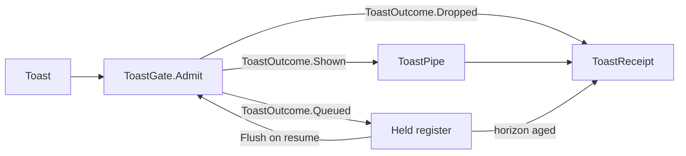

# [APPUI_DIALOGS_NOTIFICATIONS]

Rasm.AppUi presents every modal and transient surface through one `DialogIntent` union resolved over a per-root ReactiveUI `Interaction` seam into DialogHost sessions: six intent cases return `Fin`-railed typed results with dismissal as a value, six `DialogTopology` rows bind one session root per admitted surface with one `TopLevelResolver` delegate carrying the per-surface service capsule both the toast and pick pipes resolve over, four `ToastRow` rows pass one suppression fold over `RuntimePhase` and `DegradationLevel` before presentation, and three `PickKind` rows route format-derived filters through host-agnostic pick pipes. The page owns the intent vocabulary, the session algebra, the notification policy with its queued-then-dropped receipts, and the picker and host-modality law over DialogHost.Avalonia, ReactiveUI, Avalonia, Thinktecture-generated vocabulary, LanguageExt rails, and NodaTime instants.

## [01]-[INDEX]

- [01]-[DIALOG_INTENTS]: One modal vocabulary; typed `Fin` results; dismissal is a value.
- [02]-[SESSION_ALGEBRA]: Topology rows bind sessions, stacking, styling, registration.
- [03]-[NOTIFICATIONS]: Toast rows, suppression fold over phase and level, receipts.
- [04]-[PICKERS_HOST_MODALITY]: Pick rows, format-derived filters, host modality law.

## [02]-[DIALOG_INTENTS]

- Owner: `DialogIntent` `[Union]` — the one modal vocabulary across every admitted surface; `DialogAsk<TResult>` — the case-minted question value binding each intent to its one result shape; `DialogFault` the typed fault family on the `AppUiFaultBand.Dialog` registry row (6040).
- Cases: Confirm → `Unit`, Form → template commit record, Pick → `Seq<string>`, Progress → `DeadlineOutcome`, Error → `Unit`, About → `Unit`; each case mints its own `DialogAsk<TResult>` through its `Ask` member, so a mismatched intent-result pairing is unrepresentable at the call site — the caller never selects `TResult`, the case does; dismissal projects `Option<TResult>.None`; `DialogFault` = Text | ResultShape | PickerUnavailable | SessionOccupied | TemplateMissing, with `ResultShape` surviving only as the boundary re-typing guard on the erased DialogHost close parameter, never a caller-reachable outcome.
- Auto: the screen fault fold raises the Error case with its correlation — never per-control failure handling; the boot crash-restore offer rides one Confirm row; the conflict-resolution inspector registers as one Form content row.
- Packages: Thinktecture.Runtime.Extensions, ReactiveUI, LanguageExt.Core, Rasm.AppHost (project)
- Growth: one `DialogIntent` case carrying its own `Ask` mint, or one Form content row resolved through `IViewFor` registration; zero new surface.
- Boundary: Progress content binds the Compute progress stream selected by `Correlation`, and a deadline miss renders the typed `DeadlineOutcome` — never a spinner timeout; the `Form.TemplateKey` resolves through the topology `ContentTemplate` resolver onto the host `DialogContentTemplate` at registration so a Form session selects its content template by key from one resolver and a per-Form template literal in registration code is the deleted form; About renders the `ReleaseIdentity` record as given.

```csharp signature
// The case-minted question: TResult binds at the case, never at the Show call site, so the result
// shape travels WITH the intent and a wrong-typed request is a compile failure, not a ResultShape fault.
public readonly record struct DialogAsk<TResult>(DialogIntent Intent) where TResult : notnull;

[Union(ConversionFromValue = ConversionOperatorsGeneration.None)]
public abstract partial record DialogIntent {
    private DialogIntent() { }

    public sealed record Confirm(string Title, string Body, string AffirmKey, string DismissKey) : DialogIntent {
        public DialogAsk<Unit> Ask => new(this);
    }

    public sealed record Form(string TemplateKey, IReactiveObject Content) : DialogIntent {
        // The commit-record shape is the CONTENT's shape: the mint demands the evidence, so a Form
        // asked at a type its content does not carry is None at the mint, never a runtime fault.
        public Option<DialogAsk<TCommit>> Ask<TCommit>() where TCommit : class, IReactiveObject =>
            Content is TCommit ? Some(new DialogAsk<TCommit>(this)) : None;
    }

    public sealed record Pick(PickKind Kind, PickCardinality Cardinality, Seq<PickFilter> Filters, Option<string> SuggestedName = default) : DialogIntent {
        public DialogAsk<Seq<string>> Ask => new(this);
    }

    public sealed record Progress(string Title, CorrelationId Correlation, DeadlineClass Deadline) : DialogIntent {
        public DialogAsk<DeadlineOutcome> Ask => new(this);
    }

    public sealed record Error(LanguageExt.Common.Error Fault, CorrelationId Correlation) : DialogIntent {
        public DialogAsk<Unit> Ask => new(this);
    }

    public sealed record About(ReleaseIdentity Identity) : DialogIntent {
        public DialogAsk<Unit> Ask => new(this);
    }
}

[SmartEnum<string>]
public sealed partial class PickCardinality {
    public static readonly PickCardinality One = new("one");
    public static readonly PickCardinality Many = new("many");
}

[Union]
public abstract partial record DialogFault : Expected, IValidationError<DialogFault> {
    private DialogFault(string detail, int code) : base(detail, code, None) { }

    public static DialogFault Create(string message) => new Text(message);

    public sealed record Text : DialogFault { public Text(string detail) : base(detail, AppUiFaultBand.Dialog.Code(0)) { } }
    public sealed record ResultShape : DialogFault { public ResultShape(string expected, string actual) : base($"{expected}:{actual}", AppUiFaultBand.Dialog.Code(1)) { } }
    public sealed record PickerUnavailable : DialogFault { public PickerUnavailable(string surface) : base(surface, AppUiFaultBand.Dialog.Code(2)) { } }
    public sealed record SessionOccupied : DialogFault { public SessionOccupied(string surface) : base(surface, AppUiFaultBand.Dialog.Code(3)) { } }
    public sealed record TemplateMissing : DialogFault { public TemplateMissing(string key) : base(key, AppUiFaultBand.Dialog.Code(4)) { } }
    public sealed record PolicyRejected : DialogFault { public PolicyRejected(string detail) : base(detail, AppUiFaultBand.Dialog.Code(5)) { } }
}
```

## [03]-[SESSION_ALGEBRA]

- Owner: `DialogTopology` — one per-surface root row binding identifier, stacking, close policy, styling token keys, toast pipe, pick pipe, and its `Interaction` seam; `DialogSurface` extension fold over the row.
- Cases: six topology rows — avalonia-desktop, rhino-panel, rhino-modal, gh2-companion, sidecar-shell, headless; the web-browser case carries zero rows.
- Entry: `public Eff<Option<TResult>> Show<TResult>(DialogAsk<TResult> ask)` — the question arrives case-minted, so `TResult` is the intent's own result shape; `Eff` owns the typed failure channel and `Option` carries dismissal as a value. `Show` reserves the non-stacked row atomically before forwarding and releases the reservation when the session terminates, so simultaneous asks cannot cross a read-then-open race.
- Auto: `RegisterRoot` binds the row's handler at surface mount and disposes with the activation scope; composition projects each row onto `Identifier`, `IsMultipleDialogsEnabled`, `CloseOnClickAway`, `OverlayBackground`, `BlurBackground`, `PopupPositioner`, and `DialogHostStyle` `CornerRadius`; the Form arm wraps its content through `Templated`, resolving the `Form.TemplateKey` against the `ContentTemplate` resolver onto the host `DialogContentTemplate`; a dirty Form session arms `DialogClosingEventArgs` `Cancel` through `DialogClosingCallback`; `StackedSessions` drives `IsMultipleDialogsEnabled`, `DialogHost.CurrentSessions` is the stacked-session surface the `Retreat` veto consults, and `HasOpenSession` reads `IsDialogOpen` — the `Show` gate consults both so the non-stacking policy is executed row-owned at the one entry, never re-checked at a call site.
- Packages: DialogHost.Avalonia, ReactiveUI, Avalonia, LanguageExt.Core
- Growth: one topology row admits a new surface root, one positioner row swaps `IDialogPopupPositioner`; zero new surface.
- Boundary: `DialogSurface` is the named boundary capsule — the registration handler and pick route carry the erased close parameter the DialogHost seam owns, and `Project` re-types it onto the `Fin` rail; overlay, blur, and corner styling resolve through theme token keys, never local literals; `TopLevelResolver` is the single per-surface service-capsule delegate the `ToastPipe` and `PickPipe` bind over so a desktop row resolves the window capsule and an embedded row resolves the embedded-root capsule — host service-capsule resolution inside the embedded root is the deleted call site, replaced by the bound delegate, and the embedded resolution spelling stays research-gated; one headless smoke spec opens, stacks, and closes sessions per row.

```csharp signature
public sealed record DialogTopology(
    string SurfaceKey,
    string Identifier,
    bool StackedSessions,
    bool CloseOnClickAway,
    bool BlurBackground,
    string OverlayToken,
    string CornerToken,
    IDialogPopupPositioner Positioner,
    Func<Option<TopLevel>> TopLevelResolver,
    Func<string, Option<IDataTemplate>> ContentTemplate,
    Func<DialogIntent.Form, DialogClosingEventHandler> Closing,
    Func<ToastRow, string, string, Option<string>, IO<Unit>> ToastPipe,
    Option<Func<DialogIntent.Pick, Task<Seq<string>>>> PickPipe) {
    public Interaction<DialogIntent, object?> Requests { get; } = new();

    // The held-note register: a Queued toast parks WHOLE — payload, severity, intent key, stamps —
    // so the resume flush re-presents the presentable note, never a receipt husk.
    public Atom<Seq<QueuedToast>> Held { get; } = Atom(Seq<QueuedToast>());

    public Atom<bool> Occupied { get; } = Atom(false);

    public bool HasOpenSession => DialogHost.IsDialogOpen(Identifier);
}

public static class DialogSurface {
    extension(DialogTopology root) {
        public Eff<Option<TResult>> Show<TResult>(DialogAsk<TResult> ask) where TResult : notnull =>
            Eff.lift(async () => await Request(root, ask).ConfigureAwait(true))
                .Bind(static result => result.ToEff());

        public IO<Unit> Advance(DialogIntent.Progress snapshot) =>
            IO.lift(() => Optional(DialogHost.GetDialogSession(root.Identifier)).Iter(session => session.UpdateContent(snapshot)));

        public IO<Unit> Retreat() => IO.lift(fun(() => DialogHost.Pop(root.Identifier)));

        public IO<Unit> Dismiss() => IO.lift(fun(() => DialogHost.Close(root.Identifier)));

        public IDisposable RegisterRoot() =>
            root.Requests.RegisterHandler(async context =>
                context.SetOutput(await context.Input.Switch(
                    state: root,
                    confirm: static (state, request) => DialogHost.Show(request, state.Identifier),
                    form: static (state, request) => state.RouteForm(request),
                    pick: static (state, request) => state.RoutePick(request),
                    progress: static (state, request) => DialogHost.Show(request, state.Identifier),
                    error: static (state, request) => DialogHost.Show(request, state.Identifier),
                    about: static (state, request) => DialogHost.Show(request, state.Identifier)).ConfigureAwait(true)));

        // Cardinality is admission, not decoration: a One request returning multiple paths is a picker
        // transport defect sealed as a typed fault, never a silently multi-valued single pick.
        internal async Task<object?> RoutePick(DialogIntent.Pick request) =>
            root.PickPipe is { IsSome: true, Case: Func<DialogIntent.Pick, Task<Seq<string>>> route }
                ? await route(request).ConfigureAwait(true) switch {
                    { IsEmpty: true } => null,
                    var paths when request.Cardinality == PickCardinality.One && paths.Length > 1 =>
                        new DialogFault.PolicyRejected($"pick-cardinality:{request.Cardinality.Key}:{paths.Length}"),
                    var paths => (object?)paths,
                }
                : new DialogFault.PickerUnavailable(root.SurfaceKey);

        internal Task<object?> RouteForm(DialogIntent.Form request) =>
            Templated(request).Match(
                Succ: content => DialogHost.Show(content, root.Identifier, null, root.Closing(request)),
                Fail: fault => Task.FromResult<object?>(fault));

        internal Fin<object> Templated(DialogIntent.Form request) =>
            root.ContentTemplate(request.TemplateKey)
                .Map<object>(template => new ContentControl { Content = request.Content, ContentTemplate = template })
                .ToFin(new DialogFault.TemplateMissing(request.TemplateKey));
    }

    private static Fin<Option<TResult>> Project<TResult>(object? closing) where TResult : notnull =>
        closing switch {
            null => FinSucc(Option<TResult>.None),
            TResult value => FinSucc(Some(value)),
            DialogFault fault => FinFail<Option<TResult>>(fault),
            var other => FinFail<Option<TResult>>(new DialogFault.ResultShape(typeof(TResult).Name, other.GetType().Name)),
        };

    private static async Task<Fin<Option<TResult>>> Request<TResult>(DialogTopology root, DialogAsk<TResult> ask) where TResult : notnull {
        bool admitted = root.StackedSessions;
        ignore(root.Occupied.Swap(occupied => root.StackedSessions
            ? occupied
            : occupied || root.HasOpenSession
                ? true
                : (admitted = true)));

        if (!admitted) {
            return FinFail<Option<TResult>>(new DialogFault.SessionOccupied(root.SurfaceKey));
        }

        try {
            return Project<TResult>(await root.Requests.Handle(ask.Intent).ConfigureAwait(true));
        } finally {
            if (!root.StackedSessions) {
                ignore(root.Occupied.Swap(static _ => false));
            }
        }
    }
}
```

`TOAST_PIPE` cells name the root the row's notification manager binds over; `PICK_PIPE` cells name the row's storage-provider route:

| [INDEX] | [SURFACE]        | [IDENTIFIER]       | [STACKED] | [CLICK_AWAY] | [BLUR] | [TOAST_PIPE]      | [PICK_PIPE]               |
| :-----: | :--------------- | :----------------- | :-------: | :----------: | :----: | :---------------- | :------------------------ |
|  [01]   | avalonia-desktop | desktop-root       |   true    |     true     |  true  | window root       | storage provider          |
|  [02]   | rhino-panel      | rhino-panel-root   |   false   |    false     | false  | embedded root     | embedded storage provider |
|  [03]   | rhino-modal      | rhino-modal-root   |   false   |    false     | false  | embedded root     | embedded storage provider |
|  [04]   | gh2-companion    | gh2-companion-root |   true    |     true     | false  | companion window  | storage provider          |
|  [05]   | sidecar-shell    | sidecar-root       |   true    |     true     |  true  | sidecar window    | storage provider          |
|  [06]   | headless         | headless-root      |   true    |    false     | false  | receipt-only sink | none — typed fault        |

## [04]-[NOTIFICATIONS]

- Owner: `ToastRow` linger rows, `ToastOutcome` outcome rows, the `ToastGate` suppression fold, and `ToastReceipt`, under the shipped `ComparerAccessors.StringOrdinal` accessor.
- Cases: Info 4s | Success 4s | Warning 6s | Error sticky, where `Sticky` derives from zero linger; outcomes shown | queued | dropped.
- Entry: `public IO<ToastReceipt> Toast(ToastRow row, string title, string body, RuntimePhase phase, DegradationState degradation, Instant at, CorrelationId correlation, Option<string> intentKey = default)` — `IO` carries the presentation effect, and the receipt is total over outcomes; `public IO<Fin<Seq<ToastReceipt>>> Flush(RuntimePhase phase, DegradationState degradation, Instant at, Duration horizon)` — the resume drain validates the motion-owned horizon and returns one terminal receipt per held note.
- Auto: composition binds `ToastPipe` per topology row; a toast action raises its command intent by key through the one intent table; a `Queued` outcome parks the whole presentable note in the row's `Held` register, and the one `PhaseSubscription` observing the support-capture resume drives `Flush` — a still-queued phase leaves the register untouched and emits no duplicate receipt, while a presentable or terminal phase atomically drains notes in arrival order through the same gate; entries past the flush horizon age out as `Dropped`, and every queued admission later produces one terminal shown-or-dropped receipt with the same correlation.
- Receipt: `ToastReceipt` — row, surface, outcome, intent key, `Instant`, correlation — sinks through the `ReceiptSinkPort` envelope and projects its outcome and surface to the notification-presentation metric on the AppHost telemetry spine through the `TelemetryContributorPort`; the receipt stream absorbs the audit need and no notification-history store exists.
- Packages: Avalonia, Thinktecture.Runtime.Extensions, LanguageExt.Core, NodaTime, Rasm.AppHost (project)
- Growth: one `ToastRow` row or one `ToastOutcome` case; zero new surface.
- Boundary: enter/exit timing and reduced-motion pairs arrive from the motion vocabulary — linger and suppression are the only timing facts owned here; `ToastPipe` binds one `WindowNotificationManager` constructed over the surface `TopLevel`, whose `Show(object, NotificationType, TimeSpan?, ...)` overload carries the row's severity as the `NotificationType` case and the linger as the expiration; native Rhino toasts and status panes stay host-owned; `Suspended` drops every note because retained capabilities exclude presentation.

```csharp signature

[SmartEnum<string>]
[KeyMemberEqualityComparer<ComparerAccessors.StringOrdinal, string>]
[KeyMemberComparer<ComparerAccessors.StringOrdinal, string>]
public sealed partial class ToastRow {
    public static readonly ToastRow Info = new("info", linger: Duration.FromSeconds(4));
    public static readonly ToastRow Success = new("success", linger: Duration.FromSeconds(4));
    public static readonly ToastRow Warning = new("warning", linger: Duration.FromSeconds(6));
    public static readonly ToastRow Error = new("error", linger: Duration.Zero);

    public Duration Linger { get; }
    public bool Sticky => Linger == Duration.Zero;
}

[SmartEnum<string>]
[KeyMemberEqualityComparer<ComparerAccessors.StringOrdinal, string>]
[KeyMemberComparer<ComparerAccessors.StringOrdinal, string>]
public sealed partial class ToastOutcome {
    public static readonly ToastOutcome Shown = new("shown");
    public static readonly ToastOutcome Queued = new("queued");
    public static readonly ToastOutcome Dropped = new("dropped");
}

public readonly record struct ToastReceipt(ToastRow Row, string Surface, ToastOutcome Outcome, Option<string> IntentKey, Instant At, CorrelationId Correlation);

public readonly record struct QueuedToast(ToastRow Row, string Title, string Body, Option<string> IntentKey, Instant At, CorrelationId Correlation);

public static class ToastGate {
    public static ToastOutcome Admit(RuntimePhase phase, DegradationLevel level) =>
        (Terminal: phase == RuntimePhase.Draining || phase == RuntimePhase.Unloaded || phase == RuntimePhase.Faulted || level == DegradationLevel.Suspended,
         Paused: phase == RuntimePhase.SupportCapture) switch {
            { Terminal: true } => ToastOutcome.Dropped,
            { Paused: true } => ToastOutcome.Queued,
            _ => ToastOutcome.Shown,
        };

    extension(DialogTopology root) {
        public IO<ToastReceipt> Toast(ToastRow row, string title, string body, RuntimePhase phase, DegradationState degradation, Instant at, CorrelationId correlation, Option<string> intentKey = default) =>
            ToastGate.Admit(phase, degradation.Level) switch {
                var outcome when outcome == ToastOutcome.Shown =>
                    root.ToastPipe(row, title, body, intentKey).Map(_ => new ToastReceipt(row, root.SurfaceKey, ToastOutcome.Shown, intentKey, at, correlation)),
                var outcome when outcome == ToastOutcome.Queued =>
                    IO.lift(() => (root.Held.Swap(held => held.Add(new QueuedToast(row, title, body, intentKey, at, correlation))),
                        new ToastReceipt(row, root.SurfaceKey, ToastOutcome.Queued, intentKey, at, correlation)).Item2),
                var outcome => IO.pure(new ToastReceipt(row, root.SurfaceKey, outcome, intentKey, at, correlation)),
            };

        // The resume flush: held notes drain in arrival order back through the SAME gate — a live
        // phase presents them, a still-terminal phase drops them — and entries past the horizon age
        // out as Dropped receipts, so every queued note terminates in exactly one receipt.
        public IO<Fin<Seq<ToastReceipt>>> Flush(RuntimePhase phase, DegradationState degradation, Instant at, Duration horizon) =>
            horizon < Duration.Zero
                ? IO.pure(FinFail<Seq<ToastReceipt>>(new DialogFault.PolicyRejected($"toast-horizon:{horizon}")))
                : ToastGate.Admit(phase, degradation.Level) == ToastOutcome.Queued
                    ? IO.pure(FinSucc(Seq<ToastReceipt>()))
                : IO.lift(() => {
                Seq<QueuedToast> taken = default;
                ignore(root.Held.Swap(held => (taken = held, Seq<QueuedToast>()).Item2));
                return taken;
            })
            .Bind(taken => taken
                .TraverseM(note => at - note.At <= horizon
                    ? root.Toast(note.Row, note.Title, note.Body, phase, degradation, at, note.Correlation, note.IntentKey)
                    : IO.pure(new ToastReceipt(note.Row, root.SurfaceKey, ToastOutcome.Dropped, note.IntentKey, at, note.Correlation)))
                .As()
                .Map(static receipts => FinSucc(receipts.Strict()));
    }
}
```



## [05]-[PICKERS_HOST_MODALITY]

- Owner: `PickKind` rows, the `PickFilter` projection, and the `PickOps` fold from port-projected format tuples.
- Cases: open | save | folder.
- Entry: `public static Seq<PickFilter> Filters(Seq<(string Key, Seq<string> Extensions)> formats)` — pure projection; one filter row per format tuple.
- Packages: Thinktecture.Runtime.Extensions, LanguageExt.Core, BCL inbox
- Growth: one `PickKind` row or one format tuple from the host vocabulary; zero new surface.
- Boundary: the host `FileFormat` vocabulary crosses `HostAttachPort` as key-plus-extension tuples — the type never enters this package; host-native modal flows (document file IO, command prompts, semi-modal panels) stay host-owned at the app root and AppUi raises only the intent through the abstract surface-host port; `PickPipe` rows bind the storage route resolved through the topology `TopLevelResolver` per surface — the pick route discriminates on the `PickKind` row with `PickFilter` rows projecting into the storage picker filter patterns — and the headless row holds `None` storage and folds to `DialogFault.PickerUnavailable`; the selected `PickCardinality` gates the picker result at the one `RoutePick` admission — a `One` request returning multiple paths seals `DialogFault.PolicyRejected`, so every picker transport converges on the same cardinality law; the anchored picker and confirm popups ride the `AlignmentDialogPopupPositioner` row swapped onto the topology `Positioner` field, the centered surfaces ride the centered positioner, and the embedded-root storage-provider resolution spelling stays research-gated.

```csharp signature
[SmartEnum<string>]
[KeyMemberEqualityComparer<ComparerAccessors.StringOrdinal, string>]
[KeyMemberComparer<ComparerAccessors.StringOrdinal, string>]
public sealed partial class PickKind {
    public static readonly PickKind Open = new("open");
    public static readonly PickKind Save = new("save");
    public static readonly PickKind Folder = new("folder");
}

public readonly record struct PickFilter(string Label, Seq<string> Patterns);

public static class PickOps {
    public static Seq<PickFilter> Filters(Seq<(string Key, Seq<string> Extensions)> formats) =>
        formats.Map(static format => new PickFilter(format.Key, format.Extensions.Map(static extension => $"*.{extension}")));
}
```

## [06]-[RESEARCH]

- [EMBEDDED_TOPLEVEL]: the embedded-root service-capsule spelling the `TopLevelResolver` returns inside the rhino-panel root — the notification-manager construction surface and the storage-provider resolution across the embedded `TopLevel`, both uncatalogued for the embedded host and bound at the embed-capsule spike.
