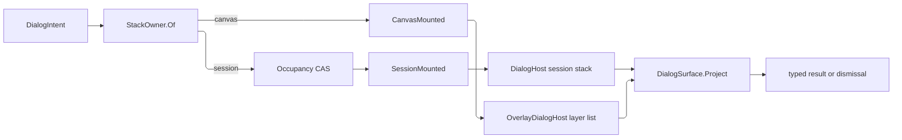
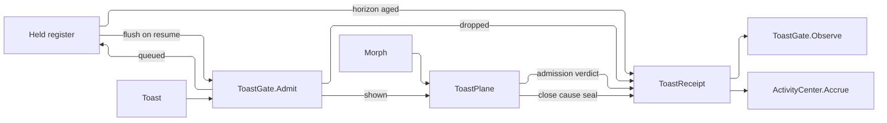

# [APPUI_DIALOGS_NOTIFICATIONS]

Rasm.AppUi presents every modal, transient, and persistent surface through one `DialogIntent` union resolved over a per-root ReactiveUI `Interaction` seam onto TWO stack owners: eight intent cases return `Fin`-railed typed results with dismissal as a value, `StackOwner` binds each case to the DialogHost session stack or the Ursa overlay canvas by modality class, one `DialogTopology` derives from the host and mount axes so a new host is zero topology edits, `ChromeColumns` resolve scrim, corner, ring, and blur from the landed depth and material tiers, five `ToastRow` rows carry severity, linger, and quiet-hours piercing through one suppression fold before presentation and seal their close cause on the way out, an inline banner family materializes as a control arm for conditions a transient note cannot carry, an activity center projects the receipt stream into a windowed inbox, and three `PickKind` rows route format-derived filters through host-agnostic pick pipes. The page owns the intent vocabulary, the two-stack seam law, the topology derivation, the chrome columns, the notification policy with its morph, ceiling, and quiet-hours rules, the activity plane, and the picker and host-modality law over DialogHost.Avalonia, Irihi.Ursa, ReactiveUI, Avalonia, Thinktecture-generated vocabulary, LanguageExt rails, and NodaTime instants.

Both stacks are reached ONLY through a mount-bound presence fact, because both registries answer an absent host dishonestly: the DialogHost static surface resolves its instance by identifier and THROWS on no loaded host, no match, and multiple matches, while the Ursa overlay registry is internal and answers an unregistered id with a silent no-op on the void shapes and `DialogResult.None` on the awaited ones — a value indistinguishable from a user cancel. The presence fact is therefore the first admission of every stack crossing, exactly as the picker's window fact is the first admission of every pick.

## [01]-[INDEX]

- [02]-[DIALOG_INTENTS]: One modal vocabulary; typed `Fin` results; the confirm friction ladder; dismissal is a value.
- [03]-[SESSION_ALGEBRA]: Two stack owners with the seam law; topology derived over the host and mount axes.
- [04]-[DIALOG_CHROME]: Scrim, corner, ring, and blur columns over the depth and material tiers; the retreat veto fold.
- [05]-[NOTIFICATIONS]: Toast rows, the pending morph, the suppression fold, the presentation plane, and the banner family.
- [06]-[ACTIVITY_CENTER]: The windowed inbox over the receipt stream, its accrual rule, and quiet hours.
- [07]-[PICKERS_HOST_MODALITY]: Pick rows, capability gate, format-derived filters, host modality law.

## [02]-[DIALOG_INTENTS]

- Owner: `DialogIntent` `[Union]` — the one modal vocabulary across every admitted surface; `DialogAsk<TResult>` — the case-minted question value binding each intent to its one result shape; `ConfirmFriction` `[Union]` — the destructive-friction ladder; `TypedConfirmCell` — the verification-phrase content; `DialogFault` the typed fault family on the `AppUiFaultBand.Dialog` registry row (6040).
- Cases: Confirm → `Unit`, Form → template commit record, Pick → `Seq<string>`, Progress → `DeadlineOutcome`, Error → `Unit`, About → `Unit`, Peek → `Unit`, Drawer → `Unit`, Palette → `Unit`, Editor → `Unit`; each case mints its own `DialogAsk<TResult>` through its `Ask` member, so a mismatched intent-result pairing is unrepresentable at the call site — the caller never selects `TResult`, the case does; dismissal projects `Option<TResult>.None`; `ConfirmFriction` = Acknowledge | Typed | Inline; `DialogFault` = Text | ResultShape | PickerUnavailable | SessionOccupied | TemplateMissing | PolicyRejected | HostUnregistered | RetreatVetoed | SessionAbsent | CorrelationUnknown.
- Law: friction is a COLUMN on the confirm case, never three confirm names — an acknowledgement, a typed destructive gate, and an inline pop-confirm are one intent under three rows, so every caller raises one verb and the ladder decides how much the operator must do to clear it.
- Auto: the screen fault fold raises the Error case with its correlation — never per-control failure handling; the boot crash-restore offer rides one Confirm row under `Acknowledge`; the conflict-resolution inspector registers as one Form content row; a destructive verb whose target carries an identifier raises Confirm under `Typed(target)`.
- Packages: Thinktecture.Runtime.Extensions, ReactiveUI, LanguageExt.Core, Irihi.Ursa, Avalonia, Rasm.AppHost (project)
- Growth: one `DialogIntent` case carrying its own `Ask` mint and its `StackOwner` arm, one `ConfirmFriction` row, or one Form content row resolved through `IViewFor` registration; zero new surface.
- Boundary: Progress content binds the progress stream selected by `Correlation` and is PRODUCER-AGNOSTIC — a Compute lane and a synchronous kernel fold publish onto the same correlation-selected cell, the kernel through the `IProgress<double>` sink its own governance band carries (`ArrangementPolicy.Governed`), so a long boolean and a remote solve render through one intent with no second progress vocabulary and no case added here; a deadline miss renders the typed `DeadlineOutcome` — never a spinner timeout; the `Form`, `Peek`, `Palette`, and `Editor` template keys resolve through the topology `ContentTemplate` resolver onto the host `DialogContentTemplate` at registration so a content session selects its template by key from one resolver and a per-case template literal in registration code is the deleted form; About renders the `ReleaseIdentity` record as given. `DialogFault.ResultShape` IS caller-reachable: the DialogHost close parameter is erased to `object?`, so a content template that closes its session with a parameter whose runtime type is neither `TResult` nor `DialogFault` re-types into this fault at `DialogSurface.Project` and travels out on the `Fin` rail into `Show` — it names a session whose close contract disagrees with the case that minted the ask, which is a registration defect the caller is the only surface positioned to report. The `Typed` row compares ORDINAL and exact: no trim, no case folding, no culture — a destructive gate that normalizes accepts a phrase the operator never typed, and the whole point of the row is that the operator typed it. The `Inline` row drives an ALREADY-MOUNTED `PopConfirm` the verb's trigger wears in its own screen tree — the row carries the mounted anchor and nothing else, because trigger mode and placement are that control's own styled properties and a duplicate column beside them would let the two disagree; re-parenting a live trigger into a freshly constructed pop-confirm is the deleted form, since the wrapper is a content control and the surgery would detach the very element the gesture is in flight over.

```csharp signature
// --- [TYPES] ----------------------------------------------------------------------------

// The case-minted question: TResult binds at the case, never at the Show call site, so the result
// shape travels WITH the intent and a wrong-typed request is a compile failure, not a ResultShape fault.
public readonly record struct DialogAsk<TResult>(DialogIntent Intent) where TResult : notnull;

// The friction ladder as data. Acknowledge is one affirmative; Typed gates the affirmative on the target's
// own identifier; Inline never opens a session at all — it drives the pop-confirm the trigger already wears,
// so the lightest tier costs no stack crossing and the heaviest costs a typed phrase.
[Union(ConversionFromValue = ConversionOperatorsGeneration.None)]
public abstract partial record ConfirmFriction {
    private ConfirmFriction() { }

    public sealed record Acknowledge : ConfirmFriction;
    public sealed record Typed(string Target) : ConfirmFriction;
    public sealed record Inline(PopConfirm Anchor) : ConfirmFriction;
}

[Union(ConversionFromValue = ConversionOperatorsGeneration.None)]
public abstract partial record DialogIntent {
    private DialogIntent() { }

    public sealed record Confirm(string Title, string Body, string AffirmKey, string DismissKey, ConfirmFriction Friction) : DialogIntent {
        public DialogAsk<Unit> Ask => new(this);
    }

    public sealed record Form(string TemplateKey, IReactiveObject Content) : DialogIntent {
        // The commit-record shape is the CONTENT's shape: the mint demands the evidence, so a Form
        // asked at a type its content does not carry is None at the mint, never a runtime fault.
        public Option<DialogAsk<TCommit>> Ask<TCommit>() where TCommit : class, IReactiveObject =>
            Content is TCommit ? Some(new DialogAsk<TCommit>(this)) : None;
    }

    public sealed record Pick(PickKind Kind, PickCardinality Cardinality, Seq<PickFilter> Filters, Option<string> SuggestedName = default) : DialogIntent {
        public DialogAsk<Seq<string>> Ask => new(this);
    }

    public sealed record Progress(string Title, CorrelationId Correlation, DeadlineClass Deadline) : DialogIntent {
        public DialogAsk<DeadlineOutcome> Ask => new(this);
    }

    public sealed record Error(LanguageExt.Common.Error Fault, CorrelationId Correlation) : DialogIntent {
        public DialogAsk<Unit> Ask => new(this);
    }

    public sealed record About(ReleaseIdentity Identity) : DialogIntent {
        public DialogAsk<Unit> Ask => new(this);
    }

    // The routing counterpart: a peek is a non-deciding preview of a route the router raises beside the
    // current screen rather than instead of it, so it seats on the canvas stack and carries the route key
    // the shell's own history reads back.
    public sealed record Peek(string RouteKey, string TemplateKey, IReactiveObject Content) : DialogIntent {
        public DialogAsk<Unit> Ask => new(this);
    }

    public sealed record Drawer(string TemplateKey, IReactiveObject Content, Position Edge) : DialogIntent {
        public DialogAsk<Unit> Ask => new(this);
    }

    // The command palette: a co-resident, light-dismissable, non-modal layer over whatever the canvas
    // already holds, so it opens above a peek and a drawer without displacing either. It carries no result
    // because the surface's own answer is a sealed `CommandReceipt` on the evidence stream, not a close
    // parameter — a palette that returned its chosen verb would make the receipt the second answer.
    public sealed record Palette(string TemplateKey, IReactiveObject Content) : DialogIntent {
        public DialogAsk<Unit> Ask => new(this);
    }

    // The full-surface editor: settings, shortcuts, and every other whole-canvas editing face. It is a
    // MODALITY of this stack rather than a topology of its own, so it takes the canvas bound the host
    // already gives every layer and inherits that layer's registration, chrome, and teardown.
    public sealed record Editor(string TemplateKey, IReactiveObject Content) : DialogIntent {
        public DialogAsk<Unit> Ask => new(this);
    }
}

[SmartEnum<string>]
public sealed partial class PickCardinality {
    public static readonly PickCardinality One = new("one");
    public static readonly PickCardinality Many = new("many");
}

// --- [ERRORS] ---------------------------------------------------------------------------

[Union]
public abstract partial record DialogFault : Expected, IValidationError<DialogFault> {
    private DialogFault(string detail, int code) : base(detail, code, None) { }

    public static DialogFault Create(string message) => new Text(message);

    public sealed record Text : DialogFault { public Text(string detail) : base(detail, AppUiFaultBand.Dialog.Code(0)) { } }
    public sealed record ResultShape : DialogFault { public ResultShape(string expected, string actual) : base($"{expected}:{actual}", AppUiFaultBand.Dialog.Code(1)) { } }
    public sealed record PickerUnavailable : DialogFault { public PickerUnavailable(string surface) : base(surface, AppUiFaultBand.Dialog.Code(2)) { } }
    public sealed record SessionOccupied : DialogFault { public SessionOccupied(string surface) : base(surface, AppUiFaultBand.Dialog.Code(3)) { } }
    public sealed record TemplateMissing : DialogFault { public TemplateMissing(string key) : base(key, AppUiFaultBand.Dialog.Code(4)) { } }
    public sealed record PolicyRejected : DialogFault { public PolicyRejected(string detail) : base(detail, AppUiFaultBand.Dialog.Code(5)) { } }
    public sealed record HostUnregistered : DialogFault { public HostUnregistered(string detail) : base(detail, AppUiFaultBand.Dialog.Code(6)) { } }
    public sealed record RetreatVetoed : DialogFault { public RetreatVetoed(string detail) : base(detail, AppUiFaultBand.Dialog.Code(7)) { } }
    public sealed record SessionAbsent : DialogFault { public SessionAbsent(string surface) : base(surface, AppUiFaultBand.Dialog.Code(8)) { } }
    public sealed record CorrelationUnknown : DialogFault { public CorrelationUnknown(string detail) : base(detail, AppUiFaultBand.Dialog.Code(9)) { } }
}

// --- [MODELS] ---------------------------------------------------------------------------

// The typed destructive gate. `Armed` is the ONE admission and it is an ordinal exact match, so the affirm
// command's canExecute and any visual disabled state read one predicate; a second boolean beside it would let
// a stale visual admit a phrase the comparison rejects.
public sealed class TypedConfirmCell : ReactiveObject {
    private string phrase = string.Empty;

    public TypedConfirmCell(DialogIntent.Confirm intent, string target, string identifier) {
        Intent = intent;
        Target = target;
        Affirm = ReactiveCommand.Create(
            () => DialogHost.Close(identifier, unit),
            this.WhenAnyValue(cell => cell.Armed));
        Dismiss = ReactiveCommand.Create(() => DialogHost.Close(identifier, null));
    }

    public DialogIntent.Confirm Intent { get; }

    public string Target { get; }

    public string Phrase {
        get => phrase;
        set => this.RaiseAndSetIfChanged(ref phrase, value);
    }

    public bool Armed => string.Equals(Phrase, Target, StringComparison.Ordinal);

    public ReactiveCommand<Unit, Unit> Affirm { get; }

    public ReactiveCommand<Unit, Unit> Dismiss { get; }
}
```

## [03]-[SESSION_ALGEBRA]

- Owner: `StackOwner` `[SmartEnum<string>]` — the modality-to-stack projection, total over the intent family; `OverlayShape` — the canvas-stack modality rows with their dispatch columns; `MountPolicy` — the per-mount capability columns the topology projects; `DialogTopology` — the derived per-surface root row; `DialogSeam` — the mount-bound delegate columns; `DialogSurface` — the extension fold over the row.
- Cases: `StackOwner` = session | canvas; `OverlayShape` = palette | peek | drawer | editor, each carrying its depth tier, material tier, motion plan, modal contribution, dismissibility, full-surface posture, and vertical anchor.
- Entry: `public Eff<Option<TResult>> Show<TResult>(DialogAsk<TResult> ask)` — the question arrives case-minted, so `TResult` is the intent's own result shape; `Eff` owns the typed failure channel and `Option` carries dismissal as a value; `public static Fin<DialogTopology> Derive(ConsumptionProfile profile, SurfaceMount mount, DialogSeam seam)` — the one topology projection over the host and mount axes.
- Law: the SESSION stack owns every DECIDING modality — Confirm, Form, Progress, Error, About — and the CANVAS stack owns every CO-RESIDENT one — palette, peek, drawer, full-surface editor. The split is the result handle, not the visual: a deciding surface's answer is the awaited close parameter of ONE root, so two open decisions leave the root's answer ambiguous and the CAS reservation is what forecloses it. The canvas holds an ORDERED LAYER LIST instead of a cell — each layer carries its own mask, its own modal contribution, and its own awaited task — so two open layers have two distinct handles and neither is ambiguous. Single-occupancy therefore does not govern the canvas: imposing it would refuse exactly the co-residency the canvas exists to provide, which is a palette over a drawer over a peek.
- Law: the drawer's ONE owner is `OverlayDrawer`. The suite's `Drawer` type is obsolete and forwards every member to it verbatim, so the two candidate mechanisms are one mechanism and a forwarder, and binding the forwarder buys a deprecation with no capability in it.
- Auto: registration is the framework's, never a call — the derived `CanvasId` is stamped on the mounted `OverlayDialogHost.HostId` BEFORE attach, the host registers itself under `(HostId, TopLevel hash)` at `OnAttachedToVisualTree`, and `OnDetachedFromVisualTree` closes every open layer and unregisters under the CURRENT id; the session root binds its handler at surface mount through `RegisterRoot` and disposes with the activation scope; composition projects each derived row onto `Identifier`, `IsMultipleDialogsEnabled`, `CloseOnClickAway`, `OverlayBackground`, `BlurBackground`, `PopupPositioner`, and the `DialogHostStyle` chrome; the Form arm wraps its content through `Templated`, resolving the `TemplateKey` against the `ContentTemplate` resolver onto the host `DialogContentTemplate`; a dirty Form session arms `DialogClosingEventArgs.Cancel` through `DialogClosingCallback`; the keyboard trap-and-return law discharges across both stacks in two halves — the `Cycle` region mode lands on each overlay root at the chrome bind, and every crossing captures the element holding focus at the raise and returns it when that crossing ends.
- Packages: DialogHost.Avalonia, Irihi.Ursa, ReactiveUI, Avalonia, LanguageExt.Core, Rasm.AppHost (project)
- Growth: a new host substrate is one `HostRows` descriptor row at the AppHost owner and costs zero rows here; a genuinely new mounting shape is one `MountPolicy` arm; a new canvas modality is one `OverlayShape` row; zero new surface.
- Boundary: overlay choreography is the shape row's own `MotionPlan` read against the layer's measured extent through `Poses`, so a palette, a peek, a drawer, and a full-surface editor each enter and leave on the plan that names them, the reduction collapse rides that one read, and a canvas-local transition is the deleted form; `DialogSurface` is the named boundary capsule — the registration handler and the pick route carry the erased close parameter the DialogHost seam owns, and `Project` re-types it onto the `Fin` rail. Every static crossing is GUARDED by the mount's own presence fact and never by a probe of the registry: the DialogHost static surface resolves its instance by scanning loaded hosts and throws on zero, on no identifier match, and on MULTIPLE matches, so `IsDialogOpen`, `GetDialogSession`, `Close`, and `Pop` are all throwing reads before mount and after unmount, and the identifier derivation is what forecloses the multiple-match throw by construction; the Ursa registry is internal and adds by try-add, so a duplicate key keeps the FIRST host and silently drops the second, and an unregistered id answers `DialogResult.None` — the same value a user cancel produces — which no fault rail downstream can see. `DialogHost.Pop` is the package's RAISE verb and never a retreat: it matches a host by CONTENT REFERENCE, moves it to the top of the stack, and re-presents it, so the null-content call the name invites matches nothing and does nothing, and the retreat verb lives on `DialogSession.Close` where the closing veto is honoured. The canvas has the same verb under its own vocabulary — `DialogControlBase.UpdateLayer` raises a `DialogLayerChangeType` its host folds into list order — but the vm-first dispatchers hand back a task and never the shell, so the page declares that vocabulary and owns no canvas raise call; a canvas layer raises itself through its own chrome. `TopLevelResolver` is the single per-surface service-capsule delegate the pick pipe binds over, each row's binding one `TopLevel.GetTopLevel(Visual)` read whose `TopLevel?` return projects to `Option<TopLevel>` at that one seam — an embedded mount answers its root like any other, reference-equal, and KEEPS answering it after the root disposes, so a resolved root proves ATTACHMENT and never liveness and every row needing a live surface reads the mount's own facts instead; the keyboard law is DISCHARGED here rather than declared elsewhere — `Shell/accessibility#KEYBOARD_NAV` states the dialog overlay root as the `Cycle` region and the opener return as a session obligation, so the region mode rides `FocusOps.Mode` at the chrome bind where both roots are in hand and the return keys on the crossing's own END: an awaiting crossing restores at `Request` and a co-resident layer restores at its own detach, because a fold that returned the moment it seated a palette would pull the keyboard back out of the surface the operator is still typing into, and the opener reads off the mount's own top level so no second seam column exists to drift; exactly ONE canvas per modal-status scope sets `IsModalStatusReporter`, because the reporter writes the scope's attached flag unconditionally and a second reporter's close would clear the first's flag while its own layer is still open.

```csharp signature
// --- [TYPES] ----------------------------------------------------------------------------

// The seam law as a total projection. A case answers which stack owns it and nothing else, so the routing
// question has one answer per case and a new case states its stack at compile time rather than defaulting
// into whichever arm the dispatcher happened to reach first.
[SmartEnum<string>]
[KeyMemberEqualityComparer<ComparerAccessors.StringOrdinal, string>]
[KeyMemberComparer<ComparerAccessors.StringOrdinal, string>]
public sealed partial class StackOwner {
    public static readonly StackOwner Session = new("session");
    public static readonly StackOwner Canvas = new("canvas");

    public static StackOwner Of(DialogIntent intent) => intent.Switch(
        confirm: static c => c.Friction is ConfirmFriction.Inline ? Canvas : Session,
        form: static _ => Session,
        pick: static _ => Session,
        progress: static _ => Session,
        error: static _ => Session,
        about: static _ => Session,
        peek: static _ => Canvas,
        drawer: static _ => Canvas,
        palette: static _ => Canvas,
        editor: static _ => Canvas);
}

// The canvas modality rows. Each carries the depth tier its layer earns, the material its surface takes, the
// motion plan its entry and exit choreograph through, and whether the layer contributes to the host's modal
// count — the facts the dispatch, the chrome, and the choreography all read, so a modality cannot be lit at
// one tier, scrimmed at another, and animated on a third.
[SmartEnum<string>]
[KeyMemberEqualityComparer<ComparerAccessors.StringOrdinal, string>]
[KeyMemberComparer<ComparerAccessors.StringOrdinal, string>]
public sealed partial class OverlayShape {
    public static readonly OverlayShape Palette = new("palette", DepthTier.Flyout, MaterialTier.Overlay, MotionPlan.Flyout, modal: false, dismissable: true, fullSurface: false, VerticalPosition.Top);
    public static readonly OverlayShape Peek = new("peek", DepthTier.Floating, MaterialTier.Overlay, MotionPlan.Flyout, modal: false, dismissable: true, fullSurface: false, VerticalPosition.Center);
    public static readonly OverlayShape Drawer = new("drawer", DepthTier.Dialog, MaterialTier.Sheet, MotionPlan.Drawer, modal: true, dismissable: true, fullSurface: false, VerticalPosition.Center);
    public static readonly OverlayShape Editor = new("editor", DepthTier.Dialog, MaterialTier.Sheet, MotionPlan.Dialog, modal: true, dismissable: false, fullSurface: true, VerticalPosition.Center);

    public DepthTier Depth { get; }

    public MaterialTier Material { get; }

    // The choreography address, not a duration: the plan owns the entry and departure poses, the origin they
    // travel from, and the reduction collapse, so a layer's motion is one row read against its measured
    // extent and no overlay authors a transition of its own.
    public MotionPlan Plan { get; }

    // Modal is the projection of WHICH DISPATCH the arm takes, never a posture beside it: every awaited
    // in-canvas overload adds a modal layer and paints the host mask, and the void fire shapes are the only
    // plain-layer seat — so a co-resident row reaching for an awaited result would scrim the surfaces it
    // sits over, and `ShowCustomModal` is an obsolete forwarder onto the awaited member rather than a
    // third posture a row could name.
    public bool Modal { get; }

    public bool Dismissable { get; }

    // The full-surface editor is a MODALITY of this stack, not a second topology: a settings or shortcut
    // editor takes the whole canvas bound the host already gives every layer, so it needs a column here and
    // never a root of its own that would then need its own registration, chrome, and teardown.
    public bool FullSurface { get; }

    // The one placement column the canvas layer plane reads. A palette rises to the TOP of the bound because a
    // list that grows downward from a fixed edge keeps its first row under the caret, while a centered one
    // moves every row on each keystroke; the horizontal axis stays centered for every modality, so it is the
    // options default rather than a column that could only ever carry one value. A drawer positions by its own
    // edge and a full-surface editor fills the bound, so both carry the neutral row and the anchor is inert
    // for them by construction rather than by a dispatcher remembering to skip it.
    public VerticalPosition Rise { get; }

    // The canvas modality a case seats on, ABSENT for every deciding case the session stack owns and for
    // the inline confirm that never opens a layer at all — so the dispatcher, the chrome fold, and the
    // focus return all read one projection rather than three predicates that could disagree about which
    // stack a case landed on.
    public static Option<OverlayShape> Of(DialogIntent intent) => intent.Switch(
        peek: static _ => Some(Peek),
        drawer: static _ => Some(Drawer),
        palette: static _ => Some(Palette),
        editor: static _ => Some(Editor),
        confirm: static _ => Option<OverlayShape>.None,
        form: static _ => Option<OverlayShape>.None,
        pick: static _ => Option<OverlayShape>.None,
        progress: static _ => Option<OverlayShape>.None,
        error: static _ => Option<OverlayShape>.None,
        about: static _ => Option<OverlayShape>.None);

    // The style class is the ROW'S own key, so the shell a dispatcher constructs selects on the modality that
    // named it and no caller can hand one row's options another row's class.
    public OverlayDialogOptions Options() => new() {
        FullScreen = FullSurface,
        VerticalAnchor = Rise,
        Mode = DialogMode.None,
        Buttons = DialogButton.None,
        CanLightDismiss = Dismissable,
        CanDragMove = false,
        CanResize = false,
        IsCloseButtonVisible = Dismissable,
        StyleClass = Key,
    };
}

// The per-mount capability columns. Every product row the estate authored — a desktop shell, a panel, a
// companion, a sidecar — resolves to exactly one of these five, so a new host substrate reaches dialog
// seating through its descriptor alone and no arm here names a product.
[SmartEnum<string>]
[KeyMemberEqualityComparer<ComparerAccessors.StringOrdinal, string>]
[KeyMemberComparer<ComparerAccessors.StringOrdinal, string>]
public sealed partial class MountPolicy {
    public static readonly MountPolicy Panel = new("panel", stacked: false, clickAway: false, blur: false, canvas: true, ToastAnchor.TopCenter);
    public static readonly MountPolicy Modal = new("modal", stacked: false, clickAway: false, blur: false, canvas: true, ToastAnchor.TopCenter);
    public static readonly MountPolicy Companion = new("companion", stacked: true, clickAway: true, blur: false, canvas: true, ToastAnchor.BottomRight);
    public static readonly MountPolicy Standalone = new("standalone", stacked: true, clickAway: true, blur: true, canvas: true, ToastAnchor.BottomRight);
    public static readonly MountPolicy Offscreen = new("offscreen", stacked: true, clickAway: false, blur: false, canvas: false, ToastAnchor.None);

    public bool Stacked { get; }

    public bool ClickAway { get; }

    public bool Blur { get; }

    // The canvas column is the mount's answer to whether an overlay host can exist at all: an offscreen root
    // draws through a headless surface with no layer plane, so every canvas modality on it seals unregistered
    // rather than opening a layer nothing renders.
    public bool Canvas { get; }

    public ToastAnchor Anchor { get; }

    public static MountPolicy Of(SurfaceMount mount) => mount.Switch(
        panel: static _ => Panel,
        modal: static _ => Modal,
        companion: static _ => Companion,
        standalone: static _ => Standalone,
        offscreen: static _ => Offscreen);
}

// --- [SERVICES] -------------------------------------------------------------------------

// Every fact the two stacks need that the page cannot construct, bound at mount exactly as the surface seam
// binds the host's. `SessionMounted` and `CanvasMounted` are the presence facts both registries refuse to
// answer honestly; `Sessions` is the mount's projection of the host's own stack, so the retreat fold reads a
// real list while the page still holds no control reference.
public sealed record DialogSeam(
    Func<bool> SessionMounted,
    Func<bool> CanvasMounted,
    Func<Seq<DialogSession>> Sessions,
    Func<DialogSession, Option<string>> Blocks,
    Func<Option<TopLevel>> TopLevel,
    Func<bool> Windowed,
    Func<string, Option<IDataTemplate>> ContentTemplate,
    Func<DialogIntent.Form, DialogClosingEventHandler> Closing,
    ToastPipe Toasts,
    Option<Func<DialogIntent.Pick, Task<Seq<string>>>> PickPipe);

public sealed record DialogTopology(
    string SurfaceKey,
    string Identifier,
    string CanvasId,
    MountPolicy Policy,
    ChromeColumns Chrome,
    IDialogPopupPositioner Positioner,
    DialogSeam Seam) {
    public Interaction<DialogIntent, object?> Requests { get; } = new();

    // The held-note register: a Queued toast parks WHOLE — payload, severity, intent key, stamps —
    // so the resume flush re-presents the presentable note, never a receipt husk.
    public Atom<Seq<QueuedToast>> Held { get; } = Atom(Seq<QueuedToast>());

    public Atom<bool> Occupied { get; } = Atom(false);

    // A presence-guarded read: the static probe throws before mount and after unmount, so the mount fact is
    // the first term and the probe never runs without it.
    public bool HasOpenSession => Seam.SessionMounted() && DialogHost.IsDialogOpen(Identifier);
}
```

```csharp signature
// --- [OPERATIONS] -----------------------------------------------------------------------

public static class DialogSurface {
    public const string SessionSuffix = "session";
    public const string CanvasSuffix = "canvas";

    // The whole topology derivation. The surface key is the host key crossed with the mount kind exactly as a
    // catalog route key derives from its row key, so host identity reaches dialog seating through the
    // descriptor alone; the identifier pair derives from that key, which is what forecloses the static
    // surface's multiple-match throw and the canvas registry's silent try-add drop in one construction.
    public static Fin<DialogTopology> Derive(ConsumptionProfile profile, SurfaceMount mount, DialogSeam seam) =>
        MountPolicy.Of(mount) switch {
            var policy => Fin.Succ(new DialogTopology(
                SurfaceKey: Key(profile, mount),
                Identifier: $"{Key(profile, mount)}:{SessionSuffix}",
                CanvasId: $"{Key(profile, mount)}:{CanvasSuffix}",
                Policy: policy,
                Chrome: ChromeColumns.Of(policy),
                Positioner: policy.Stacked
                    ? CenteredDialogPopupPositioner.Instance
                    : new AlignmentDialogPopupPositioner {
                        HorizontalAlignment = HorizontalAlignment.Center,
                        VerticalAlignment = VerticalAlignment.Top,
                    },
                Seam: seam)),
        };

    private static string Key(ConsumptionProfile profile, SurfaceMount mount) =>
        $"{profile.HostKey}:{MountPolicy.Of(mount).Key}";

    extension(DialogTopology root) {
        public Eff<Option<TResult>> Show<TResult>(DialogAsk<TResult> ask) where TResult : notnull =>
            Eff.lift(async () => await Request(root, ask).ConfigureAwait(true))
                .Bind(static result => result.ToEff());

        public IO<Fin<Unit>> Advance(DialogIntent.Progress snapshot) =>
            IO.lift(() => Guarded(root, SessionSuffix, () =>
                Optional(DialogHost.GetDialogSession(root.Identifier))
                    .ToFin(new DialogFault.SessionAbsent(root.SurfaceKey))
                    .Map(session => ignore(fun(() => session.UpdateContent(snapshot))()))));

        // The retreat veto as a REAL fold over the stacked-session surface: the stack arrives from the mount,
        // the target is its top, and the block predicate refuses BEFORE the close runs. The framework's own
        // `DialogClosing` veto stays as the second and independent guard for the close paths the page does not
        // own — the click-away dismissal and the templated close command — so a dirty form is refused twice by
        // two owners rather than once by whichever happened to run.
        public IO<Fin<Unit>> Retreat() =>
            IO.lift(() => Guarded(root, SessionSuffix, () => root.Seam.Sessions().Rev() switch {
                { IsEmpty: true } => Fin.Fail<Unit>(new DialogFault.SessionAbsent(root.SurfaceKey)),
                var stack when stack.Head.IsEnded => Fin.Fail<Unit>(new DialogFault.SessionAbsent($"{root.SurfaceKey}:ended")),
                var stack => root.Seam.Blocks(stack.Head).Match(
                    Some: reason => Fin.Fail<Unit>(new DialogFault.RetreatVetoed($"{root.SurfaceKey}:{reason}")),
                    None: () => Fin.Succ(ignore(fun(() => stack.Head.Close(null))()))),
            }));

        // The package's raise verb, spelled honestly: `Pop` matches a session by CONTENT REFERENCE, lifts it to
        // the top of the stack, and re-presents it. Passing no content matches nothing, so the content is a
        // required argument here and a bare identifier raise is unspellable.
        public IO<Fin<Unit>> Raise(object content) =>
            IO.lift(() => Guarded(root, SessionSuffix, () =>
                Fin.Succ(ignore(fun(() => DialogHost.Pop(root.Identifier, content))()))));

        public IO<Fin<Unit>> Dismiss() =>
            IO.lift(() => Guarded(root, SessionSuffix, () =>
                Fin.Succ(ignore(fun(() => DialogHost.Close(root.Identifier))()))));

        public IDisposable RegisterRoot() =>
            root.Requests.RegisterHandler(async context =>
                context.SetOutput(await context.Input.Switch(
                    state: root,
                    confirm: static (state, request) => state.RouteConfirm(request),
                    form: static (state, request) => state.RouteForm(request),
                    pick: static (state, request) => state.RoutePick(request),
                    progress: static (state, request) => Sessioned(state, request),
                    error: static (state, request) => Sessioned(state, request),
                    about: static (state, request) => Sessioned(state, request),
                    peek: static (state, request) => state.RoutePeek(request),
                    drawer: static (state, request) => state.RouteDrawer(request),
                    palette: static (state, request) => state.RoutePalette(request),
                    editor: static (state, request) => state.RouteEditor(request)).ConfigureAwait(true)));

        // The friction ladder's dispatch: two rows open a session and the third never leaves the control it is
        // anchored to, so the lightest tier costs no stack crossing at all and the caller raises one verb.
        internal Task<object?> RouteConfirm(DialogIntent.Confirm request) =>
            request.Friction switch {
                ConfirmFriction.Inline inline => Anchored(inline.Anchor),
                ConfirmFriction.Typed typed => Sessioned(root, new TypedConfirmCell(request, typed.Target, root.Identifier)),
                _ => Sessioned(root, request),
            };

        internal Task<object?> RouteForm(DialogIntent.Form request) =>
            root.Seam.SessionMounted()
                ? Templated(root, request.TemplateKey, request.Content, new DialogFault.TemplateMissing(request.TemplateKey)).Match(
                    Succ: content => DialogHost.Show(content, root.Identifier, null, root.Seam.Closing(request)),
                    Fail: fault => Task.FromResult<object?>(fault))
                : Task.FromResult<object?>(new DialogFault.HostUnregistered($"{root.SurfaceKey}:{SessionSuffix}"));

        // Cardinality is admission, not decoration: a One request returning multiple paths is a picker
        // transport defect sealed as a typed fault, never a silently multi-valued single pick.
        internal async Task<object?> RoutePick(DialogIntent.Pick request) =>
            Routed(root, request) is { IsSome: true, Case: Func<DialogIntent.Pick, Task<Seq<string>>> route }
                ? Cardinal(request, await route(request).ConfigureAwait(true))
                : new DialogFault.PickerUnavailable(root.SurfaceKey);

        // A peek is CO-RESIDENT, so it takes the VOID fire shape: every awaited in-canvas overload adds a
        // MODAL layer and paints the host mask, so an awaited peek would scrim the surface it exists to
        // preview beside. Its answer is the seating itself and its end is the host's own close.
        internal async Task<object?> RoutePeek(DialogIntent.Peek request) =>
            await Layered(root, request.TemplateKey, request.Content, layer =>
                Seated(root, layer, () => OverlayDialog.ShowCustom(layer, request.Content, root.CanvasId, OverlayShape.Peek.Options())))
                .ConfigureAwait(true);

        // The drawer's positioner is its OWN edge column, not the session stack's popup positioner: the canvas
        // shell arranges a drawer against a host edge while `IDialogPopupPositioner` computes a rect inside a
        // DialogHost overlay, so the two placement vocabularies never meet and neither is re-spelled.
        internal async Task<object?> RouteDrawer(DialogIntent.Drawer request) =>
            await Layered(root, request.TemplateKey, request.Content, async layer =>
                await OverlayDrawer.ShowCustomAsync<Unit>(layer, request.Content, root.CanvasId, new DrawerOptions {
                    Position = request.Edge,
                    CanLightDismiss = OverlayShape.Drawer.Dismissable,
                    IsCloseButtonVisible = OverlayShape.Drawer.Dismissable,
                    Buttons = DialogButton.None,
                    CanResize = false,
                    StyleClass = OverlayShape.Drawer.Key,
                }).ConfigureAwait(true))
                .ConfigureAwait(true);

        // The palette takes the same co-resident seat: its answer is a sealed `CommandReceipt` on the
        // evidence stream rather than a close parameter, so it owes the awaited shape nothing and an awaited
        // dispatch would cost it the co-residency the canvas stack exists to give.
        internal async Task<object?> RoutePalette(DialogIntent.Palette request) =>
            await Layered(root, request.TemplateKey, request.Content, layer =>
                Seated(root, layer, () => OverlayDialog.ShowCustom(layer, request.Content, root.CanvasId, OverlayShape.Palette.Options())))
                .ConfigureAwait(true);

        // The editor takes the AWAITED shape, which is what makes it modal — `ShowCustomModal` is an
        // obsolete forwarder onto this exact member, so the modality lives in the awaited dispatch and never
        // in a second member name, and the shape row's `Modal` column is the projection of that choice.
        internal async Task<object?> RouteEditor(DialogIntent.Editor request) =>
            await Layered(root, request.TemplateKey, request.Content, async layer =>
                await OverlayDialog.ShowCustomAsync<Unit>(layer, request.Content, root.CanvasId, OverlayShape.Editor.Options()).ConfigureAwait(true))
                .ConfigureAwait(true);
    }

    // The co-resident seat. The void fire shapes are the ONLY in-canvas dispatch that adds a plain layer —
    // every awaited overload adds a modal one — so a non-modal modality seats through the fire shape and
    // answers seated-as-a-value, which `Project` lifts to `Some(unit)` and a light dismiss never reaches.
    // The focus return rides the LAYER'S OWN detach here, because a co-resident crossing outlives the fold
    // that seated it: restoring on return would pull the keyboard back out of a palette the operator is
    // still typing into. The awaiting half of the law lives at `Request`, and the two never both fire for
    // one crossing because `Awaits` is exactly the complement of this seat.
    private static Task<object?> Seated(DialogTopology root, Control layer, Action show) {
        Option<InputElement> opener = Opener(root);
        layer.DetachedFromVisualTree += (_, _) => ignore(Restore(opener));
        return (ignore(fun(show)()), Task.FromResult<object?>(unit)).Item2;
    }

    // The crossing's END, which is what the focus return keys on: a deciding session, a modal canvas layer,
    // and the inline pop-confirm all end when `Request` returns, while a co-resident layer ends at its own
    // detach — so the return rides the same split the modality column already carries and no crossing
    // restores focus while its own layer is still open.
    private static bool Awaits(DialogIntent intent) =>
        StackOwner.Of(intent) == StackOwner.Session
        || OverlayShape.Of(intent).Map(static shape => shape.Modal).IfNone(true);

    // The opener capture. The focused element reads off the mount's OWN top level — the seam column the
    // pick route already resolves — so the trap-and-return law grows no second seam, and a surface with no
    // resolved root captures nothing rather than reaching for an ambient focus manager.
    private static Option<InputElement> Opener(DialogTopology root) =>
        root.Seam.TopLevel()
            .Bind(static top => Optional(top.FocusManager))
            .Bind(static manager => Optional(manager.GetFocusedElement()))
            .Bind(static held => Optional(held as InputElement));

    // The return. `Focus` answers whether it landed and the verdict is DISCARDED, because a refusal means
    // the element the operator came from left the tree while the layer was up — a fact no rail can act on —
    // and the keyboard then falls to the surface root's own `Continue` region rather than to nothing.
    private static Unit Restore(Option<InputElement> opener) =>
        opener.Iter(static held => ignore(held.Focus()));

    // One canvas crossing for every modality: the presence fact admits, the template resolves, the dispatcher
    // runs, and a null result is dismissal-as-a-value exactly as the session stack's null close parameter is.
    // Without the presence term an unregistered id answers the SAME shape a cancel does, so the fault would be
    // structurally unreportable rather than merely unreported. The OPTIONS ride the arm rather than this fold,
    // because a drawer configures a `DrawerOptions` and every other modality an `OverlayDialogOptions` — one
    // shared column would be constructed and discarded on every drawer crossing — and the template failure
    // travels the `Fin` rail's own Fail leg, so one refusal path carries it rather than two.
    private static async Task<object?> Layered(
        DialogTopology root, string templateKey, IReactiveObject content, Func<Control, Task<object?>> dispatch) =>
        !(root.Policy.Canvas && root.Seam.CanvasMounted())
            ? new DialogFault.HostUnregistered($"{root.SurfaceKey}:{CanvasSuffix}")
            : await Templated(root, templateKey, content, new DialogFault.TemplateMissing(templateKey)).Match(
                Succ: async layer => await dispatch((Control)layer).ConfigureAwait(true),
                Fail: fault => Task.FromResult<object?>(fault)).ConfigureAwait(true);

    // The session crossing every deciding case takes, so the presence fact is a term of the show rather than of
    // the arms that remembered it: the typed-confirm cell is content the fold constructs and the other cases are
    // the intent itself, so the parameter is the CONTENT. The Form arm keeps its own guarded crossing because it
    // binds the closing veto, which is a handler this shape carries nowhere to put.
    private static Task<object?> Sessioned(DialogTopology root, object content) =>
        root.Seam.SessionMounted()
            ? DialogHost.Show(content, root.Identifier)
            : Task.FromResult<object?>(new DialogFault.HostUnregistered($"{root.SurfaceKey}:{SessionSuffix}"));

    // The inline tier drives the pop-confirm the trigger already wears: the popup opens, its two commands
    // settle one completion, and the anchor is left exactly as it was found — no re-parenting, no second
    // visual, and the trigger mode and placement stay the anchor's own styled properties.
    private static Task<object?> Anchored(PopConfirm anchor) {
        TaskCompletionSource<object?> settled = new(TaskCreationOptions.RunContinuationsAsynchronously);
        anchor.HandleAsyncCommand = false;
        anchor.ConfirmCommand = ReactiveCommand.Create(() => ignore(settled.TrySetResult(unit)));
        anchor.CancelCommand = ReactiveCommand.Create(() => ignore(settled.TrySetResult(null)));
        anchor.IsDropdownOpen = true;
        return settled.Task;
    }

    private static Fin<object> Templated(DialogTopology root, string templateKey, object content, DialogFault missing) =>
        root.Seam.ContentTemplate(templateKey)
            .Map<object>(template => new ContentControl { Content = content, ContentTemplate = template })
            .ToFin(missing);

    // Every static crossing takes the presence fact FIRST. The DialogHost static surface resolves its instance
    // by scanning loaded hosts and throws on zero, on no match, and on multiple — three exceptions inside a
    // rail that exists to carry refusals as values — so the guard is the rail's own first term.
    private static Fin<T> Guarded<T>(DialogTopology root, string half, Func<Fin<T>> body) =>
        root.Seam.SessionMounted()
            ? body()
            : Fin.Fail<T>(new DialogFault.HostUnregistered($"{root.SurfaceKey}:{half}"));

    // One admission over four independent facts — a bound pipe, a resolved root, a SHOWN host window, and the
    // storage capability THIS kind demands — so an unroutable surface, an unmounted root, a windowless mount,
    // and a platform that cannot serve this pick answer the identical typed fault. The window read is not
    // implied by the capability read: an embedded root answers all three capabilities true and still hands
    // back a task that never activates when its view has no window, which no fault rail downstream can see.
    private static Option<Func<DialogIntent.Pick, Task<Seq<string>>>> Routed(DialogTopology root, DialogIntent.Pick request) =>
        from route in root.Seam.PickPipe
        from top in root.Seam.TopLevel()
        where root.Seam.Windowed() && request.Kind.Admits(top.StorageProvider)
        select route;

    private static object? Cardinal(DialogIntent.Pick request, Seq<string> paths) =>
        paths switch {
            { IsEmpty: true } => null,
            _ when request.Cardinality == PickCardinality.One && paths.Length > 1 =>
                new DialogFault.PolicyRejected($"pick-cardinality:{request.Cardinality.Key}:{paths.Length}"),
            _ => paths,
        };

    private static Fin<Option<TResult>> Project<TResult>(object? closing) where TResult : notnull =>
        closing switch {
            null => Fin.Succ(Option<TResult>.None),
            TResult value => Fin.Succ(Some(value)),
            DialogFault fault => Fin.Fail<Option<TResult>>(fault),
            var other => Fin.Fail<Option<TResult>>(new DialogFault.ResultShape(typeof(TResult).Name, other.GetType().Name)),
        };

    // The reservation is a CAS REFUSAL, never a flag a lambda writes: a swap body re-runs on every lost race,
    // so an admission recorded inside it survives an iteration that lost, and the caller opens a session it
    // never reserved — the exact read-then-open race the single-session law exists to close. `SwapMaybe`
    // returns None on an occupied cell, so the refusal is the CELL'S answer and only the winning writer
    // observes a transition; the losing writer sees the occupied state and refuses without latching it. The
    // gate reads the stack owner first, so a canvas modality never touches the session cell at all — occupancy
    // is a session invariant and applying it to a co-resident layer would refuse the canvas's whole reason.
    private static async Task<Fin<Option<TResult>>> Request<TResult>(DialogTopology root, DialogAsk<TResult> ask) where TResult : notnull {
        bool reserving = StackOwner.Of(ask.Intent) == StackOwner.Session && !root.Policy.Stacked;
        if (reserving && root.Occupied.SwapMaybe(occupied => occupied || root.HasOpenSession ? None : Some(true)).IsNone) {
            return Fin.Fail<Option<TResult>>(new DialogFault.SessionOccupied(root.SurfaceKey));
        }

        Option<InputElement> opener = Opener(root);
        try {
            return Project<TResult>(await root.Requests.Handle(ask.Intent).ConfigureAwait(true));
        } finally {
            if (Awaits(ask.Intent)) {
                ignore(Restore(opener));
            }

            if (reserving) {
                ignore(root.Occupied.Swap(static _ => false));
            }
        }
    }
}
```

Topology rows are DERIVED, so the table below is the projection source and never a roster: one row per mounting shape, and a new host substrate adds none.

| [INDEX] | [MOUNT]    | [STACKED] | [CLICK_AWAY] | [BLUR] | [CANVAS] | [TOAST_ANCHOR] | [POSITIONER] |
| :-----: | :--------- | :-------: | :----------: | :----: | :------: | :------------- | :----------- |
|  [01]   | panel      |   false   |    false     | false  |   true   | top-center     | top-aligned  |
|  [02]   | modal      |   false   |    false     | false  |   true   | top-center     | top-aligned  |
|  [03]   | companion  |   true    |     true     | false  |   true   | bottom-right   | centered     |
|  [04]   | standalone |   true    |     true     |  true  |   true   | bottom-right   | centered     |
|  [05]   | offscreen  |   true    |    false     | false  |  false   | none           | centered     |

The canvas dispatch matrix is one cluster; a refused modality carries its reason so absence is closed rather than silent:

| [INDEX] | [SHAPE] | [DISPATCH]                         | [SHELL]               | [PLACEMENT]              | [MODAL] | [RESULT]     |
| :-----: | :------ | :--------------------------------- | :-------------------- | :----------------------- | :-----: | :----------- |
|  [01]   | palette | `OverlayDialog.ShowCustom` (fire)  | `CustomDialogControl` | top anchor, centered     |  false  | seated       |
|  [02]   | peek    | `OverlayDialog.ShowCustom` (fire)  | `CustomDialogControl` | centered anchors         |  false  | seated       |
|  [03]   | drawer  | `OverlayDrawer.ShowCustomAsync<T>` | `CustomDrawerControl` | `DrawerOptions.Position` |  true   | `Task<T?>`   |
|  [04]   | editor  | `OverlayDialog.ShowCustomAsync<T>` | `CustomDialogControl` | full-surface bound       |  true   | `Task<T?>`   |
|  [05]   | message | refused                            | —                     | —                        |    —    | Confirm dupe |


```mermaid
---
config:
  layout: elk
  flowchart:
    curve: linear
    padding: 25
---
flowchart LR
    accTitle: Intent routing across the two stack owners
    accDescr: A dialog intent resolving through the stack-owner projection into either the DialogHost session stack under its occupancy reservation or the Ursa overlay canvas under its layer list, both crossing a mount-bound presence fact first and both projecting their erased result onto the Fin rail.
    DialogIntent --> StackOwner["StackOwner.Of"]
    StackOwner -->|session| Reserve["Occupancy CAS"]
    StackOwner -->|canvas| CanvasFact["CanvasMounted"]
    Reserve --> SessionFact["SessionMounted"]
    SessionFact --> DialogHost["DialogHost session stack"]
    CanvasFact --> Overlay["OverlayDialogHost layer list"]
    DialogHost --> Project["DialogSurface.Project"]
    Overlay --> Project
    Project --> Result["typed result or dismissal"]
```

## [04]-[DIALOG_CHROME]

- Owner: `ChromeColumns` — the scrim, corner, ring, blur, depth, and material columns every root resolves; `DialogChrome` — the apply fold binding those columns onto the two hosts.
- Entry: `public static ChromeColumns Of(MountPolicy policy)` — the per-mount chrome projection; `public static IDisposable Bind(DialogHost session, Option<OverlayDialogHost> canvas, ChromeColumns columns)` — the one apply, returning the composite subscription the activation scope disposes.
- Law: every chrome value is a TOKEN KEY bound through the theme rail's resource observable, never a resolved brush, radius, or shadow written onto the host — a `SetValue` of a resolved paint seats a local value no dictionary edit can re-resolve, so a variant swap would repaint the screen and leave both overlay roots wearing the previous theme.
- Auto: the session root binds `OverlayBackground` to the scrim rung, `BlurBackground` and `BlurBackgroundRadius` to the mount's blur column, `DialogHostStyle.CornerRadius` to the radius step, `DialogHostStyle.BorderBrush` and `BorderThickness` to the ring pair, and `DialogHostStyle.BoxShadow` to the depth tier's resolved stack; the canvas root binds `OverlayMaskBrush` to the same scrim rung and `SafePadding` to the mount's inset so both stacks scrim identically and a layer never covers host chrome the mount reserved; both roots take the `Cycle` region mode through `FocusOps.Mode` on the way into the fold, because this is the one place holding both control references and a region admission composes no lifetime to dispose.
- Packages: DialogHost.Avalonia, Irihi.Ursa, Avalonia, System.Reactive, LanguageExt.Core
- Growth: one `ChromeColumns` column per new chrome axis, resolved from the tier families; zero new surface.
- Boundary: the depth column binds `DepthTier.Dialog` for the session stack and each canvas modality's own tier, so elevation is the token catalogue's ordered layer stack — ring layer first, dark alphas doubled, inset rim as a layer — and never an offset-and-blur pair authored here; the material column names the tier the layer surface takes and the effects plane executes it, so this page writes no acrylic value; a high-contrast projection empties the shadow stacks and widens the stroke family at the catalogue, so the ring column carries the separation on that variant with no conditional here; the shipped `ToastCard` key family carries NO shadow key at all, so a toast reads its depth from the plane that hosts it and binding a card-scoped shadow would write a slot the shipped dictionary never defines; `DialogHostStyle.BorderBrush` and `BorderThickness` are SET-ONLY on the attached surface, so the ring binds through the property identity rather than a read-modify-write that has no read; `SafePadding` is the canvas's whole inset vocabulary and the session stack's counterpart is `DialogMargin`, so neither root re-spells the other's placement knob.

```csharp signature
// --- [MODELS] ---------------------------------------------------------------------------

// Chrome as COLUMNS over the landed tier families: the scrim is the veil role's own rung, the corner and ring
// are steps on the generated metric scales, and the depth and material are tier rows. Nothing here is a value
// — every column is an address the theme resolves — so a re-seed carries both overlay roots with it.
public sealed record ChromeColumns(
    PaintRole Scrim,
    PaintRole Ring,
    int RadiusStep,
    int RingStep,
    DepthTier Depth,
    MaterialTier Material,
    bool Blur,
    double BlurRadius,
    Thickness SafePadding) {
    public static ChromeColumns Of(MountPolicy policy) => new(
        Scrim: PaintRole.Scrim,
        Ring: PaintRole.Border,
        RadiusStep: 3,
        RingStep: 0,
        Depth: DepthTier.Dialog,
        Material: MaterialTier.Sheet,
        Blur: policy.Blur,
        BlurRadius: DefaultBlurRadius,
        // An embedded mount reserves the host's own chrome band, so a layer that filled the whole canvas
        // would sit under a title bar the host owns and the operator could not reach it.
        SafePadding: policy == MountPolicy.Panel || policy == MountPolicy.Modal
            ? new Thickness(EmbeddedInset)
            : default);

    public const double DefaultBlurRadius = 16d;
    public const double EmbeddedInset = 8d;
}

// --- [COMPOSITION] ----------------------------------------------------------------------

public static class DialogChrome {
    public static IDisposable Bind(DialogHost session, Option<OverlayDialogHost> canvas, ChromeColumns columns) =>
        new CompositeDisposable(toSeq(Bindings(Cycled(session), canvas.Map(Cycled), columns)).ToArray());

    // The TRAP half of the keyboard law, discharged where both roots are already in hand: an overlay root
    // takes the `Cycle` region mode so tab cannot walk out of a presented layer into the surface beneath it,
    // and both stacks take it from one fold rather than each remembering to. It is a region ADMISSION rather
    // than a binding, so it composes no lifetime and the chrome subscriptions stay the only disposables here.
    static T Cycled<T>(T root) where T : InputElement => (T)root.Mode(KeyboardNavigationMode.Cycle);

    // One projection over both roots. The session and the canvas take DIFFERENT property identities for the
    // same fact — a scrim brush, an inset, a corner — so the fold names each pairing once and neither root
    // grows a chrome path of its own.
    static Seq<IDisposable> Bindings(DialogHost session, Option<OverlayDialogHost> canvas, ChromeColumns columns) =>
        Seq(
            ThemeRail.Bind(session, DialogHost.OverlayBackgroundProperty, columns.Scrim.At(0)),
            ThemeRail.Bind(session, DialogHostStyle.CornerRadiusProperty, MetricFamily.Radius.At(columns.RadiusStep)),
            ThemeRail.Bind(session, DialogHostStyle.BorderBrushProperty, columns.Ring.At(0)),
            ThemeRail.Bind(session, DialogHostStyle.BorderThicknessProperty, MetricFamily.Stroke.At(columns.RingStep)),
            ThemeRail.Bind(session, DialogHostStyle.BoxShadowProperty, columns.Depth.Key),
            session.Bind(DialogHost.BlurBackgroundProperty, Observable.Return(columns.Blur)),
            session.Bind(DialogHost.BlurBackgroundRadiusProperty, Observable.Return(columns.BlurRadius)),
            session.Bind(DialogHost.DialogMarginProperty, Observable.Return(columns.SafePadding)))
        + canvas.Map(host => Seq(
            ThemeRail.Bind(host, OverlayDialogHost.OverlayMaskBrushProperty, columns.Scrim.At(0)),
            host.Bind(OverlayDialogHost.SafePaddingProperty, Observable.Return(columns.SafePadding)))).IfNone(Seq<IDisposable>());
}
```

## [05]-[NOTIFICATIONS]

- Owner: `ToastRow` severity-linger-piercing rows, `ToastOutcome` outcome rows, the `ToastGate` suppression fold, `ToastReceipt`, `ToastAnchor` the placement rows, `ToastPipe` the mount-bound presentation delegates, and `ToastPlane` the interactive presenter.
- Cases: Pending sticky | Info 4s | Success 4s | Warning 6s | Error sticky, where `Sticky` derives from zero linger; admission outcomes shown | queued | dropped; close causes the `MessageCloseReason` vocabulary the manager reports — timeout, user action, displacement.
- Entry: `public IO<ToastReceipt> Toast(QueuedToast note, RuntimePhase phase, DegradationState degradation, bool quiet, Instant at, Func<ToastReceipt, Unit> seal)` — the presentable note arrives WHOLE, so the admission carries no parallel payload tail and the parked and presented forms are one value; `public IO<Fin<ToastReceipt>> Morph(CorrelationId correlation, ToastRow row, string body, Instant at)` — the pending row settles to its terminal severity IN PLACE and the linger clock starts at the morph; `public IO<Fin<Seq<ToastReceipt>>> Flush(RuntimePhase phase, DegradationState degradation, bool quiet, Instant at, Duration horizon, Func<ToastReceipt, Unit> seal)` — the resume drain re-admits each held note through the same gate.
- Law: the LINGER CLOCK is the product's, not the manager's. The shipped manager copies severity and expiration onto a freshly built card at show time and then awaits a bare delay, so it cannot pause, cannot restart, and cannot re-tint — a hover-paused note, a morphing pending note, and a note whose severity settles later are all unexpressible against a copied timer. The plane therefore presents every note with a zero expiration, which is the manager's own never-auto-close posture, and owns the timer off the injected `TimeProvider`.
- Law: the pending row morphs UNDER ONE CORRELATION and emits no second admission — the morph rewrites the live card's severity and body and restarts the clock, so a promise flow produces exactly one admission receipt and exactly one terminal seal however many times its severity settles.
- Auto: composition binds `ToastPipe` per derived topology over one mounted `ToastPlane`; a toast action raises its command intent by key through the one intent table off the card's pointer gesture; a `Queued` outcome parks the whole presentable note in the row's `Held` register, and the one `PhaseSubscription` observing the support-capture resume drives `Flush` — a still-queued phase leaves the register untouched and emits no duplicate receipt, while a presentable phase atomically drains notes in arrival order through the same gate; entries past the flush horizon age out as `Dropped` unless their row is `Sticky`, which carries no expiry to have missed, and the horizon itself is the motion plane's `MotionApplication.ToastHorizon` bound at composition rather than a literal here; the stack ceiling is the toast plan's `Cap` — the same column the stack projection reads as visible depth — and an overflowing plane closes its oldest live card with the displacement cause, so the ceiling seals a real terminal receipt rather than dropping a card silently.
- Receipt: `ToastReceipt` — row, surface, outcome, intent key, `Instant`, correlation, and the `Option<MessageCloseReason>` cause that separates the admission verdict from the terminal seal — sinks through the `ReceiptSinkPort` message envelope, and `Observe` projects it onto the two declared instruments: an admission carrying no cause counts presentation by outcome and surface, a seal carrying one counts dismissal by CAUSE and surface under its own declared slot, so the two vocabularies never share a dimension key and a shown note is counted once on each; the receipt stream absorbs the audit need and no notification-history store exists.
- Packages: Avalonia, Irihi.Ursa, Thinktecture.Runtime.Extensions, LanguageExt.Core, NodaTime, System.Reactive, Rasm.AppHost (project)
- Growth: one `ToastRow` row carrying its own severity, linger, and piercing columns, one `ToastOutcome` case, one `ToastAnchor` row, or one `InstrumentSpec` row on `ToastGate.TelemetryRow`; zero new surface.
- Boundary: entry and exit choreography, the stack projection, the visible cap, the hover-intent linger, and the flush horizon all arrive from the toast motion plan — the row's own severity linger and the suppression fold are the only timing facts owned here, and a plane-local ceiling, dwell, or horizon literal is the deleted form; the stack reflow is one `Stacked` read per live ordinal, so a dismissal moves the remaining cards through the projection and the plane composes no per-card animation; the plane shows through the toast manager's own card and message contract, the card carrying the row's `Severity` on its notification type and the row's body as its content, so severity re-tints through the shipped `:information`/`:success`/`:warning`/`:error` pseudo-classes and the page writes no paint; the Avalonia notification manager is the deleted form here because it reports no dismissal cause and carries no click action, so a presented note under it is fire-and-linger and its end is unmeasurable; the close callback stamps the DISMISSAL instant it observes rather than re-stamping the presentation instant, since a terminal receipt naming the moment the note appeared asserts a measurement nothing took; the click raise reaches the intent table by key alone, so no toast body carries a command; the plane seats into the manager's own protected item list and closes through the card's verb rather than through `Show`/`Close`/`CloseAll`, so it takes the SAME `Dispatcher.UIThread` assertion those members carry at its own three entries and an off-thread raise is a thrown fact rather than a silently corrupted item list; native host toasts and status panes stay host-owned; `Suspended` drops every note because retained capabilities exclude presentation; quiet hours park rather than drop, and the Error and Pending rows PIERCE because a failure and an in-flight promise are exactly the two facts a quiet window must not swallow.

```csharp signature
// --- [TYPES] ----------------------------------------------------------------------------

// Severity is a COLUMN, not a derivation off the key text: the card reads it as its notification type and the
// linger as the product clock's interval, so both halves of a presented note travel on the row that names it
// and no pipe re-derives one. `Sticky` is the zero-linger reading rather than a parallel flag, because a
// sticky note is a row with no expiration and a boolean beside it would let the two disagree. `Pierces` is the
// quiet-hours column: a failure and an in-flight promise are seen whatever the window says.
[SmartEnum<string>]
[KeyMemberEqualityComparer<ComparerAccessors.StringOrdinal, string>]
[KeyMemberComparer<ComparerAccessors.StringOrdinal, string>]
public sealed partial class ToastRow {
    public static readonly ToastRow Pending = new("pending", NotificationType.Information, Duration.Zero, pierces: true);
    public static readonly ToastRow Info = new("info", NotificationType.Information, Duration.FromSeconds(4), pierces: false);
    public static readonly ToastRow Success = new("success", NotificationType.Success, Duration.FromSeconds(4), pierces: false);
    public static readonly ToastRow Warning = new("warning", NotificationType.Warning, Duration.FromSeconds(6), pierces: false);
    public static readonly ToastRow Error = new("error", NotificationType.Error, Duration.Zero, pierces: true);

    public NotificationType Severity { get; }

    public Duration Linger { get; }

    public bool Pierces { get; }

    public bool Sticky => Linger == Duration.Zero;

    // The pending row is the one row that is sticky WITHOUT being terminal: it carries no expiry because its
    // end is a morph, so the flush horizon exempts it exactly as it exempts an error and the activity accrual
    // reads the morphed row rather than this one.
    public bool Provisional => this == Pending;
}

[SmartEnum<string>]
[KeyMemberEqualityComparer<ComparerAccessors.StringOrdinal, string>]
[KeyMemberComparer<ComparerAccessors.StringOrdinal, string>]
public sealed partial class ToastOutcome {
    public static readonly ToastOutcome Shown = new("shown");
    public static readonly ToastOutcome Queued = new("queued");
    public static readonly ToastOutcome Dropped = new("dropped");
}

// Placement is a PLANE column, never a note column: a stack with two anchors is two stacks, so the anchor
// rides the presenter the mount derives and the note carries no position it could contradict.
[SmartEnum<string>]
[KeyMemberEqualityComparer<ComparerAccessors.StringOrdinal, string>]
[KeyMemberComparer<ComparerAccessors.StringOrdinal, string>]
public sealed partial class ToastAnchor {
    public static readonly ToastAnchor None = new("none", HorizontalAlignment.Center, VerticalAlignment.Top);
    public static readonly ToastAnchor TopCenter = new("top-center", HorizontalAlignment.Center, VerticalAlignment.Top);
    public static readonly ToastAnchor TopRight = new("top-right", HorizontalAlignment.Right, VerticalAlignment.Top);
    public static readonly ToastAnchor BottomRight = new("bottom-right", HorizontalAlignment.Right, VerticalAlignment.Bottom);
    public static readonly ToastAnchor BottomCenter = new("bottom-center", HorizontalAlignment.Center, VerticalAlignment.Bottom);

    public HorizontalAlignment Horizontal { get; }

    public VerticalAlignment Vertical { get; }
}

// --- [MODELS] ---------------------------------------------------------------------------

// The cause column is what separates the ADMISSION verdict from the TERMINAL seal on one receipt shape: an
// absent cause is the moment the gate decided, a present one the moment the manager reported the note ended.
// A second receipt type for the ending would fork the correlation join the whole rail exists to keep.
public readonly record struct ToastReceipt(
    ToastRow Row,
    string Surface,
    ToastOutcome Outcome,
    Option<string> IntentKey,
    Instant At,
    CorrelationId Correlation,
    Option<MessageCloseReason> Cause);

public readonly record struct QueuedToast(ToastRow Row, string Title, string Body, Option<string> IntentKey, Instant At, CorrelationId Correlation);

// The mount-bound presentation columns. Composition binds these off a mounted `ToastPlane` on an interactive
// row and off a receipt-only recorder on the offscreen row, so a headless lane still produces every admission
// and terminal receipt the proof folds read while presenting nothing.
public sealed record ToastPipe(
    Func<QueuedToast, Func<MessageCloseReason, Instant, Unit>, IO<Fin<Unit>>> Present,
    Func<CorrelationId, ToastRow, string, IO<Fin<Unit>>> Settle,
    Func<CorrelationId, IO<Unit>> Retire);
```

```csharp signature
// --- [COMPOSITION] ----------------------------------------------------------------------

// The presentation plane. It derives the shipped toast manager for its installed host, its queue ceiling, and
// its item panel, and OWNS everything the shipped show path forecloses: a correlation-addressed card, a
// restartable linger, a hover pause, and an in-place severity morph. Every note is presented with a zero
// expiration — the manager's own never-auto-close posture — so exactly one clock governs a card and the
// package timer can never race the product one.
public sealed class ToastPlane(ToastAnchor anchor, ClockPolicy clocks, IScheduler scheduler, Func<string, Unit> raise) : WindowToastManager {
    readonly Atom<HashMap<CorrelationId, LiveToast>> live = Atom(HashMap<CorrelationId, LiveToast>());

    public ToastAnchor Anchor { get; } = anchor;

    // The ceiling is the motion plan's own cap, because the stack projection already reads it as the depth a
    // viewer resolves at once: a queue depth authored beside it would let the visible stack and the admitted
    // stack disagree, and the card the ceiling displaces is exactly the card the projection had faded out.
    public MotionPlan Plan { get; } = MotionPlan.Toast;

    public IO<Fin<Unit>> Present(QueuedToast note, Func<MessageCloseReason, Instant, Unit> seal) =>
        IO.lift(() => Owned(() => Mounted(note, seal)));

    // The morph: severity, body, and clock settle on the LIVE card under the admission correlation, so the
    // reader watches one note change rather than one note vanish and another appear, and the linger starts
    // here because a promise that has just resolved has been read for zero seconds.
    public IO<Fin<Unit>> Settle(CorrelationId correlation, ToastRow row, string body) =>
        IO.lift(() => Owned(() => live.Value.Find(correlation).Match(
            Some: entry => Fin.Succ(Dressed(entry, row, body)),
            None: () => Fin.Fail<Unit>(new DialogFault.CorrelationUnknown(correlation.ToString())))));

    public IO<Unit> Retire(CorrelationId correlation) =>
        IO.lift(() => Owned(() => live.Value.Find(correlation).Match(
            Some: entry => (entry.Card.Close(MessageCloseReason.UserAction), unit).Item2,
            None: () => unit)));

    // The affinity guard. The shipped manager verifies UI-thread access inside `Show`, `Close`, and `CloseAll`,
    // and this plane reaches NONE of them — it seats into the protected item list and closes cards through the
    // card's own verb — so the assertion is taken here at the three entries that touch the tree. Without it an
    // off-thread raise corrupts the item list silently, which is the one failure the manager's own guard exists
    // to turn into a thrown fact.
    static T Owned<T>(Func<T> body) {
        Dispatcher.UIThread.VerifyAccess();
        return body();
    }

    Fin<Unit> Mounted(QueuedToast note, Func<MessageCloseReason, Instant, Unit> seal) {
        ToastCard card = new() {
            Content = note.Body,
            NotificationType = note.Row.Severity,
            ShowIcon = true,
            ShowClose = true,
        };
        LiveToast entry = new(card, Atom(Option<ITimer>.None), Atom(Option<IDisposable>.None), Atom(note.Row));
        card.MessageClosed += (_, args) => {
            entry.Timer.Value.Iter(timer => timer.Dispose());
            entry.Hover.Value.Iter(subscription => subscription.Dispose());
            ignore(live.Swap(map => map.Remove(note.Correlation)));
            ignore(seal(args.Reason, clocks.Now));
            ignore(Reflow());
        };
        card.PointerPressed += (_, _) => note.IntentKey.Iter(key => ignore(raise(key)));
        ignore(entry.Hover.Swap(_ => Some(Hovered(card, entry))));
        ignore(live.Swap(map => map.AddOrUpdate(note.Correlation, entry)));
        return Seated(card, entry);
    }

    // Hover-pause rides the plan's own HOVER INTENT rather than the raw pointer edges: the linger column
    // defers the resume across a crossing, so a pointer sweeping the stack pauses the card it rests on and
    // does not restart the clock of every card it passed over. Intent survives reduction untouched, because a
    // hover that resumes instantly under reduced motion is a different interaction, not an accessible one.
    IDisposable Hovered(ToastCard card, LiveToast entry) =>
        Plan.Intent(
                Observable.FromEventPattern<PointerEventArgs>(card, nameof(InputElement.PointerEntered)).Select(static _ => true)
                    .Merge(Observable.FromEventPattern<PointerEventArgs>(card, nameof(InputElement.PointerExited)).Select(static _ => false)),
                scheduler)
            .Subscribe(inside => ignore(inside ? Pause(entry) : Arm(entry)));

    // An overflow closes the OLDEST live card with the displacement cause, so the ceiling seals a real
    // terminal receipt and a note lost to pressure is distinguishable on the stream from one the reader
    // dismissed; the surviving cards then re-read the stack projection at their new ordinals, so collapse,
    // expand-on-hover, and re-stack are that one read rather than three animation paths here.
    Fin<Unit> Seated(ToastCard card, LiveToast entry) {
        MaxItems = Plan.Cap;
        _items?.Add(card);
        toSeq(_items?.OfType<ToastCard>() ?? []).Filter(static seated => !seated.IsClosing) switch {
            var seated when seated.Count > Plan.Cap => seated.Head.Close(MessageCloseReason.Displaced),
            _ => unit,
        };
        Arm(entry);
        return Reflow();
    }

    // The reflow: every live card re-poses at its own ordinal against its measured extent, so a dismissal
    // moves the remaining stack through one projection and the page composes no per-card animation.
    Fin<Unit> Reflow() =>
        toSeq(_items?.OfType<ToastCard>() ?? [])
            .Filter(static seated => !seated.IsClosing)
            .Traverse((seated, ordinal) => Plan
                .Stacked(ordinal, expanded: seated.IsPointerOver, extent: seated.Bounds.Height)
                .Map(pose => ignore(seated.RenderTransform = pose.Operations())))
            .As()
            .Map(static _ => unit);

    Unit Dressed(LiveToast entry, ToastRow row, string body) {
        entry.Card.NotificationType = row.Severity;
        entry.Card.Content = body;
        ignore(entry.Row.Swap(_ => row));
        return Arm(entry);
    }

    // The clock is the injected provider's, so a headless proof lane advances it deterministically and a
    // hover pause is a disposal rather than a wall-clock subtraction the resume would have to re-derive.
    Unit Arm(LiveToast entry) {
        Pause(entry);
        return entry.Row.Value.Sticky
            ? unit
            : ignore(entry.Timer.Swap(_ => Some(clocks.Time.CreateTimer(
                _ => entry.Card.Close(MessageCloseReason.Timeout),
                null,
                entry.Row.Value.Linger.ToTimeSpan(),
                Timeout.InfiniteTimeSpan))));
    }

    Unit Pause(LiveToast entry) =>
        ignore(entry.Timer.Swap(current => {
            current.Iter(timer => timer.Dispose());
            return None;
        }));

    // The per-card state the plane threads: the card the morph re-dresses, the disposable clock the hover
    // pause drops and the resume re-arms, the hover-intent subscription the close disposes, and the row the
    // arm reads for its interval.
    sealed record LiveToast(ToastCard Card, Atom<Option<ITimer>> Timer, Atom<Option<IDisposable>> Hover, Atom<ToastRow> Row);
}
```

```csharp signature
// --- [OPERATIONS] -----------------------------------------------------------------------

public static class ToastGate {
    public const string PresentedInstrument = "rasm.appui.toast.presented";
    public const string DismissedInstrument = "rasm.appui.toast.dismissed";
    public const string UnreadInstrument = "rasm.appui.activity.unread";

    // Two instruments because the two facts carry DIFFERENT vocabularies — admission spells shown/queued/
    // dropped on the outcome slot, dismissal spells the manager's close cause on the cause slot — and folding
    // both onto one dimension key would count a shown note twice under values no board could separate.
    public static TelemetryContributorPort TelemetryRow(string version) =>
        AppUiTelemetry.Contribute(version,
            InstrumentSpec.Create(PresentedInstrument, InstrumentKind.Count, MeasureForm.Whole, "{toast}",
                "toast admissions by outcome and surface", Seq(AppUiTelemetry.OutcomeSlot, AppUiTelemetry.SurfaceSlot), None, None, None),
            InstrumentSpec.Create(DismissedInstrument, InstrumentKind.Count, MeasureForm.Whole, "{dismissal}",
                "presented toasts by close cause and surface", Seq(AppUiTelemetry.CauseSlot, AppUiTelemetry.SurfaceSlot), None, None, None),
            InstrumentSpec.Create(UnreadInstrument, InstrumentKind.Levels, MeasureForm.Whole, "{entry}",
                "unread activity entries by source", Seq<string>(), None, Some(AppUiTelemetry.SourceSlot), None));

    // The cause IS the discriminant, so one total projection serves both writes and neither counts the
    // other's receipts: an admission carries no cause and a seal carries exactly one.
    // Tags materialize through the kernel's own `InstrumentSet.Tags` fold, because `Write` takes ONE `in
    // TagList` and that fold is the single site where a slot-and-value roster becomes one — a pair handed in
    // per dimension has no parameter to land on, and a page-local materialization would mint a second copy of
    // the allocation-free build every arm already shares.
    public static Fin<Unit> Observe(InstrumentSet set, ToastReceipt receipt) =>
        receipt.Cause.Match(
            Some: cause => set.Write(DismissedInstrument, 1L, InstrumentSet.Tags(
                (AppUiTelemetry.CauseSlot, cause.ToString()),
                (AppUiTelemetry.SurfaceSlot, receipt.Surface))),
            None: () => set.Write(PresentedInstrument, 1L, InstrumentSet.Tags(
                (AppUiTelemetry.OutcomeSlot, receipt.Outcome.Key),
                (AppUiTelemetry.SurfaceSlot, receipt.Surface))));

    // Suppression is ONE fold over four independent facts — the runtime phase, the degradation level, the
    // quiet window, and the row's own piercing column — so a terminal phase, a suspended capability set, and
    // a quiet night are three inputs to one verdict rather than three gates a note crosses in sequence.
    public static ToastOutcome Admit(RuntimePhase phase, DegradationLevel level, bool quiet, ToastRow row) =>
        (Terminal: phase == RuntimePhase.Draining || phase == RuntimePhase.Unloaded || phase == RuntimePhase.Faulted || level == DegradationLevel.Suspended,
         Paused: phase == RuntimePhase.SupportCapture || (quiet && !row.Pierces)) switch {
            { Terminal: true } => ToastOutcome.Dropped,
            { Paused: true } => ToastOutcome.Queued,
            _ => ToastOutcome.Shown,
        };

    extension(DialogTopology root) {
        // The presentable note is ONE value across every arm — parked, presented, and dropped read the same
        // shape — so the admission carries no parallel payload tail and the flush re-admits a held note
        // verbatim rather than unpacking and rebuilding it.
        public IO<ToastReceipt> Toast(QueuedToast note, RuntimePhase phase, DegradationState degradation, bool quiet, Instant at, Func<ToastReceipt, Unit> seal) =>
            ToastGate.Admit(phase, degradation.Level, quiet, note.Row) switch {
                var outcome when outcome == ToastOutcome.Shown =>
                    root.Seam.Toasts.Present(note, (cause, closedAt) => seal(Sealed(root, note, closedAt, cause)))
                        .Map(_ => Admitted(root, note, ToastOutcome.Shown, at)),
                var outcome when outcome == ToastOutcome.Queued =>
                    IO.lift(() => (root.Held.Swap(held => held.Add(note)), Admitted(root, note, ToastOutcome.Queued, at)).Item2),
                var outcome => IO.pure(Admitted(root, note, outcome, at)),
            };

        // The morph emits NO admission receipt: the note was admitted once under this correlation and its one
        // terminal seal is still owed, so a second admission here would double every promise flow on the
        // presentation series while leaving the dismissal series intact — the exact asymmetry a board reads
        // as a leak. The returned receipt is the settled row's own admission restated for the activity plane,
        // which accrues on rows rather than on counts.
        public IO<Fin<ToastReceipt>> Morph(CorrelationId correlation, ToastRow row, string body, Instant at) =>
            root.Seam.Toasts.Settle(correlation, row, body)
                .Map(settled => settled.Map(_ => new ToastReceipt(row, root.SurfaceKey, ToastOutcome.Shown, None, at, correlation, None)));

        // The resume flush: held notes drain in arrival order back through the SAME gate — a live
        // phase presents them, a still-terminal phase drops them — and entries past the horizon age
        // out as Dropped receipts, so every queued note terminates in exactly one admission receipt.
        // A STICKY row is exempt from horizon aging: zero linger is the row declaring the note carries no
        // expiry the reader could have missed, so aging one out would drop the exact class of note the
        // manager was told never to close on its own, and the exemption reads the same Sticky projection
        // the presentation contract does rather than a second age policy.
        public IO<Fin<Seq<ToastReceipt>>> Flush(RuntimePhase phase, DegradationState degradation, bool quiet, Instant at, Duration horizon, Func<ToastReceipt, Unit> seal) =>
            horizon < Duration.Zero
                ? IO.pure(Fin.Fail<Seq<ToastReceipt>>(new DialogFault.PolicyRejected($"toast-horizon:{horizon}")))
                : IO.lift(() => Taken(root))
                    .Bind(taken => taken
                        .TraverseM(note => ToastGate.Admit(phase, degradation.Level, quiet, note.Row) == ToastOutcome.Queued
                            ? IO.pure(Held(root, note))
                            : note.Row.Sticky || at - note.At <= horizon
                                ? root.Toast(note, phase, degradation, quiet, at, seal)
                                : IO.pure(Admitted(root, note, ToastOutcome.Dropped, at)))
                        .As()
                        .Map(static receipts => Fin.Succ(receipts.Strict())));
    }

    // The admission verdict carries NO cause, and the terminal seal carries the cause beside the instant the
    // manager reported it — re-stamping the presentation instant on the seal would assert a measurement the
    // close callback is the only surface that takes.
    private static ToastReceipt Admitted(DialogTopology root, QueuedToast note, ToastOutcome outcome, Instant at) =>
        new(note.Row, root.SurfaceKey, outcome, note.IntentKey, at, note.Correlation, None);

    private static ToastReceipt Sealed(DialogTopology root, QueuedToast note, Instant closedAt, MessageCloseReason cause) =>
        new(note.Row, root.SurfaceKey, ToastOutcome.Shown, note.IntentKey, closedAt, note.Correlation, Some(cause));

    // A note the flush finds still un-presentable goes BACK to the register under its own stamp rather than
    // being re-admitted as queued, so a second suspension neither re-emits a receipt nor loses the note.
    private static ToastReceipt Held(DialogTopology root, QueuedToast note) {
        ignore(root.Held.Swap(held => held.Add(note)));
        return Admitted(root, note, ToastOutcome.Queued, note.At);
    }

    // A hand-off read takes the PRIOR value, and Swap answers the value it just installed — so the drain
    // reads Value as the honest snapshot and the swap body stays pure, dropping exactly the prefix the
    // snapshot claimed. A side-effecting lambda repeats on every lost CAS, and clearing the whole register
    // instead of the drained prefix silently discards a note admitted between the read and the swap.
    private static Seq<QueuedToast> Taken(DialogTopology root) {
        Seq<QueuedToast> held = root.Held.Value;
        ignore(root.Held.Swap(current => current.Skip(held.Count)));
        return held;
    }
}
```

The banner family is PERSISTENT BY CONSTRUCTION and materializes as one `ControlIntent.Banner` arm of the control union, never a toast variant: a transient note ends on a timer while a condition ends when the condition does, so the two live in different owners and neither carries the other's lifetime. Severity lives in the banner's ink and glyph while its surface stays the neutral panel rung, so four severities read as one family; non-dismissible is the Error row's own posture rather than a boolean a caller sets, because a condition the operator cannot clear is exactly the condition a close button would lie about; the action verbs are child `Button` intents whose command keys resolve against the boot-frozen deck, so their enablement computes from live job state through the deck's own availability algebra and no banner-local verb state exists; the optional evidence attachment is a child intent too, so a correlation chip and a fault detail render through the same fold every other control takes.

| [INDEX] | [FACT]    | [TOAST]                             | [BANNER]                                       |
| :-----: | :-------- | :---------------------------------- | :--------------------------------------------- |
|  [01]   | lifetime  | linger clock, hover-paused          | the condition; dismissal only where admitted   |
|  [02]   | placement | plane anchor derived from the mount | tree position plus the page/section chrome row |
|  [03]   | severity  | notification type on the card       | notification type on the strip                 |
|  [04]   | verbs     | one intent key on the pointer raise | child button intents over the command deck     |
|  [05]   | evidence  | correlation on the receipt          | child intent beside the body                   |
|  [06]   | accrual   | terminal receipt into the inbox     | none — a visible condition cannot be missed    |


```mermaid
---
config:
  layout: elk
  flowchart:
    curve: linear
    padding: 25
---
flowchart LR
    accTitle: Toast admission, morph, and outcome fan
    accDescr: A toast admitting through the gate into the presentation plane, the held register, or a dropped receipt, a pending note morphing in place on the plane under its admission correlation, held entries flushing back on resume or aging past the horizon, and the plane sealing a cause-bearing receipt when the card reports its close.
    Toast["Toast"] --> Admit["ToastGate.Admit"]
    Admit -->|"shown"| Plane["ToastPlane"]
    Admit -->|"queued"| Held["Held register"]
    Admit -->|"dropped"| Receipt["ToastReceipt"]
    Morph["Morph"] --> Plane
    Held -->|"flush on resume"| Admit
    Plane -->|"admission verdict"| Receipt
    Plane -->|"close cause seal"| Receipt
    Held -->|"horizon aged"| Receipt
    Receipt --> Observe["ToastGate.Observe"]
    Receipt --> Center["ActivityCenter.Accrue"]
```

## [06]-[ACTIVITY_CENTER]

- Owner: `ActivityEntry` — the inbox row; `QuietHours` — the global and per-source quiet policy; `ActivityCenter` — the projection over the receipt stream with its accrual fold and command keys.
- Entry: `public Option<ActivityEntry> Accrue(ToastReceipt receipt)` — the one accrual, absent where the receipt names a note the operator demonstrably read; `public Fin<Unit> Dismiss(CorrelationId correlation)` — per-entry dismissal refused while its operation runs; `public Fin<Unit> Clear()` — the clear-all fold; `public bool Quiet(string source, Instant at)` — the quiet verdict the toast gate consumes.
- Law: the center is a PROJECTION over the receipt stream, never a second evidence log — every entry derives from receipts the notification rail already seals, so a missed note is recoverable without a parallel store and the two can never disagree.
- Law: accrual reads the CAUSE, not the severity alone. A note sealed by user action was read and acted on, so it accrues nothing; a note sealed by timeout or displacement may have been missed and accrues; a dropped note was never presented and accrues; and every Warning and Error row accrues whatever its cause, because a severe fact stays recoverable after the operator waves it away.
- Auto: the entry list is a change-set over the correlation key, so the inbox realizes through the one virtual window fabric and a thousand accrued entries realize a constant window; the unread count publishes as the one level instrument the chrome affordance binds; quiet hours resolve globally with per-source overrides, and the verdict enters `ToastGate.Admit` as its quiet term so a quiet window PARKS a note in the same register a support capture does and the same resume drain flushes it.
- Packages: LanguageExt.Core, NodaTime, DynamicData, System.Reactive, Thinktecture.Runtime.Extensions, BCL inbox
- Growth: one `QuietHours` source override, or one command key on the entry; zero new surface.
- Boundary: a progress-bearing entry REFUSES dismissal while its fraction is short of complete, so an operator cannot clear the only handle onto a running job — the refusal is a typed policy fault, not a disabled button, because the same rule must hold for the clear-all fold and for a remote invocation that never sees a button; the clear-all fold therefore skips running entries rather than failing whole, so one running job never blocks a cleanup; entries carry command keys and never commands, exactly as a toast does, so an inbox row invokes through the same deck every other surface does; quiet hours are wall-clock local, so the row carries its own zone and the fold projects the receipt instant through it rather than reading an ambient one; a quiet window that spans midnight is the wrapped comparison rather than a second row, because two rows for one window drift the moment one edge moves.

```csharp signature
// --- [MODELS] ---------------------------------------------------------------------------

// The inbox row. `Fraction` is the running handle: its presence marks a progress-bearing entry and its value
// the completion, so a running job is `Some` short of one and every dismissal rule reads that one column.
public sealed record ActivityEntry(
    CorrelationId Correlation,
    ToastRow Row,
    string Source,
    string Body,
    Option<string> IntentKey,
    Option<double> Fraction,
    Instant At,
    Option<MessageCloseReason> Cause,
    bool Unread) {
    public bool Running => Fraction.Match(Some: static value => value < 1d, None: static () => false);
}

// One window, wrapped. A quiet span from evening to morning crosses midnight, so the comparison folds rather
// than splitting into two rows that would drift the moment one edge moves.
public sealed record QuietHours(LocalTime From, LocalTime Until, DateTimeZone Zone, Seq<string> Exempt) {
    public bool Covers(string source, Instant at) =>
        !Exempt.Exists(row => string.Equals(row, source, StringComparison.Ordinal))
        && at.InZone(Zone).TimeOfDay switch {
            var local => From <= Until ? local >= From && local < Until : local >= From || local < Until,
        };
}
```

```csharp signature
// --- [OPERATIONS] -----------------------------------------------------------------------

public sealed record ActivityCenter(
    Atom<Seq<ActivityEntry>> Entries,
    Func<CorrelationId, Option<double>> Progress,
    Option<QuietHours> Hours,
    Func<string, Unit> Raise) {
    public const string ClearKey = "activity.clear";
    public const string OpenKey = "activity.open";

    // Accrual reads the CAUSE first and the severity second: a note the operator dismissed by hand was read,
    // so it accrues nothing unless its row is severe enough to stay recoverable after the wave-away.
    public Option<ActivityEntry> Accrue(ToastReceipt receipt) =>
        Accrues(receipt)
            ? Some(Recorded(new ActivityEntry(
                Correlation: receipt.Correlation,
                Row: receipt.Row,
                Source: receipt.Surface,
                Body: receipt.Row.Key,
                IntentKey: receipt.IntentKey,
                Fraction: Progress(receipt.Correlation),
                At: receipt.At,
                Cause: receipt.Cause,
                Unread: true)))
            : None;

    static bool Accrues(ToastReceipt receipt) =>
        receipt.Row == ToastRow.Warning
        || receipt.Row == ToastRow.Error
        || receipt.Outcome == ToastOutcome.Dropped
        || receipt.Cause.Match(
            Some: static cause => cause != MessageCloseReason.UserAction,
            None: static () => false);

    // A running entry refuses dismissal on the RAIL rather than through a disabled affordance, so a remote
    // invocation and a rendered button are refused by one rule and neither can clear the only handle onto a
    // job still in flight.
    public Fin<Unit> Dismiss(CorrelationId correlation) =>
        Entries.Value.Find(entry => entry.Correlation == correlation).Match(
            Some: entry => entry.Running
                ? Fin.Fail<Unit>(new DialogFault.PolicyRejected($"activity-running:{correlation}"))
                : Fin.Succ(ignore(Entries.Swap(rows => rows.Filter(row => row.Correlation != correlation)))),
            None: () => Fin.Fail<Unit>(new DialogFault.CorrelationUnknown(correlation.ToString())));

    // Clear-all SKIPS running entries rather than failing whole: one job in flight must not block a cleanup,
    // and a partial clear that silently dropped it would be the defect the per-entry rule exists to prevent.
    public Fin<Unit> Clear() =>
        Fin.Succ(ignore(Entries.Swap(static rows => rows.Filter(static row => row.Running))));

    public Fin<Unit> Invoke(CorrelationId correlation) =>
        Entries.Value.Find(entry => entry.Correlation == correlation).Bind(entry => entry.IntentKey).Match(
            Some: key => Fin.Succ(ignore(Raise(key))),
            None: () => Fin.Fail<Unit>(new DialogFault.CorrelationUnknown(correlation.ToString())));

    public Unit Read(CorrelationId correlation) =>
        ignore(Entries.Swap(rows => rows.Map(row => row.Correlation == correlation ? row with { Unread = false } : row)));

    public int Unread => Entries.Value.Count(static row => row.Unread);

    public bool Quiet(string source, Instant at) =>
        Hours.Match(Some: hours => hours.Covers(source, at), None: static () => false);

    // The inbox realizes through the ONE window fabric over the entry change-set keyed on correlation, so a
    // long-lived shell's accrued history costs a constant realized set and the inbox mints no virtualizer.
    // The COMPARER is this owner's, never a caller's: `OrderedChangeSet` pairs a change-set with the one
    // authority that orders it, and an inbox that accepted a pre-ordered source would let a caller realize
    // the rows in an order the inbox's own newest-first reading disagrees with. That authority crosses as a
    // STREAM the window re-sorts in place, so the inbox — whose newest-first reading never moves — publishes
    // exactly one value and pays nothing for a shape a re-orderable surface needs.
    public IObservable<IChangeSet<RealizedItem<ActivityEntry>, CorrelationId>> Window(
        VirtualWindow<ActivityEntry, CorrelationId> window,
        IObservable<IChangeSet<ActivityEntry, CorrelationId>> changes,
        IObservable<ViewportRange> viewport) =>
        window.Realize(new OrderedChangeSet<ActivityEntry, CorrelationId>(changes, Observable.Return(Newest)), viewport);

    // Newest first, correlation as the tiebreak so two entries minted inside one clock tick still hold a
    // total order — a comparer that returned zero there would let the window's ordinal snapshot drift.
    static readonly IComparer<ActivityEntry> Newest =
        Comparer<ActivityEntry>.Create(static (left, right) => right.At.CompareTo(left.At) is var byTime && byTime != 0
            ? byTime
            : string.CompareOrdinal(left.Correlation.ToString(), right.Correlation.ToString()));

    ActivityEntry Recorded(ActivityEntry entry) {
        ignore(Entries.Swap(rows => rows.Filter(row => row.Correlation != entry.Correlation).Add(entry)));
        return entry;
    }
}
```

## [07]-[PICKERS_HOST_MODALITY]

- Owner: `PickKind` rows carrying the storage capability each kind demands, the `PickFilter` projection, and the `PickOps` fold from port-projected format tuples.
- Cases: open | save | folder.
- Entry: `public static Seq<PickFilter> Filters(Seq<(string Key, Seq<string> Extensions)> formats)` — pure projection; one filter row per format tuple; `public partial bool Admits(IStorageProvider provider)` — the per-kind capability read the pick route gates on beside the topology's own window read before any picker opens.
- Packages: Thinktecture.Runtime.Extensions, LanguageExt.Core, Avalonia, BCL inbox
- Growth: one `PickKind` row carrying its own capability column, or one format tuple from the host vocabulary; zero new surface.
- Boundary: the host `FileFormat` vocabulary crosses `HostAttachPort` as key-plus-extension tuples — the type never enters this package; host-native modal flows (document file IO, command prompts, semi-modal panels) stay host-owned at the app root and AppUi raises only the intent through the abstract surface-host port; `PickPipe` rows bind the storage route resolved through the seam's top-level delegate per surface — the pick route discriminates on the `PickKind` row with `PickFilter` rows projecting into the storage picker filter patterns — and the offscreen row holds no resolved root at all and folds to `DialogFault.PickerUnavailable`; a pick admits on TWO independent facts and neither implies the other — the capability the kind demands and a shown, windowed root; the capability read runs through the row's own `Admits` column because `TopLevel.StorageProvider` is NEVER null on a resolved root — an unserved platform answers an internal no-op provider whose three capabilities all read false — so the arm reads a value, never a provider type test the assembly cannot spell and never a null probe the property cannot produce, and the per-kind read is strictly stronger than a whole-provider verdict since a platform serving files but no folder picker refuses exactly the folder pick and keeps the other two live; the window gate is the second and independent admission, because an embedded root serves the platform's own native storage provider with all three capabilities TRUE while a picker launched from a root whose view carries no host window returns a task that never activates — no exception, no sheet, no completion, the worst shape a modal rail can take — so the window read refuses the launch before it happens and seals the same `DialogFault.PickerUnavailable` the unroutable and unresolved arms do, and a capability-only gate is the deleted form; the selected `PickCardinality` gates the picker result at the one `RoutePick` admission — a `One` request returning multiple paths seals `DialogFault.PolicyRejected`, so every picker transport converges on the same cardinality law; anchored picker and confirm popups ride the alignment positioner row the derivation seats on non-stacking mounts, and the stacking surfaces ride the centered positioner.

```csharp signature
// Each kind carries the ONE storage capability it demands. The platform's fallback provider is internal, so
// no assembly above can type-test it — and it would be the wrong test anyway: the three capabilities are
// independent per platform, so the row that names which one it needs refuses exactly the pick that cannot
// run while its siblings stay live. A whole-provider verdict beside these columns is the deleted form.
[SmartEnum<string>]
[KeyMemberEqualityComparer<ComparerAccessors.StringOrdinal, string>]
[KeyMemberComparer<ComparerAccessors.StringOrdinal, string>]
public sealed partial class PickKind {
    public static readonly PickKind Open = new("open", static provider => provider.CanOpen);
    public static readonly PickKind Save = new("save", static provider => provider.CanSave);
    public static readonly PickKind Folder = new("folder", static provider => provider.CanPickFolder);

    [UseDelegateFromConstructor]
    public partial bool Admits(IStorageProvider provider);
}

public readonly record struct PickFilter(string Label, Seq<string> Patterns);

public static class PickOps {
    public static Seq<PickFilter> Filters(Seq<(string Key, Seq<string> Extensions)> formats) =>
        formats.Map(static format => new PickFilter(format.Key, format.Extensions.Map(static extension => $"*.{extension}")));
}
```

## [08]-[RESEARCH]

(none)
