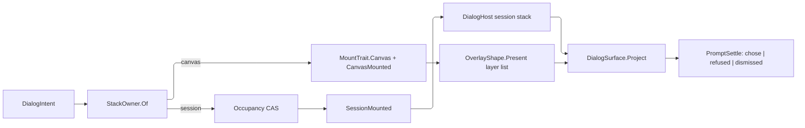
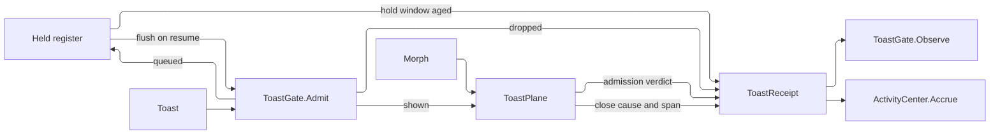

# [APPUI_DIALOGS_NOTIFICATIONS]

Rasm.AppUi presents every modal, transient, and persistent surface through one `DialogIntent` union resolved over a per-root ReactiveUI `Interaction` seam onto TWO stack owners: seven intent cases return typed results on the kernel `PromptSettle` carrier with dismissal as a case, `StackOwner` binds each case to the DialogHost session stack or the Ursa overlay canvas by modality class, one `DialogTopology` derives from the host and mount axes so a new host is zero topology edits, `MountPolicy` carries the whole per-mount capability set and chrome inset every root resolves, five `ToastRow` rows carry the ranked severity, linger, and quiet-hours piercing through one suppression fold before presentation and seal their close cause and measured presentation span on the way out, an inline banner family materializes as a control arm for conditions a transient note cannot carry, an activity center projects the receipt stream into a windowed inbox, and three `PickKind` rows route kernel `FilterPlan` filters through host-agnostic pick pipes. The page owns the intent vocabulary, the two-stack seam law, the topology derivation, the chrome bind, the notification policy with its morph, ceiling, and quiet-hours rules, the activity plane, and the picker and host-modality law over DialogHost.Avalonia, Irihi.Ursa, ReactiveUI, Avalonia, Thinktecture-generated vocabulary, LanguageExt rails, kernel `Rasm.Interaction` prompt vocabulary, and NodaTime instants.

Both stacks are reached ONLY through a mount-bound presence fact, because both registries answer an absent host dishonestly: the DialogHost static surface resolves its instance by identifier and THROWS on no loaded host, no match, and multiple matches, while the Ursa overlay registry is internal and answers an unregistered id with a silent no-op on the void shapes and `DialogResult.None` on the awaited ones — a value indistinguishable from a user cancel. The presence fact is therefore the first admission of every stack crossing, exactly as the picker's window fact is the first admission of every pick.

## [01]-[INDEX]

- [02]-[DIALOG_INTENTS]: One modal vocabulary; the case-minted typed demand; the confirm friction ladder; the layer anchor; one direct generated fault union.
- [03]-[SESSION_ALGEBRA]: Two stack owners with the seam law; the admitted root key; topology derived over the host and mount axes.
- [04]-[DIALOG_CHROME]: Scrim, corner, ring, and blur addresses over the depth and material tiers, bound inside the registration lease.
- [05]-[NOTIFICATIONS]: Toast rows, the pending morph, the one suppression fold, the presentation plane, and the banner family.
- [06]-[ACTIVITY_CENTER]: The windowed inbox over the receipt stream, its accrual trait, and quiet hours.
- [07]-[PICKERS_HOST_MODALITY]: Pick rows, capability gate, kernel filter plans, host modality law.

## [02]-[DIALOG_INTENTS]

- Owner: `DialogIntent` `[Union]` — the one modal vocabulary across every admitted surface; `DialogAsk<TResult>` — the case-minted question value binding each intent to its one result shape; `ConfirmFriction` `[Union]` — the destructive-friction ladder; `LayerAnchor` `[Union]` — where a canvas layer seats; `TypedConfirmCell` — the verification-phrase content; `DialogFault` — the direct generated `[Union]` with one `[FaultCase]` leaf per dialog failure.
- Cases: Confirm → `Unit`, Form → template commit record, Pick → `Seq<FileLocation>`, Progress → `DeadlineOutcome`, Error → `Unit`, About → `Unit`, Layer → `Unit`; `ConfirmFriction` = Acknowledge | Typed | Inline; `LayerAnchor` = Bound | Edge | Route; `[FaultCase]` = ResultShape | PickerUnavailable | SessionOccupied | TemplateMissing | PolicyRejected | HostUnregistered | RetreatVetoed | SessionAbsent | CorrelationUnknown.
- Law: friction is a COLUMN on the confirm case, never three confirm names — an acknowledgement, a typed destructive gate, and an inline pop-confirm are one intent under three rows, so every caller raises one verb and the ladder decides how much the operator must do to clear it.
- Law: the four canvas modalities are ONE `Layer` case whose `OverlayShape` value IS the discriminant, because the shape row already recovers it and already owns the dispatch, the chrome tiers, and the choreography — four sibling case names re-stated the same fact a fourth time. NAMED LOSS: the compile break a fifth modality used to force on every dispatcher; it is bought back by the shape row's own generated total `Switch` and by `Admits`, which refuses an anchor the row does not seat.
- Auto: the screen fault fold raises the Error case with its correlation — never per-control failure handling; the boot crash-restore offer rides one Confirm row under `Acknowledge`; the conflict-resolution inspector registers as one Form content row; a destructive verb whose target carries an identifier raises Confirm under `Typed(target)`.
- Packages: Thinktecture.Runtime.Extensions, ReactiveUI, LanguageExt.Core, Irihi.Ursa, Avalonia, Rasm (project — kernel fault floor, `FilterPlan`, `FileLocation`), Rasm.AppHost (project)
- Growth: one `DialogIntent` case carrying its own `Ask` mint and its `StackOwner` arm, one `ConfirmFriction` row, one `LayerAnchor` case, one `OverlayShape` row, or one Form content row resolved through `IViewFor` registration; a new fault case is one `[FaultCase]` leaf; zero new surface.
- Boundary: Progress content binds the progress stream selected by `Correlation` and is PRODUCER-AGNOSTIC — a Compute lane and a synchronous kernel fold publish onto the same correlation-selected cell, the kernel through the `IProgress<double>` sink its own governance band carries (`ArrangementPolicy.Governed`), so a long boolean and a remote solve render through one intent with no second progress vocabulary and no case added here; a deadline miss renders the typed `DeadlineOutcome` — never a spinner timeout; the Form and Layer template keys resolve through the topology `ContentTemplate` resolver onto the host `DialogContentTemplate` at registration so a content session selects its template by key from one resolver and a per-case template literal in registration code is the deleted form; About renders the `ReleaseIdentity` record as given. `DialogFault.ResultShape` IS caller-reachable: the DialogHost close parameter is erased to `object?`, so a content template that closes its session with a parameter whose runtime type is neither `TResult` nor `DialogFault` re-types into this fault at `DialogSurface.Project` and travels out as `PromptSettle.Refused` — it names a session whose close contract disagrees with the case that minted the ask, which is a registration defect the caller is the only surface positioned to report. The `Typed` row compares ORDINAL and exact: no trim, no case folding, no culture — a destructive gate that normalizes accepts a phrase the operator never typed, and the whole point of the row is that the operator typed it. The `Inline` row drives an ALREADY-MOUNTED `PopConfirm` the verb's trigger wears in its own screen tree — the row carries the mounted anchor and nothing else, because trigger mode and placement are that control's own styled properties and a duplicate column beside them would let the two disagree; re-parenting a live trigger into a freshly constructed pop-confirm is the deleted form, since the wrapper is a content control and the surgery would detach the very element the gesture is in flight over. The pick result is the kernel `FileLocation` on both legs, so an unadmitted path refuses at the picker seam rather than travelling as text into an export destination. The case-minted-typed-demand idiom is the kernel prompt owner's declared law (`Rasm/Interaction/chrome#PROMPT`); `DialogAsk` instantiates it over `DialogIntent` rather than `PickerSpec` because the intent family is Avalonia-stacked, and the law itself is not re-argued here.

```csharp signature
// --- [TYPES] ----------------------------------------------------------------------------

// The case-minted question: TResult binds at the case, never at the Show call site, so the result
// shape travels WITH the intent and a wrong-typed request is a compile failure, not a ResultShape fault.
public readonly record struct DialogAsk<TResult>(DialogIntent Intent) where TResult : notnull;

// The friction ladder as data. Acknowledge is one affirmative; Typed gates the affirmative on the target's
// own identifier; Inline never opens a session at all — it drives the pop-confirm the trigger already wears,
// so the lightest tier costs no stack crossing and the heaviest costs a typed phrase.
[Union(ConversionFromValue = ConversionOperatorsGeneration.None)]
public abstract partial record ConfirmFriction {
    private ConfirmFriction() { }

    public sealed record Acknowledge : ConfirmFriction;
    public sealed record Typed(string Target) : ConfirmFriction;
    public sealed record Inline(PopConfirm Anchor) : ConfirmFriction;
}

// Where a canvas layer seats, as a CASE rather than two optional columns beside each other: a drawer anchors to
// a host edge, a peek names the route the shell's own history reads back, and every other modality fills the
// canvas bound. Two nullable columns admitted an edge-bearing palette and an edge-less drawer; `OverlayShape`
// carries the pairing law, so both corners refuse at admission instead of at the dispatcher.
[Union(ConversionFromValue = ConversionOperatorsGeneration.None)]
public abstract partial record LayerAnchor {
    private LayerAnchor() { }

    public sealed record Bound : LayerAnchor;
    public sealed record Edge(Position Side) : LayerAnchor;
    public sealed record Route(string RouteKey) : LayerAnchor;

    public Option<Position> Side => Switch(
        bound: static _ => Option<Position>.None,
        edge: static row => Some(row.Side),
        route: static _ => Option<Position>.None);

    public Option<string> RouteKey => Switch(
        bound: static _ => Option<string>.None,
        edge: static _ => Option<string>.None,
        route: static row => Some(row.RouteKey));
}

[Union(ConversionFromValue = ConversionOperatorsGeneration.None)]
public abstract partial record DialogIntent {
    private DialogIntent() { }

    public sealed record Confirm(string Title, string Body, string AffirmKey, string DismissKey, ConfirmFriction Friction) : DialogIntent {
        public DialogAsk<Unit> Ask => new(this);
    }

    public sealed record Form(string TemplateKey, IReactiveObject Content) : DialogIntent {
        // The commit-record shape is the CONTENT's shape: the mint demands the evidence, so a Form
        // asked at a type its content does not carry is None at the mint, never a runtime fault.
        public Option<DialogAsk<TCommit>> Ask<TCommit>() where TCommit : class, IReactiveObject =>
            Content is TCommit ? Some(new DialogAsk<TCommit>(this)) : None;
    }

    // The filter rows are the kernel `FilterPlan` values whole; the Avalonia pattern projection is one member at
    // the pick seam, so the raw extension roster and the globbed storage type never drift apart.
    public sealed record Pick(PickKind Kind, PickCardinality Cardinality, Seq<FilterPlan> Filters, Option<string> SuggestedName = default) : DialogIntent {
        public DialogAsk<Seq<FileLocation>> Ask => new(this);
    }

    public sealed record Progress(string Title, CorrelationId Correlation, DeadlineClass Deadline) : DialogIntent {
        public DialogAsk<DeadlineOutcome> Ask => new(this);
    }

    public sealed record Error(LanguageExt.Common.Error Fault, CorrelationId Correlation) : DialogIntent {
        public DialogAsk<Unit> Ask => new(this);
    }

    public sealed record About(ReleaseIdentity Identity) : DialogIntent {
        public DialogAsk<Unit> Ask => new(this);
    }

    // The ONE canvas case. A palette, a peek, a drawer, and a full-surface editor differ in exactly the row the
    // `Shape` column names — dispatch shape, depth, material, choreography, modality traits, admitted anchor —
    // so the modality is a VALUE and a fifth one is a row rather than a case, an `Of` arm, and a `Route*` member.
    // It carries no result because every canvas answer is a sealed receipt on the evidence stream rather than a
    // close parameter; a layer returning its chosen verb would make that receipt the second answer.
    public sealed record Layer(OverlayShape Shape, string TemplateKey, IReactiveObject Content, LayerAnchor Anchor) : DialogIntent {
        public DialogAsk<Unit> Ask => new(this);
    }
}

// The arity axis carries its own admission, so the cardinality gate reads the row instead of comparing a path
// count against a literal at the one site that remembered to.
[SmartEnum<string>]
[KeyMemberEqualityComparer<ComparerAccessors.StringOrdinal, string>]
[KeyMemberComparer<ComparerAccessors.StringOrdinal, string>]
public sealed partial class PickCardinality {
    public static readonly PickCardinality One = new("one", admits: static count => count <= 1);
    public static readonly PickCardinality Many = new("many", admits: static count => count >= 0);

    [UseDelegateFromConstructor]
    public partial bool Admits(int count);
}

// --- [ERRORS] ---------------------------------------------------------------------------

// Multi-column cases keep evidence typed and render the base detail.
[Union(ConversionFromValue = ConversionOperatorsGeneration.None)]
public abstract partial record DialogFault : Fault {
    private static readonly FaultBand FamilyBand = FaultBand.Dialog;
    private DialogFault(string detail) { Detail = detail; }

    public string Detail { get; }

    public override string Message => Detail;

    [FaultCase(0)]
    public sealed partial record ResultShape(string Expected, string Actual) : DialogFault($"{Expected}:{Actual}");
    [FaultCase(1)]
    public sealed partial record PickerUnavailable(string Detail) : DialogFault(Detail);
    [FaultCase(2)]
    public sealed partial record SessionOccupied(string Detail) : DialogFault(Detail);
    [FaultCase(3)]
    public sealed partial record TemplateMissing(string Detail) : DialogFault(Detail);
    [FaultCase(4)]
    public sealed partial record PolicyRejected(string Detail) : DialogFault(Detail);
    [FaultCase(5)]
    public sealed partial record HostUnregistered(string Detail) : DialogFault(Detail);
    [FaultCase(6)]
    public sealed partial record RetreatVetoed(string Detail) : DialogFault(Detail);
    [FaultCase(7)]
    public sealed partial record SessionAbsent(string Detail) : DialogFault(Detail);
    [FaultCase(8)]
    public sealed partial record CorrelationUnknown(string Detail) : DialogFault(Detail);
}

// --- [MODELS] ---------------------------------------------------------------------------

// The typed destructive gate. `Armed` is the ONE admission and it is an ordinal exact match, so the affirm
// command's canExecute and any visual disabled state read one predicate; a second boolean beside it would let
// a stale visual admit a phrase the comparison rejects.
public sealed class TypedConfirmCell : ReactiveObject {
    private string phrase = string.Empty;

    public TypedConfirmCell(DialogIntent.Confirm intent, string target, string identifier) {
        Intent = intent;
        Target = target;
        Affirm = ReactiveCommand.Create(
            () => DialogHost.Close(identifier, unit),
            this.WhenAnyValue(cell => cell.Armed));
        Dismiss = ReactiveCommand.Create(() => DialogHost.Close(identifier, null));
    }

    public DialogIntent.Confirm Intent { get; }

    public string Target { get; }

    public string Phrase {
        get => phrase;
        set => this.RaiseAndSetIfChanged(ref phrase, value);
    }

    public bool Armed => string.Equals(Phrase, Target, StringComparison.Ordinal);

    public ReactiveCommand<Unit, Unit> Affirm { get; }

    public ReactiveCommand<Unit, Unit> Dismiss { get; }
}
```

## [03]-[SESSION_ALGEBRA]

- Owner: `StackOwner` `[SmartEnum<string>]` — the modality-to-stack projection, total over the intent family; `LayerTrait` and `MountTrait` — the two capability vocabularies; `OverlayShape` — the canvas modality rows carrying their own dispatch; `MountPolicy` — the per-mount capability set, toast anchor, and chrome inset; `RootKey` — the admitted host-crossed-mount address every identifier derives from; `DialogTopology` — the derived per-surface root; `DialogSeam` — the mount-bound delegate columns; `PickRequest` — the projected pick the storage route consumes; `SessionVerb` `[Union]` — the session stack's four verbs as values; `DialogSurface` — the fold over the row.
- Cases: `StackOwner` = session | canvas; `OverlayShape` = palette | peek | drawer | editor, each carrying its depth tier, material tier, motion plan, modality trait set, vertical anchor, admitted `LayerAnchor`, and its own host dispatch; `MountTrait` = stacked | click-away | blur | canvas; `LayerTrait` = modal | light-dismiss | full-surface; `SessionVerb` = Advance | Retreat | Raise | Dismiss.
- Entry: `public IO<PromptSettle<TResult>> Show<TResult>(DialogAsk<TResult> ask)` — the question arrives case-minted, so `TResult` is the intent's own result shape and the kernel prompt carrier answers chosen, refused, and dismissed as three cases; `public IO<Fin<Unit>> Apply(SessionVerb verb)` — the one session-stack fold; `public Fin<Lease<IDisposable>> Register(DialogHost session, Option<OverlayDialogHost> canvas)` — the request handler and the chrome bind under one custody; `public static Fin<DialogTopology> Derive(ConsumptionProfile profile, SurfaceMount mount, DialogSeam seam)` — the one topology projection over the host and mount axes.
- Law: the SESSION stack owns every DECIDING modality — Confirm, Form, Pick, Progress, Error, About — and the CANVAS stack owns every CO-RESIDENT one. The split is the result handle, not the visual: a deciding surface's answer is the awaited close parameter of ONE root, so two open decisions leave the root's answer ambiguous and the CAS reservation is what forecloses it. The canvas holds an ORDERED LAYER LIST instead of a cell — each layer carries its own mask, its own modal contribution, and its own awaited task — so two open layers have two distinct handles and neither is ambiguous. Single-occupancy therefore does not govern the canvas: imposing it would refuse exactly the co-residency the canvas exists to provide, which is a palette over a drawer over a peek.
- Law: the crossing carries ONE outcome shape. The kernel prompt owner rules a stacked `Fin<Option<T>>` over one crossing the deleted form, so `Project` mints `PromptSettle<TResult>` and every arm — an occupancy refusal, an unregistered host, a template miss, a shape disagreement, a dismissal, a chosen value — lands as a case a caller recovers from differently. `Eff` leaves the page with it: the typed failure channel it existed for is now a case of the value.
- Law: the mount's capability SET is the one presence vocabulary. Four booleans admitted sixteen corners against five real mounts and let a canvas-less mount claim a layer plane; `CapabilitySet<MountTrait>` states the held rows, and the canvas crossing DEMANDS `Canvas` through `Require`, so the refusal carries the missing rows as evidence rather than a bare label. `MountPolicy` rows stay five even where two hold identical columns, because the row key is the identifier segment and collapsing them would give a panel and a modal on one host ONE identifier — the multiple-match throw this derivation exists to foreclose.
- Law: the drawer's ONE owner is `OverlayDrawer`. The suite's `Drawer` type is obsolete and forwards every member to it verbatim, so the two candidate mechanisms are one mechanism and a forwarder, and binding the forwarder buys a deprecation with no capability in it.
- Auto: registration is the framework's, never a call — the derived `CanvasId` is stamped on the mounted `OverlayDialogHost.HostId` BEFORE attach, the host registers itself under `(HostId, TopLevel hash)` at `OnAttachedToVisualTree`, and `OnDetachedFromVisualTree` closes every open layer and unregisters under the CURRENT id; the session root binds its handler and its chrome through one `Register` lease the activation scope disposes; composition projects each derived row onto `Identifier`, `IsMultipleDialogsEnabled`, `CloseOnClickAway`, `OverlayBackground`, `BlurBackground`, `PopupPositioner`, and the `DialogHostStyle` chrome; the Form arm wraps its content through `Templated`, resolving the `TemplateKey` against the `ContentTemplate` resolver onto the host `DialogContentTemplate`; a dirty Form session arms `DialogClosingEventArgs.Cancel` through `DialogClosingCallback`; the keyboard trap-and-return law discharges across both stacks in two halves — the `Cycle` region mode lands on each overlay root at the chrome bind, and every crossing captures the element holding focus at the raise and returns it when that crossing ends.
- Packages: DialogHost.Avalonia, Irihi.Ursa, ReactiveUI, Avalonia, LanguageExt.Core, Thinktecture.Runtime.Extensions, Rasm (project — `CapabilitySet`, `CapabilityLaw`, `Cell`/`Transition`, `Lease`, `PromptSettle`, `FilterPlan`, `FileLocation`), Rasm.AppHost (project)
- Growth: a new host substrate is one `HostRows` descriptor row at the AppHost owner and costs zero rows here; a genuinely new mounting shape is one `MountPolicy` arm; a new canvas modality is one `OverlayShape` row carrying its own dispatch and admitted anchor; a new session verb is one `SessionVerb` case and one `Apply` arm; zero new surface.
- Boundary: overlay choreography is the shape row's own `MotionPlan` read against the layer's measured extent through `Poses`, so each modality enters and leaves on the plan that names it, the reduction collapse rides that one read, and a canvas-local transition is the deleted form; `DialogSurface` is the named boundary capsule — the registration handler and the pick route carry the erased close parameter the DialogHost seam owns, and `Project` re-types it onto the prompt carrier. Every static crossing is GUARDED by the mount's own presence fact and never by a probe of the registry: the DialogHost static surface resolves its instance by scanning loaded hosts and throws on zero, on no identifier match, and on MULTIPLE matches, so `IsDialogOpen`, `GetDialogSession`, `Close`, and `Pop` are all throwing reads before mount and after unmount, and the identifier derivation is what forecloses the multiple-match throw by construction; the Ursa registry is internal and adds by try-add, so a duplicate key keeps the FIRST host and silently drops the second, and an unregistered id answers `DialogResult.None` — the same value a user cancel produces — which no fault rail downstream can see. `DialogHost.Pop` is the package's RAISE verb and never a retreat: it matches a host by CONTENT REFERENCE, moves it to the top of the stack, and re-presents it, so the null-content call the name invites matches nothing and does nothing, and the retreat verb lives on `DialogSession.Close` where the closing veto is honoured. The canvas has the same verb under its own vocabulary — `DialogControlBase.UpdateLayer` raises a `DialogLayerChangeType` its host folds into list order — but the vm-first dispatchers hand back a task and never the shell, so the page declares that vocabulary and owns no canvas raise call; a canvas layer raises itself through its own chrome. `TopLevelResolver` is the single per-surface service-capsule delegate the pick pipe binds over, each row's binding one `TopLevel.GetTopLevel(Visual)` read whose `TopLevel?` return projects to `Option<TopLevel>` at that one seam — an embedded mount answers its root like any other, reference-equal, and KEEPS answering it after the root disposes, so a resolved root proves ATTACHMENT and never liveness and every row needing a live surface reads the mount's own facts instead; the keyboard law is DISCHARGED here rather than declared elsewhere — `Shell/accessibility#KEYBOARD_NAV` states the dialog overlay root as the `Cycle` region and the opener return as a session obligation, so the region mode rides `FocusOps.Mode` at the chrome bind where both roots are in hand and the return keys on the crossing's own END: an awaiting crossing restores at `Request` and a co-resident layer restores at its own detach, because a fold that returned the moment it seated a palette would pull the keyboard back out of the surface the operator is still typing into, and the opener reads off the mount's own top level so no second seam column exists to drift; exactly ONE canvas per modal-status scope sets `IsModalStatusReporter`, because the reporter writes the scope's attached flag unconditionally and a second reporter's close would clear the first's flag while its own layer is still open. The UI-thread crossing vocabulary stays Avalonia's `Dispatcher` here — the kernel `UiThread` marshal is Eto-bound and this package cannot compose the marshal, only the lane vocabulary — and the escalation to split `UiDispatch`/`DispatchLane` from that marshal is recorded rather than pre-empted.

```csharp signature
// --- [TYPES] ----------------------------------------------------------------------------

// The seam law as a total projection. A case answers which stack owns it and nothing else, so the routing
// question has one answer per case and a new case states its stack at compile time rather than defaulting
// into whichever arm the dispatcher happened to reach first.
[SmartEnum<string>]
[KeyMemberEqualityComparer<ComparerAccessors.StringOrdinal, string>]
[KeyMemberComparer<ComparerAccessors.StringOrdinal, string>]
public sealed partial class StackOwner {
    public static readonly StackOwner Session = new("session");
    public static readonly StackOwner Canvas = new("canvas");

    public static StackOwner Of(DialogIntent intent) => intent.Switch(
        confirm: static c => c.Friction is ConfirmFriction.Inline ? Canvas : Session,
        form: static _ => Session,
        pick: static _ => Session,
        progress: static _ => Session,
        error: static _ => Session,
        about: static _ => Session,
        layer: static _ => Canvas);
}

// The canvas modality's independent presentation bits. Three booleans on a four-row family admitted eight
// corners against four real ones, and the modal bit in particular is the projection of WHICH DISPATCH the arm
// takes — every awaited in-canvas overload adds a masked layer and only the void fire shapes add a plain one.
[SmartEnum<string>]
[KeyMemberEqualityComparer<ComparerAccessors.StringOrdinal, string>]
public sealed partial class LayerTrait : ICapability<LayerTrait> {
    public static readonly LayerTrait Modal = new("modal");
    public static readonly LayerTrait LightDismiss = new("light-dismiss");
    public static readonly LayerTrait FullSurface = new("full-surface");
}

// The per-mount presence and chrome bits. `Canvas` is the mount's answer to whether an overlay host can exist
// at all: an offscreen root draws through a headless surface with no layer plane, so the canvas crossing
// DEMANDS the row and an offscreen mount refuses with the missing capability as its evidence.
[SmartEnum<string>]
[KeyMemberEqualityComparer<ComparerAccessors.StringOrdinal, string>]
public sealed partial class MountTrait : ICapability<MountTrait> {
    public static readonly MountTrait Stacked = new("stacked");
    public static readonly MountTrait ClickAway = new("click-away");
    public static readonly MountTrait Blur = new("blur");
    public static readonly MountTrait Canvas = new("canvas");
}

// The canvas modality rows. Each carries the depth tier its layer earns, the material its surface takes, the
// motion plan its entry and exit choreograph through, the modality traits the dispatch and the chrome read,
// the anchor shape it seats against, and its OWN host dispatch — so a modality cannot be lit at one tier,
// scrimmed at another, animated on a third, and dispatched by a fourth member that remembered none of them.
[SmartEnum<string>]
[KeyMemberEqualityComparer<ComparerAccessors.StringOrdinal, string>]
[KeyMemberComparer<ComparerAccessors.StringOrdinal, string>]
public sealed partial class OverlayShape {
    public static readonly OverlayShape Palette = new("palette",
        depth: DepthTier.Flyout, material: MaterialTier.Overlay, plan: MotionPlan.Flyout,
        traits: CapabilitySet<LayerTrait>.Of(LayerTrait.LightDismiss),
        rise: VerticalPosition.Top,
        admits: static anchor => anchor is LayerAnchor.Bound,
        present: DialogSurface.Fired);
    public static readonly OverlayShape Peek = new("peek",
        depth: DepthTier.Floating, material: MaterialTier.Overlay, plan: MotionPlan.Flyout,
        traits: CapabilitySet<LayerTrait>.Of(LayerTrait.LightDismiss),
        rise: VerticalPosition.Center,
        admits: static anchor => anchor is LayerAnchor.Route or LayerAnchor.Bound,
        present: DialogSurface.Fired);
    public static readonly OverlayShape Drawer = new("drawer",
        depth: DepthTier.Dialog, material: MaterialTier.Sheet, plan: MotionPlan.Drawer,
        traits: CapabilitySet<LayerTrait>.Of(LayerTrait.Modal, LayerTrait.LightDismiss),
        rise: VerticalPosition.Center,
        admits: static anchor => anchor is LayerAnchor.Edge,
        present: DialogSurface.Drawn);
    public static readonly OverlayShape Editor = new("editor",
        depth: DepthTier.Dialog, material: MaterialTier.Sheet, plan: MotionPlan.Dialog,
        traits: CapabilitySet<LayerTrait>.Of(LayerTrait.Modal, LayerTrait.FullSurface),
        rise: VerticalPosition.Center,
        admits: static anchor => anchor is LayerAnchor.Bound,
        present: DialogSurface.Modaled);

    public DepthTier Depth { get; }

    public MaterialTier Material { get; }

    // The choreography address, not a duration: the plan owns the entry and departure poses, the origin they
    // travel from, and the reduction collapse, so a layer's motion is one row read against its measured
    // extent and no overlay authors a transition of its own.
    public MotionPlan Plan { get; }

    public CapabilitySet<LayerTrait> Traits { get; }

    // The one placement column the canvas layer plane reads. A palette rises to the TOP of the bound because a
    // list that grows downward from a fixed edge keeps its first row under the caret, while a centered one
    // moves every row on each keystroke; the horizontal axis stays centered for every modality, so it is the
    // options default rather than a column that could only ever carry one value.
    public VerticalPosition Rise { get; }

    // The pairing law between a modality and where it seats. `ShowCustomModal` is an obsolete forwarder onto
    // the awaited member rather than a third posture, so modality lives in the dispatch column and the trait
    // set is that choice's projection.
    [UseDelegateFromConstructor]
    public partial bool Admits(LayerAnchor anchor);

    [UseDelegateFromConstructor]
    public partial Task<object?> Present(Control layer, DialogIntent.Layer request, string canvasId);

    // The canvas modality a case seats on, ABSENT for every deciding case the session stack owns and for the
    // inline confirm that never opens a layer at all — so the dispatcher, the chrome fold, and the focus
    // return all read one projection rather than three predicates that could disagree.
    public static Option<OverlayShape> Of(DialogIntent intent) => intent.Switch(
        layer: static row => Some(row.Shape),
        confirm: static _ => Option<OverlayShape>.None,
        form: static _ => Option<OverlayShape>.None,
        pick: static _ => Option<OverlayShape>.None,
        progress: static _ => Option<OverlayShape>.None,
        error: static _ => Option<OverlayShape>.None,
        about: static _ => Option<OverlayShape>.None);

    // The style class is the ROW'S own key, so the shell a dispatcher constructs selects on the modality that
    // named it and no caller can hand one row's options another row's class.
    public OverlayDialogOptions Options() => new() {
        FullScreen = Traits.Admits(LayerTrait.FullSurface),
        VerticalAnchor = Rise,
        Mode = DialogMode.None,
        Buttons = DialogButton.None,
        CanLightDismiss = Traits.Admits(LayerTrait.LightDismiss),
        CanDragMove = false,
        CanResize = false,
        IsCloseButtonVisible = Traits.Admits(LayerTrait.LightDismiss),
        StyleClass = Key,
    };
}

// The per-mount capability columns. Every product row the estate authored — a desktop shell, a panel, a
// companion, a sidecar — resolves to exactly one of these five, so a new host substrate reaches dialog
// seating through its descriptor alone and no arm here names a product. Panel and Modal hold identical
// capability sets and stay DISTINCT rows because the key is the identifier segment, not a label.
[SmartEnum<string>]
[KeyMemberEqualityComparer<ComparerAccessors.StringOrdinal, string>]
[KeyMemberComparer<ComparerAccessors.StringOrdinal, string>]
public sealed partial class MountPolicy {
    public static readonly MountPolicy Panel = new("panel",
        traits: CapabilitySet<MountTrait>.Of(MountTrait.Canvas),
        anchor: Some(ToastAnchor.TopCenter), inset: new Thickness(EmbeddedInset));
    public static readonly MountPolicy Modal = new("modal",
        traits: CapabilitySet<MountTrait>.Of(MountTrait.Canvas),
        anchor: Some(ToastAnchor.TopCenter), inset: new Thickness(EmbeddedInset));
    public static readonly MountPolicy Companion = new("companion",
        traits: CapabilitySet<MountTrait>.Of(MountTrait.Stacked, MountTrait.ClickAway, MountTrait.Canvas),
        anchor: Some(ToastAnchor.BottomRight), inset: default);
    public static readonly MountPolicy Standalone = new("standalone",
        traits: CapabilitySet<MountTrait>.Of(MountTrait.Stacked, MountTrait.ClickAway, MountTrait.Blur, MountTrait.Canvas),
        anchor: Some(ToastAnchor.BottomRight), inset: default);
    // No anchor at all rather than a `None` row wearing real alignments: an offscreen root places nothing, and
    // a row named for absence that still answers centre-top is a value every reader has to remember to skip.
    public static readonly MountPolicy Offscreen = new("offscreen",
        traits: CapabilitySet<MountTrait>.Of(MountTrait.Stacked),
        anchor: None, inset: default);

    // An embedded mount reserves the host's own chrome band, so a layer that filled the whole canvas would sit
    // under a title bar the host owns and the operator could not reach it.
    public const double EmbeddedInset = 8d;

    public CapabilitySet<MountTrait> Traits { get; }

    public Option<ToastAnchor> Anchor { get; }

    public Thickness Inset { get; }

    // The reservation predicate the session cell reads, derived rather than re-spelled at the gate: a stacking
    // mount answers occupancy through the host's own stack, so only a single-session mount reserves.
    public bool Reserves => !Traits.Admits(MountTrait.Stacked);

    public static MountPolicy Of(SurfaceMount mount) => mount.Switch(
        panel: static _ => Panel,
        modal: static _ => Modal,
        companion: static _ => Companion,
        standalone: static _ => Standalone,
        offscreen: static _ => Offscreen);
}

// --- [MODELS] ---------------------------------------------------------------------------

// The one derived address, held as its two admitted SEGMENTS. The host-crossed-mount key was spelled three
// times inside one mint and the identifier pair copied beside it; here the segments are the only stored
// state and every address is a member over them, so one authority answers all three.
public sealed record RootKey {
    public const string SessionSuffix = "session";
    public const string CanvasSuffix = "canvas";

    private RootKey(string host, string mount) {
        Host = host;
        Mount = mount;
    }

    // BOTH segment defects refuse TOGETHER: a blank host key and an unusable mount key are independent facts
    // about the composition that bound this surface, so the applicative reports the pair a first-defect fold
    // would have hidden behind whichever it reached first.
    public static Validation<Error, RootKey> Of(string host, string mount) =>
        (Segment(nameof(host), host), Segment(nameof(mount), mount))
            .Apply(static (admitted, kind) => new RootKey(admitted, kind))
            .As();

    public string Host { get; }

    public string Mount { get; }

    public string Value => $"{Host}:{Mount}";

    public string Identifier => $"{Value}:{SessionSuffix}";

    public string CanvasId => $"{Value}:{CanvasSuffix}";

    public override string ToString() => Value;

    // The separator is the address grammar, so a segment carrying one would make two distinct roots spell one
    // identifier — precisely the ambiguity the static surface throws on.
    private static Validation<Error, string> Segment(string axis, string value) =>
        !string.IsNullOrWhiteSpace(value) && !value.Contains(':', StringComparison.Ordinal)
            ? Validation<Error, string>.Success(value)
            : Validation<Error, string>.Fail(new DialogFault.PolicyRejected($"root-key:{axis}:'{value}'"));
}

// The projected pick the storage route consumes. The page owns the Avalonia projection off the kernel
// `FilterPlan` rows, so a bound pipe carries a storage call and no filter vocabulary of its own, and the
// declared projection has a reader instead of being a promise the boundary made and no member kept.
public readonly record struct PickRequest(
    PickKind Kind, PickCardinality Cardinality, Seq<FilePickerFileType> Types, Option<string> SuggestedName);

// --- [SERVICES] -------------------------------------------------------------------------

// Every fact the two stacks need that the page cannot construct, bound at mount exactly as the surface seam
// binds the host's. `SessionMounted` and `CanvasMounted` are the presence facts both registries refuse to
// answer honestly; `Sessions` is the mount's projection of the host's own stack, so the retreat fold reads a
// real list while the page still holds no control reference.
public sealed record DialogSeam(
    Func<bool> SessionMounted,
    Func<bool> CanvasMounted,
    Func<Seq<DialogSession>> Sessions,
    Func<DialogSession, Option<string>> Blocks,
    Func<Option<TopLevel>> TopLevel,
    Func<bool> Windowed,
    Func<string, Option<IDataTemplate>> ContentTemplate,
    Func<DialogIntent.Form, DialogClosingEventHandler> Closing,
    ToastPipe Toasts,
    Option<Func<PickRequest, Task<Seq<FileLocation>>>> PickPipe);

// A sealed class rather than a record: this owner holds three live cells, and a record copy would share every
// one of them by reference while presenting itself as a distinct topology. Its transitions ANSWER what they
// retired — the drain hands back the roster it took, the reservation hands back the rail — so no reader
// reconstructs a prior state from a post-state.
public sealed class DialogTopology {
    private static readonly Op Reservation = Op.Of(name: "appui.dialog.reserve");

    private readonly Atom<Seq<QueuedToast>> held = Atom(Seq<QueuedToast>());
    private readonly Atom<bool> occupied = Atom(false);

    internal DialogTopology(RootKey key, MountPolicy policy, IDialogPopupPositioner positioner, DialogSeam seam) {
        Key = key;
        Policy = policy;
        Positioner = positioner;
        Seam = seam;
    }

    public RootKey Key { get; }

    public MountPolicy Policy { get; }

    public IDialogPopupPositioner Positioner { get; }

    public DialogSeam Seam { get; }

    public Interaction<DialogIntent, object?> Requests { get; } = new();

    // A presence-guarded read: the static probe throws before mount and after unmount, so the mount fact is
    // the first term and the probe never runs without it.
    public bool HasOpenSession => Seam.SessionMounted() && DialogHost.IsDialogOpen(Key.Identifier);

    // The held-note register: a Queued toast parks WHOLE — payload, severity, intent key, stamps — so the
    // resume flush re-presents the presentable note, never a receipt husk.
    internal Unit Park(QueuedToast note) => ignore(held.Swap(rows => rows.Add(note)));

    // The drain ANSWERS the roster it retired: the take-and-clear commits the empty post-state and hands back
    // the exact value it replaced, so the read-then-skip prefix arithmetic it replaces — which could drop a
    // note admitted between the read and the swap — has no spelling left.
    internal Seq<QueuedToast> Drain() => Cell.Take(held).Current;

    // The reservation is a CAS REFUSAL, never a flag a lambda writes: a swap body re-runs on every lost race,
    // so an admission recorded inside it survives an iteration that lost and the caller opens a session it
    // never reserved. The host presence probe is hoisted OUT of the transition, because it is a read of the
    // world rather than part of the atomic decision and a contended body would run it twice.
    internal Fin<Unit> Reserve() =>
        HasOpenSession
            ? Fin.Fail<Unit>(new DialogFault.SessionOccupied(Key.Value))
            : Cell.Step(occupied, static standing => standing ? None : Some(true),
                    new DialogFault.SessionOccupied(Key.Value)) switch {
                Transition<bool>.Committed => Fin.Succ(unit),
                Transition<bool> declined => Fin.Fail<Unit>(
                    declined is Transition<bool>.Refused refused ? refused.Cause : new DialogFault.SessionOccupied(Key.Value)),
            };

    internal Unit Release() => ignore(occupied.Swap(static _ => false));
}
```

```csharp signature
// --- [TYPES] ----------------------------------------------------------------------------

// The session stack's verbs as VALUES. Four members each re-wrapping the same presence guard stated the guard
// four times and let a fifth verb forget it; the arity that used to justify the split rides each case's own
// payload, so one fold guards once and the union is what a caller dispatches on.
[Union(ConversionFromValue = ConversionOperatorsGeneration.None)]
public abstract partial record SessionVerb {
    private SessionVerb() { }

    public sealed record Advance(DialogIntent.Progress Snapshot) : SessionVerb;
    public sealed record Retreat : SessionVerb;
    // `Pop` matches a session by CONTENT REFERENCE, so the content is a required column here and a bare
    // identifier raise — which would match nothing and do nothing — is unspellable.
    public sealed record Raise(object Content) : SessionVerb;
    public sealed record Dismiss : SessionVerb;
}

// --- [OPERATIONS] -----------------------------------------------------------------------

public static class DialogSurface {
    private static readonly Op Registration = Op.Of(name: "appui.dialog.register");

    private static readonly CapabilitySet<MountTrait> CanvasReach = CapabilitySet<MountTrait>.Of(MountTrait.Canvas);

    // The whole topology derivation. The root key is the host key crossed with the MOUNT's own key exactly as a
    // catalog route key derives from its row key, so host identity reaches dialog seating through the descriptor
    // alone and two mounting shapes on one host can never collapse onto one identifier; the identifier pair and
    // the canvas id are members over that key rather than three copies of one interpolation.
    public static Fin<DialogTopology> Derive(ConsumptionProfile profile, SurfaceMount mount, DialogSeam seam) =>
        MountPolicy.Of(mount) switch {
            var policy => RootKey.Of(profile.HostKey, policy.Key)
                .Map(key => new DialogTopology(key, policy, Positioner(policy), seam))
                .ToFin(),
        };

    // A stacking mount centres its popup because the stack owns the placement; a single-session mount aligns
    // to the top so a sequence of sessions does not walk the surface.
    private static IDialogPopupPositioner Positioner(MountPolicy policy) =>
        policy.Traits.Admits(MountTrait.Stacked)
            ? CenteredDialogPopupPositioner.Instance
            : new AlignmentDialogPopupPositioner {
                HorizontalAlignment = HorizontalAlignment.Center,
                VerticalAlignment = VerticalAlignment.Top,
            };

    extension(DialogTopology root) {
        // ONE carrier for the whole crossing. The kernel prompt owner rules three stacked carriers over one
        // crossing the deleted form: a chosen value, a refused admission, and a dismissal are cases a caller
        // recovers from differently, and stacking them was unstacked again at the seam that read them.
        public IO<PromptSettle<TResult>> Show<TResult>(DialogAsk<TResult> ask) where TResult : notnull =>
            IO.liftAsync(async () => await Request(root, ask).ConfigureAwait(true));

        // One presence guard for the whole session stack. The retreat veto is a REAL fold over the stacked
        // session surface: the stack arrives from the mount, the target is its top, and the block predicate
        // refuses BEFORE the close runs. The framework's own `DialogClosing` veto stays the second and
        // independent guard for the close paths the page does not own — the click-away dismissal and the
        // templated close command — so a dirty form is refused twice by two owners rather than once by
        // whichever happened to run.
        public IO<Fin<Unit>> Apply(SessionVerb verb) =>
            IO.lift(() => Guarded(root, RootKey.SessionSuffix, () => verb.Switch(
                state: root,
                advance: static (surface, step) =>
                    Optional(DialogHost.GetDialogSession(surface.Key.Identifier))
                        .ToFin(new DialogFault.SessionAbsent(surface.Key.Value))
                        .Bind(session => Ran(() => session.UpdateContent(step.Snapshot))),
                retreat: static (surface, _) => surface.Seam.Sessions().Rev() switch {
                    { IsEmpty: true } => Fin.Fail<Unit>(new DialogFault.SessionAbsent(surface.Key.Value)),
                    var stack when stack.Head.IsEnded => Fin.Fail<Unit>(new DialogFault.SessionAbsent($"{surface.Key.Value}:ended")),
                    var stack => surface.Seam.Blocks(stack.Head).Match(
                        Some: reason => Fin.Fail<Unit>(new DialogFault.RetreatVetoed($"{surface.Key.Value}:{reason}")),
                        None: () => Ran(() => stack.Head.Close(null))),
                },
                raise: static (surface, lift) => Ran(() => DialogHost.Pop(surface.Key.Identifier, lift.Content)),
                dismiss: static (surface, _) => Ran(() => DialogHost.Close(surface.Key.Identifier)))));

        // ONE lease over the whole registration: the request handler, the two chrome binds, and the region
        // admission release together, so the activation scope disposes one value and no subscription survives
        // the mount that owns it. The chrome fold has no other caller — this is where it is reached.
        public Fin<Lease<IDisposable>> Register(DialogHost session, Option<OverlayDialogHost> canvas) =>
            Lease<IDisposable>.Acquire(
                () => new CompositeDisposable(
                    root.Requests.RegisterHandler(async context =>
                        context.SetOutput(await Route(root, context.Input).ConfigureAwait(true))),
                    DialogChrome.Bind(session, canvas, root.Policy)),
                Registration);
    }

    // Seven arms where ten stood, because the four canvas cases are one case reading its own shape row. The
    // friction ladder's dispatch keeps its three tiers: two open a session and the third never leaves the
    // control it is anchored to, so the lightest tier costs no stack crossing at all.
    private static Task<object?> Route(DialogTopology root, DialogIntent intent) => intent.Switch(
        state: root,
        confirm: static (surface, request) => request.Friction switch {
            ConfirmFriction.Inline inline => Anchored(inline.Anchor),
            ConfirmFriction.Typed typed => Sessioned(surface, new TypedConfirmCell(request, typed.Target, surface.Key.Identifier)),
            _ => Sessioned(surface, request),
        },
        // The Form arm keeps its own guarded crossing because it binds the closing veto, a handler the shared
        // session shape carries nowhere to put.
        form: static (surface, request) => surface.Seam.SessionMounted()
            ? Templated(surface, request.TemplateKey, request.Content, new DialogFault.TemplateMissing(request.TemplateKey)).Match(
                Succ: content => DialogHost.Show(content, surface.Key.Identifier, null, surface.Seam.Closing(request)),
                Fail: fault => Task.FromResult<object?>(fault))
            : Task.FromResult<object?>(new DialogFault.HostUnregistered($"{surface.Key.Value}:{RootKey.SessionSuffix}")),
        pick: static (surface, request) => RoutePick(surface, request),
        progress: static (surface, request) => Sessioned(surface, request),
        error: static (surface, request) => Sessioned(surface, request),
        about: static (surface, request) => Sessioned(surface, request),
        layer: static (surface, request) => Layered(surface, request));

    // Cardinality is admission, not decoration: a One request returning multiple paths is a picker transport
    // defect sealed as a typed fault, never a silently multi-valued single pick, and the row itself answers
    // the count so the gate carries no literal.
    private static async Task<object?> RoutePick(DialogTopology root, DialogIntent.Pick request) =>
        Routed(root, request) is { IsSome: true, Case: Func<PickRequest, Task<Seq<FileLocation>>> route }
            ? Cardinal(request, await route(Projected(request)).ConfigureAwait(true))
            : new DialogFault.PickerUnavailable(root.Key.Value);

    // One canvas crossing for every modality: the mount's capability set admits, the anchor pairing admits, the
    // template resolves, and the SHAPE ROW dispatches. Without the presence term an unregistered id answers the
    // SAME shape a cancel does, so the fault would be structurally unreportable rather than merely unreported.
    // The refusal carries the MISSING capabilities as evidence, so an offscreen mount names the row it lacks.
    private static async Task<object?> Layered(DialogTopology root, DialogIntent.Layer request) =>
        !request.Shape.Admits(request.Anchor)
            ? new DialogFault.PolicyRejected($"layer-anchor:{request.Shape.Key}:{request.Anchor.GetType().Name}")
            : root.Policy.Traits
                .Require(CanvasReach, missing => (Error)new DialogFault.HostUnregistered($"{root.Key.Value}:{RootKey.CanvasSuffix}:{missing.Wire}"))
                .Bind(_ => root.Seam.CanvasMounted()
                    ? Fin.Succ(unit)
                    : Fin.Fail<Unit>(new DialogFault.HostUnregistered($"{root.Key.Value}:{RootKey.CanvasSuffix}")))
                .Bind(_ => Templated(root, request.TemplateKey, request.Content, new DialogFault.TemplateMissing(request.TemplateKey)))
                .Match(
                    Succ: async layer => await request.Shape.Present((Control)layer, request, root.Key.CanvasId).ConfigureAwait(true),
                    Fail: fault => Task.FromResult<object?>(fault))
                .ConfigureAwait(true);

    // --- [OVERLAY_DISPATCH] — one arm per dispatch FAMILY, seated as the shape rows' own columns.

    // The co-resident seat. The void fire shapes are the ONLY in-canvas dispatch that adds a plain layer —
    // every awaited overload adds a modal one — so a non-modal modality seats through the fire shape and
    // answers seated-as-a-value, which `Project` lifts to a chosen unit and a light dismiss never reaches.
    // The focus return rides the LAYER'S OWN detach and the handler removes itself first, because a co-resident
    // crossing outlives the fold that seated it and a handler that never unsubscribes holds the layer alive.
    internal static Task<object?> Fired(Control layer, DialogIntent.Layer request, string canvasId) {
        Option<InputElement> opener = Opener(layer);
        void Detached(object? sender, VisualTreeAttachmentEventArgs args) {
            layer.DetachedFromVisualTree -= Detached;
            ignore(Restore(opener));
        }

        layer.DetachedFromVisualTree += Detached;
        OverlayDialog.ShowCustom(layer, request.Content, canvasId, request.Shape.Options());
        return Task.FromResult<object?>(unit);
    }

    // The drawer's positioner is its OWN edge column, not the session stack's popup positioner: the canvas
    // shell arranges a drawer against a host edge while `IDialogPopupPositioner` computes a rect inside a
    // DialogHost overlay, so the two placement vocabularies never meet and neither is re-spelled. The anchor
    // read is TOTAL — the pairing law makes the absent side unreachable and the refusal states that.
    internal static async Task<object?> Drawn(Control layer, DialogIntent.Layer request, string canvasId) =>
        await request.Anchor.Side.Match(
            Some: async side => (object?)await OverlayDrawer.ShowCustomAsync<Unit>(layer, request.Content, canvasId, new DrawerOptions {
                Position = side,
                CanLightDismiss = request.Shape.Traits.Admits(LayerTrait.LightDismiss),
                IsCloseButtonVisible = request.Shape.Traits.Admits(LayerTrait.LightDismiss),
                Buttons = DialogButton.None,
                CanResize = false,
                StyleClass = request.Shape.Key,
            }).ConfigureAwait(true),
            None: () => Task.FromResult<object?>(new DialogFault.PolicyRejected($"drawer-edge:{request.TemplateKey}"))).ConfigureAwait(true);

    // The awaited shape is what makes a modality modal — every awaited in-canvas overload paints the host mask —
    // so the trait set is the projection of this choice rather than a posture beside it.
    internal static async Task<object?> Modaled(Control layer, DialogIntent.Layer request, string canvasId) =>
        await OverlayDialog.ShowCustomAsync<Unit>(layer, request.Content, canvasId, request.Shape.Options()).ConfigureAwait(true);

    // --- [CROSSING] — the presence guards, the focus law, and the one result projection.

    // The crossing's END, which is what the focus return keys on: a deciding session, a modal canvas layer,
    // and the inline pop-confirm all end when `Request` returns, while a co-resident layer ends at its own
    // detach — so the return rides the same trait the modality column already carries and no crossing
    // restores focus while its own layer is still open.
    internal static bool Awaits(DialogIntent intent) =>
        StackOwner.Of(intent) == StackOwner.Session
        || OverlayShape.Of(intent).Map(static shape => shape.Traits.Admits(LayerTrait.Modal)).IfNone(true);

    // The opener capture. The focused element reads off the mount's OWN top level — the seam column the pick
    // route already resolves — so the trap-and-return law grows no second seam, and a surface with no resolved
    // root captures nothing rather than reaching for an ambient focus manager.
    internal static Option<InputElement> Opener(DialogTopology root) => Focused(root.Seam.TopLevel());

    private static Option<InputElement> Opener(Visual layer) => Focused(Optional(Avalonia.Controls.TopLevel.GetTopLevel(layer)));

    private static Option<InputElement> Focused(Option<TopLevel> top) =>
        top.Bind(static host => Optional(host.FocusManager))
            .Bind(static manager => Optional(manager.GetFocusedElement()))
            .Bind(static held => Optional(held as InputElement));

    // The return. `Focus` answers whether it landed and the verdict is DISCARDED, because a refusal means
    // the element the operator came from left the tree while the layer was up — a fact no rail can act on —
    // and the keyboard then falls to the surface root's own `Continue` region rather than to nothing.
    internal static Unit Restore(Option<InputElement> opener) =>
        opener.Iter(static held => ignore(held.Focus()));

    // The session crossing every deciding case takes, so the presence fact is a term of the show rather than of
    // the arms that remembered it: the typed-confirm cell is content the fold constructs and the other cases are
    // the intent itself, so the parameter is the CONTENT.
    private static Task<object?> Sessioned(DialogTopology root, object content) =>
        root.Seam.SessionMounted()
            ? DialogHost.Show(content, root.Key.Identifier)
            : Task.FromResult<object?>(new DialogFault.HostUnregistered($"{root.Key.Value}:{RootKey.SessionSuffix}"));

    // The inline tier drives the pop-confirm the trigger already wears: the popup opens, its two commands
    // settle one completion, and the anchor is left exactly as it was found — no re-parenting, no second
    // visual, and the trigger mode and placement stay the anchor's own styled properties.
    private static Task<object?> Anchored(PopConfirm anchor) {
        TaskCompletionSource<object?> settled = new(TaskCreationOptions.RunContinuationsAsynchronously);
        anchor.HandleAsyncCommand = false;
        anchor.ConfirmCommand = ReactiveCommand.Create(() => ignore(settled.TrySetResult(unit)));
        anchor.CancelCommand = ReactiveCommand.Create(() => ignore(settled.TrySetResult(null)));
        anchor.IsDropdownOpen = true;
        return settled.Task;
    }

    private static Fin<object> Templated(DialogTopology root, string templateKey, object content, DialogFault missing) =>
        root.Seam.ContentTemplate(templateKey)
            .Map<object>(template => new ContentControl { Content = content, ContentTemplate = template })
            .ToFin(missing);

    // Every static crossing takes the presence fact FIRST. The DialogHost static surface resolves its instance
    // by scanning loaded hosts and throws on zero, on no match, and on multiple — three exceptions inside a
    // rail that exists to carry refusals as values — so the guard is the rail's own first term.
    private static Fin<T> Guarded<T>(DialogTopology root, string half, Func<Fin<T>> body) =>
        root.Seam.SessionMounted()
            ? body()
            : Fin.Fail<T>(new DialogFault.HostUnregistered($"{root.Key.Value}:{half}"));

    // The one effect-to-rail lift. Seven sites sequenced a host call through a tuple's second element to reach
    // a value; a statement body says the same thing once and the idiom leaves the page.
    private static Fin<Unit> Ran(Action body) {
        body();
        return Fin.Succ(unit);
    }

    // One admission over four independent facts — a bound pipe, a resolved root, a SHOWN host window, and the
    // storage capability THIS kind demands — so an unroutable surface, an unmounted root, a windowless mount,
    // and a platform that cannot serve this pick answer the identical typed fault. The window read is not
    // implied by the capability read: an embedded root answers all three capabilities true and still hands
    // back a task that never activates when its view has no window, which no fault rail downstream can see.
    private static Option<Func<PickRequest, Task<Seq<FileLocation>>>> Routed(DialogTopology root, DialogIntent.Pick request) =>
        from route in root.Seam.PickPipe
        from top in root.Seam.TopLevel()
        where root.Seam.Windowed() && request.Kind.Admits(top.StorageProvider)
        select route;

    // The projection the boundary promised and no member kept: the kernel filter rows carry raw extensions and
    // the storage face wants globs, so the glob is minted HERE at the one seam that crosses, and a pre-globbed
    // filter value never travels where a raw extension is the readable form.
    private static PickRequest Projected(DialogIntent.Pick request) =>
        new(request.Kind, request.Cardinality,
            request.Filters.Map(static plan => new FilePickerFileType(plan.Label) {
                Patterns = plan.Extensions.Map(static extension => $"*.{extension}").ToArray(),
            }),
            request.SuggestedName);

    private static object? Cardinal(DialogIntent.Pick request, Seq<FileLocation> paths) =>
        paths switch {
            { IsEmpty: true } => null,
            _ when !request.Cardinality.Admits(paths.Length) =>
                new DialogFault.PolicyRejected($"pick-cardinality:{request.Cardinality.Key}:{paths.Length}"),
            _ => paths,
        };

    // The erased close parameter, re-typed once onto the kernel prompt carrier: a null close is the dismissal
    // case rather than an absent value, a fault travels as the refusal it already is, and a shape the ask never
    // demanded names BOTH types instead of surfacing as a silent nothing.
    private static PromptSettle<TResult> Project<TResult>(object? closing) where TResult : notnull =>
        closing switch {
            null => new PromptSettle<TResult>.Dismissed(),
            TResult value => new PromptSettle<TResult>.Chose(value),
            DialogFault fault => new PromptSettle<TResult>.Refused(fault),
            var other => new PromptSettle<TResult>.Refused(new DialogFault.ResultShape(typeof(TResult).Name, other.GetType().Name)),
        };

    // The gate reads the stack owner first, so a canvas modality never touches the session cell at all —
    // occupancy is a session invariant and applying it to a co-resident layer would refuse the canvas's whole
    // reason — and the mount's own `Reserves` column answers the second half rather than a negated bool the
    // policy row already carries.
    private static async Task<PromptSettle<TResult>> Request<TResult>(DialogTopology root, DialogAsk<TResult> ask) where TResult : notnull {
        bool reserving = StackOwner.Of(ask.Intent) == StackOwner.Session && root.Policy.Reserves;
        if (reserving && root.Reserve() is { IsFail: true } refusal) {
            return new PromptSettle<TResult>.Refused(refusal.Match(Succ: static _ => Errors.None, Fail: static cause => cause));
        }

        Option<InputElement> opener = Opener(root);
        try {
            return Project<TResult>(await root.Requests.Handle(ask.Intent).ConfigureAwait(true));
        } finally {
            if (Awaits(ask.Intent)) {
                ignore(Restore(opener));
            }

            if (reserving) {
                ignore(root.Release());
            }
        }
    }
}
```

Topology rows are DERIVED, so the table below is the projection source and never a roster: one row per mounting shape, and a new host substrate adds none.

| [INDEX] | [MOUNT]    | [MOUNT_TRAITS]                    | [TOAST_ANCHOR] | [INSET] | [POSITIONER] |
| :-----: | :--------- | :-------------------------------- | :------------- | :------ | :----------- |
|  [01]   | panel      | canvas                            | top-center     | 8       | top-aligned  |
|  [02]   | modal      | canvas                            | top-center     | 8       | top-aligned  |
|  [03]   | companion  | stacked, click-away, canvas       | bottom-right   | none    | centered     |
|  [04]   | standalone | stacked, click-away, blur, canvas | bottom-right   | none    | centered     |
|  [05]   | offscreen  | stacked                           | absent         | none    | centered     |

The canvas dispatch matrix is one cluster carried as the shape rows' own columns; a refused modality carries its reason so absence is closed rather than silent:

| [INDEX] | [SHAPE] | [DISPATCH]                          | [ANCHOR] | [LAYER_TRAITS]       | [RESULT]     |
| :-----: | :------ | :---------------------------------- | :------- | :------------------- | :----------- |
|  [01]   | palette | `Fired` (void fire)                 | bound    | light-dismiss        | seated       |
|  [02]   | peek    | `Fired` (void fire)                 | route    | light-dismiss        | seated       |
|  [03]   | drawer  | `Drawn` (`OverlayDrawer` awaited)   | edge     | modal, light-dismiss | `Task<T?>`   |
|  [04]   | editor  | `Modaled` (`OverlayDialog` awaited) | bound    | modal, full-surface  | `Task<T?>`   |
|  [05]   | message | refused                             | —        | —                    | Confirm dupe |


```mermaid
---
config:
  layout: elk
  flowchart:
    curve: linear
    padding: 25
---
flowchart LR
    accTitle: Intent routing across the two stack owners
    accDescr: A dialog intent resolving through the stack-owner projection into either the DialogHost session stack under its occupancy reservation or the Ursa overlay canvas under its layer list, both crossing a mount-bound presence fact first and both projecting their erased result onto one prompt settle carrier.
    DialogIntent --> StackOwner["StackOwner.Of"]
    StackOwner -->|session| Reserve["Occupancy CAS"]
    StackOwner -->|canvas| CanvasFact["MountTrait.Canvas + CanvasMounted"]
    Reserve --> SessionFact["SessionMounted"]
    SessionFact --> DialogHost["DialogHost session stack"]
    CanvasFact --> Overlay["OverlayShape.Present layer list"]
    DialogHost --> Project["DialogSurface.Project"]
    Overlay --> Project
    Project --> Result["PromptSettle: chose | refused | dismissed"]
```

## [04]-[DIALOG_CHROME]

- Owner: `DialogChrome` — the scrim, corner, ring, blur, depth, and material addresses every root resolves and the one apply fold binding them onto the two hosts.
- Entry: `public static IDisposable Bind(DialogHost session, Option<OverlayDialogHost> canvas, MountPolicy policy)` — the one apply, returning the composite subscription the registration lease disposes.
- Law: every chrome value is a TOKEN KEY bound through the theme rail's resource observable, never a resolved brush, radius, or shadow written onto the host — a `SetValue` of a resolved paint seats a local value no dictionary edit can re-resolve, so a variant swap would repaint the screen and leave both overlay roots wearing the previous theme.
- Law: a chrome column that ignores its mount is not a mount column. Seven of nine columns on the retired `ChromeColumns` projection answered the same literal for every policy, so they are the FOLD's own anchors and the two that genuinely vary — the blur trait and the safe inset — are `MountPolicy` columns beside the traits they belong with. NAMED LOSS: a future per-mount scrim or depth is one new `MountPolicy` column rather than a second `ChromeColumns.Of` overload; there was never a second overload, so nothing that existed is gone.
- Auto: the session root binds `OverlayBackground` to the scrim rung, `BlurBackground` and `BlurBackgroundRadius` to the mount's blur trait, `DialogHostStyle.CornerRadius` to the radius step, `DialogHostStyle.BorderBrush` and `BorderThickness` to the ring pair, and `DialogHostStyle.BoxShadow` to the depth tier's resolved stack; the canvas root binds `OverlayMaskBrush` to the same scrim rung and `SafePadding` to the mount's inset so both stacks scrim identically and a layer never covers host chrome the mount reserved; both roots take the `Cycle` region mode through `FocusOps.Mode` on the way into the fold, because this is the one place holding both control references and a region admission composes no lifetime to dispose.
- Packages: DialogHost.Avalonia, Irihi.Ursa, Avalonia, System.Reactive, LanguageExt.Core
- Growth: one binding row per new chrome axis, resolved from the tier families; a genuinely mount-varying axis is one `MountPolicy` column; zero new surface.
- Boundary: the depth address is `DepthTier.Dialog` for the session stack and each canvas modality's own tier, so elevation is the token catalogue's ordered layer stack — ring layer first, dark alphas doubled, inset rim as a layer — and never an offset-and-blur pair authored here; the material address names the tier the layer surface takes and the effects plane executes it, so this page writes no acrylic value; a high-contrast projection empties the shadow stacks and widens the stroke family at the catalogue, so the ring carries the separation on that variant with no conditional here; the shipped `ToastCard` key family carries NO shadow key at all, so a toast reads its depth from the plane that hosts it and binding a card-scoped shadow would write a slot the shipped dictionary never defines; `DialogHostStyle.BorderBrush` and `BorderThickness` are SET-ONLY on the attached surface, so the ring binds through the property identity rather than a read-modify-write that has no read; `SafePadding` is the canvas's whole inset vocabulary and the session stack's counterpart is `DialogMargin`, so neither root re-spells the other's placement knob.

```csharp signature
// --- [COMPOSITION] ----------------------------------------------------------------------

public static class DialogChrome {
    // The fold's own anchors: addresses the theme resolves, identical for every mount, so they live with the
    // one fold that reads them rather than being copied onto a per-mount row that ignores its parameter.
    public const int RadiusStep = 3;
    public const int RingStep = 0;
    public const double BlurRadius = 16d;
    private static readonly DepthTier Depth = DepthTier.Dialog;
    private static readonly MaterialTier Material = MaterialTier.Sheet;

    public static IDisposable Bind(DialogHost session, Option<OverlayDialogHost> canvas, MountPolicy policy) =>
        new CompositeDisposable(toSeq(Bindings(Cycled(session), canvas.Map(Cycled), policy)).ToArray());

    // The TRAP half of the keyboard law, discharged where both roots are already in hand: an overlay root
    // takes the `Cycle` region mode so tab cannot walk out of a presented layer into the surface beneath it,
    // and both stacks take it from one fold rather than each remembering to. It is a region ADMISSION rather
    // than a binding, so it composes no lifetime and the chrome subscriptions stay the only disposables here.
    static T Cycled<T>(T root) where T : InputElement => (T)root.Mode(KeyboardNavigationMode.Cycle);

    // One projection over both roots. The session and the canvas take DIFFERENT property identities for the
    // same fact — a scrim brush, an inset, a corner — so the fold names each pairing once and neither root
    // grows a chrome path of its own.
    static Seq<IDisposable> Bindings(DialogHost session, Option<OverlayDialogHost> canvas, MountPolicy policy) =>
        Seq(
            ThemeRail.Bind(session, DialogHost.OverlayBackgroundProperty, PaintRole.Scrim.At(0)),
            ThemeRail.Bind(session, DialogHostStyle.CornerRadiusProperty, MetricFamily.Radius.At(RadiusStep)),
            ThemeRail.Bind(session, DialogHostStyle.BorderBrushProperty, PaintRole.Border.At(0)),
            ThemeRail.Bind(session, DialogHostStyle.BorderThicknessProperty, MetricFamily.Stroke.At(RingStep)),
            ThemeRail.Bind(session, DialogHostStyle.BoxShadowProperty, Depth.Key),
            ThemeRail.Bind(session, DialogHost.DialogBackgroundProperty, Material.Key),
            session.Bind(DialogHost.BlurBackgroundProperty, Observable.Return(policy.Traits.Admits(MountTrait.Blur))),
            session.Bind(DialogHost.BlurBackgroundRadiusProperty, Observable.Return(BlurRadius)),
            session.Bind(DialogHost.DialogMarginProperty, Observable.Return(policy.Inset)))
        + canvas.Map(host => Seq(
            ThemeRail.Bind(host, OverlayDialogHost.OverlayMaskBrushProperty, PaintRole.Scrim.At(0)),
            host.Bind(OverlayDialogHost.SafePaddingProperty, Observable.Return(policy.Inset)))).IfNone(Seq<IDisposable>());
}
```

## [05]-[NOTIFICATIONS]

- Owner: `ToastTrait` the note capability vocabulary; `ToastRow` the ranked-severity, linger, and trait rows; `ToastVerdict` the admission verdicts; `ToastAnchor` the plane placement rows; `ToastClose` the terminal fact the manager reports; `ToastReceipt` the one receipt shape; `QueuedToast` the presentable note; `NoticeGate` the admission context; `ToastPipe` the mount-bound presentation delegates; `ToastPlane` the interactive presenter; `ToastGate` the suppression fold and its instruments.
- Cases: Pending sticky | Info 4s | Success 4s | Warning 6s | Error sticky, where `Sticky` derives from zero linger and severity is the folder's ONE ranked `Severity` family; `ToastTrait` = pierce | accrue; admission verdicts shown | queued | dropped; close causes the `MessageCloseReason` vocabulary the manager reports — timeout, user action, displacement.
- Entry: `public IO<ToastReceipt> Toast(QueuedToast note, NoticeGate gate)` — the presentable note arrives WHOLE and every admission fact arrives on one carrier, so the parked and presented forms are one value and no arm re-computes a verdict another arm was handed; `public IO<Fin<ToastReceipt>> Morph(CorrelationId correlation, ToastRow row, string body, Instant at)` — the pending row settles to its terminal severity IN PLACE and the linger clock starts at the morph; `public IO<Seq<ToastReceipt>> Flush(NoticeGate gate)` — the resume drain re-admits each held note through the same gate.
- Law: the LINGER CLOCK is the product's, not the manager's. The shipped manager copies severity and expiration onto a freshly built card at show time and then awaits a bare delay, so it cannot pause, cannot restart, and cannot re-tint — a hover-paused note, a morphing pending note, and a note whose severity settles later are all unexpressible against a copied timer. The plane therefore presents every note with a zero expiration, which is the manager's own never-auto-close posture, and owns the linger off the SAME injected scheduler the hover intent already rides, so one mechanism paces both and a headless proof lane advances them together.
- Law: temporal identity is the kernel timeline's. A bare `TimeProvider` timer beside the estate's spans left a toast's presentation and dismissal unorderable against any kernel crossing; the plane captures a `MonotonicStamp` at seat and reads `Elapsed` at close, so the terminal receipt carries the span the note was actually readable for and the `ClockPolicy` an app-stratum record can never lower into this package leaves the page with it.
- Law: severity is the folder's ONE ranked family. A local notification-type column beside the chart and work ladders forked the ink three ways; the row carries `Severity` and the card's pseudo-class projects from it, so a re-ranked family moves the toast, the chart, and the alert board together.
- Law: the pending row morphs UNDER ONE CORRELATION and emits no second admission — the morph rewrites the live card's severity and body and restarts the clock, so a promise flow produces exactly one admission receipt and exactly one terminal seal however many times its severity settles.
- Auto: composition binds `ToastPipe` per derived topology over one mounted `ToastPlane` on a mount carrying an anchor and over a receipt-only recorder on the anchorless offscreen row; a toast action raises its command intent by key through the deck's own rail, so an unknown key refuses where every other invocation modality refuses; a `Queued` verdict parks the whole presentable note in the topology's register, and the one `PhaseSubscription` observing the support-capture resume drives `Flush` — a still-queued phase leaves the register untouched and emits no duplicate receipt, while a presentable phase atomically drains notes in arrival order through the same gate; entries past the plan's own hold window age out as `Dropped` unless their row is `Sticky`, which carries no expiry to have missed; the stack ceiling is the toast plan's `Cap` — the same column the stack projection reads as visible depth — and an overflowing plane closes EVERY card past the ceiling with the displacement cause, so a burst that seated two over the cap no longer leaves the second alive.
- Receipt: `ToastReceipt` — row, surface, verdict, intent key, `Instant`, correlation, the `Option<MessageCloseReason>` cause that separates the admission verdict from the terminal seal, and the `Option<Duration>` span the terminal seal measured — sinks through the `ReceiptSinkPort` message envelope, and `Observe` projects it onto the three declared instrument rows: an admission carrying no cause counts presentation by verdict and surface, a seal carrying one counts dismissal by CAUSE and surface under its own declared slot, and the inbox level publishes what stands now under the source slot, so the vocabularies never share a dimension key and a shown note is counted once on each; the receipt stream absorbs the audit need and no notification-history store exists.
- Packages: Avalonia, Irihi.Ursa, Thinktecture.Runtime.Extensions, LanguageExt.Core, NodaTime, System.Reactive, Generator.Equals, Rasm (project — `Severity`, `CapabilitySet`, `Cell`/`Transition`, `Lease`, `MonotonicTimeline`, `InstrumentSpec`), Rasm.AppHost (project)
- Growth: one `ToastRow` row carrying its own severity, linger, and trait set, one `ToastTrait` row, one `ToastVerdict` row, one `ToastAnchor` row, or one `InstrumentSpec` row on `ToastGate.TelemetryRow`; zero new surface.
- Boundary: entry and exit choreography, the stack projection, the visible cap, the hover-intent linger, and the hold window all arrive from the toast motion plan — the row's own severity linger and the suppression fold are the only timing facts owned here, and a plane-local ceiling, dwell, or horizon literal is the deleted form, which is why `Flush` takes no horizon parameter and mints no refusal for one; the stack reflow is one `Stacked` read per live ordinal against the plane's OWN posture cell rather than the card's live pointer state, because a tree read inside the traverse samples a pointer the hover intent has not yet settled; the plane shows through the toast manager's own card and message contract, the card carrying the row's projected notification type and the row's body as its content, so severity re-tints through the shipped `:information`/`:success`/`:warning`/`:error` pseudo-classes and the page writes no paint; the Avalonia notification manager is the deleted form here because it reports no dismissal cause and carries no click action, so a presented note under it is fire-and-linger and its end is unmeasurable; the close callback stamps the DISMISSAL instant it observes rather than re-stamping the presentation instant, since a terminal receipt naming the moment the note appeared asserts a measurement nothing took; the click raise reaches the deck by key alone, so no toast body carries a command; the plane seats into the manager's own protected item list and closes through the card's verb rather than through `Show`/`Close`/`CloseAll`, so it takes the SAME `Dispatcher.UIThread` assertion those members carry at its own three entries and an off-thread raise is a thrown fact rather than a silently corrupted item list — the assertion stays Avalonia's because the kernel dispatch marshal is Eto-bound; native host toasts and status panes stay host-owned; a degradation level serving NO command access drops every note, read off the level's own access column so a future row inherits the rule; quiet hours park rather than drop, and the Error and Pending rows PIERCE because a failure and an in-flight promise are exactly the two facts a quiet window must not swallow.

```csharp signature
// --- [TYPES] ----------------------------------------------------------------------------

// Two independent axes over one note. `Pierce` is the quiet-hours column — a failure and an in-flight promise
// are seen whatever the window says — and `Accrue` is the inbox column, the fact the activity fold used to
// re-derive as a two-term row-identity ladder. All four corners are legal, so the set states them and no law
// row is minted for a corner nothing bars.
[SmartEnum<string>]
[KeyMemberEqualityComparer<ComparerAccessors.StringOrdinal, string>]
public sealed partial class ToastTrait : ICapability<ToastTrait> {
    public static readonly ToastTrait Pierce = new("pierce");
    public static readonly ToastTrait Accrue = new("accrue");
}

// Severity is the FOLDER'S ranked family, not a toolkit enum: the card reads its notification type through one
// projection and the chart ladder, the alert board, and this row all rank off the same authority. `Sticky` is
// the zero-linger reading rather than a parallel flag, because a sticky note is a row with no expiration and a
// boolean beside it would let the two disagree.
[SmartEnum<string>]
[KeyMemberEqualityComparer<ComparerAccessors.StringOrdinal, string>]
[KeyMemberComparer<ComparerAccessors.StringOrdinal, string>]
public sealed partial class ToastRow {
    public static readonly ToastRow Pending = new("pending", Severity.Info, Duration.Zero,
        traits: CapabilitySet<ToastTrait>.Of(ToastTrait.Pierce));
    public static readonly ToastRow Info = new("info", Severity.Info, Duration.FromSeconds(4),
        traits: CapabilitySet<ToastTrait>.None);
    public static readonly ToastRow Success = new("success", Severity.Nominal, Duration.FromSeconds(4),
        traits: CapabilitySet<ToastTrait>.None);
    public static readonly ToastRow Warning = new("warning", Severity.Warning, Duration.FromSeconds(6),
        traits: CapabilitySet<ToastTrait>.Of(ToastTrait.Accrue));
    public static readonly ToastRow Error = new("error", Severity.Critical, Duration.Zero,
        traits: CapabilitySet<ToastTrait>.Of(ToastTrait.Pierce, ToastTrait.Accrue));

    public Severity Rank { get; }

    public Duration Linger { get; }

    public CapabilitySet<ToastTrait> Traits { get; }

    public bool Sticky => Linger == Duration.Zero;

    // The pending row is the one row that is sticky WITHOUT being terminal: it carries no expiry because its
    // end is a morph, so the hold window exempts it exactly as it exempts an error and the activity accrual
    // reads the morphed row rather than this one.
    public bool Provisional => this == Pending;

    // The one toolkit projection, total over the ranked family: the shipped card selects its pseudo-class from
    // this enum and nothing else on the page names it, so the ladder has one authority and one egress.
    public NotificationType Notification => Rank.Switch(
        nominal: static _ => NotificationType.Success,
        info: static _ => NotificationType.Information,
        warning: static _ => NotificationType.Warning,
        critical: static _ => NotificationType.Error);
}

[SmartEnum<string>]
[KeyMemberEqualityComparer<ComparerAccessors.StringOrdinal, string>]
[KeyMemberComparer<ComparerAccessors.StringOrdinal, string>]
public sealed partial class ToastVerdict {
    public static readonly ToastVerdict Shown = new("shown");
    public static readonly ToastVerdict Queued = new("queued");
    public static readonly ToastVerdict Dropped = new("dropped");
}

// Placement is a PLANE column, never a note column: a stack with two anchors is two stacks, so the anchor
// rides the presenter the mount derives and the note carries no position it could contradict. The plane writes
// both alignments onto its own item panel at mount, so the columns are the placement rather than a pair of
// values the presenter stored and never read.
[SmartEnum<string>]
[KeyMemberEqualityComparer<ComparerAccessors.StringOrdinal, string>]
[KeyMemberComparer<ComparerAccessors.StringOrdinal, string>]
public sealed partial class ToastAnchor {
    public static readonly ToastAnchor TopCenter = new("top-center", HorizontalAlignment.Center, VerticalAlignment.Top);
    public static readonly ToastAnchor TopRight = new("top-right", HorizontalAlignment.Right, VerticalAlignment.Top);
    public static readonly ToastAnchor BottomRight = new("bottom-right", HorizontalAlignment.Right, VerticalAlignment.Bottom);
    public static readonly ToastAnchor BottomCenter = new("bottom-center", HorizontalAlignment.Center, VerticalAlignment.Bottom);

    public HorizontalAlignment Horizontal { get; }

    public VerticalAlignment Vertical { get; }
}

// --- [MODELS] ---------------------------------------------------------------------------

// The terminal fact the manager reports, as ONE value: the cause it named, the instant the callback observed,
// and the span the timeline measured between seat and close. Three positional parameters threaded through a
// seal delegate let one call site pass the presentation instant where the dismissal instant belonged.
public readonly record struct ToastClose(MessageCloseReason Cause, Instant At, Option<Duration> Presented);

// The cause column is what separates the ADMISSION verdict from the TERMINAL seal on one receipt shape: an
// absent cause is the moment the gate decided, a present one the moment the manager reported the note ended.
// A second receipt type for the ending would fork the correlation join the whole rail exists to keep.
public readonly record struct ToastReceipt(
    ToastRow Row,
    RootKey Surface,
    ToastVerdict Verdict,
    Option<string> IntentKey,
    Instant At,
    CorrelationId Correlation,
    Option<MessageCloseReason> Cause,
    Option<Duration> Presented);

public readonly record struct QueuedToast(ToastRow Row, string Title, string Body, Option<string> IntentKey, Instant At, CorrelationId Correlation);

// Every fact ONE admission needs, threaded once. Four signatures each re-threaded a `bool quiet` and a seal
// delegate, so four call sites were four chances to hand one arm a verdict another arm computed differently;
// the quiet verdict is computed at the one composition site that holds the activity centre and travels as a
// column, and the seal travels beside it rather than as a fifth parameter on every entry.
public sealed record NoticeGate(
    RuntimePhase Phase,
    DegradationState Degradation,
    bool Quiet,
    Instant At,
    Func<ToastReceipt, Unit> Seal);

// The mount-bound presentation columns. Composition binds these off a mounted `ToastPlane` on an anchored row
// and off a receipt-only recorder on the offscreen row, so a headless lane still produces every admission
// and terminal receipt the proof folds read while presenting nothing.
public sealed record ToastPipe(
    Func<QueuedToast, Func<ToastClose, Unit>, IO<Fin<Unit>>> Present,
    Func<CorrelationId, ToastRow, string, IO<Fin<Unit>>> Settle,
    Func<CorrelationId, IO<Unit>> Retire);
```

```csharp signature
// --- [COMPOSITION] ----------------------------------------------------------------------

// The presentation plane. It derives the shipped toast manager for its installed host, its queue ceiling, and
// its item panel, and OWNS everything the shipped show path forecloses: a correlation-addressed card, a
// restartable linger, a hover pause, an in-place severity morph, and a MEASURED presentation span. Every note
// is presented with a zero expiration — the manager's own never-auto-close posture — so exactly one clock
// governs a card and the package timer can never race the product one.
public sealed class ToastPlane : WindowToastManager {
    private static readonly Op Span = Op.Of(name: "appui.toast.span");

    private readonly Atom<HashMap<CorrelationId, LiveToast>> live = Atom(HashMap<CorrelationId, LiveToast>());
    private readonly MonotonicTimeline line;
    private readonly IClock clock;
    private readonly IScheduler scheduler;
    private readonly Func<string, IO<Fin<Unit>>> raise;

    public ToastPlane(ToastAnchor anchor, MonotonicTimeline line, IClock clock, IScheduler scheduler, Func<string, IO<Fin<Unit>>> raise) {
        Anchor = anchor;
        this.line = line;
        this.clock = clock;
        this.scheduler = scheduler;
        this.raise = raise;
        HorizontalAlignment = anchor.Horizontal;
        VerticalAlignment = anchor.Vertical;
    }

    public ToastAnchor Anchor { get; }

    // The ceiling is the motion plan's own cap, because the stack projection already reads it as the depth a
    // viewer resolves at once: a queue depth authored beside it would let the visible stack and the admitted
    // stack disagree, and the card the ceiling displaces is exactly the card the projection had faded out.
    public MotionPlan Plan { get; } = MotionPlan.Toast;

    public IO<Fin<Unit>> Present(QueuedToast note, Func<ToastClose, Unit> seal) =>
        IO.lift(() => Owned(() => Mounted(note, seal)));

    // The morph: severity, body, and clock settle on the LIVE card under the admission correlation, so the
    // reader watches one note change rather than one note vanish and another appear, and the linger starts
    // here because a promise that has just resolved has been read for zero seconds.
    public IO<Fin<Unit>> Settle(CorrelationId correlation, ToastRow row, string body) =>
        IO.lift(() => Owned(() => live.Value.Find(correlation).Match(
            Some: entry => Fin.Succ(Dressed(entry, row, body)),
            None: () => Fin.Fail<Unit>(new DialogFault.CorrelationUnknown(correlation.ToString())))));

    public IO<Unit> Retire(CorrelationId correlation) =>
        IO.lift(() => Owned(() => live.Value.Find(correlation).Match(
            Some: entry => ignore(entry.Card.Close(MessageCloseReason.UserAction)),
            None: static () => unit)));

    // The affinity guard. The shipped manager verifies UI-thread access inside `Show`, `Close`, and `CloseAll`,
    // and this plane reaches NONE of them — it seats into the protected item list and closes cards through the
    // card's own verb — so the assertion is taken here at the three entries that touch the tree. Without it an
    // off-thread raise corrupts the item list silently, which is the one failure the manager's own guard exists
    // to turn into a thrown fact. The kernel dispatch marshal is Eto-bound and cannot serve this crossing;
    // only its lane vocabulary is host-free, and the split is escalated rather than forked here.
    static T Owned<T>(Func<T> body) {
        Dispatcher.UIThread.VerifyAccess();
        return body();
    }

    Fin<Unit> Mounted(QueuedToast note, Func<ToastClose, Unit> seal) {
        ToastCard card = new() {
            Content = note.Body,
            NotificationType = note.Row.Notification,
            ShowIcon = true,
            ShowClose = true,
        };
        LiveToast entry = new(card, line.Capture(Span).ToOption(), note.Row);
        // ONE custody for every subscription the card holds. Three handlers that were added and never removed
        // kept a closed card's delegates alive on the manager's own tree; the lease releases all three at the
        // single point that observes the close.
        return entry.Bind(
            Observable.FromEventPattern<MessageClosedEventArgs>(card, nameof(ToastCard.MessageClosed))
                .Subscribe(args => ignore(Closed(entry, note, seal, args.EventArgs.Reason))),
            Observable.FromEventPattern<PointerPressedEventArgs>(card, nameof(InputElement.PointerPressed))
                .Subscribe(_ => note.IntentKey.Iter(key => ignore(raise(key).Run()))),
            Hovered(card, entry)).Bind(_ => {
                ignore(live.Swap(map => map.AddOrUpdate(note.Correlation, entry)));
                return Seated(card, entry);
            });
    }

    // The one place a card's end is observed: the custody releases, the register drops the correlation, and the
    // seal carries the cause beside BOTH clocks — the wall instant the operator's day is measured in and the
    // monotonic span the note was actually readable for, which no wall-clock subtraction can honestly answer.
    Fin<Unit> Closed(LiveToast entry, QueuedToast note, Func<ToastClose, Unit> seal, MessageCloseReason cause) {
        ignore(entry.Release());
        ignore(live.Swap(map => map.Remove(note.Correlation)));
        ignore(seal(new ToastClose(cause, clock.GetCurrentInstant(), Elapsed(entry))));
        return Reflow();
    }

    Option<Duration> Elapsed(LiveToast entry) =>
        from seated in entry.Shown
        from end in line.Capture(Span).ToOption()
        from span in line.Elapsed(seated, end, Span).ToOption()
        select Duration.FromTimeSpan(span);

    // Hover-pause rides the plan's own HOVER INTENT rather than the raw pointer edges: the linger column
    // defers the resume across a crossing, so a pointer sweeping the stack pauses the card it rests on and
    // does not restart the clock of every card it passed over. Intent survives reduction untouched, because a
    // hover that resumes instantly under reduced motion is a different interaction, not an accessible one.
    // The posture lands on the ENTRY, so the reflow reads owned state rather than the live tree.
    IDisposable Hovered(ToastCard card, LiveToast entry) =>
        Plan.Intent(
                Observable.FromEventPattern<PointerEventArgs>(card, nameof(InputElement.PointerEntered)).Select(static _ => true)
                    .Merge(Observable.FromEventPattern<PointerEventArgs>(card, nameof(InputElement.PointerExited)).Select(static _ => false)),
                scheduler)
            .Subscribe(inside => {
                ignore(entry.Rest(inside ? StackPosture.Expanded : StackPosture.Collapsed));
                ignore(inside ? Paused(entry) : Armed(entry));
                ignore(Reflow());
            });

    // An overflow closes EVERY card past the ceiling, oldest first, with the displacement cause — the
    // switch-as-statement this replaces closed exactly one, so a burst seating two over the cap left the
    // second alive under a ceiling that had already displaced it. The survivors then re-read the stack
    // projection at their new ordinals, so collapse, expand-on-hover, and re-stack are that one read.
    Fin<Unit> Seated(ToastCard card, LiveToast entry) {
        MaxItems = Plan.Cap;
        _items?.Add(card);
        Seq<ToastCard> standing = Standing();
        ignore(standing.Take(Math.Max(0, standing.Count - Plan.Cap))
            .Fold(unit, static (_, stale) => ignore(stale.Close(MessageCloseReason.Displaced))));
        ignore(Armed(entry));
        return Reflow();
    }

    // The reflow: every live card re-poses at its own ordinal against its measured extent, so a dismissal
    // moves the remaining stack through one projection and the page composes no per-card animation.
    Fin<Unit> Reflow() =>
        Standing()
            .Map(static (seated, ordinal) => (Card: seated, Ordinal: ordinal))
            .Traverse(cell => Plan
                .Stacked(cell.Ordinal, Posture(cell.Card), extent: cell.Card.Bounds.Height)
                .Map(pose => ignore(cell.Card.RenderTransform = pose.Operations())))
            .As()
            .Map(static _ => unit);

    Seq<ToastCard> Standing() => toSeq(_items?.OfType<ToastCard>() ?? []).Filter(static seated => !seated.IsClosing);

    StackPosture Posture(ToastCard card) =>
        toSeq(live.Value.Values).Find(entry => ReferenceEquals(entry.Card, card))
            .Map(static entry => entry.Posture)
            .IfNone(StackPosture.Collapsed);

    Unit Dressed(LiveToast entry, ToastRow row, string body) {
        entry.Card.NotificationType = row.Notification;
        entry.Card.Content = body;
        ignore(entry.Dress(row));
        return Armed(entry);
    }

    // ONE timing mechanism for the whole plane: the linger rides the SAME injected scheduler the hover intent
    // rides, so a headless proof lane advances both deterministically and a pause is a disposal rather than a
    // wall-clock subtraction the resume would have to re-derive. The kernel `UiClock` is REFUSED here — it is a
    // repeating leased beat over a host timer and a linger is one shot per card — and the kernel timeline it
    // demands is composed for the SPAN, which is the fact a clock could have answered and a timer could not.
    Unit Armed(LiveToast entry) {
        ignore(Paused(entry));
        return entry.Row.Sticky
            ? unit
            : entry.Wind(scheduler.Schedule(entry.Row.Linger.ToTimeSpan(),
                () => ignore(entry.Card.Close(MessageCloseReason.Timeout))));
    }

    Unit Paused(LiveToast entry) => entry.Unwind();

    // The per-card state the plane threads. A SEALED CLASS rather than a record, because it holds live cells
    // and a record copy would hand two readers one timer, one custody, and one posture while presenting itself
    // as two cards; every transition ANSWERS what it retired, so nothing reconstructs a prior value.
    sealed class LiveToast {
        private static readonly Op Custody = Op.Of(name: "appui.toast.custody");

        private readonly Atom<Option<IDisposable>> linger = Atom(Option<IDisposable>.None);
        private readonly Atom<Option<Lease<IDisposable>>> bindings = Atom(Option<Lease<IDisposable>>.None);
        private readonly Atom<ToastRow> row;
        private readonly Atom<StackPosture> posture = Atom(StackPosture.Collapsed);

        internal LiveToast(ToastCard card, Option<MonotonicStamp> shown, ToastRow seed) {
            Card = card;
            Shown = shown;
            row = Atom(seed);
        }

        internal ToastCard Card { get; }

        internal Option<MonotonicStamp> Shown { get; }

        internal ToastRow Row => row.Value;

        internal StackPosture Posture => posture.Value;

        internal Fin<Unit> Bind(params ReadOnlySpan<IDisposable> held) =>
            Lease<IDisposable>.Acquire(() => new CompositeDisposable(held.ToArray()), Custody)
                .Map(leased => ignore(bindings.Swap(_ => Some(leased))));

        internal Unit Release() => ignore(bindings.Swap(current => {
            current.Iter(static leased => ignore(leased.Dispose()));
            return None;
        }));

        internal Unit Dress(ToastRow settled) => ignore(row.Swap(_ => settled));

        internal Unit Wind(IDisposable timer) => ignore(linger.Swap(_ => Some(timer)));

        internal Unit Unwind() => ignore(linger.Swap(current => {
            current.Iter(static held => held.Dispose());
            return None;
        }));

        internal Unit Rest(StackPosture settled) => ignore(posture.Swap(_ => settled));
    }
}
```

```csharp signature
// --- [OPERATIONS] -----------------------------------------------------------------------

public static class ToastGate {
    // Instrument DECLARATIONS, not names: the kernel write, level, and listener entries all take the row, so a
    // write against an undeclared instrument has no spelling and the contribution carries exactly what the
    // writers pass.
    public static readonly InstrumentSpec Presented = InstrumentSpec.Create(
        "rasm.appui.toast.presented", InstrumentKind.Count, MeasureForm.Whole, "{toast}",
        "toast admissions by verdict and surface",
        Seq(AppUiTelemetry.OutcomeSlot, AppUiTelemetry.SurfaceSlot), None, None, None);

    public static readonly InstrumentSpec Dismissed = InstrumentSpec.Create(
        "rasm.appui.toast.dismissed", InstrumentKind.Count, MeasureForm.Whole, "{dismissal}",
        "presented toasts by close cause and surface",
        Seq(AppUiTelemetry.CauseSlot, AppUiTelemetry.SurfaceSlot), None, None, None);

    public static readonly InstrumentSpec Unread = InstrumentSpec.Create(
        "rasm.appui.activity.unread", InstrumentKind.Levels, MeasureForm.Whole, "{entry}",
        "unread activity entries by source",
        Seq<string>(), None, Some(AppUiTelemetry.SourceSlot), None);

    // The terminal phases as a declared TABLE. `RuntimePhase` carries no terminality column, so a four-term
    // disjunction re-derived one at every read; the set states it once and the SEAT for the column at the
    // AppHost row is recorded rather than mirrored further.
    static readonly FrozenSet<RuntimePhase> Terminals =
        new[] { RuntimePhase.Draining, RuntimePhase.Unloaded, RuntimePhase.Faulted }.ToFrozenSet();

    // Three instruments because the three facts carry DIFFERENT vocabularies — admission spells the verdict on
    // the outcome slot, dismissal the manager's close cause on the cause slot, and the inbox what stands now on
    // the source slot — and folding any two onto one dimension key would count a shown note twice under values
    // no board could separate.
    public static TelemetryContributorPort TelemetryRow(string version) =>
        AppUiTelemetry.Contribute(version, Presented, Dismissed, Unread);

    // The cause IS the discriminant, so one total projection serves both counts and neither counts the other's
    // receipts: an admission carries no cause and a seal carries exactly one. The LEVEL rides the same fold
    // because a level reports what stands now and every receipt is a moment the inbox depth may have moved —
    // a declared levels row nothing ever wrote was decorative density, and this is the arm that reads it.
    // Tags materialize through the kernel's own `InstrumentSet.Tags` fold, because `Write` takes ONE `in
    // TagList` and that fold is the single site where a slot-and-value roster becomes one.
    public static Fin<Unit> Observe(InstrumentSet set, ToastReceipt receipt, ActivityCenter center) =>
        from counted in receipt.Cause.Match(
            Some: cause => set.Write(Dismissed, 1d, InstrumentSet.Tags(
                (AppUiTelemetry.CauseSlot, cause.ToString()),
                (AppUiTelemetry.SurfaceSlot, receipt.Surface.Value))),
            None: () => set.Write(Presented, 1d, InstrumentSet.Tags(
                (AppUiTelemetry.OutcomeSlot, receipt.Verdict.Key),
                (AppUiTelemetry.SurfaceSlot, receipt.Surface.Value))))
        from levelled in set.Level(Unread, center.Unread, Some(receipt.Surface.Value))
        select levelled;

    // Suppression is ONE fold over four independent facts — the runtime phase, the capability level's own
    // served access, the quiet window, and the row's piercing trait — so a terminal phase, a suspended
    // capability set, and a quiet night are three inputs to one verdict rather than three gates a note crosses
    // in sequence. The access COLUMN is read rather than the suspended row's identity, so a future level
    // serving no commands drops notes without an edit here.
    public static ToastVerdict Admit(NoticeGate gate, ToastRow row) =>
        (Terminal: Terminals.Contains(gate.Phase) || gate.Degradation.Level.Access == CommandAccess.None,
         Paused: gate.Phase == RuntimePhase.SupportCapture || (gate.Quiet && !row.Traits.Admits(ToastTrait.Pierce))) switch {
            { Terminal: true } => ToastVerdict.Dropped,
            { Paused: true } => ToastVerdict.Queued,
            _ => ToastVerdict.Shown,
        };

    extension(DialogTopology root) {
        // The presentable note is ONE value across every arm — parked, presented, and dropped read the same
        // shape — so the admission carries no parallel payload tail and the flush re-admits a held note
        // verbatim rather than unpacking and rebuilding it. A present that REFUSED did not show: its verdict
        // is Dropped, because reporting Shown for a refused presentation asserts a card that never seated.
        public IO<ToastReceipt> Toast(QueuedToast note, NoticeGate gate) =>
            Admit(gate, note.Row) switch {
                var verdict when verdict == ToastVerdict.Shown =>
                    root.Seam.Toasts.Present(note, close => gate.Seal(Sealed(root, note, close)))
                        .Map(settled => Admitted(root, note, settled.IsSucc ? ToastVerdict.Shown : ToastVerdict.Dropped, gate.At)),
                var verdict when verdict == ToastVerdict.Queued =>
                    IO.lift(() => {
                        ignore(root.Park(note));
                        return Admitted(root, note, ToastVerdict.Queued, gate.At);
                    }),
                var verdict => IO.pure(Admitted(root, note, verdict, gate.At)),
            };

        // The morph emits NO admission receipt: the note was admitted once under this correlation and its one
        // terminal seal is still owed, so a second admission here would double every promise flow on the
        // presentation series while leaving the dismissal series intact — the exact asymmetry a board reads
        // as a leak. The returned receipt is the settled row's own admission restated for the activity plane,
        // which accrues on rows rather than on counts.
        public IO<Fin<ToastReceipt>> Morph(CorrelationId correlation, ToastRow row, string body, Instant at) =>
            root.Seam.Toasts.Settle(correlation, row, body)
                .Map(settled => settled.Map(_ => new ToastReceipt(row, root.Key, ToastVerdict.Shown, None, at, correlation, None, None)));

        // The resume flush: held notes drain in arrival order back through the SAME gate — a live phase
        // presents them, a still-terminal phase drops them — and entries past the motion plan's own hold
        // window age out as Dropped receipts, so every queued note terminates in exactly one admission
        // receipt. A STICKY row is exempt from aging: zero linger is the row declaring the note carries no
        // expiry the reader could have missed, so aging one out would drop the exact class of note the manager
        // was told never to close on its own. The window is the PLAN's, so this entry takes no horizon
        // parameter and mints no refusal for a negative one that can no longer be spelled.
        // `Channel<QueuedToast>` is REFUSED as the register: the flush RE-PARKS a note the gate still refuses,
        // and a consumed channel message has no spelling for going back.
        public IO<Seq<ToastReceipt>> Flush(NoticeGate gate) =>
            IO.lift(root.Drain)
                .Bind(taken => taken
                    .TraverseM(note => Admit(gate, note.Row) == ToastVerdict.Queued
                        ? IO.pure(Parked(root, note))
                        : note.Row.Sticky || gate.At - note.At <= MotionPlan.Toast.Hold
                            ? root.Toast(note, gate)
                            : IO.pure(Admitted(root, note, ToastVerdict.Dropped, gate.At)))
                    .As()
                    .Map(static receipts => receipts.Strict()));
    }

    // The admission verdict carries NO cause and no span, and the terminal seal carries both beside the instant
    // the manager reported — re-stamping the presentation instant on the seal would assert a measurement the
    // close callback is the only surface that takes.
    private static ToastReceipt Admitted(DialogTopology root, QueuedToast note, ToastVerdict verdict, Instant at) =>
        new(note.Row, root.Key, verdict, note.IntentKey, at, note.Correlation, None, None);

    private static ToastReceipt Sealed(DialogTopology root, QueuedToast note, ToastClose close) =>
        new(note.Row, root.Key, ToastVerdict.Shown, note.IntentKey, close.At, note.Correlation, Some(close.Cause), close.Presented);

    // A note the flush finds still un-presentable goes BACK to the register under its own stamp rather than
    // being re-admitted as queued, so a second suspension neither re-emits a receipt nor loses the note.
    private static ToastReceipt Parked(DialogTopology root, QueuedToast note) {
        ignore(root.Park(note));
        return Admitted(root, note, ToastVerdict.Queued, note.At);
    }
}
```

The banner family is PERSISTENT BY CONSTRUCTION and materializes as one `ControlIntent.Banner` arm of the control union, never a toast variant: a transient note ends on a timer while a condition ends when the condition does, so the two live in different owners and neither carries the other's lifetime. Severity lives in the banner's ink and glyph while its surface stays the neutral panel rung, so four severities read as one family; non-dismissible is the Error row's own posture rather than a boolean a caller sets, because a condition the operator cannot clear is exactly the condition a close button would lie about; the action verbs are child `Button` intents whose command keys resolve against the boot-frozen deck, so their enablement computes from live job state through the deck's own availability algebra and no banner-local verb state exists; the optional evidence attachment is a child intent too, so a correlation chip and a fault detail render through the same fold every other control takes.

| [INDEX] | [FACT]    | [TOAST]                                | [BANNER]                                       |
| :-----: | :-------- | :------------------------------------- | :--------------------------------------------- |
|  [01]   | lifetime  | linger clock, hover-paused             | the condition; dismissal only where admitted   |
|  [02]   | placement | plane anchor derived from the mount    | tree position plus the page/section chrome row |
|  [03]   | severity  | ranked family, projected onto the card | ranked family, projected onto the strip        |
|  [04]   | verbs     | one intent key raised on the deck rail | child button intents over the command deck     |
|  [05]   | evidence  | correlation and span on the receipt    | child intent beside the body                   |
|  [06]   | accrual   | terminal receipt into the inbox        | none — a visible condition cannot be missed    |


```mermaid
---
config:
  layout: elk
  flowchart:
    curve: linear
    padding: 25
---
flowchart LR
    accTitle: Toast admission, morph, and verdict fan
    accDescr: A toast admitting through the gate into the presentation plane, the held register, or a dropped receipt, a pending note morphing in place on the plane under its admission correlation, held entries flushing back on resume or aging past the motion plan hold window, and the plane sealing a cause-bearing and span-bearing receipt when the card reports its close.
    Toast["Toast"] --> Admit["ToastGate.Admit"]
    Admit -->|"shown"| Plane["ToastPlane"]
    Admit -->|"queued"| Held["Held register"]
    Admit -->|"dropped"| Receipt["ToastReceipt"]
    Morph["Morph"] --> Plane
    Held -->|"flush on resume"| Admit
    Plane -->|"admission verdict"| Receipt
    Plane -->|"close cause and span"| Receipt
    Held -->|"hold window aged"| Receipt
    Receipt --> Observe["ToastGate.Observe"]
    Receipt --> Center["ActivityCenter.Accrue"]
```

## [06]-[ACTIVITY_CENTER]

- Owner: `ReadState` `[Union]` — the inbox row's read fact; `ActivityEntry` — the inbox row; `QuietHours` — the global and per-source quiet policy; `ActivityCenter` — the projection over the receipt stream with its accrual fold and command keys.
- Cases: `ReadState` = Unread | Read carrying the instant the operator read it.
- Entry: `public Option<ActivityEntry> Accrue(ToastReceipt receipt)` — the one accrual, absent where the receipt names a note the operator demonstrably read; `public Fin<Unit> Dismiss(CorrelationId correlation)` — per-entry dismissal refused while its operation runs; `public Fin<Unit> Clear()` — the clear-all fold; `public IO<Fin<Unit>> Invoke(CorrelationId correlation)` — the deck raise; `public bool Quiet(RootKey source, Instant at)` — the quiet verdict composition folds onto the `NoticeGate`.
- Law: the center is a PROJECTION over the receipt stream, never a second evidence log — every entry derives from receipts the notification rail already seals, so a missed note is recoverable without a parallel store and the two can never disagree.
- Law: accrual reads the row's own ACCRUE trait and the receipt's terminal facts. A note sealed by user action was read and acted on, so it accrues nothing; a note sealed by timeout or displacement may have been missed and accrues; a dropped note was never presented and accrues; and every row carrying the trait accrues whatever its cause, because a severe fact stays recoverable after the operator waves it away — which is one column read where a two-term row-identity ladder used to re-derive the severity family's own ranking.
- Law: this owner holds live cells, so it is a SEALED CLASS and its entry roster crosses as a value. A record copy would hand two readers one register while presenting itself as two inboxes, and a raw cell handed outward would let a caller swap the roster the window is realizing.
- Auto: the entry list is a change-set over the correlation key, so the inbox realizes through the one virtual window fabric and a thousand accrued entries realize a constant window; the unread count publishes as the one level instrument the chrome affordance binds and the notification `Observe` fold writes; quiet hours resolve globally with per-source exemptions and the verdict enters the `NoticeGate` at composition so a quiet window PARKS a note in the same register a support capture does and the same resume drain flushes it.
- Packages: LanguageExt.Core, NodaTime, DynamicData, System.Reactive, Thinktecture.Runtime.Extensions, Generator.Equals, Rasm (project — `UnitInterval`, `Cell`/`Transition`), BCL inbox
- Growth: one `QuietHours` source exemption, one `ReadState` case, or one command key on the entry; zero new surface.
- Boundary: a progress-bearing entry REFUSES dismissal while its fraction is short of complete, so an operator cannot clear the only handle onto a running job — the refusal is a typed policy fault, not a disabled button, because the same rule must hold for the clear-all fold and for a remote invocation that never sees a button; the refusal NAMES which rule refused, read off the transition's own post-state, because a running job and an unknown correlation are two different answers to one verb and one message for both is evidence a caller cannot act on; the clear-all fold therefore skips running entries rather than failing whole, so one running job never blocks a cleanup; the completion fraction is the kernel `UnitInterval`, so the "short of complete" reading is a bounded value's own comparison rather than a raw double gated at each site; entries carry command keys and never commands, exactly as a toast does, and the raise ANSWERS the deck's rail so an unlifted key refuses where every other invocation modality refuses; ordering tiebreaks on the ARRIVAL ORDINAL the register minted, never a stringly compare of a correlation, because two entries minted inside one clock tick still hold a total order the window's ordinal snapshot depends on; quiet hours are wall-clock local, so the row carries its own zone and the fold projects the receipt instant through it rather than reading an ambient one; a quiet window that spans midnight is the wrapped comparison rather than a second row, because two rows for one window drift the moment one edge moves; the exemption roster is an ordinal frozen set, so an admission is a hash probe rather than a linear scan on every note, and its unordered equality is declared because the default structural comparison over a set compares by reference.

```csharp signature
// --- [TYPES] ----------------------------------------------------------------------------

// Read is a CASE carrying its instant, not a boolean beside a cause. The boolean admitted the illegal
// `(unread, sealed by user action)` state the accrual fold exists to exclude, and a read entry now reports
// WHEN it was read — a fact the inbox could not otherwise answer.
[Union(ConversionFromValue = ConversionOperatorsGeneration.None)]
public abstract partial record ReadState {
    private ReadState() { }

    public sealed record Unread : ReadState;
    public sealed record Read(Instant At) : ReadState;
}

// --- [MODELS] ---------------------------------------------------------------------------

// The inbox row. `Fraction` is the running handle: its presence marks a progress-bearing entry and its bounded
// value the completion, so a running job is `Some` short of one and every dismissal rule reads that one column.
// `Ordinal` is the register's own arrival stamp, which is what gives two same-instant entries a total order.
public sealed record ActivityEntry(
    CorrelationId Correlation,
    long Ordinal,
    ToastRow Row,
    RootKey Source,
    string Body,
    Option<string> IntentKey,
    Option<UnitInterval> Fraction,
    Instant At,
    Option<MessageCloseReason> Cause,
    ReadState State) {
    public bool Running => Fraction.Exists(static value => value.Value < 1d);
}

// One window, wrapped. A quiet span from evening to morning crosses midnight, so the comparison folds rather
// than splitting into two rows that would drift the moment one edge moves.
[Equatable]
public sealed partial record QuietHours {
    private QuietHours(LocalTime from, LocalTime until, DateTimeZone zone, FrozenSet<string> exempt) {
        From = from;
        Until = until;
        Zone = zone;
        Exempt = exempt;
    }

    // BOTH defects refuse TOGETHER: a degenerate window and an unusable exemption roster are independent facts
    // about one authored policy, so a first-defect fold would report one of two real defects and the operator
    // would fix it twice.
    public static Validation<Error, QuietHours> Of(LocalTime from, LocalTime until, DateTimeZone zone, Seq<string> exempt) =>
        (Window(from, until), Exemptions(exempt))
            .Apply((span, rows) => new QuietHours(span.From, span.Until, zone, rows))
            .As();

    public LocalTime From { get; }

    public LocalTime Until { get; }

    public DateTimeZone Zone { get; }

    // Ordinal frozen set: an exemption read runs on every admission, and the declared unordered equality is
    // what keeps two identical policies comparing equal under a set the synthesized record compares by
    // reference.
    [UnorderedEquality]
    public FrozenSet<string> Exempt { get; }

    public bool Covers(RootKey source, Instant at) =>
        !Exempt.Contains(source.Value)
        && at.InZone(Zone).TimeOfDay switch {
            var local => From <= Until ? local >= From && local < Until : local >= From || local < Until,
        };

    // Equal edges name a window with no interior AND a window with no exterior, so the value cannot say which.
    private static Validation<Error, (LocalTime From, LocalTime Until)> Window(LocalTime from, LocalTime until) =>
        from != until
            ? Validation<Error, (LocalTime, LocalTime)>.Success((from, until))
            : Validation<Error, (LocalTime, LocalTime)>.Fail(new DialogFault.PolicyRejected($"quiet-window:{from}"));

    private static Validation<Error, FrozenSet<string>> Exemptions(Seq<string> rows) =>
        rows.Exists(string.IsNullOrWhiteSpace)
            ? Validation<Error, FrozenSet<string>>.Fail(new DialogFault.PolicyRejected("quiet-exempt:blank"))
            : Validation<Error, FrozenSet<string>>.Success(rows.ToFrozenSet(StringComparer.Ordinal));
}
```

```csharp signature
// --- [OPERATIONS] -----------------------------------------------------------------------

public sealed class ActivityCenter {
    public const string ClearKey = "activity.clear";
    public const string OpenKey = "activity.open";

    private readonly Atom<Seq<ActivityEntry>> entries = Atom(Seq<ActivityEntry>());
    private readonly Atom<long> arrivals = Atom(0L);
    private readonly Func<CorrelationId, Option<UnitInterval>> progress;
    private readonly Option<QuietHours> hours;
    private readonly Func<string, IO<Fin<Unit>>> raise;

    public ActivityCenter(
        Func<CorrelationId, Option<UnitInterval>> progress, Option<QuietHours> hours, Func<string, IO<Fin<Unit>>> raise) {
        this.progress = progress;
        this.hours = hours;
        this.raise = raise;
    }

    // The roster crosses as a VALUE: a caller reading the register cannot swap the roster the virtual window
    // is realizing, and the count the chrome badge binds reads the same snapshot the rows do.
    public Seq<ActivityEntry> Rows => entries.Value;

    public int Unread => entries.Value.Count(static row => row.State is ReadState.Unread);

    // Accrual reads the row's own trait first and the receipt's terminal facts second: a note the operator
    // dismissed by hand was read, so it accrues nothing unless its row carries the trait that keeps it
    // recoverable after the wave-away.
    public Option<ActivityEntry> Accrue(ToastReceipt receipt) =>
        Accrues(receipt) ? Some(Recorded(receipt)) : None;

    static bool Accrues(ToastReceipt receipt) =>
        receipt.Row.Traits.Admits(ToastTrait.Accrue)
        || receipt.Verdict == ToastVerdict.Dropped
        || receipt.Cause.Exists(static cause => cause != MessageCloseReason.UserAction);

    // A running entry refuses dismissal on the RAIL rather than through a disabled affordance, so a remote
    // invocation and a rendered button are refused by one rule and neither can clear the only handle onto a
    // job still in flight. The guarded step decides; the refusal is NAMED off the transition's own post-state,
    // so the two rules that can decline answer as two faults instead of one message covering both.
    public Fin<Unit> Dismiss(CorrelationId correlation) =>
        Cell.Step(entries, rows => Removable(rows, correlation),
                new DialogFault.CorrelationUnknown(correlation.ToString())) switch {
            Transition<Seq<ActivityEntry>>.Committed => Fin.Succ(unit),
            Transition<Seq<ActivityEntry>> declined => Fin.Fail<Unit>(Reason(declined.Current, correlation)),
        };

    static Option<Seq<ActivityEntry>> Removable(Seq<ActivityEntry> rows, CorrelationId correlation) =>
        rows.Find(row => row.Correlation == correlation)
            .Filter(static row => !row.Running)
            .Map(_ => rows.Filter(row => row.Correlation != correlation));

    static Error Reason(Seq<ActivityEntry> rows, CorrelationId correlation) =>
        rows.Find(row => row.Correlation == correlation).Match(
            Some: _ => (Error)new DialogFault.PolicyRejected($"activity-running:{correlation}"),
            None: () => new DialogFault.CorrelationUnknown(correlation.ToString()));

    // Clear-all SKIPS running entries rather than failing whole: one job in flight must not block a cleanup,
    // and a partial clear that silently dropped it would be the defect the per-entry rule exists to prevent.
    public Fin<Unit> Clear() =>
        Fin.Succ(ignore(entries.Swap(static rows => rows.Filter(static row => row.Running))));

    // The raise ANSWERS the deck's own rail, so a key no frozen row lifts refuses exactly where a palette hit
    // and a remote invocation refuse rather than vanishing into a delegate that returned unit either way.
    public IO<Fin<Unit>> Invoke(CorrelationId correlation) =>
        entries.Value.Find(entry => entry.Correlation == correlation).Bind(static entry => entry.IntentKey).Match(
            Some: raise,
            None: () => IO.pure(Fin.Fail<Unit>(new DialogFault.CorrelationUnknown(correlation.ToString()))));

    public Unit Read(CorrelationId correlation, Instant at) =>
        ignore(entries.Swap(rows => rows.Map(row =>
            row.Correlation == correlation ? row with { State = new ReadState.Read(at) } : row)));

    public bool Quiet(RootKey source, Instant at) => hours.Exists(row => row.Covers(source, at));

    // The inbox realizes through the ONE window fabric over the entry change-set keyed on correlation, so a
    // long-lived shell's accrued history costs a constant realized set and the inbox mints no virtualizer.
    // The COMPARER is this owner's, never a caller's: an inbox that accepted a pre-ordered source would let a
    // caller realize the rows in an order the inbox's own newest-first reading disagrees with. That authority
    // crosses as a STREAM the window re-sorts in place, so the inbox — whose newest-first reading never moves
    // — publishes exactly one value and pays nothing for a shape a re-orderable surface needs.
    public IObservable<IChangeSet<RealizedItem<ActivityEntry>, CorrelationId>> Window(
        VirtualWindow<ActivityEntry, CorrelationId> window,
        IObservable<IChangeSet<ActivityEntry, CorrelationId>> changes,
        IObservable<ViewportRange> viewport) =>
        window.Realize(new OrderedChangeSet<ActivityEntry, CorrelationId>(changes, Observable.Return(Newest)), viewport);

    // Newest first, ARRIVAL ORDINAL as the tiebreak so two entries minted inside one clock tick still hold a
    // total order. The ordinal is minted by the cell that seated them, so no rendered order depends on the
    // text of a correlation identity nothing else compares.
    static readonly IComparer<ActivityEntry> Newest =
        Comparer<ActivityEntry>.Create(static (left, right) => right.At.CompareTo(left.At) is var byTime && byTime != 0
            ? byTime
            : right.Ordinal.CompareTo(left.Ordinal));

    ActivityEntry Recorded(ToastReceipt receipt) {
        ActivityEntry entry = new(
            Correlation: receipt.Correlation,
            Ordinal: Cell.Step(arrivals, static held => held == long.MaxValue ? None : Some(held + 1L),
                new DialogFault.PolicyRejected("activity-ordinal:exhausted")).Current,
            Row: receipt.Row,
            Source: receipt.Surface,
            Body: receipt.Row.Key,
            IntentKey: receipt.IntentKey,
            Fraction: progress(receipt.Correlation),
            At: receipt.At,
            Cause: receipt.Cause,
            State: new ReadState.Unread());
        ignore(entries.Swap(rows => rows.Filter(row => row.Correlation != entry.Correlation).Add(entry)));
        return entry;
    }
}
```

## [07]-[PICKERS_HOST_MODALITY]

- Owner: `PickKind` rows carrying the storage capability each kind demands; the kernel `FilterPlan` rows every pick carries and the Avalonia projection at the pick seam.
- Cases: open | save | folder.
- Entry: `public partial bool Admits(IStorageProvider provider)` — the per-kind capability read the pick route gates on beside the topology's own window read before any picker opens.
- Law: the filter vocabulary is the KERNEL's. `FilterPlan` carries a label beside its raw extension roster and is toolkit-free, so a page-local pair re-spelling it was a strata twin whose only difference was that it pre-globbed at construction and lost the extensions a host face still wants. The glob is minted at the ONE seam that crosses into the storage provider, so the raw roster and the projected type can never disagree and the projection has a reader instead of being a promise.
- Packages: Thinktecture.Runtime.Extensions, LanguageExt.Core, Avalonia, Rasm (project — `FilterPlan`, `FileLocation`), BCL inbox
- Growth: one `PickKind` row carrying its own capability column; a new filter row is one kernel `FilterPlan` value at the caller; zero new surface.
- Boundary: the host `FileFormat` vocabulary crosses `HostAttachPort` as key-plus-extension tuples the caller lifts into `FilterPlan` rows — the type never enters this package; host-native modal flows (document file IO, command prompts, semi-modal panels) stay host-owned at the app root and AppUi raises only the intent through the abstract surface-host port; `PickPipe` rows bind the storage route resolved through the seam's top-level delegate per surface, taking the already-projected `PickRequest` so a bound pipe carries a storage call and no vocabulary of its own, and the offscreen row holds no resolved root at all and folds to `DialogFault.PickerUnavailable`; the toolkit is the discriminant that keeps this row family HERE rather than on the kernel prompt owner — `PickerSpec` presents through Eto controls and this package is Avalonia, so the capability read and the storage projection are AppUi's while the settle carrier, the filter rows, and the admitted path value object are the kernel's and are composed rather than re-spelled; a pick admits on TWO independent facts and neither implies the other — the capability the kind demands and a shown, windowed root; the capability read runs through the row's own `Admits` column because `TopLevel.StorageProvider` is NEVER null on a resolved root — an unserved platform answers an internal no-op provider whose three capabilities all read false — so the arm reads a value, never a provider type test the assembly cannot spell and never a null probe the property cannot produce, and the per-kind read is strictly stronger than a whole-provider verdict since a platform serving files but no folder picker refuses exactly the folder pick and keeps the other two live; the window gate is the second and independent admission, because an embedded root serves the platform's own native storage provider with all three capabilities TRUE while a picker launched from a root whose view carries no host window returns a task that never activates — no exception, no sheet, no completion, the worst shape a modal rail can take — so the window read refuses the launch before it happens and seals the same `DialogFault.PickerUnavailable` the unroutable and unresolved arms do, and a capability-only gate is the deleted form; the selected `PickCardinality` gates the picker result at the one `RoutePick` admission through the row's own `Admits` column, so every picker transport converges on the same cardinality law and no site compares a count against a literal; anchored picker and confirm popups ride the alignment positioner the derivation seats on non-stacking mounts, and the stacking surfaces ride the centered positioner.

```csharp signature
// --- [TYPES] ----------------------------------------------------------------------------

// Each kind carries the ONE storage capability it demands. The platform's fallback provider is internal, so
// no assembly above can type-test it — and it would be the wrong test anyway: the three capabilities are
// independent per platform, so the row that names which one it needs refuses exactly the pick that cannot
// run while its siblings stay live. A whole-provider verdict beside these columns is the deleted form.
[SmartEnum<string>]
[KeyMemberEqualityComparer<ComparerAccessors.StringOrdinal, string>]
[KeyMemberComparer<ComparerAccessors.StringOrdinal, string>]
public sealed partial class PickKind {
    public static readonly PickKind Open = new("open", static provider => provider.CanOpen);
    public static readonly PickKind Save = new("save", static provider => provider.CanSave);
    public static readonly PickKind Folder = new("folder", static provider => provider.CanPickFolder);

    [UseDelegateFromConstructor]
    public partial bool Admits(IStorageProvider provider);
}
```

## [08]-[RESEARCH]

(none)
