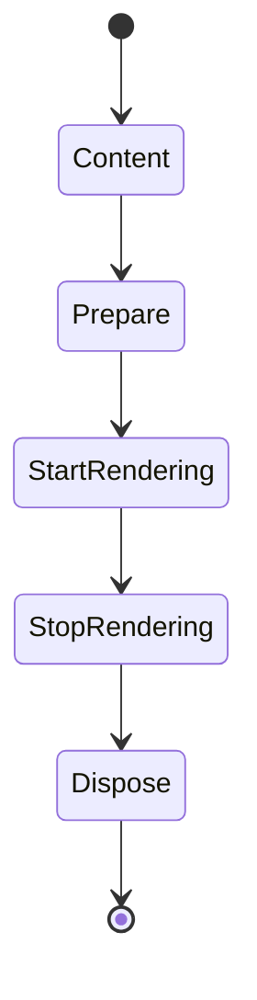

# [APPUI_SURFACE_HOSTS]

Rasm.AppUi mounts one shell into every admitted host substrate through a single seven-case `SurfaceHost` axis: one seam record carries every host-side delegate column, one mount transaction produces the surface receipt and teardown session, one embed capsule owns the foreign-view boundary, one scheduler boundary completes the UI marshal port, and per-RID native asset rows prove load identity. The page owns the host axis, the embedding capsule, the scheduler boundary, the native asset table, and the host fact stream over Avalonia, ReactiveUI.Avalonia, the SkiaSharp and HarfBuzzSharp native families, LanguageExt rails, and the abstract `SurfaceSeam` mount-delegate columns an app root binds to a live host.

## [01]-[INDEX]

- [01]-[HOST_AXIS]: Seven-case host axis, seam columns, one mount transaction.
- [02]-[EMBED_CAPSULE]: Foreign-view embedding capsule, lifecycle order, platform policy.
- [03]-[SCHEDULER_BOUNDARY]: One UI-thread boundary completing the scheduler port marshal.
- [04]-[NATIVE_ASSETS]: Per-RID Skia and HarfBuzz rows with load-identity receipts.
- [05]-[SCALE_FOCUS]: Closed host fact union for scale, visibility, focus, appearance.

## [02]-[HOST_AXIS]

- Owner: `SurfaceHost` — one `[Union]` host axis; `SurfaceSeam` — the host-delegate column record; `SurfaceRow` — the resolved policy row; `Surfaces` — the total dispatch and mount surface; `SurfaceFault` — the fault family; `SurfaceReceipt` and `SurfaceSession` — mount evidence.
- Cases: AvaloniaDesktopWindow, RhinoPanel, RhinoModal, Gh2CompanionWindow, SidecarShell, WebBrowser, Headless; `SurfaceFault` = Text | HostAbsent | MountRejected | HandleUnavailable | ThreadAffinity — codes derive through the `AppUiFaultBand.Surface` registry row (6000).
- Entry: `Fin<SurfaceSession> Mount(SurfaceHost host, SurfaceSeam seam, Control content, ClockPolicy clocks, CorrelationId correlation)` — `Fin` aborts on absent host, rejected mount, missing handle, and thread-affinity violation.
- Auto: one mount transaction replaces seven boot programs — boot-edge guard, builder shaping, parent-handle capture, scale capture, disposal registration, and receipt emission land in one fold; raw case keys serialize through the suite wire law as locked kind literals.
- Receipt: `SurfaceReceipt` — host case, native handle identity as descriptor plus `Option<long>` value (interactive rows always `Some` because a missing handle aborts the mount, the headless row structurally `None`), scale, `Instant`, `CorrelationId`; `TelemetryRow` contributes the mount-outcome and scale-flip instruments inward through the AppHost `TelemetryContributorPort`.
- Packages: Avalonia, Avalonia.Desktop, Avalonia.Headless, Avalonia.Skia, ReactiveUI.Avalonia, System.Reactive, Thinktecture.Runtime.Extensions, LanguageExt.Core, NodaTime, Rasm.AppHost (project)
- Growth: one case row — payload fields, seam column, capability set — absorbs a new host substrate with zero new surface, and one host instrument is one `InstrumentRow` on `Surfaces.TelemetryRow`; `WebBrowser` stays the designed growth case whose future activation is one seam column plus one dispatch arm swap.
- Boundary: `Surfaces` is the named boundary capsule for the statement carve-out on its boot-edge guard; host-agnostic sourcing law — every probe, marshal, mount, and fact delegate is a `SurfaceSeam` column and no dispatch arm names a host API: rhino rows cross only the panel, semi-modal, and UI-thread `SurfaceSeam` delegate columns (the catching marshal that wraps the swallowing host invoke binds at the app root that composes a live host), the gh2 row crosses only its companion-mount `SurfaceSeam` column, and the empty-host shell crosses nothing; boot is one `SetupWithoutStarting` admission behind the `Interlocked` edge guard and a second `AppBuilder` or lifetime anywhere is the rejected form; production view materialization uses Avalonia's compiled-XAML path — each generated view constructor calls the core `AvaloniaXamlLoader.Load(this)` materializer, while `AvaloniaRuntimeXamlLoader` from `Avalonia.Markup.Xaml.Loader` remains Debug-only behind HotAvalonia and `RejectRuntimeInflation` structurally faults any Release attempt to parse or load source markup; desktop backend admission is exactly `UsePlatformDetect`, which already installs Skia, while the headless proof lane composes `UseSkia` explicitly because `UseHeadlessDrawing = false`; the shared `SkiaOptions` value carries `MaxGpuResourceSizeBytes` from the `GpuResourceBudget` anchor with `UseOpacitySaveLayer` true so the render-hash lanes share one deterministic GPU budget and a per-shell GPU knob is the rejected form; `WebBrowser` carries an empty capability set and zero payload, so its wire key is its only live surface; the headless row holds host-document capability structurally false, draws through Skia with the `FrameBufferFormat` pinned to `Rgba8888` so the capture pixel layout is one declared comparison layout for the render-hash lanes, attaches through `HeadlessRoot` whose receipt handle is structurally `None`, and is the mount surface of the command-journal replay lane; a missing platform handle on an interactive row aborts as `SurfaceFault.HandleUnavailable` — a zero-handle success receipt is the deleted sentinel, so every `Some` handle originates from a present platform handle and mount success and failure stay disjoint on the `Fin` rail.

```csharp signature
[Union]
public abstract partial record SurfaceHost {
    private SurfaceHost() { }
    public sealed record AvaloniaDesktopWindow : SurfaceHost;
    public sealed record RhinoPanel(Guid PanelId) : SurfaceHost;
    public sealed record RhinoModal : SurfaceHost;
    public sealed record Gh2CompanionWindow : SurfaceHost;
    public sealed record SidecarShell : SurfaceHost;
    public sealed record WebBrowser : SurfaceHost;
    public sealed record Headless : SurfaceHost;
}

[Union]
public abstract partial record SurfaceFault : Expected, IValidationError<SurfaceFault> {
    private SurfaceFault(string detail, int code) : base(detail, code, None) { }

    public static SurfaceFault Create(string message) => new Text(message);

    public sealed record Text : SurfaceFault { public Text(string detail) : base(detail, AppUiFaultBand.Surface.Code(0)) { } }
    public sealed record HostAbsent : SurfaceFault { public HostAbsent(string detail) : base(detail, AppUiFaultBand.Surface.Code(1)) { } }
    public sealed record MountRejected : SurfaceFault { public MountRejected(string detail) : base(detail, AppUiFaultBand.Surface.Code(2)) { } }
    public sealed record HandleUnavailable : SurfaceFault { public HandleUnavailable(string detail) : base(detail, AppUiFaultBand.Surface.Code(3)) { } }
    public sealed record ThreadAffinity : SurfaceFault { public ThreadAffinity(string detail) : base(detail, AppUiFaultBand.Surface.Code(4)) { } }
}

public sealed record SurfaceSeam(
    Func<Guid, Func<EmbedCapsule, Fin<IDisposable>>> PanelMount,
    Func<EmbedCapsule, Fin<IDisposable>> ModalMount,
    Func<EmbedCapsule, Fin<IDisposable>> CompanionMount,
    Func<Action, IO<Unit>> HostMarshal,
    Func<bool> OnUiThread,
    Func<AppBuilder, Fin<Unit>> RunLoop,
    Func<double> Scale,
    Func<Action<SurfaceFact>, IDisposable> HostFacts);

public sealed record SurfaceRow(
    Func<AppBuilder, AppBuilder> Build,
    Func<AppBuilder, Fin<Unit>> Start,
    Func<Action, IO<Unit>> Marshal,
    Func<double> Scale,
    Func<bool> OnUiThread,
    Func<Control, Fin<(Option<long> Handle, string Descriptor, IDisposable Teardown)>> Attach,
    Func<Action<SurfaceFact>, IDisposable> Facts,
    FrozenSet<Capability> Capabilities,
    SurfaceMode Mode);

[SmartEnum<string>]
public sealed partial class SurfaceMode {
    public static readonly SurfaceMode Interactive = new("interactive", usesVirtualTime: false);
    public static readonly SurfaceMode Headless = new("headless", usesVirtualTime: true);

    public bool UsesVirtualTime { get; }
}

public sealed record SurfaceReceipt(SurfaceHost Host, string Descriptor, Option<long> Handle, double Scale, Instant At, CorrelationId Correlation);

public sealed record SurfaceSession(SurfaceReceipt Receipt, Func<Action<SurfaceFact>, IDisposable> Facts, IDisposable Teardown) : IDisposable {
    public void Dispose() => Teardown.Dispose();
}
```

```csharp signature
public static class Surfaces {
    private static int booted;

    public const long GpuResourceBudget = 268_435_456;

    private static readonly SkiaOptions SkiaBudget = new() { MaxGpuResourceSizeBytes = GpuResourceBudget, UseOpacitySaveLayer = true };

    public static Fin<SurfaceRow> Row(SurfaceHost host, SurfaceSeam seam) => host.Switch(
        state: seam,
        avaloniaDesktopWindow: static (s, own) => Fin.Succ(Shell(s, static b => b.UsePlatformDetect().With(SkiaBudget).UseReactiveUI(), s.RunLoop, Windowed, SurfaceMode.Interactive)),
        rhinoPanel: static (s, own) => Fin.Succ(Embedded(s, s.PanelMount(own.PanelId))),
        rhinoModal: static (s, own) => Fin.Succ(Embedded(s, s.ModalMount)),
        gh2CompanionWindow: static (s, own) => Fin.Succ(Embedded(s, s.CompanionMount)),
        sidecarShell: static (s, own) => Fin.Succ(Shell(s, static b => b.UsePlatformDetect().With(SkiaBudget).UseReactiveUI(), s.RunLoop, Windowed, SurfaceMode.Interactive)),
        webBrowser: static (s, own) => Fin.Fail<SurfaceRow>(new SurfaceFault.HostAbsent(nameof(SurfaceHost.WebBrowser))),
        headless: static (s, own) => Fin.Succ(Shell(s,
            static b => b.UseSkia().With(SkiaBudget).UseHeadless(new AvaloniaHeadlessPlatformOptions { UseHeadlessDrawing = false, FrameBufferFormat = PixelFormat.Rgba8888 }).UseReactiveUI(),
            Setup, HeadlessRoot, SurfaceMode.Headless)));

    public static Fin<Unit> Boot(SurfaceHost host, SurfaceSeam seam, Func<AppBuilder> entry) =>
        from row in Row(host, seam)
        from started in FirstBoot() ? row.Start(row.Build(entry())) : Fin.Succ(unit)
        select started;

    public static Fin<SurfaceSession> Mount(SurfaceHost host, SurfaceSeam seam, Control content, ClockPolicy clocks, CorrelationId correlation) =>
        from row in Row(host, seam)
        from gate in SurfaceScheduler.For(row).Affinity(nameof(Mount))
        from attached in row.Attach(content)
        select new SurfaceSession(
            new SurfaceReceipt(host, attached.Descriptor, attached.Handle, row.Scale(), clocks.Now, correlation),
            row.Facts,
            attached.Teardown);

    private static SurfaceRow Embedded(SurfaceSeam seam, Func<EmbedCapsule, Fin<IDisposable>> mount) => new(
        Build: static builder => EmbedOptions.Embedded.Admit(builder),
        Start: Setup,
        Marshal: seam.HostMarshal,
        Scale: seam.Scale,
        OnUiThread: seam.OnUiThread,
        Attach: content => new EmbedCapsule(content, EmbedOptions.Embedded).Mounted(mount)
            .Map(static attached => (Some(attached.Handle), attached.Descriptor, attached.Teardown)),
        Facts: seam.HostFacts,
        Capabilities: Capability.Set(Capability.HostDocument),
        Mode: SurfaceMode.Interactive);

    private static SurfaceRow Shell(
        SurfaceSeam seam, Func<AppBuilder, AppBuilder> build, Func<AppBuilder, Fin<Unit>> start,
        Func<Control, Fin<(Option<long> Handle, string Descriptor, IDisposable Teardown)>> attach, SurfaceMode mode) => new(
        Build: build,
        Start: start,
        Marshal: SurfaceScheduler.Post,
        Scale: seam.Scale,
        OnUiThread: seam.OnUiThread,
        Attach: attach,
        Facts: seam.HostFacts,
        Capabilities: Capability.Set(),
        Mode: mode);

    private static Fin<Unit> Setup(AppBuilder builder) => Fin.Succ(ignore(builder.SetupWithoutStarting()));

    private static bool FirstBoot() => Interlocked.Exchange(ref booted, 1) == 0;

    // Interactive windows FAULT on a missing platform handle — a zero-handle success receipt is the
    // deleted sentinel; the headless row legitimately carries None through its own attach.
    private static Fin<(Option<long> Handle, string Descriptor, IDisposable Teardown)> Windowed(Control content) =>
        Fin.Succ(new Window { Content = content })
            .Map(static window => (fun(window.Show)(), window).Item2)
            .Bind(static window => window.TryGetPlatformHandle() is { } handle
                ? Fin.Succ((Some(handle.Handle.ToInt64()), handle.HandleDescriptor ?? string.Empty,
                    (IDisposable)Disposable.Create(window.Close)))
                : (fun(window.Close)(), Fin.Fail<(Option<long>, string, IDisposable)>(
                    new SurfaceFault.HandleUnavailable(nameof(Windowed)))).Item2);

    private static Fin<(Option<long> Handle, string Descriptor, IDisposable Teardown)> HeadlessRoot(Control content) =>
        Fin.Succ(new Window { Content = content })
            .Map(static window => (fun(window.Show)(), window).Item2)
            .Map(static window => (Option<long>.None, nameof(SurfaceHost.Headless), (IDisposable)Disposable.Create(window.Close)));

    public static Fin<TControl> RejectRuntimeInflation<TControl>(string view) where TControl : Control =>
        Fin.Fail<TControl>(new SurfaceFault.MountRejected($"<runtime-xaml-rejected:{view}; AvaloniaRuntimeXamlLoader is debug-only>"));

    public const string MountInstrument = "rasm.appui.surface.mounted";
    public const string ScaleInstrument = "rasm.appui.surface.scaled";
    public const string FactInstrument = "rasm.appui.surface.fact";
    public const string AffinityInstrument = "rasm.appui.surface.affinity-violation";

    public static TelemetryContributorPort TelemetryRow(string version) =>
        AppUiTelemetry.Contribute(version, MountInstrument, ScaleInstrument, FactInstrument, AffinityInstrument);
}
```

## [03]-[EMBED_CAPSULE]

- Owner: `EmbedCapsule` — the foreign-view boundary capsule deriving the embeddable top-level; `EmbedOptions` — the embedded platform policy row.
- Entry: `Fin<(long Handle, string Descriptor, IDisposable Teardown)> Mounted(Func<EmbedCapsule, Fin<IDisposable>> mount)` — `Fin` aborts on handle absence and seam rejection with defensive capsule disposal.
- Auto: construction runs the load-bearing order in one body — `EnforceClientSize` value, `Content`, `Prepare` — and `Mounted` appends retained-view capture, seam attach, and `StartRendering`; teardown composes `StopRendering`, seam detach, `Dispose` in declared order.
- Packages: Avalonia, System.Reactive, LanguageExt.Core
- Growth: one `EmbedOptions` policy value per new platform knob; zero new surface.
- Boundary: every successful `Mounted` and its composed teardown ride the `Surfaces.MountInstrument` count through the one `AppUiTelemetry.Contribute` spine, and a handle-absent or seam-rejected `Fin` failure folds its `SurfaceFault` into the same mount-outcome evidence, so the foreign-view boundary mints no second telemetry surface; `EmbedCapsule` is the named boundary capsule for the statement carve-out — the constructor carries the ordered statements; `GetNSViewRetained` hands a retained pointer whose release belongs to the host seam after detach, and the accessor carries Avalonia's unstable-API obsolete marker, so the capsule's `RetainedView` body is the single acknowledged suppression site; `EnforceClientSize` is a protected setter reachable only inside the derived capsule, and the host seam pushes frame sync on every panel-resize fact while it holds true; `MacOSPlatformOptions` and `AvaloniaNativePlatformOptions` values enter only through `EmbedOptions.Admit` and a hardcoded platform knob in boot code is the rejected form — `ShowInDock` false keeps embedded rows out of the macOS Dock, `DisableDefaultApplicationMenuItems` strips the default app menu under the host menu bar, `DisableNativeMenus`/`DisableSetProcessName`/`DisableAvaloniaAppDelegate` complete the plugin-host menu and process-identity policy, and `RenderingMode` is the `AvaloniaNativePlatformOptions.RenderingMode` `IReadOnlyList<AvaloniaNativeRenderingMode>` backend policy column whose three rows are `Metal`, `OpenGl`, and `Software` (Avalonia's own default ordering is `[OpenGl, Software]` and the embedded backend ordering the render research row decides), with `AvaloniaNativeLibraryPath` carrying the optional native-binary override and `AppSandboxEnabled`/`OverlayPopups` the remaining platform knobs; Avalonia owns GPU backend selection through `RenderingMode`, so a direct `GRContext.CreateMetal`/`CreateVulkan`/`CreateDirect3D`/`CreateGl` call inside a dispatch arm is the rejected form (PROHIBITION host-API-in-arm) — a shared-context requirement against the host pipeline rides one `SurfaceSeam` delegate column bound at composition, never a per-host GPU call site, and the exact shared-context spelling is the EMBED_SPIKE render research row; the AppKit dispatcher-pump regime under the Rhino-owned run-loop stays research-gated.

```csharp signature
public sealed record EmbedOptions(
    bool DisableAvaloniaAppDelegate,
    bool DisableSetProcessName,
    bool DisableNativeMenus,
    bool DisableDefaultApplicationMenuItems,
    bool ShowInDock,
    bool EnforceClientSize,
    Option<string> NativeLibraryPath,
    Option<Seq<AvaloniaNativeRenderingMode>> RenderingMode) {
    public static readonly EmbedOptions Embedded = new(
        DisableAvaloniaAppDelegate: true,
        DisableSetProcessName: true,
        DisableNativeMenus: true,
        DisableDefaultApplicationMenuItems: true,
        ShowInDock: false,
        EnforceClientSize: true,
        NativeLibraryPath: None,
        RenderingMode: None);

    public AppBuilder Admit(AppBuilder builder) =>
        builder
            .With(RenderingMode
                .Map(modes => new AvaloniaNativePlatformOptions { AvaloniaNativeLibraryPath = (string?)NativeLibraryPath.Case, RenderingMode = [.. modes] })
                .IfNone(() => new AvaloniaNativePlatformOptions { AvaloniaNativeLibraryPath = (string?)NativeLibraryPath.Case }))
            .UseSkia()
            .UseAvaloniaNative()
            .UseReactiveUI()
            .With(new MacOSPlatformOptions {
                DisableAvaloniaAppDelegate = DisableAvaloniaAppDelegate,
                DisableSetProcessName = DisableSetProcessName,
                DisableNativeMenus = DisableNativeMenus,
                DisableDefaultApplicationMenuItems = DisableDefaultApplicationMenuItems,
                ShowInDock = ShowInDock,
            });
}

public sealed class EmbedCapsule : EmbeddableControlRoot {
    public EmbedCapsule(Control content, EmbedOptions options) {
        EnforceClientSize = options.EnforceClientSize;
        Content = content;
        Prepare();
    }

    public Fin<(long Handle, string Descriptor, IDisposable Teardown)> Mounted(Func<EmbedCapsule, Fin<IDisposable>> mount) =>
        (from view in RetainedView()
         from detach in mount(this)
         from live in Start()
         select (view.Handle, view.Descriptor, (IDisposable)new CompositeDisposable(Disposable.Create(StopRendering), detach, Disposable.Create(Dispose))))
        .MapFail(fault => (fun(Dispose)(), fault).Item2);

    public Fin<(long Handle, string Descriptor)> RetainedView() =>
        TryGetPlatformHandle() switch {
            IMacOSTopLevelPlatformHandle mac => Fin.Succ((mac.GetNSViewRetained().ToInt64(), "NSView")),
            { } handle => Fin.Succ((handle.Handle.ToInt64(), handle.HandleDescriptor ?? string.Empty)),
            null => Fin.Fail<(long, string)>(new SurfaceFault.HandleUnavailable(nameof(EmbedCapsule))),
        };

    public Fin<Unit> Start() => Fin.Succ(fun(StartRendering)());
}
```



## [04]-[SCHEDULER_BOUNDARY]

- Owner: `SurfaceScheduler` — the one record where the UI dispatcher, the Avalonia reactive scheduler, and the host marshal meet.
- Entry: `SurfaceScheduler For(SurfaceRow row, Option<TimeProvider> virtualTime = default)` — pure projection over the resolved row; the UI-thread predicate and deterministic-time capability are sourced once from the row, so no parallel host discriminator or `onUiThread` parameter threads beside it.
- Auto: `Port` completes `UiSchedulerPort.Marshal` from this boundary at the composition root — `Phases` and `Degradation` arrive already bound; `UseReactiveUI` admission wires the reactive main-thread scheduler onto `AvaloniaScheduler`.
- Packages: ReactiveUI.Avalonia, Avalonia, System.Reactive, LanguageExt.Core, BCL inbox
- Growth: one marshal column per new host thread regime; carrier swap on the virtual-time slot; zero new surface.
- Boundary: `Affinity` is the single thread-affinity assertion and a per-call-site access check is the rejected form; the UI-thread predicate originates once at the seam's `OnUiThread` column and flows through `row.OnUiThread` into the scheduler — one source, no parallel parameter — so the access-assertion spelling stays a seam delegate and never a hardcoded dispatcher call inside a dispatch arm; a failed `Affinity` assertion folds its `SurfaceFault.ThreadAffinity` into the `Surfaces.AffinityInstrument` count through the one `AppUiTelemetry.Contribute` spine, so off-thread access is counted evidence on the timeline and a scheduler-local meter is the deleted form; embedded rows marshal through the seam's host column, windowed and headless rows post through the `AvaloniaScheduler` UI scheduler; the headless row receives its virtual `TimeProvider` from the test composition so the command-journal replay lane runs under deterministic time; `ObserveOn` rides `Ui` exactly once inside binding capsules, never at call sites.

```csharp signature
public sealed record SurfaceScheduler(IScheduler Ui, Func<Action, IO<Unit>> Marshal, Func<bool> OnUiThread, Option<TimeProvider> VirtualTime) {
    public static SurfaceScheduler For(SurfaceRow row, Option<TimeProvider> virtualTime = default) => new(
        AvaloniaScheduler.Instance,
        row.Marshal,
        row.OnUiThread,
        row.Mode.UsesVirtualTime ? virtualTime : None);

    public static IO<Unit> Post(Action action) =>
        IO.lift(() => (AvaloniaScheduler.Instance.Schedule(action), unit).Item2);

    public static UiSchedulerPort Port(UiSchedulerPort spine, SurfaceScheduler boundary) => spine with { Marshal = boundary.Marshal };

    public Fin<Unit> Affinity(string operation) =>
        OnUiThread() ? Fin.Succ(unit) : Fin.Fail<Unit>(new SurfaceFault.ThreadAffinity(operation));
}
```

## [05]-[NATIVE_ASSETS]

- Owner: `NativeAssetRow` — per-RID asset rows; `NativeAssetReceipt` — load-identity evidence; `NativeAssets` — the frozen row table and identity fold.
- Entry: `Fin<Seq<NativeAssetReceipt>> Identity(NativeAssetRow row)` — traverses the row's native libraries into receipts.
- Receipt: `NativeAssetReceipt` — library, version, path, RID; `TelemetryRow` contributes the asset-resolved and asset-absent instruments inward through the AppHost `TelemetryContributorPort`, so a missing-architecture load is a counted absence on the spine, never a silent draw fault.
- Packages: SkiaSharp.NativeAssets.macOS, SkiaSharp.NativeAssets.Linux.NoDependencies, HarfBuzzSharp.NativeAssets.macOS, HarfBuzzSharp.NativeAssets.Linux, LanguageExt.Core, BCL inbox
- Growth: one `NativeAssetRow` per new RID; one native-asset instrument is one `InstrumentRow` on `NativeAssets.TelemetryRow`; zero new surface.
- Boundary: one shaping family rides every admitted row — each Skia asset row pairs its HarfBuzz row across the macOS-plus-headless-Linux RID matrix (osx universal, linux-x64/arm64, linux-musl-x64) so cross-architecture load identity is one row per RID and a missing-architecture load surfaces as an absent receipt; the macOS rendering-mode column is `[OpenGl, Software]` by default with `Metal` available, sourced from `EmbedOptions.RenderingMode`, never a per-row GPU literal; the fontconfig-dependent Linux Skia variant stays pinned and excluded at the AppUi admission, so NoDependencies is the only Linux Skia asset and the glibc and musl rows share it; the Win32 desktop and WebAssembly native pins are dropped from the macOS-only build so no Win32 row exists and `WebBrowser` stays a wire-key-only designed growth case; identity receipts run at mount, so a wrong-RID load surfaces as a receipt, never a draw fault; the load-identity probe folds its per-row receipt count into the asset-resolved instrument and an absent receipt into the asset-absent instrument, so the native-asset evidence rides the same `AppUiTelemetry.Contribute` spine every owner uses and a per-row meter is the deleted form.

```csharp signature
public sealed record NativeAssetReceipt(string Library, string Version, string Path, string Rid);

public sealed record NativeAssetRow(string Rid, string SkiaAsset, string ShapingAsset, string HostAsset, Seq<string> Libraries);

public static class NativeAssets {
    public static readonly Seq<NativeAssetRow> Rows = Seq(
        new NativeAssetRow("osx", "SkiaSharp.NativeAssets.macOS", "HarfBuzzSharp.NativeAssets.macOS", "libAvaloniaNative.dylib", Seq("libSkiaSharp", "libHarfBuzzSharp", "libAvaloniaNative")),
        new NativeAssetRow("linux-x64", "SkiaSharp.NativeAssets.Linux.NoDependencies", "HarfBuzzSharp.NativeAssets.Linux", "Avalonia.X11.dll", Seq("libSkiaSharp", "libHarfBuzzSharp")),
        new NativeAssetRow("linux-arm64", "SkiaSharp.NativeAssets.Linux.NoDependencies", "HarfBuzzSharp.NativeAssets.Linux", "Avalonia.X11.dll", Seq("libSkiaSharp", "libHarfBuzzSharp")),
        new NativeAssetRow("linux-musl-x64", "SkiaSharp.NativeAssets.Linux.NoDependencies", "HarfBuzzSharp.NativeAssets.Linux", "Avalonia.X11.dll", Seq("libSkiaSharp", "libHarfBuzzSharp")));

    public static Fin<Seq<NativeAssetReceipt>> Identity(NativeAssetRow row) =>
        row.Libraries.TraverseM(library => Probe(row, library)).As();

    public const string ResolvedInstrument = "rasm.appui.nativeasset.resolved";
    public const string AbsentInstrument = "rasm.appui.nativeasset.absent";

    public static TelemetryContributorPort TelemetryRow(string version) =>
        AppUiTelemetry.Contribute(version, ResolvedInstrument, AbsentInstrument);

    private static Fin<NativeAssetReceipt> Probe(NativeAssetRow row, string library) =>
        Process.GetCurrentProcess().Modules.Cast<ProcessModule>()
            .Where(module => module.ModuleName.Contains(library, StringComparison.OrdinalIgnoreCase))
            .Select(module => new NativeAssetReceipt(library, module.FileVersionInfo.FileVersion ?? string.Empty, module.FileName, row.Rid))
            .ToSeq()
            .HeadOrNone() is { IsSome: true, Case: NativeAssetReceipt receipt }
                ? Fin.Succ(receipt)
                : Fin.Fail<NativeAssetReceipt>(new SurfaceFault.HostAbsent(library));
}
```

## [06]-[SCALE_FOCUS]

- Owner: `SurfaceFact` — one closed host fact union for scale, visibility, focus, appearance, and display topology.
- Cases: ScaleChanged, VisibilityChanged, FocusChanged, AppearanceChanged, DisplayChanged.
- Packages: Thinktecture.Runtime.Extensions, BCL inbox
- Growth: one fact case per new host signal extends the `SurfaceFact` family; every subscriber is a total fold over the closed family, zero new surface.
- Boundary: facts enter only through the seam's `HostFacts` column — macOS rows feed `NSScreen` `BackingScaleFactor` flips and appearance changes host-side, panel rows feed visibility and focus from panel events through the `SurfaceSeam.HostFacts` delegate column an app root binds to the host; visibility facts feed the activation rail and live-data suspend-resume, appearance facts feed the host-matched variant re-probe, scale facts feed DPI-variant selection, display facts feed the dock placement clamp — saved floating-window geometry re-clamps against the live screen set on every topology flip, so a restore after a monitor detach never lands off-screen; every fact folds one observation into the `Surfaces.FactInstrument` count keyed by its case kind through the one `AppUiTelemetry.Contribute` spine, so host-signal volume is attributable per case and a second host event channel or a per-fact meter beside this union is the rejected form.

```csharp signature
[Union]
public abstract partial record SurfaceFact {
    private SurfaceFact() { }
    public sealed record ScaleChanged(double Scale) : SurfaceFact;
    public sealed record VisibilityChanged(bool Visible) : SurfaceFact;
    public sealed record FocusChanged(bool Focused) : SurfaceFact;
    public sealed record AppearanceChanged(bool Dark) : SurfaceFact;
    public sealed record DisplayChanged(int Screens) : SurfaceFact;
}
```

## [07]-[RESEARCH]

- [EMBED_SPIKE]: the seam `OnUiThread` access-assertion spelling and scheduler boundary under the Rhino-owned AppKit run-loop — the UI-thread predicate the seam column binds, input and IME delivery, and the CADisplayLink-paced pump fallback row; `EnforceClientSize` tracking of the foreign host view against seam-pushed frame sync on panel resize; render-backend selection for the embedded surface — `RenderingMode` orderings of Metal against the host pipeline against software raster, compared on frame-elapsed receipts; the shared-context spelling is settled — `Render/pipeline.md#RENDER_GRAPH` `Lease` opens the host GPU context through `ISkiaSharpApiLeaseFeature.Lease()` and `ISkiaSharpApiLease.TryLeasePlatformGraphicsApi()`, so the remaining question is only the lease acquisition ordering against the Rhino-owned run loop.
