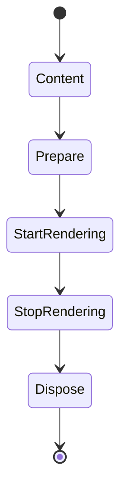

# [APPUI_SURFACE_HOSTS]

Rasm.AppUi mounts one shell into every admitted host substrate through two orthogonal values: the supplied `ConsumptionProfile` row states which host the composition root bound and what surface class that host admits, and a five-case `SurfaceMount` union states the mounting shape the caller asks for. One seam record carries every host-side delegate column, one mount transaction produces the surface receipt and teardown session, one embed capsule owns the foreign-view boundary, one scheduler boundary completes the UI marshal port, and per-RID native asset rows prove load identity.

Host identity reaches this page only as `HostDescriptor` columns — `Surface`, `Document` — so no dispatch arm names a product and a new host integration costs zero cases here. This page owns the mount axis, the surface admission, the owned-window chrome family, the embedding capsule, the scheduler boundary, the native asset table, and the host fact stream over Avalonia, ReactiveUI.Avalonia, the `Irihi.Ursa` window surface and its reactive bases, the SkiaSharp and HarfBuzzSharp native families, LanguageExt rails, and the abstract `SurfaceSeam` mount-delegate columns an app root binds to a live host.

## [01]-[INDEX]

- [02]-[HOST_AXIS]: Five-case mount axis, host-surface admission, seam columns, one mount transaction.
- [03]-[EMBED_CAPSULE]: Foreign-view embedding capsule, lifecycle order, platform policy.
- [04]-[SCHEDULER_BOUNDARY]: One UI-thread boundary completing the scheduler port marshal.
- [05]-[NATIVE_ASSETS]: Per-RID Skia and HarfBuzz rows with load-identity receipts.
- [06]-[SCALE_FOCUS]: Closed host fact union for scale, visibility, focus, appearance.

## [02]-[HOST_AXIS]

- Owner: `SurfaceMount` — one `[Union]` mounting-shape axis; `SurfaceSeam` — the host-delegate column record; `SurfaceRuntime` — the composition-bound clock and count columns; `SurfaceRow` — the resolved policy row; `Surfaces` — the total dispatch and mount surface; `SurfaceFault` — the fault family; `SurfaceReceipt` and `SurfaceSession` — mount evidence; `WindowChrome` — the owned-window chrome family, `ShellWindow` and `ShellSplash` its two window classes, `WindowTitle` the route-projected caption.
- Cases: Panel, Modal, Companion, Standalone, Offscreen; `HostSurface` (the AppHost descriptor column) admits Embedded → Panel/Modal/Companion, Windowed → Standalone, Offscreen → Offscreen, None → nothing; `SurfaceFault` = Text | HostAbsent | MountRejected | HandleUnavailable | ThreadAffinity | AxisUnsupported — codes derive through the `AppUiFaultBand.Surface` registry row (6000).
- Entry: `Fin<SurfaceSession> Mount(ConsumptionProfile profile, SurfaceMount mount, SurfaceSeam seam, Control content, SurfaceRuntime runtime, CorrelationId correlation)` — `Fin` aborts on unadmitted mount, absent host, an undeclared runtime identifier, rejected mount, missing handle, and thread-affinity violation.
- Auto: one mount transaction replaces every per-host boot program — surface admission, boot-edge guard, builder shaping, native load identity, parent-handle capture, scale capture, disposal registration, and receipt emission land in one fold; raw mount keys serialize through the suite wire law as locked kind literals.
- Receipt: `SurfaceReceipt` — mount case, host key off the descriptor, native handle identity as descriptor beside an `Option<long>` value (interactive rows always `Some` because a missing handle aborts the mount, the offscreen row structurally `None`), scale, `Instant`, `CorrelationId`; `SurfaceSession.Assets` carries the mount's per-library load-identity census so composition seals each present row as `EvidenceReceipt.NativeAssetIdentity` — the fan arm already waiting on it — while the absent rows count direct at the probe, and `SurfaceSession.Reach` carries the mount's capability answer into the command deck the same mount freezes while `SurfaceSession.Displays` carries the live working-area set into the layout restore that clamps against it; `TelemetryRow` contributes the mount-outcome, scale-flip, host-fact, and affinity instruments inward through the AppHost `TelemetryContributorPort`.
- Packages: Avalonia, Avalonia.Desktop, Avalonia.Headless, Avalonia.Skia, Irihi.Ursa, Irihi.Ursa.ReactiveUIExtension, ReactiveUI.Avalonia, System.Reactive, Thinktecture.Runtime.Extensions, LanguageExt.Core, NodaTime, Rasm.AppHost (project)
- Growth: a new host substrate is one `HostRows` descriptor row at the AppHost owner and costs zero cases here; a genuinely new mounting shape is one `SurfaceMount` case with one `Admits` arm; a new owned-window class is one `WindowChrome` row; one host instrument is one `InstrumentSpec` row on `Surfaces.TelemetryRow`.
- Boundary: `Surfaces` is the named boundary capsule for the statement carve-out on its boot-edge guard; host-agnostic sourcing law — every probe, marshal, mount, and fact delegate is a `SurfaceSeam` column, no dispatch arm names a host API, and no dispatch arm names a product: an `Embedded` host crosses only the panel, semi-modal, companion, and UI-thread `SurfaceSeam` delegate columns (the catching marshal that wraps the swallowing host invoke binds at the app root that composes a live host) while an unhosted shell crosses nothing; a `HostSurface` refusing the requested mount aborts as `SurfaceFault.AxisUnsupported` carrying `AxisEvidence` on the `host` axis, so a browser-resolved or service-resolved profile mints no surface and the package neither degrades silently nor narrows its public surface; boot is one `SetupWithoutStarting` admission behind the `Interlocked` edge guard and a second `AppBuilder` or lifetime anywhere is the rejected form — a second setup call throws process-wide, and the one admitted platform serves every host the process carries: all mounts share one windowing platform, one graphics backend, and one dispatcher, so a per-host builder, per-host platform, or per-host UI thread is unrepresentable rather than merely discouraged; production view materialization uses Avalonia's compiled-XAML path — each generated view constructor calls the core `AvaloniaXamlLoader.Load(this)` materializer, while `AvaloniaRuntimeXamlLoader` from `Avalonia.Markup.Xaml.Loader` remains Debug-only behind HotAvalonia and `RejectRuntimeInflation` structurally faults any Release attempt to parse or load source markup; desktop backend admission is exactly `UsePlatformDetect`, which already installs Skia, while the headless proof lane composes `UseSkia` explicitly because `UseHeadlessDrawing = false`; the shared `SkiaOptions` value carries `MaxGpuResourceSizeBytes` from the `GpuResourceBudget` anchor with `UseOpacitySaveLayer` true so the render-hash lanes share one deterministic GPU budget and a per-shell GPU knob is the rejected form; the mount plane is the SECOND capability gate and `SurfaceRow.Reach` is its whole answer — `profile.HostDocument` off the descriptor narrowed by the resolved mount case, so an embedded row under a document-bearing host reaches `Capability.HostDocument` while the windowed and offscreen rows reach the roster without it — and the set rides `SurfaceSession.Reach` into the `Shell/commands` `CommandIntent.Availability` fold, where `Admits` requires the level AND the reach: `DegradationLevel` is health-derived and its `Full` row retains `Capability.HostDocument` on every healthy process, so a level-only gate admitted every host-targeting verb against a standalone shell that owns no document, and a mount-capability column no gate reads is the same defect wearing the opposite face; the offscreen row draws through Skia with the `FrameBufferFormat` pinned to `Rgba8888` so the capture pixel layout is one declared comparison layout for the render-hash lanes, attaches through `HeadlessRoot` whose receipt handle is structurally `None`, and is the mount surface of the command-journal replay lane; every window this package OWNS is chromed by one `WindowChrome` row and never by a caption write at a mount site — the row carries the platform-frame suppression every owned window takes, plus the title-bar admission, the four caption-button gates, and the managed-resizer gate the Ursa caption surface answers, so a standalone shell, a torn-out float, a splash, and an offscreen capture root differ by row VALUES and a per-host window subclass is unrepresentable; the row applies at `Window` rather than at `UrsaWindow` because `Ursa.Controls.SplashWindow` and `Dock.Avalonia.Controls.HostWindow` each derive `Window` directly, so the narrower constraint left the two rows whose whole purpose is those two hosts unwritable at their own mount sites, and `Window.WindowDecorations` set to `None` (`.api/api-avalonia.md` `[WINDOW_CHROME_OPERATIONS]`) is what makes the splash undismissible and the float host's caption its own `HostWindowTitleBar` rather than the platform's; the class election is LAW rather than preference: `ShellWindow : ReactiveUrsaWindow<TViewModel>` and every shell view `: ReactiveUrsaView<TViewModel>`, because the non-reactive `UrsaWindow`/`UrsaView` pair carries no `IViewFor<T>` and the router's `RoutedViewHost` resolves views by that contract alone, so a bare `Window`, a bare `UserControl`, and the non-reactive Ursa bases are three spellings of the same defect — a view the router cannot resolve and a window the chrome row strips of the platform frame with no caption surface left to draw one in its place; caption and resizer geometry are the Ursa window surface's own properties (`IsTitleBarVisible`, `IsMinimizeButtonVisible`, `IsRestoreButtonVisible`, `IsFullScreenButtonVisible`, `IsCloseButtonVisible`, `IsManagedResizerVisible`, `TitleBarContent`/`LeftContent`/`RightContent`, `TitleBarMargin`, `.api/api-ursa.md` `[NAVIGATION_PROPERTIES]`), so a hand-drawn caption strip, a `WindowResizerThumb` placed by hand, and a local caption-button enum are the deleted forms — `ResizeDirection` is the package's own `[Flags]` axis with `Sides`, `Corners`, and `All` composites and a local resize vocabulary beside it is a rename shell; the per-window title is a PROJECTION of the active route through `WindowTitle`, subscribed once per window from the router's own stack rather than assigned at navigation sites, so a float showing one screen and the shell showing another each read the same composition and a manual `Title` write is the deleted form; cold boot runs through `ShellSplash : SplashWindow`, whose `CreateNextWindow` override returns the composed shell window and whose `CountDown` bounds the minimum display, so the splash owns the handoff and a boot-time timer beside it is unrepresentable — the splash carries `WindowChrome.Splash`, which admits no title bar and no caption button at all, because a dismissible splash lets a user close the boot sequence out from under its own continuation; a missing platform handle on an interactive row aborts as `SurfaceFault.HandleUnavailable` — a zero-handle success receipt is the deleted sentinel, so every `Some` handle originates from a present platform handle and mount success and failure stay disjoint on the `Fin` rail; every count this page declares writes through the ONE composition-bound `SurfaceRuntime.Count` column threaded onto the resolved row and its scheduler, so no dispatch arm and no scheduler body touches a meter and each instrument has exactly one producer — mount outcome on the evidence fan's surface arm, native-asset resolution on its native-asset arm, and scale flips, host facts, native absences, and affinity refusals direct where the delegate holds the typed fact in hand.

`isolation` reaches AppUi as one served value: the shell runs on the host's own UI thread, so the branch answers `in-proc` and `thread` through `SurfaceScheduler`, and `process`, `wasm`, and `remote` refuse on the `isolation` axis because a foreign address space owns no `Control` this page can mount.

```csharp signature
[Union]
public abstract partial record SurfaceMount {
    private SurfaceMount() { }
    public sealed record Panel(Guid PanelId) : SurfaceMount;
    public sealed record Modal : SurfaceMount;
    public sealed record Companion : SurfaceMount;
    public sealed record Standalone : SurfaceMount;
    public sealed record Offscreen : SurfaceMount;
}

[Union]
public abstract partial record SurfaceFault : Expected, IValidationError<SurfaceFault> {
    private SurfaceFault(string detail, int code) : base(detail, code, None) { }

    public static SurfaceFault Create(string message) => new Text(message);

    public sealed record Text : SurfaceFault { public Text(string detail) : base(detail, AppUiFaultBand.Surface.Code(0)) { } }
    public sealed record HostAbsent : SurfaceFault { public HostAbsent(string detail) : base(detail, AppUiFaultBand.Surface.Code(1)) { } }
    public sealed record MountRejected : SurfaceFault { public MountRejected(string detail) : base(detail, AppUiFaultBand.Surface.Code(2)) { } }
    public sealed record HandleUnavailable : SurfaceFault { public HandleUnavailable(string detail) : base(detail, AppUiFaultBand.Surface.Code(3)) { } }
    public sealed record ThreadAffinity : SurfaceFault { public ThreadAffinity(string detail) : base(detail, AppUiFaultBand.Surface.Code(4)) { } }

    public sealed record AxisUnsupported : SurfaceFault {
        public AxisUnsupported(AxisEvidence evidence) : base(evidence.Detail, AppUiFaultBand.Surface.Code(5)) => Evidence = evidence;

        public AxisEvidence Evidence { get; }
    }
}

public sealed record SurfaceSeam(
    Func<Guid, Func<EmbedCapsule, Fin<IDisposable>>> PanelMount,
    Func<EmbedCapsule, Fin<IDisposable>> ModalMount,
    Func<EmbedCapsule, Fin<IDisposable>> CompanionMount,
    Func<Action, IO<Unit>> HostMarshal,
    Func<bool> OnUiThread,
    Func<AppBuilder, Fin<Unit>> RunLoop,
    Func<double> Scale,
    // The live working-area set, read on demand rather than waited for: a restore runs before any topology
    // fact has fired, so a design reading displays off the fact stream alone would clamp its first layout
    // against nothing at all.
    Func<Seq<PixelRect>> Displays,
    Func<Action<SurfaceFact>, IDisposable> HostFacts,
    Func<long, IO<Unit>> ReleaseRetainedView);

// The composition-bound capability pair every mount threads, exactly as ScreenRuntime carries the
// screen plane's: Count is the ONE meter reach this page has, and its optional argument is the
// (slot, value) dimension row the written instrument declared — a bare tag value would let a write
// name a key the instrument's own Dimensions never declared, which the governance view then drops.
public sealed record SurfaceRuntime(ClockPolicy Clocks, Func<string, Option<(string Slot, string Value)>, Unit> Count);

// Reach is the MOUNT plane's capability set — total over the roster minus what this mounting shape
// structurally cannot touch. It is a second gate beside DegradationLevel, never a copy of it: the level
// is health-derived and DegradationLevel.Full retains Capability.HostDocument on every healthy process,
// so a level alone admits a host-document command against a standalone window that owns no document.
public sealed record SurfaceRow(
    Func<AppBuilder, AppBuilder> Build,
    Func<AppBuilder, Fin<Unit>> Start,
    Func<Action, IO<Unit>> Marshal,
    Func<double> Scale,
    Func<Seq<PixelRect>> Displays,
    Func<bool> OnUiThread,
    Func<Control, Fin<(Option<long> Handle, string Descriptor, IDisposable Teardown)>> Attach,
    Func<Action<SurfaceFact>, IDisposable> Facts,
    FrozenSet<Capability> Reach,
    SurfaceMode Mode);

[SmartEnum<string>]
public sealed partial class SurfaceMode {
    public static readonly SurfaceMode Interactive = new("interactive", usesVirtualTime: false);
    public static readonly SurfaceMode Headless = new("headless", usesVirtualTime: true);

    public bool UsesVirtualTime { get; }
}

public sealed record SurfaceReceipt(SurfaceMount Mount, string HostKey, string Descriptor, Option<long> Handle, double Scale, Instant At, CorrelationId Correlation);

// Assets is the mount's load-identity census: every present row is an EvidenceReceipt.NativeAssetIdentity
// composition seals (its fan arm writes the resolved instrument), every absent row was already counted at
// the probe, so a wrong-RID load is evidence on the mount rather than a draw fault three frames later.
// Reach travels beside it because the command deck freezes against the mount that produced it: the deck's
// availability fold reads this set, so the mount's own capability answer reaches the gate that needs it.
// Displays travels for the same reason from the opposite direction: layout restore runs before any topology
// fact has fired, so the clamp reads the live working areas off the session it is restoring into.
public sealed record SurfaceSession(
    SurfaceReceipt Receipt,
    Seq<(string Library, Option<NativeAssetFact> Fact)> Assets,
    FrozenSet<Capability> Reach,
    Func<Seq<PixelRect>> Displays,
    Func<Action<SurfaceFact>, IDisposable> Facts,
    IDisposable Teardown) : IDisposable {
    public void Dispose() => Teardown.Dispose();
}
```

```csharp signature
public static class Surfaces {
    private static int booted;

    public const long GpuResourceBudget = 268_435_456;

    private static readonly SkiaOptions SkiaBudget = new() { MaxGpuResourceSizeBytes = GpuResourceBudget, UseOpacitySaveLayer = true };

    // Admission runs first and passes exactly one host fact — the descriptor's surface class — into
    // dispatch, so every arm below already holds an admitting host and none of them probes for one.
    private static bool Admits(HostSurface surface, SurfaceMount mount) => surface.Switch(
        state: mount,
        embedded: static m => m is SurfaceMount.Panel or SurfaceMount.Modal or SurfaceMount.Companion,
        windowed: static m => m is SurfaceMount.Standalone,
        offscreen: static m => m is SurfaceMount.Offscreen,
        none: static _ => false);

    public static Fin<SurfaceRow> Row(ConsumptionProfile profile, SurfaceMount mount, SurfaceSeam seam) =>
        Admits(profile.Surface, mount)
            ? mount.Switch(
                state: (Seam: seam, Document: profile.HostDocument),
                panel: static (s, own) => Fin.Succ(Embedded(s.Seam, s.Seam.PanelMount(own.PanelId), s.Document)),
                modal: static (s, own) => Fin.Succ(Embedded(s.Seam, s.Seam.ModalMount, s.Document)),
                companion: static (s, own) => Fin.Succ(Embedded(s.Seam, s.Seam.CompanionMount, s.Document)),
                standalone: static (s, own) => Fin.Succ(Shell(s.Seam, static b => b.UsePlatformDetect().With(SkiaBudget).UseReactiveUI(), s.Seam.RunLoop, Windowed, SurfaceMode.Interactive)),
                offscreen: static (s, own) => Fin.Succ(Shell(s.Seam,
                    static b => b.UseSkia().With(SkiaBudget).UseHeadless(new AvaloniaHeadlessPlatformOptions { UseHeadlessDrawing = false, FrameBufferFormat = PixelFormat.Rgba8888 }).UseReactiveUI(),
                    Setup, HeadlessRoot, SurfaceMode.Headless)))
            : Fin.Fail<SurfaceRow>(new SurfaceFault.AxisUnsupported(
                new AxisEvidence(ProfileAxis.Host, profile.HostKey, $"{profile.Surface.Key} admits no {mount}")));

    // Boot edge is a claim-commit transaction: 0 unstarted, 1 start in flight, 2 committed. A failed
    // start restores 0 so boot stays retryable; only a completed Start commits the process-wide edge.
    public static Fin<Unit> Boot(ConsumptionProfile profile, SurfaceMount mount, SurfaceSeam seam, Func<AppBuilder> entry) =>
        from row in Row(profile, mount, seam)
        from started in Interlocked.CompareExchange(ref booted, 1, 0) switch {
            2 => Fin.Succ(unit),
            1 => Fin.Fail<Unit>(new SurfaceFault.MountRejected($"<boot-in-flight:{mount}>")),
            _ => row.Start(row.Build(entry()))
                .Map(static done => (Interlocked.Exchange(ref booted, 2), done).Item2)
                .MapFail(static fault => (Interlocked.Exchange(ref booted, 0), fault).Item2),
        }
        select started;

    // Native load identity runs INSIDE the mount transaction, before attach: the Boundary's "identity
    // receipts run at mount" is producible only here, and an absence is a counted census ROW rather than
    // a rail abort, so one missing architecture never hides the libraries that did load.
    public static Fin<SurfaceSession> Mount(
        ConsumptionProfile profile, SurfaceMount mount, SurfaceSeam seam, Control content, SurfaceRuntime runtime, CorrelationId correlation) =>
        from row in Row(profile, mount, seam)
        from gate in SurfaceScheduler.For(row, runtime).Affinity(nameof(Mount))
        from assets in Identified(runtime)
        from attached in row.Attach(content)
        select new SurfaceSession(
            new SurfaceReceipt(mount, profile.HostKey, attached.Descriptor, attached.Handle, row.Scale(), runtime.Clocks.Now, correlation),
            assets,
            row.Reach,
            row.Displays,
            Counted(row, runtime),
            attached.Teardown);

    // The mount plane's capability answer: every roster capability EXCEPT the ones this mounting shape
    // structurally cannot touch. Only the host document is mount-decided — a windowed root and a headless
    // root reach no host document however healthy the process reads, and a document-bearing descriptor
    // whose shell mounted offscreen reaches none either — so the set derives from the roster and a
    // per-factory capability literal, which admits exactly one capability and silently denies five, is the
    // deleted form.
    private static FrozenSet<Capability> Reaches(bool document) =>
        document
            ? Capability.Set([.. Capability.Items])
            : Capability.Set([.. Capability.Items.Where(static item => item != Capability.HostDocument)]);

    // An undeclared runtime identifier is a genuine host absence — no packaged natives exist for it — so
    // it aborts the mount, while a declared RID whose library never loaded is one absent census row.
    private static Fin<Seq<(string Library, Option<NativeAssetFact> Fact)>> Identified(SurfaceRuntime runtime) =>
        NativeAssets.Current
            .Map(NativeAssets.Identity)
            .ToFin(new SurfaceFault.HostAbsent(RuntimeInformation.RuntimeIdentifier))
            .Map(census => (census
                .Filter(static entry => entry.Fact.IsNone)
                .Fold(unit, (_, entry) => runtime.Count(NativeAssets.AbsentInstrument, Some((AppUiTelemetry.LibrarySlot, entry.Library)))), census).Item2);

    // Every host fact counts once through one total fold on its way to the subscriber: the case kind tags
    // FactInstrument for per-signal volume and the scale arm additionally counts the flip the DPI-variant
    // selection reads, so a second host event channel or a per-fact meter is unrepresentable.
    private static Func<Action<SurfaceFact>, IDisposable> Counted(SurfaceRow row, SurfaceRuntime runtime) =>
        observer => row.Facts(fact => {
            ignore(Observed(runtime, fact));
            observer(fact);
        });

    private static Unit Observed(SurfaceRuntime runtime, SurfaceFact fact) =>
        fact.Signal switch {
            var signal => (runtime.Count(FactInstrument, Some((AppUiTelemetry.SourceSlot, signal.Kind))),
                signal.ScaleFlip ? runtime.Count(ScaleInstrument, None) : unit).Item2,
        };

    private static SurfaceRow Embedded(SurfaceSeam seam, Func<EmbedCapsule, Fin<IDisposable>> mount, bool document) => new(
        Build: static builder => EmbedOptions.Embedded.Admit(builder),
        Start: Setup,
        Marshal: seam.HostMarshal,
        Scale: seam.Scale,
        Displays: seam.Displays,
        OnUiThread: seam.OnUiThread,
        Attach: content => new EmbedCapsule(content, EmbedOptions.Embedded).Mounted(mount, seam.ReleaseRetainedView)
            .Map(static attached => (Some(attached.Handle), attached.Descriptor, attached.Teardown)),
        Facts: seam.HostFacts,
        Reach: Reaches(document),
        Mode: SurfaceMode.Interactive);

    private static SurfaceRow Shell(
        SurfaceSeam seam, Func<AppBuilder, AppBuilder> build, Func<AppBuilder, Fin<Unit>> start,
        Func<Control, Fin<(Option<long> Handle, string Descriptor, IDisposable Teardown)>> attach, SurfaceMode mode) => new(
        Build: build,
        Start: start,
        Marshal: SurfaceScheduler.Post,
        Scale: seam.Scale,
        Displays: seam.Displays,
        OnUiThread: seam.OnUiThread,
        Attach: attach,
        Facts: seam.HostFacts,
        Reach: Reaches(document: false),
        Mode: mode);

    private static Fin<Unit> Setup(AppBuilder builder) => Fin.Succ(ignore(builder.SetupWithoutStarting()));

    // Interactive windows FAULT on a missing platform handle — a zero-handle success receipt is the
    // deleted sentinel; the offscreen row legitimately carries None through its own attach. BOTH rows
    // build through the one chrome family, so the capture lane and the shipped shell differ by exactly
    // the chrome columns their rows declare and never by a second window construction site.
    private static Fin<(Option<long> Handle, string Descriptor, IDisposable Teardown)> Windowed(Control content) =>
        Fin.Succ(WindowChrome.Shell.Build(content))
            .Map(static window => (fun(window.Show)(), window).Item2)
            .Bind(static window => window.TryGetPlatformHandle() is { } handle
                ? Fin.Succ((Some(handle.Handle.ToInt64()), handle.HandleDescriptor ?? string.Empty,
                    (IDisposable)Disposable.Create(window.Close)))
                : (fun(window.Close)(), Fin.Fail<(Option<long>, string, IDisposable)>(
                    new SurfaceFault.HandleUnavailable(nameof(Windowed)))).Item2);

    private static Fin<(Option<long> Handle, string Descriptor, IDisposable Teardown)> HeadlessRoot(Control content) =>
        Fin.Succ(WindowChrome.Bare.Build(content))
            .Map(static window => (fun(window.Show)(), window).Item2)
            .Map(static window => (Option<long>.None, nameof(SurfaceMount.Offscreen), (IDisposable)Disposable.Create(window.Close)));

    public static Fin<TControl> RejectRuntimeInflation<TControl>(string view) where TControl : Control =>
        Fin.Fail<TControl>(new SurfaceFault.MountRejected($"<runtime-xaml-rejected:{view}; AvaloniaRuntimeXamlLoader is debug-only>"));

    public const string MountInstrument = "rasm.appui.surface.mounted";
    public const string ScaleInstrument = "rasm.appui.surface.scaled";
    public const string FactInstrument = "rasm.appui.surface.fact";
    public const string AffinityInstrument = "rasm.appui.surface.affinity.violation";

    // Mount counts ride the evidence fan's surface arm; scale flips, host facts, and affinity refusals
    // count direct through SurfaceRuntime.Count where the seam delegate holds the typed fact in hand.
    // FactInstrument declares the SourceSlot dimension the fact-kind tag lands on — a count claiming to
    // be keyed by case with no declared dimension is a tag the governance view drops.
    public static TelemetryContributorPort TelemetryRow(string version) =>
        AppUiTelemetry.Contribute(version,
            InstrumentSpec.Count(MountInstrument, "{mount}", "surface mounts by host case", MeasureForm.Whole, AppUiTelemetry.HostSlot),
            InstrumentSpec.Count(ScaleInstrument, "{flip}", "backing-scale flips", MeasureForm.Whole),
            InstrumentSpec.Count(FactInstrument, "{fact}", "host facts by fact case", MeasureForm.Whole, AppUiTelemetry.SourceSlot),
            InstrumentSpec.Count(AffinityInstrument, "{violation}", "off-thread access assertions by operation", MeasureForm.Whole, AppUiTelemetry.SourceSlot));
}
```

```csharp signature
// One row per owned-window CLASS. A standalone shell, a torn-out float, a splash, and a capture root differ by
// values on this table alone, so a per-host window subclass, a hand-drawn caption strip, and a local
// caption-button enum are all unspellable. The six columns are the Ursa caption surface, which two rows reach
// and two do not: `TearOut` chromes a Dock `HostWindow` whose caption is that package's own
// `HostWindowTitleBar` under the tool-chrome pair, and `Splash` chromes an Ursa `SplashWindow` that publishes
// only its countdown — for both, frame suppression is the whole write and the columns state what their own
// package renders under it. `Bare` is the capture row: no title bar, no caption button, no resizer, so a
// render-hash lane photographs content and the shipped shell adds exactly the chrome these columns declare.
[SmartEnum<string>]
[KeyMemberEqualityComparer<ComparerAccessors.StringOrdinal, string>]
[KeyMemberComparer<ComparerAccessors.StringOrdinal, string>]
public sealed partial class WindowChrome {
    public static readonly WindowChrome Shell = new("shell",
        titleBar: true, minimize: true, restore: true, fullScreen: true, close: true, managedResizer: true);
    public static readonly WindowChrome TearOut = new("tear-out",
        titleBar: true, minimize: true, restore: true, fullScreen: false, close: true, managedResizer: true);
    // A dismissible splash lets a user close the boot sequence out from under its own continuation, so the
    // row carries neither a title bar nor a caption button and the countdown alone ends it. On a
    // `SplashWindow` that is exactly what the suppressed platform frame produces, with no caption surface
    // left to gate — the row states the outcome rather than six writes it could not make.
    public static readonly WindowChrome Splash = new("splash",
        titleBar: false, minimize: false, restore: false, fullScreen: false, close: false, managedResizer: false);
    public static readonly WindowChrome Bare = new("bare",
        titleBar: false, minimize: false, restore: false, fullScreen: false, close: false, managedResizer: false);

    public bool TitleBar { get; }

    public bool Minimize { get; }

    public bool Restore { get; }

    public bool FullScreen { get; }

    public bool Close { get; }

    public bool ManagedResizer { get; }

    // ONE column writer for every owned window, constrained at `Window` because that is where the three window
    // families this package chromes actually meet: `ShellWindow` carries the Ursa caption surface, while
    // `Ursa.Controls.SplashWindow` and `Dock.Avalonia.Controls.HostWindow` each derive `Window` DIRECTLY and
    // carry none of the six caption properties. Frame suppression is therefore the leg EVERY owned window
    // takes — `WindowDecorations.None` means the platform draws neither caption nor border, so a window either
    // draws its own chrome or wears none — while the caption columns write on the Ursa leg alone. The type
    // pattern IS the discriminant: a family column beside it would answer a question the window type already
    // answers, and would answer it a second way the moment a row moved.
    public TWindow Apply<TWindow>(TWindow window) where TWindow : Window {
        window.WindowDecorations = WindowDecorations.None;
        if (window is UrsaWindow ursa) {
            ursa.IsTitleBarVisible = TitleBar;
            ursa.IsMinimizeButtonVisible = Minimize;
            ursa.IsRestoreButtonVisible = Restore;
            ursa.IsFullScreenButtonVisible = FullScreen;
            ursa.IsCloseButtonVisible = Close;
            ursa.IsManagedResizerVisible = ManagedResizer;
        }
        return window;
    }

    public ShellWindow Build(Control content) => Apply(new ShellWindow { Content = content });
}

// The one owned-window class. Deriving the reactive base is LAW, not preference: RoutedViewHost resolves a
// screen through IViewFor<T> alone, which the non-reactive UrsaWindow does not carry, so a window off this
// lineage renders an unresolvable router cell while type-checking clean.
public sealed class ShellWindow : ReactiveUrsaWindow<ShellRoot>;

// Cold boot rides the package's own splash lifecycle: CreateNextWindow returns the composed shell window and
// the framework owns the handoff, so a boot-time timer and a manual splash close are both unrepresentable.
// CountDown is the MINIMUM display span, so a fast boot still reads as a boot rather than a flash.
public sealed class ShellSplash : SplashWindow {
    private readonly Func<Task<Window?>> next;

    public ShellSplash(Duration minimum, Func<Task<Window?>> next) {
        this.next = next;
        CountDown = minimum.ToTimeSpan();
        ignore(WindowChrome.Splash.Apply(this));
    }

    protected override Task<Window?> CreateNextWindow() => next();
}

// The caption is a PROJECTION of the active route, subscribed once per window, so a float showing one screen
// and the shell showing another read the same composition and a Title write at a navigation site is deleted.
// The product-plus-active composition itself lives once at `Shell/navigation#SHELL_CHROME`. The parameter is
// `Window` because `Title` is declared there and the float host is a Dock `HostWindow`: narrowing to
// `UrsaWindow` left every torn-out panel with no caption projection at all, which is the one case the
// per-window subscription exists for.
public static class WindowTitle {
    public static IDisposable Bind(Window window, string product, IObservable<Option<string>> active, IScheduler ui) =>
        active
            .Select(current => ShellChrome.Title(product, current))
            .DistinctUntilChanged(StringComparer.Ordinal)
            .ObserveOn(ui)
            .Subscribe(text => window.Title = text);
}
```

Every row suppresses the platform frame; the six caption cells write only where the `[BASE]` column carries the
Ursa caption surface, and elsewhere state what that row's own package renders under the suppressed frame.

| [INDEX] | [ROW]     | [BASE]                  | [MOUNT]           | [TITLE_BAR] | [MIN] | [RESTORE] | [FULLSCREEN] | [CLOSE] | [RESIZER] |
| :-----: | :-------- | :---------------------- | :---------------- | :---------: | :---: | :-------: | :----------: | :-----: | :-------: |
|  [01]   | `Shell`   | `ReactiveUrsaWindow<T>` | Standalone        |     on      |  on   |    on     |      on      |   on    |    on     |
|  [02]   | `TearOut` | Dock `HostWindow`       | float host window |     on      |  on   |    on     |     off      |   on    |    on     |
|  [03]   | `Splash`  | Ursa `SplashWindow`     | cold boot         |     off     |  off  |    off    |     off      |   off   |    off    |
|  [04]   | `Bare`    | `ReactiveUrsaWindow<T>` | Offscreen         |     off     |  off  |    off    |     off      |   off   |    off    |

## [03]-[EMBED_CAPSULE]

- Owner: `EmbedCapsule` — the foreign-view boundary capsule deriving the embeddable top-level; `EmbedOptions` — the embedded platform policy row.
- Entry: `Fin<(long Handle, string Descriptor, IDisposable Teardown)> Mounted(Func<EmbedCapsule, Fin<IDisposable>> mount, Func<long, IO<Unit>> releaseRetained)` — `Fin` aborts on handle absence and seam rejection with defensive capsule disposal; `releaseRetained` is the seam's AppKit release for the retained `NSView` and the whole release-exactly-once law rests on it, so it is a load-bearing parameter, never an ambient.
- Auto: construction runs the load-bearing order in one body — `EnforceClientSize` value, `Content`, `Prepare` — and `Mounted` appends retained-view capture, seam attach, and `StartRendering`; teardown composes seam detach, `StopRendering`, retained release, `Dispose` in declared order, so the foreign view leaves the host tree before the render loop stops and no frame targets a view the host already dropped.
- Packages: Avalonia, System.Reactive, LanguageExt.Core
- Growth: one `EmbedOptions` policy value per new platform knob; zero new surface.
- Boundary: every successful `Mounted` and its composed teardown ride the `Surfaces.MountInstrument` count through the one `AppUiTelemetry.Contribute` spine, and a handle-absent or seam-rejected `Fin` failure folds its `SurfaceFault` into the same mount-outcome evidence, so the foreign-view boundary mints no second telemetry surface; `EmbedCapsule` is the named boundary capsule for the statement carve-out — the constructor carries the ordered statements over the `EmbeddableControlRoot` lifecycle triple (`.api/api-avalonia.md` `[EMBED_TYPES]`/`[EMBED_OPERATIONS]`); `GetNSViewRetained` hands a retained pointer whose one release-capable owner is the disposable `Mounted` mints beside the capture off the seam `ReleaseRetainedView` column (the host binds the AppKit release at composition) — teardown composes it after detach, every failed mount or start disposes it in place, and a non-retained handle carries `Disposable.Empty`, so the retained value releases exactly once on every path; the accessor carries Avalonia's unstable-API obsolete marker, so the capsule's `RetainedView` body is the single acknowledged suppression site; `EnforceClientSize` is a protected setter reachable only inside the derived capsule and is inert on the embed path — the root's bounds and its child arrangement read identical in either state — so the seam's frame push on every host-resize fact is the WHOLE sizing authority: an admitted embedded host does not autoresize its subviews, so a host bounds change reaches neither the embedded view's frame nor the root's `ClientSize` until the seam writes the host bounds onto that view, which updates `ClientSize` in the same pass, and a sizing design keyed on the knob instead of on the pushed frame is the deleted form; `MacOSPlatformOptions` and `AvaloniaNativePlatformOptions` values enter only through `EmbedOptions.Admit` and a hardcoded platform knob in boot code is the rejected form — `ShowInDock` false keeps embedded rows out of the macOS Dock, `DisableDefaultApplicationMenuItems` strips the default app menu under the host menu bar, `DisableNativeMenus`/`DisableSetProcessName`/`DisableAvaloniaAppDelegate` complete the plugin-host menu and process-identity policy, and `RenderingMode` is the `AvaloniaNativePlatformOptions.RenderingMode` `IReadOnlyList<AvaloniaNativeRenderingMode>` backend policy column whose three rows are `OpenGl = 1`, `Software = 2`, and `Metal = 3` — the enum declares into the `Avalonia` namespace despite shipping in `Avalonia.Native.dll`, so an `Avalonia.Native` import for it resolves nothing and is the deleted form — with Avalonia's own default ordering `[Metal, OpenGl, Software]` carried as the embedded ordering — it resolves `Avalonia.Native.MetalPlatformGraphics` beside the `Avalonia.Skia.PlatformRenderInterface` raster path on every admitted embedded host, so `EmbedOptions.Embedded` holds `RenderingMode: None` and a per-host ordering literal is the deleted form — and with `AvaloniaNativeLibraryPath` carrying the optional native-binary override and `AppSandboxEnabled` (default true, the sandbox-scoped storage-bookmark gate) and `OverlayPopups` the remaining platform knobs (`.api/api-avalonia-desktop.md` `[NATIVE_PLATFORM_TYPES]`); Avalonia owns GPU backend selection through `RenderingMode`, so a direct `GRContext.CreateMetal`/`CreateVulkan`/`CreateDirect3D`/`CreateGl` call inside a dispatch arm is the rejected form (PROHIBITION host-API-in-arm) — a shared-context requirement against the host pipeline rides one `SurfaceSeam` delegate column bound at composition, never a per-host GPU call site — and the sharing direction is outward only: the macOS platform admits no host-supplied context (`UsesSharedContext` false, `GetSharedContext` throws), the compositor paints every embedded frame on Avalonia's own background render-loop thread over its own Metal device and command queue while the host draws on the UI thread, so lease and host-draw intervals overlap freely in wall time yet contend nothing — command-queue isolation is the whole ordering authority, with only the synchronous-commit path (resize, explicit paint) running inline on the UI thread — and the seam's shared-context column binds the `IMetalDevice` device-plus-queue pair the lease's `ISkiaSharpPlatformGraphicsApiLease.Context` exposes (`.api/api-avalonia-skia.md`), never a host handle; the host-pumped run loop paces the embedded root's UI half — `StartRendering` beside a self-rescheduling `TopLevel.RequestAnimationFrame` callback delivers dispatcher frames while the host pumps, the compositor's paint rides the platform's own background render timer — so the capsule binds no display-link pacer and a capsule-owned frame timer is the deleted form; teardown never keys on root lifecycle, because disposing the embedded root raises no `Closed`, `DetachedFromVisualTree`, or `DetachedFromLogicalTree` edge and `TopLevel.GetTopLevel` keeps answering the disposed root — the composed ordered disposable IS the teardown authority, and the reads that would otherwise arbitrate it (a second `Dispose`, a post-dispose `StartRendering`) are inert rather than faulted, so a double-teardown path needs no guard.

[HOST_ADAPTER_FACTS]: the foreign-view properties the seam columns bind against, every one host-side and none of them reachable from a dispatch arm — an embedded host view autoresizes no subview, so the seam's resize column is the only sizing writer; the embedded root's platform handle is an `IMacOSTopLevelPlatformHandle` carrying the `NSView` descriptor over an `Avalonia.Native.EmbeddableTopLevelImpl` platform implementation, and the root's own `RenderScaling` stays `1` under a foreign view, so `SurfaceSeam.Scale` is the only backing-scale source and a root-read scale is the deleted form; a canvas-class host view accepts the foreign subview while it is itself unshown and unwindowed, mounting without arming any host redraw path, so a mount is legal before the host surface is shown; a host view with no window carries no responder chain, so input delivery, first-responder assignment, and every window-anchored surface require a SHOWN host window — the seam's visibility fact is what states that, and a mount receipt alone never does; pointer delivery is intrinsic to the embedded view — the native view handles the shown host window's mouse events itself and forwards them through the raw input chain, so a press reaches the root as the tunnel-plus-bubble pointer pair hit-tested to the embedded content with positions mapped into root coordinates and no host cooperation beyond window membership; IME composition holds three host-side preconditions past the shown window — active application, key host window, first-responder embedded view — and then rides the embedded view's own `NSTextInputClient` conformance: the dead-key press raises only the key pair while the pre-edit string lands on the focused text control, the commit arrives as ONE composed text-input event through tunnel and bubble, and an in-process synthetic key event never composes — window-server events are the only composition carrier, so a synthetic-key test asserts raw-commit behavior, never IME; host focus never bridges into the embedded root on its own — the host assigns first responder to the embedded view and the composition focuses the managed control, two writes the seam owns.

```csharp signature
public sealed record EmbedOptions(
    bool DisableAvaloniaAppDelegate,
    bool DisableSetProcessName,
    bool DisableNativeMenus,
    bool DisableDefaultApplicationMenuItems,
    bool ShowInDock,
    bool EnforceClientSize,
    Option<string> NativeLibraryPath,
    Option<Seq<AvaloniaNativeRenderingMode>> RenderingMode) {
    public static readonly EmbedOptions Embedded = new(
        DisableAvaloniaAppDelegate: true,
        DisableSetProcessName: true,
        DisableNativeMenus: true,
        DisableDefaultApplicationMenuItems: true,
        ShowInDock: false,
        EnforceClientSize: true,
        NativeLibraryPath: None,
        RenderingMode: None);

    public AppBuilder Admit(AppBuilder builder) =>
        builder
            .With(RenderingMode
                .Map(modes => new AvaloniaNativePlatformOptions { AvaloniaNativeLibraryPath = (string?)NativeLibraryPath.Case, RenderingMode = [.. modes] })
                .IfNone(() => new AvaloniaNativePlatformOptions { AvaloniaNativeLibraryPath = (string?)NativeLibraryPath.Case }))
            .UseSkia()
            .UseAvaloniaNative()
            .UseReactiveUI()
            .With(new MacOSPlatformOptions {
                DisableAvaloniaAppDelegate = DisableAvaloniaAppDelegate,
                DisableSetProcessName = DisableSetProcessName,
                DisableNativeMenus = DisableNativeMenus,
                DisableDefaultApplicationMenuItems = DisableDefaultApplicationMenuItems,
                ShowInDock = ShowInDock,
            });
}

public sealed class EmbedCapsule : EmbeddableControlRoot {
    public EmbedCapsule(Control content, EmbedOptions options) {
        EnforceClientSize = options.EnforceClientSize;
        Content = content;
        Prepare();
    }

    // The retained macOS view has exactly one lifetime owner: the release disposable minted beside the
    // capture. Success threads it into teardown after detach; every failure path disposes it in place.
    // The composed order IS the teardown contract — the root emits no lifecycle edge on dispose, so
    // nothing downstream can observe an order this disposable did not impose: detach first so the host
    // drops the view before the loop stops, release after detach so no host read outlives the pointer.
    // The release runs behind `Try` because `IO.Run` returns a bare value and THROWS, and this body executes
    // inside a composed teardown: a refusing AppKit release would abort the disposables queued after it,
    // leaving the render loop running and the root undisposed — the exact leak the ordered teardown exists to
    // foreclose — so the seam's refusal costs one retained pointer rather than the whole release chain.
    public Fin<(long Handle, string Descriptor, IDisposable Teardown)> Mounted(
        Func<EmbedCapsule, Fin<IDisposable>> mount, Func<long, IO<Unit>> releaseRetained) =>
        (from view in RetainedView()
         let release = view.Retained
             ? Disposable.Create(() => ignore(Try.lift(() => releaseRetained(view.Handle).Run()).Run()))
             : Disposable.Empty
         from detach in mount(this).MapFail(fault => (fun(release.Dispose)(), fault).Item2)
         from live in Start().MapFail(fault => (fun(new CompositeDisposable(detach, release).Dispose)(), fault).Item2)
         select (view.Handle, view.Descriptor,
             (IDisposable)new CompositeDisposable(detach, Disposable.Create(StopRendering), release, Disposable.Create(Dispose))))
        .MapFail(fault => (fun(Dispose)(), fault).Item2);

    public Fin<(long Handle, string Descriptor, bool Retained)> RetainedView() =>
        TryGetPlatformHandle() switch {
            IMacOSTopLevelPlatformHandle mac => Fin.Succ((mac.GetNSViewRetained().ToInt64(), "NSView", true)),
            { } handle => Fin.Succ((handle.Handle.ToInt64(), handle.HandleDescriptor ?? string.Empty, false)),
            null => Fin.Fail<(long, string, bool)>(new SurfaceFault.HandleUnavailable(nameof(EmbedCapsule))),
        };

    public Fin<Unit> Start() => Fin.Succ(fun(StartRendering)());
}
```


```mermaid
stateDiagram-v2
    accTitle: Render-surface host lifecycle
    accDescr: A mounted host surface advancing from content attach through prepare and the render start and stop pair onto disposal, every transition unconditional and terminal.
    [*] --> Content
    Content --> Prepare
    Prepare --> StartRendering
    StartRendering --> StopRendering
    StopRendering --> Dispose
    Dispose --> [*]
```

## [04]-[SCHEDULER_BOUNDARY]

- Owner: `SurfaceScheduler` — the one record where the UI dispatcher, the Avalonia reactive scheduler, and the host marshal meet.
- Entry: `SurfaceScheduler For(SurfaceRow row, SurfaceRuntime runtime, Option<TimeProvider> virtualTime = default)` — pure projection over the resolved row and the composition runtime; the UI-thread predicate and deterministic-time capability are sourced once from the row and the count column once from the runtime, so no parallel host discriminator, `onUiThread` parameter, or scheduler-local meter threads beside them.
- Auto: `Port` completes `UiSchedulerPort.Marshal` from this boundary at the composition root — `Phases` and `Degradation` arrive already bound; `UseReactiveUI` admission wires the reactive main-thread scheduler onto `AvaloniaScheduler`.
- Packages: ReactiveUI.Avalonia, Avalonia, System.Reactive, LanguageExt.Core, BCL inbox
- Growth: one marshal column per new host thread regime; carrier swap on the virtual-time slot; zero new surface.
- Boundary: `Affinity` is the single thread-affinity assertion and a per-call-site access check is the rejected form; the UI-thread predicate originates once at the seam's `OnUiThread` column and flows through `row.OnUiThread` into the scheduler — one source, no parallel parameter — and that column answers true on exactly ONE thread per process, the host's own main thread, where `Dispatcher.UIThread.CheckAccess()` also answers true, while every other thread reads false and its `Post` lands back on that same thread, so the marshal column, the dispatcher, and the affinity assertion all read one boundary and a per-host thread regime is unrepresentable; so the access-assertion spelling stays a seam delegate and never a hardcoded dispatcher call inside a dispatch arm; a failed `Affinity` assertion folds its `SurfaceFault.ThreadAffinity` into the `Surfaces.AffinityInstrument` count through the one `AppUiTelemetry.Contribute` spine, so off-thread access is counted evidence on the timeline and a scheduler-local meter is the deleted form; embedded mounts marshal through the seam's host column, standalone and offscreen mounts post through the `AvaloniaScheduler` UI scheduler; the offscreen mount receives its virtual `TimeProvider` from the test composition so the command-journal replay lane runs under deterministic time; `ObserveOn` rides `Ui` exactly once inside binding capsules, never at call sites.

```csharp signature
// Count carries the runtime's own column shape verbatim — instrument name beside the optional (slot, value)
// dimension row — because it IS SurfaceRuntime.Count threaded through. A narrowed Option<string> here could
// not carry the slot the affinity write spells and would refuse the assignment at the projection below.
public sealed record SurfaceScheduler(
    IScheduler Ui, Func<Action, IO<Unit>> Marshal, Func<bool> OnUiThread, Option<TimeProvider> VirtualTime,
    Func<string, Option<(string Slot, string Value)>, Unit> Count) {
    public static SurfaceScheduler For(SurfaceRow row, SurfaceRuntime runtime, Option<TimeProvider> virtualTime = default) => new(
        AvaloniaScheduler.Instance,
        row.Marshal,
        row.OnUiThread,
        row.Mode.UsesVirtualTime ? virtualTime : None,
        runtime.Count);

    public static IO<Unit> Post(Action action) =>
        IO.lift(() => (AvaloniaScheduler.Instance.Schedule(action), unit).Item2);

    public static UiSchedulerPort Port(UiSchedulerPort spine, SurfaceScheduler boundary) => spine with { Marshal = boundary.Marshal };

    // The one thread-affinity assertion, and the one writer of its count: a refusal is counted evidence
    // on the timeline before it leaves as a typed fault, so off-thread access is attributable per
    // operation and a scheduler-local meter has nothing left to mint.
    public Fin<Unit> Affinity(string operation) =>
        OnUiThread()
            ? Fin.Succ(unit)
            : (Count(Surfaces.AffinityInstrument, Some((AppUiTelemetry.SourceSlot, operation))),
                Fin.Fail<Unit>(new SurfaceFault.ThreadAffinity(operation))).Item2;
}
```

## [05]-[NATIVE_ASSETS]

- Owner: `NativeAssetRow` — per-RID asset rows; `NativeAssets` — the frozen row table, the live-RID resolution, and the identity census. Load-identity evidence is the `Render/capture` `NativeAssetFact` the evidence union already carries; a second same-shaped receipt record beside it is the deleted twin.
- Entry: `Seq<(string Library, Option<NativeAssetFact> Fact)> Identity(NativeAssetRow row)` — the per-library presence census; `Option<NativeAssetRow> Current` — the row the live runtime identifier selects.
- Receipt: `NativeAssetFact` — library, version, path, RID; the census rides `SurfaceSession.Assets`, composition seals every present row as `EvidenceReceipt.NativeAssetIdentity` whose fan arm writes the asset-resolved instrument, and the mount transaction counts every absent row on the asset-absent instrument, so a missing-architecture load is a counted absence on the spine, never a silent draw fault and never a rail abort that hides its siblings.
- Packages: SkiaSharp.NativeAssets.macOS, SkiaSharp.NativeAssets.Linux.NoDependencies, HarfBuzzSharp.NativeAssets.macOS, HarfBuzzSharp.NativeAssets.Linux, LanguageExt.Core, BCL inbox
- Growth: one `NativeAssetRow` per new RID; one native-asset instrument is one `InstrumentSpec` row on `NativeAssets.TelemetryRow`; zero new surface.
- Boundary: one shaping family rides every admitted row — each Skia asset row pairs its HarfBuzz row across the macOS-plus-headless-Linux RID matrix (osx universal, linux-x64/arm64, linux-musl-x64) so cross-architecture load identity is one row per RID and a missing-architecture load surfaces as an absent receipt; the macOS backend resolves Metal from the default `[Metal, OpenGl, Software]` ordering `EmbedOptions.RenderingMode` carries, never a per-row GPU literal; the fontconfig-dependent Linux Skia variant stays pinned and excluded at the AppUi admission, so NoDependencies is the only Linux Skia asset and the glibc and musl rows share it; the Win32 desktop and WebAssembly native pins are dropped from the macOS-only build so no Win32 row exists and a browser host descriptor carries `HostSurface.None`, refusing every mount rather than resolving assets; identity runs INSIDE `Surfaces.Mount` before the content attach, so a wrong-RID load surfaces as a receipt on the mount rather than a draw fault later, and a probe declared but never called is the deleted form; the census is per-library presence rather than a `TraverseM` rail, because a rail aborts on the FIRST missing library and makes the very absence the asset-absent instrument exists to count unrepresentable — every present row seals as `EvidenceReceipt.NativeAssetIdentity` (the fan arm writes asset-resolved) and every absent row counts at the probe, so each instrument has exactly one producer and a per-row meter is the deleted form; the row itself resolves from the LIVE `RuntimeInformation.RuntimeIdentifier`, so an architecture claim is a runtime read and an undeclared identifier is a typed `SurfaceFault.HostAbsent` at mount rather than a composition literal asserting what the probe exists to prove.

```csharp signature
public sealed record NativeAssetRow(string Rid, string SkiaAsset, string ShapingAsset, string HostAsset, Seq<string> Libraries);

public static class NativeAssets {
    public static readonly Seq<NativeAssetRow> Rows = Seq(
        new NativeAssetRow("osx", "SkiaSharp.NativeAssets.macOS", "HarfBuzzSharp.NativeAssets.macOS", "libAvaloniaNative.dylib", Seq("libSkiaSharp", "libHarfBuzzSharp", "libAvaloniaNative")),
        new NativeAssetRow("linux-x64", "SkiaSharp.NativeAssets.Linux.NoDependencies", "HarfBuzzSharp.NativeAssets.Linux", "Avalonia.X11.dll", Seq("libSkiaSharp", "libHarfBuzzSharp")),
        new NativeAssetRow("linux-arm64", "SkiaSharp.NativeAssets.Linux.NoDependencies", "HarfBuzzSharp.NativeAssets.Linux", "Avalonia.X11.dll", Seq("libSkiaSharp", "libHarfBuzzSharp")),
        new NativeAssetRow("linux-musl-x64", "SkiaSharp.NativeAssets.Linux.NoDependencies", "HarfBuzzSharp.NativeAssets.Linux", "Avalonia.X11.dll", Seq("libSkiaSharp", "libHarfBuzzSharp")));

    // The live runtime identifier picks the row: an architecture is a runtime FACT, so a composition
    // literal would assert exactly what the probe below exists to prove.
    public static Option<NativeAssetRow> Current =>
        Rows.Find(static row => RuntimeInformation.RuntimeIdentifier.StartsWith(row.Rid, StringComparison.Ordinal));

    // A CENSUS, never a rail: every declared library reports its own presence, so a missing architecture
    // is one absent row the mount counts and the libraries that did load still report their identity.
    // A TraverseM here aborted on the first absence and made that absent row unrepresentable.
    public static Seq<(string Library, Option<NativeAssetFact> Fact)> Identity(NativeAssetRow row) =>
        row.Libraries.Map(library => (Library: library, Fact: Probe(row, library)));

    public const string ResolvedInstrument = "rasm.appui.nativeasset.resolved";
    public const string AbsentInstrument = "rasm.appui.nativeasset.absent";

    public static TelemetryContributorPort TelemetryRow(string version) =>
        AppUiTelemetry.Contribute(version,
            InstrumentSpec.Count(ResolvedInstrument, "{asset}", "native assets resolved by library and RID", MeasureForm.Whole,
                AppUiTelemetry.LibrarySlot, AppUiTelemetry.RidSlot),
            InstrumentSpec.Count(AbsentInstrument, "{asset}", "native assets absent at load probe by library", MeasureForm.Whole,
                AppUiTelemetry.LibrarySlot));

    private static Option<NativeAssetFact> Probe(NativeAssetRow row, string library) =>
        toSeq(Process.GetCurrentProcess().Modules.Cast<ProcessModule>()
                .Where(module => module.ModuleName.Contains(library, StringComparison.OrdinalIgnoreCase))
                .Select(module => new NativeAssetFact(library, module.FileVersionInfo.FileVersion ?? string.Empty, module.FileName, row.Rid)))
            .Head;
}
```

## [06]-[SCALE_FOCUS]

- Owner: `SurfaceFact` — one closed host fact union for scale, visibility, focus, appearance, and display topology.
- Cases: ScaleChanged, VisibilityChanged, FocusChanged, AppearanceChanged, DisplayChanged.
- Packages: Thinktecture.Runtime.Extensions, BCL inbox
- Growth: one fact case per new host signal extends the `SurfaceFact` family; every subscriber is a total fold over the closed family, zero new surface.
- Boundary: facts enter only through the seam's `HostFacts` column — macOS rows feed `NSScreen` `BackingScaleFactor` flips and appearance changes host-side, an embedded mount feeds visibility and focus from panel events through the `SurfaceSeam.HostFacts` delegate column an app root binds to the host; visibility facts feed the activation rail and live-data suspend-resume, appearance facts feed the host-matched variant re-probe, scale facts feed DPI-variant selection, display facts feed the dock placement clamp — `Shell/navigation#DOCK_LAYOUTS` `WindowPlacement.Clamp` is the one consumer, folding every saved float rectangle against the live screen set BEFORE `InitLayout` on restore and again on every topology flip, so a restore after a monitor detach never lands off-screen and the promise this fact makes has a named reader rather than a claim no fold discharges; every fact folds one observation into the `Surfaces.FactInstrument` count keyed by its case kind through the one `AppUiTelemetry.Contribute` spine, so host-signal volume is attributable per case and a second host event channel or a per-fact meter beside this union is the rejected form.

```csharp signature
[Union]
public abstract partial record SurfaceFact {
    private SurfaceFact() { }
    public sealed record ScaleChanged(double Scale) : SurfaceFact;
    public sealed record VisibilityChanged(bool Visible) : SurfaceFact;
    public sealed record FocusChanged(bool Focused) : SurfaceFact;
    public sealed record AppearanceChanged(bool Dark) : SurfaceFact;

    // The fact carries the WORKING AREAS, never a screen count: the one consumer clamps saved float rectangles
    // against the live set, and a count answers that a monitor left while saying nothing about where the
    // remaining desktop is — a restore reading it would clamp against geometry it never received.
    public sealed record DisplayChanged(Seq<PixelRect> Working) : SurfaceFact;

    // TWO projections one roster owns: the case kind every fact count tags with, and whether the case is
    // the backing-scale flip the DPI-variant selection reads. A sixth case answers both at compile time,
    // so no write site ever spells a case-to-literal ladder beside this family.
    public (string Kind, bool ScaleFlip) Signal => Switch(
        scaleChanged:      static _ => (nameof(ScaleChanged), true),
        visibilityChanged: static _ => (nameof(VisibilityChanged), false),
        focusChanged:      static _ => (nameof(FocusChanged), false),
        appearanceChanged: static _ => (nameof(AppearanceChanged), false),
        displayChanged:    static _ => (nameof(DisplayChanged), false));
}
```

## [07]-[RESEARCH]

(none)
