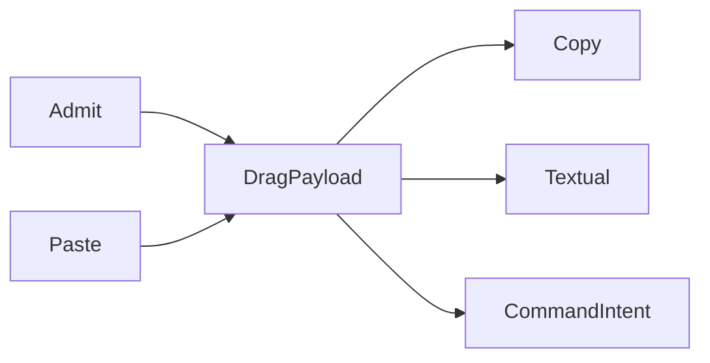

# [APPUI_INPUT_INTERACTION]

One interaction rail owns gesture mechanics for every admitted surface: keyboard chords derive from the one command table through a per-surface `GesturePolicy`, the behavior rail admits its trigger and action vocabulary as rows, pointer gestures and the frozen `PanZoomRow` canvas family route pinch, wheel, and drag input, and `DragPayload` plus `ClipboardRow` carry every transfer across the drag and clipboard boundaries on the validation rail. The page owns no key table, no conflict fold, no timer loop, and no second hotkey registry — the command deck, the AppHost schedule rows, and the motion timing vocabulary arrive settled. The spine is Avalonia, Xaml.Behaviors.Avalonia, PanAndZoom, Thinktecture.Runtime.Extensions, and LanguageExt.Core.

## [01]-[INDEX]

- [01]-[HOTKEY_DERIVATION]: Chord transform, scope split, gesture bindings over the frozen deck.
- [02]-[BEHAVIOR_RAIL]: Admitted trigger and action rows; one intent-binding entry.
- [03]-[POINTER_GESTURES]: Gesture routing rows and the frozen pan-zoom canvas family.
- [04]-[DRAG_CLIPBOARD]: Typed transfer payload union and clipboard codec rows.
- [05]-[INPUT_FABRIC]: Alternative-input device union and device-output union over the intent table.
- [06]-[DEVICE_DRIVERS]: The four admitted SDK boundary capsules binding the fabric's delegate columns.

## [02]-[HOTKEY_DERIVATION]

- Owner: `GesturePolicy` — the per-surface chord, scope, and return-key policy record carrying the binding fold.
- Entry: `public FrozenDictionary<KeyGesture, CommandIntent> Bindings(CommandDeck deck)` — pure fold over the frozen deck's gesture column through its chord delegate; the first admitted row holds a contested chord and every later claimant drops deterministically.
- Auto: `For` builds the policy whose `Chord` the deck freeze receives; bindings derive once per frozen deck; global rows attach at the surface root during the mount transaction, screen-scoped rows attach inside activation scopes and detach with them.
- Packages: Avalonia, LanguageExt.Core, BCL inbox
- Growth: a new hotkey is one gesture value on its command-table row; a new surface posture is one policy value inside `For`; zero new surface.
- Boundary: the command table owns the `Option<KeyGesture>` column as the only key table in the package and the deck's freeze-time conflict fold is the only conflict evidence — a second conflict fold or receipt shape here is the deleted pattern; canonical gestures are authored with the control modifier and `Chord` swaps it for the platform primary, so one authored chord serves every desktop; web and headless rows pin the control modifier for deterministic specs and serialized parity; the Rhino panel posture holds the return key inside the panel instead of the host command line, with the host knob spelling research-gated; `KeyGesture` is value-equal with the `(Key, KeyModifiers)` constructor and `Parse`, and bindings attach as `KeyBinding` rows (`Gesture`, `Command`) in the surface root's `KeyBindings` collection.

```csharp signature
public sealed record GesturePolicy(
    KeyModifiers Primary,
    bool WantReturnInPanel,
    Func<CommandIntent, bool> ScreenScoped) {
    public static GesturePolicy For(SurfaceHost host) =>
        new(
            Primary: host is SurfaceHost.WebBrowser or SurfaceHost.Headless || !OperatingSystem.IsMacOS()
                ? KeyModifiers.Control
                : KeyModifiers.Meta,
            WantReturnInPanel: host is SurfaceHost.RhinoPanel,
            ScreenScoped: static _ => false);

    public KeyGesture Chord(KeyGesture canonical) =>
        (canonical.KeyModifiers & KeyModifiers.Control) != 0
            ? new KeyGesture(canonical.Key, (canonical.KeyModifiers & ~KeyModifiers.Control) | Primary)
            : canonical;

    public FrozenDictionary<KeyGesture, CommandIntent> Bindings(CommandDeck deck) =>
        toSeq(deck.Rows.Values)
            .Bind(row => row.Gesture.Map(gesture => (Gesture: deck.Chord(gesture), Row: row)).ToSeq())
            .Fold(
                HashMap<KeyGesture, CommandIntent>(),
                static (held, pair) => held.Find(pair.Gesture).IsSome ? held : held.Add(pair.Gesture, pair.Row))
            .AsEnumerable()
            .ToFrozenDictionary(static pair => pair.Key, static pair => pair.Value);

    public (Seq<CommandIntent> Global, Seq<CommandIntent> Scoped) Split(Seq<CommandIntent> table) =>
        (table.Filter(row => !ScreenScoped(row)), table.Filter(ScreenScoped));
}
```

## [03]-[BEHAVIOR_RAIL]

- Owner: `BehaviorRail` — the static intent-binding surface over the admitted trigger and action rows.
- Entry: `public static InvokeCommandAction Intent(ICommand command)` — the only action-to-command bridge; the argument is the table-generated ReactiveCommand row resolved by intent key.
- Packages: Xaml.Behaviors.Avalonia, ReactiveUI, LanguageExt.Core, BCL inbox
- Growth: a new interaction trigger or action is one admission-table row naming its catalogued type, knob, and timing row; zero new surface; a new rejected binding family is one `RejectViewBinding` faulting arm, never a relaxation of the XAML-only law.
- Boundary: `FileSystemWatcherTrigger`, `NetworkInformationTrigger`, `HttpRequestAction`, and `WriteTextToFileAction` are the deleted patterns — asset hot reload rides the HotAvalonia Debug loop over immutable avares content, connectivity reads the AppHost degradation fold, outbound requests ride the AppHost hop registry, and file export rides the offscreen-visuals export rows through the Persistence port; `TimerTrigger` rows carry surface-local micro-cadence only and process cadence stays on the AppHost schedule rows; throttle and debounce intervals resolve from the motion timing vocabulary at composition, so behavior rows carry zero literal intervals — `ThrottleAction.Interval` and `DebounceAction.Delay` are `TimeSpan` knobs, `ObservableStreamBehavior.Source` carries the observable, and `PassEventArgsToCommand` sits on the action base; the event-keyed routed-event row materializes as the `EventTriggerBehavior` over its `EventName`/`SourceObject` columns or as the catalogued event-trigger family in `Avalonia.Xaml.Interactions.Events` (`PointerPressedEventTrigger`, `KeyDownEventTrigger`, `TextInputEventTrigger`, and siblings), one trigger per named routed event, never a hand-written event handler; the routed-event row that needs the tunneling/bubbling strategy or an interactive source override rides `RoutedEventTriggerBehavior` (`Avalonia.Xaml.Interactions.Custom`) over its `RoutedEvent`/`RoutingStrategies`/`SourceInteractive` columns, so a strategy-typed routed-event listen is one trigger row and a hand-attached `AddHandler(routedEvent, handler, strategy)` is the deleted form; the ReactiveUI code-behind view-binding expression family — `PropertyBinderImplementation.Bind`/`OneWayBind`/`BindTo` and `IViewFor`/`IViewFor<TViewModel>` runtime property-expression wiring plus `CommandBinder.BindCommand` — is rejected wholesale: view-to-view-model binding is XAML compiled-`{Binding}` and behavior-rail-only, so `Intent` is the single C# binding bridge the rail exposes and the rejection is structural — `RejectViewBinding` is a never-callable surface whose only purpose is to fold the rejected binder symbols into the typed faulting rail rather than a prose caveat, ReactiveUI command flow reaches controls through the XAML `Command` property bound to the table-generated `ReactiveCommand` and never through `BindCommand`, and a `view.OneWayBind(vm, x => x.Prop, v => v.Control.Text)` call site is the deleted form.

```csharp signature
public static class BehaviorRail {
    public static InvokeCommandAction Intent(ICommand command) =>
        new() { Command = command, PassEventArgsToCommand = false };

    public static Fin<T> RejectViewBinding<T>(string member) =>
        Fin.Fail<T>(new InputDriverFault.BindingRejected($"{member}: binding is XAML compiled-binding and behavior-rail only"));
}
```

| [INDEX] | [ROW]          | [SURFACE]                    | [KNOB]        | [TIMING_ROW] |
| :-----: | -------------- | ---------------------------- | ------------- | :----------: |
|  [01]   | routed-event   | `RoutedEventTriggerBehavior` | `RoutedEvent` |      —       |
|  [02]   | data           | `DataTriggerBehavior`        | `Binding`     |      —       |
|  [03]   | multi-data     | `MultiDataTriggerBehavior`   | `Conditions`  |      —       |
|  [04]   | timer          | `TimerTrigger`               | —             |   standard   |
|  [05]   | task-completed | `TaskCompletedTrigger`       | —             |      —       |
|  [06]   | stream-bridge  | `ObservableStreamBehavior`   | `Source`      |      —       |
|  [07]   | intent-action  | `InvokeCommandAction`        | `Command`     |      —       |
|  [08]   | property       | `ChangePropertyAction`       | —             |      —       |
|  [09]   | async-group    | `AsyncActionGroup`           | `Actions`     |      —       |
|  [10]   | throttle       | `ThrottleAction`             | `Interval`    |     fast     |
|  [11]   | debounce       | `DebounceAction`             | `Delay`       |   standard   |

## [04]-[POINTER_GESTURES]

- Owner: `PanZoomRow` — the frozen canvas row family over `ZoomBorder`; gesture routing rows.
- Cases: `Dashboard` | `Preview`
- Packages: PanAndZoom, Xaml.Behaviors.Avalonia, Avalonia, BCL inbox
- Growth: a new zoomable surface is one `PanZoomRow` row; a new pointer gesture is one routing-table row landing on an existing intent; a rotation or saved-view posture is one policy value on the row; zero new surface.
- Boundary: one zoom owner per canvas — a chart tile mounted inside a `PanZoomRow` canvas gates its internal zoom off; the row's `MinZoom` and `MaxZoom` land on the control's per-axis `MinZoomX`/`MinZoomY`/`MaxZoomX`/`MaxZoomY` at composition; `Dashboard` animation duration binds `AnimationDuration` from the motion standard row at composition and `Preview` stays animation-free for capture determinism; rotation rides the `EnableRotation` row gate onto the control `Rotate`/`RotateAt` operations with `SnapRotation` quantizing to the rotation-step policy value and `ResetRotation` clearing on view reset, so a hand-built rotation matrix on the canvas is the deleted form and `Preview` holds rotation off for capture determinism; the rotate gesture binds `PointerTouchPadGestureRotateGestureTrigger` (`Avalonia.Xaml.Interactions.Custom`) so the two-finger rotate routes onto `Rotate`/`SnapRotation` under `RotationStep`, the magnify gesture binds `PointerTouchPadGestureMagnifyGestureTrigger` onto wheel-class zoom, and `HoldingGestureTrigger`/`PinchGestureTrigger`/`PinchEndedGestureTrigger` are the catalogued gesture-family triggers in the same custom assembly, so a hand-wired `GestureEventArgs` listener is the deleted form; view state round-trips through the `ZoomBorderState` value and `ImportState` into the screen-state snapshot rows, named viewports persist through `SaveView`/`RestoreView` with `DeleteSavedView` and `ClearSavedViews` owning the named-view registry as command-table intents, traversal rides `NavigateBack`/`NavigateForward` with `ClearViewHistory` resetting the stack at screen teardown; focus follows pointer press through `Focus` on `IInputElement`, and pointer-capture acquisition on press rides `PointerPressedEventTrigger` while capture-loss rides `PointerCaptureLostEventTrigger`/`PointerCaptureLostEventBehavior` (`Avalonia.Xaml.Interactions.Events`) as behavior-rail routed-event triggers; the dashboard tile canvas and the offscreen-visuals preview canvas consume these rows as settled values.

```csharp signature
public sealed record PanZoomRow(
    string Key,
    StretchMode Stretch,
    ButtonName PanButton,
    double ZoomSpeed,
    double MinZoom,
    double MaxZoom,
    bool EnableConstrains,
    bool EnableGestures,
    bool EnableAnimations,
    bool ShowZoomIndicator,
    bool EnableRotation,
    double RotationStep) {
    public static readonly PanZoomRow Dashboard = new("dashboard", StretchMode.None, ButtonName.Middle, ZoomSpeed: 1.2, MinZoom: 0.1, MaxZoom: 8.0, EnableConstrains: true, EnableGestures: true, EnableAnimations: true, ShowZoomIndicator: true, EnableRotation: true, RotationStep: 15.0);
    public static readonly PanZoomRow Preview = new("preview", StretchMode.Uniform, ButtonName.Middle, ZoomSpeed: 1.2, MinZoom: 0.05, MaxZoom: 64.0, EnableConstrains: true, EnableGestures: true, EnableAnimations: false, ShowZoomIndicator: false, EnableRotation: false, RotationStep: 0.0);

    public static readonly FrozenDictionary<string, PanZoomRow> Rows =
        new[] { Dashboard, Preview }.ToFrozenDictionary(static row => row.Key, static row => row, StringComparer.Ordinal);
}
```

| [INDEX] | [GESTURE]       | [ROUTE]                                               | [CONSEQUENCE]                                                                       |
| :-----: | --------------- | ----------------------------------------------------- | ----------------------------------------------------------------------------------- |
|  [01]   | tap             | `TappedEventTrigger`                                  | primary intent action fires                                                         |
|  [02]   | double-tap      | `DoubleTappedEventTrigger`                            | canvas rows route through `DoubleClickZoomMode`                                     |
|  [03]   | press-hold      | `HoldingGestureTrigger`                               | context intent raise                                                                |
|  [04]   | context-request | `RightTappedEventTrigger`                             | menu derivation from the command-table surface predicate                            |
|  [05]   | wheel zoom      | `ZoomBorder`                                          | one zoom owner per canvas row                                                       |
|  [06]   | pinch zoom      | `PinchGestureTrigger` / `ZoomBorder` `EnableGestures` | same single-owner law                                                               |
|  [07]   | canvas drag     | `CanvasDragBehavior`                                  | draggable tiles inside canvas rows                                                  |
|  [08]   | item drag       | `ItemDragBehavior`                                    | draggable-control rows                                                              |
|  [09]   | rotate gesture  | `PointerTouchPadGestureRotateGestureTrigger`          | gated by the row `EnableRotation` onto `Rotate`/`SnapRotation` under `RotationStep` |
|  [10]   | magnify gesture | `PointerTouchPadGestureMagnifyGestureTrigger`         | wheel-class zoom under the row `MinZoom`/`MaxZoom`                                  |
|  [11]   | pointer-capture | `PointerCaptureLostEventTrigger`                      | capture-loss releases the canvas pointer owner                                      |
|  [12]   | saved-view      | `ZoomBorder` `RestoreView` / `SaveView`               | `DeleteSavedView`/`ClearSavedViews` raise as intents                                |

## [05]-[DRAG_CLIPBOARD]

- Owner: `DragPayload` transfer union; `ClipboardRow` codec row family.
- Cases: `TableRows(Seq<string> Keys, string Tsv)` | `AssetKey(string Key)` | `HostObjects(Seq<Guid> Ids)` | `Files(Seq<string> Paths)` | `Image(ReadOnlyMemory<byte> Png)`
- Entry: `public static Validation<Error, DragPayload> Admit(Seq<string> paths, Func<string, bool> admitted)` — external drop admission; `Validation<Error,T>` accumulates one refusal per unadmitted path.
- Auto: every external drop runs `Admit` and every paste runs its row `Paste` before any intent fires; refusals fold into the screen fault state with zero partial payloads.
- Receipt: admitted payloads raise their command intents and ride the command receipt family — the rail mints no second receipt vocabulary.
- Packages: Thinktecture.Runtime.Extensions, LanguageExt.Core, Xaml.Behaviors.Avalonia, Avalonia, BCL inbox
- Growth: a new transfer shape is one union case plus one `ClipboardRow`; zero new surface.
- Boundary: drag rows ride `ContextDragBehavior`, `ContextDropBehavior`, and `ListReorderDragBehavior`; drop targets enable through `DragDrop.SetAllowDrop(control, true)` with the routed `DragDrop.DragOverEvent`/`DropEvent` handlers attached, and the dropped payload reads from `DragEventArgs.DataTransfer` with the chosen effect set into `DragEventArgs.DragEffects` during `DragOver`, never `DragEventArgs.Data`; the `admitted` predicate column arrives from the dialogs file-filter vocabulary; a paste gates through `GetClipboardFormatsAction` so the present data-format identifiers select the matching `ClipboardRow` before any `Paste` runs and an absent format folds to no-op rather than a failed decode; plain-text paste routes to the focused control and never the payload rail, so the text row is copy-only by law; asset keys ride the icons asset-key vocabulary and table-row keys ride the grid row-model identity; structured copy crosses through one clipboard write keyed by the row `Format` identifiers, riding `Avalonia.Input.Platform.IClipboard.SetDataAsync(IAsyncDataTransfer)` with a `DataTransfer` carrying one `DataTransferItem` per `ClipboardRow` keyed by `DataFormat.CreateBytesApplicationFormat`/`CreateStringApplicationFormat`, each item built through `DataTransferItem.Create<T>(DataFormat<T>, T?)`/`CreateText` or `DataTransferItem.Set<T>(DataFormat<T>, T?)`, the read riding `IClipboard.TryGetDataAsync()` with `ClipboardExtensions.GetDataFormatsAsync` as the present-format gate and `ClipboardExtensions.TryGetTextAsync`/`ClipboardExtensions.TryGetValueAsync<T>(DataFormat<T>)` plus `DataTransferItem.TryGetRaw` as the typed extract, the `IAsyncDataTransfer` handed to `SetDataAsync` left undisposed because Avalonia takes ownership and disposes it once off the clipboard (a caller `using`/`Dispose` on the set transfer is the deleted form), and the legacy `DataObject`/`DataFormats`/`IDataObject` surface obsolete in Avalonia 12; the headless drop harness sequences `DragDrop` calls `DragEnter` → `DragOver` → `Drop` (mirroring `DragLeave` on the abort path) because a `DragOver` without a prior `DragEnter` seeds no drop context and fires no routed handler, and headless input modifiers cross as `RawInputModifiers`, never `KeyModifiers`; host-object drag across the NSView boundary is research-gated on the embed capsule.

```csharp signature
[Union(ConversionFromValue = ConversionOperatorsGeneration.None)]
public abstract partial record DragPayload {
    private DragPayload() { }

    public sealed record TableRows(Seq<string> Keys, string Tsv) : DragPayload;

    public sealed record AssetKey(string Key) : DragPayload;

    public sealed record HostObjects(Seq<Guid> Ids) : DragPayload;

    public sealed record Files(Seq<string> Paths) : DragPayload;

    public sealed record Image(ReadOnlyMemory<byte> Png) : DragPayload;

    public static string Textual(DragPayload payload) =>
        payload.Switch(
            tableRows: static rows => rows.Tsv,
            assetKey: static key => key.Key,
            hostObjects: static host => string.Join(",", host.Ids),
            files: static files => string.Join("\n", files.Paths),
            image: static _ => string.Empty);

    public static Validation<Error, DragPayload> Admit(Seq<string> paths, Func<string, bool> admitted) =>
        Refused(paths, admitted) switch {
            { IsEmpty: true } => paths.IsEmpty
                ? (Validation<Error, DragPayload>)new InputDriverFault.DropRejected("empty drop")
                : (Validation<Error, DragPayload>)new Files(paths),
            var refused => (Validation<Error, DragPayload>)Error.Many([.. refused]),
        };

    private static Seq<Error> Refused(Seq<string> paths, Func<string, bool> admitted) =>
        paths.Filter(path => !admitted(path)).Map(static path => (Error)new InputDriverFault.DropRejected($"unadmitted drop: {path}"));
}

public sealed record ClipboardRow(
    string Format,
    Func<DragPayload, Option<ReadOnlyMemory<byte>>> Copy,
    Func<ReadOnlyMemory<byte>, Validation<Error, DragPayload>> Paste) {
    public static readonly ClipboardRow Text = new(
        "text/plain",
        Copy: static payload => Optional<ReadOnlyMemory<byte>>(Encoding.UTF8.GetBytes(DragPayload.Textual(payload))),
        Paste: static _ => (Validation<Error, DragPayload>)new InputDriverFault.PasteRejected("plain-text paste unrouted"));

    public static readonly ClipboardRow Tsv = new(
        "text/tab-separated-values",
        Copy: static payload => payload is DragPayload.TableRows rows ? Optional<ReadOnlyMemory<byte>>(Encoding.UTF8.GetBytes(rows.Tsv)) : None,
        Paste: static bytes => (Validation<Error, DragPayload>)new DragPayload.TableRows(Seq<string>(), Encoding.UTF8.GetString(bytes.Span)));

    public static readonly ClipboardRow Png = new(
        "image/png",
        Copy: static payload => payload is DragPayload.Image image ? Optional(image.Png) : None,
        Paste: static bytes => bytes.Span is [0x89, 0x50, 0x4E, 0x47, ..]
            ? (Validation<Error, DragPayload>)new DragPayload.Image(bytes)
            : (Validation<Error, DragPayload>)new InputDriverFault.PasteRejected("png signature mismatch"));

    public static readonly ClipboardRow Asset = new(
        "application/x-rasm-asset-key",
        Copy: static payload => payload is DragPayload.AssetKey key ? Optional<ReadOnlyMemory<byte>>(Encoding.UTF8.GetBytes(key.Key)) : None,
        Paste: static bytes => (Validation<Error, DragPayload>)new DragPayload.AssetKey(Encoding.UTF8.GetString(bytes.Span)));

    public static readonly FrozenDictionary<string, ClipboardRow> Rows =
        new[] { Text, Tsv, Png, Asset }.ToFrozenDictionary(static row => row.Format, static row => row, StringComparer.Ordinal);
}
```



## [06]-[INPUT_FABRIC]

- Owner: `InputDevice` `[Union]` the alternative-input source family over the four admitted net10 SDKs; `DeviceAxis` the normalized continuous-axis sample; `DeviceOutput` `[Union]` the device-output sink family; `InputFabric` the device-to-intent and intent-to-device fold.
- Cases: `InputDevice` = SpaceMouse | GameController | HapticSurface | MidiSurface under the locked kind literals; `DeviceOutput` = ControllerRumble | HapticRumble under the locked kind literals — eye-gaze, switch-access, voice, CNC, and robot are out of the fabric (no viable cross-platform net10 SDK, closed `INPUT-FABRIC-SDKS`).
- Entry: `public Seq<CommandIntent> Map(InputDevice device, Seq<DeviceAxis> sample, CommandDeck deck)` — folds a device sample into the command intents it raises through the one table; `public IO<Unit> Drive(DeviceOutput output, Seq<DeviceAxis> command)` — folds a command into the device-output samples it emits.
- Auto: every alternative-input device folds onto the one `CommandIntent` table — a SpaceMouse six-degree-of-freedom translation/rotation sample maps to the viewport orbit/pan/zoom intents, a game-controller stick to the same navigation intents, a haptic-surface trigger to a feedback intent, and a MIDI control surface to parameter intents — so a new input modality raises existing verbs and never a parallel command path; device output is the symmetric fold — a controller rumble or a haptic-device pulse consumes the normalized command axes so the same intent that an input device raises a device output can consume, completing the input-output fabric; the continuous-axis sample is normalized to [-1, 1] so a device-specific range never leaks into the intent fold; each device's continuous axes fold through the `Shell/input` pan-zoom canvas algebra (`[04]-[POINTER_GESTURES]`) and discrete events map onto the `CommandIntent` vocabulary.
- Packages: Thinktecture.Runtime.Extensions, LanguageExt.Core, BCL inbox
- Growth: a new input device is one `InputDevice` case reading the shared intent rail; a new output device is one `DeviceOutput` case; a new continuous control is one `DeviceAxis` row; zero new surface — a parallel input framework beside this fabric is the rejected form.
- Boundary: alternative input folds onto the one command table so a per-device handler is the deleted form — a SpaceMouse, controller, haptic, or MIDI sample raises a `CommandIntent` exactly as a hotkey does, and the one availability algebra gates them all; the device sample is normalized so the fabric carries no device-specific range literal; device output is the symmetric consequence — the controller-rumble and haptic sinks consume normalized command axes through a `SurfaceSeam`-bound device delegate so no fabric body names a device SDK at a call site, the SDK driver capsules live in `[07]-[DEVICE_DRIVERS]`; the mouse, touch, pen, and keyboard paths stay the pointer-gesture and hotkey owners so the fabric adds only the alternative modalities and re-models no existing input; the fabric union arm carries only the device→intent projection delegate, so the four SDK boundary capsules of `[07]` bind those columns at composition and the fabric body names no SDK member.

```csharp signature
public readonly record struct DeviceAxis(string Channel, double Value);

[Union(ConversionFromValue = ConversionOperatorsGeneration.None)]
public abstract partial record InputDevice {
    private InputDevice() { }
    public sealed record SpaceMouse(string Id, Func<Seq<DeviceAxis>, Seq<string>> ToIntents) : InputDevice;
    public sealed record GameController(string Id, Func<Seq<DeviceAxis>, Seq<string>> ToIntents) : InputDevice;
    public sealed record HapticSurface(string Id, Func<Seq<DeviceAxis>, Seq<string>> ToIntents) : InputDevice;
    public sealed record MidiSurface(string Id, Func<Seq<DeviceAxis>, Seq<(string Key, double Value)>> ToParameters) : InputDevice;

    public string Id => Switch(
        spaceMouse: static s => s.Id, gameController: static g => g.Id, hapticSurface: static h => h.Id, midiSurface: static m => m.Id);
}

[Union(ConversionFromValue = ConversionOperatorsGeneration.None)]
public abstract partial record DeviceOutput {
    private DeviceOutput() { }
    public sealed record ControllerRumble(string Id, Func<double, double, ushort, IO<Unit>> Rumble) : DeviceOutput;
    public sealed record HapticRumble(string Id, Func<double, IO<Unit>> Pulse) : DeviceOutput;
}

public static class InputFabric {
    public static Seq<CommandIntent> Map(InputDevice device, Seq<DeviceAxis> sample, CommandDeck deck) =>
        Keys(device, sample, deck)
            .Bind(key => deck.Rows.TryGetValue(key, out var row) ? Seq(row) : Seq<CommandIntent>());

    static Seq<string> Keys(InputDevice device, Seq<DeviceAxis> sample, CommandDeck deck) =>
        device.Switch(
            state: (Sample: sample, Deck: deck),
            spaceMouse: static (ctx, s) => s.ToIntents(ctx.Sample),
            gameController: static (ctx, g) => g.ToIntents(ctx.Sample),
            hapticSurface: static (ctx, h) => h.ToIntents(ctx.Sample),
            midiSurface: static (ctx, m) => m.ToParameters(ctx.Sample).Map(static p => p.Key));

    public static IO<Unit> Drive(DeviceOutput output, Seq<DeviceAxis> command) =>
        output.Switch(
            state: command,
            controllerRumble: static (cmd, c) => c.Rumble(cmd is [var lo, ..] ? lo.Value : 0d, cmd is [_, var hi, ..] ? hi.Value : 0d, 200),
            hapticRumble: static (cmd, h) => h.Pulse(cmd is [var first, ..] ? first.Value : 0d));
}
```

## [07]-[DEVICE_DRIVERS]

- Owner: `DeviceDriver` `[Union]` the four SDK boundary capsules binding the fabric's delegate columns; `DeviceSession` the scoped device handle; `InputDriverFault` the typed fault family on the `AppUiFaultBand.InputDriver` registry row (6050).
- Cases: `DeviceDriver` = Hid(HidSharp SpaceMouse) | Gamepad(Silk.NET.Input controller) | Haptic(Silk.NET.SDL force-feedback) | Midi(Melanchall.DryWetMidi control surface) under the locked kind literals; `InputDriverFault` = Text | DeviceAbsent | OpenRejected | DecodeFailed — codes derive through the `Diagnostics/evidence.md#FAULT_TABLES` registry.
- Entry: `public Fin<DeviceSession> Open(DeviceDriver driver)` — opens the SDK handle in a scoped boundary, returning the device→intent projection the fabric arm reads and the teardown that releases the native handle; `public IObservable<Seq<DeviceAxis>> Stream(DeviceSession session)` — projects the SDK's raw report stream into normalized `DeviceAxis` samples.
- Auto: the `Hid` capsule enumerates a 3Dconnexion SpaceMouse through `DeviceList.Local.GetHidDevices(vendorId, productId)`, opens a scoped `HidStream`, and decodes its six translation/rotation axes through `DeviceItemInputParser`/`DataValue.GetScaledValue` so canonical [-1,1] axes leave the capsule, not raw HID bytes (`.api/api-hidsharp.md`); the `Gamepad` capsule mints one `IInputContext` per view through `IView.CreateInput()`, reads `IGamepad.Thumbsticks`/`Triggers`/`Buttons` through the named `GamepadExtensions` accessors with `Deadzone.Apply` recentering, and folds them into `DeviceAxis` samples (`.api/api-silk-input.md`); the `Haptic` capsule arms the SDL haptic subsystem through `Init(InitHaptic)`, opens a device through `HapticOpenFromJoystick`, and runs effects through `HapticRumblePlay`/`GameControllerRumble` gated behind `HapticQuery` capability (`.api/api-silk-sdl.md`); the `Midi` capsule resolves an input device through `InputDevice.GetByName`, listens through `StartEventsListening`, and projects `ControlChangeEvent.ControlValue`/`NoteOnEvent.Velocity` (bounded `SevenBitNumber`) into normalized parameter axes (`.api/api-drywetmidi.md`); every handle is lifecycle-scoped and disposed at teardown.
- Receipt: the first opened device emits a driver-resolved evidence row — device kind, identity, axis count; `TelemetryRow` contributes the device-resolved and device-absent instruments inward through the AppHost `TelemetryContributorPort`.
- Packages: HidSharp, Silk.NET.Input, Silk.NET.SDL, Melanchall.DryWetMidi, Thinktecture.Runtime.Extensions, LanguageExt.Core, System.Reactive
- Growth: a new device backend is one `DeviceDriver` case with its scoped open/stream pair; one device instrument is one `InstrumentRow` on `InputDrivers.TelemetryRow`; zero new surface.
- Boundary: each capsule is the named boundary admission for its SDK — `Open` pairs the SDK's enumerate-and-open with the teardown in one scoped fold and the raw report crosses the boundary exactly once, so a normalized `DeviceAxis` leaves the capsule and a raw HID byte array, a raw `MidiEvent`, or a raw SDL status never propagates into the fabric (the per-SDK `LOCAL_ADMISSION` of each `.api`); the `Hid` capsule re-enumerates on `DeviceList.Changed` rather than re-opening a stale handle, the `Gamepad` capsule holds exactly one `IInputContext` per view (the SDL2 backend reflection-loaded through `TryAdd("Silk.NET.Input.Sdl")`), the `Haptic` capsule shares the single `Sdl.GetApi()` instance with the `Gamepad` SDL2 backend so no second native bundle loads, and the `Midi` capsule disposes every `InputDevice`/`OutputDevice` it opens; the bounded byte discipline holds at the edge — MIDI data crosses as `SevenBitNumber`/`FourBitNumber` and rejects out-of-range before forming, and HID axes cross as `GetScaledValue` projections, so a raw integer velocity or a raw logical HID value never enters the fabric; the capsule binds the `InputDevice`/`DeviceOutput` union arm's projection delegate at composition so the fabric body of `[05]` names no SDK member; the four native SDKs (SDL2 shared between Silk.NET.Input and Silk.NET.SDL, libmpv-independent) provision at the app-host distribution layer, never bundled by the managed packages.

```csharp signature
[Union]
public abstract partial record InputDriverFault : Expected, IValidationError<InputDriverFault> {
    private InputDriverFault(string detail, int code) : base(detail, code, None) { }

    public static InputDriverFault Create(string message) => new Text(message);

    public sealed record Text : InputDriverFault { public Text(string detail) : base(detail, AppUiFaultBand.InputDriver.Code(0)) { } }
    public sealed record DeviceAbsent : InputDriverFault { public DeviceAbsent(string detail) : base(detail, AppUiFaultBand.InputDriver.Code(1)) { } }
    public sealed record OpenRejected : InputDriverFault { public OpenRejected(string detail) : base(detail, AppUiFaultBand.InputDriver.Code(2)) { } }
    public sealed record DecodeFailed : InputDriverFault { public DecodeFailed(string detail) : base(detail, AppUiFaultBand.InputDriver.Code(3)) { } }
    public sealed record BindingRejected : InputDriverFault { public BindingRejected(string detail) : base(detail, AppUiFaultBand.InputDriver.Code(4)) { } }
    public sealed record DropRejected : InputDriverFault { public DropRejected(string detail) : base(detail, AppUiFaultBand.InputDriver.Code(5)) { } }
    public sealed record PasteRejected : InputDriverFault { public PasteRejected(string detail) : base(detail, AppUiFaultBand.InputDriver.Code(6)) { } }
}

public sealed record DeviceSession(string Id, InputDevice Device, IObservable<Seq<DeviceAxis>> Samples, IDisposable Teardown) : IDisposable {
    public void Dispose() => Teardown.Dispose();
}

[Union(ConversionFromValue = ConversionOperatorsGeneration.None)]
public abstract partial record DeviceDriver {
    private DeviceDriver() { }
    public sealed record Hid(int VendorId, int ProductId, Func<DataValue, double> Axis) : DeviceDriver;
    public sealed record Gamepad(int Index, Deadzone Deadzone) : DeviceDriver;
    public sealed record Haptic(int Index, Func<double, double, ushort, IO<Unit>> Rumble) : DeviceDriver;
    public sealed record Midi(string DeviceName, Func<ControlChangeEvent, (string Key, double Value)> Control) : DeviceDriver;
}

public static class InputDrivers {
    public const string ResolvedInstrument = "rasm.appui.input.device-resolved";
    public const string AbsentInstrument = "rasm.appui.input.device-absent";

    public static TelemetryContributorPort TelemetryRow(string version) =>
        AppUiTelemetry.Contribute(version, ResolvedInstrument, AbsentInstrument);

    public static Fin<DeviceSession> Open(DeviceDriver driver) => driver.Switch(
        hid: static h => OpenHid(h),
        gamepad: static g => OpenGamepad(g),
        haptic: static h => OpenHaptic(h),
        midi: static m => OpenMidi(m));
}
```

| [INDEX] | [DRIVER]   | [SDK]                   | [ENUMERATE]                              | [SAMPLE_SOURCE]                                 | [NORMALIZE]                |
| :-----: | ---------- | ----------------------- | ---------------------------------------- | ----------------------------------------------- | -------------------------- |
|  [01]   | SpaceMouse | `HidSharp`              | `DeviceList.Local.GetHidDevices(vid,pid)` | `DeviceItemInputParser.GetValue`/`DataValue`    | `GetScaledValue(-1, 1)`    |
|  [02]   | Controller | `Silk.NET.Input`        | `IView.CreateInput().Gamepads`           | `IGamepad.Thumbsticks`/`Triggers`/`Buttons`     | `Deadzone.Apply` + `[-1,1]` |
|  [03]   | Haptic     | `Silk.NET.SDL`          | `Sdl.NumHaptics` + `HapticOpenFromJoystick` | `HapticQuery` capability + `GameControllerRumble` | output-only normalized      |
|  [04]   | MIDI       | `Melanchall.DryWetMidi` | `InputDevice.GetAll`/`GetByName`          | `ControlChangeEvent`/`NoteOnEvent` (`EventReceived`) | `SevenBitNumber / 127`   |

## [08]-[RESEARCH]

- [PANEL_KEYS]: Rhino panel return-key policy knob residence and its registration point on the panel host.
- [EMBEDDED_DRAG]: host-object drag across the NSView boundary carrying Rhino object ids into and out of the embedded panel.
- [INPUT_DEVICE_SDK]: the per-SDK member spellings the four `[07]-[DEVICE_DRIVERS]` capsules bind beyond the catalogued surfaces — the 3Dconnexion SpaceMouse HID usage-page constants the `DeviceItemInputParser` reads for the six translation/rotation axes, the `Silk.NET.Input.Sdl` reflection-load order against the shared SDL2 bundle, the `HapticEffect` tagged-union member layout for a non-rumble force-feedback effect, and the `Melanchall.DryWetMidi` `MidiEventReceivedEventArgs.Event` narrowing to `ControlChangeEvent`/`NoteOnEvent` — resolved at implementation against the admitted device packages (`.api/api-hidsharp.md`, `api-silk-input.md`, `api-silk-sdl.md`, `api-drywetmidi.md`); the `InputDevice`/`DeviceOutput` union, the normalized `DeviceAxis`, the device-to-intent and intent-to-device folds, the `DeviceDriver` capsules, and the enumerate/sample/normalize table are settled, the per-device SDK usage-code and event-narrowing spellings are the unverified surface bound at composition.
