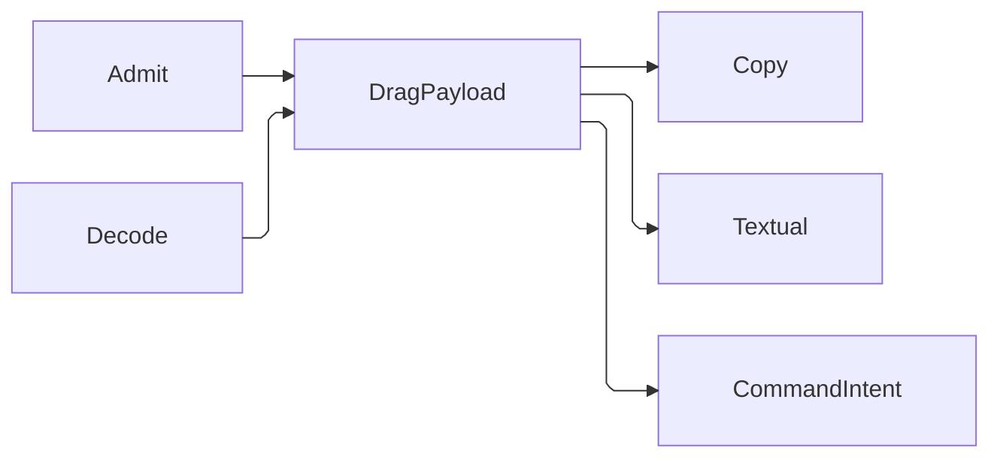

# [APPUI_INPUT_INTERACTION]

One interaction rail owns gesture mechanics for every admitted surface: keyboard chords derive from the one command table through a per-surface `GesturePolicy`, the behavior rail admits its trigger and action vocabulary as rows, pointer gestures and the frozen `PanZoomRow` canvas family route pinch, wheel, drag, marquee, and pen input with the `PenAxis` rows landing every digitizer property on the one normalized axis grammar, `DragPayload` and `ClipboardRow` carry every transfer across the drag and clipboard boundaries on the validation rail, and the device fabric folds four SDK capsules onto the same command table through paired source and actuator legs. The page owns no key table, no conflict fold, no timer loop, and no second hotkey registry — the command deck, the AppHost schedule rows, the selection algebra, and the motion timing vocabulary arrive settled. The spine is Avalonia, Xaml.Behaviors.Avalonia, PanAndZoom, Thinktecture.Runtime.Extensions, and LanguageExt.Core.

## [01]-[INDEX]

- [02]-[HOTKEY_DERIVATION]: Chord transform, scope split, gesture bindings over the frozen deck.
- [03]-[BEHAVIOR_RAIL]: Admitted trigger and action rows; one intent-binding entry.
- [04]-[POINTER_GESTURES]: Gesture routing rows, the frozen pan-zoom canvas family, and the pen axis rows.
- [05]-[DRAG_CLIPBOARD]: Typed transfer payload union and clipboard codec rows.
- [06]-[INPUT_FABRIC]: Alternative-input device union and device-output union over the intent table.
- [07]-[DEVICE_DRIVERS]: The four admitted SDK boundary capsules, their open and arm legs, and the driver receipts.

## [02]-[HOTKEY_DERIVATION]

- Owner: `GesturePolicy` — the per-surface chord, scope, and return-key policy record carrying the binding fold.
- Entry: `public FrozenDictionary<KeyGesture, CommandIntent> Bindings(CommandDeck deck, CommandScope scope)` — pure fold over the frozen deck's gesture column through its chord delegate, narrowed to one scope; the first admitted row holds a contested chord and every later claimant drops deterministically.
- Auto: `For` builds the policy whose `Chord` the deck freeze receives; bindings derive once per frozen deck and scope, each table attaching at the owner its scope names — global at the surface root during the mount transaction, screen inside activation scopes, viewport on its canvas, dialog on the session root — and detaching with that owner.
- Packages: Avalonia, LanguageExt.Core, BCL inbox, Rasm.AppHost (project)
- Growth: a new hotkey is one gesture value on its command-table row; a new surface posture is one policy value inside `For`; a new attach owner is one `CommandScope` row read by the same fold; zero new surface.
- Boundary: the command table owns the `Option<KeyGesture>` column as the only key table in the package and the deck's freeze-time conflict fold is the only conflict evidence — a second conflict fold or receipt shape here is the deleted pattern; that fold groups on scope plus chord, so cross-scope chord sharing is legal by law and the scope narrowing here is what keeps the binding table total instead of throwing on a Global-versus-Screen pair Freeze admitted; canonical gestures are authored with the control modifier and `Chord` swaps it for the platform primary, so one authored chord serves every desktop; a `HostSurface.None` profile and the `SurfaceMount.Offscreen` mount pin the control modifier for deterministic specs and serialized parity; the panel mount holds the return key inside the shell instead of the host command line, and the host binds no return-key knob for it: a key event carried up a shown host window's responder chain reaches the embedded root as the tunnel-plus-bubble `KeyDown` pair and never reaches the host command prompt, so the shell's own binding table IS the panel row's return policy and `ApplyReturnPolicy` is the seam column that states the posture host-side rather than a key interceptor; delivery itself needs a shown host window, because an unwindowed host view has no responder chain to carry the event at all, which is a mount-visibility fact the `SurfaceSeam.HostFacts` column already publishes, never a condition this rail probes; `KeyGesture` is value-equal with the `(Key, KeyModifiers)` constructor and `Parse`, and bindings attach as `KeyBinding` rows (`Gesture`, `Command`) in the surface root's `KeyBindings` collection.

```csharp signature
public sealed record GesturePolicy(
    KeyModifiers Primary,
    bool WantReturnInPanel,
    Func<bool, Unit> ApplyReturnPolicy) {
    // Two axis reads carry the posture the product names once fused: a surfaceless profile and an
    // offscreen mount both pin the control modifier for deterministic specs and serialized parity,
    // and the panel mount alone holds the return key inside the shell instead of the host command line.
    public static GesturePolicy For(ConsumptionProfile profile, SurfaceMount mount, Func<bool, Unit> applyReturnPolicy) =>
        new(
            Primary: profile.Surface == HostSurface.None || mount is SurfaceMount.Offscreen || !OperatingSystem.IsMacOS()
                ? KeyModifiers.Control
                : KeyModifiers.Meta,
            WantReturnInPanel: mount is SurfaceMount.Panel,
            ApplyReturnPolicy: applyReturnPolicy);

    public KeyGesture Chord(KeyGesture canonical) =>
        (canonical.KeyModifiers & KeyModifiers.Control) != 0
            ? new KeyGesture(canonical.Key, (canonical.KeyModifiers & ~KeyModifiers.Control) | Primary)
            : canonical;

    // Scope IS the partition, so a separate global/scoped split is the deleted form: the deck's freeze-time
    // conflict fold groups on (scope, chord), which leaves a Global row and a Screen row free to claim one
    // chord, and folding both into a single frozen table threw where the entry law promises first-admitted-
    // wins. Narrowing to the attaching scope removes the collision class and the carrier's own key-distinct
    // makes the surviving claimant structural rather than dependent on the freeze proof holding for a
    // grouping it never made.
    public FrozenDictionary<KeyGesture, CommandIntent> Bindings(CommandDeck deck, CommandScope scope) =>
        toSeq(deck.Rows.Values)
            .Filter(row => row.Scope == scope)
            .Bind(row => row.Gesture.Map(gesture => (Gesture: deck.Chord(gesture), Row: row)).ToSeq())
            .Distinct(static pair => pair.Gesture)
            .ToFrozenDictionary(static pair => pair.Gesture, static pair => pair.Row);

    public Unit Mount() => ApplyReturnPolicy(WantReturnInPanel);
}
```

## [03]-[BEHAVIOR_RAIL]

- Owner: `BehaviorRail` — the static intent-binding surface over the admitted trigger and action rows.
- Entry: `public static InvokeCommandAction Intent(ICommand command)` — the only action-to-command bridge; the argument is the table-generated ReactiveCommand row resolved by intent key.
- Packages: Xaml.Behaviors.Avalonia, ReactiveUI, LanguageExt.Core, BCL inbox
- Growth: a new interaction trigger or action is one admission-table row naming its catalogued type, knob, and timing row; zero new surface.
- Boundary: the admission table excludes `FileSystemWatcherTrigger`, `NetworkInformationTrigger`, `HttpRequestAction`, and `WriteTextToFileAction`; asset reload, connectivity, outbound requests, and export enter through their owning rails. `TimerTrigger` carries surface-local micro-cadence only, while throttle and debounce intervals resolve from the motion timing vocabulary at composition. `EventTriggerBehavior` and the catalogued routed-event trigger family own event admission, and `RoutedEventTriggerBehavior` (`Avalonia.Xaml.Interactions.Custom`) carries the `RoutedEvent`, `RoutingStrategies`, and `SourceInteractive` overrides a named-event trigger cannot express. The rail binds the COMMAND alone — `Intent` seats `Command` and pins `PassEventArgsToCommand` false, and the package's own `CommandParameter` and `InputConverter` columns stay unbound, so a per-row or per-field verb resolves its OWN materialized `ReactiveCommand` rather than sharing one command through a parameter an untyped `object` would carry; a rail-supplied parameter column is therefore unspellable by construction and every consumer that needed one — the form chrome's per-field operations first among them — resolves a command per subject instead. Compiled XAML binding and `BehaviorRail.Intent` are the complete view-binding surface; no ceremonial method names rejected ReactiveUI property binders.

```csharp signature
public static class BehaviorRail {
    public static InvokeCommandAction Intent(ICommand command) =>
        new() { Command = command, PassEventArgsToCommand = false };

}
```

| [INDEX] | [ROW]          | [SURFACE]                    | [KNOB]        | [TIMING_ROW] |
| :-----: | :------------- | :--------------------------- | :------------ | :----------: |
|  [01]   | routed-event   | `RoutedEventTriggerBehavior` | `RoutedEvent` |      —       |
|  [02]   | data           | `DataTriggerBehavior`        | `Binding`     |      —       |
|  [03]   | multi-data     | `MultiDataTriggerBehavior`   | `Conditions`  |      —       |
|  [04]   | timer          | `TimerTrigger`               | —             |   standard   |
|  [05]   | task-completed | `TaskCompletedTrigger`       | —             |      —       |
|  [06]   | stream-bridge  | `ObservableStreamBehavior`   | `Source`      |      —       |
|  [07]   | intent-action  | `InvokeCommandAction`        | `Command`     |      —       |
|  [08]   | property       | `ChangePropertyAction`       | —             |      —       |
|  [09]   | async-group    | `AsyncActionGroup`           | `Actions`     |      —       |
|  [10]   | throttle       | `ThrottleAction`             | `Interval`    |     fast     |
|  [11]   | debounce       | `DebounceAction`             | `Delay`       |   standard   |

## [04]-[POINTER_GESTURES]

- Owner: `PanZoomRow` — the frozen canvas row family over `ZoomBorder`; `PenAxis` the digitizer-property row family; `PenSample` the per-point pen reading; `PointerTrack` the pointer-to-axis fold; gesture routing rows.
- Cases: `PanZoomRow` = `Dashboard` | `Graph` | `Preview`; `PenAxis` = pressure | tilt-x | tilt-y | twist | barrel | eraser under the locked channel literals.
- Entry: `public static Seq<PenSample> Pen(PointerEventArgs args, Visual? relativeTo, Instant at)` — the pen fold; a non-pen pointer answers the empty sequence and a pen answers one sample per intermediate point, each carrying the whole axis row set on the `AxisChannel` grammar `[07]` owns.
- Packages: PanAndZoom, Xaml.Behaviors.Avalonia, Avalonia, Thinktecture.Runtime.Extensions, LanguageExt.Core, NodaTime, Rasm (project — `SignedUnit`), BCL inbox
- Growth: a new zoomable surface is one `PanZoomRow` row; a new pointer gesture is one routing-table row landing on an existing intent; a new digitizer property is one `PenAxis` row naming its projection; a rotation or saved-view posture is one policy value on the row; zero new surface.
- Boundary: one zoom owner per canvas — a chart tile mounted inside a `PanZoomRow` canvas gates its internal zoom off; the row's `MinZoom` and `MaxZoom` land on the control's per-axis `MinZoomX`/`MinZoomY`/`MaxZoomX`/`MaxZoomY` at composition; `Dashboard` animation duration binds `AnimationDuration` from the motion standard row at composition and `Preview` stays animation-free for capture determinism; rotation rides the `EnableRotation` row gate onto the control `Rotate`/`RotateAt` operations with `SnapRotation` quantizing to the rotation-step policy value and `ResetRotation` clearing on view reset, so a hand-built rotation matrix on the canvas is the deleted form and `Preview` holds rotation off for capture determinism; the rotate gesture binds `PointerTouchPadGestureRotateGestureTrigger` (`Avalonia.Xaml.Interactions.Custom`) so the two-finger rotate routes onto `Rotate`/`SnapRotation` under `RotationStep`, the magnify gesture binds `PointerTouchPadGestureMagnifyGestureTrigger` onto wheel-class zoom, and `HoldingGestureTrigger`/`PinchGestureTrigger`/`PinchEndedGestureTrigger` are catalogued rows of the same custom-assembly gesture family (`.api/api-behaviors.md` `[CUSTOM_GESTURE_TYPES]`), every row a `RoutedEventTriggerBase<TArgs>` over its own `InputElement` event with `EventRoutingStrategy` and `MarkAsHandled` as its knobs, so a hand-wired `GestureEventArgs` listener is the deleted form; view state round-trips through the `ZoomBorderState` value — `ExportState()` at capture and `ImportState` at restore, landing in the seat its own canvas persists through — the `Charts/dashboards` `DashboardLayout.CanvasState` column for a board and the `Shell/screens` `ScreenState.Canvas` column for a screen-hosted canvas, the graph viewport being the second seat's own consumer — so the value shape is one and the partition is the canvas's own; named viewports persist through `SaveView`/`RestoreView` with `DeleteSavedView` and `ClearSavedViews` owning the named-view registry as command-table intents, traversal rides `NavigateBack`/`NavigateForward` with `ClearViewHistory` resetting the stack at screen teardown; focus follows pointer press through `Focus` on `IInputElement`, and pointer-capture acquisition on press rides `PointerPressedEventTrigger` while capture-loss rides `PointerCaptureLostEventTrigger`/`PointerCaptureLostEventBehavior` (`Avalonia.Xaml.Interactions.Events`) as behavior-rail routed-event triggers; the dashboard tile canvas and the offscreen-visuals preview canvas consume these rows as settled values. This table is the ONE gesture ingress for every owner downstream of it: the drag rows thread each delivered position through `Theme/motion#MOTION_HANDOFF` `MotionTrack.Sample` and the capture-loss row is the release edge `HandoffSpec.Release` folds, so the inertial owner subscribes to nothing and a second pointer subscription beside these rows is the deleted form; the marquee rows deliver the same positions to `Editing/forms#SELECTION_MODEL` `SelectionBand`, so a drag that dismisses a panel and a drag that sweeps a selection differ in the fold they feed, never in how they are heard. PEN properties are gated on `IPointer.Type` — a mouse reports a constant `Pressure` of 0.5 and zero tilt on every backend, so an ungated read fabricates a pressure curve out of a device that carries none and a mouse-drawn stroke would vary with nothing; the whole coalesced burst decodes through `GetIntermediatePoints`, because the platform batches every sample it took between two frames and reading `GetCurrentPoint` alone discards the pressure and tilt of all but the last, which is precisely the detail a stroke is drawn from; the six rows land as `DeviceAxis` values on the same `AxisChannel` grammar the device capsules mint, so a markup surface consuming stroke weight binds ONE axis resolver whether the level came from a nib or from a MIDI fader, and `IsEraser` and `IsInverted` fold to one eraser channel because a barrel-inverted stylus and an eraser-tipped one report the same intent under different flags; a digitizer overshooting its own declared range clamps rather than dropping the field, since the capsule law of refusing a sample and counting the rejection would put a hole in a stroke a user is drawing; the pen tool writes its own `Theme/assets#CURSOR_ROWS` `CursorRow` onto the interaction root through the inherited `InputElement.Cursor`, so no pointer glyph is minted here.

```csharp signature
public sealed record PanZoomRow(
    string Key,
    StretchMode Stretch,
    ButtonName PanButton,
    double ZoomSpeed,
    double MinZoom,
    double MaxZoom,
    bool EnableConstrains,
    bool EnableGestures,
    bool EnableAnimations,
    bool ShowZoomIndicator,
    bool EnableRotation,
    double RotationStep) {
    public static readonly PanZoomRow Dashboard = new("dashboard", StretchMode.None, ButtonName.Middle, ZoomSpeed: 1.2, MinZoom: 0.1, MaxZoom: 8.0, EnableConstrains: true, EnableGestures: true, EnableAnimations: true, ShowZoomIndicator: true, EnableRotation: true, RotationStep: 15.0);

    // Preview's RotationStep is STRUCTURALLY zero, not an unmeasured quantum: EnableRotation false forecloses
    // every Rotate/SnapRotation call site on this row, so no step exists to quantize to and a nonzero value
    // here would name a policy the capture-deterministic row refuses to run.
    // The node canvas. It runs the widest zoom span of the three because a graph is authored at node
    // detail and read at whole-network scale, keeps animations for the camera verbs the graph deck
    // raises, and holds rotation OFF because a rotated node graph makes every wire read as a diagonal
    // nothing in the model justifies.
    public static readonly PanZoomRow Graph = new("graph", StretchMode.None, ButtonName.Middle, ZoomSpeed: 1.2, MinZoom: 0.05, MaxZoom: 32.0, EnableConstrains: true, EnableGestures: true, EnableAnimations: true, ShowZoomIndicator: true, EnableRotation: false, RotationStep: 0.0);
    public static readonly PanZoomRow Preview = new("preview", StretchMode.Uniform, ButtonName.Middle, ZoomSpeed: 1.2, MinZoom: 0.05, MaxZoom: 64.0, EnableConstrains: true, EnableGestures: true, EnableAnimations: false, ShowZoomIndicator: false, EnableRotation: false, RotationStep: 0.0);

    // Every declared row indexes here: a row absent from the frozen index is a canvas posture no surface can
    // resolve by key, so the node canvas would fall back to whatever policy its host happened to carry.
    public static readonly FrozenDictionary<string, PanZoomRow> Rows =
        new[] { Dashboard, Graph, Preview }.ToFrozenDictionary(static row => row.Key, static row => row, StringComparer.Ordinal);
}

// The digitizer property family as rows: each names its own channel and the projection landing its raw
// property on the canonical bipolar axis, so pressure, tilt, twist, barrel, and the eraser end reach a markup
// surface as ordinary `DeviceAxis` values and one axis vocabulary spans the nib and the control surface.
[SmartEnum<string>]
[KeyMemberEqualityComparer<ComparerAccessors.StringOrdinal, string>]
[KeyMemberComparer<ComparerAccessors.StringOrdinal, string>]
public sealed partial class PenAxis {
    // Each digitizer scalar's own ceiling, stated beside the row that divides by it: the tilt pair is degrees
    // off vertical and the twist a full clockwise turn, both fixed by the pointer contract, not by a device.
    private const double TiltCeiling = 90d;
    private const double TwistCeiling = 360d;

    public static readonly PenAxis Pressure = new("pressure", static properties => properties.Pressure);
    public static readonly PenAxis TiltX = new("tilt-x", static properties => properties.XTilt / TiltCeiling);
    public static readonly PenAxis TiltY = new("tilt-y", static properties => properties.YTilt / TiltCeiling);
    public static readonly PenAxis Twist = new("twist", static properties => properties.Twist / TwistCeiling);
    public static readonly PenAxis Barrel = new("barrel", static properties => properties.IsBarrelButtonPressed ? 1d : 0d);

    // Inversion and the eraser flag are ONE intent under two spellings — a barrel-inverted stylus reports
    // inverted and an eraser-tipped one reports eraser — so the routing axis reads their union and a markup
    // surface switches tool on one channel instead of two it would then have to keep in agreement.
    public static readonly PenAxis Eraser = new("eraser",
        static properties => properties.IsEraser || properties.IsInverted ? 1d : 0d);

    [UseDelegateFromConstructor]
    public partial double Read(PointerPointProperties properties);
}

public readonly record struct PenSample(Point Position, Seq<DeviceAxis> Axes, Instant At) {
    public Option<SignedUnit> Level(PenAxis axis) =>
        Axes.Find(sample => string.Equals(sample.Channel, PointerTrack.Channel(axis), StringComparison.Ordinal))
            .Map(static sample => sample.Level);
}

public static class PointerTrack {
    public const string Driver = "pen";

    // The channel grammar is the device fabric's own, so a pen axis and a controller axis are one vocabulary
    // and a markup surface binds one resolver for both.
    public static string Channel(PenAxis axis) => new AxisChannel(Driver, axis.Key, 0).Key;

    public static Seq<PenSample> Pen(PointerEventArgs args, Visual? relativeTo, Instant at) =>
        args.Pointer.Type is PointerType.Pen
            ? toSeq(args.GetIntermediatePoints(relativeTo))
                .Map(point => new PenSample(point.Position, Axes(point.Properties), at))
            : Seq<PenSample>();

    public static Seq<DeviceAxis> Axes(PointerPointProperties properties) =>
        toSeq(PenAxis.Items).Map(axis => new DeviceAxis(Channel(axis), Bounded(axis.Read(properties))));

    // A field outside its own declared range CLAMPS: the capsule law of refusing the sample and counting the
    // rejection is wrong on this rail, because a dropped pen field is a gap in a stroke a user is mid-way
    // through drawing, and a non-finite reading rests at zero rather than propagating into the fold.
    private static SignedUnit Bounded(double raw) =>
        SignedUnit.Create(double.IsFinite(raw) ? double.Clamp(raw, -1d, 1d) : 0d);
}
```

| [INDEX] | [GESTURE]       | [ROUTE]                                       | [CONSEQUENCE]                                                    |
| :-----: | :-------------- | :-------------------------------------------- | :--------------------------------------------------------------- |
|  [01]   | tap             | `TappedEventTrigger`                          | primary intent action fires                                      |
|  [02]   | double-tap      | `DoubleTappedEventTrigger`                    | canvas rows route through `DoubleClickZoomMode`                  |
|  [03]   | press-hold      | `HoldingGestureTrigger`                       | context intent raise                                             |
|  [04]   | context-request | `RightTappedEventTrigger`                     | menu derivation from the command-table surface predicate         |
|  [05]   | wheel zoom      | `ZoomBorder`                                  | one zoom owner per canvas row                                    |
|  [06]   | pinch zoom      | `PinchGestureTrigger`                         | `ZoomBorder` `EnableGestures`; one zoom owner                    |
|  [07]   | canvas drag     | `CanvasDragBehavior`                          | each position threads `MotionTrack.Sample`                       |
|  [08]   | item drag       | `ItemDragBehavior`                            | each position threads `MotionTrack.Sample`                       |
|  [09]   | rotate gesture  | `PointerTouchPadGestureRotateGestureTrigger`  | `EnableRotation` gates `Rotate`/`SnapRotation` by `RotationStep` |
|  [10]   | magnify gesture | `PointerTouchPadGestureMagnifyGestureTrigger` | wheel-class zoom under the row `MinZoom`/`MaxZoom`               |
|  [11]   | pointer-capture | `PointerCaptureLostEventTrigger`              | the release edge `HandoffSpec.Release` folds                     |
|  [12]   | saved-view      | `ZoomBorder` `RestoreView` / `SaveView`       | `DeleteSavedView`/`ClearSavedViews` raise as intents             |
|  [13]   | marquee begin   | `PointerPressedEventTrigger`                  | `SelectionBand.Begin` seats the anchor under the gesture grammar |
|  [14]   | marquee extend  | `PointerMovedEventTrigger`                    | `SelectionBand.Extend` re-derives the normalized band extent     |
|  [15]   | marquee commit  | `PointerReleasedEventTrigger`                 | `SelectionBand.Hit` folds onto `Selection.Raise`                 |
|  [16]   | pen stroke      | `PointerMovedEventTrigger`                    | `PointerTrack.Pen` mints one `PenSample` per intermediate point  |
|  [17]   | pen eraser      | `PointerPressedEventTrigger`                  | the `PenAxis.Eraser` level routes the markup surface's tool      |

## [05]-[DRAG_CLIPBOARD]

- Owner: `DragPayload` transfer union; `ClipboardRow` codec row family.
- Cases: `TableRows(Seq<string> Keys, string Tsv)` | `AssetKey(string Key)` | `HostObjects(Seq<Guid> Ids)` | `Files(Seq<string> Paths)` | `Image(ReadOnlyMemory<byte> Png)`
- Entry: `public static Validation<Error, DragPayload> Admit(Seq<string> paths, Func<string, bool> admitted)` — external drop admission; `Validation<Error,T>` accumulates one refusal per unadmitted path; `public static Option<Validation<Error, DragPayload>> Decode(Seq<string> formats, Func<string, Option<ReadOnlyMemory<byte>>> read, JsonSerializerOptions wire)` — the format gate: the present clipboard identifiers select the first round-trip row and `None` is the no-op an unroutable clipboard folds to.
- Auto: every external drop runs `Admit` and every paste enters through `Decode` before any intent fires; refusals fold into the screen fault state with zero partial payloads; a drop reaches `Admit` from the attached behavior's own handler, so no surface carries a routed drop handler of its own.
- Receipt: admitted payloads raise their command intents and ride the command receipt family — the rail mints no second receipt vocabulary.
- Packages: Thinktecture.Runtime.Extensions, LanguageExt.Core, Xaml.Behaviors.Avalonia, Avalonia, BCL inbox
- Growth: a new transfer shape is one union case plus one `ClipboardRow`; a new drop surface is one attached behavior row; zero new surface.
- Boundary: transfer attachment is declarative behavior rows, never code-behind: the typed payload rides `TypedDragBehavior` whose `Handler` column carries a `DropHandlerBase`-derived `IDropHandler` routing the admitted payload into the intent's `ReactiveCommand`, data-context transfer rides `ContextDragBehavior`/`ContextDropBehavior`, list reorder rides `ListReorderDragBehavior` with its `PlaceholderTemplate`, external file drop rides `FilesDropBehavior` (or `ContentControlFilesDropBehavior` on a content host) beside `FilesPreviewBehavior` for the drag-hover preview the page otherwise had no owner for, and `DragDrop.SetAllowDrop(control, true)` with routed `DragDrop.DragOverEvent`/`DropEvent` handlers is the deleted form — `DragEventArgs.DataTransfer` reads and the `DragEventArgs.DragEffects` write live inside the handler alone, never `DragEventArgs.Data`; the behavior owns delivery and the payload rail owns admission, so `Admit` stays the one typed refusal producer and a path the surface accepted but the payload vocabulary refuses still accumulates its own `DropRejected`, with the `admitted` predicate column arriving from the dialogs file-filter vocabulary; a paste gates through `GetClipboardFormatsAction` into `Decode` so the present data-format identifiers select the matching `ClipboardRow` before any `Paste` runs and an absent format folds to no-op rather than a failed decode; plain-text paste routes to the focused control and never the payload rail, so the text row is copy-only structurally — it carries no paste leg at all, the gate skips it, and `PasteRejected` stays reserved for a genuine malformed decode instead of firing on every ordinary external text paste; every structured `DragPayload` case owns a `ClipboardRow` round-trip — `Files` rides the standard `text/uri-list` grammar and `HostObjects` the `application/x-rasm-host-objects` GUID row, both fail-closed with one accumulated refusal per malformed entry, so a copy-paste cycle preserves the structured case and no generic textual coercion can bypass its row; `TableRows.Tsv` alone supplies the explicit `text/plain` interoperability projection beside its full-fidelity JSON row; the host-objects clipboard leg and the cross-boundary drag leg are both live — the embedded root's native view accepts host drag-type registration additively (the types the host view already carries survive it) and `DragDrop.SetAllowDrop(target, true)` reads back true on every admitted embedded host, so the payload rail crosses the foreign-view boundary on the same admission every in-process drop uses; asset keys ride the icons asset-key vocabulary and table-row keys ride the grid row-model identity; structured copy crosses through one clipboard write keyed by the row `Format` identifiers, riding `Avalonia.Input.Platform.IClipboard.SetDataAsync(IAsyncDataTransfer)` with a `DataTransfer` carrying one `DataTransferItem` per `ClipboardRow` keyed by `DataFormat.CreateBytesApplicationFormat`/`CreateStringApplicationFormat`, each item built through `DataTransferItem.Create<T>(DataFormat<T>, T?)`/`CreateText` or `DataTransferItem.Set<T>(DataFormat<T>, T?)`, the read riding `IClipboard.TryGetDataAsync()` with `ClipboardExtensions.GetDataFormatsAsync` as the present-format gate and `ClipboardExtensions.TryGetTextAsync`/`ClipboardExtensions.TryGetValueAsync<T>(DataFormat<T>)` plus `DataTransferItem.TryGetRaw` as the typed extract, the `IAsyncDataTransfer` handed to `SetDataAsync` left undisposed because Avalonia takes ownership and disposes it once off the clipboard (a caller `using`/`Dispose` on the set transfer is the deleted form), and the legacy `DataObject`/`DataFormats`/`IDataObject` surface obsolete in Avalonia 12; the headless drop harness sequences `DragDrop` calls `DragEnter` → `DragOver` → `Drop` (mirroring `DragLeave` on the abort path) because a `DragOver` without a prior `DragEnter` seeds no drop context and fires no routed handler the attached behavior can observe, and headless input modifiers cross as `RawInputModifiers`, never `KeyModifiers`; the cross-boundary host-object drag binds `ManagedDragDropService` with `ManagedContextDropArgs` as its admitted managed transfer surface, registering its drag types onto the embedded root's own native view at mount and unregistering with the capsule teardown; the physical drag gesture across that boundary is the one perceptual remainder on this rail — registration, admission, and the routed drop all read as values, while a pointer actually carrying a payload from a host viewport onto a mounted row is confirmable by a human alone, so no design here waits on it.

```csharp signature
[Union(ConversionFromValue = ConversionOperatorsGeneration.None)]
public abstract partial record DragPayload {
    private DragPayload() { }

    public sealed record TableRows(Seq<string> Keys, string Tsv) : DragPayload;

    public sealed record AssetKey(string Key) : DragPayload;

    public sealed record HostObjects(Seq<Guid> Ids) : DragPayload;

    public sealed record Files(Seq<string> Paths) : DragPayload;

    public sealed record Image(ReadOnlyMemory<byte> Png) : DragPayload;

    public static Option<string> Textual(DragPayload payload) =>
        payload.Switch(
            tableRows: static rows => Some(rows.Tsv),
            assetKey: static _ => None,
            hostObjects: static _ => None,
            files: static _ => None,
            image: static _ => None);

    public static Validation<Error, DragPayload> Admit(Seq<string> paths, Func<string, bool> admitted) =>
        Refused(paths, admitted) switch {
            { IsEmpty: true } => paths.IsEmpty
                ? (Validation<Error, DragPayload>)new InputDriverFault.DropRejected("empty drop")
                : (Validation<Error, DragPayload>)new Files(paths),
            var refused => (Validation<Error, DragPayload>)Error.Many([.. refused]),
        };

    private static Seq<Error> Refused(Seq<string> paths, Func<string, bool> admitted) =>
        paths.Filter(path => !admitted(path)).Map(static path => (Error)new InputDriverFault.DropRejected($"unadmitted drop: {path}"));
}

public sealed record ClipboardRow(
    string Format,
    Func<DragPayload, JsonSerializerOptions, Option<ReadOnlyMemory<byte>>> Copy,
    Option<Func<ReadOnlyMemory<byte>, JsonSerializerOptions, Validation<Error, DragPayload>>> Paste) {
    public const int MaxImageBytes = 33_554_432;

    // Two admissions over one row shape: a round-trip row carries both legs, a copy-only row carries no
    // paste leg at all. Absence as a value is what makes the copy-only law structural — the format gate
    // cannot select a decoder that does not exist, so an ordinary external text paste is a no-op instead
    // of a hardcoded refusal the screen fault fold then raises as a failure the user caused by pasting.
    private static ClipboardRow RoundTrip(
        string format,
        Func<DragPayload, JsonSerializerOptions, Option<ReadOnlyMemory<byte>>> copy,
        Func<ReadOnlyMemory<byte>, JsonSerializerOptions, Validation<Error, DragPayload>> paste) =>
        new(format, copy, Some(paste));

    private static ClipboardRow CopyOnly(
        string format, Func<DragPayload, JsonSerializerOptions, Option<ReadOnlyMemory<byte>>> copy) =>
        new(format, copy, None);

    public static readonly ClipboardRow Text = CopyOnly(
        "text/plain",
        static (payload, wire) => DragPayload.Textual(payload).Map(text => (ReadOnlyMemory<byte>)Encoding.UTF8.GetBytes(text)));

    public static readonly ClipboardRow Table = RoundTrip(
        "application/x-rasm-table-rows+json",
        copy: static (payload, wire) => payload is DragPayload.TableRows rows
            ? Optional<ReadOnlyMemory<byte>>(JsonSerializer.SerializeToUtf8Bytes(rows, wire))
            : None,
        paste: static (bytes, wire) => Try.lift(() => JsonSerializer.Deserialize<DragPayload.TableRows>(bytes.Span, wire))
            .Run()
            .Bind(decoded => Optional(decoded).ToFin(new InputDriverFault.PasteRejected("table rows absent")))
            .ToValidation());

    public static readonly ClipboardRow Png = RoundTrip(
        "image/png",
        copy: static (payload, wire) => payload is DragPayload.Image image && image.Png.Length <= MaxImageBytes ? Optional(image.Png) : None,
        paste: static (bytes, wire) => bytes.Length <= MaxImageBytes
            && bytes.Span is [0x89, 0x50, 0x4E, 0x47, 0x0D, 0x0A, 0x1A, 0x0A, ..]
            ? (Validation<Error, DragPayload>)new DragPayload.Image(bytes)
            : (Validation<Error, DragPayload>)new InputDriverFault.PasteRejected("png signature mismatch"));

    public static readonly ClipboardRow Asset = RoundTrip(
        "application/x-rasm-asset-key",
        copy: static (payload, wire) => payload is DragPayload.AssetKey { Key.Length: > 0 } key ? Optional<ReadOnlyMemory<byte>>(Encoding.UTF8.GetBytes(key.Key)) : None,
        paste: static (bytes, wire) => Encoding.UTF8.GetString(bytes.Span) is { Length: > 0 } key
            ? (Validation<Error, DragPayload>)new DragPayload.AssetKey(key)
            : (Validation<Error, DragPayload>)new InputDriverFault.PasteRejected("empty asset key"));

    // uri-list is the standard interchange grammar: CRLF-separated absolute URIs, '#' comment lines
    // skipped; a non-file URI accumulates one refusal per line, so a mixed paste reports every reject.
    public static readonly ClipboardRow Uris = RoundTrip(
        "text/uri-list",
        copy: static (payload, wire) => payload is DragPayload.Files files
            ? files.Paths.Traverse(static path => Uri.TryCreate(path, UriKind.Absolute, out Uri? uri) && uri.IsFile
                    ? Some(uri.AbsoluteUri)
                    : Option<string>.None)
                .As()
                .Map(uris => (ReadOnlyMemory<byte>)Encoding.UTF8.GetBytes(string.Join("\r\n", uris)))
            : None,
        paste: static (bytes, wire) => toSeq(Encoding.UTF8.GetString(bytes.Span).Split(["\r\n", "\n"], StringSplitOptions.RemoveEmptyEntries))
            .Filter(static line => !line.StartsWith('#'))
            .Traverse(static line => Uri.TryCreate(line, UriKind.Absolute, out Uri? uri) && uri.IsFile
                ? Success<Error, string>(uri.LocalPath)
                : (Validation<Error, string>)new InputDriverFault.PasteRejected($"non-file uri: {line}"))
            .As()
            .Map(static paths => (DragPayload)new DragPayload.Files(paths)));

    // Host-object identity round-trips as comma-joined GUIDs; a malformed token accumulates its own
    // refusal, so a copy-paste cycle preserves the structured case fail-closed, never a text coercion.
    public static readonly ClipboardRow Host = RoundTrip(
        "application/x-rasm-host-objects",
        copy: static (payload, wire) => payload is DragPayload.HostObjects host ? Optional<ReadOnlyMemory<byte>>(Encoding.UTF8.GetBytes(string.Join(",", host.Ids))) : None,
        paste: static (bytes, wire) => toSeq(Encoding.UTF8.GetString(bytes.Span).Split(',', StringSplitOptions.RemoveEmptyEntries))
            .Traverse(static token => Guid.TryParse(token, out Guid id)
                ? Success<Error, Guid>(id)
                : (Validation<Error, Guid>)new InputDriverFault.PasteRejected($"malformed host id: {token}"))
            .As()
            .Map(static ids => (DragPayload)new DragPayload.HostObjects(ids)));

    public static readonly FrozenDictionary<string, ClipboardRow> Rows =
        new[] { Text, Table, Png, Asset, Uris, Host }.ToFrozenDictionary(static row => row.Format, static row => row, StringComparer.Ordinal);

    // The format gate: the identifiers the clipboard reports select the FIRST row carrying a paste leg, so
    // a copy-only row is unreachable here by construction, an unroutable clipboard answers None, and a
    // present-but-unreadable format answers None too — refusal survives only for a decode that actually ran.
    public static Option<Validation<Error, DragPayload>> Decode(
        Seq<string> formats, Func<string, Option<ReadOnlyMemory<byte>>> read, JsonSerializerOptions wire) =>
        formats
            .Choose(format => Rows.TryGetValue(format, out ClipboardRow? row) ? Some(row) : None)
            .Choose(row => row.Paste.Map(paste => (row.Format, Paste: paste)))
            .Head
            .Bind(found => read(found.Format).Map(bytes => found.Paste(bytes, wire)));
}
```

| [INDEX] | [TRANSFER]     | [BEHAVIOR]                                          | [COLUMN]                  |
| :-----: | :------------- | :-------------------------------------------------- | :------------------------ |
|  [01]   | typed payload  | `TypedDragBehavior`                                 | `Handler`                 |
|  [02]   | drop admission | `IDropHandler` / `DropHandlerBase`                  | intent `ReactiveCommand`  |
|  [03]   | data context   | `ContextDragBehavior` / `ContextDropBehavior`       | `Handler`                 |
|  [04]   | list reorder   | `ListReorderDragBehavior`                           | `PlaceholderTemplate`     |
|  [05]   | external files | `FilesDropBehavior`                                 | `DragPayload.Admit`       |
|  [06]   | content host   | `ContentControlFilesDropBehavior`                   | `DragPayload.Admit`       |
|  [07]   | hover preview  | `FilesPreviewBehavior`                              | —                         |
|  [08]   | cross-host     | `ManagedDragDropService` / `ManagedContextDropArgs` | `DragPayload.HostObjects` |


```mermaid
---
config:
  layout: elk
  flowchart:
    curve: linear
    padding: 25
---
flowchart LR
    accTitle: Drag and paste payload fan
    accDescr: Admission and the clipboard format gate both minting one drag payload that fans into the copy leg, the textual projection, and the command intent.
    Admit --> DragPayload
    Decode --> DragPayload
    DragPayload --> Copy
    DragPayload --> Textual
    DragPayload --> CommandIntent
```

## [06]-[INPUT_FABRIC]

- Owner: `InputDevice` `[Union]` the alternative-input source family over the four admitted net10 SDKs; `DeviceAxis` the normalized continuous-axis sample; `DeviceOutput` `[Union]` the device-output sink family; `InputFabric` the device-to-intent and intent-to-device fold.
- Cases: `InputDevice` = SpaceMouse | GameController | HapticSurface | MidiSurface under the locked kind literals; `DeviceOutput` = ControllerRumble | HapticRumble | MidiFeedback under the locked kind literals — eye-gaze, switch-access, voice, CNC, and robot stay out of the fabric because no cross-platform net10 SDK covers them, so each would mint a per-platform driver capsule with no shared decode.
- Entry: `public DeviceIntentReport Map(InputDevice device, Seq<DeviceAxis> sample, CommandDeck deck)` — folds a device sample into a survivor/casualty partition over the one table: every device-produced key admits through `deck.Rows` into its `CommandIntent` row, and a key the deck does not carry lands as a typed `InputDriverFault.IntentUnmapped` casualty carrying the device identity and the refused key, so a driver typo, a renamed command key, or an unsupported MIDI mapping is observable input evidence, never a silent drop; `public IO<Unit> Drive(DeviceOutput output, Seq<DeviceAxis> command)` — folds a command into the device-output samples it emits.
- Auto: every alternative-input device folds onto the one `CommandIntent` table — a SpaceMouse six-degree-of-freedom translation/rotation sample maps to the viewport orbit/pan/zoom intents, its button block to the discrete verbs those buttons name, a game-controller stick to the same navigation intents, a haptic-surface trigger to a feedback intent, and a MIDI control surface to parameter intents — so a new input modality raises existing verbs and never a parallel command path; device output is the symmetric fold — a controller rumble, a haptic-device pulse, or a MIDI echo back to a motorized fader consumes the normalized command axes, so the same axis vocabulary an input device produces a device output consumes and the input-output charter closes on every backend that carries an actuator; the continuous-axis sample is normalized to [-1, 1] so a device-specific range never leaks into the intent fold; each device's continuous axes fold through the pan-zoom canvas algebra (`[04]-[POINTER_GESTURES]`, whose `PenAxis` rows mint on the identical channel grammar) and discrete events map onto the `CommandIntent` vocabulary.
- Packages: Thinktecture.Runtime.Extensions, LanguageExt.Core, NodaTime, Rasm (project — `SignedUnit`), BCL inbox
- Growth: a new input device is one `InputDevice` case reading the shared intent rail; a new output device is one `DeviceOutput` case; a new continuous control is one `DeviceAxis` row; zero new surface — a parallel input framework beside this fabric is the rejected form.
- Boundary: alternative input folds onto the one command table so a per-device handler is the deleted form — a SpaceMouse, controller, haptic, or MIDI sample raises a `CommandIntent` exactly as a hotkey does, and the one availability algebra gates them all; the `DeviceIntentReport` partition is the ingress evidence — `Raised` rows ride the command receipt family unchanged while `Unmapped` casualties fold into the screen fault state and device telemetry; samples carry the kernel `SignedUnit` atom rather than a raw normalized double, so the `[-1,1]` bound is admitted once at the capsule edge and every fabric signature holds it structurally, while each `DeviceOutput` case carries its composition-bound channel keys and timing policy, so the drive fold contains no positional channel or duration literal; controller-rumble, haptic, and MIDI-feedback sinks consume normalized command axes through device delegates, so the fabric's output leg names no SDK type and no wire scalar, and SDK capsules live in `[07]-[DEVICE_DRIVERS]`; mouse, touch, and keyboard stay with the pointer-gesture and hotkey owners, and pen stays there too — its properties ride the pointer contract, not a device enumeration — while its axes mint on this fabric's own channel grammar so both producers reach one consumer shape.

```csharp signature
// The bipolar-normal bound is the kernel `SignedUnit` atom seated beside `UnitInterval`, so every capsule
// admits through the one scalar gate one stratum down and the fabric declares no [-1,1] twin of its own.
public readonly record struct DeviceAxis(string Channel, SignedUnit Level);

[Union(ConversionFromValue = ConversionOperatorsGeneration.None)]
public abstract partial record InputDevice(string Id) {
    public sealed record SpaceMouse(string Id, Func<Seq<DeviceAxis>, Seq<string>> ToIntents) : InputDevice(Id);
    public sealed record GameController(string Id, Func<Seq<DeviceAxis>, Seq<string>> ToIntents) : InputDevice(Id);
    public sealed record HapticSurface(string Id, Func<Seq<DeviceAxis>, Seq<string>> ToIntents) : InputDevice(Id);
    public sealed record MidiSurface(string Id, Func<Seq<DeviceAxis>, Seq<(string Key, double Value)>> ToParameters) : InputDevice(Id);
}

[Union(ConversionFromValue = ConversionOperatorsGeneration.None)]
public abstract partial record DeviceOutput {
    private DeviceOutput() { }
    // Pulse is a Duration like every other interval in the package — the SDK's millisecond scalar exists
    // only inside the driver capsule that speaks it, so no case body and no drive fold carries a raw count.
    public sealed record ControllerRumble(
        string Id,
        string LowChannel,
        string HighChannel,
        Duration Pulse,
        Func<double, double, Duration, IO<Unit>> Rumble) : DeviceOutput;
    public sealed record HapticRumble(string Id, string StrengthChannel, Func<double, IO<Unit>> Pulse) : DeviceOutput;

    // The MIDI echo is a FAN, never a per-channel drive: a control surface's motorized faders and lit pads
    // take one send burst, so the case carries its whole channel roster and the capsule's echo delegate
    // consumes every resolved level in one pass — driving channel by channel would emit one message per
    // control per frame onto a wire whose own rate makes that a queue, not a feedback loop.
    public sealed record MidiFeedback(
        string Id,
        Seq<string> Channels,
        Func<Seq<(string Channel, double Level)>, IO<Unit>> Echo) : DeviceOutput;
}

public readonly record struct DeviceInvocation(CommandIntent Intent, CommandPayload Payload);

public readonly record struct DeviceIntentReport(Seq<DeviceInvocation> Raised, Seq<InputDriverFault> Unmapped) {
    public static readonly DeviceIntentReport Empty = new(Seq<DeviceInvocation>(), Seq<InputDriverFault>());
}

public static class InputFabric {
    public static DeviceIntentReport Map(InputDevice device, Seq<DeviceAxis> sample, CommandDeck deck) =>
        Invocations(device, sample).Fold(
            DeviceIntentReport.Empty,
            (report, invocation) => deck.Rows.TryGetValue(invocation.Key, out CommandIntent? row)
                ? report with { Raised = report.Raised.Add(new DeviceInvocation(row, invocation.Payload)) }
                : report with { Unmapped = report.Unmapped.Add(new InputDriverFault.IntentUnmapped($"{device.Id}:{invocation.Key}")) });

    private static Seq<(string Key, CommandPayload Payload)> Invocations(InputDevice device, Seq<DeviceAxis> sample) =>
        device.Switch(
            state: sample,
            spaceMouse: static (current, source) => source.ToIntents(current).Map(static key => (key, (CommandPayload)new CommandPayload.None())),
            gameController: static (current, source) => source.ToIntents(current).Map(static key => (key, (CommandPayload)new CommandPayload.None())),
            hapticSurface: static (current, source) => source.ToIntents(current).Map(static key => (key, (CommandPayload)new CommandPayload.None())),
            midiSurface: static (current, source) => source.ToParameters(current).Map(static parameter => (
                parameter.Key,
                (CommandPayload)new CommandPayload.Text(parameter.Value.ToString("R", CultureInfo.InvariantCulture)))));

    public static IO<Unit> Drive(DeviceOutput output, Seq<DeviceAxis> command) =>
        output.Switch(
            state: command,
            controllerRumble: static (cmd, controller) => controller.Rumble(
                Level(cmd, controller.LowChannel),
                Level(cmd, controller.HighChannel),
                controller.Pulse),
            hapticRumble: static (cmd, haptic) => haptic.Pulse(Level(cmd, haptic.StrengthChannel)),
            midiFeedback: static (cmd, midi) => midi.Echo(
                midi.Channels.Map(channel => (channel, Level(cmd, channel)))));

    private static double Level(Seq<DeviceAxis> command, string channel) =>
        command.Find(axis => string.Equals(axis.Channel, channel, StringComparison.Ordinal))
            .Map(static axis => axis.Level.Value)
            .IfNone(0d);
}
```

## [07]-[DEVICE_DRIVERS]

- Owner: `DeviceDriver` `[Union]` the four SDK boundary capsules carrying each backend's enumeration coordinates, decode policy, and fabric projection; `DeviceSession` the scoped source handle; `DeviceSink` the scoped actuator handle; `DeviceReceipt` the driver-resolved evidence row; `DriverRuntime` the composition-bound count, evidence, and sampler columns; `AxisChannel` the one channel-key grammar both the capsule and its composition projection read; `HidUsage` the packed-usage table covering the axis block and the button block alike; `InputDriverFault` the typed fault family on the `AppUiFaultBand.InputDriver` registry row (6050).
- Cases: `DeviceDriver` = Hid(HidSharp SpaceMouse, source-only) | Gamepad(Silk.NET.Input controller, both legs) | Haptic(Silk.NET.SDL joystick-addressed force feedback, both legs) | Midi(Melanchall.DryWetMidi control surface, both legs) under the locked kind literals the `Kind` projection owns, so `InputDevice.HapticSurface` reads the same physical device its actuator drives, `DeviceOutput.MidiFeedback` echoes to the surface whose faders raised the parameter, and no fabric case is left producer-less; `InputDriverFault` = Text | DeviceAbsent | OpenRejected | DecodeFailed | BindingRejected | DropRejected | PasteRejected | IntentUnmapped — codes derive through the `Diagnostics/evidence#FAULT_TABLES` registry.
- Entry: `public static Fin<DeviceSession> Open(DeviceDriver driver, DriverRuntime runtime)` — the source leg: one arm per SDK folding enumerate → open → decode → teardown, returning the mint-once receipt, the fabric projection the `InputDevice` arm reads, and the normalized sample stream; `public static Fin<DeviceSink> Arm(DeviceDriver driver, DriverRuntime runtime)` — the actuator leg over the same four cases, returning its own mint-once receipt, the `DeviceOutput` sink the drive fold consumes, and the scoped teardown, and sealing `BindingRejected` for a backend that carries no actuator.
- Auto: the `Hid` capsule enumerates a 3Dconnexion SpaceMouse through the composition-bound `DeviceList.Local` and `GetHidDevices(vendorID:, productID:)`, opens a scoped `HidStream` through `TryOpen`, pumps reports through `HidDeviceInputReceiver.Start`, and decodes the changed fields through `DeviceItemInputParser.GetNextChangedIndex`/`GetValue`, resolving each `DataValue` against its own `DataItem` usage set through `DataValue.Usages` and projecting a continuous field through `DataValue.GetScaledValue(-1d, 1d)` and a `DataItem.IsBoolean` button field through `DataValue.GetLogicalValue()` so canonical [-1,1] axes leave the capsule, not raw HID bytes, re-enumerating a whole generation on `DeviceList.Changed` (`.api/api-hidsharp.md`); the `Gamepad` capsule mints one `IInputContext` per view through `IView.CreateInput()`, polls `IGamepad.Thumbsticks`/`Triggers`/`Buttons` on the composition-bound cadence with `Deadzone.Apply` recentering, and drives rumble through `IMotor.Speed` (`.api/api-silk-input.md`); the `Haptic` capsule arms both SDL subsystems through `InitSubSystem(Sdl.InitJoystick)` and `InitSubSystem(Sdl.InitHaptic)`, opens one `Joystick*` through `JoystickOpen`, reads its own axes through `JoystickNumAxes`/`JoystickGetAxis` on the composition-bound cadence, bridges to force feedback through `JoystickIsHaptic`/`HapticOpenFromJoystick`, initialises the simple-rumble path through `HapticRumbleInit`, plays through `HapticRumblePlay`, and releases through `JoystickClose` (`.api/api-silk-sdl.md`); the `Midi` capsule resolves through `InputDevice.GetByName`, listens through `StartEventsListening`, narrows each `MidiEventReceivedEventArgs.Event` by case, projects `ControlChangeEvent.ControlValue`/`NoteOnEvent.Velocity` (bounded `SevenBitNumber`) through the 127 divisor into normalized parameter axes, re-enumerates a whole generation on the `DevicesWatcher.Instance` `DeviceAdded`/`DeviceRemoved` edges exactly as the `Hid` capsule does on `DeviceList.Changed`, and drives its actuator leg through `OutputDevice.GetByName` warmed by `PrepareForEventsSending`, echoing each level as one `ControlChangeEvent` and releasing through `TurnAllNotesOff` ahead of dispose (`.api/api-drywetmidi.md`); every handle is lifecycle-scoped and disposed at teardown, on both legs.
- Receipt: `DeviceReceipt` — driver case, device identity, channel count — mints once per resolving leg and rides the `DriverRuntime.Evidence` column; the source leg's `Admit` and the actuator leg's `Armed` are the two evidence folds and each owns its own resolved/absent instrument pair, so a resolved sensor and a resolved actuator count on DISTINCT series under the one source slot rather than sharing one slot whose single value cannot carry two facts.
- Packages: HidSharp, Silk.NET.Input, Silk.NET.SDL, Melanchall.DryWetMidi, Thinktecture.Runtime.Extensions, LanguageExt.Core, NodaTime, Rasm (project — `SignedUnit`), System.Reactive
- Growth: a new device backend is one `DeviceDriver` case plus its open and arm bodies; one device instrument is one `InstrumentSpec` row on `InputDrivers.TelemetryRow`; a new axis vocabulary is `AxisChannel` rows a composition mints; a device growing its button block is one count argument on `HidUsage.Channels`; a bus whose enumeration settles slower is one `Settle` value on its own row; zero new surface.
- Boundary: each capsule is the named boundary admission for its SDK — `Open` and `Arm` pair the SDK's enumerate-and-open with the teardown in one scoped fold and the raw report crosses the boundary exactly once, so a normalized `DeviceAxis` leaves the capsule and a raw HID byte array, a raw `MidiEvent`, or a raw SDL status never propagates into the fabric (the per-SDK `LOCAL_ADMISSION` of each `.api`); a second stream entry beside `DeviceSession.Samples` is the deleted form because the session column IS the stream, and the actuator leg is SYMMETRIC for the same reason — `DeviceSink` carries receipt, sink, and teardown exactly as the session carries receipt, device, stream, and teardown, so an armed actuator releases with its scope instead of outliving the mount that armed it; the release is where each SDK's asymmetry shows and each teardown states it: a disposed input context leaves a motor spinning at the last speed set because the release path carries no motor stop, an SDL haptic wants `HapticRumbleStop` and `HapticClose` before the joystick handle it was bridged from closes, and a MIDI surface holds its last echoed value on every fader and pad until `TurnAllNotesOff` runs, so each teardown quiets the device and then releases it — and the QUIET leg alone rides `Try`, because a device departing IS the common reason a teardown runs and a stop, a panic, or a motor write over a departed handle throws, so an untrapped quiet aborted the release beside it and stranded the very handle the teardown exists to close; the `Hid` capsule re-enumerates a whole generation on `DeviceList.Changed` and `Switch` disposes the prior `HidStream` before the next open runs, so a stale handle is unreachable rather than merely unused; the `Midi` capsule takes the identical generation shape over the `DevicesWatcher.Instance` `DeviceAdded`/`DeviceRemoved` pair, whose `DeviceAddedRemovedEventArgs.Device` reaches both input and output devices, so a control surface unplugged and returned mid-session rejoins on one edge rather than staying dead until the shell restarts; both hot-plug rails THROTTLE their edge stream on the row's own `Settle` window before switching generations, because a bus reports one physical plug as a burst and one reconnection reports as a removal beside an addition — every raw edge tore down a live generation the next edge rebuilt, and the edge landing while the OS was still enumerating resolved absent, published an inert generation, and left the device dead until some unrelated later edge arrived — while the initial generation seeds after the throttle so a cold start pays no settle delay; the `Gamepad` capsule holds exactly one `IInputContext` per view (the SDL2 backend reflection-loaded through `TryAdd("Silk.NET.Input.Sdl")`), the `Haptic` capsule shares the single `Sdl.GetApi()` instance with the `Gamepad` SDL2 backend so no second native bundle loads and opens ONE `Joystick*` its two legs share — the input poll and the `HapticOpenFromJoystick` actuator bridge address one physical device where a joystick ordinal and a haptic ordinal index independent SDL device spaces — and the `Midi` capsule disposes every `InputDevice` and `OutputDevice` it opens; every SDL entrypoint the capsule reaches returns `int` with `0` success and a negative failure whose text reads off `GetErrorS()`, so the status lifts into a typed `OpenRejected` at the capsule and never crosses as a number; the bounded byte discipline holds at the edge — MIDI data crosses as `SevenBitNumber`/`FourBitNumber` and rejects out-of-range before forming, HID axes cross as `GetScaledValue` projections, SDL joystick axes divide by the protocol's own `short` ceiling, and every sample admits through the kernel `SignedUnit.TryCreate` so a refused field counts one rejection on `RejectedInstrument` instead of entering the fabric — the count lives in the shared `Field` mint, so the three poll-driven capsules satisfy the law at the one seat that refuses, while the HID capsule decodes a whole report as one `Validation` traverse and therefore counts the same instrument at that fold beside the typed `DecodeFailed` a malformed descriptor earns — that fault's one producer, since a per-field drop cannot describe a report the parser mis-shaped; the millisecond scalar every haptic SDK speaks exists only inside these bodies, so the `DeviceOutput` cases carry `Duration`; the capsule binds the `InputDevice`/`DeviceOutput` union arm's projection delegate at composition so the fabric body of `[06]` names no SDK member; the BUTTON block is the same usage-addressed table its axes are — the HID button page numbers usage n as button n, one-based, so a block is a COUNT rather than a roster and a device growing from two buttons to thirty-one moves one argument, while the descriptor's own `IsBoolean` discriminant picks the projection because a boolean field's 0..1 logical range through the shared bipolar scaling reports a RELEASED button as full negative deflection and makes every discrete threshold a per-device guess; a released button therefore rests at zero, a pressed one at one, and the composition-bound `ToIntents` projection raises the view-preset and mode verbs those buttons name onto the same `CommandIntent` table the translation axes reach, so a discrete device verb is a table row and never a second dispatch; the four native SDKs (SDL2 shared between Silk.NET.Input and Silk.NET.SDL, libmpv-independent) provision at the app-host distribution layer, never bundled by the managed packages; the changed-field drain, the SDL pointer marshalling, and the subscription-scoped open are the named platform-forced statement seam inside these capsules and nowhere else.

```csharp signature
[Union]
public abstract partial record InputDriverFault : Expected, IValidationError<InputDriverFault> {
    private InputDriverFault(string detail, int code) : base(detail, code, None) { }

    public static InputDriverFault Create(string message) => new Text(message);

    public sealed record Text : InputDriverFault { public Text(string detail) : base(detail, AppUiFaultBand.InputDriver.Code(0)) { } }
    public sealed record DeviceAbsent : InputDriverFault { public DeviceAbsent(string detail) : base(detail, AppUiFaultBand.InputDriver.Code(1)) { } }
    public sealed record OpenRejected : InputDriverFault { public OpenRejected(string detail) : base(detail, AppUiFaultBand.InputDriver.Code(2)) { } }
    public sealed record DecodeFailed : InputDriverFault { public DecodeFailed(string detail) : base(detail, AppUiFaultBand.InputDriver.Code(3)) { } }
    public sealed record BindingRejected : InputDriverFault { public BindingRejected(string detail) : base(detail, AppUiFaultBand.InputDriver.Code(4)) { } }
    public sealed record DropRejected : InputDriverFault { public DropRejected(string detail) : base(detail, AppUiFaultBand.InputDriver.Code(5)) { } }
    public sealed record PasteRejected : InputDriverFault { public PasteRejected(string detail) : base(detail, AppUiFaultBand.InputDriver.Code(6)) { } }
    public sealed record IntentUnmapped : InputDriverFault { public IntentUnmapped(string detail) : base(detail, AppUiFaultBand.InputDriver.Code(7)) { } }
}

public sealed record DeviceReceipt(string Driver, string Id, int Axes) {
    public const string Kind = "input-device";
}

// The composition-bound driver columns: one count sink carrying its own dimension slot, one evidence sink
// for the mint-once receipt, and the scheduler every polled backend paces on — the surface-runtime shape
// one page over, so no capsule reaches a meter, an evidence stream, or a clock by name.
public sealed record DriverRuntime(
    Func<string, Option<(string Slot, string Value)>, Unit> Count,
    Func<DeviceReceipt, Unit> Evidence,
    IScheduler Sampler);

// The one channel-key grammar: a capsule mints every axis key here and the composition-bound projection
// resolves the same key back, so a channel spelled once in a capsule and once in a `ToIntents` delegate
// cannot drift and an output row's channel column is minted from the identical grammar.
public readonly record struct AxisChannel(string Driver, string Control, int Ordinal) {
    public string Key => $"{Driver}.{Control}.{Ordinal}";
}

// The HID key half: `DataValue.Usages` yields the PACKED `(page << 16) | usage` word the parsed descriptor
// carries, so the Channels seed rows one packed usage per axis and a report offset never addresses a field —
// the six 3Dconnexion axes are the Generic Desktop page's own contiguous X..Rz block. The vendor wire
// contract is BIMODAL with no vendor-id or product-id rule: classic devices split the block as a relative
// translation report beside a relative rotation report, current ones pack all six usages in one absolute
// report, and only the runtime descriptor decides — a per-report usage census (`Report.GetAllUsages`)
// discriminates, the vendor's own licensed host code keys on report length and never on product id, and
// `DataItem.IsRelative` separates the two firmware conventions. Usage-addressed decode is invariant to
// either modality; a positional read transposes translation and rotation on every split-report device.
public static class HidUsage {
    public const uint GenericDesktop = 0x0001u;
    public const uint Button = 0x0009u;

    private static uint Packed(uint page, uint usage) => (page << 16) | usage;

    public static readonly FrozenDictionary<uint, string> SixDegree =
        new Dictionary<uint, string> {
            [Packed(GenericDesktop, 0x0030u)] = "x",  [Packed(GenericDesktop, 0x0031u)] = "y",
            [Packed(GenericDesktop, 0x0032u)] = "z",  [Packed(GenericDesktop, 0x0033u)] = "rx",
            [Packed(GenericDesktop, 0x0034u)] = "ry", [Packed(GenericDesktop, 0x0035u)] = "rz",
        }.ToFrozenDictionary();

    // The one Channels seed a composition binds: the usage table IS the roster, so a per-device offset map is
    // unauthorable and a driver renaming its channel grammar moves every key in one argument. The button page
    // is ORDINAL by construction — usage n is button n, one-based — so a block is a COUNT rather than a
    // roster and the discrete verbs a device carries join the identical usage-addressed decode its axes take.
    public static FrozenDictionary<uint, AxisChannel> Channels(string driver, int buttons) =>
        (toSeq(SixDegree).Map(row => (Usage: row.Key, Channel: new AxisChannel(driver, row.Value, 0)))
            + toSeq(Range(1, buttons)).Map(ordinal =>
                (Usage: Packed(Button, (uint)ordinal), Channel: new AxisChannel(driver, "button", ordinal))))
        .ToFrozenDictionary(static row => row.Usage, static row => row.Channel);
}

public sealed record DeviceSession(
    DeviceReceipt Receipt,
    InputDevice Device,
    IObservable<Seq<DeviceAxis>> Samples,
    IDisposable Teardown) : IDisposable {
    public void Dispose() => Teardown.Dispose();
}

// The actuator leg's twin of the session: an armed sink is scoped exactly as an opened source is, because a
// motor, a rumble effect, and a lit control surface each hold physical state the process set and nothing else
// will clear — a sink returned bare made the release site the caller's problem and every caller forgot it.
public sealed record DeviceSink(
    DeviceReceipt Receipt,
    DeviceOutput Output,
    IDisposable Teardown) : IDisposable {
    public void Dispose() => Teardown.Dispose();
}

[Union(ConversionFromValue = ConversionOperatorsGeneration.None)]
public abstract partial record DeviceDriver {
    private DeviceDriver() { }

    // Each case carries enumeration coordinates, decode policy, and its fabric projection — never a Bind
    // delegate standing in for the capsule body, which left the whole raw-report decode unowned and the
    // normalization law with no producer anywhere in the package.
    // Devices binds `DeviceList.Local` at composition and Channels binds `HidUsage.Channels(Kind, buttons)`,
    // so the enumeration root and the whole axis-plus-button roster are composition values this case authors
    // neither of.
    // Settle is the hot-plug COALESCE window, and it is a column rather than a constant because a bus reports
    // one physical plug as a burst of list edges: without it each edge tears the generation down and re-opens,
    // and the edge that lands while the OS is still enumerating resolves absent, yields an inert generation,
    // and leaves the device dead until some later unrelated edge arrives.
    public sealed record Hid(
        DeviceList Devices,
        int VendorId,
        int ProductId,
        Duration Settle,
        FrozenDictionary<uint, AxisChannel> Channels,
        Func<Seq<DeviceAxis>, Seq<string>> ToIntents) : DeviceDriver;

    public sealed record Gamepad(
        Func<IInputContext> Context,
        int Index,
        Deadzone Deadzone,
        Duration Cadence,
        Duration Pulse,
        Func<Seq<DeviceAxis>, Seq<string>> ToIntents) : DeviceDriver;

    // Index is a JOYSTICK index, not a haptic index: SDL numbers the two device spaces independently, so a
    // case addressing both legs by one ordinal must address the joystick and reach force feedback through
    // `HapticOpenFromJoystick` — a `NumHaptics`/`HapticOpen` pair beside a `JoystickOpen` would silently pair
    // the axes of one device with the actuator of another the moment the machine carries two.
    public sealed record Haptic(
        Sdl Api,
        int Index,
        AxisChannel Strength,
        Duration Pulse,
        Duration Cadence,
        Func<Seq<DeviceAxis>, Seq<string>> ToIntents) : DeviceDriver;

    // The two device NAMES are separate columns because a MIDI control surface enumerates as two devices: the
    // port that reports fader motion and the port that drives the motors are independently named, so one name
    // serving both legs binds the echo to whichever port happened to answer first.
    public sealed record Midi(
        string DeviceName,
        FrozenSet<int> Controls,
        string FeedbackName,
        FrozenSet<int> Feedback,
        Duration Settle,
        Func<Seq<DeviceAxis>, Seq<(string Key, double Value)>> ToParameters) : DeviceDriver;

    public string Kind => Switch(
        hid: static _ => "hid", gamepad: static _ => "gamepad", haptic: static _ => "haptic", midi: static _ => "midi");
}

public static class InputDrivers {
    public const string ResolvedInstrument = "rasm.appui.input.device.resolved";
    public const string AbsentInstrument = "rasm.appui.input.device.absent";
    public const string RejectedInstrument = "rasm.appui.input.sample.rejected";
    public const string ArmedInstrument = "rasm.appui.input.actuator.armed";
    public const string UnarmedInstrument = "rasm.appui.input.actuator.absent";

    // Each protocol's own ceiling: the divisor that turns a bounded wire scalar into the canonical axis
    // range, stated once per protocol because the protocol fixes it — the MIDI data byte and the SDL axis
    // short are the two, and a capsule dividing by a literal is the deleted form.
    private const double SevenBitCeiling = 127d;
    private const double ShortDeflectionCeiling = 32767d;

    // Every instrument here claims per-case attribution, so every row declares the slot its tag lands on. The
    // actuator pair is SEPARATE from the source pair rather than a second value on one slot: a resolved
    // sensor and a resolved actuator are different facts, and folding both onto one series under one driver
    // tag counts a lie no board can then separate.
    public static TelemetryContributorPort TelemetryRow(string version) =>
        AppUiTelemetry.Contribute(version,
            InstrumentSpec.Count(ResolvedInstrument, "{device}", "input devices resolved by driver case", MeasureForm.Whole, AppUiTelemetry.SourceSlot),
            InstrumentSpec.Count(AbsentInstrument, "{device}", "input devices absent at open", MeasureForm.Whole, AppUiTelemetry.SourceSlot),
            InstrumentSpec.Count(RejectedInstrument, "{sample}", "device reports refused at decode", MeasureForm.Whole, AppUiTelemetry.SourceSlot),
            InstrumentSpec.Count(ArmedInstrument, "{device}", "device actuators armed by driver case", MeasureForm.Whole, AppUiTelemetry.SourceSlot),
            InstrumentSpec.Count(UnarmedInstrument, "{device}", "device actuators absent at arm", MeasureForm.Whole, AppUiTelemetry.SourceSlot));

    // The two legs of one capsule family: Open owns the source side, Arm the actuator side, and a backend
    // carrying only one of them seals BindingRejected on the other rather than exposing a half surface.
    public static Fin<DeviceSession> Open(DeviceDriver driver, DriverRuntime runtime) => driver.Switch(
        state: (Runtime: runtime, Kind: driver.Kind),
        hid: static (state, source) => HidOpen(source, state.Runtime, state.Kind),
        gamepad: static (state, source) => GamepadOpen(source, state.Runtime, state.Kind),
        haptic: static (state, source) => HapticOpen(source, state.Runtime, state.Kind),
        midi: static (state, source) => MidiOpen(source, state.Runtime, state.Kind));

    public static Fin<DeviceSink> Arm(DeviceDriver driver, DriverRuntime runtime) => driver.Switch(
        state: (Runtime: runtime, Kind: driver.Kind),
        hid: static (state, _) => Fin.Fail<DeviceSink>(new InputDriverFault.BindingRejected($"{state.Kind}:no-actuator")),
        gamepad: static (state, source) => GamepadArm(source, state.Runtime, state.Kind),
        haptic: static (state, source) => HapticArm(source, state.Runtime, state.Kind),
        midi: static (state, source) => MidiArm(source, state.Runtime, state.Kind));

    // --- [ADMISSION]

    // The one open fold every input capsule shares: a present device mints its receipt ONCE, counts
    // resolved, and seals the session, while an absent one counts absent on the identical slot and fails
    // the rail — so the four arms differ only in enumeration, receipt coordinates, and sample source.
    private static Fin<DeviceSession> Admit<TSource>(
        DriverRuntime runtime,
        string kind,
        string detail,
        Option<TSource> found,
        Func<TSource, DeviceReceipt> coordinates,
        Func<TSource, DeviceReceipt, DeviceSession> session) =>
        found.Match(
            Some: source => coordinates(source) switch {
                var receipt => (runtime.Evidence(receipt), Counted(runtime, ResolvedInstrument, kind),
                    Fin.Succ(session(source, receipt))).Item3,
            },
            None: () => (Counted(runtime, AbsentInstrument, kind),
                Fin.Fail<DeviceSession>(new InputDriverFault.DeviceAbsent(detail))).Item2);

    // The actuator twin of `Admit`: presence and binding are DIFFERENT refusals, so the fold takes the found
    // handle and the bind that may still refuse it — an out-of-range ordinal is absence and a present device
    // with no actuator is a binding refusal, and each earns its own fault while the receipt and the armed
    // count mint once, on success alone.
    private static Fin<DeviceSink> Armed<TSource>(
        DriverRuntime runtime,
        string kind,
        string detail,
        Option<TSource> found,
        Func<TSource, Fin<DeviceSink>> bind) =>
        found.Match(
            Some: source => bind(source).Map(armed =>
                (runtime.Evidence(armed.Receipt), Counted(runtime, ArmedInstrument, kind), armed).Item3),
            None: () => (Counted(runtime, UnarmedInstrument, kind),
                Fin.Fail<DeviceSink>(new InputDriverFault.DeviceAbsent(detail))).Item2);

    private static Unit Counted(DriverRuntime runtime, string instrument, string kind) =>
        runtime.Count(instrument, Some((AppUiTelemetry.SourceSlot, kind)));

    // One axis mint shared by every backend: the channel grammar and the kernel SignedUnit admission are the
    // same two steps wherever a raw scalar becomes a fabric sample, so a refused value never forms an axis —
    // and the refusal COUNTS here rather than at each caller, so the poll-driven Gamepad, Haptic, and Midi
    // capsules and the report-driven Hid decode all satisfy one law. A None returned without a count was the
    // silent drop that let a NaN stick reading or an out-of-range deflection leave no evidence at all.
    private static Option<DeviceAxis> Field(DriverRuntime runtime, string driver, string control, int ordinal, double raw) =>
        SignedUnit.TryCreate(raw, out SignedUnit level)
            ? Some(new DeviceAxis(new AxisChannel(driver, control, ordinal).Key, level))
            : (Counted(runtime, RejectedInstrument, driver), Option<DeviceAxis>.None).Item2;

    // --- [HID_CAPSULE]

    // The session owns nothing: the receipt derives from enumeration alone and every native handle belongs
    // to the generation inside Samples, so a subscriber's dispose IS the teardown.
    private static Fin<DeviceSession> HidOpen(DeviceDriver.Hid source, DriverRuntime runtime, string kind) =>
        Admit(runtime, kind, $"{kind}:{source.VendorId:x4}:{source.ProductId:x4}",
            toSeq(source.Devices.GetHidDevices(vendorID: source.VendorId, productID: source.ProductId)).Head,
            _ => new DeviceReceipt(kind, $"{source.VendorId:x4}:{source.ProductId:x4}", source.Channels.Count),
            (_, receipt) => new DeviceSession(
                receipt,
                new InputDevice.SpaceMouse(receipt.Id, source.ToIntents),
                HidGenerations(source, runtime, kind),
                Disposable.Empty));

    // Hot-plug is a generation boundary, not a re-open: each settled Changed edge switches to a fresh
    // enumerate-open-decode scope and Switch disposes the prior HidStream before the next open runs, so a
    // stale handle is unreachable by construction rather than merely unused. The edges THROTTLE first because
    // one physical plug reports as a burst: every raw edge otherwise tore down a live generation to re-open
    // the same device, and the edge that fired while the bus was still enumerating resolved absent, yielded an
    // inert generation, and left the device dead until an unrelated later edge happened to arrive. The initial
    // generation seeds AFTER the throttle so a cold start pays no settle delay.
    private static IObservable<Seq<DeviceAxis>> HidGenerations(DeviceDriver.Hid source, DriverRuntime runtime, string kind) =>
        Observable.FromEventPattern<DeviceListChangedEventArgs>(
                handler => source.Devices.Changed += handler,
                handler => source.Devices.Changed -= handler)
            .Select(static _ => unit)
            .Throttle(source.Settle.ToTimeSpan(), runtime.Sampler)
            .StartWith(unit)
            .Select(_ => HidGeneration(source, runtime, kind))
            .Switch();

    private static IObservable<Seq<DeviceAxis>> HidGeneration(DeviceDriver.Hid source, DriverRuntime runtime, string kind) =>
        Observable.Create<Seq<DeviceAxis>>(observer =>
            Pumped(source).Match(
                Succ: pump => (IDisposable)new CompositeDisposable(
                    Observable.FromEventPattern(
                            handler => pump.Receiver.Received += handler,
                            handler => pump.Receiver.Received -= handler)
                        .Select(_ => Decoded(pump, source.Channels, runtime, kind))
                        .Where(static axes => !axes.IsEmpty)
                        .Subscribe(observer),
                    pump.Stream),
                Fail: _ => (Counted(runtime, AbsentInstrument, kind), Disposable.Empty).Item2));

    private readonly record struct HidPump(HidStream Stream, HidDeviceInputReceiver Receiver, DeviceItemInputParser Parser, byte[] Buffer);

    // The capsule's platform-forced statement seam: HidSharp hands out a descriptor tree, a per-collection
    // parser, and a background receiver that only starts against an already-open stream, and each refusal
    // returns before taking the next handle so no partial open escapes into the generation above. The
    // enumeration passes its filters by name because the four-slot overload seats a release number and a
    // serial after the two ids, so a positional pair reads correctly and a positional triple silently does not.
    private static Fin<HidPump> Pumped(DeviceDriver.Hid source) =>
        Try.lift<Fin<HidPump>>(() => {
            if (toSeq(source.Devices.GetHidDevices(vendorID: source.VendorId, productID: source.ProductId)).Head is not { IsSome: true, Case: HidDevice device }) {
                return Fin.Fail<HidPump>(new InputDriverFault.DeviceAbsent($"hid:{source.VendorId:x4}:{source.ProductId:x4}"));
            }
            ReportDescriptor descriptor = device.GetReportDescriptor();
            if (toSeq(descriptor.DeviceItems).Head is not { IsSome: true, Case: DeviceItem item }) {
                return Fin.Fail<HidPump>(new InputDriverFault.DecodeFailed($"hid:no-collection:{source.VendorId:x4}"));
            }
            if (!device.TryOpen(out HidStream stream)) {
                return Fin.Fail<HidPump>(new InputDriverFault.OpenRejected($"hid:{source.VendorId:x4}:{source.ProductId:x4}"));
            }
            HidDeviceInputReceiver receiver = descriptor.CreateHidDeviceInputReceiver();
            receiver.Start(stream);
            return Fin.Succ(new HidPump(stream, receiver, item.CreateDeviceItemInputParser(), new byte[descriptor.MaxInputReportLength]));
        })
        .Run()
        .MapFail(static error => (Error)new InputDriverFault.OpenRejected(error.Message))
        .Bind(static result => result);

    // One report decodes as an accumulating fold: an unmapped usage is a field this device does not carry
    // and drops, while a mapped field whose scaled value refuses [-1,1] is a malformed descriptor and
    // accumulates DecodeFailed — the one producer that fault has — so a refused report counts and never
    // enters the fabric half-formed.
    private static Seq<DeviceAxis> Decoded(HidPump pump, FrozenDictionary<uint, AxisChannel> channels, DriverRuntime runtime, string kind) =>
        pump.Receiver.TryRead(pump.Buffer, 0, out Report report) && pump.Parser.TryParseReport(pump.Buffer, 0, report)
            ? Changed(pump.Parser)
                .Choose(value => Channel(value, channels).Map(channel => (Channel: channel, Scaled: Projected(value))))
                .Traverse(field => SignedUnit.TryCreate(field.Scaled, out SignedUnit level)
                    ? Success<Error, DeviceAxis>(new DeviceAxis(field.Channel.Key, level))
                    : (Validation<Error, DeviceAxis>)new InputDriverFault.DecodeFailed($"{kind}:{field.Channel.Key}:{field.Scaled:R}"))
                .As()
                .Match(
                    Succ: static axes => axes,
                    Fail: _ => (Counted(runtime, RejectedInstrument, kind), Seq<DeviceAxis>()).Item2)
            : Seq<DeviceAxis>();

    // GetNextChangedIndex dequeues until it answers -1, so the changed-field drain is the parser's own
    // protocol and stays a statement seam here; no raw index or DataValue leaves the capsule.
    private static Seq<DataValue> Changed(DeviceItemInputParser parser) {
        List<DataValue> fields = [];
        for (int index = parser.GetNextChangedIndex(); index >= 0; index = parser.GetNextChangedIndex()) {
            fields.Add(parser.GetValue(index));
        }
        return toSeq(fields);
    }

    // `DataValue.Usages` projects its own `DataItem`'s usage set at the field's index, so the lookup key is
    // the descriptor's packed usage word and the row survives a report split the parser already resolved.
    private static Option<AxisChannel> Channel(DataValue value, FrozenDictionary<uint, AxisChannel> channels) =>
        toSeq(value.Usages).Choose(usage => channels.TryGetValue(usage, out AxisChannel channel) ? Some(channel) : None).Head;

    // The descriptor carries the discriminant, so the projection reads off the field rather than off the
    // channel name: a boolean button's 0..1 logical range through the bipolar scaling reports a RELEASED
    // button as full negative deflection, which makes every discrete threshold a per-device guess and puts a
    // held-down verb on the deck the moment a device is enumerated. Continuous fields keep the scaling.
    private static double Projected(DataValue value) =>
        value.DataItem.IsBoolean ? value.GetLogicalValue() : value.GetScaledValue(-1d, 1d);

    // --- [GAMEPAD_CAPSULE]

    private static Fin<DeviceSession> GamepadOpen(DeviceDriver.Gamepad source, DriverRuntime runtime, string kind) =>
        Try.lift(source.Context).Run()
            .MapFail(static error => (Error)new InputDriverFault.OpenRejected(error.Message))
            .Bind(context => Admit(runtime, kind, $"{kind}:{source.Index}",
                    source.Index >= 0 && source.Index < context.Gamepads.Count ? Some(context.Gamepads[source.Index]) : None,
                    pad => new DeviceReceipt(kind, $"{kind}:{pad.Index}", (pad.Thumbsticks.Count * 2) + pad.Triggers.Count + pad.Buttons.Count),
                    (pad, receipt) => new DeviceSession(
                        receipt,
                        new InputDevice.GameController(receipt.Id, source.ToIntents),
                        Observable.Interval(source.Cadence.ToTimeSpan(), runtime.Sampler)
                            .Select(_ => Sampled(pad, source.Deadzone, runtime, kind))
                            .Where(static axes => !axes.IsEmpty),
                        context))
                .MapFail(fault => (fun(context.Dispose)(), fault).Item2));

    // Silk's carriers are immutable poll state, so the gamepad source is a cadence projection rather than
    // an event pump — one pass over sticks, triggers, and buttons, each raw reading recentred by the row's
    // own Deadzone and admitted through the shared axis mint before it becomes a channel key.
    private static Seq<DeviceAxis> Sampled(IGamepad pad, Deadzone deadzone, DriverRuntime runtime, string kind) =>
        (toSeq(pad.Thumbsticks).Bind(stick => Seq(
                Field(runtime, kind, "stick.x", stick.Index, deadzone.Apply(stick.X)),
                Field(runtime, kind, "stick.y", stick.Index, deadzone.Apply(stick.Y))))
            + toSeq(pad.Triggers).Map(trigger => Field(runtime, kind, "trigger", trigger.Index, deadzone.Apply(trigger.Position)))
            + toSeq(pad.Buttons).Map(button => Field(runtime, kind, "button", button.Index, button.Pressed ? 1d : 0d)))
        .Somes();

    // Silk's motors carry speed, not duration, so the pulse is the capsule's own schedule: the drive sets
    // both motors and the sampler stops them one Duration later, which is exactly why the DeviceOutput
    // case states its interval in the corpus timing vocabulary and never a raw SDK count.
    private static Fin<DeviceSink> GamepadArm(DeviceDriver.Gamepad source, DriverRuntime runtime, string kind) =>
        Try.lift(source.Context).Run()
            .MapFail(static error => (Error)new InputDriverFault.OpenRejected(error.Message))
            .Bind(context => Armed(runtime, kind, $"{kind}:{source.Index}",
                source.Index >= 0 && source.Index < context.Gamepads.Count
                    ? Some(context.Gamepads[source.Index])
                    : (fun(context.Dispose)(), Option<IGamepad>.None).Item2,
                pad => Fin.Succ(Motorised(pad, source, runtime, kind, context))));

    // The teardown stops both motors BEFORE releasing the context: the SDK's release path carries no motor
    // stop, so a disposed context leaves the pad vibrating at whatever speed the last drive set, with nothing
    // left in the process able to reach it.
    private static DeviceSink Motorised(
        IGamepad pad, DeviceDriver.Gamepad source, DriverRuntime runtime, string kind, IInputContext context) =>
        new(new DeviceReceipt(kind, $"{kind}:{pad.Index}", pad.VibrationMotors.Count),
            new DeviceOutput.ControllerRumble(
                $"{kind}:{pad.Index}",
                new AxisChannel(kind, "motor", 0).Key,
                new AxisChannel(kind, "motor", 1).Key,
                source.Pulse,
                (low, high, pulse) => IO.lift(() => (Speeds(pad, low, high),
                    runtime.Sampler.Schedule(pulse.ToTimeSpan(), () => ignore(Speeds(pad, 0d, 0d)))).Item1)),
            // The motor stop is TRAPPED and the context release is not, for the same reason the MIDI panic is:
            // a pad disconnected mid-gesture is exactly when this teardown runs, a motor write to a departed
            // pad throws, and a throw here would strand the whole input context.
            Disposable.Create((Pad: pad, Context: context), static held => {
                ignore(Try.lift(() => Speeds(held.Pad, 0d, 0d)).Run());
                held.Context.Dispose();
            }));

    private static Unit Speeds(IGamepad pad, double low, double high) =>
        toSeq(pad.VibrationMotors)
            .Map((motor, index) => (Motor: motor, Level: (float)(index == 0 ? low : high)))
            .Iter(static pair => pair.Motor.Speed = pair.Level);

    // --- [HAPTIC_CAPSULE]

    // The ONE joystick open both legs share. SDL numbers joysticks and haptics as independent device spaces,
    // so a case addressing both legs by one ordinal must address the joystick and reach force feedback from
    // that handle — a NumHaptics/HapticOpen pair beside a JoystickOpen pairs one device's axes with another
    // device's actuator the moment the machine carries two. An out-of-range ordinal and a refused open are
    // both ABSENCE here, so the shared Admit fold owns the count and the receipt and neither leg re-spells
    // one; the handle crosses outward as an nint because C# forecloses capturing a pointer in a closure, and
    // arming both subsystems is idempotent per process.
    private static unsafe Option<nint> Stick(DeviceDriver.Haptic source) =>
        Try.lift(() => {
            ignore(source.Api.InitSubSystem(Sdl.InitJoystick | Sdl.InitHaptic));
            return source.Index >= 0 && source.Index < source.Api.NumJoysticks()
                ? (nint)source.Api.JoystickOpen(source.Index)
                : 0;
        })
        .Run()
        .Match(Succ: static stick => stick == 0 ? None : Some(stick), Fail: static _ => Option<nint>.None);

    // The input leg the fabric's HapticSurface case reads: the device's own axis count bounds the poll, so a
    // controller with four axes and one with eight fold identically and no ordinal roster is authored here.
    private static unsafe Fin<DeviceSession> HapticOpen(DeviceDriver.Haptic source, DriverRuntime runtime, string kind) =>
        Admit(runtime, kind, $"{kind}:{source.Index}",
            Stick(source),
            held => new DeviceReceipt(kind, $"{kind}:{source.Index}", source.Api.JoystickNumAxes((Joystick*)held)),
            (held, receipt) => new DeviceSession(
                receipt,
                new InputDevice.HapticSurface(receipt.Id, source.ToIntents),
                Observable.Interval(source.Cadence.ToTimeSpan(), runtime.Sampler)
                    .Select(_ => Deflections(source, held, receipt.Axes, runtime, kind))
                    .Where(static axes => !axes.IsEmpty),
                Disposable.Create(held, stick => source.Api.JoystickClose((Joystick*)stick))));

    // The clamp is the protocol's own asymmetry, not a guard: SDL's axis short spans -32768..32767, so full
    // negative deflection divides one ULP past the bound and would count a decode rejection the hardware
    // never made — the ceiling names the positive extreme and the clamp seats the one extra negative step.
    private static unsafe Seq<DeviceAxis> Deflections(DeviceDriver.Haptic source, nint stick, int axes, DriverRuntime runtime, string kind) =>
        toSeq(Range(0, axes))
            .Map(ordinal => Field(runtime, kind, "axis", ordinal,
                double.Clamp(source.Api.JoystickGetAxis((Joystick*)stick, ordinal) / ShortDeflectionCeiling, -1d, 1d)))
            .Somes();

    // The actuator leg over the SAME handle: the joystick bridges to force feedback rather than re-opening a
    // haptic ordinal, and a stick carrying no actuator seals BindingRejected instead of a half-armed sink.
    // The SDK's millisecond count mints from the row's Duration here — the one place in the package a
    // millisecond scalar exists.
    private static unsafe Fin<DeviceSink> HapticArm(DeviceDriver.Haptic source, DriverRuntime runtime, string kind) =>
        Armed(runtime, kind, $"{kind}:{source.Index}", Stick(source), stick => Actuator(source, stick, kind));

    // A running effect outlives the handle that plays it, so the teardown stops the rumble, closes the haptic
    // device, and only then releases the joystick it was bridged from — closing the joystick first orphans an
    // open haptic handle addressed through a device space SDL no longer resolves.
    private static unsafe Fin<DeviceSink> Actuator(DeviceDriver.Haptic source, nint stick, string kind) =>
        source.Api.JoystickIsHaptic((Joystick*)stick) <= 0
            ? Fin.Fail<DeviceSink>(new InputDriverFault.BindingRejected($"{kind}:{source.Index}:no-actuator"))
            : (nint)source.Api.HapticOpenFromJoystick((Joystick*)stick) is var handle
                && handle != 0
                && source.Api.HapticRumbleInit((Haptic*)handle) >= 0
                ? Fin.Succ(new DeviceSink(
                    new DeviceReceipt(kind, $"{kind}:{source.Index}", 1),
                    new DeviceOutput.HapticRumble(
                        $"{kind}:{source.Index}",
                        source.Strength.Key,
                        strength => IO.lift(() => ignore(source.Api.HapticRumblePlay(
                            (Haptic*)handle, (float)strength, (uint)source.Pulse.TotalMilliseconds)))),
                    Disposable.Create((Api: source.Api, Haptic: handle, Stick: stick), static held => {
                        ignore(held.Api.HapticRumbleStop((Haptic*)held.Haptic));
                        held.Api.HapticClose((Haptic*)held.Haptic);
                        held.Api.JoystickClose((Joystick*)held.Stick);
                    })))
                : Fin.Fail<DeviceSink>(new InputDriverFault.OpenRejected($"{kind}:{source.Index}:{source.Api.GetErrorS()}"));

    // --- [MIDI_CAPSULE]

    // The session owns nothing for the same reason the HID one does not: every device handle belongs to the
    // generation inside Samples, so a subscriber's dispose IS the teardown and the receipt derives from the
    // declared control roster rather than from a handle this fold would then have to keep alive.
    private static Fin<DeviceSession> MidiOpen(DeviceDriver.Midi source, DriverRuntime runtime, string kind) =>
        Admit(runtime, kind, $"{kind}:{source.DeviceName}",
            Named(source.DeviceName),
            _ => new DeviceReceipt(kind, source.DeviceName, source.Controls.Count),
            (_, receipt) => new DeviceSession(
                receipt,
                new InputDevice.MidiSurface(receipt.Id, source.ToParameters),
                MidiGenerations(source, runtime, kind),
                Disposable.Empty));

    private static Option<Melanchall.DryWetMidi.Multimedia.InputDevice> Named(string name) =>
        Try.lift(() => Melanchall.DryWetMidi.Multimedia.InputDevice.GetByName(name))
            .Run()
            .Match(
                Succ: static device => Some(device),
                Fail: static _ => Option<Melanchall.DryWetMidi.Multimedia.InputDevice>.None);

    // Hot-plug is a generation boundary here exactly as it is on the HID rail, and it throttles for the same
    // reason: a control surface is unplugged and returned mid-session constantly, a capsule that resolved its
    // port once stays dead until the shell restarts, and the watcher is a process-wide singleton reporting
    // BOTH device directions — so one physical reconnection delivers a Removed and an Added, and each raw edge
    // would tear down a generation the next edge immediately rebuilds. The settled edge re-enumerates and
    // Switch disposes the prior listening device before the next resolve runs.
    private static IObservable<Seq<DeviceAxis>> MidiGenerations(DeviceDriver.Midi source, DriverRuntime runtime, string kind) =>
        Observable.Merge(
                Observable.FromEventPattern<DeviceAddedRemovedEventArgs>(
                    handler => DevicesWatcher.Instance.DeviceAdded += handler,
                    handler => DevicesWatcher.Instance.DeviceAdded -= handler),
                Observable.FromEventPattern<DeviceAddedRemovedEventArgs>(
                    handler => DevicesWatcher.Instance.DeviceRemoved += handler,
                    handler => DevicesWatcher.Instance.DeviceRemoved -= handler))
            .Select(static _ => unit)
            .Throttle(source.Settle.ToTimeSpan(), runtime.Sampler)
            .StartWith(unit)
            .Select(_ => MidiGeneration(source, runtime, kind))
            .Switch();

    private static IObservable<Seq<DeviceAxis>> MidiGeneration(DeviceDriver.Midi source, DriverRuntime runtime, string kind) =>
        Observable.Create<Seq<DeviceAxis>>(observer =>
            Named(source.DeviceName).Match(
                Some: device => (fun(device.StartEventsListening)(), (IDisposable)new CompositeDisposable(
                    Observable.FromEventPattern<MidiEventReceivedEventArgs>(
                            handler => device.EventReceived += handler,
                            handler => device.EventReceived -= handler)
                        .Select(received => MidiAxes(received.EventArgs.Event, source.Controls, runtime, kind))
                        .Where(static axes => !axes.IsEmpty)
                        .Subscribe(observer),
                    // The quiet leg is TRAPPED and the release is not: a generation ends because the port went
                    // away at least as often as because the shell chose to close it, and StopEventsListening
                    // over a departed device throws — an escaping throw here aborts the dispose Switch is
                    // running and strands the handle the next generation was about to replace.
                    Disposable.Create(device, static held => {
                        ignore(Try.lift(fun(held.StopEventsListening)).Run());
                        held.Dispose();
                    }))).Item2,
                None: () => (Counted(runtime, AbsentInstrument, kind), Disposable.Empty).Item2));

    // Bounded MIDI bytes divide by their own seven-bit ceiling at the edge, and a control the surface row
    // never declared drops here rather than minting a channel key no composition projection resolves.
    private static Seq<DeviceAxis> MidiAxes(MidiEvent received, FrozenSet<int> controls, DriverRuntime runtime, string kind) =>
        received switch {
            ControlChangeEvent control when controls.Contains((byte)control.ControlNumber) =>
                Field(runtime, kind, "control", (byte)control.ControlNumber, (byte)control.ControlValue / SevenBitCeiling).ToSeq(),
            NoteOnEvent note => Field(runtime, kind, "note", (byte)note.NoteNumber, (byte)note.Velocity / SevenBitCeiling).ToSeq(),
            _ => Seq<DeviceAxis>(),
        };

    // The actuator leg the MidiFeedback sink drives. The send device warms once, so the first echo of a
    // gesture pays no allocation inside the gesture; the channel-to-control map is built ONCE here rather
    // than re-derived per echo, because the drive fold hands back channel KEYS and a per-send re-parse of a
    // composed key is the shape that lets the two spellings drift.
    private static Fin<DeviceSink> MidiArm(DeviceDriver.Midi source, DriverRuntime runtime, string kind) =>
        source.Feedback.ToFrozenDictionary(
            control => new AxisChannel(kind, "control", control).Key, static control => control, StringComparer.Ordinal) switch {
            var echo => Armed(runtime, kind, $"{kind}:{source.FeedbackName}",
                Try.lift(() => Melanchall.DryWetMidi.Multimedia.OutputDevice.GetByName(source.FeedbackName))
                    .Run()
                    .Match(
                        Succ: static device => Some(device),
                        Fail: static _ => Option<Melanchall.DryWetMidi.Multimedia.OutputDevice>.None),
                device => (fun(device.PrepareForEventsSending)(), Fin.Succ(new DeviceSink(
                    new DeviceReceipt(kind, source.FeedbackName, echo.Count),
                    new DeviceOutput.MidiFeedback(
                        $"{kind}:{source.FeedbackName}",
                        toSeq(echo.Keys),
                        levels => IO.lift(() => Echoed(device, echo, levels))),
                    // The panic release runs BEFORE dispose: a control surface holds every echoed value on
                    // its motors and pads until something clears them, so a shell that exits without this
                    // leaves the hardware lit and driven with no owner left to answer for it. It is TRAPPED
                    // because the surface unplugging is itself a reason this sink tears down, and a panic sent
                    // to a departed port throws — the release must still run, since a handle stranded by a
                    // failed quiet is the one leak this teardown exists to close.
                    Disposable.Create(device, static held => {
                        ignore(Try.lift(fun(held.TurnAllNotesOff)).Run());
                        held.Dispose();
                    })))).Item2),
        };

    // The seven-bit ceiling is the wire's, so the level multiplies back at the same edge the intake divided
    // at, and the level clamps to the unit range before the byte forms because SevenBitNumber refuses an
    // out-of-range construction and a controller that overshot would take down the whole echo burst.
    private static Unit Echoed(
        Melanchall.DryWetMidi.Multimedia.OutputDevice device,
        FrozenDictionary<string, int> echo,
        Seq<(string Channel, double Level)> levels) =>
        levels
            .Choose(entry => echo.TryGetValue(entry.Channel, out int control)
                ? Some((Control: control, Level: entry.Level))
                : Option<(int Control, double Level)>.None)
            .Iter(entry => device.SendEvent(new ControlChangeEvent(
                (SevenBitNumber)(byte)entry.Control,
                (SevenBitNumber)(byte)Math.Round(double.Clamp(entry.Level, 0d, 1d) * SevenBitCeiling))));
}
```

Each capsule binds one SDK enumeration entry, the sample source its open leg normalizes to `[-1, 1]`, and the actuator its arm leg drives; a dash marks the leg the backend does not carry.

| [INDEX] | [DRIVER]   | [SDK]                   | [ENUMERATE]                               | [HOT_PLUG]                         |
| :-----: | :--------- | :---------------------- | :---------------------------------------- | :--------------------------------- |
|  [01]   | SpaceMouse | `HidSharp`              | `DeviceList.Local.GetHidDevices(vid,pid)` | `DeviceList.Changed`, settled      |
|  [02]   | Controller | `Silk.NET.Input`        | `IView.CreateInput().Gamepads`            | polled roster                      |
|  [03]   | Haptic     | `Silk.NET.SDL`          | `Sdl.NumJoysticks` + `JoystickOpen`       | polled roster                      |
|  [04]   | MIDI       | `Melanchall.DryWetMidi` | `InputDevice`/`OutputDevice.GetByName`    | `DevicesWatcher.Instance`, settled |

| [INDEX] | [DRIVER]   | [SAMPLE_SOURCE]                                      | [NORMALIZE]                  | [ACTUATOR]                      |
| :-----: | :--------- | :--------------------------------------------------- | :--------------------------- | :------------------------------ |
|  [01]   | SpaceMouse | `HidDeviceInputReceiver` + `DeviceItemInputParser`   | scaled axis / logical button | —                               |
|  [02]   | Controller | `IGamepad.Thumbsticks`/`Triggers`/`Buttons` polled   | `Deadzone.Apply` + `[-1,1]`  | `IMotor.Speed`                  |
|  [03]   | Haptic     | `JoystickGetAxis` over `JoystickNumAxes` polled      | `short / 32767` clamped      | `HapticRumblePlay`              |
|  [04]   | MIDI       | `ControlChangeEvent`/`NoteOnEvent` (`EventReceived`) | `SevenBitNumber / 127`       | `SendEvent(ControlChangeEvent)` |

The Haptic row reaches its actuator through `JoystickIsHaptic` and `HapticOpenFromJoystick` over the same handle its axes poll, so one ordinal addresses one physical device across both legs. The MIDI row addresses two independently named ports, and every release quiets its device — motors stopped, `TurnAllNotesOff` sent, haptic effect stopped — before the handle closes.

## [08]-[RESEARCH]

(none)
