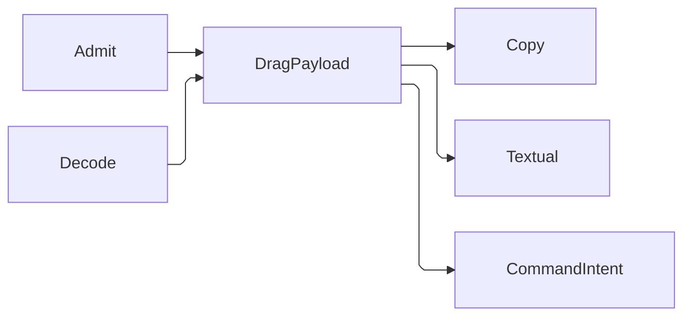

# [APPUI_INPUT_INTERACTION]

One interaction rail owns gesture mechanics for every admitted surface: keyboard chords derive from the one command table through a per-surface `GesturePolicy`, the behavior rail admits its trigger and action vocabulary as rows, pointer gestures and the frozen `PanZoomRow` canvas family route pinch, wheel, and drag input, and `DragPayload` plus `ClipboardRow` carry every transfer across the drag and clipboard boundaries on the validation rail. The page owns no key table, no conflict fold, no timer loop, and no second hotkey registry — the command deck, the AppHost schedule rows, and the motion timing vocabulary arrive settled. The spine is Avalonia, Xaml.Behaviors.Avalonia, PanAndZoom, Thinktecture.Runtime.Extensions, and LanguageExt.Core.

## [01]-[INDEX]

- [02]-[HOTKEY_DERIVATION]: Chord transform, scope split, gesture bindings over the frozen deck.
- [03]-[BEHAVIOR_RAIL]: Admitted trigger and action rows; one intent-binding entry.
- [04]-[POINTER_GESTURES]: Gesture routing rows and the frozen pan-zoom canvas family.
- [05]-[DRAG_CLIPBOARD]: Typed transfer payload union and clipboard codec rows.
- [06]-[INPUT_FABRIC]: Alternative-input device union and device-output union over the intent table.
- [07]-[DEVICE_DRIVERS]: The four admitted SDK boundary capsules, their open and arm legs, and the driver receipt.

## [02]-[HOTKEY_DERIVATION]

- Owner: `GesturePolicy` — the per-surface chord, scope, and return-key policy record carrying the binding fold.
- Entry: `public FrozenDictionary<KeyGesture, CommandIntent> Bindings(CommandDeck deck, CommandScope scope)` — pure fold over the frozen deck's gesture column through its chord delegate, narrowed to one scope; the first admitted row holds a contested chord and every later claimant drops deterministically.
- Auto: `For` builds the policy whose `Chord` the deck freeze receives; bindings derive once per frozen deck and scope, each table attaching at the owner its scope names — global at the surface root during the mount transaction, screen inside activation scopes, viewport on its canvas, dialog on the session root — and detaching with that owner.
- Packages: Avalonia, LanguageExt.Core, BCL inbox, Rasm.AppHost (project)
- Growth: a new hotkey is one gesture value on its command-table row; a new surface posture is one policy value inside `For`; a new attach owner is one `CommandScope` row read by the same fold; zero new surface.
- Boundary: the command table owns the `Option<KeyGesture>` column as the only key table in the package and the deck's freeze-time conflict fold is the only conflict evidence — a second conflict fold or receipt shape here is the deleted pattern; that fold groups on scope plus chord, so cross-scope chord sharing is legal by law and the scope narrowing here is what keeps the binding table total instead of throwing on a Global-versus-Screen pair Freeze admitted; canonical gestures are authored with the control modifier and `Chord` swaps it for the platform primary, so one authored chord serves every desktop; a `HostSurface.None` profile and the `SurfaceMount.Offscreen` mount pin the control modifier for deterministic specs and serialized parity; the panel mount holds the return key inside the shell instead of the host command line, with the host knob spelling research-gated; `KeyGesture` is value-equal with the `(Key, KeyModifiers)` constructor and `Parse`, and bindings attach as `KeyBinding` rows (`Gesture`, `Command`) in the surface root's `KeyBindings` collection.

```csharp signature
public sealed record GesturePolicy(
    KeyModifiers Primary,
    bool WantReturnInPanel,
    Func<bool, Unit> ApplyReturnPolicy) {
    // Two axis reads carry the posture the product names once fused: a surfaceless profile and an
    // offscreen mount both pin the control modifier for deterministic specs and serialized parity,
    // and the panel mount alone holds the return key inside the shell instead of the host command line.
    public static GesturePolicy For(ConsumptionProfile profile, SurfaceMount mount, Func<bool, Unit> applyReturnPolicy) =>
        new(
            Primary: profile.Surface == HostSurface.None || mount is SurfaceMount.Offscreen || !OperatingSystem.IsMacOS()
                ? KeyModifiers.Control
                : KeyModifiers.Meta,
            WantReturnInPanel: mount is SurfaceMount.Panel,
            ApplyReturnPolicy: applyReturnPolicy);

    public KeyGesture Chord(KeyGesture canonical) =>
        (canonical.KeyModifiers & KeyModifiers.Control) != 0
            ? new KeyGesture(canonical.Key, (canonical.KeyModifiers & ~KeyModifiers.Control) | Primary)
            : canonical;

    // Scope IS the partition, so a separate global/scoped split is the deleted form: the deck's freeze-time
    // conflict fold groups on (scope, chord), which leaves a Global row and a Screen row free to claim one
    // chord, and folding both into a single frozen table threw where the entry law promises first-admitted-
    // wins. Narrowing to the attaching scope removes the collision class and DistinctBy makes the surviving
    // claimant structural rather than dependent on the freeze proof holding for a grouping it never made.
    public FrozenDictionary<KeyGesture, CommandIntent> Bindings(CommandDeck deck, CommandScope scope) =>
        toSeq(deck.Rows.Values)
            .Filter(row => row.Scope == scope)
            .Bind(row => row.Gesture.Map(gesture => (Gesture: deck.Chord(gesture), Row: row)).ToSeq())
            .Map(static pair => KeyValuePair.Create(pair.Gesture, pair.Row))
            .DistinctBy(static pair => pair.Key)
            .ToFrozenDictionary(static pair => pair.Key, static pair => pair.Value);

    public Unit Mount() => ApplyReturnPolicy(WantReturnInPanel);
}
```

## [03]-[BEHAVIOR_RAIL]

- Owner: `BehaviorRail` — the static intent-binding surface over the admitted trigger and action rows.
- Entry: `public static InvokeCommandAction Intent(ICommand command)` — the only action-to-command bridge; the argument is the table-generated ReactiveCommand row resolved by intent key.
- Packages: Xaml.Behaviors.Avalonia, ReactiveUI, LanguageExt.Core, BCL inbox
- Growth: a new interaction trigger or action is one admission-table row naming its catalogued type, knob, and timing row; zero new surface.
- Boundary: the admission table excludes `FileSystemWatcherTrigger`, `NetworkInformationTrigger`, `HttpRequestAction`, and `WriteTextToFileAction`; asset reload, connectivity, outbound requests, and export enter through their owning rails. `TimerTrigger` carries surface-local micro-cadence only, while throttle and debounce intervals resolve from the motion timing vocabulary at composition. `EventTriggerBehavior` and the catalogued routed-event trigger family own event admission, and `RoutedEventTriggerBehavior` carries routing strategy and source overrides. Compiled XAML binding and `BehaviorRail.Intent` are the complete view-binding surface; no ceremonial method names rejected ReactiveUI property binders.

```csharp signature
public static class BehaviorRail {
    public static InvokeCommandAction Intent(ICommand command) =>
        new() { Command = command, PassEventArgsToCommand = false };

}
```

| [INDEX] | [ROW]          | [SURFACE]                    | [KNOB]        | [TIMING_ROW] |
| :-----: | :------------- | :--------------------------- | :------------ | :----------: |
|  [01]   | routed-event   | `RoutedEventTriggerBehavior` | `RoutedEvent` |      —       |
|  [02]   | data           | `DataTriggerBehavior`        | `Binding`     |      —       |
|  [03]   | multi-data     | `MultiDataTriggerBehavior`   | `Conditions`  |      —       |
|  [04]   | timer          | `TimerTrigger`               | —             |   standard   |
|  [05]   | task-completed | `TaskCompletedTrigger`       | —             |      —       |
|  [06]   | stream-bridge  | `ObservableStreamBehavior`   | `Source`      |      —       |
|  [07]   | intent-action  | `InvokeCommandAction`        | `Command`     |      —       |
|  [08]   | property       | `ChangePropertyAction`       | —             |      —       |
|  [09]   | async-group    | `AsyncActionGroup`           | `Actions`     |      —       |
|  [10]   | throttle       | `ThrottleAction`             | `Interval`    |     fast     |
|  [11]   | debounce       | `DebounceAction`             | `Delay`       |   standard   |

## [04]-[POINTER_GESTURES]

- Owner: `PanZoomRow` — the frozen canvas row family over `ZoomBorder`; gesture routing rows.
- Cases: `Dashboard` | `Preview`
- Packages: PanAndZoom, Xaml.Behaviors.Avalonia, Avalonia, BCL inbox
- Growth: a new zoomable surface is one `PanZoomRow` row; a new pointer gesture is one routing-table row landing on an existing intent; a rotation or saved-view posture is one policy value on the row; zero new surface.
- Boundary: one zoom owner per canvas — a chart tile mounted inside a `PanZoomRow` canvas gates its internal zoom off; the row's `MinZoom` and `MaxZoom` land on the control's per-axis `MinZoomX`/`MinZoomY`/`MaxZoomX`/`MaxZoomY` at composition; `Dashboard` animation duration binds `AnimationDuration` from the motion standard row at composition and `Preview` stays animation-free for capture determinism; rotation rides the `EnableRotation` row gate onto the control `Rotate`/`RotateAt` operations with `SnapRotation` quantizing to the rotation-step policy value and `ResetRotation` clearing on view reset, so a hand-built rotation matrix on the canvas is the deleted form and `Preview` holds rotation off for capture determinism; the rotate gesture binds `PointerTouchPadGestureRotateGestureTrigger` (`Avalonia.Xaml.Interactions.Custom`) so the two-finger rotate routes onto `Rotate`/`SnapRotation` under `RotationStep`, the magnify gesture binds `PointerTouchPadGestureMagnifyGestureTrigger` onto wheel-class zoom, and `HoldingGestureTrigger`/`PinchGestureTrigger`/`PinchEndedGestureTrigger` are the catalogued gesture-family triggers in the same custom assembly, so a hand-wired `GestureEventArgs` listener is the deleted form; view state round-trips through the `ZoomBorderState` value and `ImportState` into the screen-state snapshot rows, named viewports persist through `SaveView`/`RestoreView` with `DeleteSavedView` and `ClearSavedViews` owning the named-view registry as command-table intents, traversal rides `NavigateBack`/`NavigateForward` with `ClearViewHistory` resetting the stack at screen teardown; focus follows pointer press through `Focus` on `IInputElement`, and pointer-capture acquisition on press rides `PointerPressedEventTrigger` while capture-loss rides `PointerCaptureLostEventTrigger`/`PointerCaptureLostEventBehavior` (`Avalonia.Xaml.Interactions.Events`) as behavior-rail routed-event triggers; the dashboard tile canvas and the offscreen-visuals preview canvas consume these rows as settled values.

```csharp signature
public sealed record PanZoomRow(
    string Key,
    StretchMode Stretch,
    ButtonName PanButton,
    double ZoomSpeed,
    double MinZoom,
    double MaxZoom,
    bool EnableConstrains,
    bool EnableGestures,
    bool EnableAnimations,
    bool ShowZoomIndicator,
    bool EnableRotation,
    double RotationStep) {
    public static readonly PanZoomRow Dashboard = new("dashboard", StretchMode.None, ButtonName.Middle, ZoomSpeed: 1.2, MinZoom: 0.1, MaxZoom: 8.0, EnableConstrains: true, EnableGestures: true, EnableAnimations: true, ShowZoomIndicator: true, EnableRotation: true, RotationStep: 15.0);
    public static readonly PanZoomRow Preview = new("preview", StretchMode.Uniform, ButtonName.Middle, ZoomSpeed: 1.2, MinZoom: 0.05, MaxZoom: 64.0, EnableConstrains: true, EnableGestures: true, EnableAnimations: false, ShowZoomIndicator: false, EnableRotation: false, RotationStep: 0.0);

    public static readonly FrozenDictionary<string, PanZoomRow> Rows =
        new[] { Dashboard, Preview }.ToFrozenDictionary(static row => row.Key, static row => row, StringComparer.Ordinal);
}
```

| [INDEX] | [GESTURE]       | [ROUTE]                                       | [CONSEQUENCE]                                                    |
| :-----: | :-------------- | :-------------------------------------------- | :--------------------------------------------------------------- |
|  [01]   | tap             | `TappedEventTrigger`                          | primary intent action fires                                      |
|  [02]   | double-tap      | `DoubleTappedEventTrigger`                    | canvas rows route through `DoubleClickZoomMode`                  |
|  [03]   | press-hold      | `HoldingGestureTrigger`                       | context intent raise                                             |
|  [04]   | context-request | `RightTappedEventTrigger`                     | menu derivation from the command-table surface predicate         |
|  [05]   | wheel zoom      | `ZoomBorder`                                  | one zoom owner per canvas row                                    |
|  [06]   | pinch zoom      | `PinchGestureTrigger`                         | `ZoomBorder` `EnableGestures`; one zoom owner                    |
|  [07]   | canvas drag     | `CanvasDragBehavior`                          | draggable tiles inside canvas rows                               |
|  [08]   | item drag       | `ItemDragBehavior`                            | draggable-control rows                                           |
|  [09]   | rotate gesture  | `PointerTouchPadGestureRotateGestureTrigger`  | `EnableRotation` gates `Rotate`/`SnapRotation` by `RotationStep` |
|  [10]   | magnify gesture | `PointerTouchPadGestureMagnifyGestureTrigger` | wheel-class zoom under the row `MinZoom`/`MaxZoom`               |
|  [11]   | pointer-capture | `PointerCaptureLostEventTrigger`              | capture-loss releases the canvas pointer owner                   |
|  [12]   | saved-view      | `ZoomBorder` `RestoreView` / `SaveView`       | `DeleteSavedView`/`ClearSavedViews` raise as intents             |

## [05]-[DRAG_CLIPBOARD]

- Owner: `DragPayload` transfer union; `ClipboardRow` codec row family.
- Cases: `TableRows(Seq<string> Keys, string Tsv)` | `AssetKey(string Key)` | `HostObjects(Seq<Guid> Ids)` | `Files(Seq<string> Paths)` | `Image(ReadOnlyMemory<byte> Png)`
- Entry: `public static Validation<Error, DragPayload> Admit(Seq<string> paths, Func<string, bool> admitted)` — external drop admission; `Validation<Error,T>` accumulates one refusal per unadmitted path; `public static Option<Validation<Error, DragPayload>> Decode(Seq<string> formats, Func<string, Option<ReadOnlyMemory<byte>>> read, JsonSerializerOptions wire)` — the format gate: the present clipboard identifiers select the first round-trip row and `None` is the no-op an unroutable clipboard folds to.
- Auto: every external drop runs `Admit` and every paste enters through `Decode` before any intent fires; refusals fold into the screen fault state with zero partial payloads.
- Receipt: admitted payloads raise their command intents and ride the command receipt family — the rail mints no second receipt vocabulary.
- Packages: Thinktecture.Runtime.Extensions, LanguageExt.Core, Xaml.Behaviors.Avalonia, Avalonia, BCL inbox
- Growth: a new transfer shape is one union case plus one `ClipboardRow`; zero new surface.
- Boundary: drag rows ride `ContextDragBehavior`, `ContextDropBehavior`, and `ListReorderDragBehavior`; drop targets enable through `DragDrop.SetAllowDrop(control, true)` with the routed `DragDrop.DragOverEvent`/`DropEvent` handlers attached, and the dropped payload reads from `DragEventArgs.DataTransfer` with the chosen effect set into `DragEventArgs.DragEffects` during `DragOver`, never `DragEventArgs.Data`; the `admitted` predicate column arrives from the dialogs file-filter vocabulary; a paste gates through `GetClipboardFormatsAction` into `Decode` so the present data-format identifiers select the matching `ClipboardRow` before any `Paste` runs and an absent format folds to no-op rather than a failed decode; plain-text paste routes to the focused control and never the payload rail, so the text row is copy-only structurally — it carries no paste leg at all, the gate skips it, and `PasteRejected` stays reserved for a genuine malformed decode instead of firing on every ordinary external text paste; every structured `DragPayload` case owns a `ClipboardRow` round-trip — `Files` rides the standard `text/uri-list` grammar and `HostObjects` the `application/x-rasm-host-objects` GUID row, both fail-closed with one accumulated refusal per malformed entry, so a copy-paste cycle preserves the structured case and no generic textual coercion can bypass its row; `TableRows.Tsv` alone supplies the explicit `text/plain` interoperability projection beside its full-fidelity JSON row; the host-objects CLIPBOARD leg is in-process and live while the cross-NSView host-object DRAG stays research-gated; asset keys ride the icons asset-key vocabulary and table-row keys ride the grid row-model identity; structured copy crosses through one clipboard write keyed by the row `Format` identifiers, riding `Avalonia.Input.Platform.IClipboard.SetDataAsync(IAsyncDataTransfer)` with a `DataTransfer` carrying one `DataTransferItem` per `ClipboardRow` keyed by `DataFormat.CreateBytesApplicationFormat`/`CreateStringApplicationFormat`, each item built through `DataTransferItem.Create<T>(DataFormat<T>, T?)`/`CreateText` or `DataTransferItem.Set<T>(DataFormat<T>, T?)`, the read riding `IClipboard.TryGetDataAsync()` with `ClipboardExtensions.GetDataFormatsAsync` as the present-format gate and `ClipboardExtensions.TryGetTextAsync`/`ClipboardExtensions.TryGetValueAsync<T>(DataFormat<T>)` plus `DataTransferItem.TryGetRaw` as the typed extract, the `IAsyncDataTransfer` handed to `SetDataAsync` left undisposed because Avalonia takes ownership and disposes it once off the clipboard (a caller `using`/`Dispose` on the set transfer is the deleted form), and the legacy `DataObject`/`DataFormats`/`IDataObject` surface obsolete in Avalonia 12; the headless drop harness sequences `DragDrop` calls `DragEnter` → `DragOver` → `Drop` (mirroring `DragLeave` on the abort path) because a `DragOver` without a prior `DragEnter` seeds no drop context and fires no routed handler, and headless input modifiers cross as `RawInputModifiers`, never `KeyModifiers`; host-object drag across the NSView boundary is research-gated on the embed capsule.

```csharp signature
[Union(ConversionFromValue = ConversionOperatorsGeneration.None)]
public abstract partial record DragPayload {
    private DragPayload() { }

    public sealed record TableRows(Seq<string> Keys, string Tsv) : DragPayload;

    public sealed record AssetKey(string Key) : DragPayload;

    public sealed record HostObjects(Seq<Guid> Ids) : DragPayload;

    public sealed record Files(Seq<string> Paths) : DragPayload;

    public sealed record Image(ReadOnlyMemory<byte> Png) : DragPayload;

    public static Option<string> Textual(DragPayload payload) =>
        payload.Switch(
            tableRows: static rows => Some(rows.Tsv),
            assetKey: static _ => None,
            hostObjects: static _ => None,
            files: static _ => None,
            image: static _ => None);

    public static Validation<Error, DragPayload> Admit(Seq<string> paths, Func<string, bool> admitted) =>
        Refused(paths, admitted) switch {
            { IsEmpty: true } => paths.IsEmpty
                ? (Validation<Error, DragPayload>)new InputDriverFault.DropRejected("empty drop")
                : (Validation<Error, DragPayload>)new Files(paths),
            var refused => (Validation<Error, DragPayload>)Error.Many([.. refused]),
        };

    private static Seq<Error> Refused(Seq<string> paths, Func<string, bool> admitted) =>
        paths.Filter(path => !admitted(path)).Map(static path => (Error)new InputDriverFault.DropRejected($"unadmitted drop: {path}"));
}

public sealed record ClipboardRow(
    string Format,
    Func<DragPayload, JsonSerializerOptions, Option<ReadOnlyMemory<byte>>> Copy,
    Option<Func<ReadOnlyMemory<byte>, JsonSerializerOptions, Validation<Error, DragPayload>>> Paste) {
    public const int MaxImageBytes = 33_554_432;

    // Two admissions over one row shape: a round-trip row carries both legs, a copy-only row carries no
    // paste leg at all. Absence as a value is what makes the copy-only law structural — the format gate
    // cannot select a decoder that does not exist, so an ordinary external text paste is a no-op instead
    // of a hardcoded refusal the screen fault fold then raises as a failure the user caused by pasting.
    private static ClipboardRow RoundTrip(
        string format,
        Func<DragPayload, JsonSerializerOptions, Option<ReadOnlyMemory<byte>>> copy,
        Func<ReadOnlyMemory<byte>, JsonSerializerOptions, Validation<Error, DragPayload>> paste) =>
        new(format, copy, Some(paste));

    private static ClipboardRow CopyOnly(
        string format, Func<DragPayload, JsonSerializerOptions, Option<ReadOnlyMemory<byte>>> copy) =>
        new(format, copy, None);

    public static readonly ClipboardRow Text = CopyOnly(
        "text/plain",
        static (payload, wire) => DragPayload.Textual(payload).Map(text => (ReadOnlyMemory<byte>)Encoding.UTF8.GetBytes(text)));

    public static readonly ClipboardRow Table = RoundTrip(
        "application/x-rasm-table-rows+json",
        copy: static (payload, wire) => payload is DragPayload.TableRows rows
            ? Optional<ReadOnlyMemory<byte>>(JsonSerializer.SerializeToUtf8Bytes(rows, wire))
            : None,
        paste: static (bytes, wire) => Try.lift(() => JsonSerializer.Deserialize<DragPayload.TableRows>(bytes.Span, wire))
            .Run()
            .Bind(decoded => Optional(decoded).ToFin(new InputDriverFault.PasteRejected("table rows absent")))
            .ToValidation());

    public static readonly ClipboardRow Png = RoundTrip(
        "image/png",
        copy: static (payload, wire) => payload is DragPayload.Image image && image.Png.Length <= MaxImageBytes ? Optional(image.Png) : None,
        paste: static (bytes, wire) => bytes.Length <= MaxImageBytes
            && bytes.Span is [0x89, 0x50, 0x4E, 0x47, 0x0D, 0x0A, 0x1A, 0x0A, ..]
            ? (Validation<Error, DragPayload>)new DragPayload.Image(bytes)
            : (Validation<Error, DragPayload>)new InputDriverFault.PasteRejected("png signature mismatch"));

    public static readonly ClipboardRow Asset = RoundTrip(
        "application/x-rasm-asset-key",
        copy: static (payload, wire) => payload is DragPayload.AssetKey { Key.Length: > 0 } key ? Optional<ReadOnlyMemory<byte>>(Encoding.UTF8.GetBytes(key.Key)) : None,
        paste: static (bytes, wire) => Encoding.UTF8.GetString(bytes.Span) is { Length: > 0 } key
            ? (Validation<Error, DragPayload>)new DragPayload.AssetKey(key)
            : (Validation<Error, DragPayload>)new InputDriverFault.PasteRejected("empty asset key"));

    // uri-list is the standard interchange grammar: CRLF-separated absolute URIs, '#' comment lines
    // skipped; a non-file URI accumulates one refusal per line, so a mixed paste reports every reject.
    public static readonly ClipboardRow Uris = RoundTrip(
        "text/uri-list",
        copy: static (payload, wire) => payload is DragPayload.Files files
            ? files.Paths.Traverse(static path => Uri.TryCreate(path, UriKind.Absolute, out Uri? uri) && uri.IsFile
                    ? Some(uri.AbsoluteUri)
                    : Option<string>.None)
                .Map(uris => (ReadOnlyMemory<byte>)Encoding.UTF8.GetBytes(string.Join("\r\n", uris)))
            : None,
        paste: static (bytes, wire) => toSeq(Encoding.UTF8.GetString(bytes.Span).Split(["\r\n", "\n"], StringSplitOptions.RemoveEmptyEntries))
            .Filter(static line => !line.StartsWith('#'))
            .Traverse(static line => Uri.TryCreate(line, UriKind.Absolute, out Uri? uri) && uri.IsFile
                ? Success<Error, string>(uri.LocalPath)
                : (Validation<Error, string>)new InputDriverFault.PasteRejected($"non-file uri: {line}"))
            .As()
            .Map(static paths => (DragPayload)new DragPayload.Files(paths)));

    // Host-object identity round-trips as comma-joined GUIDs; a malformed token accumulates its own
    // refusal, so a copy-paste cycle preserves the structured case fail-closed, never a text coercion.
    public static readonly ClipboardRow Host = RoundTrip(
        "application/x-rasm-host-objects",
        copy: static (payload, wire) => payload is DragPayload.HostObjects host ? Optional<ReadOnlyMemory<byte>>(Encoding.UTF8.GetBytes(string.Join(",", host.Ids))) : None,
        paste: static (bytes, wire) => toSeq(Encoding.UTF8.GetString(bytes.Span).Split(',', StringSplitOptions.RemoveEmptyEntries))
            .Traverse(static token => Guid.TryParse(token, out Guid id)
                ? Success<Error, Guid>(id)
                : (Validation<Error, Guid>)new InputDriverFault.PasteRejected($"malformed host id: {token}"))
            .As()
            .Map(static ids => (DragPayload)new DragPayload.HostObjects(ids)));

    public static readonly FrozenDictionary<string, ClipboardRow> Rows =
        new[] { Text, Table, Png, Asset, Uris, Host }.ToFrozenDictionary(static row => row.Format, static row => row, StringComparer.Ordinal);

    // The format gate: the identifiers the clipboard reports select the FIRST row carrying a paste leg, so
    // a copy-only row is unreachable here by construction, an unroutable clipboard answers None, and a
    // present-but-unreadable format answers None too — refusal survives only for a decode that actually ran.
    public static Option<Validation<Error, DragPayload>> Decode(
        Seq<string> formats, Func<string, Option<ReadOnlyMemory<byte>>> read, JsonSerializerOptions wire) =>
        formats
            .Choose(format => Rows.TryGetValue(format, out ClipboardRow? row) ? Some(row) : None)
            .Choose(row => row.Paste.Map(paste => (row.Format, Paste: paste)))
            .Head
            .Bind(found => read(found.Format).Map(bytes => found.Paste(bytes, wire)));
}
```


```mermaid
---
config:
  layout: elk
  flowchart:
    curve: linear
    padding: 25
---
flowchart LR
    accTitle: Drag and paste payload fan
    accDescr: Admission and the clipboard format gate both minting one drag payload that fans into the copy leg, the textual projection, and the command intent.
    Admit --> DragPayload
    Decode --> DragPayload
    DragPayload --> Copy
    DragPayload --> Textual
    DragPayload --> CommandIntent
```

## [06]-[INPUT_FABRIC]

- Owner: `InputDevice` `[Union]` the alternative-input source family over the four admitted net10 SDKs; `DeviceAxis` the normalized continuous-axis sample; `DeviceOutput` `[Union]` the device-output sink family; `InputFabric` the device-to-intent and intent-to-device fold.
- Cases: `InputDevice` = SpaceMouse | GameController | HapticSurface | MidiSurface under the locked kind literals; `DeviceOutput` = ControllerRumble | HapticRumble under the locked kind literals — eye-gaze, switch-access, voice, CNC, and robot are out of the fabric (no viable cross-platform net10 SDK, closed `INPUT-FABRIC-SDKS`).
- Entry: `public DeviceIntentReport Map(InputDevice device, Seq<DeviceAxis> sample, CommandDeck deck)` — folds a device sample into a survivor/casualty partition over the one table: every device-produced key admits through `deck.Rows` into its `CommandIntent` row, and a key the deck does not carry lands as a typed `InputDriverFault.IntentUnmapped` casualty carrying the device identity and the refused key, so a driver typo, a renamed command key, or an unsupported MIDI mapping is observable input evidence, never a silent drop; `public IO<Unit> Drive(DeviceOutput output, Seq<DeviceAxis> command)` — folds a command into the device-output samples it emits.
- Auto: every alternative-input device folds onto the one `CommandIntent` table — a SpaceMouse six-degree-of-freedom translation/rotation sample maps to the viewport orbit/pan/zoom intents, a game-controller stick to the same navigation intents, a haptic-surface trigger to a feedback intent, and a MIDI control surface to parameter intents — so a new input modality raises existing verbs and never a parallel command path; device output is the symmetric fold — a controller rumble or a haptic-device pulse consumes the normalized command axes so the same intent that an input device raises a device output can consume, completing the input-output fabric; the continuous-axis sample is normalized to [-1, 1] so a device-specific range never leaks into the intent fold; each device's continuous axes fold through the `Shell/input` pan-zoom canvas algebra (`[04]-[POINTER_GESTURES]`) and discrete events map onto the `CommandIntent` vocabulary.
- Packages: Thinktecture.Runtime.Extensions, LanguageExt.Core, NodaTime, BCL inbox
- Growth: a new input device is one `InputDevice` case reading the shared intent rail; a new output device is one `DeviceOutput` case; a new continuous control is one `DeviceAxis` row; zero new surface — a parallel input framework beside this fabric is the rejected form.
- Boundary: alternative input folds onto the one command table so a per-device handler is the deleted form — a SpaceMouse, controller, haptic, or MIDI sample raises a `CommandIntent` exactly as a hotkey does, and the one availability algebra gates them all; the `DeviceIntentReport` partition is the ingress evidence — `Raised` rows ride the command receipt family unchanged while `Unmapped` casualties fold into the screen fault state and device telemetry; samples normalize to `[-1,1]`, while each `DeviceOutput` case carries its composition-bound channel keys and timing policy, so the drive fold contains no positional channel or duration literal; controller-rumble and haptic sinks consume normalized command axes through device delegates, and SDK capsules live in `[07]-[DEVICE_DRIVERS]`; mouse, touch, pen, and keyboard stay with the pointer-gesture and hotkey owners.

```csharp signature
// The generator's own admission seam, by-ref in both slots: a by-value hook returning the error is private
// dead code the factory never calls, which admits any double through Create and leaves the [-1,1] law with
// no enforcement point anywhere on the page.
[ValueObject<double>]
public readonly partial struct NormalizedAxis {
    static partial void ValidateFactoryArguments(ref ValidationError? validationError, ref double value) =>
        validationError = double.IsFinite(value) && value is >= -1d and <= 1d
            ? validationError
            : new ValidationError($"axis outside [-1,1]: {value}");
}

public readonly record struct DeviceAxis(string Channel, NormalizedAxis Value);

[Union(ConversionFromValue = ConversionOperatorsGeneration.None)]
public abstract partial record InputDevice(string Id) {
    public sealed record SpaceMouse(string Id, Func<Seq<DeviceAxis>, Seq<string>> ToIntents) : InputDevice(Id);
    public sealed record GameController(string Id, Func<Seq<DeviceAxis>, Seq<string>> ToIntents) : InputDevice(Id);
    public sealed record HapticSurface(string Id, Func<Seq<DeviceAxis>, Seq<string>> ToIntents) : InputDevice(Id);
    public sealed record MidiSurface(string Id, Func<Seq<DeviceAxis>, Seq<(string Key, double Value)>> ToParameters) : InputDevice(Id);
}

[Union(ConversionFromValue = ConversionOperatorsGeneration.None)]
public abstract partial record DeviceOutput {
    private DeviceOutput() { }
    // Pulse is a Duration like every other interval in the package — the SDK's millisecond scalar exists
    // only inside the driver capsule that speaks it, so no case body and no drive fold carries a raw count.
    public sealed record ControllerRumble(
        string Id,
        string LowChannel,
        string HighChannel,
        Duration Pulse,
        Func<double, double, Duration, IO<Unit>> Rumble) : DeviceOutput;
    public sealed record HapticRumble(string Id, string StrengthChannel, Func<double, IO<Unit>> Pulse) : DeviceOutput;
}

public readonly record struct DeviceInvocation(CommandIntent Intent, CommandPayload Payload);

public readonly record struct DeviceIntentReport(Seq<DeviceInvocation> Raised, Seq<InputDriverFault> Unmapped) {
    public static readonly DeviceIntentReport Empty = new(Seq<DeviceInvocation>(), Seq<InputDriverFault>());
}

public static class InputFabric {
    public static DeviceIntentReport Map(InputDevice device, Seq<DeviceAxis> sample, CommandDeck deck) =>
        Invocations(device, sample).Fold(
            DeviceIntentReport.Empty,
            (report, invocation) => deck.Rows.TryGetValue(invocation.Key, out CommandIntent? row)
                ? report with { Raised = report.Raised.Add(new DeviceInvocation(row, invocation.Payload)) }
                : report with { Unmapped = report.Unmapped.Add(new InputDriverFault.IntentUnmapped($"{device.Id}:{invocation.Key}")) });

    private static Seq<(string Key, CommandPayload Payload)> Invocations(InputDevice device, Seq<DeviceAxis> sample) =>
        device.Switch(
            state: sample,
            spaceMouse: static (current, source) => source.ToIntents(current).Map(static key => (key, (CommandPayload)new CommandPayload.None())),
            gameController: static (current, source) => source.ToIntents(current).Map(static key => (key, (CommandPayload)new CommandPayload.None())),
            hapticSurface: static (current, source) => source.ToIntents(current).Map(static key => (key, (CommandPayload)new CommandPayload.None())),
            midiSurface: static (current, source) => source.ToParameters(current).Map(static parameter => (
                parameter.Key,
                (CommandPayload)new CommandPayload.Text(parameter.Value.ToString("R", CultureInfo.InvariantCulture)))));

    public static IO<Unit> Drive(DeviceOutput output, Seq<DeviceAxis> command) =>
        output.Switch(
            state: command,
            controllerRumble: static (cmd, controller) => controller.Rumble(
                Value(cmd, controller.LowChannel),
                Value(cmd, controller.HighChannel),
                controller.Pulse),
            hapticRumble: static (cmd, haptic) => haptic.Pulse(Value(cmd, haptic.StrengthChannel)));

    private static double Value(Seq<DeviceAxis> command, string channel) =>
        command.Find(axis => string.Equals(axis.Channel, channel, StringComparison.Ordinal))
            .Map(static axis => axis.Value.ToValue())
            .IfNone(0d);
}
```

## [07]-[DEVICE_DRIVERS]

- Owner: `DeviceDriver` `[Union]` the four SDK boundary capsules carrying each backend's enumeration coordinates, decode policy, and fabric projection; `DeviceSession` the scoped device handle; `DeviceReceipt` the driver-resolved evidence row; `DriverRuntime` the composition-bound count, evidence, and sampler columns; `AxisChannel` the one channel-key grammar both the capsule and its composition projection read; `InputDriverFault` the typed fault family on the `AppUiFaultBand.InputDriver` registry row (6050).
- Cases: `DeviceDriver` = Hid(HidSharp SpaceMouse, source-only) | Gamepad(Silk.NET.Input controller, both legs) | Haptic(Silk.NET.SDL force-feedback, actuator-only) | Midi(Melanchall.DryWetMidi control surface, source-only) under the locked kind literals the `Kind` projection owns, so `InputDevice.HapticSurface` carries no in-package driver until the SDL axis-read research row closes; `InputDriverFault` = Text | DeviceAbsent | OpenRejected | DecodeFailed | BindingRejected | DropRejected | PasteRejected | IntentUnmapped — codes derive through the `Diagnostics/evidence#FAULT_TABLES` registry.
- Entry: `public static Fin<DeviceSession> Open(DeviceDriver driver, DriverRuntime runtime)` — the input leg: one arm per SDK folding enumerate → open → decode → teardown, returning the mint-once receipt, the fabric projection the `InputDevice` arm reads, and the normalized sample stream; `public static Fin<DeviceOutput> Arm(DeviceDriver driver, DriverRuntime runtime)` — the output leg over the same four cases, minting the `DeviceOutput` sink the drive fold consumes and sealing `BindingRejected` for a backend that carries no actuator.
- Auto: the `Hid` capsule enumerates a 3Dconnexion SpaceMouse through `DeviceList.GetHidDevices(vendorId, productId)`, opens a scoped `HidStream` through `TryOpen`, pumps reports through `HidDeviceInputReceiver.Start`, and decodes the changed fields through `DeviceItemInputParser.GetNextChangedIndex`/`GetValue` and `DataValue.GetScaledValue(-1d, 1d)` so canonical [-1,1] axes leave the capsule, not raw HID bytes, re-enumerating a whole generation on `DeviceList.Changed` (`.api/api-hidsharp.md`); the `Gamepad` capsule mints one `IInputContext` per view through `IView.CreateInput()`, polls `IGamepad.Thumbsticks`/`Triggers`/`Buttons` on the composition-bound cadence with `Deadzone.Apply` recentering, and drives rumble through `IMotor.Speed` (`.api/api-silk-input.md`); the `Haptic` capsule arms the SDL haptic subsystem through `InitSubSystem(InitHaptic)`, opens through `HapticOpen`, initialises the simple-rumble path through `HapticRumbleInit`, and plays through `HapticRumblePlay` (`.api/api-silk-sdl.md`); the `Midi` capsule resolves through `InputDevice.GetByName`, listens through `StartEventsListening`, narrows each `MidiEventReceivedEventArgs.Event` by case, and projects `ControlChangeEvent.ControlValue`/`NoteOnEvent.Velocity` (bounded `SevenBitNumber`) through the 127 divisor into normalized parameter axes (`.api/api-drywetmidi.md`); every handle is lifecycle-scoped and disposed at teardown.
- Receipt: `DeviceReceipt` — driver case, device identity, axis count — mints once at the resolving open and rides the `DriverRuntime.Evidence` column; that same open counts the resolved instrument and an absent one counts the absent instrument on the identical driver slot, so both counts and the evidence row share one producer.
- Packages: HidSharp, Silk.NET.Input, Silk.NET.SDL, Melanchall.DryWetMidi, Thinktecture.Runtime.Extensions, LanguageExt.Core, NodaTime, System.Reactive
- Growth: a new device backend is one `DeviceDriver` case plus its open and arm bodies; one device instrument is one `InstrumentSpec` row on `InputDrivers.TelemetryRow`; a new axis vocabulary is `AxisChannel` rows a composition mints; zero new surface.
- Boundary: each capsule is the named boundary admission for its SDK — `Open` and `Arm` pair the SDK's enumerate-and-open with the teardown in one scoped fold and the raw report crosses the boundary exactly once, so a normalized `DeviceAxis` leaves the capsule and a raw HID byte array, a raw `MidiEvent`, or a raw SDL status never propagates into the fabric (the per-SDK `LOCAL_ADMISSION` of each `.api`); a second stream entry beside `DeviceSession.Samples` is the deleted form because the session column IS the stream; the `Hid` capsule re-enumerates a whole generation on `DeviceList.Changed` and `Switch` disposes the prior `HidStream` before the next open runs, so a stale handle is unreachable rather than merely unused; the `Gamepad` capsule holds exactly one `IInputContext` per view (the SDL2 backend reflection-loaded through `TryAdd("Silk.NET.Input.Sdl")`), the `Haptic` capsule shares the single `Sdl.GetApi()` instance with the `Gamepad` SDL2 backend so no second native bundle loads, and the `Midi` capsule disposes every `InputDevice` it opens; SDL's negative int status lifts through `GetErrorS()` into a typed `OpenRejected` at the capsule and never crosses as a number; the bounded byte discipline holds at the edge — MIDI data crosses as `SevenBitNumber`/`FourBitNumber` and rejects out-of-range before forming, HID axes cross as `GetScaledValue` projections, and every sample admits through `NormalizedAxis.TryCreate` so a refused field counts one rejection instead of entering the fabric — the one producer `DecodeFailed` has; the millisecond scalar every haptic SDK speaks exists only inside these bodies, so the `DeviceOutput` cases carry `Duration`; the capsule binds the `InputDevice`/`DeviceOutput` union arm's projection delegate at composition so the fabric body of `[06]` names no SDK member; the four native SDKs (SDL2 shared between Silk.NET.Input and Silk.NET.SDL, libmpv-independent) provision at the app-host distribution layer, never bundled by the managed packages; the changed-field drain, the SDL pointer marshalling, and the subscription-scoped open are the named platform-forced statement seam inside these capsules and nowhere else.

```csharp signature
[Union]
public abstract partial record InputDriverFault : Expected, IValidationError<InputDriverFault> {
    private InputDriverFault(string detail, int code) : base(detail, code, None) { }

    public static InputDriverFault Create(string message) => new Text(message);

    public sealed record Text : InputDriverFault { public Text(string detail) : base(detail, AppUiFaultBand.InputDriver.Code(0)) { } }
    public sealed record DeviceAbsent : InputDriverFault { public DeviceAbsent(string detail) : base(detail, AppUiFaultBand.InputDriver.Code(1)) { } }
    public sealed record OpenRejected : InputDriverFault { public OpenRejected(string detail) : base(detail, AppUiFaultBand.InputDriver.Code(2)) { } }
    public sealed record DecodeFailed : InputDriverFault { public DecodeFailed(string detail) : base(detail, AppUiFaultBand.InputDriver.Code(3)) { } }
    public sealed record BindingRejected : InputDriverFault { public BindingRejected(string detail) : base(detail, AppUiFaultBand.InputDriver.Code(4)) { } }
    public sealed record DropRejected : InputDriverFault { public DropRejected(string detail) : base(detail, AppUiFaultBand.InputDriver.Code(5)) { } }
    public sealed record PasteRejected : InputDriverFault { public PasteRejected(string detail) : base(detail, AppUiFaultBand.InputDriver.Code(6)) { } }
    public sealed record IntentUnmapped : InputDriverFault { public IntentUnmapped(string detail) : base(detail, AppUiFaultBand.InputDriver.Code(7)) { } }
}

public sealed record DeviceReceipt(string Driver, string Id, int Axes) {
    public const string Kind = "input-device";
}

// The composition-bound driver columns: one count sink carrying its own dimension slot, one evidence sink
// for the mint-once receipt, and the scheduler every polled backend paces on — the surface-runtime shape
// one page over, so no capsule reaches a meter, an evidence stream, or a clock by name.
public sealed record DriverRuntime(
    Func<string, Option<(string Slot, string Value)>, Unit> Count,
    Func<DeviceReceipt, Unit> Evidence,
    IScheduler Sampler);

// The one channel-key grammar: a capsule mints every axis key here and the composition-bound projection
// resolves the same key back, so a channel spelled once in a capsule and once in a `ToIntents` delegate
// cannot drift and an output row's channel column is minted from the identical grammar.
public readonly record struct AxisChannel(string Driver, string Control, int Ordinal) {
    public string Key => $"{Driver}.{Control}.{Ordinal}";
}

public sealed record DeviceSession(
    DeviceReceipt Receipt,
    InputDevice Device,
    IObservable<Seq<DeviceAxis>> Samples,
    IDisposable Teardown) : IDisposable {
    public void Dispose() => Teardown.Dispose();
}

[Union(ConversionFromValue = ConversionOperatorsGeneration.None)]
public abstract partial record DeviceDriver {
    private DeviceDriver() { }

    // Each case carries enumeration coordinates, decode policy, and its fabric projection — never a Bind
    // delegate standing in for the capsule body, which left the whole raw-report decode unowned and the
    // normalization law with no producer anywhere in the package.
    public sealed record Hid(
        DeviceList Devices,
        int VendorId,
        int ProductId,
        FrozenDictionary<uint, AxisChannel> Channels,
        Func<Seq<DeviceAxis>, Seq<string>> ToIntents) : DeviceDriver;

    public sealed record Gamepad(
        Func<IInputContext> Context,
        int Index,
        Deadzone Deadzone,
        Duration Cadence,
        Duration Pulse,
        Func<Seq<DeviceAxis>, Seq<string>> ToIntents) : DeviceDriver;

    public sealed record Haptic(Sdl Api, int Index, AxisChannel Strength, Duration Pulse) : DeviceDriver;

    public sealed record Midi(
        string DeviceName,
        FrozenSet<int> Controls,
        Func<Seq<DeviceAxis>, Seq<(string Key, double Value)>> ToParameters) : DeviceDriver;

    public string Kind => Switch(
        hid: static _ => "hid", gamepad: static _ => "gamepad", haptic: static _ => "haptic", midi: static _ => "midi");
}

public static class InputDrivers {
    public const string ResolvedInstrument = "rasm.appui.input.device.resolved";
    public const string AbsentInstrument = "rasm.appui.input.device.absent";
    public const string RejectedInstrument = "rasm.appui.input.sample.rejected";

    // The MIDI data byte's own ceiling: the divisor that turns a bounded SevenBitNumber into the canonical
    // axis range, stated once because the protocol fixes it.
    private const double SevenBitCeiling = 127d;

    // Every instrument here claims per-case attribution, so every row declares the slot its tag lands on.
    public static TelemetryContributorPort TelemetryRow(string version) =>
        AppUiTelemetry.Contribute(version,
            InstrumentSpec.Count(ResolvedInstrument, "{device}", "input devices resolved by driver case", MeasureForm.Whole, AppUiTelemetry.SourceSlot),
            InstrumentSpec.Count(AbsentInstrument, "{device}", "input devices absent at open", MeasureForm.Whole, AppUiTelemetry.SourceSlot),
            InstrumentSpec.Count(RejectedInstrument, "{sample}", "device reports refused at decode", MeasureForm.Whole, AppUiTelemetry.SourceSlot));

    // The two legs of one capsule family: Open owns the source side, Arm the actuator side, and a backend
    // carrying only one of them seals BindingRejected on the other rather than exposing a half surface.
    public static Fin<DeviceSession> Open(DeviceDriver driver, DriverRuntime runtime) => driver.Switch(
        state: (Runtime: runtime, Kind: driver.Kind),
        hid: static (state, source) => HidOpen(source, state.Runtime, state.Kind),
        gamepad: static (state, source) => GamepadOpen(source, state.Runtime, state.Kind),
        haptic: static (state, _) => Fin.Fail<DeviceSession>(new InputDriverFault.BindingRejected($"{state.Kind}:output-only")),
        midi: static (state, source) => MidiOpen(source, state.Runtime, state.Kind));

    public static Fin<DeviceOutput> Arm(DeviceDriver driver, DriverRuntime runtime) => driver.Switch(
        state: (Runtime: runtime, Kind: driver.Kind),
        hid: static (state, _) => Fin.Fail<DeviceOutput>(new InputDriverFault.BindingRejected($"{state.Kind}:no-actuator")),
        gamepad: static (state, source) => GamepadArm(source, state.Runtime, state.Kind),
        haptic: static (state, source) => HapticArm(source, state.Runtime, state.Kind),
        midi: static (state, _) => Fin.Fail<DeviceOutput>(new InputDriverFault.BindingRejected($"{state.Kind}:no-actuator")));

    // --- [ADMISSION]

    // The one open fold every input capsule shares: a present device mints its receipt ONCE, counts
    // resolved, and seals the session, while an absent one counts absent on the identical slot and fails
    // the rail — so the three arms differ only in enumeration, receipt coordinates, and sample source.
    private static Fin<DeviceSession> Admit<TSource>(
        DriverRuntime runtime,
        string kind,
        string detail,
        Option<TSource> found,
        Func<TSource, DeviceReceipt> coordinates,
        Func<TSource, DeviceReceipt, DeviceSession> session) =>
        found.Match(
            Some: source => coordinates(source) switch {
                var receipt => (runtime.Evidence(receipt), Counted(runtime, ResolvedInstrument, kind),
                    Fin.Succ(session(source, receipt))).Item3,
            },
            None: () => (Counted(runtime, AbsentInstrument, kind),
                Fin.Fail<DeviceSession>(new InputDriverFault.DeviceAbsent(detail))).Item2);

    private static Unit Counted(DriverRuntime runtime, string instrument, string kind) =>
        runtime.Count(instrument, Some((AppUiTelemetry.SourceSlot, kind)));

    // One axis mint shared by every backend: the channel grammar and the NormalizedAxis admission are the
    // same two steps wherever a raw scalar becomes a fabric sample, so a refused value never forms an axis.
    private static Option<DeviceAxis> Field(string driver, string control, int ordinal, double raw) =>
        NormalizedAxis.TryCreate(raw, out NormalizedAxis axis)
            ? Some(new DeviceAxis(new AxisChannel(driver, control, ordinal).Key, axis))
            : None;

    // --- [HID_CAPSULE]

    // The session owns nothing: the receipt derives from enumeration alone and every native handle belongs
    // to the generation inside Samples, so a subscriber's dispose IS the teardown.
    private static Fin<DeviceSession> HidOpen(DeviceDriver.Hid source, DriverRuntime runtime, string kind) =>
        Admit(runtime, kind, $"{kind}:{source.VendorId:x4}:{source.ProductId:x4}",
            toSeq(source.Devices.GetHidDevices(source.VendorId, source.ProductId)).Head,
            _ => new DeviceReceipt(kind, $"{source.VendorId:x4}:{source.ProductId:x4}", source.Channels.Count),
            (_, receipt) => new DeviceSession(
                receipt,
                new InputDevice.SpaceMouse(receipt.Id, source.ToIntents),
                HidGenerations(source, runtime, kind),
                Disposable.Empty));

    // Hot-plug is a generation boundary, not a re-open: each Changed edge switches to a fresh enumerate-
    // open-decode scope and Switch disposes the prior HidStream before the next open runs, so a stale
    // handle is unreachable by construction rather than merely unused.
    private static IObservable<Seq<DeviceAxis>> HidGenerations(DeviceDriver.Hid source, DriverRuntime runtime, string kind) =>
        Observable.FromEventPattern<DeviceListChangedEventArgs>(
                handler => source.Devices.Changed += handler,
                handler => source.Devices.Changed -= handler)
            .Select(static _ => unit)
            .StartWith(unit)
            .Select(_ => HidGeneration(source, runtime, kind))
            .Switch();

    private static IObservable<Seq<DeviceAxis>> HidGeneration(DeviceDriver.Hid source, DriverRuntime runtime, string kind) =>
        Observable.Create<Seq<DeviceAxis>>(observer =>
            Pumped(source).Match(
                Succ: pump => (IDisposable)new CompositeDisposable(
                    Observable.FromEventPattern(
                            handler => pump.Receiver.Received += handler,
                            handler => pump.Receiver.Received -= handler)
                        .Select(_ => Decoded(pump, source.Channels, runtime, kind))
                        .Where(static axes => !axes.IsEmpty)
                        .Subscribe(observer),
                    pump.Stream),
                Fail: _ => (Counted(runtime, AbsentInstrument, kind), Disposable.Empty).Item2));

    private readonly record struct HidPump(HidStream Stream, HidDeviceInputReceiver Receiver, DeviceItemInputParser Parser, byte[] Buffer);

    // The capsule's platform-forced statement seam: HidSharp hands out a descriptor tree, a per-collection
    // parser, and a background receiver that only starts against an already-open stream, and each refusal
    // returns before taking the next handle so no partial open escapes into the generation above.
    private static Fin<HidPump> Pumped(DeviceDriver.Hid source) =>
        Try.lift<Fin<HidPump>>(() => {
            if (toSeq(source.Devices.GetHidDevices(source.VendorId, source.ProductId)).Head is not { IsSome: true, Case: HidDevice device }) {
                return Fin.Fail<HidPump>(new InputDriverFault.DeviceAbsent($"hid:{source.VendorId:x4}:{source.ProductId:x4}"));
            }
            ReportDescriptor descriptor = device.GetReportDescriptor();
            if (toSeq(descriptor.DeviceItems).Head is not { IsSome: true, Case: DeviceItem item }) {
                return Fin.Fail<HidPump>(new InputDriverFault.DecodeFailed($"hid:no-collection:{source.VendorId:x4}"));
            }
            if (!device.TryOpen(out HidStream stream)) {
                return Fin.Fail<HidPump>(new InputDriverFault.OpenRejected($"hid:{source.VendorId:x4}:{source.ProductId:x4}"));
            }
            HidDeviceInputReceiver receiver = descriptor.CreateHidDeviceInputReceiver();
            receiver.Start(stream);
            return Fin.Succ(new HidPump(stream, receiver, item.CreateDeviceItemInputParser(), new byte[descriptor.MaxInputReportLength]));
        })
        .Run()
        .MapFail(static error => (Error)new InputDriverFault.OpenRejected(error.Message))
        .Bind(static result => result);

    // One report decodes as an accumulating fold: an unmapped usage is a field this device does not carry
    // and drops, while a mapped field whose scaled value refuses [-1,1] is a malformed descriptor and
    // accumulates DecodeFailed — the one producer that fault has — so a refused report counts and never
    // enters the fabric half-formed.
    private static Seq<DeviceAxis> Decoded(HidPump pump, FrozenDictionary<uint, AxisChannel> channels, DriverRuntime runtime, string kind) =>
        pump.Receiver.TryRead(pump.Buffer, 0, out Report report) && pump.Parser.TryParseReport(pump.Buffer, 0, report)
            ? Changed(pump.Parser)
                .Choose(value => Channel(value, channels).Map(channel => (Channel: channel, Scaled: value.GetScaledValue(-1d, 1d))))
                .Traverse(field => NormalizedAxis.TryCreate(field.Scaled, out NormalizedAxis axis)
                    ? Success<Error, DeviceAxis>(new DeviceAxis(field.Channel.Key, axis))
                    : (Validation<Error, DeviceAxis>)new InputDriverFault.DecodeFailed($"{kind}:{field.Channel.Key}:{field.Scaled:R}"))
                .As()
                .Match(
                    Succ: static axes => axes,
                    Fail: _ => (Counted(runtime, RejectedInstrument, kind), Seq<DeviceAxis>()).Item2)
            : Seq<DeviceAxis>();

    // GetNextChangedIndex dequeues until it answers -1, so the changed-field drain is the parser's own
    // protocol and stays a statement seam here; no raw index or DataValue leaves the capsule.
    private static Seq<DataValue> Changed(DeviceItemInputParser parser) {
        List<DataValue> fields = [];
        for (int index = parser.GetNextChangedIndex(); index >= 0; index = parser.GetNextChangedIndex()) {
            fields.Add(parser.GetValue(index));
        }
        return toSeq(fields);
    }

    private static Option<AxisChannel> Channel(DataValue value, FrozenDictionary<uint, AxisChannel> channels) =>
        toSeq(value.Usages).Choose(usage => channels.TryGetValue(usage, out AxisChannel channel) ? Some(channel) : None).Head;

    // --- [GAMEPAD_CAPSULE]

    private static Fin<DeviceSession> GamepadOpen(DeviceDriver.Gamepad source, DriverRuntime runtime, string kind) =>
        Try.lift(source.Context).Run()
            .MapFail(static error => (Error)new InputDriverFault.OpenRejected(error.Message))
            .Bind(context => Admit(runtime, kind, $"{kind}:{source.Index}",
                    source.Index >= 0 && source.Index < context.Gamepads.Count ? Some(context.Gamepads[source.Index]) : None,
                    pad => new DeviceReceipt(kind, $"{kind}:{pad.Index}", (pad.Thumbsticks.Count * 2) + pad.Triggers.Count + pad.Buttons.Count),
                    (pad, receipt) => new DeviceSession(
                        receipt,
                        new InputDevice.GameController(receipt.Id, source.ToIntents),
                        Observable.Interval(source.Cadence.ToTimeSpan(), runtime.Sampler)
                            .Select(_ => Sampled(pad, source.Deadzone, kind))
                            .Where(static axes => !axes.IsEmpty),
                        context))
                .MapFail(fault => (fun(context.Dispose)(), fault).Item2));

    // Silk's carriers are immutable poll state, so the gamepad source is a cadence projection rather than
    // an event pump — one pass over sticks, triggers, and buttons, each raw reading recentred by the row's
    // own Deadzone and admitted through the shared axis mint before it becomes a channel key.
    private static Seq<DeviceAxis> Sampled(IGamepad pad, Deadzone deadzone, string kind) =>
        (toSeq(pad.Thumbsticks).Bind(stick => Seq(
                Field(kind, "stick.x", stick.Index, deadzone.Apply(stick.X)),
                Field(kind, "stick.y", stick.Index, deadzone.Apply(stick.Y))))
            + toSeq(pad.Triggers).Map(trigger => Field(kind, "trigger", trigger.Index, deadzone.Apply(trigger.Position)))
            + toSeq(pad.Buttons).Map(button => Field(kind, "button", button.Index, button.Pressed ? 1d : 0d)))
        .Choose(identity);

    // Silk's motors carry speed, not duration, so the pulse is the capsule's own schedule: the drive sets
    // both motors and the sampler stops them one Duration later, which is exactly why the DeviceOutput
    // case states its interval in the corpus timing vocabulary and never a raw SDK count.
    private static Fin<DeviceOutput> GamepadArm(DeviceDriver.Gamepad source, DriverRuntime runtime, string kind) =>
        Try.lift(source.Context).Run()
            .MapFail(static error => (Error)new InputDriverFault.OpenRejected(error.Message))
            .Bind(context => source.Index >= 0 && source.Index < context.Gamepads.Count
                ? Fin.Succ(Motorised(context.Gamepads[source.Index], source, runtime, kind))
                : (fun(context.Dispose)(), Counted(runtime, AbsentInstrument, kind),
                    Fin.Fail<DeviceOutput>(new InputDriverFault.DeviceAbsent($"{kind}:{source.Index}"))).Item3);

    private static DeviceOutput Motorised(IGamepad pad, DeviceDriver.Gamepad source, DriverRuntime runtime, string kind) =>
        new DeviceOutput.ControllerRumble(
            $"{kind}:{pad.Index}",
            new AxisChannel(kind, "motor", 0).Key,
            new AxisChannel(kind, "motor", 1).Key,
            source.Pulse,
            (low, high, pulse) => IO.lift(() => (Speeds(pad, low, high),
                runtime.Sampler.Schedule(pulse.ToTimeSpan(), () => ignore(Speeds(pad, 0d, 0d)))).Item1));

    private static Unit Speeds(IGamepad pad, double low, double high) =>
        toSeq(pad.VibrationMotors)
            .Map((motor, index) => (Motor: motor, Level: (float)(index == 0 ? low : high)))
            .Iter(static pair => pair.Motor.Speed = pair.Level);

    // --- [HAPTIC_CAPSULE]

    // SDL arms its own subsystem before any open and reports failure as a negative int, so the capsule
    // lifts each status through GetErrorS into a typed fault and mints the SDK's millisecond count from
    // the row's Duration here — the one place in the package a millisecond scalar exists. The device
    // pointer crosses into the sink as an nint because C# forecloses capturing a pointer in a closure.
    private static unsafe Fin<DeviceOutput> HapticArm(DeviceDriver.Haptic source, DriverRuntime runtime, string kind) =>
        Try.lift<Fin<DeviceOutput>>(() => {
            if (source.Index < 0 || source.Index >= source.Api.NumHaptics()) {
                return Fin.Fail<DeviceOutput>(new InputDriverFault.DeviceAbsent($"{kind}:{source.Index}"));
            }
            ignore(source.Api.InitSubSystem(Sdl.InitHaptic));
            nint handle = (nint)source.Api.HapticOpen(source.Index);
            return handle == 0 || source.Api.HapticRumbleInit((Haptic*)handle) < 0
                ? Fin.Fail<DeviceOutput>(new InputDriverFault.OpenRejected($"{kind}:{source.Index}:{source.Api.GetErrorS()}"))
                : Fin.Succ<DeviceOutput>(new DeviceOutput.HapticRumble(
                    $"{kind}:{source.Index}",
                    source.Strength.Key,
                    strength => IO.lift(() => ignore(source.Api.HapticRumblePlay(
                        (Haptic*)handle, (float)strength, (uint)source.Pulse.TotalMilliseconds)))));
        })
        .Run()
        .MapFail(static error => (Error)new InputDriverFault.OpenRejected(error.Message))
        .Bind(static result => result)
        .MapFail(fault => (Counted(runtime, AbsentInstrument, kind), fault).Item2);

    // --- [MIDI_CAPSULE]

    private static Fin<DeviceSession> MidiOpen(DeviceDriver.Midi source, DriverRuntime runtime, string kind) =>
        Admit(runtime, kind, $"{kind}:{source.DeviceName}",
            Try.lift(() => Melanchall.DryWetMidi.Multimedia.InputDevice.GetByName(source.DeviceName))
                .Run()
                .Match(
                    Succ: static device => Some(device),
                    Fail: static _ => Option<Melanchall.DryWetMidi.Multimedia.InputDevice>.None),
            _ => new DeviceReceipt(kind, source.DeviceName, source.Controls.Count),
            (device, receipt) => (fun(device.StartEventsListening)(), new DeviceSession(
                receipt,
                new InputDevice.MidiSurface(receipt.Id, source.ToParameters),
                Observable.FromEventPattern<MidiEventReceivedEventArgs>(
                        handler => device.EventReceived += handler,
                        handler => device.EventReceived -= handler)
                    .Select(received => MidiAxes(received.EventArgs.Event, source.Controls, kind))
                    .Where(static axes => !axes.IsEmpty),
                Disposable.Create(device, static held => { held.StopEventsListening(); held.Dispose(); }))).Item2);

    // Bounded MIDI bytes divide by their own seven-bit ceiling at the edge, and a control the surface row
    // never declared drops here rather than minting a channel key no composition projection resolves.
    private static Seq<DeviceAxis> MidiAxes(MidiEvent received, FrozenSet<int> controls, string kind) =>
        received switch {
            ControlChangeEvent control when controls.Contains((byte)control.ControlNumber) =>
                Field(kind, "control", (byte)control.ControlNumber, (byte)control.ControlValue / SevenBitCeiling).ToSeq(),
            NoteOnEvent note => Field(kind, "note", (byte)note.NoteNumber, (byte)note.Velocity / SevenBitCeiling).ToSeq(),
            _ => Seq<DeviceAxis>(),
        };
}
```

Each capsule binds one SDK enumeration entry, then the sample source its open leg normalizes to `[-1, 1]`
and the actuator its arm leg drives; a dash marks the leg the backend does not carry.

| [INDEX] | [DRIVER]   | [SDK]                   | [ENUMERATE]                         |
| :-----: | :--------- | :---------------------- | :---------------------------------- |
|  [01]   | SpaceMouse | `HidSharp`              | `DeviceList.GetHidDevices(vid,pid)` |
|  [02]   | Controller | `Silk.NET.Input`        | `IView.CreateInput().Gamepads`      |
|  [03]   | Haptic     | `Silk.NET.SDL`          | `Sdl.NumHaptics` + `HapticOpen`     |
|  [04]   | MIDI       | `Melanchall.DryWetMidi` | `InputDevice.GetByName`             |

| [INDEX] | [DRIVER]   | [SAMPLE_SOURCE]                                             | [NORMALIZE]                 | [ACTUATOR]         |
| :-----: | :--------- | :---------------------------------------------------------- | :-------------------------- | :----------------- |
|  [01]   | SpaceMouse | `HidDeviceInputReceiver.Received` + `DeviceItemInputParser` | `GetScaledValue(-1, 1)`     | —                  |
|  [02]   | Controller | `IGamepad.Thumbsticks`/`Triggers`/`Buttons` polled          | `Deadzone.Apply` + `[-1,1]` | `IMotor.Speed`     |
|  [03]   | Haptic     | —                                                           | —                           | `HapticRumblePlay` |
|  [04]   | MIDI       | `ControlChangeEvent`/`NoteOnEvent` (`EventReceived`)        | `SevenBitNumber / 127`      | —                  |

## [08]-[RESEARCH]

- [PANEL_KEYS]-[OPEN]: where does the Rhino panel host carry its return-key policy, and at which registration point does a panel row set it, so `Enter` reaches the embedded root instead of the host command line; route: register a panel row in a live RhinoWIP host and press `Enter` over a focused embedded text field.
- [EMBEDDED_DRAG]-[OPEN]: does a host-object drag cross the NSView boundary in both directions, carrying Rhino object ids into and out of the embedded panel; route: drag a selected object from the Rhino viewport onto a live panel mount and back.
- [SPACEMOUSE_USAGE_CODES]-[OPEN]: which HID usage-page and usage codes address the SpaceMouse's six translation and rotation axes, so a composition seeds `DeviceDriver.Hid.Channels` by code and `Channel` resolves every changed field instead of reading a report offset; route: enumerate the connected device's report descriptor through `DeviceList.Local.GetHidDevices(vendorId, productId)` and read each `DataValue.Usages` entry against its parsed `DataItem`.
- [SDL_STATUS_SPELLINGS]-[OPEN]: does `Silk.NET.SDL` return `int` or `SdlBool` from `HapticRumbleInit`/`HapticRumblePlay`, and is the haptic subsystem flag spelled `Sdl.InitHaptic`, so the capsule's negative-status gate and its `InitSubSystem` argument bind the real members; route: restore `Silk.NET.SDL` and decompile the `Sdl` root for the haptic entry signatures and the init-flag constants.
- [HAPTIC_INPUT_AXES]-[OPEN]: which `Silk.NET.SDL` member reads the force-feedback controller's own joystick axes, so the `Haptic` capsule gains the input leg the `InputDevice.HapticSurface` fabric case has no in-package producer for and stops being output-only; route: decompile the `Sdl` root for the joystick axis-read surface beside `JoystickOpen`/`JoystickGetGUID` and confirm its status convention.
