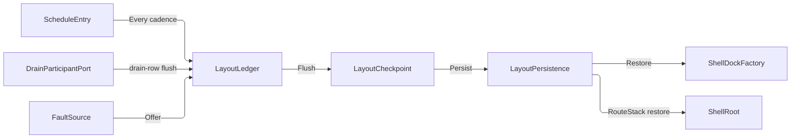

# [APPUI_SHELL_NAVIGATION]

Rasm.AppUi composes one shell: a three-case `NavRequest` union over a `RouteVerb` roster dispatches on the `ShellRoot` router capsule with two view-resolution hosts, one `ShellDockFactory` folds route-keyed `DockableRow` rows through a `RegionProgram` into the Dock model graph so dockables are screens and the topology is data, `WorkspaceRow` rows name the arrangements a mode carries, `LayoutLedger` flows layout checkpoints as versioned content-keyed blobs through `LayoutPersistence` delegates with cadence, drain, support, telemetry, and crash-restore registrations on the AppHost ports, `ShellChrome` derives menu, toolbar, rail, status, HUD, context, and tray rows from intent keys per supplied `ConsumptionProfile`, and `AdaptiveLayout` owns the breakpoint table whose tiers select the chrome programs. The page owns the routing spine, the dock fabric with its region program, workspace, tear-out, checkpoint-cadence, external-dock-surface, and crash-restore values, chrome derivation, and adaptive layout over ReactiveUI, Dock.Avalonia, Dock.Model.ReactiveUI, Irihi.Ursa, Thinktecture vocabulary, kernel identity and capability owners, and LanguageExt rails.

## [01]-[INDEX]

- [02]-[ROUTING_SPINE]: One route union over the shell root; the verb roster carries the landing.
- [03]-[DOCK_LAYOUTS]: Region-program topology, locator rehydration, drop policy, workspaces, tear-out, checkpoint.
- [04]-[SHELL_CHROME]: Seven chrome slots over three admission rows; content resolves to control intents.
- [05]-[ADAPTIVE_LAYOUT]: One breakpoint table; the tier selects the chrome program.

## [02]-[ROUTING_SPINE]

- Owner: `NavFault` the direct generated `[Union]` with one `[FaultCase]` leaf per navigation failure; `RouteVerb` the five-row verb roster whose columns are the deep-link literal AND the landing; `NavRequest` `[Union]` the three-case navigation vocabulary with the deep-link grammar; `ShellRoot` the shell-root capsule owning `IScreen`, the router cell, and the ordinal-frozen route index.
- Cases: `NavRequest` = Route(verb, key) | Pop | View(viewKey); `RouteVerb` = push | replace | reset | modal | peek — the LANDING is each row's own delegate column, so the five stack-and-presenter semantics are rows and a sixth verb is one row with its landing beside it, never a new case plus two switch arms.
- Entry: `public IO<Unit> Navigate(NavRequest request)` — `IO` carries the navigation effect; an unknown route key aborts on the `Error` rail.
- Auto: `RoutedViewHost` re-resolves the view on every router transition; deep links and remote verbs enter through `Parse` with no second admission path; the transition direction is `NavRequest.Direction` — a projection of the case, so a back transition cannot play forward because a call site forgot a flag — and `ShellRoot.Direction` hands it to the `Theme/motion` `RouteCarrier.Bind` row before the stack write the transition plays.
- Packages: ReactiveUI, ReactiveUI.Avalonia, Thinktecture.Runtime.Extensions, LanguageExt.Core, Rasm (kernel), BCL inbox
- Growth: a new navigation verb is one `RouteVerb` row carrying its literal and landing; a new screen is one `ScreenCatalog` row whose route the index projects through `Freeze`; a new navigation instrument is one `InstrumentSpec` row on `ShellRoot.TelemetryRow`; a new fault is one `[FaultCase]` leaf.
- Law: the miss instrument keys on the VERB that asked, never the key it asked for — an unknown key is unbounded by construction and would mint one series per typo, while the verb answers which entry path sends traffic at routes the catalog does not carry.
- Boundary: `Freeze` projects the route index off the frozen `ScreenCatalog` roster — keys are `row.RouteKey` by construction, so an independently authored route pair is unrepresentable; `ShellRoot` is the named boundary capsule — ReactiveUI command execution awaits inside its private kernels and nowhere else; `RoutedViewHost` and `ViewModelViewHost` are the only view-resolution surfaces, and view lookup beside them is the deleted pattern; the `ViewContract` value carries `profile.HostKey` so one screen resolves a host-specific template; modal and peek land through TWO presenter columns rather than one presenter under a mode flag, because the session stack admits one modal and the canvas stack admits many peeks — a peek touches the navigation stack not at all, so it mints no back entry, while the ROUTE it names is the same key a push enters; a viewpoint recall is the third landing — `View` binds `Render/viewpoint#VIEW_REGISTRY` `ViewRegistry.Recall`, its segment IS that owner's `NamedView.LinkPrefix`, and the recall refuses on the registry's own unknown-key rail because a view key is not a route key; every route resolution threads a `SurfaceKey` because `ScreenCatalogRow.Model` requires one and the state partition keys on `(ScreenId, SurfaceKey)`; viewport-scoped navigation rides the same verb grammar over `ZoomBorder.NavigateBack`/`NavigateForward`/`ClearViewHistory`, so a per-canvas back-stack is the deleted pattern; a second router beside the router cell and a region framework are the rejected forms.

```csharp signature
// --- [TYPES] --------------------------------------------------------------------------------

[Union(ConversionFromValue = ConversionOperatorsGeneration.None)]
public abstract partial record NavFault : Fault {
    private static readonly FaultBand FamilyBand = FaultBand.Nav;
    private NavFault(string detail) { Detail = detail; }
    public string Detail { get; }
    public override string Message => Detail;

    [FaultCase(0)]
    public sealed partial record InvalidDeepLink(string Link)        : NavFault(Link);
    [FaultCase(1)]
    public sealed partial record SchemeMismatch(string Link)         : NavFault(Link);
    [FaultCase(2)]
    public sealed partial record UnknownVerb(string Verb)            : NavFault(Verb);
    [FaultCase(3)]
    public sealed partial record UnknownRoute(string Key)            : NavFault(Key);
    [FaultCase(4)]
    public sealed partial record CheckpointRejected(string Detail)   : NavFault(Detail);
    [FaultCase(5)]
    public sealed partial record RegionProgramRejected(string Detail): NavFault(Detail);
    [FaultCase(6)]
    public sealed partial record UnknownWorkspace(string Key)        : NavFault(Key);
    [FaultCase(7)]
    public sealed partial record InstanceRejected(string Detail)     : NavFault(Detail);
}

// --- [TABLES] -------------------------------------------------------------------------------

// The verb roster: the deep-link literal, the direction, and the LANDING are columns of one row, so the
// parse grammar, the telemetry dimension, and the dispatch read one vocabulary and a verb cannot spell its
// literal in the grammar and a different one on the board. The landing takes the capsule because the router
// cell and the presenter columns are per-shell state no static row can hold.
[SmartEnum<string>]
[KeyMemberEqualityComparer<ComparerAccessors.StringOrdinal, string>]
[KeyMemberComparer<ComparerAccessors.StringOrdinal, string>]
public sealed partial class RouteVerb {
    public static readonly RouteVerb Push = new("push",
        static (root, key) => root.Forward(root.Router.Navigate, key, "push"));
    public static readonly RouteVerb Replace = new("replace",
        static (root, key) => root.Swap(key, "replace"));
    public static readonly RouteVerb Reset = new("reset",
        static (root, key) => root.Forward(root.Router.NavigateAndReset, key, "reset"));
    public static readonly RouteVerb Modal = new("modal",
        static (root, key) => root.Resolved(key, "modal").Bind(root.PresentModal));
    // Peek resolves the route and presents it WITHOUT touching the stack, so no back entry is minted and
    // dismissing one returns to exactly the surface that opened it.
    public static readonly RouteVerb Peek = new("peek",
        static (root, key) => root.Resolved(key, "peek").Bind(root.PresentPeek));

    [UseDelegateFromConstructor]
    public partial IO<Unit> Land(ShellRoot root, string routeKey);
}

[Union(ConversionFromValue = ConversionOperatorsGeneration.None)]
public abstract partial record NavRequest {
    private const string Scheme = "rasm";
    public const string PopVerb = "pop";
    // The viewpoint segment is the render owner's own prefix, so a link a saved view mints and a link this
    // grammar admits are one string.
    public const string ViewVerb = NamedView.LinkPrefix;

    private NavRequest() { }

    public sealed record Route(RouteVerb Verb, string RouteKey) : NavRequest;

    public sealed record Pop() : NavRequest;

    // A viewpoint recall is a navigation verb because a saved view is ADDRESSED exactly as a screen is: the
    // link carries the registry key, the stack is untouched, and the camera flight is the transition.
    public sealed record View(string ViewKey) : NavRequest;

    // The declared navigation dimension, read once per dispatch and carried into the miss count so both
    // instruments group on one value.
    public string Verb => Switch(
        route: static c => c.Verb.Key,
        pop: static _ => PopVerb,
        view: static _ => ViewVerb);

    // Direction is a PROJECTION of the case, never a caller flag: only a pop travels back, so the page
    // carrier and the router cannot disagree about which way a transition runs.
    public RouteDirection Direction => Switch(
        route: static _ => RouteDirection.Forward,
        pop: static _ => RouteDirection.Back,
        view: static _ => RouteDirection.Forward);

    // Robust scheme parse: Uri owns the grammar — scheme match is ordinal-case-insensitive, the verb is the
    // authority-or-first-segment, the key is the remaining path, and every reject is a typed NavFault. The
    // roster lookup IS the verb admission, so a sixth verb extends the grammar by declaring its row.
    public static Fin<NavRequest> Parse(string deepLink) =>
        Uri.TryCreate(deepLink, UriKind.Absolute, out Uri? uri)
            ? !string.Equals(uri.Scheme, Scheme, StringComparison.OrdinalIgnoreCase)
                ? Fin.Fail<NavRequest>(new NavFault.SchemeMismatch(deepLink))
                : Segments(uri) switch {
                    [PopVerb] => Fin.Succ<NavRequest>(new Pop()),
                    [ViewVerb, var key] => Fin.Succ<NavRequest>(new View(key)),
                    [var verb, var key] when RouteVerb.TryGet(verb, out RouteVerb? row) => Fin.Succ<NavRequest>(new Route(row, key)),
                    [var verb, ..] => Fin.Fail<NavRequest>(new NavFault.UnknownVerb(verb)),
                    _ => Fin.Fail<NavRequest>(new NavFault.InvalidDeepLink(deepLink)),
                }
            : Fin.Fail<NavRequest>(new NavFault.InvalidDeepLink(deepLink));

    // rasm:push/key and rasm://push/key both admit: authority-form verbs land in Host, opaque-form in the path.
    private static string[] Segments(Uri uri) =>
        (uri.IsAbsoluteUri && uri.Host.Length > 0
            ? new[] { uri.Host }.Concat(uri.AbsolutePath.Split('/', StringSplitOptions.RemoveEmptyEntries))
            : (uri.IsAbsoluteUri ? uri.AbsolutePath : uri.OriginalString)
                .Split('/', StringSplitOptions.RemoveEmptyEntries).AsEnumerable())
        .Select(Uri.UnescapeDataString)
        .ToArray();
}

// --- [MODELS] -------------------------------------------------------------------------------

// Per-key restore evidence as a UNION: the fallen case carries WHICH fallback seated and the typed cause the
// resolve refused with, so a restore report names what it could not carry instead of a bare false.
[Union(ConversionFromValue = ConversionOperatorsGeneration.None)]
public abstract partial record RouteRestoreFact {
    private RouteRestoreFact() { }
    public sealed record Resolved(string Key) : RouteRestoreFact;
    public sealed record Fell(string Key, string Fallback, NavFault Cause) : RouteRestoreFact;

    public string RouteKey => Switch(resolved: static r => r.Key, fell: static f => f.Key);
}

// --- [SERVICES] -----------------------------------------------------------------------------

public sealed class ShellRoot(
    FrozenDictionary<string, Func<IScreen, SurfaceKey, IRoutableViewModel>> routes,
    Func<string, SurfaceKey> surface,
    Func<IRoutableViewModel, IO<Unit>> presentModal,
    Func<IRoutableViewModel, IO<Unit>> presentPeek,
    Func<string, IO<Unit>> recallView,
    Func<RouteDirection, Unit> direction,
    Func<InstrumentSpec, string, IO<Unit>> count) : ReactiveObject, IScreen {
    public RoutingState Router { get; } = new();

    // Each route mints its model AGAINST a surface key: the state partition keys on (ScreenId, SurfaceKey),
    // so a factory that dropped the key would have two floats of one route silently overwrite each other's
    // scroll, filter, and selection on every flush.
    public FrozenDictionary<string, Func<IScreen, SurfaceKey, IRoutableViewModel>> Routes { get; } = routes;

    // The router's own instance elector, bound at composition to the active workspace's primary instance for
    // a route: a dock spawn addresses its minted key explicitly; a deep link, a chord, and a back step have
    // no instance to name, so the elector answers for them.
    public Func<string, SurfaceKey> Surface { get; } = surface;

    public Func<IRoutableViewModel, IO<Unit>> PresentModal { get; } = presentModal;

    public Func<IRoutableViewModel, IO<Unit>> PresentPeek { get; } = presentPeek;

    // The viewpoint landing, bound at composition to `Render/pipeline` `ViewRegistry.Recall` through the
    // viewport cell that scrubs the returned camera timeline.
    public Func<string, IO<Unit>> RecallView { get; } = recallView;

    // The page-transition direction column, bound at composition to `Theme/motion` `RouteCarrier.Bind` over
    // the one `RoutedViewHost`; set BEFORE the router transition, because the carrier configures the
    // transition the very next stack write plays.
    public Func<RouteDirection, Unit> Direction { get; } = direction;

    // The meter reach is keyed on the DECLARATION, never a name: composition binds the write against the row
    // it contributed, so a count against an undeclared instrument has no spelling and the one tag slot is the
    // row's own declared verb dimension.
    public Func<InstrumentSpec, string, IO<Unit>> Count { get; } = count;

    public static readonly InstrumentSpec Navigated = InstrumentSpec.Create(
        "rasm.appui.nav.navigated", InstrumentKind.Count, MeasureForm.Whole, "{navigation}",
        "navigation dispatches by verb", Seq(AppUiTelemetry.VerbSlot), None, None, None);
    public static readonly InstrumentSpec RouteMiss = InstrumentSpec.Create(
        "rasm.appui.nav.route.miss", InstrumentKind.Count, MeasureForm.Whole, "{navigation}",
        "unknown-route aborts by verb", Seq(AppUiTelemetry.VerbSlot), None, None, None);

    public static TelemetryContributorPort TelemetryRow(string version) =>
        AppUiTelemetry.Contribute(version, Navigated, RouteMiss);

    // The route index is a projection of the frozen screen roster: keys are row.RouteKey by construction, so
    // deep links, dock rows, palette listings, and screens cannot disagree. The projector argument exists
    // because ScreenBase does not implement IRoutableViewModel — the catalog's own Model column answers a
    // ScreenBase — so the bridge is spelled ONCE here rather than silently at every caller; it deletes the
    // release ScreenBase implements the interface (Freeze then reads row.Model directly).
    public static FrozenDictionary<string, Func<IScreen, SurfaceKey, IRoutableViewModel>> Freeze(
        ScreenCatalog catalog, Func<ScreenCatalogRow, Func<IScreen, SurfaceKey, IRoutableViewModel>> make) =>
        toSeq(catalog.Rows.Values).ToFrozenDictionary(static row => row.RouteKey, make, StringComparer.Ordinal);

    // The verb dimension threads from the request, so the dispatch count and every miss count under it carry
    // ONE value; the landing is the verb row's own column, so this dispatch has one arm per CASE, not per verb.
    public IO<Unit> Navigate(NavRequest request) =>
        Count(Navigated, request.Verb).Map(_ => Direction(request.Direction)).Bind(_ => request.Switch(
            state: this,
            route: static (root, c) => c.Verb.Land(root, c.RouteKey),
            pop: static (root, _) => root.Back(),
            view: static (root, c) => root.RecallView(c.ViewKey)));

    // Replace is ONE stack write — pop-plus-push as a single NavigationStack assignment, so no intermediate
    // back transition renders and the router observes exactly one change.
    internal IO<Unit> Swap(string key, string verb) =>
        Resolved(key, verb).Map(vm => ignore(Router.NavigationStack = [.. Router.NavigationStack.SkipLast(1), vm]));

    // The ONE route-admission outcome: navigation lifts it into IO, the dock factory consumes the Fin
    // directly, so an unknown key is the same NavFault.UnknownRoute evidence on every ingress path.
    public Fin<IRoutableViewModel> Resolve(string key, SurfaceKey surface) =>
        Routes.TryGetValue(key, out Func<IScreen, SurfaceKey, IRoutableViewModel>? make)
            ? Fin.Succ(make(this, surface))
            : Fin.Fail<IRoutableViewModel>(new NavFault.UnknownRoute(key));

    public Fin<IRoutableViewModel> Resolve(string key) => Resolve(key, Surface(key));

    // Workspace restore is stack manipulation, never command replay: saved keys materialize, the stack sets
    // ONCE, and an unresolvable key folds to the fallback row carrying its typed cause — first-run, restore,
    // and upgrade are one total fold over (saved keys × route index).
    public Fin<Seq<RouteRestoreFact>> Restore(Seq<string> saved, string fallback) =>
        Resolve(fallback).Bind(fallbackScreen => {
            Seq<string> requested = saved.IsEmpty ? Seq(fallback) : saved;
            Seq<(RouteRestoreFact Fact, IRoutableViewModel Screen)> resolved = requested
                .Map(key => Resolve(key).Match<(RouteRestoreFact, IRoutableViewModel)>(
                    Succ: screen => (new RouteRestoreFact.Resolved(key), screen),
                    Fail: error => (
                        new RouteRestoreFact.Fell(key, fallback, error as NavFault ?? new NavFault.UnknownRoute(key)),
                        fallbackScreen)))
                .Strict();
            Router.NavigationStack = [.. resolved.Map(static row => row.Screen)];
            return Fin.Succ(resolved.Map(static row => row.Fact));
        });

    internal IO<IRoutableViewModel> Resolved(string key, string verb) =>
        Resolve(key).Match(
            Succ: IO.pure,
            Fail: error => Count(RouteMiss, verb).Bind(_ => IO.fail<IRoutableViewModel>(error)));

    internal IO<Unit> Forward(ReactiveCommand<IRoutableViewModel, IRoutableViewModel> command, string key, string verb) =>
        Resolved(key, verb).Bind(vm => IO.lift(async _ => { await command.Execute(vm).ConfigureAwait(true); return unit; }));

    internal IO<Unit> Back() =>
        IO.lift(async _ => { await Router.NavigateBack.Execute().ConfigureAwait(true); return unit; });
}
```

## [03]-[DOCK_LAYOUTS]

- Owner: `DockZone` the region address; `DockableRow` registration row; `RegionRow` and `RegionProgram` the layout topology as data; `PinnedPosture` the auto-hide row; `ShellDockFactory` boundary capsule over the Dock model graph; `DropVerdict` the drag-preview caption fold; `ShellPolicy` policy anchor; `WorkspaceRow` and `Workspaces` the named-workspace family; `SurfaceKey` the per-instance mint; `DocumentInstances` the template-spawn fold; `TearOut` and `WindowPlacement` the float and display-clamp surface; `LayoutCheckpoint` content-keyed blob record; `LayoutPersistence` port-delegate record; `LayoutLedger` checkpoint, restore, telemetry, and registration fold surface.
- Entry: `public static IO<Option<LayoutCheckpoint>> Flush(IClock clock, LayoutPersistence port, Atom<Option<UInt128>> last)` — `IO` carries the capture-hash-persist effect over BOTH workspace rails, the dock payload and the router route-stack; the unchanged-key skip is a `Cell.Step` transition so two racing flushes commit one persist; `public Fin<IRootDock> Build()` folds the roster through the region program; `public IO<Fin<Seq<RouteRestoreFact>>> Enter(WorkspaceRow workspace)` switches a named workspace, `public IO<Unit> Save(WorkspaceRow row)` pins the live arrangement into that workspace's own cell without leaving it, and `public IO<Fin<Seq<RouteRestoreFact>>> Reset(WorkspaceRow row)` discards the cell and re-enters from the region program.
- Auto: the cadence, drain, support, and telemetry rows register once at composition — flush fires on the `Every` cadence and again on the drain row inside `DrainBand.Interaction` at `ShellPolicy.DrainRank`, the support capture reads the latest blob, and boot restore runs once from the fault-spine probe consequence, re-materializing the dock graph and setting the router stack through `ShellRoot.Restore` in one pass; the deserialized graph rehydrates each dockable's context through the factory's own `ContextLocator`/`DockableLocator`, an unresolvable saved route key folds to the fallback row with its typed `RouteRestoreFact.Fell` cause, and every saved float rectangle clamps against the live working-area set BEFORE `InitLayout`; zero UI timers.
- Receipt: `Flush` yields `Option<LayoutCheckpoint>` — Some on a persisted blob, None on the unchanged-key skip; the checkpoint record is the restore evidence and the support artifact body; `RouteRestoreFact` rows are the per-key restore evidence; the flush and restore instruments write off those two outcomes, so a skipped flush and a declined crash offer count nothing.
- Packages: Dock.Avalonia, Dock.Model.ReactiveUI, Dock.Serializer.SystemTextJson, NodaTime, LanguageExt.Core, Rasm (kernel), Rasm.AppHost (project), BCL inbox
- Law: the four persisted carriers restore in ONE stated order and never concurrently — `LayoutCheckpoint` first, then `WindowState` (float rectangles clamp against live displays before `InitLayout` seats them), then `ScreenState` per mounted screen, then `CanvasState` per viewport. The order is causal: screen state keys on `(ScreenId, SurfaceKey)` and the surface keys do not exist until the dock graph and its float windows are seated. Collisions resolve LAST-WRITER-BY-RANK inside one carrier and NEVER across carriers; an absent partition is a first-run fact, not a fault.
- Law: the capability ladder resolves dockable base value → `IRootDock.RootDockCapabilityPolicy` → `IDock.DockCapabilityPolicy` → `IDockable.DockCapabilityOverrides`, each present value winning — so a `DockableRow` writes the dockable's own base flags (the WEAKEST rung), a zone writes its policy, the program writes the root policy, and `DockCapabilityOverrides` stays reserved for a per-dockable exception; writing a row's answer into the overrides makes every policy above it dead code that still type-checks.
- Law: the serializer is the package's own `DockSerializer` with the source-generated `DockSystemTextJsonContext` resolver — its options carry `ReferenceHandler.Preserve` and the `$type` polymorphic resolver over `IDockable`/`IDock`/`IRootDock`/`IDockWindow`/`IDocumentTemplate`/`IToolTemplate`, so a hand-rolled `IDockSerializer` or replacement options set is the rejected form; the payload crosses the Persistence port as an opaque versioned blob pruned to `RetainedCheckpoints` generations; the dashboard-board snapshot does NOT ride this serializer — its `Instant` and LanguageExt members need the composition-bound suite wire, while the dock GRAPH blob needs `$type` polymorphism only this payload has: two blobs, two serializers, each the one its own members demand.
- Growth: a new dockable is one `DockableRow` row registered from the screen catalog; a new region address is one `DockZone` row; a new baseline layout is one `RegionProgram` value; a new workspace is one `WorkspaceRow`; a new cadence, rank, retention, or drop-selector bound is one policy value on `ShellPolicy`; a new layout instrument is one `InstrumentSpec` row on `LayoutLedger.TelemetryRow`.
- Boundary: `ShellDockFactory` is the named boundary capsule for the statement carve-out — the Dock model graph is mutable host-owned state assembled only through `Factory` create entrypoints; `DockControl` binds `Build`'s root through `Layout` with `InitializeLayout`/`InitializeFactory` false so the factory owns initialization; the dock chrome variant resolves through the `IDockThemeManager` bound at composition off the theme-token variant subscription, `DockSurfaceWorkbenchBrush` and `DockSeparatorBrush` minting from the token emission as ordinary role slots; the dock skin carries ZERO keys of its own and inherits every light/dark decision from the base Semi dictionaries, so variant coherence is a standing obligation no structural check inside this page can see; floating hosts ride `HostWindowFactory` with `EnableManagedWindowLayer` under the `FloatingWindows` gate; rows where `ShellPolicy.ExternalSurface` holds register an AppUi-supplied `IExternalDockSurface` ADAPTER through `DockControl.RegisterExternalDockSurface` — Dock holds registered surfaces as `WeakReference` and keeps enumeration internal, so the adapter's lifetime is composition-owned (the activation scope holds it for the mount's life) and the registration rows here are the readable roster; the drop overlay rides `GlobalDockTarget` and `DockControl.ShowSelector(DockSelectorMode)`/`HideSelector()` under the `ShellPolicy.DropSelector` gate over the three-member `Documents | Tools | All` domain; dockable `Context` resolves through the same `ShellRoot.Resolve` admission as navigation, so a stale `DockableRow.RouteKey` yields the identical `NavFault.UnknownRoute` evidence — a dockable IS a screen and a second viewmodel system is the deleted pattern; RESTORE reaches that same admission through the package's own locators (`GetContext(id)`, `RestoreDockable(id)`), an off-roster id sealing the same fault and answering null so the package drops the dockable — the alternative is a structurally perfect layout of dead shells; drop legality is POLICY ROWS the package's own resolver reads (`DockGroup` + `DockGroupValidator` gate cross-group drops); pinned auto-hide rides `PinnedPosture` columns through `PreviewPinnedDockable`/`TogglePreviewPinnedDockable` so a hover peek never unpins — `PinDockable` itself TOGGLES; the drag ghost is `DragPreviewControl` bound through `ControlRecycling`, and its caption is the MANAGER's own verdict (`DockCapabilityResolver.Evaluate` beside `IDockManager.LastCapabilityEvaluation`) so a refused drop names the policy rung that refused it; the dock's own overlay stack (`OverlayHost`…`BusyOverlayControl`) stays unmounted — modal presentation has exactly two admitted owners (`Shell/dialogs#SESSION_ALGEBRA`) and the drop SELECTOR is a different mechanism that renders drag targets rather than presenting content; `IDockState.Save`/`Restore`/`Reset` is the IN-PROCESS snapshot pair a workspace switch takes while the serialized checkpoint stays the CROSS-PROCESS carrier — the same fact at two lifetimes; the checkpoint row shares the health-probe deadline bound, so a flush past it is the dispatcher-starvation signal; the drain row ranks after the screens teardown row, so the flushed layout captures post-suspension state; the support artifact reports the REDACTOR's own count through the AppHost `SupportArtifact.Produce` pair bound to the same `Redactor` every bundle column masks through, because the payload carries route keys and catalog-resolved titles; a TEAR-OUT is `FloatDockable(dockable, DockWindowOptions)` with the float host chromed by the owned window row (`Shell/hosts` `WindowRow.TearOut`) so a torn-out panel wears Dock's own `HostWindowTitleBar` and `ToolChromeRole` decides what fills the vacated band; float geometry restores CLAMPED against `SurfaceSession.Displays` and re-clamps on every `SurfaceFact.DisplayChanged`.

```csharp signature
// --- [TYPES] --------------------------------------------------------------------------------

[SmartEnum<string>]
[KeyMemberEqualityComparer<ComparerAccessors.StringOrdinal, string>]
public sealed partial class DockRole {
    public static readonly DockRole Document = new("document");
    public static readonly DockRole Tool = new("tool");
}

// The region ADDRESS, distinct from the role: a role says what a dockable IS and decides its host dock class,
// a zone says where the program seats it — collapsing the two is what forced one hardcoded arrangement.
[SmartEnum<string>]
[KeyMemberEqualityComparer<ComparerAccessors.StringOrdinal, string>]
[KeyMemberComparer<ComparerAccessors.StringOrdinal, string>]
public sealed partial class DockZone {
    public static readonly DockZone Primary = new("primary", DockMode.Center, DockRole.Document, policy: null);
    public static readonly DockZone Left = new("left", DockMode.Left, DockRole.Tool, policy: null);
    public static readonly DockZone Right = new("right", DockMode.Right, DockRole.Tool, policy: null);
    public static readonly DockZone Top = new("top", DockMode.Top, DockRole.Tool, policy: null);
    // The status band takes no drop at all: a panel dragged into a fixed readout strip would displace
    // geometry the chrome fold owns, so the zone policy refuses it above every row's own base flag.
    public static readonly DockZone Bottom = new("bottom", DockMode.Bottom, DockRole.Tool, policy: new DockCapabilityPolicy { CanDrop = false });

    public DockMode Mode { get; }

    // The host dock class this zone seats, as a COLUMN: an identity test against the primary row made a
    // second document area — a split editor, a comparison pane — unspellable.
    public DockRole Role { get; }

    public DockCapabilityPolicy? Policy { get; }

    // The dock side mirrors under the ONE mirroring law: reading the flip off the landed
    // `MirrorSubject.DockSide` row keeps the dock, the chrome zones, and every anchored surface on one verdict.
    public DockMode Sided(LocaleRow locale) =>
        MirrorSubject.DockSide.Mirrors(locale)
            ? Mode switch { DockMode.Left => DockMode.Right, DockMode.Right => DockMode.Left, var held => held }
            : Mode;
}

// --- [MODELS] -------------------------------------------------------------------------------

// Auto-hide as a row: strip edge, whether the reveal floats over the layout or takes space in it, and whether
// the reveal survives losing focus — one independent axis, so the bool stays a bool by the capability carve.
public sealed record PinnedPosture(Alignment Alignment, PinnedDockDisplayMode Display, bool KeepVisible);

// Capabilities are the PACKAGE's own six-member axis: `DockCapability` is a foreign enum and cannot realize
// the kernel `ICapability` floor, so the set stays a `FrozenSet` with the discriminant stated here — a local
// three-row rename of half the axis is the deleted form, because it made the policy ladder unaddressable.
public sealed record DockableRow(
    string RouteKey,
    DockRole Role,
    DockZone Zone,
    int Rank,
    double Proportion,
    FrozenSet<DockCapability> Capabilities,
    Option<string> Group,
    Option<PinnedPosture> Pinned);

// The topology as DATA. Orientation is the whole nesting law: horizontal rows form the outer band, the
// vertical rows one inner column seated at the band position their rank gives.
public sealed record RegionRow(DockZone Zone, Orientation Orientation, double Proportion, int Rank);

public sealed record RegionProgram(string Key, Seq<RegionRow> Rows, DockCapabilityPolicy? Policy, PinnedDockDisplayMode PinnedDisplay) {
    public static readonly RegionProgram Workbench = new(
        Key: "workbench",
        Rows: Seq(
            new RegionRow(DockZone.Left, Orientation.Horizontal, 0.20d, 0),
            new RegionRow(DockZone.Top, Orientation.Vertical, 0.18d, 1),
            new RegionRow(DockZone.Primary, Orientation.Vertical, 0.62d, 2),
            new RegionRow(DockZone.Bottom, Orientation.Vertical, 0.20d, 3),
            new RegionRow(DockZone.Right, Orientation.Horizontal, 0.20d, 4)),
        Policy: null,
        PinnedDisplay: PinnedDockDisplayMode.Overlay);

    // Three INDEPENDENT admissions accumulate, so a program that is empty AND zone-duplicated reports both.
    // The vertical block must be CONTIGUOUS in rank because it collapses into one inner column seated at a
    // single band position — an arrangement with two vertical runs is one this band-and-column fold cannot
    // build, and admitting it silently would drop the second run's regions.
    public Fin<Seq<RegionRow>> Admit() {
        Seq<RegionRow> ordered = toSeq(Rows.OrderBy(static row => row.Rank));
        int runs = Runs(ordered);
        return (Gate(!ordered.IsEmpty, $"{Key}: empty"),
                Gate(runs <= 1, $"{Key}: vertical block split across {runs} runs"),
                Gate(ordered.Map(static row => row.Zone).Distinct().Count() == ordered.Count, $"{Key}: duplicate zone"))
            .Apply((_, _, _) => ordered).As().ToFin();
    }

    private static Validation<Error, Unit> Gate(bool holds, string detail) =>
        holds ? Validation<Error, Unit>.Success(unit) : Validation<Error, Unit>.Fail(new NavFault.RegionProgramRejected(detail));

    private static int Runs(Seq<RegionRow> ordered) =>
        ordered.Fold(
            (Count: 0, Inside: false),
            static (state, row) => row.Orientation == Orientation.Vertical
                ? (state.Inside ? state.Count : state.Count + 1, true)
                : (state.Count, false))
        .Count;
}

// --- [SERVICES] -----------------------------------------------------------------------------

// Dock-tab titles resolve through the ONE screen-catalog title cell bound at composition, so a rename lands
// everywhere at once. `stale` takes the rail's own Error — every refusal on this path is a NavFault minted at
// Resolve, so no narrowing shim stands between the locator and its seal.
public sealed class ShellDockFactory(
    ShellRoot shell,
    Seq<DockableRow> rows,
    RegionProgram program,
    Func<string, string> title,
    Func<IDockThemeManager> themeManager,
    Func<LocaleRow> locale,
    Func<Error, Unit> stale) : Factory {
    // The locator rosters are FROZEN at construction: a restore rebuilds no dictionary, because the roster
    // cannot change between two restores of one factory.
    private readonly Dictionary<string, Func<object?>> contexts =
        rows.Map(row => KeyValuePair.Create(row.RouteKey, Context(shell, stale, row.RouteKey))).ToDictionary(StringComparer.Ordinal);
    private readonly Dictionary<string, Func<IDockable?>> restored =
        rows.Map(row => KeyValuePair.Create<string, Func<IDockable?>>(row.RouteKey, () => null)).ToDictionary(StringComparer.Ordinal);

    public IDockThemeManager ThemeManager() => themeManager();

    // The REHYDRATION seam: the serialized graph holds dockable ids and no contexts, so the package resolves
    // each one back through the locators it owns — GetContext(id) for a restored panel's view-model,
    // RestoreDockable(id) for a hidden dockable returning to the graph. Both resolve through the SAME
    // ShellRoot.Resolve admission every other ingress takes; a stale id seals the identical
    // NavFault.UnknownRoute and answers null, which the package reads as "drop it".
    public override void InitLayout(IDockable layout) {
        foreach (DockableRow row in rows) {
            restored[row.RouteKey] = () => Dockable(row).Match<IDockable?>(
                Succ: static dockable => dockable,
                Fail: error => { ignore(stale(error)); return null; });
        }

        ContextLocator = contexts;
        DockableLocator = restored;
        DefaultContextLocator = static () => null;
        base.InitLayout(layout);
    }

    private static Func<object?> Context(ShellRoot shell, Func<Error, Unit> stale, string key) => () =>
        shell.Resolve(key).Match<object?>(
            Succ: static vm => vm,
            Fail: error => { ignore(stale(error)); return null; });

    // Build folds the ROSTER through the PROGRAM: each admitted region draws its own zone's dockables, seats
    // them in the dock class its zone's role implies, and the orientation column alone decides the band.
    public Fin<IRootDock> Build() =>
        from ordered in program.Admit()
        from mounted in ordered.Traverse(region => Region(region).Map(dock => (Region: region, Dock: dock))).As()
        select Assemble(mounted.Choose(static pair => pair.Dock.Map(dock => (pair.Region, Dock: dock))));

    // An empty zone contributes NO dock rather than an empty one: a zero-child tool dock renders as a bare
    // strip with a splitter beside it, which reads as a broken layout rather than an absent region.
    private Fin<Option<IDock>> Region(RegionRow region) =>
        toSeq(rows.Filter(row => row.Zone == region.Zone).OrderBy(static row => row.Rank))
            .TraverseM(Dockable).As()
            .Map(dockables => dockables.IsEmpty ? Option<IDock>.None : Some(Seat(region, dockables)));

    private Fin<IDockable> Dockable(DockableRow row) =>
        shell.Resolve(row.RouteKey).Map(context => {
            DockableBase dockable = row.Role == DockRole.Tool ? (DockableBase)CreateTool() : (DockableBase)CreateDocument();
            dockable.Id = row.RouteKey;
            dockable.Title = title(row.RouteKey);
            dockable.Context = context;
            dockable.Proportion = row.Proportion;
            dockable.Dock = row.Zone.Sided(locale());
            return (IDockable)Governed(dockable, row);
        });

    // The row writes the WEAKEST rung of the capability ladder — the dockable's own base flags — so a zone
    // policy and a root policy can each still narrow it above.
    private static IDockable Governed(IDockable dockable, DockableRow row) {
        dockable.CanClose = row.Capabilities.Contains(DockCapability.Close);
        dockable.CanPin = row.Capabilities.Contains(DockCapability.Pin);
        dockable.CanFloat = row.Capabilities.Contains(DockCapability.Float);
        dockable.CanDrag = row.Capabilities.Contains(DockCapability.Drag);
        dockable.CanDrop = row.Capabilities.Contains(DockCapability.Drop);
        dockable.CanDockAsDocument = row.Capabilities.Contains(DockCapability.DockAsDocument);
        dockable.DockGroup = (string?)row.Group.Case;
        row.Pinned.Iter(posture => {
            dockable.KeepPinnedDockableVisible = posture.KeepVisible;
            dockable.PinnedDockDisplayModeOverride = posture.Display;
        });
        return dockable;
    }

    private IDock Seat(RegionRow region, Seq<IDockable> dockables) {
        IDock dock = region.Zone.Role == DockRole.Document ? CreateDocumentDock() : CreateToolDock();
        dock.Id = region.Zone.Key;
        dock.Dock = region.Zone.Sided(locale());
        dock.Proportion = region.Proportion;
        dock.DockCapabilityPolicy = region.Zone.Policy;
        dock.VisibleDockables = CreateList<IDockable>([.. dockables]);
        dock.ActiveDockable = dockables[0];
        return dock is IDocumentDock documents ? DocumentInstances.Spawnable(documents, this) : dock;
    }

    // Band and column: horizontal regions form the outer band, the contiguous vertical run collapses into one
    // inner column, and the column takes the band position its own rank gives. One Partition splits the two
    // orientations, so the fold traverses the mounted set once.
    private IRootDock Assemble(Seq<(RegionRow Region, IDock Dock)> live) {
        (Seq<(RegionRow Region, IDock Dock)> vertical, Seq<(RegionRow Region, IDock Dock)> horizontal) =
            live.Partition(static pair => pair.Region.Orientation == Orientation.Vertical);
        Seq<IDockable> column = vertical.Map(static pair => (IDockable)pair.Dock);
        Option<(int Rank, IDockable Dockable)> inner = column.IsEmpty
            ? None
            // The admitted program orders by rank, so the vertical run's head carries its band position.
            : Some((vertical.Head.Region.Rank, column.Count == 1 ? column[0] : (IDockable)Split(Orientation.Vertical, column)));
        Seq<(int Rank, IDockable Dockable)> band =
            horizontal.Map(static pair => (pair.Region.Rank, Dockable: (IDockable)pair.Dock)) + inner.ToSeq();
        Seq<IDockable> ordered = toSeq(band.OrderBy(static entry => entry.Rank)).Map(static entry => entry.Dockable);
        IDockable body = ordered.Count == 1 ? ordered[0] : Split(Orientation.Horizontal, ordered);
        IRootDock root = CreateRootDock();
        root.Id = program.Key;
        root.RootDockCapabilityPolicy = program.Policy;
        root.PinnedDockDisplayMode = program.PinnedDisplay;
        root.VisibleDockables = CreateList(body);
        root.ActiveDockable = body;
        return root;
    }

    // Splitters interleave BETWEEN adjacent parts and never trail the last: a trailing splitter renders as a
    // grab handle against the window edge that moves nothing and steals the edge-resize gesture.
    private IProportionalDock Split(Orientation orientation, Seq<IDockable> parts) {
        IProportionalDock split = CreateProportionalDock();
        split.Orientation = orientation;
        split.VisibleDockables = CreateList<IDockable>(
            [.. parts.Head.ToSeq() + parts.Tail.Bind(part => Seq((IDockable)CreateProportionalDockSplitter(), part))]);
        return split;
    }
}

// The drag ghost's caption is the MANAGER's verdict, never a locally composed sentence: the resolver returns
// the effective value beside the rung that decided it. The one caller is the drag-preview template the
// composition binds over `ControlRecycling` — a view-layer bind, which is why no fence in this folder calls it.
public static class DropVerdict {
    public const string AdmittedKey = "dock.drop.admitted";
    public const string PendingKey = "dock.drop.pending";

    public static Unit Caption(DragPreviewControl preview, IDockManager manager, Func<string, string> label) {
        preview.Status = Optional(manager.LastCapabilityEvaluation).Match(
            Some: evaluation => evaluation.EffectiveValue ? label(AdmittedKey) : evaluation.DiagnosticMessage,
            None: () => label(PendingKey));
        return unit;
    }
}
```

```csharp signature
// --- [CONSTANTS] ----------------------------------------------------------------------------

public static class ShellPolicy {
    public const int LayoutVersion = 2;
    public const int DrainRank = 20;
    public const int RetainedCheckpoints = 4;
    public const long LayoutArtifactBytes = 262_144;
    public const double StatusDropdownExtent = 240d;
    public static readonly Duration CheckpointCadence = Duration.FromSeconds(120);

    // Each predicate reads the axis its product name implied: a panel mount owns no floating host window, a
    // surfaceless profile materializes neither a floating window nor a drop adorner, and the embedded surface
    // class is exactly the set of mounts a foreign host owns the frame for. Three independent policy
    // questions, not one row's columns — which is why they stay predicates under the capability carve.
    public static bool FloatingWindows(ConsumptionProfile profile, SurfaceMount mount) =>
        mount is not SurfaceMount.Panel && profile.Surface != HostSurface.None;

    public static bool DropSelector(ConsumptionProfile profile) =>
        profile.Surface != HostSurface.None;

    public static bool ExternalSurface(ConsumptionProfile profile) =>
        profile.Surface == HostSurface.Embedded;
}

// --- [MODELS] -------------------------------------------------------------------------------

public sealed record LayoutContent(string Payload, Seq<string> RouteStack);

// The content key is the kernel digest, so the checkpoint's integrity check compares two values of known
// provenance and a caller-supplied hash function has no seam to enter.
public sealed record LayoutCheckpoint(int Version, UInt128 ContentKey, LayoutContent Content, Instant At);

// Support returns the AppHost `ArtifactPayload` — bytes AND the mask tally — because a literal zero beside a
// payload nothing examined asserts a measurement no redactor took; composition binds it to the same
// `Redactor` every other bundle column masks through. `Count` is keyed on the DECLARATION per the meter law.
public sealed record LayoutPersistence(
    Func<string> Serialize,
    Func<Seq<string>> RouteStack,
    Func<LayoutCheckpoint, Fin<Seq<RouteRestoreFact>>> Restore,
    Func<LayoutCheckpoint, ArtifactPayload> Support,
    Func<LayoutCheckpoint, IO<Unit>> Persist,
    Func<InstrumentSpec, Unit> Count,
    IO<Option<LayoutCheckpoint>> Latest) {
    // The one serializer binding: the generated DockSystemTextJsonContext resolver keeps layout round-trips
    // AOT-safe, restore re-inits through the factory so InitializeLayout stays false, and the SAME checkpoint
    // restores the router stack through ShellRoot.Restore — one blob, two rails. A view-model whose
    // UrlPathSegment is empty is a non-routable presentation entry and stays out of the persisted stack BY
    // DECLARATION — the stack carries route identities, not view instances.
    public static LayoutPersistence Bind(
        DockControl control, ShellDockFactory factory, ShellRoot shell, string fallbackRoute,
        Func<Seq<PixelRect>> displays,
        Func<LayoutCheckpoint, (ReadOnlyMemory<byte> Bytes, int Redactions)> support,
        Func<LayoutCheckpoint, IO<Unit>> persist, Func<InstrumentSpec, Unit> count, IO<Option<LayoutCheckpoint>> latest) {
        DockSerializer serializer = new(new DockSystemTextJsonContext());
        return new(
            Serialize: () => serializer.Serialize(control.Layout),
            RouteStack: () => toSeq(shell.Router.NavigationStack).Choose(static vm => Optional(vm.UrlPathSegment).Filter(static key => key.Length > 0)),
            // Version and content-key are INDEPENDENT admissions and accumulate; the payload decode binds
            // after both, because a blob failing either is not worth deserializing.
            Restore: checkpoint =>
                (Gate(checkpoint.Version == ShellPolicy.LayoutVersion, $"version:{checkpoint.Version}"),
                 Gate(LayoutLedger.Key(checkpoint.Content) == checkpoint.ContentKey, "content-key"))
                    .Apply(static (_, _) => unit).As().ToFin()
                    .Bind(_ => Optional(serializer.Deserialize<RootDock>(checkpoint.Content.Payload))
                        .ToFin(new NavFault.CheckpointRejected("dock-payload")))
                    // The clamp lands BEFORE InitLayout: initialization seats every float host at the geometry
                    // the graph carries, so a rectangle corrected afterwards has already shown a window on a
                    // screen that is gone.
                    .Bind(root => shell.Restore(checkpoint.Content.RouteStack, fallbackRoute).Map(facts => {
                        ignore(WindowPlacement.Clamp(root, displays()));
                        factory.InitLayout(root);
                        control.Layout = root;
                        return facts;
                    })),
            Support: support,
            Persist: persist,
            Count: count,
            Latest: latest);

        static Validation<Error, Unit> Gate(bool holds, string detail) =>
            holds ? Validation<Error, Unit>.Success(unit) : Validation<Error, Unit>.Fail(new NavFault.CheckpointRejected(detail));
    }
}

// The user's restore decision as a value, so a declined crash offer is distinguishable from an absent one on
// the rail the count reads.
[Union(ConversionFromValue = ConversionOperatorsGeneration.None)]
public abstract partial record RestoreVerdict {
    private RestoreVerdict() { }
    public sealed record Accepted : RestoreVerdict;
    public sealed record Declined : RestoreVerdict;
}

// --- [OPERATIONS] ---------------------------------------------------------------------------

public static class LayoutLedger {
    public static readonly InstrumentSpec Flushed = InstrumentSpec.Create(
        "rasm.appui.layout.flushed", InstrumentKind.Count, MeasureForm.Whole, "{flush}",
        "layout ledger flushes", Seq<string>(), None, None, None);
    public static readonly InstrumentSpec Restored = InstrumentSpec.Create(
        "rasm.appui.layout.restored", InstrumentKind.Count, MeasureForm.Whole, "{restore}",
        "layout ledger restores", Seq<string>(), None, None, None);

    // The one content key: payload and route stack frame through the kernel writer, so a navigation-only
    // change still checkpoints, a byte-identical pair still skips, and no caller supplies a hash function.
    public static UInt128 Key(LayoutContent content) =>
        ContentHash.Of(content, static (held, writer) => {
            ignore(writer.String(held.Payload));
            ignore(writer.Ordinal(held.RouteStack.Count));
            held.RouteStack.Iter(key => ignore(writer.String(key)));
        });

    // The unchanged-key skip is a TRANSITION: the step declines on an equal key, so two racing flushes commit
    // one persist and the loser reads the declined transition rather than re-persisting a blob it lost.
    public static IO<Option<LayoutCheckpoint>> Flush(IClock clock, LayoutPersistence port, Atom<Option<UInt128>> last) =>
        IO.lift(() => (Payload: port.Serialize(), Stack: port.RouteStack()))
            .Map(captured => new LayoutContent(captured.Payload, captured.Stack))
            .Map(content => new LayoutCheckpoint(ShellPolicy.LayoutVersion, Key(content), content, clock.GetCurrentInstant()))
            .Bind(next => Cell.Step(
                    last,
                    prior => prior == Some(next.ContentKey) ? Option<Option<UInt128>>.None : Some(Some(next.ContentKey)),
                    new NavFault.CheckpointRejected("layout-flush-declined")) is Transition<Option<UInt128>>.Committed
                ? port.Persist(next).Map(_ => (port.Count(Flushed), Some(next)).Item2)
                : IO.pure(Option<LayoutCheckpoint>.None));

    public static Option<LayoutCheckpoint> Offer(Seq<FaultSource> crashes, Option<LayoutCheckpoint> latest) =>
        crashes.Exists(static fault => fault is FaultSource.HostCrashMarker) ? latest : None;

    // Counted returns the same outcome it observes, so the restore count fires on an ACCEPTED restore alone —
    // a declined crash offer and a first-run empty latest are not restores, and a rejected checkpoint never
    // counts one either.
    public static IO<Fin<Seq<RouteRestoreFact>>> Restore(
        LayoutPersistence port, Seq<FaultSource> crashes, Func<LayoutCheckpoint, IO<RestoreVerdict>> confirm) =>
        port.Latest.Bind(latest =>
            Offer(crashes, latest) is { IsSome: true, Case: LayoutCheckpoint offered }
                ? confirm(offered).Bind(verdict => verdict is RestoreVerdict.Accepted
                    ? IO.lift(fun(() => Counted(port, port.Restore(offered))))
                    : IO.pure(Fin.Succ(Seq<RouteRestoreFact>())))
                : latest is { IsSome: true, Case: LayoutCheckpoint warm }
                    ? IO.lift(fun(() => Counted(port, port.Restore(warm))))
                    : IO.pure(Fin.Succ(Seq<RouteRestoreFact>())));

    private static Fin<Seq<RouteRestoreFact>> Counted(LayoutPersistence port, Fin<Seq<RouteRestoreFact>> outcome) =>
        outcome.Map(facts => (port.Count(Restored), facts).Item2);

    public static ScheduleEntry CheckpointRow(IClock clock, LayoutPersistence port, Atom<Option<UInt128>> last) =>
        new(
            Key: "shell-layout-checkpoint",
            Spec: new OccurrenceSpec.Every(ShellPolicy.CheckpointCadence),
            Deadline: DeadlineClass.HealthProbe,
            Lease: None,
            Redrive: RedrivePolicy.None,
            Work: () => Flush(clock, port, last).Map(static saved => unit));

    public static DrainParticipantPort DrainRow(IClock clock, LayoutPersistence port, Atom<Option<UInt128>> last) =>
        new(
            Name: "shell-layout-flush",
            Band: DrainBand.Interaction,
            Rank: ShellPolicy.DrainRank,
            Drain: cancel => Flush(clock, port, last).Map(static saved => unit));

    public static SupportContributorPort SupportRow(LayoutPersistence port) =>
        new(
            Package: "Rasm.AppUi",
            Rows: Seq(new SupportArtifact(
                Name: "dock-layout",
                Classification: DataClassification.Operational,
                EstimatedBytes: ShellPolicy.LayoutArtifactBytes,
                // The redaction count is the redactor's own measurement, never a literal: an absent checkpoint
                // contributes zero bytes and zero redactions because nothing was examined.
                Produce: capture => port.Latest.Map(latest =>
                    latest.Map(port.Support).IfNone(ArtifactPayload.Empty)))));

    public static TelemetryContributorPort TelemetryRow(string version) =>
        AppUiTelemetry.Contribute(version, Flushed, Restored);
}
```

```csharp signature
// --- [MODELS] -------------------------------------------------------------------------------

// A named workspace is ONE row: the arrangement it seats, the chrome it hides, and the route it opens on. The
// mode a user picks and the layout they get are therefore the same value. Every shipped row seats the one
// Workbench program — the column is the capability, the shared value is seed data, and a review layout that
// diverges is one row edit.
public sealed record WorkspaceRow(
    string Key,
    string LabelKey,
    RegionProgram Program,
    CapabilitySet<ChromeSlot> Suppressed,
    string DefaultRoute);

public static class Workspaces {
    // The verbs live on the command deck, so switching a workspace is bindable, palette-searchable, and
    // journal-replayable exactly as every other verb is.
    public const string EnterVerb = "workspace.enter";
    public const string SaveVerb = "workspace.save";
    public const string ResetVerb = "workspace.reset";

    public static readonly Seq<WorkspaceRow> Rows = Seq(
        new WorkspaceRow("model", "workspace.model", RegionProgram.Workbench, CapabilitySet<ChromeSlot>.None, "model"),
        new WorkspaceRow("analysis", "workspace.analysis", RegionProgram.Workbench, CapabilitySet<ChromeSlot>.None, "analysis"),
        new WorkspaceRow("document", "workspace.document", RegionProgram.Workbench, CapabilitySet<ChromeSlot>.Of(ChromeSlot.Hud), "document"),
        new WorkspaceRow("review", "workspace.review", RegionProgram.Workbench, CapabilitySet<ChromeSlot>.Of(ChromeSlot.Rail), "review"),
        new WorkspaceRow("present", "workspace.present", RegionProgram.Workbench,
            CapabilitySet<ChromeSlot>.Of(ChromeSlot.Rail, ChromeSlot.Menu, ChromeSlot.Status, ChromeSlot.Toolbar), "present"));

    public static Fin<WorkspaceRow> Find(string key) =>
        Rows.Find(row => string.Equals(row.Key, key, StringComparison.Ordinal))
            .ToFin(new NavFault.UnknownWorkspace(key));
}

// Switching a workspace is a LIVE snapshot pair, never a serializer round-trip: the outgoing arrangement
// saves into its own dock-state cell and the incoming one restores from its cell over a freshly built
// program, so switching away and back returns the exact arrangement including the transient state the
// serialized blob never carried. One cell per workspace, because IDockState holds exactly one snapshot.
public sealed record WorkspaceCell(
    Func<RegionProgram, Fin<IRootDock>> Build,
    Func<IDock> Live,
    Func<IRootDock, Unit> Seat,
    Func<string, IDockState> StateOf,
    Func<NavRequest, IO<Unit>> Navigate,
    Atom<Option<WorkspaceRow>> Current) {
    public IO<Fin<Seq<RouteRestoreFact>>> Enter(WorkspaceRow next) =>
        IO.lift(() => Current.Value.Iter(prior => StateOf(prior.Key).Save(Live())))
            .Map(_ => Build(next.Program))
            .Bind(built => built.Match(
                Succ: root => IO
                    .lift(() => { StateOf(next.Key).Restore(root); return Seat(root); })
                    .Bind(_ => Navigate(new NavRequest.Route(RouteVerb.Reset, next.DefaultRoute)))
                    .Map(_ => (
                        Current.Swap(_ => Some(next)),
                        Fin.Succ(Seq<RouteRestoreFact>(new RouteRestoreFact.Resolved(next.DefaultRoute)))).Item2),
                Fail: error => IO.pure(Fin.Fail<Seq<RouteRestoreFact>>(error))));

    // The explicit snapshot the save verb raises: `Enter` saves the OUTGOING arrangement on a switch, so this
    // is the seat for pinning the current arrangement WITHOUT leaving it.
    public IO<Unit> Save(WorkspaceRow row) => IO.lift(() => StateOf(row.Key).Save(Live()));

    // Reset DISCARDS the workspace's snapshot rather than editing it, so the next entry rebuilds from the
    // region program — nothing in a snapshot records which differences were user arrangement.
    public IO<Fin<Seq<RouteRestoreFact>>> Reset(WorkspaceRow row) =>
        IO.lift(() => { StateOf(row.Key).Reset(); return unit; }).Bind(_ => Enter(row));
}

// The per-instance partition key EVERY persisted carrier keys on. The ordinal is monotone per (workspace,
// route) rather than a fresh identity per spawn, because a restored instance must FIND the partition it
// wrote and a minted GUID finds none; the zeroth instance carries no suffix so a single-instance route's key
// never churns.
public readonly record struct SurfaceKey(string Workspace, string Route, int Instance) {
    public string Value => Instance is 0 ? $"{Workspace}/{Route}" : $"{Workspace}/{Route}#{Instance}";

    public static SurfaceKey Mint(string workspace, string route, Seq<SurfaceKey> live) =>
        new(workspace, route,
            live.Filter(key => string.Equals(key.Workspace, workspace, StringComparison.Ordinal)
                            && string.Equals(key.Route, route, StringComparison.Ordinal))
                .Fold(-1, static (best, key) => Math.Max(best, key.Instance)) + 1);
}

// --- [OPERATIONS] ---------------------------------------------------------------------------

public static class DocumentInstances {
    // The package's OWN spawn path and nothing beside it: CanCreateDocument gates the affordance,
    // CreateDocument runs the spawn, DocumentFactory supplies the dockable, AddDocument seats it — a
    // hand-built Document appended to VisibleDockables bypasses the factory's init, its registries, and
    // every DockableAdded consumer at once.
    public static IDocumentDock Spawnable(IDocumentDock dock, IDocumentDockFactory spawn) {
        dock.CanCreateDocument = true;
        dock.CreateDocument = ReactiveCommand.Create(() =>
            Optional(spawn.DocumentFactory).Iter(make => dock.AddDocument(make())));
        return dock;
    }

    // The factory column the dock spawns through: each call mints the NEXT surface key for its route, so the
    // instance identity is decided at spawn and every carrier keyed on it partitions from that moment. A
    // route the shell cannot resolve falls to the TEMPLATE body — the spawn's own declared fallback.
    public static Func<IDockable> Factory(
        ShellDockFactory factory, ShellRoot shell, IDocumentTemplate template, string workspace, string route,
        Func<string, string> title, Func<Seq<SurfaceKey>> live, Func<SurfaceKey, Unit> minted) =>
        () => {
            SurfaceKey key = SurfaceKey.Mint(workspace, route, live());
            IDocument document = factory.CreateDocument();
            document.Id = key.Value;
            document.Title = title(route);
            document.Context = shell.Resolve(route).Match<object?>(Succ: static vm => vm, Fail: _ => template.Content);
            ignore(minted(key));
            return document;
        };
}

// The tool-chrome election as a row, not a bool written twice: `Frame` means the tool chrome IS the window
// frame, `Content` that the platform band stays and the chrome fills the content edge.
[SmartEnum<string>]
[KeyMemberEqualityComparer<ComparerAccessors.StringOrdinal, string>]
public sealed partial class ToolChromeRole {
    public static readonly ToolChromeRole Frame = new("frame", owns: true);
    public static readonly ToolChromeRole Content = new("content", owns: false);

    public bool Owns { get; }
}

// Tear-out and its restore clamp. The float host is chromed by the OWNED window row, which suppresses the
// platform frame, so a torn-out panel wears Dock's own `HostWindowTitleBar` rather than the platform's.
public static class TearOut {
    public static Func<IHostWindow?> HostFactory(ToolChromeRole chrome) => () => {
        HostWindow host = WindowRow.TearOut.Apply(new HostWindow());
        host.IsToolWindow = chrome.Owns;
        host.ToolChromeControlsWholeWindow = chrome.Owns;
        return host;
    };

    public static Unit Float(IFactory factory, IDockable dockable) {
        factory.FloatDockable(dockable, new DockWindowOptions { OwnerMode = DockWindowOwnerMode.Root, ShowInTaskbar = true });
        return unit;
    }
}

public static class WindowPlacement {
    // Every saved float rectangle folds against the LIVE working areas before the graph is seated: a window
    // still intersecting a live area keeps its geometry untouched; one that intersects nothing re-seats onto
    // the primary area, centred and bounded by it.
    public static Unit Clamp(IRootDock root, Seq<PixelRect> working) =>
        working.IsEmpty
            ? unit
            : toSeq(root.Windows ?? []).Fold(unit, (_, window) => Seat(window, working));

    private static Unit Seat(IDockWindow window, Seq<PixelRect> working) {
        // Rounded, never truncated: a fractional DPI-scaled rectangle truncates inward one pixel per restore.
        PixelRect saved = new(
            (int)Math.Round(window.X), (int)Math.Round(window.Y),
            (int)Math.Round(Math.Max(1d, window.Width)), (int)Math.Round(Math.Max(1d, window.Height)));
        if (working.Exists(area => area.Intersects(saved))) {
            return unit;
        }
        PixelRect home = working[0];
        (window.Width, window.Height) = (Math.Min(window.Width, home.Width), Math.Min(window.Height, home.Height));
        (window.X, window.Y) = (
            home.X + Math.Max(0d, (home.Width - window.Width) / 2d),
            home.Y + Math.Max(0d, (home.Height - window.Height) / 2d));
        return unit;
    }
}
```



## [04]-[SHELL_CHROME]

- Owner: `SlotAdmission` the three-row per-surface admission vocabulary the visibility matrix realizes; `ChromeSlot` `[SmartEnum<string>]` the seven-slot chrome vocabulary realizing the kernel capability floor; `ChromeContent` `[Union]` the per-slot payload family; `BadgeMark`, `StatusZone`, `PaneKind`, `WorkPosture`, and `ProgressLocation` the slot policy vocabularies; `ChromeRow` derivation row; `ShellChrome` projection and materialization fold.
- Cases: `ChromeSlot` = menu | toolbar | rail | status | hud | context | tray; `SlotAdmission` = windowed-standalone | surfaced | standing-surface; `ChromeContent` = Entry | Pane | Chip | Items; `StatusZone` = lead | center | trail; `PaneKind` = readout | toggle | dropdown | progress; `BadgeMark` = Dot | Counted; `WorkPosture` = blocking | background; `ProgressLocation` = status-bar | toast | inline.
- Entry: `public static Seq<ChromeRow> Project(ConsumptionProfile profile, SurfaceMount mount, ChromeSlot slot, Seq<ChromeRow> rows, LocaleRow locale)` — pure projection; rows filter on slot admission and the row's own narrowing predicate, order by status zone then rank, and reverse under the mirroring law; `public static Fin<ControlIntent> Materialize(ChromeRow row, CommandDeck deck, Func<string, string> label)` — the one projection from a chrome row onto the control vocabulary.
- Packages: Avalonia, Irihi.Ursa, Thinktecture.Runtime.Extensions, LanguageExt.Core, NodaTime, UnitsNet, Rasm (kernel), BCL inbox
- Growth: a new chrome surface is one `ChromeSlot` case naming an existing or new admission row; a new entry is one `ChromeRow` naming an existing intent key; a new status readout is one `Pane` row naming an existing fact key.
- Law: the per-mount visibility matrix is THREE admission rows the seven slots reference, so the matrix is stated once and six of seven cells stop re-spelling it — a row's own `Visible` predicate narrows WITHIN an admitted slot and can never widen past it.
- Boundary: rows carry intent keys only — command mechanics, gestures, and availability live on the intent table and arrive as settled vocabulary, so menu item classes and per-surface registries are the deleted patterns; every slot's content resolves to `ControlIntent` rows through `Materialize`, so the chrome fold mints no control of its own; geometry is `Shell/solver` `ChromeProgram` rows, so no chrome surface names a panel type; the RAIL is the Ursa nav-menu surface whose collapse POSTURE arrives through `BreakpointRow.Rail` on the tier-selects-program seam, so a rail never measures a width; a rail entry's badge is the package's `Badge` with its dot, corner, and overflow columns so a count past its cap renders the package's own overflow form; a rail group's flyout re-seats the `Theme/motion` Flyout plan's origin from LIVE placement at open — one plan, every side; overflow promotion is the toolbar's own `OverflowMode` attached per child; the STATUS footer materializes only on status-admitting mounts, three zones distributing through the `SpaceBetween` flow program; where a running operation REPORTS is `ProgressLocation.Select` over expected duration and `WorkPosture` — long blocking work stays inline, long background work takes the persistent strip, brief background work announces once as a toast — and the run-queue card is the owing consumer of that policy row; the HUD is corner chips through the package's own `ProportionalCanvas` quartet, camera facts reaching chips through injected observables; readout chips bind `TypographyRole.Numeric` so a coordinate readout does not jitter on digit change; the notification inbox reaches chrome as an ORDINARY row (`ShellChrome.Activity`) badged on the center's unread projection, seated on the status trail because an inbox that disappears at the compact tier is one a user stops trusting; the CONTEXT menu derives its items from the command deck by TARGET KIND — a row's `Accepts` set is the admitted payload-kind domain; the Menu slot projects to the macOS global menu through `NativeMenu.MenuProperty` with `GetIsNativeMenuExported` as the probe, and to the managed `NativeMenuBar` elsewhere; the Tray slot materializes through the `TrayIcon.IconsProperty` attached collection; embedded mounts suppress menu, status, and rail chrome because the host owns its own chrome; window titles compose through `Title`, which `Shell/hosts` `WindowTitle` subscribes per owned window.

```csharp signature
// --- [TYPES] --------------------------------------------------------------------------------

// The visibility matrix as THREE named rows rather than seven verbatim lambdas: the matrix states a fact
// about SURFACES, so the fact is declared once and each slot names its row.
[SmartEnum<string>]
[KeyMemberEqualityComparer<ComparerAccessors.StringOrdinal, string>]
public sealed partial class SlotAdmission {
    public static readonly SlotAdmission WindowedStandalone = new("windowed-standalone",
        static (p, m) => p.Surface == HostSurface.Windowed && m is SurfaceMount.Standalone);
    public static readonly SlotAdmission Surfaced = new("surfaced",
        static (p, m) => p.Surface != HostSurface.None && m is not SurfaceMount.Offscreen);
    public static readonly SlotAdmission StandingSurface = new("standing-surface",
        static (p, m) => p.Surface != HostSurface.None && m is SurfaceMount.Standalone or SurfaceMount.Companion);

    [UseDelegateFromConstructor]
    public partial bool Admits(ConsumptionProfile profile, SurfaceMount mount);
}

// The slot realizes the kernel capability floor, so a workspace's suppressed set is a `CapabilitySet` with
// set equality rather than a reference-compared frozen set.
// Rank IS declaration order (kernel CapabilityRank law) — the attribute pins the roster against a reorder pass.
[NoReorder]
[SmartEnum<string>]
[KeyMemberEqualityComparer<ComparerAccessors.StringOrdinal, string>]
[KeyMemberComparer<ComparerAccessors.StringOrdinal, string>]
public sealed partial class ChromeSlot : ICapability<ChromeSlot> {
    public static readonly ChromeSlot Menu = new("menu", ChromeProgram.MenuBar, SlotAdmission.WindowedStandalone);
    public static readonly ChromeSlot Toolbar = new("toolbar", ChromeProgram.Toolbar, SlotAdmission.Surfaced);
    public static readonly ChromeSlot Rail = new("rail", ChromeProgram.RailExpanded, SlotAdmission.WindowedStandalone);
    public static readonly ChromeSlot Status = new("status", ChromeProgram.StatusBar, SlotAdmission.StandingSurface);
    public static readonly ChromeSlot Hud = new("hud", ChromeProgram.HudStack, SlotAdmission.Surfaced);
    public static readonly ChromeSlot Context = new("context", ChromeProgram.ContextItems, SlotAdmission.Surfaced);
    // A sidecar process owns its own tray presence while an in-host one would mint a second icon for an
    // application the host already represents — that one cell narrows on the row's Visible predicate over
    // the profile's topology rather than widening the slot admission every other cell shares.
    public static readonly ChromeSlot Tray = new("tray", ChromeProgram.Toolbar, SlotAdmission.WindowedStandalone);

    // The layout program this slot's children expand into, so a chrome surface never names a panel type.
    public ChromeProgram Program { get; }

    public SlotAdmission Admission { get; }

    public bool Admits(ConsumptionProfile profile, SurfaceMount mount) => Admission.Admits(profile, mount);
}

[SmartEnum<string>]
[KeyMemberEqualityComparer<ComparerAccessors.StringOrdinal, string>]
[KeyMemberComparer<ComparerAccessors.StringOrdinal, string>]
public sealed partial class StatusZone {
    public static readonly StatusZone Lead = new("lead", 0);
    public static readonly StatusZone Center = new("center", 1);
    public static readonly StatusZone Trail = new("trail", 2);

    public int Order { get; }
}

[SmartEnum<string>]
[KeyMemberEqualityComparer<ComparerAccessors.StringOrdinal, string>]
[KeyMemberComparer<ComparerAccessors.StringOrdinal, string>]
public sealed partial class PaneKind {
    public static readonly PaneKind Readout = new("readout");
    public static readonly PaneKind Toggle = new("toggle");
    public static readonly PaneKind Dropdown = new("dropdown");
    public static readonly PaneKind Progress = new("progress");
}

// The reporting posture as a row, never a bool a call site passes.
[SmartEnum<string>]
[KeyMemberEqualityComparer<ComparerAccessors.StringOrdinal, string>]
public sealed partial class WorkPosture {
    public static readonly WorkPosture Blocking = new("blocking");
    public static readonly WorkPosture Background = new("background");
}

// WHERE a running operation reports is policy over two facts the caller already holds: blocking work reports
// inline where the user is already looking, long background work takes the persistent strip, and brief
// background work announces once and leaves — a five-minute export must not report on a surface that scrolls
// away while it runs. The run-queue card (`Shell/screens#RUN_QUEUE`) is the owing consumer.
[SmartEnum<string>]
[KeyMemberEqualityComparer<ComparerAccessors.StringOrdinal, string>]
[KeyMemberComparer<ComparerAccessors.StringOrdinal, string>]
public sealed partial class ProgressLocation {
    public static readonly ProgressLocation StatusBar = new("status-bar");
    public static readonly ProgressLocation Toast = new("toast");
    public static readonly ProgressLocation Inline = new("inline");

    public static readonly Duration StatusFloor = Duration.FromSeconds(2);

    public static ProgressLocation Select(Duration expected, WorkPosture posture) =>
        posture == WorkPosture.Blocking ? Inline
        : expected >= StatusFloor ? StatusBar
        : Toast;
}

// --- [MODELS] -------------------------------------------------------------------------------

// A dot and a count are two PRESENTATIONS, not two columns: the union makes a dot carrying an overflow count
// unrepresentable, and the counted case names the live fact its header binds — a badge with a static count is
// a decoration.
[Union(ConversionFromValue = ConversionOperatorsGeneration.None)]
public abstract partial record BadgeMark {
    private BadgeMark() { }
    public sealed record Dot(CornerPosition Corner) : BadgeMark;
    public sealed record Counted(CornerPosition Corner, int Overflow, string CountKey) : BadgeMark;
}

// Four payload shapes because four slots carry structurally different content: one flat row with every
// column optional would let a status pane carry a corner and a HUD chip carry a zone.
[Union(ConversionFromValue = ConversionOperatorsGeneration.None)]
public abstract partial record ChromeContent {
    private ChromeContent() { }

    public sealed record Entry(Option<IconSlot> Icon, Option<BadgeMark> Badge, Option<string> Group, OverflowMode Overflow) : ChromeContent;
    // `Measure` names the readout's quantity role, because a footer figure is a MEASUREMENT and a default
    // `ToString` renders the invariant unit system with invariant separators; a pane whose fact is not a
    // quantity carries None and renders its text as given.
    public sealed record Pane(PaneKind Kind, StatusZone Zone, string FactKey, Option<BadgeMark> Badge, Option<MeasureRole> Measure) : ChromeContent;
    public sealed record Chip(CornerPosition Corner, string FactKey) : ChromeContent;
    public sealed record Items(string TargetKind) : ChromeContent;
}

// The row's IntentKey is deliberately the deck key, the label key, and the control id at once: the deck is
// the ONE verb registry, so the three reads share one identity by design rather than by coincidence.
public sealed record ChromeRow(
    string IntentKey,
    ChromeSlot Slot,
    int Rank,
    Func<ConsumptionProfile, bool> Visible,
    ChromeContent Content);

// --- [OPERATIONS] ---------------------------------------------------------------------------

public static class ShellChrome {
    // Rank orders the rows and the MIRRORING LAW reverses them, so a right-to-left locale reads a rail, a
    // tool bar, and a footer in the direction its script runs without any row carrying a direction column.
    public static Seq<ChromeRow> Project(ConsumptionProfile profile, SurfaceMount mount, ChromeSlot slot, Seq<ChromeRow> rows, LocaleRow locale) =>
        slot.Admits(profile, mount)
            ? MirrorSubject.ChromeZone.Order(
                toSeq(rows.Filter(row => row.Slot == slot && row.Visible(profile))
                    .OrderBy(static row => row.Content is ChromeContent.Pane pane ? pane.Zone.Order : 0)
                    .ThenBy(static row => row.Rank)),
                locale)
            : Seq<ChromeRow>();

    // Every slot's content resolves to ONE control intent, so the chrome fold mints no control of its own.
    // A row naming a key the deck does not carry is a roster defect — it refuses here rather than
    // materializing a button whose command silently never fires.
    public static Fin<ControlIntent> Materialize(ChromeRow row, CommandDeck deck, Func<string, string> label) =>
        deck.Rows.TryGetValue(row.IntentKey, out CommandRow? intent)
            ? Fin.Succ(row.Content.Switch(
                state: (Row: row, Intent: intent, Deck: deck, Label: label),
                entry: static (s, content) => (ControlIntent)new ControlIntent.Button(
                    s.Row.IntentKey, s.Row.IntentKey,
                    IntentBinding.Of(PaintRole.Text) with {
                        Command = Some(s.Row.IntentKey),
                        Icon = content.Icon,
                        Hint = s.Intent.Gesture.Map(gesture => new HintRow(s.Label(s.Row.IntentKey), Some(s.Deck.Chord(gesture)))),
                    }),
                pane: static (s, content) => PaneIntent(s.Row, content),
                // Readout chips take the numeric role, whose numeral modality fixes advance width.
                chip: static (s, content) => (ControlIntent)new ControlIntent.Label(
                    s.Row.IntentKey, content.FactKey, TypographyRole.Numeric, IntentBinding.Of(PaintRole.TextMuted)),
                items: static (s, content) => (ControlIntent)new ControlIntent.Menu(
                    s.Row.IntentKey, ContextRows(s.Deck, content.TargetKind, s.Label), IntentBinding.Of(PaintRole.Text))))
            : Fin.Fail<ControlIntent>(new NavFault.UnknownRoute(row.IntentKey));

    static ControlIntent PaneIntent(ChromeRow row, ChromeContent.Pane content) =>
        content.Kind.Switch(
            state: (Row: row, Content: content),
            readout: static s => (ControlIntent)new ControlIntent.Label(
                s.Row.IntentKey, s.Content.FactKey, TypographyRole.Numeric,
                IntentBinding.Of(PaintRole.TextMuted) with { ValueKey = Some(s.Content.FactKey) }),
            toggle: static s => (ControlIntent)new ControlIntent.Toggle(
                s.Row.IntentKey, s.Content.FactKey, IntentBinding.Of(PaintRole.Text) with { Command = Some(s.Row.IntentKey) }),
            dropdown: static s => (ControlIntent)new ControlIntent.Select(
                s.Row.IntentKey, SelectPosture.Closed, new OptionSource.Bound(s.Content.FactKey),
                VirtualWindowSpec.FixedRow(ShellPolicy.StatusDropdownExtent),
                IntentBinding.Of(PaintRole.Text) with { Command = Some(s.Row.IntentKey) }),
            progress: static s => (ControlIntent)new ControlIntent.Progress(
                s.Row.IntentKey, ProgressForm.Bar, None, IntentBinding.Of(PaintRole.Accent) with { ValueKey = Some(s.Content.FactKey) }));

    // Context items are exactly the verbs that ACCEPT the target kind: the deck row's own admitted payload
    // domain is the filter, so a menu can never offer a verb whose payload admission would refuse the very
    // target it was opened over.
    static Seq<MenuRow> ContextRows(CommandDeck deck, string targetKind, Func<string, string> label) =>
        toSeq(toSeq(deck.Rows.Values)
                .Filter(intent => intent.Accepts.Contains(targetKind))
                .OrderBy(intent => label(intent.Key), StringComparer.Ordinal))
            .Map(intent => new MenuRow(
                Key: intent.Key,
                LabelKey: intent.Key,
                Posture: MenuPosture.Command,
                Icon: None,
                Gesture: intent.Gesture.Map(deck.Chord),
                Command: Some(intent.Key),
                CheckedKey: None,
                Rows: Seq<MenuRow>()));

    // Badge and overflow are ATTACH-time facts, never intent columns: a badge WRAPS its content in the
    // package's own headered badge and overflow is an attached property the tool bar reads off each child.
    public static Control Adorn(ChromeRow row, Control control, Func<string, Control, AvaloniaProperty, Fin<IDisposable>> bind) =>
        Adorned(row) is { Badge: var badged, Overflow: var overflow }
            ? badged.Match(
                Some: badge => badge.Switch<Control>(
                    state: (Control: control, Overflow: overflow, Bind: bind),
                    dot: static (s, mark) => {
                        ToolBar.SetOverflowMode(s.Control, s.Overflow);
                        return new Badge { Dot = true, CornerPosition = mark.Corner, Content = s.Control };
                    },
                    counted: static (s, mark) => {
                        ToolBar.SetOverflowMode(s.Control, s.Overflow);
                        Badge host = new() { Dot = false, CornerPosition = mark.Corner, OverflowCount = mark.Overflow, Content = s.Control };
                        ignore(s.Bind(mark.CountKey, host, HeaderedContentControl.HeaderProperty));
                        return host;
                    }),
                None: () => {
                    ToolBar.SetOverflowMode(control, overflow);
                    return control;
                })
            : control;

    // Badge and overflow live on two content cases, so ONE reader projects both rather than each adorn site
    // pattern-matching the union again.
    static (Option<BadgeMark> Badge, OverflowMode Overflow)? Adorned(ChromeRow row) => row.Content switch {
        ChromeContent.Entry entry => (entry.Badge, entry.Overflow),
        ChromeContent.Pane pane => (pane.Badge, OverflowMode.Never),
        _ => null,
    };

    // A footer figure is a MEASUREMENT, so a readout pane naming a role renders through the locale quantity
    // fold and never a default `ToString`; a pane with no role renders its fact as given.
    public static Func<object, Fin<string>> Readout(ChromeRow row, ResolvedLocale locale) =>
        row.Content is ChromeContent.Pane { Measure.Case: MeasureRole role }
            ? value => value is IQuantity quantity
                ? locale.Quantity(quantity, role)
                : Fin.Fail<string>(new NavFault.UnknownRoute($"{row.IntentKey}: readout is not a quantity"))
            : value => Fin.Succ(value?.ToString() ?? string.Empty);

    // The flyout a rail group opens re-seats the motion origin from its LIVE placement, so one Flyout plan
    // serves every side. The forward correspondence lives here because PlacementMode is this toolkit's; the
    // motion owner holds the origin vocabulary — a placement⇄origin table at both would drift.
    public static MotionOrigin Origin(PlacementMode placement) => placement switch {
        PlacementMode.Right or PlacementMode.RightEdgeAlignedTop or PlacementMode.RightEdgeAlignedBottom => MotionOrigin.Leading,
        PlacementMode.Left or PlacementMode.LeftEdgeAlignedTop or PlacementMode.LeftEdgeAlignedBottom => MotionOrigin.Trailing,
        PlacementMode.Top or PlacementMode.TopEdgeAlignedLeft or PlacementMode.TopEdgeAlignedRight => MotionOrigin.Bottom,
        PlacementMode.Center or PlacementMode.Pointer => MotionOrigin.Center,
        _ => MotionOrigin.Top,
    };

    // The activity affordance is an ORDINARY chrome row: the badge count binds the center's own unread
    // projection and the two verbs are its own command keys, so the inbox takes the identical slot admission,
    // materialization, and overflow policy every other entry takes.
    public static readonly ChromeRow Activity =
        new(IntentKey: ActivityCenter.OpenKey,
            Slot: ChromeSlot.Status,
            Rank: 900,
            Visible: static _ => true,
            Content: new ChromeContent.Pane(
                Kind: PaneKind.Toggle,
                Zone: StatusZone.Trail,
                FactKey: nameof(ActivityCenter.Unread),
                Badge: Some<BadgeMark>(new BadgeMark.Counted(CornerPosition.TopRight, 99, nameof(ActivityCenter.Unread))),
                Measure: None));

    // The selection readout the `Editing/forms#SELECTION_MODEL` `SelectionChannel` snapshot feeds: a READOUT
    // rather than a toggle because a count is a fact with no affordance, seated trail-side beside the inbox.
    public static readonly ChromeRow Selection =
        new(IntentKey: SelectionSet.ListIntent,
            Slot: ChromeSlot.Status,
            Rank: 880,
            Visible: static _ => true,
            Content: new ChromeContent.Pane(
                Kind: PaneKind.Readout,
                Zone: StatusZone.Trail,
                FactKey: SelectionChannel.CountFact,
                Badge: None,
                Measure: None));

    public static string Title(string product, Option<string> active) =>
        active is { IsSome: true, Case: string current } ? $"{current} — {product}" : product;
}
```

Visibility matrix — the value source the three `SlotAdmission` rows realize; the tray's topology narrowing rides its row's `Visible` predicate:

| [INDEX] | [MOUNT]    | [TOPOLOGY] | [MENU] | [TOOLBAR] | [RAIL] | [STATUS] | [HUD] | [CONTEXT] | [TRAY] | [FLOATING] |
| :-----: | :--------- | :--------- | :----: | :-------: | :----: | :------: | :---: | :-------: | :----: | :--------: |
|  [01]   | Standalone | sidecar    |   on   |    on     |   on   |    on    |  on   |    on     |   on   |    open    |
|  [02]   | Standalone | in-host    |   on   |    on     |   on   |    on    |  on   |    on     |  off   |    open    |
|  [03]   | Panel      | in-host    |  off   |    on     |  off   |   off    |  on   |    on     |  off   | suppressed |
|  [04]   | Modal      | in-host    |  off   |    on     |  off   |   off    |  on   |    on     |  off   |    open    |
|  [05]   | Companion  | in-host    |  off   |    on     |  off   |    on    |  on   |    on     |  off   |    open    |
|  [06]   | Offscreen  | any        |  off   |    off    |  off   |   off    |  off  |    off    |  off   |    open    |

## [05]-[ADAPTIVE_LAYOUT]

- Owner: `RailPosture` the rail's per-tier program election; `BreakpointRow` responsive tier row; `AdaptiveLayout` resolve fold over the ascending table and its one attachment.
- Entry: `public static BreakpointRow Resolve(BreakpointRow prior, double width, Func<InstrumentSpec, string, Unit> count)` — the widest admitted row wins, and the prior row makes the fold a transition so only a flip counts; `public static IDisposable Attach(Visual root, Atom<BreakpointRow> tier, SurfaceRuntime runtime, IScheduler ui, Func<BreakpointRow, Unit> apply)` — the one binding from a surface root's own bounds into that fold.
- Packages: Avalonia, System.Reactive, Thinktecture.Runtime.Extensions, LanguageExt.Core, Rasm (kernel), BCL inbox
- Growth: a new responsive tier is one `BreakpointRow` row carrying its rail posture; a new adaptive instrument is one `InstrumentSpec` row on `AdaptiveLayout.TelemetryRow`.
- Boundary: `AdaptiveLayout.Resolve` is the ONE responsive owner and `Attach` its only ingress, so a per-view width literal is the deleted pattern; the `Xaml.Behaviors` responsive pair is the REJECTED form structurally — each class setter carries its own min/max pair, a second breakpoint table authored in XAML beside this one, and a class setter is a LOOKUP where this fold is a TRANSITION, so it cannot express "only a flip counts"; the tier SELECTS the layout program rather than adjusting one — `BreakpointRow.Rail` names the `ChromeProgram` the rail expands into and a hidden posture names none, the counterpart law standing at `Shell/solver#LAYOUT_PRESETS` where a preset carries no width column; density-aware spacing arrives from the theme token resolve and composes orthogonally; the row keys are serializable strings, so the designed-only WebBrowser growth case consumes the same vocabulary with zero live surface.

```csharp signature
// --- [TABLES] -------------------------------------------------------------------------------

// The rail's posture per tier, carrying the program it expands into. A hidden rail carries NONE rather than
// an empty program, because an empty flow still mints a panel, a gap, and a solver owner for nothing.
[SmartEnum<string>]
[KeyMemberEqualityComparer<ComparerAccessors.StringOrdinal, string>]
[KeyMemberComparer<ComparerAccessors.StringOrdinal, string>]
public sealed partial class RailPosture {
    public static readonly RailPosture Hidden = new("hidden", Option<ChromeProgram>.None);
    public static readonly RailPosture Collapsed = new("collapsed", Some(ChromeProgram.RailCollapsed));
    public static readonly RailPosture Expanded = new("expanded", Some(ChromeProgram.RailExpanded));

    public Option<ChromeProgram> Program { get; }
}

[SmartEnum<string>]
[KeyMemberEqualityComparer<ComparerAccessors.StringOrdinal, string>]
[KeyMemberComparer<ComparerAccessors.StringOrdinal, string>]
public sealed partial class BreakpointRow {
    public static readonly BreakpointRow Compact = new("compact", 0d, RailPosture.Hidden);
    public static readonly BreakpointRow Medium = new("medium", 720d, RailPosture.Collapsed);
    public static readonly BreakpointRow Expanded = new("expanded", 1280d, RailPosture.Expanded);
    public static readonly BreakpointRow Ultrawide = new("ultrawide", 2560d, RailPosture.Expanded);

    public double MinWidth { get; }

    // The tier SELECTS the rail's program — the rail never measures a width itself.
    public RailPosture Rail { get; }
}

// --- [OPERATIONS] ---------------------------------------------------------------------------

public static class AdaptiveLayout {
    public static readonly InstrumentSpec Breakpoint = InstrumentSpec.Create(
        "rasm.appui.layout.breakpoint", InstrumentKind.Count, MeasureForm.Whole, "{transition}",
        "responsive-tier transitions by row key", Seq(AppUiTelemetry.TierSlot), None, None, None);

    // The ascending table is a FROZEN roster ordered once: `Resolve` runs per distinct width, so a
    // re-sorting accessor would sort twice per resize sample to answer an order that cannot change.
    public static readonly Seq<BreakpointRow> Rows = toSeq(BreakpointRow.Items.OrderBy(static row => row.MinWidth));

    // Resolve is a TRANSITION, not a lookup: the prior row is the input a flip is defined against, so the
    // count fires once per genuine tier change and a resize sweep inside one tier counts nothing.
    public static BreakpointRow Resolve(BreakpointRow prior, double width, Func<InstrumentSpec, string, Unit> count) =>
        Rows.Fold(Rows[0], (best, row) => row.MinWidth <= width ? row : best) switch {
            var next when next == prior => next,
            var next => (count(Breakpoint, next.Key), next).Item2,
        };

    // The one ingress: a surface root's own bounds drive the fold. The width de-duplicates BEFORE the fold,
    // and the tier cell steps under the kernel transition so two subscriptions on one root cannot race the
    // compare — only the writer that committed the flip applies the program.
    public static IDisposable Attach(
        Visual root, Atom<BreakpointRow> tier, SurfaceRuntime runtime, IScheduler ui, Func<BreakpointRow, Unit> apply) =>
        root.GetObservable(Visual.BoundsProperty)
            .Select(static bounds => bounds.Width)
            .DistinctUntilChanged()
            .ObserveOn(ui)
            .Subscribe(width => {
                BreakpointRow next = Resolve(tier.Value, width,
                    (instrument, value) => runtime.Count(instrument, Some((AppUiTelemetry.TierSlot, value))));
                if (Cell.Step(tier, prior => prior == next ? Option<BreakpointRow>.None : Some(next),
                        new NavFault.RegionProgramRejected("breakpoint-held")) is Transition<BreakpointRow>.Committed) {
                    ignore(apply(next));
                }
            });

    public static TelemetryContributorPort TelemetryRow(string version) =>
        AppUiTelemetry.Contribute(version, Breakpoint);
}
```

## [06]-[RESEARCH]

(none)
