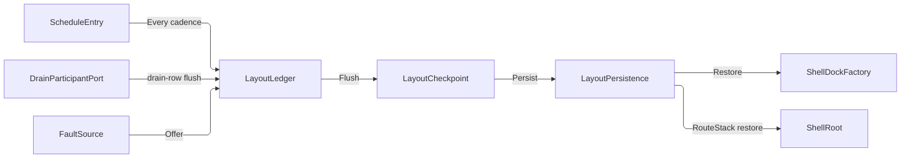

# [APPUI_SHELL_NAVIGATION]

Rasm.AppUi composes one shell: a seven-case `NavRequest` union dispatches over the `ShellRoot` router capsule with two view-resolution hosts, one `ShellDockFactory` folds route-keyed `DockableRow` rows through a `RegionProgram` into the Dock model graph so dockables are screens and the topology is data, `WorkspaceRow` rows name the arrangements a mode carries, `LayoutLedger` flows layout checkpoints as versioned hashed blobs through `LayoutPersistence` delegates with cadence, drain, support, telemetry, and crash-restore registrations on the AppHost ports, `ShellChrome` derives menu, toolbar, rail, status, HUD, context, and tray rows from intent keys per supplied `ConsumptionProfile`, and `AdaptiveLayout` owns the breakpoint table whose tiers select the chrome programs. The page owns the routing spine, the dock fabric with its region program, workspace, tear-out, checkpoint-cadence, external-dock-surface, and crash-restore values, chrome derivation, and adaptive layout over ReactiveUI, Dock.Avalonia, Dock.Model.ReactiveUI, Irihi.Ursa, PanAndZoom, Thinktecture vocabulary, and LanguageExt rails.

## [01]-[INDEX]

- [02]-[ROUTING_SPINE]: One route union over the shell root; two view-resolution hosts.
- [03]-[DOCK_LAYOUTS]: Region-program topology, locator rehydration, drop policy, workspaces, tear-out, checkpoint.
- [04]-[SHELL_CHROME]: Seven chrome slots; content resolves to control intents per surface row.
- [05]-[ADAPTIVE_LAYOUT]: One breakpoint table; the tier selects the chrome program.

## [02]-[ROUTING_SPINE]

- Owner: `NavRequest` `[Union]` seven-verb navigation vocabulary with the deep-link grammar; `ShellRoot` shell-root capsule owning `IScreen`, the router cell, and the ordinal-frozen route index.
- Cases: Push, Pop, Replace, Reset, Modal, Peek, View
- Entry: `public IO<Unit> Navigate(NavRequest request)` — `IO` carries the navigation effect; an unknown route key aborts on the `Error` rail.
- Auto: `RoutedViewHost` re-resolves the view on every router transition; deep links and remote verbs enter through `Parse` with no second admission path.
- Packages: ReactiveUI, ReactiveUI.Avalonia, Thinktecture.Runtime.Extensions, LanguageExt.Core, BCL inbox
- Growth: a new navigation verb is one case on `NavRequest`, a new screen is one `ScreenCatalog` row whose route the index projects through `Freeze`, and a new navigation instrument is one `InstrumentSpec` row on `ShellRoot.TelemetryRow`; zero new surface.
- Boundary: `Freeze` projects the route index off the frozen `ScreenCatalog` roster — keys are `row.RouteKey` by construction, so an independently authored route pair is unrepresentable; each `Navigate` dispatch folds one observation into the `ShellRoot.NavigateInstrument` count and an unknown-route abort folds one into the `ShellRoot.RouteMissInstrument` count through the composition-bound `Count` delegate, both declared through the one `AppUiTelemetry.Contribute` spine and both carrying the SAME declared verb dimension the `NavRequest.Verb` projection reads once per dispatch — a count promising a per-verb breakdown while writing untagged folds every entry path into one number no board can separate, so the dimension is declared on the row and the value threads through the dispatch state slot rather than being re-derived at either write; the miss keys on the verb rather than the refused key because an unknown key is unbounded by construction and would mint one series per typo, so navigation volume and route-miss rate are attributable per verb and a router-local meter is the deleted form; `ShellRoot` is the named boundary capsule — ReactiveUI command execution awaits inside its private kernels and nowhere else; `RoutedViewHost` and `ViewModelViewHost` are the only view-resolution surfaces, binding `Router` and `ViewModel` from the shell root, and view lookup beside the two hosts is the deleted pattern; both hosts ARE `TransitioningContentControl`s, so page motion binds through the `Theme/motion` `RouteCarrier.Bind` row against the one host and the `Direction` column carries `NavRequest.Reversed` into it before each dispatch — the direction is projected from the verb rather than passed by a caller, so a back transition cannot play forward because one call site forgot the flag, and an unassigned host would fall back to the framework's own inline-duration cross-fade, which is exactly the second untokened timing source the motion vocabulary forecloses; the `ViewContract` value on `RoutedViewHost` carries `profile.HostKey` so one screen resolves a host-specific template; route keys are ordinal strings shared by deep links, remote invocation, the dock factory, and the web projection, so the same grammar admits every caller today; modal presentation crosses to the dialog-session owner through the `PresentModal` delegate and PEEK crosses to the canvas-stack owner through `PresentPeek` — two columns rather than one presenter under a mode flag, because the two stacks carry different occupancy laws and a peek that consumed the session stack's single slot would refuse whenever a modal was open; a peek touches the navigation stack not at all, so it mints no back entry and dismissing one returns to the surface that opened it, while the ROUTE it names is the same key a push enters, so a deep link cannot peek one screen and push another; a VIEWPOINT recall is the third landing and takes the third column — `RecallView` binds `Render/pipeline#VIEW_REGISTRY` `ViewRegistry.Recall`, the segment is that owner's own `NamedView.LinkPrefix` so a link a saved view mints is a link this grammar admits, and the recall refuses on the registry's own unknown-key rail because a view key is not a route key and entering it into the route index would make every bookmark a screen; every route resolution threads a `SurfaceKey`, because `ScreenCatalogRow.Model` requires one and the state partition keys on `(ScreenId, SurfaceKey)` — the dock spawn addresses its minted key and the `Surface` elector answers for every ingress with no instance to name, so a stack-driven navigation and a torn-out float partition disjointly rather than the second silently overwriting the first; viewport-scoped navigation rides the same verb grammar — a `Push`/`Pop` over a `ZoomBorder`-hosted screen drives `ZoomBorder.NavigateBack`/`NavigateForward` view history and `ClearViewHistory` on a `Reset`, so a per-canvas back-stack is the deleted pattern and viewport history is one verb dispatch, never a second navigation owner; a second router beside the router cell and a region framework are the rejected forms.

```csharp signature
[Union(ConversionFromValue = ConversionOperatorsGeneration.None)]
public abstract partial record NavFault : Expected {
    private NavFault(string detail, int code) : base(detail, code) { }
    public sealed record InvalidDeepLink(string Link)
        : NavFault($"nav/deep-link: {Link}", AppUiFaultBand.Nav.Code(0));
    public sealed record SchemeMismatch(string Link)
        : NavFault($"nav/scheme: {Link} does not carry the rasm scheme", AppUiFaultBand.Nav.Code(1));
    public sealed record UnknownVerb(string Verb)
        : NavFault($"nav/verb: {Verb}", AppUiFaultBand.Nav.Code(2));
    public sealed record UnknownRoute(string Key)
        : NavFault($"nav/route: {Key}", AppUiFaultBand.Nav.Code(3));
    public sealed record CheckpointRejected(string Detail)
        : NavFault($"nav/checkpoint: {Detail}", AppUiFaultBand.Nav.Code(4));
    public sealed record RegionProgramRejected(string Detail)
        : NavFault($"nav/region: {Detail}", AppUiFaultBand.Nav.Code(5));
    public sealed record UnknownWorkspace(string Key)
        : NavFault($"nav/workspace: {Key}", AppUiFaultBand.Nav.Code(6));
    public sealed record InstanceRejected(string Detail)
        : NavFault($"nav/instance: {Detail}", AppUiFaultBand.Nav.Code(7));
}

[Union(ConversionFromValue = ConversionOperatorsGeneration.None)]
public abstract partial record NavRequest {
    private const string Scheme = "rasm";

    // The verb literals are consts because the deep-link grammar and the telemetry dimension are the
    // SAME vocabulary read twice — a parse pattern spelling one string and a dimension projection spelling
    // another forks the value a board groups on from the value a link admits, silently and in one direction.
    public const string PushVerb = "push";
    public const string PopVerb = "pop";
    public const string ReplaceVerb = "replace";
    public const string ResetVerb = "reset";
    public const string ModalVerb = "modal";
    public const string PeekVerb = "peek";
    // The viewpoint segment is the render owner's own prefix, so a link a saved view mints and a link this
    // grammar admits are one string; a nav-local literal would fork the two the first time either moved.
    public const string ViewVerb = NamedView.LinkPrefix;

    private NavRequest() { }

    public sealed record Push(string RouteKey) : NavRequest;

    public sealed record Pop() : NavRequest;

    public sealed record Replace(string RouteKey) : NavRequest;

    public sealed record Reset(string RouteKey) : NavRequest;

    public sealed record Modal(string RouteKey) : NavRequest;

    // Peek presents a route WITHOUT entering it: the stack is untouched, so a peeked screen leaves no back
    // entry and dismissing one returns to exactly the surface that opened it. It is a navigation verb rather
    // than a dialog call because the thing being shown is a ROUTE, so a deep link peeks the same key a push
    // enters and the two cannot resolve differently.
    public sealed record Peek(string RouteKey) : NavRequest;

    // A viewpoint recall is a navigation verb because a saved view is ADDRESSED exactly as a screen is: the
    // link carries the registry key, the stack is untouched, and the camera flight is the transition. It
    // presents through its own column for the same reason peek does — the recall lands on the viewport's own
    // scrub rather than on either presentation stack, and one column per landing keeps the three total.
    public sealed record View(string ViewKey) : NavRequest;

    // The declared navigation dimension, read once per dispatch and carried into the miss count so both
    // instruments group on one value; an eighth verb breaks this projection at compile time rather than
    // landing untagged observations no board can separate from the rest.
    public string Verb => Switch(
        push: static _ => PushVerb,
        pop: static _ => PopVerb,
        replace: static _ => ReplaceVerb,
        reset: static _ => ResetVerb,
        modal: static _ => ModalVerb,
        peek: static _ => PeekVerb,
        view: static _ => ViewVerb);

    // Transition direction is a PROJECTION of the verb, never a caller flag: a pop travels back and every
    // other verb travels forward, so the page carrier and the router cannot disagree about which way a
    // transition runs and no navigation site passes a bool the router would then have to trust.
    public bool Reversed => Switch(
        push: static _ => false,
        pop: static _ => true,
        replace: static _ => false,
        reset: static _ => false,
        modal: static _ => false,
        peek: static _ => false,
        view: static _ => false);

    // Robust scheme parse: Uri owns the grammar — scheme match is ordinal-case-insensitive, the verb is
    // the authority-or-first-segment, the key is the remaining path, and every reject is a typed NavFault.
    public static Fin<NavRequest> Parse(string deepLink) =>
        Uri.TryCreate(deepLink, UriKind.Absolute, out Uri? uri)
            ? !string.Equals(uri.Scheme, Scheme, StringComparison.OrdinalIgnoreCase)
                ? Fin.Fail<NavRequest>(new NavFault.SchemeMismatch(deepLink))
                : Segments(uri) switch {
                    [PushVerb, var key] => Fin.Succ<NavRequest>(new Push(key)),
                    [PopVerb] => Fin.Succ<NavRequest>(new Pop()),
                    [ReplaceVerb, var key] => Fin.Succ<NavRequest>(new Replace(key)),
                    [ResetVerb, var key] => Fin.Succ<NavRequest>(new Reset(key)),
                    [ModalVerb, var key] => Fin.Succ<NavRequest>(new Modal(key)),
                    [PeekVerb, var key] => Fin.Succ<NavRequest>(new Peek(key)),
                    [ViewVerb, var key] => Fin.Succ<NavRequest>(new View(key)),
                    [var verb, ..] => Fin.Fail<NavRequest>(new NavFault.UnknownVerb(verb)),
                    _ => Fin.Fail<NavRequest>(new NavFault.InvalidDeepLink(deepLink)),
                }
            : Fin.Fail<NavRequest>(new NavFault.InvalidDeepLink(deepLink));

    // rasm:push/key and rasm://push/key both admit: authority-form verbs land in Host, opaque-form in the path.
    private static string[] Segments(Uri uri) =>
        (uri.IsAbsoluteUri && uri.Host.Length > 0
            ? new[] { uri.Host }.Concat(uri.AbsolutePath.Split('/', StringSplitOptions.RemoveEmptyEntries))
            : (uri.IsAbsoluteUri ? uri.AbsolutePath : uri.OriginalString)
                .Split('/', StringSplitOptions.RemoveEmptyEntries).AsEnumerable())
        .Select(Uri.UnescapeDataString)
        .ToArray();
}

public readonly record struct RouteRestoreFact(string Key, bool Resolved);

public sealed class ShellRoot(
    FrozenDictionary<string, Func<IScreen, SurfaceKey, IRoutableViewModel>> routes,
    Func<string, SurfaceKey> surface,
    Func<IRoutableViewModel, IO<Unit>> presentModal,
    Func<IRoutableViewModel, IO<Unit>> presentPeek,
    Func<string, IO<Unit>> recallView,
    Func<bool, Unit> direction,
    Func<string, string, IO<Unit>> count) : ReactiveObject, IScreen {
    public RoutingState Router { get; } = new();

    // Each route mints its model AGAINST a surface key, because `ScreenCatalogRow.Model` takes one: the
    // state partition keys on `(ScreenId, SurfaceKey)`, so a factory that dropped the key would have two
    // floats of one route silently overwrite each other's scroll, filter, and selection on every flush.
    public FrozenDictionary<string, Func<IScreen, SurfaceKey, IRoutableViewModel>> Routes { get; } = routes;

    // The router's own instance elector, bound at composition to the active workspace's primary instance for
    // a route. A dock spawn addresses its minted key explicitly; a deep link, a chord, and a back step have
    // no instance to name, so the elector answers for them and the admission stays one member either way.
    public Func<string, SurfaceKey> Surface { get; } = surface;

    public Func<IRoutableViewModel, IO<Unit>> PresentModal { get; } = presentModal;

    // The peek presenter, bound at composition to the `Shell/dialogs` canvas-stack Peek intent. It is a
    // SECOND column rather than a mode flag on PresentModal because the two land on different stacks with
    // different occupancy laws — the session stack admits one modal, the canvas stack admits many peeks.
    public Func<IRoutableViewModel, IO<Unit>> PresentPeek { get; } = presentPeek;

    // The viewpoint landing, bound at composition to `Render/pipeline` `ViewRegistry.Recall` through the
    // viewport cell that scrubs the returned camera timeline. It is the THIRD column for the same reason
    // peek is the second: a recall touches neither presentation stack, and a presenter under a mode flag
    // would have to answer for three occupancy laws at once.
    public Func<string, IO<Unit>> RecallView { get; } = recallView;

    // The page-transition direction column, bound at composition to `Theme/motion` `RouteCarrier.Bind` over
    // the one `RoutedViewHost`. It is set from the verb BEFORE the router transition, because the carrier
    // configures the transition the very next stack write plays.
    public Func<bool, Unit> Direction { get; } = direction;

    // The tag rides the delegate because the instrument DECLARES a dimension: composition binds the AppHost
    // meter increment and resolves each instrument's own slot from the `Dimensions` its row carries, so a
    // write site spells the value and never the key, and a count reaching the meter untagged is unspellable.
    public Func<string, string, IO<Unit>> Count { get; } = count;

    public const string NavigateInstrument = "rasm.appui.nav.navigated";
    public const string RouteMissInstrument = "rasm.appui.nav.route.miss";

    public static TelemetryContributorPort TelemetryRow(string version) =>
        AppUiTelemetry.Contribute(version,
            InstrumentSpec.Count(NavigateInstrument, "{navigation}", "navigation dispatches by verb", MeasureForm.Whole,
                AppUiTelemetry.VerbSlot),
            InstrumentSpec.Count(RouteMissInstrument, "{navigation}", "unknown-route aborts by verb", MeasureForm.Whole,
                AppUiTelemetry.VerbSlot));

    // The route index is a projection of the frozen screen roster: keys are row.RouteKey by construction,
    // so deep links, dock rows, palette listings, and screens cannot disagree — an independently authored
    // route pair is unrepresentable.
    public static FrozenDictionary<string, Func<IScreen, SurfaceKey, IRoutableViewModel>> Freeze(
        ScreenCatalog catalog, Func<ScreenCatalogRow, Func<IScreen, SurfaceKey, IRoutableViewModel>> make) =>
        toSeq(catalog.Rows.Values).ToFrozenDictionary(static row => row.RouteKey, make, StringComparer.Ordinal);

    // The verb threads through the state slot rather than being re-derived per arm, so the dispatch count
    // and every miss count under it carry ONE value and each arm stays static and closure-free.
    public IO<Unit> Navigate(NavRequest request) =>
        Count(NavigateInstrument, request.Verb).Map(_ => Direction(request.Reversed)).Bind(_ => request.Switch(
            state: (Root: this, Verb: request.Verb),
            push: static (s, c) => s.Root.Forward(s.Root.Router.Navigate, c.RouteKey, s.Verb),
            pop: static (s, _) => s.Root.Back(),
            replace: static (s, c) => s.Root.Swap(c.RouteKey, s.Verb),
            reset: static (s, c) => s.Root.Forward(s.Root.Router.NavigateAndReset, c.RouteKey, s.Verb),
            modal: static (s, c) => s.Root.Resolved(c.RouteKey, s.Verb).Bind(s.Root.PresentModal),
            // Peek resolves the route and presents it WITHOUT touching the stack, so no back entry is minted.
            peek: static (s, c) => s.Root.Resolved(c.RouteKey, s.Verb).Bind(s.Root.PresentPeek),
            // A recall names a REGISTRY row rather than a route, so it never enters the route index and its
            // own unknown-key refusal is the registry's; the dispatch still counts under this verb.
            view: static (s, c) => s.Root.RecallView(c.ViewKey)));

    // Replace is ONE stack write — pop-plus-push as a single NavigationStack assignment, so no
    // intermediate back transition renders and the router observes exactly one change.
    private IO<Unit> Swap(string key, string verb) =>
        Resolved(key, verb).Map(vm => ignore(Router.NavigationStack = [.. Router.NavigationStack.SkipLast(1), vm]));

    // The ONE route-admission outcome: navigation lifts it into IO, the dock factory consumes the Fin
    // directly, so an unknown key is the same NavFault.UnknownRoute evidence on every ingress path.
    public Fin<IRoutableViewModel> Resolve(string key, SurfaceKey surface) =>
        Routes.TryGetValue(key, out Func<IScreen, SurfaceKey, IRoutableViewModel>? make)
            ? Fin.Succ(make(this, surface))
            : Fin.Fail<IRoutableViewModel>(new NavFault.UnknownRoute(key));

    // The unaddressed sibling every stack-driven ingress takes: the elector answers which instance a bare
    // key means, so one admission serves a deep link and a dock spawn and neither re-derives the partition.
    public Fin<IRoutableViewModel> Resolve(string key) => Resolve(key, Surface(key));

    // Workspace restore is stack manipulation, never command replay: saved keys materialize, the
    // stack sets ONCE, and an unresolvable key folds to the fallback row with a receipt — first-run,
    // restore, and upgrade are one total fold over (saved keys × route index).
    public Fin<Seq<RouteRestoreFact>> Restore(Seq<string> saved, string fallback) =>
        Resolve(fallback).Bind(fallbackScreen => {
            Seq<string> requested = saved.IsEmpty ? Seq(fallback) : saved;
            Seq<(RouteRestoreFact Fact, IRoutableViewModel Screen)> resolved = requested
                .Map(key => Resolve(key).Match(
                    Succ: screen => (new RouteRestoreFact(key, true), screen),
                    Fail: _ => (new RouteRestoreFact(key, false), fallbackScreen)))
                .Strict();
            Router.NavigationStack = [.. resolved.Map(static row => row.Screen)];
            return Fin.Succ(resolved.Map(static row => row.Fact));
        });

    // The miss counts under the VERB that asked, never the key it asked for: an unknown route key is by
    // definition unbounded, so keying the dimension on it mints one series per typo while the verb answers
    // the question a board asks — which entry path is sending traffic at routes the catalog does not carry.
    private IO<IRoutableViewModel> Resolved(string key, string verb) =>
        Resolve(key).Match(
            Succ: IO.pure,
            Fail: error => Count(RouteMissInstrument, verb).Bind(_ => IO.fail<IRoutableViewModel>(error)));

    private IO<Unit> Forward(ReactiveCommand<IRoutableViewModel, IRoutableViewModel> command, string key, string verb) =>
        Resolved(key, verb).Bind(vm => IO.lift(async _ => { await command.Execute(vm).ConfigureAwait(true); return unit; }));

    private IO<Unit> Back() =>
        IO.lift(async _ => { await Router.NavigateBack.Execute().ConfigureAwait(true); return unit; });
}
```

## [03]-[DOCK_LAYOUTS]

- Owner: `DockZone` the region address; `DockableRow` registration row; `RegionRow` and `RegionProgram` the layout topology as data; `PinnedPosture` the auto-hide row; `ShellDockFactory` boundary capsule over the Dock model graph; `DropVerdict` the drag-preview caption fold; `ShellPolicy` policy anchor; `WorkspaceRow` and `Workspaces` the named-workspace family; `SurfaceKey` the per-instance mint; `DocumentInstances` the template-spawn fold; `TearOut` and `WindowPlacement` the float and display-clamp surface; `LayoutCheckpoint` versioned blob record; `LayoutPersistence` port-delegate record; `LayoutLedger` checkpoint, restore, telemetry, and registration fold surface.
- Entry: `public static IO<Option<LayoutCheckpoint>> Flush(ClockPolicy clocks, LayoutPersistence port, Atom<Option<string>> last)` — `IO` carries the capture-hash-persist effect over BOTH workspace rails, the dock payload and the router route-stack; the unchanged-hash skip rides `Option<T>` and its content key folds payload plus stack, so a navigation-only change still checkpoints. `public Fin<IRootDock> Build()` folds the roster through the region program; `public IO<Fin<Seq<RouteRestoreFact>>> Enter(WorkspaceRow workspace)` switches a named workspace, `public IO<Unit> Save(WorkspaceRow row)` pins the live arrangement into that workspace's own cell without leaving it, and `public IO<Fin<Seq<RouteRestoreFact>>> Reset(WorkspaceRow row)` discards the cell and re-enters from the region program — one member per declared workspace verb.
- Auto: the cadence, drain, support, and telemetry rows register once at composition — flush fires on the `Every` cadence and again on the drain row inside `DrainBand.Interaction` at `ShellPolicy.DrainRank`, the support capture reads the latest blob, the telemetry row contributes the layout-flush instruments inward, and boot restore runs once from the fault-spine probe consequence, re-materializing the dock graph and setting the router stack through `ShellRoot.Restore` in one pass — the deserialized graph rehydrates each dockable's context through the factory's own `ContextLocator`/`DockableLocator`, an unresolvable saved route key folds to the fallback row with a `RouteRestoreFact` receipt, and every saved float rectangle clamps against the live working-area set BEFORE `InitLayout`, so first-run, restore, upgrade, and a monitor detach are one total fold; zero UI timers.
- Receipt: `Flush` yields `Option<LayoutCheckpoint>` — Some on a persisted blob, None on the unchanged-hash skip; the checkpoint record is the restore evidence and the support artifact body; `RouteRestoreFact` rows are the per-key restore evidence; the flush and restore instruments write off those two outcomes through the port's own `Count` column, so a skipped flush and a declined crash offer count nothing.
- Packages: Dock.Avalonia, Dock.Model.ReactiveUI, Dock.Serializer.SystemTextJson, NodaTime, LanguageExt.Core, Rasm.AppHost (project), BCL inbox
- Law: the four persisted carriers restore in ONE stated order and never concurrently — `LayoutCheckpoint` first (it materializes the dock graph and therefore every surface the other three key on), then `WindowState` (float rectangles clamp against the live displays before `InitLayout` seats them), then `ScreenState` per mounted screen, then `CanvasState` per viewport. The order is causal, not stylistic: screen state keys on `(ScreenId, SurfaceKey)` and the surface keys do not exist until the dock graph and its float windows are seated, so a screen restoring first writes into a partition the layout is about to mint differently. The collision rule is LAST-WRITER-BY-RANK inside one carrier and NEVER across carriers: two rows of the same carrier claiming one key resolve to the higher-ranked row with the loser sealed as evidence, while a carrier finding no partition for its key restores nothing and seals nothing, because an absent partition is a first-run fact rather than a fault.
- Growth: a new dockable is one `DockableRow` row registered from the screen catalog with its title resolving through the catalog title cell, a new region address is one `DockZone` row carrying its mode, role, and drop policy, a new baseline layout is one `RegionProgram` value, a new workspace is one `WorkspaceRow`, a new cadence, rank, retention, drop-selector, or external-surface bound is one policy value on `ShellPolicy`, and a new layout instrument is one `InstrumentSpec` row on `LayoutLedger.TelemetryRow`; zero new surface.
- Boundary: `ShellDockFactory` is the named boundary capsule for the statement carve-out — the Dock model graph is mutable host-owned state assembled only through `Factory` create entrypoints, and view-layer mutation of dock structure is the rejected form; `DockControl` binds `Build`'s root through `Layout` with `InitializeLayout` and `InitializeFactory` false so the factory owns initialization, the dock chrome variant resolves through the `IDockThemeManager` bound at composition from the theme-token variant subscription so dock-owned brushes flip with the one theme resolution and a per-dock brush literal is the deleted form — every other `Dock*` key resolves to a `SemiColor*` slot the token emission already writes, and the two that resolve `DynamicResource` against no shipped dictionary at all, `DockSurfaceWorkbenchBrush` and `DockSeparatorBrush`, MINT from that same emission as ordinary role slots (`Theme/tokens#TOKEN_CATALOG`), so the shell supplies both or the bound brush stays unset; the dock skin carries ZERO keys in its own theme dictionaries and inherits every light/dark decision from the base Semi dictionaries, which makes variant coherence a standing obligation on this boundary rather than a version concern — the dock theme package may lag the dock CONTROL package freely, because a minor that changes no styled property changes no themable surface, but a Semi base and a Semi dock skin at divergent variant vocabularies would leave the dock reading one variant's palette while the shell reads another, and no structural check inside this page can see that; floating hosts ride `HostWindowFactory` with `EnableManagedWindowLayer` under the `FloatingWindows` gate, and rows where `ShellPolicy.ExternalSurface` holds register an AppUi-supplied `IExternalDockSurface` ADAPTER over the embedded host root through `DockControl.RegisterExternalDockSurface(IExternalDockSurface)` — the adapter answers `DockControl? DockControl { get; set; }` and `Control SurfaceControl { get; }`, registration binds that `DockControl` property to the registering control and unregistration through `bool UnregisterExternalDockSurface(IExternalDockSurface)` answers `true` and nulls it, so the panel root itself never crosses as the surface, the same adapter identity registers and detaches, and the bound-then-null property IS the registration state a teardown reads; Dock holds registered surfaces as `WeakReference` and keeps `EnumerateExternalDockSurfaceControls` internal, so the ADAPTER'S lifetime is composition-owned — the activation scope holds it for the mount's life, since an adapter dropped to the collector silently leaves the dock's set with nothing above able to enumerate the loss — and the registration rows here are the readable roster; a docked panel drags across the host boundary while `GlobalDockTarget` and the `DockSelectorMode`-typed selector drive the `DockControl.ShowSelector(DockSelectorMode mode)`/`HideSelector()` drop overlay under the `ShellPolicy.DropSelector` gate — `DockSelectorMode` is the three-member `Documents | Tools | All` domain, a per-host drag-handler fork is the rejected form, and the overlay raise and the drop landing across the host boundary are perceptual: both need a physical drag gesture, so no design here holds for them; dockable `Context` resolves through the same `ShellRoot.Resolve` admission as navigation — `Build` traverses the rows on the `Fin` rail so a stale `DockableRow.RouteKey` yields the identical `NavFault.UnknownRoute` evidence, a direct route-index access is the deleted form, a dockable is a screen, and a second viewmodel system is the deleted pattern; RESTORE reaches that same admission through the package's own locators rather than through a second rehydration path — a deserialized graph carries dockable ids and no contexts at all, so `ShellDockFactory` binds `ContextLocator` and `DockableLocator` off the frozen roster inside its `InitLayout` override and the package's `GetContext(id)` and `RestoreDockable(id)` resolve every restored panel to a live view-model, while an id outside the roster seals the same `NavFault.UnknownRoute` and answers null so the package drops the dockable — a restore that skipped this step produced a structurally perfect layout of dead shells, which reads as success at every level except the one that matters; the layout topology is a REGION PROGRAM, never a construction body — `RegionRow` rows carry zone, orientation, proportion, and rank, `Build` draws each zone's dockables off the roster and seats them in the dock class its zone's own `Role` column names, and the orientation column alone decides the outer band and the inner column, so the baseline professional layout is a value, a second layout is a second `RegionProgram`, and the single hardcoded tool-plus-document split this replaced could express exactly one arrangement; splitters land BETWEEN adjacent regions and never after the last, because a trailing splitter renders as a grab handle against the window edge that moves nothing; drop legality is POLICY ROWS the package's own resolver reads, never a drag handler — the capability ladder resolves dockable base value, then `IRootDock.RootDockCapabilityPolicy`, then `IDock.DockCapabilityPolicy`, then `IDockable.DockCapabilityOverrides`, each present value winning over the last, so a `DockableRow` writes the dockable's own six base flags (the WEAKEST rung, so a zone can still narrow it), a zone writes its `DockCapabilityPolicy`, the program writes the root policy, and `DockCapabilityOverrides` stays reserved for a per-dockable exception that must beat both policies — writing a row's answer into the overrides instead made every policy above it dead, silently; `IDockable.DockGroup` carries the row's group and `DockGroupValidator` gates cross-group drops, so a tool that must never land beside a document is one group value rather than a validation arm; pinned auto-hide is three columns on `PinnedPosture` — the strip `Alignment`, the `PinnedDockDisplayMode` deciding whether the reveal floats over the layout or takes space in it, and `KeepPinnedDockableVisible` — and reveal rides `PreviewPinnedDockable`/`TogglePreviewPinnedDockable`/`HidePreviewingDockables` so a hover peek never unpins, where `PinDockable` itself TOGGLES and taking it for a one-way pin unpins whatever was already pinned; the drag ghost is the package's `DragPreviewControl` bound through `ControlRecycling` so the dragged view instance is reused rather than re-materialized mid-gesture, and its `Status` caption is the manager's OWN verdict — `DockCapabilityResolver.Evaluate` returns the effective value beside the source that decided it and `IDockManager.LastCapabilityEvaluation` carries the resolved `DiagnosticMessage`, so the caption a user reads names the policy rung that refused the drop instead of a locally composed sentence that would drift from the rule; the dock ships its OWN overlay stack — `OverlayHost`, `OverlayLayerRegistry`, `DialogOverlayControl`, `ConfirmationOverlayControl`, `BusyOverlayControl` — and this shell mounts NONE of it: modal and transient presentation has exactly two admitted owners, the DialogHost session stack and the Ursa overlay canvas (`Shell/dialogs#SESSION_ALGEBRA`), and a third stack scoped to one control means a dock confirmation cannot participate in the retreat veto, the suppression fold, or the close-cause seal every other surface rides; the drop SELECTOR is a different mechanism and stays admitted, because it renders drag targets rather than presenting content; `IDockState.Save`/`Restore`/`Reset` IS composed, and for one job the serializer cannot do — a workspace switch snapshots the live graph and restores it in-process with no round-trip, so switching away and back returns the exact arrangement including transient state the blob never carried, while the serialized checkpoint stays the CROSS-PROCESS carrier; the two are the same fact at two lifetimes and neither replaces the other; the `Serialize` and `Restore` delegates bind the concrete `DockSerializer` from `Dock.Serializer.SystemTextJson` at composition — `DockSerializer()` constructs the default `ObservableCollection<>`-list reflection resolver, or `DockSerializer(IJsonTypeInfoResolver)` takes the source-generated `DockSystemTextJsonContext` the `[assembly: DockJsonSourceGenerationAttribute]` analyzer emits for AOT-safe metadata; its `IDockSerializer` contract `Serialize<T>(T)->string`, `Deserialize<T>(string)->T?`, `Load<T>(Stream)->T?`, `Save<T>(Stream, T)` carries the package-owned `JsonSerializerOptions` (`ReferenceHandler.Preserve`, `WhenWritingNull`, `AllowNamedFloatingPointLiterals`, the `JsonConverterFactoryList` `IList<T>` factory) and the `DockModelPolymorphicTypeResolver` that resolves `IDockable`/`IDock`/`IRootDock`/`IDockWindow`/`IDocumentTemplate`/`IToolTemplate` by `$type`, so a hand-rolled `IDockSerializer` or a replacement `JsonSerializerOptions` set is the rejected form; the payload crosses the Persistence port as an opaque versioned blob — the serializer round-trips dockable identity by `Id` so structure survives restore, file I/O is caller-side `Load<T>(Stream)`/`Save<T>(Stream, T)` construction since no file-path overload ships, AppUi issues no store queries, the `ContentHash` delegate carries the Persistence snapshot hash vocabulary, and the persist route prunes to `RetainedCheckpoints` generations; crash offer consumes the fault-spine crashes — a `HostCrashMarker` case gates the confirm route while a clean boot restores the warm blob silently; multi-window coordination and session restore ride the same blob; the dashboard-board snapshot is `Charts/dashboards#STREAM_BINDING`'s `BoardState` and does NOT ride this serializer — that payload carries `Instant` and LanguageExt collection members the dock serializer's package-internal, converter-closed option set silently defaults, so it round-trips through the one composition-bound suite wire while the dock GRAPH blob stays `IDockSerializer`'s for the `$type` polymorphism over `IDockable` that only this payload needs; two blobs, two serializers, each the one its own members demand, and a board blob on this serializer is the deleted form; the checkpoint row shares the health-probe deadline bound, so a flush past it is the dispatcher-starvation signal; the drain row ranks after the screens teardown row inside `DrainBand.Interaction`, so the flushed layout captures post-suspension state; the support artifact reports the REDACTOR'S OWN count — `Support` widens to the AppHost `SupportArtifact.Produce` pair and binds at composition to the same `Redactor` every other bundle column masks through, because the payload carries route keys and catalog-resolved dockable titles and a literal `0` beside them asserts a measurement nothing on the path took; pin, auto-hide, float, and close states are `DockableRow` policy values rendered through `PinnedDockControl`/`ToolPinnedControl`, never control state; a WORKSPACE is one row carrying key, label, region program, chrome-visibility overrides, and default route, and switching one is a command verb over that row rather than a layout edit, so the mode a user picks and the layout they get are one value — `Shell/commands#INTENT_TABLE` carries the enter, save, and reset verbs and the mode toolbar reads the SAME rows the switch consumes, which is what resolves the standing incoherence of a mode selector that changed a label while the layout stayed where the last drag left it; a document INSTANCE mints through the package's own spawn path — `IDocumentDock.CanCreateDocument` gates the affordance and `CreateDocument` runs the spawn, `IDocumentDockFactory.DocumentFactory` supplies the dockable, and `IDocumentTemplate.Content` carries the template body — so a second document is a package operation and a hand-built `Document` beside it is the rejected form; every instance takes a minted `SurfaceKey` and two instances of one screen therefore partition their persisted state disjointly, because the state partition keys on that surface and two floats of one route sharing a key would have the second silently overwrite the first's scroll, filter, and selection on every flush; a TEAR-OUT is `FloatDockable(dockable, DockWindowOptions)` with the float host built by the `DockControl.HostWindowFactory` column bound to the owned window chrome (`Shell/hosts` `WindowChrome.TearOut`), which suppresses the platform frame on a `HostWindow` carrying no Ursa caption surface, so a torn-out panel wears Dock's own `HostWindowTitleBar` rather than the platform's and `HostWindow.IsToolWindow` with `ToolChromeControlsWholeWindow` decides whether the tool chrome IS the window frame; float geometry restores CLAMPED — `WindowPlacement.Clamp` folds every saved `IDockWindow` rectangle against the live working-area set read off `SurfaceSession.Displays` before `InitLayout` seats the graph, and re-clamps on every `SurfaceFact.DisplayChanged`, so a restore after a monitor detach lands on a screen that exists and the hosts-page display fact has the one consumer it promised.

```csharp signature
[SmartEnum<string>]
public sealed partial class DockRole {
    public static readonly DockRole Document = new("document");
    public static readonly DockRole Tool = new("tool");
}

// The region ADDRESS, distinct from the role: a role says what a dockable IS and decides its host dock class,
// a zone says where the program seats it. Collapsing the two is what forced one hardcoded arrangement — with
// only "tool" and "document" to address, there was exactly one place each could go. Every zone carries the
// package's own DockMode, the ROLE its host dock class derives from, and its drop policy, so a zone that
// refuses foreign panels and a second document area are both row values.
[SmartEnum<string>]
[KeyMemberEqualityComparer<ComparerAccessors.StringOrdinal, string>]
[KeyMemberComparer<ComparerAccessors.StringOrdinal, string>]
public sealed partial class DockZone {
    public static readonly DockZone Primary = new("primary", DockMode.Center, DockRole.Document, policy: null);
    public static readonly DockZone Left = new("left", DockMode.Left, DockRole.Tool, policy: null);
    public static readonly DockZone Right = new("right", DockMode.Right, DockRole.Tool, policy: null);
    public static readonly DockZone Top = new("top", DockMode.Top, DockRole.Tool, policy: null);
    // The status band takes no drop at all: a panel dragged into a fixed readout strip would displace
    // geometry the chrome fold owns, so the zone policy refuses it above every row's own base flag.
    public static readonly DockZone Bottom = new("bottom", DockMode.Bottom, DockRole.Tool, policy: new DockCapabilityPolicy { CanDrop = false });

    public DockMode Mode { get; }

    // The host dock class this zone seats, as a COLUMN: an identity test against the primary row made a
    // second document area — a split editor, a comparison pane — unspellable, because the second such zone
    // would silently seat in a tool dock that spawns no document and renders no document tab strip.
    public DockRole Role { get; }

    public DockCapabilityPolicy? Policy { get; }

    // The dock side mirrors under the ONE mirroring law rather than a locale branch here: the left rail of a
    // right-to-left shell is its right rail, and reading the flip off the landed `MirrorSubject.DockSide` row
    // keeps the dock, the chrome zones, and every other anchored surface flipping on one verdict.
    public DockMode Sided(LocaleRow locale) =>
        MirrorSubject.DockSide.Mirrors(locale)
            ? Mode switch { DockMode.Left => DockMode.Right, DockMode.Right => DockMode.Left, var held => held }
            : Mode;
}

// Auto-hide as a row: the strip edge, whether the reveal floats over the layout or takes space in it, and
// whether the reveal survives losing focus. Absent posture means the dockable never pins.
public sealed record PinnedPosture(Alignment Alignment, PinnedDockDisplayMode Display, bool KeepVisible);

// Capabilities are the PACKAGE's own six-member axis, never a local three-row rename of half of it —
// `Drag`, `Drop`, and `DockAsDocument` are exactly the capabilities drop legality turns on, and a local
// vocabulary that omitted them made the whole policy ladder unaddressable from a row.
public sealed record DockableRow(
    string RouteKey,
    DockRole Role,
    DockZone Zone,
    int Rank,
    double Proportion,
    FrozenSet<DockCapability> Capabilities,
    Option<string> Group,
    Option<PinnedPosture> Pinned);

// The topology as DATA. Orientation is the whole nesting law: horizontal rows form the outer band, the
// vertical rows form one inner column seated at the band position their rank gives, and that pair expresses
// every professional workbench arrangement without a construction body per layout.
public sealed record RegionRow(DockZone Zone, Orientation Orientation, double Proportion, int Rank);

public sealed record RegionProgram(string Key, Seq<RegionRow> Rows, DockCapabilityPolicy? Policy, PinnedDockDisplayMode PinnedDisplay) {
    public static readonly RegionProgram Workbench = new(
        Key: "workbench",
        Rows: Seq(
            new RegionRow(DockZone.Left, Orientation.Horizontal, 0.20d, 0),
            new RegionRow(DockZone.Top, Orientation.Vertical, 0.18d, 1),
            new RegionRow(DockZone.Primary, Orientation.Vertical, 0.62d, 2),
            new RegionRow(DockZone.Bottom, Orientation.Vertical, 0.20d, 3),
            new RegionRow(DockZone.Right, Orientation.Horizontal, 0.20d, 4)),
        Policy: null,
        PinnedDisplay: PinnedDockDisplayMode.Overlay);

    // The vertical block must be CONTIGUOUS in rank, because it collapses into one inner column seated at a
    // single band position — two vertical runs split by a horizontal region describe an arrangement this
    // band-and-column fold cannot build, and admitting it silently would drop the second run's regions.
    public Fin<Seq<RegionRow>> Admit() =>
        toSeq(Rows.OrderBy(static row => row.Rank)) switch {
            var ordered when ordered.IsEmpty =>
                Fin.Fail<Seq<RegionRow>>(new NavFault.RegionProgramRejected($"{Key}: empty")),
            var ordered when Runs(ordered) > 1 =>
                Fin.Fail<Seq<RegionRow>>(new NavFault.RegionProgramRejected($"{Key}: vertical block split across {Runs(ordered)} runs")),
            var ordered when ordered.Map(static row => row.Zone).Distinct().Count() != ordered.Count =>
                Fin.Fail<Seq<RegionRow>>(new NavFault.RegionProgramRejected($"{Key}: duplicate zone")),
            var ordered => Fin.Succ(ordered),
        };

    private static int Runs(Seq<RegionRow> ordered) =>
        ordered.Fold(
            (Count: 0, Inside: false),
            static (state, row) => row.Orientation == Orientation.Vertical
                ? (state.Inside ? state.Count : state.Count + 1, true)
                : (state.Count, false))
        .Count;
}

// Dock-tab titles resolve through the ONE screen-catalog title cell bound at composition — a second
// title cell on the dock row is the deleted split-brain, so a rename lands everywhere at once.
public sealed class ShellDockFactory(
    ShellRoot shell,
    Seq<DockableRow> rows,
    RegionProgram program,
    Func<string, string> title,
    Func<IDockThemeManager> themeManager,
    Func<LocaleRow> locale,
    Func<NavFault, Unit> stale) : Factory {
    public IDockThemeManager ThemeManager() => themeManager();

    // The REHYDRATION seam, and the reason a restored layout carries live view-models: the serialized graph
    // holds dockable ids and no contexts at all, so the package resolves each one back through the locators
    // it owns — `GetContext(id)` off ContextLocator for a restored panel's view-model, `RestoreDockable(id)`
    // off DockableLocator for a hidden or closed dockable returning to the graph. Both resolve through the
    // SAME ShellRoot.Resolve admission every other ingress takes, so a stale id seals the identical
    // NavFault.UnknownRoute and answers null, which the package reads as "drop it" — the alternative, a
    // structurally perfect layout of context-less shells, reads as success everywhere except on screen.
    public override void InitLayout(IDockable layout) {
        ContextLocator = rows.Map(row => KeyValuePair.Create(row.RouteKey, Context(row.RouteKey))).ToDictionary(StringComparer.Ordinal);
        DockableLocator = rows.Map(row => KeyValuePair.Create(row.RouteKey, Restored(row))).ToDictionary(StringComparer.Ordinal);
        DefaultContextLocator = static () => null;
        base.InitLayout(layout);
    }

    private Func<object?> Context(string key) => () =>
        shell.Resolve(key).Match(Succ: static vm => (object?)vm, Fail: error => (stale(Narrowed(error, key)), (object?)null).Item2);

    private Func<IDockable?> Restored(DockableRow row) => () =>
        Dockable(row).Match(Succ: static dockable => dockable, Fail: error => (stale(Narrowed(error, row.RouteKey)), (IDockable?)null).Item2);

    private static NavFault Narrowed(Error error, string key) => error as NavFault ?? new NavFault.UnknownRoute(key);

    // Build folds the ROSTER through the PROGRAM: each admitted region draws its own zone's dockables, seats
    // them in the dock class its zone's role implies, and the orientation column alone decides the band.
    public Fin<IRootDock> Build() =>
        from ordered in program.Admit()
        from mounted in ordered.Traverse(region => Region(region).Map(dock => (Region: region, Dock: dock))).As()
        select Assemble(mounted.Choose(static pair => pair.Dock.Map(dock => (pair.Region, Dock: dock))));

    // An empty zone contributes NO dock rather than an empty one: a zero-child tool dock renders as a bare
    // strip with a splitter beside it, which reads as a broken layout rather than an absent region.
    private Fin<Option<IDock>> Region(RegionRow region) =>
        toSeq(rows.Filter(row => row.Zone == region.Zone).OrderBy(static row => row.Rank))
            .TraverseM(Dockable).As()
            .Map(dockables => dockables.IsEmpty ? Option<IDock>.None : Some(Seat(region, dockables)));

    private Fin<IDockable> Dockable(DockableRow row) =>
        shell.Resolve(row.RouteKey).Map(context => {
            DockableBase dockable = row.Role == DockRole.Tool ? (DockableBase)CreateTool() : (DockableBase)CreateDocument();
            dockable.Id = row.RouteKey;
            dockable.Title = title(row.RouteKey);
            dockable.Context = context;
            dockable.Proportion = row.Proportion;
            dockable.Dock = row.Zone.Sided(locale());
            return (IDockable)Governed(dockable, row);
        });

    // The row writes the WEAKEST rung of the capability ladder — the dockable's own six base flags — so a
    // zone policy and a root policy can each still narrow it above. Writing the row's answer into
    // DockCapabilityOverrides instead would win over both and make every policy above it dead code that
    // still type-checks, resolves, and reports its own source as the deciding one.
    private static IDockable Governed(IDockable dockable, DockableRow row) {
        dockable.CanClose = row.Capabilities.Contains(DockCapability.Close);
        dockable.CanPin = row.Capabilities.Contains(DockCapability.Pin);
        dockable.CanFloat = row.Capabilities.Contains(DockCapability.Float);
        dockable.CanDrag = row.Capabilities.Contains(DockCapability.Drag);
        dockable.CanDrop = row.Capabilities.Contains(DockCapability.Drop);
        dockable.CanDockAsDocument = row.Capabilities.Contains(DockCapability.DockAsDocument);
        dockable.DockGroup = (string?)row.Group.Case;
        row.Pinned.Iter(posture => {
            dockable.KeepPinnedDockableVisible = posture.KeepVisible;
            dockable.PinnedDockDisplayModeOverride = posture.Display;
        });
        return dockable;
    }

    private IDock Seat(RegionRow region, Seq<IDockable> dockables) {
        IDock dock = region.Zone.Role == DockRole.Document ? CreateDocumentDock() : CreateToolDock();
        dock.Id = region.Zone.Key;
        dock.Dock = region.Zone.Sided(locale());
        dock.Proportion = region.Proportion;
        dock.DockCapabilityPolicy = region.Zone.Policy;
        dock.VisibleDockables = CreateList<IDockable>([.. dockables]);
        dock.ActiveDockable = dockables[0];
        return dock is IDocumentDock documents ? DocumentInstances.Spawnable(documents, this) : dock;
    }

    // Band and column: horizontal regions form the outer band, the contiguous vertical run collapses into one
    // inner column, and the column takes the band position its own rank gives — so a left rail, a stacked
    // editor-over-console centre, and a right inspector are one fold rather than three nested constructions.
    private IRootDock Assemble(Seq<(RegionRow Region, IDock Dock)> live) {
        Seq<IDockable> column = live.Filter(static pair => pair.Region.Orientation == Orientation.Vertical).Map(static pair => (IDockable)pair.Dock);
        Option<(int Rank, IDockable Dockable)> inner = column.IsEmpty
            ? None
            : Some((
                live.Filter(static pair => pair.Region.Orientation == Orientation.Vertical)
                    .Fold(int.MaxValue, static (best, pair) => Math.Min(best, pair.Region.Rank)),
                column.Count == 1 ? column[0] : (IDockable)Split(Orientation.Vertical, column)));
        Seq<(int Rank, IDockable Dockable)> band =
            live.Filter(static pair => pair.Region.Orientation == Orientation.Horizontal)
                .Map(static pair => (pair.Region.Rank, Dockable: (IDockable)pair.Dock))
            + inner.ToSeq();
        Seq<IDockable> ordered = toSeq(band.OrderBy(static entry => entry.Rank)).Map(static entry => entry.Dockable);
        IDockable body = ordered.Count == 1 ? ordered[0] : Split(Orientation.Horizontal, ordered);
        IRootDock root = CreateRootDock();
        root.Id = program.Key;
        root.RootDockCapabilityPolicy = program.Policy;
        root.PinnedDockDisplayMode = program.PinnedDisplay;
        root.VisibleDockables = CreateList(body);
        root.ActiveDockable = body;
        return root;
    }

    // Splitters interleave BETWEEN adjacent parts and never trail the last: a trailing splitter renders as a
    // grab handle against the window edge that moves nothing and steals the edge-resize gesture. The head
    // stands alone and every later part carries its OWN splitter, so the position is structural rather than an
    // index test — and each splitter is a fresh control, which is why the carrier's single-separator weave
    // cannot express this.
    private IProportionalDock Split(Orientation orientation, Seq<IDockable> parts) {
        IProportionalDock split = CreateProportionalDock();
        split.Orientation = orientation;
        split.VisibleDockables = CreateList<IDockable>(
            [.. parts.Head.ToSeq() + parts.Tail.Bind(part => Seq((IDockable)CreateProportionalDockSplitter(), part))]);
        return split;
    }
}

// The drag ghost's caption is the MANAGER's verdict, never a locally composed sentence: the resolver returns
// the effective value beside the rung that decided it, so a refused drop tells a user which policy refused
// and a caption authored here would drift from the rule the moment a zone policy moved.
public static class DropVerdict {
    public static Unit Caption(DragPreviewControl preview, IDockManager manager, Func<string, string> label) {
        preview.Status = manager.LastCapabilityEvaluation switch {
            { EffectiveValue: true } => label("dock.drop.admitted"),
            { } refused => refused.DiagnosticMessage,
            null => label("dock.drop.pending"),
        };
        return unit;
    }
}
```

```csharp signature
public static class ShellPolicy {
    public const int LayoutVersion = 1;
    public const int DrainRank = 20;
    public const int RetainedCheckpoints = 4;
    public const long LayoutArtifactBytes = 262_144;
    public const string FlushInstrument = "rasm.appui.layout.flushed";
    public const string RestoreInstrument = "rasm.appui.layout.restored";
    public const double StatusDropdownExtent = 240d;
    public static readonly Duration CheckpointCadence = Duration.FromSeconds(120);
    // Cold-boot splash floor, so a fast boot still reads as a boot rather than a flash of chrome.
    public static readonly Duration SplashFloor = Duration.FromMilliseconds(900);
    // Above this expected duration a background operation earns the persistent status strip instead of a
    // toast, because a toast that outlives its own linger reports progress to an empty screen.
    public static readonly Duration ProgressStatusFloor = Duration.FromSeconds(2);

    // Each predicate reads the axis its product name implied: a panel mount owns no floating host
    // window, a surfaceless profile materializes neither a floating window nor a drop adorner, and the
    // embedded surface class is exactly the set of mounts a foreign host owns the frame for.
    public static bool FloatingWindows(ConsumptionProfile profile, SurfaceMount mount) =>
        mount is not SurfaceMount.Panel && profile.Surface != HostSurface.None;

    public static bool DropSelector(ConsumptionProfile profile) =>
        profile.Surface != HostSurface.None;

    public static bool ExternalSurface(ConsumptionProfile profile) =>
        profile.Surface == HostSurface.Embedded;
}

public sealed record LayoutContent(string Payload, Seq<string> RouteStack);

public sealed record LayoutCheckpoint(int Version, string ContentHash, LayoutContent Content, Instant At);

// Support returns the AppHost SupportArtifact.Produce pair — bytes AND the redaction count — because a
// literal 0 beside a payload nothing examined asserts a measurement no redactor took. Composition binds
// it to the same `Redactor` every other bundle column masks through, and the count rises on each value
// the redactor CHANGED, so a length-preserving mask still reports its work. The payload is the serialized
// dock graph plus the route stack, which carries route keys and catalog-resolved dockable titles.
// Count is the ONE meter reach the ledger has, an instrument name beside the composition-bound write. Its
// arity mirrors its instruments' own Dimensions, as every meter delegate on this page does: a flush and a
// restore declare no dimension so this delegate carries no tag slot, while the navigation and breakpoint
// delegates each carry one because their rows declare one — a delegate wider than its declaration invites
// an untagged write, and one narrower makes a declared breakdown unwritable.
public sealed record LayoutPersistence(
    Func<string> Serialize,
    Func<Seq<string>> RouteStack,
    Func<LayoutCheckpoint, Fin<Seq<RouteRestoreFact>>> Restore,
    Func<LayoutContent, string> ContentHash,
    Func<LayoutCheckpoint, (ReadOnlyMemory<byte> Bytes, int Redactions)> Support,
    Func<LayoutCheckpoint, IO<Unit>> Persist,
    Func<string, Unit> Count,
    IO<Option<LayoutCheckpoint>> Latest) {
    // The one serializer binding: the generated DockSystemTextJsonContext resolver keeps layout
    // round-trips AOT-safe, restore re-inits through the factory so InitializeLayout stays false, and
    // the SAME checkpoint restores the router stack through ShellRoot.Restore — one blob, two rails.
    public static LayoutPersistence Bind(
        DockControl control, ShellDockFactory factory, ShellRoot shell, string fallbackRoute,
        Func<Seq<PixelRect>> displays,
        Func<LayoutContent, string> contentHash, Func<LayoutCheckpoint, (ReadOnlyMemory<byte> Bytes, int Redactions)> support,
        Func<LayoutCheckpoint, IO<Unit>> persist, Func<string, Unit> count, IO<Option<LayoutCheckpoint>> latest) {
        DockSerializer serializer = new(new DockSystemTextJsonContext());
        return new(
            Serialize: () => serializer.Serialize(control.Layout),
            RouteStack: () => toSeq(shell.Router.NavigationStack).Choose(static vm => Optional(vm.UrlPathSegment).Filter(static key => key.Length > 0)),
            Restore: checkpoint =>
                checkpoint.Version != ShellPolicy.LayoutVersion
                    ? Fin.Fail<Seq<RouteRestoreFact>>(new NavFault.CheckpointRejected($"version:{checkpoint.Version}"))
                    : !string.Equals(contentHash(checkpoint.Content), checkpoint.ContentHash, StringComparison.Ordinal)
                        ? Fin.Fail<Seq<RouteRestoreFact>>(new NavFault.CheckpointRejected("content-hash"))
                        : Optional(serializer.Deserialize<RootDock>(checkpoint.Content.Payload))
                            .ToFin(new NavFault.CheckpointRejected("dock-payload"))
                            // The clamp lands BEFORE InitLayout, not after: initialization seats every float
                            // host at the geometry the graph carries, so a rectangle corrected afterwards
                            // has already shown a window on a screen that is gone.
                            .Bind(root => shell.Restore(checkpoint.Content.RouteStack, fallbackRoute).Map(facts => {
                                ignore(WindowPlacement.Clamp(root, displays()));
                                factory.InitLayout(root);
                                control.Layout = root;
                                return facts;
                            })),
            ContentHash: contentHash,
            Support: support,
            Persist: persist,
            Count: count,
            Latest: latest);
    }
}

public static class LayoutLedger {
    // The unchanged-hash skip covers BOTH rails: the content key folds the dock payload AND the route
    // stack, so a navigation-only change still checkpoints and a byte-identical pair still skips.
    public static IO<Option<LayoutCheckpoint>> Flush(ClockPolicy clocks, LayoutPersistence port, Atom<Option<string>> last) =>
        IO.lift(() => (Payload: port.Serialize(), Stack: port.RouteStack()))
            .Map(captured => new LayoutContent(captured.Payload, captured.Stack))
            .Map(content => new LayoutCheckpoint(ShellPolicy.LayoutVersion, port.ContentHash(content), content, clocks.Now))
            .Bind(next => last.Value == Some(next.ContentHash)
                ? IO.pure(Option<LayoutCheckpoint>.None)
                : port.Persist(next).Map(done => (
                    last.Swap(_ => Some(next.ContentHash)),
                    port.Count(ShellPolicy.FlushInstrument),
                    Some(next)).Item3));

    public static Option<LayoutCheckpoint> Offer(Seq<FaultSource> crashes, Option<LayoutCheckpoint> latest) =>
        crashes.Exists(static fault => fault is FaultSource.HostCrashMarker) ? latest : None;

    // Counted returns the same outcome it observes, so the restore count fires on an ACCEPTED restore
    // alone — a declined crash offer and a first-run empty latest are not restores, and a rejected
    // checkpoint (version or content-hash) never counts one either.
    public static IO<Fin<Seq<RouteRestoreFact>>> Restore(LayoutPersistence port, Seq<FaultSource> crashes, Func<LayoutCheckpoint, IO<bool>> confirm) =>
        port.Latest.Bind(latest =>
            Offer(crashes, latest) is { IsSome: true, Case: LayoutCheckpoint offered }
                ? confirm(offered).Bind(accepted => accepted
                    ? IO.lift(fun(() => Counted(port, port.Restore(offered))))
                    : IO.pure(Fin.Succ(Seq<RouteRestoreFact>())))
                : latest is { IsSome: true, Case: LayoutCheckpoint warm }
                    ? IO.lift(fun(() => Counted(port, port.Restore(warm))))
                    : IO.pure(Fin.Succ(Seq<RouteRestoreFact>())));

    private static Fin<Seq<RouteRestoreFact>> Counted(LayoutPersistence port, Fin<Seq<RouteRestoreFact>> outcome) =>
        outcome.Map(facts => (port.Count(ShellPolicy.RestoreInstrument), facts).Item2);

    public static ScheduleEntry CheckpointRow(ClockPolicy clocks, LayoutPersistence port, Atom<Option<string>> last) =>
        new(
            Key: "shell-layout-checkpoint",
            Spec: new OccurrenceSpec.Every(ShellPolicy.CheckpointCadence),
            Deadline: DeadlineClass.HealthProbe,
            Lease: None,
            Work: () => Flush(clocks, port, last).Map(static saved => unit));

    public static DrainParticipantPort DrainRow(ClockPolicy clocks, LayoutPersistence port, Atom<Option<string>> last) =>
        new(
            Name: "shell-layout-flush",
            Band: DrainBand.Interaction,
            Rank: ShellPolicy.DrainRank,
            Drain: cancel => Flush(clocks, port, last).Map(static saved => unit));

    public static SupportContributorPort SupportRow(LayoutPersistence port) =>
        new(
            Package: "Rasm.AppUi",
            Rows: Seq(new SupportArtifact(
                Name: "dock-layout",
                Classification: DataClassification.Operational,
                EstimatedBytes: ShellPolicy.LayoutArtifactBytes,
                // The redaction count is the redactor's own measurement, never a literal: an absent
                // checkpoint contributes zero bytes and zero redactions because nothing was examined,
                // while a present one reports what the bound redactor actually changed.
                Produce: window => port.Latest.Map(latest =>
                    latest.Map(port.Support).IfNone((ReadOnlyMemory<byte>.Empty, 0))))));

    public static TelemetryContributorPort TelemetryRow(string version) =>
        AppUiTelemetry.Contribute(version,
            InstrumentSpec.Count(ShellPolicy.FlushInstrument, "{flush}", "layout ledger flushes", MeasureForm.Whole),
            InstrumentSpec.Count(ShellPolicy.RestoreInstrument, "{restore}", "layout ledger restores", MeasureForm.Whole));
}
```

```csharp signature
// A named workspace is ONE row: the arrangement it seats, the chrome it hides, and the route it opens on.
// The mode a user picks and the layout they get are therefore the same value, which is what settles the
// standing incoherence of a mode selector that moved a label while the layout stayed where the last drag
// left it — a mode CARRIES a workspace rather than sitting beside one.
public sealed record WorkspaceRow(
    string Key,
    string LabelKey,
    RegionProgram Program,
    FrozenSet<ChromeSlot> Suppressed,
    string DefaultRoute);

public static class Workspaces {
    // The verbs live on the command deck, so switching a workspace is bindable, palette-searchable, and
    // journal-replayable exactly as every other verb is; a workspace menu wired straight to a layout write
    // would be the one shell mutation with no gesture, no availability gate, and no receipt.
    public const string EnterVerb = "workspace.enter";
    public const string SaveVerb = "workspace.save";
    public const string ResetVerb = "workspace.reset";

    public static readonly Seq<WorkspaceRow> Rows = Seq(
        new WorkspaceRow("model", "workspace.model", RegionProgram.Workbench, ChromeSlot.Set(), "model"),
        new WorkspaceRow("analysis", "workspace.analysis", RegionProgram.Workbench, ChromeSlot.Set(), "analysis"),
        new WorkspaceRow("document", "workspace.document", RegionProgram.Workbench, ChromeSlot.Set(ChromeSlot.Hud), "document"),
        new WorkspaceRow("review", "workspace.review", RegionProgram.Workbench, ChromeSlot.Set(ChromeSlot.Rail), "review"),
        new WorkspaceRow("present", "workspace.present", RegionProgram.Workbench,
            ChromeSlot.Set(ChromeSlot.Rail, ChromeSlot.Menu, ChromeSlot.Status, ChromeSlot.Toolbar), "present"));

    public static Fin<WorkspaceRow> Find(string key) =>
        Rows.Find(row => string.Equals(row.Key, key, StringComparison.Ordinal))
            .ToFin(new NavFault.UnknownWorkspace(key));
}

// Switching a workspace is a LIVE snapshot pair, never a serializer round-trip: the outgoing arrangement
// saves into its own dock-state cell and the incoming one restores from its cell over a freshly built
// program, so switching away and back returns the exact arrangement — including the transient state the
// serialized blob never carried — while the checkpoint stays the CROSS-PROCESS carrier. One cell per
// workspace, because IDockState holds exactly one snapshot and a shared cell would have the second switch
// restore the first workspace's geometry under the second's name.
public sealed record WorkspaceCell(
    Func<RegionProgram, Fin<IRootDock>> Build,
    Func<IDock> Live,
    Func<IRootDock, Unit> Seat,
    Func<string, IDockState> StateOf,
    Func<NavRequest, IO<Unit>> Navigate,
    Atom<Option<WorkspaceRow>> Current) {
    public IO<Fin<Seq<RouteRestoreFact>>> Enter(WorkspaceRow next) =>
        IO.lift(() => Current.Value.Iter(prior => StateOf(prior.Key).Save(Live())))
            .Map(_ => Build(next.Program))
            .Bind(built => built.Match(
                Succ: root => IO
                    .lift(() => { StateOf(next.Key).Restore(root); return Seat(root); })
                    .Bind(_ => Navigate(new NavRequest.Reset(next.DefaultRoute)))
                    .Map(_ => (
                        Current.Swap(_ => Some(next)),
                        Fin.Succ(Seq(new RouteRestoreFact(next.DefaultRoute, true)))).Item2),
                Fail: error => IO.pure(Fin.Fail<Seq<RouteRestoreFact>>(error))));

    // The explicit snapshot the save verb raises. `Enter` already saves the OUTGOING arrangement on a switch,
    // so this is the seat for pinning the current arrangement WITHOUT leaving it — the third declared verb had
    // no member at all, which left a deck row whose command resolved to nothing and a workspace a user had
    // rearranged reverting on the next entry with no way to keep it.
    public IO<Unit> Save(WorkspaceRow row) => IO.lift(() => StateOf(row.Key).Save(Live()));

    // Reset DISCARDS the workspace's snapshot rather than editing it, so the next entry rebuilds from the
    // region program — an in-place edit would have to know which of the saved graph's differences were user
    // arrangement and which were the program, and nothing in a snapshot records that.
    public IO<Fin<Seq<RouteRestoreFact>>> Reset(WorkspaceRow row) =>
        IO.lift(() => { StateOf(row.Key).Reset(); return unit; }).Bind(_ => Enter(row));
}

// The per-instance partition key EVERY persisted carrier keys on — screen state, table state, canvas state.
// Two floats of one route partition disjointly here, so the second can never overwrite the first's scroll,
// filter, and selection on the next flush. The ordinal is monotone per (workspace, route) rather than a fresh
// identity per spawn, because a restored instance must FIND the partition it wrote and a minted GUID finds
// none; the zeroth instance carries no suffix so a single-instance route's key never churns.
public readonly record struct SurfaceKey(string Workspace, string Route, int Instance) {
    public string Value => Instance is 0 ? $"{Workspace}/{Route}" : $"{Workspace}/{Route}#{Instance}";

    public static SurfaceKey Mint(string workspace, string route, Seq<SurfaceKey> live) =>
        new(workspace, route,
            live.Filter(key => string.Equals(key.Workspace, workspace, StringComparison.Ordinal)
                            && string.Equals(key.Route, route, StringComparison.Ordinal))
                .Fold(-1, static (best, key) => Math.Max(best, key.Instance)) + 1);
}

public static class DocumentInstances {
    // The package's OWN spawn path and nothing beside it: CanCreateDocument gates the affordance the document
    // dock renders, CreateDocument is the command it runs, DocumentFactory supplies the dockable, and
    // AddDocument seats it — so "new document" is one package operation and a hand-built Document appended to
    // VisibleDockables is the rejected form, because it bypasses the factory's init, its registries, and
    // every DockableAdded consumer at once.
    public static IDocumentDock Spawnable(IDocumentDock dock, IDocumentDockFactory spawn) {
        dock.CanCreateDocument = true;
        dock.CreateDocument = ReactiveCommand.Create(() =>
            Optional(spawn.DocumentFactory).Iter(make => dock.AddDocument(make())));
        return dock;
    }

    // The factory column the dock spawns through: each call mints the NEXT surface key for its route, so the
    // instance identity is decided at spawn and every carrier keyed on it partitions from that moment.
    public static Func<IDockable> Factory(
        ShellDockFactory factory, ShellRoot shell, IDocumentTemplate template, string workspace, string route,
        Func<string, string> title, Func<Seq<SurfaceKey>> live, Func<SurfaceKey, Unit> minted) =>
        () => {
            SurfaceKey key = SurfaceKey.Mint(workspace, route, live());
            IDocument document = factory.CreateDocument();
            document.Id = key.Value;
            document.Title = title(route);
            document.Context = shell.Resolve(route).Match(Succ: static vm => (object?)vm, Fail: static _ => null) ?? template.Content;
            ignore(minted(key));
            return document;
        };
}

// Tear-out and its restore clamp. The float host is chromed by the OWNED window row, which suppresses the
// platform frame, so the caption a torn-out panel wears is Dock's own `HostWindowTitleBar` under the tool
// chrome rather than the platform's — a float whose title bar is the platform's reads as a different
// application. `HostWindow` derives `Window` directly and carries no Ursa caption surface, so the frame
// suppression IS the row's whole write here and the two tool-chrome flags decide what fills the vacated band.
public static class TearOut {
    public static Func<IHostWindow?> HostFactory(bool toolChromeOwnsFrame) => () => {
        HostWindow host = WindowChrome.TearOut.Apply(new HostWindow());
        host.IsToolWindow = toolChromeOwnsFrame;
        host.ToolChromeControlsWholeWindow = toolChromeOwnsFrame;
        return host;
    };

    public static Unit Float(IFactory factory, IDockable dockable) {
        factory.FloatDockable(dockable, new DockWindowOptions { OwnerMode = DockWindowOwnerMode.Root, ShowInTaskbar = true });
        return unit;
    }
}

public static class WindowPlacement {
    // Every saved float rectangle folds against the LIVE working areas before the graph is seated. A window
    // whose rectangle still intersects a live area keeps it untouched, so an ordinary restore moves nothing;
    // one that intersects nothing re-seats onto the primary area, centred and bounded by it, because a
    // detached monitor leaves geometry that is valid, persisted, and entirely off-screen.
    public static Unit Clamp(IRootDock root, Seq<PixelRect> working) =>
        working.IsEmpty
            ? unit
            : toSeq(root.Windows ?? []).Fold(unit, (_, window) => Seat(window, working));

    private static Unit Seat(IDockWindow window, Seq<PixelRect> working) {
        PixelRect saved = new((int)window.X, (int)window.Y, (int)Math.Max(1d, window.Width), (int)Math.Max(1d, window.Height));
        if (working.Exists(area => area.Intersects(saved))) {
            return unit;
        }
        PixelRect home = working[0];
        (window.Width, window.Height) = (Math.Min(window.Width, home.Width), Math.Min(window.Height, home.Height));
        (window.X, window.Y) = (
            home.X + Math.Max(0d, (home.Width - window.Width) / 2d),
            home.Y + Math.Max(0d, (home.Height - window.Height) / 2d));
        return unit;
    }
}
```



## [04]-[SHELL_CHROME]

- Owner: `ChromeSlot` `[SmartEnum<string>]` the seven-slot chrome vocabulary carrying its own mount admission; `ChromeContent` `[Union]` the per-slot payload family; `BadgeRow`, `StatusZone`, `PaneKind`, and `ProgressLocation` the slot policy vocabularies; `ChromeRow` derivation row; `ShellChrome` projection and materialization fold.
- Cases: `ChromeSlot` = menu | toolbar | rail | status | hud | context | tray; `ChromeContent` = Entry | Pane | Chip | Items; `StatusZone` = lead | center | trail; `PaneKind` = readout | toggle | dropdown | progress; `ProgressLocation` = status-bar | toast | inline.
- Entry: `public static Seq<ChromeRow> Project(ConsumptionProfile profile, SurfaceMount mount, ChromeSlot slot, Seq<ChromeRow> rows, LocaleRow locale)` — pure projection; rows filter on slot admission and the row's own narrowing predicate, order by status zone then rank, and reverse under the mirroring law; `public static Fin<ControlIntent> Materialize(ChromeRow row, CommandDeck deck, Func<string, string> label)` — the one projection from a chrome row onto the control vocabulary.
- Packages: Avalonia, Irihi.Ursa, Thinktecture.Runtime.Extensions, LanguageExt.Core, NodaTime, UnitsNet, BCL inbox
- Growth: a new chrome surface is one `ChromeSlot` case carrying its admission column, a new entry is one `ChromeRow` row naming an existing intent key, and a new status readout is one `Pane` row naming an existing fact key; zero new surface.
- Boundary: rows carry intent keys only — command mechanics, gestures, and availability live on the intent table and arrive as settled vocabulary, so menu item classes and per-surface registries are the deleted patterns; the per-mount visibility matrix is a COLUMN ON THE SLOT rather than a predicate repeated per row, because the matrix is a fact about surfaces and a hundred rows each re-deriving it is a hundred chances to disagree — a row's own `Visible` predicate narrows WITHIN an admitted slot and can never widen past it; every slot's content resolves to `ControlIntent` rows through `Materialize`, so the chrome fold mints no control of its own and a rail entry, a status toggle, a HUD readout, and a context item all materialize through the one `ControlFactory`; geometry is `Shell/solver` `ChromeProgram` rows, so no chrome surface names a panel type; the RAIL is the Ursa nav-menu surface, whose collapse is horizontal between `CollapseWidth` and `ExpandWidth` under `IsHorizontalCollapsed` and whose item graph projects through the `IconBinding`/`HeaderBinding`/`SubMenuBinding`/`CommandBinding` quartet — the collapse POSTURE is not a rail decision but the resolved responsive tier's, arriving through `BreakpointRow.Rail` on the tier-selects-program seam, so a rail never measures a width itself and a second responsive table beside the breakpoint ladder is unrepresentable; a rail entry's badge is the package's `Badge` with its `Dot`, `CornerPosition`, and `OverflowCount` columns, so a count that exceeds its cap renders the package's own overflow form rather than a locally clamped string; a rail entry carrying a group opens that group's rows in ONE flyout, and the `Theme/motion` Flyout plan's origin re-seats from the flyout's LIVE placement at open, so a rail collapsed against the left edge grows from its leading edge rather than animating as though it dropped downward — one plan, every side; overflow promotion is the admitted toolbar mechanism and never a hand-rolled measure — `ToolBar` attaches `OverflowMode` per child (`AsNeeded`, `Always`, `Never`) and moves the overflowed set into its own popup well, so a chrome row states its overflow policy and the package decides the moment; the STATUS footer materializes only on status-admitting mounts and its panes carry zone, kind, and fact source, three zones distributing through the `SpaceBetween` flow program so an empty zone collapses its own slack; where a running operation REPORTS is a policy row rather than a call-site choice — `ProgressLocation.Select` reads expected duration and blocking posture, so long blocking work stays inline where the user is looking, long background work takes the persistent status strip, and brief background work announces once as a toast and leaves, which is what keeps a five-minute blocking export off a surface that scrolls away; the HUD is corner chips placed through the package's own `ProportionalCanvas` `RelativeScalar` quartet (`.api/api-ursa.md` `[LAYOUT_PANELS]`), so a corner is a placement value and a parallel corner enum beside `CornerPosition` is a rename shell, and camera facts reach chips through injected observables rather than a viewport read, so the diagnostics HUD composes the identical chip rows against a different stream; readout chips and status readouts bind `TypographyRole.Numeric`, whose numeral modality fixes advance width, because a coordinate readout on proportional figures jitters on every digit change; the notification inbox reaches chrome as an ORDINARY row — `ShellChrome.Activity` seats the activity center's own open verb as a status-trail toggle pane badged on its unread projection, and the clear verb rides the context menu the same target kind admits, so the inbox takes the identical slot admission, materialization, and overflow policy every other entry takes and no bespoke inbox button exists; it seats on the status trail rather than the rail because an inbox that disappears at the compact tier is an inbox a user stops trusting; the CONTEXT menu derives its items from the command deck by TARGET KIND — a row's `Accepts` set is the admitted payload-kind domain, so the items offered over a target are exactly the verbs that accept it and a per-surface context registry is the deleted form; the Menu slot projects to the macOS global-menu export through the `NativeMenu.MenuProperty` attached value on the `TopLevel` with `GetIsNativeMenuExported` as the export probe, and to the managed `NativeMenuBar` in-window control elsewhere; the Tray slot materializes only where the matrix admits it through the `TrayIcon.IconsProperty` attached `TrayIcons` collection with `Icon`, `ToolTipText`, `Command`, `Menu`, and `IsVisible` per icon (`.api/api-avalonia.md` `[SHELL_CHROME_TYPES]`/`[SHELL_CHROME_OPERATIONS]`); embedded mounts suppress menu, status, and rail chrome because the host owns its own chrome, and a `HostSurface.None` profile mints no surface, so every slot reads vacuously false; window titles compose the product name with the active dockable `Title` through `Title`, which `Shell/hosts` `WindowTitle` subscribes per owned window; the offscreen floating cell stays vacuously open because no `HostWindow` materializes without a windowing platform.

```csharp signature
// The per-mount matrix is a COLUMN on the slot, not a predicate repeated per row: the matrix states a fact
// about SURFACES, so a hundred rows each re-deriving it is a hundred chances to disagree with it. Every row's
// own `Visible` predicate narrows within an admitted slot and can never widen past this admission.
[SmartEnum<string>]
[KeyMemberEqualityComparer<ComparerAccessors.StringOrdinal, string>]
[KeyMemberComparer<ComparerAccessors.StringOrdinal, string>]
public sealed partial class ChromeSlot {
    public static readonly ChromeSlot Menu = new("menu", ChromeProgram.MenuBar,
        static (p, m) => p.Surface == HostSurface.Windowed && m is SurfaceMount.Standalone);
    public static readonly ChromeSlot Toolbar = new("toolbar", ChromeProgram.Toolbar,
        static (p, m) => p.Surface != HostSurface.None && m is not SurfaceMount.Offscreen);
    public static readonly ChromeSlot Rail = new("rail", ChromeProgram.RailExpanded,
        static (p, m) => p.Surface == HostSurface.Windowed && m is SurfaceMount.Standalone);
    public static readonly ChromeSlot Status = new("status", ChromeProgram.StatusBar,
        static (p, m) => p.Surface != HostSurface.None && m is SurfaceMount.Standalone or SurfaceMount.Companion);
    public static readonly ChromeSlot Hud = new("hud", ChromeProgram.HudStack,
        static (p, m) => p.Surface != HostSurface.None && m is not SurfaceMount.Offscreen);
    public static readonly ChromeSlot Context = new("context", ChromeProgram.ContextItems,
        static (p, m) => p.Surface != HostSurface.None && m is not SurfaceMount.Offscreen);
    public static readonly ChromeSlot Tray = new("tray", ChromeProgram.Toolbar,
        static (p, m) => p.Surface == HostSurface.Windowed && m is SurfaceMount.Standalone);

    // The layout program this slot's children expand into, so a chrome surface never names a panel type.
    public ChromeProgram Program { get; }

    public Func<ConsumptionProfile, SurfaceMount, bool> Admits { get; }

    public static FrozenSet<ChromeSlot> Set(params ReadOnlySpan<ChromeSlot> slots) =>
        toSeq(slots.ToArray()).ToFrozenSet();
}

[SmartEnum<string>]
[KeyMemberEqualityComparer<ComparerAccessors.StringOrdinal, string>]
[KeyMemberComparer<ComparerAccessors.StringOrdinal, string>]
public sealed partial class StatusZone {
    public static readonly StatusZone Lead = new("lead", 0);
    public static readonly StatusZone Center = new("center", 1);
    public static readonly StatusZone Trail = new("trail", 2);

    public int Order { get; }
}

[SmartEnum<string>]
[KeyMemberEqualityComparer<ComparerAccessors.StringOrdinal, string>]
[KeyMemberComparer<ComparerAccessors.StringOrdinal, string>]
public sealed partial class PaneKind {
    public static readonly PaneKind Readout = new("readout");
    public static readonly PaneKind Toggle = new("toggle");
    public static readonly PaneKind Dropdown = new("dropdown");
    public static readonly PaneKind Progress = new("progress");
}

// WHERE a running operation reports is policy over two facts the caller already holds, never a call-site
// choice: blocking work reports inline where the user is already looking, long background work takes the
// persistent strip, and brief background work announces once and leaves. The rule this encodes is that a
// five-minute export must not report on a surface that scrolls away while it runs.
[SmartEnum<string>]
[KeyMemberEqualityComparer<ComparerAccessors.StringOrdinal, string>]
[KeyMemberComparer<ComparerAccessors.StringOrdinal, string>]
public sealed partial class ProgressLocation {
    public static readonly ProgressLocation StatusBar = new("status-bar");
    public static readonly ProgressLocation Toast = new("toast");
    public static readonly ProgressLocation Inline = new("inline");

    public static ProgressLocation Select(Duration expected, bool blocking) =>
        (Blocking: blocking, Long: expected >= ShellPolicy.ProgressStatusFloor) switch {
            { Blocking: true } => Inline,
            { Long: true } => StatusBar,
            _ => Toast,
        };
}

// The package's own badge columns, so a count past its cap renders the package's overflow form rather than a
// locally clamped string that would disagree with the theme's own rendering of the same overflow. `CountKey`
// names the live fact the badge header binds, because a badge with a static count is a decoration.
public sealed record BadgeRow(bool Dot, CornerPosition Corner, int OverflowCount, string CountKey);

// Four payload shapes because four slots carry structurally different content: an entry has an icon and a
// badge, a pane has a zone and a kind, a chip has a corner, and a context group has a target kind. One flat
// row with every column optional would let a status pane carry a corner and a HUD chip carry a zone.
[Union(ConversionFromValue = ConversionOperatorsGeneration.None)]
public abstract partial record ChromeContent {
    private ChromeContent() { }

    public sealed record Entry(Option<IconSlot> Icon, Option<BadgeRow> Badge, Option<string> Group, OverflowMode Overflow) : ChromeContent;
    // A pane carries a badge for the same reason an entry does — an unread or pending count over an actionable
    // readout — and the column is optional, so a plain readout pane costs nothing for carrying it.
    // `Measure` names the readout's quantity role, because a footer figure is a MEASUREMENT and a default
    // `ToString` renders it in the invariant unit system with invariant separators — a millimetre reading as
    // an inch figure and a decimal comma reading as a thousands group are the same defect wearing two faces.
    // A pane whose fact is not a quantity carries None and renders its text as given.
    public sealed record Pane(PaneKind Kind, StatusZone Zone, string FactKey, Option<BadgeRow> Badge, Option<MeasureRole> Measure) : ChromeContent;
    public sealed record Chip(CornerPosition Corner, string FactKey) : ChromeContent;
    public sealed record Items(string TargetKind) : ChromeContent;
}

public sealed record ChromeRow(
    string IntentKey,
    ChromeSlot Slot,
    string Path,
    int Rank,
    Func<ConsumptionProfile, bool> Visible,
    ChromeContent Content);

public static class ShellChrome {
    // Rank orders the rows and the MIRRORING LAW reverses them, so a right-to-left locale reads a rail, a tool
    // bar, and a footer in the direction its script runs without any row carrying a direction column. The zone
    // ANCHOR flips through the same subject, so a trailing status zone lands on the left under an RTL row —
    // `MirrorSubject.ChromeZone.Order` is the one reversal and a locale-conditional rank literal is deleted.
    public static Seq<ChromeRow> Project(ConsumptionProfile profile, SurfaceMount mount, ChromeSlot slot, Seq<ChromeRow> rows, LocaleRow locale) =>
        slot.Admits(profile, mount)
            ? MirrorSubject.ChromeZone.Order(
                toSeq(rows.Filter(row => row.Slot == slot && row.Visible(profile))
                    .OrderBy(static row => row.Content is ChromeContent.Pane pane ? pane.Zone.Order : 0)
                    .ThenBy(static row => row.Rank)),
                locale)
            : Seq<ChromeRow>();

    // Every slot's content resolves to ONE control intent, so the chrome fold mints no control of its own and
    // a rail entry, a status toggle, a HUD readout, and a context item all materialize through one factory.
    // A row naming a key the deck does not carry is a roster defect, not a missing control — it refuses here
    // rather than materializing a button whose command silently never fires.
    public static Fin<ControlIntent> Materialize(ChromeRow row, CommandDeck deck, Func<string, string> label) =>
        deck.Rows.TryGetValue(row.IntentKey, out CommandIntent? intent)
            ? Fin.Succ(row.Content.Switch(
                state: (Row: row, Intent: intent, Deck: deck, Label: label),
                entry: static (s, content) => (ControlIntent)new ControlIntent.Button(
                    s.Row.IntentKey, s.Row.IntentKey,
                    IntentBinding.Of(PaintRole.Text) with {
                        Command = Some(s.Row.IntentKey),
                        Icon = content.Icon,
                        Hint = s.Intent.Gesture.Map(gesture => new HintRow(s.Label(s.Row.IntentKey), Some(s.Deck.Chord(gesture)))),
                    }),
                pane: static (s, content) => PaneIntent(s.Row, content),
                // Readout chips take the numeric role, whose numeral modality fixes advance width — a
                // coordinate chip on proportional figures jitters on every digit change.
                chip: static (s, content) => (ControlIntent)new ControlIntent.Label(
                    s.Row.IntentKey, content.FactKey, TypographyRole.Numeric, IntentBinding.Of(PaintRole.TextMuted)),
                items: static (s, content) => (ControlIntent)new ControlIntent.Menu(
                    s.Row.IntentKey, ContextRows(s.Deck, content.TargetKind, s.Label), IntentBinding.Of(PaintRole.Text))))
            : Fin.Fail<ControlIntent>(new NavFault.UnknownRoute(row.IntentKey));

    static ControlIntent PaneIntent(ChromeRow row, ChromeContent.Pane content) =>
        content.Kind switch {
            var kind when kind == PaneKind.Readout => new ControlIntent.Label(
                row.IntentKey, content.FactKey, TypographyRole.Numeric,
                IntentBinding.Of(PaintRole.TextMuted) with { ValueKey = Some(content.FactKey) }),
            var kind when kind == PaneKind.Toggle => new ControlIntent.Toggle(
                row.IntentKey, content.FactKey, IntentBinding.Of(PaintRole.Text) with { Command = Some(row.IntentKey) }),
            var kind when kind == PaneKind.Dropdown => new ControlIntent.Select(
                row.IntentKey, SelectPosture.Closed, new OptionSource.Bound(content.FactKey),
                VirtualWindowSpec.FixedRow(ShellPolicy.StatusDropdownExtent),
                IntentBinding.Of(PaintRole.Text) with { Command = Some(row.IntentKey) }),
            _ => new ControlIntent.Progress(
                row.IntentKey, ProgressForm.Bar, None, IntentBinding.Of(PaintRole.Accent) with { ValueKey = Some(content.FactKey) }),
        };

    // Context items are exactly the verbs that ACCEPT the target kind: the deck row's own admitted payload
    // domain is the filter, so a per-surface context registry has nothing left to hold and a menu can never
    // offer a verb whose payload admission would refuse the very target it was opened over.
    static Seq<MenuRow> ContextRows(CommandDeck deck, string targetKind, Func<string, string> label) =>
        toSeq(toSeq(deck.Rows.Values)
                .Filter(intent => intent.Accepts.Contains(targetKind))
                .OrderBy(intent => label(intent.Key), StringComparer.Ordinal))
            .Map(intent => new MenuRow(
                Key: intent.Key,
                LabelKey: intent.Key,
                Posture: MenuPosture.Command,
                Icon: None,
                Gesture: intent.Gesture.Map(deck.Chord),
                Command: Some(intent.Key),
                CheckedKey: None,
                Rows: Seq<MenuRow>()));

    // Badge and overflow are ATTACH-time facts, never intent columns: a badge WRAPS its content in the
    // package's own headered badge and overflow is an attached property the tool bar reads off each child, so
    // neither can ride a `ControlIntent` field without minting a control the factory does not own. The chrome
    // mount applies both to the materialized control, so the row still states each once and nothing above
    // re-derives them — and a row carrying an entry payload on a slot with no tool bar simply attaches a
    // property nothing reads, which is inert rather than wrong.
    public static Control Adorn(ChromeRow row, Control control, Func<string, Control, AvaloniaProperty, Fin<IDisposable>> bind) =>
        Adorned(row) is { Badge: var badged, Overflow: var overflow }
            ? badged.Match(
                Some: badge => {
                    ToolBar.SetOverflowMode(control, overflow);
                    Badge host = new() { Dot = badge.Dot, CornerPosition = badge.Corner, OverflowCount = badge.OverflowCount, Content = control };
                    ignore(bind(badge.CountKey, host, HeaderedContentControl.HeaderProperty));
                    return (Control)host;
                },
                None: () => {
                    ToolBar.SetOverflowMode(control, overflow);
                    return control;
                })
            : control;

    // Badge and overflow live on two content cases, so ONE reader projects both rather than each adorn site
    // pattern-matching the union again; a case carrying neither answers None and the default policy.
    static (Option<BadgeRow> Badge, OverflowMode Overflow)? Adorned(ChromeRow row) => row.Content switch {
        ChromeContent.Entry entry => (entry.Badge, entry.Overflow),
        ChromeContent.Pane pane => (pane.Badge, OverflowMode.Never),
        _ => null,
    };

    // A footer figure is a MEASUREMENT, so a readout pane naming a role renders through the locale quantity
    // fold and never a default `ToString` — the elected unit system, precision, and grammar all ride that one
    // call, where the default renders an invariant unit with invariant separators and a millimetre reads as an
    // inch figure beside a decimal comma read as a thousands group. Formatting is attach-time exactly as the
    // badge is: the intent names the value key and this fold supplies the text, so no `ControlIntent` column
    // has to carry a unit vocabulary. A pane with no role renders its fact as given, which is the honest shape
    // for a text readout.
    public static Func<object, Fin<string>> Readout(ChromeRow row, ResolvedLocale locale) =>
        row.Content is ChromeContent.Pane { Measure.Case: MeasureRole role }
            ? value => value is IQuantity quantity
                ? locale.Quantity(quantity, role)
                : Fin.Fail<string>(new NavFault.UnknownRoute($"{row.IntentKey}: readout is not a quantity"))
            : value => Fin.Succ(value?.ToString() ?? string.Empty);

    // The flyout a rail group opens re-seats the motion origin from its LIVE placement, so one Flyout plan
    // serves every side: a surface grows from the edge nearest its anchor, which is the opposite side to the
    // one the popup was placed on.
    public static MotionOrigin Origin(PlacementMode placement) => placement switch {
        PlacementMode.Right or PlacementMode.RightEdgeAlignedTop or PlacementMode.RightEdgeAlignedBottom => MotionOrigin.Leading,
        PlacementMode.Left or PlacementMode.LeftEdgeAlignedTop or PlacementMode.LeftEdgeAlignedBottom => MotionOrigin.Trailing,
        PlacementMode.Top or PlacementMode.TopEdgeAlignedLeft or PlacementMode.TopEdgeAlignedRight => MotionOrigin.Bottom,
        PlacementMode.Center or PlacementMode.Pointer => MotionOrigin.Center,
        _ => MotionOrigin.Top,
    };

    // The activity affordance is an ORDINARY chrome row, not a bespoke inbox button: the badge count binds the
    // center's own unread projection and the two verbs are its own command keys, so the notification inbox
    // reaches every admitted surface through the same slot admission, overflow policy, and materialization
    // every other entry takes. It seats on the status trail rather than the rail because an inbox that
    // disappears at the compact tier is an inbox a user stops trusting.
    public static readonly ChromeRow Activity =
        new(IntentKey: ActivityCenter.OpenKey,
            Slot: ChromeSlot.Status,
            Path: "status/trail/activity",
            Rank: 900,
            Visible: static _ => true,
            Content: new ChromeContent.Pane(
                Kind: PaneKind.Toggle,
                Zone: StatusZone.Trail,
                FactKey: nameof(ActivityCenter.Unread),
                Badge: Some(new BadgeRow(Dot: false, Corner: CornerPosition.TopRight, OverflowCount: 99, CountKey: nameof(ActivityCenter.Unread))),
                Measure: None));

    // The selection readout the `Editing/forms#SELECTION_MODEL` `SelectionChannel` snapshot feeds. It is a
    // READOUT rather than a toggle because a count is a fact with no affordance, and it seats trail-side
    // beside the inbox because the two answer the same question a status reader glances down for — what the
    // shell currently holds. The fact key is the snapshot's own count member, so the footer, the command
    // availability input, and the screen-state checkpoint read one algebra and cannot render three answers.
    public static readonly ChromeRow Selection =
        new(IntentKey: SelectionSet.ListIntent,
            Slot: ChromeSlot.Status,
            Path: "status/trail/selection",
            Rank: 880,
            Visible: static _ => true,
            Content: new ChromeContent.Pane(
                Kind: PaneKind.Readout,
                Zone: StatusZone.Trail,
                FactKey: SelectionChannel.CountFact,
                Badge: None,
                Measure: None));

    public static string Title(string product, Option<string> active) =>
        active is { IsSome: true, Case: string current } ? $"{current} — {product}" : product;
}
```

Visibility matrix — the value source for every `ChromeSlot.Admits` column and for `FloatingWindows`:

| [INDEX] | [MOUNT]    | [TOPOLOGY] | [MENU] | [TOOLBAR] | [RAIL] | [STATUS] | [HUD] | [CONTEXT] | [TRAY] | [FLOATING] |
| :-----: | :--------- | :--------- | :----: | :-------: | :----: | :------: | :---: | :-------: | :----: | :--------: |
|  [01]   | Standalone | sidecar    |   on   |    on     |   on   |    on    |  on   |    on     |   on   |    open    |
|  [02]   | Standalone | in-host    |   on   |    on     |   on   |    on    |  on   |    on     |  off   |    open    |
|  [03]   | Panel      | in-host    |  off   |    on     |  off   |   off    |  on   |    on     |  off   | suppressed |
|  [04]   | Modal      | in-host    |  off   |    on     |  off   |   off    |  on   |    on     |  off   |    open    |
|  [05]   | Companion  | in-host    |  off   |    on     |  off   |    on    |  on   |    on     |  off   |    open    |
|  [06]   | Offscreen  | any        |  off   |    off    |  off   |   off    |  off  |    off    |  off   |    open    |

`Admits` reads the surface class and the mount case, which the topology column crosses only for the tray: a sidecar process owns its own tray presence while an in-host one would mint a second icon for an application the host already represents, so that one cell narrows on the row's `Visible` predicate over the profile's topology rather than widening the slot admission every other cell shares.

## [05]-[ADAPTIVE_LAYOUT]

- Owner: `RailPosture` the rail's per-tier program election; `BreakpointRow` responsive tier row; `AdaptiveLayout` resolve fold over the ascending table and its one attachment.
- Entry: `public static BreakpointRow Resolve(BreakpointRow prior, double width, Func<string, string, Unit> count)` — the widest admitted row wins, and the prior row makes the fold a transition so only a flip counts; `public static IDisposable Attach(Visual root, Atom<BreakpointRow> tier, SurfaceRuntime runtime, IScheduler ui, Func<BreakpointRow, Unit> apply)` — the one binding from a surface root's own bounds into that fold.
- Packages: Avalonia, System.Reactive, Thinktecture.Runtime.Extensions, LanguageExt.Core, BCL inbox
- Growth: a new responsive tier is one `BreakpointRow` row carrying its rail posture; a new adaptive instrument is one `InstrumentSpec` row on `AdaptiveLayout.TelemetryRow`; zero new surface.
- Boundary: `AdaptiveLayout.Resolve` is the ONE responsive owner and `Attach` its only ingress — the surface root's own bounds observable folds into the transition and the resolved row applies, so a per-view width literal is the deleted pattern; the `Xaml.Behaviors` responsive pair is the REJECTED form and the reason is structural rather than stylistic: each of its class setters carries its own `MinWidth`/`MaxWidth` pair with a comparison operator per edge, which is a second breakpoint table authored in XAML beside this one, and nothing can hold two tables in agreement — worse, a class setter is a LOOKUP where this fold is a TRANSITION, so a design resting on it cannot express "only a flip counts" at all and would either count every resize sample or count nothing; the tier SELECTS the layout program rather than adjusting one — `BreakpointRow.Rail` names the `ChromeProgram` the rail expands into at that width and a hidden posture names none, so the rail's collapse geometry is the tier's decision and never a rail measurement, and the counterpart law stands at `Shell/solver#LAYOUT_PRESETS` where a preset carries no width column at all; a resolved-tier flip folds one observation into the `AdaptiveLayout.BreakpointInstrument` count keyed by the row `Key` on the instrument's own declared TIER dimension through the one `AppUiTelemetry.Contribute` spine — `Resolve` takes the prior row so the flip is structural rather than re-derived by a caller, a within-tier resize sweep counts nothing, and a layout-local meter is the deleted form; density-aware spacing arrives from the theme token resolve as settled vocabulary and composes orthogonally to breakpoints; the row keys are serializable strings, so the designed-only WebBrowser growth case consumes the same vocabulary with zero live surface.

```csharp signature
// The rail's posture per tier, carrying the program it expands into. A hidden rail carries NONE rather than
// an empty program, because an empty flow still mints a panel, a gap, and a solver owner for nothing.
[SmartEnum<string>]
[KeyMemberEqualityComparer<ComparerAccessors.StringOrdinal, string>]
[KeyMemberComparer<ComparerAccessors.StringOrdinal, string>]
public sealed partial class RailPosture {
    public static readonly RailPosture Hidden = new("hidden", Option<ChromeProgram>.None);
    public static readonly RailPosture Collapsed = new("collapsed", Some(ChromeProgram.RailCollapsed));
    public static readonly RailPosture Expanded = new("expanded", Some(ChromeProgram.RailExpanded));

    public Option<ChromeProgram> Program { get; }
}

[SmartEnum<string>]
[KeyMemberEqualityComparer<ComparerAccessors.StringOrdinal, string>]
[KeyMemberComparer<ComparerAccessors.StringOrdinal, string>]
public sealed partial class BreakpointRow {
    public static readonly BreakpointRow Compact = new("compact", 0d, RailPosture.Hidden);
    public static readonly BreakpointRow Medium = new("medium", 720d, RailPosture.Collapsed);
    public static readonly BreakpointRow Expanded = new("expanded", 1280d, RailPosture.Expanded);
    public static readonly BreakpointRow Ultrawide = new("ultrawide", 2560d, RailPosture.Expanded);

    public double MinWidth { get; }

    // The tier SELECTS the rail's program — the rail never measures a width itself, which is what keeps one
    // responsive table in the estate instead of one per adaptive surface.
    public RailPosture Rail { get; }
}

public static class AdaptiveLayout {
    // The ascending table is a FROZEN roster ordered once: `Resolve` runs per distinct width, so an
    // expression-bodied property re-sorted the whole table twice on every sample of a resize sweep to answer
    // an order that cannot change.
    public static readonly Seq<BreakpointRow> Rows = toSeq(BreakpointRow.Items.OrderBy(static row => row.MinWidth));

    // Resolve is a TRANSITION, not a lookup: the prior row is the input a flip is defined against, so the
    // count fires once per genuine tier change and a resize sweep inside one tier counts nothing. `count`
    // is the composition-bound meter reach — a layout-local meter is the deleted form, and the resolved
    // tier is the transition's outcome value the instrument's declared dimension carries.
    public static BreakpointRow Resolve(BreakpointRow prior, double width, Func<string, string, Unit> count) =>
        Rows.Fold(Rows[0], (best, row) => row.MinWidth <= width ? row : best) switch {
            var next when next == prior => next,
            var next => (count(BreakpointInstrument, next.Key), next).Item2,
        };

    // The one ingress: a surface root's own bounds drive the fold. The width de-duplicates BEFORE the fold so
    // a resize storm costs one comparison per distinct width, and `apply` runs only on a genuine flip because
    // the atom's prior value is the transition's other input — a subscription applying on every sample would
    // re-seat the whole chrome program at pointer rate to change nothing.
    public static IDisposable Attach(
        Visual root, Atom<BreakpointRow> tier, SurfaceRuntime runtime, IScheduler ui, Func<BreakpointRow, Unit> apply) =>
        root.GetObservable(Visual.BoundsProperty)
            .Select(static bounds => bounds.Width)
            .DistinctUntilChanged()
            .ObserveOn(ui)
            .Subscribe(width => {
                BreakpointRow prior = tier.Value;
                BreakpointRow next = Resolve(prior, width, (instrument, value) => runtime.Count(instrument, Some((AppUiTelemetry.TierSlot, value))));
                if (next != prior) {
                    ignore(tier.Swap(_ => next));
                    ignore(apply(next));
                }
            });

    public const string BreakpointInstrument = "rasm.appui.layout.breakpoint";

    public static TelemetryContributorPort TelemetryRow(string version) =>
        AppUiTelemetry.Contribute(version,
            InstrumentSpec.Count(BreakpointInstrument, "{transition}", "responsive-tier transitions by row key", MeasureForm.Whole,
                AppUiTelemetry.TierSlot));
}
```

## [06]-[RESEARCH]

(none)
