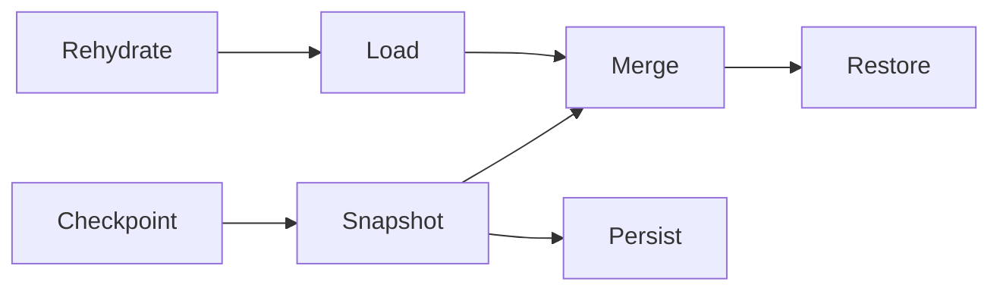

# [APPUI_SCREENS_ACTIVATION]

Rasm.AppUi screens are catalog rows over one activatable base: a frozen `ScreenCatalog` table is the single derivation source for dockables, window titles, automation names, route keys, and headless proof lanes, while `ScreenBase` owns activation scopes, suspend/resume, the one screen fault fold, paced derived state, the `Validation<Error,T>` lift into ReactiveUI.Validation, and per-surface state snapshots. The page owns the catalog axis, the activation capsule, the derived-state and validation rails, and the snapshot law, composing AppHost `ClockPolicy`, `RuntimePhase`, `UiSchedulerPort`, `DrainParticipantPort`, `TelemetryContributorPort`, and `DrainBand` over ReactiveUI, System.Reactive, LanguageExt rails, and NodaTime instants.

## [01]-[INDEX]

- [01]-[SCREEN_CATALOG]: One frozen row table; every screen derivation folds over it.
- [02]-[ACTIVATION_SCOPES]: One activatable base; scoped disposal, suspend/resume, drain row.
- [03]-[DERIVED_STATE]: OAPH derivations, paced streams, one screen fault fold.
- [04]-[VALIDATION_UX]: One typed-rail lift into ReactiveUI.Validation rule rows.
- [05]-[SCREEN_STATE]: Per-surface snapshots; restore-on-activate merge; checkpoint law.
- [06]-[CONTROL_STREAM]: A screen body is a control-intent stream materialized through `ControlFactory`, not a XAML literal.

## [02]-[SCREEN_CATALOG]

- Owner: `ScreenCatalogRow` row record; `ScreenCatalog` frozen table with total projections.
- Entry: `public static Fin<ScreenCatalog> Freeze(params ReadOnlySpan<ScreenCatalogRow> rows)` — `Fin` aborts on a duplicate row id.
- Auto: dock factories, window titles, palette listings, automation names, and headless proof specs derive as folds over `Rows` — zero per-derivation registries; `IViewFor<TViewModel>` views register through `RegisterViews(m => m.Map<TViewModel, TView>())` on the ReactiveUI builder at the composition root (the catalog-verified spelling — `RegisterView<...>` does not exist), one registration per catalog row.
- Packages: ReactiveUI, LanguageExt.Core, BCL inbox
- Growth: one catalog row carries screen, dockable, title, automation name, headless proof, and the generative control-intent body; zero new surface.
- Boundary: `Key` is the one identity cell; `Id`, `RouteKey`, `AutomationName`, and `IconKey` are derived members, while `Title` resolves from the same key through the composition-bound label column. Deep links, remote invocation, dock identity, automation, palette listings, and proof names therefore cannot drift by independently authored literals; the shell route index is itself a roster projection — `Shell/navigation.md` `ShellRoot.Freeze` folds `Rows` onto `RouteKey`, never an independent route-pair sequence. `TitleRole` remains an orthogonal typography policy, `Surface` is the single per-host admission gate, and `ProofLane` is the proof policy. A per-screen base-class family is rejected; `Body` projects the screen model onto the one `ControlIntent` vocabulary and crosses the `ControlIntentWire` seam unchanged.

```csharp signature
public sealed record ScreenCatalogRow(
    string Key,
    Func<string, string> Label,
    string TitleRole,
    ProofLane Proof,
    Func<SurfaceHost, bool> Surface,
    Func<string, ScreenBase> Model,
    Func<ScreenBase, ControlIntent> Body) {
    public string Id => Key;
    public string RouteKey => Key;
    public string AutomationName => Key;
    public string IconKey => $"{Key}.icon";
    public string Title => Label($"{Key}.title");
}

[SmartEnum<string>]
public sealed partial class ProofLane {
    public static readonly ProofLane Interactive = new("interactive", headless: false);
    public static readonly ProofLane Headless = new("headless", headless: true);

    public bool Headless { get; }
}

public sealed record ScreenCatalog(FrozenDictionary<string, ScreenCatalogRow> Rows) {
    public Seq<ScreenCatalogRow> HeadlessLane => toSeq(Rows.Values).Filter(static row => row.Proof.Headless);

    public static Fin<ScreenCatalog> Freeze(params ReadOnlySpan<ScreenCatalogRow> rows) =>
        Build(toSeq(rows.ToArray()));

    public Option<ScreenCatalogRow> Resolve(string id) =>
        Rows.TryGetValue(id, out ScreenCatalogRow? row) ? Some(row) : None;

    public Seq<ScreenCatalogRow> For(SurfaceHost host) =>
        toSeq(Rows.Values).Filter(row => row.Surface(host));

    // The fault names the offending key: the first id declared more than once rides the DuplicateId
    // detail — CountBy folds per key in one pass where GroupBy materialized every group.
    private static Fin<ScreenCatalog> Build(Seq<ScreenCatalogRow> rows) =>
        Optional(rows.Map(static row => row.Id).AsEnumerable()
                .CountBy(identity, StringComparer.Ordinal)
                .Where(static entry => entry.Value > 1)
                .Select(static entry => entry.Key)
                .FirstOrDefault())
            .Match(
                Some: duplicate => Fin<ScreenCatalog>.Fail(new ScreenFault.DuplicateId(duplicate)),
                None: () => Fin<ScreenCatalog>.Succ(new(rows.ToFrozenDictionary(static row => row.Id, static row => row, StringComparer.Ordinal))));
}
```

## [03]-[ACTIVATION_SCOPES]

- Owner: `ScreenRuntime` policy record; `ScreenBase` activation capsule.
- Entry: `public IDisposable BindActivation(IObservable<bool> visible, UiSchedulerPort scheduler)` — visibility edges and phase receipts fold into one activate/suspend rail.
- Auto: `WhenActivated` composes rehydration, the per-screen `Wire` pipelines, and a closing disposal that checkpoints state and emits the disposal evidence; `DrainRow` registers the screens teardown as one `DrainParticipantPort` row; the draining phase receipt suspends every bound screen through the same `Suspend` path; `ScreenInteraction<TInput,TOutput>` counts its registrations so a deep-link or modal route gates on `Reachable` — a counted-value presence check — before navigating, never on a caught unhandled-interaction throw.
- Receipt: disposal evidence — row id, active `Duration`, disposable count — through `ScreenRuntime.Disposed` into the evidence stream bound at composition; `TelemetryRow` contributes the activation and suspend counts plus the per-screen disposables levels inward through the AppHost `TelemetryContributorPort`, the keyed family swapped by the evidence fan's disposal arm.
- Packages: ReactiveUI, System.Reactive, LanguageExt.Core, NodaTime, Rasm.AppHost (project)
- Growth: one screen is one `ScreenBase` subclass expression body plus one catalog row, and one screen instrument is one `InstrumentRow` on `ScreenBase.TelemetryRow`; zero new surface.
- Boundary: `ScreenBase` is the named boundary capsule for the statement carve-out — activation wiring, visibility subscription, and disposal registration carry language-owned statement forms while every other member stays expression-shaped; `ViewModelActivator` ref-counts through `Interlocked` increments — activation fires only on the zero-to-one edge and `Deactivate` decrements symmetrically — so concurrent visibility-driven suspension and view-driven activation compose without a second guard; AutoSuspendHelper and RxApp.SuspensionHost are the deleted patterns, suspension rides the state checkpoint plus the visibility fold; view-model questions ride `ScreenInteraction<TInput,TOutput>` — `Register` is the one registration verb, wrapping the base `RegisterHandler` with an `Interlocked` count whose disposal decrements, so `Reachable` is a value check and never an exception probe, and a handler registered through the base `RegisterHandler` bypasses the count and is the rejected form; the drain row registers rank 10 — the one rank literal here — ordering screen teardown first inside `DrainBand.Interaction`; `Throttle` arrives on `ScreenRuntime` from the motion timing rows, so the fences carry zero duration literals.

```csharp signature
public sealed record ScreenRuntime(
    ClockPolicy Clocks,
    ScreenStatePolicy State,
    Func<string, Duration, int, IO<Unit>> Disposed,
    Duration Throttle);

public abstract class ScreenBase : ReactiveObject, IActivatableViewModel, IValidatableViewModel {
    private long mark;
    private Option<ScreenIncident> fault = None;

    protected ScreenBase(ScreenCatalogRow row, string surface, ScreenRuntime runtime) {
        Row = row;
        Surface = surface;
        Runtime = runtime;
        this.WhenActivated(Scope);
    }

    public ScreenCatalogRow Row { get; }
    public string Surface { get; }
    public ScreenRuntime Runtime { get; }
    public ViewModelActivator Activator { get; } = new();
    public ValidationContext Rules { get; } = new();
    public Option<ScreenIncident> Fault { get => fault; private set => this.RaiseAndSetIfChanged(ref fault, value); }

    IValidationContext IValidatableViewModel.ValidationContext => Rules;

    public virtual Func<string, bool> Alive => static _ => true;

    public abstract ScreenState Snapshot();

    public abstract Unit Restore(ScreenState merged);

    protected abstract Seq<IDisposable> Wire();

    public IDisposable BindActivation(IObservable<bool> visible, UiSchedulerPort scheduler) {
        IDisposable phased = scheduler.Phases(receipt => ignore(receipt.To == RuntimePhase.Draining ? Run("drain", Suspend()) : unit));
        IDisposable sighted = visible.DistinctUntilChanged().Subscribe(open => ignore(open ? ignore(Activator.Activate()) : Run("visibility", Suspend())));
        return new CompositeDisposable(phased, sighted);
    }

    public IO<Unit> Suspend() =>
        this.Checkpoint().Bind(_ => IO.lift(fun(() => Activator.Deactivate())));

    public const string ActivatedInstrument = "rasm.appui.screen.activated";
    public const string SuspendedInstrument = "rasm.appui.screen.suspended";
    public const string DisposablesInstrument = "rasm.appui.screen.disposables";

    public static TelemetryContributorPort TelemetryRow(LevelCells cells, string version, string schemaUrl) =>
        AppUiTelemetry.Contribute(version, schemaUrl,
            new(ActivatedInstrument, InstrumentKind.Count, "{activation}", "screen activations by screen id"),
            new(SuspendedInstrument, InstrumentKind.Count, "{suspension}", "screen suspensions by trigger"),
            new(DisposablesInstrument, InstrumentKind.Levels, "{disposable}", "live disposables by screen id",
                Levels: cells.Reader(DisposablesInstrument, "screen")));

    public static DrainParticipantPort DrainRow(Func<Seq<ScreenBase>> active) =>
        new("screens", DrainBand.Interaction, 10, token => active().TraverseM(static screen => screen.Suspend()).As().Map(static _ => unit));

    internal Unit Commit(ScreenIncident failure) => ignore(Fault = Some(failure));

    private IEnumerable<IDisposable> Scope() {
        mark = Runtime.Clocks.Mark();
        ignore(Run("rehydrate", this.Rehydrate()));
        Seq<IDisposable> wired = Wire();
        return wired.Add(Disposable.Create(() =>
            ignore(Run("checkpoint", this.Checkpoint().Bind(_ => Runtime.Disposed(Row.Id, Runtime.Clocks.Elapsed(mark), wired.Count + 1))))));
    }

    private Unit Run(string source, IO<Unit> effect) =>
        effect.Run().Match(
            Succ: static _ => unit,
            Fail: failure => Commit(new ScreenIncident(Row.Id, new ScreenFault.Thrown(source, failure.Message), Runtime.Clocks.Now, source)));
}

public sealed class ScreenInteraction<TInput, TOutput>(IScheduler? scheduler = null) : Interaction<TInput, TOutput>(scheduler) {
    private int handlers;

    public bool Reachable => Volatile.Read(ref handlers) > 0;

    // The one registration verb: the count and the base registration dispose together, so Reachable is
    // a value check; a base RegisterHandler call bypasses the count and is the rejected form.
    public IDisposable Register(Func<IInteractionContext<TInput, TOutput>, Task> handler) {
        IDisposable registration = RegisterHandler(handler);
        ignore(Interlocked.Increment(ref handlers));
        return Disposable.Create(() => {
            ignore(Interlocked.Decrement(ref handlers));
            registration.Dispose();
        });
    }
}
```

## [04]-[DERIVED_STATE]

- Owner: `ScreenFault` — the typed fault family on the `AppUiFaultBand.Screen` registry row (6080); `ScreenIncident` — the fault-cell state record (who, when, which typed fault); `DerivedOps` extension fold over `ScreenBase`.
- Entry: `public ObservableAsPropertyHelper<T> Derive<T>(IObservable<T> source, Expression<Func<TScreen,T>> property, IScheduler scheduler, T initial)` — one paced OAPH row per derived property with the target member carried as a checked expression rather than a reflection string.
- Auto: `WhenAnyValue` and `SubscribeToExpressionChain` streams feed `Derive`; `FoldFaults` merges command and pipeline `ThrownExceptions` through the one `ScreenFault.Thrown` conversion into the `Fault` cell; `RaiseAndSetIfChanged` publishes the fault transition to bound views.
- Packages: ReactiveUI, System.Reactive, LanguageExt.Core, NodaTime
- Growth: one OAPH row per derived property and one merged stream per fault source; zero new surface.
- Boundary: per-control exception handling is the deleted pattern — `Fault` is the single screen failure surface, and the error dialog row and the evidence stream both consume it through composition-bound delegates; the `IScheduler` parameter arrives from the surface scheduler boundary and applies once per pipeline, never per operator; `Calm` pins the operator order — distinct before throttle — so burst sources collapse before pacing.

```csharp signature
[Union(ConversionFromValue = ConversionOperatorsGeneration.None)]
public abstract partial record ScreenFault : Expected {
    private ScreenFault(string detail, int code) : base(detail, code) { }
    public sealed record DuplicateId(string Detail)
        : ScreenFault($"screen/duplicate: {Detail}", AppUiFaultBand.Screen.Code(0));
    public sealed record Thrown(string Source, string Reason)
        : ScreenFault($"screen/thrown: {Source}: {Reason}", AppUiFaultBand.Screen.Code(1));
    public sealed record StateRejected(string Reason)
        : ScreenFault($"screen/state: {Reason}", AppUiFaultBand.Screen.Code(2));
}

public readonly record struct ScreenIncident(string ScreenId, ScreenFault Evidence, Instant At, string Source);

public static class DerivedOps {
    extension<TScreen>(TScreen screen) where TScreen : ScreenBase {
        public IObservable<T> Calm<T>(IObservable<T> source, IScheduler scheduler) =>
            source.DistinctUntilChanged().Throttle(screen.Runtime.Throttle.ToTimeSpan(), scheduler);

        public ObservableAsPropertyHelper<T> Derive<T>(IObservable<T> source, Expression<Func<TScreen, T>> property, IScheduler scheduler, T initial) =>
            screen.Calm(source, scheduler).ToProperty(screen, property, initial);

        public IDisposable FoldFaults(string source, params ReadOnlySpan<IObservable<Exception>> streams) =>
            Observable.Merge(streams.ToArray()).Subscribe(failure =>
                screen.Commit(new ScreenIncident(screen.Row.Id, new ScreenFault.Thrown(source, failure.Message), screen.Runtime.Clocks.Now, source)));
    }
}
```

## [05]-[VALIDATION_UX]

- Owner: `AdmissionState` validation state value; `ScreenValidation` lift surface.
- Entry: `public ValidationHelper Admit<TValue>(Expression<Func<TScreen, TValue>> property, IObservable<Validation<Error, TValue>> admissions)` — the one admission seam from the typed rail into rule rows; `AdmitCross<TValue>(IObservable<Validation<Error, TValue>> admissions)` lands the same typed rail on the context-level `ValidationRule` overload for cross-field invariants spanning two or more properties.
- Auto: `Gate` projects `IsValid` into the availability delegate column consumed by the command table; `BindValidation` renders rule text view-side through the one `Formatter` policy with error styling from theme tokens; `FieldErrors` projects per-property text from `ReactiveValidationObject.GetErrors`/`ErrorsChanged` into the field-adorner stream, so context-level validity feeds the command gate while property-level text feeds the adorner — one context, two read altitudes.
- Packages: ReactiveUI.Validation, ReactiveUI, System.Reactive, LanguageExt.Core
- Growth: one rule row per validated property; zero new surface.
- Boundary: the lift is the single validation vocabulary — a second rule rail beside `Validation<Error,T>` is the rejected form, and domain factories keep emitting the typed rail untouched; `Admit` lands on the `ValidationRule(Expression, IObservable<IValidationState>)` overload and `AdmitCross` on the context-level `ValidationRule(IObservable<IValidationState>)` overload, so a cross-field invariant is one rule row spanning every contributing property rather than a duplicated per-property rule, and the cross-field state feeds the same `Gate` context-validity stream the command table reads; `ValidationContext` activation is internal and `_isActive`-guarded, so repeated activation scopes never duplicate rule subscriptions; fail text crosses as typed `IValidationText` through `SingleLineFormatter`, never freeform string side channels; `FieldErrors` reads the `INotifyDataErrorInfo` bridge `ReactiveValidationObject` exposes — `GetErrors` for the current property set, `ErrorsChanged` for the edge — and the platform error-adorner contract is itself string-typed, so the projection takes the `INotifyDataErrorInfo` string seam fail-closed through `OfType<string>` rather than casting, the one place the typed `IValidationText` lands on the host's string adorner channel; a hand-wired per-control error handler is the deleted pattern and the adorner never re-runs validation logic; `Rules` activates inside the activation scope, so rule subscriptions share screen disposal.

```csharp signature
public readonly record struct AdmissionState(bool IsValid, IValidationText Text) : IValidationState;

public static class ScreenValidation {
    public static IValidationTextFormatter<string> Formatter => SingleLineFormatter.Default;

    public static IObservable<IValidationState> States<TValue>(IObservable<Validation<Error, TValue>> admissions) =>
        admissions.Select(static outcome => (IValidationState)new AdmissionState(
            outcome.IsSuccess,
            ValidationText.Create(outcome.Case is Error error ? error.Message : string.Empty)));

    extension<TScreen>(TScreen screen) where TScreen : ScreenBase {
        public ValidationHelper Admit<TValue>(Expression<Func<TScreen, TValue>> property, IObservable<Validation<Error, TValue>> admissions) =>
            screen.ValidationRule(property, States(admissions));

        public ValidationHelper AdmitCross<TValue>(IObservable<Validation<Error, TValue>> admissions) =>
            screen.ValidationRule(States(admissions));

        public IObservable<bool> Gate() => screen.IsValid();
    }

    public static IObservable<Seq<string>> FieldErrors(ReactiveValidationObject screen, string property) =>
        Observable.FromEventPattern<DataErrorsChangedEventArgs>(
                handler => screen.ErrorsChanged += handler,
                handler => screen.ErrorsChanged -= handler)
            .Where(change => string.Equals(change.EventArgs.PropertyName, property, StringComparison.Ordinal))
            .StartWith((EventPattern<DataErrorsChangedEventArgs>?)null)
            .Select(_ => toSeq(screen.GetErrors(property).OfType<string>()));
}
```

## [06]-[SCREEN_STATE]

- Owner: `ScreenState` snapshot record; `ScreenStatePolicy` port delegates; `ScreenStateOps` extension fold.
- Entry: `public IO<Unit> Rehydrate()` — restore-on-activate; the persisted row merges with the live snapshot through `Merge`.
- Auto: `Checkpoint` fires on deactivation, visibility suspension, and the drain row through the same `Persist` delegate; the partition key is row id plus `Surface`, so panel, window, and headless sessions never collide.
- Receipt: the `ScreenState` row is the snapshot artifact — `Instant`-stamped and `Version`-carrying, the same record the support-bundle screen-state contribution captures.
- Packages: LanguageExt.Core, NodaTime, BCL inbox
- Growth: one `ScreenState` field row per new state axis with a `Version` bump; zero new surface.
- Boundary: persistence crosses only through `ScreenStatePolicy` delegates bound at composition to the Persistence snapshot vocabulary — no store type enters the fences; `Merge` keeps live rows authoritative for existence while persisted filter, scroll, expansion, and selection survive the `alive` prune; the `Alive` predicate defaults open and a screen narrows it when row existence is knowable at activation; a second suspension driver beside the checkpoint law is the rejected form.

```csharp signature
public sealed record ScreenStatePolicy(
    Func<string, string, IO<Option<ScreenState>>> Load,
    Func<ScreenState, Validation<Error, ScreenState>> Admit,
    Func<ScreenState, IO<Unit>> Persist);

public sealed record ScreenState(
    string ScreenId,
    string Surface,
    Seq<string> Selection,
    double Scroll,
    Option<string> Filter,
    Set<string> Expansion,
    Instant At,
    int Version) {
    public static ScreenState Merge(ScreenState persisted, ScreenState live, Func<string, bool> alive) =>
        live with {
            Selection = persisted.Selection.Filter(alive),
            Scroll = persisted.Scroll,
            Filter = persisted.Filter,
            Expansion = persisted.Expansion.Filter(alive),
        };
}

public static class ScreenStateOps {
    extension(ScreenBase screen) {
        public IO<Unit> Rehydrate() =>
            screen.Runtime.State.Load(screen.Row.Id, screen.Surface)
                .Map(found => found
                    .Map(persisted => screen.Runtime.State.Admit(persisted).Match(
                        Succ: admitted => screen.Restore(ScreenState.Merge(admitted, screen.Snapshot(), screen.Alive)),
                        Fail: errors => screen.Commit(new ScreenIncident(
                            screen.Row.Id,
                            new ScreenFault.StateRejected(string.Join("; ", errors.Map(static error => error.Message))),
                            screen.Runtime.Clocks.Now,
                            "rehydrate"))))
                    .IfNone(unit));

        public IO<Unit> Checkpoint() =>
            screen.Runtime.State.Persist(screen.Snapshot());
    }
}
```



## [07]-[CONTROL_STREAM]

- Owner: `ScreenWire` the screen control-intent stream extension over `ScreenBase`; `ScreenBody` the materialized root the activation scope mounts.
- Entry: `public IObservable<ControlIntent> Wire(IScheduler scheduler)` — composes the catalog row's `Body` projection into a live control-intent stream: the mount emission fires at subscription and every screen property edge re-projects the body, paced through the runtime throttle; `public Fin<Control> Compose(ControlIntent intent, MaterializeContext context, RecycleScope recycle)` — materializes the current intent tree through `ControlFactory` into the mounted root, recycling realized controls across re-emits.
- Auto: `ScreenCatalogRow.Body` projects the screen's model onto one `ControlIntent` tree (`Shell/controls`), so a `ScreenCatalog` row carries its whole body as a generative intent rather than a per-screen XAML literal — the XAML-literal screen body is deleted across the frozen-row table; the intent stream re-emits on the screen's `ReactiveObject.Changed` property edges — every `RaiseAndSetIfChanged` write is a re-projection edge, throttled so a burst of edges collapses to one re-materialize — and a one-shot `Observable.Return` projection dressed as a state stream is the rejected form; the materialized root mounts at the surface root where `AccessOps.Identify` applies the catalog automation identity, so the screen's automation name and the control-intent automation names compose one tree.
- Packages: ReactiveUI, System.Reactive, Avalonia, LanguageExt.Core
- Growth: a screen is one `ScreenBase` subclass plus one catalog row whose `Body` names its control-intent tree; a new control on a screen is one intent in the tree, never a XAML edit; zero new surface.
- Boundary: the screen body is the one `ControlIntent` tree materialized through `ControlFactory` — a per-screen compiled-XAML view class is the deleted body form (the view still enters the tree through its `Configure<TApp>` shell host, but the screen content is the materialized intent tree, not a hand-authored XAML literal), so the `[05]-[PROHIBITIONS]` parallel-control-framework clause holds and `ControlFactory` is the only materialization path; the intent stream paces through the runtime throttle alone — `Calm`'s distinct gate is wrong over unit-shaped edges, so `Wire` throttles the `Changed` edge stream directly and a burst model change collapses before re-materialize; control recycling rides the `RecycleScope` pool over the `VirtualWindow` window so a windowed screen recycles its realized controls; the body crosses the `ControlIntentWire` seam unchanged, so the same screen materializes on the web head; binding stays `BehaviorRail.Intent`-only through the materialize fold, so a screen body names no `ICommand` call site and a `BindCommand` in a screen is the deleted form.

```csharp signature
public sealed record ScreenBody(Control Root, RecycleScope Recycle);

public static class ScreenWire {
    extension(ScreenBase screen) {
        // Changed is the re-projection edge stream; StartWith AFTER the throttle keeps the mount
        // emission immediate while property bursts still collapse to one re-materialize.
        public IObservable<ControlIntent> Wire(IScheduler scheduler) =>
            screen.Changed.Select(static _ => unit)
                .Throttle(screen.Runtime.Throttle.ToTimeSpan(), scheduler)
                .StartWith(unit)
                .Select(_ => screen.Row.Body(screen));

        public Fin<Control> Compose(ControlIntent intent, MaterializeContext context, RecycleScope recycle) =>
            recycle.Realize(intent, context);
    }
}
```

## [08]-[RESEARCH]

(none)
