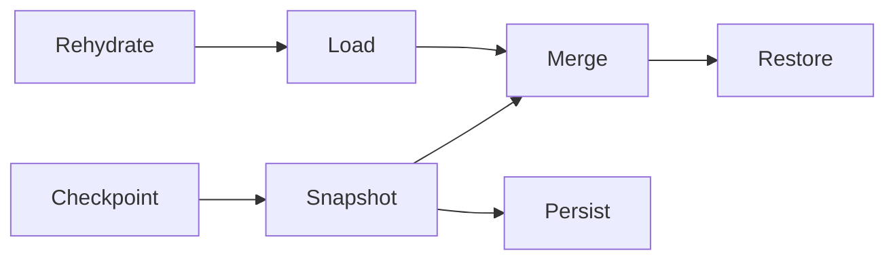

# [APPUI_SCREENS_ACTIVATION]

Rasm.AppUi screens are catalog rows over one activatable base: a frozen `ScreenCatalog` table is the single derivation source for dockables, window titles, automation names, route keys, and headless proof lanes, while `ScreenBase` owns activation scopes, suspend/resume, the one screen fault fold, paced derived state, the `Validation<Error,T>` lift into ReactiveUI.Validation, and per-surface state snapshots. The page owns the catalog axis, the activation capsule, the derived-state and validation rails, and the snapshot law, composing AppHost `ClockPolicy`, `RuntimePhase`, `UiSchedulerPort`, `DrainParticipantPort`, `TelemetryContributorPort`, and `DrainBand` over ReactiveUI, System.Reactive, LanguageExt rails, and NodaTime instants.

## [01]-[INDEX]

- [01]-[SCREEN_CATALOG]: One frozen row table; every screen derivation folds over it.
- [02]-[ACTIVATION_SCOPES]: One activatable base; scoped disposal, suspend/resume, drain row.
- [03]-[DERIVED_STATE]: OAPH derivations, paced streams, one screen fault fold.
- [04]-[VALIDATION_UX]: One typed-rail lift into ReactiveUI.Validation rule rows.
- [05]-[SCREEN_STATE]: Per-surface snapshots; restore-on-activate merge; checkpoint law.
- [06]-[CONTROL_STREAM]: A screen body is a control-intent stream materialized through `ControlFactory`, not a XAML literal.

## [02]-[SCREEN_CATALOG]

- Owner: `ScreenCatalogRow` row record; `ScreenCatalog` frozen table with total projections.
- Entry: `public static Fin<ScreenCatalog> Freeze(params ReadOnlySpan<ScreenCatalogRow> rows)` — `Fin` aborts on a duplicate row id.
- Auto: dock factories, window titles, palette listings, automation names, and headless proof specs derive as folds over `Rows` — zero per-derivation registries; `IViewFor<TViewModel>` views register through `RegisterView` on the ReactiveUI builder at the composition root, one registration per catalog row.
- Packages: ReactiveUI, LanguageExt.Core, BCL inbox
- Growth: one catalog row carries screen, dockable, title, automation name, headless proof, and the generative control-intent body; zero new surface.
- Boundary: `Id`, `RouteKey`, `IconKey`, and `TitleRole` cells are string-serializable symbols — the route key crosses deep links and remote invocation unchanged, the title-role and icon cells resolve against the typography-role and icon-key vocabularies at render, and `Surface` is the single per-host admission gate; the `AutomationName`, `HeadlessProof`, and `Surface` columns are the one derivation source for accessibility names and headless proof lanes; a per-screen base-class family is the rejected form; the `Body` column is the generative control-intent body — a `Func<ScreenBase, ControlIntent>` projecting the screen's model onto the one `ControlIntent` vocabulary (`Shell/controls`) materialized through `ControlFactory`, so a screen is authored as a control-intent stream and a per-screen XAML literal body is the deleted form, the body crossing the `ControlIntentWire` seam unchanged so a web/remote caller materializes the same screen the desktop renders.

```csharp signature
public sealed record ScreenCatalogRow(
    string Id,
    string Title,
    string TitleRole,
    string IconKey,
    string RouteKey,
    string AutomationName,
    bool HeadlessProof,
    Func<SurfaceHost, bool> Surface,
    Func<string, ScreenBase> Model,
    Func<ScreenBase, ControlIntent> Body);

public sealed record ScreenCatalog(FrozenDictionary<string, ScreenCatalogRow> Rows) {
    public Seq<ScreenCatalogRow> HeadlessLane => toSeq(Rows.Values).Filter(static row => row.HeadlessProof);

    public static Fin<ScreenCatalog> Freeze(params ReadOnlySpan<ScreenCatalogRow> rows) =>
        Build(toSeq(rows.ToArray()));

    public Option<ScreenCatalogRow> Resolve(string id) =>
        Rows.TryGetValue(id, out var row) ? Some(row) : None;

    public Seq<ScreenCatalogRow> For(SurfaceHost host) =>
        toSeq(Rows.Values).Filter(row => row.Surface(host));

    static Fin<ScreenCatalog> Build(Seq<ScreenCatalogRow> rows) =>
        rows.Map(static row => row.Id).Distinct().Count == rows.Count
            ? Fin<ScreenCatalog>.Succ(new(rows.ToFrozenDictionary(static row => row.Id, static row => row, StringComparer.Ordinal)))
            : Fin<ScreenCatalog>.Fail(Error.New("duplicate screen catalog id"));
}
```

## [03]-[ACTIVATION_SCOPES]

- Owner: `ScreenRuntime` policy record; `ScreenBase` activation capsule.
- Entry: `public IDisposable BindActivation(IObservable<bool> visible, UiSchedulerPort scheduler)` — visibility edges and phase receipts fold into one activate/suspend rail.
- Auto: `WhenActivated` composes rehydration, the per-screen `Wire` pipelines, and a closing disposal that checkpoints state and emits the disposal evidence; `DrainRow` registers the screens teardown as one `DrainParticipantPort` row; the draining phase receipt suspends every bound screen through the same `Suspend` path; `Reachable` probes `Interaction.GetHandlers` so a deep-link or modal route gates on registered handler presence before navigating, never on a caught unhandled-interaction throw.
- Receipt: disposal evidence — row id, active `Duration`, disposable count — through `ScreenRuntime.Disposed` into the evidence stream bound at composition; `TelemetryRow` contributes the activation and suspend instruments inward through the AppHost `TelemetryContributorPort`.
- Packages: ReactiveUI, System.Reactive, LanguageExt.Core, NodaTime, Rasm.AppHost (project)
- Growth: one screen is one `ScreenBase` subclass expression body plus one catalog row, and one screen instrument is one `InstrumentRow` on `ScreenBase.TelemetryRow`; zero new surface.
- Boundary: `ScreenBase` is the named boundary capsule for the statement carve-out — activation wiring, visibility subscription, and disposal registration carry language-owned statement forms while every other member stays expression-shaped; `ViewModelActivator` ref-counts through `Interlocked` increments — activation fires only on the zero-to-one edge and `Deactivate` decrements symmetrically — so concurrent visibility-driven suspension and view-driven activation compose without a second guard; AutoSuspendHelper and RxApp.SuspensionHost are the deleted patterns, suspension rides the state checkpoint plus the visibility fold; view-model questions ride `Interaction<TInput,TOutput>` and `Reachable` reads its `GetHandlers` count so deep-link gating stays a value check, never an exception probe; the drain row registers rank 10 — the one rank literal here — ordering screen teardown first inside `DrainBand.Interaction`; `Throttle` arrives on `ScreenRuntime` from the motion timing rows, so the fences carry zero duration literals.

```csharp signature
public sealed record ScreenRuntime(
    ClockPolicy Clocks,
    ScreenStatePolicy State,
    Func<string, Duration, int, IO<Unit>> Disposed,
    Duration Throttle);

public abstract class ScreenBase : ReactiveObject, IActivatableViewModel, IValidatableViewModel {
    long mark;
    Option<ScreenFault> fault = None;

    protected ScreenBase(ScreenCatalogRow row, string surface, ScreenRuntime runtime) {
        Row = row;
        Surface = surface;
        Runtime = runtime;
        this.WhenActivated(Scope);
    }

    public ScreenCatalogRow Row { get; }
    public string Surface { get; }
    public ScreenRuntime Runtime { get; }
    public ViewModelActivator Activator { get; } = new();
    public ValidationContext Rules { get; } = new();
    public Option<ScreenFault> Fault { get => fault; private set => this.RaiseAndSetIfChanged(ref fault, value); }

    IValidationContext IValidatableViewModel.ValidationContext => Rules;

    public virtual Func<string, bool> Alive => static _ => true;

    public abstract ScreenState Snapshot();

    public abstract Unit Restore(ScreenState merged);

    protected abstract Seq<IDisposable> Wire();

    public IDisposable BindActivation(IObservable<bool> visible, UiSchedulerPort scheduler) {
        var phased = scheduler.Phases(receipt => ignore(receipt.To == RuntimePhase.Draining ? Suspend().Run() : unit));
        var sighted = visible.DistinctUntilChanged().Subscribe(open => ignore(open ? ignore(Activator.Activate()) : Suspend().Run()));
        return new CompositeDisposable(phased, sighted);
    }

    public IO<Unit> Suspend() =>
        this.Checkpoint().Bind(_ => IO.lift(fun(() => Activator.Deactivate())));

    public static bool Reachable<TInput, TOutput>(Interaction<TInput, TOutput> question) =>
        question.GetHandlers().Any();

    public const string ActivatedInstrument = "rasm.appui.screen.activated";
    public const string SuspendedInstrument = "rasm.appui.screen.suspended";

    public static TelemetryContributorPort TelemetryRow(string version) =>
        AppUiTelemetry.Contribute(version, ActivatedInstrument, SuspendedInstrument);

    public static DrainParticipantPort DrainRow(Func<Seq<ScreenBase>> active) =>
        new("screens", DrainBand.Interaction, 10, token => active().TraverseM(static screen => screen.Suspend()).As().Map(static _ => unit));

    internal Unit Commit(ScreenFault failure) => ignore(Fault = Some(failure));

    IEnumerable<IDisposable> Scope() {
        mark = Runtime.Clocks.Mark();
        ignore(this.Rehydrate().Run());
        var wired = Wire();
        return wired.Add(Disposable.Create(() =>
            ignore(this.Checkpoint().Bind(_ => Runtime.Disposed(Row.Id, Runtime.Clocks.Elapsed(mark), wired.Count + 1)).Run())));
    }
}
```

## [04]-[DERIVED_STATE]

- Owner: `ScreenFault` state record; `DerivedOps` extension fold over `ScreenBase`.
- Entry: `public ObservableAsPropertyHelper<T> Derive<T>(IObservable<T> source, string property, IScheduler scheduler, T initial)` — one paced OAPH row per derived property.
- Auto: `WhenAnyValue` and `SubscribeToExpressionChain` streams feed `Derive`; `FoldFaults` merges command and pipeline `ThrownExceptions` into the one `Fault` cell; `RaiseAndSetIfChanged` publishes the fault transition to bound views.
- Packages: ReactiveUI, System.Reactive, LanguageExt.Core, NodaTime
- Growth: one OAPH row per derived property and one merged stream per fault source; zero new surface.
- Boundary: per-control exception handling is the deleted pattern — `Fault` is the single screen failure surface, and the error dialog row and the evidence stream both consume it through composition-bound delegates; the `IScheduler` parameter arrives from the surface scheduler boundary and applies once per pipeline, never per operator; `Calm` pins the operator order — distinct before throttle — so burst sources collapse before pacing.

```csharp signature
public readonly record struct ScreenFault(string ScreenId, Error Evidence, Instant At, string Source);

public static class DerivedOps {
    extension(ScreenBase screen) {
        public IObservable<T> Calm<T>(IObservable<T> source, IScheduler scheduler) =>
            source.DistinctUntilChanged().Throttle(screen.Runtime.Throttle.ToTimeSpan(), scheduler);

        public ObservableAsPropertyHelper<T> Derive<T>(IObservable<T> source, string property, IScheduler scheduler, T initial) =>
            screen.Calm(source, scheduler).ToProperty(screen, property, initial);

        public IDisposable FoldFaults(string source, params ReadOnlySpan<IObservable<Exception>> streams) =>
            Observable.Merge(streams.ToArray()).Subscribe(failure =>
                screen.Commit(new ScreenFault(screen.Row.Id, Error.New(failure), screen.Runtime.Clocks.Now, source)));
    }
}
```

## [05]-[VALIDATION_UX]

- Owner: `AdmissionState` validation state value; `ScreenValidation` lift surface.
- Entry: `public ValidationHelper Admit<TValue>(Expression<Func<TScreen, TValue>> property, IObservable<Validation<Error, TValue>> admissions)` — the one admission seam from the typed rail into rule rows; `AdmitCross<TValue>(IObservable<Validation<Error, TValue>> admissions)` lands the same typed rail on the context-level `ValidationRule` overload for cross-field invariants spanning two or more properties.
- Auto: `Gate` projects `IsValid` into the availability delegate column consumed by the command table; `BindValidation` renders rule text view-side through the one `Formatter` policy with error styling from theme tokens; `FieldErrors` projects per-property text from `ReactiveValidationObject.GetErrors`/`ErrorsChanged` into the field-adorner stream, so context-level validity feeds the command gate while property-level text feeds the adorner — one context, two read altitudes.
- Packages: ReactiveUI.Validation, ReactiveUI, System.Reactive, LanguageExt.Core
- Growth: one rule row per validated property; zero new surface.
- Boundary: the lift is the single validation vocabulary — a second rule rail beside `Validation<Error,T>` is the rejected form, and domain factories keep emitting the typed rail untouched; `Admit` lands on the `ValidationRule(Expression, IObservable<IValidationState>)` overload and `AdmitCross` on the context-level `ValidationRule(IObservable<IValidationState>)` overload, so a cross-field invariant is one rule row spanning every contributing property rather than a duplicated per-property rule, and the cross-field state feeds the same `Gate` context-validity stream the command table reads; `ValidationContext` activation is internal and `_isActive`-guarded, so repeated activation scopes never duplicate rule subscriptions; fail text crosses as typed `IValidationText` through `SingleLineFormatter`, never freeform string side channels; `FieldErrors` reads the `INotifyDataErrorInfo` bridge `ReactiveValidationObject` exposes — `GetErrors` for the current property set, `ErrorsChanged` for the edge — and the platform error-adorner contract is itself string-typed, so the projection takes the `INotifyDataErrorInfo` string seam fail-closed through `OfType<string>` rather than casting, the one place the typed `IValidationText` lands on the host's string adorner channel; a hand-wired per-control error handler is the deleted pattern and the adorner never re-runs validation logic; `Rules` activates inside the activation scope, so rule subscriptions share screen disposal.

```csharp signature
public readonly record struct AdmissionState(bool IsValid, IValidationText Text) : IValidationState;

public static class ScreenValidation {
    public static IValidationTextFormatter<string> Formatter => SingleLineFormatter.Default;

    public static IObservable<IValidationState> States<TValue>(IObservable<Validation<Error, TValue>> admissions) =>
        admissions.Select(static outcome => (IValidationState)new AdmissionState(
            outcome.IsSuccess,
            ValidationText.Create(outcome.Case is Error error ? error.Message : string.Empty)));

    extension<TScreen>(TScreen screen) where TScreen : ScreenBase {
        public ValidationHelper Admit<TValue>(Expression<Func<TScreen, TValue>> property, IObservable<Validation<Error, TValue>> admissions) =>
            screen.ValidationRule(property, States(admissions));

        public ValidationHelper AdmitCross<TValue>(IObservable<Validation<Error, TValue>> admissions) =>
            screen.ValidationRule(States(admissions));

        public IObservable<bool> Gate() => screen.IsValid();
    }

    public static IObservable<Seq<string>> FieldErrors(ReactiveValidationObject screen, string property) =>
        Observable.FromEventPattern<DataErrorsChangedEventArgs>(
                handler => screen.ErrorsChanged += handler,
                handler => screen.ErrorsChanged -= handler)
            .Where(change => change.EventArgs.PropertyName == property)
            .StartWith((EventPattern<DataErrorsChangedEventArgs>?)null)
            .Select(_ => toSeq(screen.GetErrors(property).OfType<string>()));
}
```

## [06]-[SCREEN_STATE]

- Owner: `ScreenState` snapshot record; `ScreenStatePolicy` port delegates; `ScreenStateOps` extension fold.
- Entry: `public IO<Unit> Rehydrate()` — restore-on-activate; the persisted row merges with the live snapshot through `Merge`.
- Auto: `Checkpoint` fires on deactivation, visibility suspension, and the drain row through the same `Persist` delegate; the partition key is row id plus `Surface`, so panel, window, and headless sessions never collide.
- Receipt: the `ScreenState` row is the snapshot artifact — `Instant`-stamped and `Version`-carrying, the same record the support-bundle screen-state contribution captures.
- Packages: LanguageExt.Core, NodaTime, BCL inbox
- Growth: one `ScreenState` field row per new state axis with a `Version` bump; zero new surface.
- Boundary: persistence crosses only through `ScreenStatePolicy` delegates bound at composition to the Persistence snapshot vocabulary — no store type enters the fences; `Merge` keeps live rows authoritative for existence while persisted filter, scroll, expansion, and selection survive the `alive` prune; the `Alive` predicate defaults open and a screen narrows it when row existence is knowable at activation; a second suspension driver beside the checkpoint law is the rejected form.

```csharp signature
public sealed record ScreenStatePolicy(
    Func<string, string, IO<Option<ScreenState>>> Load,
    Func<ScreenState, IO<Unit>> Persist);

public sealed record ScreenState(
    string ScreenId,
    string Surface,
    Seq<string> Selection,
    double Scroll,
    Option<string> Filter,
    Set<string> Expansion,
    Instant At,
    int Version) {
    public static ScreenState Merge(ScreenState persisted, ScreenState live, Func<string, bool> alive) =>
        live with {
            Selection = persisted.Selection.Filter(alive),
            Scroll = persisted.Scroll,
            Filter = persisted.Filter,
            Expansion = persisted.Expansion.Filter(alive),
        };
}

public static class ScreenStateOps {
    extension(ScreenBase screen) {
        public IO<Unit> Rehydrate() =>
            screen.Runtime.State.Load(screen.Row.Id, screen.Surface)
                .Map(found => found
                    .Map(persisted => screen.Restore(ScreenState.Merge(persisted, screen.Snapshot(), screen.Alive)))
                    .IfNone(unit));

        public IO<Unit> Checkpoint() =>
            screen.Runtime.State.Persist(screen.Snapshot());
    }
}
```



## [07]-[CONTROL_STREAM]

- Owner: `ScreenWire` the screen control-intent stream extension over `ScreenBase`; `ScreenBody` the materialized root the activation scope mounts.
- Entry: `public IObservable<ControlIntent> Wire()` — composes the catalog row's `Body` projection into a control-intent stream that re-emits when the screen's bound state changes; `public Fin<Control> Compose(MaterializeContext context)` — materializes the current intent tree through `ControlFactory` into the mounted root, recycling realized controls across re-emits.
- Auto: `ScreenCatalogRow.Body` projects the screen's model onto one `ControlIntent` tree (`Shell/controls`), so a `ScreenCatalog` row carries its whole body as a generative intent rather than a per-screen XAML literal — the XAML-literal screen body is deleted across the frozen-row table; the intent stream re-emits on the screen's `WhenAnyValue` state edges so a model change re-materializes only the changed sub-tree through the `RecycleScope` pool; the materialized root mounts at the surface root where `AccessOps.Identify` applies the catalog automation identity, so the screen's automation name and the control-intent automation names compose one tree.
- Packages: ReactiveUI, System.Reactive, Avalonia, LanguageExt.Core
- Growth: a screen is one `ScreenBase` subclass plus one catalog row whose `Body` names its control-intent tree; a new control on a screen is one intent in the tree, never a XAML edit; zero new surface.
- Boundary: the screen body is the one `ControlIntent` tree materialized through `ControlFactory` — a per-screen compiled-XAML view class is the deleted body form (the view still enters the tree through its `Configure<TApp>` shell host, but the screen content is the materialized intent tree, not a hand-authored XAML literal), so the `[05]-[PROHIBITIONS]` parallel-control-framework clause holds and `ControlFactory` is the only materialization path; the intent stream re-emits through the screen's paced `Calm` fold so a burst model change collapses before re-materialize; control recycling rides the `RecycleScope` pool over the `VirtualWindow` window so a windowed screen recycles its realized controls; the body crosses the `ControlIntentWire` seam unchanged, so the same screen materializes on the web head; binding stays `BehaviorRail.Intent`-only through the materialize fold, so a screen body names no `ICommand` call site and a `BindCommand` in a screen is the deleted form.

```csharp signature
public sealed record ScreenBody(Control Root, RecycleScope Recycle);

public static class ScreenWire {
    extension(ScreenBase screen) {
        public IObservable<ControlIntent> Wire(IScheduler scheduler) =>
            screen.Calm(Observable.Return(screen.Row.Body(screen)), scheduler);

        public Fin<Control> Compose(ControlIntent intent, MaterializeContext context, RecycleScope recycle) =>
            recycle.Realize(intent, context);
    }
}
```

