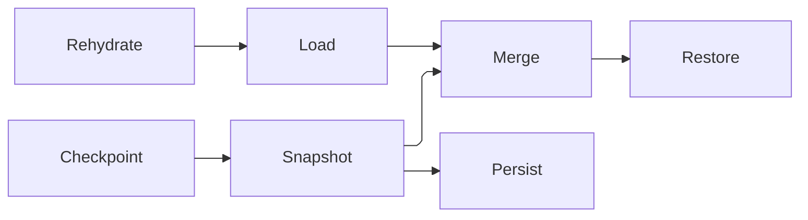
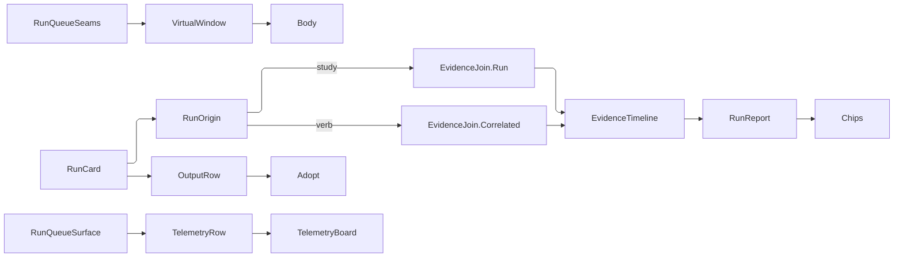

# [APPUI_SCREENS_ACTIVATION]

Rasm.AppUi screens are catalog rows over one activatable base: a frozen `ScreenCatalog` table is the single derivation source for dockables, window titles, automation names, route keys, and headless proof lanes, while `ScreenBase` owns activation scopes, suspend/resume, the one screen fault fold, paced derived state, the owned admission rail lifting `Validation<Error,T>` onto slot rows behind the inbox error-info bridge, and per-surface state snapshots. The page owns the catalog axis and its product roster, the activation capsule, the derived-state and admission rails, the snapshot law, the materialize-context seam, and the three product surfaces the roster seats — settings over the persisted-policy registry, the first-run/landing/coach/report family, and the run queue — composing AppHost `ClockPolicy`, `RuntimePhase`, `UiSchedulerPort`, `DrainParticipantPort`, `TelemetryContributorPort`, and `DrainBand` over ReactiveUI, System.Reactive, LanguageExt rails, and NodaTime instants.

## [01]-[INDEX]

- [02]-[SCREEN_CATALOG]: One frozen row table with its product roster; every screen derivation folds over it.
- [03]-[ACTIVATION_SCOPES]: One activatable base; scoped disposal, suspend/resume, drain row.
- [04]-[DERIVED_STATE]: OAPH derivations, paced streams, one screen fault fold.
- [05]-[VALIDATION_UX]: The owned admission rail — slot rows over the typed rail behind one error-info bridge.
- [06]-[SCREEN_STATE]: Per-surface snapshots; restore-on-activate merge; checkpoint law.
- [07]-[CONTROL_STREAM]: A screen body is a control-intent stream materialized through `ControlFactory`, not a XAML literal.
- [08]-[SETTINGS_SURFACE]: Every persisted policy projected from one registry through the form-schema engine.
- [09]-[PRODUCT_SCREENS]: First run, recents landing, coach marks, and the consent-bearing fault report.
- [10]-[RUN_QUEUE]: The job/run/step queue surface with its evidence drill-down and output handoff.

## [02]-[SCREEN_CATALOG]

- Owner: `ScreenCatalogRow` row record; `ScreenCatalog` frozen table with total projections; `ScreenComposition` the bound-dependency carrier every row constructs through; `ScreenProgram` the per-surface behaviour row; `ProductScreen` the one program-driven model; `ScreenRoster` the product row table.
- Entry: `public static Fin<ScreenCatalog> Freeze(ConsumptionProfile profile, params ReadOnlySpan<ScreenCatalogRow> rows)` — `Fin` aborts on a duplicate row id or a headless-lane row whose own surface predicate refuses the offscreen mount under the mounting profile; `public static Fin<ScreenCatalog> Product(ConsumptionProfile profile, ScreenComposition composition)` on `ScreenRoster` — the whole product roster in one fold.
- Auto: dock factories, window titles, palette listings, automation names, and headless proof specs derive as folds over `Rows` — zero per-derivation registries; `IViewFor<TViewModel>` views register through `RegisterViews(m => m.Map<TViewModel, TView>())` on the ReactiveUI builder at the composition root (the catalog-verified spelling — `RegisterView<...>` does not exist), one registration per catalog row.
- Packages: ReactiveUI, LanguageExt.Core, BCL inbox
- Growth: one catalog row carries screen, dockable, title, automation name, and headless proof, and one product surface is one `ScreenProgram` row plus its `ScreenRoster` seating; zero new surface.
- Boundary: `Key` is the one identity cell; `Id`, `RouteKey`, and `AutomationName` are derived members, while `Title` resolves from the same key through the composition-bound label column. Deep links, remote invocation, dock identity, automation, palette listings, and proof names therefore cannot drift by independently authored literals; the shell route index is itself a roster projection — `Shell/navigation.md` `ShellRoot.Freeze` folds `Rows` onto `RouteKey`, never an independent route-pair sequence. Screen title typography is the `Theme/typography` `TypographyRole.Title` row every chrome and dock title resolves, so a per-row role column here would be a second typography authority no surface reads; screen iconography resolves through the `Theme/assets` nameof-derived `AssetKey` vocabulary, so a key this row derived by string concatenation could never match a row in that table and is the deleted form. `Surface` is the single admission gate over the supplied `ConsumptionProfile` and the resolved `SurfaceMount`, and `ProofLane` is the proof policy — the two are COUPLED at the freeze, because `Diagnostics/proof` folds `HeadlessLane` and crosses every row in it with the variant-density grid, so a row claiming that lane while its own predicate refuses `SurfaceMount.Offscreen` declares a proof nothing can ever run and reads as covered on every report. `Model` takes the row beside the minted `SurfaceKey`: the row is what the model carries and the key is `Shell/navigation`'s `SurfaceKey.Mint` product, so a screen composing its own partition text would write beside the partition the dock graph minted and lose its scroll, filter, and selection on the next restore, while a model reaching back for a row the catalog is still freezing is unspellable. A per-screen base-class family is rejected AND a per-row body column is deleted: a body is the model's own projection, so `ScreenBase.Body` is one abstract member the model answers rather than a second column a row could point at a different screen's projection; the body crosses the `ControlIntentWire` seam unchanged.

```csharp signature
public sealed record ScreenCatalogRow(
    string Key,
    Func<string, string> Label,
    ProofLane Proof,
    Func<ConsumptionProfile, SurfaceMount, bool> Surface,
    Func<ScreenCatalogRow, SurfaceKey, ScreenBase> Model) {
    public string Id => Key;
    public string RouteKey => Key;
    public string AutomationName => Key;
    public string Title => Label($"{Key}.title");
}

[SmartEnum<string>]
public sealed partial class ProofLane {
    public static readonly ProofLane Interactive = new("interactive", headless: false);
    public static readonly ProofLane Headless = new("headless", headless: true);

    public bool Headless { get; }
}

public sealed record ScreenCatalog(FrozenDictionary<string, ScreenCatalogRow> Rows) {
    public Seq<ScreenCatalogRow> HeadlessLane => toSeq(Rows.Values).Filter(static row => row.Proof.Headless);

    public static Fin<ScreenCatalog> Freeze(ConsumptionProfile profile, params ReadOnlySpan<ScreenCatalogRow> rows) =>
        Build(profile, toSeq(rows.ToArray()));

    public Option<ScreenCatalogRow> Resolve(string id) =>
        Rows.TryGetValue(id, out ScreenCatalogRow? row) ? Some(row) : None;

    // Admission reads two axis values, never a product name: the supplied profile answers whether a host
    // surface exists at all and the resolved mount answers which shape the shell took inside it.
    public Seq<ScreenCatalogRow> For(ConsumptionProfile profile, SurfaceMount mount) =>
        toSeq(Rows.Values).Filter(row => row.Surface(profile, mount));

    // Two refusals in one fold. The fault names the offending key: the first id declared more than once
    // rides DuplicateId — CountBy folds per key in one pass where GroupBy materialized every group — and a
    // row claiming the headless lane while its own predicate refuses the offscreen mount rides
    // LaneUnreachable, because the proof matrix crosses exactly that lane with exactly that mount and a row
    // failing the pair contributes a proof no cell can execute while every report counts it as covered.
    private static Fin<ScreenCatalog> Build(ConsumptionProfile profile, Seq<ScreenCatalogRow> rows) =>
        Optional(rows.Map(static row => row.Id).AsEnumerable()
                .CountBy(identity, StringComparer.Ordinal)
                .Where(static entry => entry.Value > 1)
                .Select(static entry => entry.Key)
                .FirstOrDefault())
            .Match(
                Some: duplicate => Fin<ScreenCatalog>.Fail(new ScreenFault.DuplicateId(duplicate)),
                None: () => rows.Find(row => row.Proof.Headless && !row.Surface(profile, SurfaceMount.Offscreen)).Match(
                    Some: unreachable => Fin<ScreenCatalog>.Fail(new ScreenFault.LaneUnreachable(unreachable.Id)),
                    None: () => Fin<ScreenCatalog>.Succ(new(rows.ToFrozenDictionary(static row => row.Id, static row => row, StringComparer.Ordinal)))));
}
```

```csharp signature
// --- [COMPOSITION] ----------------------------------------------------------------------

// The bound-dependency carrier every row constructs through. A catalog row stays five columns because the
// seams it needs travel as ONE value: the label resolver, the shared runtime, and one seam record per
// product surface. Threading each dependency through a static row table instead put nine parameters on
// every row and made a new surface a signature change at every existing one.
public sealed record ScreenComposition(
    Func<string, string> Label,
    ScreenRuntime Runtime,
    ResolvedLocale Locale,
    VirtualWindowSpec Window,
    SettingsRegistry Settings,
    ShortcutEditor Shortcuts,
    Func<SurfaceKey, TimelineSurface> Timeline,
    // The analysis and compare planes reach their screens exactly as the timeline does — one surface-scoped
    // arrow each, so the owner keeps its state and this record keeps the seating. A screen holding its own
    // stack or grid would be a second copy of a value the plane already publishes.
    Func<SurfaceKey, LayerStack> Layers,
    Func<SurfaceKey, ProbeReading> Probe,
    Func<SurfaceKey, (CompareGrid Grid, Seq<CompareCell> Cells, CompareSync Sync)> Compare,
    Func<SurfaceKey, DiffSurface> Diff,
    ProductSeams Product,
    RunQueueSeams Queue);

// A screen PROGRAM is the behaviour row a product surface fills: the value slots it publishes, the
// pipelines it wires, the body it projects, and the two state arrows it snapshots and restores through.
// A per-surface `ScreenBase` subclass carries one distinguishing member and repeats every other one, so
// the family is ONE owner over its programs and a new surface is a row rather than a class.
public sealed record ScreenProgram(
    string Key,
    Func<ProductScreen, Seq<IDisposable>> Wire,
    Func<ProductScreen, ControlIntent> Body,
    Func<ProductScreen, ScreenState> Snapshot,
    Func<ProductScreen, ScreenState, Unit> Restore,
    Func<ProductScreen, Func<string, bool>> Alive) {
    // A program with no live-row knowledge admits every persisted id, and a program with no restorable
    // state answers the empty snapshot at its own version — both defaults are the ordinary case, so a
    // surface declares only the arrows it actually differs on.
    public static ScreenProgram Of(string key, Func<ProductScreen, ControlIntent> body) =>
        new(key, static _ => Seq<IDisposable>(), body,
            static screen => screen.Blank(), static (_, _) => unit, static _ => static _ => true);
}

// The one program-driven model. A product surface's state IS its named slots — a search string, a picked
// severity set, a scroll offset — so ONE cell bag serves the value channel the materialize fold binds, the
// property edge the intent stream re-projects on, and the snapshot the state carrier persists; three
// declarations of that fact is what a per-screen property set costs.
public sealed class ProductScreen(
    ScreenCatalogRow row, SurfaceKey surface, ScreenComposition composition, ScreenProgram program)
    : ScreenBase(row, surface, composition.Runtime) {
    private readonly Subject<string> edits = new();
    private HashMap<string, object?> cells = HashMap<string, object?>();

    public ScreenComposition Composition { get; } = composition;

    public ScreenProgram Program { get; } = program;

    // Every cell is a slot, so the fold's `Value` column resolves without the program registering twice and
    // a key the program never wrote answers absent rather than binding a control to nothing.
    public override HashMap<string, ValueSlot> Values =>
        cells.Map((key, _) => new ValueSlot(() => Read(key), value => Write(key, value), Edited(key)));

    public override ControlIntent Body() => Program.Body(this);

    public override ScreenState Snapshot() => Program.Snapshot(this);

    public override Unit Restore(ScreenState merged) => Program.Restore(this, merged);

    public override Func<string, bool> Alive => Program.Alive(this);

    protected override Seq<IDisposable> Wire() => Program.Wire(this);

    public Option<object?> Read(string key) => cells.Find(key);

    // The typed read is fail-soft by design: a cell nothing has written and a cell holding another shape both
    // answer the caller's own fallback, so a body projecting before its first write renders its default state
    // rather than faulting the whole re-materialize on a slot that has simply not been touched yet.
    public T Read<T>(string key, T fallback) => cells.Find(key) is { IsSome: true, Case: T typed } ? typed : fallback;

    // The property raise IS the re-projection edge: `ReactiveObject.Changed` is what `ScreenWire` throttles,
    // so a slot write re-materializes the body through the one paced path and a screen-local re-render call
    // is unspellable.
    public Unit Write(string key, object? value) {
        cells = cells.AddOrUpdate(key, value);
        this.RaisePropertyChanged(key);
        edits.OnNext(key);
        return unit;
    }

    public IObservable<Unit> Edited(string key) =>
        edits.Where(edited => StringComparer.Ordinal.Equals(edited, key)).Select(static _ => unit);

    // The empty snapshot at this screen's own coordinates, which is what a stateless program answers and
    // what every stateful program starts from before it seats its own columns.
    public ScreenState Blank() =>
        new(Row.Id, Surface, Seq<string>(), 0d, None, Set<string>(), None, Runtime.Clocks.Now, Version: 2);
}

// The product roster. Every key is a const because the same string is the route key, the dock id, the
// automation name, the locale stem, and the proof name — one declaration, five readers, and a literal
// re-spelled at any of them is the drift this table exists to foreclose.
public static class ScreenRoster {
    public const string Settings = "settings";
    public const string Shortcuts = "shortcuts";
    public const string History = TimelineSurface.BodyKey;
    public const string FirstRun = "first-run";
    public const string Landing = "landing";
    public const string Report = "fault-report";
    public const string Queue = RunQueueSurface.Key;
    public const string LayerStack = AnalysisLayers.StackKey;
    public const string CompareGrid = CompareBoard.Key;
    public const string CompareSession = DiffSurface.SessionKey;

    public static Fin<ScreenCatalog> Product(ConsumptionProfile profile, ScreenComposition composition) =>
        ScreenCatalog.Freeze(profile,
            // Settings and shortcuts seat on the modal-editor topology: `Shell/dialogs` `DialogIntent.Editor`
            // takes the whole canvas bound the overlay host already gives every layer, so neither screen owns
            // a root, a registration, or a teardown, and both stay ordinary catalog rows a deep link reaches.
            Seat(Settings, ProofLane.Headless, Anywhere, composition, SettingsSurface.Program(composition)),
            Seat(Shortcuts, ProofLane.Headless, Anywhere, composition, ShortcutProgram(composition)),
            // The timeline body is `Editing/history`'s own projection, so this row carries the seating alone
            // and the history owner keeps the tree-plus-strip shape; a screens-local timeline body would be a
            // second projection over one op stream.
            Seat(History, ProofLane.Headless, Anywhere, composition,
                ScreenProgram.Of(History, screen => screen.Composition.Timeline(screen.Surface).Body(screen.Composition.Window))),
            Seat(FirstRun, ProofLane.Headless, Anywhere, composition, ProductPrograms.FirstRun(composition)),
            Seat(Landing, ProofLane.Headless, Anywhere, composition, ProductPrograms.Landing(composition)),
            // The report is INTERACTIVE: its body is a consent gate over real bundle bytes, and a headless
            // cell rendering it would exercise a consent nobody gave against a redactor nobody ran.
            Seat(Report, ProofLane.Interactive, Windowed, composition, ProductPrograms.Report(composition)),
            Seat(Queue, ProofLane.Headless, Anywhere, composition, RunQueueSurface.Program(composition)),
            // The analysis plane's two screens seat here rather than at their own owners for the reason every
            // row does: the catalog IS the route index, the dock roster, and the proof roster, so a screen
            // registered anywhere else would be reachable by chord and unreachable by deep link.
            Seat(LayerStack, ProofLane.Headless, Anywhere, composition, AnalysisLayers.Program(composition)),
            Seat(CompareGrid, ProofLane.Headless, Anywhere, composition, CompareBoard.Program(composition)),
            // The compare SESSION is interactive: its body renders two live document panes over the co-edit
            // transport, and a headless cell would exercise a merge authority nothing had connected.
            Seat(CompareSession, ProofLane.Interactive, Windowed, composition, DiffSurface.Program(composition)));

    // One seating fold, so a row's five columns are decided here and the program supplies behaviour alone —
    // a row that spelled its own model construction would be seven copies of one lambda.
    static ScreenCatalogRow Seat(
        string key,
        ProofLane proof,
        Func<ConsumptionProfile, SurfaceMount, bool> surface,
        ScreenComposition composition,
        ScreenProgram program) =>
        new(key, composition.Label, proof, surface,
            (row, mounted) => new ProductScreen(row, mounted, composition, program));

    // The offscreen mount admits unconditionally on every headless-lane row, because that mount IS the
    // proof cell: a predicate refusing it makes the row's own lane claim unexecutable and `Freeze` seals
    // exactly that contradiction.
    static bool Anywhere(ConsumptionProfile profile, SurfaceMount mount) =>
        mount is SurfaceMount.Offscreen || profile.Surface != HostSurface.None;

    static bool Windowed(ConsumptionProfile profile, SurfaceMount mount) =>
        profile.Surface == HostSurface.Windowed && mount is SurfaceMount.Standalone or SurfaceMount.Companion;

    // The shortcut editor's body: the deck-projected rows with each chord rendered as a static chip whose
    // activation raises the CAPTURE verb. The capture control itself is `Shell/commands`' own page-local
    // boundary capsule — a recording affordance whose value is a chord is not a screen field this fold
    // materializes — so the body names the verb and the editor owns the cell.
    static ScreenProgram ShortcutProgram(ScreenComposition composition) =>
        ScreenProgram.Of(Shortcuts, screen => new ControlIntent.Panel(
            Shortcuts,
            composition.Shortcuts.Sheet().Map(group => (ControlIntent)new ControlIntent.Panel(
                $"{Shortcuts}.{group.Scope.Key}",
                group.Rows.Map(row => (ControlIntent)new ControlIntent.Chip(
                    $"{Shortcuts}.{row.Key}",
                    row.Gesture.Map(static gesture => gesture.ToString()).IfNone($"{Shortcuts}.unbound"),
                    ChipPosture.Static,
                    IntentBinding.Of(row.Conflicted ? PaintRole.Error : PaintRole.Text) with {
                        Command = Some(ShortcutEditor.CaptureIntent),
                        Hint = Some(new HintRow(screen.Composition.Label(row.Label), row.Gesture)),
                    })),
                ConstraintProgram: $"{Shortcuts}.scope",
                IntentBinding.Of(PaintRole.Panel))),
            ConstraintProgram: Shortcuts,
            IntentBinding.Of(PaintRole.Surface)));
}
```

## [03]-[ACTIVATION_SCOPES]

- Owner: `ScreenRuntime` policy record; `ScreenBase` activation capsule; `ScreenLifetimes` the per-control lifetime table the materialize context's ownership columns read.
- Entry: `public IDisposable BindActivation(IObservable<bool> visible, UiSchedulerPort scheduler)` — visibility edges and phase receipts fold into one activate/suspend rail; `public IO<Unit> Suspend(string trigger)` — the one suspension verb, its trigger naming the source on both the fault fold and the suspension count.
- Auto: `WhenActivated` composes rehydration, the per-screen `Wire` pipelines, and a closing disposal that checkpoints state and emits the disposal evidence; `DrainRow` registers the screens teardown as one `DrainParticipantPort` row; the draining phase receipt suspends every bound screen through the same `Suspend` path; `ScreenInteraction<TInput,TOutput>` counts its registrations so a deep-link or modal route gates on `Reachable` — a counted-value presence check — before navigating, never on a caught unhandled-interaction throw.
- Receipt: disposal evidence — row id, active `Duration`, disposable count — through `ScreenRuntime.Disposed` into the evidence stream bound at composition; `TelemetryRow` contributes the activation and suspend counts plus the per-screen disposables levels inward through the AppHost `TelemetryContributorPort`, the keyed family swapped by the evidence fan's disposal arm.
- Packages: ReactiveUI, System.Reactive, LanguageExt.Core, NodaTime, Rasm.AppHost (project)
- Growth: one screen is one `ScreenBase` subclass expression body with one catalog row, and one screen instrument is one `InstrumentSpec` row on `ScreenBase.TelemetryRow`; zero new surface.
- Boundary: `ScreenBase` is the named boundary capsule for the statement carve-out — activation wiring, visibility subscription, disposal registration, and the error-info edge raise carry language-owned statement forms while every other member stays expression-shaped, and `ScreenLifetimes` is the second named capsule because a per-control lifetime table is retained mutable host state; `ViewModelActivator` ref-counts through `Interlocked` increments — activation fires only on the zero-to-one edge and `Deactivate` decrements symmetrically — so concurrent visibility-driven suspension and view-driven activation compose without a second guard; AutoSuspendHelper and RxApp.SuspensionHost are the deleted patterns, suspension rides the state checkpoint plus the visibility fold; view-model questions ride `ScreenInteraction<TInput,TOutput>` — `Register` is the one registration verb, wrapping the base `RegisterHandler` with an `Interlocked` count whose disposal decrements, so `Reachable` is a value check and never an exception probe, and a handler registered through the base `RegisterHandler` bypasses the count and is the rejected form; the drain row registers rank 10 — the one rank literal here — ordering screen teardown first inside `DrainBand.Interaction`; `Throttle` arrives on `ScreenRuntime` from the motion timing rows, so the fences carry zero duration literals; the activation count fires inside the `WhenActivated` scope body, which the activator enters only on the zero-to-one edge, and the suspension count fires on the one `Suspend(trigger)` verb every driver — the visibility fold, the draining phase receipt, and the drain row — routes through, so each instrument has exactly one producer and a screen-local meter is the deleted form; each write spells the slot its own `InstrumentSpec` declared — `AppUiTelemetry.ScreenSlot` on the activation count and on the disposables levels the evidence fan keys by screen id, `AppUiTelemetry.SourceSlot` on the suspension count carrying the trigger its description names — so the declared `Dimensions`, the spelled tag key, and the described noun are one vocabulary, and a bare value naming no key is a tag the governance view drops; `ScreenLifetimes` keys on the control rather than holding one flat composite, because the pool's `Release` must drop exactly the parked control's bindings before `Rebind` re-attaches while the whole table still dies with the screen — a flat composite could only do the second, which is what let a recycled cell carry its predecessor's value binding.

```csharp signature
// Count is the ONE meter reach the screen plane has, carrying the surface plane's own column shape —
// instrument name beside the optional (slot, value) dimension row the written instrument declared — so no
// activation body, disposal arm, or drain row touches a meter, and a bare tag value naming no key could
// neither be checked against the row's own Dimensions nor carry a second one.
public sealed record ScreenRuntime(
    ClockPolicy Clocks,
    ScreenStatePolicy State,
    Func<string, Duration, int, IO<Unit>> Disposed,
    Func<string, Option<(string Slot, string Value)>, Unit> Count,
    Duration Throttle);

public abstract partial class ScreenBase : ReactiveObject, IActivatableViewModel, INotifyDataErrorInfo {
    private readonly BehaviorSubject<HashMap<AdmissionSlot, AdmissionRow>> admitted = new(HashMap<AdmissionSlot, AdmissionRow>());
    private long mark;
    private Option<ScreenIncident> fault = None;

    protected ScreenBase(ScreenCatalogRow row, SurfaceKey surface, ScreenRuntime runtime) {
        Row = row;
        Surface = surface;
        Runtime = runtime;
        this.WhenActivated(Scope);
    }

    public ScreenCatalogRow Row { get; }
    public SurfaceKey Surface { get; }
    public ScreenRuntime Runtime { get; }
    public ViewModelActivator Activator { get; } = new();
    public ScreenLifetimes Lifetimes { get; } = new();
    public Option<ScreenIncident> Fault { get => fault; private set => this.RaiseAndSetIfChanged(ref fault, value); }

    // The named two-way value slots the materialize fold's `Value` column resolves. A screen registers its
    // slots once and the fold binds by NAME, so no arm reflects over a string property path and a key
    // nothing registered refuses at materialize rather than binding a control to nothing.
    public virtual HashMap<string, ValueSlot> Values => HashMap<string, ValueSlot>();

    public virtual Func<string, bool> Alive => static _ => true;

    // The body is the model's OWN projection, which is why the catalog row carries no body column: a column
    // could point one row at another screen's projection and no reader could tell.
    public abstract ControlIntent Body();

    public abstract ScreenState Snapshot();

    public abstract Unit Restore(ScreenState merged);

    protected abstract Seq<IDisposable> Wire();

    public IDisposable BindActivation(IObservable<bool> visible, UiSchedulerPort scheduler) {
        IDisposable phased = scheduler.Phases(receipt => ignore(receipt.To == RuntimePhase.Draining ? Suspended("drain") : unit));
        IDisposable sighted = visible.DistinctUntilChanged().Subscribe(open => ignore(open ? ignore(Activator.Activate()) : Suspended("visibility")));
        return new CompositeDisposable(phased, sighted);
    }

    // The trigger names the source on BOTH the fault fold and the suspension count, so the two can never
    // disagree about what asked; the count is the suspension REQUEST the instrument's own description
    // names, because the activator's ref-count edge is not observable from Deactivate.
    private Unit Suspended(string trigger) => Run(trigger, Suspend(trigger));

    public IO<Unit> Suspend(string trigger) =>
        this.Checkpoint()
            .Bind(_ => IO.lift(fun(() => Activator.Deactivate())))
            .Map(_ => Runtime.Count(SuspendedInstrument, Some((AppUiTelemetry.SourceSlot, trigger))));

    public const string ActivatedInstrument = "rasm.appui.screen.activated";
    public const string SuspendedInstrument = "rasm.appui.screen.suspended";
    public const string DisposablesInstrument = "rasm.appui.screen.disposables";

    public static TelemetryContributorPort TelemetryRow(string version) =>
        AppUiTelemetry.Contribute(version,
            InstrumentSpec.Count(ActivatedInstrument, "{activation}", "screen activations by screen id", MeasureForm.Whole, AppUiTelemetry.ScreenSlot),
            InstrumentSpec.Count(SuspendedInstrument, "{suspension}", "screen suspensions by trigger", MeasureForm.Whole, AppUiTelemetry.SourceSlot),
            InstrumentSpec.Levels(DisposablesInstrument, "{disposable}", "live disposables by screen id",
                MeasureForm.Whole, AppUiTelemetry.ScreenSlot));

    public static DrainParticipantPort DrainRow(Func<Seq<ScreenBase>> active) =>
        new("screens", DrainBand.Interaction, 10, token => active().TraverseM(static screen => screen.Suspend("drain")).As().Map(static _ => unit));

    internal Unit Commit(ScreenIncident failure) => ignore(Fault = Some(failure));

    // Scope IS the zero-to-one edge: WhenActivated runs this body only when the activator's ref count
    // rises from zero, so the activation count fires exactly once per genuine activation and a
    // re-entrant visibility flip inside a live scope adds nothing.
    private IEnumerable<IDisposable> Scope() {
        mark = Runtime.Clocks.Mark();
        ignore(Runtime.Count(ActivatedInstrument, Some((AppUiTelemetry.ScreenSlot, Row.Id))));
        ignore(Run("rehydrate", this.Rehydrate()));
        Seq<IDisposable> wired = Wire();
        return wired.Add(Disposable.Create(() =>
            ignore(Run("checkpoint", this.Checkpoint().Bind(_ => Runtime.Disposed(Row.Id, Runtime.Clocks.Elapsed(mark), wired.Count + 1))))));
    }

    // The IO runner THROWS on failure and answers the bare value, so the effect crosses `Try` on its way to
    // the fault cell: run it directly and every rehydrate, checkpoint, and disposal fault escapes the one
    // screen failure surface this fold exists to seal, past the activation scope, into the framework.
    private Unit Run(string source, IO<Unit> effect) =>
        Try.lift(() => effect.Run()).Run().Match(
            Succ: static _ => unit,
            Fail: failure => Commit(new ScreenIncident(Row.Id, new ScreenFault.Thrown(source, failure.Message), Runtime.Clocks.Now, source)));
}

public sealed class ScreenInteraction<TInput, TOutput>(IScheduler? scheduler = null) : Interaction<TInput, TOutput>(scheduler) {
    private int handlers;

    public bool Reachable => Volatile.Read(ref handlers) > 0;

    // The one registration verb: the count and the base registration dispose together, so Reachable is
    // a value check; a base RegisterHandler call bypasses the count and is the rejected form.
    public IDisposable Register(Func<IInteractionContext<TInput, TOutput>, Task> handler) {
        IDisposable registration = RegisterHandler(handler);
        ignore(Interlocked.Increment(ref handlers));
        return Disposable.Create(() => {
            ignore(Interlocked.Decrement(ref handlers));
            registration.Dispose();
        });
    }
}

// The per-control lifetime table the materialize context's `Own` and `Release` columns read. Keyed weakly on
// the control so a dropped control's composite dies with it, and the whole table disposes with the screen —
// which is the pair a single flat composite could never answer, since the pool must release exactly one
// parked control's bindings while every other realized control keeps its own.
public sealed class ScreenLifetimes : IDisposable {
    private readonly ConditionalWeakTable<Control, CompositeDisposable> owned = new();

    public Unit Own(Control control, IDisposable lifetime) {
        owned.GetOrCreateValue(control).Add(lifetime);
        return unit;
    }

    public Unit Release(Control control) {
        if (owned.TryGetValue(control, out CompositeDisposable? held)) {
            held.Dispose();
            ignore(owned.Remove(control));
        }
        return unit;
    }

    public void Dispose() {
        foreach (KeyValuePair<Control, CompositeDisposable> entry in owned) {
            entry.Value.Dispose();
        }
        owned.Clear();
    }
}
```

## [04]-[DERIVED_STATE]

- Owner: `ScreenFault` — the typed fault family on the `AppUiFaultBand.Screen` registry row (6080); `ScreenIncident` — the fault-cell state record (who, when, which typed fault); `DerivedOps` extension fold over `ScreenBase`.
- Entry: `public ObservableAsPropertyHelper<T> Derive<T>(IObservable<T> source, Expression<Func<TScreen,T>> property, IScheduler scheduler, T initial)` — one paced OAPH row per derived property with the target member carried as a checked expression rather than a reflection string.
- Auto: `WhenAnyValue` and `SubscribeToExpressionChain` streams feed `Derive`; `FoldFaults` merges command and pipeline `ThrownExceptions` through the one `ScreenFault.Thrown` conversion into the `Fault` cell; `RaiseAndSetIfChanged` publishes the fault transition to bound views.
- Packages: ReactiveUI, System.Reactive, LanguageExt.Core, NodaTime
- Growth: one OAPH row per derived property and one merged stream per fault source; zero new surface.
- Boundary: per-control exception handling is the deleted pattern — `Fault` is the single screen failure surface, and the error dialog row and the evidence stream both consume it through composition-bound delegates; the `IScheduler` parameter arrives from the surface scheduler boundary and applies once per pipeline, never per operator; `Calm` pins the operator order — distinct before throttle — so burst sources collapse before pacing; the band's span is ten and eight details are seated, so a ninth screen fault takes a free detail while a tenth widens the registry row rather than appending past it.

```csharp signature
[Union(ConversionFromValue = ConversionOperatorsGeneration.None)]
public abstract partial record ScreenFault : Expected {
    private ScreenFault(string detail, int code) : base(detail, code) { }
    public sealed record DuplicateId(string Detail)
        : ScreenFault($"screen/duplicate: {Detail}", AppUiFaultBand.Screen.Code(0));
    public sealed record Thrown(string Source, string Reason)
        : ScreenFault($"screen/thrown: {Source}: {Reason}", AppUiFaultBand.Screen.Code(1));
    public sealed record StateRejected(string Reason)
        : ScreenFault($"screen/state: {Reason}", AppUiFaultBand.Screen.Code(2));
    public sealed record LaneUnreachable(string Key)
        : ScreenFault($"screen/lane: {Key} claims the headless lane and refuses the offscreen mount", AppUiFaultBand.Screen.Code(3));
    public sealed record Rejected(string Target, string Reason)
        : ScreenFault($"screen/rejected: {Target}: {Reason}", AppUiFaultBand.Screen.Code(4));
    public sealed record SlotClaimed(string Slot)
        : ScreenFault($"screen/slot: {Slot} already carries a rule", AppUiFaultBand.Screen.Code(5));
    public sealed record PolicyRejected(string Section, string Reason)
        : ScreenFault($"screen/policy: {Section}: {Reason}", AppUiFaultBand.Screen.Code(6));
    public sealed record QueueRejected(string Detail)
        : ScreenFault($"screen/queue: {Detail}", AppUiFaultBand.Screen.Code(7));
}

public readonly record struct ScreenIncident(string ScreenId, ScreenFault Evidence, Instant At, string Source);

public static class DerivedOps {
    extension<TScreen>(TScreen screen) where TScreen : ScreenBase {
        public IObservable<T> Calm<T>(IObservable<T> source, IScheduler scheduler) =>
            source.DistinctUntilChanged().Throttle(screen.Runtime.Throttle.ToTimeSpan(), scheduler);

        public ObservableAsPropertyHelper<T> Derive<T>(IObservable<T> source, Expression<Func<TScreen, T>> property, IScheduler scheduler, T initial) =>
            screen.Calm(source, scheduler).ToProperty(screen, property, initial);

        public IDisposable FoldFaults(string source, params ReadOnlySpan<IObservable<Exception>> streams) =>
            Observable.Merge(streams.ToArray()).Subscribe(failure =>
                screen.Commit(new ScreenIncident(screen.Row.Id, new ScreenFault.Thrown(source, failure.Message), screen.Runtime.Clocks.Now, source)));
    }
}
```

## [05]-[VALIDATION_UX]

- Owner: `AdmissionSlot` the rule target; `AdmissionRow` the per-slot verdict and its text; `ScreenBase`'s own admission cell with its `INotifyDataErrorInfo` bridge; `ScreenValidation` the lift surface.
- Entry: `public Fin<IDisposable> Admit<TValue>(Expression<Func<TScreen, TValue>> property, IObservable<Validation<Error, TValue>> admissions)` — the one admission seam from the typed rail onto a slot row, its `Fin` sealing a non-member expression or a slot another rule already holds; `AdmitCross<TValue>(IObservable<Validation<Error, TValue>> admissions)` lands the same typed rail on the cross slot for invariants spanning two or more properties; both return the rule's LIFETIME, so retirement is disposal.
- Auto: `Gate` projects all-rows-valid into the availability delegate column consumed by the command table; `FieldErrors` projects one slot's text into the field-adorner stream; `GetErrors`/`ErrorsChanged` answer the platform's own error-info contract, so `DataValidationErrors` paints every bound control with no per-control wiring and the shipped `DataValidationErrors` control theme carries its ink.
- Packages: ReactiveUI, System.Reactive, LanguageExt.Core, BCL inbox
- Growth: one rule row per validated property and one cross row per invariant; zero new surface.
- Boundary: the lift is the single validation vocabulary — a second rule rail beside `Validation<Error,T>` is the rejected form, and domain factories keep emitting the typed rail untouched. The rail is OWNED rather than borrowed: the reactive major moved `IReactiveObject` into a Core assembly with no type forward, so the external view-model aggregator type-loads against nothing and its whole surface — rule context, helper handles, text formatter, the object base — is unreachable, which makes the inbox `INotifyDataErrorInfo` contract the one adorner channel and the slot map the one rule table (`RULINGS.md [01]`). A slot is claimed exactly once and a second claim seals `SlotClaimed` rather than shadowing the first, because two rules over one property would each publish a verdict the other overwrites and the field would flicker between them; a rule's registration IS a subscription with a lifetime, so a mode shift disposes and re-registers instead of mutating a table, and the whole set retires with the screen. Text crosses as the WHOLE accumulated failure sequence, because `Validation` accumulates — rendering the head alone shows a two-rule field one rule at a time and costs the operator a round trip per rule. The cross slot carries the empty property name, which is exactly what the error-info contract reserves for entity-level errors, so a cross-field invariant reaches the platform's own entity adorner and needs no second channel; `Gate` reads every row including that one, so a cross-field failure gates the submit verb identically to a field failure. `FieldErrors` and `GetErrors` are ONE read at two altitudes — the observable for a screen-composed adorner stream and the synchronous contract for the framework's own binding plugin — so a hand-wired per-control error handler is the deleted pattern and no adorner re-runs validation logic.

```csharp signature
// --- [TYPES] ----------------------------------------------------------------------------

// The rule target. A property slot names the member an adorner paints; the CROSS slot carries the empty
// name the error-info contract reserves for entity-level errors, so both live in one map, the validity fold
// reads one set, and a cross-field failure reaches the platform's entity adorner with no second channel.
public readonly record struct AdmissionSlot(string Property) {
    public static readonly AdmissionSlot Cross = new(string.Empty);

    public bool IsCross => Property.Length is 0;

    // The member expression IS the slot name, so a renamed property breaks its rule at compile time where a
    // string literal would silently seat a slot no adorner and no gate ever reads.
    public static Fin<AdmissionSlot> Of<TScreen, TValue>(Expression<Func<TScreen, TValue>> property) =>
        property.Body is MemberExpression { Member.Name: var name }
            ? Fin.Succ(new AdmissionSlot(name))
            : Fin<AdmissionSlot>.Fail(new ScreenFault.Rejected(property.ToString(), "admission target is not a property member"));
}

// --- [MODELS] ---------------------------------------------------------------------------

// One slot's verdict. Validity is the ABSENCE of text rather than a second column, so a row cannot claim
// valid while carrying a message; the sequence is the whole accumulated failure set the applicative
// produced, because a field failing two rules must state both or the operator satisfies them serially.
public readonly record struct AdmissionRow(AdmissionSlot Slot, Seq<string> Text) {
    public bool Valid => Text.IsEmpty;
}
```

```csharp signature
// --- [OPERATIONS] -----------------------------------------------------------------------

// The admission members ScreenBase carries. Seating, retirement, and the error-info edge are the one place
// the cell is written, so the observable a gate reads and the synchronous answer the framework's binding
// plugin reads are the same map at the same instant.
public abstract partial class ScreenBase {
    public IObservable<HashMap<AdmissionSlot, AdmissionRow>> Admissions => admitted;

    public bool HasErrors => admitted.Value.Values.Exists(static row => !row.Valid);

    public event EventHandler<DataErrorsChangedEventArgs>? ErrorsChanged;

    // The platform contract is string-typed, so the row's own text sequence IS what crosses and nothing
    // casts; a name the map never seated answers empty rather than null, which is what keeps the adorner
    // from painting an error state for a control carrying no rule at all.
    public IEnumerable GetErrors(string? propertyName) =>
        admitted.Value.Find(new AdmissionSlot(propertyName ?? string.Empty))
            .Map(static row => (IEnumerable)row.Text)
            .IfNone(Seq<string>());

    // Claim is the ONE slot registration and it refuses a held slot on the rail: two rules over one property
    // each publish a verdict the other overwrites, so the field would flicker between them and neither
    // author would see a defect. The returned lifetime retires the row, so a mode shift disposes and
    // re-registers rather than mutating a table nothing owns.
    internal Fin<IDisposable> Claim(AdmissionSlot slot, IObservable<Seq<string>> text) =>
        admitted.Value.ContainsKey(slot)
            ? Fin<IDisposable>.Fail(new ScreenFault.SlotClaimed(slot.Property))
            : Fin.Succ((IDisposable)new CompositeDisposable(
                text.Subscribe(found => ignore(Publish(admitted.Value.AddOrUpdate(slot, new AdmissionRow(slot, found)), slot))),
                Disposable.Create(() => ignore(Publish(admitted.Value.Remove(slot), slot)))));

    private Unit Publish(HashMap<AdmissionSlot, AdmissionRow> next, AdmissionSlot slot) {
        admitted.OnNext(next);
        ErrorsChanged?.Invoke(this, new DataErrorsChangedEventArgs(slot.Property));
        return unit;
    }
}

public static class ScreenValidation {
    // The one projection from the typed rail onto slot text: a success crosses as the EMPTY sequence rather
    // than as an empty string, so no reader has to test a sentinel to learn whether the slot admits.
    public static IObservable<Seq<string>> Text<TValue>(IObservable<Validation<Error, TValue>> admissions) =>
        admissions.Select(static outcome => outcome.Match(
            Succ: static _ => Seq<string>(),
            Fail: static errors => errors.Map(static error => error.Message).ToSeq()));

    extension<TScreen>(TScreen screen) where TScreen : ScreenBase {
        public Fin<IDisposable> Admit<TValue>(Expression<Func<TScreen, TValue>> property, IObservable<Validation<Error, TValue>> admissions) =>
            AdmissionSlot.Of(property).Bind(slot => screen.Claim(slot, Text(admissions)));

        public Fin<IDisposable> AdmitCross<TValue>(IObservable<Validation<Error, TValue>> admissions) =>
            screen.Claim(AdmissionSlot.Cross, Text(admissions));

        // Every row including the cross row, so a cross-field invariant gates the submit verb exactly as a
        // field rule does and the availability fold reads one boolean.
        public IObservable<bool> Gate() =>
            screen.Admissions.Select(static rows => rows.Values.ForAll(static row => row.Valid)).DistinctUntilChanged();

        public IObservable<Seq<string>> FieldErrors(string property) =>
            screen.Admissions
                .Select(rows => rows.Find(new AdmissionSlot(property)).Map(static row => row.Text).IfNone(Seq<string>()))
                .DistinctUntilChanged();
    }
}
```

## [06]-[SCREEN_STATE]

- Owner: `ScreenState` snapshot record; `ScreenStatePolicy` port delegates; `ScreenStateOps` extension fold.
- Entry: `public IO<Unit> Rehydrate()` — restore-on-activate; the persisted row merges with the live snapshot through `Merge`.
- Auto: `Checkpoint` fires on deactivation, visibility suspension, and the drain row through the same `Persist` delegate; the partition key is row id plus the minted `SurfaceKey`, so panel, window, and headless sessions never collide.
- Receipt: the `ScreenState` row is the snapshot artifact — `Instant`-stamped and `Version`-carrying, the same record the support-bundle screen-state contribution captures.
- Packages: LanguageExt.Core, NodaTime, BCL inbox
- Growth: one `ScreenState` field row per new state axis with a `Version` bump; zero new surface.
- Boundary: persistence crosses only through `ScreenStatePolicy` delegates bound at composition to the Persistence snapshot vocabulary — no store type enters the fences; the surface column is the `Shell/navigation` `SurfaceKey` VALUE and never text a screen composed, because the dock graph mints that key at spawn and every other persisted carrier — layout checkpoint, window state, canvas state — partitions on the same value, so a screen-side spelling would write beside the partition the graph seated and read back nothing after restore; the restore ORDER is the navigation page's law and this carrier is third in it, after the dock graph materializes the surfaces and after float rectangles clamp, because the key this partition needs does not exist until both have run; `Merge` keeps live rows authoritative for existence while persisted filter, scroll, expansion, and selection survive the `alive` prune; the `Alive` predicate defaults open and a screen narrows it when row existence is knowable at activation; a second suspension driver beside the checkpoint law is the rejected form.

```csharp signature
public sealed record ScreenStatePolicy(
    Func<string, SurfaceKey, IO<Option<ScreenState>>> Load,
    Func<ScreenState, Validation<Error, ScreenState>> Admit,
    Func<ScreenState, IO<Unit>> Persist);

public sealed record ScreenState(
    string ScreenId,
    SurfaceKey Surface,
    Seq<string> Selection,
    double Scroll,
    Option<string> Filter,
    Set<string> Expansion,
    // The canvas transform a screen-hosted `PanZoomRow` canvas exports, held as the control's own opaque
    // `ZoomBorderState` text rather than a matrix this record would then have to keep in step with the
    // package's own algebra. The graph viewport is its first consumer: a camera is PER-VIEWER, so it
    // snapshots with the screen and never with the co-edited document, where one peer's pan would drag
    // every other peer's view along with it.
    Option<string> Canvas,
    Instant At,
    int Version) {
    public static ScreenState Merge(ScreenState persisted, ScreenState live, Func<string, bool> alive) =>
        live with {
            Selection = persisted.Selection.Filter(alive),
            Scroll = persisted.Scroll,
            Filter = persisted.Filter,
            Expansion = persisted.Expansion.Filter(alive),
            // The canvas column restores WHOLE or not at all: a partially applied transform is a viewport
            // nobody chose, and the control's own import already refuses text it cannot parse.
            Canvas = persisted.Canvas,
        };
}

public static class ScreenStateOps {
    extension(ScreenBase screen) {
        public IO<Unit> Rehydrate() =>
            screen.Runtime.State.Load(screen.Row.Id, screen.Surface)
                .Map(found => found
                    .Map(persisted => screen.Runtime.State.Admit(persisted).Match(
                        Succ: admitted => screen.Restore(ScreenState.Merge(admitted, screen.Snapshot(), screen.Alive)),
                        Fail: errors => screen.Commit(new ScreenIncident(
                            screen.Row.Id,
                            new ScreenFault.StateRejected(string.Join("; ", errors.Map(static error => error.Message))),
                            screen.Runtime.Clocks.Now,
                            "rehydrate"))))
                    .IfNone(unit));

        public IO<Unit> Checkpoint() =>
            screen.Runtime.State.Persist(screen.Snapshot());
    }
}
```


```mermaid
---
config:
  layout: elk
  flowchart:
    curve: linear
    padding: 25
---
flowchart LR
    accTitle: Screen-state snapshot and restore cycle
    accDescr: Rehydration loading persisted state that merges with the live snapshot into a restore, checkpoints minting snapshots, and the snapshot persisting back.
    Rehydrate --> Load
    Load --> Merge
    Snapshot --> Merge
    Merge --> Restore
    Checkpoint --> Snapshot
    Snapshot --> Persist
```

## [07]-[CONTROL_STREAM]

- Owner: `ScreenWire` the screen control-intent stream extension over `ScreenBase`; `ScreenSeams` the sibling-owner arrow set the materialize context takes; `ValueSlot` the named two-way cell; `ScreenBody` the materialized root the activation scope mounts.
- Entry: `public IObservable<ControlIntent> Wire(IScheduler scheduler)` — composes the catalog row's `Body` projection into a live control-intent stream: the mount emission fires at subscription and every screen property edge re-projects the body, paced through the runtime throttle; `public MaterializeContext Context(ScreenSeams seams)` — the fold assembling the materialize context from the bound sibling arrows plus the four columns the screen alone can answer; `public Fin<ScreenBody> Compose(ControlIntent intent, MaterializeContext context, RecycleScope recycle)` — materializes the current intent tree through `ControlFactory` into the mounted root paired with the pool that owns its recycled children, recycling realized controls across re-emits.
- Auto: `ScreenBase.Body` projects the screen's model onto one `ControlIntent` tree (`Shell/controls`), so a catalog row's screen carries its whole body as a generative intent rather than a per-screen XAML literal — the XAML-literal screen body is deleted across the frozen-row table; the intent stream re-emits on the screen's `ReactiveObject.Changed` property edges — every `RaiseAndSetIfChanged` write is a re-projection edge, throttled so a burst of edges collapses to one re-materialize — and a one-shot `Observable.Return` projection dressed as a state stream is the rejected form; the materialized root mounts at the surface root where `AccessOps.Identify` applies the catalog automation identity, so the screen's automation name and the control-intent automation names compose one tree.
- Packages: ReactiveUI, System.Reactive, Avalonia, LanguageExt.Core
- Growth: a screen is one `ScreenProgram` row whose `Body` names its control-intent tree; a new control on a screen is one intent in that tree, never a XAML edit; a new value channel is one cell the program writes; zero new surface.
- Boundary: the screen body is the one `ControlIntent` tree materialized through `ControlFactory` — a per-screen compiled-XAML view class is the deleted body form (the view still enters the tree through its `Configure<TApp>` shell host, but the screen content is the materialized intent tree, not a hand-authored XAML literal), so the `[04]-[BOUNDARIES]` parallel-control-framework clause holds and `ControlFactory` is the only materialization path; `ScreenSeams` carries EXACTLY the columns the `Shell/controls` context table marks as deferred to a sibling owner or the host, and the screen supplies the remaining four itself — the value channel over its own named slots, the two ownership columns off `ScreenLifetimes`, and the receipt sink beside its own clock — so this record is the composition seam and never a second copy of that table's reasoning, and a column added there is a column added here rather than a new arrow threaded through every screen; the value bridge resolves the intent's `ValueKey` against a NAMED slot and refuses an unregistered key on the `Fin` rail, so a control never binds to nothing and no arm reflects over a string property path, while the control-to-screen leg distincts before writing because the seat leg has just written the same value and an undistincted pair oscillates on every edge; the intent stream paces through the runtime throttle alone — `Calm`'s distinct gate is wrong over unit-shaped edges, so `Wire` throttles the `Changed` edge stream directly and a burst model change collapses before re-materialize; control recycling rides the `RecycleScope` pool over the `VirtualWindow` window so a windowed screen recycles its realized controls, and `Compose` hands the root and that pool back as ONE `ScreenBody` so the activation scope releases them together — a bare `Control` return drops the scope and leaks every parked control past its screen; the body crosses the `ControlIntentWire` seam unchanged, so the same screen materializes on the web head; binding stays `BehaviorRail.Intent`-only through the materialize fold, so a screen body names no `ICommand` call site and a `BindCommand` in a screen is the deleted form.

```csharp signature
// --- [MODELS] ---------------------------------------------------------------------------

// A named two-way cell. Read and write are the screen's OWN accessors, so a two-thumb range binds two slots
// and an in-control pending flag binds a third through the same column that binds a text field, and the
// change stream is the screen's own edge rather than a property-path subscription the fold would have to
// build by reflection.
public sealed record ValueSlot(Func<object?> Read, Func<object?, Unit> Write, IObservable<Unit> Changed);

public sealed record ScreenBody(Control Root, RecycleScope Recycle);

// --- [SERVICES] -------------------------------------------------------------------------

// The sibling-owner and host arrows a screen cannot construct, in the order the `Shell/controls`
// context-column table declares them. Composition binds this record once per surface and every screen on
// that surface takes the same value, so a resolver swapped at the root reaches every screen at once.
public sealed record ScreenSeams(
    Func<string, Option<ICommand>> Command,
    Func<ControlSkin, Option<ControlTheme>> Skin,
    Func<string, string> Label,
    Func<AssetKey, int, Fin<IImage>> Icon,
    Func<OptionSource, VirtualWindowSpec, Fin<WindowLease<OptionRow>>> Options,
    Func<VirtualWindowSpec, Fin<WindowLease<RealizedItem<object>>>> Window,
    Func<string, Fin<IObservable<OverviewFrame>>> Overview,
    Func<string, Fin<Control>> Layout,
    Func<string, Fin<ICommand>> Gesture,
    Func<ControlTrigger, Control, ICommand, Fin<IDisposable>> Activate,
    Func<ControlReceipt, Unit> Evidence);
```

```csharp signature
// --- [OPERATIONS] -----------------------------------------------------------------------

public static class ScreenWire {
    extension(ScreenBase screen) {
        // Changed is the re-projection edge stream; StartWith AFTER the throttle keeps the mount
        // emission immediate while property bursts still collapse to one re-materialize.
        public IObservable<ControlIntent> Wire(IScheduler scheduler) =>
            screen.Changed.Select(static _ => unit)
                .Throttle(screen.Runtime.Throttle.ToTimeSpan(), scheduler)
                .StartWith(unit)
                .Select(_ => screen.Body());

        // The context is the seams PLUS the four columns no sibling owner can answer: the value channel
        // over this screen's own named slots, the two ownership columns off its lifetime table, and the
        // receipt sink beside its own clock. Every other column passes through unchanged, so the fold is a
        // seat rather than a translation and a context column added at the control owner lands here as one
        // more pass-through.
        public MaterializeContext Context(ScreenSeams seams) =>
            new(seams.Command, seams.Skin, seams.Label, seams.Icon, seams.Options, seams.Window,
                seams.Overview, seams.Layout, seams.Gesture,
                Value: screen.Channel,
                Activate: seams.Activate,
                Own: screen.Lifetimes.Own,
                Release: screen.Lifetimes.Release,
                Evidence: seams.Evidence,
                Clocks: screen.Runtime.Clocks);

        // The two-way bridge over a NAMED slot. The seat leg replays at subscription so a materialized
        // control opens carrying the screen's current value, and the write-back leg distincts because the
        // seat just wrote that same value into the property it is now observing — an undistincted pair
        // oscillates on every edge and re-enters the throttle that drove the materialize.
        public Fin<IDisposable> Channel(string key, Control control, AvaloniaProperty slot) =>
            screen.Values.Find(key)
                .ToFin(new ScreenFault.Rejected(key, "no value slot"))
                .Map(cell => (IDisposable)new CompositeDisposable(
                    cell.Changed.StartWith(unit).Subscribe(_ => ignore(control.SetValue(slot, cell.Read()))),
                    control.GetObservable(slot).DistinctUntilChanged().Subscribe(value => ignore(cell.Write(value)))));

        // The root and the pool that owns its recycled children travel as ONE value, because the
        // activation scope must release the pool with the root it filled — handing back a bare Control
        // dropped the scope on the floor and left every parked control alive past its screen.
        public Fin<ScreenBody> Compose(ControlIntent intent, MaterializeContext context, RecycleScope recycle) =>
            recycle.Realize(intent, context).Map(root => new ScreenBody(root, recycle));
    }
}
```

## [08]-[SETTINGS_SURFACE]

- Owner: `SettingScope` the provenance axis; `SettingsRow` the per-policy registration; `SettingsRegistry` the frozen registration table; `SettingsQuery` the scoped search grammar; `SettingsPlan` the per-section projection; `SettingsSurface` the plan, reset, apply, and body folds with the seated program.
- Cases: `SettingScope` = default | user | workspace | machine.
- Entry: `public static Fin<SettingsRegistry> Freeze(params ReadOnlySpan<SettingsRow> rows)` — `Fin` aborts on a duplicate section; `public static SettingsQuery Parse(string raw)` — one parse for typed queries and chip clicks alike; `public static Seq<SettingsPlan> Plan(SettingsRegistry registry, SettingsQuery query, ResolvedLocale locale)` — the narrowed per-section projection; `public static Validation<Error, FormState> Reset(SettingsRow row, Seq<string> fields, ResolvedLocale locale)` — one fold serving the per-row and per-section verbs; `public static IO<ReloadOutcome> Commit(SettingsRow row, Validation<Error, FormState> candidate)` — the owner-capsule handoff; `public static ScreenProgram Program(ScreenComposition composition)` — the seated program.
- Auto: every persisted policy owner registers ONE row carrying its section key, its field schema, a read of the live policy, a per-field scope map, its defaults, and its own swap capsule — so a policy added anywhere in the corpus appears in settings with zero edit to this page; search paces on the runtime throttle every screen already reads and parses into one value whose form filter, section term, and scope term each cut a different axis; reset re-seats a field's default through the schema's own admission and hands the result to the same swap capsule an edit takes; the rail is the form chrome capsule's `Anchor` scroll-spy over the planned sections.
- Packages: LanguageExt.Core, Thinktecture.Runtime.Extensions, Irihi.Ursa, Avalonia, BCL inbox
- Registration: each persisted-policy owner supplies its own `Settings` member — `ThemeCell.Settings` (variant, density, accent), `LocaleRuntime.Settings` (tag, zone, format tag, units, denominator), `ShortcutEditor.Settings` (the active gesture set) — each returning its row on the `Validation` rail because a malformed section is a boot fact, and composition traverses the three into one `Freeze`.
- Growth: a new settings section is one `SettingsRow` at its own policy owner; a new provenance scope is one `SettingScope` row; a new query axis is one `SettingsQuery` column with its term const; zero new surface.
- Boundary: this surface RENDERS and never writes — every mutation goes back through the registering owner's own swap capsule, so the theme section applies through the theme cell's republish, the locale section through the locale runtime's, and the shortcut section through the editor's commit, and a settings-local persistence path is the deleted form; the outcome is therefore the owners' own `ReloadOutcome`, so a rejected write keeps prior values live and renders through the settled reload banner exactly as an inspector-driven write does, and immediate apply is honest about refusal instead of showing a value the policy refused. The registry is a projection of the schema engine and mints NO form machinery: sections are `FormSection` rows, fields are `FormField` rows over the one `ControlIntent` vocabulary, planning is `FormSurface.Plan`, and the section bodies fold through `FormSurface.Panel` — so a settings-only control path, a settings-only validation rail, and a settings dialog framework are all unspellable here. The rail is DESKTOP CHROME rather than a body member: `Body` emits the sections alone so a head with no form mechanism receives the whole tree and scrolls it, while the desktop capsule seats `FormChrome.Rail` beside the materialized sections over the same scroll region — the identical split the form owner already makes between its intent panel and its seated chrome, so neither surface grows a second rail. PROVENANCE is a scope, never an origin: the form's own `ValueOrigin` answers whether a value was authored and therefore whether the mechanism badges it, while the scope answers WHICH writer set it, which is the fact a reset verb needs and the origin cannot carry — a machine-policy value and a user value are both authored and only one of them is resettable. The scope map is the row's own read rather than a column on the field, because a field's scope changes when an administrator lands a policy and a schema frozen at construction cannot move with it. SEARCH narrows on three axes because a substring can express none of the other two: the section term cuts before the field projection so a scoped search costs one section's fold, the scope term cuts after it because scope is a live read, and the modified term is the form filter's own facet rather than a fourth comparison. RESET routes through `FormSchema.Seat` rather than writing state directly, so a default that the policy's own admission would refuse — a variant key a theme no longer ships, a keymap set that was deleted — refuses at reset exactly as it would at edit rather than landing a value the next reload rejects.

```csharp signature
// --- [TYPES] ----------------------------------------------------------------------------

// The writer that SET a value. Provenance cannot be read off the value: a default and a user write can be
// byte-identical while only one survives a reset. `Resettable` is the row's own column because a machine
// policy has no local write to undo — its administrator owns it — so offering reset there offers a write the
// next reload erases. `Rank` orders the effective read: the highest-ranked scope carrying a value wins.
[SmartEnum<string>]
[KeyMemberEqualityComparer<ComparerAccessors.StringOrdinal, string>]
[KeyMemberComparer<ComparerAccessors.StringOrdinal, string>]
public sealed partial class SettingScope {
    public static readonly SettingScope Default = new("default", rank: 0, resettable: false, PaintRole.TextFaint);
    public static readonly SettingScope User = new("user", rank: 1, resettable: true, PaintRole.Accent);
    public static readonly SettingScope Workspace = new("workspace", rank: 2, resettable: true, PaintRole.Info);
    public static readonly SettingScope Machine = new("machine", rank: 3, resettable: false, PaintRole.Warning);

    public int Rank { get; }

    public bool Resettable { get; }

    public PaintRole Ink { get; }

    public string Badge => LocaleStrings.Key(nameof(SettingScope), Key);
}

// The scoped query grammar. Bare terms match label and key through the form filter's own culture-aware
// comparison, while `section:` and `source:` narrow on axes a substring can never express and `modified`
// reads the form's own facet. ONE parse, so a typed query and a chip click land on one value and the chips
// render that value back rather than holding a second state that could disagree with the text.
public readonly record struct SettingsQuery(string Terms, Option<string> Section, Option<SettingScope> Scope, bool ModifiedOnly) {
    public const string SectionTerm = "section";
    public const string SourceTerm = "source";
    public const string ModifiedTerm = "modified";

    public static readonly SettingsQuery Open = new(string.Empty, None, None, false);

    // The facet is the form owner's own vocabulary, so "everything I changed" is the filter the schema
    // engine already evaluates and this page contributes no second modification test.
    public FormFilter Filter => new(Terms, ModifiedOnly ? FilterFacet.Modified : FilterFacet.All);

    // An unresolvable source term drops to None rather than refusing, because a half-typed query is the
    // ordinary state of a live search box and refusing it would blank the surface between keystrokes.
    public static SettingsQuery Parse(string raw) =>
        toSeq(raw.Split(' ', StringSplitOptions.RemoveEmptyEntries | StringSplitOptions.TrimEntries))
            .Fold(Open, static (query, token) => token.Split(':', 2) switch {
                [SectionTerm, var value] => query with { Section = Some(value) },
                [SourceTerm, var value] => query with { Scope = SettingScope.TryGet(value, out SettingScope? row) ? Some(row) : None },
                [ModifiedTerm] => query with { ModifiedOnly = true },
                _ => query with { Terms = query.Terms.Length is 0 ? token : $"{query.Terms} {token}" },
            });
}

// --- [MODELS] ---------------------------------------------------------------------------

// One persisted policy owner's registration. `Section` IS the options-rail section, so a row cannot name a
// section the reload stream never carries; `Read` and `Scopes` are ARROWS rather than values because both
// move when an administrator lands a policy or another process writes through the op-log cursor, and a
// snapshot frozen at registration would render yesterday's answer under a live caption.
public sealed record SettingsRow(
    string Section,
    string LabelKey,
    FormSchema Schema,
    Func<FormState> Read,
    Func<HashMap<string, SettingScope>> Scopes,
    FormState Defaults,
    Func<FormState, IO<ReloadOutcome>> Apply);

public sealed record SettingsRegistry(Seq<SettingsRow> Rows) {
    // Two rows on one section would render that section twice and race each other's swap capsule on every
    // immediate apply, so the duplicate refuses before a surface exists.
    public static Fin<SettingsRegistry> Freeze(params ReadOnlySpan<SettingsRow> rows) =>
        toSeq(rows.ToArray()) switch {
            var seated => seated.Map(static row => row.Section).Distinct().Count == seated.Count
                ? Fin.Succ(new SettingsRegistry(seated))
                : Fin<SettingsRegistry>.Fail(new ScreenFault.PolicyRejected("registry", "duplicate section")),
        };

    public Option<SettingsRow> Row(string section) =>
        Rows.Find(row => StringComparer.Ordinal.Equals(row.Section, section));
}

// The projection one section renders: its row, its planned sections, and the live scope map, so the badge a
// field wears and the reset verb it offers read one answer taken at one instant.
public sealed record SettingsPlan(SettingsRow Row, Seq<SectionPlan> Sections, HashMap<string, SettingScope> Scopes);
```

```csharp signature
// --- [OPERATIONS] -----------------------------------------------------------------------

public static class SettingsSurface {
    public const string SearchKey = "settings.search";
    public const string RailKey = "settings.rail";
    public const string ResetRowVerb = "settings.reset.row";
    public const string ResetSectionVerb = "settings.reset.section";

    // Search paces on the runtime throttle every screen already reads, so the one place a pacing duration is
    // decided is the motion timing row and this surface carries no debounce literal.
    public static IObservable<SettingsQuery> Queries(IObservable<string> typed, ScreenRuntime runtime, IScheduler scheduler) =>
        typed.DistinctUntilChanged()
            .Throttle(runtime.Throttle.ToTimeSpan(), scheduler)
            .Select(SettingsQuery.Parse)
            .StartWith(SettingsQuery.Open);

    // Three cuts in declaration order, each on the axis it alone can answer: the section term cuts whole
    // rows first so a scoped search folds one schema, the form filter cuts fields on text and modification,
    // and the scope term cuts last because scope is a LIVE read the frozen schema cannot carry. A section
    // emptied by any cut drops whole, which is what makes search read as a shorter surface rather than a
    // page of empty headings.
    public static Seq<SettingsPlan> Plan(SettingsRegistry registry, SettingsQuery query, ResolvedLocale locale) =>
        registry.Rows
            .Filter(row => query.Section.Map(term => StringComparer.OrdinalIgnoreCase.Equals(row.Section, term)).IfNone(true))
            .Map(row => new SettingsPlan(row, row.Schema.Plan(row.Read(), HashMap<string, FieldValue>(), query.Filter, locale), row.Scopes()))
            .Map(plan => plan with { Sections = Scoped(plan, query.Scope) })
            .Filter(static plan => !plan.Sections.IsEmpty)
            .Strict();

    static Seq<SectionPlan> Scoped(SettingsPlan plan, Option<SettingScope> wanted) =>
        wanted.Match(
            Some: scope => plan.Sections
                .Map(section => section with {
                    Fields = section.Fields.Filter(field => plan.Scopes.Find(field.Field.Key) == Some(scope)),
                })
                .Filter(static section => !section.Fields.IsEmpty),
            None: () => plan.Sections);

    // ONE reset fold, two argument sets: a row verb passes one key and a section verb passes the section's
    // whole roster, so the two verbs are one implementation and a section reset cannot admit a value the row
    // reset would refuse. Re-seating rides `FormSchema.Seat`, so a default the policy's own admission now
    // rejects — a variant key the theme stopped shipping, a keymap set that was deleted — refuses here
    // rather than landing a value the next reload throws away.
    public static Validation<Error, FormState> Reset(SettingsRow row, Seq<string> fields, ResolvedLocale locale) =>
        fields.Fold(
            Validation<Error, FormState>.Success(row.Read()),
            (state, key) => state.Bind(current => row.Defaults.Values.Find(key).Bind(static value => value.Uniform).Match(
                Some: value => row.Schema.Seat(current, key, value, locale),
                None: () => Validation<Error, FormState>.Success(current))));

    // Apply is the OWNER'S capsule and this surface only hands the candidate over, so an outcome is the
    // owner's own `ReloadOutcome` and a refusal keeps prior values live on the reload stream exactly as an
    // inspector-driven write does.
    public static IO<ReloadOutcome> Commit(SettingsRow row, Validation<Error, FormState> candidate) =>
        candidate.Match(
            Succ: row.Apply,
            Fail: errors => IO.pure<ReloadOutcome>(new ReloadOutcome.Rejected(
                row.Section, ConfigError.Create(string.Join("; ", errors.Map(static error => error.Message))))));

    // The body is the search field over the section panels and nothing else: each section folds through the
    // schema engine's own panel projection, so settings render through the same grammar every other form
    // does. The anchor rail is not here — it is the form chrome capsule's scroll-spy over the seated
    // sections, so a head with no form mechanism receives the whole tree and scrolls it.
    public static ControlIntent Body(Seq<SettingsPlan> plan, ResolvedLocale locale) =>
        new ControlIntent.Panel(
            ScreenRoster.Settings,
            Search(locale).Cons(plan.Map(static seated => seated.Row.Schema.Panel(seated.Row.Section, seated.Sections))),
            ConstraintProgram: "settings-shell",
            IntentBinding.Of(PaintRole.Surface));

    static ControlIntent Search(ResolvedLocale locale) =>
        new ControlIntent.TextInput(
            SearchKey,
            locale.Label($"{SearchKey}.watermark"),
            Multiline: false,
            IntentBinding.Of(PaintRole.Panel) with { ValueKey = Some(SearchKey), Trigger = Some(ControlTrigger.Change) });

    // The program the roster seats. Search text is the one cell this surface owns, so the query re-parses on
    // the screen's own paced edge and the body re-projects through the one throttle every screen shares; the
    // query text survives a checkpoint because an operator who scrolled a filtered surface, docked it away,
    // and came back to an unfiltered one has lost the narrowing they built.
    public static ScreenProgram Program(ScreenComposition composition) =>
        ScreenProgram.Of(ScreenRoster.Settings,
                screen => Body(Plan(composition.Settings, SettingsQuery.Parse(screen.Read(SearchKey, string.Empty)), composition.Locale), composition.Locale))
            with {
                Snapshot = static screen => screen.Blank() with { Filter = Some(screen.Read(SearchKey, string.Empty)) },
                Restore = static (screen, merged) => screen.Write(SearchKey, merged.Filter.IfNone(string.Empty)),
            };

    // The rail the desktop capsule seats. It reads the SAME plan the sections rendered from, so a section
    // the search cut has no rail entry and the two can never disagree about what the surface contains.
    public static Control Rail(Seq<SettingsPlan> plan, ScrollViewer region, ResolvedLocale locale) =>
        FormChrome.Rail(plan.Bind(static seated => seated.Sections), region, locale);
}
```

## [09]-[PRODUCT_SCREENS]

- Owner: `ProductSeams` the bound product fact arrows; `SaveState` the recents honesty axis; `RecentRow` the MRU row; `CoachRow` the anchored discovery row; `ReportMember` the consent row over one support artifact; `CoachMarks` the mark projection every surface reads; `FaultReport` the consent and offer folds; `ProductPrograms` the three seated programs.
- Cases: `SaveState` = clean | dirty | autosaved | recoverable.
- Entry: `public ControlIntent Body()` on each screen; `public static Seq<CoachRow> Due(Seq<CoachRow> rows, CoachFacts facts, Set<string> dismissed)` — the predicate-completed projection; `public static Fin<Seq<ReportMember>> Members(SupportContributorPort port)` — the consent roster over the declared artifacts; `public static IO<Fin<ReadOnlyMemory<byte>>> Submit(Seq<ReportMember> members, Func<Seq<SupportArtifact>, IO<Fin<ReadOnlyMemory<byte>>>> capture)` — the consented capture.
- Auto: first run is the EMPTY-RESTORE fact off the layout ledger rather than a flag, so a profile whose checkpoint was pruned lands on first run exactly as a new profile does; the recents roster is persisted MRU rows on the Persistence snapshot vocabulary and each row's save state derives from the dirty flag, the autosave stamp, and the presence of a recovery blob rather than from a caption; coach rows anchor to real surfaces by `AssetKey`-free anchor keys the chrome already carries and retire on their own completion predicate, so a discovered feature stops teaching itself; the report pairs the crash-recovery offer with the support roster and submits only the members the operator consented to.
- Packages: LanguageExt.Core, NodaTime, Thinktecture.Runtime.Extensions, BCL inbox
- Growth: a new sample-content entry is one `SampleRow`; a new recents column is one `RecentRow` field the same grid renders; a new coach mark is one `CoachRow` with its anchor and its completion predicate; a new bundle member is one `SupportArtifact` at its own contributor; zero new surface.
- Boundary: first run is a FACT, never a preference — `LayoutLedger.Restore` answering an empty restore-fact sequence is the whole condition, so the surface cannot disagree with what the shell actually restored and a "seen first run" flag that drifts from the profile's real state is unspellable; the crash OFFER is the layout ledger's own `Offer` consequence over the fault spine's `HostCrashMarker`, so this surface reads a verdict and never re-derives one from a marker file. Save-state honesty is a projection of three independent facts and never a single caption: a dirty document with a recent autosave and a dirty document with none are different situations for the operator, and collapsing them to "unsaved" hides the one that needs the recovery verb. A recovery OFFER is a verb on the row rather than an automatic restore, because a recovered document that silently replaces a saved one destroys the saved one. Coach marks are PREDICATE-completed rather than counted: a mark retires when the thing it teaches has been done, so an operator who discovered the feature unaided never sees it, and the dismiss-forever verb writes a key into the dismissal set rather than deleting the row — the row stays for a profile reset to restore. Anchors name a chrome key the shell already derives from an intent key, so a coach mark cannot point at a surface the profile does not mount and an unresolvable anchor drops the row rather than floating a bubble over nothing. The report is CONSENT-BEARING and the consent is per member: the roster renders each declared artifact with its own `DataClassification` and estimated bytes, an unconsented member never reaches the capture, and the capture itself is AppHost's `SupportCapture` fold — this surface assembles no archive, spells no manifest, and never reads a produced payload back.

```csharp signature
// --- [TYPES] ----------------------------------------------------------------------------

// Three independent facts, four rows, one projection. A dirty document with a recent autosave and a dirty
// document with none are different situations for the operator, so collapsing them to one caption hides
// exactly the one that needs a verb. `Verb` is the row's own affordance key, so the chip a row wears and the
// action it offers are one value.
[SmartEnum<string>]
[KeyMemberEqualityComparer<ComparerAccessors.StringOrdinal, string>]
[KeyMemberComparer<ComparerAccessors.StringOrdinal, string>]
public sealed partial class SaveState {
    public static readonly SaveState Clean = new("clean", PaintRole.TextMuted, Option<string>.None);
    public static readonly SaveState Dirty = new("dirty", PaintRole.Warning, Some(ProductPrograms.SaveVerb));
    public static readonly SaveState Autosaved = new("autosaved", PaintRole.Info, Some(ProductPrograms.SaveVerb));
    public static readonly SaveState Recoverable = new("recoverable", PaintRole.Error, Some(ProductPrograms.RecoverVerb));

    public PaintRole Ink { get; }

    public Option<string> Verb { get; }

    public string Badge => LocaleStrings.Key(nameof(SaveState), Key);

    // Recovery outranks everything, because a recovery blob means a prior session ended without writing;
    // then dirtiness, because unsaved work is the next most consequential fact; then the autosave stamp,
    // which is reassurance rather than a call to act.
    public static SaveState Of(bool dirty, Option<Instant> autosaved, bool recoverable) =>
        (recoverable, dirty, autosaved.IsSome) switch {
            (true, _, _) => Recoverable,
            (_, true, false) => Dirty,
            (_, true, true) => Autosaved,
            _ => Clean,
        };
}

// --- [MODELS] ---------------------------------------------------------------------------

// The bound product facts. Each is an ARROW because every one of them moves — a restore fact set is decided
// at boot, an MRU roster changes on every open, the crash offer clears the moment it is answered — and a
// value captured at composition would render a boot-time answer under a live surface.
public sealed record ProductSeams(
    Func<Seq<RouteRestoreFact>> Restored,
    Func<Seq<SampleRow>> Samples,
    Func<Seq<RecentRow>> Recents,
    Func<CoachFacts> Coaching,
    Func<Set<string>> Dismissed,
    Func<Option<LayoutCheckpoint>> CrashOffer,
    Seq<SupportContributorPort> Contributors,
    Func<Seq<SupportArtifact>, IO<Fin<ReadOnlyMemory<byte>>>> Capture);

public sealed record SampleRow(string Key, string LabelKey, string BodyKey, string OpenIntent);

// The MRU row. `Recovery` is the presence of a recovery blob and never a boolean the caller sets, so the
// state projection and the recovery verb read one fact; the stamp rides the row because "autosaved" with no
// time is reassurance the operator cannot weigh.
public sealed record RecentRow(
    string DocKey,
    string LabelKey,
    Instant Opened,
    bool Dirty,
    Option<Instant> Autosaved,
    Option<string> Recovery) {
    public SaveState State => SaveState.Of(Dirty, Autosaved, Recovery.IsSome);
}

// The facts a completion predicate reads. One value rather than a delegate per row, so a coach roster is
// data a proof lane can drive and every predicate reads the same snapshot at the same instant.
public readonly record struct CoachFacts(Set<string> UsedIntents, Set<string> VisitedRoutes, int DocumentsOpened);

// An anchored discovery row. `Completed` retires the mark when the thing it teaches has been DONE, so an
// operator who found the feature unaided never sees it; `Anchor` names a chrome key the shell derives from
// an intent key, so a mark cannot point at a surface this profile does not mount.
public sealed record CoachRow(string Key, string Anchor, string BodyKey, Func<CoachFacts, bool> Completed, int Rank);

// One consent row over one declared artifact. Classification and estimate are the CONTRIBUTOR'S own columns
// rather than restatements, so what the operator consents to and what the capture stages are one row.
public sealed record ReportMember(string Package, SupportArtifact Artifact, bool Consented) {
    public DataClassification Classification => Artifact.Classification;

    public long EstimatedBytes => Artifact.EstimatedBytes;
}
```

```csharp signature
// --- [OPERATIONS] -----------------------------------------------------------------------

public static class CoachMarks {
    public const string DismissVerb = "coach.dismiss";

    // Due rows are the ones whose feature is still undiscovered AND whose anchor this profile mounts,
    // ordered by rank so a surface never floats two bubbles competing for attention. A dismissal writes into
    // the set rather than deleting the row, so a profile reset restores the whole teaching sequence.
    public static Seq<CoachRow> Due(Seq<CoachRow> rows, CoachFacts facts, Set<string> dismissed, Func<string, bool> mounted) =>
        toSeq(rows.Filter(row => !dismissed.Contains(row.Key) && !row.Completed(facts) && mounted(row.Anchor))
            .OrderBy(static row => row.Rank));

    // A mark is a tooltip body attached to its anchor plus the one dismissal verb, so it materializes
    // through the same hint column every gesture affordance uses and no bubble control is minted.
    public static ControlIntent Mark(CoachRow row, ResolvedLocale locale) =>
        new ControlIntent.Tooltip(
            row.Key,
            new HintRow(locale.Label(row.BodyKey), None),
            IntentBinding.Of(PaintRole.Overlay) with { Command = Some(DismissVerb) });
}

public static class FaultReport {
    public const string SubmitVerb = "report.submit";
    public const string RestoreVerb = "report.restore";
    public const string DiscardVerb = "report.discard";

    // The roster is the CONTRIBUTORS' own declarations flattened, so a package that grows an artifact grows
    // a consent row with no edit here, and consent defaults to the classification's own posture rather than
    // to true — an operational artifact is pre-consented and anything narrower is opt-in, because a consent
    // dialog that pre-ticks sensitive payloads is not consent.
    public static Seq<ReportMember> Members(Seq<SupportContributorPort> contributors) =>
        contributors.Bind(port => port.Rows.Map(artifact =>
            new ReportMember(port.Package, artifact, artifact.Classification == DataClassification.Operational)));

    // Only consented members reach the capture, and the capture is AppHost's own fold — this surface stages
    // nothing, spells no manifest, and never reads a produced payload back, so redaction and capping stay
    // where the bundle law already put them.
    public static IO<Fin<ReadOnlyMemory<byte>>> Submit(
        Seq<ReportMember> members, Func<Seq<SupportArtifact>, IO<Fin<ReadOnlyMemory<byte>>>> capture) =>
        members.Filter(static member => member.Consented) switch {
            { IsEmpty: true } => IO.pure(Fin<ReadOnlyMemory<byte>>.Fail(
                new ScreenFault.Rejected(ScreenRoster.Report, "no consented bundle member"))),
            var consented => capture(consented.Map(static member => member.Artifact)),
        };

    // The crash half of the surface. The offer is the layout ledger's own verdict, so this body renders a
    // decision rather than re-deriving one, and the two verbs are the ledger's own restore-or-decline
    // branches rather than a third path that could leave the checkpoint half-applied.
    public static Option<ControlIntent> Offer(Option<LayoutCheckpoint> offered, ResolvedLocale locale) =>
        offered.Map(checkpoint => (ControlIntent)new ControlIntent.Banner(
            $"{ScreenRoster.Report}.offer",
            $"{ScreenRoster.Report}.offer.headline",
            $"{ScreenRoster.Report}.offer.body",
            BannerSeverity.Warning,
            BannerPlacement.Page,
            Seq<ControlIntent>(
                new ControlIntent.Button($"{ScreenRoster.Report}.restore", $"{ScreenRoster.Report}.restore.label",
                    IntentBinding.Of(PaintRole.Accent, ControlEmphasis.Primary) with { Command = Some(RestoreVerb) }),
                new ControlIntent.Button($"{ScreenRoster.Report}.discard", $"{ScreenRoster.Report}.discard.label",
                    IntentBinding.Of(PaintRole.Text, ControlEmphasis.Quiet) with { Command = Some(DiscardVerb) })),
            Evidence: None,
            IntentBinding.Of(PaintRole.Surface)));
}

// The three seated programs. Each is a BODY over live seam reads and nothing else — first run and the
// report hold no state at all, and the landing holds only its selection — so the state carrier persists
// exactly what an operator would miss and no program invents a cell to look symmetrical.
public static class ProductPrograms {
    public const string OpenVerb = "product.open";
    public const string SaveVerb = "product.save";
    public const string RecoverVerb = "product.recover";

    // First run is the EMPTY-RESTORE fact, so a profile whose checkpoint was pruned lands here exactly as a
    // new profile does and no "seen first run" flag can drift from what the shell actually restored.
    public static ScreenProgram FirstRun(ScreenComposition composition) =>
        ScreenProgram.Of(ScreenRoster.FirstRun, screen => composition.Product.Restored().IsEmpty
            ? new ControlIntent.Panel(
                ScreenRoster.FirstRun,
                Seq<ControlIntent>(new ControlIntent.Label($"{ScreenRoster.FirstRun}.headline", $"{ScreenRoster.FirstRun}.headline",
                        TypographyRole.Headline, IntentBinding.Of(PaintRole.Text)))
                    + composition.Product.Samples().Map(static sample => (ControlIntent)new ControlIntent.Button(
                        $"{ScreenRoster.FirstRun}.{sample.Key}", sample.LabelKey,
                        IntentBinding.Of(PaintRole.Accent, ControlEmphasis.Primary) with { Command = Some(sample.OpenIntent) })),
                ConstraintProgram: ScreenRoster.FirstRun,
                IntentBinding.Of(PaintRole.Surface))
            : new ControlIntent.EmptyState(ScreenRoster.FirstRun,
                $"{ScreenRoster.FirstRun}.restored.headline", $"{ScreenRoster.FirstRun}.restored.body",
                Action: None, IntentBinding.Of(PaintRole.Surface)));

    // The landing is a windowed grid over the MRU rows: the state chip and the row's own verb read ONE
    // projection, so a row can never wear a caption whose verb it does not offer. Selection is the one cell
    // worth checkpointing — an operator who picked a project, docked the landing away, and came back to no
    // selection has lost the only thing they did here.
    public static ScreenProgram Landing(ScreenComposition composition) =>
        ScreenProgram.Of(ScreenRoster.Landing, screen => composition.Product.Recents() switch {
                { IsEmpty: true } => new ControlIntent.EmptyState(ScreenRoster.Landing,
                    $"{ScreenRoster.Landing}.empty.headline", $"{ScreenRoster.Landing}.empty.body",
                    Action: None, IntentBinding.Of(PaintRole.Surface)),
                _ => new ControlIntent.Grid(ScreenRoster.Landing, Columns(), composition.Window, IntentBinding.Of(PaintRole.Panel)),
            })
            with {
                Snapshot = static screen => screen.Blank() with { Selection = screen.Read(SelectionKey, Seq<string>()) },
                Restore = static (screen, merged) => screen.Write(SelectionKey, merged.Selection),
                // Row existence IS knowable here, so a persisted selection naming a project the roster no
                // longer carries prunes on restore rather than pointing the open verb at nothing.
                Alive = screen => key => screen.Composition.Product.Recents().Exists(row => StringComparer.Ordinal.Equals(row.DocKey, key)),
            };

    public const string SelectionKey = "landing.selection";

    static Seq<ColumnRow> Columns() => Seq(
        new ColumnRow($"{ScreenRoster.Landing}.column.name",
            new ControlIntent.Label($"{ScreenRoster.Landing}.cell.name", $"{ScreenRoster.Landing}.cell.name",
                TypographyRole.Body, IntentBinding.Of(PaintRole.Text) with { ValueKey = Some($"{ScreenRoster.Landing}.cell.name") }),
            Editor: None, new DataGridLength(2d, DataGridLengthUnitType.Star),
            SortKey: Some(nameof(RecentRow.LabelKey)), HorizontalAlignment.Stretch),
        new ColumnRow($"{ScreenRoster.Landing}.column.opened",
            new ControlIntent.Label($"{ScreenRoster.Landing}.cell.opened", $"{ScreenRoster.Landing}.cell.opened",
                TypographyRole.Numeric, IntentBinding.Of(PaintRole.TextMuted) with { ValueKey = Some($"{ScreenRoster.Landing}.cell.opened") }),
            Editor: None, new DataGridLength(1d, DataGridLengthUnitType.Star),
            SortKey: Some(nameof(RecentRow.Opened)), HorizontalAlignment.Right),
        // The state chip and the verb are one column, because a row whose chip says recoverable and whose
        // verb says save states two different things about one document.
        new ColumnRow($"{ScreenRoster.Landing}.column.state",
            new ControlIntent.Chip($"{ScreenRoster.Landing}.cell.state", $"{ScreenRoster.Landing}.cell.state",
                ChipPosture.Static, IntentBinding.Of(PaintRole.TextMuted) with { ValueKey = Some($"{ScreenRoster.Landing}.cell.state") }),
            Editor: None, new DataGridLength(1d, DataGridLengthUnitType.Auto),
            SortKey: None, HorizontalAlignment.Left));

    // The report pairs the ledger's crash verdict with the consent roster, so an operator answering the
    // recovery question and an operator filing a problem report are on ONE surface reading one set of facts.
    public static ScreenProgram Report(ScreenComposition composition) =>
        ScreenProgram.Of(ScreenRoster.Report, screen => new ControlIntent.Panel(
            ScreenRoster.Report,
            FaultReport.Offer(composition.Product.CrashOffer(), composition.Locale).ToSeq()
                + FaultReport.Members(composition.Product.Contributors).Map(static member => (ControlIntent)new ControlIntent.Toggle(
                    $"{ScreenRoster.Report}.{member.Package}.{member.Artifact.Name}",
                    $"{ScreenRoster.Report}.member.{member.Classification.Key}",
                    IntentBinding.Of(PaintRole.Text) with {
                        ValueKey = Some($"{ScreenRoster.Report}.{member.Package}.{member.Artifact.Name}"),
                        Hint = Some(new HintRow(composition.Locale.Label($"{ScreenRoster.Report}.member.hint"), None)),
                    }))
                + Seq<ControlIntent>(new ControlIntent.Button($"{ScreenRoster.Report}.submit", $"{ScreenRoster.Report}.submit.label",
                    IntentBinding.Of(PaintRole.Accent, ControlEmphasis.Primary) with { Command = Some(FaultReport.SubmitVerb) })),
            ConstraintProgram: ScreenRoster.Report,
            IntentBinding.Of(PaintRole.Surface)));
}
```

## [10]-[RUN_QUEUE]

- Owner: `WorkPlane` the three-plane axis; `WorkSeverity` the report grouping ladder; `QueueVerb` the per-status action column; `WorkStatus` the status vocabulary; `RunDirection` the transfer axis; `RunOrigin` the join-key union; `FanOut` the counter triple; `StateStrip` the appended fact strip; `OutputRow` the sealed artifact row; `StepRow` and `RunCard` the two row shapes; `RunQueueSeams` the bound arrows; `RunReport` the severity-first projection with its count chips; `RunQueueSurface` the body fold, the seated program, and its instruments.
- Cases: `WorkPlane` = job | run | step; `WorkStatus` = queued | running | retrying | blocked | succeeded | cancelled | failed; `WorkSeverity` = info | warning | error; `QueueVerb` = none | cancel | retry; `RunDirection` = inbound | outbound | duplex; `RunOrigin` = study | verb.
- Entry: `public static ControlIntent Body(Seq<ReportChip> chips, Set<string> live, VirtualWindowSpec window)` — the virtualized card list or the empty state; `public IO<Fin<Option<EvidenceTimeline>>> Timeline(EvidenceSource source)` on `RunOrigin` — the one drill-down read both arms answer; `public static Seq<RunReportRow> Rows(RunCard card, EvidenceTimeline timeline)` — the severity-first report; `public static Seq<ReportChip> Chips(Seq<RunReportRow> rows)` — the interactive count chips; `public static Fin<string> Action(RunCard card)` — the one verb key the card's single action button carries; `public static Fin<Unit> Adopt(OutputRow output, Func<string, CommandPayload, Unit> raise)` — the sealed-output handoff, the raise naming the output it adopts.
- Auto: cards realize through the one `VirtualWindow` fabric as a tree whose children are the run's own steps, so a run and its steps ride one item template and the card list mints no second virtualizer; progress binds the correlation-selected cell every progress consumer reads, so a Compute lane and a synchronous kernel fold render on one stream; retry and cancel raise command keys through the deck, so a queue affordance, a palette invocation, and a remote call are one verb; the per-run evidence report joins the run's correlation through `EvidenceJoin.Correlated`, so a live queue and a post-mortem reconstruction render the identical report.
- Receipt: queue depth, completion, failure, and retry facts fold onto the one AppUi meter through `RunQueueSurface.TelemetryRow`, and the telemetry board's queue stat tiles read exactly those instruments (`Charts/telemetry#BOARD_ROWS`).
- Packages: LanguageExt.Core, NodaTime, Thinktecture.Runtime.Extensions, DynamicData, System.Reactive, BCL inbox
- Growth: a new status is one `WorkStatus` row carrying its terminality, its severity, and its verb; a new transfer shape is one `RunDirection` row; a new queueing route is one `RunOrigin` arm answering the drill-down read; a new card fact is one `StateStrip`; a new sealed artifact class is one `OutputRow` kind; zero new surface.
- Boundary: the tile union carries NO list case and this screen is the owner — a board tile renders one aggregate and a queue renders a windowed roster of individually actionable rows, so a list tile would be a second virtualization owner inside a plane whose whole contract is one reduced value; the queue's aggregates go the other way instead, as stat tiles the board folds from this surface's own instruments. THREE PLANES, three status columns, and no roll-up fold: a job is the verb an operator raised, a run is one attempt at it, and a step is one unit inside that attempt, so a transiently failing step under an eventually succeeding run never wears the run's failure and a run that failed after two green steps never reads green — a maximum-severity roll-up produces both errors at once. The card's ONE action button carries whichever verb the status row names, so cancel and retry are the same affordance at two moments and a card can never offer both; a status with no verb renders no button rather than a disabled one, because a disabled control invites a click that teaches nothing. A bidirectional transfer is ONE card discriminating on the direction column, not two cards or two kinds: the only thing that differs is which way the counters read and which caption the strip spells, and cancel rides the same verb button either way. State arrives as APPENDED strips so a card never changes size class mid-run — a card that grows on its first warning re-flows every card beneath it and moves the button the operator was reaching for. The evidence report is severity-first and then execution order, because two rows of one severity keep the order the run executed them in and a second sort on time would scatter a retried step away from the failure that caused it; the count chips hide at zero, since a chip reading zero filters to nothing and teaches nothing. The report READS the correlation join and mints no evidence: envelopes are already sealed by their producers, so a queue-local log would be a second evidence store the join could contradict — and the STUDY arm reads back through `Diagnostics/evidence#CORRELATION_JOIN`'s own `EvidenceJoin.Run`, which the study form's `StudySubmission` is the carrier for, so a queued study's cross-package story assembles at the owner that defined the join rather than at a queue re-spelling it; the queue composes the submission and reads nothing else back, exactly as `Editing/forms#STUDY_FORM` states from its end. SEALED outputs hand off by raising the adoption verb with the output as its `Single` payload — the verb names the act and the payload names the subject, so the layer plane resolves what was sealed rather than adopting whichever output the surface last held — through an affordance seated in the card's own fixed head, because a fold reachable only from composition is a handoff no operator can start and a per-output row below the strips would move the button on every appended fact — rather than by constructing a layer — the analysis plane owns what a sealed study becomes, and a queue that built a layer would be a second construction site for the one thing that plane exists to own.

```csharp signature
// --- [TYPES] ----------------------------------------------------------------------------

[SmartEnum<string>]
[KeyMemberEqualityComparer<ComparerAccessors.StringOrdinal, string>]
[KeyMemberComparer<ComparerAccessors.StringOrdinal, string>]
public sealed partial class WorkPlane {
    public static readonly WorkPlane Job = new("job");
    public static readonly WorkPlane Run = new("run");
    public static readonly WorkPlane Step = new("step");
}

// The report's grouping ladder. `Rank` orders the report and the chips together, so the severity a chip
// counts and the severity a row sorts on cannot diverge, and `Ink` is the semantic role the chip's skin
// resolves rather than a paint this page picks.
[SmartEnum<string>]
[KeyMemberEqualityComparer<ComparerAccessors.StringOrdinal, string>]
[KeyMemberComparer<ComparerAccessors.StringOrdinal, string>]
public sealed partial class WorkSeverity {
    public static readonly WorkSeverity Info = new("info", rank: 0, PaintRole.Info);
    public static readonly WorkSeverity Warning = new("warning", rank: 1, PaintRole.Warning);
    public static readonly WorkSeverity Error = new("error", rank: 2, PaintRole.Error);

    public int Rank { get; }

    public PaintRole Ink { get; }
}

// The card's single action. `None` renders no button at all rather than a disabled one, because a disabled
// affordance invites a click that teaches nothing about why it refused.
[SmartEnum<string>]
[KeyMemberEqualityComparer<ComparerAccessors.StringOrdinal, string>]
[KeyMemberComparer<ComparerAccessors.StringOrdinal, string>]
public sealed partial class QueueVerb {
    public static readonly QueueVerb None = new("none", Option<string>.None, ControlEmphasis.Quiet);
    public static readonly QueueVerb Cancel = new("cancel", Some(RunQueueSurface.CancelIntent), ControlEmphasis.Danger);
    public static readonly QueueVerb Retry = new("retry", Some(RunQueueSurface.RetryIntent), ControlEmphasis.Secondary);

    public Option<string> Intent { get; }

    public ControlEmphasis Emphasis { get; }
}

// One status vocabulary, read at three planes and never rolled up between them. `Terminal` decides whether
// the row still moves, `Severity` is what the report groups on, and `Verb` names which key the card's one
// action button carries — so cancel and retry are the same affordance at two moments and a card can never
// offer both.
[SmartEnum<string>]
[KeyMemberEqualityComparer<ComparerAccessors.StringOrdinal, string>]
[KeyMemberComparer<ComparerAccessors.StringOrdinal, string>]
public sealed partial class WorkStatus {
    public static readonly WorkStatus Queued = new("queued", terminal: false, WorkSeverity.Info, QueueVerb.Cancel);
    public static readonly WorkStatus Running = new("running", terminal: false, WorkSeverity.Info, QueueVerb.Cancel);
    public static readonly WorkStatus Retrying = new("retrying", terminal: false, WorkSeverity.Warning, QueueVerb.Cancel);
    public static readonly WorkStatus Blocked = new("blocked", terminal: false, WorkSeverity.Warning, QueueVerb.Cancel);
    public static readonly WorkStatus Succeeded = new("succeeded", terminal: true, WorkSeverity.Info, QueueVerb.None);
    public static readonly WorkStatus Cancelled = new("cancelled", terminal: true, WorkSeverity.Warning, QueueVerb.Retry);
    public static readonly WorkStatus Failed = new("failed", terminal: true, WorkSeverity.Error, QueueVerb.Retry);

    public bool Terminal { get; }

    public WorkSeverity Severity { get; }

    public QueueVerb Verb { get; }

    public string Badge => LocaleStrings.Key(nameof(WorkStatus), Key);
}

// The transfer axis. An upload, a download, and a live two-way session are ONE card under three rows,
// because the only thing that differs is which way the counters read and which caption the strip spells;
// `Sent` and `Received` name the two counter captions so the card never spells a direction word of its own.
[SmartEnum<string>]
[KeyMemberEqualityComparer<ComparerAccessors.StringOrdinal, string>]
[KeyMemberComparer<ComparerAccessors.StringOrdinal, string>]
public sealed partial class RunDirection {
    public static readonly RunDirection Inbound = new("inbound", sent: false, received: true);
    public static readonly RunDirection Outbound = new("outbound", sent: true, received: false);
    public static readonly RunDirection Duplex = new("duplex", sent: true, received: true);

    public bool Sent { get; }

    public bool Received { get; }
}
```

```csharp signature
// --- [MODELS] ---------------------------------------------------------------------------

// The fan-out triple. `Pending` derives rather than riding a fourth column, so the three counters an
// operator reads always sum to the total and a card cannot claim more completions than it dispatched.
public readonly record struct FanOut(int Total, int Completed, int Failed) {
    public int Pending => Math.Max(0, Total - Completed - Failed);

    public Option<double> Fraction => Total > 0 ? Some((Completed + Failed) / (double)Total) : None;
}

// An appended fact strip. Strips are APPENDED and fixed-height so a card never changes size class mid-run —
// a card that grows on its first warning reflows every card beneath it and moves the button the operator was
// already reaching for.
public readonly record struct StateStrip(string LabelKey, string ValueKey, WorkSeverity Severity);

// A sealed artifact one step produced. `Adopt` is the intent key the layer plane answers, so the queue hands
// off by RAISING a verb and never by constructing a layer — the analysis plane owns what a sealed study
// becomes and a second construction site is exactly what that ownership forecloses.
// `Kind` resolves as a `ResultKind` key at exactly one reader — `Analysis/layers` `AnalysisLayers.Adopt`
// looks the string up in that closed vocabulary and refuses an unknown one by name — so this row stays
// an ordinal string the queue never has to interpret and the analysis plane owns the whole meaning.
public sealed record OutputRow(string Key, string LabelKey, string Kind, bool Sealed, Option<string> Adopt);

public sealed record StepRow(
    string Key,
    string LabelKey,
    WorkStatus Status,
    Option<double> Fraction,
    Seq<string> Log,
    Seq<OutputRow> Outputs);

// How a run got queued, and therefore which read reconstructs it. A STUDY run carries the submission the
// study form sealed — study key, resolved recipe revision, correlation, and the submit receipt — so its
// evidence read is the diagnostics owner's own join point; a plain verb run carries its correlation alone.
// The union is the join KEY rather than two nullable columns, because a card whose submission and
// correlation disagreed would render one run's evidence under another run's caption.
[Union(ConversionFromValue = ConversionOperatorsGeneration.None)]
public abstract partial record RunOrigin {
    private RunOrigin() { }

    public sealed record Study(StudySubmission Submission) : RunOrigin;
    public sealed record Verb(CorrelationId Correlation) : RunOrigin;

    public CorrelationId Correlation => Switch(
        study: static c => c.Submission.Correlation,
        verb: static c => c.Correlation);

    // Both arms read the SAME source and both answer ONE timeline, so a study run and a verb run drill down
    // through one implementation; the study arm rides `EvidenceJoin.Run` rather than re-spelling it here,
    // which is what keeps a study's cross-package causal story — the submit command, the compute receipts
    // its solve sealed, and every AppUi fact under the same key — assembled at the owner that defined it.
    // An absent timeline is a run that has sealed nothing yet, structurally distinct from a failed read.
    public IO<Fin<Option<EvidenceTimeline>>> Timeline(EvidenceSource source) => Switch(
        study: c => EvidenceJoin.Run(source, c.Submission),
        verb: c => EvidenceJoin.Correlated(source.Narrowed(c.Correlation))
            .Map(read => read.Map(timelines => timelines.Find(row => row.Correlation == c.Correlation))));
}

// The card. Job and run statuses are SEPARATE columns because they are separate planes: a run that failed
// under a job the operator will retry reads failed on its own row while the job reads retrying, and a single
// column would have to lie about one of them.
public sealed record RunCard(
    RunOrigin Origin,
    string JobIntent,
    string LabelKey,
    WorkStatus Job,
    WorkStatus Run,
    RunDirection Direction,
    FanOut Fan,
    Seq<StateStrip> Strips,
    Seq<StepRow> Steps,
    Instant At) {
    public CorrelationId Correlation => Origin.Correlation;
}

// The bound arrows. Progress is CORRELATION-SELECTED off the same cell the progress dialog binds, so a
// modal progress view and this card render one stream and neither producer learns which surface is watching;
// `Evidence` is ONE unnarrowed source because the origin arm does the narrowing, so a queue holding a study
// run and a verb run reads both through one bound arrow.
public sealed record RunQueueSeams(
    Func<IObservable<IChangeSet<RunCard, CorrelationId>>> Cards,
    Func<CorrelationId, IObservable<double>> Progress,
    Func<EvidenceSource> Evidence,
    // The raise carries its PAYLOAD, because every subject-bearing deck row admits `single` and a bare key
    // would name the verb without naming what it acts on — an adoption that could not say which sealed output
    // it meant would refuse at the row's own admission after the surface had already reported success.
    Func<string, CommandPayload, Unit> Raise,
    VirtualWindow<FlatNode<QueueEntry>, QueueKey> Window);

// One ordinal space over cards and their steps, so the flatten the fabric already owns realizes a run and
// its expanded steps as one windowed sequence and a collapsed run retires its steps' ordinals exactly as a
// removal does.
public readonly record struct QueueKey(CorrelationId Run, Option<string> Step);

public sealed record QueueEntry(QueueKey Key, WorkPlane Plane, RunCard Card, Option<StepRow> Step);

public sealed record RunReportRow(StepRow Step, WorkSeverity Severity, Seq<EvidenceRow> Evidence);

// A count chip. Visibility is the count itself rather than a column, so a chip reading zero cannot exist —
// it would filter to nothing and teach nothing.
public readonly record struct ReportChip(WorkSeverity Severity, int Count) {
    public bool Visible => Count > 0;
}
```

```csharp signature
// --- [OPERATIONS] -----------------------------------------------------------------------

public static class RunReport {
    // Severity first, then EXECUTION ORDER: an operator reading a failed run reads its failures at the top
    // without sorting, and two rows of one severity keep the order the run ran them in, because a second
    // sort on time scatters a retried step away from the failure that caused it.
    // The ordering leaves the carrier at `OrderByDescending` and re-enters ONCE at `toSeq`: past that edge the
    // sequence is a LINQ shape, so the projection is `Select` and no carrier member reaches it.
    public static Seq<RunReportRow> Rows(RunCard card, EvidenceTimeline timeline) =>
        toSeq(card.Steps
            .Map(static (step, ordinal) => (Ordinal: ordinal, Step: step))
            .Map(row => (row.Ordinal, Row: new RunReportRow(row.Step, row.Step.Status.Severity, Attached(row.Step, timeline))))
            .OrderByDescending(static row => row.Row.Severity.Rank)
            .ThenBy(static row => row.Ordinal)
            .Select(static row => row.Row));

    // Evidence attaches by the envelope's own kind-and-package coordinates rather than by a queue-minted
    // key, because the producers sealed these envelopes without knowing a queue would read them; a step with
    // no matching envelope carries none rather than an empty placeholder row.
    static Seq<EvidenceRow> Attached(StepRow step, EvidenceTimeline timeline) =>
        timeline.Rows.Filter(row => step.Log.Exists(entry => StringComparer.Ordinal.Equals(entry, row.Envelope.Kind)));

    public static Seq<ReportChip> Chips(Seq<RunReportRow> rows) =>
        toSeq(toSeq(WorkSeverity.Items)
            .Map(severity => new ReportChip(severity, rows.Count(row => row.Severity == severity)))
            .Filter(static chip => chip.Visible)
            .OrderByDescending(static chip => chip.Severity.Rank));

    // The chip filter is a SET rather than a single selection, so an operator reading warnings and errors
    // together never toggles twice, and an empty set is the whole report rather than nothing — a filter
    // nobody set removes nothing.
    public static Seq<RunReportRow> Narrowed(Seq<RunReportRow> rows, Set<WorkSeverity> picked) =>
        picked.IsEmpty ? rows : rows.Filter(row => picked.Contains(row.Severity));
}

public static class RunQueueSurface {
    public const string Key = "run.queue";
    public const string RowsKey = "run.queue.rows";
    public const string ExpandIntent = "run.queue.expand";
    public const string CancelIntent = "run.queue.cancel";
    public const string RetryIntent = "run.queue.retry";
    public const string AdoptIntent = "analysis.layer.adopt";

    public const string DepthInstrument = "rasm.appui.queue.depth";
    public const string CompletedInstrument = "rasm.appui.queue.completed";
    public const string FailedInstrument = "rasm.appui.queue.failed";
    public const string RetriedInstrument = "rasm.appui.queue.retried";

    // The board's queue tiles fold exactly these instruments, so the depth an operator reads on the queue and
    // the depth the board plots are one series and a board-local queue counter is the deleted form.
    public static TelemetryContributorPort TelemetryRow(string version) =>
        AppUiTelemetry.Contribute(version,
            // Depth is a bare level with NO keyed family, so it takes `Level` — `Levels` demands the tag its
            // panels break on, and a keyed factory called with no key is a family that declares nothing.
            InstrumentSpec.Level(DepthInstrument, "{run}", "runs awaiting or in flight", MeasureForm.Whole),
            InstrumentSpec.Count(CompletedInstrument, "{run}", "runs completed by job intent", MeasureForm.Whole, AppUiTelemetry.IntentSlot),
            InstrumentSpec.Count(FailedInstrument, "{run}", "runs failed by job intent", MeasureForm.Whole, AppUiTelemetry.IntentSlot),
            InstrumentSpec.Count(RetriedInstrument, "{run}", "runs retried by job intent", MeasureForm.Whole, AppUiTelemetry.IntentSlot));

    // The one verb key the card's single action button carries. A status naming no verb refuses here rather
    // than rendering a dead button, so the absence is a value the body reads and never a disabled control.
    public static Fin<string> Action(RunCard card) =>
        card.Run.Verb.Intent.ToFin(new ScreenFault.QueueRejected($"{card.Correlation}:{card.Run.Key}"));

    // Adoption RAISES the layer plane's own verb: the queue names what was sealed and the analysis plane
    // decides what it becomes, so a sealed study reaches the scene through one construction site.
    public static Fin<Unit> Adopt(OutputRow output, Func<string, CommandPayload, Unit> raise) =>
        output.Sealed
            ? output.Adopt
                .Map(key => raise(key, new CommandPayload.Single(output.Key)))
                .ToFin(new ScreenFault.QueueRejected($"{output.Key}:no adoption verb"))
            : Fin<Unit>.Fail(new ScreenFault.QueueRejected($"{output.Key}:unsealed"));

    // The body is the chip row over the windowed card tree, or the empty state — the tree kind carries the
    // flatten the fabric emits, so a run and its expanded steps ride ONE item template and the card list
    // mints no second virtualizer.
    // The live roster IS the populated test, so an empty queue and a queue whose last run drained answer one
    // fact and no second boolean can disagree with the set the alive predicate reads.
    public static ControlIntent Body(Seq<ReportChip> chips, Set<string> live, VirtualWindowSpec window) =>
        !live.IsEmpty
            ? new ControlIntent.Panel(
                Key,
                Chips(chips).Add(new ControlIntent.Tree(RowsKey, Card(), ExpandIntent, window, IntentBinding.Of(PaintRole.Panel))),
                ConstraintProgram: "run-queue",
                IntentBinding.Of(PaintRole.Surface))
            : new ControlIntent.EmptyState(
                Key,
                $"{Key}.empty.headline",
                $"{Key}.empty.body",
                Action: None,
                IntentBinding.Of(PaintRole.Surface));

    // Chips are toggle-postured so the picked set is the controls' own state, and each carries its
    // severity's semantic ink rather than a paint this fold chose.
    static Seq<ControlIntent> Chips(Seq<ReportChip> chips) =>
        chips.Map(static chip => (ControlIntent)new ControlIntent.Chip(
            $"{Key}.chip.{chip.Severity.Key}",
            $"{Key}.chip.{chip.Severity.Key}.label",
            ChipPosture.Toggle,
            IntentBinding.Of(chip.Severity.Ink) with { ValueKey = Some($"{Key}.chip.{chip.Severity.Key}") }));

    // The program the roster seats. Expansion is the one cell worth checkpointing — an operator who opened a
    // failed run's steps, docked the queue away, and came back to a collapsed card has to re-find it — and
    // the alive predicate prunes expanded keys whose run the queue no longer carries, so a restored
    // expansion set can never re-open a card that finished and drained.
    public static ScreenProgram Program(ScreenComposition composition) =>
        ScreenProgram.Of(Key, screen => Body(
                RunReport.Chips(screen.Read(ReportKey, Seq<RunReportRow>())),
                screen.Read(LiveKey, Set<string>()),
                composition.Window))
            with {
                // ONE subscription seats every cell the body reads, so the roster it renders, the roster the
                // alive predicate prunes against, and the report its chips count are the same emission — two
                // subscriptions over one feed would let a restore prune against a roster the body had not yet
                // seen and leave the chip row counting a run the queue had already drained.
                Wire = screen => Seq<IDisposable>(
                    composition.Queue.Cards().ToCollection().Subscribe(cards => ignore(Seat(screen, composition, toSeq(cards))))),
                Snapshot = static screen => screen.Blank() with { Expansion = screen.Read(ExpansionKey, Set<string>()) },
                Restore = static (screen, merged) => screen.Write(ExpansionKey, merged.Expansion),
                Alive = screen => key => screen.Read(LiveKey, Set<string>()).Contains(key),
            };

    // The report reads the EXPANDED runs alone, because a chip counting a collapsed run filters to rows no card
    // shows; an absent timeline is a run that has sealed nothing rather than a failed read, so it contributes no
    // rows and raises no fault, and the drill-down crosses `Try` because the IO runner throws its refusals.
    static Unit Seat(ProductScreen screen, ScreenComposition composition, Seq<RunCard> cards) {
        ignore(screen.Write(LiveKey, toSet(cards.Map(static card => card.Correlation.ToString()))));
        Set<string> expanded = screen.Read(ExpansionKey, Set<string>());
        EvidenceSource source = composition.Queue.Evidence();
        return screen.Write(ReportKey, cards
            .Filter(card => expanded.Contains(card.Correlation.ToString()))
            .Bind(card => Try.lift(() => card.Origin.Timeline(source).Run()).Run().Bind(static read => read).Match(
                Succ: found => found.Map(timeline => RunReport.Rows(card, timeline)).IfNone(Seq<RunReportRow>()),
                Fail: static _ => Seq<RunReportRow>())));
    }

    public const string ReportKey = "run.queue.report";
    public const string ExpansionKey = "run.queue.expansion";
    public const string LiveKey = "run.queue.live";

    // The card template. Every value binds a NAMED slot the realized row resolves, so the recycled template
    // re-dresses in place and no arm reflects over a property path; the strips are appended below the fixed
    // head, which is what keeps the action button at one offset for the whole life of the run.
    static ControlIntent Card() =>
        new ControlIntent.Panel(
            $"{Key}.card",
            Seq<ControlIntent>(
                new ControlIntent.Label($"{Key}.card.label", $"{Key}.card.label", TypographyRole.Body,
                    IntentBinding.Of(PaintRole.Text) with { ValueKey = Some($"{Key}.card.label") }),
                new ControlIntent.Chip($"{Key}.card.status", $"{Key}.card.status", ChipPosture.Static,
                    IntentBinding.Of(PaintRole.TextMuted) with { ValueKey = Some($"{Key}.card.status") }),
                new ControlIntent.Progress($"{Key}.card.progress", ProgressForm.Bar, None,
                    IntentBinding.Of(PaintRole.Accent) with { ValueKey = Some($"{Key}.card.progress") }),
                new ControlIntent.Label($"{Key}.card.fan", $"{Key}.card.fan", TypographyRole.Caption,
                    IntentBinding.Of(PaintRole.TextMuted) with { ValueKey = Some($"{Key}.card.fan") }),
                new ControlIntent.Button($"{Key}.card.verb", $"{Key}.card.verb",
                    IntentBinding.Of(PaintRole.Accent) with { ValueKey = Some($"{Key}.card.verb"), Command = Some(CancelIntent) }),
                // The sealed-output handoff, seated in the FIXED head beside the status verb: a node carrying
                // an adoptable output binds its key here and the raise names `AdoptIntent`, so the one path a
                // sealed study takes to the layer plane is reachable from the surface that produced it. An
                // `Adopt` fold with no affordance is a handoff nothing can start, and a per-output row below
                // the strips would move the button on every appended fact.
                new ControlIntent.Button($"{Key}.card.adopt", $"{Key}.card.adopt",
                    IntentBinding.Of(PaintRole.Accent, ControlEmphasis.Secondary) with {
                        ValueKey = Some($"{Key}.card.adopt"), Command = Some(AdoptIntent),
                    }),
                new ControlIntent.Label($"{Key}.card.strips", $"{Key}.card.strips", TypographyRole.Caption,
                    IntentBinding.Of(PaintRole.TextMuted) with { ValueKey = Some($"{Key}.card.strips") })),
            ConstraintProgram: $"{Key}.card",
            IntentBinding.Of(PaintRole.Raised));
}
```


```mermaid
---
config:
  layout: elk
  flowchart:
    curve: linear
    padding: 25
---
flowchart LR
    accTitle: Run-queue card, report, and output handoff
    accDescr: The card change set realizing through the virtual window into the tree body, the run origin narrowing an evidence source into one timeline that folds a severity-first report behind count chips, and a sealed output raising the layer adoption verb.
    RunQueueSeams --> VirtualWindow
    VirtualWindow --> Body
    RunCard --> RunOrigin
    RunOrigin -->|study| JoinRun["EvidenceJoin.Run"]
    RunOrigin -->|verb| JoinCorrelated["EvidenceJoin.Correlated"]
    JoinRun --> EvidenceTimeline
    JoinCorrelated --> EvidenceTimeline
    EvidenceTimeline --> RunReport
    RunReport --> Chips
    RunCard --> OutputRow
    OutputRow --> Adopt
    RunQueueSurface --> TelemetryRow
    TelemetryRow --> TelemetryBoard
```

## [11]-[RESEARCH]

(none)
