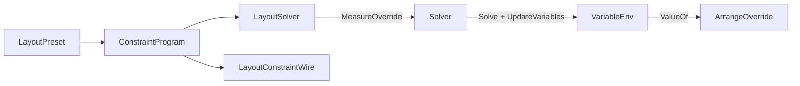

# [APPUI_LAYOUT_SOLVER]

A declarative constraint-layout engine replaces width-breakpoint knobs with a real Cassowary solver so responsive, self-sizing, and adaptive layouts resolve from typed constraints across desktop, web, and immersive surfaces. `LayoutConstraint` is the algebra of equalities, inequalities, and priorities over edge, size, and anchor variables; flex, grid-track, and auto-layout are constraint-row presets over it rather than parallel layout panels; and `LayoutSolver` is one custom Avalonia `Panel` that folds the `Kiwi` dual-simplex solve into the native measure/arrange pass. The page owns the constraint vocabulary, the flex/grid/auto-layout preset rows, the solver capsule, and the `LayoutConstraintWire` ordered-program projection; it mints no parallel layout panel, no second binding path, and no per-surface layout engine (the `[05]-[PROHIBITIONS]` parallel-control-framework clause forecloses it). The spine is `Kiwi` (`Variable`/`Term`/`Expression`/`Constraint`/`Strength`/`Solver`, `.api/api-kiwi.md`), Avalonia `Panel`/`Layoutable`, the `Theme/tokens` `Metric` rows, Thinktecture.Runtime.Extensions, and LanguageExt rails.

## [01]-[INDEX]

- [01]-[CONSTRAINT_ALGEBRA]: Edge/size/anchor variables; equality/inequality/priority rows; the typed relation vocabulary.
- [02]-[LAYOUT_PRESETS]: Flex, grid-track, and auto-layout as constraint-row presets, never parallel panels.
- [03]-[SOLVER_PANEL]: The one `LayoutSolver` panel folding the Kiwi solve into measure/arrange.
- [04]-[TS_PROJECTION]: `LayoutConstraintWire` ordered constraint program the `@lume/kiwi` head re-solves.

## [02]-[CONSTRAINT_ALGEBRA]

- Owner: `LayoutVar` the named layout variable (edge, size, anchor); `LayoutTerm` the variable-times-coefficient; `LayoutExpr` the linear form; `LayoutRelation` the relation axis; `LayoutStrength` the priority axis; `LayoutConstraint` the typed equality/inequality binding; `LayoutFault` the fault family in the 4400 code band.
- Cases: `LayoutRelation` = eq | le | ge; `LayoutStrength` = required | strong | medium | weak under the `Kiwi` lexicographic packing; `LayoutFault` = Text | Unsatisfiable | NonLinear | UnknownVariable in the 4400 code band.
- Entry: `public Constraint Compile(VariableEnv env)` — compiles a typed `LayoutConstraint` into a `Kiwi` `Constraint` over the resolved `Variable` handles at the row's `Strength`; the algebra composes through `Kiwi` operator overloads (`Variable * double` → `Term`, `Term + Term` → `Expression`), never hand-built tableau rows.
- Auto: `LayoutVar` names a child's `Left`/`Top`/`Right`/`Bottom`/`Width`/`Height`/`CenterX`/`CenterY` plus the panel's own bounds, so a layout rule reads geometry by variable; `LayoutConstraint` binds a `LayoutExpr` to a `LayoutRelation` at a `LayoutStrength` mapping onto `Constraint.Equal`/`LessEqual`/`GreaterEqual` at `Strength.Required`/`Strong`/`Medium`/`Weak`; `Theme/tokens` `Metric` rows supply spacing constants so a gap is a token value in the constraint, never a call-site literal; fixed structural rules use `required` and competing preferences use `strong`/`medium`/`weak` so the dual-simplex relaxes the lower-priority constraint instead of throwing.
- Packages: Kiwi, Thinktecture.Runtime.Extensions, LanguageExt.Core, BCL inbox
- Growth: a new layout variable is one `LayoutVar` kind; a new relation is structurally fixed at three; a new priority is structurally fixed at four; zero new surface — the algebra is the absorbing vocabulary.
- Boundary: the constraint algebra is the one layout vocabulary — a parallel layout panel (a flex panel, a grid panel, a dock panel beside this) is the `[05]-[PROHIBITIONS]` parallel-control-framework rejected form, so flex/grid/auto-layout are preset rows over this algebra, never sibling panels; `Constraint` identity is `Kiwi`-handle-based (`.api/api-kiwi.md` topology) so the solver owns constraint equality and a structural value-equality on `LayoutConstraint` for de-dup is the rejected form; boundary intake of constraint edits uses the `Kiwi` `Try*` family (`TryAddConstraint`, `TryAddEditVariable`, `TrySuggestValue`) so `UnsatisfiableConstraintException` and the duplicate/unknown rails never cross the layout-update boundary as exceptions — they lift onto the `Fin` rail as `LayoutFault`; `Metric` spacing constants enter the `LayoutExpr` constant term from the token vocabulary, so a hardcoded gap is the deleted form; the variable-introduction order is load-bearing for cross-surface parity (the `TS_PROJECTION` ordered-program invariant), so `VariableEnv` mints variables deterministically in declaration order.

```csharp signature
[SmartEnum<string>]
public sealed partial class LayoutRelation {
    public static readonly LayoutRelation Eq = new("eq", RelationalOperator.Equal);
    public static readonly LayoutRelation Le = new("le", RelationalOperator.LessThanOrEqual);
    public static readonly LayoutRelation Ge = new("ge", RelationalOperator.GreaterThanOrEqual);

    public RelationalOperator Operator { get; }
}

[SmartEnum<string>]
public sealed partial class LayoutStrength {
    public static readonly LayoutStrength Required = new("required", Strength.Required);
    public static readonly LayoutStrength Strong = new("strong", Strength.Strong);
    public static readonly LayoutStrength Medium = new("medium", Strength.Medium);
    public static readonly LayoutStrength Weak = new("weak", Strength.Weak);

    public double Value { get; }
}

public enum LayoutEdge { Left, Top, Right, Bottom, Width, Height, CenterX, CenterY }

public readonly record struct LayoutVar(string Owner, LayoutEdge Edge) {
    public string Name => $"{Owner}.{Edge}";
}

public readonly record struct LayoutTerm(LayoutVar Variable, double Coefficient);

public readonly record struct LayoutExpr(Seq<LayoutTerm> Terms, double Constant) {
    public static LayoutExpr Of(LayoutVar variable) => new(Seq(new LayoutTerm(variable, 1d)), 0d);
    public LayoutExpr Plus(double metric) => this with { Constant = Constant + metric };
    public LayoutExpr Minus(LayoutVar other) => this with { Terms = Terms.Add(new LayoutTerm(other, -1d)) };
}

[Union]
public abstract partial record LayoutFault : Expected, IValidationError<LayoutFault> {
    private LayoutFault(string detail, int code) : base(detail, code, None) { }

    public static LayoutFault Create(string message) => new Text(message);

    public sealed record Text : LayoutFault { public Text(string detail) : base(detail, 4400) { } }
    public sealed record Unsatisfiable : LayoutFault { public Unsatisfiable(string detail) : base(detail, 4401) { } }
    public sealed record NonLinear : LayoutFault { public NonLinear(string detail) : base(detail, 4402) { } }
    public sealed record UnknownVariable : LayoutFault { public UnknownVariable(string detail) : base(detail, 4403) { } }
}

public sealed record LayoutConstraint(LayoutExpr Left, LayoutRelation Relation, LayoutExpr Right, LayoutStrength Strength) {
    public Constraint Compile(VariableEnv env) =>
        Constraint.Make(env.Build(Left), Relation.Operator, env.Build(Right), Strength.Value);
}

public sealed class VariableEnv {
    private readonly Dictionary<string, Variable> handles = new(StringComparer.Ordinal);
    private readonly List<string> introduction = [];

    public Variable Resolve(LayoutVar variable) {
        if (!handles.TryGetValue(variable.Name, out var handle)) {
            handle = new Variable(variable.Name);
            handles[variable.Name] = handle;
            introduction.Add(variable.Name);
        }
        return handle;
    }

    public Expression Build(LayoutExpr expr) =>
        new(expr.Terms.Map(term => new Term(Resolve(term.Variable), term.Coefficient)).ToArray(), expr.Constant);

    public Seq<string> IntroductionOrder => toSeq(introduction);

    public double ValueOf(LayoutVar variable) => handles.TryGetValue(variable.Name, out var handle) ? handle.Value : 0d;
}
```

## [03]-[LAYOUT_PRESETS]

- Owner: `LayoutPreset` the `[Union]` of flex/grid-track/auto-layout preset rows; `ConstraintProgram` the ordered constraint sequence a preset expands into.
- Cases: `LayoutPreset` = Stack(Orientation, double Gap, FlexAlign Align) | Grid(Seq<TrackSize> Columns, Seq<TrackSize> Rows, double Gap) | AutoLayout(FlexDirection Direction, FlexWrap Wrap, FlexJustify Justify, double Gap) | Anchor(Seq<LayoutConstraint> Rules) under the locked kind literals.
- Entry: `public ConstraintProgram Expand(Seq<string> children, VariableEnv env)` — folds a preset over its children into the ordered `ConstraintProgram` of `LayoutConstraint` rows; the program records the variable-introduction order and edit-variable set so the same program re-solves identically on any surface.
- Auto: `Stack` expands a vertical or horizontal flow into `child[n].Top == child[n-1].Bottom + gap` chains at `required` plus the cross-axis alignment at `strong`; `Grid` expands fractional/fixed/auto track sizes into the `Kiwi` proportional constraints (`fr` tracks share the remaining space via equal-coefficient `strong` rows, fixed tracks pin at `required`, auto tracks size to content at `medium`); `AutoLayout` expands a design-tool flex (direction, wrap, justify, align, gap) into the constraint set Figma-grade auto-layout produces; `Anchor` is the raw constraint preset for bespoke layouts; flex, grid, and auto-layout are constraint-row presets so a responsive layout is one preset, never a parallel panel.
- Packages: Kiwi, Thinktecture.Runtime.Extensions, LanguageExt.Core, BCL inbox
- Growth: a new layout idiom is one `LayoutPreset` case expanding into constraint rows; a new track-size kind is one `TrackSize` case; zero new surface — presets are the only layout-idiom surface.
- Boundary: presets are constraint-row generators over the one algebra — a flex panel, a grid panel, and a uniform-grid panel beside this are the rejected forms, so every layout idiom expands to `LayoutConstraint` rows the one `LayoutSolver` panel solves; track sizes (`Fr`, `Fixed`, `Auto`) map onto `Kiwi` coefficient and strength patterns so a `1fr 2fr` split is two `strong` proportional rows, never per-track arithmetic; the gap is a `Theme/tokens` `Metric` value so a preset names a token gap, not a literal; the `ConstraintProgram` is ordered (introduction order plus edit-variable set plus suggested-value sequence) so the desktop tableau and the `@lume/kiwi` web tableau converge to identical positions — an order-free constraint dump is the silent per-surface drift defect the `TS_PROJECTION` invariant forecloses.

```csharp signature
public enum FlexDirection { Row, Column, RowReverse, ColumnReverse }
public enum FlexWrap { NoWrap, Wrap }
public enum FlexJustify { Start, Center, End, SpaceBetween, SpaceAround, SpaceEvenly }
public enum FlexAlign { Start, Center, End, Stretch }

[Union(ConversionFromValue = ConversionOperatorsGeneration.None)]
public abstract partial record TrackSize {
    private TrackSize() { }
    public sealed record Fr(double Weight) : TrackSize;
    public sealed record Fixed(double Pixels) : TrackSize;
    public sealed record Auto : TrackSize;
}

public sealed record ConstraintProgram(Seq<LayoutConstraint> Constraints, Seq<string> Introduction, Seq<(LayoutVar Var, LayoutStrength Strength)> Edits, Seq<(LayoutVar Var, double Value)> Suggestions);

[Union(ConversionFromValue = ConversionOperatorsGeneration.None)]
public abstract partial record LayoutPreset {
    private LayoutPreset() { }

    public sealed record Stack(Orientation Orientation, double Gap, FlexAlign Align) : LayoutPreset;
    public sealed record Grid(Seq<TrackSize> Columns, Seq<TrackSize> Rows, double Gap) : LayoutPreset;
    public sealed record AutoLayout(FlexDirection Direction, FlexWrap Wrap, FlexJustify Justify, double Gap) : LayoutPreset;
    public sealed record Anchor(Seq<LayoutConstraint> Rules) : LayoutPreset;

    public ConstraintProgram Expand(string panel, Seq<string> children, VariableEnv env) => Switch(
        state: (Panel: panel, Children: children, Env: env),
        stack: static (ctx, s) => StackProgram(ctx.Panel, ctx.Children, s, ctx.Env),
        grid: static (ctx, g) => GridProgram(ctx.Panel, ctx.Children, g, ctx.Env),
        autoLayout: static (ctx, a) => AutoProgram(ctx.Panel, ctx.Children, a, ctx.Env),
        anchor: static (ctx, a) => new ConstraintProgram(a.Rules, ctx.Env.IntroductionOrder, Seq<(LayoutVar, LayoutStrength)>(), Seq<(LayoutVar, double)>()));
}
```

## [04]-[SOLVER_PANEL]

- Owner: `LayoutSolver` the one custom Avalonia `Panel` folding the `Kiwi` solve into measure/arrange; `LayoutReceipt` the solve evidence.
- Entry: `protected override Size MeasureOverride(Size availableSize)` and `protected override Size ArrangeOverride(Size finalSize)` — the named boundary capsule where the constraint program adds its rows, the panel's own bounds drive as edit variables suggested to `availableSize`/`finalSize`, `Solver.Solve` runs the dual-simplex (`Solve` itself calls `UpdateVariables`, flushing each solved row constant into its `Variable.Value`), and `VariableEnv.ValueOf` reads the solved positions into each child's arrange rectangle.
- Auto: `MeasureOverride` builds the `Solver` from the `ConstraintProgram` once per program identity, measures each child for its content-size constraints, suggests the available size to the panel's edit variables, and reads the desired size from the solved panel extent; `ArrangeOverride` suggests the final size, runs `Solve`, and arranges each child at its solved `(Left, Top, Width, Height)`; runtime drag, resize, and content-size changes flow through `AddEditVariable` plus `SuggestValue` so the layout re-solves incrementally without rebuilding the tableau; the solve runs once per pass and `VariableEnv.ValueOf` reads each solved `Variable.Value` after `Solve` flushes the row constants — a direct post-solve value read, never a per-frame poll loop.
- Receipt: `LayoutReceipt` — panel key, constraint count, solve elapsed, unsatisfiable-fold flag, `Instant` — sealed through the screen evidence stream; `TelemetryRow` contributes the layout-solve and layout-unsatisfiable instruments inward through the AppHost `TelemetryContributorPort`.
- Packages: Kiwi, Avalonia, Thinktecture.Runtime.Extensions, LanguageExt.Core, NodaTime
- Growth: a new layout pass concern is one `LayoutSolver` policy value; one layout instrument is one `InstrumentRow` on `LayoutSolver.TelemetryRow`; zero new surface.
- Boundary: `LayoutSolver` is the named boundary capsule for the measure/arrange statement carve-out — the `Solver` mutation, the `SuggestValue` edits, and the child-arrange loop carry the only statement bodies, folding into Avalonia's native `Layoutable` pass rather than a parallel layout engine; the panel solves constraints once per surface so a per-child layout calculation is the deleted form; the `Try*` family lifts an unsatisfiable system onto the `Fin`/`LayoutReceipt` rail with the unsatisfiable-fold flag rather than throwing, so an over-constrained layout degrades to the relaxed solve rather than crashing the layout pass; the solved positions read back through `VariableEnv.ValueOf` querying each `Variable.Value` after `Solve` flushes the dual-simplex row constants (`.api/api-kiwi.md` `UpdateVariables` writes the solved row constant into each variable's store on `Solve`), so the panel reads positions by direct value lookup and a per-frame poll is the rejected form; the `ControlFactory` `Panel`/`Dock`/`Splitter` intents (`Shell/controls`) name their `ConstraintProgram` and hand it to this one panel through `MaterializeContext.Layout`, so a materialized layout rides the one solver; the panel's own measure stays Avalonia-native so a `LayoutSolver` nests inside ordinary Avalonia layout and an ordinary panel nests inside it.

```csharp signature
public sealed record LayoutReceipt(string Panel, int Constraints, Duration Elapsed, bool Relaxed, Instant At) {
    public const string Kind = "layout";
}

public sealed class LayoutSolver : Panel {
    private readonly VariableEnv env = new();
    private Solver solver = new();
    private ConstraintProgram program = new(Seq<LayoutConstraint>(), Seq<string>(), Seq<(LayoutVar, LayoutStrength)>(), Seq<(LayoutVar, double)>());

    public const string Key = "layout-solver";

    public Fin<Unit> Load(ConstraintProgram next) {
        var fresh = new Solver();
        program = next;
        return next.Constraints
            .Fold(Fin.Succ(unit), (rail, constraint) => rail.Bind(_ =>
                fresh.TryAddConstraint(constraint.Compile(env)) ? Fin.Succ(unit) : Fin.Fail<Unit>(new LayoutFault.Unsatisfiable(Key))))
            .Map(_ => { next.Edits.Iter(edit => fresh.TryAddEditVariable(env.Resolve(edit.Var), edit.Strength.Value)); solver = fresh; return unit; });
    }

    protected override Size MeasureOverride(Size availableSize) {
        Children.OfType<Control>().Iter(child => child.Measure(availableSize));
        Suggest(availableSize.Width, availableSize.Height);
        return new Size(env.ValueOf(new LayoutVar(Key, LayoutEdge.Width)), env.ValueOf(new LayoutVar(Key, LayoutEdge.Height)));
    }

    protected override Size ArrangeOverride(Size finalSize) {
        Suggest(finalSize.Width, finalSize.Height);
        Children.OfType<Control>().Iter(child => child.Arrange(SolvedRect(child)));
        return finalSize;
    }

    private void Suggest(double width, double height) {
        solver.TrySuggestValue(env.Resolve(new LayoutVar(Key, LayoutEdge.Width)), width);
        solver.TrySuggestValue(env.Resolve(new LayoutVar(Key, LayoutEdge.Height)), height);
        program.Suggestions.Iter(suggestion => solver.TrySuggestValue(env.Resolve(suggestion.Var), suggestion.Value));
        solver.Solve();
    }

    private Rect SolvedRect(Control child) =>
        child.Name is { } owner
            ? new Rect(
                env.ValueOf(new LayoutVar(owner, LayoutEdge.Left)), env.ValueOf(new LayoutVar(owner, LayoutEdge.Top)),
                env.ValueOf(new LayoutVar(owner, LayoutEdge.Width)), env.ValueOf(new LayoutVar(owner, LayoutEdge.Height)))
            : default;

    public const string SolveInstrument = "rasm.appui.layout.solve-elapsed";
    public const string UnsatisfiableInstrument = "rasm.appui.layout.unsatisfiable";

    public static TelemetryContributorPort TelemetryRow(string version) =>
        AppUiTelemetry.Contribute(version, SolveInstrument, UnsatisfiableInstrument);
}
```



## [05]-[TS_PROJECTION]

- Owner: `LayoutConstraintWire`, `LayoutVarWire`, `LayoutTermWire`, `LayoutProgramWire` — the ordered constraint program the `@lume/kiwi` web tableau re-solves; the `csharp:Rasm.AppUi/Layout` mint emits the `Kiwi`-authored ordered program over the `LayoutConstraint` family the `typescript:ui/viewer` head (`viewer/panel`) re-solves to the identical positions.
- Packages: BCL inbox
- Growth: one wire member row per new constraint field; zero new surface.
- Boundary: an under-constrained Cassowary system admits many valid assignments, so the `Kiwi` desktop tableau and the `@lume/kiwi` web tableau converge to identical positions only when `LayoutConstraintWire` carries the full ordered program — the variable-introduction order, the edit-variable set, and the suggested-value sequence the desktop solver fed — not just the relation set; an order-free constraint dump is the silent per-viewport drift defect, so the mint emits `LayoutProgramWire` with the introduction order, edit set, and suggestion sequence and the web head re-solves it, matching the `ONE_UI_INTENT_WIRE` strength/relation-parity invariant; shapes transcribe the camelCase Strict emission — each variable crosses as its `owner.edge` name, each term as its variable-coefficient pair, each constraint as its left/relation/right/strength rows with the relation as the locked `eq`/`le`/`ge` literal and the strength as the `required`/`strong`/`medium`/`weak` literal carrying its lexicographic value; the solved positions never cross because the web head re-solves them from the program.

```ts contract
interface LayoutVarWire { readonly owner: string; readonly edge: string; }
interface LayoutTermWire { readonly variable: LayoutVarWire; readonly coefficient: number; }
interface LayoutExprWire { readonly terms: readonly LayoutTermWire[]; readonly constant: number; }

interface LayoutConstraintWire {
  readonly left: LayoutExprWire;
  readonly relation: "eq" | "le" | "ge";
  readonly right: LayoutExprWire;
  readonly strength: "required" | "strong" | "medium" | "weak";
}

interface LayoutProgramWire {
  readonly constraints: readonly LayoutConstraintWire[];
  readonly introduction: readonly string[];
  readonly edits: readonly { readonly variable: LayoutVarWire; readonly strength: string }[];
  readonly suggestions: readonly { readonly variable: LayoutVarWire; readonly value: number }[];
}
```

## [06]-[RESEARCH]

- [KIWI_PANEL]: the Avalonia 12 `Panel`/`Layoutable` `MeasureOverride`/`ArrangeOverride` re-solve trigger surface the `LayoutSolver` binds — the `InvalidateMeasure`/`InvalidateArrange` propagation on a child content-size change and the `Variable.Value`-to-`Control.Arrange` read path (`VariableEnv.ValueOf` after `Solver.Solve` flushes the row constants) — resolved at implementation against the Avalonia layout pass; the `LayoutConstraint` algebra, the `Kiwi` `Solver`/`Constraint`/`Strength` composition (`.api/api-kiwi.md`), the preset expansion, and the ordered-program wire are settled, the measure/arrange re-solve trigger spellings are the unverified surface bound at composition.
