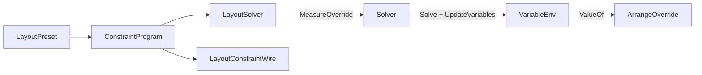

# [APPUI_LAYOUT_SOLVER]

A declarative constraint-layout engine replaces width-breakpoint knobs with a real Cassowary solver so responsive, self-sizing, and adaptive layouts resolve from typed constraints across desktop, web, and immersive surfaces. `LayoutConstraint` is the algebra of equalities, inequalities, and priorities over edge, size, and anchor variables; flex, grid-track, and auto-layout are constraint-row presets over it rather than parallel layout panels; and `LayoutSolver` is one custom Avalonia `Panel` that folds the `Kiwi` dual-simplex solve into the native measure/arrange pass. The page owns the constraint vocabulary, the flex/grid/auto-layout preset rows, the solver capsule, and the `LayoutConstraintWire` ordered-program projection; it mints no parallel layout panel, no second binding path, and no per-surface layout engine (the `[05]-[PROHIBITIONS]` parallel-control-framework clause forecloses it). The spine is `Kiwi` (`Variable`/`Term`/`Expression`/`Constraint`/`Strength`/`Solver`, `.api/api-kiwi.md`), Avalonia `Panel`/`Layoutable`, the `Theme/tokens` `Metric` rows, Thinktecture.Runtime.Extensions, and LanguageExt rails.

## [01]-[INDEX]

- [01]-[CONSTRAINT_ALGEBRA]: Edge/size/anchor variables; equality/inequality/priority rows; the typed relation vocabulary.
- [02]-[LAYOUT_PRESETS]: Flex, grid-track, and auto-layout as constraint-row presets, never parallel panels.
- [03]-[SOLVER_PANEL]: The one `LayoutSolver` panel folding the Kiwi solve into measure/arrange.
- [04]-[TS_PROJECTION]: `LayoutConstraintWire` ordered constraint program the `@lume/kiwi` head re-solves.

## [02]-[CONSTRAINT_ALGEBRA]

- Owner: `LayoutVar` the named layout variable (edge, size, anchor); `LayoutTerm` the variable-times-coefficient; `LayoutExpr` the linear form; `LayoutEdge` the eight-item edge vocabulary; `LayoutRelation` the relation axis; `LayoutStrength` the priority axis; `LayoutConstraint` the typed equality/inequality binding; `LayoutFault` the typed fault family on the `AppUiFaultBand.Layout` registry row (6020).
- Cases: `LayoutEdge` = left | top | right | bottom | width | height | center-x | center-y; `LayoutRelation` = eq | le | ge; `LayoutStrength` = required | strong | medium | weak under the `Kiwi` lexicographic packing; `LayoutFault` = Text | Unsatisfiable | NonLinear | UnknownVariable — codes derive through the `Diagnostics/evidence.md#FAULT_TABLES` registry.
- Entry: `public Constraint Compile(VariableEnv env)` — compiles a typed `LayoutConstraint` into a `Kiwi` `Constraint` over the resolved `Variable` handles at the row's `Strength`; the algebra composes through `Kiwi` operator overloads (`Variable * double` → `Term`, `Term + Term` → `Expression`), never hand-built tableau rows.
- Auto: `LayoutVar` names a child's `Left`/`Top`/`Right`/`Bottom`/`Width`/`Height`/`CenterX`/`CenterY` plus the panel's own bounds, so a layout rule reads geometry by variable; `LayoutConstraint` binds a `LayoutExpr` to a `LayoutRelation` at a `LayoutStrength` mapping onto `Constraint.Equal`/`LessEqual`/`GreaterEqual` at `Strength.Required`/`Strong`/`Medium`/`Weak`; `Theme/tokens` `Metric` rows supply spacing constants so a gap is a token value in the constraint, never a call-site literal; fixed structural rules use `required` and competing preferences use `strong`/`medium`/`weak` so the dual-simplex relaxes the lower-priority constraint instead of throwing.
- Packages: Kiwi, Thinktecture.Runtime.Extensions, LanguageExt.Core, BCL inbox
- Growth: a new layout variable is one `LayoutVar` kind; a new relation is structurally fixed at three; a new priority is structurally fixed at four; zero new surface — the algebra is the absorbing vocabulary.
- Boundary: the constraint algebra is the one layout vocabulary — a parallel layout panel (a flex panel, a grid panel, a dock panel beside this) is the `[05]-[PROHIBITIONS]` parallel-control-framework rejected form, so flex/grid/auto-layout are preset rows over this algebra, never sibling panels; `LayoutEdge` is a `[SmartEnum<string>]` vocabulary — its key is the wire edge literal `LayoutVarWire` carries and the `LayoutVar.Name` suffix, so the interior axis and the wire projection read one symbol source and a language enum for the semantic edge family is the rejected form; `Constraint` identity is `Kiwi`-handle-based (`.api/api-kiwi.md` topology) so the solver owns constraint equality and a structural value-equality on `LayoutConstraint` for de-dup is the rejected form; boundary intake of constraint edits uses the `Kiwi` `Try*` family (`TryAddConstraint`, `TryAddEditVariable`, `TrySuggestValue`) so `UnsatisfiableConstraintException` and the duplicate/unknown rails never cross the layout-update boundary as exceptions — they lift onto the `Fin` rail as `LayoutFault`; `Metric` spacing constants enter the `LayoutExpr` constant term from the token vocabulary, so a hardcoded gap is the deleted form; the variable-introduction order is load-bearing for cross-surface parity (the `TS_PROJECTION` ordered-program invariant) and derives from first appearance across the ordered constraint rows, so the program itself is the parity artifact and a stale environment snapshot can never desync the wire.

```csharp signature
[SmartEnum<string>]
public sealed partial class LayoutRelation {
    public static readonly LayoutRelation Eq = new("eq", RelationalOperator.Equal);
    public static readonly LayoutRelation Le = new("le", RelationalOperator.LessThanOrEqual);
    public static readonly LayoutRelation Ge = new("ge", RelationalOperator.GreaterThanOrEqual);

    public RelationalOperator Operator { get; }
}

[SmartEnum<string>]
public sealed partial class LayoutStrength {
    public static readonly LayoutStrength Required = new("required", Strength.Required);
    public static readonly LayoutStrength Strong = new("strong", Strength.Strong);
    public static readonly LayoutStrength Medium = new("medium", Strength.Medium);
    public static readonly LayoutStrength Weak = new("weak", Strength.Weak);

    public double Value { get; }
}

[SmartEnum<string>]
[KeyMemberEqualityComparer<ComparerAccessors.StringOrdinal, string>]
[KeyMemberComparer<ComparerAccessors.StringOrdinal, string>]
public sealed partial class LayoutEdge {
    public static readonly LayoutEdge Left = new("left");
    public static readonly LayoutEdge Top = new("top");
    public static readonly LayoutEdge Right = new("right");
    public static readonly LayoutEdge Bottom = new("bottom");
    public static readonly LayoutEdge Width = new("width");
    public static readonly LayoutEdge Height = new("height");
    public static readonly LayoutEdge CenterX = new("center-x");
    public static readonly LayoutEdge CenterY = new("center-y");
}

public readonly record struct LayoutVar(string Owner, LayoutEdge Edge) {
    public string Name => $"{Owner}.{Edge.Key}";
}

public readonly record struct LayoutTerm(LayoutVar Variable, double Coefficient);

public readonly record struct LayoutExpr(Seq<LayoutTerm> Terms, double Constant) {
    public static LayoutExpr Of(LayoutVar variable, double coefficient = 1d) => new(Seq(new LayoutTerm(variable, coefficient)), 0d);
    public static LayoutExpr Fixed(double constant) => new(Seq<LayoutTerm>(), constant);
    public LayoutExpr Plus(double metric) => this with { Constant = Constant + metric };
    public LayoutExpr Plus(LayoutVar other, double coefficient = 1d) => this with { Terms = Terms.Add(new LayoutTerm(other, coefficient)) };
    public LayoutExpr Minus(LayoutVar other) => Plus(other, -1d);
}

[Union]
public abstract partial record LayoutFault : Expected, IValidationError<LayoutFault> {
    private LayoutFault(string detail, int code) : base(detail, code, None) { }

    public static LayoutFault Create(string message) => new Text(message);

    public sealed record Text : LayoutFault { public Text(string detail) : base(detail, AppUiFaultBand.Layout.Code(0)) { } }
    public sealed record Unsatisfiable : LayoutFault { public Unsatisfiable(string detail) : base(detail, AppUiFaultBand.Layout.Code(1)) { } }
    public sealed record NonLinear : LayoutFault { public NonLinear(string detail) : base(detail, AppUiFaultBand.Layout.Code(2)) { } }
    public sealed record UnknownVariable : LayoutFault { public UnknownVariable(string detail) : base(detail, AppUiFaultBand.Layout.Code(3)) { } }
}

public sealed record LayoutConstraint(LayoutExpr Left, LayoutRelation Relation, LayoutExpr Right, LayoutStrength Strength) {
    public Constraint Compile(VariableEnv env) =>
        Constraint.Make(env.Build(Left), Relation.Operator, env.Build(Right), Strength.Value);
}

// Handles mint in constraint-compile order, so the live tableau's variable order IS the program's
// derived Introduction — no second introduction ledger exists to drift.
public sealed class VariableEnv {
    private readonly Dictionary<string, Variable> handles = new(StringComparer.Ordinal);

    public Variable Resolve(LayoutVar variable) {
        if (!handles.TryGetValue(variable.Name, out Variable? handle)) {
            handle = new Variable(variable.Name);
            handles[variable.Name] = handle;
        }
        return handle;
    }

    public Expression Build(LayoutExpr expr) =>
        new(expr.Terms.Map(term => new Term(Resolve(term.Variable), term.Coefficient)).ToArray(), expr.Constant);

    public Fin<double> ValueOf(LayoutVar variable) =>
        handles.TryGetValue(variable.Name, out Variable? handle)
            ? Fin.Succ(handle.Value)
            : Fin.Fail<double>(new LayoutFault.UnknownVariable(variable.Name));
}
```

## [03]-[LAYOUT_PRESETS]

- Owner: `LayoutPreset` the `[Union]` of flex/grid-track/auto-layout preset rows; `FlexDirection`, `FlexJustify`, and `FlexAlign` the policy vocabularies whose rows carry their own axis, distribution, and pinning behavior; `LayoutPrograms` the one flow-and-grid generator; `ConstraintProgram` the ordered constraint sequence a preset expands into.
- Cases: `LayoutPreset` = Flow(FlexDirection, WrapPolicy, FlexJustify, FlexAlign, string Gap) | Grid(Seq<TrackSize> Columns, Seq<TrackSize> Rows, string Gap) | Anchor(Seq<LayoutConstraint> Rules) under the locked kind literals — `Gap` is a `Theme/tokens` `Metric` row key resolved at expansion.
- Entry: `public ConstraintProgram Expand(string panel, Seq<string> children, Func<string, double> extentOf, double available, Func<string, double> metric)` — folds a preset over its children into the ordered `ConstraintProgram` of `LayoutConstraint` rows; `extentOf` supplies measured main extents and `available` the wrap width, both read only by the wrap partition; `metric` resolves the preset's `Gap` metric key against the resolved theme, bound at composition; the program carries the edit-variable set and derives the introduction order so the same program re-solves identically on any surface.
- Auto: `Stack` IS the degenerate auto-layout — one `LayoutPrograms.Flow` generator derives both, wrap off and `FlexJustify.Start` fixed, so a layout idiom is a parameter row over the generator, never a sibling program builder; `FlexJustify` rows distribute one shared per-rail spread variable by coefficient — `Start`/`End` anchor one end, `Center` equates the lead and trail slack, `SpaceBetween`/`SpaceAround`/`SpaceEvenly` differ only in the `LeadShare`/`TrailShare` coefficients on the shared spread — so six justify modes are one derivation over policy columns; `FlexAlign` rows pin the cross axis through their `Lead`/`Trail`/`Centered` columns, `Stretch` being lead-plus-trail; `Grid` expands fractional/fixed/auto track sizes into `Kiwi` proportional constraints (`fr` tracks share one unit variable via weighted `strong` rows, fixed tracks pin at `required`, auto tracks register `medium` edit rows the measure pass suggests content sizes onto); wrap partitions measured extents greedily into synthetic line owners whose extents bound their children — every rule linear, so the dual-simplex owns the whole layout; `Anchor` is the raw constraint preset for bespoke layouts.
- Packages: Kiwi, Thinktecture.Runtime.Extensions, LanguageExt.Core, BCL inbox
- Growth: a new layout idiom is one `LayoutPreset` case parameterizing the generator; a new distribution mode is one `FlexJustify` row of coefficients; a new track-size kind is one `TrackSize` case; zero new surface — presets are the only layout-idiom surface.
- Boundary: presets are constraint-row generators over the one algebra — a flex panel, a grid panel, and a uniform-grid panel beside this are the rejected forms, so every layout idiom expands to `LayoutConstraint` rows the one `LayoutSolver` panel solves; a wrap flow re-expands only when the width suggestion crosses a line-break boundary of the greedy partition, and the re-expansion lands through `LayoutSolver.Load`'s transactional swap, never an in-place tableau edit; track sizes (`Fr`, `Fixed`, `Auto`) map onto `Kiwi` coefficient and strength patterns so a `1fr 2fr` split is two `strong` proportional rows against one unit variable, never per-track arithmetic; the gap is a `Theme/tokens` `Metric` value so a preset names a token gap, not a literal; the `ConstraintProgram` is ordered (derived introduction order plus edit-variable set plus suggested-value sequence) so the desktop tableau and the `@lume/kiwi` web tableau converge to identical positions — an order-free constraint dump is the silent per-surface drift defect the `TS_PROJECTION` invariant forecloses.

```csharp signature
[SmartEnum<string>]
[KeyMemberEqualityComparer<ComparerAccessors.StringOrdinal, string>]
[KeyMemberComparer<ComparerAccessors.StringOrdinal, string>]
public sealed partial class FlexDirection {
    public static readonly FlexDirection Row = new("row", LayoutEdge.Left, LayoutEdge.Right, LayoutEdge.Width, LayoutEdge.CenterX, LayoutEdge.Top, LayoutEdge.Bottom, LayoutEdge.Height, LayoutEdge.CenterY, reversed: false);
    public static readonly FlexDirection Column = new("column", LayoutEdge.Top, LayoutEdge.Bottom, LayoutEdge.Height, LayoutEdge.CenterY, LayoutEdge.Left, LayoutEdge.Right, LayoutEdge.Width, LayoutEdge.CenterX, reversed: false);
    public static readonly FlexDirection RowReverse = new("row-reverse", LayoutEdge.Left, LayoutEdge.Right, LayoutEdge.Width, LayoutEdge.CenterX, LayoutEdge.Top, LayoutEdge.Bottom, LayoutEdge.Height, LayoutEdge.CenterY, reversed: true);
    public static readonly FlexDirection ColumnReverse = new("column-reverse", LayoutEdge.Top, LayoutEdge.Bottom, LayoutEdge.Height, LayoutEdge.CenterY, LayoutEdge.Left, LayoutEdge.Right, LayoutEdge.Width, LayoutEdge.CenterX, reversed: true);

    public LayoutEdge MainLead { get; }
    public LayoutEdge MainTrail { get; }
    public LayoutEdge MainExtent { get; }
    public LayoutEdge MainCenter { get; }
    public LayoutEdge CrossLead { get; }
    public LayoutEdge CrossTrail { get; }
    public LayoutEdge CrossExtent { get; }
    public LayoutEdge CrossCenter { get; }
    public bool Reversed { get; }
}

// Distribution is coefficient DATA: every justify mode is one derivation over these columns — the
// shared spread variable's edge shares (SpaceAround = half-gap edges, SpaceEvenly = full-gap edges).
[SmartEnum<string>]
[KeyMemberEqualityComparer<ComparerAccessors.StringOrdinal, string>]
[KeyMemberComparer<ComparerAccessors.StringOrdinal, string>]
public sealed partial class FlexJustify {
    public static readonly FlexJustify Start = new("start", anchorLead: true, anchorTrail: false, leadShare: 0d, trailShare: 0d, distributed: false);
    public static readonly FlexJustify Center = new("center", anchorLead: false, anchorTrail: false, leadShare: 0d, trailShare: 0d, distributed: false);
    public static readonly FlexJustify End = new("end", anchorLead: false, anchorTrail: true, leadShare: 0d, trailShare: 0d, distributed: false);
    public static readonly FlexJustify SpaceBetween = new("space-between", anchorLead: true, anchorTrail: true, leadShare: 0d, trailShare: 0d, distributed: true);
    public static readonly FlexJustify SpaceAround = new("space-around", anchorLead: true, anchorTrail: true, leadShare: 0.5d, trailShare: 0.5d, distributed: true);
    public static readonly FlexJustify SpaceEvenly = new("space-evenly", anchorLead: true, anchorTrail: true, leadShare: 1d, trailShare: 1d, distributed: true);

    public bool AnchorLead { get; }
    public bool AnchorTrail { get; }
    public double LeadShare { get; }
    public double TrailShare { get; }
    public bool Distributed { get; }
}

[SmartEnum<string>]
[KeyMemberEqualityComparer<ComparerAccessors.StringOrdinal, string>]
[KeyMemberComparer<ComparerAccessors.StringOrdinal, string>]
public sealed partial class FlexAlign {
    public static readonly FlexAlign Start = new("start", lead: true, trail: false, centered: false);
    public static readonly FlexAlign Center = new("center", lead: false, trail: false, centered: true);
    public static readonly FlexAlign End = new("end", lead: false, trail: true, centered: false);
    public static readonly FlexAlign Stretch = new("stretch", lead: true, trail: true, centered: false);

    public bool Lead { get; }
    public bool Trail { get; }
    public bool Centered { get; }
}

[Union(ConversionFromValue = ConversionOperatorsGeneration.None)]
public abstract partial record TrackSize {
    private TrackSize() { }
    public sealed record Fr(double Weight) : TrackSize;
    public sealed record Fixed(double Pixels) : TrackSize;
    public sealed record Auto : TrackSize;
}

[SmartEnum<string>]
public sealed partial class MeasureFold {
    public static readonly MeasureFold Maximum = new("maximum", values => values.IsEmpty ? 0d : values.Max());
    public static readonly MeasureFold Sum = new("sum", values => values.Sum());

    [UseDelegateFromConstructor]
    public partial double Apply(Seq<double> values);
}

public sealed record MeasureProbe(LayoutVar Target, Seq<LayoutVar> Sources, MeasureFold Fold);

public sealed record ConstraintProgram(
    Seq<LayoutConstraint> Constraints,
    Seq<(LayoutVar Var, LayoutStrength Strength)> Edits,
    Seq<(LayoutVar Var, double Value)> Suggestions,
    Seq<MeasureProbe> Measures) {
    // Introduction order derives from first appearance across the ordered constraint rows, so the
    // program IS the parity artifact — a stale env snapshot can never desync the wire.
    public string Panel => Edits.HeadOrNone().Map(static edit => edit.Var.Owner).IfNone(LayoutSolver.Key);

    public Seq<string> Introduction =>
        (Constraints.Bind(static row => row.Left.Terms + row.Right.Terms).Map(static term => term.Variable)
         + Edits.Map(static edit => edit.Var)
         + Suggestions.Map(static suggestion => suggestion.Var)
         + Measures.Bind(static probe => probe.Sources.Add(probe.Target)))
        .Map(static variable => variable.Name)
        .Distinct()
        .ToSeq();

    public ConstraintProgram ForPanel(string panel) => this with {
        Edits = (Seq(
            (new LayoutVar(panel, LayoutEdge.Width), LayoutStrength.Strong),
            (new LayoutVar(panel, LayoutEdge.Height), LayoutStrength.Strong)) + Edits)
            .DistinctBy(static edit => edit.Item1)
            .ToSeq(),
    };
}

[Union(ConversionFromValue = ConversionOperatorsGeneration.None)]
public abstract partial record LayoutPreset {
    private LayoutPreset() { }

    // Gap is a Theme/tokens Metric row KEY, never a scalar — the metric resolver supplies the resolved
    // value at expansion, so a preset structurally cannot choose spacing outside the token vocabulary.
    public sealed record Flow(FlexDirection Direction, WrapPolicy Wrap, FlexJustify Justify, FlexAlign Align, string Gap) : LayoutPreset;
    public sealed record Grid(Seq<TrackSize> Columns, Seq<TrackSize> Rows, string Gap) : LayoutPreset;
    public sealed record Anchor(Seq<LayoutConstraint> Rules) : LayoutPreset;

    // Flow policy rows generate both unwrapped stacks and wrapped rails through one body.
    public ConstraintProgram Expand(string panel, Seq<string> children, Func<string, double> extentOf, double available, Func<string, double> metric) =>
        Switch(
            state: (Panel: panel, Children: children, ExtentOf: extentOf, Available: available, Metric: metric),
            flow: static (ctx, f) => LayoutPrograms.Flow(ctx.Panel, ctx.Children, f.Direction, f.Wrap.Enabled, f.Justify, f.Align, ctx.Metric(f.Gap), ctx.ExtentOf, ctx.Available),
            grid: static (ctx, g) => LayoutPrograms.Cells(ctx.Panel, ctx.Children, g.Columns, g.Rows, ctx.Metric(g.Gap)),
            anchor: static (ctx, a) => new ConstraintProgram(
                a.Rules,
                Seq<(LayoutVar, LayoutStrength)>(),
                Seq<(LayoutVar, double)>(),
                Seq<MeasureProbe>()))
        .ForPanel(panel);
}

[SmartEnum<string>]
public sealed partial class WrapPolicy {
    public static readonly WrapPolicy None = new("none", enabled: false);
    public static readonly WrapPolicy Lines = new("lines", enabled: true);

    public bool Enabled { get; }
}

public static class LayoutPrograms {
    // Definitional identities every owner carries once: trailing edges and centers derive from lead
    // plus extent, extents stay non-negative, so a preset may constrain ANY edge coherently.
    public static Seq<LayoutConstraint> Geometry(string owner) => Seq(
        Rule(LayoutExpr.Of(new(owner, LayoutEdge.Right)), LayoutRelation.Eq, LayoutExpr.Of(new(owner, LayoutEdge.Left)).Plus(new LayoutVar(owner, LayoutEdge.Width)), LayoutStrength.Required),
        Rule(LayoutExpr.Of(new(owner, LayoutEdge.Bottom)), LayoutRelation.Eq, LayoutExpr.Of(new(owner, LayoutEdge.Top)).Plus(new LayoutVar(owner, LayoutEdge.Height)), LayoutStrength.Required),
        Rule(LayoutExpr.Of(new(owner, LayoutEdge.CenterX)), LayoutRelation.Eq, LayoutExpr.Of(new(owner, LayoutEdge.Left)).Plus(new LayoutVar(owner, LayoutEdge.Width), 0.5d), LayoutStrength.Required),
        Rule(LayoutExpr.Of(new(owner, LayoutEdge.CenterY)), LayoutRelation.Eq, LayoutExpr.Of(new(owner, LayoutEdge.Top)).Plus(new LayoutVar(owner, LayoutEdge.Height), 0.5d), LayoutStrength.Required),
        Rule(LayoutExpr.Of(new(owner, LayoutEdge.Width)), LayoutRelation.Ge, LayoutExpr.Fixed(0d), LayoutStrength.Required),
        Rule(LayoutExpr.Of(new(owner, LayoutEdge.Height)), LayoutRelation.Ge, LayoutExpr.Fixed(0d), LayoutStrength.Required));

    // One flow generator owns stack AND auto-layout: justify rows distribute one shared spread
    // variable by coefficient, align rows pin the cross axis, wrap partitions measured extents into
    // synthetic line owners whose extents bound their children — every rule linear.
    public static ConstraintProgram Flow(
        string panel, Seq<string> children, FlexDirection direction, bool wrap, FlexJustify justify, FlexAlign align,
        double gap, Func<string, double> extentOf, double available) {
        Seq<string> ordered = direction.Reversed ? children.Rev().ToSeq() : children;
        Seq<Seq<string>> lines = wrap ? Lines(ordered, extentOf, available, gap) : Seq(ordered);
        Seq<string> owners = wrap ? lines.Map((line, index) => $"{panel}.line{index}").ToSeq().Strict() : Seq(panel);
        Seq<LayoutConstraint> rows =
            Geometry(panel)
            + children.Bind(Geometry)
            + (wrap ? owners.Bind(Geometry) + Band(panel, owners, direction, gap) : Seq<LayoutConstraint>())
            + lines.Zip(owners).Bind(pair => Rail(pair.Item2, pair.Item1, direction, justify, align, gap));
        Seq<(LayoutVar Var, LayoutStrength Strength)> edits = children.Bind(child => Seq(
            (new LayoutVar(child, direction.MainExtent), LayoutStrength.Medium),
            (new LayoutVar(child, direction.CrossExtent), LayoutStrength.Medium)));
        Seq<MeasureProbe> measures = children.Bind(child => Seq(
            new MeasureProbe(
                new LayoutVar(child, direction.MainExtent),
                Seq(new LayoutVar(child, direction.MainExtent)),
                MeasureFold.Maximum),
            new MeasureProbe(
                new LayoutVar(child, direction.CrossExtent),
                Seq(new LayoutVar(child, direction.CrossExtent)),
                MeasureFold.Maximum)));
        return new ConstraintProgram(rows, edits, Seq<(LayoutVar, double)>(), measures);
    }

    // Greedy line partition over measured main extents — re-partitioned only when the width
    // suggestion crosses a break boundary, landing through the panel's transactional Load.
    private static Seq<Seq<string>> Lines(Seq<string> ordered, Func<string, double> extentOf, double available, double gap) =>
        ordered.Fold(
            (Lines: Seq<Seq<string>>(), Line: Seq<string>(), Used: 0d),
            (state, child) => state.Line.IsEmpty || state.Used + gap + extentOf(child) <= available
                ? (state.Lines, state.Line.Add(child), state.Used + (state.Line.IsEmpty ? 0d : gap) + extentOf(child))
                : (state.Lines.Add(state.Line), Seq(child), extentOf(child)))
        switch { var folded => folded.Lines.Add(folded.Line).Filter(static line => !line.IsEmpty) };

    // One rail: the pairwise chain, the justify anchors (shares scale the shared spread), the center
    // slack equation, the content hug, and the per-child cross pinning — six modes, one derivation.
    private static Seq<LayoutConstraint> Rail(string owner, Seq<string> line, FlexDirection axis, FlexJustify justify, FlexAlign align, double gap) {
        LayoutVar spread = new($"{owner}.flow", axis.MainExtent);
        LayoutExpr After(string prior) => justify.Distributed
            ? LayoutExpr.Of(new(prior, axis.MainTrail)).Plus(spread)
            : LayoutExpr.Of(new(prior, axis.MainTrail)).Plus(gap);
        return line.Zip(line.Skip(1)).Map(pair =>
                Rule(LayoutExpr.Of(new(pair.Item2, axis.MainLead)), LayoutRelation.Eq, After(pair.Item1), LayoutStrength.Required)).ToSeq()
            + (justify.Distributed
                ? Seq(
                    Rule(LayoutExpr.Of(spread), LayoutRelation.Ge, LayoutExpr.Fixed(gap), LayoutStrength.Strong),
                    Rule(LayoutExpr.Of(spread), LayoutRelation.Ge, LayoutExpr.Fixed(0d), LayoutStrength.Required))
                : Seq<LayoutConstraint>())
            + line.HeadOrNone().ToSeq().Bind(first => line.Rev().HeadOrNone().ToSeq().Bind(last =>
                (justify.AnchorLead
                    ? Seq(Rule(LayoutExpr.Of(new(first, axis.MainLead)), LayoutRelation.Eq, LayoutExpr.Of(new(owner, axis.MainLead)).Plus(spread, justify.LeadShare), LayoutStrength.Required))
                    : Seq<LayoutConstraint>())
                + (justify.AnchorTrail
                    ? Seq(Rule(LayoutExpr.Of(new(last, axis.MainTrail)), LayoutRelation.Eq, LayoutExpr.Of(new(owner, axis.MainTrail)).Plus(spread, -justify.TrailShare), LayoutStrength.Required))
                    : Seq(Rule(LayoutExpr.Of(new(owner, axis.MainTrail)), LayoutRelation.Ge, LayoutExpr.Of(new(last, axis.MainTrail)), LayoutStrength.Medium)))
                + (!justify.AnchorLead && !justify.AnchorTrail
                    ? Seq(
                        Rule(LayoutExpr.Of(new(first, axis.MainLead)).Plus(new LayoutVar(last, axis.MainTrail)), LayoutRelation.Eq,
                            LayoutExpr.Of(new(owner, axis.MainLead)).Plus(new LayoutVar(owner, axis.MainTrail)), LayoutStrength.Strong),
                        Rule(LayoutExpr.Of(new(first, axis.MainLead)), LayoutRelation.Ge, LayoutExpr.Of(new(owner, axis.MainLead)), LayoutStrength.Required))
                    : Seq<LayoutConstraint>())))
            + line.Bind(child =>
                (align.Lead ? Seq(Rule(LayoutExpr.Of(new(child, axis.CrossLead)), LayoutRelation.Eq, LayoutExpr.Of(new(owner, axis.CrossLead)), LayoutStrength.Strong)) : Seq<LayoutConstraint>())
                + (align.Trail ? Seq(Rule(LayoutExpr.Of(new(child, axis.CrossTrail)), LayoutRelation.Eq, LayoutExpr.Of(new(owner, axis.CrossTrail)), LayoutStrength.Strong)) : Seq<LayoutConstraint>())
                + (align.Centered ? Seq(Rule(LayoutExpr.Of(new(child, axis.CrossCenter)), LayoutRelation.Eq, LayoutExpr.Of(new(owner, axis.CrossCenter)), LayoutStrength.Strong)) : Seq<LayoutConstraint>())
                + Seq(Rule(LayoutExpr.Of(new(owner, axis.CrossTrail)), LayoutRelation.Ge, LayoutExpr.Of(new(child, axis.CrossTrail)), LayoutStrength.Medium)));
    }

    // Wrap line stacking: lines fill the main axis, chain on the cross axis, and the panel hugs the
    // last line — line extents are bounded below by their children inside Rail's cross hug.
    private static Seq<LayoutConstraint> Band(string panel, Seq<string> lines, FlexDirection direction, double gap) =>
        lines.HeadOrNone().ToSeq().Map(head =>
            Rule(LayoutExpr.Of(new(head, direction.CrossLead)), LayoutRelation.Eq, LayoutExpr.Of(new(panel, direction.CrossLead)), LayoutStrength.Required))
        + lines.Zip(lines.Skip(1)).Map(pair =>
            Rule(LayoutExpr.Of(new(pair.Item2, direction.CrossLead)), LayoutRelation.Eq, LayoutExpr.Of(new(pair.Item1, direction.CrossTrail)).Plus(gap), LayoutStrength.Required)).ToSeq()
        + lines.Bind(line => Seq(
            Rule(LayoutExpr.Of(new(line, direction.MainLead)), LayoutRelation.Eq, LayoutExpr.Of(new(panel, direction.MainLead)), LayoutStrength.Required),
            Rule(LayoutExpr.Of(new(line, direction.MainTrail)), LayoutRelation.Eq, LayoutExpr.Of(new(panel, direction.MainTrail)), LayoutStrength.Required)))
        + lines.Rev().HeadOrNone().ToSeq().Map(last =>
            Rule(LayoutExpr.Of(new(panel, direction.CrossTrail)), LayoutRelation.Ge, LayoutExpr.Of(new(last, direction.CrossTrail)), LayoutStrength.Medium));

    // Grid: track owners chain across the panel, fr tracks share one unit variable by weight, fixed
    // tracks pin, auto tracks register Medium edits the measure pass suggests content sizes onto,
    // and children pin to their row-major cell.
    public static ConstraintProgram Cells(string panel, Seq<string> children, Seq<TrackSize> columns, Seq<TrackSize> rows, double gap) {
        Seq<TrackSize> admittedColumns = columns.IsEmpty ? Seq<TrackSize>(new TrackSize.Auto()) : columns;
        int neededRows = Math.Max(1, (int)Math.Ceiling((double)children.Length / admittedColumns.Length));
        Seq<TrackSize> admittedRows = rows.IsEmpty ? Seq<TrackSize>(new TrackSize.Auto()) : rows;
        Seq<TrackSize> completedRows = admittedRows + toSeq(Enumerable.Range(0, Math.Max(0, neededRows - admittedRows.Length)).Select(static _ => (TrackSize)new TrackSize.Auto()));
        Seq<(string Owner, TrackSize Track)> cols = admittedColumns.Map((track, i) => (Owner: $"{panel}.col{i}", Track: track)).ToSeq().Strict();
        Seq<(string Owner, TrackSize Track)> bands = completedRows.Map((track, j) => (Owner: $"{panel}.row{j}", Track: track)).ToSeq().Strict();
        Seq<LayoutConstraint> railRows =
            Geometry(panel) + children.Bind(Geometry)
            + Tracks(panel, cols, LayoutEdge.Left, LayoutEdge.Right, LayoutEdge.Width, new LayoutVar($"{panel}.fr-col", LayoutEdge.Width), gap)
            + Tracks(panel, bands, LayoutEdge.Top, LayoutEdge.Bottom, LayoutEdge.Height, new LayoutVar($"{panel}.fr-row", LayoutEdge.Height), gap)
            + children.Map((child, index) => Cell(child, cols[index % cols.Length].Owner, bands[Math.Min(index / cols.Length, bands.Length - 1)].Owner)).ToSeq().Bind(identity);
        Seq<(LayoutVar Var, LayoutStrength Strength)> edits =
            cols.Bind(track => track.Track is TrackSize.Auto
                ? Seq((new LayoutVar(track.Owner, LayoutEdge.Width), LayoutStrength.Medium))
                : Seq<(LayoutVar, LayoutStrength)>())
            + bands.Bind(track => track.Track is TrackSize.Auto
                ? Seq((new LayoutVar(track.Owner, LayoutEdge.Height), LayoutStrength.Medium))
                : Seq<(LayoutVar, LayoutStrength)>());
        Seq<MeasureProbe> measures =
            cols.Map((track, column) => track.Track is TrackSize.Auto
                ? Some(new MeasureProbe(
                    new LayoutVar(track.Owner, LayoutEdge.Width),
                    children.Map((child, index) => index % cols.Length == column
                        ? Some(new LayoutVar(child, LayoutEdge.Width))
                        : Option<LayoutVar>.None).Somes(),
                    MeasureFold.Maximum))
                : Option<MeasureProbe>.None).Somes()
            + bands.Map((track, row) => track.Track is TrackSize.Auto
                ? Some(new MeasureProbe(
                    new LayoutVar(track.Owner, LayoutEdge.Height),
                    children.Map((child, index) => index / cols.Length == row
                        ? Some(new LayoutVar(child, LayoutEdge.Height))
                        : Option<LayoutVar>.None).Somes(),
                    MeasureFold.Maximum))
                : Option<MeasureProbe>.None).Somes();
        return new ConstraintProgram(railRows, edits, Seq<(LayoutVar, double)>(), measures);
    }

    private static Seq<LayoutConstraint> Tracks(string panel, Seq<(string Owner, TrackSize Track)> tracks, LayoutEdge lead, LayoutEdge trail, LayoutEdge extent, LayoutVar unit, double gap) =>
        tracks.HeadOrNone().ToSeq().Map(head =>
            Rule(LayoutExpr.Of(new(head.Owner, lead)), LayoutRelation.Eq, LayoutExpr.Of(new(panel, lead)), LayoutStrength.Required))
        + tracks.Zip(tracks.Skip(1)).Map(pair =>
            Rule(LayoutExpr.Of(new(pair.Item2.Owner, lead)), LayoutRelation.Eq, LayoutExpr.Of(new(pair.Item1.Owner, lead)).Plus(new LayoutVar(pair.Item1.Owner, extent)).Plus(gap), LayoutStrength.Required)).ToSeq()
        + tracks.Rev().HeadOrNone().ToSeq().Map(last =>
            Rule(LayoutExpr.Of(new(panel, trail)), LayoutRelation.Eq, LayoutExpr.Of(new(last.Owner, lead)).Plus(new LayoutVar(last.Owner, extent)), LayoutStrength.Required))
        + tracks.Bind(track => track.Track.Switch(
            fr: f => Seq(Rule(LayoutExpr.Of(new(track.Owner, extent)), LayoutRelation.Eq, LayoutExpr.Of(unit, f.Weight), LayoutStrength.Strong)),
            @fixed: f => Seq(Rule(LayoutExpr.Of(new(track.Owner, extent)), LayoutRelation.Eq, LayoutExpr.Fixed(f.Pixels), LayoutStrength.Required)),
            auto: _ => Seq(Rule(LayoutExpr.Of(new(track.Owner, extent)), LayoutRelation.Ge, LayoutExpr.Fixed(0d), LayoutStrength.Required))));

    private static Seq<LayoutConstraint> Cell(string child, string col, string band) => Seq(
        Rule(LayoutExpr.Of(new(child, LayoutEdge.Left)), LayoutRelation.Eq, LayoutExpr.Of(new(col, LayoutEdge.Left)), LayoutStrength.Required),
        Rule(LayoutExpr.Of(new(child, LayoutEdge.Width)), LayoutRelation.Eq, LayoutExpr.Of(new(col, LayoutEdge.Width)), LayoutStrength.Required),
        Rule(LayoutExpr.Of(new(child, LayoutEdge.Top)), LayoutRelation.Eq, LayoutExpr.Of(new(band, LayoutEdge.Top)), LayoutStrength.Required),
        Rule(LayoutExpr.Of(new(child, LayoutEdge.Height)), LayoutRelation.Eq, LayoutExpr.Of(new(band, LayoutEdge.Height)), LayoutStrength.Required));

    private static LayoutConstraint Rule(LayoutExpr left, LayoutRelation relation, LayoutExpr right, LayoutStrength strength) => new(left, relation, right, strength);
}
```

## [04]-[SOLVER_PANEL]

- Owner: `LayoutSolver` the one custom Avalonia `Panel` folding the `Kiwi` solve into measure/arrange; `LayoutReceipt` the solve evidence.
- Entry: `protected override Size MeasureOverride(Size availableSize)` and `protected override Size ArrangeOverride(Size finalSize)` — the named boundary capsule where the constraint program adds its rows, the panel's own bounds drive as edit variables suggested to `availableSize`/`finalSize`, `Solver.Solve` runs the dual-simplex (`Solve` itself calls `UpdateVariables`, flushing each solved row constant into its `Variable.Value`), and `VariableEnv.ValueOf` reads the solved positions into each child's arrange rectangle.
- Auto: `MeasureOverride` builds the `Solver` from the `ConstraintProgram` once per program identity, measures each child, suggests the available size to the panel's edit variables, then suggests every measured child extent onto its `Medium` edit row through `Measured` — the flow and auto-track content-size loop, guarded by `HasEditVariable` so a cell-pinned child skips structurally — and reads the desired size from the solved panel extent; `ArrangeOverride` suggests the final size, runs `Solve`, and arranges each child at its solved `(Left, Top, Width, Height)`; runtime drag, resize, and content-size changes flow through `AddEditVariable` plus `SuggestValue` so the layout re-solves incrementally without rebuilding the tableau; the solve runs once per pass and `VariableEnv.ValueOf` reads each solved `Variable.Value` after `Solve` flushes the row constants — a direct post-solve value read, never a per-frame poll loop.
- Receipt: `LayoutReceipt` — panel key, constraint count, solve elapsed, unsatisfiable-fold flag, `Instant` — sealed through the screen evidence stream; `TelemetryRow` contributes the layout-solve and layout-unsatisfiable instruments inward through the AppHost `TelemetryContributorPort`.
- Packages: Kiwi, Avalonia, Thinktecture.Runtime.Extensions, LanguageExt.Core, NodaTime
- Growth: a new layout pass concern is one `LayoutSolver` policy value; one layout instrument is one `InstrumentRow` on `LayoutSolver.TelemetryRow`; zero new surface.
- Boundary: `LayoutSolver` is the named boundary capsule for the measure/arrange statement carve-out — the `Solver` mutation, the `SuggestValue` edits, and the child-arrange loop carry the only statement bodies, folding into Avalonia's native `Layoutable` pass rather than a parallel layout engine; the panel solves constraints once per surface so a per-child layout calculation is the deleted form; the `Try*` family lifts an unsatisfiable system onto the `Fin`/`LayoutReceipt` rail with the unsatisfiable-fold flag rather than throwing, so an over-constrained layout degrades to the relaxed solve rather than crashing the layout pass; the solved positions read back through `VariableEnv.ValueOf` querying each `Variable.Value` after `Solve` flushes the dual-simplex row constants (`.api/api-kiwi.md` `UpdateVariables` writes the solved row constant into each variable's store on `Solve`), so the panel reads positions by direct value lookup and a per-frame poll is the rejected form; the `ControlFactory` `Panel`/`Dock` intents (`Shell/controls`) name their `ConstraintProgram`, hand it to this one panel through `MaterializeContext.Layout`, and stamp `ChildKeyProperty` from each child intent's `Key` in their `Mounted` fold before any child enters `Children` — the one admitted source of the solver's child identity, so every arranged child resolves its four geometry variables through a program-owner key, a keyless child is unmountable at materialize rather than a post-arrange surprise, and a nullable `Control.Name` fallback is the deleted form; the panel's own measure stays Avalonia-native so a `LayoutSolver` nests inside ordinary Avalonia layout and an ordinary panel nests inside it; a variable a layout node must observe binds a custom `IVariableStore` so `Solve`'s `UpdateVariables` flush writes the solved row constant straight into the bound store — the observation growth seam, never a post-solve polling loop.

```csharp signature
public sealed record LayoutReceipt(string Panel, int Constraints, Duration Elapsed, bool Relaxed, Instant At) {
    public const string Kind = "layout";
}

public sealed class LayoutSolver : Panel {
    private VariableEnv env = new();
    private Solver solver = new();
    private ConstraintProgram program = new(
        Seq<LayoutConstraint>(),
        Seq<(LayoutVar, LayoutStrength)>(),
        Seq<(LayoutVar, double)>(),
        Seq<MeasureProbe>());

    public const string Key = "layout-solver";

    // Load enforces the Suggest contract structurally: every variable Suggest later touches — the panel
    // width/height pair AND every program suggestion row — registers as an edit variable here, so
    // TrySuggestValue never addresses an unregistered variable and a registration failure is a typed fault.
    // Commit is TRANSACTIONAL over the whole triple: each Load compiles into a FRESH Solver AND a FRESH
    // VariableEnv, and solver/env/program swap together only after the full rail succeeds — a failed load
    // leaves the prior triple intact and a stale variable handle from a rejected or superseded program
    // can never leak into the live tableau.
    public Fin<Unit> Load(ConstraintProgram next) {
        (Solver fresh, VariableEnv scope) = (new Solver(), new VariableEnv());
        return next.Constraints
            .Fold(Fin.Succ(unit), (rail, constraint) => rail.Bind(_ =>
                fresh.TryAddConstraint(constraint.Compile(scope)) ? Fin.Succ(unit) : Fin.Fail<Unit>(new LayoutFault.Unsatisfiable(Key))))
            .Bind(_ => EditRows(next)
                .Fold(Fin.Succ(unit), (rail, edit) => rail.Bind(__ =>
                    fresh.TryAddEditVariable(scope.Resolve(edit.Var), edit.Strength.Value)
                        ? Fin.Succ(unit)
                        : Fin.Fail<Unit>(new LayoutFault.UnknownVariable(edit.Var.Name)))))
            .Map(_ => {
                (solver, env, program) = (fresh, scope, next);
                InvalidateMeasure();
                return unit;
            });
    }

    private static Seq<(LayoutVar Var, LayoutStrength Strength)> EditRows(ConstraintProgram next) =>
        next.Edits
        + next.Suggestions
            .Map(static suggestion => (suggestion.Var, LayoutStrength.Medium))
            .Filter(row => !next.Edits.Exists(edit => edit.Var == row.Var));

    // The pass-fault cell: a failed suggest or a keyless child lands HERE as a typed fault the receipt
    // seal consumes (Relaxed = fault present) — the layout pass degrades to the last solved state and
    // never throws mid-pass, and a false TrySuggestValue is never silently ignored.
    private Option<LayoutFault> fault = None;

    public Option<LayoutFault> LastFault => fault;

    protected override Size MeasureOverride(Size availableSize) {
        Children.OfType<Control>().Iter(child => child.Measure(availableSize));
        ignore(Commit(Suggest(availableSize.Width, availableSize.Height).Bind(_ => Measured()).Map(_ => (fun(solver.Solve)(), unit).Item2)));
        return new Size(Read(new LayoutVar(program.Panel, LayoutEdge.Width)), Read(new LayoutVar(program.Panel, LayoutEdge.Height)));
    }

    protected override Size ArrangeOverride(Size finalSize) {
        ignore(Commit(Suggest(finalSize.Width, finalSize.Height).Map(_ => (fun(solver.Solve)(), unit).Item2)));
        Children.OfType<Control>().Iter(child => SolvedRect(child).Match(
            Succ: rect => { child.Arrange(rect); return unit; },
            Fail: error => Commit(Fin.Fail<Unit>(error))));
        return finalSize;
    }

    // Child content sizes suggest onto their Medium edit rows after the panel suggestion; only a
    // registered edit receives a suggest, so a cell-pinned child (no content edit row) skips structurally.
    private Fin<Unit> Measured() {
        HashMap<LayoutVar, double> observed = toSeq(Children.OfType<Control>())
            .Bind(child => child.GetValue(ChildKeyProperty) is { Length: > 0 } owner
                ? Seq(
                    (Var: new LayoutVar(owner, LayoutEdge.Width), Value: child.DesiredSize.Width),
                    (Var: new LayoutVar(owner, LayoutEdge.Height), Value: child.DesiredSize.Height))
                : Seq<(LayoutVar Var, double Value)>())
            .ToHashMap(static row => row.Var, static row => row.Value);
        return program.Measures
            .Map(probe => (
                Var: probe.Target,
                Value: probe.Fold.Apply(probe.Sources.Choose(observed.Find))))
            .Filter(row => solver.HasEditVariable(env.Resolve(row.Var)))
            .Fold(Fin.Succ(unit), (rail, row) => rail.Bind(_ =>
                solver.TrySuggestValue(env.Resolve(row.Var), row.Value)
                    ? Fin.Succ(unit)
                    : Fin.Fail<Unit>(new LayoutFault.UnknownVariable(row.Var.Name))));
    }

    private Unit Commit(Fin<Unit> outcome) {
        fault = outcome.Match(
            Succ: static _ => Option<LayoutFault>.None,
            Fail: error => Some(error is LayoutFault typed ? typed : new LayoutFault.Text(error.Message)));
        return unit;
    }

    private Fin<Unit> Suggest(double width, double height) =>
        (Seq(
            (Var: new LayoutVar(program.Panel, LayoutEdge.Width), Value: width),
            (Var: new LayoutVar(program.Panel, LayoutEdge.Height), Value: height))
         + program.Suggestions)
        .Fold(Fin.Succ(unit), (rail, row) => rail.Bind(_ =>
            solver.TrySuggestValue(env.Resolve(row.Var), row.Value)
                ? Fin.Succ(unit)
                : Fin.Fail<Unit>(new LayoutFault.UnknownVariable(row.Var.Name))));

    private double Read(LayoutVar variable) =>
        env.ValueOf(variable).Match(
            Succ: static value => value,
            Fail: error => (Commit(Fin.Fail<Unit>(error)), 0d).Item2);

    // Solved geometry keys by a REQUIRED child identity: the program child key attached at materialization
    // (ChildKeyProperty, set from the ControlIntent key) — a nullable Control.Name lookup is the deleted form.
    public static readonly AttachedProperty<string> ChildKeyProperty =
        AvaloniaProperty.RegisterAttached<LayoutSolver, Control, string>("ChildKey");

    private Fin<Rect> SolvedRect(Control child) {
        string owner = child.GetValue(ChildKeyProperty);
        return string.IsNullOrEmpty(owner)
            ? Fin.Fail<Rect>(new LayoutFault.UnknownVariable($"{child.GetType().Name} mounted without a program child key"))
            : from left in env.ValueOf(new LayoutVar(owner, LayoutEdge.Left))
              from top in env.ValueOf(new LayoutVar(owner, LayoutEdge.Top))
              from width in env.ValueOf(new LayoutVar(owner, LayoutEdge.Width))
              from height in env.ValueOf(new LayoutVar(owner, LayoutEdge.Height))
              select new Rect(left, top, width, height);
    }

    public const string SolveInstrument = "rasm.appui.layout.solve.elapsed";
    public const string UnsatisfiableInstrument = "rasm.appui.layout.unsatisfiable";

    public static TelemetryContributorPort TelemetryRow(string version, string schemaUrl) =>
        AppUiTelemetry.Contribute(version, schemaUrl,
            new(SolveInstrument, InstrumentKind.Distribution, "s", "constraint solve wall duration per panel", Buckets.InteractionSeconds),
            new(UnsatisfiableInstrument, InstrumentKind.Count, "{solve}", "solves relaxed on an unsatisfiable fold"));

    // Composition binds this projection onto the same screen evidence stream that carries the receipt,
    // so solve metrics derive from the sealed evidence and no measure/arrange pass touches the meter.
    public static Unit Observe(InstrumentSet set, LayoutReceipt receipt) =>
        (ignore(set.Record(SolveInstrument, receipt.Elapsed.TotalSeconds,
             new KeyValuePair<string, object?>("panel", receipt.Panel))),
         receipt.Relaxed
            ? ignore(set.Count(UnsatisfiableInstrument, 1L, new KeyValuePair<string, object?>("panel", receipt.Panel)))
            : unit).Item2;
}
```



## [05]-[TS_PROJECTION]

- Owner: `LayoutConstraintWire`, `LayoutVarWire`, `LayoutTermWire`, `LayoutProgramWire` — the ordered constraint program the `@lume/kiwi` web tableau re-solves; the `csharp:Rasm.AppUi/Layout` mint emits the `Kiwi`-authored ordered program over the `LayoutConstraint` family the `typescript:ui/viewer` head (`viewer/panel`) re-solves to the identical positions.
- Packages: BCL inbox
- Growth: one wire member row per new constraint field; zero new surface.
- Boundary: an under-constrained Cassowary system admits many valid assignments, so the `Kiwi` desktop tableau and the `@lume/kiwi` web tableau converge to identical positions only when `LayoutConstraintWire` carries the full ordered program — variable-introduction order, edit-variable set, authored suggestions, and the resolved measurement suggestions the desktop solve consumed — not just the relation set; `LayoutProgramWire` therefore emits `measurements` after `MeasureOverride` folds `MeasureProbe` rows, preventing each runtime from substituting a different text or control measurement while claiming positional parity; shapes transcribe the camelCase Strict emission — each variable crosses as its `owner.edge` name, each term as its variable-coefficient pair, each constraint as its left/relation/right/strength rows with the relation as the locked `eq`/`le`/`ge` literal and the strength as the `required`/`strong`/`medium`/`weak` literal carrying its lexicographic value; solved positions never cross because the web head re-solves the same ordered inputs.

```ts signature
interface LayoutVarWire { readonly owner: string; readonly edge: string; }
interface LayoutTermWire { readonly variable: LayoutVarWire; readonly coefficient: number; }
interface LayoutExprWire { readonly terms: readonly LayoutTermWire[]; readonly constant: number; }

interface LayoutConstraintWire {
  readonly left: LayoutExprWire;
  readonly relation: "eq" | "le" | "ge";
  readonly right: LayoutExprWire;
  readonly strength: "required" | "strong" | "medium" | "weak";
}

interface LayoutProgramWire {
  readonly constraints: readonly LayoutConstraintWire[];
  readonly introduction: readonly string[];
  readonly edits: readonly { readonly variable: LayoutVarWire; readonly strength: string }[];
  readonly suggestions: readonly { readonly variable: LayoutVarWire; readonly value: number }[];
  readonly measurements: readonly { readonly variable: LayoutVarWire; readonly value: number }[];
}
```

## [06]-[RESEARCH]

- [KIWI_PANEL]: the Avalonia 12 `Panel`/`Layoutable` `MeasureOverride`/`ArrangeOverride` re-solve trigger surface the `LayoutSolver` binds — the `InvalidateMeasure`/`InvalidateArrange` propagation on a child content-size change and the `Variable.Value`-to-`Control.Arrange` read path (`VariableEnv.ValueOf` after `Solver.Solve` flushes the row constants) — resolved at implementation against the Avalonia layout pass; the `LayoutConstraint` algebra, the `Kiwi` `Solver`/`Constraint`/`Strength` composition (`.api/api-kiwi.md`), the preset expansion, and the ordered-program wire are settled, the measure/arrange re-solve trigger spellings are the unverified surface bound at composition.
