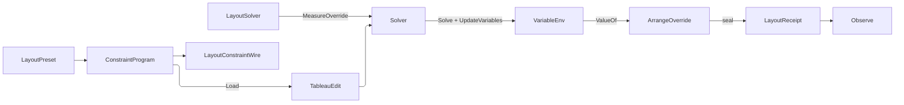

# [APPUI_LAYOUT_SOLVER]

A declarative constraint-layout engine replaces width-breakpoint knobs with a real Cassowary solver so responsive, self-sizing, and adaptive layouts resolve from typed constraints across desktop, web, and immersive surfaces. `LayoutConstraint` is the algebra of equalities, inequalities, and priorities over edge, size, and anchor variables; flex, grid-track, and auto-layout are constraint-row presets over it rather than parallel layout panels; and `LayoutSolver` is one custom Avalonia `Panel` that folds the `Kiwi` dual-simplex solve into the native measure/arrange pass. The page owns the constraint vocabulary, the flex/grid/auto-layout preset rows, the solver capsule, and the `LayoutConstraintWire` ordered-program projection; it mints no parallel layout panel, no second binding path, and no per-surface layout engine (the `[04]-[BOUNDARIES]` parallel-control-framework clause forecloses it). The spine is `Kiwi` (`Variable`/`Term`/`Expression`/`Constraint`/`Strength`/`Solver`, `.api/api-kiwi.md`), Avalonia `Panel`/`Layoutable`, the `Theme/tokens` `MetricFamily` rows, Thinktecture.Runtime.Extensions, and LanguageExt rails.

## [01]-[INDEX]

- [02]-[CONSTRAINT_ALGEBRA]: Edge/size/anchor variables; equality/inequality/priority rows; the typed relation vocabulary.
- [03]-[LAYOUT_PRESETS]: Flex, grid-track, and auto-layout as constraint-row presets, never parallel panels.
- [04]-[SOLVER_PANEL]: The one `LayoutSolver` panel folding the Kiwi solve into measure/arrange.
- [05]-[TS_PROJECTION]: `LayoutConstraintWire` ordered constraint program the `@lume/kiwi` head re-solves.

## [02]-[CONSTRAINT_ALGEBRA]

- Owner: `LayoutVar` the named layout variable (edge, size, anchor); `LayoutTerm` the variable-times-coefficient; `LayoutExpr` the linear form; `LayoutEdge` the eight-item edge vocabulary; `LayoutRelation` the relation axis; `LayoutStrength` the priority axis; `LayoutConstraint` the typed equality/inequality binding; `VariableEnv` the `Variable`-handle owner carrying the observation-store column; `LayoutFault` the typed fault family on the `AppUiFaultBand.Layout` registry row (6020).
- Cases: `LayoutEdge` = left | top | right | bottom | width | height | center-x | center-y; `LayoutRelation` = eq | le | ge; `LayoutStrength` = required | strong | medium | weak under the `Kiwi` lexicographic packing; `LayoutFault` = Text | Unsatisfiable | NonLinear | UnknownVariable — codes derive through the `Diagnostics/evidence#FAULT_TABLES` registry.
- Entry: `public Constraint Compile(VariableEnv env)` — compiles a typed `LayoutConstraint` into a `Kiwi` `Constraint` over the resolved `Variable` handles at the row's `Strength`; the algebra composes through `Kiwi` operator overloads (`Variable * double` → `Term`, `Term + Term` → `Expression`), never hand-built tableau rows.
- Auto: `LayoutVar` names a child's `Left`/`Top`/`Right`/`Bottom`/`Width`/`Height`/`CenterX`/`CenterY` plus the panel's own bounds, so a layout rule reads geometry by variable; `LayoutConstraint` binds a `LayoutExpr` to a `LayoutRelation` at a `LayoutStrength` mapping onto `Constraint.Equal`/`LessEqual`/`GreaterEqual` at `Strength.Required`/`Strong`/`Medium`/`Weak`; `Theme/tokens` `MetricFamily` rows supply spacing constants so a gap is a generated `TokenKey` resolved into the constraint, never a call-site literal; fixed structural rules use `required` and competing preferences use `strong`/`medium`/`weak` so the dual-simplex relaxes the lower-priority constraint instead of throwing.
- Packages: Kiwi, Thinktecture.Runtime.Extensions, LanguageExt.Core, BCL inbox
- Growth: a new layout variable is one `LayoutVar` kind; a new relation is structurally fixed at three; a new priority is structurally fixed at four; zero new surface — the algebra is the absorbing vocabulary.
- Boundary: `LayoutStrength` closing at four rows is a CHOICE against `Strength.Create(a, b, c, w)`, whose lexicographic packing offers a continuum, and the reason is comparability: a strength minted at a call site is a bare `double` no reader can rank against another panel's, so two surfaces both claiming "just under required" would relax in an order neither row states, and the ordered wire program would have to carry an opaque scalar where it now carries a locked `required`/`strong`/`medium`/`weak` literal the `@lume/kiwi` head re-packs identically. Four rows also match what the solver itself distinguishes — one hard tier the tableau refuses to violate and three soft tiers that order relaxation — so a fifth preference tier is one row added HERE, priced at a single edit, where a minted continuum prices every future comparison; the constraint algebra is the one layout vocabulary — a parallel layout panel (a flex panel, a grid panel, a dock panel beside this) is the `[04]-[BOUNDARIES]` parallel-control-framework rejected form, so flex/grid/auto-layout are preset rows over this algebra, never sibling panels; `LayoutEdge` is a `[SmartEnum<string>]` vocabulary — its key is the wire edge literal `LayoutVarWire` carries and the `LayoutVar.Name` suffix, so the interior axis and the wire projection read one symbol source and a language enum for the semantic edge family is the rejected form; `Constraint` identity is `Kiwi`-handle-based (`.api/api-kiwi.md` topology) so the solver alone owns equality INSIDE the tableau and a structural probe of the live system is the rejected form, while the AUTHORED `LayoutConstraint` row is the program-diff key `LayoutSolver.Load` retains beside each minted handle — two equalities on two types, and reaching for handle equality to diff a program is exactly what that split forecloses; boundary intake of constraint edits uses the `Kiwi` `Try*` family whole (`TryAddConstraint`/`TryRemoveConstraint`, `TryAddEditVariable`/`TryRemoveEditVariable`, `TrySuggestValue`) so `UnsatisfiableConstraintException` and the duplicate/unknown rails never cross the layout-update boundary as exceptions — they lift onto the `Fin` rail as `LayoutFault`; `VariableEnv` mints every handle through a composition-bound `Func<LayoutVar, Option<IVariableStore>>` column, so the `IVariableStore` observation seam is one composition value and a layout node bound to it receives `Solve`'s `UpdateVariables` flush directly, the unbound arm taking `Kiwi`'s own in-memory store that `ValueOf` reads; `MetricFamily` spacing constants enter the `LayoutExpr` constant term from the token vocabulary through their own minted `TokenKey`, so a hardcoded gap is the deleted form; the variable-introduction order is load-bearing for cross-surface parity (the `TS_PROJECTION` ordered-program invariant) and derives from first appearance across the ordered constraint rows, so the program itself is the parity artifact and a stale environment snapshot can never desync the wire.

```csharp signature
[SmartEnum<string>]
public sealed partial class LayoutRelation {
    public static readonly LayoutRelation Eq = new("eq", RelationalOperator.Equal);
    public static readonly LayoutRelation Le = new("le", RelationalOperator.LessThanOrEqual);
    public static readonly LayoutRelation Ge = new("ge", RelationalOperator.GreaterThanOrEqual);

    public RelationalOperator Operator { get; }
}

[SmartEnum<string>]
public sealed partial class LayoutStrength {
    public static readonly LayoutStrength Required = new("required", Strength.Required);
    public static readonly LayoutStrength Strong = new("strong", Strength.Strong);
    public static readonly LayoutStrength Medium = new("medium", Strength.Medium);
    public static readonly LayoutStrength Weak = new("weak", Strength.Weak);

    public double Value { get; }
}

[SmartEnum<string>]
[KeyMemberEqualityComparer<ComparerAccessors.StringOrdinal, string>]
[KeyMemberComparer<ComparerAccessors.StringOrdinal, string>]
public sealed partial class LayoutEdge {
    public static readonly LayoutEdge Left = new("left");
    public static readonly LayoutEdge Top = new("top");
    public static readonly LayoutEdge Right = new("right");
    public static readonly LayoutEdge Bottom = new("bottom");
    public static readonly LayoutEdge Width = new("width");
    public static readonly LayoutEdge Height = new("height");
    public static readonly LayoutEdge CenterX = new("center-x");
    public static readonly LayoutEdge CenterY = new("center-y");
}

public readonly record struct LayoutVar(string Owner, LayoutEdge Edge) {
    public string Name => $"{Owner}.{Edge.Key}";
}

public readonly record struct LayoutTerm(LayoutVar Variable, double Coefficient);

public readonly record struct LayoutExpr(Seq<LayoutTerm> Terms, double Constant) {
    public static LayoutExpr Of(LayoutVar variable, double coefficient = 1d) => new(Seq(new LayoutTerm(variable, coefficient)), 0d);
    public static LayoutExpr Fixed(double constant) => new(Seq<LayoutTerm>(), constant);
    public LayoutExpr Plus(double metric) => this with { Constant = Constant + metric };
    public LayoutExpr Plus(LayoutVar other, double coefficient = 1d) => this with { Terms = Terms.Add(new LayoutTerm(other, coefficient)) };
    public LayoutExpr Minus(LayoutVar other) => Plus(other, -1d);
}

[Union]
public abstract partial record LayoutFault : Expected, IValidationError<LayoutFault> {
    private LayoutFault(string detail, int code) : base(detail, code, None) { }

    public static LayoutFault Create(string message) => new Text(message);

    public sealed record Text : LayoutFault { public Text(string detail) : base(detail, AppUiFaultBand.Layout.Code(0)) { } }
    public sealed record Unsatisfiable : LayoutFault { public Unsatisfiable(string detail) : base(detail, AppUiFaultBand.Layout.Code(1)) { } }
    public sealed record NonLinear : LayoutFault { public NonLinear(string detail) : base(detail, AppUiFaultBand.Layout.Code(2)) { } }
    public sealed record UnknownVariable : LayoutFault { public UnknownVariable(string detail) : base(detail, AppUiFaultBand.Layout.Code(3)) { } }
}

public sealed record LayoutConstraint(LayoutExpr Left, LayoutRelation Relation, LayoutExpr Right, LayoutStrength Strength) {
    // The one fault detail every refusing verb reads, so a refused row names the geometry it binds
    // rather than the panel it happened to belong to.
    public string Detail =>
        $"{string.Join("+", Left.Terms.Map(static term => term.Variable.Name))} {Relation.Key} {string.Join("+", Right.Terms.Map(static term => term.Variable.Name))}";

    public Constraint Compile(VariableEnv env) =>
        Constraint.Make(env.Build(Left), Relation.Operator, env.Build(Right), Strength.Value);
}

// Handles mint in constraint-compile order, so the live tableau's variable order IS the program's
// derived Introduction — no second introduction ledger exists to drift. The store column is the
// observation seam the Boundary declares: a bound IVariableStore receives Solve's UpdateVariables flush
// straight into the layout node's own cell, and the unbound arm takes Kiwi's default in-memory store.
public sealed class VariableEnv(Func<LayoutVar, Option<IVariableStore>> stores) {
    private readonly Dictionary<string, Variable> handles = new(StringComparer.Ordinal);

    public static readonly Func<LayoutVar, Option<IVariableStore>> Detached = static _ => None;

    public Variable Resolve(LayoutVar variable) {
        if (!handles.TryGetValue(variable.Name, out Variable? handle)) {
            handle = stores(variable).Match(
                Some: store => new Variable(store, variable.Name),
                None: () => new Variable(variable.Name));
            handles[variable.Name] = handle;
        }
        return handle;
    }

    public Expression Build(LayoutExpr expr) =>
        new(expr.Terms.Map(term => new Term(Resolve(term.Variable), term.Coefficient)).ToArray(), expr.Constant);

    public Fin<double> ValueOf(LayoutVar variable) =>
        handles.TryGetValue(variable.Name, out Variable? handle)
            ? Fin.Succ(handle.Value)
            : Fin.Fail<double>(new LayoutFault.UnknownVariable(variable.Name));

    // A delta Load compiles arriving rows before the plan stages, so a refused plan leaves handles no
    // live constraint holds. Retaining exactly the landed program's Introduction drops those and every
    // variable a departed row alone named; it can never drop a handle a retained row still holds,
    // because the retained rows ARE the landed program's rows and Introduction covers their variables.
    public Unit Retain(Seq<string> live) =>
        live.ToFrozenSet(StringComparer.Ordinal) switch {
            var kept => toSeq(handles.Keys).Filter(name => !kept.Contains(name)).Fold(unit, (_, name) => ignore(handles.Remove(name))),
        };
}
```

## [03]-[LAYOUT_PRESETS]

- Owner: `LayoutPreset` the `[Union]` of flex/grid-track/auto-layout preset rows; `FlexDirection`, `FlexJustify`, and `FlexAlign` the policy vocabularies whose rows carry their own axis, distribution, and pinning behavior; `ChromeProgram` the shell-chrome preset catalogue and its panel-owner mint; `LayoutPrograms` the one flow-and-grid generator; `ConstraintProgram` the ordered constraint sequence a preset expands into.
- Cases: `LayoutPreset` = Flow(FlexDirection, WrapPolicy, FlexJustify, FlexAlign, TokenKey Gap) | Grid(Seq<TrackSize> Columns, Seq<TrackSize> Rows, TokenKey Gap) | Anchor(Seq<LayoutConstraint> Rules) under the locked kind literals — `Gap` is a `Theme/tokens` `MetricFamily.At` key resolved at expansion.
- Entry: `public ConstraintProgram Expand(string panel, Seq<string> children, Func<string, double> extentOf, double available, Func<TokenKey, double> metric)` — folds a preset over its children into the ordered `ConstraintProgram` of `LayoutConstraint` rows; `extentOf` supplies measured main extents and `available` the wrap width, both read only by the wrap partition; `metric` resolves the preset's `Gap` key against the resolved theme, bound at composition; the program carries the edit-variable set and derives the introduction order so the same program re-solves identically on any surface.
- Law: a preset is SELECTED by the resolved responsive tier and never authored against a width — `BreakpointRow.Program` (`Shell/navigation#ADAPTIVE_LAYOUT`) carries the preset each tier expands, so a width literal inside a preset row, a per-preset breakpoint column, and a second responsive table beside the tier ladder are all unspellable; the preset knows only its axis, distribution, and gap, and the tier decides which preset the chrome fold hands this panel.
- Auto: `Stack` IS the degenerate auto-layout — one `LayoutPrograms.Flow` generator derives both, wrap off and `FlexJustify.Start` fixed, so a layout idiom is a parameter row over the generator, never a sibling program builder; `FlexJustify` rows distribute one shared per-rail spread variable by coefficient — `Start`/`End` anchor one end, `Center` equates the lead and trail slack, `SpaceBetween`/`SpaceAround`/`SpaceEvenly` differ only in the `LeadShare`/`TrailShare` coefficients on the shared spread — so six justify modes are one derivation over policy columns; `FlexAlign` rows pin the cross axis through their `Lead`/`Trail`/`Centered` columns, `Stretch` being lead-plus-trail; `Grid` expands fractional/fixed/auto track sizes into `Kiwi` proportional constraints (`fr` tracks share one unit variable via weighted `strong` rows, fixed tracks pin at `required`, auto tracks register `medium` edit rows the measure pass suggests content sizes onto); wrap partitions measured extents greedily into synthetic line owners whose extents bound their children — every rule linear, so the dual-simplex owns the whole layout; `Anchor` is the raw constraint preset for bespoke layouts.
- Packages: Kiwi, Thinktecture.Runtime.Extensions, LanguageExt.Core, BCL inbox
- Growth: a new layout idiom is one `LayoutPreset` case parameterizing the generator; a new distribution mode is one `FlexJustify` row of coefficients; a new track-size kind is one `TrackSize` case; a new chrome-slot geometry is one `ChromeProgram` row; zero new surface — presets are the only layout-idiom surface.
- Boundary: presets are constraint-row generators over the one algebra — a flex panel, a grid panel, and a uniform-grid panel beside this are the rejected forms, so every layout idiom expands to `LayoutConstraint` rows the one `LayoutSolver` panel solves; a wrap flow re-expands only when the width suggestion crosses a line-break boundary of the greedy partition, and the re-expansion lands through `LayoutSolver.Load`, whose delta touches exactly the line-owner rows the new partition moved — the whole-tableau rebuild a fresh `Solver` per program change forces is the rejected form, because a drag-resize crossing one break boundary would recompile every child's geometry rows at pointer rate to change a handful; track sizes (`Fr`, `Fixed`, `Auto`) map onto `Kiwi` coefficient and strength patterns so a `1fr 2fr` split is two `strong` proportional rows against one unit variable, never per-track arithmetic; the gap is a `Theme/tokens` `TokenKey` minted by `MetricFamily.At`, so a preset names a GENERATED metric rung and a composed lookup string is unspellable rather than a silent resolve miss; the `ChromeProgram` rows this owner publishes are the shell chrome's whole layout vocabulary — `Shell/navigation#SHELL_CHROME` names a program key per slot and hands its resolved children to the one panel, so a rail, a three-zone footer, and a HUD are three `Flow` rows differing in direction, justify, and gap alone, and a chrome-local `StackPanel`, `DockPanel`, or `Grid` is the parallel-panel rejected form; the `ConstraintProgram` is ordered (derived introduction order plus edit-variable set plus suggested-value sequence) so the desktop tableau and the `@lume/kiwi` web tableau converge to identical positions — an order-free constraint dump is the silent per-surface drift defect the `TS_PROJECTION` invariant forecloses.

```csharp signature
[SmartEnum<string>]
[KeyMemberEqualityComparer<ComparerAccessors.StringOrdinal, string>]
[KeyMemberComparer<ComparerAccessors.StringOrdinal, string>]
public sealed partial class FlexDirection {
    public static readonly FlexDirection Row = new("row", LayoutEdge.Left, LayoutEdge.Right, LayoutEdge.Width, LayoutEdge.CenterX, LayoutEdge.Top, LayoutEdge.Bottom, LayoutEdge.Height, LayoutEdge.CenterY, reversed: false);
    public static readonly FlexDirection Column = new("column", LayoutEdge.Top, LayoutEdge.Bottom, LayoutEdge.Height, LayoutEdge.CenterY, LayoutEdge.Left, LayoutEdge.Right, LayoutEdge.Width, LayoutEdge.CenterX, reversed: false);
    public static readonly FlexDirection RowReverse = new("row-reverse", LayoutEdge.Left, LayoutEdge.Right, LayoutEdge.Width, LayoutEdge.CenterX, LayoutEdge.Top, LayoutEdge.Bottom, LayoutEdge.Height, LayoutEdge.CenterY, reversed: true);
    public static readonly FlexDirection ColumnReverse = new("column-reverse", LayoutEdge.Top, LayoutEdge.Bottom, LayoutEdge.Height, LayoutEdge.CenterY, LayoutEdge.Left, LayoutEdge.Right, LayoutEdge.Width, LayoutEdge.CenterX, reversed: true);

    public LayoutEdge MainLead { get; }
    public LayoutEdge MainTrail { get; }
    public LayoutEdge MainExtent { get; }
    public LayoutEdge MainCenter { get; }
    public LayoutEdge CrossLead { get; }
    public LayoutEdge CrossTrail { get; }
    public LayoutEdge CrossExtent { get; }
    public LayoutEdge CrossCenter { get; }
    public bool Reversed { get; }
}

// Distribution is coefficient DATA: every justify mode is one derivation over these columns — the
// shared spread variable's edge shares (SpaceAround = half-gap edges, SpaceEvenly = full-gap edges).
[SmartEnum<string>]
[KeyMemberEqualityComparer<ComparerAccessors.StringOrdinal, string>]
[KeyMemberComparer<ComparerAccessors.StringOrdinal, string>]
public sealed partial class FlexJustify {
    public static readonly FlexJustify Start = new("start", anchorLead: true, anchorTrail: false, leadShare: 0d, trailShare: 0d, distributed: false);
    public static readonly FlexJustify Center = new("center", anchorLead: false, anchorTrail: false, leadShare: 0d, trailShare: 0d, distributed: false);
    public static readonly FlexJustify End = new("end", anchorLead: false, anchorTrail: true, leadShare: 0d, trailShare: 0d, distributed: false);
    public static readonly FlexJustify SpaceBetween = new("space-between", anchorLead: true, anchorTrail: true, leadShare: 0d, trailShare: 0d, distributed: true);
    public static readonly FlexJustify SpaceAround = new("space-around", anchorLead: true, anchorTrail: true, leadShare: 0.5d, trailShare: 0.5d, distributed: true);
    public static readonly FlexJustify SpaceEvenly = new("space-evenly", anchorLead: true, anchorTrail: true, leadShare: 1d, trailShare: 1d, distributed: true);

    public bool AnchorLead { get; }
    public bool AnchorTrail { get; }
    public double LeadShare { get; }
    public double TrailShare { get; }
    public bool Distributed { get; }
}

[SmartEnum<string>]
[KeyMemberEqualityComparer<ComparerAccessors.StringOrdinal, string>]
[KeyMemberComparer<ComparerAccessors.StringOrdinal, string>]
public sealed partial class FlexAlign {
    public static readonly FlexAlign Start = new("start", lead: true, trail: false, centered: false);
    public static readonly FlexAlign Center = new("center", lead: false, trail: false, centered: true);
    public static readonly FlexAlign End = new("end", lead: false, trail: true, centered: false);
    public static readonly FlexAlign Stretch = new("stretch", lead: true, trail: true, centered: false);

    public bool Lead { get; }
    public bool Trail { get; }
    public bool Centered { get; }
}

[Union(ConversionFromValue = ConversionOperatorsGeneration.None)]
public abstract partial record TrackSize {
    private TrackSize() { }
    public sealed record Fr(double Weight) : TrackSize;
    public sealed record Fixed(double Pixels) : TrackSize;
    public sealed record Auto : TrackSize;
}

[SmartEnum<string>]
public sealed partial class MeasureFold {
    public static readonly MeasureFold Maximum = new("maximum", values => values.Max(0d));
    public static readonly MeasureFold Sum = new("sum", values => values.Fold(0d, static (acc, value) => acc + value));

    [UseDelegateFromConstructor]
    public partial double Apply(Seq<double> values);
}

public sealed record MeasureProbe(LayoutVar Target, Seq<LayoutVar> Sources, MeasureFold Fold);

public sealed record ConstraintProgram(
    Seq<LayoutConstraint> Constraints,
    Seq<(LayoutVar Var, LayoutStrength Strength)> Edits,
    Seq<(LayoutVar Var, double Value)> Suggestions,
    Seq<MeasureProbe> Measures) {
    // Introduction order derives from first appearance across the ordered constraint rows, so the
    // program IS the parity artifact — a stale env snapshot can never desync the wire.
    public string Panel => Edits.Head.Map(static edit => edit.Var.Owner).IfNone(LayoutSolver.Key);

    public Seq<string> Introduction =>
        (Constraints.Bind(static row => row.Left.Terms + row.Right.Terms).Map(static term => term.Variable)
         + Edits.Map(static edit => edit.Var)
         + Suggestions.Map(static suggestion => suggestion.Var)
         + Measures.Bind(static probe => probe.Sources.Add(probe.Target)))
        .Map(static variable => variable.Name)
        .Distinct();

    // The panel pair LEADS, so the carrier-native key-distinct keeps it and drops any duplicate the program
    // authored; the LINQ `DistinctBy` twin leaves the carrier and cannot re-enter, which is the whole reason
    // the ordering member's own key overload exists.
    public ConstraintProgram ForPanel(string panel) => this with {
        Edits = (Seq<(LayoutVar Var, LayoutStrength Strength)>(
            (new LayoutVar(panel, LayoutEdge.Width), LayoutStrength.Strong),
            (new LayoutVar(panel, LayoutEdge.Height), LayoutStrength.Strong)) + Edits)
            .Distinct(static edit => edit.Var),
    };
}

[Union(ConversionFromValue = ConversionOperatorsGeneration.None)]
public abstract partial record LayoutPreset {
    private LayoutPreset() { }

    // Gap is a Theme/tokens TokenKey minted by MetricFamily.At, never a scalar and never a composed string —
    // the metric resolver supplies the resolved value at expansion, so a preset structurally cannot choose
    // spacing outside the generated vocabulary and a gap naming no minted rung refuses to compile.
    public sealed record Flow(FlexDirection Direction, WrapPolicy Wrap, FlexJustify Justify, FlexAlign Align, TokenKey Gap) : LayoutPreset;
    public sealed record Grid(Seq<TrackSize> Columns, Seq<TrackSize> Rows, TokenKey Gap) : LayoutPreset;
    public sealed record Anchor(Seq<LayoutConstraint> Rules) : LayoutPreset;

    // Flow policy rows generate both unwrapped stacks and wrapped rails through one body.
    public ConstraintProgram Expand(string panel, Seq<string> children, Func<string, double> extentOf, double available, Func<TokenKey, double> metric) =>
        Switch(
            state: (Panel: panel, Children: children, ExtentOf: extentOf, Available: available, Metric: metric),
            flow: static (ctx, f) => LayoutPrograms.Flow(ctx.Panel, ctx.Children, f.Direction, f.Wrap.Enabled, f.Justify, f.Align, ctx.Metric(f.Gap), ctx.ExtentOf, ctx.Available),
            grid: static (ctx, g) => LayoutPrograms.Cells(ctx.Panel, ctx.Children, g.Columns, g.Rows, ctx.Metric(g.Gap)),
            anchor: static (ctx, a) => new ConstraintProgram(
                a.Rules,
                Seq<(LayoutVar, LayoutStrength)>(),
                Seq<(LayoutVar, double)>(),
                Seq<MeasureProbe>()))
        .ForPanel(panel);
}

[SmartEnum<string>]
public sealed partial class WrapPolicy {
    public static readonly WrapPolicy None = new("none", enabled: false);
    public static readonly WrapPolicy Lines = new("lines", enabled: true);

    public bool Enabled { get; }
}

// The shell chrome's WHOLE layout vocabulary: one Flow row per chrome slot, every row differing in axis,
// distribution, alignment, and gap alone. `Shell/navigation#SHELL_CHROME` names a program per slot and the
// responsive tier selects between the rail's two postures through `BreakpointRow.Program`, so chrome geometry
// is data on this owner rather than a panel tree — a chrome-local StackPanel, DockPanel, Grid, or WrapPanel is
// the `[04]-[BOUNDARIES]` parallel-control-framework rejected form. The three-zone footer is NOT three panels:
// `SpaceBetween` over a lead/center/trail child triple distributes one shared spread variable, so a zone that
// empties collapses its own slack instead of leaving a hole a hand-authored grid would hold open.
[SmartEnum<string>]
[KeyMemberEqualityComparer<ComparerAccessors.StringOrdinal, string>]
[KeyMemberComparer<ComparerAccessors.StringOrdinal, string>]
public sealed partial class ChromeProgram {
    public static readonly ChromeProgram MenuBar = new("menu-bar",
        new LayoutPreset.Flow(FlexDirection.Row, WrapPolicy.None, FlexJustify.Start, FlexAlign.Center, MetricFamily.Space.At(1)));
    public static readonly ChromeProgram Toolbar = new("toolbar",
        new LayoutPreset.Flow(FlexDirection.Row, WrapPolicy.None, FlexJustify.Start, FlexAlign.Center, MetricFamily.Space.At(2)));
    public static readonly ChromeProgram RailExpanded = new("rail-expanded",
        new LayoutPreset.Flow(FlexDirection.Column, WrapPolicy.None, FlexJustify.Start, FlexAlign.Stretch, MetricFamily.Space.At(2)));
    public static readonly ChromeProgram RailCollapsed = new("rail-collapsed",
        new LayoutPreset.Flow(FlexDirection.Column, WrapPolicy.None, FlexJustify.Start, FlexAlign.Center, MetricFamily.Space.At(1)));
    public static readonly ChromeProgram StatusBar = new("status-bar",
        new LayoutPreset.Flow(FlexDirection.Row, WrapPolicy.None, FlexJustify.SpaceBetween, FlexAlign.Center, MetricFamily.Space.At(2)));
    public static readonly ChromeProgram HudStack = new("hud-stack",
        new LayoutPreset.Flow(FlexDirection.Column, WrapPolicy.None, FlexJustify.Start, FlexAlign.End, MetricFamily.Space.At(1)));
    public static readonly ChromeProgram ContextItems = new("context-items",
        new LayoutPreset.Flow(FlexDirection.Column, WrapPolicy.None, FlexJustify.Start, FlexAlign.Stretch, MetricFamily.Space.At(0)));

    public LayoutPreset.Flow Preset { get; }

    // The panel owner key every constraint variable on this program is prefixed by. It derives from the
    // program row and the slot the fold is expanding, so two chrome slots on one surface can never collide
    // in the tableau and no caller composes an owner string of its own.
    public string Panel(string slot) => $"chrome.{Key}.{slot}";
}

public static class LayoutPrograms {
    // Definitional identities every owner carries once: trailing edges and centers derive from lead
    // plus extent, extents stay non-negative, so a preset may constrain ANY edge coherently.
    public static Seq<LayoutConstraint> Geometry(string owner) => Seq(
        Rule(LayoutExpr.Of(new(owner, LayoutEdge.Right)), LayoutRelation.Eq, LayoutExpr.Of(new(owner, LayoutEdge.Left)).Plus(new LayoutVar(owner, LayoutEdge.Width)), LayoutStrength.Required),
        Rule(LayoutExpr.Of(new(owner, LayoutEdge.Bottom)), LayoutRelation.Eq, LayoutExpr.Of(new(owner, LayoutEdge.Top)).Plus(new LayoutVar(owner, LayoutEdge.Height)), LayoutStrength.Required),
        Rule(LayoutExpr.Of(new(owner, LayoutEdge.CenterX)), LayoutRelation.Eq, LayoutExpr.Of(new(owner, LayoutEdge.Left)).Plus(new LayoutVar(owner, LayoutEdge.Width), 0.5d), LayoutStrength.Required),
        Rule(LayoutExpr.Of(new(owner, LayoutEdge.CenterY)), LayoutRelation.Eq, LayoutExpr.Of(new(owner, LayoutEdge.Top)).Plus(new LayoutVar(owner, LayoutEdge.Height), 0.5d), LayoutStrength.Required),
        Rule(LayoutExpr.Of(new(owner, LayoutEdge.Width)), LayoutRelation.Ge, LayoutExpr.Fixed(0d), LayoutStrength.Required),
        Rule(LayoutExpr.Of(new(owner, LayoutEdge.Height)), LayoutRelation.Ge, LayoutExpr.Fixed(0d), LayoutStrength.Required));

    // One flow generator owns stack AND auto-layout: justify rows distribute one shared spread
    // variable by coefficient, align rows pin the cross axis, wrap partitions measured extents into
    // synthetic line owners whose extents bound their children — every rule linear.
    public static ConstraintProgram Flow(
        string panel, Seq<string> children, FlexDirection direction, bool wrap, FlexJustify justify, FlexAlign align,
        double gap, Func<string, double> extentOf, double available) {
        Seq<string> ordered = direction.Reversed ? children.Rev() : children;
        Seq<Seq<string>> lines = wrap ? Lines(ordered, extentOf, available, gap) : Seq(ordered);
        Seq<string> owners = wrap ? lines.Map((line, index) => $"{panel}.line{index}").Strict() : Seq(panel);
        Seq<LayoutConstraint> rows =
            Geometry(panel)
            + children.Bind(Geometry)
            + (wrap ? owners.Bind(Geometry) + Band(panel, owners, direction, gap) : Seq<LayoutConstraint>())
            + lines.Zip(owners).Bind(pair => Rail(pair.Second, pair.First, direction, justify, align, gap));
        Seq<(LayoutVar Var, LayoutStrength Strength)> edits = children.Bind(child => Seq(
            (new LayoutVar(child, direction.MainExtent), LayoutStrength.Medium),
            (new LayoutVar(child, direction.CrossExtent), LayoutStrength.Medium)));
        Seq<MeasureProbe> measures = children.Bind(child => Seq(
            new MeasureProbe(
                new LayoutVar(child, direction.MainExtent),
                Seq(new LayoutVar(child, direction.MainExtent)),
                MeasureFold.Maximum),
            new MeasureProbe(
                new LayoutVar(child, direction.CrossExtent),
                Seq(new LayoutVar(child, direction.CrossExtent)),
                MeasureFold.Maximum)));
        return new ConstraintProgram(rows, edits, Seq<(LayoutVar, double)>(), measures);
    }

    // Greedy line partition over measured main extents — re-partitioned only when the width
    // suggestion crosses a break boundary, landing through the panel's transactional Load.
    private static Seq<Seq<string>> Lines(Seq<string> ordered, Func<string, double> extentOf, double available, double gap) =>
        ordered.Fold(
            (Lines: Seq<Seq<string>>(), Line: Seq<string>(), Used: 0d),
            (state, child) => state.Line.IsEmpty || state.Used + gap + extentOf(child) <= available
                ? (state.Lines, state.Line.Add(child), state.Used + (state.Line.IsEmpty ? 0d : gap) + extentOf(child))
                : (state.Lines.Add(state.Line), Seq(child), extentOf(child)))
        switch { var folded => folded.Lines.Add(folded.Line).Filter(static line => !line.IsEmpty) };

    // One rail: the pairwise chain, the justify anchors (shares scale the shared spread), the center
    // slack equation, the content hug, and the per-child cross pinning — six modes, one derivation.
    private static Seq<LayoutConstraint> Rail(string owner, Seq<string> line, FlexDirection axis, FlexJustify justify, FlexAlign align, double gap) {
        LayoutVar spread = new($"{owner}.flow", axis.MainExtent);
        LayoutExpr After(string prior) => justify.Distributed
            ? LayoutExpr.Of(new(prior, axis.MainTrail)).Plus(spread)
            : LayoutExpr.Of(new(prior, axis.MainTrail)).Plus(gap);
        return line.Zip(line.Skip(1)).Map(pair =>
                Rule(LayoutExpr.Of(new(pair.Second, axis.MainLead)), LayoutRelation.Eq, After(pair.First), LayoutStrength.Required))
            + (justify.Distributed
                ? Seq(
                    Rule(LayoutExpr.Of(spread), LayoutRelation.Ge, LayoutExpr.Fixed(gap), LayoutStrength.Strong),
                    Rule(LayoutExpr.Of(spread), LayoutRelation.Ge, LayoutExpr.Fixed(0d), LayoutStrength.Required))
                : Seq<LayoutConstraint>())
            + line.Head.ToSeq().Bind(first => line.Last.ToSeq().Bind(last =>
                (justify.AnchorLead
                    ? Seq(Rule(LayoutExpr.Of(new(first, axis.MainLead)), LayoutRelation.Eq, LayoutExpr.Of(new(owner, axis.MainLead)).Plus(spread, justify.LeadShare), LayoutStrength.Required))
                    : Seq<LayoutConstraint>())
                + (justify.AnchorTrail
                    ? Seq(Rule(LayoutExpr.Of(new(last, axis.MainTrail)), LayoutRelation.Eq, LayoutExpr.Of(new(owner, axis.MainTrail)).Plus(spread, -justify.TrailShare), LayoutStrength.Required))
                    : Seq(Rule(LayoutExpr.Of(new(owner, axis.MainTrail)), LayoutRelation.Ge, LayoutExpr.Of(new(last, axis.MainTrail)), LayoutStrength.Medium)))
                + (!justify.AnchorLead && !justify.AnchorTrail
                    ? Seq(
                        Rule(LayoutExpr.Of(new(first, axis.MainLead)).Plus(new LayoutVar(last, axis.MainTrail)), LayoutRelation.Eq,
                            LayoutExpr.Of(new(owner, axis.MainLead)).Plus(new LayoutVar(owner, axis.MainTrail)), LayoutStrength.Strong),
                        Rule(LayoutExpr.Of(new(first, axis.MainLead)), LayoutRelation.Ge, LayoutExpr.Of(new(owner, axis.MainLead)), LayoutStrength.Required))
                    : Seq<LayoutConstraint>())))
            + line.Bind(child =>
                (align.Lead ? Seq(Rule(LayoutExpr.Of(new(child, axis.CrossLead)), LayoutRelation.Eq, LayoutExpr.Of(new(owner, axis.CrossLead)), LayoutStrength.Strong)) : Seq<LayoutConstraint>())
                + (align.Trail ? Seq(Rule(LayoutExpr.Of(new(child, axis.CrossTrail)), LayoutRelation.Eq, LayoutExpr.Of(new(owner, axis.CrossTrail)), LayoutStrength.Strong)) : Seq<LayoutConstraint>())
                + (align.Centered ? Seq(Rule(LayoutExpr.Of(new(child, axis.CrossCenter)), LayoutRelation.Eq, LayoutExpr.Of(new(owner, axis.CrossCenter)), LayoutStrength.Strong)) : Seq<LayoutConstraint>())
                + Seq(Rule(LayoutExpr.Of(new(owner, axis.CrossTrail)), LayoutRelation.Ge, LayoutExpr.Of(new(child, axis.CrossTrail)), LayoutStrength.Medium)));
    }

    // Wrap line stacking: lines fill the main axis, chain on the cross axis, and the panel hugs the
    // last line — line extents are bounded below by their children inside Rail's cross hug.
    private static Seq<LayoutConstraint> Band(string panel, Seq<string> lines, FlexDirection direction, double gap) =>
        lines.Head.ToSeq().Map(head =>
            Rule(LayoutExpr.Of(new(head, direction.CrossLead)), LayoutRelation.Eq, LayoutExpr.Of(new(panel, direction.CrossLead)), LayoutStrength.Required))
        + lines.Zip(lines.Skip(1)).Map(pair =>
            Rule(LayoutExpr.Of(new(pair.Second, direction.CrossLead)), LayoutRelation.Eq, LayoutExpr.Of(new(pair.First, direction.CrossTrail)).Plus(gap), LayoutStrength.Required))
        + lines.Bind(line => Seq(
            Rule(LayoutExpr.Of(new(line, direction.MainLead)), LayoutRelation.Eq, LayoutExpr.Of(new(panel, direction.MainLead)), LayoutStrength.Required),
            Rule(LayoutExpr.Of(new(line, direction.MainTrail)), LayoutRelation.Eq, LayoutExpr.Of(new(panel, direction.MainTrail)), LayoutStrength.Required)))
        + lines.Last.ToSeq().Map(last =>
            Rule(LayoutExpr.Of(new(panel, direction.CrossTrail)), LayoutRelation.Ge, LayoutExpr.Of(new(last, direction.CrossTrail)), LayoutStrength.Medium));

    // Grid: track owners chain across the panel, fr tracks share one unit variable by weight, fixed
    // tracks pin, auto tracks register Medium edits the measure pass suggests content sizes onto,
    // and children pin to their row-major cell.
    public static ConstraintProgram Cells(string panel, Seq<string> children, Seq<TrackSize> columns, Seq<TrackSize> rows, double gap) {
        Seq<TrackSize> admittedColumns = columns.IsEmpty ? Seq<TrackSize>(new TrackSize.Auto()) : columns;
        int neededRows = Math.Max(1, (int)Math.Ceiling((double)children.Length / admittedColumns.Length));
        Seq<TrackSize> admittedRows = rows.IsEmpty ? Seq<TrackSize>(new TrackSize.Auto()) : rows;
        Seq<TrackSize> completedRows = admittedRows + toSeq(Enumerable.Range(0, Math.Max(0, neededRows - admittedRows.Length)).Select(static _ => (TrackSize)new TrackSize.Auto()));
        Seq<(string Owner, TrackSize Track)> cols = admittedColumns.Map((track, i) => (Owner: $"{panel}.col{i}", Track: track)).Strict();
        Seq<(string Owner, TrackSize Track)> bands = completedRows.Map((track, j) => (Owner: $"{panel}.row{j}", Track: track)).Strict();
        Seq<LayoutConstraint> railRows =
            Geometry(panel) + children.Bind(Geometry)
            + Tracks(panel, cols, LayoutEdge.Left, LayoutEdge.Right, LayoutEdge.Width, new LayoutVar($"{panel}.fr-col", LayoutEdge.Width), gap)
            + Tracks(panel, bands, LayoutEdge.Top, LayoutEdge.Bottom, LayoutEdge.Height, new LayoutVar($"{panel}.fr-row", LayoutEdge.Height), gap)
            + children.Map((child, index) => Cell(child, cols[index % cols.Length].Owner, bands[Math.Min(index / cols.Length, bands.Length - 1)].Owner)).Bind(identity);
        Seq<(LayoutVar Var, LayoutStrength Strength)> edits =
            cols.Bind(track => track.Track is TrackSize.Auto
                ? Seq((new LayoutVar(track.Owner, LayoutEdge.Width), LayoutStrength.Medium))
                : Seq<(LayoutVar, LayoutStrength)>())
            + bands.Bind(track => track.Track is TrackSize.Auto
                ? Seq((new LayoutVar(track.Owner, LayoutEdge.Height), LayoutStrength.Medium))
                : Seq<(LayoutVar, LayoutStrength)>());
        Seq<MeasureProbe> measures =
            cols.Map((track, column) => track.Track is TrackSize.Auto
                ? Some(new MeasureProbe(
                    new LayoutVar(track.Owner, LayoutEdge.Width),
                    children.Map((child, index) => index % cols.Length == column
                        ? Some(new LayoutVar(child, LayoutEdge.Width))
                        : Option<LayoutVar>.None).Somes(),
                    MeasureFold.Maximum))
                : Option<MeasureProbe>.None).Somes()
            + bands.Map((track, row) => track.Track is TrackSize.Auto
                ? Some(new MeasureProbe(
                    new LayoutVar(track.Owner, LayoutEdge.Height),
                    children.Map((child, index) => index / cols.Length == row
                        ? Some(new LayoutVar(child, LayoutEdge.Height))
                        : Option<LayoutVar>.None).Somes(),
                    MeasureFold.Maximum))
                : Option<MeasureProbe>.None).Somes();
        return new ConstraintProgram(railRows, edits, Seq<(LayoutVar, double)>(), measures);
    }

    private static Seq<LayoutConstraint> Tracks(string panel, Seq<(string Owner, TrackSize Track)> tracks, LayoutEdge lead, LayoutEdge trail, LayoutEdge extent, LayoutVar unit, double gap) =>
        tracks.Head.ToSeq().Map(head =>
            Rule(LayoutExpr.Of(new(head.Owner, lead)), LayoutRelation.Eq, LayoutExpr.Of(new(panel, lead)), LayoutStrength.Required))
        + tracks.Zip(tracks.Skip(1)).Map(pair =>
            Rule(LayoutExpr.Of(new(pair.Second.Owner, lead)), LayoutRelation.Eq, LayoutExpr.Of(new(pair.First.Owner, lead)).Plus(new LayoutVar(pair.First.Owner, extent)).Plus(gap), LayoutStrength.Required))
        + tracks.Last.ToSeq().Map(last =>
            Rule(LayoutExpr.Of(new(panel, trail)), LayoutRelation.Eq, LayoutExpr.Of(new(last.Owner, lead)).Plus(new LayoutVar(last.Owner, extent)), LayoutStrength.Required))
        + tracks.Bind(track => track.Track.Switch(
            fr: f => Seq(Rule(LayoutExpr.Of(new(track.Owner, extent)), LayoutRelation.Eq, LayoutExpr.Of(unit, f.Weight), LayoutStrength.Strong)),
            @fixed: f => Seq(Rule(LayoutExpr.Of(new(track.Owner, extent)), LayoutRelation.Eq, LayoutExpr.Fixed(f.Pixels), LayoutStrength.Required)),
            auto: _ => Seq(Rule(LayoutExpr.Of(new(track.Owner, extent)), LayoutRelation.Ge, LayoutExpr.Fixed(0d), LayoutStrength.Required))));

    private static Seq<LayoutConstraint> Cell(string child, string col, string band) => Seq(
        Rule(LayoutExpr.Of(new(child, LayoutEdge.Left)), LayoutRelation.Eq, LayoutExpr.Of(new(col, LayoutEdge.Left)), LayoutStrength.Required),
        Rule(LayoutExpr.Of(new(child, LayoutEdge.Width)), LayoutRelation.Eq, LayoutExpr.Of(new(col, LayoutEdge.Width)), LayoutStrength.Required),
        Rule(LayoutExpr.Of(new(child, LayoutEdge.Top)), LayoutRelation.Eq, LayoutExpr.Of(new(band, LayoutEdge.Top)), LayoutStrength.Required),
        Rule(LayoutExpr.Of(new(child, LayoutEdge.Height)), LayoutRelation.Eq, LayoutExpr.Of(new(band, LayoutEdge.Height)), LayoutStrength.Required));

    private static LayoutConstraint Rule(LayoutExpr left, LayoutRelation relation, LayoutExpr right, LayoutStrength strength) => new(left, relation, right, strength);
}
```

## [04]-[SOLVER_PANEL]

- Owner: `LayoutSolver` the one custom Avalonia `Panel` folding the `Kiwi` solve into measure/arrange; `TableauEdit` the closed four-verb delta vocabulary carrying its own inverse; `LayoutReceipt` the pass evidence.
- Entry: `public Fin<Unit> Load(ConstraintProgram next)` — the transactional delta over the live tableau; `protected override Size MeasureOverride(Size availableSize)` and `protected override Size ArrangeOverride(Size finalSize)` — the named boundary capsule where the panel's own bounds drive as edit variables suggested to `availableSize`/`finalSize`, `Solver.Solve` runs the dual-simplex (`Solve` itself calls `UpdateVariables`, flushing each solved row constant into its `Variable.Value`), and `VariableEnv.ValueOf` reads the solved positions into each child's arrange rectangle.
- Auto: `Load` diffs the incoming `ConstraintProgram` against the live one and stages exactly the departed and arrived rows and edit variables as `TableauEdit` values, so the tableau is edited where Cassowary is incremental and rebuilt nowhere; `MeasureOverride` opens the pass (clearing the fault cell and taking the `ClockPolicy` mark), measures each child, suggests the available size to the panel's edit variables, then suggests every measured child extent onto its `Medium` edit row through `Measured` — the flow and auto-track content-size loop, guarded by `HasEditVariable` so a cell-pinned child skips structurally — and reads the desired size from the solved panel extent; `ArrangeOverride` suggests the final size, runs `Solve`, arranges each child at its solved `(Left, Top, Width, Height)`, and seals the pass receipt; runtime drag, resize, and content-size changes flow through `AddEditVariable` plus `SuggestValue` so the layout re-solves without touching constraint rows at all; the solve runs once per pass and `VariableEnv.ValueOf` reads each solved `Variable.Value` after `Solve` flushes the row constants — a direct post-solve value read, never a per-frame poll loop.
- Receipt: `LayoutReceipt` — panel key, constraint count, the post-solve violated-row count, pass elapsed, the pass fault as `Option<LayoutFault>`, `Instant` — minted at the one place a pass ends (`ArrangeOverride`) and handed to the composition-bound evidence column, exactly as `MaterializeContext.Evidence` carries `ControlReceipt`; relaxation and refusal ride SEPARATE columns because they are separate facts, `Relaxed` reading the violated count alone; `TelemetryRow` contributes the solve-duration, relaxed-constraint, and layout-fault instruments inward through the AppHost `TelemetryContributorPort`, and `Observe` writes all three off that one receipt.
- Packages: Kiwi, Avalonia, Thinktecture.Runtime.Extensions, LanguageExt.Core, NodaTime, Rasm.AppHost (project)
- Growth: a new layout pass concern is one `LayoutSolver` policy value; a new tableau verb is one `TableauEdit` case whose `Inverse` and `Apply` arms break at compile time; one layout instrument is one `InstrumentSpec` row on `LayoutSolver.TelemetryRow`; zero new surface.
- Boundary: `LayoutSolver` is the named boundary capsule for the measure/arrange statement carve-out — the `Solver` mutation, the `SuggestValue` edits, the rewind replay, and the child-arrange loop carry the only statement bodies, folding into Avalonia's native `Layoutable` pass rather than a parallel layout engine; the panel solves constraints once per surface so a per-child layout calculation is the deleted form; `Load` is transactional through the `TableauEdit` inverse rather than through a discarded `Solver` — the applied stack replays backwards on the first refusal, so a rejected program leaves the live system exactly as it stood while a superseded program's handles retire through `VariableEnv.Retain`, and the fresh-`Solver`-plus-fresh-`VariableEnv` swap is the deleted form because it forecloses the incremental edit the whole Cassowary substrate exists for; the pass degrades to the LAST SOLVED STATE and never to zero — `Read` stays on the `Fin` rail and `MeasureOverride` falls back to the panel's own prior `DesiredSize`, so an unresolvable variable holds the panel's geometry where the previous pass left it instead of collapsing it and starving the panel of space; `Commit` ACCUMULATES into one cell cleared once at `MeasureOverride`, so a successful arrange can never erase a measure-pass fault; relaxation is measured, never inferred — `Kiwi` raises nothing when the dual-simplex leaves a soft row unmet, so no rail can carry that fact and the only honest reading is the post-solve scan of each live handle's own `Violated`, taken once after the arrange solve, while the fault cell keeps naming what REFUSED and the two never stand in for each other; the solved positions read back through `VariableEnv.ValueOf` querying each `Variable.Value` after `Solve` flushes the dual-simplex row constants (`.api/api-kiwi.md` `UpdateVariables` writes the solved row constant into each variable's store on `Solve`), so the panel reads positions by direct value lookup and a per-frame poll is the rejected form; the `ControlFactory` `Panel`/`Dock` intents (`Shell/controls`) name their `ConstraintProgram`, hand it to this one panel through `MaterializeContext.Layout`, and stamp `ChildKeyProperty` from each child intent's `Key` in their `Mounted` fold before any child enters `Children` — the one admitted source of the solver's child identity, so every arranged child resolves its four geometry variables through a program-owner key, a keyless child is unmountable at materialize rather than a post-arrange surprise, and a nullable `Control.Name` fallback is the deleted form; child re-measurement reaches this panel through Avalonia's own desired-size edge and never through a subscription — `InvalidateMeasure` walks no ancestor, it flags the child and queues it on the layout manager, while `Layoutable.Measure` notifies the visual parent exactly when the child's `DesiredSize` moved and that notification calls the parent's own `InvalidateMeasure` whenever the parent is not itself mid-measure (`.api/api-avalonia.md` `[LAYOUT_PASS_OPERATIONS]`) — so an out-of-band content-size change re-solves for free and a child-invalidation subscription beside it is the deleted form; the notify path is framework-internal, so this panel names no member for it and the two non-retriggering cases are stated rather than hooked: a child re-measuring to an unchanged `DesiredSize` moves nothing, and a child measured INSIDE `MeasureOverride` is suppressed by the mid-measure guard the same pass already satisfies — either way a solver-visible fact carrying no child-extent delta rides `Load` as a program delta, because a bare invalidation that moves no desired size reaches nothing; the panel's own measure stays Avalonia-native so a `LayoutSolver` nests inside ordinary Avalonia layout and an ordinary panel nests inside it; the observation growth seam is the `VariableEnv` store column bound at construction, so a layout node that must observe a variable receives the `UpdateVariables` flush in its own cell and never a post-solve polling loop.

```csharp signature
public sealed record LayoutReceipt(string Panel, int Constraints, int Violated, Duration Elapsed, Option<LayoutFault> Fault, Instant At) {
    public const string Kind = "layout";

    // Relaxation and failure are TWO axes and the receipt carries both. Cassowary relaxing a non-Required row
    // is the substrate working as designed — the dual-simplex satisfies what it can and leaves a soft row
    // unmet, raising nothing and refusing nothing — so a `Fault.IsSome` reading of relaxation reported zero on
    // every genuinely relaxed pass and reported "relaxed" on a keyless child that relaxed nothing at all. The
    // honest measure is the post-solve count of rows whose own `Violated` reads true against the solved values,
    // and the fault cell keeps naming what REFUSED: a rejected program, an unresolvable read, a keyless child.
    public bool Relaxed => Violated > 0;
}

// Every tableau mutation and its own inverse on ONE closed family, so the transactional guarantee is a
// backwards replay of the applied stack rather than a discarded solver — the rollback arms cannot drift
// from the forward arms because a new verb breaks both projections at compile time.
[Union(ConversionFromValue = ConversionOperatorsGeneration.None)]
public abstract partial record TableauEdit {
    private TableauEdit() { }
    public sealed record AddRow(LayoutConstraint Row, Constraint Handle) : TableauEdit;
    public sealed record DropRow(LayoutConstraint Row, Constraint Handle) : TableauEdit;
    public sealed record AddEdit(LayoutVar Var, LayoutStrength Strength) : TableauEdit;
    public sealed record DropEdit(LayoutVar Var, LayoutStrength Strength) : TableauEdit;

    public TableauEdit Inverse => Switch<TableauEdit>(
        addRow: static a => new DropRow(a.Row, a.Handle),
        dropRow: static d => new AddRow(d.Row, d.Handle),
        addEdit: static a => new DropEdit(a.Var, a.Strength),
        dropEdit: static d => new AddEdit(d.Var, d.Strength));

    public Fin<Unit> Apply(Solver solver, VariableEnv env) => Switch(
        state: (Solver: solver, Env: env),
        addRow: static (s, a) => s.Solver.TryAddConstraint(a.Handle)
            ? Fin.Succ(unit)
            : Fin.Fail<Unit>(new LayoutFault.Unsatisfiable(a.Row.Detail)),
        dropRow: static (s, d) => s.Solver.TryRemoveConstraint(d.Handle)
            ? Fin.Succ(unit)
            : Fin.Fail<Unit>(new LayoutFault.UnknownVariable(d.Row.Detail)),
        addEdit: static (s, a) => s.Solver.TryAddEditVariable(s.Env.Resolve(a.Var), a.Strength.Value)
            ? Fin.Succ(unit)
            : Fin.Fail<Unit>(new LayoutFault.UnknownVariable(a.Var.Name)),
        dropEdit: static (s, d) => s.Solver.TryRemoveEditVariable(s.Env.Resolve(d.Var))
            ? Fin.Succ(unit)
            : Fin.Fail<Unit>(new LayoutFault.UnknownVariable(d.Var.Name)));
}

public sealed class LayoutSolver(
    ClockPolicy clocks,
    Func<LayoutReceipt, Unit> evidence,
    Func<LayoutVar, Option<IVariableStore>> stores) : Panel {
    private readonly VariableEnv env = new(stores);
    private readonly Solver solver = new();
    private HashMap<LayoutConstraint, Constraint> rows = HashMap<LayoutConstraint, Constraint>();
    private HashMap<LayoutVar, LayoutStrength> edits = HashMap<LayoutVar, LayoutStrength>();
    private ConstraintProgram program = new(
        Seq<LayoutConstraint>(),
        Seq<(LayoutVar, LayoutStrength)>(),
        Seq<(LayoutVar, double)>(),
        Seq<MeasureProbe>());
    private long mark;

    public const string Key = "layout-solver";

    // Load is a DELTA, because Cassowary is incremental and a wrap re-expansion moves a handful of
    // line-owner rows out of a program the size of the child set. The AUTHORED LayoutConstraint row is
    // the diff key and the minted Kiwi Constraint the retained handle, so a retained row keeps its live
    // handle and yields no edit at all; two structurally identical rows constrain the same system, so
    // collapsing them onto one handle is redundancy removal, never a lost constraint. Load also enforces
    // the Suggest contract structurally: every variable Suggest later touches — the panel width/height
    // pair AND every program suggestion row — is an edit variable in `wanted`, so TrySuggestValue never
    // addresses an unregistered variable and a registration refusal is a typed fault.
    public Fin<Unit> Load(ConstraintProgram next) {
        HashMap<LayoutConstraint, Constraint> incoming = next.Constraints.Fold(
            HashMap<LayoutConstraint, Constraint>(),
            (held, row) => held.ContainsKey(row) ? held : held.Add(row, rows.Find(row).IfNone(() => row.Compile(env))));
        HashMap<LayoutVar, LayoutStrength> wanted = EditRows(next).Fold(
            HashMap<LayoutVar, LayoutStrength>(), static (held, edit) => held.AddOrUpdate(edit.Var, edit.Strength));
        // Drops precede adds so a re-strengthened edit variable never collides with its own prior row.
        Seq<TableauEdit> plan =
            Delta(rows, incoming, static (row, handle) => new TableauEdit.DropRow(row, handle))
            + Delta(edits, wanted, static (variable, strength) => new TableauEdit.DropEdit(variable, strength))
            + Delta(wanted, edits, static (variable, strength) => new TableauEdit.AddEdit(variable, strength))
            + Delta(incoming, rows, static (row, handle) => new TableauEdit.AddRow(row, handle));
        return Stage(plan).Map(_ => {
            (rows, edits, program) = (incoming, wanted, next);
            ignore(env.Retain(next.Introduction));
            InvalidateMeasure();
            return unit;
        });
    }

    // One asymmetric-difference projection serves both map shapes: members `held` carries that `other`
    // does not carry at the same value, each projected onto its own edit case. Constraint equality is
    // Kiwi handle equality, so a retained row compares equal and never enters a plan.
    private static Seq<TableauEdit> Delta<TKey, TValue>(
        HashMap<TKey, TValue> held, HashMap<TKey, TValue> other, Func<TKey, TValue, TableauEdit> edit) where TKey : notnull =>
        toSeq(held.AsIterable())
            .Filter(pair => other.Find(pair.Key).Map(value => EqualityComparer<TValue>.Default.Equals(value, pair.Value)).IfNone(false) is false)
            .Map(pair => edit(pair.Key, pair.Value));

    // The whole plan or none of it: FoldWhile stops at the first refusal and Rewound replays the applied
    // stack backwards through each edit's own Inverse, every inverse re-applying an edit the tableau
    // accepted moments earlier, so the rewind cannot refuse the system it restores.
    private Fin<Unit> Stage(Seq<TableauEdit> plan) =>
        plan.FoldWhile(
            (Applied: Seq<TableauEdit>(), Rail: Fin.Succ(unit)),
            (state, edit) => edit.Apply(solver, env).Match(
                Succ: _ => (state.Applied.Add(edit), state.Rail),
                Fail: error => (state.Applied, Fin.Fail<Unit>(error))),
            static step => step.Item1.Rail.Match(Succ: static _ => true, Fail: static _ => false))
        switch {
            var staged => staged.Rail.Match(
                Succ: static _ => Fin.Succ(unit),
                Fail: error => Rewound(staged.Applied, Fin.Fail<Unit>(error))),
        };

    private Fin<Unit> Rewound(Seq<TableauEdit> applied, Fin<Unit> refusal) {
        applied.Rev().Iter(edit => ignore(edit.Inverse.Apply(solver, env)));
        return refusal;
    }

    private static Seq<(LayoutVar Var, LayoutStrength Strength)> EditRows(ConstraintProgram next) =>
        next.Edits
        + next.Suggestions
            .Map(static suggestion => (suggestion.Var, LayoutStrength.Medium))
            .Filter(row => !next.Edits.Exists(edit => edit.Var == row.Var));

    // The pass-fault cell: a failed suggest, an unresolvable read, or a keyless child lands HERE as a
    // typed fault the receipt seal consumes. It ACCUMULATES — the first fault of a pass wins the cell and
    // a later success never clears it — and clears once at the top of MeasureOverride, so one pass carries
    // one fault across both overrides and a successful arrange can never erase a measure-pass fault.
    private Option<LayoutFault> fault = None;

    // A pass is one measure plus one arrange: the mark opens here with the cell, and ArrangeOverride seals
    // both into the receipt. A failed panel-extent read falls back to the panel's own prior DesiredSize —
    // the last solved state the degrade law names — so an unresolvable variable holds the panel's geometry
    // instead of measuring it to zero and starving it of space.
    //
    // Re-entry needs NO child subscription: a child's own InvalidateMeasure walks no ancestor — it flags the
    // child and queues it on the layout manager — but Layoutable.Measure notifies the visual parent when the
    // child's DesiredSize actually moved, and that notification invalidates this panel's measure, so the same
    // layout run re-measures it. Two cases do not re-enter: a child re-measuring to an unchanged DesiredSize,
    // and a child measured inside THIS override, which the framework's mid-measure guard suppresses because
    // the pass is already running. A solver-visible fact carrying no child-extent delta therefore arrives
    // through Load as a program delta, never as a bare child invalidation that reaches nothing.
    protected override Size MeasureOverride(Size availableSize) {
        (fault, mark) = (None, clocks.Mark());
        toSeq(Children).Iter(child => child.Measure(availableSize));
        ignore(Commit(Suggest(availableSize.Width, availableSize.Height).Bind(_ => Measured()).Map(_ => (fun(solver.Solve)(), unit).Item2)));
        return new Size(
            Read(new LayoutVar(program.Panel, LayoutEdge.Width)).IfFail(_ => DesiredSize.Width),
            Read(new LayoutVar(program.Panel, LayoutEdge.Height)).IfFail(_ => DesiredSize.Height));
    }

    protected override Size ArrangeOverride(Size finalSize) {
        ignore(Commit(Suggest(finalSize.Width, finalSize.Height).Map(_ => (fun(solver.Solve)(), unit).Item2)));
        toSeq(Children).Iter(child => ignore(SolvedRect(child).Match(
            Succ: rect => { child.Arrange(rect); return unit; },
            Fail: error => ignore(Commit(error)))));
        ignore(evidence(new LayoutReceipt(program.Panel, program.Constraints.Count, Slack(), clocks.Elapsed(mark), fault, clocks.Now)));
        return finalSize;
    }

    // The relaxation measure, read once per pass after the arrange solve: each live handle evaluates its own
    // reduced expression against the solved variable values, so a soft row the dual-simplex left unmet counts
    // here and a Required row never can — the tableau would have refused it at Load. The scan is O(rows) over
    // handles already held, which is the same order the arrange loop pays, and it is the only reading of
    // relaxation that exists: Kiwi raises nothing when it relaxes, so no rail carries this fact.
    private int Slack() => toSeq(rows.Values).Filter(static handle => handle.Violated).Length;

    // Child content sizes suggest onto their Medium edit rows after the panel suggestion; only a
    // registered edit receives a suggest, so a cell-pinned child (no content edit row) skips structurally.
    private Fin<Unit> Measured() {
        HashMap<LayoutVar, double> observed = toSeq(Children)
            .Bind(child => child.GetValue(ChildKeyProperty) is { Length: > 0 } owner
                ? Seq(
                    (Var: new LayoutVar(owner, LayoutEdge.Width), Value: child.DesiredSize.Width),
                    (Var: new LayoutVar(owner, LayoutEdge.Height), Value: child.DesiredSize.Height))
                : Seq<(LayoutVar Var, double Value)>())
            .ToHashMap();
        return Suggested(program.Measures
            .Map(probe => (
                Var: probe.Target,
                Value: probe.Fold.Apply(probe.Sources.Choose(observed.Find))))
            .Filter(row => solver.HasEditVariable(env.Resolve(row.Var))));
    }

    // One accumulate with two call shapes: the rail form folds a step outcome, the Error form rides
    // MapFail so a failed read stays a Fin all the way to its fallback instead of collapsing to a scalar.
    private Error Commit(Error error) {
        fault = fault.IsSome ? fault : Some(error is LayoutFault typed ? typed : new LayoutFault.Text(error.Message));
        return error;
    }

    private Unit Commit(Fin<Unit> outcome) => ignore(outcome.MapFail(Commit));

    // ONE suggest fold serves the panel-bounds pair, the authored suggestion rows, and the measured
    // content extents; a false TrySuggestValue is a typed fault on the pass cell, never a silent skip.
    private Fin<Unit> Suggested(Seq<(LayoutVar Var, double Value)> rows) =>
        rows.Fold(Fin.Succ(unit), (rail, row) => rail.Bind(_ =>
            solver.TrySuggestValue(env.Resolve(row.Var), row.Value)
                ? Fin.Succ(unit)
                : Fin.Fail<Unit>(new LayoutFault.UnknownVariable(row.Var.Name))));

    private Fin<Unit> Suggest(double width, double height) =>
        Suggested(Seq(
            (Var: new LayoutVar(program.Panel, LayoutEdge.Width), Value: width),
            (Var: new LayoutVar(program.Panel, LayoutEdge.Height), Value: height))
            + program.Suggestions);

    // Read stays on the rail: the fault lands in the pass cell and the CALLER chooses the degrade value,
    // which is the panel's own prior DesiredSize — a 0d substituted here would collapse the panel and
    // hide the choice inside a reader.
    private Fin<double> Read(LayoutVar variable) => env.ValueOf(variable).MapFail(Commit);

    // Solved geometry keys by a REQUIRED child identity: the program child key attached at materialization
    // (ChildKeyProperty, set from the ControlIntent key) — a nullable Control.Name lookup is the deleted form.
    public static readonly AttachedProperty<string> ChildKeyProperty =
        AvaloniaProperty.RegisterAttached<LayoutSolver, Control, string>("ChildKey");

    private Fin<Rect> SolvedRect(Control child) {
        string owner = child.GetValue(ChildKeyProperty);
        return string.IsNullOrEmpty(owner)
            ? Fin.Fail<Rect>(new LayoutFault.UnknownVariable($"{child.GetType().Name} mounted without a program child key"))
            : from left in env.ValueOf(new LayoutVar(owner, LayoutEdge.Left))
              from top in env.ValueOf(new LayoutVar(owner, LayoutEdge.Top))
              from width in env.ValueOf(new LayoutVar(owner, LayoutEdge.Width))
              from height in env.ValueOf(new LayoutVar(owner, LayoutEdge.Height))
              select new Rect(left, top, width, height);
    }

    public const string SolveInstrument = "rasm.appui.layout.solve.elapsed";
    public const string RelaxedInstrument = "rasm.appui.layout.relaxed";
    public const string FaultInstrument = "rasm.appui.layout.fault";

    // Three instruments for three facts, because relaxation and refusal are disjoint: a pass may relax a dozen
    // soft rows and refuse nothing, or refuse a keyless child while relaxing nothing. Folding both onto one
    // count made a healthy responsive squeeze indistinguishable from a broken mount. Relaxation is a MAGNITUDE,
    // so it records the violated-row count rather than one per pass — one panel relaxing twelve rows and twelve
    // panels relaxing one each are different systems and a per-pass tick reads them identically.
    public static TelemetryContributorPort TelemetryRow(string version) =>
        AppUiTelemetry.Contribute(version,
            InstrumentSpec.Advised(SolveInstrument, "s", "constraint solve wall duration per panel", MeasureForm.Real, Buckets.InteractionSeconds, AppUiTelemetry.PanelSlot),
            InstrumentSpec.Count(RelaxedInstrument, "{constraint}", "soft constraints left unmet by the solve, per panel", MeasureForm.Whole, AppUiTelemetry.PanelSlot),
            InstrumentSpec.Count(FaultInstrument, "{fault}", "layout passes refused, by panel and fault code", MeasureForm.Whole,
                AppUiTelemetry.PanelSlot, AppUiTelemetry.FaultSlot));

    // Composition binds the panel's `evidence` column to BOTH legs of one minted receipt — the screen
    // evidence seal and this projection — so both instruments derive from the pass that produced them and
    // no measure/arrange body touches the meter; an EvidenceFan arm over the same receipt would double
    // every count, which is why the layout kind stays receipt-only on the fan. The one panel tag row is a
    // PURE value both writes share, so it binds as a value before the rail rather than as a `Fin.Succ`
    // query head — a query head sequences an effect or captures a pre-mutation read.
    public static Fin<Unit> Observe(InstrumentSet set, LayoutReceipt receipt) =>
        InstrumentSet.Tags((AppUiTelemetry.PanelSlot, receipt.Panel)) switch {
            var tags => set.Write(SolveInstrument, receipt.Elapsed.TotalSeconds, tags)
                .Bind(_ => receipt.Violated > 0 ? set.Write(RelaxedInstrument, receipt.Violated, tags) : Fin.Succ(unit))
                .Bind(_ => receipt.Fault.Match(
                    Some: fault => set.Write(FaultInstrument, 1L, InstrumentSet.Tags(
                        (AppUiTelemetry.PanelSlot, receipt.Panel), (AppUiTelemetry.FaultSlot, fault.Code))),
                    None: static () => Fin.Succ(unit))),
        };
}
```


```mermaid
---
config:
  layout: elk
  flowchart:
    curve: linear
    padding: 25
---
flowchart LR
    accTitle: Constraint layout solve spine
    accDescr: A layout preset lowering into a constraint program the solver loads as a tableau delta, the variable environment resolving the values arrange reads, arrange sealing the pass receipt onto the evidence column, and the same program projecting the layout-constraint wire.
    LayoutPreset --> ConstraintProgram
    ConstraintProgram -->|Load| TableauEdit
    TableauEdit --> Solver
    LayoutSolver -->|MeasureOverride| Solver
    Solver -->|Solve + UpdateVariables| VariableEnv
    VariableEnv -->|ValueOf| ArrangeOverride
    ArrangeOverride -->|seal| LayoutReceipt
    LayoutReceipt --> Observe
    ConstraintProgram --> LayoutConstraintWire
```

## [05]-[TS_PROJECTION]

- Owner: `LayoutConstraintWire` the census family; `LayoutVarWire`, `LayoutTermWire`, `LayoutExprWire`, `EditWire`, `ValueWire`, and `LayoutProgramWire` the sibling records riding inside its payload; `LayoutWire` the one projection and `LayoutWireGolden` its canonical-preset pin — `tests/contracts/MANIFEST.md` `[02.22]` seats family members inside their family's registration, so a sibling record earns no census row of its own; the `csharp:Rasm.AppUi/Shell` mint emits the `Kiwi`-authored ordered program over the `LayoutConstraint` family the `typescript:ui/viewer` head (`viewer/panel`) re-solves.
- Entry: `public static LayoutProgramWire Emit(ConstraintProgram program, Seq<(LayoutVar Var, double Value)> measured)` — the one projection off a solved-shape program, the measured extents arriving as a parameter because a resolved content extent belongs to the pass that took it; `public static Task Parity()` — the golden that pins it.
- Packages: Verify.XunitV3, System.Text.Json, LanguageExt.Core, BCL inbox
- Growth: one wire member row per new constraint field; one canonical case row per preset shape the generator admits; zero new surface.
- Boundary: an under-constrained Cassowary system admits many valid assignments, so positional parity is a PRODUCER contract: this mint emits the full ordered program — variable-introduction order, the edit-variable set with each edit's own `LayoutStrength`, the authored suggestions, and the resolved measurement suggestions the desktop solve consumed — not just the relation set, and a receiver that re-solves those four inputs in the received order reaches the desktop assignment. `LayoutProgramWire` therefore emits `measurements` after `MeasureOverride` folds `MeasureProbe` rows, so no runtime substitutes its own text or control measurement while claiming positional parity. The registered landing at `typescript:core/interchange/codec` decodes a NARROWED program today — one flat constraint list plus bare edit-variable names, dropping introduction order, per-edit strength, suggestions, and measurements — so the emission stands complete while the consumer's decode reconciliation is carded at its own end; a parity invariant asserted over that narrowed decode would name a convergence neither tableau can reach. Shapes transcribe the camelCase Strict emission — each variable crosses as its `owner.edge` name, each term as its variable-coefficient pair, each constraint as its left/relation/right/strength rows with the relation as the locked `eq`/`le`/`ge` literal and the strength as the `required`/`strong`/`medium`/`weak` literal carrying its lexicographic value; solved positions never cross because the web head re-solves the same ordered inputs. The emission is PINNED by a golden rather than asserted in prose: `LayoutWireGolden` expands one canonical program per preset shape the generator admits under fixed extents and a fixed available width — a golden taken under measured host text re-baselines on every font, density, or scale move and stops proving the emission at all — and `VerifyJson` snapshots the whole ordered `Seq<LayoutProgramWire>`, so a reordered `Introduction`, a dropped `suggestions` row, a silently re-strengthened edit, and a renamed relation literal each surface as a one-line diff on the committed file; the golden is the producer contract's only enforcement, because the narrowed consumer decode cannot fail on emission drift it already discards.

```csharp signature
public readonly record struct LayoutVarWire(string Owner, string Edge);

public readonly record struct LayoutTermWire(LayoutVarWire Variable, double Coefficient);

public sealed record LayoutExprWire(Seq<LayoutTermWire> Terms, double Constant);

public sealed record LayoutConstraintWire(LayoutExprWire Left, string Relation, LayoutExprWire Right, string Strength);

// Two carriers rather than one: an EDIT declares a registered variable at a strength, a VALUE drives one to a
// number. Folding both onto a nullable-strength-and-value row would let a producer emit an edit carrying a
// value or a suggestion carrying a strength, neither of which the receiving tableau can act on.
public readonly record struct EditWire(LayoutVarWire Variable, string Strength);

public readonly record struct ValueWire(LayoutVarWire Variable, double Value);

public sealed record LayoutProgramWire(
    Seq<LayoutConstraintWire> Constraints,
    Seq<string> Introduction,
    Seq<EditWire> Edits,
    Seq<ValueWire> Suggestions,
    Seq<ValueWire> Measurements);

public static class LayoutWire {
    // The one projection: every wire member reads a program field directly, so the emission cannot drift from
    // the tableau inputs the desktop solve consumed. Introduction rides the program's own derived order, never
    // a re-walk here, and the edit strength crosses as its LayoutStrength key so the receiving tableau packs
    // the identical lexicographic value rather than re-deciding a priority. `measured` arrives as a PARAMETER
    // because a resolved content extent belongs to the pass that measured it — a projection deriving it from
    // the probe rows alone would emit the fold's inputs while claiming to carry its outputs, and the receiving
    // tableau would then substitute its own text measurement under a parity claim it cannot honour.
    public static LayoutProgramWire Emit(ConstraintProgram program, Seq<(LayoutVar Var, double Value)> measured) => new(
        Constraints: program.Constraints.Map(Constraint).Strict(),
        Introduction: program.Introduction.Strict(),
        Edits: program.Edits.Map(static edit => new EditWire(Variable(edit.Var), edit.Strength.Key)).Strict(),
        Suggestions: program.Suggestions.Map(static row => new ValueWire(Variable(row.Var), row.Value)).Strict(),
        Measurements: program.Measures
            .Choose(probe => measured.Find(row => row.Var == probe.Target).Map(row => new ValueWire(Variable(probe.Target), row.Value)))
            .Strict());

    static LayoutConstraintWire Constraint(LayoutConstraint row) =>
        new(Expr(row.Left), row.Relation.Key, Expr(row.Right), row.Strength.Key);

    static LayoutExprWire Expr(LayoutExpr expr) =>
        new(expr.Terms.Map(static term => new LayoutTermWire(Variable(term.Variable), term.Coefficient)).Strict(), expr.Constant);

    static LayoutVarWire Variable(LayoutVar variable) => new(variable.Owner, variable.Edge.Key);
}

// The golden's inputs are FIXED because the wire is a producer contract over program STRUCTURE: a canonical
// case per preset shape, one child roster, one measured extent, one available width, one gap. Measurement rows
// carry the probe targets alone here — a resolved extent belongs to the pass that measured it, and pinning a
// host measurement inside this golden would re-baseline the file on a font metric no wire member describes.
public static class LayoutWireGolden {
    public static readonly Seq<string> Children = Seq("a", "b", "c");

    public const double Extent = 96d;
    public const double Available = 240d;
    public const double Gap = 8d;

    public static readonly Seq<(string Case, LayoutPreset Preset)> Canonical = Seq<(string, LayoutPreset)>(
        ("flow-row-start", new LayoutPreset.Flow(FlexDirection.Row, WrapPolicy.None, FlexJustify.Start, FlexAlign.Center, MetricFamily.Space.At(2))),
        ("flow-column-stretch", new LayoutPreset.Flow(FlexDirection.Column, WrapPolicy.None, FlexJustify.Start, FlexAlign.Stretch, MetricFamily.Space.At(2))),
        ("flow-row-between", new LayoutPreset.Flow(FlexDirection.Row, WrapPolicy.None, FlexJustify.SpaceBetween, FlexAlign.Center, MetricFamily.Space.At(2))),
        ("flow-row-evenly-wrapped", new LayoutPreset.Flow(FlexDirection.Row, WrapPolicy.Lines, FlexJustify.SpaceEvenly, FlexAlign.Start, MetricFamily.Space.At(1))),
        ("flow-row-reverse-end", new LayoutPreset.Flow(FlexDirection.RowReverse, WrapPolicy.None, FlexJustify.End, FlexAlign.End, MetricFamily.Space.At(1))),
        ("grid-fr-fixed-auto", new LayoutPreset.Grid(
            Seq<TrackSize>(new TrackSize.Fr(1d), new TrackSize.Fixed(120d), new TrackSize.Auto()),
            Seq<TrackSize>(new TrackSize.Auto()),
            MetricFamily.Space.At(1))),
        ("anchor-pinned", new LayoutPreset.Anchor(LayoutPrograms.Geometry("a"))));

    public static Seq<LayoutProgramWire> Wires =>
        Canonical
            .Map(static row => row.Preset.Expand($"proof.{row.Case}", Children, static _ => Extent, Available, static _ => Gap))
            .Map(static program => LayoutWire.Emit(program, program.Measures.Map(static probe => (probe.Target, Extent))))
            .Strict();

    // One snapshot over the whole ordered sequence: a per-case golden would let a reordered case roster pass
    // while every file still matched, and the ORDER of the emission is itself part of the parity contract.
    [Fact]
    public static async Task Parity() =>
        await Verifier.VerifyJson(JsonSerializer.Serialize(Wires, EvidenceOps.Wire));
}
```

```ts signature
interface LayoutVarWire { readonly owner: string; readonly edge: string; }
interface LayoutTermWire { readonly variable: LayoutVarWire; readonly coefficient: number; }
interface LayoutExprWire { readonly terms: readonly LayoutTermWire[]; readonly constant: number; }

interface LayoutConstraintWire {
  readonly left: LayoutExprWire;
  readonly relation: "eq" | "le" | "ge";
  readonly right: LayoutExprWire;
  readonly strength: "required" | "strong" | "medium" | "weak";
}

interface LayoutProgramWire {
  readonly constraints: readonly LayoutConstraintWire[];
  readonly introduction: readonly string[];
  readonly edits: readonly { readonly variable: LayoutVarWire; readonly strength: string }[];
  readonly suggestions: readonly { readonly variable: LayoutVarWire; readonly value: number }[];
  readonly measurements: readonly { readonly variable: LayoutVarWire; readonly value: number }[];
}
```

## [06]-[RESEARCH]

(none)
