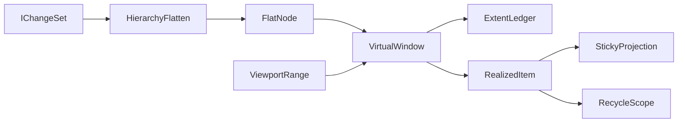

# [APPUI_VIRTUALIZATION_FABRIC]

One surface-agnostic virtualization fabric materializes only the visible window of arbitrary lists, trees, grids, and canvases: a million-row table, a deep model tree, and an infinite drafting canvas all render at constant cost from one owner. `VirtualWindow` maps a viewport range to a realized-item set with control recycling, sticky headers, variable-extent measurement, and hierarchical flatten, folding over `DynamicData` `IChangeSet` so windowing is incremental rather than re-windowed per scroll tick. The page owns the window spec, the range-to-realized-item fold, the variable-extent measurement model, the sticky-header projection, and the hierarchical-flatten bridge; every windowed surface — tables, notebook cells, dashboard tiles, the drafting canvas, and the `ControlFactory` grid/tree/panel intents — consumes this one fabric, never a per-surface virtualizer (the `[05]-[PROHIBITIONS]` per-surface-virtualizer clause forecloses it). The spine is `DynamicData` `Virtualise`/`Page`/`TransformToTree`/`Connect`, Avalonia `ItemsControl`/`Layoutable`, Thinktecture.Runtime.Extensions, and LanguageExt rails.

## [01]-[INDEX]

- [01]-[WINDOW_OWNER]: The window spec and the viewport-range-to-realized-item fold over `IChangeSet`.
- [02]-[EXTENT_MEASURE]: Variable-extent measurement; fixed and measured row-height modes; scroll-offset math.
- [03]-[STICKY_HEADERS]: Group-header and pinned-row projection over the windowed stream.
- [04]-[HIERARCHY_FLATTEN]: The one tree-flatten bridge every hierarchical surface routes through.

## [02]-[WINDOW_OWNER]

- Owner: `VirtualWindowSpec` the window request shape; `VirtualWindow<TItem, TKey>` the range-to-realized-item owner; `RealizedItem<TItem>` the windowed item with its extent and offset; `VirtualFault` the fault family — codes derive through the `AppUiFaultBand.Virtual` registry row (6030).
- Cases: `VirtualFault` = Text | RangeInverted | ExtentUnmeasured | KeyAbsent — codes derive through the `AppUiFaultBand.Virtual` registry row (6030).
- Entry: `public IObservable<IChangeSet<RealizedItem<TItem>, TKey>> Realize(IObservable<IChangeSet<TItem, TKey>> source, IObservable<ViewportRange> viewport, Func<TItem, TKey> key)` — folds the source change-set against the live viewport range into exactly the realized items the window shows, the `key` projection threading the item identity through the `ExtentLedger`; the realized set re-emits incrementally as the viewport scrolls or the source changes, never a full re-window.
- Auto: `VirtualWindowSpec` carries the viewport extent (pixels), the scroll offset, the overscan margin, and the extent mode (fixed-height or measured), so a window request is one shape every windowed surface authors; the range fold composes `DynamicData` `Virtualise(IObservable<VirtualRequest>)` over the source so windowing is the settled `LiveData` operator, never a hand-sliced list — the `VirtualRequest` start index and size derive from the scroll offset divided by the extent, and the `VirtualResponse` realized bounds feed back into the `RealizedItem` offset; control recycling rides the `ControlFactory` `RecycleScope` pool (`Shell/controls`) so a scrolled-out control parks and a scrolled-in control reuses it; the realized count tracks the viewport extent so the window never realizes more items than fit plus overscan.
- Packages: DynamicData, System.Reactive, Avalonia, Thinktecture.Runtime.Extensions, LanguageExt.Core
- Growth: a new windowed surface is one `VirtualWindowSpec`; a new extent mode is one `ExtentMode` value; zero new surface — the one `VirtualWindow` owner is the absorbing fabric.
- Boundary: `VirtualWindow` is the one windowing owner every list/tree/grid/canvas consumes — a tables-local, notebook-local, dashboard-local, or canvas-local virtualizer is the `[05]-[PROHIBITIONS]` per-surface-virtualizer rejected form, so `Editing/tables` tree-flatten, the notebook cell list, the dashboard tile grid, and the drafting canvas all route here; windowing is incremental over `IChangeSet` so a source insert or remove re-emits one change-set delta, never a full re-realize; the `VirtualRequest`/`VirtualResponse` realized bounds construct the `Editing/tables` `WindowState` snapshot field (`Editing/tables#VIEW_STATE`) so restore re-requests the exact viewport with zero re-query; the scroll offset crosses through the `Avalonia` `ScrollViewer.Offset` at the surface edge and the window owner reads it as a pure value, never owns the scroll control; the `Page` operator serves the discrete-page mode and `Virtualise` the continuous-scroll mode, both folding to one `RealizedItem` stream so a paged grid and a scrolled tree share one realized vocabulary; an unmeasured extent in measured mode faults so a window can never realize against an unknown extent.

```csharp signature
[SmartEnum<string>]
public sealed partial class ExtentMode {
    public static readonly ExtentMode Fixed = new("fixed");
    public static readonly ExtentMode Measured = new("measured");
}

public readonly record struct ViewportRange(double Offset, double Extent, double Overscan) {
    public Fin<(int Start, int Size)> Indices(double itemExtent, int total) =>
        !double.IsFinite(Offset) || !double.IsFinite(Extent) || !double.IsFinite(Overscan)
        || Offset < 0d || Extent < 0d || Overscan < 0d
            ? Fin.Fail<(int, int)>(new VirtualFault.RangeInverted($"{Offset}:{Extent}:{Overscan}"))
            : itemExtent <= 0d || !double.IsFinite(itemExtent)
                ? Fin.Fail<(int, int)>(new VirtualFault.ExtentUnmeasured(itemExtent.ToString(CultureInfo.InvariantCulture)))
                : Fin.Succ((
                    Math.Min(total, Math.Max(0, (int)((Offset - Overscan) / itemExtent))),
                    Math.Min(
                        Math.Max(0, total - Math.Min(total, Math.Max(0, (int)((Offset - Overscan) / itemExtent)))),
                        (int)Math.Ceiling((Extent + (2d * Overscan)) / itemExtent) + 1)));
}

public readonly record struct VirtualWindowSpec(double Extent, double Overscan, ExtentMode Mode, double FixedItemExtent) {
    public static readonly VirtualWindowSpec FixedRow = new(Extent: 0d, Overscan: 256d, Mode: ExtentMode.Fixed, FixedItemExtent: 28d);
    public static readonly VirtualWindowSpec Measured = new(Extent: 0d, Overscan: 256d, Mode: ExtentMode.Measured, FixedItemExtent: 0d);

    public ViewportRange Range(double offset, double extent) => new(offset, extent, Overscan);
}

public readonly record struct RealizedItem<TItem>(TItem Item, int Index, double Offset, double Extent);

public sealed record OrderedChangeSet<TItem, TKey>(
    IObservable<IChangeSet<TItem, TKey>> Changes,
    Func<Seq<TKey>> Order) where TItem : notnull where TKey : notnull;

[Union]
public abstract partial record VirtualFault : Expected, IValidationError<VirtualFault> {
    private VirtualFault(string detail, int code) : base(detail, code, None) { }

    public static VirtualFault Create(string message) => new Text(message);

    public sealed record Text : VirtualFault { public Text(string detail) : base(detail, AppUiFaultBand.Virtual.Code(0)) { } }
    public sealed record RangeInverted : VirtualFault { public RangeInverted(string detail) : base(detail, AppUiFaultBand.Virtual.Code(1)) { } }
    public sealed record ExtentUnmeasured : VirtualFault { public ExtentUnmeasured(string detail) : base(detail, AppUiFaultBand.Virtual.Code(2)) { } }
    public sealed record KeyAbsent : VirtualFault { public KeyAbsent(string detail) : base(detail, AppUiFaultBand.Virtual.Code(3)) { } }
}

public sealed record VirtualWindow<TItem, TKey>(VirtualWindowSpec Spec, ExtentLedger<TKey> Ledger) where TItem : notnull where TKey : notnull {
    // Ordinal registration precedes windowing: every source change-set feeds the ledger (adds register
    // at the running estimate, removes retire) BEFORE a VirtualRequest derives, so fixed mode windows a
    // fresh source from its true count and measured mode seeks unmeasured rows through estimate offsets;
    // Measure is thereafter a point update over an already-registered ordinal.
    public IObservable<IChangeSet<RealizedItem<TItem>, TKey>> Realize(
        OrderedChangeSet<TItem, TKey> source,
        IObservable<ViewportRange> viewport,
        Func<TItem, TKey> key) =>
        source.Changes
            .Do(changes => Ledger.Admit(changes, source.Order()))
            .Virtualise(viewport
                .SelectMany(range => (Ledger.StartIndex(range, Spec), Ledger.Size(range, Spec)).Apply(
                    static (start, size) => new VirtualRequest(start, size)).Match(
                        Succ: static request => Observable.Return(request),
                        Fail: static error => Observable.Throw<VirtualRequest>(error.ToException())))
                .DistinctUntilChanged())
            .Transform((item, k) => new RealizedItem<TItem>(item, Ledger.IndexOf(k), Ledger.OffsetOf(k, Spec), Ledger.ExtentOf(k, Spec)));
}
```

[WINDOW_LAW]:
- One operator: windowing composes `DynamicData.Virtualise`/`Page` — a hand-sliced `Skip`/`Take` over a materialized list is the deleted form.
- Incremental: measurement updates are Fenwick point updates; a structural source-order change rebuilds the ordinal projection once from the composition-owned ordered snapshot before `Virtualise` emits the affected window.
- Bounded realization: the realized count is the viewport extent over the item extent plus overscan, so a million-row source realizes a constant window.
- Recycling: scrolled-out controls park in the `RecycleScope` pool and scrolled-in indices reuse them.
- Restore: the realized bounds construct the `WindowState` snapshot field so restore re-requests the exact viewport.

## [03]-[EXTENT_MEASURE]

- Owner: `ExtentLedger<TKey>` the per-key extent and cumulative-offset model; `MeasurePolicy` the fixed-versus-measured extent fold.
- Entry: `public Unit Admit<TItem>(IChangeSet<TItem, TKey> changes, Seq<TKey> ordered)` — source registration applies keyed changes and then rebuilds the ordinal projection from the composition-owned order snapshot while retaining measured extents; `public double OffsetOf(TKey key, VirtualWindowSpec spec)` — the cumulative pixel offset of a key from the window top; `public Fin<Unit> Measure(TKey key, double extent)` — a validated point delta update over an already-registered ordinal.
- Auto: in fixed mode the extent is `VirtualWindowSpec.FixedItemExtent` and the offset is index times extent, so the scroll math is exact and O(1); in measured mode each realized row reports its measured extent through `Measure`, the ledger keeps a Fenwick/prefix-sum tree of cumulative extents so `OffsetOf` and the total extent are O(log n), and a not-yet-measured row uses the running average extent as its estimate so the scrollbar is stable before every row measures; the scroll-to-index seek resolves the target offset from the ledger so a programmatic scroll lands exactly.
- Packages: Thinktecture.Runtime.Extensions, LanguageExt.Core, BCL inbox
- Growth: a new extent estimator is one `MeasurePolicy` value; zero new surface.
- Boundary: extent measurement is the one ledger — a per-surface row-height table is the rejected form, so fixed-height grids and variable-height tree rows share one extent model; the measured-extent tree is O(log n) so a scroll over a million measured rows never re-sums the whole list; prefix sums equal the sum of registered extents across every capacity boundary — the online append initializes each new Fenwick cell to its covered-range sum, so backing-store growth never zeroes an ancestor aggregate and `Seek` selects the same ordinal as a reference cumulative model after growth, a full-list offset rescan being the rejected repair; the tombstone ordinal space never reaches the window — a sibling retired-count Fenwick rides beside the extent tree and `LiveIndex` projects every raw ordinal onto the live ordinal space `DynamicData.Virtualise` actually windows, so `StartIndex`, `Size`, and `IndexOf` are live positions after any removal and a removal before the viewport can never shift the requested window off its intended rows; the not-yet-measured estimate uses the running average so the scrollbar never jumps when a row first measures; the fixed-mode path keeps the scroll math integer-exact (`Editing/tables#SUBSTRATE_LAW` fixed density-token row height), so a fixed grid pays no measurement cost; a measured offset query before any measurement returns the average-estimate offset rather than faulting, so the window realizes before the first measure pass.

```csharp signature
public sealed record MeasurePolicy(ExtentMode Mode, double Estimate) {
    public static readonly MeasurePolicy Fixed = new(ExtentMode.Fixed, 0d);
    public static readonly MeasurePolicy Adaptive = new(ExtentMode.Measured, Estimate: 28d);
}

public sealed class ExtentLedger<TKey> where TKey : notnull {
    private readonly Dictionary<TKey, int> ordinals = new();
    private readonly List<TKey> order = [];
    private readonly List<double> extents = [];
    private double[] fenwick = new double[16]; // 1-based ONLINE Fenwick (BIT): appended cells initialize to their covered-range sum
    private int[] retiredTree = new int[16]; // sibling 1-based Fenwick over tombstone flags: LiveIndex(raw) = raw - retired-before(raw)
    private double extentSum;
    private int live;
    private int retired;

    private double AverageExtent => live > 0 ? extentSum / live : MeasurePolicy.Adaptive.Estimate;

    // Source registration: adds enter at the running estimate so count, offsets, and seeks are live
    // BEFORE any row measures; removes retire to a zero-extent tombstone (offsets stay exact) and a
    // tombstone-majority compacts the ledger in one rebuild.
    public Unit Admit<TItem>(IChangeSet<TItem, TKey> changes, Seq<TKey> ordered) where TItem : notnull {
        foreach (Change<TItem, TKey> change in changes) {
            _ = change.Reason switch {
                ChangeReason.Add => ordinals.ContainsKey(change.Key) ? unit : Append(change.Key, AverageExtent),
                ChangeReason.Remove => Retire(change.Key),
                _ => unit,
            };
        }
        Reorder(ordered);
        return unit;
    }

    // DynamicData cache changes do not carry a stable ordinal by themselves. The composition-owned
    // sorted snapshot is therefore the one ordering authority; structural changes rebuild only the
    // prefix index while retaining every measured key extent.
    private void Reorder(Seq<TKey> ordered) {
        Dictionary<TKey, double> retained = ordered
            .ToDictionary(
                static key => key,
                key => ordinals.TryGetValue(key, out int index) ? extents[index] : AverageExtent);
        ordinals.Clear();
        order.Clear();
        extents.Clear();
        fenwick = new double[Math.Max(16, retained.Count + 1)];
        retiredTree = new int[fenwick.Length];
        (extentSum, live, retired) = (0d, 0, 0);
        ordered.Iter(key => ignore(Append(key, retained[key])));
    }

    // A measure over a registered ordinal is a point DELTA update; an unseen key appends first.
    public Fin<Unit> Measure(TKey key, double extent) =>
        !double.IsFinite(extent) || extent < 0d
            ? Fin.Fail<Unit>(new VirtualFault.ExtentUnmeasured(extent.ToString(CultureInfo.InvariantCulture)))
            : Fin.Succ(ordinals.ContainsKey(key) ? Adjust(key, extent) : Append(key, extent));

    // ONLINE append law: the new 1-based cell at position p covers (p - lowbit(p), p], so it INITIALIZES
    // to that range's extent sum — a zero-filled or copy-grown cell silently omits every earlier extent
    // it covers, which is the rejected growth form; ancestors past p do not exist yet and each later
    // append initializes itself the same way, so no ancestor loop runs here.
    private Unit Append(TKey key, double extent) {
        int index = order.Count;
        ordinals[key] = index; order.Add(key); extents.Add(extent);
        extentSum += extent; live++;
        int position = index + 1;
        EnsureCapacity(position);
        fenwick[position] = extent + PrefixSum(index) - PrefixSum(position - (position & -position));
        retiredTree[position] = RetiredBefore(index) - RetiredBefore(position - (position & -position));
        return unit;
    }

    private Unit Adjust(TKey key, double extent) {
        int index = ordinals[key];
        double delta = extent - extents[index];
        extents[index] = extent;
        extentSum += delta;
        for (int at = index + 1; at <= order.Count; at += at & -at) { fenwick[at] += delta; }
        return unit;
    }

    // Retire keeps the offset space exact (zero-extent tombstone) AND projects the ordinal space live:
    // the tombstone flag lands in retiredTree, so every index leaving the ledger is a LIVE position —
    // the ordinal space DynamicData.Virtualise windows — never a tombstone-shifted raw ordinal.
    private Unit Retire(TKey key) {
        if (!ordinals.TryGetValue(key, out int index)) { return unit; }
        ignore(Adjust(key, 0d));
        for (int at = index + 1; at <= order.Count; at += at & -at) { retiredTree[at]++; }
        ignore(ordinals.Remove(key));
        live--;
        retired++;
        if (retired * 2 > order.Count) { Compact(); }
        return unit;
    }

    private void Compact() {
        List<(TKey Key, double Extent)> kept = order.Where(ordinals.ContainsKey).Select(key => (Key: key, Extent: extents[ordinals[key]])).ToList();
        ordinals.Clear(); order.Clear(); extents.Clear();
        fenwick = new double[Math.Max(16, kept.Count + 1)];
        retiredTree = new int[Math.Max(16, kept.Count + 1)];
        (extentSum, live, retired) = (0d, 0, 0);
        kept.ForEach(row => ignore(Append(row.Key, row.Extent)));
    }

    // O(log n) prefix query: cumulative extent of indices [0, index).
    private double PrefixSum(int index) {
        double sum = 0d;
        for (int at = index; at > 0; at -= at & -at) { sum += fenwick[at]; }
        return sum;
    }

    // Tombstones retired in [0, index), then the raw-to-live ordinal projection every window-facing
    // index rides — VirtualRequest positions and RealizedItem.Index are live-space by construction.
    private int RetiredBefore(int index) {
        int count = 0;
        for (int at = index; at > 0; at -= at & -at) { count += retiredTree[at]; }
        return count;
    }

    private int LiveIndex(int raw) => raw - RetiredBefore(raw);

    public double OffsetOf(TKey key, VirtualWindowSpec spec) =>
        ordinals.TryGetValue(key, out int index)
            ? spec.Mode == ExtentMode.Fixed ? LiveIndex(index) * spec.FixedItemExtent : PrefixSum(index)
            : 0d;

    public double ExtentOf(TKey key, VirtualWindowSpec spec) =>
        spec.Mode == ExtentMode.Fixed ? spec.FixedItemExtent
            : ordinals.TryGetValue(key, out int index) && index < extents.Count ? extents[index] : AverageExtent;

    public int IndexOf(TKey key) => ordinals.TryGetValue(key, out int index) ? LiveIndex(index) : -1;

    public Fin<int> StartIndex(ViewportRange range, VirtualWindowSpec spec) =>
        spec.Mode == ExtentMode.Fixed
            ? range.Indices(spec.FixedItemExtent, live).Map(static result => result.Start)
            : !Valid(range)
                ? Fin.Fail<int>(new VirtualFault.RangeInverted($"{range.Offset}:{range.Extent}:{range.Overscan}"))
                : Fin.Succ(LiveIndex(Seek(range.Offset - range.Overscan)));

    public Fin<int> Size(ViewportRange range, VirtualWindowSpec spec) =>
        spec.Mode == ExtentMode.Fixed
            ? range.Indices(spec.FixedItemExtent, live).Map(static result => result.Size)
            : !Valid(range)
                ? Fin.Fail<int>(new VirtualFault.RangeInverted($"{range.Offset}:{range.Extent}:{range.Overscan}"))
                : live == 0
                    ? Fin.Succ(0)
                    : Fin.Succ(Math.Max(1, LiveIndex(Seek(range.Offset + range.Extent + range.Overscan)) - LiveIndex(Seek(range.Offset - range.Overscan)) + 1));

    private static bool Valid(ViewportRange range) =>
        double.IsFinite(range.Offset) && double.IsFinite(range.Extent) && double.IsFinite(range.Overscan)
        && range.Offset >= 0d && range.Extent >= 0d && range.Overscan >= 0d;

    // O(log n) offset-to-index seek: binary descent over the Fenwick tree itself, never a scan.
    private int Seek(double offset) {
        int index = 0;
        double remaining = Math.Max(0d, offset);
        for (int bit = 1 << System.Numerics.BitOperations.Log2((uint)Math.Max(1, order.Count)); bit > 0; bit >>= 1) {
            int next = index + bit;
            if (next <= order.Count && fenwick[next] <= remaining) { remaining -= fenwick[next]; index = next; }
        }
        return Math.Clamp(index, 0, Math.Max(0, order.Count - 1));
    }

    // Growth copies only established cells; positions past order.Count are never read before their own
    // Append initializes them, so copy-growth is sound exactly because Append never trusts a zero cell.
    private void EnsureCapacity(int position) {
        if (position < fenwick.Length) { return; }
        double[] grown = new double[Math.Max(fenwick.Length * 2, position + 1)];
        int[] grownRetired = new int[grown.Length];
        fenwick.CopyTo(grown, 0);
        retiredTree.CopyTo(grownRetired, 0);
        (fenwick, retiredTree) = (grown, grownRetired);
    }
}
```

## [04]-[STICKY_HEADERS]

- Owner: `StickyProjection<TItem, TKey>` the pinned-row-and-group-header projection over the windowed stream; `PinnedRow<TItem>` the sticky item with its pin role.
- Entry: `public IObservable<Seq<PinnedRow<TItem>>> Pinned(IObservable<ViewportRange> viewport, Func<TItem, Option<string>> groupOf, Func<TItem,TKey> keyOf, Func<TItem,Option<TKey>> parentOf, Func<TItem,int> depthOf, Func<TItem,bool> pinnedOf)` — one overlay fold constructs every `PinRole`: the top visible row's group header, the exact parent-key ancestor chain, and every explicitly pinned row that scrolled above the viewport top.
- Auto: a grouped or hierarchical window projects its current top group's header as a pinned row so the header stays visible while the group scrolls; a tree window follows `parentOf` from the top visible key through exact realized ancestors retained by overscan, so a shallower sibling or cousin cannot enter the chain by depth alone; explicitly pinned summaries survive the scroll as `PinRole.PinnedSummary` entries once their offset leaves the viewport; the pinned set re-projects on every window or viewport edge.
- Packages: DynamicData, System.Reactive, LanguageExt.Core
- Growth: a new pin role is one `PinRole` value; zero new surface.
- Boundary: sticky headers are a projection over the windowed stream — a second header materialization beside the window is the rejected form, so the group header, the pinned summary row, and the tree-ancestor chain all ride one `PinnedRow` overlay; the pinned set derives from the window's current top item so a pinned header never desyncs from the visible rows; the group key threads from the `Editing/tables` snapshot `Groups` field so header expansion survives restore on the same field; the pinned overlay renders through the `ControlFactory` materialize fold like any other control, so a sticky header mints no second control.

```csharp signature
[SmartEnum<string>]
public sealed partial class PinRole {
    public static readonly PinRole GroupHeader = new("group-header");
    public static readonly PinRole PinnedSummary = new("pinned-summary");
    public static readonly PinRole TreeAncestor = new("tree-ancestor");
}

public readonly record struct PinnedRow<TItem>(TItem Item, PinRole Role, int Depth, double Offset);

public static class StickyProjection {
    extension<TItem, TKey>(IObservable<IChangeSet<RealizedItem<TItem>, TKey>> window) where TItem : notnull where TKey : notnull {
        public IObservable<Seq<PinnedRow<TItem>>> Pinned(
            IObservable<ViewportRange> viewport,
            Func<TItem, Option<string>> groupOf,
            Func<TItem, TKey> keyOf,
            Func<TItem, Option<TKey>> parentOf,
            Func<TItem, int> depthOf,
            Func<TItem, bool> pinnedOf) =>
            Observable.CombineLatest(
                window.ToCollection().Select(realized => toSeq(realized.OrderBy(static row => row.Offset)).Strict()),
                viewport.DistinctUntilChanged(),
                (rows, range) => Overlay(rows, range, groupOf, keyOf, parentOf, depthOf, pinnedOf));

        // Every PinRole from one fold over the realized window split at the viewport top: the top
        // visible row's group header, the decreasing-depth ancestor chain above it, and the pinned
        // summaries that scrolled out — one overlay, zero second header materialization.
        private static Seq<PinnedRow<TItem>> Overlay(
            Seq<RealizedItem<TItem>> rows, ViewportRange range,
            Func<TItem, Option<string>> groupOf, Func<TItem, TKey> keyOf,
            Func<TItem, Option<TKey>> parentOf, Func<TItem, int> depthOf, Func<TItem, bool> pinnedOf) =>
            (Above: rows.Filter(row => row.Offset < range.Offset), Visible: rows.Filter(row => row.Offset >= range.Offset)) switch {
                var split => split.Visible.HeadOrNone().Match(
                    Some: top =>
                        Ancestors(split.Above, top.Item, keyOf, parentOf, depthOf)
                        + groupOf(top.Item).ToSeq().Map(_ => new PinnedRow<TItem>(top.Item, PinRole.GroupHeader, depthOf(top.Item), top.Offset))
                        + split.Above.Filter(row => pinnedOf(row.Item)).Map(row => new PinnedRow<TItem>(row.Item, PinRole.PinnedSummary, depthOf(row.Item), row.Offset)),
                    None: () => Seq<PinnedRow<TItem>>()),
            };

        // The wanted parent key advances only when the exact parent is found, so a shallower sibling
        // or cousin can never enter the pinned chain merely because its depth decreases.
        private static Seq<PinnedRow<TItem>> Ancestors(
            Seq<RealizedItem<TItem>> above,
            TItem top,
            Func<TItem, TKey> keyOf,
            Func<TItem, Option<TKey>> parentOf,
            Func<TItem, int> depthOf) =>
            above.Rev().Fold(
                (Wanted: parentOf(top), Chain: Seq<PinnedRow<TItem>>()),
                (state, row) => state.Wanted.Exists(parent => EqualityComparer<TKey>.Default.Equals(parent, keyOf(row.Item)))
                    ? (parentOf(row.Item), state.Chain.Add(new PinnedRow<TItem>(row.Item, PinRole.TreeAncestor, depthOf(row.Item), row.Offset)))
                    : state)
            .Chain.Rev().ToSeq();
    }
}
```

## [05]-[HIERARCHY_FLATTEN]

- Owner: `HierarchyFlatten<TItem, TKey>` the one tree-flatten bridge every hierarchical surface routes through; `FlatNode<TItem>` the flattened indent row.
- Entry: `public IObservable<IChangeSet<FlatNode<TItem>, TKey>> Flatten(IObservable<IChangeSet<TItem, TKey>> source, Func<TItem, TKey> parentKey, IObservable<Set<TKey>> expansion, Func<TItem, TKey> key)` — folds a parent-keyed hierarchy into a flat indent-row change-set via one `DynamicData.TransformToTree` subscription, re-walking on every expansion toggle without re-subscribing the tree.
- Auto: the hierarchy folds through ONE `DynamicData` `TransformToTree(parentKey)` subscription whose `Node<TItem,TKey>` root collection (`ToCollection`) the flatten walks into `FlatNode` indent rows carrying their depth and expansion state, exactly the `Editing/tables` `ProjectionFold.Rows` recursion but as the one fabric every tree surface shares; `CombineLatest(tree.ToCollection(), expansion)` re-walks the roots against the live expansion set and `ToObservableChangeSet(key)` diffs the successive flat snapshots so a tree expand re-realizes only the newly visible descendants as the minimal change-set — the `TransformToTree` transform is never re-subscribed per toggle (the O(n)-per-toggle `expansion.Select(rebuild).Switch()` is the rejected form, `.api/api-dynamicdata.md` `[HIERARCHY_LAW]`); lazy children materialize on first expansion through the source's keyed cache, never a side collection.
- Packages: DynamicData, System.Reactive, Thinktecture.Runtime.Extensions, LanguageExt.Core
- Growth: a new sibling-ordering policy is one comparer value on the flatten call; zero new surface.
- Boundary: hierarchical flatten is the one bridge — `Editing/tables` `TreeFlattened`, the notebook outline, the scene-access tree, and the `ControlFactory` `Tree` intent all route here, so a tables-local tree-flatten beside this fabric is the `[05]-[PROHIBITIONS]` per-surface-virtualizer rejected form (`Editing/tables#TREE_FLATTEN` deepens onto this owner); `TransformToTree` emits root nodes only (its default predicate is `IsRoot`) so the flatten walk owns child materialization and never double-counts; the flattened stream feeds the `VirtualWindow.Realize` fold so a deep tree windows like a flat list, one realized vocabulary; sibling order is the flatten call's comparer — sorting flat indent rows through the collection-view sort descriptors is the deleted form (`Editing/tables#FLATTEN_LAW` tree-order rule); the expansion set threads from the screen-state snapshot `Expansion` field so expansion survives restore.

```csharp signature
public readonly record struct FlatNode<TItem>(TItem Item, int Depth, bool HasChildren, bool Expanded);

public static class HierarchyFlatten {
    extension<TItem, TKey>(IObservable<IChangeSet<TItem, TKey>> source) where TItem : notnull where TKey : notnull {
        public IObservable<IChangeSet<FlatNode<TItem>, TKey>> Flatten(
            Func<TItem, TKey> parentKey,
            IObservable<Set<TKey>> expansion,
            Func<TItem, TKey> key,
            Option<IComparer<TItem>> order = default) =>
            Observable
                .CombineLatest(
                    source.TransformToTree(parentKey).ToCollection(),
                    expansion.DistinctUntilChanged(),
                    (roots, expanded) => roots.Bind(root => Walk(root, expanded, key, order)))
                .ToObservableChangeSet(node => key(node.Item));

        private static Seq<FlatNode<TItem>> Walk(Node<TItem, TKey> node, Set<TKey> expanded, Func<TItem, TKey> key, Option<IComparer<TItem>> order) =>
            new FlatNode<TItem>(node.Item, node.Depth, node.Children.Count > 0, expanded.Contains(key(node.Item)))
                .Cons(expanded.Contains(key(node.Item))
                    ? (order is { IsSome: true, Case: IComparer<TItem> comparer }
                        ? node.Children.Items.OrderBy(static child => child.Item, comparer)
                        : node.Children.Items)
                        .ToSeq()
                        .Bind(child => Walk(child, expanded, key, order))
                    : Seq<FlatNode<TItem>>());
    }
}
```



## [06]-[RESEARCH]

- [VIRTUAL_RESPONSE_FIELDS]: the `DynamicData` `VirtualResponse` realized-bounds accessors the `RealizedItem` offset and the `WindowState` snapshot consume — the realized start index, size, and total-count members beyond the catalogued `Virtualise`/`Page` operators and the `VirtualResponse`/`PageContext` types themselves — shared with the `Editing/tables#RESEARCH` `[PAGE_RESPONSE_FIELDS]` row; the `VirtualWindowSpec`, the range-to-realized fold, the `ExtentLedger` measurement model, the sticky projection, and the `TransformToTree` flatten are settled, the `VirtualResponse` field spellings are the unverified surface resolved at implementation against the decompiled DynamicData surface.
