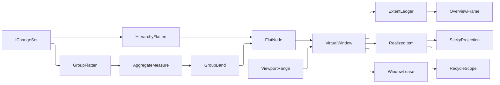

# [APPUI_VIRTUALIZATION_FABRIC]

One surface-agnostic virtualization fabric materializes only the visible window of arbitrary lists, trees, grids, and canvases: a million-row table, a deep model tree, and an infinite drafting canvas all render at constant cost from one owner. `VirtualWindow` maps a viewport range to a realized-item set with control recycling, sticky headers, variable-extent measurement, and one flatten producing item rows and synthetic group bands alike, folding over `DynamicData` `IChangeSet` so windowing is incremental rather than re-windowed per scroll tick. The page owns the window spec, the range-to-realized-item fold, the bound-collection lease, the variable-extent measurement model, the sticky-header projection, the hierarchical-and-grouped flatten, and the overview downsample every minimap reads; every windowed surface — tables, notebook cells, dashboard tiles, the drafting canvas, and the `ControlFactory` grid/tree/panel/overview intents — consumes this one fabric, never a per-surface virtualizer (the `[04]-[BOUNDARIES]` per-surface-virtualizer clause forecloses it). The spine is `DynamicData` `Sort`/`Virtualise`/`Page`/`TransformToTree`/`Group`/`TransformOnObservable`/`Bind` with the `DynamicData.Aggregation` folds, Avalonia `ItemsControl`/`Layoutable`, Thinktecture.Runtime.Extensions, and LanguageExt rails.

## [01]-[INDEX]

- [02]-[WINDOW_OWNER]: The window spec, the viewport-range-to-realized-item fold over `IChangeSet`, and the one bound-collection lease.
- [03]-[EXTENT_MEASURE]: Variable-extent measurement; fixed and measured row-height modes; scroll-offset math.
- [04]-[STICKY_HEADERS]: Group-band and pinned-row projection over the windowed stream.
- [05]-[HIERARCHY_FLATTEN]: The one flatten bridge every hierarchical and grouped surface routes through.
- [06]-[OVERVIEW_PROJECTION]: The downsample fold and decoration lanes every minimap, ruler, and timeline reads.

## [02]-[WINDOW_OWNER]

- Owner: `VirtualWindowSpec` the window request shape; `OrderedChangeSet<TItem, TKey>` the source paired with the ONE comparer that orders it; `VirtualWindow<TItem, TKey>` the range-to-realized-item owner carrying the composition-bound fault sink; `RealizedItem<TItem>` the windowed item with its extent and offset; `WindowLease<TView>` the bound-collection carrier every windowed control consumes; `VirtualFault` the fault family — codes derive through the `AppUiFaultBand.Virtual` registry row (6030).
- Cases: `VirtualFault` = Text | RangeInverted | ExtentUnmeasured | KeyAbsent — codes derive through the `AppUiFaultBand.Virtual` registry row (6030).
- Law: the comparer is the ONE ordering authority and it is a STREAM — `Sort` over a comparer observable produces the `ISortedChangeSet` `Virtualise` requires and re-sorts in place on every comparer the stream carries, so a column-sort flip is a delta on the live pipeline rather than a re-subscription that discards the cache, the recycle pool, and every measured extent; that same sorted value carries `SortedItems`, so the ledger's ordinal projection reads the order off the very change-set the window realizes and a second order snapshot beside it cannot disagree.
- Entry: `public IObservable<IChangeSet<RealizedItem<TItem>, TKey>> Realize(OrderedChangeSet<TItem, TKey> source, IObservable<ViewportRange> viewport)` — folds the source change-set against the live viewport range into exactly the realized items the window shows; the change-set carries its own key and `OrderedChangeSet` its comparer stream, so no key projection rides beside a value that already answers it; the realized set re-emits incrementally as the viewport scrolls, the comparer flips, or the source changes, never a full re-window. `public WindowLease<TView> Lease<TView>(OrderedChangeSet<TItem, TKey> source, IObservable<ViewportRange> viewport, Func<RealizedItem<TItem>, TView> view)` — the one bound-collection mint over that same fold. `public IObservable<OverviewFrame> Overview(IObservable<ViewportRange> viewport, IObservable<Seq<OverviewBand>> bands)` — the strip feed, paced by the ledger's own extent stream so a source delta outside the viewport re-frames the strip.
- Auto: `VirtualWindowSpec` carries the viewport extent (pixels), the overscan margin, the extent mode (fixed-height or measured), and the per-item extent that is the exact row height in fixed mode and the pre-measure seed in measured mode — the live scroll offset arrives at `Range` — so a window request is one shape every windowed surface authors and the ledger reads its mode and its seed off that one value; the two policy rows are `FixedRow`/`Measured` FACTORIES over the mount's measured viewport extent, so the one slot no policy can know is a required argument rather than a preset default a caller must remember to override; the range fold composes `DynamicData` `Sort` into `Virtualise(IObservable<IVirtualRequest>)` so windowing is the settled `LiveData` operator, never a hand-sliced list — the request start index and size derive from the scroll offset through the ledger, and the placement each realized row carries derives from the same ledger, so bounds and offsets answer from one model; control recycling rides the `ControlFactory` `RecycleScope` pool (`Shell/controls`) so a scrolled-out control parks and a scrolled-in control reuses it; the realized count is the viewport extent over the item extent with overscan, so a million-row source realizes a constant window.
- Packages: DynamicData, System.Reactive, Avalonia, Thinktecture.Runtime.Extensions, LanguageExt.Core
- Growth: a new windowed surface is one `VirtualWindowSpec`; a new extent mode is one `ExtentMode` value; a new bound view shape is one projection argument on `Lease`; zero new surface — the one `VirtualWindow` owner is the absorbing fabric.
- Boundary: `VirtualWindow` is the one windowing owner every list/tree/grid/canvas consumes — a tables-local, notebook-local, dashboard-local, or canvas-local virtualizer is the `[04]-[BOUNDARIES]` per-surface-virtualizer rejected form, so `Editing/tables` tree-flatten, the notebook cell list, the dashboard tile grid, and the drafting canvas all route here; windowing is incremental over `IChangeSet` so a source insert or remove re-emits one change-set delta, never a full re-realize; `Virtualise` takes a SORTED change-set and a request stream typed to `IVirtualRequest`, so the fold sorts by the source's own comparer stream first and de-duplicates requests through the package's own `VirtualRequest.StartIndexSizeComparer` — a plain keyed change-set handed to `Virtualise` does not typecheck, and a second ordering snapshot supplied beside the comparer is the deleted form because the sorted change-set already carries `SortedItems` in the ledger's order; a frozen `IComparer<TItem>` column was the same defect the expansion axis already names rejected — a sort flip could only be spelled as a fresh `OrderedChangeSet` on a re-subscribed pipeline, discarding the source cache, the recycle pool, and every measured extent to change an ordering the package re-sorts in place, so a surface whose order never moves publishes one comparer and pays nothing for the shape; the window bounds a surface persists (`Editing/tables#VIEW_STATE` `WindowState`) read `ExtentLedger.StartIndex`/`Size`/`Live` for the current range, so restore re-requests the exact viewport with zero re-query and no consumer has to re-type its stream to reach a response object; `WindowLease<TView>` is the ONE bound-collection carrier — the realized change-set binds once into a `ReadOnlyObservableCollection` a control's `ItemsSource` takes and the lease carries the subscription, so a freed control frees its window binding and a per-consumer lease record beside this one is the deleted form (`Shell/controls` reads `WindowLease<RealizedItem<object>>` for the grid and tree kinds and `WindowLease<OptionRow>` for the option-bearing kinds, one type at both seats); the scroll offset crosses through the `Avalonia` `ScrollViewer.Offset` at the surface edge and the window owner reads it as a pure value, never owns the scroll control; `Virtualise` serves the continuous-scroll mode through this owner's `RealizedItem` fold, while the discrete-page mode rides the `Page` operator directly at the `Editing/tables` projection fold — a page is a source-side window with no extent to measure, so it never enters the ledger and a paged arm on this owner would be a second windowing owner over a concern `DynamicData` already closes; an unmeasured extent in measured mode faults so a window can never realize against an unknown extent, and that fault rides the stream AS A VALUE onto the composition-bound `Fault` sink — `Observable.Throw` is the rejected form because `OnError` is terminal, so one transient bad range (a `NaN` offset mid-resize, a zero extent before the first measure) would dead-end the window for the surface's whole lifetime with no re-subscribe path; a bad range drops one window update instead.

```csharp signature
// --- [TYPES] ----------------------------------------------------------------------------

[SmartEnum<string>]
public sealed partial class ExtentMode {
    public static readonly ExtentMode Fixed = new("fixed");
    public static readonly ExtentMode Measured = new("measured");
}

public readonly record struct ViewportRange(double Offset, double Extent, double Overscan) {
    public Fin<(int Start, int Size)> Indices(double itemExtent, int total) =>
        !double.IsFinite(Offset) || !double.IsFinite(Extent) || !double.IsFinite(Overscan)
        || Offset < 0d || Extent < 0d || Overscan < 0d
            ? Fin.Fail<(int, int)>(new VirtualFault.RangeInverted($"{Offset}:{Extent}:{Overscan}"))
            : itemExtent <= 0d || !double.IsFinite(itemExtent)
                ? Fin.Fail<(int, int)>(new VirtualFault.ExtentUnmeasured(itemExtent.ToString(CultureInfo.InvariantCulture)))
                : Fin.Succ((
                    Math.Min(total, Math.Max(0, (int)((Offset - Overscan) / itemExtent))),
                    Math.Min(
                        Math.Max(0, total - Math.Min(total, Math.Max(0, (int)((Offset - Overscan) / itemExtent)))),
                        (int)Math.Ceiling((Extent + (2d * Overscan)) / itemExtent) + 1)));
}

// The ONE extent-mode owner. A parallel policy record pairing a second Mode with a second estimate is the
// deleted twin: the ledger has always decided fixed-versus-measured off THIS Mode, so the twin's Mode was
// unreadable by construction, its fixed row was never constructed, and its estimate duplicated the row
// height below under a name no caller could vary.
public readonly record struct VirtualWindowSpec(double Extent, double Overscan, ExtentMode Mode, double FixedItemExtent) {
    public const double RowExtent = 28d;   // Editing/tables#GRID_SUBSTRATE density-token row height

    // Extent is a per-mount MEASUREMENT, so the two policy rows are factories over it rather than statics
    // carrying a placeholder: a preset spelling zero for a viewport nothing had measured yet published an
    // extent no surface took, and every caller had to remember a `with` override the shape never demanded.
    // FixedItemExtent's zero on the measured row IS structural — measured mode reads Seed, never this slot.
    public static VirtualWindowSpec FixedRow(double viewportExtent) =>
        new(viewportExtent, Overscan: 256d, Mode: ExtentMode.Fixed, FixedItemExtent: RowExtent);

    public static VirtualWindowSpec Measured(double viewportExtent, double nominalItemExtent = 0d) =>
        new(viewportExtent, Overscan: 256d, Mode: ExtentMode.Measured, FixedItemExtent: nominalItemExtent);

    // The seed an unmeasured row places at: the caller's own nominal extent where it supplied one, the
    // density row height otherwise. Fixed mode reads FixedItemExtent directly, so one spec answers both
    // modes and a caller that knows its nominal height gets a stable scrollbar before the first measure.
    public double Seed => FixedItemExtent > 0d ? FixedItemExtent : RowExtent;

    public ViewportRange Range(double offset) => new(offset, Extent, Overscan);
}

// --- [MODELS] ---------------------------------------------------------------------------

public readonly record struct RealizedItem<TItem>(TItem Item, int Index, double Offset, double Extent);

// The comparer is the ONE ordering authority and it travels as a STREAM: `Sort` needs it to produce the
// sorted change-set `Virtualise` requires, that same sorted value hands the ledger its ordinal snapshot, and
// a re-emitted comparer re-sorts the live pipeline in place — so the order the window realizes and the order
// the ledger measures are the same value, and a column-sort flip costs a delta rather than a re-subscription
// that drops the cache, the recycle pool, and every measured extent. A fixed order publishes one comparer.
public sealed record OrderedChangeSet<TItem, TKey>(
    IObservable<IChangeSet<TItem, TKey>> Changes,
    IObservable<IComparer<TItem>> Comparer) where TItem : notnull where TKey : notnull;

// One bound-collection carrier for every windowed control. The realized rows and the bare option rows are
// the same fact under two projections, so a second lease record per consumer would be one shape spelled
// twice and a control would have to know which of the two its kind takes.
public sealed record WindowLease<TView>(ReadOnlyObservableCollection<TView> View, IDisposable Lifetime);

// --- [ERRORS] ---------------------------------------------------------------------------

[Union]
public abstract partial record VirtualFault : Expected, IValidationError<VirtualFault> {
    private VirtualFault(string detail, int code) : base(detail, code, None) { }

    public static VirtualFault Create(string message) => new Text(message);

    public sealed record Text : VirtualFault { public Text(string detail) : base(detail, AppUiFaultBand.Virtual.Code(0)) { } }
    public sealed record RangeInverted : VirtualFault { public RangeInverted(string detail) : base(detail, AppUiFaultBand.Virtual.Code(1)) { } }
    public sealed record ExtentUnmeasured : VirtualFault { public ExtentUnmeasured(string detail) : base(detail, AppUiFaultBand.Virtual.Code(2)) { } }
    public sealed record KeyAbsent : VirtualFault { public KeyAbsent(string detail) : base(detail, AppUiFaultBand.Virtual.Code(3)) { } }
}

// --- [OPERATIONS] -----------------------------------------------------------------------

// Fault is the composition-bound sink — the screen fault state every sibling surface already commits
// to — so a window fault is a counted value on the timeline rather than a terminal Rx OnError. The spec
// rides the ledger alone: every window-side read below is a ledger read, so a spec column HERE would be a
// second copy the composition root could seat against a ledger seeded from a different one.
public sealed record VirtualWindow<TItem, TKey>(ExtentLedger<TKey> Ledger, Func<VirtualFault, Unit> Fault)
    where TItem : notnull where TKey : notnull {
    // Ordinal registration precedes windowing: the SORTED change-set feeds the ledger (adds register at the
    // running estimate, removes retire, the sorted collection rebuilds the ordinal projection) BEFORE a
    // request derives, so fixed mode windows a fresh source from its true count and measured mode seeks
    // unmeasured rows through estimate offsets; Measure is thereafter a point update over a live ordinal.
    public IObservable<IChangeSet<RealizedItem<TItem>, TKey>> Realize(
        OrderedChangeSet<TItem, TKey> source,
        IObservable<ViewportRange> viewport) =>
        source.Changes
            .Sort(source.Comparer)
            .Do(sorted => Ledger.Admit(sorted))
            .Virtualise(viewport.SelectMany(Requested).DistinctUntilChanged(VirtualRequest.StartIndexSizeComparer))
            .Transform(Realized);

    // The one bound-collection mint. Both windowed shapes ride ONE projection argument — the grid and tree
    // kinds keep the realized row because they render its offset, the option-bearing kinds take the bare
    // item because a drop-down paints no offsets — so neither seat mints a lease record of its own.
    public WindowLease<TView> Lease<TView>(
        OrderedChangeSet<TItem, TKey> source,
        IObservable<ViewportRange> viewport,
        Func<RealizedItem<TItem>, TView> view) where TView : notnull =>
        Realize(source, viewport)
            .Transform(view)
            .Bind(out ReadOnlyObservableCollection<TView> collection)
            .Subscribe() switch {
            var lifetime => new WindowLease<TView>(collection, lifetime),
        };

    // The strip feed: the ledger's total extent IS the content space and the live range IS the viewport
    // rectangle, so a list minimap reads the same model the scrollbar does and no consumer re-measures.
    // The cross axis is unit-wide because a list has one — the plane axis fills it from real bounds.
    // The extent arrives as the ledger's OWN stream, never a snapshot read inside the combiner: a source
    // delta below the fold moves the total and moves no scroll offset, and `Transform` drops the empty
    // change-set such a delta produces, so a viewport-paced frame published a content rect that had been
    // wrong since the row arrived and stayed wrong until the reader happened to scroll.
    public IObservable<OverviewFrame> Overview(
        IObservable<ViewportRange> viewport,
        IObservable<Seq<OverviewBand>> bands) =>
        Observable.CombineLatest(
            Ledger.Totals,
            viewport.DistinctUntilChanged(),
            bands.StartWith(Seq<OverviewBand>()),
            static (total, range, lanes) => new OverviewFrame(
                new Rect(0d, 0d, 1d, total),
                new Rect(0d, range.Offset, 1d, range.Extent),
                lanes));

    // The fault crosses as a VALUE: a refused range sinks its typed fault and yields an EMPTY stream, so
    // the window skips one update and the next good range still lands. Observable.Throw here terminated
    // the subscription for the surface's lifetime on the first NaN offset a resize produced.
    private IObservable<IVirtualRequest> Requested(ViewportRange range) =>
        (Ledger.StartIndex(range), Ledger.Size(range))
            .Apply(static (start, size) => (IVirtualRequest)new VirtualRequest(start, size))
            .As()
            .Match(
                Succ: static request => Observable.Return(request),
                Fail: error => (Fault(Typed(error)), Observable.Empty<IVirtualRequest>()).Item2);

    // One placement read per realized row: index, offset, and extent resolve together off one ordinal
    // probe, and the ledger's own repair supplies a REAL ordinal for a key registration missed while the
    // breach rides the sink. The three independent lookups this replaces substituted (-1, 0d, average),
    // and StickyProjection partitions on `Offset < range.Offset` — so every such row classified as above
    // the viewport and became a candidate pinned header.
    private RealizedItem<TItem> Realized(TItem item, TKey key) =>
        Ledger.PlacementOf(key) switch {
            var read => (read.Breach.Map(Fault),
                new RealizedItem<TItem>(item, read.Placement.Index, read.Placement.Offset, read.Placement.Extent)).Item2,
        };

    private static VirtualFault Typed(Error error) => error as VirtualFault ?? VirtualFault.Create(error.Message);
}
```

## [03]-[EXTENT_MEASURE]

- Owner: `ExtentLedger<TKey>` the per-key extent and cumulative-offset model, carrying its `VirtualWindowSpec` as a construction column so the extent mode and the pre-measure seed resolve from one value; `Placement` the live index, offset, and extent a realized row carries.
- Entry: `public Unit Admit<TItem>(ISortedChangeSet<TItem, TKey> sorted)` — ONE argument carrying both the keyed deltas and the ordering snapshot, applying the changes and then rebuilding the ordinal projection from that same value's `SortedItems` while retaining measured extents; `public (Placement Placement, Option<VirtualFault> Breach) PlacementOf(TKey key)` — the one keyed read the realize fold takes, total by repair and carrying its own breach; `public Option<TKey> KeyAt(int liveIndex)` — the INVERSE read, resolving a live row address back to the key seated there, non-appending because an address is a query about what the ledger holds; `public Fin<Unit> Measure(TKey key, double extent)` — a validated point delta update over an already-registered ordinal; `public double Total`, `public IObservable<double> Totals`, and `public int Live` — the content extent as a snapshot and as a stream, and the live count every scrollbar, strip, and persisted window bound reads.
- Auto: in fixed mode the extent is `VirtualWindowSpec.FixedItemExtent` and the offset is index times extent, so the scroll math is exact and O(1); in measured mode each realized row reports its measured extent through `Measure`, the ledger keeps a Fenwick/prefix-sum tree of cumulative extents so `PlacementOf` and `Total` are O(log n), and a not-yet-measured row uses the running average extent as its estimate so the scrollbar is stable before every row measures; the scroll-to-index seek resolves the target offset from the ledger so a programmatic scroll lands exactly.
- Packages: DynamicData, System.Reactive, Thinktecture.Runtime.Extensions, LanguageExt.Core, BCL inbox
- Growth: a new extent estimator is one `VirtualWindowSpec` column read at the ledger's construction; zero new surface.
- Boundary: `VirtualWindowSpec` is the ONE extent-mode owner and the ledger takes it whole at construction — a parallel `MeasurePolicy` record pairing a second `Mode` with a second estimate is the deleted twin, because the ledger has always branched on this spec's `Mode`, so the twin's mode was structurally unreadable, its fixed row was never constructed, and its estimate duplicated the density row height under a name no caller could vary; the seed derives (`Seed` = the caller's nominal extent, the density row height otherwise), so a measured window with a known row height stabilizes its scrollbar before the first measure without a second policy value; the ordering snapshot arrives ON the sorted change-set rather than through a caller delegate, so the sequence the ledger projects and the sequence the window realizes are one value; extent measurement is the one ledger — a per-surface row-height table is the rejected form, so fixed-height grids and variable-height tree rows share one extent model; a group band is an ordinary registered node, so a collapsed group retires its members' ordinals exactly as a removal does and the scrollbar shrinks by their measured extent with no grouping-aware branch anywhere in this owner; a band whose header is taller than a row elects `Measured` — the mode that exists for heterogeneous extents and costs O(log n) — rather than a band-extent column every fixed window would carry as a duplicate of its row height; the measured-extent tree is O(log n) so a scroll over a million measured rows never re-sums the whole list; prefix sums equal the sum of registered extents across every capacity boundary — the online append initializes each new Fenwick cell to its covered-range sum, so backing-store growth never zeroes an ancestor aggregate and `Seek` selects the same ordinal as a reference cumulative model after growth, a full-list offset rescan being the rejected repair; the tombstone ordinal space never reaches the window — a sibling retired-count Fenwick rides beside the extent tree and `LiveIndex` projects every raw ordinal onto the live ordinal space `DynamicData.Virtualise` actually windows, so `StartIndex`, `Size`, and the `Placement.Index` `PlacementOf` answers are live positions after any removal and a removal before the viewport can never shift the requested window off its intended rows; the not-yet-measured estimate uses the running average so the scrollbar never jumps when a row first measures; the fixed-mode path keeps the scroll math integer-exact (`Editing/tables#GRID_SUBSTRATE` fixed density-token row height), so a fixed grid pays no measurement cost; a measured offset query before any measurement returns the average-estimate offset rather than faulting, so the window realizes before the first measure pass; `PlacementOf` is the ONE keyed read and it is total by REPAIR — an unregistered key appends at the running estimate exactly as `Measure` already admits an unseen key, so the row carries a real live ordinal and the `KeyAbsent` breach rides its `Option` to the window's fault sink as counted evidence, while three independent lookups each substituting their own sentinel (`-1`, `0d`, the average) is the deleted form that let an unregistered row enter the realized set at offset zero and be pinned as a header; `KeyAt` is that read's INVERSE and it is total by ABSENCE rather than by repair — a key-to-address question is a claim that the row exists and repairs itself into the ledger, while an address-to-key question is a query about what the ledger already holds, so an out-of-range or tombstoned address answers `None` and a scrub, a jump, and a row-address conversion refuse instead of appending a phantom row at the running estimate; the descent is the same Fenwick walk `Seek` takes, over the retired tree rather than the extent tree, so a live address resolves in O(log n) and no consumer scans `order` to invert the projection, and `Editing/history#TIMELINE_SURFACE` `OrdinalAt` is its reader — a content-space offset seeks a row address through `StartIndex` and reads the key at that address for the revert ordinal it carries; the content extent publishes as `Totals` beside the `Total` snapshot because the ledger is the extent authority in both shapes — every admission, measure, and repair pushes the new total through the one cell, so a strip paces off the ledger's own change rather than off a viewport that a source delta never moves.

```csharp signature
// --- [MODELS] ---------------------------------------------------------------------------

public readonly record struct Placement(int Index, double Offset, double Extent);

// --- [OPERATIONS] -----------------------------------------------------------------------

// The spec is a CONSTRUCTION column, not a per-call parameter: the ledger seeds its estimate, resolves its
// mode, and answers every placement off one value, so the spec a window queries with is provably the spec
// its offsets were built from and the three read verbs shed a parameter that could only ever disagree.
public sealed class ExtentLedger<TKey>(VirtualWindowSpec spec) where TKey : notnull {
    private readonly Dictionary<TKey, int> ordinals = new();
    private readonly List<TKey> order = [];
    private readonly List<double> extents = [];
    private double[] fenwick = new double[16]; // 1-based ONLINE Fenwick (BIT): appended cells initialize to their covered-range sum
    private int[] retiredTree = new int[16]; // sibling 1-based Fenwick over tombstone flags: LiveIndex(raw) = raw - retired-before(raw)
    private readonly BehaviorSubject<double> totals = new(0d);
    private double extentSum;
    private int live;
    private int retired;

    public int Live => live;

    // The extent authority in its second shape: every mutation exit publishes the new total here, so a strip
    // paces off the ledger's own change rather than off a viewport a source delta never moves. The subject is
    // seeded so a fresh ledger frames an empty strip instead of waiting for its first row.
    public IObservable<double> Totals => totals.DistinctUntilChanged();

    // The content extent every scrollbar, overview strip, and persisted window bound reads. Fixed mode
    // multiplies because its rows are congruent by construction; measured mode reads the prefix tree, so
    // the total is O(log n) rather than a re-sum of every registered extent.
    public double Total => spec.Mode == ExtentMode.Fixed ? live * spec.FixedItemExtent : PrefixSum(order.Count);

    private double AverageExtent => live > 0 ? extentSum / live : spec.Seed;

    // Source registration off ONE value: adds enter at the running estimate so count, offsets, and seeks
    // are live BEFORE any row measures; removes retire to a zero-extent tombstone (offsets stay exact) and
    // a tombstone-majority compacts the ledger in one rebuild.
    public Unit Admit<TItem>(ISortedChangeSet<TItem, TKey> sorted) where TItem : notnull {
        foreach (Change<TItem, TKey> change in sorted) {
            _ = change.Reason switch {
                ChangeReason.Add => ordinals.ContainsKey(change.Key) ? unit : Append(change.Key, AverageExtent),
                ChangeReason.Remove => Retire(change.Key),
                _ => unit,
            };
        }
        // Reorder is the REBUILD, so it runs only where the sorted sequence actually diverges from the
        // ledger's own. Calling it on every change-set makes the whole tombstone tier unreachable —
        // `Retire`, `Compact`, `retiredTree`, and the raw-to-live projection can never be observed, because
        // each rebuild resets the counters that feed them — and it prices every append at a full O(n log n)
        // reconstruction, which is precisely the cost the O(log n) ledger exists to avoid.
        if (Diverged(sorted.SortedItems)) { Reorder(sorted.SortedItems); }
        return Published();
    }

    // The ONE publish site every mutation exit routes through, so the stream and the snapshot cannot disagree
    // and no interior primitive emits mid-rebuild — a Compact or a Reorder would otherwise push one total per
    // re-appended row and drive a strip through every intermediate extent of a reconstruction.
    private Unit Published() {
        totals.OnNext(Total);
        return unit;
    }

    // Live sequence comparison, not raw: `Retire` drops the key from `ordinals` while its raw ordinal stays
    // in `order` as a zero-extent tombstone, so the sorted collection legitimately omits it and that absence
    // is agreement rather than divergence. The walk is O(n) over a rebuild's O(n log n), and it runs once per
    // change-set rather than once per key.
    private bool Diverged<TItem>(IKeyValueCollection<TItem, TKey> sorted) where TItem : notnull {
        int at = 0;
        foreach (TKey key in order) {
            if (!ordinals.ContainsKey(key)) { continue; }
            if (at >= sorted.Count || !EqualityComparer<TKey>.Default.Equals(sorted[at].Key, key)) { return true; }
            at++;
        }
        return at != sorted.Count;
    }

    // DynamicData cache changes do not carry a stable ordinal by themselves. The sorted change-set's own
    // key-value collection is therefore the one ordering authority; structural changes rebuild only the
    // prefix index while retaining every measured key extent.
    private void Reorder<TItem>(IKeyValueCollection<TItem, TKey> sorted) where TItem : notnull {
        Seq<TKey> keys = toSeq(sorted).Map(static pair => pair.Key).Strict();
        Dictionary<TKey, double> retained = keys.ToDictionary(
            static key => key,
            key => ordinals.TryGetValue(key, out int index) ? extents[index] : AverageExtent);
        ordinals.Clear();
        order.Clear();
        extents.Clear();
        fenwick = new double[Math.Max(16, retained.Count + 1)];
        retiredTree = new int[fenwick.Length];
        (extentSum, live, retired) = (0d, 0, 0);
        keys.Iter(key => ignore(Append(key, retained[key])));
    }

    // A measure over a registered ordinal is a point DELTA update; an unseen key appends first.
    public Fin<Unit> Measure(TKey key, double extent) =>
        !double.IsFinite(extent) || extent < 0d
            ? Fin.Fail<Unit>(new VirtualFault.ExtentUnmeasured(extent.ToString(CultureInfo.InvariantCulture)))
            : Fin.Succ((ordinals.ContainsKey(key) ? Adjust(key, extent) : Append(key, extent), Published()).Item2);

    // ONLINE append law: the new 1-based cell at position p covers (p - lowbit(p), p], so it INITIALIZES
    // to that range's extent sum — a zero-filled or copy-grown cell silently omits every earlier extent
    // it covers, which is the rejected growth form; ancestors past p do not exist yet and each later
    // append initializes itself the same way, so no ancestor loop runs here.
    private Unit Append(TKey key, double extent) {
        int index = order.Count;
        ordinals[key] = index; order.Add(key); extents.Add(extent);
        extentSum += extent; live++;
        int position = index + 1;
        EnsureCapacity(position);
        fenwick[position] = extent + PrefixSum(index) - PrefixSum(position - (position & -position));
        retiredTree[position] = RetiredBefore(index) - RetiredBefore(position - (position & -position));
        return unit;
    }

    private Unit Adjust(TKey key, double extent) {
        int index = ordinals[key];
        double delta = extent - extents[index];
        extents[index] = extent;
        extentSum += delta;
        for (int at = index + 1; at <= order.Count; at += at & -at) { fenwick[at] += delta; }
        return unit;
    }

    // Retire keeps the offset space exact (zero-extent tombstone) AND projects the ordinal space live:
    // the tombstone flag lands in retiredTree, so every index leaving the ledger is a LIVE position —
    // the ordinal space DynamicData.Virtualise windows — never a tombstone-shifted raw ordinal.
    private Unit Retire(TKey key) {
        if (!ordinals.TryGetValue(key, out int index)) { return unit; }
        ignore(Adjust(key, 0d));
        for (int at = index + 1; at <= order.Count; at += at & -at) { retiredTree[at]++; }
        ignore(ordinals.Remove(key));
        live--;
        retired++;
        if (retired * 2 > order.Count) { Compact(); }
        return unit;
    }

    private void Compact() {
        List<(TKey Key, double Extent)> kept = order.Where(ordinals.ContainsKey).Select(key => (Key: key, Extent: extents[ordinals[key]])).ToList();
        ordinals.Clear(); order.Clear(); extents.Clear();
        fenwick = new double[Math.Max(16, kept.Count + 1)];
        retiredTree = new int[Math.Max(16, kept.Count + 1)];
        (extentSum, live, retired) = (0d, 0, 0);
        kept.ForEach(row => ignore(Append(row.Key, row.Extent)));
    }

    // O(log n) prefix query: cumulative extent of indices [0, index).
    private double PrefixSum(int index) {
        double sum = 0d;
        for (int at = index; at > 0; at -= at & -at) { sum += fenwick[at]; }
        return sum;
    }

    // Tombstones retired in [0, index), then the raw-to-live ordinal projection every window-facing
    // index rides — request positions and RealizedItem.Index are live-space by construction.
    private int RetiredBefore(int index) {
        int count = 0;
        for (int at = index; at > 0; at -= at & -at) { count += retiredTree[at]; }
        return count;
    }

    private int LiveIndex(int raw) => raw - RetiredBefore(raw);

    // The ONE keyed read, total by repair: a key the window realized that registration missed appends at
    // the running estimate — the same admission Measure already performs for an unseen key — so the row
    // carries a real live ordinal and its Breach rides the window's fault sink. Three independent
    // lookups each substituting their own sentinel is what put (-1, 0d) rows above the viewport.
    public (Placement Placement, Option<VirtualFault> Breach) PlacementOf(TKey key) {
        if (ordinals.TryGetValue(key, out int index)) { return (Placed(index), None); }
        ignore(Append(key, AverageExtent));
        ignore(Published());
        return (Placed(ordinals[key]), Some<VirtualFault>(new VirtualFault.KeyAbsent(key.ToString() ?? string.Empty)));
    }

    // The INVERSE of PlacementOf, and non-appending by law: a key-to-address question asserts the row exists
    // and repairs itself in, while an address-to-key question asks what the ledger already holds — so an
    // out-of-range or tombstoned address answers None and a scrub refuses instead of minting a phantom row at
    // the running estimate that then owns an ordinal no source ever produced. The walk is `Seek`'s own Fenwick
    // descent over the retired tree: each cell covers `bit` raw ordinals of which `bit - retiredTree[next]`
    // are live, so the descent lands on the (liveIndex + 1)-th live position without touching `order`.
    public Option<TKey> KeyAt(int liveIndex) {
        if (liveIndex < 0 || liveIndex >= live) { return None; }
        int index = 0;
        int remaining = liveIndex;
        for (int bit = 1 << System.Numerics.BitOperations.Log2((uint)Math.Max(1, order.Count)); bit > 0; bit >>= 1) {
            int next = index + bit;
            if (next <= order.Count && bit - retiredTree[next] <= remaining) { remaining -= bit - retiredTree[next]; index = next; }
        }
        return index < order.Count && ordinals.ContainsKey(order[index]) ? Some(order[index]) : None;
    }

    private Placement Placed(int index) => new(
        LiveIndex(index),
        spec.Mode == ExtentMode.Fixed ? LiveIndex(index) * spec.FixedItemExtent : PrefixSum(index),
        spec.Mode == ExtentMode.Fixed ? spec.FixedItemExtent : index < extents.Count ? extents[index] : AverageExtent);

    public Fin<int> StartIndex(ViewportRange range) =>
        spec.Mode == ExtentMode.Fixed
            ? range.Indices(spec.FixedItemExtent, live).Map(static result => result.Start)
            : !Valid(range)
                ? Fin.Fail<int>(new VirtualFault.RangeInverted($"{range.Offset}:{range.Extent}:{range.Overscan}"))
                : Fin.Succ(LiveIndex(Seek(range.Offset - range.Overscan)));

    public Fin<int> Size(ViewportRange range) =>
        spec.Mode == ExtentMode.Fixed
            ? range.Indices(spec.FixedItemExtent, live).Map(static result => result.Size)
            : !Valid(range)
                ? Fin.Fail<int>(new VirtualFault.RangeInverted($"{range.Offset}:{range.Extent}:{range.Overscan}"))
                : live == 0
                    ? Fin.Succ(0)
                    : Fin.Succ(Math.Max(1, LiveIndex(Seek(range.Offset + range.Extent + range.Overscan)) - LiveIndex(Seek(range.Offset - range.Overscan)) + 1));

    private static bool Valid(ViewportRange range) =>
        double.IsFinite(range.Offset) && double.IsFinite(range.Extent) && double.IsFinite(range.Overscan)
        && range.Offset >= 0d && range.Extent >= 0d && range.Overscan >= 0d;

    // O(log n) offset-to-index seek: binary descent over the Fenwick tree itself, never a scan.
    private int Seek(double offset) {
        int index = 0;
        double remaining = Math.Max(0d, offset);
        for (int bit = 1 << System.Numerics.BitOperations.Log2((uint)Math.Max(1, order.Count)); bit > 0; bit >>= 1) {
            int next = index + bit;
            if (next <= order.Count && fenwick[next] <= remaining) { remaining -= fenwick[next]; index = next; }
        }
        return Math.Clamp(index, 0, Math.Max(0, order.Count - 1));
    }

    // Growth copies only established cells; positions past order.Count are never read before their own
    // Append initializes them, so copy-growth is sound exactly because Append never trusts a zero cell.
    private void EnsureCapacity(int position) {
        if (position < fenwick.Length) { return; }
        double[] grown = new double[Math.Max(fenwick.Length * 2, position + 1)];
        int[] grownRetired = new int[grown.Length];
        fenwick.CopyTo(grown, 0);
        retiredTree.CopyTo(grownRetired, 0);
        (fenwick, retiredTree) = (grown, grownRetired);
    }
}
```

## [04]-[STICKY_HEADERS]

- Owner: `StickyProjection<TItem, TKey>` the pinned-row projection over the windowed flat-node stream; `PinnedRow<TItem>` the sticky node with its pin role.
- Entry: `public IObservable<Seq<PinnedRow<TItem>>> Pinned(IObservable<ViewportRange> viewport, Func<TItem, TKey> keyOf, Func<TItem, Option<TKey>> parentOf, Func<TItem, bool> pinnedOf)` — one overlay fold constructs every `PinRole`: the nearest group band above the viewport top, the exact parent-key ancestor chain, and every explicitly pinned row that scrolled above the viewport top.
- Auto: a grouped window pins the nearest realized `FlatNode.Band` above the viewport top so the header stays visible while its members scroll, carrying that band's own label and aggregate cells; a tree window follows `parentOf` from the top visible key through exact realized ancestors retained by overscan, so a shallower sibling or cousin cannot enter the chain by depth alone; explicitly pinned summaries survive the scroll as `PinRole.PinnedSummary` entries once their offset leaves the viewport; the pinned set re-projects on every window or viewport edge.
- Packages: DynamicData, System.Reactive, LanguageExt.Core
- Growth: a new pin role is one `PinRole` value; zero new surface.
- Boundary: sticky headers are a projection over the windowed stream — a second header materialization beside the window is the rejected form, so the group band, the pinned summary row, and the tree-ancestor chain all ride one `PinnedRow` overlay; the group header is a REALIZED NODE the window already holds, so pinning reads the node's own band value and the deleted form is the `groupOf` delegate that asked the top visible ITEM for a group name — a name can neither collapse nor count, it re-derived a heading the flatten never emitted, and a group whose header had scrolled past the overscan produced a heading from a row rather than from the group; depth reads off the node rather than a `depthOf` delegate, because the flatten already stamped it and a second depth source is a second answer; the projection windows `FlatNode` because that is the one row vocabulary the flatten emits, so a flat list pins through depth-zero `FlatNode.Row` values rather than a parallel non-flattened overlay; the pinned set derives from the window's current top node so a pinned header never desyncs from the visible rows; the pinned overlay renders through the `ControlFactory` materialize fold like any other control, so a sticky header mints no second control.

```csharp signature
// --- [TYPES] ----------------------------------------------------------------------------

[SmartEnum<string>]
public sealed partial class PinRole {
    public static readonly PinRole GroupHeader = new("group-header");
    public static readonly PinRole PinnedSummary = new("pinned-summary");
    public static readonly PinRole TreeAncestor = new("tree-ancestor");
}

// --- [MODELS] ---------------------------------------------------------------------------

// The node carries its own depth and, for a band, its own aggregates — so the pinned row is a REFERENCE to
// the realized node rather than a flattened copy of three of its fields that a re-measure could stale.
public readonly record struct PinnedRow<TItem>(FlatNode<TItem> Node, PinRole Role, double Offset);

// --- [OPERATIONS] -----------------------------------------------------------------------

public static class StickyProjection {
    extension<TItem, TKey>(IObservable<IChangeSet<RealizedItem<FlatNode<TItem>>, TKey>> window)
        where TItem : notnull where TKey : notnull {
        public IObservable<Seq<PinnedRow<TItem>>> Pinned(
            IObservable<ViewportRange> viewport,
            Func<TItem, TKey> keyOf,
            Func<TItem, Option<TKey>> parentOf,
            Func<TItem, bool> pinnedOf) =>
            Observable.CombineLatest(
                window.ToCollection().Select(realized => toSeq(realized.OrderBy(static row => row.Offset)).Strict()),
                viewport.DistinctUntilChanged(),
                (rows, range) => Overlay(rows, range, keyOf, parentOf, pinnedOf));

        // Every PinRole from one fold over the realized window split at the viewport top: the nearest band
        // above it, the decreasing-depth ancestor chain, and the pinned summaries that scrolled out — one
        // overlay, zero second header materialization.
        private static Seq<PinnedRow<TItem>> Overlay(
            Seq<RealizedItem<FlatNode<TItem>>> rows, ViewportRange range,
            Func<TItem, TKey> keyOf, Func<TItem, Option<TKey>> parentOf, Func<TItem, bool> pinnedOf) =>
            (Above: rows.Filter(row => row.Offset < range.Offset), Visible: rows.Filter(row => row.Offset >= range.Offset)) switch {
                var split => split.Visible.Head.Match(
                    Some: top =>
                        Ancestors(split.Above, top.Item, keyOf, parentOf)
                        + Banner(split.Above, top)
                        + split.Above
                            .Filter(row => row.Item.Switch(row: node => pinnedOf(node.Item), band: static _ => false))
                            .Map(static row => new PinnedRow<TItem>(row.Item, PinRole.PinnedSummary, row.Offset)),
                    None: () => Seq<PinnedRow<TItem>>()),
            };

        // The band a scrolled viewport sits inside is the NEAREST realized band above the top visible node,
        // so the pinned header carries that group's own label and aggregate cells and collapses on that
        // group's own expansion key. A top node that IS a band needs no pin — it is already on screen.
        private static Seq<PinnedRow<TItem>> Banner(
            Seq<RealizedItem<FlatNode<TItem>>> above,
            RealizedItem<FlatNode<TItem>> top) =>
            top.Item is FlatNode<TItem>.Band
                ? Seq<PinnedRow<TItem>>()
                : above.Rev().Find(static row => row.Item is FlatNode<TItem>.Band)
                    .Map(static row => new PinnedRow<TItem>(row.Item, PinRole.GroupHeader, row.Offset))
                    .ToSeq();

        // The wanted parent key advances only when the exact parent is found, so a shallower sibling
        // or cousin can never enter the pinned chain merely because its depth decreases; a band above the
        // chain is skipped rather than matched, because a group heading is not any row's parent.
        private static Seq<PinnedRow<TItem>> Ancestors(
            Seq<RealizedItem<FlatNode<TItem>>> above,
            FlatNode<TItem> top,
            Func<TItem, TKey> keyOf,
            Func<TItem, Option<TKey>> parentOf) =>
            above.Rev().Fold(
                (Wanted: top.Switch(row: node => parentOf(node.Item), band: static _ => Option<TKey>.None),
                 Chain: Seq<PinnedRow<TItem>>()),
                (state, row) => (state.Wanted, row.Item) switch {
                    ({ IsSome: true, Case: TKey wanted }, FlatNode<TItem>.Row node)
                        when EqualityComparer<TKey>.Default.Equals(wanted, keyOf(node.Item)) =>
                        (parentOf(node.Item), state.Chain.Add(new PinnedRow<TItem>(row.Item, PinRole.TreeAncestor, row.Offset))),
                    _ => state,
                })
            .Chain.Rev();
    }
}
```

## [05]-[HIERARCHY_FLATTEN]

- Owner: `FlatNode<TItem>` the `[Union]` flattened row — an item row or a synthetic group band; `GroupBand` the band's label and aggregate cells; `AggregateMeasure` the measure vocabulary, `AggregateSpec<TItem>` its per-column request and `AggregateCell` its answer; `GroupPlan<TItem, TKey, TGroup>` the grouping request; `HierarchyFlatten` the parent-keyed tree bridge and `GroupFlatten` the grouped bridge, both emitting the one `FlatNode` change-set.
- Cases: `FlatNode` = Row | Band; `AggregateMeasure` = count | sum | avg | min | max.
- Law: a group heading is a NODE, not a decoration — it lands in the flatten with its own key, so it collapses through the same expansion set an ancestor does, registers in the extent ledger like any row, and pins through the sticky projection with its aggregates already computed.
- Entry: `public IObservable<IChangeSet<FlatNode<TItem>, TKey>> Flatten(Func<TItem, TKey> parentKey, IObservable<Set<TKey>> expansion, Func<TItem, TKey> key, Option<IComparer<TItem>> order = default)` — the parent-keyed hierarchy fold via one `DynamicData.TransformToTree` subscription, re-walking on every expansion toggle without re-subscribing the tree; `order` is the ONE sibling comparer, applied at every depth including the roots. `public IObservable<IChangeSet<FlatNode<TItem>, TKey>> Grouped<TGroup>(GroupPlan<TItem, TKey, TGroup> plan, IObservable<Set<TKey>> expansion, Func<TItem, TKey> key)` — the grouping fold over `DynamicData.Group`, emitting one band per group with its live aggregate cells followed by its members when the band is expanded.
- Auto: the hierarchy folds through ONE `DynamicData` `TransformToTree(parentKey)` subscription whose `Node<TItem,TKey>` root collection (`ToCollection`) the flatten walks into `FlatNode.Row` indent rows carrying their depth and expansion state, exactly the `Editing/tables` `ProjectionFold.Rows` recursion but as the one fabric every tree surface shares; the grouping folds through ONE `Group(plan.Of)` subscription whose `IGroup` cache feeds `TransformOnObservable` a per-group slice — the group's own item collection combined with its aggregate streams — so a member edit re-emits that group's cells alone and no other group re-computes; `CombineLatest(…, expansion)` re-walks against the live expansion set and `EditDiff(keySelector)` diffs the successive flat snapshots so an expand re-realizes only the newly visible descendants and a collapse REMOVES the rows it dropped, which the upsert-only lowering cannot express — the transform is never re-subscribed per toggle (the O(n)-per-toggle `expansion.Select(rebuild).Switch()` is the rejected form, `.api/api-dynamicdata.md` `[HIERARCHY_LAW]`); lazy children materialize on first expansion through the source's keyed cache, never a side collection.
- Packages: DynamicData, System.Reactive, Thinktecture.Runtime.Extensions, LanguageExt.Core
- Growth: a new sibling-ordering policy is one comparer value on the flatten call; a new aggregate is one `AggregateSpec` row on the plan; a new measure is one `AggregateMeasure` row plus its arm on the one fold; zero new surface.
- Boundary: the flatten is the one bridge — `Editing/tables` `TreeFlattened`, the notebook outline, the scene-access tree, and the `ControlFactory` `Tree` intent all route here, so a tables-local tree-flatten beside this fabric is the `[04]-[BOUNDARIES]` per-surface-virtualizer rejected form (`Editing/tables#TREE_FLATTEN` deepens onto this owner); `TransformToTree` emits root nodes only (its default predicate is `IsRoot`) so the flatten walk owns child materialization and never double-counts; the flattened stream feeds the `VirtualWindow.Realize` fold so a deep tree and a grouped list window like flat lists, one realized vocabulary; grouping is the change-set `Group` operator producing synthetic band NODES — the deleted form projected a grouping delegate over already-realized rows, which could neither collapse (a delegate answer is not a node, so no expansion key addresses it) nor count (a name carries no cardinality, so a subtotal had nowhere to come from) nor participate in the ledger (an un-emitted heading occupies no ordinal, so every offset below it was short by the header's height); a band's key is minted by `GroupPlan.Key` off the band itself rather than off the group value, so one key space serves rows and bands and the flatten needs no second key type parameter; aggregate cells compose the `DynamicData.Aggregation` folds over the group's own cache — `Count` is the selector-free set-level fold and the four selective measures share one `double` projection, so a subtotal is a live value rather than a snapshot recomputed on each realize, and `GroupBand.CountColumn` is always present because a group without a cardinality cannot label itself; the aggregate cell vocabulary is column-addressed so the `Editing/tables` footer reads a grand total exactly as a band reads a subtotal, one shape at both altitudes; sibling order is the flatten call's comparer applied at every depth, roots included — the roots ARE the depth-0 sibling set, so an ordering that reaches only `Children` leaves the top level in cache-emission order and produces the tree-order law for descendants alone — while sorting flat indent rows through the collection-view sort descriptors is the deleted form (`Editing/tables#TREE_FLATTEN` tree-order rule); the expansion set threads from the screen-state snapshot `Expansion` field so expansion survives restore, and a band's collapse state rides that same field so a grouped list restores its collapsed groups with no grouping-specific persistence column.

```csharp signature
// --- [TYPES] ----------------------------------------------------------------------------

// The measure vocabulary. Each row states whether it reads a selector at all, so the set-level count and the
// four selective folds share one request shape and a count spec carrying a dead selector is unspellable.
[SmartEnum<string>]
[KeyMemberEqualityComparer<ComparerAccessors.StringOrdinal, string>]
[KeyMemberComparer<ComparerAccessors.StringOrdinal, string>]
public sealed partial class AggregateMeasure {
    public static readonly AggregateMeasure Count = new("count", selective: false);
    public static readonly AggregateMeasure Sum = new("sum", selective: true);
    public static readonly AggregateMeasure Avg = new("avg", selective: true);
    public static readonly AggregateMeasure Min = new("min", selective: true);
    public static readonly AggregateMeasure Max = new("max", selective: true);

    public bool Selective { get; }

    // ONE generic fold owner over the package's aggregation operators: every measure reduces to a running
    // double, so a band cell, a footer total, and a dashboard tile read one number shape and a new measure
    // is one row plus one arm rather than a second aggregation pipeline.
    public IObservable<double> Fold<TItem, TKey>(IObservable<IChangeSet<TItem, TKey>> changes, Func<TItem, double> select)
        where TItem : notnull where TKey : notnull =>
        Key switch {
            var key when key == Count.Key => changes.Count().Select(static count => (double)count),
            var key when key == Sum.Key => changes.Sum(select),
            var key when key == Avg.Key => changes.Avg(select),
            var key when key == Min.Key => changes.Minimum(select),
            _ => changes.Maximum(select),
        };
}

// --- [MODELS] ---------------------------------------------------------------------------

// A column-addressed answer. The tables footer reads this same shape for a grand total, so a subtotal and a
// total are one vocabulary and the footer never re-derives what a band already computed.
public readonly record struct AggregateCell(string Column, AggregateMeasure Measure, double Value);

public sealed record AggregateSpec<TItem>(string Column, AggregateMeasure Measure, Func<TItem, double> Select)
    where TItem : notnull {
    // The set-level tally every group carries. Its selector is never read — the count row declares itself
    // non-selective — so the constant here is an unreachable slot rather than a value a caller could vary.
    public static AggregateSpec<TItem> Tally => new(GroupBand.CountColumn, AggregateMeasure.Count, static _ => 0d);

    public IObservable<AggregateCell> Over<TKey>(IObservable<IChangeSet<TItem, TKey>> changes) where TKey : notnull =>
        Measure.Fold(changes, Select).Select(value => new AggregateCell(Column, Measure, value));
}

// The band a group heading carries. Cardinality is a CELL rather than a field, so one read path answers the
// count and every other measure, and a header row renders its subtotals through the same column lookup the
// footer uses.
public sealed record GroupBand(string LabelKey, Seq<AggregateCell> Cells) {
    public const string CountColumn = "*";

    public int Count => (int)Read(CountColumn, AggregateMeasure.Count).IfNone(0d);

    public Option<double> Read(string column, AggregateMeasure measure) =>
        Cells.Find(cell => cell.Measure == measure && string.Equals(cell.Column, column, StringComparison.Ordinal))
            .Map(static cell => cell.Value);
}

// The one windowed row vocabulary: an item row or a synthetic group band, both carrying the indent and
// expansion columns every windowed surface binds, so a tree, a grouped list, and a flat list are one stream
// shape and a consumer template discriminates on the case rather than on a nullable item.
[Union(ConversionFromValue = ConversionOperatorsGeneration.None)]
public abstract partial record FlatNode<TItem>(int Depth, bool HasChildren, bool Expanded) where TItem : notnull {
    public sealed record Row(TItem Item, int Depth, bool HasChildren, bool Expanded) : FlatNode<TItem>(Depth, HasChildren, Expanded);
    public sealed record Band(GroupBand Group, int Depth, bool HasChildren, bool Expanded) : FlatNode<TItem>(Depth, HasChildren, Expanded);
}

// The grouping request as ONE value: the group projection, its label, the band key mint, the aggregate
// roster, and the group order. Five loose parameters beside `expansion` and `key` would make the grouped
// entry twice the arity of the tree entry for the same fold.
public sealed record GroupPlan<TItem, TKey, TGroup>(
    Func<TItem, TGroup> Of,
    Func<TGroup, string> Label,
    Func<GroupBand, TKey> Key,
    Seq<AggregateSpec<TItem>> Aggregates,
    Option<IComparer<TGroup>> Order)
    where TItem : notnull where TKey : notnull where TGroup : notnull {
    // The tally leads every roster, so a band always answers its own cardinality and a caller that asked for
    // no aggregates still gets a countable heading.
    public Seq<AggregateSpec<TItem>> Specs => AggregateSpec<TItem>.Tally.Cons(Aggregates);
}

// --- [OPERATIONS] -----------------------------------------------------------------------

public static class HierarchyFlatten {
    extension<TItem, TKey>(IObservable<IChangeSet<TItem, TKey>> source) where TItem : notnull where TKey : notnull {
        public IObservable<IChangeSet<FlatNode<TItem>, TKey>> Flatten(
            Func<TItem, TKey> parentKey,
            IObservable<Set<TKey>> expansion,
            Func<TItem, TKey> key,
            Option<IComparer<TItem>> order = default) =>
            Observable
                .CombineLatest(
                    source.TransformToTree(parentKey).ToCollection(),
                    expansion.DistinctUntilChanged(),
                    (roots, expanded) => Ordered(roots, order).Bind(root => Walk(root, expanded, key, order)))
                .EditDiff(static pair => pair.Key)
                .Transform(static pair => pair.Node);

        // Sibling order is ONE comparer applied at EVERY depth: the roots are the depth-0 sibling set, so
        // ordering only `Children` left the top level in cache-emission order and the declared tree-order
        // law (`Editing/tables#TREE_FLATTEN`) held for descendants alone.
        private static Seq<Node<TItem, TKey>> Ordered(IEnumerable<Node<TItem, TKey>> siblings, Option<IComparer<TItem>> order) =>
            order is { IsSome: true, Case: IComparer<TItem> comparer }
                ? toSeq(siblings.OrderBy(static node => node.Item, comparer))
                : toSeq(siblings);

        // Each emitted node carries its OWN key beside it, so the tree fold and the grouping fold share one
        // keying path and neither needs a partial function for a case it can never construct.
        private static Seq<(TKey Key, FlatNode<TItem> Node)> Walk(
            Node<TItem, TKey> node, Set<TKey> expanded, Func<TItem, TKey> key, Option<IComparer<TItem>> order) =>
            (key(node.Item), (FlatNode<TItem>)new FlatNode<TItem>.Row(
                    node.Item, node.Depth, node.Children.Count > 0, expanded.Contains(key(node.Item))))
                .Cons(expanded.Contains(key(node.Item))
                    ? Ordered(node.Children.Items, order).Bind(child => Walk(child, expanded, key, order))
                    : Seq<(TKey, FlatNode<TItem>)>());
    }
}

public static class GroupFlatten {
    extension<TItem, TKey>(IObservable<IChangeSet<TItem, TKey>> source) where TItem : notnull where TKey : notnull {
        public IObservable<IChangeSet<FlatNode<TItem>, TKey>> Grouped<TGroup>(
            GroupPlan<TItem, TKey, TGroup> plan,
            IObservable<Set<TKey>> expansion,
            Func<TItem, TKey> key) where TGroup : notnull =>
            Observable
                .CombineLatest(
                    source.Group(plan.Of).TransformOnObservable(group => Slice(group, plan)).ToCollection(),
                    expansion.DistinctUntilChanged(),
                    (slices, expanded) => Ordered(slices, plan).Bind(slice => Banded(slice, expanded, plan, key)))
                .EditDiff(static pair => pair.Key)
                .Transform(static pair => pair.Node);

        // One slice per group over ONE shared connection: the members and every aggregate read the same
        // published change-set, so a group with four aggregate columns holds one subscription to its cache
        // rather than five, and a member edit re-emits that group's slice alone.
        private static IObservable<GroupSlice<TItem, TGroup>> Slice<TGroup>(
            IGroup<TItem, TKey, TGroup> group, GroupPlan<TItem, TKey, TGroup> plan) where TGroup : notnull =>
            group.Cache.Connect().Publish().RefCount() switch {
                var changes => Observable.CombineLatest(
                    changes.ToCollection(),
                    Observable.CombineLatest(plan.Specs.Map(spec => spec.Over(changes))),
                    (items, cells) => new GroupSlice<TItem, TGroup>(
                        group.Key, new GroupBand(plan.Label(group.Key), toSeq(cells)), toSeq(items).Strict())),
            };

        private static Seq<GroupSlice<TItem, TGroup>> Ordered<TGroup>(
            IEnumerable<GroupSlice<TItem, TGroup>> slices, GroupPlan<TItem, TKey, TGroup> plan) where TGroup : notnull =>
            plan.Order is { IsSome: true, Case: IComparer<TGroup> comparer }
                ? toSeq(slices.OrderBy(static slice => slice.Key, comparer))
                : toSeq(slices);

        // The band leads its members and the expansion set gates them, so a collapsed group emits ONE node
        // and the ledger retires every member ordinal beneath it — collapse costs the window nothing beyond
        // the removals it already handles.
        private static Seq<(TKey Key, FlatNode<TItem> Node)> Banded<TGroup>(
            GroupSlice<TItem, TGroup> slice, Set<TKey> expanded, GroupPlan<TItem, TKey, TGroup> plan, Func<TItem, TKey> key)
            where TGroup : notnull =>
            plan.Key(slice.Band) switch {
                var band => (band, (FlatNode<TItem>)new FlatNode<TItem>.Band(
                        slice.Band, Depth: 0, HasChildren: !slice.Items.IsEmpty, Expanded: expanded.Contains(band)))
                    .Cons(expanded.Contains(band)
                        ? slice.Items.Map(item => (key(item), (FlatNode<TItem>)new FlatNode<TItem>.Row(
                            item, Depth: 1, HasChildren: false, Expanded: false)))
                        : Seq<(TKey, FlatNode<TItem>)>()),
            };
    }
}

public sealed record GroupSlice<TItem, TGroup>(TGroup Key, GroupBand Band, Seq<TItem> Items)
    where TItem : notnull where TGroup : notnull;
```

## [06]-[OVERVIEW_PROJECTION]

- Owner: `OverviewFrame` the content-and-viewport model a strip renders; `OverviewBand` a decoration lane with its content-space marks; `OverviewLane` the lane vocabulary; `OverviewAxis` the fit-and-drag row; `OverviewScale` the one downsample transform.
- Cases: `OverviewLane` = change | search | error | selection; `OverviewAxis` = vertical | horizontal | plane.
- Law: the strip reads CONTENT SPACE and scales at render — a producer publishes real offsets and real bounds, never pre-scaled pixels, so a resize re-scales one transform instead of re-deriving every mark at every producer.
- Entry: `public static OverviewScale Of(Rect content, Size strip, OverviewAxis axis)` — the fit; `public Rect Project(Rect span)` — content span to strip rectangle; `public Point Locate(Point at)` — a strip point back to content space, the one click-to-jump and drag conversion.
- Auto: the axis row decides the fit and the drag freedom in one value — the two single-axis rows scale each axis independently so a unit-wide list content rect fills the strip width, and the plane row fits uniformly on the smaller ratio and centres the remainder so a minimap never distorts its graph; a degenerate content extent yields a unit scale so an unmeasured surface renders an empty strip rather than dividing by zero; `VirtualWindow.Overview` is the virtualized-list producer, reading the content extent off `ExtentLedger.Total` and the viewport rectangle off the live range, so a long list's strip and its scrollbar can never disagree about where the viewport is.
- Packages: Avalonia, System.Reactive, Thinktecture.Runtime.Extensions, LanguageExt.Core
- Growth: a new decoration lane is one `OverviewLane` row carrying its paint role; a new consumer is one `OverviewFrame` producer; zero new surface.
- Boundary: the overview model is the one downsample every strip reads — the code pane's ruler, the graph minimap, the long-list strip, and the history timeline all publish an `OverviewFrame` and the `Shell/controls` `Overview` intent renders it, so four hand-rolled minimaps collapse to one owner and a per-surface scale is unrepresentable; marks are CONTENT-SPACE rectangles so a strip resize re-projects without any producer re-emitting, and a producer that published pixels would have to know the strip's measured size it can never see; the lane carries its `PaintRole` so a mark paints through the control theme's own selector on the lane key and this owner writes no brush, holding the `Theme/tokens` resolved-token law; the viewport rectangle is the CONSUMER's authority — a strip drag publishes a content-space point back through the intent's jump command and the surface moves its own scroll, so the strip never owns a scroll position and a drag that the surface refuses simply leaves the rectangle where it was; a producer with no ledger (the graph plane, the history timeline) supplies its own content bounds, so the fabric's ledger is a convenience for windowed lists rather than a requirement the model imposes.

```csharp signature
// --- [TYPES] ----------------------------------------------------------------------------

// The lane vocabulary. Each row names the semantic paint role its marks carry as a style class, so a change
// mark, a search hit, and an error mark re-tint on a theme swap through the control theme's own selectors.
[SmartEnum<string>]
[KeyMemberEqualityComparer<ComparerAccessors.StringOrdinal, string>]
[KeyMemberComparer<ComparerAccessors.StringOrdinal, string>]
public sealed partial class OverviewLane {
    public static readonly OverviewLane Change = new("change", PaintRole.Accent);
    public static readonly OverviewLane Search = new("search", PaintRole.Highlight);
    public static readonly OverviewLane Error = new("error", PaintRole.Error);
    public static readonly OverviewLane Selection = new("selection", PaintRole.Selection);

    public PaintRole Role { get; }
}

// Fit and drag freedom in ONE row: a vertical ruler scales its axes independently because its cross axis is
// a unit band, while a plane minimap fits uniformly or it distorts the graph it exists to summarize. The
// tracking columns are what a drag reads, so a vertical strip cannot be dragged sideways.
[SmartEnum<string>]
[KeyMemberEqualityComparer<ComparerAccessors.StringOrdinal, string>]
[KeyMemberComparer<ComparerAccessors.StringOrdinal, string>]
public sealed partial class OverviewAxis {
    public static readonly OverviewAxis Vertical = new("vertical", uniform: false, tracksX: false, tracksY: true);
    public static readonly OverviewAxis Horizontal = new("horizontal", uniform: false, tracksX: true, tracksY: false);
    public static readonly OverviewAxis Plane = new("plane", uniform: true, tracksX: true, tracksY: true);

    public bool Uniform { get; }

    public bool TracksX { get; }

    public bool TracksY { get; }
}

// --- [MODELS] ---------------------------------------------------------------------------

public sealed record OverviewBand(OverviewLane Lane, Seq<Rect> Marks);

// Content space throughout: the total bounds, the viewport rectangle inside them, and the lanes. A strip
// resize re-projects this same frame, so no producer ever learns the strip's measured size.
public sealed record OverviewFrame(Rect Content, Rect Viewport, Seq<OverviewBand> Bands);

// --- [OPERATIONS] -----------------------------------------------------------------------

// The one transform, both directions. Projection and location read the SAME factors, so a mark drawn at a
// strip position and a click resolved from that position address the same content offset — two independent
// scale computations is the form that put a jump one row off its own mark.
public readonly record struct OverviewScale(double X, double Y, double PadX, double PadY, Rect Content) {
    public static OverviewScale Of(Rect content, Size strip, OverviewAxis axis) =>
        (X: Ratio(strip.Width, content.Width), Y: Ratio(strip.Height, content.Height)) switch {
            var fit when !axis.Uniform => new(fit.X, fit.Y, 0d, 0d, content),
            var fit => Math.Min(fit.X, fit.Y) switch {
                var scale => new(scale, scale,
                    (strip.Width - (content.Width * scale)) / 2d,
                    (strip.Height - (content.Height * scale)) / 2d,
                    content),
            },
        };

    // A zero or non-finite content extent yields a unit scale, so an unmeasured surface renders an empty
    // strip rather than producing infinities the layout then propagates through every mark.
    private static double Ratio(double strip, double content) =>
        double.IsFinite(content) && content > 0d && double.IsFinite(strip) && strip > 0d ? strip / content : 1d;

    public Rect Project(Rect span) => new(
        ((span.X - Content.X) * X) + PadX,
        ((span.Y - Content.Y) * Y) + PadY,
        Math.Max(span.Width * X, MinimumMark),
        Math.Max(span.Height * Y, MinimumMark));

    public Point Locate(Point at) => new(
        ((at.X - PadX) / X) + Content.X,
        ((at.Y - PadY) / Y) + Content.Y);

    // A mark thinner than a device pixel disappears, and a one-line change in a hundred-thousand-line file
    // is exactly the mark the strip exists to show — so every projected mark keeps a floor.
    public const double MinimumMark = 2d;
}
```


```mermaid
---
config:
  layout: elk
  flowchart:
    curve: linear
    padding: 25
---
flowchart LR
    accTitle: Hierarchy and grouping virtualization window spine
    accDescr: A change-set flattening through the parent-keyed tree bridge or the grouping bridge with its aggregate folds into flat nodes, the viewport range and node stream resolving one virtual window, and that window driving the extent ledger beside realized items carrying sticky projection, recycle scope, the bound window lease, and the overview frame.
    IChangeSet --> HierarchyFlatten
    IChangeSet --> GroupFlatten
    GroupFlatten --> AggregateMeasure
    AggregateMeasure --> GroupBand
    GroupBand --> FlatNode
    HierarchyFlatten --> FlatNode
    FlatNode --> VirtualWindow
    ViewportRange --> VirtualWindow
    VirtualWindow --> ExtentLedger
    VirtualWindow --> RealizedItem
    VirtualWindow --> WindowLease
    ExtentLedger --> OverviewFrame
    RealizedItem --> StickyProjection
    RealizedItem --> RecycleScope
```

## [07]-[RESEARCH]

(none)
