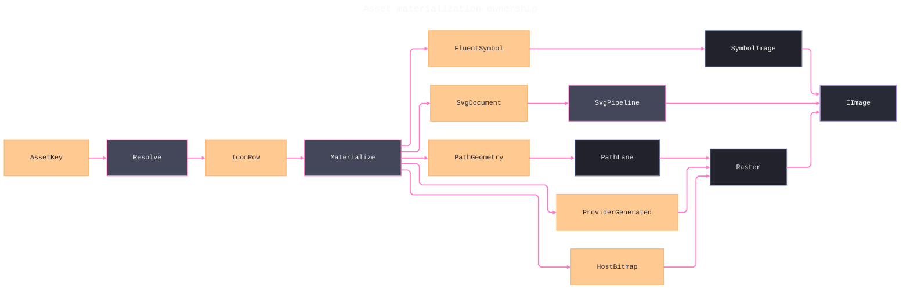

# [APPUI_ICONS_ASSETS]

Rasm.AppUi sources every icon and bundled asset through one nameof-derived `AssetKey` vocabulary: five `IconSource` cases materialize into one image product through a case-derived fallback walk, the SVG pipeline retains documents, scene graphs, and animation invalidation behind lease capsules, raster rows own async loading with cache and DPI-variant policy, and the avares admission table mints identity receipts. The page owns the icon axis, the SVG pipeline, the raster rows, and the asset catalogue over FluentIcons.Avalonia, Svg.Controls.Skia.Avalonia, AsyncImageLoader.Avalonia, SkiaSharp, Thinktecture-generated vocabulary, and LanguageExt rails.

## [01]-[INDEX]

- [01]-[ICON_AXIS]: Five-case icon union, case-derived fallback walk, one materialize dispatch.
- [02]-[SVG_PIPELINE]: Retained SVG documents, scene graph, dirty-region mutation, animation leases, hit testing.
- [03]-[RASTER_ASSETS]: Async raster loaders, cache scope, fallbacks, DPI-variant selection.
- [04]-[ASSET_CATALOG]: Avares admission rows, key vocabulary, preload receipts, geo assets.

## [02]-[ICON_AXIS]

- Owner: `IconSource` — one `[Union]` icon-sourcing axis; `IconSurface` owns the rank-walk resolution fold and the one materialize dispatch; `IconRow` is the resolution-table row; `DefaultRank` is the one generated case-rank correspondence every fallback order derives from.
- Cases: FluentSymbol | SvgDocument | PathGeometry | ProviderGenerated | HostBitmap in canonical fallback order; `AssetFault` = Text | UnknownKey | SizeOffAxis | MaterializeRejected | ScaleOffAxis under the `AppUiFaultBand.Asset` 6600 registry row; 10, 12, 16, 20, 24, 28, 32, and 48 compose the Fluent icon size axis.
- Entry: `public static Fin<IImage> Resolve(FrozenDictionary<AssetKey, ImmutableArray<IconRow>> table, AssetKey key, int size, double scale, SvgPipeline svg, Func<string, Color> tokens)` — `Fin` aborts on off-axis size or scale, unknown key, trapped native/provider failure, and exhausted ranks.
- Auto: the rank walk deletes per-call icon lookup and tint code; `DefaultRank` is the generated `Map` verdict table and `Freeze` orders every key's rows through it, so fallback order has exactly one authority and a new sourcing modality lands as one case plus one rank value; Projektanker-style attached icon registries stay rejected with this fold as the absorber.
- Packages: FluentIcons.Avalonia, SkiaSharp, Avalonia, Thinktecture.Runtime.Extensions, LanguageExt.Core
- Growth: one icon row — key, case payload, tint token — absorbs a new icon or fallback with zero new surface; one case on `IconSource` plus one rank value on the `DefaultRank` map absorbs a new sourcing modality.
- Boundary: `PathLane`, provider delegates, host delegates, SVG projection, and bitmap decode are exception-trapped through `Try.lift(...).Run()` and mapped to `MaterializeRejected`; a throwing native call cannot escape a successful `Fin`. `Resolve` combines ranked alternatives with LanguageExt first-success `operator |`, `DefaultRank` remains the sole modality correspondence, and stable declaration order breaks same-modality ties. Per-row tint resolves through the theme token key column, while `IconVariant.Color` may carry its own payload color.

```csharp signature
[Union]
public abstract partial record AssetFault : Expected, IValidationError<AssetFault> {
    private AssetFault(string detail, int code) : base(detail, code, None) { }

    public static AssetFault Create(string message) => new Text(message);

    public sealed record Text : AssetFault { public Text(string detail) : base(detail, AppUiFaultBand.Asset.Code(0)) { } }
    public sealed record UnknownKey : AssetFault { public UnknownKey(string detail) : base(detail, AppUiFaultBand.Asset.Code(1)) { } }
    public sealed record SizeOffAxis : AssetFault { public SizeOffAxis(string detail) : base(detail, AppUiFaultBand.Asset.Code(2)) { } }
    public sealed record MaterializeRejected : AssetFault { public MaterializeRejected(string detail) : base(detail, AppUiFaultBand.Asset.Code(3)) { } }
    public sealed record ScaleOffAxis : AssetFault { public ScaleOffAxis(string detail) : base(detail, AppUiFaultBand.Asset.Code(4)) { } }
}

[Union]
public abstract partial record IconSource {
    private IconSource() { }

    public sealed record FluentSymbol(Symbol Glyph, IconVariant Variant) : IconSource;
    public sealed record SvgDocument(AssetKey Asset) : IconSource;
    public sealed record PathGeometry(string PathData) : IconSource;
    public sealed record ProviderGenerated(Func<int, double, SKColor, byte[]> Render) : IconSource;
    public sealed record HostBitmap(Func<int, double, byte[]> Provider) : IconSource;
}

public sealed record IconRow(AssetKey Key, IconSource Source, string TintToken);

public static class IconSurface {
    public static readonly FrozenSet<int> Sizes = new[] { 10, 12, 16, 20, 24, 28, 32, 48 }.ToFrozenSet();

    public static int DefaultRank(IconSource source) =>
        source.Map(fluentSymbol: 0, svgDocument: 1, pathGeometry: 2, providerGenerated: 3, hostBitmap: 4);

    public static FrozenDictionary<AssetKey, ImmutableArray<IconRow>> Freeze(params ReadOnlySpan<IconRow> rows) =>
        rows.ToArray().GroupBy(static row => row.Key).ToFrozenDictionary(
            static group => group.Key,
            static group => group.OrderBy(static row => DefaultRank(row.Source)).ToImmutableArray());

    public static Fin<IImage> Resolve(FrozenDictionary<AssetKey, ImmutableArray<IconRow>> table, AssetKey key, int size, double scale, SvgPipeline svg, Func<string, Color> tokens) =>
        from admitted in Sizes.Contains(size) ? Fin.Succ(size) : Fin.Fail<int>(new AssetFault.SizeOffAxis($"{size}"))
        from admittedScale in double.IsFinite(scale) && scale > 0d ? Fin.Succ(scale) : Fin.Fail<double>(new AssetFault.ScaleOffAxis($"{scale}"))
        from ranked in Ranked(table, key)
        from image in ranked.AsIterable().Fold(
            Fin.Fail<IImage>(new AssetFault.MaterializeRejected(key.ToString())),
            (acc, row) => acc | Trap(() => tokens(row.TintToken)).Bind(tint => Materialize(row.Source, admitted, admittedScale, svg, tint)))
        select image;

    public static Fin<IImage> Materialize(IconSource source, int size, double scale, SvgPipeline svg, Color tint) =>
        source.Switch(
            state: (Size: size, Scale: scale, Svg: svg, Tint: tint),
            fluentSymbol: static (s, c) => Trap(() => (IImage)new SymbolImage { Symbol = c.Glyph, IconVariant = c.Variant, FontSize = s.Size, Foreground = new SolidColorBrush(s.Tint) }),
            svgDocument: static (s, c) => s.Svg.Image(c.Asset, s.Tint),
            pathGeometry: static (s, c) => Trap(() => PathLane(c.PathData, s.Size, s.Scale, Skia(s.Tint))).Bind(Raster),
            providerGenerated: static (s, c) => Trap(() => c.Render(s.Size, s.Scale, Skia(s.Tint))).Bind(Raster),
            hostBitmap: static (s, c) => Trap(() => c.Provider(s.Size, s.Scale)).Bind(Raster));

    public static SKColor Skia(Color tint) => new(tint.R, tint.G, tint.B, tint.A);

    static Fin<ImmutableArray<IconRow>> Ranked(FrozenDictionary<AssetKey, ImmutableArray<IconRow>> table, AssetKey key) =>
        table.TryGetValue(key, out ImmutableArray<IconRow> rows) ? Fin.Succ(rows) : Fin.Fail<ImmutableArray<IconRow>>(new AssetFault.UnknownKey(key.ToString()));

    static Fin<IImage> Raster(byte[] payload) =>
        Trap(() => {
            using MemoryStream stream = new(payload, writable: false);
            return (IImage)new Bitmap(stream);
        });

    static Fin<T> Trap<T>(Func<T> effect) =>
        Try.lift(effect).Run().MapFail(error => new AssetFault.MaterializeRejected(error.Message));

    static byte[] PathLane(string pathData, int size, double scale, SKColor tint) {
        using SKPath path = SKPath.ParseSvgPathData(pathData);
        using SKPaint paint = new() { Color = tint };
        int pixels = Pixels(size, scale);
        SKRect bounds = path.Bounds;
        if (bounds.Width <= 0f || bounds.Height <= 0f) { throw new InvalidDataException("icon path has no drawable bounds"); }
        float fit = Math.Min(pixels / bounds.Width, pixels / bounds.Height);
        using SKSurface surface = SKSurface.Create(new SKImageInfo(pixels, pixels));
        surface.Canvas.Translate(
            ((pixels - (bounds.Width * fit)) / 2f) - (bounds.Left * fit),
            ((pixels - (bounds.Height * fit)) / 2f) - (bounds.Top * fit));
        surface.Canvas.Scale(fit);
        surface.Canvas.DrawPath(path, paint);
        using SKImage shot = surface.Snapshot();
        using SKData data = shot.Encode();
        return data.ToArray();
    }

    static int Pixels(int size, double scale) => (int)double.Ceiling(size * scale);
}
```



## [03]-[SVG_PIPELINE]

- Owner: `SvgPipeline` — retained SVG document admission, capability-monotone cache, and tinted image projection; `SvgLease` the capability capsule every load returns — scene-graph access, dirty-region mutation, SMIL element control, animation handles, hit testing, and handler lifetime all reach the retained document only through it.
- Cases: `ScenePolicy` `[SmartEnum<string>]` rows — `PictureOnly` for icons and illustrations, `RetainedScene` for hit-testable documents, `Animated` for time-driven documents — the `Scene` column selecting whether the retained scene graph builds and the `Animate` column gating the animation-handler bind, so no fourth combination is representable.
- Entry: `public Fin<SvgLease> Load(AssetKey key, ScenePolicy policy, Option<EventHandler<SvgAnimationFrameChangedEventArgs>> onAnimation)` — `Fin` aborts on unknown key, stream admission failure, unavailable retained-scene capability, or handler admission failure; the lease is the handler's lifetime owner, so disposing it detaches exactly the handler this load attached.
- Auto: one composition-owned retained table deletes per-control re-parse, and one `(AssetKey, Color)` image table deletes per-call source reconstruction; capability remains monotone because `Ensure` rechecks the scene graph inside the document lock. `SvgLease.Mutate` returns dirty-region evidence, `Animate` applies pause/seek operations without returning the controller, `Begin` and `End` address SMIL elements under the same lock, and hit testing plus scene access remain lease operations.
- Packages: Svg.Controls.Skia.Avalonia, SkiaSharp, Avalonia, LanguageExt.Core, BCL inbox
- Growth: one retained row per asset key; a recolor, scene-build, or animation policy is one `ScenePolicy` row with zero new surface; a new mutation address form is one `Mutate` overload over the catalogued addressed-mutation family.
- Boundary: `SvgPipeline` is a disposable capability constructed with the resolved `SKFontManager`; its caches, typeface provider, retained documents, retained `SvgSource` instances, and racing duplicate disposal stay internal. `Admit` traps parsing, rejects a null picture, and retains the winning document; `Image` builds each tint source once from the admitted document's catalogued `Model`, and `Dispose` releases every source before every document. `SvgLease` never exports `SKSvg` or `SvgAnimationController`, every document operation locks `document.Sync`, and lease disposal detaches only its animation handler. A process-static cache, `SKFontManager.Default`, caller disposal, URI re-parse, and unlocked scene access are rejected forms.

```csharp signature
[SmartEnum<string>]
[KeyMemberEqualityComparer<ComparerAccessors.StringOrdinal, string>]
[KeyMemberComparer<ComparerAccessors.StringOrdinal, string>]
public sealed partial class ScenePolicy {
    public static readonly ScenePolicy PictureOnly = new("picture-only", scene: false, animate: false);
    public static readonly ScenePolicy RetainedScene = new("retained-scene", scene: true, animate: false);
    public static readonly ScenePolicy Animated = new("animated", scene: true, animate: true);

    public bool Scene { get; }

    public bool Animate { get; }
}

public sealed class SvgLease(AssetKey key, SKSvg document, Action detach) : IDisposable {
    public AssetKey Key { get; } = key;

    public Fin<SvgSceneMutationResult> Mutate(string id, params ReadOnlySpan<string> changedAttributes) =>
        Locked(() => document.TryApplyRetainedSceneMutationByIdAndRender(id, changedAttributes.ToArray(), out SvgSceneMutationResult? dirty) && dirty is not null
                ? Fin.Succ(dirty)
                : Fin.Fail<SvgSceneMutationResult>(new AssetFault.MaterializeRejected(id)))
            .Bind(identity);

    public Fin<Option<SvgSceneDocument>> Scene() =>
        Locked(() => document.HasRetainedSceneGraph ? Optional(document.RetainedSceneGraph) : None);

    public Fin<Unit> Animate(Action<SvgAnimationController> operation) =>
        Locked(() => Optional(document.AnimationController)
            .ToFin(new AssetFault.MaterializeRejected($"{Key}/animation"))
            .Map(controller => fun(() => operation(controller))()))
        .Bind(identity);

    public Fin<Unit> Begin(string id, TimeSpan offset) =>
        Locked(() => fun(() => document.BeginAnimationElement(id, offset))());

    public Fin<Unit> End(string id, TimeSpan offset) =>
        Locked(() => fun(() => document.EndAnimationElement(id, offset))());

    public Fin<Option<SvgSceneNode>> Topmost(SKPoint at) =>
        Locked(() => Optional(document.HitTestTopmostSceneNode(at)));

    public Fin<Seq<SvgSceneNode>> Hits(SKPoint at) =>
        Locked(() => toSeq(document.HitTestSceneNodes(at)));

    private Fin<T> Locked<T>(Func<T> operation) =>
        Try.lift(() => { lock (document.Sync) { return operation(); } }).Run()
            .MapFail(error => new AssetFault.MaterializeRejected($"{Key}/{error.Message}"));

    public void Dispose() => detach();
}

public sealed class SvgPipeline(SKFontManager fonts) : IDisposable {
    private readonly ConcurrentDictionary<AssetKey, SKSvg> retained = new();
    private readonly ConcurrentDictionary<(AssetKey Key, Color Tint), SvgImage> images = new();
    private readonly ITypefaceProvider typefaces = new FontManagerTypefaceProvider { FontManager = fonts };

    public Fin<SvgLease> Load(AssetKey key, ScenePolicy policy, Option<EventHandler<SvgAnimationFrameChangedEventArgs>> onAnimation) =>
        (retained.TryGetValue(key, out SKSvg hit) ? Fin.Succ(hit) : AssetCatalog.Open(key, 1d).Bind(payload => Admit(key, payload)))
            .Bind(document => Ensure(document, policy))
            .Bind(document => Leased(key, document, policy, onAnimation));

    public Fin<IImage> Image(AssetKey asset, Color tint) =>
        Load(asset, ScenePolicy.PictureOnly, None).Bind(_ => Try.lift(() => (IImage)AdmitImage(asset, tint)).Run()
            .MapFail(error => new AssetFault.MaterializeRejected(error.Message)));

    public static Option<SvgElement> Hit(SvgInteractionDispatcher dispatcher, float x, float y) =>
        Optional(dispatcher.HitTestTopmostElement(new SKPoint(x, y)));

    private Fin<SKSvg> Admit(AssetKey key, Stream payload) =>
        Try.lift(() => {
            using Stream scoped = payload;
            SKSvg document = new();
            document.Settings.TypefaceProviders?.Add(typefaces);
            _ = document.Load(scoped) ?? throw new InvalidDataException($"svg {key}");
            SKSvg winner = retained.GetOrAdd(key, document);
            if (!ReferenceEquals(winner, document)) { document.Dispose(); }
            return winner;
        }).Run().MapFail(error => new AssetFault.MaterializeRejected(error.Message));

    private SvgImage AdmitImage(AssetKey key, Color tint) {
        if (images.TryGetValue((key, tint), out SvgImage? hit)) { return hit; }
        SKSvg document = retained[key];
        SvgImage candidate;
        lock (document.Sync) {
            candidate = new SvgImage {
                Source = SvgSource.LoadFromSvgDocument(document.Model ?? throw new InvalidDataException($"svg model {key}")),
                CurrentColor = tint,
            };
        }
        SvgImage winner = images.GetOrAdd((key, tint), candidate);
        if (!ReferenceEquals(winner, candidate)) { candidate.Source?.Dispose(); }
        return winner;
    }

    static Fin<SKSvg> Ensure(SKSvg document, ScenePolicy policy) =>
        Try.lift(() => {
            lock (document.Sync) {
                if (policy.Scene && !document.HasRetainedSceneGraph && !document.TryEnsureRetainedSceneGraph()) {
                    throw new InvalidDataException("retained SVG scene unavailable");
                }
                return document;
            }
        }).Run().MapFail(error => new AssetFault.MaterializeRejected(error.Message));

    static Fin<SvgLease> Leased(AssetKey key, SKSvg document, ScenePolicy policy, Option<EventHandler<SvgAnimationFrameChangedEventArgs>> onAnimation) =>
        Try.lift(() => { lock (document.Sync) {
            return (policy.Animate ? onAnimation : None).Match(
                Some: handler => {
                    document.AnimationInvalidated += handler;
                    return new SvgLease(key, document, () => { lock (document.Sync) { document.AnimationInvalidated -= handler; } });
                },
                None: () => new SvgLease(key, document, static () => { }));
        }}).Run().MapFail(error => new AssetFault.MaterializeRejected(error.Message));

    public void Dispose() {
        toSeq(images.Values).Choose(static image => Optional(image.Source)).Iter(static source => source.Dispose());
        images.Clear();
        toSeq(retained.Values).Iter(static document => document.Dispose());
        retained.Clear();
    }
}
```

## [04]-[RASTER_ASSETS]

- Owner: `RasterAssets` — async raster loader rows, cache scope, and DPI-variant selection; `RasterRow` is the policy record carrying placeholder and error fallback keys.
- Entry: `public static RasterAssets Open(ProfileRoots roots, Option<HttpClient> client)` — one disposable capability owns the disk-cached and companion RAM loaders; a present client rides the catalogued injected constructor so outbound HTTP policy stays host-owned.
- Auto: one `Wire` assignment publishes the global loader and deletes per-view loader construction; placeholder and error fallbacks are catalog keys consumed by `AdvancedImage` `FallbackImage` rows, never per-control bitmaps; the storage-aware lane resolves a picker-scoped or sandboxed asset through the `IAdvancedAsyncImageLoader.ProvideImageAsync(string, IStorageProvider)` two-argument overload so a host-storage-scoped image enters the same loader without a second decode path.
- Packages: AsyncImageLoader.Avalonia, Avalonia, Rasm.AppHost (project), LanguageExt.Core, BCL inbox
- Growth: one policy value per cache or variant fact; a remote companion source is one loader row; a storage-scoped source is one `IStorageProvider`-bound call on the advanced loader — zero new surface.
- Boundary: `RasterAssets` creates each loader once, publishes the durable instance once, and disposes both loaders with the capability. A present `HttpClient` remains borrowed through `disposeHttpClient: false`; storage-aware reads use `IAdvancedAsyncImageLoader.ProvideImageAsync`; `AssetRow.Variants` carries an extensible scale table rather than a single optional `@2x` ghost; and cache content stays under `ProfileRoots`.

```csharp signature
public sealed record RasterRow(AssetKey Placeholder, AssetKey Error, string CacheFolder, double HiDpiThreshold);

public sealed class RasterAssets : IDisposable {
    public static readonly RasterRow Policy = new(AssetKeys.IconPlaceholder, AssetKeys.IconError, "asset-cache", 1.5d);

    private readonly IAsyncImageLoader durable;
    private readonly IAsyncImageLoader companion;

    private RasterAssets(IAsyncImageLoader durable, IAsyncImageLoader companion) =>
        (this.durable, this.companion) = (durable, companion);

    public static RasterAssets Open(ProfileRoots roots, Option<HttpClient> client) =>
        new(client.Match(
            Some: IAsyncImageLoader (http) => new DiskCachedWebImageLoader(http, disposeHttpClient: false, Path.Join(roots.AppRoot, Policy.CacheFolder)),
            None: () => new DiskCachedWebImageLoader(Path.Join(roots.AppRoot, Policy.CacheFolder))),
            new RamCachedWebImageLoader());

    public IAsyncImageLoader Durable => durable;

    public IAsyncImageLoader Companion => companion;

    public static IO<Option<Bitmap>> Storage(IAdvancedAsyncImageLoader loader, string url, IStorageProvider storage) =>
        IO.liftAsync(async () => Optional(await loader.ProvideImageAsync(url, storage).ConfigureAwait(false)));

    public Unit Wire() => (ImageLoader.AsyncImageLoader = durable, unit).Item2;

    public static Uri Pick(AssetRow row, double scale) =>
        scale < Policy.HiDpiThreshold
            ? row.Source
            : Optional(row.Variants.Filter(variant => variant.Scale <= scale).OrderBy(static variant => variant.Scale).LastOrDefault().Source).IfNone(row.Source);

    public void Dispose() { companion.Dispose(); durable.Dispose(); }
}
```

## [05]-[ASSET_CATALOG]

- Owner: `AssetCatalog` — the avares admission table; `AssetKey` is the one nameof-derived key vocabulary shared by command, screen, and chart rows; `AssetKind` is the kind axis.
- Cases: `AssetKind` = vector | raster | geo.
- Entry: `public static Fin<Stream> Open(AssetKey key, double scale)` — `Fin` aborts on unknown key, an invalid scale, or a trapped asset-loader failure; geo rows feed the chart geo series by key so the chart never loads files.
- Auto: `Preload` folds preload rows into identity receipts at boot; runtime asset reload is deleted — Debug hot reload rides HotAvalonia and Release assets are immutable avares plus blob-lane content.
- Receipt: `AssetReceipt` — key, kind, origin, scale, and the required asset-byte content address minted through the kernel `ContentHash.Of` entry — sinks through `ReceiptSinkPort` under the evidence union's `Asset` case; successful admission never carries an absent hash.
- Packages: Avalonia, Thinktecture.Runtime.Extensions, LanguageExt.Core, Rasm (project), BCL inbox
- Growth: one `AssetRow` — key, kind, base avares source, ordered scale variants, preload flag — admits a new asset with zero new surface.
- Boundary: avares content is the only Release-time asset origin; remote bytes enter through the raster loader rows and durable artifacts live in the blob lane; the key vocabulary crosses pages as values — sibling catalogs admit their icon and asset columns through `AssetKey` at composition; `Receipt` is this fence's boundary capsule — the probed stream is using-scoped inside the hash fold.

```csharp signature

[ValueObject<string>(
    ComparisonOperators = OperatorsGeneration.DefaultWithKeyTypeOverloads,
    EqualityComparisonOperators = OperatorsGeneration.DefaultWithKeyTypeOverloads)]
[ValidationError<AssetFault>]
[KeyMemberEqualityComparer<ComparerAccessors.StringOrdinal, string>]
[KeyMemberComparer<ComparerAccessors.StringOrdinal, string>]
public readonly partial struct AssetKey;

[SmartEnum<string>]
[ValidationError<AssetFault>]
[KeyMemberEqualityComparer<ComparerAccessors.StringOrdinal, string>]
[KeyMemberComparer<ComparerAccessors.StringOrdinal, string>]
public sealed partial class AssetKind {
    public static readonly AssetKind Vector = new("vector");
    public static readonly AssetKind Raster = new("raster");
    public static readonly AssetKind Geo = new("geo");
}

public sealed record AssetRow(AssetKey Key, AssetKind Kind, Uri Source, Seq<(double Scale, Uri Source)> Variants, bool Preload);

public sealed record AssetReceipt(AssetKey Key, AssetKind Kind, string Origin, double Scale, string ContentHash);

public static class AssetKeys {
    public static readonly AssetKey GeoWorld = AssetKey.Create(nameof(GeoWorld));
    public static readonly AssetKey IconPlaceholder = AssetKey.Create(nameof(IconPlaceholder));
    public static readonly AssetKey IconError = AssetKey.Create(nameof(IconError));
    public static readonly AssetKey NavBack = AssetKey.Create(nameof(NavBack));
    public static readonly AssetKey NavForward = AssetKey.Create(nameof(NavForward));
}

public static class AssetCatalog {
    public static readonly ImmutableArray<AssetRow> Rows = [
        new(AssetKeys.GeoWorld, AssetKind.Geo, Avares("geo/world.geojson"), Seq<(double, Uri)>(), true),
        new(AssetKeys.IconPlaceholder, AssetKind.Raster, Avares("raster/placeholder.png"), Seq((2d, Avares("raster/placeholder@2x.png"))), true),
        new(AssetKeys.IconError, AssetKind.Raster, Avares("raster/error.png"), Seq((2d, Avares("raster/error@2x.png"))), true),
    ];

    static Uri Avares(string path) => new("avares://Rasm.AppUi/Assets/" + path);

    private static readonly FrozenDictionary<AssetKey, AssetRow> Table = Rows.ToFrozenDictionary(static row => row.Key);

    public static Fin<AssetRow> Row(AssetKey key) =>
        Table.TryGetValue(key, out AssetRow row) ? Fin.Succ(row) : Fin.Fail<AssetRow>(new AssetFault.UnknownKey(key.ToString()));

    public static Fin<Stream> Open(AssetKey key, double scale) =>
        from admittedScale in double.IsFinite(scale) && scale > 0d ? Fin.Succ(scale) : Fin.Fail<double>(new AssetFault.ScaleOffAxis($"{scale}"))
        from row in Row(key)
        from stream in Try.lift(() => AssetLoader.Open(RasterAssets.Pick(row, admittedScale))).Run()
            .MapFail(error => new AssetFault.MaterializeRejected(error.Message))
        select stream;

    public static Fin<Seq<AssetReceipt>> Preload() =>
        Rows.AsIterable().Filter(static row => row.Preload).TraverseM(static row => Receipt(row)).As().Map(static receipts => receipts.ToSeq());

    static Fin<AssetReceipt> Receipt(AssetRow row) =>
        Open(row.Key, 1d).Map(payload => {
            using Stream scoped = payload;
            using MemoryStream buffer = new();
            scoped.CopyTo(buffer);
            return new AssetReceipt(row.Key, row.Kind, "avares", 1d, $"{ContentHash.Of(buffer.GetBuffer().AsSpan(0, (int)buffer.Length)):x32}");
        });
}
```
