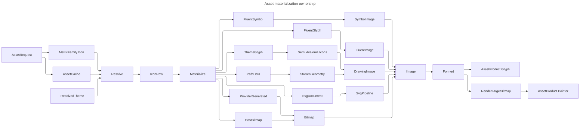

# [APPUI_ICONS_ASSETS]

Rasm.AppUi sources every icon, pointer, and bundled asset through one nameof-derived `AssetKey` vocabulary: seven `IconSource` cases materialize into one `AssetProduct` through a case-derived fallback walk, the icon size axis derives from the `Theme/tokens` `MetricFamily.Icon` scale, one generation-stamped budgeted cache owns every materialized product, the SVG pipeline retains documents, scene graphs, and animation invalidation behind lease capsules, raster rows own async loading with cache and DPI-variant policy, and the avares admission table mints identity receipts under per-surface preload partitions. The page owns the icon axis, the cursor vocabulary, the asset cache, the SVG pipeline, the raster rows, and the asset catalogue over FluentIcons.Avalonia, Svg.Controls.Skia.Avalonia, AsyncImageLoader.Avalonia, Semi.Avalonia, SkiaSharp, Thinktecture-generated vocabulary, and LanguageExt rails.

## [01]-[INDEX]

- [02]-[ICON_AXIS]: Seven-case icon union, metric-derived size axis, mirror posture, one materialize dispatch.
- [03]-[CURSOR_ROWS]: Pointer vocabulary over the platform cursor roster and the drawn rows it lacks.
- [04]-[ASSET_CACHE]: Generation-stamped budgeted product cache, byte-ceiling retirement, DPI re-election.
- [05]-[SVG_PIPELINE]: Retained SVG documents, scene graph, dirty-region mutation, animation leases, hit testing.
- [06]-[RASTER_ASSETS]: Async raster loaders, cache scope, fallbacks, DPI-variant selection.
- [07]-[ASSET_CATALOG]: Avares admission rows, key vocabulary, partitioned preload receipts, geo assets.

## [02]-[ICON_AXIS]

- Owner: `IconSource` — one `[Union]` icon-sourcing axis; `IconSurface` owns the rank-walk resolution fold and the one materialize dispatch; `IconRow` is the resolution-table row carrying its tint role and mirror posture; `DefaultRank` is the one generated case-rank correspondence every fallback order derives from; `AssetRuntime` is the composition-bound capability quad every resolve reads; `AssetProduct` is the one materialized carrier both the image and the pointer form return.
- Cases: FluentSymbol | FluentGlyph | ThemeGlyph | SvgDocument | PathData | ProviderGenerated | HostBitmap in canonical fallback order; `GlyphForm` = Image | Pointer; `AssetProduct` = Glyph | Pointer; `MirrorPosture` = Never | Flip | Glyph; `AssetFault` = Text | UnknownKey | SizeOffAxis | MaterializeRejected | ScaleOffAxis | TintUnresolved | GlyphUnavailable | BudgetRejected under the `AppUiFaultBand.Asset` 6600 registry row.
- Law: the icon size axis IS the `MetricFamily.Icon` scale — a request carries a STEP and the resolve reads `ResolvedTheme.Metric(MetricFamily.Icon, step)`, so a density election, a text-scale flip, and a high-contrast projection re-derive glyph geometry with the surface geometry beside it and a pixel literal in an icon column is unrepresentable.
- Entry: `public static Fin<AssetProduct> Resolve(AssetRuntime runtime, AssetRequest request, ResolvedTheme resolved)` — `Fin` aborts on an off-axis metric step, a non-finite or non-positive scale, an unknown key, an ungenerated tint rung, an unavailable Fluent glyph, trapped native or provider failure, a cell exceeding the whole cache ceiling, and exhausted ranks.
- Auto: the rank walk deletes per-call icon lookup and tint code; `DefaultRank` is the generated `Map` verdict table and `Freeze` orders every key's rows through it, so fallback order has exactly one authority and a new sourcing modality lands as one case plus one rank value; the shipped `Semi.Avalonia.Icons` dictionary enters as ONE case rather than a transcribed path roster; `Elected` derives the Fluent size from the package's own `IconSizeValues.Enumerable` binding source, so the size roster is never re-spelled here; every product admits through `AssetCache.Take`, so a theme swap, a scale flip, and a byte ceiling govern icons, cursors, and tinted SVG from one owner; Projektanker-style attached icon registries stay rejected with this fold as the absorber.
- Packages: FluentIcons.Common, FluentIcons.Avalonia, Semi.Avalonia, Avalonia, Thinktecture.Runtime.Extensions, LanguageExt.Core
- Growth: one icon row — key, case payload, tint role and rung, mirror posture — absorbs a new icon with zero new surface; one case on `IconSource` plus one rank value on the `DefaultRank` map absorbs a new sourcing modality; one `GlyphForm` case plus one `AssetProduct` case absorbs a new materialized product form.
- Boundary: `IconSurface` resolves through ONE walk for both forms — the ranked fold produces the image, then the request's `GlyphForm` projects it, so a pointer is the image product rasterized through one `RenderTargetBitmap` render rather than a parallel per-case cursor lane, and every source the walk admits becomes a cursor by construction. Tint reads `ResolvedTheme.Paint(role, rung)`: `TokenKey` is minted by the `Theme/tokens` generation owners alone, so a string token column on an icon row could address no bucket and is the deleted form, and an ungenerated rung surfaces as `TintUnresolved` rather than a silent lookup miss. The vector lane builds a `DrawingImage` over a `GeometryDrawing` under one fit-and-mirror `MatrixTransform` with the `Viewbox` pinning the product extent, so a vector icon stays resolution-independent, re-tints by value, and needs no surface rasterization at all — the predecessor's `SKSurface` path rasterizer is deleted, and Skia enters this axis nowhere. `ThemeGlyph` reads the shipped dictionary through `Semi.Avalonia.Icons`, whose entries register deferred and build their `StreamGeometry` once, the dictionary itself replacing the deferred factory with the built value; that replacement is an unguarded write, so `AssetRuntime.Glyphs` is read on the UI thread alone and the built geometry is immutable thereafter. The Fluent lane splits by TYPEFACE: `SymbolImage` binds the one resizable face and gates on `Symbol.IsAvailable(variant)`, while `FluentImage` binds a size-specific face and gates on `Icon.IsAvailable(size, variant)` — the size member is the second case's own axis, `Elected` takes the largest available size at or below the resolved metric, falls to `IconSize.Resizable` only where that glyph ships one, and refuses by name otherwise, so a non-resizable member silently rendering as a missing glyph has no form here. Both Fluent images are `IDisposable` over a retained `TextLayout`, so an uncached per-call construction leaks the layout and the cache is the one owner that releases them. Mirroring is a ROW POSTURE, never a call-site decision: `Glyph` states that the source ships its own mirrored form and sets `FlowDirection` (the Fluent faces carry the mirrored plane at a fixed codepoint offset and select it from that property alone), `Flip` states that the product mirrors under one horizontal matrix about its own box, and `Never` states that the glyph reads identically in both directions; the posture applies only while the request's flow reads right-to-left. `Resolve` walks ranked alternatives through `BindFail` so the fold stops at the first materialized product — `operator |` evaluates both operands, decoding every lower rank after the winner already exists, which for provider render delegates and bitmap decode is work done to be discarded; `DefaultRank` ascends by materialization cost and descends by tint fidelity, and stable declaration order breaks same-modality ties. Provider delegates, host delegates, SVG projection, bitmap decode, geometry lookup, and cursor construction are exception-trapped through `Try.lift(...).Run()` and mapped to `MaterializeRejected`; a throwing native call cannot escape a successful `Fin`, and cursor and render-target construction resolve platform services that are absent before the application platform initializes.

```csharp signature
// --- [ERRORS] ---------------------------------------------------------------------------

[Union]
public abstract partial record AssetFault : Expected, IValidationError<AssetFault> {
    private AssetFault(string detail, int code) : base(detail, code, None) { }

    public static AssetFault Create(string message) => new Text(message);

    public sealed record Text : AssetFault { public Text(string detail) : base(detail, AppUiFaultBand.Asset.Code(0)) { } }
    public sealed record UnknownKey : AssetFault { public UnknownKey(string detail) : base(detail, AppUiFaultBand.Asset.Code(1)) { } }
    public sealed record SizeOffAxis : AssetFault { public SizeOffAxis(string detail) : base(detail, AppUiFaultBand.Asset.Code(2)) { } }
    public sealed record MaterializeRejected : AssetFault { public MaterializeRejected(string detail) : base(detail, AppUiFaultBand.Asset.Code(3)) { } }
    public sealed record ScaleOffAxis : AssetFault { public ScaleOffAxis(string detail) : base(detail, AppUiFaultBand.Asset.Code(4)) { } }
    public sealed record TintUnresolved : AssetFault { public TintUnresolved(string detail) : base(detail, AppUiFaultBand.Asset.Code(5)) { } }
    public sealed record GlyphUnavailable : AssetFault { public GlyphUnavailable(string detail) : base(detail, AppUiFaultBand.Asset.Code(6)) { } }
    public sealed record BudgetRejected : AssetFault { public BudgetRejected(string detail) : base(detail, AppUiFaultBand.Asset.Code(7)) { } }
}
```

```csharp signature
// --- [TYPES] ----------------------------------------------------------------------------

// Three postures, never a boolean: a mirrored glyph the FONT ships and a product the RENDERER mirrors are
// different mechanisms with different failure modes, and collapsing them to `Mirrors: true` would either
// transform a face that already flipped itself or leave a hand-drawn arrow pointing the wrong way.
[SmartEnum<string>]
[KeyMemberEqualityComparer<ComparerAccessors.StringOrdinal, string>]
[KeyMemberComparer<ComparerAccessors.StringOrdinal, string>]
public sealed partial class MirrorPosture {
    public static readonly MirrorPosture Never = new("never", transforms: false, signals: false);
    public static readonly MirrorPosture Flip = new("flip", transforms: true, signals: false);
    public static readonly MirrorPosture Glyph = new("glyph", transforms: false, signals: true);

    public bool Transforms { get; }

    public bool Signals { get; }

    public FlowDirection Flow(FlowDirection requested) =>
        Signals ? requested : FlowDirection.LeftToRight;

    public bool Mirrors(FlowDirection requested) =>
        Transforms && requested is FlowDirection.RightToLeft;
}

[Union]
public abstract partial record GlyphForm {
    private GlyphForm() { }

    public sealed record Image : GlyphForm;
    public sealed record Pointer(UnitInterval HotX, UnitInterval HotY) : GlyphForm;
}

[Union]
public abstract partial record IconSource {
    private IconSource() { }

    public sealed record FluentSymbol(Symbol Glyph, IconVariant Variant) : IconSource;
    public sealed record FluentGlyph(Icon Glyph, IconVariant Variant) : IconSource;
    public sealed record ThemeGlyph(string ResourceKey) : IconSource;
    public sealed record SvgDocument(AssetKey Asset) : IconSource;
    public sealed record PathData(string Data) : IconSource;
    public sealed record ProviderGenerated(Func<int, double, Color, byte[]> Render) : IconSource;
    public sealed record HostBitmap(Func<int, double, byte[]> Provider) : IconSource;
}

// --- [MODELS] ---------------------------------------------------------------------------

public sealed record IconRow(AssetKey Key, IconSource Source, PaintRole Tint, int Rung, MirrorPosture Mirror);

// The cache key IS the request: two reads differing in step, scale, flow, or form are two products, and a
// record's structural equality is what makes that identity total without a hand-written comparer.
public sealed record AssetRequest(AssetKey Key, int Step, double Scale, FlowDirection Flow, GlyphForm Form);

[Union]
public abstract partial record AssetProduct {
    private AssetProduct(PixelSize extent) => Extent = extent;

    public PixelSize Extent { get; }

    // Device-pixel footprint at four bytes per pixel: a vector product retains no buffer of its own, yet the
    // compositor rasterizes it at exactly this extent, so one accounting rule covers every case and a budget
    // cannot be gamed by choosing a source form.
    public long Bytes => 4L * Extent.Width * Extent.Height;

    public Fin<IImage> Image => Switch(
        state: unit,
        glyph: static (_, product) => Fin.Succ(product.Picture),
        pointer: static (_, product) => Fin.Fail<IImage>(new AssetFault.MaterializeRejected("pointer requested as image")));

    public Fin<Cursor> Cursor => Switch(
        state: unit,
        glyph: static (_, product) => Fin.Fail<Cursor>(new AssetFault.MaterializeRejected("image requested as pointer")),
        pointer: static (_, product) => Fin.Succ(product.Handle));

    // A vector product retains nothing disposable while every raster and Fluent product does, so the release
    // reads the framework interface at the boundary rather than carrying a per-case disposal column.
    public Unit Release() => Switch(
        state: unit,
        glyph: static (_, product) => fun(() => (product.Picture as IDisposable)?.Dispose())(),
        pointer: static (_, product) => fun(() => product.Handle.Dispose())());

    public sealed record Glyph : AssetProduct {
        public Glyph(IImage picture, PixelSize extent) : base(extent) => Picture = picture;

        public IImage Picture { get; }
    }

    public sealed record Pointer : AssetProduct {
        public Pointer(Cursor handle, PixelSize extent) : base(extent) => Handle = handle;

        public Cursor Handle { get; }
    }
}

// --- [SERVICES] -------------------------------------------------------------------------

// The composition-bound capability quad. `Glyphs` is the shipped geometry dictionary instantiated once —
// `Semi.Avalonia.Icons` is a public `ResourceDictionary` merging the fill, stroked, and AI sets, so the
// product addresses the shipped vocabulary as data instead of transcribing five hundred path strings.
public sealed record AssetRuntime(
    FrozenDictionary<AssetKey, ImmutableArray<IconRow>> Rows,
    Semi.Avalonia.Icons Glyphs,
    SvgPipeline Svg,
    AssetCache Cache);
```

```csharp signature
// --- [OPERATIONS] -----------------------------------------------------------------------

public static class IconSurface {
    public static int DefaultRank(IconSource source) =>
        source.Map(fluentSymbol: 0, fluentGlyph: 1, themeGlyph: 2, svgDocument: 3, pathData: 4, providerGenerated: 5, hostBitmap: 6);

    public static FrozenDictionary<AssetKey, ImmutableArray<IconRow>> Freeze(params ReadOnlySpan<IconRow> rows) =>
        rows.ToArray().GroupBy(static row => row.Key).ToFrozenDictionary(
            static group => group.Key,
            static group => group.OrderBy(static row => DefaultRank(row.Source)).ToImmutableArray());

    public static Fin<AssetProduct> Resolve(AssetRuntime runtime, AssetRequest request, ResolvedTheme resolved) =>
        runtime.Cache.Take(request, () => Build(runtime, request, resolved));

    static Fin<AssetProduct> Build(AssetRuntime runtime, AssetRequest request, ResolvedTheme resolved) =>
        from dip in resolved.Metric(MetricFamily.Icon, request.Step)
            .ToFin(new AssetFault.SizeOffAxis($"{MetricFamily.Icon.Key}/{request.Step}"))
        from scale in double.IsFinite(request.Scale) && request.Scale > 0d
            ? Fin.Succ(request.Scale)
            : Fin.Fail<double>(new AssetFault.ScaleOffAxis($"{request.Scale}"))
        let pixels = Pixels(dip, scale)
        from ranked in Ranked(runtime.Rows, request.Key)
        from picture in ranked.AsIterable().Fold(
            Fin.Fail<IImage>(new AssetFault.MaterializeRejected(request.Key.ToString())),
            (acc, row) => acc.BindFail(_ => Painted(row, resolved).Bind(tint =>
                Materialize(runtime, row, request.Flow, dip, pixels, tint))))
        from product in Formed(request.Form, picture, dip, pixels)
        select product;

    // One materialize dispatch. Every arm answers an `IImage` in DEVICE-INDEPENDENT units — the vector and
    // Fluent arms are resolution-free by construction and only the byte-backed arms decode at device pixels.
    public static Fin<IImage> Materialize(AssetRuntime runtime, IconRow row, FlowDirection flow, double dip, int pixels, Color tint) =>
        row.Source.Switch(
            state: (Runtime: runtime, Mirror: row.Mirror, Flow: flow, Dip: dip, Pixels: pixels, Tint: tint),
            fluentSymbol: static (s, c) => (c.Glyph.IsAvailable(c.Variant)
                    ? Trap(() => (IImage)new SymbolImage {
                        Symbol = c.Glyph,
                        IconVariant = c.Variant,
                        FontSize = s.Dip,
                        FlowDirection = s.Mirror.Flow(s.Flow),
                        Foreground = new SolidColorBrush(s.Tint),
                    })
                    : Fin.Fail<IImage>(new AssetFault.GlyphUnavailable($"{c.Glyph}/{c.Variant}")))
                .Map(image => Mirrored(image, s.Mirror, s.Flow, s.Dip)),
            fluentGlyph: static (s, c) => Elected(c.Glyph, c.Variant, s.Dip)
                .Bind(size => Trap(() => (IImage)new FluentImage {
                    Icon = c.Glyph,
                    IconVariant = c.Variant,
                    IconSize = size,
                    FontSize = s.Dip,
                    FlowDirection = s.Mirror.Flow(s.Flow),
                    Foreground = new SolidColorBrush(s.Tint),
                }))
                .Map(image => Mirrored(image, s.Mirror, s.Flow, s.Dip)),
            themeGlyph: static (s, c) => Shipped(s.Runtime.Glyphs, c.ResourceKey)
                .Bind(geometry => Drawn(geometry, s.Tint, s.Dip, s.Mirror.Mirrors(s.Flow))),
            svgDocument: static (s, c) => s.Runtime.Svg.Image(c.Asset, s.Tint)
                .Map(image => Mirrored(image, s.Mirror, s.Flow, s.Dip)),
            pathData: static (s, c) => Trap(() => (Geometry)StreamGeometry.Parse(c.Data))
                .Bind(geometry => Drawn(geometry, s.Tint, s.Dip, s.Mirror.Mirrors(s.Flow))),
            providerGenerated: static (s, c) => Trap(() => c.Render(s.Pixels, s.Dip, s.Tint)).Bind(Raster)
                .Map(image => Mirrored(image, s.Mirror, s.Flow, s.Dip)),
            hostBitmap: static (s, c) => Trap(() => c.Provider(s.Pixels, s.Dip)).Bind(Raster)
                .Map(image => Mirrored(image, s.Mirror, s.Flow, s.Dip)));

    // The Fluent resizable set carries one glyph per (member, variant); the sized set carries a per-size
    // face and the package answers availability from its own bit tables, so the gate is a package read
    // rather than a transcribed roster of which members resize.
    // The ordered run re-enters the carrier before the positional read: `OrderBy` answers `IOrderedEnumerable`,
    // which carries neither the `Option`-shaped `Last` nor any other carrier member, so chaining straight off it
    // either fails to compile or binds the throwing LINQ twin — and the two failures look nothing alike.
    public static Fin<IconSize> Elected(Icon glyph, IconVariant variant, double dip) =>
        toSeq(toSeq(IconSizeValues.Enumerable)
                .Filter(size => size is not IconSize.Resizable && (int)size <= dip && glyph.IsAvailable(size, variant))
                .OrderBy(static size => (int)size))
            .Last
            .Match(
                Some: Fin.Succ,
                None: () => glyph.IsAvailable(IconSize.Resizable, variant)
                    ? Fin.Succ(IconSize.Resizable)
                    : Fin.Fail<IconSize>(new AssetFault.GlyphUnavailable($"{glyph}/{variant}@{dip:F1}")));

    // The form projection. A pointer is the resolved image rendered once into a render target and handed to
    // the platform cursor factory, so the hotspot rides fractions of the product box and re-derives at every
    // scale instead of carrying a pixel literal that lies on the next display.
    static Fin<AssetProduct> Formed(GlyphForm form, IImage picture, double dip, int pixels) =>
        form.Switch(
            state: (Picture: picture, Dip: dip, Pixels: pixels),
            image: static (s, _) => Fin.Succ<AssetProduct>(new AssetProduct.Glyph(s.Picture, new PixelSize(s.Pixels, s.Pixels))),
            pointer: static (s, c) => Trap(() => {
                using RenderTargetBitmap target = new(new PixelSize(s.Pixels, s.Pixels));
                using (DrawingContext context = target.CreateDrawingContext()) {
                    s.Picture.Draw(context, new Rect(s.Picture.Size), new Rect(0d, 0d, s.Pixels, s.Pixels));
                }
                PixelPoint hot = new((int)(c.HotX.Value * s.Pixels), (int)(c.HotY.Value * s.Pixels));
                return (AssetProduct)new AssetProduct.Pointer(new Cursor(target, hot), new PixelSize(s.Pixels, s.Pixels));
            }));

    // The fit places the geometry's own bounds centred inside the product box and the mirror folds into the
    // same matrix, so a flipped vector icon costs one factor rather than a second wrapping image. A geometry
    // with no drawable extent refuses by name — a transparent product would rank as a materialized winner
    // and stop the fallback walk on nothing.
    static Fin<IImage> Drawn(Geometry geometry, Color tint, double dip, bool mirror) =>
        geometry.Bounds is { Width: > 0d, Height: > 0d } bounds
            ? Fin.Succ(Boxed(
                new GeometryDrawing { Geometry = geometry, Brush = new SolidColorBrush(tint) },
                Place(bounds, dip) * (mirror ? Flipped(dip) : Matrix.Identity),
                dip))
            : Fin.Fail<IImage>(new AssetFault.MaterializeRejected("geometry has no drawable bounds"));

    static IImage Mirrored(IImage picture, MirrorPosture posture, FlowDirection flow, double dip) =>
        posture.Mirrors(flow)
            ? Boxed(new ImageDrawing { ImageSource = picture, Rect = new Rect(0d, 0d, dip, dip) }, Flipped(dip), dip)
            : picture;

    static IImage Boxed(Drawing content, Matrix transform, double dip) =>
        new DrawingImage {
            Drawing = new DrawingGroup { Children = { content }, Transform = new MatrixTransform(transform) },
            Viewbox = new Rect(0d, 0d, dip, dip),
        };

    static Matrix Place(Rect bounds, double dip) =>
        Math.Min(dip / bounds.Width, dip / bounds.Height) switch {
            var fit => Matrix.CreateTranslation(-bounds.X, -bounds.Y)
                * Matrix.CreateScale(fit, fit)
                * Matrix.CreateTranslation((dip - (bounds.Width * fit)) / 2d, (dip - (bounds.Height * fit)) / 2d),
        };

    static Matrix Flipped(double dip) => Matrix.CreateScale(-1d, 1d) * Matrix.CreateTranslation(dip, 0d);

    static Fin<Color> Painted(IconRow row, ResolvedTheme resolved) =>
        resolved.Paint(row.Tint, row.Rung).ToFin(new AssetFault.TintUnresolved($"{row.Tint.Key}+{row.Rung}"));

    static Fin<Geometry> Shipped(Semi.Avalonia.Icons glyphs, string key) =>
        glyphs.TryGetValue(key, out object? value) && value is Geometry geometry
            ? Fin.Succ(geometry)
            : Fin.Fail<Geometry>(new AssetFault.UnknownKey($"semi/{key}"));

    static Fin<ImmutableArray<IconRow>> Ranked(FrozenDictionary<AssetKey, ImmutableArray<IconRow>> table, AssetKey key) =>
        table.TryGetValue(key, out ImmutableArray<IconRow> rows) ? Fin.Succ(rows) : Fin.Fail<ImmutableArray<IconRow>>(new AssetFault.UnknownKey(key.ToString()));

    static Fin<IImage> Raster(byte[] payload) =>
        Trap(() => {
            using MemoryStream stream = new(payload, writable: false);
            return (IImage)new Bitmap(stream);
        });

    static Fin<T> Trap<T>(Func<T> effect) =>
        Try.lift(effect).Run().MapFail(error => new AssetFault.MaterializeRejected(error.Message));

    static int Pixels(double dip, double scale) => (int)double.Ceiling(dip * scale);
}
```


```mermaid
---
title: Asset materialization ownership
config:
  layout: elk
  htmlLabels: true
  markdownAutoWrap: false
  deterministicIds: true
  elk:
    nodePlacementStrategy: NETWORK_SIMPLEX
    considerModelOrder: NODES_AND_EDGES
  flowchart:
    curve: linear
    defaultRenderer: elk
    padding: 25
---
flowchart LR
    accTitle: Asset materialization ownership
    accDescr: A typed asset request resolves its size from the metric scale and its tint from the resolved theme, walks ranked source rows through one materializer folding Fluent, shipped-geometry, vector, provider, and host sources into one image, then projects that image into either the glyph product or a rasterized pointer, with every product admitted through the budgeted cache.
    AssetRequest --> MetricIcon[MetricFamily.Icon] --> Resolve
    AssetRequest --> AssetCache --> Resolve
    ResolvedTheme --> Resolve --> IconRow --> Materialize
    Materialize --> FluentSymbol --> SymbolImage --> Picture[IImage]
    Materialize --> FluentGlyph --> FluentImage --> Picture
    Materialize --> ThemeGlyph --> SemiIcons[Semi.Avalonia.Icons] --> DrawingImage --> Picture
    Materialize --> PathData --> StreamGeometry --> DrawingImage
    Materialize --> SvgDocument --> SvgPipeline --> Picture
    Materialize --> ProviderGenerated --> Raster[Bitmap]
    Materialize --> HostBitmap --> Raster --> Picture
    Picture --> Formed --> Glyph[AssetProduct.Glyph]
    Formed --> RenderTargetBitmap --> Pointer[AssetProduct.Pointer]
```

## [03]-[CURSOR_ROWS]

- Owner: `CursorRow` — the `[SmartEnum<string>]` pointer vocabulary every canvas tool, resize affordance, and drag posture reads; `CursorOrigin` `[Union]` is the per-row source axis; `CursorCatalog` is the resolve fold.
- Cases: `CursorOrigin` = Platform | Drawn — a row either names the platform cursor the host already ships or names the product asset that supplies what the platform roster lacks; a row carrying neither is unspellable.
- Entry: `public static Fin<Cursor> Resolve(AssetRuntime runtime, CursorRow row, double scale, ResolvedTheme resolved)` — `Fin` aborts on a refused platform cursor factory and on every fault the drawn row's asset resolve carries.
- Auto: the drawn rows ride the SAME `IconSurface.Resolve` walk under `GlyphForm.Pointer`, so a product pointer re-tints on a theme swap, re-rasterizes on a scale flip, and evicts under the byte ceiling exactly as an icon does; `InputElement.CursorProperty` inherits, so a tool writes one cursor at the interaction root and every descendant reads it.
- Packages: Avalonia, Thinktecture.Runtime.Extensions, LanguageExt.Core
- Growth: one `CursorRow` row carrying its origin absorbs a new pointer affordance; a platform roster gaining a member turns one Drawn row into a Platform row with zero consumer change.
- Boundary: `Cursor` is `IDisposable` over a platform handle and both constructors resolve `ICursorFactory` from the application locator, so construction is platform-bound and traps into `MaterializeRejected` before the platform initializes; the platform rows construct once and cache under the row itself because their handle carries no theme or scale dependence, while the drawn rows live in `AssetCache` keyed by their request and release with it. The platform roster carries no grab pair and no true diagonal resize glyph — corner rows are the platform's diagonal affordance and the two grab states are product art, so each absence is a Drawn row with the reason stated rather than a silent substitution; the hotspot is a fraction of the product box, so it re-derives at every backing scale and a pixel literal never survives a display change. Every consumer names a ROW: a `StandardCursorType` literal at a call site is the deleted form, because it bypasses the drawn rows entirely and re-decides the diagonal and grab mappings per surface.

```csharp signature
// --- [TYPES] ----------------------------------------------------------------------------

[Union]
public abstract partial record CursorOrigin {
    private CursorOrigin() { }

    public sealed record Platform(StandardCursorType Type) : CursorOrigin;
    public sealed record Drawn(AssetKey Key, UnitInterval HotX, UnitInterval HotY) : CursorOrigin;
}

[SmartEnum<string>]
[KeyMemberEqualityComparer<ComparerAccessors.StringOrdinal, string>]
[KeyMemberComparer<ComparerAccessors.StringOrdinal, string>]
public sealed partial class CursorRow {
    public static readonly CursorRow Pointer = new("pointer", new CursorOrigin.Platform(StandardCursorType.Arrow));
    public static readonly CursorRow Text = new("text", new CursorOrigin.Platform(StandardCursorType.Ibeam));
    public static readonly CursorRow Crosshair = new("crosshair", new CursorOrigin.Platform(StandardCursorType.Cross));
    public static readonly CursorRow Move = new("move", new CursorOrigin.Platform(StandardCursorType.SizeAll));
    public static readonly CursorRow ResizeEastWest = new("resize-east-west", new CursorOrigin.Platform(StandardCursorType.SizeWestEast));
    public static readonly CursorRow ResizeNorthSouth = new("resize-north-south", new CursorOrigin.Platform(StandardCursorType.SizeNorthSouth));
    public static readonly CursorRow ResizeFall = new("resize-fall", new CursorOrigin.Platform(StandardCursorType.TopLeftCorner));
    public static readonly CursorRow ResizeRise = new("resize-rise", new CursorOrigin.Platform(StandardCursorType.TopRightCorner));
    public static readonly CursorRow Link = new("link", new CursorOrigin.Platform(StandardCursorType.Hand));
    public static readonly CursorRow Forbidden = new("forbidden", new CursorOrigin.Platform(StandardCursorType.No));
    public static readonly CursorRow Busy = new("busy", new CursorOrigin.Platform(StandardCursorType.Wait));
    public static readonly CursorRow Working = new("working", new CursorOrigin.Platform(StandardCursorType.AppStarting));
    public static readonly CursorRow Guidance = new("guidance", new CursorOrigin.Platform(StandardCursorType.Help));
    public static readonly CursorRow Hidden = new("hidden", new CursorOrigin.Platform(StandardCursorType.None));

    // The platform roster ships no open-hand or closed-hand pointer, and the drag rows it does ship carry a
    // copy or link badge a pan gesture must not assert, so both grab states are product art on the same rail
    // every icon rides. Their hotspot sits at the palm centre.
    public static readonly CursorRow Grab = new("grab", new CursorOrigin.Drawn(AssetKeys.CursorGrab, UnitInterval.Create(0.5d), UnitInterval.Create(0.5d)));
    public static readonly CursorRow Grabbing = new("grabbing", new CursorOrigin.Drawn(AssetKeys.CursorGrabbing, UnitInterval.Create(0.5d), UnitInterval.Create(0.5d)));

    public CursorOrigin Origin { get; }
}

// --- [OPERATIONS] -----------------------------------------------------------------------

public static class CursorCatalog {
    // The step every drawn pointer resolves at. A pointer reads at one size across the estate, so it takes a
    // fixed step on the icon scale rather than a per-call size a caller could disagree about.
    public const int PointerStep = 2;

    private static readonly ConcurrentDictionary<CursorRow, Cursor> platform = new();

    public static Fin<Cursor> Resolve(AssetRuntime runtime, CursorRow row, double scale, ResolvedTheme resolved) =>
        row.Origin.Switch(
            state: (Runtime: runtime, Row: row, Scale: scale, Resolved: resolved),
            platform: static (s, c) => Trap(() => platform.GetOrAdd(s.Row, _ => new Cursor(c.Type))),
            drawn: static (s, c) => IconSurface
                .Resolve(s.Runtime, new AssetRequest(c.Key, PointerStep, s.Scale, FlowDirection.LeftToRight, new GlyphForm.Pointer(c.HotX, c.HotY)), s.Resolved)
                .Bind(static product => product.Cursor));

    static Fin<T> Trap<T>(Func<T> effect) =>
        Try.lift(effect).Run().MapFail(error => new AssetFault.MaterializeRejected(error.Message));
}
```

## [04]-[ASSET_CACHE]

- Owner: `AssetCache` — the one budgeted, generation-stamped owner of every materialized `AssetProduct`; `AssetCell` is the cache row carrying byte cost, touch order, and generation stamp; `CacheReceipt` is the lifecycle receipt every cycle and every scale flip seals.
- Law: a theme swap raises the GENERATION and every cell below it is unreachable, so a re-seed can never serve a stale-tinted glyph; byte pressure retires the least-recently-touched live cells; and retirement is TWO-PHASE ON TWO LANES — a retired payload disposes at the next rotation of its own CAUSE, so a staleness cohort clears only once the swap's re-materialization roster has re-resolved every mounted surface while a pressure retiree clears at the next eviction, and no consumer ever holds a disposed image.
- Entry: `public Fin<AssetProduct> Take(AssetRequest request, Func<Fin<AssetProduct>> build)` — the one admission path, which is also the pressure-lane edge; `public CacheReceipt Cycle(Seq<Rematerialize> rows, CorrelationId correlation)` is the theme-swap edge and `public CacheReceipt Rescale(double scale, CorrelationId correlation)` the host display edge, both on the staleness lane; `Fin` aborts where a single product exceeds the whole ceiling.
- Auto: `Cycle` binds `ThemeCell.Rebuild` at composition and acts on the `Rematerialize.TintedAsset` row the `Theme/tokens` swap already publishes, so the asset plane needs no second theme subscription; `Rescale` binds the `Shell/hosts` `SurfaceFact.ScaleChanged` fact whose consumption that page already declares, so a backing-scale flip retires every product elected for the old scale and the next read re-elects its DPI variant; the two correlated edges seal one `CacheReceipt` through `ReceiptSinkPort` under the evidence union's `Asset` case and report the uncorrelated pressure lane's accumulated counts beside their own, so cache pressure and swap churn ride the one evidence message-envelope stream the dashboards ingest without a per-admission write.
- Receipt: `CacheReceipt` — generation, live cell count, live bytes, retired count, released count, trigger, `Instant`, correlation id.
- Packages: Avalonia, LanguageExt.Core, NodaTime, BCL inbox
- Growth: one ceiling value tunes the whole plane; a new product form is one `AssetProduct` case whose `Bytes` derives from its own extent, with zero cache change.
- Boundary: `AssetCache` is a disposable capability and the ONLY owner that disposes an `AssetProduct` — a caller holding a resolved image never releases it, because the same product serves every surface bound to that request. The estate's budgeted-cache ruling protects cells at or above the live generation because a device cache backs handles a current draw dereferences; the asset plane inverts that clause and states why: no asset cell backs a device handle, a released cell re-materializes from the catalogue, and the protection that matters is CONSUMER RETENTION rather than draw retention — which the two-phase retirement supplies and a generation floor cannot. Byte cost is device pixels at four bytes each, derived from the product's own extent, so a source form cannot game the budget; a single product larger than the whole ceiling refuses as `BudgetRejected` rather than retiring the entire table to admit one cell. Admission takes one lock because the byte total and the touch order are not independently consistent under a lock-free write; the read path is lock-free and only refreshes the touch counter. Every retirement edge takes ONE rotation — unlink into its lane and release what that lane held — so exactly one edge of grace covers every mounted consumer and no edge strands its own retirees behind an edge of another class; the swap edge raises the generation, which is its whole difference from the display edge. The lane, not the rotation, is what the two CAUSES split on: a staleness cohort retires the whole matching set at once and its grace must span the swap's re-materialization roster, while a pressure retiree is by construction the coldest cell in the table and its grace is the next eviction — one shared lane leaks the pressure fill on an estate nobody re-themes or releases the swap cohort mid-sweep under a surface that has not re-resolved, and those two failures are opposite and neither shows.

```csharp signature
// --- [MODELS] ---------------------------------------------------------------------------

public sealed record AssetCell(AssetProduct Product, long Bytes, long Touch, long Generation);

public sealed record CacheReceipt(
    long Generation,
    int Live,
    long Bytes,
    int Retired,
    int Released,
    string Trigger,
    Instant At,
    CorrelationId Correlation);

// --- [SERVICES] -------------------------------------------------------------------------

public sealed class AssetCache(long ceiling, ClockPolicy clocks) : IDisposable {
    // Two triggers, not three: the pressure lane seals no receipt of its own, so a third constant would be a
    // trigger vocabulary no receipt ever carries.
    public const string SwapTrigger = "theme-swap";
    public const string ScaleTrigger = "scale-flip";

    private readonly ConcurrentDictionary<AssetRequest, AssetCell> live = new();
    private readonly Lock gate = new();
    // Two lanes, one rotation. A staleness cohort and a pressure retiree carry different consumer-retention
    // stories, so they park apart and each advances on its own cause's edges.
    private Seq<AssetProduct> retiringStale = Seq<AssetProduct>();
    private Seq<AssetProduct> retiringPressed = Seq<AssetProduct>();
    private int carried;
    private int drained;
    private long touch;
    private long generation;
    private long bytes;

    public long Generation => Interlocked.Read(ref generation);

    public long Bytes => Interlocked.Read(ref bytes);

    public int Count => live.Count;

    public Fin<AssetProduct> Take(AssetRequest request, Func<Fin<AssetProduct>> build) =>
        live.TryGetValue(request, out AssetCell? hit) && hit.Generation == Generation
            ? Fin.Succ(Touched(request, hit))
            : build().Bind(product => Admit(request, product));

    // The theme-swap edge. The roster is the swap's own re-materialization set, so this owner reacts to the
    // one row that names a tinted asset and ignores every other rebuild class; the generation bump lands inside
    // the gate, so no admission seats a cell at the outgoing generation while the retirement is deciding.
    public CacheReceipt Cycle(Seq<Rematerialize> rows, CorrelationId correlation) {
        lock (gate) {
            if (!rows.Exists(static row => row == Rematerialize.TintedAsset)) { return Sealed((0, 0), SwapTrigger, correlation); }
            long next = Interlocked.Increment(ref generation);
            return Sealed(Rotate(ref retiringStale, Stale(entry => entry.Value.Generation < next)), SwapTrigger, correlation);
        }
    }

    // The host display edge. A product built for a different backing scale can never be read again, so the
    // flip retires it and the next resolve re-elects the DPI variant its request now names. It rides the
    // STALENESS lane because it is the same shape as the swap: a whole cohort dies at once and every mounted
    // surface re-resolves.
    public CacheReceipt Rescale(double scale, CorrelationId correlation) {
        lock (gate) { return Sealed(Rotate(ref retiringStale, Stale(entry => entry.Key.Scale != scale)), ScaleTrigger, correlation); }
    }

    // ONE rotation, TWO lanes. Every edge that FILLS a lane also advances it, so no edge strands its own
    // retirees behind an edge that may never arrive — a display move on a host nobody re-themes, and a byte
    // eviction on a host that moves neither, each accumulate native handles forever while the receipt reports a
    // release count of zero. The lanes stay apart because the causes carry different retention stories: a
    // STALENESS cohort retires the whole matching set at once and its grace must span the swap's
    // re-materialization roster, while a PRESSURE retiree is by construction the coldest cell in the table and
    // its grace is the next eviction. One shared lane leaks the pressure fill or releases the swap cohort
    // mid-sweep under a surface that has not re-resolved yet — the two failures are opposite and neither shows.
    private static (int Retired, int Released) Rotate(ref Seq<AssetProduct> lane, Seq<AssetProduct> retired) {
        Seq<AssetProduct> released = lane;
        lane = retired;
        released.Iter(static product => product.Release());
        return (retired.Count, released.Count);
    }

    private AssetProduct Touched(AssetRequest request, AssetCell cell) {
        live[request] = cell with { Touch = Interlocked.Increment(ref touch) };
        return cell.Product;
    }

    // Admission unlinks the predecessor cell FIRST — a stale-generation entry the read path skipped still
    // holds its bytes, and overwriting the slot without releasing them leaks the whole budget one swap at a
    // time — then retires least-recently-touched cells until the incoming product fits. Both fills are the
    // PRESSURE lane and they rotate it, so an estate that never re-themes and never moves display still
    // releases; an empty fill advances nothing, which is what leaves the last retiree its full grace.
    private Fin<AssetProduct> Admit(AssetRequest request, AssetProduct product) {
        if (product.Bytes > ceiling) { product.Release(); return Fin.Fail<AssetProduct>(new AssetFault.BudgetRejected($"{request.Key} {product.Bytes}b")); }
        lock (gate) {
            Seq<AssetProduct> displaced = Unlink(request) + Pressed(product.Bytes);
            if (!displaced.IsEmpty) {
                (int retired, int released) = Rotate(ref retiringPressed, displaced);
                (carried, drained) = (carried + retired, drained + released);
            }
            AssetCell cell = new(product, product.Bytes, Interlocked.Increment(ref touch), Generation);
            live[request] = cell;
            Interlocked.Add(ref bytes, cell.Bytes);
            return Fin.Succ(product);
        }
    }

    private Seq<AssetProduct> Stale(Func<KeyValuePair<AssetRequest, AssetCell>, bool> predicate) =>
        toSeq(live).Filter(predicate).Bind(entry => Unlink(entry.Key));

    // Least-recently-touched first against the RUNNING total, so exactly the cells the incoming product needs
    // are unlinked and the walk stops at the ceiling; the ordered run re-enters the carrier because `Fold` is
    // the carrier's own member and `OrderBy` answers an enumerable that carries none.
    private Seq<AssetProduct> Pressed(long incoming) =>
        toSeq(live.OrderBy(static entry => entry.Value.Touch))
            .Fold(Seq<AssetProduct>(), (freed, entry) => Interlocked.Read(ref bytes) + incoming <= ceiling
                ? freed
                : freed + Unlink(entry.Key));

    // Answers the released payload as a sequence rather than a value, so a slot a concurrent cycle already
    // took is an empty answer on the same rail instead of a null the caller then guards.
    private Seq<AssetProduct> Unlink(AssetRequest request) =>
        live.TryRemove(request, out AssetCell? cell)
            ? (Interlocked.Add(ref bytes, -cell.Bytes), Seq(cell.Product)).Item2
            : Seq<AssetProduct>();

    // The pressure edge carries no correlation — a per-admission receipt is a per-admission write — so its
    // counts accumulate and the next sealed edge reports them, which is what keeps an eviction that released
    // native handles from reading as a plane nobody used.
    private CacheReceipt Sealed((int Retired, int Released) moved, string trigger, CorrelationId correlation) {
        CacheReceipt receipt = new(
            Generation, live.Count, Bytes, moved.Retired + carried, moved.Released + drained, trigger, clocks.Now, correlation);
        (carried, drained) = (0, 0);
        return receipt;
    }

    public void Dispose() {
        lock (gate) {
            (retiringStale + retiringPressed).Iter(static product => product.Release());
            (retiringStale, retiringPressed) = (Seq<AssetProduct>(), Seq<AssetProduct>());
            toSeq(live.Keys).Bind(Unlink).Iter(static product => product.Release());
        }
    }
}
```

## [05]-[SVG_PIPELINE]

- Owner: `SvgPipeline` — retained SVG document admission, capability-monotone cache, and tinted image projection; `SvgLease` the capability capsule every load returns — scene-graph access, dirty-region mutation, SMIL element control, animation handles, hit testing, and handler lifetime all reach the retained document only through it.
- Cases: `ScenePolicy` `[SmartEnum<string>]` rows — `PictureOnly` for icons and illustrations, `RetainedScene` for hit-testable documents, `Animated` for time-driven documents, `Inspected` for the diagnostics posture — the `Scene` column selecting whether the retained scene graph builds, `Animate` gating the animation-handler bind, and `Cache`, `Filters`, and `Wireframe` carrying the mounted control's render posture, so a combination the rows do not name is unrepresentable.
- Entry: `public Fin<SvgLease> Load(AssetKey key, ScenePolicy policy, Option<EventHandler<SvgAnimationFrameChangedEventArgs>> onAnimation)` — `Fin` aborts on unknown key, stream admission failure, unavailable retained-scene capability, or handler admission failure; the lease is the handler's lifetime owner, so disposing it detaches exactly the handler this load attached.
- Auto: one composition-owned retained table deletes per-control re-parse, and one `(AssetKey, Color)` image table deletes per-call source reconstruction; capability remains monotone because `Ensure` rechecks the scene graph inside the document lock; `ScenePolicy.Mount` writes the three render-posture columns onto a hosted `Svg` control in one call, so a mounted document's cache, filter, and wireframe posture is a ROW value and a per-view property write is the deleted form. `SvgLease.Mutate` returns dirty-region evidence, `Animate` applies pause/seek operations without returning the controller, `Begin` and `End` address SMIL elements under the same lock, and hit testing plus scene access remain lease operations.
- Packages: Svg.Controls.Skia.Avalonia, SkiaSharp, Avalonia, LanguageExt.Core, BCL inbox
- Growth: one retained row per asset key; a recolor, scene-build, animation, or render posture is one `ScenePolicy` row with zero new surface; a new mutation address form is one `Mutate` overload over the catalogued addressed-mutation family.
- Boundary: `SvgPipeline` is a disposable capability constructed with the resolved `SKFontManager`; its caches, typeface provider, retained documents, retained `SvgSource` instances, and racing duplicate disposal stay internal. `Admit` traps parsing, rejects a null picture, and retains the winning document; `Image` builds each tint source once from the admitted document's catalogued `SourceDocument` — the parsed `Svg.SvgDocument` `SvgSource.LoadFromSvgDocument` takes, never the recorded `SKPicture?` `Model` — and `Dispose` releases every source before every document. The shipped control names its filter column NEGATIVELY as `DisableFilters`, so the row states `Filters` and the mount inverts it once here; a row spelled in the package's negative would make every product posture read backwards at the call site. `Inspected` is the one row turning the wireframe overlay on and filters off together, because a wireframe read through a blur or a colour matrix shows the filter rather than the geometry it exists to expose. `SvgLease` never exports `SKSvg` or `SvgAnimationController`, every document operation locks `document.Sync`, and lease disposal detaches only its animation handler. The lease carries its own `ScenePolicy` and refuses every scene, mutation, and hit-test member on a row declaring no scene, because both scene-presence properties BUILD the graph on read — a probe-then-reach shape would grant a picture-only row the retained scene its row declined and pay the build to do it. Hit testing is `Topmost`/`Hits` on the lease ALONE — a pipeline-level dispatcher unwrap reached the retained document outside the lock and outside the lease the capability law grants, so it is the deleted form. A process-static cache, `SKFontManager.Default`, caller disposal, URI re-parse, and unlocked scene access are rejected forms.

```csharp signature
// --- [TYPES] ----------------------------------------------------------------------------

[SmartEnum<string>]
[KeyMemberEqualityComparer<ComparerAccessors.StringOrdinal, string>]
[KeyMemberComparer<ComparerAccessors.StringOrdinal, string>]
public sealed partial class ScenePolicy {
    public static readonly ScenePolicy PictureOnly = new("picture-only", scene: false, animate: false, cache: true, filters: true, wireframe: false);
    public static readonly ScenePolicy RetainedScene = new("retained-scene", scene: true, animate: false, cache: true, filters: true, wireframe: false);
    public static readonly ScenePolicy Animated = new("animated", scene: true, animate: true, cache: false, filters: true, wireframe: false);
    public static readonly ScenePolicy Inspected = new("inspected", scene: true, animate: false, cache: false, filters: false, wireframe: true);

    public bool Scene { get; }

    public bool Animate { get; }

    public bool Cache { get; }

    public bool Filters { get; }

    public bool Wireframe { get; }

    public Unit Mount(Svg view) =>
        (view.EnableCache = Cache, view.DisableFilters = !Filters, view.Wireframe = Wireframe, unit).Item4;
}

// --- [SERVICES] -------------------------------------------------------------------------

public sealed class SvgLease(AssetKey key, SKSvg document, ScenePolicy policy, Action detach) : IDisposable {
    public AssetKey Key { get; } = key;

    public ScenePolicy Policy { get; } = policy;

    public Fin<SvgSceneMutationResult> Mutate(string id, params ReadOnlySpan<string> changedAttributes) =>
        // The span materializes BEFORE the closure: a `ref struct` cannot be captured, so the array crosses as
        // a value — which is the shape the package member takes anyway.
        changedAttributes.ToArray() switch {
            var attributes => Scened(() => document.TryApplyRetainedSceneMutationByIdAndRender(id, attributes, out SvgSceneMutationResult? dirty) && dirty is not null
                    ? Fin.Succ(dirty)
                    : Fin.Fail<SvgSceneMutationResult>(new AssetFault.MaterializeRejected(id)))
                .Bind(identity),
        };

    public Fin<Option<SvgSceneDocument>> Scene() =>
        Scened(() => Optional(document.RetainedSceneGraph));

    public Fin<Unit> Animate(Action<SvgAnimationController> operation) =>
        Locked(() => Optional(document.AnimationController)
            .ToFin(new AssetFault.MaterializeRejected($"{Key}/animation"))
            .Map(controller => fun(() => operation(controller))()))
        .Bind(identity);

    public Fin<Unit> Begin(string id, TimeSpan offset) =>
        Locked(() => fun(() => document.BeginAnimationElement(id, offset))());

    public Fin<Unit> End(string id, TimeSpan offset) =>
        Locked(() => fun(() => document.EndAnimationElement(id, offset))());

    public Fin<Option<SvgSceneNode>> Topmost(SKPoint at) =>
        Scened(() => Optional(document.HitTestTopmostSceneNode(at)));

    public Fin<Seq<SvgSceneNode>> Hits(SKPoint at) =>
        Scened(() => toSeq(document.HitTestSceneNodes(at)));

    // Scene-class capability is the ROW's, never a property read: `HasRetainedSceneGraph` and
    // `RetainedSceneGraph` each BUILD the graph on read, so a presence probe would hand a `PictureOnly` row the
    // retained scene its row declined and pay the build to do it. Every scene, mutation, and hit-test member
    // therefore refuses by name where the row carries no scene.
    private Fin<T> Scened<T>(Func<T> operation) =>
        Policy.Scene
            ? Locked(operation)
            : Fin.Fail<T>(new AssetFault.MaterializeRejected($"{Key}/{Policy.Key}: row carries no retained scene"));

    private Fin<T> Locked<T>(Func<T> operation) =>
        Try.lift(() => { lock (document.Sync) { return operation(); } }).Run()
            .MapFail(error => new AssetFault.MaterializeRejected($"{Key}/{error.Message}"));

    public void Dispose() => detach();
}

public sealed class SvgPipeline(SKFontManager fonts) : IDisposable {
    private readonly ConcurrentDictionary<AssetKey, SKSvg> retained = new();
    private readonly ConcurrentDictionary<(AssetKey Key, Color Tint), SvgImage> images = new();
    private readonly ITypefaceProvider typefaces = new FontManagerTypefaceProvider { FontManager = fonts };

    public Fin<SvgLease> Load(AssetKey key, ScenePolicy policy, Option<EventHandler<SvgAnimationFrameChangedEventArgs>> onAnimation) =>
        (retained.TryGetValue(key, out SKSvg hit) ? Fin.Succ(hit) : AssetCatalog.Open(key, 1d).Bind(payload => Admit(key, payload)))
            .Bind(document => Ensure(document, policy))
            .Bind(document => Leased(key, document, policy, onAnimation));

    public Fin<IImage> Image(AssetKey asset, Color tint) =>
        Load(asset, ScenePolicy.PictureOnly, None).Bind(_ => Try.lift(() => (IImage)AdmitImage(asset, tint)).Run()
            .MapFail(error => new AssetFault.MaterializeRejected(error.Message)));

    private Fin<SKSvg> Admit(AssetKey key, Stream payload) =>
        Try.lift(() => {
            using Stream scoped = payload;
            SKSvg document = new();
            document.Settings.TypefaceProviders?.Add(typefaces);
            _ = document.Load(scoped) ?? throw new InvalidDataException($"svg {key}");
            SKSvg winner = retained.GetOrAdd(key, document);
            if (!ReferenceEquals(winner, document)) { document.Dispose(); }
            return winner;
        }).Run().MapFail(error => new AssetFault.MaterializeRejected(error.Message));

    private SvgImage AdmitImage(AssetKey key, Color tint) {
        if (images.TryGetValue((key, tint), out SvgImage? hit)) { return hit; }
        SKSvg document = retained[key];
        SvgImage candidate;
        lock (document.Sync) {
            candidate = new SvgImage {
                Source = SvgSource.LoadFromSvgDocument(document.SourceDocument ?? throw new InvalidDataException($"svg document {key}")),
                CurrentColor = tint,
            };
        }
        SvgImage winner = images.GetOrAdd((key, tint), candidate);
        if (!ReferenceEquals(winner, candidate)) { candidate.Source?.Dispose(); }
        return winner;
    }

    // `TryEnsureRetainedSceneGraph` publishes ONE overload and it carries the built document out, so the build
    // and the presence read are the same call. `HasRetainedSceneGraph` is no cheap pre-probe: its getter runs
    // that same build, so guarding on it would pay the build to ask whether the build had happened.
    static Fin<SKSvg> Ensure(SKSvg document, ScenePolicy policy) =>
        Try.lift(() => {
            lock (document.Sync) {
                if (policy.Scene && (!document.TryEnsureRetainedSceneGraph(out SvgSceneDocument? scene) || scene is null)) {
                    throw new InvalidDataException("retained SVG scene unavailable");
                }
                return document;
            }
        }).Run().MapFail(error => new AssetFault.MaterializeRejected(error.Message));

    static Fin<SvgLease> Leased(AssetKey key, SKSvg document, ScenePolicy policy, Option<EventHandler<SvgAnimationFrameChangedEventArgs>> onAnimation) =>
        Try.lift(() => { lock (document.Sync) {
            return (policy.Animate ? onAnimation : None).Match(
                Some: handler => {
                    document.AnimationInvalidated += handler;
                    return new SvgLease(key, document, policy, () => { lock (document.Sync) { document.AnimationInvalidated -= handler; } });
                },
                None: () => new SvgLease(key, document, policy, static () => { }));
        }}).Run().MapFail(error => new AssetFault.MaterializeRejected(error.Message));

    public void Dispose() {
        toSeq(images.Values).Choose(static image => Optional(image.Source)).Iter(static source => source.Dispose());
        images.Clear();
        toSeq(retained.Values).Iter(static document => document.Dispose());
        retained.Clear();
    }
}
```

## [06]-[RASTER_ASSETS]

- Owner: `RasterAssets` — async raster loader rows, cache scope, and DPI-variant selection; `RasterRow` is the policy record carrying placeholder and error fallback keys.
- Entry: `public static RasterAssets Open(ProfileRoots roots, Option<HttpClient> client)` — one disposable capability owns the disk-cached and companion RAM loaders; a present client rides the catalogued injected constructor so outbound HTTP policy stays host-owned.
- Auto: one `Wire` assignment publishes the global loader and deletes per-view loader construction; placeholder and error fallbacks are catalog keys consumed by `AdvancedImage` `FallbackImage` rows, never per-control bitmaps; the storage-aware lane resolves a picker-scoped or sandboxed asset through the `IAdvancedAsyncImageLoader.ProvideImageAsync(string, IStorageProvider)` two-argument overload so a host-storage-scoped image enters the same loader without a second decode path; `Pick` returns the ELECTED variant beside its declared scale, so the admission receipt records which variant served rather than which was requested.
- Packages: AsyncImageLoader.Avalonia, Avalonia, Rasm.AppHost (project), LanguageExt.Core, BCL inbox
- Growth: one policy value per cache or variant fact; a remote companion source is one loader row; a storage-scoped source is one `IStorageProvider`-bound call on the advanced loader — zero new surface.
- Boundary: `RasterAssets` creates each loader once, publishes the durable instance once, and disposes both loaders with the capability. A present `HttpClient` remains borrowed through `disposeHttpClient: false`; storage-aware reads use `IAdvancedAsyncImageLoader.ProvideImageAsync`; `AssetRow.Variants` carries an extensible scale table rather than a single optional `@2x` ghost; and cache content stays under `ProfileRoots`. Variant election is a PURE projection over the row and one scale, so the same scale always elects the same variant and the `AssetCache` scale edge is the only re-election trigger the estate needs — the loader hierarchy's own RAM cache holds decoded bytes and knows nothing of backing scale, so a scale flip evicts the product plane here and never the byte plane below it.

```csharp signature
// --- [MODELS] ---------------------------------------------------------------------------

public sealed record RasterRow(AssetKey Placeholder, AssetKey Error, string CacheFolder, double HiDpiThreshold);

// --- [SERVICES] -------------------------------------------------------------------------

public sealed class RasterAssets : IDisposable {
    public static readonly RasterRow Policy = new(AssetKeys.IconPlaceholder, AssetKeys.IconError, "asset-cache", 1.5d);

    private readonly IAsyncImageLoader durable;
    private readonly IAsyncImageLoader companion;

    private RasterAssets(IAsyncImageLoader durable, IAsyncImageLoader companion) =>
        (this.durable, this.companion) = (durable, companion);

    public static RasterAssets Open(ProfileRoots roots, Option<HttpClient> client) =>
        new(client.Match(
            Some: IAsyncImageLoader (http) => new DiskCachedWebImageLoader(http, disposeHttpClient: false, Path.Join(roots.AppRoot, Policy.CacheFolder)),
            None: () => new DiskCachedWebImageLoader(Path.Join(roots.AppRoot, Policy.CacheFolder))),
            new RamCachedWebImageLoader());

    public IAsyncImageLoader Durable => durable;

    public IAsyncImageLoader Companion => companion;

    public static IO<Option<Bitmap>> Storage(IAdvancedAsyncImageLoader loader, string url, IStorageProvider storage) =>
        IO.liftAsync(async () => Optional(await loader.ProvideImageAsync(url, storage).ConfigureAwait(false)));

    public Unit Wire() => (ImageLoader.AsyncImageLoader = durable, unit).Item2;

    // Variant selection reads the carrier's own absence: `Seq.Last` answers `Option`, so an empty admitted
    // set falls to the base source by the rail rather than through a default-struct tuple whose null
    // `Source` field stands in for "no variant". The elected scale rides out beside the URI because the
    // receipt records what SERVED, and a receipt asserting the requested scale would hide every fallback.
    public static (Uri Source, double Scale) Pick(AssetRow row, double scale) =>
        scale < Policy.HiDpiThreshold
            ? (row.Source, 1d)
            : toSeq(row.Variants.Filter(variant => variant.Scale <= scale).OrderBy(static variant => variant.Scale))
                .Last
                .Map(static variant => (variant.Source, variant.Scale))
                .IfNone((row.Source, 1d));

    public void Dispose() { companion.Dispose(); durable.Dispose(); }
}
```

## [07]-[ASSET_CATALOG]

- Owner: `AssetCatalog` — the avares admission table; `AssetKey` is the one nameof-derived key vocabulary shared by command, screen, cursor, and chart rows; `AssetKind` is the kind axis; `PreloadPartition` is the per-surface preload axis; `IconCatalog` is the boot icon-row roster `IconSurface.Freeze` folds.
- Cases: `AssetKind` = vector | raster | geo; `PreloadPartition` = chrome | canvas | document | export.
- Entry: `public static Fin<Stream> Open(AssetKey key, double scale)` — `Fin` aborts on unknown key, an invalid scale, or a trapped asset-loader failure; geo rows feed the chart geo series by key so the chart never loads files.
- Auto: `Preload` folds the rows whose partitions intersect the mount's elected set into identity receipts at boot, so an embedded panel pays chrome alone while a standalone shell pays the document plane too; runtime asset reload is deleted — Debug hot reload rides HotAvalonia and Release assets are immutable avares plus blob-lane content.
- Receipt: `AssetReceipt` — key, kind, elected origin, elected scale, and the required asset-byte content address minted through the kernel `ContentHash.Of` entry — sinks through `ReceiptSinkPort` under the evidence union's `Asset` case; successful admission never carries an absent hash.
- Packages: Avalonia, Thinktecture.Runtime.Extensions, LanguageExt.Core, Rasm (project), BCL inbox
- Growth: one `AssetRow` — key, kind, base avares source, ordered scale variants, preload partitions — admits a new asset with zero new surface; one `IconRow` admits its glyph, tint, and mirror posture beside it.
- Boundary: avares content is the only Release-time asset origin; remote bytes enter through the raster loader rows and durable artifacts live in the blob lane; the key vocabulary crosses pages as values — sibling catalogs admit their icon and asset columns through `AssetKey` at composition; `Receipt` is this fence's boundary capsule — the probed stream is using-scoped inside the hash fold. Preload is a PARTITION SET rather than a boolean, because a boolean forces every surface class to pay the union of everyone's boot cost and the mount already states which planes a surface will render; a row admitting no partition is never preloaded and resolves on first read. `IconCatalog` is where the mirror posture is DECIDED once per glyph: the directional rows carry `Flip`, the Fluent-faced rows carry `Glyph` because those faces ship their own mirrored plane, and every remaining row carries `Never` — so `Theme/locale`'s mirroring law reads one column instead of auditing surfaces.

```csharp signature
// --- [TYPES] ----------------------------------------------------------------------------

[ValueObject<string>(
    ComparisonOperators = OperatorsGeneration.DefaultWithKeyTypeOverloads,
    EqualityComparisonOperators = OperatorsGeneration.DefaultWithKeyTypeOverloads)]
[ValidationError<AssetFault>]
[KeyMemberEqualityComparer<ComparerAccessors.StringOrdinal, string>]
[KeyMemberComparer<ComparerAccessors.StringOrdinal, string>]
public readonly partial struct AssetKey;

[SmartEnum<string>]
[ValidationError<AssetFault>]
[KeyMemberEqualityComparer<ComparerAccessors.StringOrdinal, string>]
[KeyMemberComparer<ComparerAccessors.StringOrdinal, string>]
public sealed partial class AssetKind {
    public static readonly AssetKind Vector = new("vector");
    public static readonly AssetKind Raster = new("raster");
    public static readonly AssetKind Geo = new("geo");
}

// Boot cost partitions by what a surface class actually renders. The mount union already states the shape
// the host asked for, so the election is a projection over it and never a second surface vocabulary.
[SmartEnum<string>]
[KeyMemberEqualityComparer<ComparerAccessors.StringOrdinal, string>]
[KeyMemberComparer<ComparerAccessors.StringOrdinal, string>]
public sealed partial class PreloadPartition {
    public static readonly PreloadPartition Chrome = new("chrome");
    public static readonly PreloadPartition Canvas = new("canvas");
    public static readonly PreloadPartition Document = new("document");
    public static readonly PreloadPartition Export = new("export");

    public static Seq<PreloadPartition> Elect(SurfaceMount mount) =>
        mount.Switch(
            state: unit,
            panel: static (_, _) => Seq(Chrome),
            modal: static (_, _) => Seq(Chrome),
            companion: static (_, _) => Seq(Chrome, Canvas),
            standalone: static (_, _) => Seq(Chrome, Canvas, Document),
            offscreen: static (_, _) => Seq(Export));
}

// --- [MODELS] ---------------------------------------------------------------------------

public sealed record AssetRow(AssetKey Key, AssetKind Kind, Uri Source, Seq<(double Scale, Uri Source)> Variants, Seq<PreloadPartition> Partitions);

public sealed record AssetReceipt(AssetKey Key, AssetKind Kind, string Origin, double Scale, string ContentHash);

// --- [OPERATIONS] -----------------------------------------------------------------------

public static class AssetKeys {
    public static readonly AssetKey GeoWorld = AssetKey.Create(nameof(GeoWorld));
    public static readonly AssetKey IconPlaceholder = AssetKey.Create(nameof(IconPlaceholder));
    public static readonly AssetKey IconError = AssetKey.Create(nameof(IconError));
    public static readonly AssetKey NavBack = AssetKey.Create(nameof(NavBack));
    public static readonly AssetKey NavForward = AssetKey.Create(nameof(NavForward));
    public static readonly AssetKey CursorGrab = AssetKey.Create(nameof(CursorGrab));
    public static readonly AssetKey CursorGrabbing = AssetKey.Create(nameof(CursorGrabbing));
    // The canvas edit quartet. These four ride the CANVAS partition rather than chrome because their first
    // read is a context menu over a live canvas, where a cold resolve costs a visible frame.
    public static readonly AssetKey EditorCut = AssetKey.Create(nameof(EditorCut));
    public static readonly AssetKey EditorCopy = AssetKey.Create(nameof(EditorCopy));
    public static readonly AssetKey EditorPaste = AssetKey.Create(nameof(EditorPaste));
    public static readonly AssetKey EditorDelete = AssetKey.Create(nameof(EditorDelete));
    // The five revert-kind glyphs the history timeline binds. Their keys are the `RevertKind` rows' own
    // asset keys, so a sixth revert kind minting its glyph key reaches the catalogue as one row here.
    public static readonly AssetKey HistorySet = AssetKey.Create("history-set");
    public static readonly AssetKey HistoryInsert = AssetKey.Create("history-insert");
    public static readonly AssetKey HistoryRemove = AssetKey.Create("history-remove");
    public static readonly AssetKey HistoryMove = AssetKey.Create("history-move");
    public static readonly AssetKey HistoryComposite = AssetKey.Create("history-composite");
}

public static class IconCatalog {
    // Every row states its tint role, its rung, and its RTL posture. A directional pair carries `Flip`
    // because the product draws it once and mirrors the product; a Fluent-faced row carries `Glyph` because
    // the shipped face already holds a mirrored plane and transforming it a second time undoes the flip.
    public static readonly ImmutableArray<IconRow> Rows = [
        new(AssetKeys.NavBack, new IconSource.FluentSymbol(Symbol.ArrowLeft, IconVariant.Regular), PaintRole.Text, 0, MirrorPosture.Glyph),
        new(AssetKeys.NavBack, new IconSource.ThemeGlyph("SemiIconArrowLeft"), PaintRole.Text, 0, MirrorPosture.Flip),
        new(AssetKeys.NavBack, new IconSource.SvgDocument(AssetKeys.NavBack), PaintRole.Text, 0, MirrorPosture.Flip),
        new(AssetKeys.NavForward, new IconSource.FluentSymbol(Symbol.ArrowRight, IconVariant.Regular), PaintRole.Text, 0, MirrorPosture.Glyph),
        new(AssetKeys.NavForward, new IconSource.ThemeGlyph("SemiIconArrowRight"), PaintRole.Text, 0, MirrorPosture.Flip),
        new(AssetKeys.NavForward, new IconSource.SvgDocument(AssetKeys.NavForward), PaintRole.Text, 0, MirrorPosture.Flip),
        new(AssetKeys.IconPlaceholder, new IconSource.ThemeGlyph("SemiIconImage"), PaintRole.TextFaint, 0, MirrorPosture.Never),
        new(AssetKeys.IconError, new IconSource.ThemeGlyph("SemiIconAlertTriangle"), PaintRole.Error, 0, MirrorPosture.Never),
        new(AssetKeys.CursorGrab, new IconSource.SvgDocument(AssetKeys.CursorGrab), PaintRole.Text, 0, MirrorPosture.Never),
        new(AssetKeys.CursorGrabbing, new IconSource.SvgDocument(AssetKeys.CursorGrabbing), PaintRole.Text, 0, MirrorPosture.Never),
        new(AssetKeys.EditorCut, new IconSource.ThemeGlyph("SemiIconScissors"), PaintRole.Text, 0, MirrorPosture.Never),
        new(AssetKeys.EditorCopy, new IconSource.ThemeGlyph("SemiIconCopy"), PaintRole.Text, 0, MirrorPosture.Never),
        new(AssetKeys.EditorPaste, new IconSource.ThemeGlyph("SemiIconCopyAdd"), PaintRole.Text, 0, MirrorPosture.Never),
        new(AssetKeys.EditorDelete, new IconSource.ThemeGlyph("SemiIconDelete"), PaintRole.Error, 0, MirrorPosture.Never),
        new(AssetKeys.HistorySet, new IconSource.SvgDocument(AssetKeys.HistorySet), PaintRole.Text, 0, MirrorPosture.Never),
        new(AssetKeys.HistoryInsert, new IconSource.SvgDocument(AssetKeys.HistoryInsert), PaintRole.Success, 0, MirrorPosture.Never),
        new(AssetKeys.HistoryRemove, new IconSource.SvgDocument(AssetKeys.HistoryRemove), PaintRole.Error, 0, MirrorPosture.Never),
        // The move and composite glyphs are DIRECTIONAL: a reordering arrow and a bracketed group both read
        // backwards under RTL, so both mirror as drawings rather than as faces.
        new(AssetKeys.HistoryMove, new IconSource.SvgDocument(AssetKeys.HistoryMove), PaintRole.Text, 0, MirrorPosture.Flip),
        new(AssetKeys.HistoryComposite, new IconSource.SvgDocument(AssetKeys.HistoryComposite), PaintRole.Text, 0, MirrorPosture.Flip),
    ];

    public static FrozenDictionary<AssetKey, ImmutableArray<IconRow>> Freeze() =>
        IconSurface.Freeze(Rows.AsSpan());
}

public static class AssetCatalog {
    // Every minted AssetKey lands its row here: a key the vocabulary publishes with no row resolves
    // `UnknownKey` at its first read, which is the directional-mirror pair's exact shape before these rows.
    public static readonly ImmutableArray<AssetRow> Rows = [
        new(AssetKeys.GeoWorld, AssetKind.Geo, Avares("geo/world.geojson"), Seq<(double, Uri)>(), Seq(PreloadPartition.Document)),
        new(AssetKeys.IconPlaceholder, AssetKind.Raster, Avares("raster/placeholder.png"), Seq((2d, Avares("raster/placeholder@2x.png"))), Seq(PreloadPartition.Chrome)),
        new(AssetKeys.IconError, AssetKind.Raster, Avares("raster/error.png"), Seq((2d, Avares("raster/error@2x.png"))), Seq(PreloadPartition.Chrome)),
        new(AssetKeys.NavBack, AssetKind.Vector, Avares("vector/nav-back.svg"), Seq<(double, Uri)>(), Seq(PreloadPartition.Chrome)),
        new(AssetKeys.NavForward, AssetKind.Vector, Avares("vector/nav-forward.svg"), Seq<(double, Uri)>(), Seq(PreloadPartition.Chrome)),
        new(AssetKeys.CursorGrab, AssetKind.Vector, Avares("vector/cursor-grab.svg"), Seq<(double, Uri)>(), Seq(PreloadPartition.Canvas)),
        new(AssetKeys.CursorGrabbing, AssetKind.Vector, Avares("vector/cursor-grabbing.svg"), Seq<(double, Uri)>(), Seq(PreloadPartition.Canvas)),
        new(AssetKeys.EditorCut, AssetKind.Vector, Avares("vector/editor-cut.svg"), Seq<(double, Uri)>(), Seq(PreloadPartition.Canvas)),
        new(AssetKeys.EditorCopy, AssetKind.Vector, Avares("vector/editor-copy.svg"), Seq<(double, Uri)>(), Seq(PreloadPartition.Canvas)),
        new(AssetKeys.EditorPaste, AssetKind.Vector, Avares("vector/editor-paste.svg"), Seq<(double, Uri)>(), Seq(PreloadPartition.Canvas)),
        new(AssetKeys.EditorDelete, AssetKind.Vector, Avares("vector/editor-delete.svg"), Seq<(double, Uri)>(), Seq(PreloadPartition.Canvas)),
        new(AssetKeys.HistorySet, AssetKind.Vector, Avares("vector/history-set.svg"), Seq<(double, Uri)>(), Seq(PreloadPartition.Chrome)),
        new(AssetKeys.HistoryInsert, AssetKind.Vector, Avares("vector/history-insert.svg"), Seq<(double, Uri)>(), Seq(PreloadPartition.Chrome)),
        new(AssetKeys.HistoryRemove, AssetKind.Vector, Avares("vector/history-remove.svg"), Seq<(double, Uri)>(), Seq(PreloadPartition.Chrome)),
        new(AssetKeys.HistoryMove, AssetKind.Vector, Avares("vector/history-move.svg"), Seq<(double, Uri)>(), Seq(PreloadPartition.Chrome)),
        new(AssetKeys.HistoryComposite, AssetKind.Vector, Avares("vector/history-composite.svg"), Seq<(double, Uri)>(), Seq(PreloadPartition.Chrome)),
    ];

    static Uri Avares(string path) => new("avares://Rasm.AppUi/Assets/" + path);

    private static readonly FrozenDictionary<AssetKey, AssetRow> Table = Rows.ToFrozenDictionary(static row => row.Key);

    public static Fin<AssetRow> Row(AssetKey key) =>
        Table.TryGetValue(key, out AssetRow row) ? Fin.Succ(row) : Fin.Fail<AssetRow>(new AssetFault.UnknownKey(key.ToString()));

    public static Fin<Stream> Open(AssetKey key, double scale) =>
        from admittedScale in double.IsFinite(scale) && scale > 0d ? Fin.Succ(scale) : Fin.Fail<double>(new AssetFault.ScaleOffAxis($"{scale}"))
        from row in Row(key)
        from stream in Try.lift(() => AssetLoader.Open(RasterAssets.Pick(row, admittedScale).Source)).Run()
            .MapFail(error => new AssetFault.MaterializeRejected(error.Message))
        select stream;

    public static Fin<Seq<AssetReceipt>> Preload(SurfaceMount mount, double scale) =>
        PreloadPartition.Elect(mount) switch {
            var elected => Rows.AsIterable()
                .Filter(row => row.Partitions.Exists(elected.Contains))
                .TraverseM(row => Receipt(row, scale)).As().Map(static receipts => receipts.ToSeq()),
        };

    static Fin<AssetReceipt> Receipt(AssetRow row, double scale) =>
        Open(row.Key, scale).Map(payload => {
            using Stream scoped = payload;
            using MemoryStream buffer = new();
            scoped.CopyTo(buffer);
            (Uri Source, double Scale) elected = RasterAssets.Pick(row, scale);
            return new AssetReceipt(row.Key, row.Kind, elected.Source.ToString(), elected.Scale, $"{ContentHash.Of(buffer.GetBuffer().AsSpan(0, (int)buffer.Length)):x32}");
        });
}
```

## [08]-[RESEARCH]

(none)
