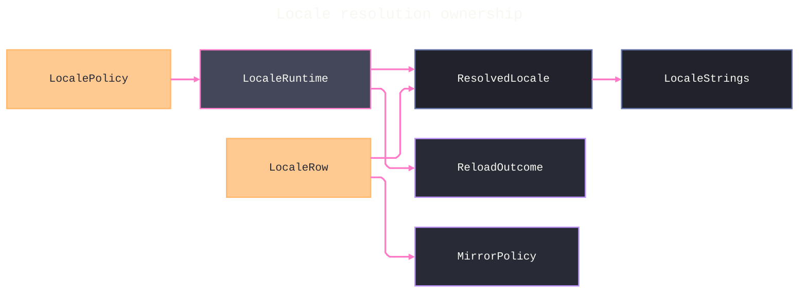

# [APPUI_LOCALIZATION_CULTURE]

One locale law serves every AppUi surface: `LocaleRow` is the culture axis — tag, string-table source, typed flow direction, script-shaping policy, and format policy — while plural cardinality belongs to each message pattern rather than to the locale. `ResolvedLocale` binds `CultureInfo`, NodaTime display patterns, `CompositeFormat`, and one ICU `MessageFormatter`; `LocaleRuntime` propagates a complete candidate before publishing it, so failed propagation cannot expose mixed culture. `MirrorPolicy`, `ShapedAnnotation`, and `LiveCaption` share the typed asset, shaping, motion, and scheduler vocabularies rather than recreating string keys, bidi booleans, or cadence literals.

## [01]-[INDEX]

- [01]-[LOCALE_AXIS]: Culture rows: tag, source, typed flow, shaping, and format columns; message-level plural routes.
- [02]-[STRING_TABLES]: Inbox resx vocabulary, nameof-derived keys, `PropertyGrid` bridge.
- [03]-[CULTURE_COMPOSITION]: Resolve fold, atomic switch, pattern and format binding.
- [04]-[RTL_MIRRORING]: Flow application at surface root, icon mirroring exemption.

## [02]-[LOCALE_AXIS]

- Owner: `ComparerAccessors.StringOrdinalIgnoreCase` accessor; `PluralRoute` `[SmartEnum<string>]` ICU-route policy rows; `LocaleRow` `[SmartEnum<string>]` culture axis.
- Cases: en, qps-ploc, qps-plocm — `En` is the shipped default; `PseudoLtr` proves expansion and `PseudoRtl` independently proves mirrored layout.
- Entry: `public partial string Source(string key, CultureInfo strings)` — the per-row string-table source column.
- Auto: generated `Items` and key lookup under the single comparer; `Source` rides `[UseDelegateFromConstructor]`. The `PluralResx` column is the per-row ICU-pattern source — it folds the `.one`/`.other`/`.few`/`.many`/`.zero`/`.two` satellite keys into one `{count, plural, …}` ICU pattern string the `MessageFormatter` resolves, so the plural grammar of a locale is CLDR data the engine reads, never a row-coded suffix branch.
- Packages: Jeffijoe.MessageFormat, Thinktecture.Runtime.Extensions, BCL inbox
- Growth: a new shipped language is one `LocaleRow` row plus one satellite resx set; a locale whose CLDR plural rule the engine does not ship is one `Pluralizer` delegate registered onto `MessageFormatter.CardinalPluralizers`/`OrdinalPluralizers`, never a `Plural` dispatch arm; zero new surface.
- Boundary: `Flow` and `Shaping` are authoritative row columns — flow is never inferred from a culture tag, and `qps-ploc` remains left-to-right while `qps-plocm` proves mirroring independently; per-surface culture variance enters through `LocalePolicy`, never a second axis; script coverage remains ranked `FontChain` data while the locale carries the HarfBuzz segment policy that selects those faces; plural and select grammar lives in the full ICU pattern stored at the resx base key, and `PluralRoute` remains the closed validation vocabulary for cardinal and ordinal pattern inventories rather than a locale column.

```csharp signature

[SmartEnum<string>]
[KeyMemberEqualityComparer<ComparerAccessors.StringOrdinal, string>]
[KeyMemberComparer<ComparerAccessors.StringOrdinal, string>]
public sealed partial class PluralRoute {
    public static readonly PluralRoute Cardinal = new("cardinal", keyword: "plural");
    public static readonly PluralRoute Ordinal = new("ordinal", keyword: "selectordinal");

    public string Keyword { get; }
}

[SmartEnum<string>]
[KeyMemberEqualityComparer<ComparerAccessors.StringOrdinalIgnoreCase, string>]
[KeyMemberComparer<ComparerAccessors.StringOrdinalIgnoreCase, string>]
public sealed partial class LocaleRow {
    public static readonly LocaleRow En = new("en", FlowDirection.LeftToRight, "en-US", new RunSpec(Direction.LeftToRight, Script.Latin, Language.Default, ClusterLevel.MonotoneGraphemes), source: LocaleStrings.Find, pluralResx: LocaleStrings.Pattern);
    public static readonly LocaleRow PseudoLtr = new("qps-ploc", FlowDirection.LeftToRight, "en-US", new RunSpec(Direction.LeftToRight, Script.Latin, Language.Default, ClusterLevel.MonotoneGraphemes), source: LocaleStrings.Expand, pluralResx: LocaleStrings.Pattern);
    public static readonly LocaleRow PseudoRtl = new("qps-plocm", FlowDirection.RightToLeft, "en-US", new RunSpec(Direction.RightToLeft, Script.Latin, Language.Default, ClusterLevel.MonotoneGraphemes), source: LocaleStrings.Expand, pluralResx: LocaleStrings.Pattern);

    public FlowDirection Flow { get; }

    public string FormatTag { get; }

    public RunSpec Shaping { get; }

    [UseDelegateFromConstructor]
    public partial string Source(string key, CultureInfo strings);

    [UseDelegateFromConstructor]
    public partial MessagePattern PluralResx(string key, PluralRoute route, CultureInfo strings);
}
```

## [03]-[STRING_TABLES]

- Owner: `LocaleStrings` static string-table surface; `PluralCategory` `[SmartEnum<string>]` the CLDR category axis.
- Entry: `public static string Find(string key, CultureInfo strings)` performs satellite lookup with a visible missing-key marker; `public static MessagePattern Pattern(string key, PluralRoute route, CultureInfo strings)` returns the full ICU pattern at the base key together with its typed route and any category seed rows used by authoring validation.
- Packages: Jeffijoe.MessageFormat, bodong.Avalonia.PropertyGrid, BCL inbox
- Growth: a new translatable surface is one resx key row per shipped locale row; a plural surface is the same base key plus its present CLDR-category satellites (`.one`/`.other`/`.few`/`.many`/`.zero`/`.two`); zero new surface.
- Boundary: inbox `ResourceManager` owns satellite, parent, and neutral fallback. The composition root supplies the public `ILocalizationService` implementation to `Propagate`; the unverified `LocalizationService.Default` accessor is absent. A base resx value contains the complete ICU message, so exact `=n` branches, offsets, nested `select`, escaping, cardinal plural, and ordinal plural remain engine-owned. `PluralCategory` satellites survive as seed data on `MessagePattern` for authoring and proof, never as a runtime reconstruction of the grammar.

```csharp signature
[SmartEnum<string>]
[KeyMemberEqualityComparer<ComparerAccessors.StringOrdinalIgnoreCase, string>]
[KeyMemberComparer<ComparerAccessors.StringOrdinalIgnoreCase, string>]
public sealed partial class PluralCategory {
    public static readonly PluralCategory Zero = new("zero");
    public static readonly PluralCategory One = new("one");
    public static readonly PluralCategory Two = new("two");
    public static readonly PluralCategory Few = new("few");
    public static readonly PluralCategory Many = new("many");
    public static readonly PluralCategory Other = new("other");
}

public readonly record struct MessagePattern(string Source, PluralRoute Route, Seq<(PluralCategory Category, string Seed)> Seeds);

public static class LocaleStrings {
    public const string BaseName = "Rasm.AppUi.Strings";

    public static readonly ResourceManager Table = new(BaseName, typeof(LocaleStrings).Assembly);

    public static string Key(string owner, string member) => $"{owner}.{member}";

    public static string Find(string key, CultureInfo strings) => Table.GetString(key, strings) ?? key;

    public static string Expand(string key, CultureInfo strings) => $"[!! {Find(key, strings)} !!]";

    public static MessagePattern Pattern(string key, PluralRoute route, CultureInfo strings) =>
        new(
            Source: Find(key, strings),
            Route: route,
            Seeds: toSeq(PluralCategory.Items)
                .Choose(category => Optional(Table.GetString($"{key}.{category.Key}", strings)).Map(seed => (category, seed))));
}
```

## [04]-[CULTURE_COMPOSITION]

- Owner: `LocalePolicy` user-settings options record; `ResolvedLocale` resolve product; `LocaleRuntime` apply-then-publish locale cell carrying the composition-bound `Propagate` rail.
- Entry: `public Fin<Unit> Apply(LocalePolicy policy)` — `Fin` aborts on unresolved tag, zone, culture, pattern, or propagation failure; the complete candidate propagates before the atom publishes it.
- Auto: `Republish` is the whole options-monitor bridge — `OptionsAdmission.Observe` wires it under the transition reload class, so a culture switch is an options reload, not a second driver; the resolved record binds one cached `MessageFormatter(useCache: true, culture: Formats, customValueFormatter: …)` per culture so each ICU pattern compiles once and reuses across calls, `LocaleValueFormatter` riding the ctor as the one typed-value coercion hook, and a locale swap mints a fresh formatter rather than mutating the live one.
- Receipt: `ReloadReceipt` per culture switch from the options monitor stream — section, transition class, `ReloadOutcome`, `Instant`, correlation.
- Packages: Jeffijoe.MessageFormat, NodaTime, LanguageExt.Core, BCL inbox
- Growth: a new display grammar is one pattern value on `ResolvedLocale`, a new format edge is one expression-bodied projection on the same record, and a locale whose CLDR rule the engine lacks is one `Pluralizer` registered on the formatter's `CardinalPluralizers`/`OrdinalPluralizers`; zero new surface.
- Boundary: ambient process culture remains absent. `ResolvedLocale.Resolve`, `Plural`, and `Message` trap culture and formatter exceptions onto `Fin`; `LocaleValueFormatter` implements date, time, and number hooks over NodaTime and the resolved format culture. `Propagate` reaches Semi resources and the injected PropertyGrid localization service before `Cell.Swap`, so a failure leaves the published generation unchanged. Full ICU patterns own plural, ordinal, gender, nested selection, exact branches, and offsets; call-site grammar branching is rejected.

```csharp signature
public sealed record LocalePolicy(string Tag, string Zone, Option<string> FormatTag) {
    public const string Section = nameof(LocalePolicy);

    public static readonly LocalePolicy Default = new(Tag: "en", Zone: "Etc/UTC", FormatTag: None);
}

public sealed record ResolvedLocale(
    LocaleRow Row,
    CultureInfo Strings,
    CultureInfo Formats,
    DateTimeZone Zone,
    ZonedDateTimePattern Timestamp,
    LocalDatePattern Date,
    LocalTimePattern Time,
    DurationPattern Elapsed,
    IMessageFormatter Formatter) {
    public const string TimestampText = "G";
    public const string DateText = "D";
    public const string ElapsedText = "H:mm:ss";

    public static Fin<ResolvedLocale> Resolve(LocaleRow row, DateTimeZone zone, Option<string> formatTag = default) =>
        Try.lift(() => Compose(row, zone, CultureInfo.GetCultureInfo(formatTag.IfNone(row.FormatTag)))).Run()
            .MapFail(error => new LocaleFault.FormatRejected(error.Message));

    public string Label(string key) => Row.Source(key, Strings);

    public Fin<string> Plural(string key, long count, PluralRoute route) =>
        Format(Row.PluralResx(key, route, Strings).Source, ("count", count));

    public Fin<string> Message(string key, params (string Name, object? Value)[] args) =>
        Format(Row.Source(key, Strings), args);

    public string Stamp(Instant value) => Timestamp.Format(value.InZone(Zone));

    public string Day(LocalDate value) => Date.Format(value);

    public string Clock(LocalTime value) => Time.Format(value);

    public string Span(Duration value) => Elapsed.Format(value);

    public string Text(CompositeFormat format, params object?[] args) => string.Format(Formats, format, args);

    public string Quantity(IFormattable value) => value.ToString(null, Formats);

    private Fin<string> Format(string pattern, params (string Name, object? Value)[] args) =>
        Try.lift(() => Formatter.FormatMessage(
            pattern,
            args.Fold(new Dictionary<string, object?>(StringComparer.Ordinal), static (map, arg) => { map[arg.Name] = arg.Value; return map; }),
            Formats)).Run().MapFail(error => new LocaleFault.FormatRejected(error.Message));

    private static ResolvedLocale Compose(LocaleRow row, DateTimeZone zone, CultureInfo formats) =>
        (ZonedDateTimePattern.CreateWithInvariantCulture(TimestampText, DateTimeZoneProviders.Tzdb).WithCulture(formats),
         LocalDatePattern.CreateWithInvariantCulture(DateText).WithCulture(formats)) switch {
            var (timestamp, date) => new(
                Row: row,
                Strings: CultureInfo.GetCultureInfo(row.Key),
                Formats: formats,
                Zone: zone,
                Timestamp: timestamp,
                Date: date,
                Time: LocalTimePattern.ExtendedIso.WithCulture(formats),
                Elapsed: DurationPattern.CreateWithInvariantCulture(ElapsedText).WithCulture(formats),
                Formatter: new MessageFormatter(useCache: true, culture: formats, customValueFormatter: new LocaleValueFormatter(timestamp, date, LocalTimePattern.ExtendedIso.WithCulture(formats), zone))),
        };
}

// The one typed-value coercion hook: NodaTime arguments format through the resolved display patterns and
// IFormattable quantities through Formats, so ICU pattern arguments never open a second format path.
public sealed class LocaleValueFormatter(ZonedDateTimePattern timestamp, LocalDatePattern date, LocalTimePattern time, DateTimeZone zone) : CustomValueFormatter {
    public override bool TryFormatDate(CultureInfo culture, object? value, string? style, out string? formatted) =>
        (formatted = value switch {
            Instant instant => timestamp.Format(instant.InZone(zone)),
            LocalDate day => date.Format(day),
            _ => null,
        }) is not null;

    public override bool TryFormatTime(CultureInfo culture, object? value, string? style, out string? formatted) =>
        (formatted = value switch {
            LocalTime clock => time.Format(clock),
            Instant instant => time.Format(instant.InZone(zone).TimeOfDay),
            _ => null,
        }) is not null;

    public override bool TryFormatNumber(CultureInfo culture, object? value, string? style, out string? formatted) =>
        (formatted = value is IFormattable quantity ? quantity.ToString(style, culture) : null) is not null;
}

[Union(ConversionFromValue = ConversionOperatorsGeneration.None)]
public abstract partial record LocaleFault : Expected {
    private LocaleFault(string detail, int code) : base(detail, code) { }
    public sealed record TagUnresolved(string Tag)
        : LocaleFault($"locale/tag: {Tag}", AppUiFaultBand.Locale.Code(0));
    public sealed record ZoneUnresolved(string Zone)
        : LocaleFault($"locale/zone: {Zone}", AppUiFaultBand.Locale.Code(1));
    public sealed record CaptionModelAbsent(string Model)
        : LocaleFault($"locale/caption-model: {Model}", AppUiFaultBand.Locale.Code(2));
    public sealed record FormatRejected(string Detail)
        : LocaleFault($"locale/format: {Detail}", AppUiFaultBand.Locale.Code(3));
    public sealed record PropagationRejected(string Detail)
        : LocaleFault($"locale/propagate: {Detail}", AppUiFaultBand.Locale.Code(4));
}

public sealed record LocaleRuntime(Atom<ResolvedLocale> Cell, IDateTimeZoneProvider Zones, Func<ResolvedLocale, Fin<Unit>> Propagate) {
    public static Fin<LocaleRuntime> Boot(LocalePolicy policy, IDateTimeZoneProvider zones, Func<ResolvedLocale, Fin<Unit>> propagate) =>
        from resolved in Compose(policy, zones)
        from _ in propagate(resolved)
        select new LocaleRuntime(Atom(resolved), zones, propagate);

    public ResolvedLocale Current => Cell.Value;

    public Fin<Unit> Apply(LocalePolicy policy) =>
        from resolved in Compose(policy, Zones)
        from _ in Propagate(resolved)
        select ignore(Cell.Swap(_ => resolved));

    public ReloadOutcome Republish(LocalePolicy policy) =>
        Apply(policy) is { IsFail: true, Case: Error error }
            ? new ReloadOutcome.Rejected(LocalePolicy.Section, ConfigError.Create(error.Message))
            : new ReloadOutcome.Applied(LocalePolicy.Section);

    private static Fin<ResolvedLocale> Compose(LocalePolicy policy, IDateTimeZoneProvider zones) =>
        (RowFor(policy.Tag), Optional(zones.GetZoneOrNull(policy.Zone))) switch {
            ({ IsSome: true, Case: LocaleRow row }, { IsSome: true, Case: DateTimeZone zone }) =>
                ResolvedLocale.Resolve(row, zone, policy.FormatTag),
            ({ IsSome: false }, _) => Fin<ResolvedLocale>.Fail(new LocaleFault.TagUnresolved(policy.Tag)),
            _ => Fin<ResolvedLocale>.Fail(new LocaleFault.ZoneUnresolved(policy.Zone)),
        };

    private static Option<LocaleRow> RowFor(string tag) =>
        LocaleRow.TryGet(tag, out LocaleRow row) ? Optional(row) : None;
}
```



## [05]-[RTL_MIRRORING]

- Owner: `MirrorPolicy` directional-row policy record; `ShapedAnnotation` the complex-script 3D-annotation shaping projection; `CaptionSource` · `LiveCaption` the live-caption-and-translation owner.
- Entry: `public bool Mirrors(AssetKey iconKey, LocaleRow row)` uses the asset vocabulary; `ShapedAnnotation` carries the locale's complete `RunSpec`; `public IObservable<CaptionSegment> Stream()` returns VAD-gated, timestamped, language- and confidence-bearing caption evidence.
- Packages: Avalonia, System.Reactive, Whisper.net, Thinktecture.Runtime.Extensions, LanguageExt.Core
- Growth: a direction-sensitive glyph is one key row on `Directional`; a new caption source is one `CaptionSource` case; zero new surface.
- Boundary: the surface root inherits the row's typed `FlowDirection`, and only `AssetKey` values in `MirrorPolicy.Directional` rejoin that flow. `ShapedAnnotation` passes the row's `RunSpec` and feature values to typography. `CaptionEngine.Load` traps model admission, `DetectSpeechNoResetAsync` preserves cross-window VAD state, silence never enters transcription, and one processor lives for one observable subscription. `CaptionSegment` retains start, end, detected language, probability, no-speech probability, and token count; the translated source derives its target as `LocaleRow.En`; and dwell cadence composes `MotionToken.Gate(MotionPacing.Pulse, ..., IScheduler)` instead of a seconds literal.

```csharp signature
public sealed record MirrorPolicy(Seq<AssetKey> Directional) {
    public static readonly MirrorPolicy Default = new(Seq(AssetKeys.NavBack, AssetKeys.NavForward));

    public bool Mirrors(AssetKey iconKey, LocaleRow row) =>
        row.Flow == FlowDirection.RightToLeft && Directional.Contains(iconKey);
}

public readonly record struct ShapedAnnotation(string Text, RunSpec Spec, Seq<string> Features) {
    public static ShapedAnnotation For(string key, ResolvedLocale locale) => Of(locale.Label(key), locale.Row);

    public static ShapedAnnotation Of(string text, LocaleRow row) =>
        new(text, row.Shaping, row.Flow == FlowDirection.RightToLeft ? Seq("calt", "liga", "rlig") : Seq("calt", "liga"));
}

// LiveCaption realizes on Whisper.net — one owner for streaming transcription, Silero VAD segmentation,
// and the built-in translate-to-English task. Translated binds the English target; broad-target MT is a
// growth row on a named consumer, never a second engine here.
[Union(ConversionFromValue = ConversionOperatorsGeneration.None)]
public abstract partial record CaptionSource {
    private CaptionSource() { }
    public sealed record Live(IObservable<ReadOnlyMemory<float>> Pcm16k, Option<string> Language, LocaleRow Target) : CaptionSource;
    public sealed record Translated(IObservable<ReadOnlyMemory<float>> Pcm16k) : CaptionSource; // WithTranslate: English target
}

public sealed record CaptionEngine(WhisperFactory Factory, WhisperVadProcessor Vad) : IDisposable {
    public static Fin<CaptionEngine> Load(string modelPath, string vadModelPath) =>
        File.Exists(modelPath) && File.Exists(vadModelPath)
            ? Try.lift(() => new CaptionEngine(
                    WhisperFactory.FromPath(modelPath),
                    WhisperVadFactory.FromPath(vadModelPath).CreateBuilder().Build()))
                .Run().MapFail(error => new LocaleFault.CaptionModelAbsent(error.Message))
            : Fin.Fail<CaptionEngine>(new LocaleFault.CaptionModelAbsent(File.Exists(modelPath) ? vadModelPath : modelPath));

    // Model weights arrive offline through WhisperGgmlDownloader.Default.GetGgmlModelAsync /
    // GetGgmlSileroVadModelAsync at provisioning, never at caption time.
    public WhisperProcessor Processor(CaptionSource source) =>
        source.Switch(
            state: Factory,
            live: static (factory, l) => l.Language.Match(
                Some: language => factory.CreateBuilder().WithLanguage(language).Build(),
                None: () => factory.CreateBuilder().WithLanguageDetection().Build()),
            translated: static (factory, _) => factory.CreateBuilder().WithLanguageDetection().WithTranslate().Build());

    public void Dispose() { Vad.Dispose(); Factory.Dispose(); }
}

public readonly record struct CaptionSegment(
    ShapedAnnotation Annotation,
    TimeSpan Start,
    TimeSpan End,
    string Language,
    float Probability,
    float NoSpeechProbability,
    int TokenCount);

public sealed record LiveCaption(CaptionEngine Engine, CaptionSource Source, MotionToken Dwell, IScheduler Scheduler) {
    // ONE WhisperProcessor per caption session — Observable.Using ties its lifetime to the subscription so
    // Recognition context persists across windows and disposes with the subscription; Concat serializes
    // DetectSpeechNoResetAsync and ProcessAsync so the processor and stateful VAD never overlap windows.
    public IObservable<CaptionSegment> Stream() =>
        Observable.Using(
            () => Engine.Processor(Source),
            processor => Dwell.Gate(new MotionPacing.Pulse(), Pcm(Source)
                .Select(window => Observable.FromAsync(async ct => {
                    IReadOnlyList<VadSegmentData> speech = await Engine.Vad.DetectSpeechNoResetAsync(window, ct).ConfigureAwait(false);
                    if (speech.Count == 0) { return Seq<CaptionSegment>(); }
                    Seq<CaptionSegment> segments = [];
                    await foreach (SegmentData segment in processor.ProcessAsync(window, ct)) {
                        segments = segments.Add(new CaptionSegment(
                            ShapedAnnotation.Of(segment.Text, Target(Source)),
                            segment.Start,
                            segment.End,
                            segment.Language,
                            segment.Probability,
                            segment.NoSpeechProbability,
                            segment.Tokens.Length));
                    }
                    return segments;
                }))
                .Concat()
                .SelectMany(static segments => segments)
                .Where(static segment => !string.IsNullOrWhiteSpace(segment.Annotation.Text)), Scheduler));

    static IObservable<ReadOnlyMemory<float>> Pcm(CaptionSource source) =>
        source.Switch(live: static l => l.Pcm16k, translated: static t => t.Pcm16k);

    static LocaleRow Target(CaptionSource source) =>
        source.Switch(live: static value => value.Target, translated: static _ => LocaleRow.En);
}
```

## [06]-[RESEARCH]

- [PSEUDO_LOCALE]: qps-ploc satellite resx resolution through the ResourceManager fallback fold on ICU-backed globalization.
- [BROAD_TARGET_MT]: machine translation past the Whisper.net translate-to-English arm is a growth row — it re-opens only when a consumer names a non-English caption target; the recognizer, VAD, model-download, segment, streaming, and translate members are VERIFIED against `.api/api-whisper-net.md` and the caption owner is settled.
