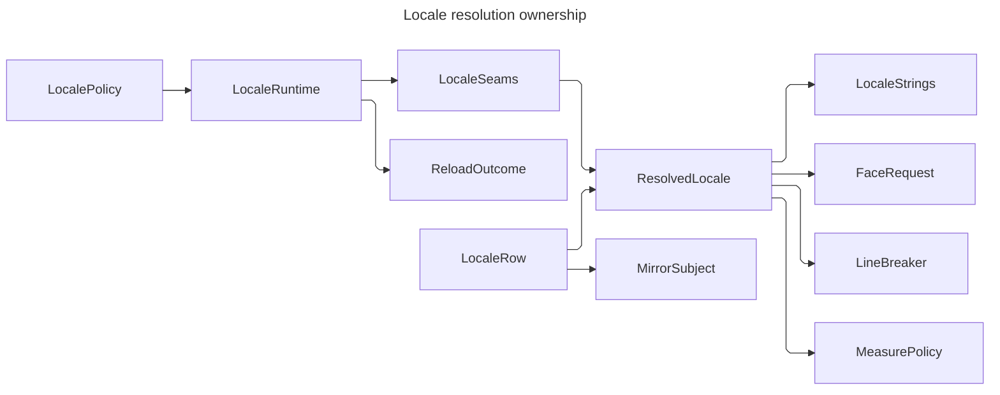

# [APPUI_LOCALIZATION_CULTURE]

One locale law serves every AppUi surface. `LocaleRow` is the culture axis — tag, flow, per-script shaping and language-tag election, calendar, collation, break oracle, proofing posture — while plural cardinality belongs to each message pattern. `ResolvedLocale` binds culture, calendar-bound patterns, collator, ICU formatter, and measurement policy, and `LocaleRuntime` propagates a complete candidate before publishing, so failed propagation cannot expose mixed culture. This page owns that axis, the message registry, composition, speech policy, mirroring, and measurement.

`typography#SHAPING_RAIL` owns `RunSpec`, `FaceRequest`, `BreakClass`, and `LineBreaker`, reading the BCP-47 tail and the break oracle from here; `typography#FONT_ADMISSION` owns the ranked `FontChain`, so a locale-local family roster is unrepresentable; `assets#ICON_AXIS` owns `IconRow.Mirror` as the kernel `Option<MirrorAxis>`, deriving its mechanism from the resolved source, so this page contributes `LocaleRow.Flow` alone; `tokens#THEME_APPLICATION` constructs the three Semi theme styles with the culture this page's policy row names; `LocaleFault` carries each failure through a direct generated union case.

## [01]-[INDEX]

- [02]-[LOCALE_AXIS]: Culture rows — tag, flow, shaping, per-script tags, calendar, collation, break oracle, proofing posture.
- [03]-[MESSAGE_REGISTRY]: Resx vocabulary, nameof keys, the context-and-length variant walk, ICU patterns, coverage conformance.
- [04]-[CULTURE_COMPOSITION]: Resolve fold, the propagation seam roster, verdict-carrying switch, pattern and format binding, the settings correspondence.
- [05]-[SPEECH_POLICY]: Announcement phrases the accessibility plane reads; caption language and translation policy.
- [06]-[MIRRORING_LAW]: Flipping and never-flipping subject sets, one flow projection, order reversal, anchor swap.
- [07]-[MEASUREMENT_FORMAT]: Display-unit election, architectural fractions, DMS angles, tabular participation, elapsed and relative grammar.

## [02]-[LOCALE_AXIS]

- Owner: `LocaleRow` `[SmartEnum<string>]` the culture axis; `ScriptTags` the per-script language-tag tail; `CollationPosture` the sort-option vocabulary; `PseudoPosture` the proofing posture whose `Proof` column IS the variant; `PluralRoute` the ICU-route policy; `LocaleBreaks` the shipped break oracles.
- Cases: `LocaleRow` = en | ar | ja | qps-ploc | qps-plocm; `CollationPosture` = linguistic | caseless | natural | natural-caseless | symbolic; `PseudoPosture` = off | accent | expand; `PluralRoute` = cardinal | ordinal.
- Law: every culture-dependent fact is a ROW COLUMN, never an inference from the tag — flow, calendar, collation, script tags, break oracle, and proofing posture are authored data, so `qps-ploc` stays left-to-right while `qps-plocm` proves mirrored layout independently, and a right-to-left tag whose surfaces must not mirror is representable. Per-script face election travels as the BCP-47 tail the platform matcher already consumes, because the ranked family chain is `typography#FONT_ADMISSION` property and a locale-local family roster forks the capability election into two authorities.
- Law: satellite fallback walks the `CultureInfo.Parent` chain alone down to invariant — never ICU or CLDR — so script and format localization ship ahead of translation, and the synthetic `qps` tags need no locale data.
- Law: break oracles classify the rune that BEGINS the next line, so they express line-start prohibition exactly and line-end prohibition not at all — a run ending on an opening bracket is the declared residual.
- Entry: `public Seq<string> Tags(Script script)` — the ordered language tail `FaceRequest.Of` takes, most specific first; `public partial BreakClass Break(Rune rune)` — the per-row line-break oracle `LineBreaker.Wrap` takes; `public partial string Proof(string source)` on `PseudoPosture` — the per-row proofing fold `LocaleStrings.Resolve` applies.
- Auto: generated `Items` and key lookup under one comparer; the break and proof columns ride `[UseDelegateFromConstructor]`. Pseudo expansion derives from the source string's own length through `ExpansionBand`, so proofing scales the way real translation does — short strings grow hardest — instead of one flat multiplier that under-proofs exactly the labels that overflow.
- Packages: NodaTime, HarfBuzzSharp, Avalonia, Thinktecture.Runtime.Extensions, LanguageExt.Core, BCL inbox
- Growth: a shipped language is one `LocaleRow` row with one satellite resx set; a script needing its own face election is one `ScriptTags` entry on an existing row; a locale whose CLDR plural rule the engine does not ship is one `Pluralizer` registered onto `MessageFormatter.CardinalPluralizers`/`OrdinalPluralizers` at the `[04]` formatter mint, never a dispatch arm; a script needing its own wrap rule is one `LocaleBreaks` oracle bound to the row's `Break` column; a per-row string-table override is one delegate column re-added the day a second source exists — today every row reads `LocaleStrings`, so the column would carry one value and is deleted.
- Boundary: a row whose satellite resx is absent resolves the neutral strings through the inbox `ResourceManager` fallback while its flow, calendar, collation, script tags, and break oracle still apply. The failure modes sit OUTSIDE resolution: invariant globalization makes the culture constructor throw onto the `FormatRejected` rail, a build whose culture assignment drops a `qps` tag emits no satellite for the walk to reach, and a case-sensitive file system needs the directory in the tag's normalized casing. Plural and select grammar lives in the full ICU pattern stored at the resx base key, and `PluralRoute` remains the closed validation vocabulary for cardinal and ordinal pattern inventories rather than a locale column.

```csharp signature
// --- [TYPES] ----------------------------------------------------------------------------

[SmartEnum<string>]
[KeyMemberEqualityComparer<ComparerAccessors.StringOrdinal, string>]
[KeyMemberComparer<ComparerAccessors.StringOrdinal, string>]
public sealed partial class PluralRoute {
    public static readonly PluralRoute Cardinal = new("cardinal", keyword: "plural");
    public static readonly PluralRoute Ordinal = new("ordinal", keyword: "selectordinal");

    public string Keyword { get; }
}

// Sort posture a surface asks for. `NumericOrdering` makes `A2` precede `A10`, which is the only ordering a
// sheet, level, or grid-line roster reads correctly; the platform refuses it for prefix and index queries, so
// natural rows stay sort-and-group postures and a text index resolves `Linguistic`.
[SmartEnum<string>]
[KeyMemberEqualityComparer<ComparerAccessors.StringOrdinal, string>]
[KeyMemberComparer<ComparerAccessors.StringOrdinal, string>]
public sealed partial class CollationPosture {
    public static readonly CollationPosture Linguistic = new("linguistic", CompareOptions.None, indexable: true);
    public static readonly CollationPosture Caseless = new("caseless", CompareOptions.IgnoreCase, indexable: true);
    public static readonly CollationPosture Natural = new("natural", CompareOptions.NumericOrdering, indexable: false);
    public static readonly CollationPosture NaturalCaseless = new("natural-caseless",
        CompareOptions.NumericOrdering | CompareOptions.IgnoreCase, indexable: false);
    public static readonly CollationPosture Symbolic = new("symbolic", CompareOptions.StringSort, indexable: true);

    public CompareOptions Options { get; }

    public bool Indexable { get; }

    public StringComparer Comparer(CultureInfo culture) => StringComparer.Create(culture, Options);

    // Named `Weight`, never `Key`: the generated smart-enum key property already owns that name, so a sort-key
    // member spelled `Key` collides at generation rather than at the call site.
    public SortKey Weight(CultureInfo culture, string value) => culture.CompareInfo.GetSortKey(value, Options);
}

// Proofing postures: `Accent` proves face coverage without moving geometry, `Expand` proves layout by padding
// to the band ratio, and brackets make truncation visible at both ends — a clipped tail with no closing bracket
// IS the overflow report. `Scored` is the coverage column: proofing rows carry no satellite by construction,
// so scoring them would report the whole registry missing.
[SmartEnum<string>]
[KeyMemberEqualityComparer<ComparerAccessors.StringOrdinal, string>]
[KeyMemberComparer<ComparerAccessors.StringOrdinal, string>]
public sealed partial class PseudoPosture {
    public static readonly PseudoPosture Off = new("off", scored: true, proof: static source => source);
    public static readonly PseudoPosture Accent = new("accent", scored: false, proof: Accented);
    public static readonly PseudoPosture Expand = new("expand", scored: false,
        proof: static source => $"[{Accented(source)}{Padding(source.Length)}]");

    public bool Scored { get; }

    [UseDelegateFromConstructor]
    public partial string Proof(string source);

    // Latin-1 and Latin Extended-A substitutes only: the accent must render in every shipped face, so a proofing
    // pass reports layout overflow rather than a missing-glyph refusal it manufactured itself.
    // EXPRESSION_SPINE exemption: `string.Create`'s SpanAction admits no fold.
    static string Accented(string source) =>
        string.Create(source.Length, source, static (span, text) => {
            for (int index = 0; index < text.Length; index++) {
                span[index] = ExpansionBand.Accents.TryGetValue(text[index], out char marked) ? marked : text[index];
            }
        });

    static string Padding(int length) => new('·', ExpansionBand.Extra(length));
}

// --- [CONSTANTS] ------------------------------------------------------------------------

// Expansion is LENGTH-BANDED because translation growth is: a three-character label doubles while a paragraph
// grows by a tenth. `Tail` is the open remainder AS A VALUE, so the fold is total with no sentinel row.
public static class ExpansionBand {
    public const double Tail = 1.30d;

    public static readonly Seq<(int Ceiling, double Ratio)> Steps =
        Seq((10, 3.00d), (20, 2.00d), (30, 1.80d), (50, 1.60d), (70, 1.40d));

    public static readonly FrozenDictionary<char, char> Accents = new Dictionary<char, char> {
        ['a'] = 'ä', ['e'] = 'ë', ['i'] = 'ï', ['o'] = 'ö', ['u'] = 'ü', ['y'] = 'ÿ', ['c'] = 'ç', ['n'] = 'ñ',
        ['s'] = 'š', ['z'] = 'ž', ['A'] = 'Ä', ['E'] = 'Ë', ['I'] = 'Ï', ['O'] = 'Ö', ['U'] = 'Ü', ['Y'] = 'Ý',
        ['C'] = 'Ç', ['N'] = 'Ñ', ['S'] = 'Š', ['Z'] = 'Ž',
    }.ToFrozenDictionary();

    public static int Extra(int length) =>
        (int)double.Ceiling(length * (Steps.Find(band => length <= band.Ceiling).Map(static band => band.Ratio).IfNone(Tail) - 1d));
}

// --- [MODELS] ---------------------------------------------------------------------------

// Per-script face election. The tail enters `SKFontManager.MatchCharacter` beside the capability, so the host
// resolves the face the SCRIPT wants — Simplified over Traditional Han, Naskh over Kufic Arabic — while the
// ranked family chain stays the typography owner's single authority.
public readonly record struct ScriptTags(Script Script, Seq<string> Tags);
```

```csharp signature
// --- [SERVICES] -------------------------------------------------------------------------

// Shipped break oracles, each classifying the rune that BEGINS the next line: a kinsoku no-start rune answers
// `None` so the breaker never opens before it, and every other rune defers to the typography classifier.
public static class LocaleBreaks {
    // JIS X 4051 kinsoku line-start prohibitions — the UAX #14 CL/NS subset the ideographic oracle enforces.
    public static readonly FrozenSet<int> NoStart = new[] {
        0x3001, 0x3002, 0xFF0C, 0xFF0E, 0xFF1A, 0xFF1B, 0xFF1F, 0xFF01, 0x309D, 0x309E, 0x30FD, 0x30FE, 0x30FC,
        0x3005, 0x3009, 0x300B, 0x300D, 0x300F, 0x3011, 0x3015, 0xFF09, 0xFF3D, 0xFF5D, 0x3041, 0x3043, 0x3045,
        0x3047, 0x3049, 0x3063, 0x3083, 0x3085, 0x3087, 0x308E, 0x30A1, 0x30A3, 0x30A5, 0x30A7, 0x30A9, 0x30C3,
        0x30E3, 0x30E5, 0x30E7, 0x30EE,
    }.ToFrozenSet();

    public static BreakClass Default(Rune rune) => BreakClass.Of(rune);

    public static BreakClass Ideographic(Rune rune) =>
        NoStart.Contains(rune.Value) ? BreakClass.None : BreakClass.Of(rune);
}

[SmartEnum<string>]
[KeyMemberEqualityComparer<ComparerAccessors.StringOrdinalIgnoreCase, string>]
[KeyMemberComparer<ComparerAccessors.StringOrdinalIgnoreCase, string>]
public sealed partial class LocaleRow {
    public static readonly LocaleRow En = new("en",
        flow: FlowDirection.LeftToRight, formatTag: "en-US",
        shaping: new RunSpec(Direction.LeftToRight, Script.Latin, Language.Default, ClusterLevel.MonotoneGraphemes),
        scripts: Seq(new ScriptTags(Script.Latin, Seq("en"))),
        calendar: CalendarSystem.Iso, collation: CollationPosture.Linguistic, pseudo: PseudoPosture.Off,
        breaks: LocaleBreaks.Default);
    public static readonly LocaleRow Arabic = new("ar",
        flow: FlowDirection.RightToLeft, formatTag: "ar-SA",
        shaping: new RunSpec(Direction.RightToLeft, Script.Arabic, new Language("ar"), ClusterLevel.MonotoneGraphemes),
        scripts: Seq(new ScriptTags(Script.Arabic, Seq("ar")), new ScriptTags(Script.Latin, Seq("en"))),
        calendar: CalendarSystem.UmAlQura, collation: CollationPosture.Linguistic, pseudo: PseudoPosture.Off,
        breaks: LocaleBreaks.Default);
    public static readonly LocaleRow Japanese = new("ja",
        flow: FlowDirection.LeftToRight, formatTag: "ja-JP",
        shaping: new RunSpec(Direction.LeftToRight, Script.Han, new Language("ja"), ClusterLevel.MonotoneGraphemes),
        scripts: Seq(new ScriptTags(Script.Han, Seq("ja")), new ScriptTags(Script.Hiragana, Seq("ja")),
            new ScriptTags(Script.Katakana, Seq("ja")), new ScriptTags(Script.Latin, Seq("en"))),
        calendar: CalendarSystem.Iso, collation: CollationPosture.Linguistic, pseudo: PseudoPosture.Off,
        breaks: LocaleBreaks.Ideographic);
    public static readonly LocaleRow PseudoLtr = new("qps-ploc",
        flow: FlowDirection.LeftToRight, formatTag: "en-US",
        shaping: new RunSpec(Direction.LeftToRight, Script.Latin, Language.Default, ClusterLevel.MonotoneGraphemes),
        scripts: Seq(new ScriptTags(Script.Latin, Seq("en"))),
        calendar: CalendarSystem.Iso, collation: CollationPosture.Linguistic, pseudo: PseudoPosture.Expand,
        breaks: LocaleBreaks.Default);
    public static readonly LocaleRow PseudoRtl = new("qps-plocm",
        flow: FlowDirection.RightToLeft, formatTag: "en-US",
        shaping: new RunSpec(Direction.RightToLeft, Script.Latin, Language.Default, ClusterLevel.MonotoneGraphemes),
        scripts: Seq(new ScriptTags(Script.Latin, Seq("en"))),
        calendar: CalendarSystem.Iso, collation: CollationPosture.Linguistic, pseudo: PseudoPosture.Expand,
        breaks: LocaleBreaks.Default);

    public FlowDirection Flow { get; }

    public string FormatTag { get; }

    public RunSpec Shaping { get; }

    public Seq<ScriptTags> Scripts { get; }

    public CalendarSystem Calendar { get; }

    public CollationPosture Collation { get; }

    public PseudoPosture Pseudo { get; }

    // Tag order is LOAD-BEARING and ends at the row's own tag, so the host matcher tries the script's preferred
    // language first and still resolves under a face registered for the culture alone.
    public Seq<string> Tags(Script script) =>
        Scripts.Find(row => row.Script == script).Map(row => row.Tags).IfNone(Seq<string>()) + Seq(Key);

    [UseDelegateFromConstructor]
    public partial BreakClass Break(Rune rune);
}
```

## [03]-[MESSAGE_REGISTRY]

- Owner: `LocaleStrings` the one string-table surface every key resolution and every registry read crosses; `MessageLength` the width-variant axis; `MessageVariant` the context-and-length request; `MessagePattern` the ICU pattern carrier; `LocaleConformance` the conformance fold answering coverage receipts beside the mirroring-law census.
- Cases: `MessageLength` = full | medium | short | tiny.
- Law: one key resolves through one VARIANT WALK — context before length, most specific first, base last — so a toolbar chip asking for the tiny variant of a key that authored only the full form gets the full form rather than a missing-key marker, and an author adds a variant by adding a resx row instead of by adding a call site.
- Law: a missing key renders as the ONE bracketed marker `LocaleStrings` mints — a deliberate display posture, not a swallowed absence: the marker is visibly wrong on any surface, and `LocaleConformance` reports the same absence structurally, so the paint edge stays a bare `string` and no UI binding pays a refusal ceremony for text.
- Entry: `public static string Find(string key, CultureInfo strings)`; `public static string Resolve(string key, MessageVariant variant, LocaleRow row, CultureInfo strings)` — the variant walk under the row's proofing posture; `public static MessagePattern Pattern(string key, PluralRoute route, CultureInfo strings)` — the full ICU pattern at the base key with its typed route; `public static string Key(string owner, string member)` and the 3-ary variant form — the ONE key derivation every registry-resolved literal crosses; `public static Fin<Seq<CoverageReceipt>> LocaleConformance.Verify(IClock clock)` — the whole-registry conformance fold the proof lane binds as its locale check.
- Auto: `Key` derives every key from `nameof`-supplied owner and member, so a literal key string at a call site has no producer. Coverage enumerates the neutral resource set ONCE and diffs each row's own satellite set, so the expectation derives from what the product authors rather than from a roster that drifts the moment a key lands; `PseudoPosture.Scored` is the exemption column, so the fold carries no posture branch of its own.
- Receipt: `CoverageReceipt` — tag, expected key count, missing keys, `Instant` — is the conformance evidence `Verify` answers; the proof lane seals it.
- Packages: NodaTime, Thinktecture.Runtime.Extensions, LanguageExt.Core, BCL inbox
- Growth: a translatable surface is one resx key row per shipped locale row; a width-constrained surface is one `.short`/`.tiny` sibling row; a disambiguated surface is one `.<context>` sibling row; zero new surface.
- Boundary: `GetResourceSet(culture, createIfNotExists: true, tryParents: false)` returns the row's OWN satellite and answers null where none exists, so coverage distinguishes an untranslated locale from a locale missing individual keys — the fallback-bearing `GetString` cannot make that distinction and is therefore not the conformance read; the returned `ResourceSet` is the manager's own cached instance, so no reader disposes it. Base resx values carry the complete ICU message, so exact `=n` branches, offsets, nested `select`, escaping, cardinal plural, and ordinal plural remain engine-owned and a call-site grammar branch is the deleted form.

```csharp signature
// --- [TYPES] ----------------------------------------------------------------------------

// Width axis: `Full` carries the empty suffix so the base key IS the full variant and no surface pays a suffix
// for the common case, and `Rank` orders the walk so a request falls to the next WIDER form rather than to a
// narrower one that truncates meaning the caller asked to keep.
[SmartEnum<string>]
[KeyMemberEqualityComparer<ComparerAccessors.StringOrdinal, string>]
[KeyMemberComparer<ComparerAccessors.StringOrdinal, string>]
public sealed partial class MessageLength {
    public static readonly MessageLength Full = new("full", suffix: "", rank: 0);
    public static readonly MessageLength Medium = new("medium", suffix: "medium", rank: 1);
    public static readonly MessageLength Short = new("short", suffix: "short", rank: 2);
    public static readonly MessageLength Tiny = new("tiny", suffix: "tiny", rank: 3);

    public string Suffix { get; }

    public int Rank { get; }

    // Accessor-backed and lazy: the roster fills after static init, and the ladder is frozen, so each row's
    // widening walk computes once instead of re-sorting a frozen roster per resolution.
    public Seq<MessageLength> Widening => Ladders.Value[this];

    private static readonly Lazy<FrozenDictionary<MessageLength, Seq<MessageLength>>> Ladders = new(
        static () => Items.ToFrozenDictionary(
            static row => row,
            static row => toSeq(Items.Where(peer => peer.Rank <= row.Rank).OrderByDescending(static peer => peer.Rank))),
        LazyThreadSafetyMode.ExecutionAndPublication);
}

// --- [MODELS] ---------------------------------------------------------------------------

// One resolution request. Context disambiguates a homograph the source language collapses — the noun `Scale`
// beside the verb `Scale` — and length names the width the surface can actually paint.
public readonly record struct MessageVariant(Option<string> Context, MessageLength Length) {
    public static readonly MessageVariant Default = new(None, MessageLength.Full);

    public static MessageVariant Of(MessageLength length) => new(None, length);

    public static MessageVariant In(string context, MessageLength length) => new(Some(context), length);

    // Context outranks length: a wrong word at the right width is a mistranslation while the right word at the
    // wrong width is a layout defect the proofing posture already surfaces.
    public Seq<string> Keys(string key) =>
        Context.Match(
            Some: context => Length.Widening.Map(length => Suffixed($"{key}.{context}", length)) + Length.Widening.Map(length => Suffixed(key, length)),
            None: () => Length.Widening.Map(length => Suffixed(key, length)));

    static string Suffixed(string stem, MessageLength length) =>
        length.Suffix.Length is 0 ? stem : $"{stem}.{length.Suffix}";
}

public readonly record struct MessagePattern(string Source, PluralRoute Route) {
    // Route participates in admission: the stored ICU pattern must carry the requested route's keyword, so a
    // cardinal request cannot silently format an ordinal grammar and vice versa.
    public Fin<MessagePattern> Admitted(string key) =>
        Source.Contains(Route.Keyword, StringComparison.Ordinal)
            ? Fin.Succ(this)
            : Fin.Fail<MessagePattern>(new LocaleFault.FormatRejected($"{key}: pattern lacks the {Route.Key} '{Route.Keyword}' route"));
}

public sealed record CoverageReceipt(string Tag, int Expected, Seq<string> Missing, Instant At);
```

```csharp signature
// --- [OPERATIONS] -----------------------------------------------------------------------

public static class LocaleStrings {
    public const string BaseName = "Rasm.AppUi.Strings";

    public const string MissingMarker = "missing";

    public static readonly ResourceManager Table = new(BaseName, typeof(LocaleStrings).Assembly);

    public static string Key(string owner, string member) => $"{owner}.{member}";

    public static string Key(string owner, string member, string variant) => $"{owner}.{member}.{variant}";

    public static string Find(string key, CultureInfo strings) => Table.GetString(key, strings) ?? Marker(key);

    // Resolution asks the TABLE, not the row, because a variant present in the neutral set and absent from the
    // satellite still resolves — the fallback chain is the mechanism, so a partially translated locale degrades
    // key by key instead of dropping the whole variant family.
    public static string Resolve(string key, MessageVariant variant, LocaleRow row, CultureInfo strings) =>
        row.Pseudo.Proof(variant.Keys(key)
            .Choose(candidate => Optional(Table.GetString(candidate, strings)))
            .Head
            .IfNone(() => Marker(key)));

    public static MessagePattern Pattern(string key, PluralRoute route, CultureInfo strings) =>
        new(Source: Find(key, strings), Route: route);

    static string Marker(string key) => $"[{MissingMarker}:{key}]";
}

public static class LocaleConformance {
    // ONE conformance surface for the proof lane: the mirroring law census and the per-row coverage receipts
    // answer together, so a mechanism no subject names and an untranslated key fail the same check.
    public static Fin<Seq<CoverageReceipt>> Verify(IClock clock) {
        Seq<MirrorMechanism> orphaned = MirrorSubject.Orphaned();
        if (!orphaned.IsEmpty) {
            return Fin.Fail<Seq<CoverageReceipt>>(new LocaleFault.CoverageRejected(
                $"orphaned mirror mechanisms: {string.Join(", ", orphaned.Map(static row => row.Key))}"));
        }
        Instant at = clock.GetCurrentInstant();
        return toSeq(LocaleRow.Items).Traverse(row => Coverage(row, at)).As();
    }

    public static Fin<CoverageReceipt> Coverage(LocaleRow row, Instant at) =>
        from expected in Expected()
        from missing in row.Pseudo.Scored
            ? Shipped(row).Map(shipped => Missing(expected, shipped))
            : Fin.Succ(Seq<string>())
        select new CoverageReceipt(row.Key, expected.Count, missing, at);

    // Neutral set IS the expectation: every key the product authors lands there, so conformance needs no second
    // roster and a newly added key scores with no registry edit.
    static Fin<Seq<string>> Expected() => Names(CultureInfo.InvariantCulture, parents: true);

    // `tryParents: false` answers the row's OWN satellite and null where none exists, so an untranslated locale
    // reads as an empty set rather than as the neutral set the fallback would have handed back.
    static Fin<Seq<string>> Shipped(LocaleRow row) => Names(CultureInfo.GetCultureInfo(row.Key), parents: false);

    static Seq<string> Missing(Seq<string> expected, Seq<string> shipped) {
        HashSet<string> present = shipped.ToHashSet(StringComparer.Ordinal);
        return toSeq(expected.Filter(key => !present.Contains(key)).OrderBy(static key => key, StringComparer.Ordinal));
    }

    static Fin<Seq<string>> Names(CultureInfo culture, bool parents) =>
        Op.Of(name: "appui.locale.resources").Catch(() => Fin.Succ(Optional(LocaleStrings.Table.GetResourceSet(culture, createIfNotExists: true, tryParents: parents))
                .Map(static set => toSeq(set.Cast<DictionaryEntry>())
                    .Choose(static entry => entry.Key is string name ? Some(name) : None)
                    .Strict())
                .IfNone(Seq<string>())));
}
```

## [04]-[CULTURE_COMPOSITION]

- Owner: `LocalePolicy` the user-settings options section; `LocaleSeam` the propagation-destination roster with `LocaleSeams` the admitted arm table; `LocaleField` the settings correspondence roster carrying forward projection, admission, and inverse landing as columns of ONE family; `ResolvedLocale` the resolve product every formatter, shaper, and label resolver folds; `LocaleRuntime` the apply-then-publish locale cell; `LocaleValueFormatter` the one typed-value coercion hook; `LocaleFault` the direct generated `[Union]` with one `[FaultCase]` leaf per locale failure.
- Cases: `LocaleFault` = TagUnresolved | ZoneUnresolved | FormatRejected | PropagationRejected | MeasureRejected | CoverageRejected.
- Law: the candidate PROPAGATES BEFORE it publishes — every `LocaleSeam` row takes the new culture, and only then does the cell commit — so a partially applied culture is unrepresentable and a failed propagation leaves the committed predecessor live; the commit is a kernel `Cell.Commit` whose `Transition` verdict the apply fold READS, never an `ignore`d swap.
- Entry: `public Fin<Unit> Apply(LocalePolicy policy)` — `Fin` aborts on unresolved tag, zone, culture, pattern, propagation failure, or a declined commit; `public static Fin<LocaleRuntime> Boot(LocalePolicy policy, IDateTimeZoneProvider zones, LocaleSeams seams)`; `public ReloadOutcome Republish(LocalePolicy policy)` — the options-monitor bridge; `LocaleSeams.Of(…)` — the admission proving every roster row bound exactly once; `LocaleField.State`/`LocaleField.Decode` — the two halves of the settings correspondence off one roster, `Decode` a `Validation` applicative accumulating every column defect.
- Auto: `Republish` is the whole options-monitor bridge — `OptionsAdmission.Observe` wires it under the transition reload class, so a culture switch is an options reload and not a second driver. Resolution binds one cached `MessageFormatter(useCache: true, culture: Formats, customValueFormatter: …)` per culture so each ICU pattern compiles once, `LocaleValueFormatter` riding the constructor as the one typed-value coercion hook, and a locale swap mints a fresh formatter rather than mutating the live one. Date patterns carry the row's calendar and the timestamp projects its instant into that calendar at the zone, so a Hijri row renders its own era without a second pattern family.
- Receipt: `ReloadReceipt` per culture switch from the options monitor stream — section, transition class, `ReloadOutcome`, `Instant`, correlation.
- Packages: Rasm, Jeffijoe.MessageFormat, NodaTime, Thinktecture.Runtime.Extensions, LanguageExt.Core, BCL inbox
- Growth: a new display grammar is one pattern value on `ResolvedLocale`; a new format edge is one expression-bodied projection on the same record; a new propagation destination is one `LocaleSeam` row — an arm table missing it refuses at `Of`, so no boot path can forget it; a new settings column is one `LocaleField` row carrying its own projection, admission, and landing.
- Boundary: ambient process culture remains absent — `CultureInfo.CurrentCulture` has no reader on any AppUi surface, and every format edge takes the resolved culture explicitly; the zoned pattern is built against the INJECTED provider the runtime resolves its zone from, because a statically named provider would parse against a registry the runtime never resolved a zone from. The theme seam carries `Strings` rather than `Formats`: the theme locale selects the SHIPPED control-theme strings, not number and date rendering, so a product running English strings under German formats keeps English theme captions — and all three Semi theme styles resolve a Chinese locale for an unset value, so the seam is required at construction and re-applied on every swap. `Resolve`, `Plural`, and `Message` trap culture and formatter exceptions onto `Fin`, and `Quantity` routes through the measurement policy so a dimensioned value renders in its surface's elected unit at its declared precision — a bare scalar reaching a measured label has no spelling. Every registry-resolved settings literal derives through `LocaleStrings.Key`, so a call-site interpolation of a message key has no producer.

```csharp signature
// --- [ERRORS] ---------------------------------------------------------------------------


[Union(ConversionFromValue = ConversionOperatorsGeneration.None)]
public abstract partial record LocaleFault : Fault {
    private static readonly FaultBand FamilyBand = FaultBand.Locale;
    private LocaleFault(string detail) { Detail = detail; }

    public string Detail { get; }

    public override string Message => Detail;

    [FaultCase(0)]
    public sealed partial record TagUnresolved(string Tag) : LocaleFault($"locale/tag: {Tag}");
    [FaultCase(1)]
    public sealed partial record ZoneUnresolved(string Zone) : LocaleFault($"locale/zone: {Zone}");
    [FaultCase(2)]
    public sealed partial record FormatRejected(string Reason) : LocaleFault($"locale/format: {Reason}");
    [FaultCase(3)]
    public sealed partial record PropagationRejected(string Reason) : LocaleFault($"locale/propagate: {Reason}");
    [FaultCase(4)]
    public sealed partial record MeasureRejected(string Reason) : LocaleFault($"locale/measure: {Reason}");
    [FaultCase(5)]
    public sealed partial record CoverageRejected(string Reason) : LocaleFault($"locale/coverage: {Reason}");
}
```

```csharp signature
// --- [TYPES] ----------------------------------------------------------------------------

// Propagation destinations as ROWS: the arm table admits against this roster, so a new destination is one row
// here and an arm table missing it refuses at composition instead of silently skipping a boot path.
[SmartEnum<string>]
[KeyMemberEqualityComparer<ComparerAccessors.StringOrdinal, string>]
[KeyMemberComparer<ComparerAccessors.StringOrdinal, string>]
public sealed partial class LocaleSeam {
    public static readonly LocaleSeam Theme = new("theme", rank: 0);
    public static readonly LocaleSeam Resources = new("resources", rank: 1);
    public static readonly LocaleSeam Inspector = new("inspector", rank: 2);

    public int Rank { get; }
}

// --- [MODELS] ---------------------------------------------------------------------------

public sealed record LocalePolicy(string Tag, string Zone, Option<string> FormatTag, string Units, int Denominator) {
    public const string Section = nameof(LocalePolicy);

    public static readonly LocalePolicy Default = new(
        Tag: LocaleRow.En.Key, Zone: "Etc/UTC", FormatTag: None, Units: UnitPosture.Metric.Key, Denominator: 16);
}

// The admitted arm table over the seam roster. Every arm takes the WHOLE candidate and reads what it needs —
// the theme arm reads `.Strings` itself, so no arm narrows the seam to a projection a second destination
// cannot share.
public sealed record LocaleSeams(HashMap<LocaleSeam, Func<ResolvedLocale, Fin<Unit>>> Arms) {
    public static Fin<LocaleSeams> Of(params ReadOnlySpan<(LocaleSeam Seam, Func<ResolvedLocale, Fin<Unit>> Apply)> arms) {
        HashMap<LocaleSeam, Func<ResolvedLocale, Fin<Unit>>> table =
            toSeq(arms.ToArray()).ToHashMap(static arm => arm.Seam, static arm => arm.Apply);
        return table.Count == LocaleSeam.Items.Count
            ? Fin.Succ(new LocaleSeams(table))
            : Fin.Fail<LocaleSeams>(new LocaleFault.PropagationRejected(
                $"seam arms {table.Count} of {LocaleSeam.Items.Count}"));
    }

    public Fin<Unit> Propagate(ResolvedLocale resolved) =>
        toSeq(LocaleSeam.Items.OrderBy(static seam => seam.Rank))
            .TraverseM(seam => Arms.Find(seam)
                .ToFin(Fail: (Error)new LocaleFault.PropagationRejected($"seam {seam.Key} unbound"))
                .Bind(arm => arm(resolved)))
            .As()
            .Map(static _ => unit);
}

public sealed record ResolvedLocale(
    LocaleRow Row,
    CultureInfo Strings,
    CultureInfo Formats,
    DateTimeZone Zone,
    CalendarSystem Calendar,
    StringComparer Collator,
    MeasurePolicy Measures,
    ZonedDateTimePattern Timestamp,
    LocalDatePattern Date,
    LocalTimePattern Time,
    DurationPattern Elapsed,
    IMessageFormatter Formatter) {
    public const string TimestampText = "G";
    public const string DateText = "D";
    public const string ElapsedText = "H:mm:ss";

    public static Fin<ResolvedLocale> Resolve(LocaleRow row, DateTimeZone zone, IDateTimeZoneProvider zones, LocalePolicy policy) =>
        from posture in UnitPosture.TryGet(policy.Units, out UnitPosture elected)
            ? Fin.Succ(elected)
            : Fin.Fail<UnitPosture>(new LocaleFault.MeasureRejected($"unit system {policy.Units}"))
        from resolved in Op.Of(name: "appui.locale.compose").Catch(() => Fin.Succ(Compose(
                row, zone, zones, CultureInfo.GetCultureInfo(policy.FormatTag.IfNone(row.FormatTag)),
                new MeasurePolicy(posture, policy.Denominator))))
        select resolved;

    // --- [LABEL_EDGES]

    public string Label(string key) => LocaleStrings.Find(key, Strings);

    public string Label(string key, MessageVariant variant) => LocaleStrings.Resolve(key, variant, Row, Strings);

    public Fin<string> Message(string key, params (string Name, object? Value)[] args) =>
        Format(() => LocaleStrings.Find(key, Strings), args);

    public Fin<string> Plural(string key, long count, PluralRoute route) =>
        LocaleStrings.Pattern(key, route, Strings).Admitted(key)
            .Bind(pattern => Format(() => pattern.Source, ("count", count)));

    public string Text(CompositeFormat format, params object?[] args) => string.Format(Formats, format, args);

    // --- [TEMPORAL_EDGES]

    public string Stamp(Instant value) => Timestamp.Format(value.InZone(Zone, Calendar));

    public string Day(LocalDate value) => Date.Format(value.WithCalendar(Calendar));

    public string Clock(LocalTime value) => Time.Format(value);

    public string Span(Duration value) => Elapsed.Format(value);

    public Fin<string> Relative(Instant from, Instant to) => ElapsedGrammar.Relative(this, from, to);

    // --- [SHAPING_EDGES]

    // One seam the itemizer reads: the language tail steers `MatchCharacter` per script while the ranked family
    // chain stays typography's, so a locale never forks the capability election.
    public FaceRequest Face(TextStyleRow style, FontChain chain, PalettePosture palette, Script script) =>
        FaceRequest.Of(style, chain, palette, Row.Tags(script));

    // One seam the breaker reads: the row's oracle widens the declared class vocabulary per locale rather than a
    // second line-break implementation living beside the typography owner's.
    public Seq<TextLine> Wrap(ShapedText text, string source, double width, TrimPolicy trim) =>
        LineBreaker.Wrap(text, source, width, trim, Row.Break);

    public Fin<string> Quantity(IQuantity value, MeasureRole role) => Measures.Render(value, role, Formats);

    public StringComparer Sort(CollationPosture posture) => posture.Comparer(Formats);

    // --- [COMPOSITION_EDGES]

    private Fin<string> Format(Func<string> pattern, params (string Name, object? Value)[] args) =>
        Op.Of(name: "appui.locale.format").Catch(() => Fin.Succ(Formatter.FormatMessage(
                pattern(),
                args.ToFrozenDictionary(static arg => arg.Name, static arg => arg.Value, StringComparer.Ordinal),
                Formats)));

    // The pattern takes the INJECTED provider, never a static one: a zoned pattern resolves its zone ids through
    // whichever provider it was built against, so a static mint would disagree with `Zone` on exactly the ids
    // the two registries spell differently.
    private static ResolvedLocale Compose(
        LocaleRow row, DateTimeZone zone, IDateTimeZoneProvider zones, CultureInfo formats, MeasurePolicy measures) {
        ZonedDateTimePattern timestamp = ZonedDateTimePattern.CreateWithInvariantCulture(TimestampText, zones).WithCulture(formats);
        LocalDatePattern date = LocalDatePattern.CreateWithInvariantCulture(DateText).WithCulture(formats).WithCalendar(row.Calendar);
        LocalTimePattern time = LocalTimePattern.ExtendedIso.WithCulture(formats);
        return new(
            Row: row,
            Strings: CultureInfo.GetCultureInfo(row.Key),
            Formats: formats,
            Zone: zone,
            Calendar: row.Calendar,
            Collator: row.Collation.Comparer(formats),
            Measures: measures,
            Timestamp: timestamp,
            Date: date,
            Time: time,
            Elapsed: DurationPattern.CreateWithInvariantCulture(ElapsedText).WithCulture(formats),
            Formatter: new MessageFormatter(useCache: true, culture: formats,
                customValueFormatter: new LocaleValueFormatter(timestamp, date, time, zone, row.Calendar)));
    }
}

// One typed-value coercion hook: NodaTime arguments format through the resolved display patterns under the row's
// calendar and IFormattable values through Formats, so ICU pattern arguments never open a second path.
public sealed class LocaleValueFormatter(
    ZonedDateTimePattern timestamp,
    LocalDatePattern date,
    LocalTimePattern time,
    DateTimeZone zone,
    CalendarSystem calendar) : CustomValueFormatter {
    public override bool TryFormatDate(CultureInfo culture, object? value, string? style, out string? formatted) =>
        (formatted = value switch {
            Instant instant => timestamp.Format(instant.InZone(zone, calendar)),
            LocalDate day => date.Format(day.WithCalendar(calendar)),
            _ => null,
        }) is not null;

    public override bool TryFormatTime(CultureInfo culture, object? value, string? style, out string? formatted) =>
        (formatted = value switch {
            LocalTime clock => time.Format(clock),
            Instant instant => time.Format(instant.InZone(zone, calendar).TimeOfDay),
            _ => null,
        }) is not null;

    public override bool TryFormatNumber(CultureInfo culture, object? value, string? style, out string? formatted) =>
        (formatted = value is IFormattable number ? number.ToString(style, culture) : null) is not null;
}
```

```csharp signature
// --- [TABLES] ---------------------------------------------------------------------------

// The settings correspondence as ONE roster: forward projection (`Write`), admission (`Check`), and inverse
// landing (`Land`) are columns of one row family, so the two halves of the policy⇄form correspondence cannot
// drift and a new settings column is one row. Riok.Mapperly is REFUSED for this seam by shape: the form side is
// a keyed value bag built by `Seat` folds, not a member-bearing target the generator can construct.
[SmartEnum<string>]
[KeyMemberEqualityComparer<ComparerAccessors.StringOrdinal, string>]
[KeyMemberComparer<ComparerAccessors.StringOrdinal, string>]
public sealed partial class LocaleField {
    public static readonly LocaleField Tag = new(nameof(LocalePolicy.Tag),
        options: Some(toSeq(LocaleRow.Items).Map(static row => row.Key)),
        write: static policy => policy.Tag,
        check: static text => Admit(LocaleRow.TryGet(text, out _), text, () => new LocaleFault.TagUnresolved(text)),
        land: static (draft, text) => draft with { Tag = text });
    public static readonly LocaleField Zone = new(nameof(LocalePolicy.Zone),
        options: None,
        write: static policy => policy.Zone,
        check: static text => Admit(text.Length > 0, text, () => new LocaleFault.ZoneUnresolved(text)),
        land: static (draft, text) => draft with { Zone = text });
    public static readonly LocaleField Format = new(nameof(LocalePolicy.FormatTag),
        options: None,
        write: static policy => policy.FormatTag.IfNone(string.Empty),
        check: static text => Admit(
            text.Length is 0 || Op.Of(name: "appui.locale.culture").Catch(() => Fin.Succ(CultureInfo.GetCultureInfo(text))).IsSucc,
            text, () => new LocaleFault.FormatRejected(text)),
        land: static (draft, text) => draft with { FormatTag = Optional(text).Filter(static value => value.Length > 0) });
    public static readonly LocaleField Units = new(nameof(LocalePolicy.Units),
        options: Some(toSeq(UnitPosture.Items).Map(static row => row.Key)),
        write: static policy => policy.Units,
        check: static text => Admit(UnitPosture.TryGet(text, out _), text, () => new LocaleFault.MeasureRejected($"unit system {text}")),
        land: static (draft, text) => draft with { Units = text });
    public static readonly LocaleField Denominator = new(nameof(LocalePolicy.Denominator),
        options: Some(toSeq(FractionRung.Items).Map(static rung => rung.Key.ToString(CultureInfo.InvariantCulture))),
        write: static policy => policy.Denominator.ToString(CultureInfo.InvariantCulture),
        check: static text => Admit(
            int.TryParse(text, NumberStyles.Integer, CultureInfo.InvariantCulture, out int rung) && FractionRung.TryGet(rung, out _),
            text, () => new LocaleFault.MeasureRejected($"denominator {text}")),
        land: static (draft, text) => draft with { Denominator = int.Parse(text, CultureInfo.InvariantCulture) });

    // `Some` rows render a closed picker over the named key set; `None` rows render free text, because the zone
    // and format vocabularies are the TZDB's and the platform's, neither of which this page may freeze.
    public Option<Seq<string>> Options { get; }

    [UseDelegateFromConstructor]
    public partial string Write(LocalePolicy policy);

    [UseDelegateFromConstructor]
    public partial Validation<Error, string> Check(string text);

    [UseDelegateFromConstructor]
    public partial LocalePolicy Land(LocalePolicy draft, string text);

    public static FormState State(LocalePolicy policy) =>
        toSeq(Items).Fold(FormState.Empty, (state, field) => state.Seat(field.Key, Seeded(field.Write(policy))));

    // Applicative over the whole roster: every column defect reports in ONE refusal, and `Land` runs only over
    // admitted text, so the fold is total and no column silently resolves to its default.
    public static Validation<Error, LocalePolicy> Decode(FormState state) =>
        toSeq(Items).Traverse(field => field.Check(Text(state, field)).Map(text => (Field: field, Text: text))).As()
            .Map(static admitted => admitted.Fold(LocalePolicy.Default, static (draft, row) => row.Field.Land(draft, row.Text)));

    public FormField Field(double pickerExtent) =>
        Options.Match(
            Some: keys => FormField.Of(Key, LocaleStrings.Key(LocalePolicy.Section, Key),
                new ControlIntent.Select(Key, SelectPosture.Closed,
                    new OptionSource.Inline(keys.Map(row => new OptionRow(row, LocaleStrings.Key(LocalePolicy.Section, Key, row), None, None))),
                    VirtualWindowSpec.FixedRow(pickerExtent), IntentBinding.Of(PaintRole.Text)),
                FieldEntry.Choice, Validator()),
            None: () => FormField.Of(Key, LocaleStrings.Key(LocalePolicy.Section, Key),
                new ControlIntent.TextInput(Key, LocaleStrings.Key(LocalePolicy.Section, Key, "hint"), Multiline: false,
                    IntentBinding.Of(PaintRole.Text)),
                FieldEntry.Words, Validator()));

    // The inline validator delegates to the row's own admission, so field-level feedback and the decode fold
    // read one predicate.
    Func<FieldValue, Validation<Error, Unit>> Validator() =>
        value => value.Uniform
            .Map(static element => element.GetString() ?? string.Empty)
            .Match(
                Some: text => Check(text).Map(static _ => unit),
                None: static () => Validation<Error, Unit>.Success(unit));

    static string Text(FormState state, LocaleField field) =>
        state.Values.Find(field.Key)
            .Bind(static value => value.Uniform)
            .Map(static value => value.GetString() ?? string.Empty)
            .IfNone(string.Empty);

    static FieldValue Seeded(string text) => FieldValue.Of(JsonSerializer.SerializeToElement(text), ValueOrigin.Declared);

    // Refusals construct on the failing arm alone; target-typed conditional lifts both arms onto the carrier.
    static Validation<Error, string> Admit(bool holds, string text, Func<LocaleFault> refuse) =>
        holds ? text : (Error)refuse();
}

// --- [COMPOSITION] ----------------------------------------------------------------------

public sealed class LocaleRuntime(Atom<ResolvedLocale> cell, IDateTimeZoneProvider zones, LocaleSeams seams) {
    public Atom<ResolvedLocale> Cell { get; } = cell;

    public IDateTimeZoneProvider Zones { get; } = zones;

    public LocaleSeams Seams { get; } = seams;

    public static Fin<LocaleRuntime> Boot(LocalePolicy policy, IDateTimeZoneProvider zones, LocaleSeams seams) =>
        from resolved in Compose(policy, zones)
        from _ in seams.Propagate(resolved)
        select new LocaleRuntime(Atom(resolved), zones, seams);

    public ResolvedLocale Current => Cell.Value;

    public Fin<Unit> Apply(LocalePolicy policy) =>
        from resolved in Compose(policy, Zones)
        from _ in Seams.Propagate(resolved)
        from landed in Landed(Cell.Commit(Cell, _ => resolved))
        select landed;

    // The commit verdict is READ, never discarded: a ceded or contended swap means the propagated candidate is
    // not the live locale, which is a refusal the caller must see, not a success-shaped fall-through.
    static Fin<Unit> Landed(Transition<ResolvedLocale> settled) => settled.Switch(
        committed: static _ => Fin.Succ(unit),
        ceded: static _ => Fin.Fail<Unit>(new LocaleFault.PropagationRejected("locale swap ceded to a concurrent writer")),
        refused: static row => Fin.Fail<Unit>(row.Cause),
        contended: static row => Fin.Fail<Unit>(new LocaleFault.PropagationRejected($"locale swap contended after {row.Attempts} attempts")));

    // The settings registration this policy owes the registry. `Apply` routes back through `Republish`, so a
    // settings edit, a boot policy, and a cross-process op-log write reach one propagation fold and an
    // unresolved column keeps the live locale standing as `ReloadOutcome.Rejected`.
    public Validation<Error, SettingsRow> Settings(
        Func<HashMap<string, SettingScope>> scopes, double pickerExtent) =>
        Schema(pickerExtent).Map(schema => new SettingsRow(
            Section: LocalePolicy.Section,
            LabelKey: LocaleStrings.Key(LocalePolicy.Section, "title"),
            Schema: schema,
            Read: () => LocaleField.State(Held()),
            Scopes: scopes,
            Defaults: LocaleField.State(LocalePolicy.Default),
            Apply: state => IO.lift(() => LocaleField.Decode(state).Match(
                Succ: Republish,
                Fail: errors => (ReloadOutcome)new ReloadOutcome.Rejected(
                    LocalePolicy.Section,
                    new ConfigError.BindRejected(LocalePolicy.Section, errors))))));

    static Validation<Error, FormSchema> Schema(double pickerExtent) =>
        FormSchema.Create(
            LocalePolicy.Section, LocalePolicy.Section, LocalePolicy.Section, FormGeometry.Inline,
            toSeq(LocaleField.Items).Map(field => field.Field(pickerExtent)),
            Seq(FormSection.Of(LocalePolicy.Section, LocaleStrings.Key(LocalePolicy.Section, "title"),
                toSeq(LocaleField.Items).Map(static field => field.Key))));

    LocalePolicy Held() =>
        new(Current.Row.Key, Current.Zone.Id, Some(Current.Formats.Name),
            Current.Measures.Posture.Key, Current.Measures.Denominator);

    public ReloadOutcome Republish(LocalePolicy policy) =>
        Apply(policy) is { IsFail: true, Case: Error error }
            ? new ReloadOutcome.Rejected(LocalePolicy.Section, new ConfigError.BindRejected(LocalePolicy.Section, error))
            : new ReloadOutcome.Applied(LocalePolicy.Section);

    private static Fin<ResolvedLocale> Compose(LocalePolicy policy, IDateTimeZoneProvider zones) =>
        (RowFor(policy.Tag), Optional(zones.GetZoneOrNull(policy.Zone))) switch {
            ({ IsSome: true, Case: LocaleRow row }, { IsSome: true, Case: DateTimeZone zone }) =>
                ResolvedLocale.Resolve(row, zone, zones, policy),
            ({ IsSome: false }, _) => Fin<ResolvedLocale>.Fail(new LocaleFault.TagUnresolved(policy.Tag)),
            _ => Fin<ResolvedLocale>.Fail(new LocaleFault.ZoneUnresolved(policy.Zone)),
        };

    private static Option<LocaleRow> RowFor(string tag) =>
        LocaleRow.TryGet(tag, out LocaleRow row) ? Optional(row) : None;
}
```


```mermaid
---
title: Locale resolution ownership
config:
  layout: elk
  htmlLabels: true
  markdownAutoWrap: false
  deterministicIds: true
  elk:
    nodePlacementStrategy: NETWORK_SIMPLEX
    considerModelOrder: NODES_AND_EDGES
  flowchart:
    curve: linear
    defaultRenderer: elk
    padding: 25
---
flowchart LR
    accTitle: Locale resolution ownership
    accDescr: Locale policy resolves one culture row, propagates it through the admitted seam roster before publishing, and feeds message formatting, shaping election, mirroring, and measurement from that one resolved value.
    LocalePolicy --> LocaleRuntime
    LocaleRuntime --> LocaleSeams --> ResolvedLocale
    LocaleRuntime --> ReloadOutcome
    LocaleRow --> ResolvedLocale
    ResolvedLocale --> LocaleStrings
    ResolvedLocale --> FaceRequest
    ResolvedLocale --> LineBreaker
    ResolvedLocale --> MeasurePolicy
    LocaleRow --> MirrorSubject
```

## [05]-[SPEECH_POLICY]

- Owner: `SpeechPosture` the announcement urgency vocabulary; `AnnouncementPhrase` the locale-owned announcement row the accessibility plane reads; `CaptionRoute` with `CaptionPolicy` the caption language contract; `ShapedAnnotation` the complex-script annotation shaping projection.
- Cases: `SpeechPosture` = silent | polite | assertive; `CaptionRoute` = Transcribe(target) | Translated.
- Law: an announcement is a MESSAGE KEY under a posture, never a composed sentence at a call site — the accessibility plane subscribes to the projected text and the platform live-setting, so a translated product announces translated text with no per-surface string work and a posture change is one column edit.
- Law: the caption route is a UNION, so a translate request against a non-English target is unspellable — the engine-side translate task admits exactly the English target, and the refused combination stopped being a runtime admission the moment it stopped being representable.
- Entry: `public Fin<string> Say(ResolvedLocale locale, params (string Name, object? Value)[] args)` on `AnnouncementPhrase`; `public AutomationLiveSetting Setting` — the platform posture the announcement row carries; `CaptionPolicy.Transcribe(target, source)` / `CaptionPolicy.Translated(source)` — the two mints; `public ShapedAnnotation Annotate(string transcript)` — the caption line shaped under the target row.
- Auto: the phrase projects through the same ICU rail every label uses, so plural and select grammar inside an announcement is engine-owned; `Setting` derives from the posture column so a row cannot carry a posture the platform vocabulary does not name; `Target` and `Translate` derive from the route, so the media owner's reads survive as projections of one value.
- Packages: Avalonia, Thinktecture.Runtime.Extensions, LanguageExt.Core, BCL inbox
- Growth: an announced fact is one `AnnouncementPhrase` value naming an existing key; a broader machine-translation target is one `CaptionRoute` case landed with its named engine consumer; zero new surface.
- Boundary: caption CAPTURE and band rendering belong to `Document/media` — the audio tap, the segmentation, the transcription engine, and the timed band live with the media owner, and this page owns only what language a caption is transcribed or translated INTO and how its text shapes and announces; media consumes `CaptionPolicy` and hands back transcript text, and a locale-side audio pipeline is the deleted form. `ShapedAnnotation` passes the row's `RunSpec` and its `TypographyRole` to typography, so annotation feature tags stay role-owned and one reconciled feature sequence reaches shaping.

```csharp signature
// --- [TYPES] ----------------------------------------------------------------------------

// Posture is EARNED: `Assertive` interrupts the reader mid-utterance, so it belongs to a fact that invalidates
// what is being spoken, and `Silent` is the row that declares deliberate silence rather than an absent setting.
[SmartEnum<string>]
[KeyMemberEqualityComparer<ComparerAccessors.StringOrdinal, string>]
[KeyMemberComparer<ComparerAccessors.StringOrdinal, string>]
public sealed partial class SpeechPosture {
    public static readonly SpeechPosture Silent = new("silent", AutomationLiveSetting.Off);
    public static readonly SpeechPosture Polite = new("polite", AutomationLiveSetting.Polite);
    public static readonly SpeechPosture Assertive = new("assertive", AutomationLiveSetting.Assertive);

    public AutomationLiveSetting Setting { get; }
}

// The caption language election as a closed union: `Translated` binds the English target the engine-side
// translate task admits, so the illegal translate-to-arbitrary-target combination has no spelling.
[Union(ConversionFromValue = ConversionOperatorsGeneration.None)]
public abstract partial record CaptionRoute {
    private CaptionRoute() { }
    public sealed record Transcribe(LocaleRow Target) : CaptionRoute;
    public sealed record Translated : CaptionRoute;

    public LocaleRow Target => Switch(
        transcribe: static row => row.Target,
        translated: static _ => LocaleRow.En);
}

// --- [MODELS] ---------------------------------------------------------------------------

public readonly record struct AnnouncementPhrase(string Key, SpeechPosture Posture, MessageVariant Variant) {
    public static AnnouncementPhrase Of(string key, SpeechPosture posture) => new(key, posture, MessageVariant.Default);

    public AutomationLiveSetting Setting => Posture.Setting;

    // Spoken strings carry no width constraint, so the variant carries context alone; resolution stays the one
    // walk so an announcement and its visible label cannot drift apart.
    public Fin<string> Say(ResolvedLocale locale, params (string Name, object? Value)[] args) =>
        args.Length is 0
            ? Fin.Succ(locale.Label(Key, Variant))
            : locale.Message(Key, args);
}

// Language contract the media owner reads: absent `Source` elects engine-side language detection; `Target` and
// `Translate` are projections of the route, so the media reads survive on one value.
public readonly record struct CaptionPolicy(Option<string> Source, CaptionRoute Route) {
    public static CaptionPolicy Transcribe(LocaleRow target, Option<string> source) =>
        new(source, new CaptionRoute.Transcribe(target));

    public static CaptionPolicy Translated(Option<string> source) => new(source, new CaptionRoute.Translated());

    public LocaleRow Target => Route.Target;

    public bool Translate => Route is CaptionRoute.Translated;

    public ShapedAnnotation Annotate(string transcript) => ShapedAnnotation.Of(transcript, Target);
}

public readonly record struct ShapedAnnotation(string Text, RunSpec Spec, TypographyRole Role) {
    // Feature tags stay role-owned: shaping traverses `Role.Features` through the one `FeatureAdmission` mint and
    // HarfBuzz applies script-required forms from the `RunSpec` script itself, so a locale-local feature
    // vocabulary never forks the typography policy axis.
    public static ShapedAnnotation Of(string text, LocaleRow row) => new(text, row.Shaping, TypographyRole.Caption);
}
```

## [06]-[MIRRORING_LAW]

- Owner: `MirrorSubject` `[SmartEnum<string>]` the closed subject vocabulary carrying the flip verdict and its mechanism; `MirrorMechanism` the mechanism axis every subject names.
- Cases: `MirrorSubject` flipping = layout-flow | chrome-zone | dock-side | directional-icon | breadcrumb | pagination | drawer-anchor | peek-anchor; never-flipping = numeric-axis | geometry-viewport | code-surface | timeline | media-transport. `MirrorMechanism` = flow-root | order | anchor | glyph.
- Law: right-to-left is a PROJECTION over existing owners, never a per-surface audit — a subject asks its row for a flow and gets the locale's flow or a pinned left-to-right, so a surface that must not mirror is declared once here rather than defended at every consumer. Never-flipping subjects earn that row because their surfaces carry meaning in their direction: a numeric axis ascends rightward by mathematical convention, a geometry viewport reproduces model space, a code surface is left-to-right by language definition, a timeline runs with the clock, and transport controls encode playback direction — mirroring any of them corrupts the reading rather than localizing it.
- Entry: `public FlowDirection Flow(LocaleRow row)` — the one projection every mechanism derives from; `public bool Mirrors(LocaleRow row)`; `public Seq<T> Order<T>(Seq<T> rows, LocaleRow row)`; `public Dock Side(Dock side, LocaleRow row)`.
- Auto: the three derived operations fold off one predicate, so a never-flipping subject passing through `Order` or `Side` returns its input by construction and needs no guard; `Orphaned` is the law-table census `LocaleConformance.Verify` consumes, so a mechanism no subject names fails the conformance check rather than surviving as a described mirroring nothing performs.
- Packages: Avalonia, Thinktecture.Runtime.Extensions, LanguageExt.Core
- Growth: a new mirrored surface is one `MirrorSubject` row naming an existing mechanism; a genuinely new mirroring mechanism is one `MirrorMechanism` row with its operation; zero new surface.
- Boundary: the mechanism is stated ONCE per axis. Layout flow writes the subject's projected direction onto the surface ROOT and the platform cascade carries it to every descendant, so a per-control flow write is the deleted form. Icon mirroring belongs entirely to `assets#ICON_AXIS`: `IconRow.Mirror` carries the kernel `Option<MirrorAxis>` and the MECHANISM derives at the materializer from the resolved source — this page contributes `LocaleRow.Flow` alone, and a locale-side directional-asset roster would duplicate the axis column and strand the glyph-plane derivation at a second owner. Chrome zone remap and dock side both ride `Side`, so left and right swap while top and bottom hold. Order reversal applies to the RANK sequence a projection already produces, never to the underlying rows, so persistence and telemetry keep one canonical order and the mirror lives at presentation.

```csharp signature
// --- [TYPES] ----------------------------------------------------------------------------

[SmartEnum<string>]
[KeyMemberEqualityComparer<ComparerAccessors.StringOrdinal, string>]
[KeyMemberComparer<ComparerAccessors.StringOrdinal, string>]
public sealed partial class MirrorMechanism {
    public static readonly MirrorMechanism FlowRoot = new("flow-root");
    public static readonly MirrorMechanism Order = new("order");
    public static readonly MirrorMechanism Anchor = new("anchor");
    public static readonly MirrorMechanism Glyph = new("glyph");
}

[SmartEnum<string>]
[KeyMemberEqualityComparer<ComparerAccessors.StringOrdinal, string>]
[KeyMemberComparer<ComparerAccessors.StringOrdinal, string>]
public sealed partial class MirrorSubject {
    public static readonly MirrorSubject LayoutFlow = new("layout-flow", flips: true, mechanism: MirrorMechanism.FlowRoot);
    public static readonly MirrorSubject ChromeZone = new("chrome-zone", flips: true, mechanism: MirrorMechanism.Anchor);
    public static readonly MirrorSubject DockSide = new("dock-side", flips: true, mechanism: MirrorMechanism.Anchor);
    public static readonly MirrorSubject DirectionalIcon = new("directional-icon", flips: true, mechanism: MirrorMechanism.Glyph);
    public static readonly MirrorSubject Breadcrumb = new("breadcrumb", flips: true, mechanism: MirrorMechanism.Order);
    public static readonly MirrorSubject Pagination = new("pagination", flips: true, mechanism: MirrorMechanism.Order);
    public static readonly MirrorSubject DrawerAnchor = new("drawer-anchor", flips: true, mechanism: MirrorMechanism.Anchor);
    public static readonly MirrorSubject PeekAnchor = new("peek-anchor", flips: true, mechanism: MirrorMechanism.Anchor);
    public static readonly MirrorSubject NumericAxis = new("numeric-axis", flips: false, mechanism: MirrorMechanism.FlowRoot);
    public static readonly MirrorSubject GeometryViewport = new("geometry-viewport", flips: false, mechanism: MirrorMechanism.FlowRoot);
    public static readonly MirrorSubject CodeSurface = new("code-surface", flips: false, mechanism: MirrorMechanism.FlowRoot);
    public static readonly MirrorSubject Timeline = new("timeline", flips: false, mechanism: MirrorMechanism.Order);
    public static readonly MirrorSubject MediaTransport = new("media-transport", flips: false, mechanism: MirrorMechanism.Order);

    public bool Flips { get; }

    public MirrorMechanism Mechanism { get; }

    // ONE projection every mechanism derives from: a never-flipping subject pins left-to-right against every row,
    // so its root re-asserts the direction its content means instead of inheriting the ambient cascade.
    public FlowDirection Flow(LocaleRow row) => Flips ? row.Flow : FlowDirection.LeftToRight;

    public bool Mirrors(LocaleRow row) => Flow(row) == FlowDirection.RightToLeft;

    public Seq<T> Order<T>(Seq<T> ordered, LocaleRow row) => Mirrors(row) ? ordered.Rev() : ordered;

    public Dock Side(Dock side, LocaleRow row) =>
        Mirrors(row)
            ? side switch { Dock.Left => Dock.Right, Dock.Right => Dock.Left, var held => held }
            : side;

    public static Seq<MirrorMechanism> Orphaned() =>
        toSeq(MirrorMechanism.Items).Filter(mechanism => !toSeq(Items).Exists(subject => subject.Mechanism == mechanism));
}
```

## [07]-[MEASUREMENT_FORMAT]

- Owner: `UnitPosture` the unit-system axis whose `Pick` column elects a role's display unit; `MeasureGrammar` the rendering-grammar vocabulary whose `Spell` column IS the fold; `MeasureRole` the per-readout row carrying its display unit per system, its precision, and its grammar; `FractionRung` the imperial denominator ladder; `MeasurePolicy` the elected policy every readout folds; `RelativeUnit` and `ElapsedGrammar` the relative and elapsed time grammar.
- Cases: `UnitPosture` = metric | imperial; `MeasureGrammar` = decimal | fraction | dms; `MeasureRole` = distance | elevation | extent | area | volume | angle | mass | force | pressure | temperature | speed | energy | irradiance | illuminance | irradiation | humidity; `RelativeUnit` = year | month | week | day | hour | minute | second; `FractionRung` = 2 | 4 | 8 | 16 | 32 | 64.
- Law: display-unit election is an EXPLICIT unit token per role per system, never a unit-system walk — the package resolves a system to a unit through seven-axis base-unit equality most unit rows leave undeclared, so a system-driven projection fails per quantity family rather than uniformly. Each role names its metric and imperial unit outright, construction REFUSES a pair drafted across two quantity families, and a system flip re-renders the estate by re-reading one policy value.
- Entry: `public Fin<string> Render(IQuantity value, MeasureRole role, CultureInfo formats)` — the one quantity render, electing the display unit, converting, and applying the role's grammar column; `public string Abbreviation(MeasureRole role, CultureInfo formats)` — the elected unit's bare abbreviation the one owner every axis title, legend, and column header reads; `public Enum Unit(UnitPosture posture)` on `MeasureRole` — the election every external consumer reads; `public static Fin<string> Relative(ResolvedLocale locale, Instant from, Instant to)` — the coarsest-unit relative phrase; `public static string Elapsed(ResolvedLocale locale, Duration span)`.
- Auto: the elected unit's own abbreviation rides the converted quantity, so a label states no unit the value does not carry; the fraction grammar reads the policy denominator once so a shop drawing at sixteenths and a survey at hundredths are one policy value apart; the relative fold walks the unit rows coarse-first over one calendar-accurate period, so month and year lengths come from the row's calendar rather than an averaged day count; the DMS seconds carry the role's declared decimals, so a survey bearing reads to the precision the row states.
- Packages: UnitsNet, NodaTime, Jeffijoe.MessageFormat, Thinktecture.Runtime.Extensions, LanguageExt.Core, BCL inbox
- Growth: a new readout concern is one `MeasureRole` row naming its two unit tokens, its precision, and an existing grammar; a new rendering grammar is one `MeasureGrammar` row carrying its own `Spell`; a new relative granularity is one `RelativeUnit` row with its period reader and message stem; a new fraction precision is one `FractionRung` row; zero new surface.
- Boundary: `Render` takes `IQuantity` and refuses the wider `IFormattable`, because a bare `double` satisfies the wider face and makes a unit-blind label reachable by construction; a role whose family does not match the supplied quantity refuses on the rail rather than converting through an unrelated token. Tabular participation is DECLARED on the role and consumed by the type table — the digit-advance feature stays typography's. Temperature is affine, so its conversion crosses the package's own reprojection and never a scalar offset applied here. Angular rendering is degrees-minutes-seconds under the DMS grammar and decimal degrees under the decimal grammar, both from one `Angle` family. Elapsed spans are a MEASURED grammar owned by `ElapsedGrammar` over the resolved duration pattern — a `MeasureGrammar` row for them would be a second elapsed authority with no electing role, which is why none exists.

```csharp signature
// --- [TYPES] ----------------------------------------------------------------------------

[SmartEnum<string>]
[KeyMemberEqualityComparer<ComparerAccessors.StringOrdinal, string>]
[KeyMemberComparer<ComparerAccessors.StringOrdinal, string>]
public sealed partial class UnitPosture {
    public static readonly UnitPosture Metric = new("metric", pick: static role => role.MetricUnit);
    public static readonly UnitPosture Imperial = new("imperial", pick: static role => role.ImperialUnit);

    [UseDelegateFromConstructor]
    public partial Enum Pick(MeasureRole role);
}

// Grammar rows CARRY their fold, so a declared grammar without an arm is unspellable and the policy dispatch
// deletes. The fraction row reads the posture itself: a metric readout under a fraction role renders decimal,
// because sixteenths of a millimetre are noise.
[SmartEnum<string>]
[KeyMemberEqualityComparer<ComparerAccessors.StringOrdinal, string>]
[KeyMemberComparer<ComparerAccessors.StringOrdinal, string>]
public sealed partial class MeasureGrammar {
    public static readonly MeasureGrammar Decimal = new("decimal",
        spell: static (converted, role, _, formats) => MeasurePolicy.Plain(converted, role, formats));
    public static readonly MeasureGrammar Fraction = new("fraction",
        spell: static (converted, role, policy, formats) => policy.Posture == UnitPosture.Imperial
            ? policy.Fractional(converted, formats)
            : MeasurePolicy.Plain(converted, role, formats));
    public static readonly MeasureGrammar Dms = new("dms",
        spell: static (converted, role, _, formats) => MeasurePolicy.Sexagesimal(converted, role, formats));

    [UseDelegateFromConstructor]
    public partial string Spell(IQuantity converted, MeasureRole role, MeasurePolicy policy, CultureInfo formats);
}

// The imperial readout's own rung ladder: the settings picker offers these rows, so an arbitrary integer no
// dimension formatter can render has no entry path.
[SmartEnum<int>]
public sealed partial class FractionRung {
    public static readonly FractionRung Half = new(2);
    public static readonly FractionRung Quarter = new(4);
    public static readonly FractionRung Eighth = new(8);
    public static readonly FractionRung Sixteenth = new(16);
    public static readonly FractionRung ThirtySecond = new(32);
    public static readonly FractionRung SixtyFourth = new(64);
}

// Each row states BOTH unit tokens outright. The imperial fraction rows are the architectural readouts a shop
// drawing dimensions in; the imperial extent row stays decimal.
[SmartEnum<string>]
[KeyMemberEqualityComparer<ComparerAccessors.StringOrdinal, string>]
[KeyMemberComparer<ComparerAccessors.StringOrdinal, string>]
public sealed partial class MeasureRole {
    public static readonly MeasureRole Distance = new("distance", LengthUnit.Millimeter, LengthUnit.Inch,
        grammar: MeasureGrammar.Fraction, decimals: 1, tabular: true);
    public static readonly MeasureRole Elevation = new("elevation", LengthUnit.Meter, LengthUnit.Foot,
        grammar: MeasureGrammar.Fraction, decimals: 3, tabular: true);
    public static readonly MeasureRole Extent = new("extent", LengthUnit.Meter, LengthUnit.Foot,
        grammar: MeasureGrammar.Decimal, decimals: 2, tabular: true);
    public static readonly MeasureRole Area = new("area", AreaUnit.SquareMeter, AreaUnit.SquareFoot,
        grammar: MeasureGrammar.Decimal, decimals: 2, tabular: true);
    public static readonly MeasureRole Volume = new("volume", VolumeUnit.CubicMeter, VolumeUnit.CubicFoot,
        grammar: MeasureGrammar.Decimal, decimals: 2, tabular: true);
    public static readonly MeasureRole Angle = new("angle", AngleUnit.Degree, AngleUnit.Degree,
        grammar: MeasureGrammar.Dms, decimals: 4, tabular: true);
    public static readonly MeasureRole Mass = new("mass", MassUnit.Kilogram, MassUnit.Pound,
        grammar: MeasureGrammar.Decimal, decimals: 1, tabular: true);
    public static readonly MeasureRole Force = new("force", ForceUnit.Kilonewton, ForceUnit.KilopoundForce,
        grammar: MeasureGrammar.Decimal, decimals: 2, tabular: true);
    public static readonly MeasureRole Pressure = new("pressure", PressureUnit.Megapascal, PressureUnit.KilopoundForcePerSquareInch,
        grammar: MeasureGrammar.Decimal, decimals: 2, tabular: true);
    public static readonly MeasureRole Temperature = new("temperature", TemperatureUnit.DegreeCelsius, TemperatureUnit.DegreeFahrenheit,
        grammar: MeasureGrammar.Decimal, decimals: 1, tabular: true);
    public static readonly MeasureRole Speed = new("speed", SpeedUnit.MeterPerSecond, SpeedUnit.FootPerMinute,
        grammar: MeasureGrammar.Decimal, decimals: 2, tabular: true);
    public static readonly MeasureRole Energy = new("energy", EnergyUnit.KilowattHour, EnergyUnit.BritishThermalUnit,
        grammar: MeasureGrammar.Decimal, decimals: 1, tabular: true);
    // The analysis probe and legend readouts. Three of the four carry the SAME unit in both postures — a package
    // fact, not a shortcut: `IrradianceUnit` and `IlluminanceUnit` ship no imperial member and
    // `RelativeHumidityUnit` is `Percent` alone, so an imperial posture reading these roles reads SI.
    public static readonly MeasureRole Irradiance = new("irradiance", IrradianceUnit.WattPerSquareMeter, IrradianceUnit.WattPerSquareMeter,
        grammar: MeasureGrammar.Decimal, decimals: 1, tabular: true);
    public static readonly MeasureRole Illuminance = new("illuminance", IlluminanceUnit.Lux, IlluminanceUnit.Lux,
        grammar: MeasureGrammar.Decimal, decimals: 0, tabular: true);
    public static readonly MeasureRole Irradiation = new("irradiation", IrradiationUnit.KilowattHourPerSquareMeter, IrradiationUnit.KilobtuPerSquareFoot,
        grammar: MeasureGrammar.Decimal, decimals: 2, tabular: true);
    public static readonly MeasureRole Humidity = new("humidity", RelativeHumidityUnit.Percent, RelativeHumidityUnit.Percent,
        grammar: MeasureGrammar.Decimal, decimals: 0, tabular: true);

    public Enum MetricUnit { get; }

    public Enum ImperialUnit { get; }

    public MeasureGrammar Grammar { get; }

    public int Decimals { get; }

    public bool Tabular { get; }

    public Enum Unit(UnitPosture posture) => posture.Pick(this);

    // Typography role a tabular readout resolves; the feature set stays typography's and this row states only
    // which readouts need constant digit advances.
    public TypographyRole Typography => Tabular ? TypographyRole.Numeric : TypographyRole.Body;

    // A row's two tokens name ONE quantity family and the declaring enum type IS that family, so a pair drafted
    // across two families refuses at the roster's first touch instead of at a readout under the posture its
    // author never ran.
    static partial void ValidateConstructorArguments(
        ref string key, ref Enum metricUnit, ref Enum imperialUnit, ref MeasureGrammar grammar, ref int decimals, ref bool tabular) {
        if (metricUnit.GetType() != imperialUnit.GetType() || decimals < 0) {
            throw new ArgumentException($"<unit-family:{key}>", nameof(imperialUnit));
        }
    }
}

// Relative granularity ladder: each row reads its own count off ONE calendar-accurate period, so a month spans
// its own calendar's month rather than an averaged count of days.
[SmartEnum<string>]
[KeyMemberEqualityComparer<ComparerAccessors.StringOrdinal, string>]
[KeyMemberComparer<ComparerAccessors.StringOrdinal, string>]
public sealed partial class RelativeUnit {
    public static readonly RelativeUnit Year = new("year", rank: 0, read: static period => period.Years);
    public static readonly RelativeUnit Month = new("month", rank: 1, read: static period => period.Months);
    public static readonly RelativeUnit Week = new("week", rank: 2, read: static period => period.Weeks);
    public static readonly RelativeUnit Day = new("day", rank: 3, read: static period => period.Days);
    public static readonly RelativeUnit Hour = new("hour", rank: 4, read: static period => period.Hours);
    public static readonly RelativeUnit Minute = new("minute", rank: 5, read: static period => period.Minutes);
    public static readonly RelativeUnit Second = new("second", rank: 6, read: static period => period.Seconds);

    public int Rank { get; }

    [UseDelegateFromConstructor]
    public partial long Read(Period period);

    public string Stem => LocaleStrings.Key(nameof(RelativeUnit), Key);

    // Coarse-first walk, computed once over the frozen roster.
    public static Seq<RelativeUnit> Ladder => Ordered.Value;

    private static readonly Lazy<Seq<RelativeUnit>> Ordered = new(
        static () => toSeq(Items.OrderBy(static unit => unit.Rank)), LazyThreadSafetyMode.ExecutionAndPublication);
}
```

```csharp signature
// --- [OPERATIONS] -----------------------------------------------------------------------

public readonly record struct MeasurePolicy(UnitPosture Posture, int Denominator) {
    public Enum Unit(MeasureRole role) => Posture.Pick(role);

    // The bare abbreviation of a role's elected unit, so an axis title, a legend, and a column header name one
    // owner. The erased `(Type, int, IFormatProvider)` overload takes the boxed unit enum whole — its own type
    // and integral value ARE the cache key.
    public string Abbreviation(MeasureRole role, CultureInfo formats) {
        Enum unit = Unit(role);
        return UnitAbbreviationsCache.Default.GetDefaultAbbreviation(unit.GetType(), Convert.ToInt32(unit, formats), formats);
    }

    // Election applies to the QUANTITY, so its own abbreviation travels with the value and every grammar fold
    // renders a converted quantity rather than a scalar that lost its unit at the boundary.
    public Fin<string> Render(IQuantity value, MeasureRole role, CultureInfo formats) =>
        Converted(value, role).Map(converted => role.Grammar.Spell(converted, role, this, formats));

    Fin<IQuantity> Converted(IQuantity value, MeasureRole role) =>
        Op.Of(name: "appui.locale.convert-unit").Catch(() => Fin.Succ(value.ToUnit(Unit(role))));

    // Significant digits derive from the magnitude so the declared decimals mean DECIMAL PLACES: a general
    // format with a fixed digit count would drop the fractional part of a large value entirely.
    internal static string Plain(IQuantity converted, MeasureRole role, CultureInfo formats) =>
        converted.ToString($"G{role.Decimals + Digits(converted)}", formats);

    // Feet, whole inches, and a reduced fraction of an inch: the package splits feet from inches off its own
    // customary projection and the denominator rounds the remainder, so an authored inch string never appears.
    internal string Fractional(IQuantity converted, CultureInfo formats) {
        var split = UnitsNet.Length.From(converted.Value, (LengthUnit)converted.Unit).FeetInches;
        long feet = (long)split.Feet;
        long whole = (long)double.Truncate(split.Inches);
        long ticks = (long)double.Round((split.Inches - double.Truncate(split.Inches)) * Denominator);
        if (ticks >= Denominator) { whole += 1L; ticks = 0L; }
        (long numerator, long denominator) = Reduced(ticks, Denominator);
        string inches = numerator is 0L
            ? $"{whole.ToString(formats)}\""
            : $"{whole.ToString(formats)} {numerator.ToString(formats)}/{denominator.ToString(formats)}\"";
        return feet is 0L ? inches : $"{feet.ToString(formats)}' {inches}";
    }

    // Degrees, arcminutes, arcseconds — the seconds carry the role's declared decimals. `IQuantity.Value` is a
    // `QuantityValue` whose double conversion is EXPLICIT, so the scalar narrows ONCE at the head and every term
    // reads the narrowed value.
    internal static string Sexagesimal(IQuantity converted, MeasureRole role, CultureInfo formats) {
        double signed = (double)converted.Value;
        double magnitude = double.Abs(signed);
        string sign = signed < 0d ? "-" : string.Empty;
        long degrees = (long)double.Truncate(magnitude);
        long minutes = (long)double.Truncate((magnitude - degrees) * 60d);
        double seconds = (magnitude * 3600d) % 60d;
        return $"{sign}{degrees.ToString(formats)}° {minutes.ToString(formats)}′ {seconds.ToString($"F{role.Decimals}", formats)}″";
    }

    static (long Numerator, long Denominator) Reduced(long numerator, long denominator) {
        if (numerator is 0L) { return (0L, denominator); }
        long divisor = Gcd(numerator, denominator);
        return (numerator / divisor, denominator / divisor);
    }

    // No BCL `long` GCD exists (`BigInteger.GreatestCommonDivisor` boxes), so the recursion stays.
    static long Gcd(long left, long right) => right is 0L ? left : Gcd(right, left % right);

    static int Digits(IQuantity converted) =>
        double.Abs((double)converted.Value) switch {
            < 1d => 1,
            var magnitude => (int)double.Floor(double.Log10(magnitude)) + 1,
        };
}

public static class ElapsedGrammar {
    // Coarsest nonzero unit wins, because a reader asking how long ago wants one granularity and a composed
    // phrase spanning three is a duration readout wearing a relative phrase's clothes.
    public static Fin<string> Relative(ResolvedLocale locale, Instant from, Instant to) {
        Period period = Period.Between(
            from.InZone(locale.Zone, locale.Calendar).LocalDateTime,
            to.InZone(locale.Zone, locale.Calendar).LocalDateTime,
            PeriodUnits.AllUnits);
        return RelativeUnit.Ladder
            .Find(unit => unit.Read(period) != 0L)
            .Match(
                Some: unit => Phrase(locale, unit, unit.Read(period)),
                None: () => Phrase(locale, RelativeUnit.Second, 0L));
    }

    // Duration is a MEASURED span rather than a calendar one, so it renders through the resolved elapsed pattern
    // and never through the relative phrase table — a stopwatch reading and "three days ago" are two grammars.
    public static string Elapsed(ResolvedLocale locale, Duration span) => locale.Span(span);

    static Fin<string> Phrase(ResolvedLocale locale, RelativeUnit unit, long count) =>
        locale.Message(unit.Stem, ("count", long.Abs(count)), ("direction", count < 0L ? "past" : "future"));
}
```

## [08]-[RESEARCH]

(none)
