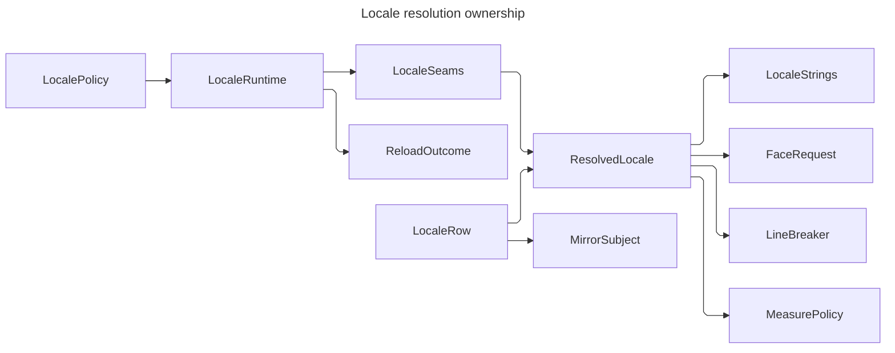

# [APPUI_LOCALIZATION_CULTURE]

One locale law serves every AppUi surface. `LocaleRow` is the culture axis — tag, string source, flow, per-script shaping and language-tag election, calendar, collation, break oracle, proofing posture — while plural cardinality belongs to each message pattern. `ResolvedLocale` binds culture, calendar-bound patterns, collator, ICU formatter, and measurement policy, and `LocaleRuntime` propagates a complete candidate before publishing, so failed propagation cannot expose mixed culture. This page owns that axis, the message registry, composition, speech policy, mirroring, and measurement.

`typography#SHAPING_RAIL` owns `RunSpec`, `FaceRequest`, `BreakClass`, and `LineBreaker`, reading the BCP-47 tail and the break oracle from here; `typography#FONT_ADMISSION` owns the ranked `FontChain`, so a locale-local family roster is unrepresentable; `assets#ICON_AXIS` owns `IconRow.Mirror` as the kernel `Option<MirrorAxis>`, deriving its mechanism from the resolved source, so this page contributes `LocaleRow.Flow` alone; `tokens#THEME_APPLICATION` constructs the three Semi theme styles with the culture this page's policy row names; `Diagnostics/evidence` seats `LocaleFault` on the 6610 band row.

## [01]-[INDEX]

- [02]-[LOCALE_AXIS]: Culture rows — tag, source, flow, shaping, per-script tags, calendar, collation, break oracle, proofing posture.
- [03]-[MESSAGE_REGISTRY]: Resx vocabulary, nameof keys, the context-and-length variant walk, ICU patterns, coverage conformance.
- [04]-[CULTURE_COMPOSITION]: Resolve fold, typed propagation seams, atomic switch, pattern and format binding, reload evidence.
- [05]-[SPEECH_POLICY]: Announcement phrases the accessibility plane reads; caption language and translation policy.
- [06]-[MIRRORING_LAW]: Flipping and never-flipping subject sets, one flow projection, order reversal, anchor swap.
- [07]-[MEASUREMENT_FORMAT]: Display-unit election, architectural fractions, DMS angles, tabular participation, elapsed and relative grammar.

## [02]-[LOCALE_AXIS]

- Owner: `LocaleRow` `[SmartEnum<string>]` the culture axis; `ScriptTags` the per-script language-tag tail; `CollationPosture` the sort-option vocabulary; `PseudoPosture` the proofing variant with its length-banded expansion table; `PluralRoute` the ICU-route policy; `LocaleBreaks` the shipped break oracles.
- Cases: `LocaleRow` = en | ar | ja | qps-ploc | qps-plocm; `CollationPosture` = linguistic | caseless | natural | natural-caseless | symbolic; `PseudoPosture` = off | accent | expand; `PluralRoute` = cardinal | ordinal.
- Law: every culture-dependent fact is a ROW COLUMN, never an inference from the tag — flow, calendar, collation, script tags, break oracle, and proofing posture are authored data, so `qps-ploc` stays left-to-right while `qps-plocm` proves mirrored layout independently, and a right-to-left tag whose surfaces must not mirror is representable. Per-script face election travels as the BCP-47 tail the platform matcher already consumes, because the ranked family chain is `typography#FONT_ADMISSION` property and a locale-local family roster forks the capability election into two authorities.
- Entry: `public Seq<string> Tags(Script script)` — the ordered language tail `FaceRequest.Of` takes, most specific first; `public partial string Source(string key, CultureInfo strings)` the per-row string-table source; `public partial MessagePattern PluralResx(string key, PluralRoute route, CultureInfo strings)` the per-row ICU-pattern source; `public partial BreakClass Break(Rune rune)` the per-row line-break oracle `LineBreaker.Wrap` takes.
- Auto: generated `Items` and key lookup under one comparer; the three delegate columns ride `[UseDelegateFromConstructor]`. `PluralResx` folds the `.one`/`.other`/`.few`/`.many`/`.zero`/`.two` satellite keys into the one `{count, plural, …}` ICU pattern the `MessageFormatter` resolves, so the plural grammar of a locale is CLDR data the engine reads and never a row-coded suffix branch. Pseudo expansion derives from the source string's own length through `ExpansionBand`, so proofing scales the way real translation does — short strings grow hardest — instead of applying one flat multiplier that under-proofs exactly the labels that overflow.
- Packages: Jeffijoe.MessageFormat, NodaTime, HarfBuzzSharp, Thinktecture.Runtime.Extensions, LanguageExt.Core, BCL inbox
- Growth: a shipped language is one `LocaleRow` row with one satellite resx set; a script needing its own face election is one `ScriptTags` entry on an existing row; a locale whose CLDR plural rule the engine does not ship is one `Pluralizer` registered onto `MessageFormatter.CardinalPluralizers`/`OrdinalPluralizers`, never a `Plural` dispatch arm; a script needing its own wrap rule is one `LocaleBreaks` oracle bound to the row's `Break` column; zero new surface.
- Boundary: a row whose satellite resx is absent resolves the neutral strings through the inbox `ResourceManager` fallback while its flow, calendar, collation, script tags, and break oracle still apply, so script and format localization ship ahead of translation rather than waiting on it. Satellite fallback walks the `CultureInfo.Parent` chain alone down to invariant and never queries ICU or CLDR — a synthetic `qps` tag is a valid BCP-47 tag the culture constructor accepts, so the pseudo rows need no locale data and their absence from CLDR is not a resolution risk; the failure modes sit OUTSIDE resolution, so none of them is a fallback carve-out: invariant globalization makes the culture constructor throw onto the `FormatRejected` rail, a build whose culture assignment drops a `qps` tag emits no satellite for the walk to reach, and a case-sensitive file system needs the directory in the casing the tag's own subtag class normalizes to. Break oracles classify the rune that BEGINS the next line, so they express line-start prohibition exactly and line-end prohibition not at all — a run ending on an opening bracket is the declared residual, not an approximation of a fuller analysis. `CompareOptions.NumericOrdering` is invalid for the indexing comparisons, so a natural-order posture reaches sorting and grouping alone and a search index takes the linguistic posture. Plural and select grammar lives in the full ICU pattern stored at the resx base key, and `PluralRoute` remains the closed validation vocabulary for cardinal and ordinal pattern inventories rather than a locale column.

```csharp signature
// --- [TYPES] ----------------------------------------------------------------------------

[SmartEnum<string>]
[KeyMemberEqualityComparer<ComparerAccessors.StringOrdinal, string>]
[KeyMemberComparer<ComparerAccessors.StringOrdinal, string>]
public sealed partial class PluralRoute {
    public static readonly PluralRoute Cardinal = new("cardinal", keyword: "plural");
    public static readonly PluralRoute Ordinal = new("ordinal", keyword: "selectordinal");

    public string Keyword { get; }
}

// Sort posture a surface asks for. `NumericOrdering` makes `A2` precede `A10`, which is the only ordering a
// sheet, level, or grid-line roster reads correctly; the platform refuses it for prefix and index queries, so
// natural rows stay sort-and-group postures and a text index resolves `Linguistic`.
[SmartEnum<string>]
[KeyMemberEqualityComparer<ComparerAccessors.StringOrdinal, string>]
[KeyMemberComparer<ComparerAccessors.StringOrdinal, string>]
public sealed partial class CollationPosture {
    public static readonly CollationPosture Linguistic = new("linguistic", CompareOptions.None, indexable: true);
    public static readonly CollationPosture Caseless = new("caseless", CompareOptions.IgnoreCase, indexable: true);
    public static readonly CollationPosture Natural = new("natural", CompareOptions.NumericOrdering, indexable: false);
    public static readonly CollationPosture NaturalCaseless = new("natural-caseless",
        CompareOptions.NumericOrdering | CompareOptions.IgnoreCase, indexable: false);
    public static readonly CollationPosture Symbolic = new("symbolic", CompareOptions.StringSort, indexable: true);

    public CompareOptions Options { get; }

    public bool Indexable { get; }

    public StringComparer Comparer(CultureInfo culture) => StringComparer.Create(culture, Options);

    // Named `Weight`, never `Key`: the generated smart-enum key property already owns that name, so a sort-key
    // member spelled `Key` collides at generation rather than at the call site.
    public SortKey Weight(CultureInfo culture, string value) => culture.CompareInfo.GetSortKey(value, Options);
}

// Proofing variants: `Accent` proves face coverage without moving geometry, `Expand` proves layout by padding
// to the band ratio, and brackets make truncation visible at both ends — a clipped tail with no closing bracket
// IS the overflow report, so proofing needs no measurement pass of its own.
[SmartEnum<string>]
[KeyMemberEqualityComparer<ComparerAccessors.StringOrdinal, string>]
[KeyMemberComparer<ComparerAccessors.StringOrdinal, string>]
public sealed partial class PseudoPosture {
    public static readonly PseudoPosture Off = new("off", accents: false, expands: false);
    public static readonly PseudoPosture Accent = new("accent", accents: true, expands: false);
    public static readonly PseudoPosture Expand = new("expand", accents: true, expands: true);

    public bool Accents { get; }

    public bool Expands { get; }

    public string Proof(string source) =>
        this == Off
            ? source
            : (Accents ? Accented(source) : source) switch {
                var marked => Expands ? $"[{marked}{Padding(source.Length)}]" : marked,
            };

    // Latin-1 and Latin Extended-A substitutes only: the accent must render in every shipped face, so a proofing
    // pass reports layout overflow rather than a missing-glyph refusal it manufactured itself.
    static string Accented(string source) =>
        string.Create(source.Length, source, static (span, text) => {
            for (int index = 0; index < text.Length; index++) {
                span[index] = ExpansionBand.Accents.TryGetValue(text[index], out char marked) ? marked : text[index];
            }
        });

    static string Padding(int length) => new('·', ExpansionBand.Extra(length));
}

// --- [CONSTANTS] ------------------------------------------------------------------------

// Expansion is LENGTH-BANDED because translation growth is: a three-character label doubles while a paragraph
// grows by a tenth, so one flat multiplier over-proofs prose and under-proofs exactly the chips and toolbar
// captions that overflow first. The band ceiling is the source length; the ratio is the proofed total.
public static class ExpansionBand {
    public static readonly ImmutableArray<(int Ceiling, double Ratio)> Bands = [
        (10, 3.00d), (20, 2.00d), (30, 1.80d), (50, 1.60d), (70, 1.40d), (int.MaxValue, 1.30d),
    ];

    public static readonly FrozenDictionary<char, char> Accents = new Dictionary<char, char> {
        ['a'] = 'ä', ['e'] = 'ë', ['i'] = 'ï', ['o'] = 'ö', ['u'] = 'ü', ['y'] = 'ÿ', ['c'] = 'ç', ['n'] = 'ñ',
        ['s'] = 'š', ['z'] = 'ž', ['A'] = 'Ä', ['E'] = 'Ë', ['I'] = 'Ï', ['O'] = 'Ö', ['U'] = 'Ü', ['Y'] = 'Ý',
        ['C'] = 'Ç', ['N'] = 'Ñ', ['S'] = 'Š', ['Z'] = 'Ž',
    }.ToFrozenDictionary();

    public static int Extra(int length) =>
        (int)double.Ceiling(length * (Bands.First(band => length <= band.Ceiling).Ratio - 1d));
}

// --- [MODELS] ---------------------------------------------------------------------------

// Per-script face election. The tail enters `SKFontManager.MatchCharacter` beside the capability, so the host
// resolves the face the SCRIPT wants — Simplified over Traditional Han, Naskh over Kufic Arabic — while the
// ranked family chain stays the typography owner's single authority.
public readonly record struct ScriptTags(Script Script, Seq<string> Tags);
```

```csharp signature
// --- [SERVICES] -------------------------------------------------------------------------

// Shipped break oracles, each classifying the rune that BEGINS the next line: a kinsoku no-start rune answers
// `None` so the breaker never opens before it, and every other rune defers to the typography classifier rather
// than restating a vocabulary that owner already closes.
public static class LocaleBreaks {
    public static readonly FrozenSet<int> NoStart = new[] {
        0x3001, 0x3002, 0xFF0C, 0xFF0E, 0xFF1A, 0xFF1B, 0xFF1F, 0xFF01, 0x309D, 0x309E, 0x30FD, 0x30FE, 0x30FC,
        0x3005, 0x3009, 0x300B, 0x300D, 0x300F, 0x3011, 0x3015, 0xFF09, 0xFF3D, 0xFF5D, 0x3041, 0x3043, 0x3045,
        0x3047, 0x3049, 0x3063, 0x3083, 0x3085, 0x3087, 0x308E, 0x30A1, 0x30A3, 0x30A5, 0x30A7, 0x30A9, 0x30C3,
        0x30E3, 0x30E5, 0x30E7, 0x30EE,
    }.ToFrozenSet();

    public static BreakClass Default(Rune rune) => BreakClass.Of(rune);

    public static BreakClass Ideographic(Rune rune) =>
        NoStart.Contains(rune.Value) ? BreakClass.None : BreakClass.Of(rune);
}

[SmartEnum<string>]
[KeyMemberEqualityComparer<ComparerAccessors.StringOrdinalIgnoreCase, string>]
[KeyMemberComparer<ComparerAccessors.StringOrdinalIgnoreCase, string>]
public sealed partial class LocaleRow {
    public static readonly LocaleRow En = new("en",
        flow: FlowDirection.LeftToRight, formatTag: "en-US",
        shaping: new RunSpec(Direction.LeftToRight, Script.Latin, Language.Default, ClusterLevel.MonotoneGraphemes),
        scripts: Seq(new ScriptTags(Script.Latin, Seq("en"))),
        calendar: CalendarSystem.Iso, collation: CollationPosture.Linguistic, pseudo: PseudoPosture.Off,
        source: LocaleStrings.Find, pluralResx: LocaleStrings.Pattern, breaks: LocaleBreaks.Default);
    public static readonly LocaleRow Arabic = new("ar",
        flow: FlowDirection.RightToLeft, formatTag: "ar-SA",
        shaping: new RunSpec(Direction.RightToLeft, Script.Arabic, new Language("ar"), ClusterLevel.MonotoneGraphemes),
        scripts: Seq(new ScriptTags(Script.Arabic, Seq("ar")), new ScriptTags(Script.Latin, Seq("en"))),
        calendar: CalendarSystem.UmAlQura, collation: CollationPosture.Linguistic, pseudo: PseudoPosture.Off,
        source: LocaleStrings.Find, pluralResx: LocaleStrings.Pattern, breaks: LocaleBreaks.Default);
    public static readonly LocaleRow Japanese = new("ja",
        flow: FlowDirection.LeftToRight, formatTag: "ja-JP",
        shaping: new RunSpec(Direction.LeftToRight, Script.Han, new Language("ja"), ClusterLevel.MonotoneGraphemes),
        scripts: Seq(new ScriptTags(Script.Han, Seq("ja")), new ScriptTags(Script.Hiragana, Seq("ja")),
            new ScriptTags(Script.Katakana, Seq("ja")), new ScriptTags(Script.Latin, Seq("en"))),
        calendar: CalendarSystem.Iso, collation: CollationPosture.Linguistic, pseudo: PseudoPosture.Off,
        source: LocaleStrings.Find, pluralResx: LocaleStrings.Pattern, breaks: LocaleBreaks.Ideographic);
    public static readonly LocaleRow PseudoLtr = new("qps-ploc",
        flow: FlowDirection.LeftToRight, formatTag: "en-US",
        shaping: new RunSpec(Direction.LeftToRight, Script.Latin, Language.Default, ClusterLevel.MonotoneGraphemes),
        scripts: Seq(new ScriptTags(Script.Latin, Seq("en"))),
        calendar: CalendarSystem.Iso, collation: CollationPosture.Linguistic, pseudo: PseudoPosture.Expand,
        source: LocaleStrings.Find, pluralResx: LocaleStrings.Pattern, breaks: LocaleBreaks.Default);
    public static readonly LocaleRow PseudoRtl = new("qps-plocm",
        flow: FlowDirection.RightToLeft, formatTag: "en-US",
        shaping: new RunSpec(Direction.RightToLeft, Script.Latin, Language.Default, ClusterLevel.MonotoneGraphemes),
        scripts: Seq(new ScriptTags(Script.Latin, Seq("en"))),
        calendar: CalendarSystem.Iso, collation: CollationPosture.Linguistic, pseudo: PseudoPosture.Expand,
        source: LocaleStrings.Find, pluralResx: LocaleStrings.Pattern, breaks: LocaleBreaks.Default);

    public FlowDirection Flow { get; }

    public string FormatTag { get; }

    public RunSpec Shaping { get; }

    public Seq<ScriptTags> Scripts { get; }

    public CalendarSystem Calendar { get; }

    public CollationPosture Collation { get; }

    public PseudoPosture Pseudo { get; }

    // Tag order is LOAD-BEARING and ends at the row's own tag, so the host matcher tries the script's preferred
    // language first and still resolves under a face registered for the culture alone.
    public Seq<string> Tags(Script script) =>
        Scripts.Find(row => row.Script == script).Map(row => row.Tags).IfNone(Seq<string>()) + Seq(Key);

    [UseDelegateFromConstructor]
    public partial string Source(string key, CultureInfo strings);

    [UseDelegateFromConstructor]
    public partial MessagePattern PluralResx(string key, PluralRoute route, CultureInfo strings);

    [UseDelegateFromConstructor]
    public partial BreakClass Break(Rune rune);
}
```

## [03]-[MESSAGE_REGISTRY]

- Owner: `LocaleStrings` the static string-table surface; `MessageLength` the width-variant axis; `MessageVariant` the context-and-length request; `MessagePattern` the ICU pattern carrier; `PluralCategory` the CLDR category axis; `MessageRegistry` the key-coverage conformance fold.
- Cases: `MessageLength` = full | medium | short | tiny; `PluralCategory` = zero | one | two | few | many | other.
- Law: one key resolves through one VARIANT WALK — context before length, most specific first, base last — so a toolbar chip asking for the tiny variant of a key that authored only the full form gets the full form rather than a missing-key marker, and an author adds a variant by adding a resx row instead of by adding a call site.
- Entry: `public static string Find(string key, CultureInfo strings)` — satellite lookup with a visible missing-key marker; `public static string Resolve(string key, MessageVariant variant, LocaleRow row, CultureInfo strings)` — the variant walk under the row's proofing posture; `public static MessagePattern Pattern(string key, PluralRoute route, CultureInfo strings)` — the full ICU pattern at the base key with its typed route and any category seed rows authoring validation reads; `public static Fin<CoverageReceipt> Coverage(LocaleRow row, ClockPolicy clocks)` — the per-row key-coverage conformance read.
- Auto: `Key` derives every key from `nameof`-supplied owner and member, so a literal key string at a call site has no producer. Coverage enumerates the neutral resource set ONCE and diffs each row's own satellite set, so the expectation derives from what the product authors rather than from a roster that drifts the moment a key lands.
- Receipt: `CoverageReceipt` — tag, expected key count, missing keys, `Instant` — sinks through `ReceiptSinkPort` and is the conformance evidence the proof lane asserts.
- Packages: Jeffijoe.MessageFormat, NodaTime, bodong.Avalonia.PropertyGrid, LanguageExt.Core, BCL inbox
- Growth: a translatable surface is one resx key row per shipped locale row; a plural surface is the same base key with its present CLDR-category satellites; a width-constrained surface is one `.short`/`.tiny` sibling row; a disambiguated surface is one `.<context>` sibling row; zero new surface.
- Boundary: `GetResourceSet(culture, createIfNotExists: true, tryParents: false)` returns the row's OWN satellite and answers null where none exists, so coverage distinguishes an untranslated locale from a locale missing individual keys — the fallback-bearing `GetString` cannot make that distinction and is therefore not the conformance read. Pseudo rows are exempt from coverage because they carry no satellite by construction: their strings ARE the neutral strings under the proofing fold, so scoring them reports the whole registry missing. Base resx values carry the complete ICU message, so exact `=n` branches, offsets, nested `select`, escaping, cardinal plural, and ordinal plural remain engine-owned and a call-site grammar branch is the deleted form. `PluralCategory` satellites survive as seed data on `MessagePattern` for authoring and proof, never as a runtime reconstruction of the grammar. Composition supplies the public `ILocalizationService` implementation to the propagation seam; an ambient service accessor is absent.

```csharp signature
// --- [TYPES] ----------------------------------------------------------------------------

[SmartEnum<string>]
[KeyMemberEqualityComparer<ComparerAccessors.StringOrdinalIgnoreCase, string>]
[KeyMemberComparer<ComparerAccessors.StringOrdinalIgnoreCase, string>]
public sealed partial class PluralCategory {
    public static readonly PluralCategory Zero = new("zero");
    public static readonly PluralCategory One = new("one");
    public static readonly PluralCategory Two = new("two");
    public static readonly PluralCategory Few = new("few");
    public static readonly PluralCategory Many = new("many");
    public static readonly PluralCategory Other = new("other");
}

// Width axis: `Full` carries the empty suffix so the base key IS the full variant and no surface pays a suffix
// for the common case, and `Rank` orders the walk so a request falls to the next WIDER form rather than to a
// narrower one that truncates meaning the caller asked to keep.
[SmartEnum<string>]
[KeyMemberEqualityComparer<ComparerAccessors.StringOrdinal, string>]
[KeyMemberComparer<ComparerAccessors.StringOrdinal, string>]
public sealed partial class MessageLength {
    public static readonly MessageLength Full = new("full", suffix: "", rank: 0);
    public static readonly MessageLength Medium = new("medium", suffix: "medium", rank: 1);
    public static readonly MessageLength Short = new("short", suffix: "short", rank: 2);
    public static readonly MessageLength Tiny = new("tiny", suffix: "tiny", rank: 3);

    public string Suffix { get; }

    public int Rank { get; }

    // The ordered run re-enters the carrier through the one enumerable admission: `OrderByDescending` answers
    // `IOrderedEnumerable`, which declares no `ToSeq` of its own, so a bare materialization off it is a spelling
    // no extension carries.
    public Seq<MessageLength> Widening =>
        toSeq(toSeq(Items).Filter(row => row.Rank <= Rank).OrderByDescending(static row => row.Rank));
}

// --- [MODELS] ---------------------------------------------------------------------------

// One resolution request. Context disambiguates a homograph the source language collapses — the noun `Scale`
// beside the verb `Scale` — and length names the width the surface can actually paint.
public readonly record struct MessageVariant(Option<string> Context, MessageLength Length) {
    public static readonly MessageVariant Default = new(None, MessageLength.Full);

    public static MessageVariant Of(MessageLength length) => new(None, length);

    public static MessageVariant In(string context, MessageLength length) => new(Some(context), length);

    // Context outranks length: a wrong word at the right width is a mistranslation while the right word at the
    // wrong width is a layout defect the proofing posture already surfaces.
    public Seq<string> Keys(string key) =>
        Context.Match(
            Some: context => Length.Widening.Map(length => Suffixed($"{key}.{context}", length)) + Length.Widening.Map(length => Suffixed(key, length)),
            None: () => Length.Widening.Map(length => Suffixed(key, length)));

    static string Suffixed(string stem, MessageLength length) =>
        length.Suffix.Length is 0 ? stem : $"{stem}.{length.Suffix}";
}

public readonly record struct MessagePattern(string Source, PluralRoute Route, Seq<(PluralCategory Category, string Seed)> Seeds) {
    // Route participates in admission: the stored ICU pattern must carry the requested route's keyword, so a
    // cardinal request cannot silently format an ordinal grammar and vice versa.
    public Fin<MessagePattern> Admitted(string key) =>
        Source.Contains(Route.Keyword, StringComparison.Ordinal)
            ? Fin.Succ(this)
            : Fin.Fail<MessagePattern>(new LocaleFault.FormatRejected($"{key}: pattern lacks the {Route.Key} '{Route.Keyword}' route"));
}

public sealed record CoverageReceipt(string Tag, int Expected, Seq<string> Missing, Instant At) {
    public bool Complete => Missing.IsEmpty;
}
```

```csharp signature
// --- [OPERATIONS] -----------------------------------------------------------------------

public static class LocaleStrings {
    public const string BaseName = "Rasm.AppUi.Strings";

    public const string MissingMarker = "missing";

    public static readonly ResourceManager Table = new(BaseName, typeof(LocaleStrings).Assembly);

    public static string Key(string owner, string member) => $"{owner}.{member}";

    public static string Find(string key, CultureInfo strings) => Table.GetString(key, strings) ?? $"[{MissingMarker}:{key}]";

    // Resolution asks the TABLE, not the row, because a variant present in the neutral set and absent from the
    // satellite still resolves — the fallback chain is the mechanism, so a partially translated locale degrades
    // key by key instead of dropping the whole variant family.
    public static string Resolve(string key, MessageVariant variant, LocaleRow row, CultureInfo strings) =>
        row.Pseudo.Proof(variant.Keys(key)
            .Choose(candidate => Optional(Table.GetString(candidate, strings)))
            .Head
            .IfNone(() => $"[{MissingMarker}:{key}]"));

    public static MessagePattern Pattern(string key, PluralRoute route, CultureInfo strings) =>
        new(
            Source: Find(key, strings),
            Route: route,
            Seeds: toSeq(PluralCategory.Items)
                .Choose(category => Optional(Table.GetString($"{key}.{category.Key}", strings)).Map(seed => (category, seed))));
}

public static class MessageRegistry {
    // Neutral set IS the expectation: every key the product authors lands there, so conformance needs no second
    // roster and a newly added key scores with no registry edit.
    public static Fin<Seq<string>> Neutral() => Names(CultureInfo.InvariantCulture, parents: true);

    public static Fin<CoverageReceipt> Coverage(LocaleRow row, ClockPolicy clocks) =>
        row.Pseudo == PseudoPosture.Off
            ? from expected in Neutral()
              from shipped in Names(CultureInfo.GetCultureInfo(row.Key), parents: false)
              select new CoverageReceipt(row.Key, expected.Count, Missing(expected, shipped), clocks.Now)
            : from expected in Neutral()
              select new CoverageReceipt(row.Key, expected.Count, Seq<string>(), clocks.Now);

    public static Fin<Seq<CoverageReceipt>> Conformance(ClockPolicy clocks) =>
        toSeq(LocaleRow.Items).Traverse(row => Coverage(row, clocks)).As();

    static Seq<string> Missing(Seq<string> expected, Seq<string> shipped) =>
        shipped.ToHashSet(StringComparer.Ordinal) switch {
            var present => toSeq(expected.Filter(key => !present.Contains(key)).OrderBy(static key => key, StringComparer.Ordinal)),
        };

    // `tryParents: false` answers the row's OWN satellite and null where none exists, so an untranslated locale
    // reads as an empty set rather than as the neutral set the fallback would have handed back.
    static Fin<Seq<string>> Names(CultureInfo culture, bool parents) =>
        Try.lift(() => Optional(LocaleStrings.Table.GetResourceSet(culture, createIfNotExists: true, tryParents: parents))
            .Match(
                Some: Entries,
                None: static () => Seq<string>()))
            .Run().MapFail(error => new LocaleFault.CoverageRejected($"{culture.Name}: {error.Message}"));

    static Seq<string> Entries(ResourceSet set) {
        Seq<string> keys = Seq<string>();
        IDictionaryEnumerator walk = set.GetEnumerator();
        while (walk.MoveNext()) {
            if (walk.Key is string name) { keys = keys.Add(name); }
        }
        return keys;
    }
}
```

## [04]-[CULTURE_COMPOSITION]

- Owner: `LocalePolicy` the user-settings options section; `LocaleSeams` the typed propagation record; `ResolvedLocale` the resolve product every formatter, shaper, and label resolver folds; `LocaleRuntime` the apply-then-publish locale cell; `LocaleValueFormatter` the one typed-value coercion hook; `LocaleFault` the typed rail on the `AppUiFaultBand.Locale` 6610 registry row.
- Cases: `LocaleFault` = TagUnresolved | ZoneUnresolved | CalendarRejected | FormatRejected | PropagationRejected | MeasureRejected | CoverageRejected.
- Law: the candidate PROPAGATES BEFORE it publishes — the theme locale, the resource surfaces, and the inspector localization service all take the new culture, and only then does the atom swap — so a partially applied culture is unrepresentable and a failed propagation leaves the committed predecessor live.
- Entry: `public Fin<Unit> Apply(LocalePolicy policy)` — `Fin` aborts on unresolved tag, zone, culture, pattern, or propagation failure; `public static Fin<LocaleRuntime> Boot(LocalePolicy policy, IDateTimeZoneProvider zones, LocaleSeams seams)`; `public ReloadOutcome Republish(LocalePolicy policy)` — the options-monitor bridge.
- Auto: `Republish` is the whole options-monitor bridge — `OptionsAdmission.Observe` wires it under the transition reload class, so a culture switch is an options reload and not a second driver. Resolution binds one cached `MessageFormatter(useCache: true, culture: Formats, customValueFormatter: …)` per culture so each ICU pattern compiles once and reuses across calls, `LocaleValueFormatter` riding the constructor as the one typed-value coercion hook, and a locale swap mints a fresh formatter rather than mutating the live one. Date patterns carry the row's calendar and the timestamp projects its instant into that calendar at the zone, so a Hijri or Persian row renders its own era without a second pattern family.
- Receipt: `ReloadReceipt` per culture switch from the options monitor stream — section, transition class, `ReloadOutcome`, `Instant`, correlation.
- Packages: Jeffijoe.MessageFormat, NodaTime, UnitsNet, LanguageExt.Core, BCL inbox
- Growth: a new display grammar is one pattern value on `ResolvedLocale`; a new format edge is one expression-bodied projection on the same record; a new propagation destination is one delegate column on `LocaleSeams`; zero new surface.
- Boundary: ambient process culture remains absent — `CultureInfo.CurrentCulture` has no reader on any AppUi surface, and every format edge takes the resolved culture explicitly; the zone registry is the same law one axis over, so the zoned pattern is built against the INJECTED provider the runtime resolves its zone from and a statically named provider is the deleted form. `ThemeLocale` is the policy row the three Semi theme constructions read, and it carries `Strings` rather than `Formats`: the theme locale selects the SHIPPED control-theme strings, not number and date rendering, so a product running English strings under German formats keeps English theme captions. All three theme styles resolve a Chinese locale for an unset value, so the seam is required at construction and re-applied on every swap; an unset `Locale` ships a Chinese-string product on every host. `Resolve`, `Plural`, and `Message` trap culture and formatter exceptions onto `Fin`, and `Quantity` routes through the measurement policy so a dimensioned value renders in its surface's elected unit at its declared precision — the caller supplies the quantity and the role, this edge supplies the culture, and a bare scalar reaching a measured label has no spelling.

```csharp signature
// --- [ERRORS] ---------------------------------------------------------------------------

[Union(ConversionFromValue = ConversionOperatorsGeneration.None)]
public abstract partial record LocaleFault : Expected {
    private LocaleFault(string detail, int code) : base(detail, code) { }
    public sealed record TagUnresolved(string Tag)
        : LocaleFault($"locale/tag: {Tag}", AppUiFaultBand.Locale.Code(0));
    public sealed record ZoneUnresolved(string Zone)
        : LocaleFault($"locale/zone: {Zone}", AppUiFaultBand.Locale.Code(1));
    public sealed record CalendarRejected(string Detail)
        : LocaleFault($"locale/calendar: {Detail}", AppUiFaultBand.Locale.Code(2));
    public sealed record FormatRejected(string Detail)
        : LocaleFault($"locale/format: {Detail}", AppUiFaultBand.Locale.Code(3));
    public sealed record PropagationRejected(string Detail)
        : LocaleFault($"locale/propagate: {Detail}", AppUiFaultBand.Locale.Code(4));
    public sealed record MeasureRejected(string Detail)
        : LocaleFault($"locale/measure: {Detail}", AppUiFaultBand.Locale.Code(5));
    public sealed record CoverageRejected(string Detail)
        : LocaleFault($"locale/coverage: {Detail}", AppUiFaultBand.Locale.Code(6));
}
```

```csharp signature
// --- [MODELS] ---------------------------------------------------------------------------

public sealed record LocalePolicy(string Tag, string Zone, Option<string> FormatTag, string Units, int Denominator) {
    public const string Section = nameof(LocalePolicy);

    public static readonly LocalePolicy Default = new(
        Tag: LocaleRow.En.Key, Zone: "Etc/UTC", FormatTag: None, Units: UnitPosture.Metric.Key, Denominator: 16);
}

// Propagation destinations are COLUMNS, so the fold that applies a culture is one traversal and a new
// destination cannot be added by widening a lambda at the composition root and forgetting the boot path.
public sealed record LocaleSeams(
    Func<CultureInfo, Fin<Unit>> ThemeLocale,
    Func<ResolvedLocale, Fin<Unit>> Resources,
    Func<ResolvedLocale, Fin<Unit>> Inspector) {
    public Fin<Unit> Propagate(ResolvedLocale resolved) =>
        from _ in ThemeLocale(resolved.Strings)
        from __ in Resources(resolved)
        from ___ in Inspector(resolved)
        select unit;
}

public sealed record ResolvedLocale(
    LocaleRow Row,
    CultureInfo Strings,
    CultureInfo Formats,
    DateTimeZone Zone,
    CalendarSystem Calendar,
    StringComparer Collator,
    MeasurePolicy Measures,
    ZonedDateTimePattern Timestamp,
    LocalDatePattern Date,
    LocalTimePattern Time,
    DurationPattern Elapsed,
    IMessageFormatter Formatter) {
    public const string TimestampText = "G";
    public const string DateText = "D";
    public const string ElapsedText = "H:mm:ss";

    public static Fin<ResolvedLocale> Resolve(LocaleRow row, DateTimeZone zone, IDateTimeZoneProvider zones, LocalePolicy policy) =>
        from posture in UnitPosture.TryGet(policy.Units, out UnitPosture elected)
            ? Fin.Succ(elected)
            : Fin.Fail<UnitPosture>(new LocaleFault.MeasureRejected($"unit system {policy.Units}"))
        from resolved in Try.lift(() => Compose(
            row, zone, zones, CultureInfo.GetCultureInfo(policy.FormatTag.IfNone(row.FormatTag)),
            new MeasurePolicy(posture, policy.Denominator))).Run()
            .MapFail(error => new LocaleFault.FormatRejected(error.Message))
        select resolved;

    // --- [LABEL_EDGES]

    public string Label(string key) => Row.Source(key, Strings);

    public string Label(string key, MessageVariant variant) => LocaleStrings.Resolve(key, variant, Row, Strings);

    public Fin<string> Message(string key, params (string Name, object? Value)[] args) =>
        Format(() => Row.Source(key, Strings), args);

    public Fin<string> Plural(string key, long count, PluralRoute route) =>
        Row.PluralResx(key, route, Strings).Admitted(key)
            .Bind(pattern => Format(() => pattern.Source, ("count", count)));

    public string Text(CompositeFormat format, params object?[] args) => string.Format(Formats, format, args);

    // --- [TEMPORAL_EDGES]

    public string Stamp(Instant value) => Timestamp.Format(value.InZone(Zone, Calendar));

    public string Day(LocalDate value) => Date.Format(value.WithCalendar(Calendar));

    public string Clock(LocalTime value) => Time.Format(value);

    public string Span(Duration value) => Elapsed.Format(value);

    public Fin<string> Relative(Instant from, Instant to) => ElapsedGrammar.Relative(this, from, to);

    // --- [SHAPING_EDGES]

    // One seam the itemizer reads: the language tail steers `MatchCharacter` per script while the ranked family
    // chain stays typography's, so a locale never forks the capability election.
    public FaceRequest Face(TextStyleRow style, FontChain chain, PalettePosture palette, Script script) =>
        FaceRequest.Of(style, chain, palette, Row.Tags(script));

    // One seam the breaker reads: the row's oracle widens the declared class vocabulary per locale rather than a
    // second line-break implementation living beside the typography owner's.
    public Seq<TextLine> Wrap(ShapedText text, string source, double width, TrimPolicy trim) =>
        LineBreaker.Wrap(text, source, width, trim, Row.Break);

    public Fin<string> Quantity(IQuantity value, MeasureRole role) => Measures.Render(value, role, Formats);

    public StringComparer Sort(CollationPosture posture) => posture.Comparer(Formats);

    // --- [COMPOSITION_EDGES]

    private Fin<string> Format(Func<string> pattern, params (string Name, object? Value)[] args) =>
        Try.lift(() => Formatter.FormatMessage(
            pattern(),
            args.Fold(new Dictionary<string, object?>(StringComparer.Ordinal), static (map, arg) => { map[arg.Name] = arg.Value; return map; }),
            Formats)).Run().MapFail(error => new LocaleFault.FormatRejected(error.Message));

    // The pattern takes the INJECTED provider, never a static one: a zoned pattern resolves its zone ids through
    // whichever provider it was built against, so a static mint would parse against a registry the runtime never
    // resolved a zone from and disagree with `Zone` on exactly the ids the two registries spell differently.
    private static ResolvedLocale Compose(
        LocaleRow row, DateTimeZone zone, IDateTimeZoneProvider zones, CultureInfo formats, MeasurePolicy measures) =>
        (ZonedDateTimePattern.CreateWithInvariantCulture(TimestampText, zones).WithCulture(formats),
         LocalDatePattern.CreateWithInvariantCulture(DateText).WithCulture(formats).WithCalendar(row.Calendar),
         LocalTimePattern.ExtendedIso.WithCulture(formats)) switch {
            var (timestamp, date, time) => new(
                Row: row,
                Strings: CultureInfo.GetCultureInfo(row.Key),
                Formats: formats,
                Zone: zone,
                Calendar: row.Calendar,
                Collator: row.Collation.Comparer(formats),
                Measures: measures,
                Timestamp: timestamp,
                Date: date,
                Time: time,
                Elapsed: DurationPattern.CreateWithInvariantCulture(ElapsedText).WithCulture(formats),
                Formatter: new MessageFormatter(useCache: true, culture: formats,
                    customValueFormatter: new LocaleValueFormatter(timestamp, date, time, zone, row.Calendar))),
        };
}

// One typed-value coercion hook: NodaTime arguments format through the resolved display patterns under the row's
// calendar and IFormattable values through Formats, so ICU pattern arguments never open a second path.
public sealed class LocaleValueFormatter(
    ZonedDateTimePattern timestamp,
    LocalDatePattern date,
    LocalTimePattern time,
    DateTimeZone zone,
    CalendarSystem calendar) : CustomValueFormatter {
    public override bool TryFormatDate(CultureInfo culture, object? value, string? style, out string? formatted) =>
        (formatted = value switch {
            Instant instant => timestamp.Format(instant.InZone(zone, calendar)),
            LocalDate day => date.Format(day.WithCalendar(calendar)),
            _ => null,
        }) is not null;

    public override bool TryFormatTime(CultureInfo culture, object? value, string? style, out string? formatted) =>
        (formatted = value switch {
            LocalTime clock => time.Format(clock),
            Instant instant => time.Format(instant.InZone(zone, calendar).TimeOfDay),
            _ => null,
        }) is not null;

    public override bool TryFormatNumber(CultureInfo culture, object? value, string? style, out string? formatted) =>
        (formatted = value is IFormattable number ? number.ToString(style, culture) : null) is not null;
}
```

```csharp signature
// --- [COMPOSITION] ----------------------------------------------------------------------

public sealed class LocaleRuntime(Atom<ResolvedLocale> cell, IDateTimeZoneProvider zones, LocaleSeams seams) {
    public Atom<ResolvedLocale> Cell { get; } = cell;

    public IDateTimeZoneProvider Zones { get; } = zones;

    public LocaleSeams Seams { get; } = seams;

    public static Fin<LocaleRuntime> Boot(LocalePolicy policy, IDateTimeZoneProvider zones, LocaleSeams seams) =>
        from resolved in Compose(policy, zones)
        from _ in seams.Propagate(resolved)
        select new LocaleRuntime(Atom(resolved), zones, seams);

    public ResolvedLocale Current => Cell.Value;

    public Fin<Unit> Apply(LocalePolicy policy) =>
        from resolved in Compose(policy, Zones)
        from _ in Seams.Propagate(resolved).MapFail(static error => new LocaleFault.PropagationRejected(error.Message))
        select ignore(Cell.Swap(_ => resolved));

    // The settings registration this policy owes the registry. `Apply` routes back through `Republish`, so a
    // settings edit, a boot policy, and a cross-process op-log write reach one propagation fold and an
    // unresolved tag or zone keeps the live locale standing as `ReloadOutcome.Rejected`. The tag and unit
    // fields pick from their own closed rows; zone and format tag are free text because both vocabularies are
    // the TZDB's and the platform's, neither of which this page may freeze into a roster.
    public Validation<Error, SettingsRow> Settings(
        Func<HashMap<string, SettingScope>> scopes, double pickerExtent) =>
        Schema(pickerExtent).Map(schema => new SettingsRow(
            Section: LocalePolicy.Section,
            LabelKey: $"{LocalePolicy.Section}.title",
            Schema: schema,
            Read: () => State(Held()),
            Scopes: scopes,
            Defaults: State(LocalePolicy.Default),
            Apply: state => IO.lift(() => Republish(Decode(state)))));

    static Validation<Error, FormSchema> Schema(double pickerExtent) =>
        FormSchema.Create(
            LocalePolicy.Section, LocalePolicy.Section, LocalePolicy.Section, FormGeometry.Inline,
            Seq(Picker(nameof(LocalePolicy.Tag), toSeq(LocaleRow.Items).Map(static row => row.Key), pickerExtent),
                Picker(nameof(LocalePolicy.Units), toSeq(UnitPosture.Items).Map(static row => row.Key), pickerExtent),
                Text(nameof(LocalePolicy.Zone)),
                Text(nameof(LocalePolicy.FormatTag)),
                // The fractional denominator is the imperial readout's own rung ladder, so it picks rather
                // than accepts an arbitrary integer no dimension formatter can render.
                Picker(nameof(LocalePolicy.Denominator), Seq("2", "4", "8", "16", "32", "64"), pickerExtent)),
            Seq(FormSection.Of(LocalePolicy.Section, $"{LocalePolicy.Section}.title",
                Seq(nameof(LocalePolicy.Tag), nameof(LocalePolicy.Zone), nameof(LocalePolicy.FormatTag),
                    nameof(LocalePolicy.Units), nameof(LocalePolicy.Denominator)))));

    static FormField Picker(string key, Seq<string> keys, double pickerExtent) =>
        FormField.Of(key, $"{LocalePolicy.Section}.{key}",
            new ControlIntent.Select(key, SelectPosture.Closed,
                new OptionSource.Inline(keys.Map(row => new OptionRow(row, $"{LocalePolicy.Section}.{key}.{row}", None, None))),
                VirtualWindowSpec.FixedRow(pickerExtent), IntentBinding.Of(PaintRole.Text)),
            FieldEntry.Choice, static _ => Validation<Error, Unit>.Success(unit));

    static FormField Text(string key) =>
        FormField.Of(key, $"{LocalePolicy.Section}.{key}",
            new ControlIntent.TextInput(key, $"{LocalePolicy.Section}.{key}.hint", Multiline: false,
                IntentBinding.Of(PaintRole.Text)),
            FieldEntry.Words, static _ => Validation<Error, Unit>.Success(unit));

    LocalePolicy Held() =>
        new(Current.Row.Key, Current.Zone.Id, Some(Current.Formats.Name),
            Current.Measures.Posture.Key, Current.Measures.Denominator);

    static FormState State(LocalePolicy policy) =>
        FormState.Empty
            .Seat(nameof(LocalePolicy.Tag), Value(policy.Tag))
            .Seat(nameof(LocalePolicy.Zone), Value(policy.Zone))
            .Seat(nameof(LocalePolicy.FormatTag), Value(policy.FormatTag.IfNone(string.Empty)))
            .Seat(nameof(LocalePolicy.Units), Value(policy.Units))
            .Seat(nameof(LocalePolicy.Denominator), Value(policy.Denominator.ToString(CultureInfo.InvariantCulture)));

    static FieldValue Value(string text) =>
        FieldValue.Of(JsonSerializer.SerializeToElement(text), ValueOrigin.Declared);

    static LocalePolicy Decode(FormState state) =>
        new(Read(state, nameof(LocalePolicy.Tag)).IfNone(LocalePolicy.Default.Tag),
            Read(state, nameof(LocalePolicy.Zone)).IfNone(LocalePolicy.Default.Zone),
            Read(state, nameof(LocalePolicy.FormatTag)).Filter(static value => value.Length > 0),
            Read(state, nameof(LocalePolicy.Units)).IfNone(LocalePolicy.Default.Units),
            Read(state, nameof(LocalePolicy.Denominator))
                .Bind(static value => int.TryParse(value, CultureInfo.InvariantCulture, out int rung) ? Some(rung) : None)
                .IfNone(LocalePolicy.Default.Denominator));

    static Option<string> Read(FormState state, string field) =>
        state.Values.Find(field).Bind(static value => value.Uniform).Map(static value => value.GetString() ?? string.Empty);

    public ReloadOutcome Republish(LocalePolicy policy) =>
        Apply(policy) is { IsFail: true, Case: Error error }
            ? new ReloadOutcome.Rejected(LocalePolicy.Section, ConfigError.Create(error.Message))
            : new ReloadOutcome.Applied(LocalePolicy.Section);

    private static Fin<ResolvedLocale> Compose(LocalePolicy policy, IDateTimeZoneProvider zones) =>
        (RowFor(policy.Tag), Optional(zones.GetZoneOrNull(policy.Zone))) switch {
            ({ IsSome: true, Case: LocaleRow row }, { IsSome: true, Case: DateTimeZone zone }) =>
                ResolvedLocale.Resolve(row, zone, zones, policy),
            ({ IsSome: false }, _) => Fin<ResolvedLocale>.Fail(new LocaleFault.TagUnresolved(policy.Tag)),
            _ => Fin<ResolvedLocale>.Fail(new LocaleFault.ZoneUnresolved(policy.Zone)),
        };

    private static Option<LocaleRow> RowFor(string tag) =>
        LocaleRow.TryGet(tag, out LocaleRow row) ? Optional(row) : None;
}
```


```mermaid
---
title: Locale resolution ownership
config:
  layout: elk
  htmlLabels: true
  markdownAutoWrap: false
  deterministicIds: true
  elk:
    nodePlacementStrategy: NETWORK_SIMPLEX
    considerModelOrder: NODES_AND_EDGES
  flowchart:
    curve: linear
    defaultRenderer: elk
    padding: 25
---
flowchart LR
    accTitle: Locale resolution ownership
    accDescr: Locale policy resolves one culture row, propagates it through typed seams before publishing, and feeds message formatting, shaping election, mirroring, and measurement from that one resolved value.
    LocalePolicy --> LocaleRuntime
    LocaleRuntime --> LocaleSeams --> ResolvedLocale
    LocaleRuntime --> ReloadOutcome
    LocaleRow --> ResolvedLocale
    ResolvedLocale --> LocaleStrings
    ResolvedLocale --> FaceRequest
    ResolvedLocale --> LineBreaker
    ResolvedLocale --> MeasurePolicy
    LocaleRow --> MirrorSubject
```

## [05]-[SPEECH_POLICY]

- Owner: `SpeechPosture` the announcement urgency vocabulary; `AnnouncementPhrase` the locale-owned announcement row the accessibility plane reads; `CaptionPolicy` the caption language and translation policy; `ShapedAnnotation` the complex-script annotation shaping projection.
- Cases: `SpeechPosture` = silent | polite | assertive.
- Law: an announcement is a MESSAGE KEY under a posture, never a composed sentence at a call site — the accessibility plane subscribes to the projected text and the platform live-setting, so a translated product announces translated text with no per-surface string work and a posture change is one column edit.
- Entry: `public Fin<string> Say(ResolvedLocale locale, params (string Name, object? Value)[] args)` on `AnnouncementPhrase`; `public AutomationLiveSetting Setting` — the platform posture the announcement row carries; `public Fin<CaptionPolicy> Admit(LocaleRow target, Option<string> source, bool translate)`; `public ShapedAnnotation Annotate(string transcript)` — the caption line shaped under the target row.
- Auto: the phrase projects through the same ICU rail every label uses, so plural and select grammar inside an announcement is engine-owned; `Setting` derives from the posture column so a row cannot carry a posture the platform vocabulary does not name.
- Packages: Avalonia, Thinktecture.Runtime.Extensions, LanguageExt.Core, BCL inbox
- Growth: an announced fact is one `AnnouncementPhrase` value naming an existing key; a caption target is one `LocaleRow`; zero new surface.
- Boundary: caption CAPTURE and band rendering belong to `Document/media` — the audio tap, the segmentation, the transcription engine, and the timed band live with the media owner because they are a capture concern, and this page owns only what language a caption is transcribed or translated INTO and how its text shapes and announces. Media consumes `CaptionPolicy` and hands back transcript text; a locale-side audio pipeline is the deleted form. Translation targets the English row alone because the engine-side translate task admits exactly that target; a broader machine-translation target is a growth row on a named consumer, never a second engine seat here. `ShapedAnnotation` passes the row's `RunSpec` and its `TypographyRole` to typography, so annotation feature tags stay role-owned and one reconciled feature sequence reaches shaping.

```csharp signature
// --- [TYPES] ----------------------------------------------------------------------------

// Posture is EARNED: `Assertive` interrupts the reader mid-utterance, so it belongs to a fact that invalidates
// what is being spoken, and `Silent` is the row that declares deliberate silence rather than an absent setting.
[SmartEnum<string>]
[KeyMemberEqualityComparer<ComparerAccessors.StringOrdinal, string>]
[KeyMemberComparer<ComparerAccessors.StringOrdinal, string>]
public sealed partial class SpeechPosture {
    public static readonly SpeechPosture Silent = new("silent", AutomationLiveSetting.Off);
    public static readonly SpeechPosture Polite = new("polite", AutomationLiveSetting.Polite);
    public static readonly SpeechPosture Assertive = new("assertive", AutomationLiveSetting.Assertive);

    public AutomationLiveSetting Setting { get; }
}

// --- [MODELS] ---------------------------------------------------------------------------

public readonly record struct AnnouncementPhrase(string Key, SpeechPosture Posture, MessageVariant Variant) {
    public static AnnouncementPhrase Of(string key, SpeechPosture posture) => new(key, posture, MessageVariant.Default);

    public AutomationLiveSetting Setting => Posture.Setting;

    // Spoken strings carry no width constraint, so the variant carries context alone; resolution stays the one
    // walk so an announcement and its visible label cannot drift apart.
    public Fin<string> Say(ResolvedLocale locale, params (string Name, object? Value)[] args) =>
        args.Length is 0
            ? Fin.Succ(locale.Label(Key, Variant))
            : locale.Message(Key, args);
}

// Language contract the media owner reads: absent `Source` elects engine-side language detection, and `Translate`
// binds the English target the transcription task admits — a target row and a translate flag that disagree refuse
// at admission rather than resolving silently at capture time.
public readonly record struct CaptionPolicy(Option<string> Source, LocaleRow Target, bool Translate) {
    public static Fin<CaptionPolicy> Admit(LocaleRow target, Option<string> source, bool translate) =>
        translate && target != LocaleRow.En
            ? Fin.Fail<CaptionPolicy>(new LocaleFault.TagUnresolved($"caption translate target {target.Key}"))
            : Fin.Succ(new CaptionPolicy(source, target, translate));

    public ShapedAnnotation Annotate(string transcript) => ShapedAnnotation.Of(transcript, Target);
}

public readonly record struct ShapedAnnotation(string Text, RunSpec Spec, TypographyRole Role) {
    public static ShapedAnnotation For(string key, ResolvedLocale locale) => Of(locale.Label(key), locale.Row);

    // Feature tags stay role-owned: shaping traverses `Role.Features` through the one `FeatureAdmission` mint and
    // HarfBuzz applies script-required forms from the `RunSpec` script itself, so a locale-local feature
    // vocabulary never forks the typography policy axis.
    public static ShapedAnnotation Of(string text, LocaleRow row) => new(text, row.Shaping, TypographyRole.Caption);
}
```

## [06]-[MIRRORING_LAW]

- Owner: `MirrorSubject` `[SmartEnum<string>]` the closed subject vocabulary carrying the flip verdict and its mechanism; `MirrorMechanism` the mechanism axis every subject names.
- Cases: `MirrorSubject` flipping = layout-flow | chrome-zone | dock-side | directional-icon | breadcrumb | pagination | drawer-anchor | peek-anchor; never-flipping = numeric-axis | geometry-viewport | code-surface | timeline | media-transport. `MirrorMechanism` = flow-root | order | anchor | glyph.
- Law: right-to-left is a PROJECTION over existing owners, never a per-surface audit — a subject asks its row for a flow and gets the locale's flow or a pinned left-to-right, so a surface that must not mirror is declared once here rather than defended at every consumer. Never-flipping subjects earn that row because their surfaces carry meaning in their direction: a numeric axis ascends rightward by mathematical convention, a geometry viewport reproduces model space, a code surface is left-to-right by language definition, a timeline runs with the clock, and transport controls encode playback direction — mirroring any of them corrupts the reading rather than localizing it.
- Entry: `public FlowDirection Flow(LocaleRow row)` — the one projection every mechanism derives from; `public bool Mirrors(LocaleRow row)`; `public Seq<T> Order<T>(Seq<T> rows, LocaleRow row)`; `public Dock Side(Dock side, LocaleRow row)`.
- Auto: the three derived operations fold off one predicate, so a never-flipping subject passing through `Order` or `Side` returns its input by construction and needs no guard; `Conformance` proves every subject's mechanism has a consumer, so a mechanism column can never describe a mirroring nothing performs.
- Packages: Avalonia, Thinktecture.Runtime.Extensions, LanguageExt.Core
- Growth: a new mirrored surface is one `MirrorSubject` row naming an existing mechanism; a genuinely new mirroring mechanism is one `MirrorMechanism` row with its operation; zero new surface.
- Boundary: the mechanism is stated ONCE per axis. Layout flow writes the subject's projected direction onto the surface ROOT and the platform cascade carries it to every descendant, so a per-control flow write is the deleted form. Icon mirroring belongs entirely to `assets#ICON_AXIS`: `IconRow.Mirror` carries the kernel `Option<MirrorAxis>` — the reflection a directional glyph takes, absent where it reads identically both ways — and the MECHANISM derives at the materializer from the resolved source, because the shipped symbol faces select a mirrored codepoint plane from the flow property while a vector row mirrors under a matrix; this page contributes `LocaleRow.Flow` alone, and a locale-side directional-asset roster duplicates the axis column and leaves the glyph-plane derivation stranded at a second owner. Chrome zone remap and dock side both ride `Side`, so left and right swap while top and bottom hold. Order reversal applies to the RANK sequence a projection already produces, never to the underlying rows, so persistence and telemetry keep one canonical order and the mirror lives at presentation.

```csharp signature
// --- [TYPES] ----------------------------------------------------------------------------

[SmartEnum<string>]
[KeyMemberEqualityComparer<ComparerAccessors.StringOrdinal, string>]
[KeyMemberComparer<ComparerAccessors.StringOrdinal, string>]
public sealed partial class MirrorMechanism {
    public static readonly MirrorMechanism FlowRoot = new("flow-root");
    public static readonly MirrorMechanism Order = new("order");
    public static readonly MirrorMechanism Anchor = new("anchor");
    public static readonly MirrorMechanism Glyph = new("glyph");
}

[SmartEnum<string>]
[KeyMemberEqualityComparer<ComparerAccessors.StringOrdinal, string>]
[KeyMemberComparer<ComparerAccessors.StringOrdinal, string>]
public sealed partial class MirrorSubject {
    public static readonly MirrorSubject LayoutFlow = new("layout-flow", flips: true, mechanism: MirrorMechanism.FlowRoot);
    public static readonly MirrorSubject ChromeZone = new("chrome-zone", flips: true, mechanism: MirrorMechanism.Anchor);
    public static readonly MirrorSubject DockSide = new("dock-side", flips: true, mechanism: MirrorMechanism.Anchor);
    public static readonly MirrorSubject DirectionalIcon = new("directional-icon", flips: true, mechanism: MirrorMechanism.Glyph);
    public static readonly MirrorSubject Breadcrumb = new("breadcrumb", flips: true, mechanism: MirrorMechanism.Order);
    public static readonly MirrorSubject Pagination = new("pagination", flips: true, mechanism: MirrorMechanism.Order);
    public static readonly MirrorSubject DrawerAnchor = new("drawer-anchor", flips: true, mechanism: MirrorMechanism.Anchor);
    public static readonly MirrorSubject PeekAnchor = new("peek-anchor", flips: true, mechanism: MirrorMechanism.Anchor);
    public static readonly MirrorSubject NumericAxis = new("numeric-axis", flips: false, mechanism: MirrorMechanism.FlowRoot);
    public static readonly MirrorSubject GeometryViewport = new("geometry-viewport", flips: false, mechanism: MirrorMechanism.FlowRoot);
    public static readonly MirrorSubject CodeSurface = new("code-surface", flips: false, mechanism: MirrorMechanism.FlowRoot);
    public static readonly MirrorSubject Timeline = new("timeline", flips: false, mechanism: MirrorMechanism.Order);
    public static readonly MirrorSubject MediaTransport = new("media-transport", flips: false, mechanism: MirrorMechanism.Order);

    public bool Flips { get; }

    public MirrorMechanism Mechanism { get; }

    // ONE projection every mechanism derives from: a never-flipping subject pins left-to-right against every row,
    // so its root re-asserts the direction its content means instead of inheriting the ambient cascade.
    public FlowDirection Flow(LocaleRow row) => Flips ? row.Flow : FlowDirection.LeftToRight;

    public bool Mirrors(LocaleRow row) => Flow(row) == FlowDirection.RightToLeft;

    public Seq<T> Order<T>(Seq<T> ordered, LocaleRow row) => Mirrors(row) ? ordered.Rev() : ordered;

    public Dock Side(Dock side, LocaleRow row) =>
        Mirrors(row)
            ? side switch { Dock.Left => Dock.Right, Dock.Right => Dock.Left, var held => held }
            : side;

    // Every mechanism must have a subject and every subject a mechanism, so the law table cannot describe a
    // mirroring no surface performs or leave a performed mirroring unnamed.
    public static Seq<MirrorMechanism> Orphaned() =>
        toSeq(MirrorMechanism.Items).Filter(mechanism => !toSeq(Items).Exists(subject => subject.Mechanism == mechanism));
}
```

## [07]-[MEASUREMENT_FORMAT]

- Owner: `UnitPosture` the unit-system axis; `MeasureGrammar` the rendering-grammar vocabulary; `MeasureRole` the per-readout row carrying its display unit per system, its precision, and its grammar; `MeasurePolicy` the elected policy every readout folds; `RelativeUnit` and `ElapsedGrammar` the relative and elapsed time grammar.
- Cases: `UnitPosture` = metric | imperial; `MeasureGrammar` = decimal | fraction | dms | elapsed; `MeasureRole` = distance | elevation | extent | area | volume | angle | mass | force | pressure | temperature | speed | energy; `RelativeUnit` = year | month | week | day | hour | minute | second.
- Law: display-unit election is an EXPLICIT unit token per role per system, never a unit-system walk — the package resolves a system to a unit through seven-axis base-unit equality that most unit rows leave undeclared, so a system-driven projection throws for the majority of the registry while succeeding for a handful, failing per quantity family rather than uniformly. Each role therefore names its metric and imperial unit outright, and a system flip re-renders the estate by re-reading one policy value.
- Entry: `public Fin<string> Render(IQuantity value, MeasureRole role, CultureInfo formats)` — the one quantity render, electing the display unit, converting, and applying the role's grammar; `public string Abbreviation(MeasureRole role, CultureInfo formats)` — the elected unit's bare abbreviation the one owner every axis title, legend, and column header reads; `public static Seq<MeasureRole> Mismatched()` — the roster fold proving each row's two tokens name one quantity family; `public static Fin<string> Relative(ResolvedLocale locale, Instant from, Instant to)` — the coarsest-unit relative phrase; `public static string Elapsed(ResolvedLocale locale, Duration span)`.
- Auto: the elected unit's own abbreviation rides the converted quantity, so a label states no unit the value does not carry and a value and its unit can never disagree; the fraction grammar reads the policy denominator once so a shop drawing at sixteenths and a survey at hundredths are one policy value apart; the relative fold walks the unit rows coarse-first over one calendar-accurate period, so month and year lengths come from the row's calendar rather than from an averaged day count.
- Packages: UnitsNet, NodaTime, Jeffijoe.MessageFormat, Thinktecture.Runtime.Extensions, LanguageExt.Core, BCL inbox
- Growth: a new readout concern is one `MeasureRole` row naming its two unit tokens, its precision, and an existing grammar; a new rendering grammar is one `MeasureGrammar` row with its fold; a new relative granularity is one `RelativeUnit` row with its period reader and message stem; zero new surface.
- Boundary: `Render` takes `IQuantity` and refuses the wider `IFormattable`, because a bare `double` satisfies the wider face and makes a unit-blind label reachable by construction. Any role whose family does not match the supplied quantity refuses on the rail rather than converting through an unrelated unit token, so a mass reaching a distance readout is a typed refusal. Tabular participation is DECLARED on the role and consumed by the type table: a role marked tabular resolves the numeric typography role whose `NumeralModality.Tabular` feature holds digit advances constant, so a live-updating readout does not jitter its neighbours — the feature stays typography's and this page states only which readouts need it. Temperature is affine, so its conversion crosses the package's own reprojection and never a scalar offset applied here. Angular rendering is degrees-minutes-seconds under the DMS grammar and decimal degrees under the decimal grammar, both from the same `Angle`, so a bearing and a rotation read from one family with no second angular type. A row's metric and imperial tokens name ONE `<Quantity>Unit` enum type, so `Mismatched` folds the whole roster in the conformance sweep: a pair drafted across two families type-checks, renders under the posture it was written against, and refuses per readout under the other, while the `Abbreviation` seam every axis title, legend, and column header reads answers the foreign token's spelling with no family proof of its own.

```csharp signature
// --- [TYPES] ----------------------------------------------------------------------------

[SmartEnum<string>]
[KeyMemberEqualityComparer<ComparerAccessors.StringOrdinal, string>]
[KeyMemberComparer<ComparerAccessors.StringOrdinal, string>]
public sealed partial class UnitPosture {
    public static readonly UnitPosture Metric = new("metric");
    public static readonly UnitPosture Imperial = new("imperial");
}

[SmartEnum<string>]
[KeyMemberEqualityComparer<ComparerAccessors.StringOrdinal, string>]
[KeyMemberComparer<ComparerAccessors.StringOrdinal, string>]
public sealed partial class MeasureGrammar {
    public static readonly MeasureGrammar Decimal = new("decimal");
    public static readonly MeasureGrammar Fraction = new("fraction");
    public static readonly MeasureGrammar Dms = new("dms");
    public static readonly MeasureGrammar Elapsed = new("elapsed");
}

// Each row states BOTH unit tokens outright. The imperial fraction rows are the architectural readouts a shop
// drawing dimensions in; the imperial extent row stays decimal because a site distance in sixteenths is noise.
[SmartEnum<string>]
[KeyMemberEqualityComparer<ComparerAccessors.StringOrdinal, string>]
[KeyMemberComparer<ComparerAccessors.StringOrdinal, string>]
public sealed partial class MeasureRole {
    public static readonly MeasureRole Distance = new("distance", LengthUnit.Millimeter, LengthUnit.Inch,
        grammar: MeasureGrammar.Fraction, decimals: 1, tabular: true);
    public static readonly MeasureRole Elevation = new("elevation", LengthUnit.Meter, LengthUnit.Foot,
        grammar: MeasureGrammar.Fraction, decimals: 3, tabular: true);
    public static readonly MeasureRole Extent = new("extent", LengthUnit.Meter, LengthUnit.Foot,
        grammar: MeasureGrammar.Decimal, decimals: 2, tabular: true);
    public static readonly MeasureRole Area = new("area", AreaUnit.SquareMeter, AreaUnit.SquareFoot,
        grammar: MeasureGrammar.Decimal, decimals: 2, tabular: true);
    public static readonly MeasureRole Volume = new("volume", VolumeUnit.CubicMeter, VolumeUnit.CubicFoot,
        grammar: MeasureGrammar.Decimal, decimals: 2, tabular: true);
    public static readonly MeasureRole Angle = new("angle", AngleUnit.Degree, AngleUnit.Degree,
        grammar: MeasureGrammar.Dms, decimals: 4, tabular: true);
    public static readonly MeasureRole Mass = new("mass", MassUnit.Kilogram, MassUnit.Pound,
        grammar: MeasureGrammar.Decimal, decimals: 1, tabular: true);
    public static readonly MeasureRole Force = new("force", ForceUnit.Kilonewton, ForceUnit.KilopoundForce,
        grammar: MeasureGrammar.Decimal, decimals: 2, tabular: true);
    public static readonly MeasureRole Pressure = new("pressure", PressureUnit.Megapascal, PressureUnit.KilopoundForcePerSquareInch,
        grammar: MeasureGrammar.Decimal, decimals: 2, tabular: true);
    public static readonly MeasureRole Temperature = new("temperature", TemperatureUnit.DegreeCelsius, TemperatureUnit.DegreeFahrenheit,
        grammar: MeasureGrammar.Decimal, decimals: 1, tabular: true);
    public static readonly MeasureRole Speed = new("speed", SpeedUnit.MeterPerSecond, SpeedUnit.FootPerMinute,
        grammar: MeasureGrammar.Decimal, decimals: 2, tabular: true);
    public static readonly MeasureRole Energy = new("energy", EnergyUnit.KilowattHour, EnergyUnit.BritishThermalUnit,
        grammar: MeasureGrammar.Decimal, decimals: 1, tabular: true);
    // The analysis probe and legend readouts. Three of the four carry the SAME unit in both postures, and the
    // repetition is the truth rather than a shortcut: `IrradianceUnit` and `IlluminanceUnit` ship no imperial
    // member at all, and `RelativeHumidityUnit` is `Percent` alone — so an imperial posture reading these
    // roles reads SI, and a role that pretended otherwise would name an enum member that does not exist.
    // Irradiation is the one row with a real pair, because a cumulative radiant exposure has both spellings.
    public static readonly MeasureRole Irradiance = new("irradiance", IrradianceUnit.WattPerSquareMeter, IrradianceUnit.WattPerSquareMeter,
        grammar: MeasureGrammar.Decimal, decimals: 1, tabular: true);
    public static readonly MeasureRole Illuminance = new("illuminance", IlluminanceUnit.Lux, IlluminanceUnit.Lux,
        grammar: MeasureGrammar.Decimal, decimals: 0, tabular: true);
    public static readonly MeasureRole Irradiation = new("irradiation", IrradiationUnit.KilowattHourPerSquareMeter, IrradiationUnit.KilobtuPerSquareFoot,
        grammar: MeasureGrammar.Decimal, decimals: 2, tabular: true);
    public static readonly MeasureRole Humidity = new("humidity", RelativeHumidityUnit.Percent, RelativeHumidityUnit.Percent,
        grammar: MeasureGrammar.Decimal, decimals: 0, tabular: true);

    public Enum MetricUnit { get; }

    public Enum ImperialUnit { get; }

    public MeasureGrammar Grammar { get; }

    public int Decimals { get; }

    public bool Tabular { get; }

    public Enum Unit(UnitPosture posture) => posture == UnitPosture.Metric ? MetricUnit : ImperialUnit;

    // Typography role a tabular readout resolves; the feature set stays typography's and this row states only
    // which readouts need constant digit advances.
    public TypographyRole Typography => Tabular ? TypographyRole.Numeric : TypographyRole.Body;

    // A row's two tokens name ONE quantity family, and the declaring enum type IS that family. A pair drafted
    // across two families passes every read under the posture it was written against and refuses per readout
    // under the other, while `Abbreviation` answers the foreign token's own spelling with no family proof at
    // all — so the fold runs in the conformance sweep beside `MirrorSubject.Orphaned` rather than surfacing as a
    // render refusal on whichever posture the author never ran.
    public static Seq<MeasureRole> Mismatched() =>
        toSeq(Items).Filter(static row => row.MetricUnit.GetType() != row.ImperialUnit.GetType());
}

// Relative granularity ladder: each row reads its own count off ONE calendar-accurate period, so a month spans
// its own calendar's month rather than an averaged count of days.
[SmartEnum<string>]
[KeyMemberEqualityComparer<ComparerAccessors.StringOrdinal, string>]
[KeyMemberComparer<ComparerAccessors.StringOrdinal, string>]
public sealed partial class RelativeUnit {
    public static readonly RelativeUnit Year = new("year", rank: 0, read: static period => period.Years);
    public static readonly RelativeUnit Month = new("month", rank: 1, read: static period => period.Months);
    public static readonly RelativeUnit Week = new("week", rank: 2, read: static period => period.Weeks);
    public static readonly RelativeUnit Day = new("day", rank: 3, read: static period => period.Days);
    public static readonly RelativeUnit Hour = new("hour", rank: 4, read: static period => period.Hours);
    public static readonly RelativeUnit Minute = new("minute", rank: 5, read: static period => period.Minutes);
    public static readonly RelativeUnit Second = new("second", rank: 6, read: static period => period.Seconds);

    public int Rank { get; }

    [UseDelegateFromConstructor]
    public partial long Read(Period period);

    public string Stem => LocaleStrings.Key(nameof(RelativeUnit), Key);
}
```

```csharp signature
// --- [OPERATIONS] -----------------------------------------------------------------------

public readonly record struct MeasurePolicy(UnitPosture Posture, int Denominator) {
    public Enum Unit(MeasureRole role) => role.Unit(Posture);

    // The bare abbreviation of a role's elected unit, so an axis title, a legend, and a column header name one
    // owner instead of composing the UnitsNet cache each at its own call site. The erased `(Type, int, ...)`
    // overload takes the boxed unit enum whole — the elected unit is an `Enum`, so its own type and integral
    // value ARE the cache key, and a per-site cache read is the token with no single owner this member closes.
    public string Abbreviation(MeasureRole role, CultureInfo formats) =>
        Unit(role) switch {
            var unit => UnitAbbreviationsCache.Default.GetDefaultAbbreviation(unit.GetType(), Convert.ToInt32(unit, formats), formats),
        };

    // Election applies to the QUANTITY, so its own abbreviation travels with the value and every grammar fold
    // renders a converted quantity rather than a scalar that lost its unit at the boundary.
    public Fin<string> Render(IQuantity value, MeasureRole role, CultureInfo formats) =>
        Converted(value, role).Map(converted => Spelled(converted, role, formats));

    Fin<IQuantity> Converted(IQuantity value, MeasureRole role) =>
        Try.lift(() => value.ToUnit(Unit(role))).Run()
            .MapFail(error => new LocaleFault.MeasureRejected($"{role.Key}/{value.QuantityInfo.Name}: {error.Message}"));

    string Spelled(IQuantity converted, MeasureRole role, CultureInfo formats) =>
        role.Grammar switch {
            var grammar when grammar == MeasureGrammar.Fraction && Posture == UnitPosture.Imperial =>
                Fractional(converted, formats),
            var grammar when grammar == MeasureGrammar.Dms => Sexagesimal(converted, formats),
            _ => converted.ToString($"G{role.Decimals + Digits(converted)}", formats),
        };

    // Feet, whole inches, and a reduced fraction of an inch: the package splits feet from inches off its own
    // customary projection and the denominator rounds the remainder, so an authored inch string never appears.
    string Fractional(IQuantity converted, CultureInfo formats) =>
        UnitsNet.Length.From(converted.Value, (LengthUnit)converted.Unit).FeetInches switch {
            var split => (Feet: (long)split.Feet, Whole: (long)double.Truncate(split.Inches),
                          Ticks: (long)double.Round((split.Inches - double.Truncate(split.Inches)) * Denominator)) switch {
                var parts when parts.Ticks >= Denominator => Assembled(parts.Feet, parts.Whole + 1, 0, formats),
                var parts => Assembled(parts.Feet, parts.Whole, parts.Ticks, formats),
            },
        };

    string Assembled(long feet, long inches, long ticks, CultureInfo formats) =>
        Reduced(ticks, Denominator) switch {
            (0, _) => feet is 0 ? $"{inches.ToString(formats)}\"" : $"{feet.ToString(formats)}' {inches.ToString(formats)}\"",
            var (numerator, denominator) when feet is 0 =>
                $"{inches.ToString(formats)} {numerator.ToString(formats)}/{denominator.ToString(formats)}\"",
            var (numerator, denominator) =>
                $"{feet.ToString(formats)}' {inches.ToString(formats)} {numerator.ToString(formats)}/{denominator.ToString(formats)}\"",
        };

    static (long Numerator, long Denominator) Reduced(long numerator, long denominator) =>
        numerator is 0 ? (0L, denominator) : Gcd(numerator, denominator) switch {
            var divisor => (numerator / divisor, denominator / divisor),
        };

    static long Gcd(long left, long right) => right is 0 ? left : Gcd(right, left % right);

    // Degrees, arcminutes, arcseconds. The seconds carry the role's decimals through the culture, so a survey
    // bearing reads to the precision the row declares rather than to a hardcoded fraction of an arcsecond.
    // `IQuantity.Value` is a `QuantityValue` whose double conversion is EXPLICIT, so the scalar narrows ONCE at
    // the head of the fold and every term below reads the narrowed value; a per-term crossing of the boxed face
    // is what lets a sign read and a magnitude read disagree about which representation they measured.
    static string Sexagesimal(IQuantity converted, CultureInfo formats) =>
        (double)converted.Value switch {
            var signed => double.Abs(signed) switch {
                var magnitude => (Sign: signed < 0d ? "-" : string.Empty,
                                  Degrees: (long)double.Truncate(magnitude),
                                  Minutes: (long)double.Truncate((magnitude - double.Truncate(magnitude)) * 60d),
                                  Seconds: (magnitude * 3600d) % 60d) switch {
                    var parts => $"{parts.Sign}{parts.Degrees.ToString(formats)}° {parts.Minutes.ToString(formats)}′ {parts.Seconds.ToString("F2", formats)}″",
                },
            },
        };

    // Significant digits are derived from the magnitude so the declared decimals mean DECIMAL PLACES: a general
    // format with a fixed digit count would drop the fractional part of a large value entirely.
    static int Digits(IQuantity converted) =>
        double.Abs((double)converted.Value) switch {
            < 1d => 1,
            var magnitude => (int)double.Floor(double.Log10(magnitude)) + 1,
        };
}

public static class ElapsedGrammar {
    // Coarsest nonzero unit wins, because a reader asking how long ago wants one granularity and a composed
    // phrase spanning three is a duration readout wearing a relative phrase's clothes.
    public static Fin<string> Relative(ResolvedLocale locale, Instant from, Instant to) =>
        Period.Between(
            from.InZone(locale.Zone, locale.Calendar).LocalDateTime,
            to.InZone(locale.Zone, locale.Calendar).LocalDateTime,
            PeriodUnits.AllUnits) switch {
            var period => toSeq(RelativeUnit.Items.OrderBy(static unit => unit.Rank))
                .Find(unit => unit.Read(period) != 0L)
                .Match(
                    Some: unit => Phrase(locale, unit, unit.Read(period)),
                    None: () => Phrase(locale, RelativeUnit.Second, 0L)),
        };

    // Duration is a MEASURED span rather than a calendar one, so it renders through the resolved elapsed pattern
    // and never through the relative phrase table — a stopwatch reading and "three days ago" are two grammars.
    public static string Elapsed(ResolvedLocale locale, Duration span) => locale.Span(span);

    static Fin<string> Phrase(ResolvedLocale locale, RelativeUnit unit, long count) =>
        locale.Message(unit.Stem, ("count", long.Abs(count)), ("direction", count < 0L ? "past" : "future"));
}
```

## [08]-[RESEARCH]

(none)
