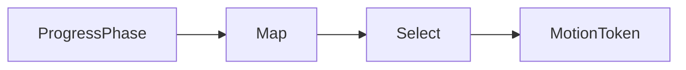

# [APPUI_MOTION_TOKENS]

Rasm.AppUi motion is one six-row `MotionToken` vocabulary: each row carries its NodaTime `Duration`, easing curve, optional spring value, and reduced-motion pair, and every duration or easing literal in the package traces to a row here. The page owns the token axis, the application plans feeding Avalonia transitions, chart timing, and pan-zoom canvases, the frozen `ProgressPhase` mapping, and the global reduced-motion degrade switch — composing AppHost `ClockPolicy` for deterministic motion clocks and Compute `ProgressPhase` as settled vocabulary over Thinktecture smart-enum rows and LanguageExt rails.

## [1]-[INDEX]

- [1]-[MOTION_AXIS]: Six token rows; durations, curves, springs, reduced pairs, pacing.
- [2]-[MOTION_APPLICATION]: Plan rows and projections binding transitions, charts, zoom, clocks.
- [3]-[PHASE_MAPPING]: Frozen nine-row `ProgressPhase`-to-token map; one resolve entrypoint.
- [4]-[REDUCED_MOTION]: Host-agnostic probe rows; one global degrade switch; conformance.

## [2]-[MOTION_AXIS]

- Owner: `MotionKeyPolicy` comparer accessor; `SpringValue` spring algebra; `MotionToken` six-row vocabulary.
- Cases: instant, fast, standard, emphasized, spring-snappy, spring-gentle
- Entry: `public MotionToken Reduced` — key-lookup resolution of the reduced pair, total over the row family.
- Auto: timing rows double as throttle and debounce pacing values consumed by live-data streams, behavior intervals, and screen runtime rows; `SpringValue` derives stiffness and damping from response and damping fraction, so a spring row carries two tuning values, never four constants.
- Packages: Thinktecture.Runtime.Extensions, NodaTime, LanguageExt.Core, BCL inbox
- Growth: a new motion grade is one `MotionToken` row carrying its reduced pair key; zero new surface.
- Boundary: a second easing or duration vocabulary anywhere in the package is the deleted pattern — charts, dialogs, toasts, behaviors, and pan-zoom canvases all read these rows; host canvas motion and host viewport overlay motion stay host-owned at the app root, and cross-surface consistency is carried as values — these spring rows are the parity source the app root's `SpringPreset` Snappy and Relaxed host rows read, a spring row's duration equals its response envelope, and the stiffness and damping derivations are the `SpringConfig` tuning math the host mirrors; color tweens interpolate in OKLab in parity with the host interpolation kernel — a channel-space sRGB lerp is the named defect.

```csharp signature
public sealed class MotionKeyPolicy : IEqualityComparerAccessor<string> {
    public static IEqualityComparer<string> EqualityComparer => StringComparer.Ordinal;
}

public readonly record struct SpringValue(float Response, float DampingFraction, float Mass) {
    public float Stiffness => (2f * MathF.PI / Response) * (2f * MathF.PI / Response) * Mass;

    public float Damping => 4f * MathF.PI * DampingFraction * Mass / Response;
}

[SmartEnum<string>]
[KeyMemberEqualityComparer<MotionKeyPolicy, string>]
public sealed partial class MotionToken {
    public static readonly MotionToken Instant = new("instant", duration: Duration.Zero, curve: static t => t, spring: None, reducedTo: "instant");
    public static readonly MotionToken Fast = new("fast", duration: Duration.FromMilliseconds(100), curve: static t => 1.0 - ((1.0 - t) * (1.0 - t)), spring: None, reducedTo: "instant");
    public static readonly MotionToken Standard = new("standard", duration: Duration.FromMilliseconds(250), curve: static t => t < 0.5 ? 4.0 * t * t * t : 1.0 - (Math.Pow((-2.0 * t) + 2.0, 3.0) / 2.0), spring: None, reducedTo: "fast");
    public static readonly MotionToken Emphasized = new("emphasized", duration: Duration.FromMilliseconds(400), curve: static t => 1.0 - Math.Pow(1.0 - t, 5.0), spring: None, reducedTo: "fast");
    public static readonly MotionToken SpringSnappy = new("spring-snappy", duration: Duration.FromMilliseconds(300), curve: static t => t, spring: Some(new SpringValue(Response: 0.30f, DampingFraction: 0.85f, Mass: 1f)), reducedTo: "fast");
    public static readonly MotionToken SpringGentle = new("spring-gentle", duration: Duration.FromMilliseconds(650), curve: static t => t, spring: Some(new SpringValue(Response: 0.65f, DampingFraction: 1.00f, Mass: 1f)), reducedTo: "standard");

    private readonly string reducedTo;

    public Duration Duration { get; }

    public Func<double, double> Curve { get; }

    public Option<SpringValue> Spring { get; }

    public MotionToken Reduced => TryGet(reducedTo, out var row) ? row : this;
}
```

## [3]-[MOTION_APPLICATION]

- Owner: `MotionPlan` enter-exit pair record; `MotionApplication` anchor and projection fold.
- Cases: Dialog, Toast, Page plan rows
- Entry: `public TimeSpan ChartSpeed` — chart animation timing for the `AnimationsSpeed` binding.
- Auto: pan-zoom canvases bind `EnableAnimations` and `AnimationDuration` from `ZoomMilliseconds`; dialog and toast sessions read their plan rows for enter-exit pairs and page transitions read the Page row; headless motion specs advance frames through `ForceRenderTimerTick` against the `ClockPolicy` fake pair, so every animation assertion runs deterministically.
- Packages: Avalonia, LiveChartsCore.SkiaSharpView.Avalonia, PanAndZoom, NodaTime, BCL inbox
- Growth: a new animated surface is one `MotionPlan` row or one projection member on the fold; zero new surface.
- Boundary: every projection receives the post-degrade token — callers resolve through the degrade switch or the phase map first, so projections stay pure and reduction applies exactly once; motion clocks read `ClockPolicy.Time`, and a direct wall-clock or stopwatch call site in motion code is the named defect; retained motion binds through the `Transitions` collection — `DoubleTransition`, `BrushTransition`, and `ThicknessTransition` rows carrying `TransitionBase.Property`, `Duration`, `Delay`, and `Easing` from the token, `SpringEasing` for the spring rows, and `CrossFade`/`PageSlide` as the `IPageTransition` carriers for the Page plan; `Throttle` and `Debounce` are the pacing anchors the screen runtime, live-data pipelines, and behavior interval rows consume — a duration literal at any of those call sites is the deleted pattern.

```csharp signature
public sealed record MotionPlan(MotionToken Enter, MotionToken Exit);

public static class MotionApplication {
    public static readonly MotionPlan Dialog = new(Enter: MotionToken.Emphasized, Exit: MotionToken.Fast);
    public static readonly MotionPlan Toast = new(Enter: MotionToken.SpringSnappy, Exit: MotionToken.Fast);
    public static readonly MotionPlan Page = new(Enter: MotionToken.Standard, Exit: MotionToken.Fast);
    public static readonly Duration Throttle = MotionToken.Fast.Duration;
    public static readonly Duration Debounce = MotionToken.Standard.Duration;

    extension(MotionToken token) {
        public TimeSpan ChartSpeed => token.Duration.ToTimeSpan();

        public Func<float, float> ChartCurve => t => (float)token.Curve(t);

        public double ZoomMilliseconds => token.Duration.TotalMilliseconds;
    }
}
```

## [4]-[PHASE_MAPPING]

- Owner: `PhaseMotion` frozen mapping table.
- Entry: `public static MotionToken Resolve(ProgressPhase phase)` — total over the nine-row map, degrade applied inside.
- Auto: progress dialogs, toast progress rows, stat tiles, and chart progress series all derive motion from `Resolve` — zero per-screen motion choices anywhere in the package.
- Packages: Rasm.Compute (project), BCL inbox
- Growth: a new phase lands as one map row beside its Compute case; zero new surface.
- Boundary: the map freezes at composition and covers every `ProgressPhase` row — the headless conformance sweep asserts `Map` keys equal `ProgressPhase.Items`, so a Compute case added without a map row fails the proof lane instead of rendering unanimated; terminal emphasis is law — Completed lands the snappy spring, Faulted lands emphasized — and re-keying phase motion per surface is the deleted pattern.

```csharp signature
public static class PhaseMotion {
    public static readonly FrozenDictionary<ProgressPhase, MotionToken> Map = new (ProgressPhase Phase, MotionToken Token)[] {
        (ProgressPhase.Queued, MotionToken.Fast),
        (ProgressPhase.Selected, MotionToken.Fast),
        (ProgressPhase.Staged, MotionToken.Standard),
        (ProgressPhase.Running, MotionToken.Standard),
        (ProgressPhase.Streaming, MotionToken.Standard),
        (ProgressPhase.Finalizing, MotionToken.Standard),
        (ProgressPhase.Completed, MotionToken.SpringSnappy),
        (ProgressPhase.Faulted, MotionToken.Emphasized),
        (ProgressPhase.Cancelled, MotionToken.Fast),
    }.ToFrozenDictionary(static row => row.Phase, static row => row.Token);

    public static MotionToken Resolve(ProgressPhase phase) => ReducedMotion.Select(Map[phase]);
}
```



## [5]-[REDUCED_MOTION]

- Owner: `MotionProbeRow` probe row; `MotionReceipt` conformance receipt; `ReducedMotion` degrade switch.
- Entry: `public static MotionToken Select(MotionToken token)` — the one reduction point every consumer shares.
- Auto: probe re-runs ride the surface-hosts mount transaction and its appearance-change facts; `Observe` swaps the atom once and every subsequent `Select` resolves the reduced pair globally — no per-animation re-checks.
- Receipt: `MotionReceipt` rows from `Conformance` — token key, resolved key, switch state, `Instant` stamp — feed the headless proof lane and sink through `ReceiptSinkPort` envelopes bound at composition.
- Packages: LanguageExt.Core, NodaTime, BCL inbox
- Growth: a new host probe is one `MotionProbeRow` row; the web-browser probe activates as the designed-only surface case; zero new surface.
- Boundary: per-animation accessibility conditionals are the deleted pattern — reduction lives in this one switch; probe delegates are host-agnostic columns and no host API enters a row — the macOS preference spelling rides the RESEARCH item, the headless row probes constant false with spec-driven `Observe` flips, and the designed-only web row carries no payload from unadmitted packages; reduced selection lands on spring-free rows and applications render reduced pairs as opacity-only, so positional transforms drop with the spring.

```csharp signature
public sealed record MotionProbeRow(string Host, bool Designed, Func<bool> Probe);

public readonly record struct MotionReceipt(string Token, string Resolved, bool Reduced, Instant At);

public static class ReducedMotion {
    static readonly Atom<bool> active = Atom(false);

    public static bool Active => active.Value;

    public static MotionToken Select(MotionToken token) => Active ? token.Reduced : token;

    public static Unit Observe(MotionProbeRow row) => ignore(active.Swap(_ => row.Probe()));

    public static Seq<MotionReceipt> Conformance(ClockPolicy clocks) =>
        toSeq(MotionToken.Items).Map(token => new MotionReceipt(token.Key, Select(token).Key, Active, clocks.Now));
}
```

| [INDEX] | [HOST_ROW]                | [PROBE_SOURCE]                                             | [DESIGNED] |
| :-----: | :------------------------ | :--------------------------------------------------------- | :--------: |
|   [1]   | rhino-panel / rhino-modal | macOS reduce-motion preference via the embed capsule facts |     no     |
|   [2]   | standalone-desktop        | platform reduce-motion preference bound at composition     |     no     |
|   [3]   | gh2-companion             | the same macOS preference delegate as the panel rows       |     no     |
|   [4]   | headless                  | constant false; spec-driven `Observe` flips                |     no     |
|   [5]   | web-browser               | absent; designed-only case                                 |    yes     |

## [6]-[RESEARCH]

- [REDUCED_MOTION_PROBE]: macOS reduce-motion preference probe spelling for embedded and standalone rows.
