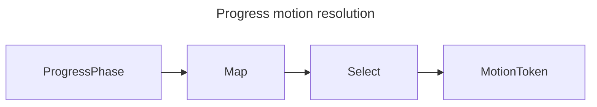

# [APPUI_MOTION_TOKENS]

Rasm.AppUi motion is one six-row `MotionToken` vocabulary: each row carries one `MotionTiming` modality and one reduced-motion delegate, and every duration or easing literal in the package traces to that owner. `MotionTiming.Tween` carries duration plus easing while `MotionTiming.Spring` derives its response envelope from the admitted spring, so an impossible duration/curve/spring combination is unrepresentable. The page owns the token axis, the `MotionPlan` policies and `MotionPacing` discriminant feeding Avalonia transitions, chart timing, pan-zoom canvases, reactive cadence, the closed `ProgressPhase` mapping, and the global reduced-motion degrade switch.

## [01]-[INDEX]

- [01]-[MOTION_AXIS]: Six token rows; durations, curves, springs, reduced delegates, pacing.
- [02]-[MOTION_APPLICATION]: Plan rows with stagger, pacing folds, projections binding transitions, charts, zoom, clocks.
- [03]-[PHASE_MAPPING]: Frozen nine-row `ProgressPhase`-to-token map; one resolve entrypoint.
- [04]-[REDUCED_MOTION]: Host-agnostic probe rows; one global degrade switch; conformance.

## [02]-[MOTION_AXIS]

- Owner: `ComparerAccessors.StringOrdinal` accessor; `SpringValue` admission-gated spring algebra; `MotionTiming` closed tween-or-spring modality; `MotionFault` the typed motion rail on the `AppUiFaultBand.Motion` 6630 registry row; `MotionToken` six-row vocabulary.
- Cases: instant, fast, standard, emphasized, spring-snappy, spring-gentle; `MotionFault` = SpringOutOfDomain | PhaseUnmapped | OrdinalOutOfDomain | ProbeUnavailable under the 6630 row.
- Entry: `public partial MotionToken Reduced()` — the `[UseDelegateFromConstructor]` reduced-pair column, total by construction over the row family.
- Auto: timing rows double as throttle and debounce pacing values consumed by live-data streams, behavior intervals, and screen runtime rows; `SpringValue` derives stiffness and damping from response and damping fraction, so a spring row carries two tuning values, never four constants — and every derivation reads admitted members only, because the `[ComplexValueObject]` factory is the sole construction path.
- Packages: Thinktecture.Runtime.Extensions, NodaTime, LanguageExt.Core, BCL inbox
- Growth: a new motion grade is one `MotionToken` row carrying its reduced delegate; a new spring invariant is one predicate arm inside `ValidateFactoryArguments`; zero new surface.
- Boundary: `MotionTiming.Tween` carries one NodaTime duration plus one Avalonia `Easing`, while `MotionTiming.Spring` carries one admitted `SpringValue` and derives its duration from `Response`; the former optional-spring ghost and duplicated spring-duration knob are unrepresentable. `MotionToken.Duration`, `Curve`, and `Spring` are projections of the timing case for consumers, not independent constructor columns. Reduced targets are deferred row delegates, `SpringEasing` owns spring progress, and `SpringValue` admits finite positive response plus non-negative damping once; unit mass is derived policy because every token shared it.

```csharp signature

[Union(ConversionFromValue = ConversionOperatorsGeneration.None)]
public abstract partial record MotionFault : Expected, IValidationError<MotionFault> {
    private MotionFault(string detail, int code) : base(detail, code) { }
    public static MotionFault Create(string message) => new SpringOutOfDomain(message);
    public sealed record SpringOutOfDomain(string Detail)
        : MotionFault($"motion/spring: {Detail}", AppUiFaultBand.Motion.Code(0));
    public sealed record PhaseUnmapped(string Detail)
        : MotionFault($"motion/phase: {Detail}", AppUiFaultBand.Motion.Code(1));
    public sealed record OrdinalOutOfDomain(string Detail)
        : MotionFault($"motion/ordinal: {Detail}", AppUiFaultBand.Motion.Code(2));
    public sealed record ProbeUnavailable(string Detail)
        : MotionFault($"motion/probe: {Detail}", AppUiFaultBand.Motion.Code(3));
}

// Duration and Easing thread through the base positional parameters (the ControlIntent pattern); the
// Spring arm derives both from its admitted SpringValue at construction, so the two projections stay
// case-consistent by construction and never re-derive per read.
[Union(ConversionFromValue = ConversionOperatorsGeneration.None)]
public abstract partial record MotionTiming(Duration Duration, Easing Easing) {
    public sealed record Tween(Duration Duration, Easing Easing) : MotionTiming(Duration, Easing);
    public sealed record Spring(SpringValue Value) : MotionTiming(
        Duration.FromMilliseconds(Value.Response * 1000d),
        new SpringEasing(mass: 1d, stiffness: Value.Stiffness, damping: Value.Damping));

    public Option<SpringValue> SpringValue => Switch(
        tween: static _ => None,
        spring: static value => Some(value.Value));
}

[ComplexValueObject]
[ValidationError<MotionFault>]
public readonly partial struct SpringValue {
    public float Response { get; }

    public float DampingFraction { get; }

    public float Stiffness => (2f * MathF.PI / Response) * (2f * MathF.PI / Response);

    public float Damping => 4f * MathF.PI * DampingFraction / Response;

    static partial void ValidateFactoryArguments(ref MotionFault? validationError, ref float response, ref float dampingFraction) =>
        validationError = (float.IsFinite(response) && response > 0f, float.IsFinite(dampingFraction) && dampingFraction >= 0f) switch {
            (false, _) => new MotionFault.SpringOutOfDomain($"response {response}"),
            (_, false) => new MotionFault.SpringOutOfDomain($"damping-fraction {dampingFraction}"),
            _ => validationError,
        };
}

[SmartEnum<string>]
[KeyMemberEqualityComparer<ComparerAccessors.StringOrdinal, string>]
[KeyMemberComparer<ComparerAccessors.StringOrdinal, string>]
public sealed partial class MotionToken {
    public static readonly MotionToken Instant = new("instant", new MotionTiming.Tween(Duration.Zero, new LinearEasing()), reduced: static () => Instant);
    public static readonly MotionToken Fast = new("fast", new MotionTiming.Tween(Duration.FromMilliseconds(100), new QuadraticEaseOut()), reduced: static () => Instant);
    public static readonly MotionToken Standard = new("standard", new MotionTiming.Tween(Duration.FromMilliseconds(250), new CubicEaseInOut()), reduced: static () => Fast);
    public static readonly MotionToken Emphasized = new("emphasized", new MotionTiming.Tween(Duration.FromMilliseconds(400), new QuinticEaseOut()), reduced: static () => Fast);
    public static readonly MotionToken SpringSnappy = new("spring-snappy", new MotionTiming.Spring(SpringValue.Create(response: 0.30f, dampingFraction: 0.85f)), reduced: static () => Fast);
    public static readonly MotionToken SpringGentle = new("spring-gentle", new MotionTiming.Spring(SpringValue.Create(response: 0.65f, dampingFraction: 1.00f)), reduced: static () => Standard);

    public MotionTiming Timing { get; }

    public Duration Duration => Timing.Duration;

    public Func<double, double> Curve => Timing.Easing.Ease;

    public Option<SpringValue> Spring => Timing.SpringValue;

    [UseDelegateFromConstructor]
    public partial MotionToken Reduced();
}
```

## [03]-[MOTION_APPLICATION]

- Owner: `MotionPlan` `[SmartEnum<string>]` enter-exit-stagger policy family; process-local behavior `MotionPacing` keyless `[SmartEnum]`; `MotionApplication` anchor and projection fold.
- Cases: Dialog, Toast, Page, Cascade plan rows
- Entry: `public TimeSpan ChartSpeed` — chart animation timing for the `AnimationsSpeed` binding.
- Auto: pan-zoom canvases bind `EnableAnimations` and `AnimationDuration` from `ZoomMilliseconds`; dialog and toast sessions read their plan rows for enter-exit pairs, page transitions read the Page row, and list or sequence entrances derive per-item delay from `Delay(ordinal)` over the Cascade row's `Stagger` column; headless motion specs advance frames through `ForceRenderTimerTick` against the `ClockPolicy` fake pair, so every animation assertion runs deterministically.
- Packages: Avalonia, LiveChartsCore.SkiaSharpView.Avalonia, PanAndZoom, System.Reactive, NodaTime, BCL inbox
- Growth: a new animated surface is one `MotionPlan` row, and a new cadence is one `MotionPacing` case plus one `Gate` arm; zero operation proliferation.
- Boundary: the projection surface IS the selection boundary — `ChartSpeed`, `ChartCurve`, `ZoomMilliseconds`, and `Gate` fold `ReducedMotion.Select` at the read, so a raw row token structurally cannot leak unreduced timing under active reduction; projections take authored row tokens, and feeding an already-selected token (`EnterToken`, `ExitToken`, a `PhaseMotion.Resolve` result) back through a projection is the deleted double-degrade form. `Gate` discriminates trailing throttle, sampled pulse, and lossless serial dwell through one scheduler-parameterized entrypoint, so headless consumers inject `VirtualTimeScheduler` or `HistoricalScheduler`; the serial row delays and concatenates every element instead of sampling a loss-bearing stream. `Delay` rejects negative ordinals on `Fin`; `PhaseMotion.Resolve` returns `PhaseUnmapped` instead of indexing a dictionary; and `MotionProbeRow.Designed` cannot masquerade as an executable probe. `ToastHorizon` is the one motion-owned hold window the `Shell/dialogs.md` `ToastGate.Flush` drain consumes at composition — a dialog-local horizon literal is the deleted form.

```csharp signature
[SmartEnum<string>]
[KeyMemberEqualityComparer<ComparerAccessors.StringOrdinal, string>]
[KeyMemberComparer<ComparerAccessors.StringOrdinal, string>]
public sealed partial class MotionPlan {
    public static readonly MotionPlan Dialog = new("dialog", MotionToken.Emphasized, MotionToken.Fast, Duration.Zero);
    public static readonly MotionPlan Toast = new("toast", MotionToken.SpringSnappy, MotionToken.Fast, Duration.Zero);
    public static readonly MotionPlan Page = new("page", MotionToken.Standard, MotionToken.Fast, Duration.Zero);
    public static readonly MotionPlan Cascade = new("cascade", MotionToken.Standard, MotionToken.Fast, MotionToken.Fast.Duration / 2);

    public MotionToken Enter { get; }

    public MotionToken Exit { get; }

    public Duration Stagger { get; }

    public MotionToken EnterToken => ReducedMotion.Select(Enter);

    public MotionToken ExitToken => ReducedMotion.Select(Exit);
}

[SmartEnum]
public sealed partial class MotionPacing {
    public static readonly MotionPacing Trailing = new();
    public static readonly MotionPacing Pulse = new();
    public static readonly MotionPacing Serial = new();
}

public static class MotionApplication {
    public static readonly Duration Throttle = MotionToken.Fast.Duration;
    public static readonly Duration Debounce = MotionToken.Standard.Duration;
    public static readonly Duration ToastHorizon = Duration.FromSeconds(30); // the Shell/dialogs ToastGate.Flush hold window, bound at composition

    // Each projection selects against the live reduced-motion state at the read — a raw row token never
    // leaks unreduced timing, so the accessibility invariant holds at the owning surface, not per caller.
    extension(MotionToken token) {
        public TimeSpan ChartSpeed => ReducedMotion.Select(token).Duration.ToTimeSpan();

        public Func<float, float> ChartCurve => t => (float)ReducedMotion.Select(token).Curve(t);

        public double ZoomMilliseconds => ReducedMotion.Select(token).Duration.TotalMilliseconds;

        public IObservable<T> Gate<T>(MotionPacing pacing, IObservable<T> source, IScheduler scheduler) =>
            ReducedMotion.Select(token) switch {
                var selected when selected.Duration == Duration.Zero => source,
                var selected => pacing.Switch(
                    state: (Source: source, Window: selected.Duration.ToTimeSpan(), Scheduler: scheduler),
                    trailing: static state => state.Source.Throttle(state.Window, state.Scheduler),
                    pulse: static state => state.Source.Sample(state.Window, state.Scheduler),
                    serial: static state => state.Source
                        .Select(item => Observable.Return(item).Delay(state.Window, state.Scheduler))
                        .Concat()),
            };
    }

    extension(MotionPlan plan) {
        public Fin<Duration> Delay(int ordinal) => ordinal >= 0
            ? Fin.Succ(plan.Stagger * ordinal)
            : Fin.Fail<Duration>(new MotionFault.OrdinalOutOfDomain($"{plan.Key}/{ordinal}"));
    }
}
```

## [04]-[PHASE_MAPPING]

- Owner: `PhaseMotion` frozen mapping table.
- Entry: `public static Fin<MotionToken> Resolve(ProgressPhase phase)` — typed totality over the nine-row map, with degrade applied inside and an unmapped future case returned as `MotionFault.PhaseUnmapped`.
- Auto: progress dialogs, toast progress rows, stat tiles, and chart progress series all derive motion from `Resolve` — zero per-screen motion choices anywhere in the package.
- Packages: Rasm.Compute (project), BCL inbox
- Growth: a new phase lands as one map row beside its Compute case; zero new surface.
- Boundary: the map freezes at composition and covers every `ProgressPhase` row — the headless conformance sweep asserts `Map` keys equal `ProgressPhase.Items`, so a Compute case added without a map row fails the proof lane instead of rendering unanimated; terminal emphasis is law — Completed lands the snappy spring, Faulted lands emphasized — and re-keying phase motion per surface is the deleted pattern.

```csharp signature
public static class PhaseMotion {
    public static readonly FrozenDictionary<ProgressPhase, MotionToken> Map = new (ProgressPhase Phase, MotionToken Token)[] {
        (ProgressPhase.Queued, MotionToken.Fast),
        (ProgressPhase.Selected, MotionToken.Fast),
        (ProgressPhase.Staged, MotionToken.Standard),
        (ProgressPhase.Running, MotionToken.Standard),
        (ProgressPhase.Streaming, MotionToken.Standard),
        (ProgressPhase.Finalizing, MotionToken.Standard),
        (ProgressPhase.Completed, MotionToken.SpringSnappy),
        (ProgressPhase.Faulted, MotionToken.Emphasized),
        (ProgressPhase.Cancelled, MotionToken.Fast),
    }.ToFrozenDictionary(static row => row.Phase, static row => row.Token);

    public static Fin<MotionToken> Resolve(ProgressPhase phase) =>
        Map.TryGetValue(phase, out MotionToken token)
            ? Fin.Succ(ReducedMotion.Select(token))
            : Fin.Fail<MotionToken>(new MotionFault.PhaseUnmapped(phase.Key));
}
```



## [05]-[REDUCED_MOTION]

- Owner: `MotionProbeRow` probe row; `MotionReceipt` conformance receipt; `ReducedMotion` degrade switch.
- Entry: `public static MotionToken Select(MotionToken token)` — the one reduction point every consumer shares.
- Auto: probe re-runs ride the surface-hosts mount transaction and its appearance-change facts; `Observe` swaps the atom once and every subsequent `Select` resolves the reduced pair globally — no per-animation re-checks.
- Receipt: `MotionReceipt` rows from `Conformance` — token key, resolved key, switch state, `Instant` stamp — feed the headless proof lane and sink through `ReceiptSinkPort` under the evidence union's `Motion` case (`MotionReceipt.ToEvidence()` flattens token, resolved, and switch state; the row's `Instant` stays off the case because the envelope HLC owns time).
- Packages: LanguageExt.Core, NodaTime, BCL inbox
- Growth: a new host probe is one `MotionProbeRow` row; the web-browser probe activates as the designed-only surface case; zero new surface.
- Boundary: per-animation accessibility conditionals are the deleted pattern — reduction lives in this one switch; probe delegates are host-agnostic columns and no host API enters a row — the macOS preference spelling rides the RESEARCH item, the headless row probes constant false with spec-driven `Observe` flips, and the designed-only web row carries no payload from unadmitted packages; reduced selection lands on spring-free rows and applications render reduced pairs as opacity-only, so positional transforms drop with the spring.

```csharp signature
[Union(ConversionFromValue = ConversionOperatorsGeneration.None)]
public abstract partial record MotionProbeRow {
    private MotionProbeRow() { }
    public sealed record Available(string Host, Func<bool> Probe) : MotionProbeRow;
    public sealed record Designed(string Host) : MotionProbeRow;
}

public readonly record struct MotionReceipt(string Token, string Resolved, bool Reduced, Instant At);

public static class ReducedMotion {
    static readonly Atom<bool> active = Atom(false);

    public static bool Active => active.Value;

    public static MotionToken Select(MotionToken token) => Active ? token.Reduced() : token;

    public static Fin<Unit> Observe(MotionProbeRow row) => row.Switch(
        available: value => Try.lift(value.Probe).Run()
            .Map(value => ignore(active.Swap(_ => value)))
            .MapFail(error => new MotionFault.ProbeUnavailable(error.Message)),
        designed: value => Fin.Fail<Unit>(new MotionFault.ProbeUnavailable(value.Host)));

    public static Seq<MotionReceipt> Conformance(ClockPolicy clocks) =>
        clocks.Now switch {
            var stamp => toSeq(MotionToken.Items).Map(token => new MotionReceipt(token.Key, Select(token).Key, Active, stamp)),
        };
}
```

| [INDEX] | [HOST_ROW]                | [PROBE_SOURCE]                                             | [DESIGNED] |
| :-----: | :------------------------ | :--------------------------------------------------------- | :--------: |
|  [01]   | rhino-panel / rhino-modal | macOS reduce-motion preference via the embed capsule facts |     no     |
|  [02]   | standalone-desktop        | platform reduce-motion preference bound at composition     |     no     |
|  [03]   | gh2-companion             | the same macOS preference delegate as the panel rows       |     no     |
|  [04]   | headless                  | constant false; spec-driven `Observe` flips                |     no     |
|  [05]   | web-browser               | absent; designed-only case                                 |    yes     |

## [06]-[RESEARCH]

- [REDUCED_MOTION_PROBE]: macOS reduce-motion preference probe spelling for embedded and standalone rows.
