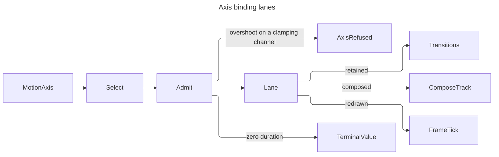
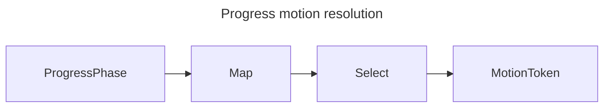

# [APPUI_MOTION_TOKENS]

Rasm.AppUi motion is one `MotionToken` vocabulary: each row carries one `MotionTiming` modality and one reduced-motion delegate, and every duration, easing, or spring literal in the package traces to that owner. `MotionTiming.Tween` carries duration with easing while `MotionTiming.Spring` derives its response envelope from the admitted spring, so an impossible duration/curve/spring combination is unrepresentable. This page owns the token axis, the axis-to-transition binding table with its spatial/effects damping split, the plan family carrying enter, exit, stagger, dwell, and choreography as DATA, the latency tiers selecting feedback form from expected operation duration, the interactive handoff physics, the closed `ProgressPhase` mapping, and the reduced-motion degrade switch. `Vfx/compose` owns where this timing EXECUTES on the render thread; a duration, a curve, or a stagger authored anywhere else would be a second timing source the reduction switch never reaches.

## [01]-[INDEX]

- [02]-[MOTION_AXIS]: Token rows; tween and spring modalities with their overshoot and retarget projections; the one easing adapter; host parity.
- [03]-[MOTION_BINDING]: The animated-axis table over the retained transitions; damping split; travel ladder; latency tiers; route carrier; the composition seam.
- [04]-[MOTION_APPLICATION]: Plan rows with choreography, stagger, dwell, and stack reflow; pacing folds; measured disclosure; projections binding charts, zoom, and clocks.
- [05]-[MOTION_HANDOFF]: Velocity tracking, projected release through one threshold, snap inertia, gesture-tracking blend, and interruption retargeting.
- [06]-[PHASE_MAPPING]: Frozen `ProgressPhase`-to-token map; one resolve entrypoint.
- [07]-[REDUCED_MOTION]: The one degrade switch over the host preference row; per-lane collapse law; conformance.

## [02]-[MOTION_AXIS]

- Owner: `SpringValue` the (response, damping-fraction) authoring projection over the kernel `SpringShape` mint; `MotionTiming` closed tween-or-spring modality; `MotionFault` the typed motion rail on the `AppUiFaultBand.Motion` 6630 registry row; `MotionToken` the grade vocabulary; `MotionEasing` the one Avalonia easing adapter.
- Cases: `MotionToken` = instant | fast | standard | emphasized | ambient | spring-snappy | spring-gentle | spring-tracking; `MotionFault` = SpringOutOfDomain | PhaseUnmapped | OrdinalOutOfDomain | AxisRefused | TravelOutOfDomain | HandoffRefused under the 6630 row.
- Law: a timing knows whether it OVERSHOOTS and whether it RETARGETS, because both facts gate admission elsewhere — the effects axes refuse an overshooting token and only a retargetable modality carries velocity across an interruption. The spring arm answers both analytically from its damping fraction; the tween arm answers overshoot from a lattice read of its own curve, so an imported or future easing family classifies itself instead of appearing on a hand-kept roster of the families that happen to overshoot today.
- Entry: `public partial MotionToken Reduced()` — the `[UseDelegateFromConstructor]` reduced-pair column, total by construction over the row family; `public Fin<SpringState> Advance(SpringState origin, double target, Duration elapsed)` and `public Fin<Duration> Settling(SpringState origin, double target, double epsilon)` are the interactive spring reads every gesture handoff composes.
- Auto: timing rows double as throttle, debounce, and dwell pacing values consumed by live-data streams, behavior intervals, and screen runtime rows; `SpringValue` admission DELEGATES to the kernel `SpringShape.OfResponse` gate — one admission rule, package-typed onto `MotionFault.SpringOutOfDomain` — and its `Shape` projection carries that same gate's result on the typed rail, folded ONCE per timing row, so the spring algebra has exactly one owner and a package-local stiffness, damping, envelope, or settling derivation is the deleted form.
- Packages: Rasm (project — `SpringShape`/`SpringState` the spring mint with its settling projection, `Easing` the easing vocabulary, `UnitInterval` the progress admission, `Op` the required operation key every kernel read carries), Thinktecture.Runtime.Extensions, NodaTime, LanguageExt.Core, BCL inbox
- Growth: a new motion grade is one `MotionToken` row carrying its reduced delegate; a new spring invariant is one kernel-gate predicate the delegated admission inherits; zero new surface.
- Boundary: `MotionTiming.Tween` carries one NodaTime duration and one kernel `Easing` row, while `MotionTiming.Spring` carries one admitted `SpringValue` and derives its duration from `Response` and its curve from the kernel three-regime closed form; the former optional-spring ghost, duplicated spring-duration knob, and hand-copied stiffness/damping constants are unrepresentable. `MotionToken.Duration`, `Curve`, `Spring`, `Overshoots`, and `Retargets` are projections of the timing case for consumers, not independent constructor columns. Reduced targets are deferred row delegates, and every row whose motion LOOPS reduces to `Instant` so the reduction halts it outright rather than shortening its period — an ambient sweep at a shorter period is more distracting than the same sweep at its own, not less. `MotionEasing` is the ONE Avalonia adapter at the animation binding boundary — a per-family Avalonia easing type (`SpringEasing`, the built-in tween easings) is the deleted form, and `Easing.Parse` is unreachable by construction because no motion value crosses this page as a string. The unit epsilon and the pixel epsilon are the two declared settling tolerances: a unit-normalized progress settles at a sub-perceptual fraction while a pixel-valued travel settles at half a device pixel, and an epsilon chosen per call site is what makes two surfaces of one product truncate their tails differently. Spring parity has one source: a host-side preset and a shell token evaluate the SAME kernel closed forms over the same admitted pair, so the token rows ARE the parity values a host copies as values — the spring rows carry their `SpringValue` pair, the tween rows carry a duration beside a kernel `Easing` row, the decay rows carry their retention — and the parity map below names each member beside the host surface class that mirrors it. The host preset table seats at the composition root and never here, so this vocabulary stays the parity source with zero surface of its own; a host-local re-derivation is the move that forks motion feel silently on the next tuning change.

```csharp signature
// --- [ERRORS] ---------------------------------------------------------------------------

using KernelEase = Rasm.Parametric.Easing;

[Union(ConversionFromValue = ConversionOperatorsGeneration.None)]
public abstract partial record MotionFault : Expected, IValidationError<MotionFault> {
    private MotionFault(string detail, int code) : base(detail, code) { }
    public static MotionFault Create(string message) => new SpringOutOfDomain(message);
    public sealed record SpringOutOfDomain(string Detail)
        : MotionFault($"motion/spring: {Detail}", AppUiFaultBand.Motion.Code(0));
    public sealed record PhaseUnmapped(string Detail)
        : MotionFault($"motion/phase: {Detail}", AppUiFaultBand.Motion.Code(1));
    public sealed record OrdinalOutOfDomain(string Detail)
        : MotionFault($"motion/ordinal: {Detail}", AppUiFaultBand.Motion.Code(2));
    public sealed record AxisRefused(string Detail)
        : MotionFault($"motion/axis: {Detail}", AppUiFaultBand.Motion.Code(3));
    public sealed record TravelOutOfDomain(string Detail)
        : MotionFault($"motion/travel: {Detail}", AppUiFaultBand.Motion.Code(4));
    public sealed record HandoffRefused(string Detail)
        : MotionFault($"motion/handoff: {Detail}", AppUiFaultBand.Motion.Code(5));
}

// --- [TYPES] ----------------------------------------------------------------------------

// Duration, Curve, and Overshoots thread through the base positional parameters (the ControlIntent pattern);
// each case derives all three from its own payload at construction — the tween from its kernel easing row, the
// spring from the kernel three-regime closed form over its admitted shape — so the projections stay
// case-consistent by construction, capture the kernel read ONCE per row, and never re-derive per read.
[Union(ConversionFromValue = ConversionOperatorsGeneration.None)]
public abstract partial record MotionTiming(Duration Duration, Func<double, double> Curve, bool Overshoots) {
    public sealed record Tween(Duration Duration, KernelEase Ease)
        : MotionTiming(Duration, Eased(Ease), Leaves(Eased(Ease)));
    public sealed record Spring(SpringValue Value)
        : MotionTiming(
            Duration.FromMilliseconds(Value.Response * NodaConstants.MillisecondsPerSecond),
            SpringProgress(admitted: Value.Shape, response: Value.Response),
            Value.DampingFraction < 1f);

    public Option<SpringValue> SpringValue => Switch(
        tween: static _ => None,
        spring: static value => Some(value.Value));

    // Velocity survives an interruption only where the modality carries it: the kernel spring re-enters at the
    // live state, while a tween holds no state at all and restarts from the current value at rest.
    public bool Retargets => Switch(
        tween: static _ => false,
        spring: static _ => true);

    static Func<double, double> Eased(KernelEase ease) =>
        t => ease.Evaluate(t: UnitInterval.Create(Math.Clamp(t, 0d, 1d)));

    // Overshoot classification for the tween arm. The kernel leaves easing output unclamped BECAUSE the back,
    // elastic, and bounce families legitimately exit the unit band, so the fact is a property of the curve and
    // is read from the curve — a roster of the families that overshoot today would silently misclassify the
    // next imported cubic-bezier token, which is exactly the value a hand-kept roster cannot see.
    static bool Leaves(Func<double, double> curve) =>
        toSeq(Enumerable.Range(0, LatticeSamples)).Exists(step =>
            curve((double)step / (LatticeSamples - 1)) switch { var value => value < 0d || value > 1d });

    const int LatticeSamples = 33;

    // Unit progress through the kernel closed form: position from rest to a unit target over the response
    // window, every regime (under-, critically-, over-damped) selected by the admitted shape's own zeta. The
    // gate arm folds ONCE per row at construction and the evaluation arm is structurally unreachable —
    // admitted shape, clamped finite elapsed — so both failures collapse to the terminal pose at this UI leaf.
    static Func<double, double> SpringProgress(Fin<SpringShape> admitted, float response) =>
        admitted.Match<Func<double, double>>(
            Succ: shape => t => shape.Evaluate(
                    origin: new SpringState(Position: 0d, Velocity: 0d), target: 1d,
                    elapsed: Math.Clamp(t, 0d, 1d) * response, key: Op.Of(name: nameof(SpringProgress)))
                .Match(Succ: static state => state.Position, Fail: static _ => 1d),
            Fail: static _ => static t => 1d);
}

// --- [MODELS] ---------------------------------------------------------------------------

// Authoring projection over the kernel spring mint: Response and DampingFraction are the token-facing tuning
// pair, admission is the kernel gate package-typed, and Shape carries that gate on the rail. Every derived
// physical read — live re-entry and settling duration — is the kernel's own closed form over that shape, so
// the stiffness/damping derivations, the envelope inversion, and the tail estimate are all deleted here.
[ComplexValueObject]
[ValidationError<MotionFault>]
public readonly partial struct SpringValue {
    // The two declared settling tolerances. Unit progress settles below perception at a fraction of its own
    // travel; a pixel-valued travel settles at half a device pixel, the smallest residue a display can carry.
    public static readonly double UnitEpsilon = 1d / 512d;

    public static readonly double PixelEpsilon = 0.5d;

    public float Response { get; }

    public float DampingFraction { get; }

    // The admitted closed form stays on the typed rail: the Create gate below already proved this pair, so the
    // fail arm is unreachable and the interior projection carries it as Fin rather than a host-boundary unwrap.
    public Fin<SpringShape> Shape =>
        SpringShape.OfResponse(response: Response, dampingFraction: DampingFraction);

    // Live re-entry: an interrupted or gesture-driven run continues from its current position AND velocity
    // instead of restarting from rest. Elapsed crosses in seconds because the kernel's angular frequency is
    // radians per second, which is the same unit the response window is authored in.
    public Fin<SpringState> Advance(SpringState origin, double target, Duration elapsed) =>
        Shape.Bind(shape => shape.Evaluate(
            origin: origin, target: target, elapsed: elapsed.TotalSeconds, key: Op.Of(name: nameof(Advance))));

    // The honest run length: a bound duration taken from the response window alone cuts the tail off a
    // gently-damped spring, so a run that must END binds this projection and a run that merely PLAYS binds
    // the token duration.
    public Fin<Duration> Settling(SpringState origin, double target, double epsilon) =>
        Shape.Bind(shape => shape.Settle(
                origin: origin, target: target, epsilon: epsilon, key: Op.Of(name: nameof(Settling))))
            .Map(Duration.FromSeconds);

    static partial void ValidateFactoryArguments(ref MotionFault? validationError, ref float response, ref float dampingFraction) {
        (float r, float d) = (response, dampingFraction);
        validationError = SpringShape.OfResponse(response: r, dampingFraction: d).Match(
            Succ: static _ => (MotionFault?)null,
            Fail: _ => new MotionFault.SpringOutOfDomain($"response {r} damping-fraction {d}"));
    }
}

// --- [SERVICES] -------------------------------------------------------------------------

// ONE Avalonia adapter at the animation binding boundary: a transition, a page transition, and a composition
// keyframe each bind a token and read its curve through this shim, so no second Avalonia easing type exists
// anywhere in the package and the kernel curve reaches every lane unchanged.
public sealed class MotionEasing(Func<double, double> curve) : Avalonia.Animation.Easings.Easing {
    public override double Ease(double progress) => curve(progress);
}

[SmartEnum<string>]
[KeyMemberEqualityComparer<ComparerAccessors.StringOrdinal, string>]
[KeyMemberComparer<ComparerAccessors.StringOrdinal, string>]
public sealed partial class MotionToken {
    public static readonly MotionToken Instant = new("instant", new MotionTiming.Tween(Duration.Zero, KernelEase.Linear), reduced: static () => Instant);
    public static readonly MotionToken Fast = new("fast", new MotionTiming.Tween(Duration.FromMilliseconds(100), KernelEase.QuadOut), reduced: static () => Instant);
    public static readonly MotionToken Standard = new("standard", new MotionTiming.Tween(Duration.FromMilliseconds(250), KernelEase.CubicInOut), reduced: static () => Fast);
    public static readonly MotionToken Emphasized = new("emphasized", new MotionTiming.Tween(Duration.FromMilliseconds(400), KernelEase.QuintOut), reduced: static () => Fast);
    // The looping grade — shimmer sweeps, indeterminate pulses, wash crossfades. Linear because an eased curve
    // stutters at the loop seam, and reduced to Instant because a repeating motion is the one kind reduction
    // must STOP rather than shorten.
    public static readonly MotionToken Ambient = new("ambient", new MotionTiming.Tween(Duration.FromMilliseconds(1200), KernelEase.Linear), reduced: static () => Instant);
    public static readonly MotionToken SpringSnappy = new("spring-snappy", new MotionTiming.Spring(SpringValue.Create(response: 0.30f, dampingFraction: 0.85f)), reduced: static () => Fast);
    public static readonly MotionToken SpringGentle = new("spring-gentle", new MotionTiming.Spring(SpringValue.Create(response: 0.65f, dampingFraction: 1.00f)), reduced: static () => Standard);
    // Continuous pointer following: a short critically-damped response, because a tracked value that overshoots
    // the finger reads as lag in the opposite direction; reduction drops the smoothing entirely.
    public static readonly MotionToken SpringTracking = new("spring-tracking", new MotionTiming.Spring(SpringValue.Create(response: 0.15f, dampingFraction: 1.00f)), reduced: static () => Instant);

    public MotionTiming Timing { get; }

    public Duration Duration => Timing.Duration;

    public Func<double, double> Curve => Timing.Curve;

    public Option<SpringValue> Spring => Timing.SpringValue;

    public bool Overshoots => Timing.Overshoots;

    public bool Retargets => Timing.Retargets;

    [UseDelegateFromConstructor]
    public partial MotionToken Reduced();
}
```

| [INDEX] | [MEMBER]                | [HOST_SURFACE]          | [PARITY_LAW]                                                      |
| :-----: | :---------------------- | :---------------------- | :---------------------------------------------------------------- |
|  [01]   | `Response`              | host canvas motion      | seconds-to-target the preset row copies as a value                |
|  [02]   | `DampingFraction`       | host canvas motion      | damping ratio; the kernel selects the regime, never a host branch |
|  [03]   | `Shape`                 | viewport overlay motion | the admitted closed form both sides evaluate, minted at one gate  |
|  [04]   | `MotionDecay.Retention` | host inertial pan       | velocity retention per millisecond; the rate is the kernel's      |

## [03]-[MOTION_BINDING]

- Owner: `MotionKind` the spatial-or-effects discriminant; `MotionLane` the execution-lane vocabulary; `MotionAxis` `[SmartEnum<string>]` the animated-axis table over the retained transition family; `MotionTravel` the distance-and-size duration ladder; `LatencyTier` the feedback-form family; `RouteCarrier` the page-transition binding.
- Cases: `MotionKind` = spatial | effects; `MotionLane` = retained | composed | redrawn; `MotionAxis` = opacity | colour | brush | shadow | corner | effect | transform | extent | inset; `LatencyTier` = instant | feedback | skeleton | deliberate | handoff.
- Law: the SPATIAL/EFFECTS split governs damping. Position, size, and transform may ride an under-damped spring because overshooting a coordinate reads as weight; colour, opacity, brush, shadow, and corner are always critically damped because those channels CLAMP at their domain edges — an opacity past one and a channel past its gamut both render as a flat hold with a visible snap out of it, which reads as a rendering fault rather than as physics. The admission is structural: an effects axis refuses an overshooting token at the bind.
- Law: the duration ladder is a token ladder. Travel distance and element extent select a ROW, never a computed millisecond value, so two surfaces whose travels differ slightly cannot differ in duration at all — the variance ban is the closed rung set, and a surface that wants a duration between two rungs is asking for a grade the vocabulary does not have.
- Entry: `public Fin<Option<ITransition>> Bind(AvaloniaProperty property, MotionToken token)` — one transition mint with reduction folded in; `public static Fin<Unit> Seat(Animatable target, Seq<(MotionAxis Axis, AvaloniaProperty Property, MotionToken Token)> rows)` — the one `Transitions` write; `public static Fin<MotionToken> Of(double travel, double extent)` — the ladder; `public static LatencyTier Select(Duration expected)` — the feedback-form fold; `public static Unit Bind(TransitioningContentControl host, MotionPlan plan, PageSlide.SlideAxis axis, bool reversed)` — the route carrier.
- Auto: an axis row carries its own transition constructor, so a surface names the axis and the styled property and never the transition type; the seat rebuilds the whole `Transitions` list from the row set, so a re-seat under a new density or a new plan cannot leave a stale entry behind; a resolved `Instant` token mounts NO transition at all, which is the same terminal-value rule the composition collapse applies one lane over.
- Packages: Avalonia, Thinktecture.Runtime.Extensions, LanguageExt.Core, NodaTime
- Growth: a new animated axis is one `MotionAxis` row carrying its transition constructor, its kind, and its lane; a new feedback form is one `LatencyTier` row carrying its ceiling and its plan; zero new surface.
- Boundary: `Transitions` validates on admission and THROWS for a `DirectProperty` target, so the bind refuses a direct property onto `MotionFault.AxisRefused` before the list ever sees it; that validation also verifies UI-thread access, so a seat crosses the UI scheduler port at its caller exactly as a theme swap does. `BrushTransition` and `EffectTransition` swap DISCRETELY at half progress whenever their two ends carry incompatible shapes, so a gradient-to-solid change or a blur-radius change animates as a cut on the retained lane — a continuously varying effect parameter is not a transition at all and rides the redraw lane, which is why the effect row's lane is `Redrawn` while its transition still exists for the compatible case. `TransformOperations` interpolates OPERATION-WISE while every other `ITransform` interpolates through its collapsed matrix, so the transform axis binds `TransformOperations` and a `RenderTransform` assembled as a matrix is the deleted form. FLOATING CHROME animates on the transform and opacity axes ALONE: a rail, a HUD chip, a toast, or a palette that animates extent or inset re-enters layout for the content plane beneath it on every frame of its own entrance, so extent motion is confined to in-flow disclosure where the reflow IS the effect. The composition seam is `Vfx/compose`: `ComposeSlot` names the compositor's own property for the composed-lane axes, `ComposeTrack.Start` mints and starts a run with reduction folded inside, `ComposeTrack.Bound` is that page's ONE duration admission — the explicit run, the implicit trigger, and the render-thread tick all cross it — clamping at the one-millisecond `ComposeTrack.Floor` that keeps `KeyFrameAnimation.Duration` assignable at all, a resolved zero duration collapses to the terminal-value assignment rather than a zero-length run, `ImplicitPlan.Of` maps a plan onto layout-driven assignments with no explicit start, and `VfxMessage.Advancing` is the admitted mint every render-thread advance crosses for an effect term that is not a slot — it resolves the reduction and bounds the span on the thread that still carries a rail, so the `VfxMessage.Advance` the handler receives carries a RESOLVED token beside a BOUNDED span and a token reducing to zero duration arrives as `VfxMessage.Halt` rather than as a run the tick would have to special-case; a surface drives one slot from ONE of those paths, because explicit and implicit motion on a shared slot resolve last-write-wins with no diagnostic. `TransitioningContentControl.PageTransition` defaults to an immutable cross-fade carrying its own inline duration literal, so the route carrier ASSIGNS the property at mount and leaving the default is a second untokened timing source exactly as the shipped popup-animation style would be.

```csharp signature
// --- [TYPES] ----------------------------------------------------------------------------

[SmartEnum<string>]
[KeyMemberEqualityComparer<ComparerAccessors.StringOrdinal, string>]
[KeyMemberComparer<ComparerAccessors.StringOrdinal, string>]
public sealed partial class MotionKind {
    public static readonly MotionKind Spatial = new("spatial", admitsOvershoot: true);
    public static readonly MotionKind Effects = new("effects", admitsOvershoot: false);

    // The admission the split exists for: a clamping channel cannot carry an overshoot, so the fact is a
    // column on the kind rather than a conditional at each bind site.
    public bool AdmitsOvershoot { get; }
}

// Where an axis animates CONTINUOUSLY. Every row can fall back to its retained transition; the lane names the
// path that carries the axis at full rate without re-entering layout on the UI thread.
[SmartEnum<string>]
[KeyMemberEqualityComparer<ComparerAccessors.StringOrdinal, string>]
[KeyMemberComparer<ComparerAccessors.StringOrdinal, string>]
public sealed partial class MotionLane {
    public static readonly MotionLane Retained = new("retained");
    public static readonly MotionLane Composed = new("composed");
    public static readonly MotionLane Redrawn = new("redrawn");
}

[SmartEnum<string>]
[KeyMemberEqualityComparer<ComparerAccessors.StringOrdinal, string>]
[KeyMemberComparer<ComparerAccessors.StringOrdinal, string>]
public sealed partial class MotionAxis {
    public static readonly MotionAxis Opacity = new("opacity", MotionKind.Effects, MotionLane.Composed,
        static (property, duration, easing) => new DoubleTransition { Property = property, Duration = duration, Easing = easing });
    public static readonly MotionAxis Colour = new("colour", MotionKind.Effects, MotionLane.Composed,
        static (property, duration, easing) => new ColorTransition { Property = property, Duration = duration, Easing = easing });
    public static readonly MotionAxis Brush = new("brush", MotionKind.Effects, MotionLane.Retained,
        static (property, duration, easing) => new BrushTransition { Property = property, Duration = duration, Easing = easing });
    public static readonly MotionAxis Shadow = new("shadow", MotionKind.Effects, MotionLane.Retained,
        static (property, duration, easing) => new BoxShadowsTransition { Property = property, Duration = duration, Easing = easing });
    public static readonly MotionAxis Corner = new("corner", MotionKind.Effects, MotionLane.Retained,
        static (property, duration, easing) => new CornerRadiusTransition { Property = property, Duration = duration, Easing = easing });
    public static readonly MotionAxis Effect = new("effect", MotionKind.Effects, MotionLane.Redrawn,
        static (property, duration, easing) => new EffectTransition { Property = property, Duration = duration, Easing = easing });
    public static readonly MotionAxis Transform = new("transform", MotionKind.Spatial, MotionLane.Composed,
        static (property, duration, easing) => new TransformOperationsTransition { Property = property, Duration = duration, Easing = easing });
    public static readonly MotionAxis Extent = new("extent", MotionKind.Spatial, MotionLane.Composed,
        static (property, duration, easing) => new DoubleTransition { Property = property, Duration = duration, Easing = easing });
    public static readonly MotionAxis Inset = new("inset", MotionKind.Spatial, MotionLane.Retained,
        static (property, duration, easing) => new ThicknessTransition { Property = property, Duration = duration, Easing = easing });

    public MotionKind Kind { get; }

    public MotionLane Lane { get; }

    // The easing parameter is spelled whole: the kernel easing vocabulary and this page's own facade both
    // carry the bare name, so an unqualified spelling here binds whichever using happens to win.
    public Func<AvaloniaProperty, TimeSpan, Avalonia.Animation.Easings.Easing, ITransition> Factory { get; }

    // The one transition mint. Reduction folds at the bind, so a raw row token cannot seat unreduced timing;
    // a direct property refuses here because the list would otherwise THROW on admission; an overshooting
    // token refuses on a clamping channel; and a resolved instant mounts nothing at all, because the value
    // assignment IS the motion and a zero-length transition allocates a run to reach the same state.
    public Fin<Option<ITransition>> Bind(AvaloniaProperty property, MotionToken token) =>
        ReducedMotion.Select(token) switch {
            _ when property.IsDirect => Fin.Fail<Option<ITransition>>(
                new MotionFault.AxisRefused($"{Key}: {property.Name} is a direct property")),
            var resolved when !Kind.AdmitsOvershoot && resolved.Overshoots => Fin.Fail<Option<ITransition>>(
                new MotionFault.AxisRefused($"{Key}: {resolved.Key} overshoots a clamping channel")),
            var resolved when resolved.Duration == Duration.Zero => Fin.Succ(Option<ITransition>.None),
            var resolved => Fin.Succ(Some(Factory(
                property, resolved.Duration.ToTimeSpan(), new MotionEasing(resolved.Curve)))),
        };

    // The whole list is rebuilt from the row set, so a re-seat under a new plan or a new density cannot leave a
    // stale entry animating a property the surface stopped driving.
    public static Fin<Unit> Seat(Animatable target, Seq<(MotionAxis Axis, AvaloniaProperty Property, MotionToken Token)> rows) =>
        rows.Traverse(row => row.Axis.Bind(row.Property, row.Token)).As()
            .Map(bound => Mounted(target, bound.Somes()));

    static Unit Mounted(Animatable target, Seq<ITransition> bound) {
        Transitions seated = [];
        seated.AddRange(bound);
        target.Transitions = seated;
        return unit;
    }
}

// --- [OPERATIONS] -----------------------------------------------------------------------

// The travel ladder. A large surface covering the same pixels reads slower than a small one, so the rungs are
// read against travel INFLATED by the element's own extent against the reference diagonal — and the rungs are
// token rows, which is what makes the variance ban structural rather than a review note.
public static class MotionTravel {
    public static readonly double Reference = 320d;

    static readonly Seq<(double Ceiling, MotionToken Token)> Ladder = Seq(
        (12d, MotionToken.Instant),
        (48d, MotionToken.Fast),
        (240d, MotionToken.Standard),
        (double.PositiveInfinity, MotionToken.Emphasized));

    public static Fin<MotionToken> Of(double travel, double extent) =>
        double.IsFinite(travel) && travel >= 0d && double.IsFinite(extent) && extent > 0d
            ? Ladder.Find(rung => travel * Math.Sqrt(extent / Reference) <= rung.Ceiling)
                .Map(static rung => rung.Token)
                .ToFin(new MotionFault.TravelOutOfDomain($"travel {travel} extent {extent}"))
            : Fin.Fail<MotionToken>(new MotionFault.TravelOutOfDomain($"travel {travel} extent {extent}"));
}

// Feedback form is a function of EXPECTED duration, not of taste: below perception the result is its own
// feedback, a second of work earns in-place motion, a known-shaped load earns a shimmering skeleton, ten
// seconds earns a choreographed determinate surface, and anything longer hands off to the notification plane
// so the surface stays usable. Each row names the plan its feedback surface composes, so placement is the
// settled choreography vocabulary rather than a second placement enum.
[SmartEnum<string>]
[KeyMemberEqualityComparer<ComparerAccessors.StringOrdinal, string>]
[KeyMemberComparer<ComparerAccessors.StringOrdinal, string>]
public sealed partial class LatencyTier {
    public static readonly LatencyTier Instant = new("instant", Duration.FromMilliseconds(100), MotionToken.Instant, None);
    public static readonly LatencyTier Feedback = new("feedback", Duration.FromSeconds(1), MotionToken.Fast, None);
    public static readonly LatencyTier Skeleton = new("skeleton", Duration.FromSeconds(3), MotionToken.Ambient, Some(MotionPlan.Skeleton));
    public static readonly LatencyTier Deliberate = new("deliberate", Duration.FromSeconds(10), MotionToken.Standard, Some(MotionPlan.Dialog));
    public static readonly LatencyTier Handoff = new("handoff", Duration.MaxValue, MotionToken.SpringSnappy, Some(MotionPlan.Toast));

    public Duration Ceiling { get; }

    public MotionToken Token { get; }

    public Option<MotionPlan> Plan { get; }

    // Total by construction: the last rung's ceiling is the representable maximum, so every expected duration
    // lands on a row and the fallback exists to satisfy the reader, never the domain. The ordered run re-enters
    // the carrier before `Find` reads it — `OrderBy` answers `IOrderedEnumerable`, which carries no `Option`-shaped
    // lookup at all, so chaining straight off it either fails to compile or binds a throwing LINQ twin.
    public static LatencyTier Select(Duration expected) =>
        toSeq(Items.OrderBy(static row => row.Ceiling)).Find(row => expected <= row.Ceiling).IfNone(Handoff);
}

// --- [COMPOSITION] ----------------------------------------------------------------------

// The route-content carrier: the page plan lands on the transitioning host as ONE assigned page transition.
// The default the property carries is an immutable cross-fade with its own inline duration, so an unassigned
// host is a second untokened timing source; reduction drops the slide and keeps the dissolve, which is the
// same opacity-only collapse every plan applies.
public static class RouteCarrier {
    public static Unit Bind(TransitioningContentControl host, MotionPlan plan, PageSlide.SlideAxis axis, bool reversed) {
        (MotionToken enter, MotionToken exit) = (plan.EnterToken, plan.ExitToken);
        CrossFade fade = new(enter.Duration.ToTimeSpan()) {
            FadeInEasing = new MotionEasing(enter.Curve),
            FadeOutEasing = new MotionEasing(exit.Curve),
        };
        host.PageTransition = ReducedMotion.Active
            ? fade
            : new CompositePageTransition {
                PageTransitions = {
                    fade,
                    new PageSlide(enter.Duration.ToTimeSpan(), axis) {
                        SlideInEasing = new MotionEasing(enter.Curve),
                        SlideOutEasing = new MotionEasing(exit.Curve),
                    },
                },
            };
        host.IsTransitionReversed = reversed;
        return unit;
    }
}
```

| [INDEX] | [AXIS]      | [TRANSITION]                    | [KIND]  | [LANE]   | [COMPOSITION_COUNTERPART]                    |
| :-----: | :---------- | :------------------------------ | :------ | :------- | :------------------------------------------- |
|  [01]   | `opacity`   | `DoubleTransition`              | effects | composed | `ComposeSlot.Opacity`                        |
|  [02]   | `colour`    | `ColorTransition`               | effects | composed | `ComposeSlot.Color` on a solid-colour visual |
|  [03]   | `brush`     | `BrushTransition`               | effects | retained | none — no brush hangs off the compositor     |
|  [04]   | `shadow`    | `BoxShadowsTransition`          | effects | retained | none — the depth stack is a retained value   |
|  [05]   | `corner`    | `CornerRadiusTransition`        | effects | retained | none                                         |
|  [06]   | `effect`    | `EffectTransition`              | effects | redrawn  | the custom-visual tick, never a slot         |
|  [07]   | `transform` | `TransformOperationsTransition` | spatial | composed | `ComposeSlot.Translation` / `Scale`          |
|  [08]   | `extent`    | `DoubleTransition`              | spatial | composed | `ComposeSlot.Size`                           |
|  [09]   | `inset`     | `ThicknessTransition`           | spatial | retained | none — padding is a layout input             |


```mermaid
---
title: Axis binding lanes
config:
  layout: elk
  htmlLabels: true
  markdownAutoWrap: false
  deterministicIds: true
  elk:
    nodePlacementStrategy: NETWORK_SIMPLEX
    considerModelOrder: NODES_AND_EDGES
  flowchart:
    curve: linear
    defaultRenderer: elk
    padding: 25
---
flowchart LR
    accTitle: Axis binding lanes
    accDescr: An animated axis resolves its token through the reduction switch, refuses an overshooting token on a clamping channel, and then binds a retained transition, a composition slot, or the render-thread redraw tick according to its declared lane.
    MotionAxis --> Select
    Select --> Admit
    Admit -->|overshoot on a clamping channel| AxisRefused
    Admit -->|zero duration| TerminalValue
    Admit --> Lane
    Lane -->|retained| Transitions
    Lane -->|composed| ComposeTrack
    Lane -->|redrawn| FrameTick
```

## [04]-[MOTION_APPLICATION]

- Owner: `MotionOrigin` the anchor vocabulary; `MotionPose` the composed-property payload; `Choreography` the per-plan entry and exit posture; `MotionPlan` `[SmartEnum<string>]` the plan family; `MotionPacing` the stream-cadence discriminant; `Disclosure` the measured-extent owner; `MotionApplication` the projection fold.
- Cases: `MotionOrigin` = center | top | bottom | leading | trailing; `MotionPlan` = dialog | drawer | flyout | toast | page | cascade | hover | press | indicator | disclosure | notice | skeleton; `MotionPacing` = trailing | pulse | serial.
- Law: choreography is DATA. A plan row names which axes compose, where the surface grows from, and the two poses it travels between, so a dialog rises and settles with a shallower exit, a flyout slides from its anchor side while zooming, a drawer travels its own extent under a hard-decelerating curve, and a toast enters with transform and opacity as one motion — none of it as animation code at a surface. A surface that cannot express its motion as a row is the signal the family is incomplete, not licence for a local animation.
- Law: an entrance stagger is CAPPED with decreasing offsets. Each successive item adds a geometrically smaller delay bounded by the row's cap, so a fifty-row list finishes its entrance inside a bounded window while the first few rows still read as a cascade; a linear per-ordinal delay makes a long list arrive after its own content is stale.
- Entry: `public TimeSpan ChartSpeed` — chart animation timing for the `AnimationsSpeed` binding; `public Fin<Duration> Delay(int ordinal)` — the capped stagger; `public IObservable<bool> Intent(IObservable<bool> pointer, IScheduler scheduler)` — hover intent from the dwell and linger columns; `public Fin<MotionPose> Stacked(int ordinal, bool expanded, double extent)` — the toast stack projection; `public static Fin<(double From, double To)> Span(Layoutable content, double width, bool opening)` — the measured disclosure extent.
- Auto: pan-zoom canvases bind `EnableAnimations` and `AnimationDuration` from `ZoomMilliseconds`; dialog, drawer, and toast sessions read their plan rows for enter-exit pairs and poses; page transitions read the Page row through `RouteCarrier`; popups, flyouts, and tooltips read the Flyout row so the shipped theme's own popup animation style stays unmounted and its inline durations reach nothing; list and sequence entrances derive per-item delay from `Delay(ordinal)`; headless motion specs advance frames through `ForceRenderTimerTick` against the `ClockPolicy` fake pair, so every animation assertion runs deterministically.
- Packages: Avalonia, LiveChartsCore.SkiaSharpView.Avalonia, PanAndZoom, System.Reactive, NodaTime, BCL inbox
- Growth: a new animated surface is one `MotionPlan` row carrying its choreography; a new cadence is one `MotionPacing` case with one `Gate` arm; zero operation proliferation.
- Boundary: the projection surface IS the selection boundary — `ChartSpeed`, `ChartCurve`, `ZoomMilliseconds`, and `Gate` fold `ReducedMotion.Select` at the read, so a raw row token structurally cannot leak unreduced timing under active reduction; projections take authored row tokens, and feeding an already-selected token (`EnterToken`, `ExitToken`, a `PhaseMotion.Resolve` result) back through a projection is the deleted double-degrade form. Dwell and linger are INTENT, not motion: they survive reduction untouched, because a hover that opens instantly under reduced motion is a different interaction, not an accessible one. `Gate` discriminates trailing throttle, sampled pulse, and lossless serial dwell through one scheduler-parameterized entrypoint, so headless consumers inject `VirtualTimeScheduler` or `HistoricalScheduler`; the serial row delays and concatenates every element instead of sampling a loss-bearing stream. An auto-sized height reads as `NaN` and no transition interpolates it, so a disclosure animates the MEASURED desired extent and releases the pin back to auto at completion — a surface left pinned at its measured height clips the next content change, and this is the one place the extent axis is allowed to animate at all. The toast stack reflows as a PROJECTION: a dismissal re-reads `Stacked` at the new ordinals and the transform axis carries every remaining card, so depth-scaled collapse, expand-on-hover, and re-stack are one row read rather than three animation paths, and the cap column is the stack ceiling as well as the stagger bound. `ToastHorizon` is the one motion-owned hold window the `Shell/dialogs.md` `ToastGate.Flush` drain consumes at composition — a dialog-local horizon literal is the deleted form. `Delay` rejects negative ordinals on `Fin`.

```csharp signature
// --- [TYPES] ----------------------------------------------------------------------------

// Where a surface grows FROM: the relative point its scale and rotation pivot about, and the outward direction
// its travel column resolves along, so a drawer authored as "its own extent along its edge" needs no per-row
// pixel literal and no per-side plan.
[SmartEnum<string>]
[KeyMemberEqualityComparer<ComparerAccessors.StringOrdinal, string>]
[KeyMemberComparer<ComparerAccessors.StringOrdinal, string>]
public sealed partial class MotionOrigin {
    public static readonly MotionOrigin Center = new("center", RelativePoint.Center, new Vector(0d, 0d));
    public static readonly MotionOrigin Top = new("top", new RelativePoint(0.5d, 0d, RelativeUnit.Relative), new Vector(0d, -1d));
    public static readonly MotionOrigin Bottom = new("bottom", new RelativePoint(0.5d, 1d, RelativeUnit.Relative), new Vector(0d, 1d));
    public static readonly MotionOrigin Leading = new("leading", new RelativePoint(0d, 0.5d, RelativeUnit.Relative), new Vector(-1d, 0d));
    public static readonly MotionOrigin Trailing = new("trailing", new RelativePoint(1d, 0.5d, RelativeUnit.Relative), new Vector(1d, 0d));

    public RelativePoint Pivot { get; }

    public Vector Outward { get; }
}

// --- [MODELS] ---------------------------------------------------------------------------

// The composed-property payload. Offsets are device-independent pixels and Travel is a fraction of the
// element's OWN extent along its origin, so one pose expresses both a twelve-pixel rise and a full-width
// drawer without a second shape; Resolve folds the fraction into the offsets once the extent is known.
public readonly record struct MotionPose(double Opacity, double Scale, double OffsetX, double OffsetY, double Travel) {
    public static readonly MotionPose Seated = new(Opacity: 1d, Scale: 1d, OffsetX: 0d, OffsetY: 0d, Travel: 0d);

    public MotionPose Resolve(MotionOrigin origin, Size extent) => this with {
        OffsetX = OffsetX + (Travel * origin.Outward.X * extent.Width),
        OffsetY = OffsetY + (Travel * origin.Outward.Y * extent.Height),
        Travel = 0d,
    };

    // Operation-wise transform authoring: the transition interpolates translate against translate and scale
    // against scale, which a collapsed matrix cannot do without shearing through the intermediate frames.
    public TransformOperations Operations() {
        TransformOperations.Builder builder = TransformOperations.CreateBuilder(2);
        builder.AppendTranslate(OffsetX, OffsetY);
        builder.AppendScale(Scale, Scale);
        return builder.Build();
    }
}

public sealed record Choreography(Seq<MotionAxis> Axes, MotionOrigin Origin, MotionPose Entry, MotionPose Departure);

[SmartEnum<string>]
[KeyMemberEqualityComparer<ComparerAccessors.StringOrdinal, string>]
[KeyMemberComparer<ComparerAccessors.StringOrdinal, string>]
public sealed partial class MotionPlan {
    // Rise and settle, shallower on the way out: an exit that retraces the entrance reads as a rewind, so the
    // departure pose travels a third of the entry distance under the faster token.
    public static readonly MotionPlan Dialog = new("dialog",
        enter: MotionToken.Emphasized, exit: MotionToken.Fast, stagger: Duration.Zero, cap: 1,
        dwell: Duration.Zero, linger: Duration.Zero,
        choreography: new Choreography(
            Axes: Seq(MotionAxis.Opacity, MotionAxis.Transform),
            Origin: MotionOrigin.Center,
            Entry: new MotionPose(Opacity: 0d, Scale: 0.96d, OffsetX: 0d, OffsetY: 12d, Travel: 0d),
            Departure: new MotionPose(Opacity: 0d, Scale: 0.99d, OffsetX: 0d, OffsetY: 4d, Travel: 0d)));
    // A drawer travels its own extent, so its pose is pure travel; the quintic-out token is the hard
    // deceleration a large panel needs to stop without reading as an abrupt halt.
    public static readonly MotionPlan Drawer = new("drawer",
        enter: MotionToken.Emphasized, exit: MotionToken.Fast, stagger: Duration.Zero, cap: 1,
        dwell: Duration.Zero, linger: Duration.Zero,
        choreography: new Choreography(
            Axes: Seq(MotionAxis.Transform),
            Origin: MotionOrigin.Leading,
            Entry: new MotionPose(Opacity: 1d, Scale: 1d, OffsetX: 0d, OffsetY: 0d, Travel: 1d),
            Departure: new MotionPose(Opacity: 1d, Scale: 1d, OffsetX: 0d, OffsetY: 0d, Travel: 1d)));
    // Anchor-side slide with a zoom: the origin row is re-seated from the live placement at open, so one plan
    // serves every side instead of four near-identical rows.
    public static readonly MotionPlan Flyout = new("flyout",
        enter: MotionToken.Fast, exit: MotionToken.Fast, stagger: Duration.Zero, cap: 1,
        dwell: Duration.FromMilliseconds(150), linger: Duration.FromMilliseconds(100),
        choreography: new Choreography(
            Axes: Seq(MotionAxis.Opacity, MotionAxis.Transform),
            Origin: MotionOrigin.Top,
            Entry: new MotionPose(Opacity: 0d, Scale: 0.96d, OffsetX: 0d, OffsetY: 0d, Travel: 0.06d),
            Departure: new MotionPose(Opacity: 0d, Scale: 0.98d, OffsetX: 0d, OffsetY: 0d, Travel: 0.03d)));
    public static readonly MotionPlan Toast = new("toast",
        enter: MotionToken.SpringSnappy, exit: MotionToken.Fast, stagger: Duration.Zero, cap: 3,
        dwell: Duration.Zero, linger: Duration.FromMilliseconds(400),
        choreography: new Choreography(
            Axes: Seq(MotionAxis.Opacity, MotionAxis.Transform, MotionAxis.Extent),
            Origin: MotionOrigin.Bottom,
            Entry: new MotionPose(Opacity: 0d, Scale: 0.98d, OffsetX: 0d, OffsetY: 0d, Travel: 0.35d),
            Departure: new MotionPose(Opacity: 0d, Scale: 1d, OffsetX: 0d, OffsetY: 0d, Travel: 0.15d)));
    public static readonly MotionPlan Page = new("page",
        enter: MotionToken.Standard, exit: MotionToken.Fast, stagger: Duration.Zero, cap: 1,
        dwell: Duration.Zero, linger: Duration.Zero,
        choreography: new Choreography(
            Axes: Seq(MotionAxis.Opacity, MotionAxis.Transform),
            Origin: MotionOrigin.Trailing,
            Entry: new MotionPose(Opacity: 0d, Scale: 1d, OffsetX: 0d, OffsetY: 0d, Travel: 0.08d),
            Departure: new MotionPose(Opacity: 0d, Scale: 1d, OffsetX: 0d, OffsetY: 0d, Travel: 0.04d)));
    public static readonly MotionPlan Cascade = new("cascade",
        enter: MotionToken.Standard, exit: MotionToken.Fast, stagger: MotionToken.Fast.Duration / 2, cap: 8,
        dwell: Duration.Zero, linger: Duration.Zero,
        choreography: new Choreography(
            Axes: Seq(MotionAxis.Opacity, MotionAxis.Transform),
            Origin: MotionOrigin.Bottom,
            Entry: new MotionPose(Opacity: 0d, Scale: 1d, OffsetX: 0d, OffsetY: 8d, Travel: 0d),
            Departure: new MotionPose(Opacity: 0d, Scale: 1d, OffsetX: 0d, OffsetY: 4d, Travel: 0d)));
    // Micro-interactions: the asymmetry IS the row. A hover arrives at pointer speed and leaves slowly enough
    // to survive a crossing, a press lands instantly and releases visibly, and a selection indicator slides
    // spatially in and cuts out because two indicators fading past each other reads as a ghost.
    public static readonly MotionPlan Hover = new("hover",
        enter: MotionToken.Fast, exit: MotionToken.Standard, stagger: Duration.Zero, cap: 1,
        dwell: Duration.FromMilliseconds(150), linger: Duration.FromMilliseconds(250),
        choreography: new Choreography(
            Axes: Seq(MotionAxis.Brush, MotionAxis.Opacity),
            Origin: MotionOrigin.Center,
            Entry: MotionPose.Seated,
            Departure: MotionPose.Seated));
    public static readonly MotionPlan Press = new("press",
        enter: MotionToken.Instant, exit: MotionToken.Standard, stagger: Duration.Zero, cap: 1,
        dwell: Duration.Zero, linger: Duration.Zero,
        choreography: new Choreography(
            Axes: Seq(MotionAxis.Transform, MotionAxis.Brush),
            Origin: MotionOrigin.Center,
            Entry: new MotionPose(Opacity: 1d, Scale: 0.98d, OffsetX: 0d, OffsetY: 0d, Travel: 0d),
            Departure: MotionPose.Seated));
    public static readonly MotionPlan Indicator = new("indicator",
        enter: MotionToken.SpringSnappy, exit: MotionToken.Instant, stagger: Duration.Zero, cap: 1,
        dwell: Duration.Zero, linger: Duration.Zero,
        choreography: new Choreography(
            Axes: Seq(MotionAxis.Transform, MotionAxis.Extent),
            Origin: MotionOrigin.Leading,
            Entry: MotionPose.Seated,
            Departure: MotionPose.Seated));
    public static readonly MotionPlan Disclosure = new("disclosure",
        enter: MotionToken.Standard, exit: MotionToken.Fast, stagger: Duration.Zero, cap: 1,
        dwell: Duration.Zero, linger: Duration.Zero,
        choreography: new Choreography(
            Axes: Seq(MotionAxis.Extent, MotionAxis.Opacity),
            Origin: MotionOrigin.Top,
            Entry: new MotionPose(Opacity: 0d, Scale: 1d, OffsetX: 0d, OffsetY: 0d, Travel: 0d),
            Departure: new MotionPose(Opacity: 0d, Scale: 1d, OffsetX: 0d, OffsetY: 0d, Travel: 0d)));
    // The presence-notice decay: an extent-and-opacity sweep whose dwell is the notice ROW'S own lifetime
    // rather than a column here, so the plan states choreography and the notice states duration. The exit is
    // instant because a lapsed notice must cut rather than fade past the successor already sliding into its
    // slot, and the linger is zero for the same reason. `Collab/session#ENTITY_CHROME` is the one consumer.
    public static readonly MotionPlan Notice = new("notice",
        enter: MotionToken.SpringSnappy, exit: MotionToken.Instant, stagger: Duration.Zero, cap: 4,
        dwell: Duration.Zero, linger: Duration.Zero,
        choreography: new Choreography(
            Axes: Seq(MotionAxis.Extent, MotionAxis.Opacity),
            Origin: MotionOrigin.Leading,
            Entry: new MotionPose(Opacity: 0d, Scale: 1d, OffsetX: 0d, OffsetY: 0d, Travel: 0d),
            Departure: new MotionPose(Opacity: 0d, Scale: 1d, OffsetX: 0d, OffsetY: 0d, Travel: 0d)));
    // The shimmer plan: an ambient sweep across a placeholder whose shape is known, staggered across rows so
    // the surface reads as loading rather than as a static grey block.
    public static readonly MotionPlan Skeleton = new("skeleton",
        enter: MotionToken.Ambient, exit: MotionToken.Fast, stagger: MotionToken.Fast.Duration / 2, cap: 8,
        dwell: Duration.Zero, linger: Duration.Zero,
        choreography: new Choreography(
            Axes: Seq(MotionAxis.Effect, MotionAxis.Opacity),
            Origin: MotionOrigin.Leading,
            Entry: new MotionPose(Opacity: 0d, Scale: 1d, OffsetX: 0d, OffsetY: 0d, Travel: 0d),
            Departure: new MotionPose(Opacity: 0d, Scale: 1d, OffsetX: 0d, OffsetY: 0d, Travel: 0d)));

    public MotionToken Enter { get; }

    public MotionToken Exit { get; }

    public Duration Stagger { get; }

    // One ceiling serves the stagger bound and the visible stack depth: both answer "how many of these does a
    // viewer resolve at once", and two columns would drift the moment either is tuned.
    public int Cap { get; }

    public Duration Dwell { get; }

    public Duration Linger { get; }

    public Choreography Choreography { get; }

    public MotionToken EnterToken => ReducedMotion.Select(Enter);

    public MotionToken ExitToken => ReducedMotion.Select(Exit);

    // The travelled poses, resolved against the surface's measured extent. Under reduction the poses collapse
    // to opacity alone — the positional transform drops with the spring, so a reduced host cross-dissolves
    // between two seated poses instead of translating between them.
    public (MotionPose From, MotionPose To) Poses(Size extent, bool opening) =>
        (ReducedMotion.Active
            ? new MotionPose(Opacity: opening ? 0d : 1d, Scale: 1d, OffsetX: 0d, OffsetY: 0d, Travel: 0d)
            : (opening ? Choreography.Entry : MotionPose.Seated).Resolve(Choreography.Origin, extent),
         ReducedMotion.Active
            ? new MotionPose(Opacity: opening ? 1d : 0d, Scale: 1d, OffsetX: 0d, OffsetY: 0d, Travel: 0d)
            : (opening ? MotionPose.Seated : Choreography.Departure).Resolve(Choreography.Origin, extent));
}

[SmartEnum]
public sealed partial class MotionPacing {
    public static readonly MotionPacing Trailing = new();
    public static readonly MotionPacing Pulse = new();
    public static readonly MotionPacing Serial = new();
}

// --- [OPERATIONS] -----------------------------------------------------------------------

// Measured disclosure. An unset height reads NaN and interpolates to nothing, so the animated target is the
// content's own desired extent under an unbounded measure, and the pin releases back to auto at completion so
// a later content change re-measures instead of clipping against a frozen value.
public static class Disclosure {
    public static Fin<(double From, double To)> Span(Layoutable content, double width, bool opening) =>
        double.IsFinite(width) && width > 0d
            ? Measured(content, width) switch {
                var height => Fin.Succ(opening ? (0d, height) : (height, 0d)),
            }
            : Fin.Fail<(double From, double To)>(new MotionFault.TravelOutOfDomain($"disclosure width {width}"));

    public static Unit Release(Layoutable content) {
        content.Height = double.NaN;
        return unit;
    }

    static double Measured(Layoutable content, double width) {
        content.Measure(new Size(width, double.PositiveInfinity));
        return content.DesiredSize.Height;
    }
}

public static class MotionApplication {
    public static readonly Duration Throttle = MotionToken.Fast.Duration;
    public static readonly Duration Debounce = MotionToken.Standard.Duration;
    public static readonly Duration ToastHorizon = Duration.FromSeconds(30); // the Shell/dialogs ToastGate.Flush hold window, bound at composition

    // The stagger falloff and the collapsed stack's per-depth scale step. The falloff is what makes the delay
    // series converge: the total delay of an unbounded list approaches the stagger divided by one less the
    // falloff, so the entrance of a long list is bounded by construction rather than by a cap alone.
    static readonly double StaggerFalloff = 0.72d;

    static readonly double StackDepthScale = 0.04d;

    static readonly double StackPeek = 8d;

    // Each projection selects against the live reduced-motion state at the read — a raw row token never
    // leaks unreduced timing, so the accessibility invariant holds at the owning surface, not per caller.
    extension(MotionToken token) {
        public TimeSpan ChartSpeed => ReducedMotion.Select(token).Duration.ToTimeSpan();

        public Func<float, float> ChartCurve => t => (float)ReducedMotion.Select(token).Curve(t);

        public double ZoomMilliseconds => ReducedMotion.Select(token).Duration.TotalMilliseconds;

        public IObservable<T> Gate<T>(MotionPacing pacing, IObservable<T> source, IScheduler scheduler) =>
            ReducedMotion.Select(token) switch {
                var selected when selected.Duration == Duration.Zero => source,
                var selected => pacing.Switch(
                    state: (Source: source, Window: selected.Duration.ToTimeSpan(), Scheduler: scheduler),
                    trailing: static state => state.Source.Throttle(state.Window, state.Scheduler),
                    pulse: static state => state.Source.Sample(state.Window, state.Scheduler),
                    serial: static state => state.Source
                        .Select(item => Observable.Return(item).Delay(state.Window, state.Scheduler))
                        .Concat()),
            };
    }

    extension(MotionPlan plan) {
        // Capped and decreasing: the ordinal saturates at the row's cap and each admitted step contributes a
        // geometrically smaller share, so the cascade reads on the first rows and the last row of a long list
        // still enters inside the bounded window.
        public Fin<Duration> Delay(int ordinal) => ordinal >= 0
            ? Fin.Succ(plan.Stagger * Damped(Math.Min(ordinal, plan.Cap)))
            : Fin.Fail<Duration>(new MotionFault.OrdinalOutOfDomain($"{plan.Key}/{ordinal}"));

        // Hover intent, asymmetric by column: the dwell defers an open until the pointer proves it meant the
        // target, the linger defers a close across a crossing, and a newer edge cancels the pending one, so a
        // pointer sweeping a menu opens exactly the row it rests on.
        public IObservable<bool> Intent(IObservable<bool> pointer, IScheduler scheduler) =>
            pointer
                .Select(inside => Observable.Return(inside).Delay(
                    (inside ? plan.Dwell : plan.Linger).ToTimeSpan(), scheduler))
                .Switch()
                .DistinctUntilChanged();

        // The stack projection every card in the stack re-reads. A dismissal changes ordinals and the transform
        // axis carries the reflow, so collapse, expand-on-hover, and re-stack are one read rather than three
        // animation paths; a card past the cap is present and transparent, which keeps its measure stable.
        public Fin<MotionPose> Stacked(int ordinal, bool expanded, double extent) =>
            ordinal >= 0 && double.IsFinite(extent) && extent > 0d
                ? Fin.Succ(new MotionPose(
                    Opacity: ordinal < plan.Cap ? 1d : 0d,
                    Scale: expanded ? 1d : Math.Max(0d, 1d - (ordinal * StackDepthScale)),
                    OffsetX: 0d,
                    OffsetY: plan.Choreography.Origin.Outward.Y
                        * ordinal
                        * (expanded ? extent + StackPeek : StackPeek),
                    Travel: 0d))
                : Fin.Fail<MotionPose>(new MotionFault.OrdinalOutOfDomain($"{plan.Key}/{ordinal}@{extent}"));
    }

    // The bounded geometric series the falloff defines, evaluated in closed form rather than accumulated.
    static double Damped(int ordinal) => ordinal <= 0
        ? 0d
        : (1d - Math.Pow(StaggerFalloff, ordinal)) / (1d - StaggerFalloff);
}
```

## [05]-[MOTION_HANDOFF]

- Owner: `MotionDecay` `[SmartEnum<string>]` the inertial retention rows over the kernel `DecayShape`; `MotionTrack` the velocity-tracking fold; `MotionRelease` `[Union]` the release outcome; `HandoffSpec` the per-surface release policy; `GestureBlend` the pickup and interruption folds.
- Cases: `MotionDecay` = normal | fast; `MotionRelease` = Dismiss | Restore.
- Law: a release resolves through ONE threshold test. The live velocity projects through the decay constant into a resting displacement, and the single question asked of that projection is whether the surface comes to rest past its dismissal fraction — a distance test and a velocity test asked separately disagree precisely on the two gestures that matter, the slow drag that should carry and the fast flick that should stop short.
- Law: velocity crosses in units per SECOND everywhere on this page, because the kernel spring's angular frequency is radians per second; the decay rows alone hold their retention per millisecond, and the conversion happens once inside the decay projection where the archetype constants are authored.
- Entry: `public MotionTrack Sample(double position, Instant at)` — the smoothing fold every pointer sample threads; `public Fin<MotionRelease> Release(MotionTrack track)` — projection, snap, threshold, and settling in one fold; `public static Fin<double> Blend(double running, double pointer, Duration elapsed)` — the grab pickup; `public static Fin<SpringState> Retarget(MotionToken token, SpringState live, double target, Duration elapsed)` — the interruption read.
- Auto: gesture ingress is the settled pointer-gesture routing table at `Shell/input#POINTER_GESTURES` — the drag rows deliver positions and the capture-lost row delivers the release edge, so this owner subscribes to nothing and every member here is a fold over values; a dismissible toast, a draggable overlay, a scrubbed panel, and an inertial canvas each thread the same track and read the same release.
- Receipt: none — a release is a value the calling surface seals through its own receipt, and a per-gesture receipt would seal one row per pointer sample.
- Packages: Rasm (project — `SpringShape`/`SpringState`/`DecayShape` the physics owners, `Op` the required operation key every kernel read carries), Thinktecture.Runtime.Extensions, NodaTime, LanguageExt.Core
- Growth: a new inertial feel is one `MotionDecay` row carrying its retention; a new dismissible surface is one `HandoffSpec` value over existing rows; zero new surface.
- Boundary: the tracker is a FIRST-ORDER smoother over the last samples, not a sample buffer — a two-sample difference reports whatever jitter the final pointer event carried, and a buffered average lags the release by its own window; the smoothing constant is the one declared window and a per-surface constant is the deleted form. Retargetability is a modality fact the token already carries: a spring re-enters the kernel closed form at its live `SpringState` so a reversal continues from its current position and velocity, while a tween holds no velocity at all and restarts from the current value at rest — the table below is that column, and a surface promising continuity on a tween modality is promising a snap. The COMPOSED lane publishes no velocity read at all — a composition animation cancels when its slot is assigned and reports nothing about how fast it was moving — so a velocity-carrying interruption runs where the state lives, in this owner's own `SpringState`, and the composed lane receives the resulting values; that is the whole reason a gesture-driven surface owns its physics rather than delegating it to the compositor. A bound run takes its length from `SpringValue.Settling` at the pixel epsilon rather than from the token duration, so a gently-damped completion is not cut off at its response window. Snap-to-grid quantizes the PROJECTED rest before the threshold test, never the live position, so inertia and snapping compose in one fold and a flick that would cross a cell lands on the cell it aimed at.

```csharp signature
// --- [TYPES] ----------------------------------------------------------------------------

// The measured inertial archetypes as retention per millisecond: the normal row is the deceleration a content
// surface carries, the fast row the shorter carry a dismissible overlay wants so a flick resolves inside the
// gesture rather than gliding past it. The rate, the projection, and the tail are all the kernel's.
[SmartEnum<string>]
[KeyMemberEqualityComparer<ComparerAccessors.StringOrdinal, string>]
[KeyMemberComparer<ComparerAccessors.StringOrdinal, string>]
public sealed partial class MotionDecay {
    public static readonly MotionDecay Normal = new("normal", retention: 0.998d);
    public static readonly MotionDecay Fast = new("fast", retention: 0.990d);

    public double Retention { get; }

    public Fin<DecayShape> Shape => DecayShape.Of(retention: Retention);

    // The one unit crossing on this page: velocities travel in units per second and the retention rows are
    // authored per millisecond, so the conversion lives here beside the constants it belongs to.
    public Fin<double> Project(double velocity) =>
        Shape.Bind(shape => shape.Project(
            velocity: velocity / NodaConstants.MillisecondsPerSecond, key: Op.Of(name: nameof(Project))))
            .MapFail(error => new MotionFault.HandoffRefused($"{Key}: {error.Message}"));
}

[Union(ConversionFromValue = ConversionOperatorsGeneration.None)]
public abstract partial record MotionRelease(double Target, SpringState Origin, Duration Settling) {
    public sealed record Dismiss(double Target, SpringState Origin, Duration Settling) : MotionRelease(Target, Origin, Settling);
    public sealed record Restore(double Target, SpringState Origin, Duration Settling) : MotionRelease(Target, Origin, Settling);
}

// --- [MODELS] ---------------------------------------------------------------------------

// The velocity tracker: a first-order smoother whose weight is the sample interval against the declared
// window, so a fast sample train converges quickly and a stalled pointer decays toward rest instead of
// releasing on a velocity it measured a hundred milliseconds ago.
public sealed record MotionTrack(double Position, double Velocity, Option<Instant> At) {
    public static readonly Duration Window = Duration.FromMilliseconds(30);

    public static MotionTrack Seed(double position, Instant at) => new(position, 0d, Some(at));

    public MotionTrack Sample(double position, Instant at) =>
        At.Match(
            Some: last => (at - last).TotalSeconds switch {
                var span when span <= 0d => this with { Position = position, At = Some(at) },
                var span => new MotionTrack(
                    Position: position,
                    Velocity: Velocity + ((((position - Position) / span) - Velocity)
                        * (1d - Math.Exp(-span / Window.TotalSeconds))),
                    At: Some(at)),
            },
            None: () => Seed(position, at));
}

// Per-surface release policy: the axis the gesture drives, the completion token, the inertial row, the
// fraction of the surface's own extent a projected rest must pass to dismiss, and the optional grid the rest
// quantizes onto. Extent is the surface's travel span along the axis, so the fraction is dimensionless.
public sealed record HandoffSpec(
    MotionAxis Axis,
    MotionToken Token,
    MotionDecay Decay,
    UnitInterval Fraction,
    Option<double> Grid,
    double Extent) {
    // Projection, snap, ONE threshold test, then the honest completion length. The origin carries the live
    // velocity into the completion, so the surface continues at the speed the finger left it rather than
    // restarting from rest at the moment of release.
    public Fin<MotionRelease> Release(MotionTrack track) =>
        from bounded in Bounded()
        from rest in Decay.Project(track.Velocity)
        let projected = Snapped(track.Position + rest)
        let dismissed = Math.Abs(projected) >= bounded * Fraction.Value
        let target = dismissed ? Math.CopySign(bounded, projected) : 0d
        let origin = new SpringState(Position: track.Position, Velocity: track.Velocity)
        from settling in Completion(origin, target)
        select dismissed
            ? (MotionRelease)new MotionRelease.Dismiss(target, origin, settling)
            : new MotionRelease.Restore(target, origin, settling);

    Fin<double> Bounded() =>
        double.IsFinite(Extent) && Extent > 0d
            ? Fin.Succ(Extent)
            : Fin.Fail<double>(new MotionFault.HandoffRefused($"{Axis.Key}: extent {Extent}"));

    double Snapped(double rest) =>
        Grid.Match(
            Some: cell => cell > 0d ? Math.Round(rest / cell, MidpointRounding.AwayFromZero) * cell : rest,
            None: () => rest);

    // A spring completion runs to its real tail at the pixel epsilon; a tween completion has no tail at all
    // and runs its own resolved duration.
    Fin<Duration> Completion(SpringState origin, double target) =>
        ReducedMotion.Select(Token) switch {
            var resolved => resolved.Spring.Match(
                Some: spring => spring.Settling(origin, target, SpringValue.PixelEpsilon)
                    .MapFail(error => new MotionFault.HandoffRefused($"{Axis.Key}: {error.Message}")),
                None: () => Fin.Succ(resolved.Duration)),
        };
}

// --- [OPERATIONS] -----------------------------------------------------------------------

public static class GestureBlend {
    // The pickup: a grab lands on a surface that may still be running, so the tracked value crosses from the
    // running value to the pointer-driven one over the tracking token's own response window rather than
    // snapping to the finger on the first sample.
    public static Fin<double> Blend(double running, double pointer, Duration elapsed) =>
        elapsed >= Duration.Zero && MotionToken.SpringTracking.Duration > Duration.Zero
            ? Fin.Succ(running + ((pointer - running)
                * Math.Clamp(elapsed.TotalSeconds / MotionToken.SpringTracking.Duration.TotalSeconds, 0d, 1d)))
            : Fin.Fail<double>(new MotionFault.HandoffRefused($"blend elapsed {elapsed}"));

    // Interruption. A retargetable modality re-enters the kernel closed form at the live state, so a reversed
    // run continues from its current position and velocity; a tween carries no velocity, so it restarts from
    // the current value at rest and the reversal reads as a direction change rather than a continuation.
    public static Fin<SpringState> Retarget(MotionToken token, SpringState live, double target, Duration elapsed) =>
        ReducedMotion.Select(token) switch {
            var resolved when resolved.Duration == Duration.Zero =>
                Fin.Succ(new SpringState(Position: target, Velocity: 0d)),
            var resolved => resolved.Spring.Match(
                Some: spring => spring.Advance(live, target, elapsed)
                    .MapFail(error => new MotionFault.HandoffRefused($"{resolved.Key}: {error.Message}")),
                None: () => Fin.Succ(new SpringState(Position: live.Position, Velocity: 0d))),
        };
}
```

| [INDEX] | [MODALITY]          | [RETARGETS] | [INTERRUPTION_BEHAVIOUR]                                           |
| :-----: | :------------------ | :---------: | :----------------------------------------------------------------- |
|  [01]   | tween               |     no      | restarts from the current value at rest; a reversal reads as a cut |
|  [02]   | spring              |     yes     | re-enters the kernel closed form at the live position and velocity |
|  [03]   | instant, or reduced |     n/a     | lands the terminal value; there is no run to interrupt             |

## [06]-[PHASE_MAPPING]

- Owner: `PhaseMotion` frozen mapping table and its `Covered` totality assertion.
- Entry: `public static Fin<MotionToken> Resolve(ProgressPhase phase)` — typed totality over the map, with degrade applied inside and an unmapped future case returned as `MotionFault.PhaseUnmapped`; `public static Fin<Unit> Covered()` — the same rail over the whole vocabulary, the conformance sweep's one read.
- Auto: progress dialogs, toast progress rows, stat tiles, and chart progress series all derive motion from `Resolve` — zero per-screen motion choices anywhere in the package.
- Packages: Rasm.Compute (project), LanguageExt.Core, BCL inbox
- Growth: a new phase lands as one map row beside its Compute case; zero new surface.
- Boundary: the map freezes at composition and covers every `ProgressPhase` row — `Covered` is that assertion AS A VALUE, folding the Compute vocabulary against the map keys and naming every absent row on `MotionFault.PhaseUnmapped`, so the headless conformance sweep reads one rail and a Compute case added without a map row fails the proof lane instead of rendering unanimated; terminal emphasis is law — Completed lands the snappy spring, Faulted lands emphasized — and re-keying phase motion per surface is the deleted pattern. Phase motion answers how a progress READOUT moves; `LatencyTier` answers which feedback surface the operation earns in the first place, so the two compose on a long operation and neither selects for the other.

```csharp signature
public static class PhaseMotion {
    public static readonly FrozenDictionary<ProgressPhase, MotionToken> Map = new (ProgressPhase Phase, MotionToken Token)[] {
        (ProgressPhase.Queued, MotionToken.Fast),
        (ProgressPhase.Selected, MotionToken.Fast),
        (ProgressPhase.Staged, MotionToken.Standard),
        (ProgressPhase.Running, MotionToken.Standard),
        (ProgressPhase.Streaming, MotionToken.Standard),
        (ProgressPhase.Finalizing, MotionToken.Standard),
        (ProgressPhase.Completed, MotionToken.SpringSnappy),
        (ProgressPhase.Faulted, MotionToken.Emphasized),
        (ProgressPhase.Cancelled, MotionToken.Fast),
    }.ToFrozenDictionary(static row => row.Phase, static row => row.Token);

    public static Fin<MotionToken> Resolve(ProgressPhase phase) =>
        Map.TryGetValue(phase, out MotionToken token)
            ? Fin.Succ(ReducedMotion.Select(token))
            : Fin.Fail<MotionToken>(new MotionFault.PhaseUnmapped(phase.Key));

    // Coverage is a VALUE the conformance sweep folds, never a prose claim: the map is total over the
    // Compute vocabulary or it names every absent row on the same fault the resolve takes, so a phase
    // landed upstream without a row fails the proof lane instead of rendering unanimated.
    public static Fin<Unit> Covered() =>
        toSeq(ProgressPhase.Items).Filter(static phase => !Map.ContainsKey(phase)) switch {
            { IsEmpty: true } => Fin.Succ(unit),
            var absent => Fin.Fail<Unit>(new MotionFault.PhaseUnmapped(
                string.Join(", ", absent.Map(static phase => phase.Key)))),
        };
}
```


```mermaid
---
title: Progress motion resolution
config:
  layout: elk
  htmlLabels: true
  markdownAutoWrap: false
  deterministicIds: true
  elk:
    nodePlacementStrategy: NETWORK_SIMPLEX
    considerModelOrder: NODES_AND_EDGES
  flowchart:
    curve: linear
    defaultRenderer: elk
    padding: 25
---
flowchart LR
    accTitle: Progress motion resolution
    accDescr: A progress phase resolves through the closed phase map and the reduced-motion selector into one executable motion token.
    ProgressPhase --> Map
    Map --> Select
    Select --> MotionToken
```

## [07]-[REDUCED_MOTION]

- Owner: `MotionReceipt` conformance receipt; `ReducedMotion` the one degrade switch.
- Law: reduced motion is a HOST PREFERENCE, not a motion-local fact. The switch reads `PreferenceRow.ReducedMotion` through the one `PreferenceCell` every preference consumer binds, so a host flip re-derives motion, variant, translucency, and text scale in one resolve and a second probe path for motion alone cannot exist to disagree with it.
- Entry: `public static MotionToken Select(MotionToken token)` — the one reduction point every consumer shares; `public static IDisposable Bind(PreferenceCell cell)` — the composition-root binding, disposing back to the unreduced default.
- Auto: the cell's own `Track` subscription carries a host reduced-motion flip to the same swap that re-resolves the token catalogue, so every subsequent `Select` resolves the reduced pair globally with no per-animation re-check; a proof lane fixes the state through `PreferenceCell.Pin(PreferenceRow.ReducedMotion, new PreferenceValue.Flag(true))`, whose disposal restores the host read.
- Receipt: `MotionReceipt` rows from `Conformance` — token key, resolved key, switch state, `Instant` — feed the headless proof lane and sink through `ReceiptSinkPort` under the evidence union's `Motion` case (`MotionReceipt.ToEvidence()` flattens token, resolved, and switch state; the row's `Instant` stays off the case because the envelope HLC owns time).
- Packages: LanguageExt.Core, NodaTime, BCL inbox
- Growth: a new host reduced-motion source is one column on the preference family at `tokens#VARIANT_AXIS`; this page grows nothing for it.
- Boundary: per-animation accessibility conditionals are the deleted pattern — reduction lives in this one switch, and the host probe rows, their delegate columns, and their designed-only cases all live with the preference family that owns every other host read, so an unbound switch answers the unreduced default rather than fabricating a reading. Reduced selection lands on spring-free rows, positional transforms drop with the spring, and looping grades reduce to `Instant` so an ambient sweep stops rather than shortening; the collapse table below states what each execution lane does under reduction, because the lanes fail differently — a retained transition that merely shortens still animates, and a render-thread tick that merely slows still costs a recomposite per frame.

```csharp signature
public readonly record struct MotionReceipt(string Token, string Resolved, bool Reduced, Instant At);

public static class ReducedMotion {
    // The bound preference capsule, absent until composition. An unbound switch reads the unreduced default,
    // which is the same answer the preference family's own fallback gives, so a headless fold that never binds
    // and a desktop host whose seam answers nothing agree by construction.
    static readonly Atom<Option<PreferenceCell>> bound = Atom(Option<PreferenceCell>.None);

    public static bool Active => bound.Value.Match(
        Some: static cell => cell.Read(PreferenceRow.ReducedMotion) is PreferenceValue.Flag { On: true },
        None: static () => false);

    public static MotionToken Select(MotionToken token) => Active ? token.Reduced() : token;

    // Binding is disposable so a proof lane that mounts its own cell cannot leave a foreign preference behind
    // for the next lane; the atom swap is the whole write path, so two binds serialize.
    public static IDisposable Bind(PreferenceCell cell) {
        bound.Swap(_ => Some(cell));
        return Disposable.Create(() => bound.Swap(_ => Option<PreferenceCell>.None));
    }

    public static Seq<MotionReceipt> Conformance(ClockPolicy clocks) =>
        clocks.Now switch {
            var stamp => toSeq(MotionToken.Items).Map(token => new MotionReceipt(token.Key, Select(token).Key, Active, stamp)),
        };
}
```

| [INDEX] | [LANE_OR_SURFACE]   | [REDUCED_COLLAPSE]                                                            |
| :-----: | :------------------ | :---------------------------------------------------------------------------- |
|  [01]   | retained transition | the reduced pair resolves; a zero duration mounts no transition at all        |
|  [02]   | composition slot    | the terminal value is assigned; no run is minted                              |
|  [03]   | render-thread tick  | a reduced token at zero duration mints a halt; any other bounds a shorter run |
|  [04]   | route carrier       | the slide drops and the cross-dissolve alone carries the swap                 |
|  [05]   | plan poses          | both poses collapse to opacity; positional travel drops with the spring       |
|  [06]   | stagger and stack   | the reduced tokens carry zero duration, so ordinals resolve simultaneously    |
|  [07]   | dwell and linger    | unchanged — intent timing is interaction, never motion                        |

## [08]-[RESEARCH]

(none)
