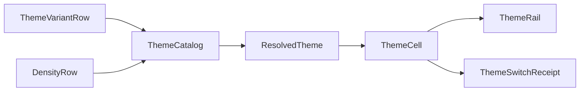

# [APPUI_THEME_TOKENS]

Rasm.AppUi resolves every visual constant through one frozen token catalogue: a role-keyed `TokenRow` family, orthogonal `ThemeVariantRow` and `DensityRow` smart-enum families composed by one pure resolve fold, host-agnostic appearance probing, and one atomic swap capsule that re-resolves the full catalogue, writes the resolved paints into the `Semi.Avalonia` token slots, and emits token-diff receipts. The page owns the token vocabulary, both row families, the resolve fold, and the control-theme rail that mounts the one `Application.Styles` chain `FluentTheme floor -> SemiTheme -> the per-control Semi skins -> UrsaSemiTheme`; the spine is Avalonia, Avalonia.Themes.Fluent, the `Semi.Avalonia` design-token theme suite, Thinktecture.Runtime.Extensions, LanguageExt.Core, and NodaTime.

## [01]-[INDEX]

- [01]-[TOKEN_CATALOG]: Role-keyed frozen token rows; one resolve fold, five consumers.
- [02]-[VARIANT_AXIS]: Four variant rows with host-agnostic probe folding.
- [03]-[DENSITY_AXIS]: Two density rows selecting metric columns orthogonally.
- [04]-[CONTROL_THEMES]: One Styles rail, atomic swap, token-diff receipts.

## [02]-[TOKEN_CATALOG]

- Owner: `TokenRow` `[Union]` role-keyed token family; `ThemeCatalog` frozen table and resolve fold; `ResolvedTheme` the one resolved artifact every consumer reads; `Colormap` `[SmartEnum<string>]` perceptually-uniform data-colormap catalog.
- Cases: Paint | Metric | Depth | Span | Rank — color, dimension, elevation, duration, and z-order roles in one closed family; `Colormap` = viridis | magma | cividis | turbo — the perceptual scientific-data ramps the heat, density, and analytical visuals sample.
- Entry: `public static ResolvedTheme Resolve(ThemeVariantRow variant, DensityRow density, Func<Color, Color, double, Color> mix)` — one pure fold; the `(variant, density)` signature is the orthogonality law; `public Color Sample(double t, Func<Color, Color, double, Color> mix)` — the one colormap sampler over the same OKLab mix.
- Auto: one resolve feeds five consumers — control resources, chart paints, SVG tint, icon foreground, editor highlights — from the same dictionaries; `Palette` projects the same paints into `ColorPaletteResources`, deleting per-consumer palette code; `Colormap.Sample` interpolates between the six anchor stops through the same OKLab `mix` so a heat ramp, a density gradient, or a geo heat-series ramp reads one perceptually-uniform scale, and `HeatMap` projects the sampled `Color` ramp through a caller-supplied `project` delegate so the geo and heat series receive the ramp without the catalogue transcribing the core color value — the `LiveChartsCore` color-value type the `project` delegate constructs resolves at implementation under the charts `GEO_PAYLOAD` research surface and binds at composition rather than as a fence member.
- Packages: Avalonia, Avalonia.Themes.Fluent, LiveChartsCore.SkiaSharpView.Avalonia, Thinktecture.Runtime.Extensions, LanguageExt.Core, NodaTime
- Growth: one token row reaches every consumer with zero new surface; a new role is one case on `TokenRow`; a new data-colormap is one `Colormap` row carrying its anchor stops; zero new surface.
- Boundary: `mix` is the perceptual OKLab interpolation consumed as a delegate value sourced once from the admitted `Wacton.Unicolour` kernel — the delegate builds `new Unicolour(ColourSpace.Rgb255, a.R, a.G, a.B)` and the `b` twin, calls the instance `a.Mix(b, ColourSpace.Oklab, amount)` (the catalogued `Unicolour.Mix(Unicolour other, ColourSpace, double amount, ...)`), and reads the result's `Rgb255` triplet back into an Avalonia `Color`, so the perceptual interpolation rides the one suite colour owner and the `mix` is never an RGB-channel lerp masquerading as OKLab; a second color-interpolation implementation beside it is the rejected form, and `Colormap.Sample` rides the same delegate so a hand-rolled RGB-lerped colormap or a hardcoded heat-gradient table is the deleted form; the perceptual ramps (`viridis`, `magma`, `cividis`) carry `Perceptual: true` so a contrast-sensitive data surface selects a lightness-monotone scale and `turbo` carries `Perceptual: false` as the rainbow row admitted only where category separation outranks lightness order; ramp keys derive as ordinal `key+rank` strings mixed toward the row's `Toward` anchor; `Span` rows publish static delays only — interactive easing and tween vocabulary stay outside the catalogue; `HostMatched` never reaches `Resolve` because `Concrete` folds it to a concrete row first.

```csharp signature
[Union(ConversionFromValue = ConversionOperatorsGeneration.None)]
public abstract partial record TokenRow {
    private TokenRow() { }

    public sealed record Paint(string Key, Color Light, Color Dark, Color HighContrast, string Toward) : TokenRow;
    public sealed record Metric(string Key, double Standard, double Compact) : TokenRow;
    public sealed record Depth(string Key, double OffsetY, double Blur, Color Light, Color Dark, Color HighContrast) : TokenRow;
    public sealed record Span(string Key, Duration Value) : TokenRow;
    public sealed record Rank(string Key, int Value) : TokenRow;
}

public sealed record ResolvedTheme(
    ThemeVariantRow Variant,
    DensityRow Density,
    FrozenDictionary<string, Color> Paints,
    FrozenDictionary<string, double> Metrics,
    FrozenDictionary<string, (double OffsetY, double Blur, Color Shadow)> Depths,
    FrozenDictionary<string, Duration> Spans,
    FrozenDictionary<string, int> Ranks,
    ColorPaletteResources Palette);

public static class ThemeCatalog {
    public const int RampSteps = 3;
    public const double RampSpan = 0.48;

    public static readonly Seq<TokenRow> Rows = [
        new TokenRow.Paint("accent", Color.FromUInt32(0xFF0F6CBD), Color.FromUInt32(0xFF479EF5), Color.FromUInt32(0xFFFFD700), "region"),
        new TokenRow.Paint("base", Color.FromUInt32(0xFF1B1A19), Color.FromUInt32(0xFFF3F2F1), Color.FromUInt32(0xFFFFFFFF), "region"),
        new TokenRow.Paint("region", Color.FromUInt32(0xFFFAF9F8), Color.FromUInt32(0xFF1B1A19), Color.FromUInt32(0xFF000000), "base"),
        new TokenRow.Paint("error", Color.FromUInt32(0xFFA4262C), Color.FromUInt32(0xFFF1707B), Color.FromUInt32(0xFFFF6B6B), "region"),
        new TokenRow.Metric("spacing-unit", 8d, 6d),
        new TokenRow.Metric("radius-control", 4d, 3d),
        new TokenRow.Metric("radius-overlay", 8d, 6d),
        new TokenRow.Metric("row-height", 36d, 28d),
        new TokenRow.Metric("hit-target", 32d, 24d),
        new TokenRow.Metric("inset-panel", 12d, 8d),
        new TokenRow.Depth("elevation-flyout", 4d, 16d, Color.FromUInt32(0x29000000), Color.FromUInt32(0x66000000), Color.FromUInt32(0x00000000)),
        new TokenRow.Depth("elevation-dialog", 8d, 32d, Color.FromUInt32(0x3D000000), Color.FromUInt32(0x80000000), Color.FromUInt32(0x00000000)),
        new TokenRow.Span("overlay-fade", Duration.FromMilliseconds(150)),
        new TokenRow.Rank("z-content", 0),
        new TokenRow.Rank("z-flyout", 1000),
        new TokenRow.Rank("z-dialog", 2000),
        new TokenRow.Rank("z-toast", 3000),
        new TokenRow.Rank("z-tooltip", 4000),
    ];

    public static ResolvedTheme Resolve(ThemeVariantRow variant, DensityRow density, Func<Color, Color, double, Color> mix) =>
        Sealed(variant, density, mix, Rows.Fold(
            (Anchors: HashMap<string, (Color Value, string Toward)>(), Metrics: HashMap<string, double>(), Depths: HashMap<string, (double OffsetY, double Blur, Color Shadow)>(), Spans: HashMap<string, Duration>(), Ranks: HashMap<string, int>()),
            (acc, row) => row.Switch(
                state: (Acc: acc, Variant: variant, Density: density),
                paint: static (s, p) => s.Acc with { Anchors = s.Acc.Anchors.Add(p.Key, (s.Variant.Pick(p.Light, p.Dark, p.HighContrast), p.Toward)) },
                metric: static (s, m) => s.Acc with { Metrics = s.Acc.Metrics.Add(m.Key, s.Density.Pick(m.Standard, m.Compact)) },
                depth: static (s, d) => s.Acc with { Depths = s.Acc.Depths.Add(d.Key, (d.OffsetY, d.Blur, s.Variant.Pick(d.Light, d.Dark, d.HighContrast))) },
                span: static (s, v) => s.Acc with { Spans = s.Acc.Spans.Add(v.Key, v.Value) },
                rank: static (s, r) => s.Acc with { Ranks = s.Acc.Ranks.Add(r.Key, r.Value) })));

    public static ResourceDictionary Resources(ResolvedTheme resolved) =>
        (Entries(resolved.Paints) + Entries(resolved.Metrics) + Entries(resolved.Depths) + Entries(resolved.Spans) + Entries(resolved.Ranks))
            .Fold(new ResourceDictionary(), static (acc, entry) => { acc.Add(entry.Key, entry.Value); return acc; });

    static ResolvedTheme Sealed(ThemeVariantRow variant, DensityRow density, Func<Color, Color, double, Color> mix, (HashMap<string, (Color Value, string Toward)> Anchors, HashMap<string, double> Metrics, HashMap<string, (double OffsetY, double Blur, Color Shadow)> Depths, HashMap<string, Duration> Spans, HashMap<string, int> Ranks) folded) {
        var paints = Frozen(toSeq(folded.Anchors).Bind(anchor => Ramp(anchor.Key, anchor.Value.Value, folded.Anchors[anchor.Value.Toward].Value, mix)));
        return new ResolvedTheme(variant, density, paints, Frozen(toSeq(folded.Metrics)), Frozen(toSeq(folded.Depths)), Frozen(toSeq(folded.Spans)), Frozen(toSeq(folded.Ranks)), Palette(paints));
    }

    static Seq<(string Key, Color Value)> Ramp(string key, Color anchor, Color toward, Func<Color, Color, double, Color> mix) =>
        Seq1((key, anchor)) + toSeq(Enumerable.Range(1, RampSteps)).Map(rank => ($"{key}+{rank}", mix(anchor, toward, RampSpan * rank / RampSteps)));

    static ColorPaletteResources Palette(FrozenDictionary<string, Color> paints) => new() {
        Accent = paints["accent"],
        BaseHigh = paints["base"],
        BaseMedium = paints["base+1"],
        BaseLow = paints["base+2"],
        AltHigh = paints["region"],
        AltMedium = paints["region+1"],
        ChromeHigh = paints["region+3"],
        ChromeMedium = paints["region+2"],
        ChromeLow = paints["region+1"],
        ErrorText = paints["error"],
        ListLow = paints["region+1"],
        RegionColor = paints["region"],
    };

    static Seq<(string Key, object Value)> Entries<T>(FrozenDictionary<string, T> bucket) where T : notnull =>
        toSeq(bucket).Map(static entry => (entry.Key, (object)entry.Value));

    static FrozenDictionary<string, T> Frozen<T>(IEnumerable<(string Key, T Value)> entries) =>
        entries.ToFrozenDictionary(static entry => entry.Key, static entry => entry.Value, StringComparer.Ordinal);
}
```

```csharp signature
[SmartEnum<string>]
[KeyMemberEqualityComparer<ComparerAccessors.StringOrdinal, string>]
[KeyMemberComparer<ComparerAccessors.StringOrdinal, string>]
public sealed partial class Colormap {
    public static readonly Colormap Viridis = new("viridis", perceptual: true, stops: Seq(
        Color.FromUInt32(0xFF440154), Color.FromUInt32(0xFF414487), Color.FromUInt32(0xFF2A788E),
        Color.FromUInt32(0xFF22A884), Color.FromUInt32(0xFF7AD151), Color.FromUInt32(0xFFFDE725)));
    public static readonly Colormap Magma = new("magma", perceptual: true, stops: Seq(
        Color.FromUInt32(0xFF000004), Color.FromUInt32(0xFF3B0F70), Color.FromUInt32(0xFF8C2981),
        Color.FromUInt32(0xFFDE4968), Color.FromUInt32(0xFFFE9F6D), Color.FromUInt32(0xFFFCFDBF)));
    public static readonly Colormap Cividis = new("cividis", perceptual: true, stops: Seq(
        Color.FromUInt32(0xFF00224E), Color.FromUInt32(0xFF35456C), Color.FromUInt32(0xFF666970),
        Color.FromUInt32(0xFF948E77), Color.FromUInt32(0xFFCBBA69), Color.FromUInt32(0xFFFEE838)));
    public static readonly Colormap Turbo = new("turbo", perceptual: false, stops: Seq(
        Color.FromUInt32(0xFF30123B), Color.FromUInt32(0xFF4145AB), Color.FromUInt32(0xFF26BCE1),
        Color.FromUInt32(0xFF7DFF56), Color.FromUInt32(0xFFFB8022), Color.FromUInt32(0xFF7A0403)));

    public bool Perceptual { get; }

    public Seq<Color> Stops { get; }

    public Color Sample(double t, Func<Color, Color, double, Color> mix) {
        double clamped = Math.Clamp(t, 0d, 1d);
        int segments = Stops.Count - 1;
        double scaled = clamped * segments;
        int lo = Math.Min((int)scaled, segments - 1);
        return mix(Stops[lo], Stops[lo + 1], scaled - lo);
    }

    public Seq<Color> Ramp(int steps, Func<Color, Color, double, Color> mix) =>
        steps <= 1
            ? Seq1(Sample(0d, mix))
            : toSeq(Enumerable.Range(0, steps)).Map(step => Sample((double)step / (steps - 1), mix));

    public T[] HeatMap<T>(int steps, Func<Color, Color, double, Color> mix, Func<Color, T> project) =>
        Ramp(steps, mix).Map(project).ToArray();
}
```

## [03]-[VARIANT_AXIS]

- Owner: `ComparerAccessors.StringOrdinal` accessor; `ThemeVariantRow` `[SmartEnum<string>]` binding the page vocabulary to the host variant key column and the `Semi.Avalonia` `ThemeVariant` slots.
- Cases: light, dark, high-contrast, host-matched, aquatic, desert, dusk, night-sky — high-contrast inherits the dark resource chain; host-matched is a probe fold, never a resolved row; the four brand rows carry the `Semi.Avalonia` named `ThemeVariant`s (`SemiTheme.Aquatic`/`Desert`/`Dusk`/`NightSky`), each deriving its light-or-dark base from the Semi variant so the OKLCH ramp populates its palette exactly as light/dark do.
- Entry: `public ThemeVariantRow Concrete(Func<Option<ThemeVariantRow>> probe)` — total fold; concrete rows return themselves and the absent-probe default is `Light`.
- Auto: host appearance flips ride the mount transaction's appearance-change facts into `Track`, so a host dark-mode change re-resolves and receipts with zero per-control handlers; each brand row's `Variant` is the `Semi.Avalonia`-shipped `ThemeVariant` so a brand swap selects the Semi palette base and the OKLCH ramp writes the brand paints over it, never a re-templated control set.
- Packages: Avalonia, Semi.Avalonia, Thinktecture.Runtime.Extensions, LanguageExt.Core
- Growth: a new brand theme is one `ThemeVariantRow` row carrying its `Semi.Avalonia` `ThemeVariant` and one `Paint` base, whose palette the Unicolour ramp populates — never a re-templated control set; zero new surface.
- Boundary: probes are host-agnostic delegate columns supplied at mount — the rhino probe lands as one registration row on the host-attach port reading `HostUtils.RunningInDarkMode` with change flips riding `Rhino.UI.ThemeSettings.ThemeChanged` host-side, gh2 rows ride the same host probe, empty-host standalone rows read `IPlatformSettings.GetColorValues()` whose `PlatformColorValues` carries `ThemeVariant` and `ContrastPreference` with re-probe on `ColorValuesChanged`, and the browser probe stays a designed-only column on the web-browser growth case with zero authored interop; the per-surface override is the `SurfaceOverride` delegate column on the swap capsule, so a panel tracks its host while a sidecar stays user-chosen.

```csharp signature

[SmartEnum<string>]
[KeyMemberEqualityComparer<ComparerAccessors.StringOrdinal, string>]
[KeyMemberComparer<ComparerAccessors.StringOrdinal, string>]
public sealed partial class ThemeVariantRow {
    public static readonly ThemeVariantRow Light = new("light", ThemeVariant.Light, dark: false);
    public static readonly ThemeVariantRow Dark = new("dark", ThemeVariant.Dark, dark: true);
    public static readonly ThemeVariantRow HighContrast = new("high-contrast", new ThemeVariant("high-contrast", ThemeVariant.Dark), dark: true);
    public static readonly ThemeVariantRow HostMatched = new("host-matched", ThemeVariant.Default, dark: false);
    public static readonly ThemeVariantRow Aquatic = new("aquatic", SemiTheme.Aquatic, dark: true);
    public static readonly ThemeVariantRow Desert = new("desert", SemiTheme.Desert, dark: false);
    public static readonly ThemeVariantRow Dusk = new("dusk", SemiTheme.Dusk, dark: true);
    public static readonly ThemeVariantRow NightSky = new("night-sky", SemiTheme.NightSky, dark: true);

    public ThemeVariant Variant { get; }

    public bool Dark { get; }

    public ThemeVariantRow Concrete(Func<Option<ThemeVariantRow>> probe) => Switch(
        state: probe,
        light: static _ => Light,
        dark: static _ => Dark,
        highContrast: static _ => HighContrast,
        hostMatched: static p => p().IfNone(Light),
        aquatic: static _ => Aquatic,
        desert: static _ => Desert,
        dusk: static _ => Dusk,
        nightSky: static _ => NightSky);

    public Color Pick(Color light, Color dark, Color highContrast) => Switch(
        state: (light, dark, highContrast),
        light: static s => s.light,
        dark: static s => s.dark,
        highContrast: static s => s.highContrast,
        hostMatched: static s => s.light,
        aquatic: static s => s.dark,
        desert: static s => s.light,
        dusk: static s => s.dark,
        nightSky: static s => s.dark);
}
```

| [INDEX] | [SURFACE_ROWS]            | [PROBE_SOURCE]                                      | [ROUTE_STATE] |
| :-----: | :------------------------ | :-------------------------------------------------- | :------------ |
|  [01]   | rhino-panel, rhino-modal  | `RunningInDarkMode` read, `ThemeChanged` flips      | settled       |
|  [02]   | gh2-companion             | same host appearance row as rhino                   | settled       |
|  [03]   | avalonia-desktop, sidecar | `GetColorValues()` read, `ColorValuesChanged` flips | settled       |
|  [04]   | web-browser               | designed-only column, zero interop                  | designed-only |
|  [05]   | headless                  | probe absent, `Light` default                       | settled       |

## [04]-[DENSITY_AXIS]

- Owner: `DensityRow` `[SmartEnum<string>]` two rows binding `DensityStyle` and selecting `Metric` columns.
- Cases: default, compact.
- Entry: `public double Pick(double standard, double compact)` — the metric column selector.
- Auto: row-height, spacing, radius, hit-target, and inset values land in resolved `Metrics` for tables, inspector, and shell chrome from one selection — per-surface spacing systems are deleted.
- Packages: Avalonia.Themes.Fluent, Thinktecture.Runtime.Extensions
- Growth: one density row plus one column on every `Metric` row; zero new surface.
- Boundary: density is orthogonal to variant and composes only inside `Resolve`; the Fluent compact resource swap rides the `Style` column on the one rail, never a parallel compact stylesheet.

```csharp signature
[SmartEnum<string>]
[KeyMemberEqualityComparer<ComparerAccessors.StringOrdinal, string>]
[KeyMemberComparer<ComparerAccessors.StringOrdinal, string>]
public sealed partial class DensityRow {
    public static readonly DensityRow Default = new("default", DensityStyle.Normal);
    public static readonly DensityRow Compact = new("compact", DensityStyle.Compact);

    public DensityStyle Style { get; }

    public double Pick(double standard, double compact) => Switch(
        state: (standard, compact),
        @default: static s => s.standard,
        compact: static s => s.compact);
}
```

## [05]-[CONTROL_THEMES]

- Owner: `ThemeCell` atomic swap capsule; `ThemeSwitchReceipt` token-diff receipt; `ThemeRail` the one Styles admission boundary mounting the Semi chain.
- Cases: trigger values boot | user-switch | host-probe as receipt constants.
- Entry: `public IO<ThemeSwitchReceipt> Swap(ThemeVariantRow variant, DensityRow density, Func<Option<ThemeVariantRow>> probe, string trigger, CorrelationId correlation)` — one swap re-resolves the full catalogue.
- Auto: every swap emits one receipt carrying changed keys; the swap sinks the receipt through `ReceiptSinkPort` as a `Surface`-family appearance fact, so theme transitions ride the one evidence envelope stream the dashboards ingest and the accessibility gate consumes `ContrastCandidates` from the same resolve — deleting per-control theme refresh handlers; `Admit` builds the single `Application.Styles` chain `FluentTheme floor -> SemiTheme -> the per-control Semi skins -> UrsaSemiTheme` once at boot, and `ApplyTo` overrides the `ThemeVariant`-scoped Semi palette slots from the resolve, so a swap re-skins the whole admitted roster through one token system, never a re-templated control tree.
- Receipt: `ThemeSwitchReceipt` — variant, density, trigger, changed keys, `Instant`, correlation id; the reload-receipt shape on a separate stream, sealed once through the sink port at composition.
- Packages: Avalonia, Avalonia.Themes.Fluent, Semi.Avalonia, Rasm.AppHost (project), LanguageExt.Core, NodaTime
- Growth: one control-theme row, one contrast-candidate row, or one trigger constant; zero new surface.
- Boundary: `ThemeRail` is the boundary capsule and its fence carries the language-owned statement forms — `Mount` and `ApplyTo` write retained application state; the one `Application.Styles` chain is ordered `FluentTheme` floor -> `<semi:SemiTheme/>` -> the per-control `Semi.Avalonia.*` skins (`DataGrid`/`ColorPicker`/`Dock`/`AvaloniaEdit`) -> `<semi:UrsaSemiTheme/>` (the `Shell/controls` Ursa-suite bridge), every skin strictly below `SemiTheme` so its tokens resolve, and loading a skin without `SemiTheme` is the rejected form; the resolved token dictionary occupies merged-dictionary index zero so a swap is one indexer write, marshaled through the UI scheduler port by the caller; the OKLCH ramp writes the `Semi.Avalonia` `Tokens.Palette` slots — a derived or brand variant overrides the `ThemeVariant`-scoped palette resources, never a re-templated control set, so a hand-authored second token dictionary beside the Semi slots is the deleted form; the `Sink` delegate binds `ReceiptSinkPort.Send` at composition so the swap carries zero telemetry wiring and a second receipt stamp on the swap is the deleted form; selector styles and `ControlTheme` rows enter only through this rail and pseudo-class states bind token keys, never literal paints; the `Apply` delegate re-themes every retained surface tree including the docked panels from the one resolve so a variant swap re-paints docks through the shell dock-theme owner bound at composition rather than a parallel dock-theme handler; OS dark/light follow rides `ApplicationExtension.RegisterFollowSystemTheme(this Application)` bound at composition where the host exposes `PlatformColorValues`, so a per-control OS-appearance handler is the deleted form; the Fluent-templated `bodong.PropertyGrid`/`DialogHost` intentionally keep the Fluent base and are never displaced by the Semi skins; the contrast ratio law lives with the accessibility gate — candidate pairs only here; `Defaults` reads the resolved profile so per-process boot variants are row values, not boot code.

```csharp signature
public sealed record ThemeSwitchReceipt(
    ThemeVariantRow Variant,
    DensityRow Density,
    string Trigger,
    Seq<string> ChangedKeys,
    Instant At,
    CorrelationId CorrelationId) {
    public const string BootTrigger = "boot";
    public const string UserTrigger = "user-switch";
    public const string ProbeTrigger = "host-probe";
}

public sealed record ThemeCell(
    Atom<ResolvedTheme> Current,
    Func<SurfaceHost, Option<ThemeVariantRow>> SurfaceOverride,
    Func<ResolvedTheme, IO<Unit>> Apply,
    Func<ThemeSwitchReceipt, IO<Unit>> Sink,
    Func<Color, Color, double, Color> Mix,
    ClockPolicy Clocks) {

    public static (ThemeVariantRow Variant, DensityRow Density) Defaults(ResolvedProfile resolved) =>
        resolved.Profile.Switch(
            state: unit,
            rhinoPlugin: static _ => (ThemeVariantRow.HostMatched, DensityRow.Compact),
            gh2Plugin: static _ => (ThemeVariantRow.HostMatched, DensityRow.Compact),
            standaloneDesktop: static _ => (ThemeVariantRow.HostMatched, DensityRow.Default),
            companionProcess: static _ => (ThemeVariantRow.HostMatched, DensityRow.Default),
            sidecar: static _ => (ThemeVariantRow.Dark, DensityRow.Compact),
            headlessService: static _ => (ThemeVariantRow.Light, DensityRow.Default),
            webService: static _ => (ThemeVariantRow.Light, DensityRow.Default),
            testHost: static _ => (ThemeVariantRow.Light, DensityRow.Default));

    public IO<ThemeSwitchReceipt> Swap(ThemeVariantRow variant, DensityRow density, Func<Option<ThemeVariantRow>> probe, string trigger, CorrelationId correlation) =>
        IO.lift(() => (Previous: Current.Value, Next: Current.Swap(_ => ThemeCatalog.Resolve(variant.Concrete(probe), density, Mix))))
            .Bind(step => Apply(step.Next).Map(_ => new ThemeSwitchReceipt(
                step.Next.Variant, step.Next.Density, trigger, Diff(step.Previous, step.Next), Clocks.Now, correlation)))
            .Bind(receipt => Sink(receipt).Map(_ => receipt));

    public ResolvedTheme For(SurfaceHost surface, Func<Option<ThemeVariantRow>> probe) =>
        SurfaceOverride(surface)
            .Map(row => ThemeCatalog.Resolve(row.Concrete(probe), Current.Value.Density, Mix))
            .IfNone(() => Current.Value);

    public IDisposable Track(Func<Action, IDisposable> appearanceChanged, Func<Option<ThemeVariantRow>> probe, CorrelationId correlation, Action<ThemeSwitchReceipt> sink) =>
        appearanceChanged(() => sink(Swap(ThemeVariantRow.HostMatched, Current.Value.Density, probe, ThemeSwitchReceipt.ProbeTrigger, correlation).Run()));

    static Seq<string> Changed<T>(FrozenDictionary<string, T> previous, FrozenDictionary<string, T> next) =>
        toSeq(next).Filter(entry => !EqualityComparer<T>.Default.Equals(previous[entry.Key], entry.Value)).Map(static entry => entry.Key);

    static Seq<string> Diff(ResolvedTheme previous, ResolvedTheme next) =>
        Changed(previous.Paints, next.Paints) + Changed(previous.Metrics, next.Metrics)
            + Changed(previous.Depths, next.Depths) + Changed(previous.Spans, next.Spans) + Changed(previous.Ranks, next.Ranks);
}

public static class ThemeRail {
    public static readonly Seq<(string Foreground, string Background, string RatioClass)> ContrastCandidates = [
        ("base", "region", "body-text"),
        ("base+1", "region", "body-text"),
        ("accent", "region", "non-text"),
        ("error", "region", "body-text"),
        ("region", "accent", "on-accent"),
    ];

    public static FluentTheme Floor(Func<Color, Color, double, Color> mix) => new() {
        Palettes = {
            [ThemeVariant.Light] = ThemeCatalog.Resolve(ThemeVariantRow.Light, DensityRow.Default, mix).Palette,
            [ThemeVariant.Dark] = ThemeCatalog.Resolve(ThemeVariantRow.Dark, DensityRow.Default, mix).Palette,
        },
    };

    public static Seq<IStyle> Admit(FluentTheme floor) => [
        floor,
        new SemiTheme(),
        new Semi.Avalonia.DataGrid.DataGridSemiTheme(),
        new Semi.Avalonia.ColorPicker.ColorPickerSemiTheme(),
        new Semi.Avalonia.Dock.DockSemiTheme(),
        new Semi.Avalonia.AvaloniaEdit.AvaloniaEditSemiTheme(),
        new Ursa.Themes.Semi.UrsaSemiTheme(),
    ];

    public static IO<Unit> Mount(Application application, Seq<IStyle> chain, FluentTheme floor, ResolvedTheme resolved) =>
        IO.lift(() => {
            chain.Iter(application.Styles.Add);
            application.Resources.MergedDictionaries.Add(ThemeCatalog.Resources(resolved));
            application.RequestedThemeVariant = resolved.Variant.Variant;
            floor.DensityStyle = resolved.Density.Style;
            return unit;
        });

    public static Func<ResolvedTheme, IO<Unit>> ApplyTo(Application application, FluentTheme floor) =>
        resolved => IO.lift(() => {
            floor.DensityStyle = resolved.Density.Style;
            application.RequestedThemeVariant = resolved.Variant.Variant;
            application.Resources.MergedDictionaries[0] = ThemeCatalog.Resources(resolved);
            return unit;
        });
}
```

| [INDEX] | [CONTROL_THEME_ROW] | [PSEUDO_CLASSES]                  | [TOKEN_KEYS]                                         |
| :-----: | :------------------ | :-------------------------------- | :--------------------------------------------------- |
|  [01]   | command button      | :pointerover, :pressed, :disabled | accent, accent+1, accent+2, radius-control           |
|  [02]   | text entry          | :focus, :error                    | region, base, error, accent, radius-control          |
|  [03]   | grid row            | :selected, :pointerover           | region+1, region+2, row-height                       |
|  [04]   | tab strip item      | :selected                         | accent, base+1, spacing-unit                         |
|  [05]   | flyout host         | :open                             | region+1, radius-overlay, elevation-flyout, z-flyout |
|  [06]   | dialog host         | :open                             | region, radius-overlay, elevation-dialog, z-dialog   |
|  [07]   | toast card          | :open                             | region+1, elevation-flyout, z-toast                  |
|  [08]   | tooltip             | :open                             | region+2, z-tooltip                                  |



