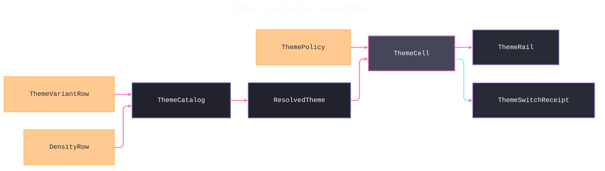

# [APPUI_THEME_TOKENS]

Rasm.AppUi resolves every visual constant through one frozen token catalogue: a role-keyed `TokenRow` family, orthogonal `ThemeVariantRow` and `DensityRow` smart-enum families composed by one pure resolve fold, host-agnostic appearance probing, and one apply-then-publish swap capsule that re-resolves the full catalogue, writes the resolved paints into the `Semi.Avalonia` token slots, emits token-diff receipts, and reloads from the persisted `ThemePolicy` section. The page owns the token vocabulary, both row families, the resolve fold, and the control-theme rail that mounts the one `Application.Styles` chain `FluentTheme floor -> SemiTheme -> the per-control Semi skins -> UrsaSemiTheme`; the spine is Avalonia, Avalonia.Themes.Fluent, the `Semi.Avalonia` design-token theme suite, Thinktecture.Runtime.Extensions, LanguageExt.Core, and NodaTime.

## [01]-[INDEX]

- [01]-[TOKEN_CATALOG]: Role-keyed frozen token rows; one resolve fold with probe admission and accent re-seed.
- [02]-[VARIANT_AXIS]: Variant rows with host-agnostic probe folding.
- [03]-[DENSITY_AXIS]: Two density rows selecting metric columns orthogonally.
- [04]-[CONTROL_THEMES]: One Styles rail, apply-then-publish swap, theme policy reload, token-diff receipts.
- [05]-[RESEARCH]: Semi slot-key spellings pending verification.

## [02]-[TOKEN_CATALOG]

- Owner: `TokenRow` `[Union]` role-keyed token family; `ThemeCatalog` frozen table and resolve fold; `ResolvedTheme` the one resolved artifact every consumer reads; `Colormap` `[SmartEnum<string>]` perceptually-uniform data-colormap catalog.
- Cases: Paint | Metric | Depth | Span | Rank — color, dimension, elevation, duration, and z-order roles in one closed family; the paint table carries accent, neutral, error, success, warning, information, selection, disabled, and scrim semantics across light, dark, and high-contrast columns. `Colormap` spans sequential, diverging, rainbow, cyclic, and qualitative classes through `Viridis`, `Magma`, `Cividis`, `Turbo`, `Coolwarm`, `Twilight`, and `Tableau` seed rows.
- Entry: `public static ResolvedTheme Resolve(ThemeVariantRow variant, DensityRow density, Func<Option<ThemeVariantRow>> probe, Option<Color> accent)` — one pure fold whose first step is the `Concrete` probe admission, so an unresolved host-matched sentinel structurally cannot reach the row fold; the `(variant, density)` pair is the orthogonality law and a present `accent` re-seeds only the `AccentKey` anchor before the ramp; `public Fin<Color> Sample(double t)` is the one colormap sampler, while `Ramp` and `HeatMap` reject invalid sample coordinates and non-positive counts on the same rail.
- Auto: one resolve feeds control resources, chart paints, SVG tint, icon foreground, editor highlights, status semantics, selection, and overlay scrims from the same dictionaries. `ThemeCatalog.Palette` composes the catalogued `Unicolour.Palette` generator for token ramps, `Colormap.Sample` composes the same internalized OKLab `Mix`, and `HeatMap` projects the sampled `Color` values through one caller-supplied product constructor without reproducing color arithmetic.
- Packages: Avalonia, Avalonia.Themes.Fluent, LiveChartsCore.SkiaSharpView.Avalonia, Thinktecture.Runtime.Extensions, LanguageExt.Core, NodaTime
- Growth: one token row reaches every consumer with zero new surface; a new role is one case on `TokenRow`; a new data-colormap is one `Colormap` row carrying its `ColormapClass` and anchor stops; zero new surface.
- Boundary: `ThemeCatalog` internalizes `Wacton.Unicolour`; no interpolation delegate remains reconstructible from the admitted package. `Mix` converts Avalonia channels once, interpolates in `ColourSpace.Oklab`, applies `MapToRgbGamut()`, and projects the mapped `Rgb255` and alpha channels back once, while `Palette` generates the token ramp through the package's hue-aware sequence owner. Sequential rows preserve lightness order, diverging rows center a neutral pivot, cyclic rows close their endpoints for angular domains, qualitative rows select discrete categories, and rainbow rows remain restricted to cases where category separation outranks magnitude reading. `HostMatched` admits only a concrete probe result and defaults to `Light`; `ResolvedTheme.Accent` retains personalization through surface overrides and host changes; `Diff` compares the union of predecessor and successor keys so deletion is observable; and CVD preview transforms paint and depth-shadow colors together.

```csharp signature
[Union(ConversionFromValue = ConversionOperatorsGeneration.None)]
public abstract partial record TokenRow {
    private TokenRow() { }

    public sealed record Paint(string Key, Color Light, Color Dark, Color HighContrast, string Toward) : TokenRow;
    public sealed record Metric(string Key, double Standard, double Compact) : TokenRow;
    public sealed record Depth(string Key, double OffsetY, double Blur, Color Light, Color Dark, Color HighContrast) : TokenRow;
    public sealed record Span(string Key, Duration Value) : TokenRow;
    public sealed record Rank(string Key, int Value) : TokenRow;
}

public sealed record ResolvedTheme(
    ThemeVariantRow Variant,
    DensityRow Density,
    Option<Color> Accent,
    FrozenDictionary<string, Color> Paints,
    FrozenDictionary<string, double> Metrics,
    FrozenDictionary<string, (double OffsetY, double Blur, Color Shadow)> Depths,
    FrozenDictionary<string, Duration> Spans,
    FrozenDictionary<string, int> Ranks,
    ColorPaletteResources Palette);

public static class ThemeCatalog {
    public const string AccentKey = "accent";
    public const int RampSteps = 3;
    public const double RampSpan = 0.48;

    public static readonly Seq<TokenRow> Rows = [
        new TokenRow.Paint(AccentKey, Color.FromUInt32(0xFF0F6CBD), Color.FromUInt32(0xFF479EF5), Color.FromUInt32(0xFFFFD700), "region"),
        new TokenRow.Paint("base", Color.FromUInt32(0xFF1B1A19), Color.FromUInt32(0xFFF3F2F1), Color.FromUInt32(0xFFFFFFFF), "region"),
        new TokenRow.Paint("region", Color.FromUInt32(0xFFFAF9F8), Color.FromUInt32(0xFF1B1A19), Color.FromUInt32(0xFF000000), "base"),
        new TokenRow.Paint("error", Color.FromUInt32(0xFFA4262C), Color.FromUInt32(0xFFF1707B), Color.FromUInt32(0xFFFF6B6B), "region"),
        new TokenRow.Paint("success", Color.FromUInt32(0xFF107C10), Color.FromUInt32(0xFF54B054), Color.FromUInt32(0xFF00FF66), "region"),
        new TokenRow.Paint("warning", Color.FromUInt32(0xFF8A4F00), Color.FromUInt32(0xFFFFB900), Color.FromUInt32(0xFFFFFF00), "region"),
        new TokenRow.Paint("info", Color.FromUInt32(0xFF005A9E), Color.FromUInt32(0xFF6CB8F6), Color.FromUInt32(0xFF00FFFF), "region"),
        new TokenRow.Paint("selection", Color.FromUInt32(0xFF0078D4), Color.FromUInt32(0xFF60CDFF), Color.FromUInt32(0xFFFFFF00), "region"),
        new TokenRow.Paint("disabled", Color.FromUInt32(0xFF8A8886), Color.FromUInt32(0xFFA19F9D), Color.FromUInt32(0xFFB3B3B3), "region"),
        new TokenRow.Paint("scrim", Color.FromUInt32(0x99000000), Color.FromUInt32(0xB3000000), Color.FromUInt32(0xCC000000), "region"),
        new TokenRow.Metric("spacing-unit", 8d, 6d),
        new TokenRow.Metric("radius-control", 4d, 3d),
        new TokenRow.Metric("radius-overlay", 8d, 6d),
        new TokenRow.Metric("row-height", 36d, 28d),
        new TokenRow.Metric("hit-target", 32d, 24d),
        new TokenRow.Metric("inset-panel", 12d, 8d),
        new TokenRow.Depth("elevation-flyout", 4d, 16d, Color.FromUInt32(0x29000000), Color.FromUInt32(0x66000000), Color.FromUInt32(0x00000000)),
        new TokenRow.Depth("elevation-dialog", 8d, 32d, Color.FromUInt32(0x3D000000), Color.FromUInt32(0x80000000), Color.FromUInt32(0x00000000)),
        new TokenRow.Span("overlay-fade", Duration.FromMilliseconds(150)),
        new TokenRow.Rank("z-content", 0),
        new TokenRow.Rank("z-flyout", 1000),
        new TokenRow.Rank("z-dialog", 2000),
        new TokenRow.Rank("z-toast", 3000),
        new TokenRow.Rank("z-tooltip", 4000),
    ];

    public static ResolvedTheme Resolve(ThemeVariantRow variant, DensityRow density, Func<Option<ThemeVariantRow>> probe, Option<Color> accent) =>
        ResolveConcrete(variant.Concrete(probe), density, accent);

    static ResolvedTheme ResolveConcrete(ThemeVariantRow concrete, DensityRow density, Option<Color> accent) =>
        Sealed(concrete, density, accent, Rows.Fold(
                (Anchors: HashMap<string, (Color Value, string Toward)>(), Metrics: HashMap<string, double>(), Depths: HashMap<string, (double OffsetY, double Blur, Color Shadow)>(), Spans: HashMap<string, Duration>(), Ranks: HashMap<string, int>()),
                (acc, row) => row.Switch(
                    state: (Acc: acc, Variant: concrete, Density: density, Accent: accent),
                    paint: static (s, p) => s.Acc with {
                        Anchors = s.Acc.Anchors.Add(p.Key, (
                            p.Key == AccentKey ? s.Accent.IfNone(() => s.Variant.Pick(p.Light, p.Dark, p.HighContrast)) : s.Variant.Pick(p.Light, p.Dark, p.HighContrast),
                            p.Toward)),
                    },
                    metric: static (s, m) => s.Acc with { Metrics = s.Acc.Metrics.Add(m.Key, s.Density.Pick(m.Standard, m.Compact)) },
                    depth: static (s, d) => s.Acc with { Depths = s.Acc.Depths.Add(d.Key, (d.OffsetY, d.Blur, s.Variant.Pick(d.Light, d.Dark, d.HighContrast))) },
                    span: static (s, v) => s.Acc with { Spans = s.Acc.Spans.Add(v.Key, v.Value) },
                    rank: static (s, r) => s.Acc with { Ranks = s.Acc.Ranks.Add(r.Key, r.Value) })));

    public static ResolvedTheme Simulated(ResolvedTheme resolved, Func<Color, Color> lens) =>
        (Frozen(toSeq(resolved.Paints).Map(entry => (entry.Key, lens(entry.Value)))),
         Frozen(toSeq(resolved.Depths).Map(entry => (entry.Key, (entry.Value.OffsetY, entry.Value.Blur, lens(entry.Value.Shadow)))))) switch {
            (FrozenDictionary<string, Color> paints, FrozenDictionary<string, (double OffsetY, double Blur, Color Shadow)> depths) =>
                resolved with { Paints = paints, Depths = depths, Palette = Palette(paints) },
        };

    // The Semi slot correspondence table: catalogue keys re-emit under their Semi resource slots — paint
    // rows onto the Tokens.Palette color slots, metric rows onto the Tokens.Variables dimension slots,
    // span rows onto the SemiPopupAnimations duration slots. Each verified spelling lands as one row here
    // (SEMI_SLOT_KEYS); a key without a slot row stays a catalogue-key resource, so the fold is total.
    public static readonly FrozenDictionary<string, string> SemiSlots = FrozenDictionary<string, string>.Empty;

    public static ResourceDictionary Resources(ResolvedTheme resolved) =>
        (Entries(resolved.Paints) + Entries(resolved.Metrics) + Entries(resolved.Depths) + Entries(resolved.Spans) + Entries(resolved.Ranks))
            .Fold(new ResourceDictionary(), static (acc, entry) => {
                acc.Add(entry.Key, entry.Value);
                if (SemiSlots.TryGetValue(entry.Key, out string? slot)) { acc.Add(slot, entry.Value); }
                return acc;
            });

    static ResolvedTheme Sealed(ThemeVariantRow variant, DensityRow density, Option<Color> accent, (HashMap<string, (Color Value, string Toward)> Anchors, HashMap<string, double> Metrics, HashMap<string, (double OffsetY, double Blur, Color Shadow)> Depths, HashMap<string, Duration> Spans, HashMap<string, int> Ranks) folded) {
        FrozenDictionary<string, Color> paints = Frozen(toSeq(folded.Anchors).Bind(anchor => Ramp(anchor.Key, anchor.Value.Value, folded.Anchors[anchor.Value.Toward].Value)));
        return new ResolvedTheme(variant, density, accent, paints, Frozen(toSeq(folded.Metrics)), Frozen(toSeq(folded.Depths)), Frozen(toSeq(folded.Spans)), Frozen(toSeq(folded.Ranks)), Palette(paints));
    }

    static Seq<(string Key, Color Value)> Ramp(string key, Color anchor, Color toward) =>
        Seq((key, anchor)) + Palette(anchor, Mix(anchor, toward, RampSpan), RampSteps + 1).Tail.Map((color, rank) => ($"{key}+{rank + 1}", color));

    public static Color Mix(Color left, Color right, double amount) =>
        Avalonia(ToUnicolour(left).Mix(ToUnicolour(right), ColourSpace.Oklab, amount).MapToRgbGamut());

    public static Seq<Color> Palette(Color left, Color right, int count) =>
        toSeq(ToUnicolour(left).Palette(ToUnicolour(right), ColourSpace.Oklab, count)).Map(Avalonia);

    static Wacton.Unicolour.Unicolour ToUnicolour(Color value) =>
        new(ColourSpace.Rgb255, value.R, value.G, value.B, value.A / 255d);

    static Color Avalonia(Wacton.Unicolour.Unicolour value) =>
        Color.FromArgb((byte)Math.Round(value.Alpha.A * 255d), (byte)Math.Round(value.Rgb255.R), (byte)Math.Round(value.Rgb255.G), (byte)Math.Round(value.Rgb255.B));

    static ColorPaletteResources Palette(FrozenDictionary<string, Color> paints) => new() {
        Accent = paints[AccentKey],
        BaseHigh = paints["base"],
        BaseMedium = paints["base+1"],
        BaseLow = paints["base+2"],
        AltHigh = paints["region"],
        AltMedium = paints["region+1"],
        ChromeHigh = paints["region+3"],
        ChromeMedium = paints["region+2"],
        ChromeLow = paints["region+1"],
        ErrorText = paints["error"],
        ListLow = paints["region+1"],
        RegionColor = paints["region"],
    };

    static Seq<(string Key, object Value)> Entries<T>(FrozenDictionary<string, T> bucket) where T : notnull =>
        toSeq(bucket).Map(static entry => (entry.Key, (object)entry.Value));

    static FrozenDictionary<string, T> Frozen<T>(IEnumerable<(string Key, T Value)> entries) =>
        entries.ToFrozenDictionary(static entry => entry.Key, static entry => entry.Value, StringComparer.Ordinal);
}
```

```csharp signature
[SmartEnum]
public sealed partial class ColormapClass {
    public static readonly ColormapClass Sequential = new(lightnessMonotone: true, centered: false, discrete: false);
    public static readonly ColormapClass Diverging = new(lightnessMonotone: false, centered: true, discrete: false);
    public static readonly ColormapClass Rainbow = new(lightnessMonotone: false, centered: false, discrete: false);
    public static readonly ColormapClass Cyclic = new(lightnessMonotone: false, centered: true, discrete: false);
    public static readonly ColormapClass Qualitative = new(lightnessMonotone: false, centered: false, discrete: true);

    public bool LightnessMonotone { get; }

    public bool Centered { get; }

    public bool Discrete { get; }
}

[SmartEnum<string>]
[KeyMemberEqualityComparer<ComparerAccessors.StringOrdinal, string>]
[KeyMemberComparer<ComparerAccessors.StringOrdinal, string>]
public sealed partial class Colormap {
    public static readonly Colormap Viridis = new("viridis", ColormapClass.Sequential, stops: Seq(
        Color.FromUInt32(0xFF440154), Color.FromUInt32(0xFF414487), Color.FromUInt32(0xFF2A788E),
        Color.FromUInt32(0xFF22A884), Color.FromUInt32(0xFF7AD151), Color.FromUInt32(0xFFFDE725)));
    public static readonly Colormap Magma = new("magma", ColormapClass.Sequential, stops: Seq(
        Color.FromUInt32(0xFF000004), Color.FromUInt32(0xFF3B0F70), Color.FromUInt32(0xFF8C2981),
        Color.FromUInt32(0xFFDE4968), Color.FromUInt32(0xFFFE9F6D), Color.FromUInt32(0xFFFCFDBF)));
    public static readonly Colormap Cividis = new("cividis", ColormapClass.Sequential, stops: Seq(
        Color.FromUInt32(0xFF00224E), Color.FromUInt32(0xFF35456C), Color.FromUInt32(0xFF666970),
        Color.FromUInt32(0xFF948E77), Color.FromUInt32(0xFFCBBA69), Color.FromUInt32(0xFFFEE838)));
    public static readonly Colormap Turbo = new("turbo", ColormapClass.Rainbow, stops: Seq(
        Color.FromUInt32(0xFF30123B), Color.FromUInt32(0xFF4145AB), Color.FromUInt32(0xFF26BCE1),
        Color.FromUInt32(0xFF7DFF56), Color.FromUInt32(0xFFFB8022), Color.FromUInt32(0xFF7A0403)));
    public static readonly Colormap Coolwarm = new("coolwarm", ColormapClass.Diverging, stops: Seq(
        Color.FromUInt32(0xFF3B4CC0), Color.FromUInt32(0xFF9ABBFF), Color.FromUInt32(0xFFDDDDDD),
        Color.FromUInt32(0xFFF49A7B), Color.FromUInt32(0xFFB40426)));
    public static readonly Colormap Twilight = new("twilight", ColormapClass.Cyclic, stops: Seq(
        Color.FromUInt32(0xFFE2D9E2), Color.FromUInt32(0xFF6276BA), Color.FromUInt32(0xFF2F1436),
        Color.FromUInt32(0xFFAF4B70), Color.FromUInt32(0xFFE2D9E2)));
    public static readonly Colormap Tableau = new("tableau", ColormapClass.Qualitative, stops: Seq(
        Color.FromUInt32(0xFF4E79A7), Color.FromUInt32(0xFFF28E2B), Color.FromUInt32(0xFFE15759),
        Color.FromUInt32(0xFF76B7B2), Color.FromUInt32(0xFF59A14F), Color.FromUInt32(0xFFEDC948),
        Color.FromUInt32(0xFFB07AA1), Color.FromUInt32(0xFFFF9DA7), Color.FromUInt32(0xFF9C755F), Color.FromUInt32(0xFFBAB0AC)));

    public ColormapClass Class { get; }

    public Seq<Color> Stops { get; }

    public Fin<Color> Sample(double t) => double.IsFinite(t)
        ? Fin.Succ(SampleAdmitted(Math.Clamp(t, 0d, 1d)))
        : Fin.Fail<Color>(new ThemeFault.PaletteRejected($"sample {t}"));

    private Color SampleAdmitted(double t) =>
        (Clamped: t, Segments: Stops.Count - 1) switch {
            var (clamped, _) when Class.Discrete => Stops[Math.Min((int)(clamped * Stops.Count), Stops.Count - 1)],
            var (clamped, segments) => (Scaled: clamped * segments, Segments: segments) switch {
                var (scaled, segments) => Math.Min((int)scaled, segments - 1) switch {
                    var lo => ThemeCatalog.Mix(Stops[lo], Stops[lo + 1], scaled - lo),
                },
            },
        };

    public Fin<Seq<Color>> Ramp(int steps) =>
        steps > 0
            ? (steps == 1
                ? Sample(0d).Map(static color => Seq(color))
                : toSeq(Enumerable.Range(0, steps))
                    .TraverseM(step => Sample((double)step / (steps - 1)))
                    .As()
                    .Map(static colors => colors.ToSeq()))
            : Fin.Fail<Seq<Color>>(new ThemeFault.PaletteRejected($"steps {steps}"));

    public Fin<T[]> HeatMap<T>(int steps, Func<Color, T> project) =>
        Ramp(steps).Map(colors => colors.Map(project).ToArray());
}
```

## [03]-[VARIANT_AXIS]

- Owner: `ComparerAccessors.StringOrdinal` accessor; `ThemeVariantRow` `[SmartEnum<string>]` binding the page vocabulary to the host variant key column and the `Semi.Avalonia` `ThemeVariant` slots.
- Cases: light, dark, high-contrast, host-matched, aquatic, desert, dusk, night-sky — high-contrast inherits the dark resource chain; host-matched is a probe fold, never a resolved row; the four brand rows carry the `Semi.Avalonia` named `ThemeVariant`s (`SemiTheme.Aquatic`/`Desert`/`Dusk`/`NightSky`), each deriving its light-or-dark base from the Semi variant so the OKLCH ramp populates its palette exactly as light/dark do.
- Entry: `public ThemeVariantRow Concrete(Func<Option<ThemeVariantRow>> probe)` — total fold; `Resolve` runs it as its admission step, concrete rows return themselves, and the absent-probe default is `Light`.
- Auto: host appearance flips ride the mount transaction's appearance-change facts into `Track`, so a host dark-mode change re-resolves and receipts with zero per-control handlers; each brand row's `Variant` is the `Semi.Avalonia`-shipped `ThemeVariant` so a brand swap selects the Semi palette base and the OKLCH ramp writes the brand paints over it, never a re-templated control set.
- Packages: Avalonia, Semi.Avalonia, Thinktecture.Runtime.Extensions, LanguageExt.Core
- Growth: a new shipped brand theme is one `ThemeVariantRow` row carrying its `Semi.Avalonia` `ThemeVariant`; user personalization is `ThemePolicy` data carrying one admitted variant key and one optional accent seed, and it never pretends to mint a new variant identity.
- Boundary: probes are host-agnostic delegate columns supplied at mount — the rhino probe lands as one registration row on the host-attach port reading `HostUtils.RunningInDarkMode` with change flips riding `Rhino.UI.ThemeSettings.ThemeChanged` host-side, gh2 rows ride the same host probe, empty-host standalone rows read `IPlatformSettings.GetColorValues()` whose `PlatformColorValues` carries `ThemeVariant` and `ContrastPreference` with re-probe on `ColorValuesChanged`, and the browser probe stays a designed-only column on the web-browser growth case with zero authored interop; the per-surface override is the `SurfaceOverride` delegate column on the swap capsule, so a panel tracks its host while a sidecar stays user-chosen.

```csharp signature

[SmartEnum<string>]
[KeyMemberEqualityComparer<ComparerAccessors.StringOrdinal, string>]
[KeyMemberComparer<ComparerAccessors.StringOrdinal, string>]
public sealed partial class ThemeVariantRow {
    public static readonly ThemeVariantRow Light = new("light", ThemeVariant.Light, dark: false);
    public static readonly ThemeVariantRow Dark = new("dark", ThemeVariant.Dark, dark: true);
    public static readonly ThemeVariantRow HighContrast = new("high-contrast", new ThemeVariant("high-contrast", ThemeVariant.Dark), dark: true);
    public static readonly ThemeVariantRow HostMatched = new("host-matched", ThemeVariant.Default, dark: false);
    public static readonly ThemeVariantRow Aquatic = new("aquatic", SemiTheme.Aquatic, dark: true);
    public static readonly ThemeVariantRow Desert = new("desert", SemiTheme.Desert, dark: false);
    public static readonly ThemeVariantRow Dusk = new("dusk", SemiTheme.Dusk, dark: true);
    public static readonly ThemeVariantRow NightSky = new("night-sky", SemiTheme.NightSky, dark: true);

    public ThemeVariant Variant { get; }

    public bool Dark { get; }

    public ThemeVariantRow Concrete(Func<Option<ThemeVariantRow>> probe) => Switch(
        state: probe,
        light: static _ => Light,
        dark: static _ => Dark,
        highContrast: static _ => HighContrast,
        hostMatched: static p => p().Filter(static row => row != HostMatched).IfNone(Light),
        aquatic: static _ => Aquatic,
        desert: static _ => Desert,
        dusk: static _ => Dusk,
        nightSky: static _ => NightSky);

    public Color Pick(Color light, Color dark, Color highContrast) => Switch(
        state: (light, dark, highContrast),
        light: static s => s.light,
        dark: static s => s.dark,
        highContrast: static s => s.highContrast,
        hostMatched: static s => s.light,
        aquatic: static s => s.dark,
        desert: static s => s.light,
        dusk: static s => s.dark,
        nightSky: static s => s.dark);
}
```

| [INDEX] | [SURFACE_ROWS]            | [PROBE_SOURCE]                                      | [ROUTE_STATE] |
| :-----: | :------------------------ | :-------------------------------------------------- | :------------ |
|  [01]   | rhino-panel, rhino-modal  | `RunningInDarkMode` read, `ThemeChanged` flips      | settled       |
|  [02]   | gh2-companion             | same host appearance row as rhino                   | settled       |
|  [03]   | avalonia-desktop, sidecar | `GetColorValues()` read, `ColorValuesChanged` flips | settled       |
|  [04]   | web-browser               | designed-only column, zero interop                  | designed-only |
|  [05]   | headless                  | probe absent, `Light` default                       | settled       |

## [04]-[DENSITY_AXIS]

- Owner: `DensityRow` `[SmartEnum<string>]` two rows binding `DensityStyle` and selecting `Metric` columns.
- Cases: default, compact.
- Entry: `public double Pick(double standard, double compact)` — the metric column selector.
- Auto: row-height, spacing, radius, hit-target, and inset values land in resolved `Metrics` for tables, inspector, and shell chrome from one selection — per-surface spacing systems are deleted.
- Packages: Avalonia.Themes.Fluent, Thinktecture.Runtime.Extensions
- Growth: one density row plus one column on every `Metric` row; zero new surface.
- Boundary: density is orthogonal to variant and composes only inside `Resolve`; the Fluent compact resource swap rides the `Style` column on the one rail, never a parallel compact stylesheet.

```csharp signature
[SmartEnum<string>]
[KeyMemberEqualityComparer<ComparerAccessors.StringOrdinal, string>]
[KeyMemberComparer<ComparerAccessors.StringOrdinal, string>]
public sealed partial class DensityRow {
    public static readonly DensityRow Default = new("default", DensityStyle.Normal);
    public static readonly DensityRow Compact = new("compact", DensityStyle.Compact);

    public DensityStyle Style { get; }

    public double Pick(double standard, double compact) => Switch(
        state: (standard, compact),
        @default: static s => s.standard,
        compact: static s => s.compact);
}
```

## [05]-[CONTROL_THEMES]

- Owner: `ThemeCell` apply-then-publish swap capsule; `ThemeRequest` the one swap request value; `ThemePolicy` the user-settings options section; `ThemeSwitchReceipt` token-diff receipt; `ThemeFault` the typed token-and-theme rail on the `AppUiFaultBand.Theme` 6620 registry row; `ThemeRail` the one Styles admission boundary mounting the Semi chain.
- Cases: trigger values boot | user-switch | host-probe | policy-reload as receipt constants; `ThemeFault` = SwapRejected | MountRejected | PolicyRejected | PaletteRejected under the 6620 row, with details `0`-`2` and `5` because typography owns details `3`-`4` in the same band.
- Entry: `public IO<ThemeSwitchReceipt> Swap(ThemeRequest request, Func<Option<ThemeVariantRow>> probe, CorrelationId correlation)` — one swap re-resolves the full catalogue, applies, then publishes.
- Auto: every swap emits one receipt carrying changed keys; the swap sinks the receipt through `ReceiptSinkPort` under the evidence union's `Theme` case (`ThemeSwitchReceipt.ToEvidence()` flattens variant, density, trigger, and the changed-key count onto the envelope), so theme transitions ride the one evidence envelope stream the dashboards ingest and the accessibility gate consumes `ContrastCandidates` from the same resolve — deleting per-control theme refresh handlers; `Track` is the host appearance-change terminal edge — the callback runs the swap once, `MapFail` lifts the failed swap into `ThemeFault.SwapRejected`, and the whole `Fin<ThemeSwitchReceipt>` passes to the `observe` disposition so a failed host-probe swap is a typed 6620 fact, never a discarded effect; `Republish` is the options-monitor bridge for the `ThemePolicy` section — `OptionsAdmission.Observe` wires it under the transition reload class, so a persisted theme change is an options reload, never a second driver; `Admit` builds the single `Application.Styles` chain `FluentTheme floor -> SemiTheme -> the per-control Semi skins -> UrsaSemiTheme` once at boot, and `ApplyTo` overrides the `ThemeVariant`-scoped Semi palette slots from the resolve, so a swap re-skins the whole admitted roster through one token system, never a re-templated control tree.
- Receipt: `ThemeSwitchReceipt` — variant, density, trigger, changed keys, `Instant`, correlation id — sealed once through the sink port at composition; a `ThemePolicy` reload additionally lands its `ReloadOutcome` on the options-monitor `ReloadReceipt` stream, the same reload class the locale section rides.
- Packages: Avalonia, Avalonia.Themes.Fluent, Semi.Avalonia, Rasm.AppHost (project), LanguageExt.Core, NodaTime
- Growth: one control-theme row, one contrast- or CVD-candidate row, one trigger constant, or one policy value; zero new surface.
- Boundary: `ThemeRail` is the boundary capsule and its fence carries the language-owned statement forms — `Mount` and `ApplyTo` write retained application state; the one `Application.Styles` chain is ordered `FluentTheme` floor -> `<semi:SemiTheme/>` -> the per-control `Semi.Avalonia.*` skins (`DataGrid`/`ColorPicker`/`Dock`/`AvaloniaEdit`) -> `<semi:UrsaSemiTheme/>` (the `Shell/controls` Ursa-suite bridge), every skin strictly below `SemiTheme` so its tokens resolve, and loading a skin without `SemiTheme` is the rejected form; the resolved token dictionary occupies merged-dictionary index zero so a swap is one indexer write, marshaled through the UI scheduler port by the caller; `Swap` orders resolve -> `Apply` -> publish -> receipt — the atom commits only after the retained application succeeded, so a failed `Apply` lifts into `ThemeFault.SwapRejected` with `Current` still at the committed predecessor and every diff compares two applied generations; the boot `Mount` collapse at the composition root lifts its failure into `ThemeFault.MountRejected` so a broken Styles chain is a typed 6620 boot fact; the OKLCH ramp writes the `Semi.Avalonia` `Tokens.Palette` slots — a derived or brand variant overrides the `ThemeVariant`-scoped palette resources, never a re-templated control set, so a hand-authored second token dictionary beside the Semi slots is the deleted form — and the same index-zero dictionary re-emits resolved `Metrics` under the Semi `Tokens.Variables` dimension slots and resolved `Spans` under the `SemiPopupAnimations` duration slots — the `ThemeCatalog.SemiSlots` correspondence table is the one structural write path for every slot re-emission, each exact Semi resource-key spelling landing as one table row as the research row verifies it; the `Sink` delegate binds `ReceiptSinkPort.Send` at composition so the swap carries zero telemetry wiring and a second receipt stamp on the swap is the deleted form; selector styles and `ControlTheme` rows enter only through this rail and pseudo-class states bind token keys, never literal paints; the `Apply` delegate re-themes every retained surface tree including the docked panels from the one resolve so a variant swap re-paints docks through the shell dock-theme owner bound at composition rather than a parallel dock-theme handler; OS dark/light follow rides `ApplicationExtension.RegisterFollowSystemTheme(this Application)` bound at composition where the host exposes `PlatformColorValues`, so a per-control OS-appearance handler is the deleted form; the Fluent-templated `bodong.PropertyGrid`/`DialogHost` intentionally keep the Fluent base and are never displaced by the Semi skins; the contrast ratio law lives with the accessibility gate — candidate pairs only here — and the CVD distinguishability law rides the same split: `CvdCandidates` pairs safety-load-bearing paint keys with a simulated-deficiency lens row, the gate measures them through `Unicolour.Simulate(Cvd, severity)` under a `Unicolour.Difference` DeltaE floor and receipts beside the contrast receipts, and `Preview` is the operator-facing lens over the resolved paints (its `simulate` delegate builds on the same Unicolour owner) so a designer sees the product as a CVD user does; `ThemePolicy` is the persisted per-profile theme section — `Republish` admits the variant and density keys through the generated `TryGet` lookups and the accent hex through `Color.TryParse`, a rejected write keeps prior values live as `ReloadOutcome.Rejected` on the reload stream, and cross-process propagation rides the op-log cursor consequence exactly as the locale section does; `Defaults` reads the resolved profile so per-process boot variants are row values, not boot code.

```csharp signature
[Union(ConversionFromValue = ConversionOperatorsGeneration.None)]
public abstract partial record ThemeFault : Expected {
    private ThemeFault(string detail, int code) : base(detail, code) { }
    public sealed record SwapRejected(string Detail)
        : ThemeFault($"theme/swap: {Detail}", AppUiFaultBand.Theme.Code(0));
    public sealed record MountRejected(string Detail)
        : ThemeFault($"theme/mount: {Detail}", AppUiFaultBand.Theme.Code(1));
    public sealed record PolicyRejected(string Detail)
        : ThemeFault($"theme/policy: {Detail}", AppUiFaultBand.Theme.Code(2));
    public sealed record PaletteRejected(string Detail)
        : ThemeFault($"theme/palette: {Detail}", AppUiFaultBand.Theme.Code(5));
}

public sealed record ThemeSwitchReceipt(
    ThemeVariantRow Variant,
    DensityRow Density,
    string Trigger,
    Seq<string> ChangedKeys,
    Instant At,
    CorrelationId CorrelationId);

[SmartEnum<string>]
[KeyMemberEqualityComparer<ComparerAccessors.StringOrdinal, string>]
[KeyMemberComparer<ComparerAccessors.StringOrdinal, string>]
public sealed partial class ThemeTrigger {
    public static readonly ThemeTrigger Boot = new("boot");
    public static readonly ThemeTrigger User = new("user-switch");
    public static readonly ThemeTrigger Probe = new("host-probe");
    public static readonly ThemeTrigger Policy = new("policy-reload");
}

public sealed record ThemeRequest(ThemeVariantRow Variant, DensityRow Density, Option<Color> Accent, ThemeTrigger Trigger);

public sealed record ThemePolicy(string Variant, string Density, Option<string> Accent) {
    public const string Section = nameof(ThemePolicy);

    public static readonly ThemePolicy Default = new(Variant: ThemeVariantRow.HostMatched.Key, Density: DensityRow.Default.Key, Accent: None);
}

public sealed class ThemeCell(
    Atom<ResolvedTheme> current,
    Func<SurfaceHost, Option<ThemeVariantRow>> surfaceOverride,
    Func<ResolvedTheme, IO<Unit>> apply,
    Func<ThemeSwitchReceipt, IO<Unit>> sink,
    ClockPolicy clocks) {
    public Atom<ResolvedTheme> Current { get; } = current;

    public Func<SurfaceHost, Option<ThemeVariantRow>> SurfaceOverride { get; } = surfaceOverride;

    public Func<ResolvedTheme, IO<Unit>> Apply { get; } = apply;

    public Func<ThemeSwitchReceipt, IO<Unit>> Sink { get; } = sink;

    public ClockPolicy Clocks { get; } = clocks;

    public static (ThemeVariantRow Variant, DensityRow Density) Defaults(ResolvedProfile resolved) =>
        resolved.Profile.Switch(
            state: unit,
            rhinoPlugin: static _ => (ThemeVariantRow.HostMatched, DensityRow.Compact),
            gh2Plugin: static _ => (ThemeVariantRow.HostMatched, DensityRow.Compact),
            standaloneDesktop: static _ => (ThemeVariantRow.HostMatched, DensityRow.Default),
            companionProcess: static _ => (ThemeVariantRow.HostMatched, DensityRow.Default),
            sidecar: static _ => (ThemeVariantRow.Dark, DensityRow.Compact),
            headlessService: static _ => (ThemeVariantRow.Light, DensityRow.Default),
            webService: static _ => (ThemeVariantRow.Light, DensityRow.Default),
            testHost: static _ => (ThemeVariantRow.Light, DensityRow.Default));

    public IO<ThemeSwitchReceipt> Swap(ThemeRequest request, Func<Option<ThemeVariantRow>> probe, CorrelationId correlation) =>
        IO.lift(() => (Previous: Current.Value, Next: ThemeCatalog.Resolve(request.Variant, request.Density, probe, request.Accent)))
            .Bind(step => Apply(step.Next).Map(_ => step))
            .Map(step => (step.Previous, Committed: Current.Swap(_ => step.Next)))
            .Map(pair => new ThemeSwitchReceipt(
                pair.Committed.Variant, pair.Committed.Density, request.Trigger.Key, Diff(pair.Previous, pair.Committed), Clocks.Now, correlation))
            .Bind(receipt => Sink(receipt).Map(_ => receipt));

    public ReloadOutcome Republish(ThemePolicy policy, Func<Option<ThemeVariantRow>> probe, CorrelationId correlation) =>
        Admitted(policy).Bind(request => Swap(request, probe, correlation).Run()) is { IsFail: true, Case: Error error }
            ? new ReloadOutcome.Rejected(ThemePolicy.Section, ConfigError.Create(error.Message))
            : new ReloadOutcome.Applied(ThemePolicy.Section);

    public ResolvedTheme For(SurfaceHost surface, Func<Option<ThemeVariantRow>> probe) =>
        SurfaceOverride(surface)
            .Map(row => ThemeCatalog.Resolve(row, Current.Value.Density, probe, Current.Value.Accent))
            .IfNone(() => Current.Value);

    public ResolvedTheme Preview(Func<Color, Color> simulate) => ThemeCatalog.Simulated(Current.Value, simulate);

    public IDisposable Track(Func<Action, IDisposable> appearanceChanged, Func<Option<ThemeVariantRow>> probe, CorrelationId correlation, Action<Fin<ThemeSwitchReceipt>> observe) =>
        appearanceChanged(() => observe(
            Swap(new ThemeRequest(ThemeVariantRow.HostMatched, Current.Value.Density, Current.Value.Accent, ThemeTrigger.Probe), probe, correlation)
                .Run()
                .MapFail(static error => (Error)new ThemeFault.SwapRejected(error.Message))));

    static Fin<ThemeRequest> Admitted(ThemePolicy policy) =>
        (Variant(policy.Variant), Density(policy.Density)) switch {
            ({ IsSome: true, Case: ThemeVariantRow variant }, { IsSome: true, Case: DensityRow density }) => policy.Accent.Match(
                Some: hex => Color.TryParse(hex, out Color accent)
                    ? Fin.Succ(new ThemeRequest(variant, density, Some(accent), ThemeTrigger.Policy))
                    : Fin.Fail<ThemeRequest>(new ThemeFault.PolicyRejected($"accent {hex}")),
                None: () => Fin.Succ(new ThemeRequest(variant, density, None, ThemeTrigger.Policy))),
            ({ IsSome: false }, _) => Fin.Fail<ThemeRequest>(new ThemeFault.PolicyRejected($"variant {policy.Variant}")),
            _ => Fin.Fail<ThemeRequest>(new ThemeFault.PolicyRejected($"density {policy.Density}")),
        };

    static Option<ThemeVariantRow> Variant(string key) =>
        ThemeVariantRow.TryGet(key, out ThemeVariantRow? row) ? Optional(row) : None;

    static Option<DensityRow> Density(string key) =>
        DensityRow.TryGet(key, out DensityRow? row) ? Optional(row) : None;

    static Seq<string> Changed<T>(FrozenDictionary<string, T> previous, FrozenDictionary<string, T> next) =>
        toSeq(previous.Keys.Concat(next.Keys).Distinct(StringComparer.Ordinal))
            .OrderBy(static key => key, StringComparer.Ordinal)
            .Filter(key => !previous.TryGetValue(key, out T? before) || !next.TryGetValue(key, out T? after) || !EqualityComparer<T>.Default.Equals(before, after));

    static Seq<string> Diff(ResolvedTheme previous, ResolvedTheme next) =>
        Changed(previous.Paints, next.Paints) + Changed(previous.Metrics, next.Metrics)
            + Changed(previous.Depths, next.Depths) + Changed(previous.Spans, next.Spans) + Changed(previous.Ranks, next.Ranks);
}

public static class ThemeRail {
    public static readonly Seq<(string Foreground, string Background, string RatioClass)> ContrastCandidates = [
        ("base", "region", "body-text"),
        ("base+1", "region", "body-text"),
        ("accent", "region", "non-text"),
        ("error", "region", "body-text"),
        ("region", "accent", "on-accent"),
    ];

    public static readonly Seq<(string A, string B, string Lens, double Severity)> CvdCandidates = [
        ("error", "accent", "protanopia", 1d),
        ("error", "accent", "deuteranopia", 1d),
        ("error", "base+1", "deuteranopia", 1d),
        ("accent", "base+1", "tritanopia", 1d),
    ];

    public static FluentTheme Floor() => new() {
        Palettes = {
            [ThemeVariant.Light] = ThemeCatalog.Resolve(ThemeVariantRow.Light, DensityRow.Default, static () => None, None).Palette,
            [ThemeVariant.Dark] = ThemeCatalog.Resolve(ThemeVariantRow.Dark, DensityRow.Default, static () => None, None).Palette,
        },
    };

    public static Seq<IStyle> Admit(FluentTheme floor) => [
        floor,
        new SemiTheme(),
        new Semi.Avalonia.DataGrid.DataGridSemiTheme(),
        new Semi.Avalonia.ColorPicker.ColorPickerSemiTheme(),
        new Semi.Avalonia.Dock.DockSemiTheme(),
        new Semi.Avalonia.AvaloniaEdit.AvaloniaEditSemiTheme(),
        new Ursa.Themes.Semi.UrsaSemiTheme(),
    ];

    public static IO<Unit> Mount(Application application, Seq<IStyle> chain, FluentTheme floor, ResolvedTheme resolved) =>
        IO.lift(() => {
            chain.Iter(application.Styles.Add);
            application.Resources.MergedDictionaries.Insert(0, ThemeCatalog.Resources(resolved));
            application.RequestedThemeVariant = resolved.Variant.Variant;
            floor.DensityStyle = resolved.Density.Style;
            return unit;
        });

    public static Func<ResolvedTheme, IO<Unit>> ApplyTo(Application application, FluentTheme floor) =>
        resolved => IO.lift(() => {
            floor.DensityStyle = resolved.Density.Style;
            application.RequestedThemeVariant = resolved.Variant.Variant;
            application.Resources.MergedDictionaries[0] = ThemeCatalog.Resources(resolved);
            return unit;
        });
}
```

| [INDEX] | [CONTROL_THEME_ROW] | [PSEUDO_CLASSES]                  | [TOKEN_KEYS]                                         |
| :-----: | :------------------ | :-------------------------------- | :--------------------------------------------------- |
|  [01]   | command button      | :pointerover, :pressed, :disabled | accent, accent+1, accent+2, radius-control           |
|  [02]   | text entry          | :focus, :error                    | region, base, error, accent, radius-control          |
|  [03]   | grid row            | :selected, :pointerover           | region+1, region+2, row-height                       |
|  [04]   | tab strip item      | :selected                         | accent, base+1, spacing-unit                         |
|  [05]   | flyout host         | :open                             | region+1, radius-overlay, elevation-flyout, z-flyout |
|  [06]   | dialog host         | :open                             | region, radius-overlay, elevation-dialog, z-dialog   |
|  [07]   | toast card          | :open                             | region+1, elevation-flyout, z-toast                  |
|  [08]   | tooltip             | :open                             | region+2, z-tooltip                                  |



## [06]-[RESEARCH]

- [SEMI_SLOT_KEYS]: the exact `Semi.Avalonia` resource-key spellings for the `Tokens.Palette` color slots, the `Tokens.Variables` dimension and typography slots, and the `SemiPopupAnimations` duration resources the resolved token dictionary overrides — read from the Semi AXAML resource set; the metric-to-slot and span-to-slot correspondence rows bake into `Resources` once verified.
