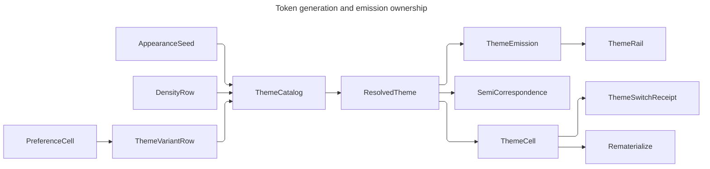

# [APPUI_THEME_TOKENS]

Rasm.AppUi resolves every visual constant through one generated token catalogue: a handful of appearance SEED rows expanded by one pure fold into the whole role ladder under typed `TokenKey`s, generated metric scales beside the paint ladder, layered elevation and material rows, orthogonal `ThemeVariantRow` and `DensityRow` families that project the same generation rather than carrying parallel columns, one typed host-preference probe family, and one apply-then-publish swap capsule that emits the resolve into `ResourceDictionary.ThemeDictionaries` for dynamic consumption. The page owns the token vocabulary, the generation law, the Semi and Dock slot correspondence with its generated-roster conformance rail, the control-theme table with its authoring capsule, and the one `Application.Styles` chain `FluentTheme floor -> SemiTheme -> the per-control Semi skins -> UrsaSemiTheme`; the spine is Avalonia, Avalonia.Themes.Fluent, the `Semi.Avalonia` design-token theme suite, `Irihi.Ursa.Themes.Semi`, Thinktecture.Runtime.Extensions, LanguageExt.Core, and NodaTime.

Generation is the page's ruling shape: a hand-authored per-role paint row, a per-density metric column, and a per-variant colour column are all deleted forms — a role is a derivation over a seed, a metric is a step on a scale, and a variant is a projection of one generation. Every colour crossing admits into the kernel `PerceptualColor` owner and reads its `Mix`, `Ramp`, `Tone`, `ToneFor`, `Contrast`, `Difference`, and `Simulate` members through `BlendPath` and `GamutPolicy` rows; the accessibility floors are `Shell/accessibility#CONTRAST_GATE` `ContrastFloor` rows this page consumes as generation inputs, so a derived text rung and the gate that audits it read one threshold vocabulary. Emission targets `ResourceDictionary.ThemeDictionaries` keyed by `ThemeVariant`, so a variant flip re-resolves through Avalonia's own variant lookup and a per-surface posture is a `ThemeVariantScope` request rather than a dictionary swap.

## [01]-[INDEX]

- [02]-[TOKEN_CATALOG]: Appearance seeds, the generated role ladder and metric scales, elevation/material/wash rows, the Semi and Dock correspondence with its generated-roster conformance rail.
- [03]-[VARIANT_AXIS]: Variant rows as generation projections, the posture variants, and the one typed host-preference probe family.
- [04]-[DENSITY_AXIS]: Density as a scale policy re-deriving every metric family, elected per surface.
- [05]-[CONTROL_THEMES]: The emission law, the control-theme rows with their composition law, the authored-control capsule, apply-then-publish swap, and token-diff receipts.

## [02]-[TOKEN_CATALOG]

- Owner: `TokenKey` `[ValueObject<string>]` the ONE key mint every resolved bucket and every emission is addressed by; `AppearanceSeed` with `RampPolicy` and `SurfacePosture` the seed row family; `SeedAnchor`, `PostureSlot`, and `PaintRole` `[SmartEnum<string>]` the role vocabulary, `PaintDerivation` `[Union]` its generation law; `MetricFamily` the generated scale owner; `DepthTier`, `MaterialTier`, and `WashRow` the elevation and material families, the scrim itself a `PaintDerivation.Veil` role rather than a fourth family; `TokenRow` `[Union]` the frozen non-generated remainder; `ThemeCatalog` the resolve fold; `ResolvedTheme` the one resolved artifact every consumer reads; `SemiSlot` `[Union]` with `SemiExclusion` and the walked `SemiRoster` the shipped-key correspondence; `Colormap` `[SmartEnum<string>]` the perceptually-uniform data-colormap catalog.
- Cases: `PaintDerivation` = Tonal | Posture | Readable | Cast | Veil — a tone sweep off a seed anchor, a surface posture offset, a CONTRAST-SOLVED rung against an earlier role, a bounded-chroma shift off an earlier role, and an alpha veil over one; `TokenRow` = Span | Rank — the motion and z-order rows generation does not reach, because a duration is a motion token and a stacking ordinal is an integer with no perceptual ladder; `SemiSlot` = Pigment | Hue | Extent | Shade | Size | Weight | Family — the brush and colour rows are two arms of one axis because the shipped vocabulary is not uniformly twinned; `Colormap` spans sequential, diverging, rainbow, cyclic, and qualitative classes.
- Law: every generated rung asserts a MINIMUM perceptual difference against its predecessor through the kernel `Difference(other, DeltaMetric)` under the seed's declared floor, so a ladder whose rungs collapse into one another refuses at resolve instead of shipping a surface family the eye reads as flat; every `Readable` rung SOLVES its tone through the kernel `ToneFor` against the role it is drawn on, so a text rung cannot be authored below its own floor and a re-seeded accent carries its readable partner with it; a role derivation names only an EARLIER role, and the fold refuses a forward reference rather than resolving against a bucket that is not yet populated.
- Entry: `public static Fin<ResolvedTheme> Resolve(ThemeVariantRow variant, DensityRow density, AppearanceSeed seed, FontChain chain, PreferenceCell preferences)` — one pure fold whose first step is the `Concrete` probe admission, so an unresolved host-matched sentinel structurally cannot reach the row fold; `public static Fin<Seq<(TokenKey Key, Color Value)>> Expand(AppearanceSeed seed, VariantProjection projection)` is the paint generation; `public double At(int step, DensityPolicy policy, VariantProjection projection)` is the metric generation and `public static double Inner(double outer, double inset)` its nesting law; `public Fin<Color> Sample(double t)` is the one colormap sampler; `public static Fin<Unit> SemiMints(ResolvedTheme resolved)` is the roster-free boot half of slot conformance and `public static Fin<Unit> SemiCovered(ResolvedTheme resolved, SemiRosterReading roster)` the full three-way rail the headless proof lane folds over `SemiRoster.Walk`.
- Auto: one resolve feeds control resources, chart paints, SVG tint, icon foreground, editor highlights, status semantics, selection, overlay scrims, dock chrome, every elevation, and the whole type ladder from the same generation — `Types` carries the `Theme/typography` `TypeScale` expansion under the elected chain, the same density policy, and the host text-scale preference, so the Semi size and weight slots re-emit from the generated table and a density or text-scale flip moves type with geometry inside one fold; `ThemeRail.ContrastCandidates` and `CvdCandidates` are DERIVED from the generated ladder beside the emission rather than hand-listed, so a new role reaches the accessibility sweep with no roster edit; `ThemeCatalog.Ramp` composes the kernel `PerceptualColor.Ramp`, `Colormap.Sample` composes the same `Mix` under its class's own `BlendPath`, and `HeatMap` projects sampled `Color` values through one caller-supplied product constructor without reproducing colour arithmetic.
- Packages: Avalonia, Avalonia.Themes.Fluent, Semi.Avalonia, Irihi.Ursa.Themes.Semi, Dock.Avalonia, LiveChartsCore.SkiaSharpView.Avalonia, Rasm (project — `PerceptualColor` the one perceptual-colour owner with `Mix`, `Ramp`, `Tone`, `ToneFor`, `Contrast`, `Difference`, `Simulate`, `BlendPath`, `GamutPolicy`, `DeltaMetric`, `UnitInterval`, `SignedUnit`, `PositiveMagnitude`, `Dimension`), Wacton.Unicolour (`HueSpan` alone — the traversal argument a polar `BlendPath` row takes), Thinktecture.Runtime.Extensions, LanguageExt.Core, NodaTime
- Growth: a new appearance identity is one `AppearanceSeed` value, never a paint roster; a new role is one `PaintRole` row carrying its derivation; a new metric is one step on an existing `MetricFamily` or one family row; a new elevation is one `DepthTier` row; a new Semi slot is one `SemiSlot` row or one `SemiExclusion` verdict; a new data-colormap is one `Colormap` row carrying its `ColormapClass` and anchor stops; zero new surface.
- Boundary: `ThemeCatalog` admits every Avalonia colour into the kernel `PerceptualColor` and constructs, converts, and measures no colour through `Wacton.Unicolour` itself — the perceptual model is the kernel's, one stratum down, and a package-local colour kernel above it is the deleted form; the one package name that crosses is `HueSpan`, the traversal a polar `BlendPath` row takes as its argument, because re-spelling the package's own four-row axis as a local vocabulary is a rename shell. Every row this catalogue interpolates along is a RECTANGULAR or POLAR `BlendPath` case, so no token blend states a viewing condition and none is missing: the condition rides the appearance case's payload alone, an unconditioned appearance blend is unspellable at the kernel, and a screen token that named a surround would be asserting an adaptation its own interpolation never reads — the screen plane declares its condition by declining the axis, where `Document/export#PRINT_ARM` declares an ICC adaptation per intent row. `TokenKey` is minted by the generation owners alone, so a consumer cannot address a bucket by a string it composed and a key that names no generated rung is unspellable rather than a silent lookup miss; the resolved buckets are therefore total by construction and `Palette` reads them on the `Fin` rail instead of raw-indexing, so a refused generation surfaces as `ThemeFault.PaletteRejected` at boot rather than an index throw inside a static initializer. `Readable` is the one derived-contrast form and its solve lives at the kernel: a page-local bisection over `Tone` beside `Contrast` is the deleted form, exactly as a local sRGB lerp is. Light and high-contrast are PROJECTIONS of one generation through `VariantProjection` — a per-variant colour column on a role row is the deleted shape, because three hand-authored columns drift the moment one seed moves, and the high-contrast projection zeroes near-neutral chroma, raises every `Readable` floor to `ContrastFloor.HighContrast`, empties every shadow stack, and widens the stroke family in one row rather than through four scattered conditionals. Elevation is a LAYER STACK, never one offset-and-blur pair: the ring layer comes first so a hairline rim reads under the cast shadow, dark variants double their alphas because a shadow on a dark surface loses its ground, and the inset top-highlight rim is a layer of the same stack rather than a second border. The shipped high-contrast dictionaries carve no `BoxShadow` slot at all, so the high-contrast arm substitutes border emphasis and writing a shadow key under it would fabricate a slot the shipped dictionary never carries. `SemiSlot` is the whole Semi correspondence and a row exists only where the Semi key names a ROLE the catalogue owns: every `SemiColor<Role><State>` brush, the numbered background/fill/text ramps, the link and highlight families, the disabled set, the focus trio, the overlay and nav backgrounds, `SemiBorderRadius*`, `SemiBorderThickness*`, `SemiHeightControl*`, `SemiWidthIcon*`, `SemiFontSize*`, `SemiFontWeight*`, and the elevation slots re-seed from the resolve, while `SemiSpacing*`, `SemiThickness*`, and `SemiBorderRadiusSpacing*` name their own VALUE on a fixed step scale, so a density-selected metric written under a slot named for its number would make the token lie and the Semi control-internal padding stays on the shipped scale. Semi's raw `Semi<Hue><N>` scale is NOT a write target — its semantic brushes bind the scale through `{StaticResource}` resolved at parse, so overriding the scale re-tints nothing — and the AI accent sets are gradient-valued identities the product mints no anchor for; both are `SemiExclusion` verdicts carrying their reason, never silent absence. Every exclusion and every claimed slot is proven against a GENERATED roster of the shipped keys, because a key the page claims that the shipped theme never defines writes a dead dictionary entry and re-tints nothing, and that defect is invisible to any check the page's own row list can perform. The roster is derived by WALKING the live theme graph, not by reading metadata: compiled AXAML keeps every key inside a XamlClosure body, so an assembly read recovers one opaque resource blob, while instantiating the theme and descending its resource graph recovers the vocabulary whole. That walk needs a live application, so conformance splits — the roster-free half proves every authored row mints and folds at boot, and the two roster-dependent halves fold in the headless proof lane beside the accessibility sweep, where a package bump re-derives the roster instead of re-transcribing it. `DockSurfaceWorkbenchBrush` and `DockSeparatorBrush` resolve as `DynamicResource` in the Dock skin yet no shipped dictionary defines them, so the shell mints both or the bound brush stays unset; they enter the same emission as ordinary role slots. Sequential colormap rows assert their declared lightness order on the GENERATED ramp through the kernel's reference-corrected projection, so a stop list whose interpolation reverses trend refuses instead of reading as a magnitude scale; diverging rows center a neutral pivot, cyclic rows close their endpoints for angular domains, qualitative rows select discrete categories, and rainbow rows stay restricted to cases where category separation outranks magnitude reading.

```csharp signature
// --- [TYPES] ----------------------------------------------------------------------------

// The ONE key mint. Every resolved bucket, every emission entry, and every candidate roster is addressed by
// this owner, so a consumer cannot compose a lookup string and a key naming no generated rung is unspellable
// rather than a silent miss. The underlying value IS the resource key the dictionary takes, because Avalonia
// keys on `object` and a wrapper at that hop would be a second identity the dictionary never resolves.
[ValueObject<string>(SkipKeyMember = false)]
[KeyMemberEqualityComparer<ComparerAccessors.StringOrdinal, string>]
[KeyMemberComparer<ComparerAccessors.StringOrdinal, string>]
public sealed partial class TokenKey {
    static partial void ValidateFactoryArguments(ref ValidationError? validationError, ref string value) =>
        validationError = string.IsNullOrWhiteSpace(value)
            ? new ValidationError("TokenKey requires a non-empty generated key.")
            : null;

    internal static TokenKey Rung(string role, int rung) => Create(rung is 0 ? role : $"{role}+{rung}");

    internal static TokenKey Step(string family, int step) => Create($"{family}-{step}");

    internal static TokenKey Named(string owner, string slot) => Create($"{owner}-{slot}");
}

// Seed rows: the whole authored appearance surface. Six pigments, two ramp ladders, four postures, and one
// generation policy expand into the full role ladder, so a re-identity is a value edit and a rung that cannot
// derive is a defect in the generation rather than an invitation to hand-add a paint row.
public sealed record AppearanceSeed(
    Color Surface,
    Color Accent,
    Seq<(SeedAnchor Anchor, Color Pigment)> Status,
    Seq<(PostureSlot Slot, SurfacePosture Posture)> Postures,
    RampPolicy Ramp);

// Posture is the per-surface-class offset the panel and overlay planes request through a scoped variant: the
// tone shift moves the surface away from or toward the canvas, the chroma ceiling keeps a posture near-neutral
// under a tinted seed, and the coverage is the veil weight a scrim over that posture takes.
public sealed record SurfacePosture(SignedUnit ToneShift, UnitInterval ChromaCeiling, UnitInterval Coverage);

public sealed record RampPolicy(
    Seq<UnitInterval> SurfaceTones,
    Seq<UnitInterval> AccentTones,
    Seq<UnitInterval> StatusTones,
    UnitInterval CastChroma,
    PositiveMagnitude RungFloor,
    DeltaMetric RungMetric,
    BlendPath Path,
    GamutPolicy Gamut);

// A variant is a PROJECTION of one generation, never a parallel colour column: the tone ladder reads forward
// or reversed, near-neutral chroma scales toward zero, every Readable floor lifts, the shadow stacks empty,
// and the stroke family widens — five row values instead of a per-role light/dark/high-contrast triple that
// drifts the moment one seed moves.
public sealed record VariantProjection(
    bool Ascending,
    UnitInterval ChromaScale,
    Option<ContrastFloor> FloorLift,
    bool Shadowed,
    double StrokeGain);

[SmartEnum<string>]
[KeyMemberEqualityComparer<ComparerAccessors.StringOrdinal, string>]
[KeyMemberComparer<ComparerAccessors.StringOrdinal, string>]
public sealed partial class SeedAnchor {
    public static readonly SeedAnchor Surface = new("surface", static seed => Some(seed.Surface), static ramp => ramp.SurfaceTones);
    public static readonly SeedAnchor Accent = new("accent", static seed => Some(seed.Accent), static ramp => ramp.AccentTones);
    public static readonly SeedAnchor Error = new("error", static _ => None, static ramp => ramp.StatusTones);
    public static readonly SeedAnchor Warning = new("warning", static _ => None, static ramp => ramp.StatusTones);
    public static readonly SeedAnchor Success = new("success", static _ => None, static ramp => ramp.StatusTones);
    public static readonly SeedAnchor Info = new("info", static _ => None, static ramp => ramp.StatusTones);

    // The two structural anchors carry a direct column; every status anchor reads its own row off the seed's
    // status list BY ROW IDENTITY, so the status pigments stay one growable list on the seed instead of four
    // fields this row set would have to mirror, and a seed missing a status row refuses rather than silently
    // resolving the whole status ladder onto the surface pigment.
    public Func<AppearanceSeed, Option<Color>> Direct { get; }

    public Func<RampPolicy, Seq<UnitInterval>> Ladder { get; }

    public Fin<Color> Pigment(AppearanceSeed seed) =>
        Direct(seed).IfNone(() => seed.Status.Find(entry => entry.Anchor == this).Map(static entry => entry.Pigment)) switch {
            { IsSome: true, Case: Color pigment } => Fin.Succ(pigment),
            _ => Fin.Fail<Color>(new ThemeFault.PaletteRejected($"seed anchor {Key}")),
        };
}

[SmartEnum<string>]
[KeyMemberEqualityComparer<ComparerAccessors.StringOrdinal, string>]
[KeyMemberComparer<ComparerAccessors.StringOrdinal, string>]
public sealed partial class PostureSlot {
    public static readonly PostureSlot Panel = new("panel");
    public static readonly PostureSlot Overlay = new("overlay");
    public static readonly PostureSlot Well = new("well");
    public static readonly PostureSlot Raised = new("raised");
}

// The generation law as data. Each case names exactly what its rung depends on, so the fold reads the case
// and never a flag beside it, and a role whose derivation names a LATER role refuses rather than resolving
// against an unpopulated bucket.
[Union(ConversionFromValue = ConversionOperatorsGeneration.None)]
public abstract partial record PaintDerivation {
    private PaintDerivation() { }

    public sealed record Tonal(SeedAnchor Anchor, Dimension Rungs) : PaintDerivation;
    public sealed record Posture(SeedAnchor Anchor, PostureSlot Slot, Dimension Rungs) : PaintDerivation;
    public sealed record Readable(PaintRole Against, ContrastFloor Floor, Dimension Rungs) : PaintDerivation;
    public sealed record Cast(PaintRole From, SignedUnit Shift, Dimension Rungs) : PaintDerivation;
    public sealed record Veil(PaintRole From, UnitInterval Coverage) : PaintDerivation;
}

// Interaction rungs INVERT by variant, and the inversion is the projection's `Ascending` column rather than a
// per-slot rung pair: a pointerover state moves away from the surface, so a light ladder descends where a dark
// one ascends, and one fixed direction renders the hover state invisible on exactly one variant while passing
// every structural check.
[SmartEnum<string>]
[KeyMemberEqualityComparer<ComparerAccessors.StringOrdinal, string>]
[KeyMemberComparer<ComparerAccessors.StringOrdinal, string>]
public sealed partial class PaintRole {
    public static readonly PaintRole Surface = new("surface", new PaintDerivation.Tonal(SeedAnchor.Surface, Dimension.Create(5)));
    public static readonly PaintRole Panel = new("panel", new PaintDerivation.Posture(SeedAnchor.Surface, PostureSlot.Panel, Dimension.Create(3)));
    public static readonly PaintRole Raised = new("raised", new PaintDerivation.Posture(SeedAnchor.Surface, PostureSlot.Raised, Dimension.Create(3)));
    public static readonly PaintRole Well = new("well", new PaintDerivation.Posture(SeedAnchor.Surface, PostureSlot.Well, Dimension.Create(2)));
    public static readonly PaintRole Overlay = new("overlay", new PaintDerivation.Posture(SeedAnchor.Surface, PostureSlot.Overlay, Dimension.Create(3)));
    public static readonly PaintRole Border = new("border", new PaintDerivation.Cast(Surface, SignedUnit.Create(0.22d), Dimension.Create(3)));
    public static readonly PaintRole Separator = new("separator", new PaintDerivation.Cast(Surface, SignedUnit.Create(0.10d), Dimension.Create(2)));
    public static readonly PaintRole Text = new("text", new PaintDerivation.Readable(Surface, ContrastFloor.HighContrast, Dimension.Create(1)));
    public static readonly PaintRole TextMuted = new("text-muted", new PaintDerivation.Readable(Surface, ContrastFloor.BodyText, Dimension.Create(2)));
    public static readonly PaintRole TextFaint = new("text-faint", new PaintDerivation.Readable(Surface, ContrastFloor.LargeText, Dimension.Create(1)));
    public static readonly PaintRole Disabled = new("disabled", new PaintDerivation.Readable(Surface, ContrastFloor.NonText, Dimension.Create(2)));
    public static readonly PaintRole Accent = new("accent", new PaintDerivation.Tonal(SeedAnchor.Accent, Dimension.Create(5)));
    public static readonly PaintRole AccentText = new("accent-text", new PaintDerivation.Readable(Accent, ContrastFloor.BodyText, Dimension.Create(1)));
    public static readonly PaintRole Focus = new("focus", new PaintDerivation.Cast(Accent, SignedUnit.Create(0.14d), Dimension.Create(1)));
    public static readonly PaintRole Link = new("link", new PaintDerivation.Tonal(SeedAnchor.Accent, Dimension.Create(4)));
    public static readonly PaintRole Selection = new("selection", new PaintDerivation.Cast(Accent, SignedUnit.Create(-0.30d), Dimension.Create(3)));
    public static readonly PaintRole SelectionText = new("selection-text", new PaintDerivation.Readable(Selection, ContrastFloor.BodyText, Dimension.Create(1)));
    public static readonly PaintRole Highlight = new("highlight", new PaintDerivation.Cast(Accent, SignedUnit.Create(-0.18d), Dimension.Create(2)));
    public static readonly PaintRole Error = new("error", new PaintDerivation.Tonal(SeedAnchor.Error, Dimension.Create(4)));
    public static readonly PaintRole ErrorText = new("error-text", new PaintDerivation.Readable(Surface, ContrastFloor.BodyText, Dimension.Create(1)));
    public static readonly PaintRole Warning = new("warning", new PaintDerivation.Tonal(SeedAnchor.Warning, Dimension.Create(4)));
    public static readonly PaintRole Success = new("success", new PaintDerivation.Tonal(SeedAnchor.Success, Dimension.Create(4)));
    public static readonly PaintRole Info = new("info", new PaintDerivation.Tonal(SeedAnchor.Info, Dimension.Create(4)));
    public static readonly PaintRole Scrim = new("scrim", new PaintDerivation.Veil(Surface, UnitInterval.Create(0.62d)));
    public static readonly PaintRole Workbench = new("workbench", new PaintDerivation.Posture(SeedAnchor.Surface, PostureSlot.Well, Dimension.Create(1)));

    public PaintDerivation Derivation { get; }

    public TokenKey At(int rung) => TokenKey.Rung(Key, rung);

    public int Rungs => Derivation.Switch(
        state: unit,
        tonal: static (_, row) => row.Rungs.Value,
        posture: static (_, row) => row.Rungs.Value,
        readable: static (_, row) => row.Rungs.Value,
        cast: static (_, row) => row.Rungs.Value,
        veil: static (_, _) => 1);
}
```

```csharp signature
// --- [MODELS] ---------------------------------------------------------------------------

// Elevation is an ordered LAYER stack, so a tier is one row and every control theme binds one boxed
// `BoxShadows` resource; the flat offset-and-blur tuple that preceded it could not express the ring layer,
// the spread, or the inset rim and therefore forced per-control literals for exactly the surfaces that matter.
public sealed record ShadowLayer(
    double OffsetX,
    double OffsetY,
    double Blur,
    double Spread,
    bool Inset,
    PaintRole Tint,
    UnitInterval LightAlpha,
    UnitInterval DarkAlpha);

// Material rows carry the package's own four knobs and nothing else. Avalonia acrylic composes a tint over a
// material shader with a FIXED noise bitmap and never a live backdrop blur, so the noise column is a declared
// grain weight the effects plane applies and not a package knob; `AcrylicBackgroundSource.Digger` erases every
// pixel already drawn beneath and digs through to nothing under an embedded host view, so it is unrepresentable
// here and the opaque tinted fallback is the shipped floor on every embedded surface.
public sealed record MaterialValue(
    Color Tint,
    UnitInterval TintOpacity,
    UnitInterval MaterialOpacity,
    Color Fallback,
    UnitInterval Grain);

// The module-keyed ambient wash: DATA the effects plane executes, never a draw here. The luminance ceiling is
// the row value the derived contrast candidates gate, so a wash cannot brighten a surface past the point its
// own text pairs still clear their floor.
public sealed record WashRow(
    string Module,
    PaintRole Hue,
    UnitInterval Coverage,
    UnitInterval LuminanceCeiling,
    MotionToken Crossfade);

[SmartEnum<string>]
[KeyMemberEqualityComparer<ComparerAccessors.StringOrdinal, string>]
[KeyMemberComparer<ComparerAccessors.StringOrdinal, string>]
public sealed partial class DepthTier {
    // Ring layer FIRST so the hairline rim reads under the cast shadow; dark alphas double because a shadow on
    // a dark surface loses its ground; the inset layer is the top-highlight rim, a layer of this stack rather
    // than a second border a control theme would have to carry.
    public static readonly DepthTier Card = new("card", rank: 0, layers: Seq(
        new ShadowLayer(0d, 0d, 0d, 1d, false, PaintRole.Border, UnitInterval.Create(0.10d), UnitInterval.Create(0.22d)),
        new ShadowLayer(0d, 1d, 2d, 0d, false, PaintRole.Scrim, UnitInterval.Create(0.06d), UnitInterval.Create(0.16d))));
    public static readonly DepthTier Raised = new("raised", rank: 0, layers: Seq(
        new ShadowLayer(0d, 0d, 0d, 1d, false, PaintRole.Border, UnitInterval.Create(0.14d), UnitInterval.Create(0.28d)),
        new ShadowLayer(0d, 1d, 3d, 0d, false, PaintRole.Scrim, UnitInterval.Create(0.10d), UnitInterval.Create(0.24d)),
        new ShadowLayer(0d, 1d, 0d, 0d, true, PaintRole.Raised, UnitInterval.Create(0.35d), UnitInterval.Create(0.10d))));
    public static readonly DepthTier Flyout = new("flyout", rank: 1000, layers: Seq(
        new ShadowLayer(0d, 0d, 0d, 1d, false, PaintRole.Border, UnitInterval.Create(0.16d), UnitInterval.Create(0.34d)),
        new ShadowLayer(0d, 4d, 16d, -2d, false, PaintRole.Scrim, UnitInterval.Create(0.16d), UnitInterval.Create(0.40d)),
        new ShadowLayer(0d, 1d, 4d, 0d, false, PaintRole.Scrim, UnitInterval.Create(0.10d), UnitInterval.Create(0.26d))));
    public static readonly DepthTier Floating = new("floating", rank: 3000, layers: Seq(
        new ShadowLayer(0d, 0d, 0d, 1d, false, PaintRole.Border, UnitInterval.Create(0.16d), UnitInterval.Create(0.34d)),
        new ShadowLayer(0d, 6d, 20d, -3d, false, PaintRole.Scrim, UnitInterval.Create(0.18d), UnitInterval.Create(0.44d))));
    public static readonly DepthTier Dialog = new("dialog", rank: 2000, layers: Seq(
        new ShadowLayer(0d, 0d, 0d, 1d, false, PaintRole.Border, UnitInterval.Create(0.18d), UnitInterval.Create(0.38d)),
        new ShadowLayer(0d, 12d, 40d, -6d, false, PaintRole.Scrim, UnitInterval.Create(0.24d), UnitInterval.Create(0.56d)),
        new ShadowLayer(0d, 2d, 8d, 0d, false, PaintRole.Scrim, UnitInterval.Create(0.12d), UnitInterval.Create(0.30d))));

    public int Rank { get; }

    public Seq<ShadowLayer> Layers { get; }

    // The derived token keys carry their OWN names: the smart-enum generator emits the row's string key as a
    // public `Key` property, so a `TokenKey`-typed `Key` declared beside it is a duplicate member of a second
    // type and the whole owner stops generating — and the string key stays reachable for the effects plane
    // that composes it into a slot name.
    public TokenKey ShadowKey => TokenKey.Named("elevation", Key);

    public TokenKey RankKey => TokenKey.Named("z", Key);

    // The high-contrast arm substitutes BORDER EMPHASIS: the shipped high-contrast dictionaries carve no
    // BoxShadow slot at all, so an empty stack is the honest resolve and the border family carries the
    // separation instead — a fabricated shadow key under a high-contrast variant re-tints nothing and hides
    // the fact that the tier lost its whole depth cue.
    // `Seq.Head` answers `Option`, so the stack's first layer BINDS rather than being assumed: a tier authored
    // with an empty stack resolves the same empty value the unshadowed arm answers instead of the fold reaching
    // a two-argument constructor with an absence in its leading slot.
    public Fin<BoxShadows> Resolve(VariantProjection projection, Func<PaintRole, int, Option<Color>> paint) =>
        projection.Shadowed
            ? Layers.Traverse(layer => Shadow(layer, projection, paint)).As()
                .Map(static shadows => shadows.Head.Match(
                    Some: first => new BoxShadows(first, shadows.Tail.ToArray()),
                    None: static () => default(BoxShadows)))
            : Fin.Succ(default(BoxShadows));

    static Fin<BoxShadow> Shadow(ShadowLayer layer, VariantProjection projection, Func<PaintRole, int, Option<Color>> paint) =>
        paint(layer.Tint, 0).Match(
            Some: tint => Fin.Succ(new BoxShadow {
                OffsetX = layer.OffsetX,
                OffsetY = layer.OffsetY,
                Blur = layer.Blur,
                Spread = layer.Spread,
                IsInset = layer.Inset,
                Color = Color.FromArgb(
                    (byte)Math.Round((projection.Ascending ? layer.LightAlpha : layer.DarkAlpha).Value * byte.MaxValue),
                    tint.R, tint.G, tint.B),
            }),
            None: () => Fin.Fail<BoxShadow>(new ThemeFault.PaletteRejected($"shadow tint {layer.Tint.Key}")));
}

[SmartEnum<string>]
[KeyMemberEqualityComparer<ComparerAccessors.StringOrdinal, string>]
[KeyMemberComparer<ComparerAccessors.StringOrdinal, string>]
public sealed partial class MaterialTier {
    public static readonly MaterialTier Chrome = new("chrome", PaintRole.Panel, UnitInterval.Create(0.80d), UnitInterval.Create(0.55d), UnitInterval.Create(0.03d));
    public static readonly MaterialTier Overlay = new("overlay", PaintRole.Overlay, UnitInterval.Create(0.86d), UnitInterval.Create(0.45d), UnitInterval.Create(0.04d));
    public static readonly MaterialTier Sheet = new("sheet", PaintRole.Panel, UnitInterval.Create(0.92d), UnitInterval.Create(0.35d), UnitInterval.Create(0.02d));

    public PaintRole Tint { get; }

    public UnitInterval TintOpacity { get; }

    public UnitInterval MaterialOpacity { get; }

    public UnitInterval Grain { get; }

    public TokenKey MaterialKey => TokenKey.Named("material", Key);

    // Translucency is a PREFERENCE-gated capability: a reduced-transparency host, an embedded surface with no
    // translucent window behind it, and an offscreen proof lane all collapse to the opaque fallback, which is
    // the tinted surface rung itself rather than a second authored colour.
    public MaterialValue Resolve(bool translucent, Func<PaintRole, int, Option<Color>> paint) =>
        paint(Tint, 0).IfNone(() => Colors.Transparent) switch {
            var tint => translucent
                ? new MaterialValue(tint, TintOpacity, MaterialOpacity, tint, Grain)
                : new MaterialValue(tint, UnitInterval.Create(1d), UnitInterval.Create(1d), tint, UnitInterval.Create(0d)),
        };
}

// Space, radius, stroke, and extent are GENERATED scales: a base, a ratio, a step count, and a snap grid, with
// density arriving as a scale factor rather than a second authored column per row. The radius nesting law is a
// member of the same owner, so a nested rounded surface derives its inner radius instead of naming a literal
// and drifting concentric alignment the moment either value moves.
[SmartEnum<string>]
[KeyMemberEqualityComparer<ComparerAccessors.StringOrdinal, string>]
[KeyMemberComparer<ComparerAccessors.StringOrdinal, string>]
public sealed partial class MetricFamily {
    public static readonly MetricFamily Space = new("space", basis: 4d, ratio: 1.5d, steps: Dimension.Create(8), snap: 1d, lens: static policy => policy.Space, widens: false);
    public static readonly MetricFamily Radius = new("radius", basis: 2d, ratio: 1.75d, steps: Dimension.Create(5), snap: 1d, lens: static policy => policy.Radius, widens: false);
    public static readonly MetricFamily Stroke = new("stroke", basis: 1d, ratio: 2d, steps: Dimension.Create(4), snap: 0.5d, lens: static policy => policy.Stroke, widens: true);
    public static readonly MetricFamily Extent = new("extent", basis: 20d, ratio: 1.2d, steps: Dimension.Create(5), snap: 2d, lens: static policy => policy.Extent, widens: false);
    public static readonly MetricFamily Icon = new("icon", basis: 8d, ratio: 1.25d, steps: Dimension.Create(5), snap: 2d, lens: static policy => policy.Extent, widens: false);

    public double Basis { get; }

    public double Ratio { get; }

    public Dimension Steps { get; }

    public double Snap { get; }

    public Func<DensityPolicy, UnitInterval> Lens { get; }

    // The stroke family is the ONE family a high-contrast projection widens: a thicker separator restores the
    // structural cue the emptied shadow stacks gave up, and widening space or radius beside it would relayout
    // the estate on a preference flip.
    public bool Widens { get; }

    public TokenKey At(int step) => TokenKey.Step(Key, step);

    public double Value(int step, DensityPolicy policy, VariantProjection projection) =>
        Basis * Math.Pow(Ratio, step) * Lens(policy).Value * (Widens ? projection.StrokeGain : 1d) switch {
            var raw => Math.Max(Snap, Math.Round(raw / Snap, MidpointRounding.ToEven) * Snap),
        };

    // Concentric nesting: an inner radius is the outer radius less the inset that separates them, floored at
    // zero, so a rounded surface inside a rounded surface stays concentric under every density and every
    // radius re-seed instead of drifting on two independently authored literals.
    public static double Inner(double outer, double inset) => Math.Max(0d, outer - inset);
}

// The rows generation does not reach. A span carries the motion TOKEN and never a duration, so the reduction
// resolves in the fold at resolve time and a retained overlay binding can no more leak unreduced timing than a
// code-driven one; a rank is an integer with no perceptual ladder, so it stays authored beside the depth tier
// that owns its stacking class.
[Union(ConversionFromValue = ConversionOperatorsGeneration.None)]
public abstract partial record TokenRow {
    private TokenRow() { }

    public sealed record Span(TokenKey Key, MotionToken Token) : TokenRow;
    public sealed record Rank(TokenKey Key, int Value) : TokenRow;
}

// Equality is generated: the seven token maps are FrozenDictionary members the synthesized record form compares
// by reference, so an identical regeneration read as a change; Palette is the mutable Avalonia resource object
// REBUILT from Seed on every resolve, so it leaves equality rather than voiding it.
[Equatable]
public sealed partial record ResolvedTheme(
    ThemeVariantRow Variant,
    DensityRow Density,
    AppearanceSeed Seed,
    [property: UnorderedEquality] FrozenDictionary<TokenKey, Color> Paints,
    [property: UnorderedEquality] FrozenDictionary<TokenKey, double> Metrics,
    [property: UnorderedEquality] FrozenDictionary<TokenKey, TextStyleRow> Types,
    [property: UnorderedEquality] FrozenDictionary<TokenKey, BoxShadows> Depths,
    [property: UnorderedEquality] FrozenDictionary<TokenKey, MaterialValue> Materials,
    [property: UnorderedEquality] FrozenDictionary<TokenKey, Duration> Spans,
    [property: UnorderedEquality] FrozenDictionary<TokenKey, int> Ranks,
    [property: IgnoreEquality] ColorPaletteResources Palette) {
    public Color Accent => Seed.Accent;

    public Option<Color> Paint(PaintRole role, int rung = 0) =>
        Paints.TryGetValue(role.At(rung), out Color value) ? Some(value) : None;

    public Option<double> Metric(MetricFamily family, int step) =>
        Metrics.TryGetValue(family.At(step), out double value) ? Some(value) : None;

    // The type ladder resolves inside the SAME fold as the paints and the metrics, so a density election or a
    // host text-scale flip re-derives type and geometry together and no consumer re-runs the generation.
    public Option<TextStyleRow> Type(TypographyRole role, TypeEmphasis emphasis) =>
        Types.TryGetValue(TypeScale.Key(role, emphasis), out TextStyleRow? value) ? Some(value) : None;
}
```

```csharp signature
// --- [OPERATIONS] -----------------------------------------------------------------------

public static class ThemeCatalog {
    public const string SectionKey = "theme";

    // The shipped default derived from the reference census: a near-neutral cool grey band and a restrained
    // desaturated cool accent, because a saturated brand accent spent on chrome leaves no headroom for the
    // status inks that must out-read it. Every other pigment on the estate derives from these six.
    public static readonly AppearanceSeed Default = new(
        Surface: Color.FromUInt32(0xFF17191D),
        Accent: Color.FromUInt32(0xFF3D7EAA),
        Status: [
            (SeedAnchor.Error, Color.FromUInt32(0xFFC5484D)),
            (SeedAnchor.Warning, Color.FromUInt32(0xFFC08A2E)),
            (SeedAnchor.Success, Color.FromUInt32(0xFF4A9A5B)),
            (SeedAnchor.Info, Color.FromUInt32(0xFF4C86B8)),
        ],
        Postures: [
            (PostureSlot.Panel, new SurfacePosture(SignedUnit.Create(0.06d), UnitInterval.Create(0.04d), UnitInterval.Create(0.0d))),
            (PostureSlot.Raised, new SurfacePosture(SignedUnit.Create(0.11d), UnitInterval.Create(0.04d), UnitInterval.Create(0.0d))),
            (PostureSlot.Well, new SurfacePosture(SignedUnit.Create(-0.04d), UnitInterval.Create(0.03d), UnitInterval.Create(0.0d))),
            (PostureSlot.Overlay, new SurfacePosture(SignedUnit.Create(0.15d), UnitInterval.Create(0.05d), UnitInterval.Create(0.62d))),
        ],
        Ramp: new RampPolicy(
            SurfaceTones: Seq(0.10d, 0.14d, 0.19d, 0.25d, 0.32d).Map(UnitInterval.Create),
            AccentTones: Seq(0.58d, 0.66d, 0.50d, 0.74d, 0.40d).Map(UnitInterval.Create),
            StatusTones: Seq(0.56d, 0.64d, 0.46d, 0.72d).Map(UnitInterval.Create),
            CastChroma: UnitInterval.Create(0.04d),
            RungFloor: PositiveMagnitude.Create(2.0d),
            RungMetric: DeltaMetric.Ciede2000,
            Path: BlendPath.Oklch(),
            Gamut: GamutPolicy.Perceptual));

    public static readonly Seq<TokenRow> Rows = [
        new TokenRow.Span(TokenKey.Named("span", "overlay-fade"), MotionPlan.Flyout.Enter),
        new TokenRow.Span(TokenKey.Named("span", "surface-settle"), MotionPlan.Page.Enter),
        new TokenRow.Rank(TokenKey.Named("z", "content"), 0),
        new TokenRow.Rank(TokenKey.Named("z", "tooltip"), 4000),
    ];

    public static readonly Seq<WashRow> Washes = [
        new WashRow("model", PaintRole.Accent, UnitInterval.Create(0.05d), UnitInterval.Create(0.22d), MotionPlan.Page.Enter),
        new WashRow("document", PaintRole.Info, UnitInterval.Create(0.04d), UnitInterval.Create(0.20d), MotionPlan.Page.Enter),
        new WashRow("analysis", PaintRole.Success, UnitInterval.Create(0.04d), UnitInterval.Create(0.20d), MotionPlan.Page.Enter),
        new WashRow("review", PaintRole.Warning, UnitInterval.Create(0.04d), UnitInterval.Create(0.20d), MotionPlan.Page.Enter),
    ];

    // The chain is a resolve INPUT beside the density and the seed, because the type ladder resolves inside this
    // fold and a chain probed from the ambient host here would defeat the composition-bound election the
    // typography owner requires.
    public static Fin<ResolvedTheme> Resolve(ThemeVariantRow variant, DensityRow density, AppearanceSeed seed, FontChain chain, PreferenceCell preferences) =>
        ResolveConcrete(variant.Concrete(preferences), density, seed, chain, preferences);

    static Fin<ResolvedTheme> ResolveConcrete(ThemeVariantRow concrete, DensityRow density, AppearanceSeed seed, FontChain chain, PreferenceCell preferences) =>
        from paints in Expand(seed, concrete.Projection)
        let frozen = Frozen(paints)
        let lookup = (Func<PaintRole, int, Option<Color>>)((role, rung) => frozen.TryGetValue(role.At(rung), out Color value) ? Some(value) : None)
        from depths in toSeq(DepthTier.Items).Traverse(tier => tier.Resolve(concrete.Projection, lookup).Map(shadows => (tier.ShadowKey, shadows))).As()
        from palette in Palette(frozen)
        select new ResolvedTheme(
            Variant: concrete,
            Density: density,
            Seed: seed,
            Paints: frozen,
            Metrics: Frozen(Scales(density.Policy, concrete.Projection)),
            Types: TypeScale.Expand(chain, density.Policy, preferences),
            Depths: Frozen(depths),
            Materials: Frozen(toSeq(MaterialTier.Items).Map(tier => (tier.MaterialKey, tier.Resolve(concrete.Translucent(preferences), lookup)))),
            Spans: Frozen(Rows.Choose(row => row is TokenRow.Span span ? Some((span.Key, ReducedMotion.Select(span.Token).Duration)) : None)),
            Ranks: Frozen(Rows.Choose(row => row is TokenRow.Rank rank ? Some((rank.Key, rank.Value)) : None)
                + toSeq(DepthTier.Items).Map(static tier => (tier.RankKey, tier.Rank))),
            Palette: palette);

    // The generation fold. Roles resolve in DECLARATION order and every derivation naming another role reads
    // the accumulator, so a forward reference is a refusal rather than a lookup against an empty bucket; each
    // emitted rung then asserts the seed's perceptual-difference floor against its predecessor, so a ladder the
    // eye reads as flat cannot ship. Every generated roster crosses `toSeq` first: `Items` is an
    // `IReadOnlyList` and the rail combinators are the carrier's own instance members, so a combinator spelled
    // straight on the roster is a compile fiction wherever it appears.
    public static Fin<Seq<(TokenKey Key, Color Value)>> Expand(AppearanceSeed seed, VariantProjection projection) =>
        toSeq(PaintRole.Items).Fold(
            Fin.Succ(Seq<(TokenKey Key, Color Value)>()),
            (state, role) => state.Bind(emitted => Rungs(role, seed, projection, emitted).Bind(rungs => Apart(role, rungs, seed.Ramp).Map(_ => emitted + rungs))));

    static Fin<Seq<(TokenKey Key, Color Value)>> Rungs(PaintRole role, AppearanceSeed seed, VariantProjection projection, Seq<(TokenKey Key, Color Value)> emitted) =>
        role.Derivation.Switch(
            state: (Role: role, Seed: seed, Projection: projection, Emitted: emitted),
            tonal: static (s, row) =>
                from anchor in row.Anchor.Pigment(s.Seed)
                from rungs in Sweep(s.Role, anchor, Ordered(row.Anchor.Ladder(s.Seed.Ramp), s.Projection).Take(row.Rungs.Value), s.Seed.Ramp, s.Projection)
                select rungs,
            posture: static (s, row) =>
                from anchor in row.Anchor.Pigment(s.Seed)
                from posture in Posture(s.Seed, row.Slot)
                from rungs in Sweep(s.Role, anchor, Shifted(Ordered(row.Anchor.Ladder(s.Seed.Ramp), s.Projection), posture).Take(row.Rungs.Value), s.Seed.Ramp, s.Projection)
                select rungs,
            readable: static (s, row) =>
                from against in Lookup(s.Emitted, row.Against.At(0))
                from rungs in Readable(s.Role, against, s.Projection.FloorLift.IfNone(row.Floor), row.Rungs, s.Seed.Ramp)
                select rungs,
            cast: static (s, row) =>
                from origin in Lookup(s.Emitted, row.From.At(0))
                from admitted in Admit(origin)
                from rungs in Sweep(s.Role, origin, Drift(admitted, row.Shift, row.Rungs, s.Projection), s.Seed.Ramp, s.Projection)
                select rungs,
            veil: static (s, row) => Lookup(s.Emitted, row.From.At(0)).Map(origin => Seq((
                s.Role.At(0),
                Color.FromArgb((byte)Math.Round(row.Coverage.Value * byte.MaxValue), origin.R, origin.G, origin.B)))));

    static Fin<SurfacePosture> Posture(AppearanceSeed seed, PostureSlot slot) =>
        seed.Postures.Find(entry => entry.Slot == slot).Match(
            Some: static entry => Fin.Succ(entry.Posture),
            None: () => Fin.Fail<SurfacePosture>(new ThemeFault.PaletteRejected($"posture {slot.Key}")));

    // The perceptual-difference gate: adjacent rungs must separate by at least the seed's declared floor under
    // its declared metric, so a tone ladder compressed by a gamut bound refuses at resolve instead of shipping
    // three rungs that render as one.
    static Fin<Unit> Apart(PaintRole role, Seq<(TokenKey Key, Color Value)> rungs, RampPolicy ramp) =>
        rungs.Zip(rungs.Skip(1))
            .Traverse(pair => from left in Admit(pair.First.Value)
                              from right in Admit(pair.Second.Value)
                              from ok in left.Difference(right, ramp.RungMetric) >= ramp.RungFloor.Value
                                  ? Fin.Succ(unit)
                                  : Fin.Fail<Unit>(new ThemeFault.PaletteRejected($"{role.Key} rungs within {ramp.RungFloor.Value:0.##} dE"))
                              select ok)
            .As()
            .Map(static _ => unit);

    // Derived contrast: the readable rung SOLVES for the tone that clears its floor against the role it is
    // drawn on, through the kernel owner, so a re-seeded accent carries its readable partner and no text rung
    // is ever authored below the floor the accessibility gate will measure it against.
    // The ink takes its GROUND's hue and chroma and moves only in tone, so a text rung reads as a member of the
    // surface family rather than a foreign pigment laid on it, and each successive emphasis rung relaxes its
    // floor by one step of the declared falloff so muted and faint stay ordered by construction.
    static Fin<Seq<(TokenKey Key, Color Value)>> Readable(PaintRole role, Color against, ContrastFloor floor, Dimension rungs, RampPolicy ramp) =>
        from ground in Admit(against)
        from solved in Enumerable.Range(0, rungs.Value).AsIterable().ToSeq()
            .Traverse(rung => ground
                .ToneFor(ground, PositiveMagnitude.Create(floor.Floor * Math.Pow(EmphasisFalloff, rung)), ToneSweep.Away)
                .Map(colour => (role.At(rung), Avalonia(colour, ramp.Gamut))))
            .As()
        select solved;

    const double EmphasisFalloff = 0.82d;

    // The tonal crossing is fallible at the kernel — a degenerate-chroma seed carries no HCT hue — so a rung the
    // owner refuses fails the whole ramp rather than landing a substituted colour the roster cannot attribute.
    static Fin<Seq<(TokenKey Key, Color Value)>> Sweep(PaintRole role, Color anchor, Seq<UnitInterval> tones, RampPolicy ramp, VariantProjection projection) =>
        from origin in Admit(anchor)
        from swept in tones.Map(static (tone, rung) => (Tone: tone, Rung: rung))
            .Traverse(step => origin.Tone(tone: step.Tone)
                .Map(colour => (role.At(step.Rung), Avalonia(Chroma(colour, projection), ramp.Gamut))))
            .As()
        select swept;

    static Seq<UnitInterval> Ordered(Seq<UnitInterval> ladder, VariantProjection projection) =>
        projection.Ascending ? ladder.Rev() : ladder;

    static Seq<UnitInterval> Shifted(Seq<UnitInterval> ladder, SurfacePosture posture) =>
        ladder.Map(tone => UnitInterval.Create(Math.Clamp(tone.Value + posture.ToneShift.Value, 0d, 1d)));

    // A cast walks from the origin's OWN reference lightness, so the drift is relative to where that role
    // actually landed rather than to an assumed midpoint; the sign inverts with the projection because a
    // border that lifts away from a dark canvas must sink away from a light one.
    static Seq<UnitInterval> Drift(PerceptualColor origin, SignedUnit shift, Dimension rungs, VariantProjection projection) =>
        Enumerable.Range(0, rungs.Value).AsIterable().ToSeq().Map(rung =>
            UnitInterval.Create(Math.Clamp(
                origin.ReferenceLightness + shift.Value * (projection.Ascending ? -1d : 1d) * (rung + 1), 0d, 1d)));

    // High contrast pulls near-neutrals to zero chroma so a tinted seed cannot survive as a colour cast the
    // preference exists to remove; the scale is one projection column rather than a conditional per role.
    static PerceptualColor Chroma(PerceptualColor colour, VariantProjection projection) =>
        PerceptualColor.Of(colour.Lightness, colour.OpponentA * projection.ChromaScale.Value, colour.OpponentB * projection.ChromaScale.Value, colour.Alpha)
            .Match(Succ: identity, Fail: _ => colour);

    static Seq<(TokenKey Key, double Value)> Scales(DensityPolicy policy, VariantProjection projection) =>
        toSeq(MetricFamily.Items).Bind(family => Enumerable.Range(0, family.Steps.Value).AsIterable().ToSeq()
            .Map(step => (family.At(step), family.Value(step, policy, projection))));

    static Fin<Color> Lookup(Seq<(TokenKey Key, Color Value)> emitted, TokenKey key) =>
        emitted.Find(entry => entry.Key == key).Match(
            Some: static entry => Fin.Succ(entry.Value),
            None: () => Fin.Fail<Color>(new ThemeFault.PaletteRejected($"forward reference {key.Value}")));

    public static Fin<Color> Mix(Color left, Color right, UnitInterval amount, BlendPath? path = null, GamutPolicy? gamut = null) =>
        from origin in Admit(left)
        from target in Admit(right)
        select Avalonia(origin.Mix(target, amount, path), gamut);

    public static Fin<Seq<Color>> Ramp(Color left, Color right, Dimension stops, BlendPath? path = null, GamutPolicy? gamut = null) =>
        from origin in Admit(left)
        from target in Admit(right)
        select origin.Ramp(target, stops, path).Map(step => Avalonia(step, gamut));

    // Reference-corrected lightness is the sequence a declared-monotone ramp asserts its trend on — kernel-owned
    // projection for exactly that assertion, read through the same admission edge every other colour takes.
    public static Fin<Seq<double>> Lightness(Seq<Color> ramp) =>
        ramp.TraverseM(Admit).As().Map(static admitted => admitted.Map(static colour => colour.ReferenceLightness));

    // The lens folds ONCE over the paint bucket and both consumers read that one product: the palette is a
    // projection of the simulated paints, so a second fold would let the Fluent floor and the resolved buckets
    // disagree the moment the lens carries any state at all.
    public static ResolvedTheme Simulated(ResolvedTheme resolved, Func<Color, Color> lens) =>
        Frozen(toSeq(resolved.Paints).Map(entry => (entry.Key, lens(entry.Value)))) switch {
            var simulated => resolved with { Paints = simulated, Palette = Palette(simulated).IfFail(resolved.Palette) },
        };

    static Fin<PerceptualColor> Admit(Color value) =>
        PerceptualColor.OfRgb(red: value.R, green: value.G, blue: value.B, alpha: value.A / 255d);

    static Color Avalonia(PerceptualColor value, GamutPolicy? gamut) =>
        value.ToRgb(gamut) switch { var (red, green, blue, alpha) => Color.FromArgb(alpha, red, green, blue) };

    // The Fluent floor's palette reads the SAME generation on the Fin rail: the predecessor raw-indexed the
    // frozen bucket inside a static construction, so one refused anchor threw at boot instead of surfacing as
    // a typed 6620 fact the mount collapse reports.
    static Fin<ColorPaletteResources> Palette(FrozenDictionary<TokenKey, Color> paints) =>
        (from accent in At(paints, PaintRole.Accent, 0)
         from text in At(paints, PaintRole.Text, 0)
         from muted in At(paints, PaintRole.TextMuted, 0)
         from faint in At(paints, PaintRole.TextFaint, 0)
         from surface in At(paints, PaintRole.Surface, 0)
         from panel in At(paints, PaintRole.Panel, 0)
         from raised in At(paints, PaintRole.Raised, 0)
         from border in At(paints, PaintRole.Border, 0)
         from error in At(paints, PaintRole.ErrorText, 0)
         select new ColorPaletteResources {
             Accent = accent,
             BaseHigh = text,
             BaseMedium = muted,
             BaseLow = faint,
             AltHigh = surface,
             AltMedium = panel,
             ChromeHigh = border,
             ChromeMedium = raised,
             ChromeLow = panel,
             ErrorText = error,
             ListLow = panel,
             RegionColor = surface,
         });

    static Fin<Color> At(FrozenDictionary<TokenKey, Color> paints, PaintRole role, int rung) =>
        paints.TryGetValue(role.At(rung), out Color value)
            ? Fin.Succ(value)
            : Fin.Fail<Color>(new ThemeFault.PaletteRejected(role.At(rung).Value));

    static FrozenDictionary<TokenKey, T> Frozen<T>(IEnumerable<(TokenKey Key, T Value)> entries) =>
        entries.ToFrozenDictionary(static entry => entry.Key, static entry => entry.Value);
}
```

```csharp signature
// --- [TABLES] ---------------------------------------------------------------------------

// Semi is one flat resource bag, so a row's product is the boxed resource the dictionary takes — the erasure is
// Avalonia's own last hop, never an interior shape, and the case names the axis it reads so the real type stays
// recoverable. The semantic slots are the write target and they are BRUSHES, so a paint re-emits as a
// SolidColorBrush; writing a Color under a brush slot type-checks here and fails at every template binding.
// The BRUSH and COLOR cases are two rows of one axis because the shipped vocabulary is not uniformly twinned:
// the semantic `SemiColor*` slots are brush-only, the numbered `SemiBackground<N>Color` slots are colour-only,
// and the hue scale is twinned — so minting a brush under a colour-only key type-checks here and fails at every
// template binding, exactly as the inverse does.
[Union(ConversionFromValue = ConversionOperatorsGeneration.None)]
public abstract partial record SemiSlot(string Slot) {
    public sealed record Pigment(PaintRole Role, int Rung, string Slot) : SemiSlot(Slot);
    public sealed record Hue(PaintRole Role, int Rung, string Slot) : SemiSlot(Slot);
    public sealed record Extent(MetricFamily Family, int Step, string Slot) : SemiSlot(Slot);
    public sealed record Shade(DepthTier Tier, string Slot) : SemiSlot(Slot);
    // A size or weight slot names a (role, emphasis) CELL of the generated type table, so a shipped ladder rung
    // re-seeds from the same resolve density and text scale moved rather than from an authored role constant.
    public sealed record Size(TypographyRole Role, TypeEmphasis Emphasis, string Slot) : SemiSlot(Slot);
    public sealed record Weight(TypographyRole Role, TypeEmphasis Emphasis, string Slot) : SemiSlot(Slot);
    public sealed record Family(string Slot) : SemiSlot(Slot);

    public Option<object> Mint(ResolvedTheme resolved) => Switch(
        state: resolved,
        pigment: static (r, p) => r.Paint(p.Role, p.Rung).Map(static color => (object)new SolidColorBrush(color)),
        hue: static (r, h) => r.Paint(h.Role, h.Rung).Map(static color => (object)color),
        extent: static (r, e) => r.Metric(e.Family, e.Step).Map(static value => (object)value),
        shade: static (r, s) => r.Depths.TryGetValue(s.Tier.ShadowKey, out BoxShadows shadows) ? Some((object)shadows) : None,
        size: static (r, s) => r.Type(s.Role, s.Emphasis).Map(static row => (object)row.Size),
        weight: static (r, w) => r.Type(w.Role, w.Emphasis).Map(static row => (object)(FontWeight)row.Weight),
        family: static (_, _) => Some((object)new FontFamily(EmbeddedFace.Variable.Family)));
}

// Exclusions are VERDICTS carrying their reason, never silent absence: the conformance rail matches every
// shipped key the correspondence does not claim against this roster, so an unmatched key is a real gap and a
// deliberate carve is a row rather than a hole nobody can distinguish from an oversight.
[SmartEnum<string>]
[KeyMemberEqualityComparer<ComparerAccessors.StringOrdinal, string>]
[KeyMemberComparer<ComparerAccessors.StringOrdinal, string>]
public sealed partial class SemiExclusion {
    public static readonly SemiExclusion HueScale = new("hue-scale",
        static key => key.StartsWith("Semi", StringComparison.Ordinal) && HueScalePattern().IsMatch(key),
        "the semantic brushes bind the scale through StaticResource at parse, so a scale write re-tints nothing");
    public static readonly SemiExclusion StepScale = new("step-scale",
        static key => key.StartsWith("SemiSpacing", StringComparison.Ordinal)
            || key.StartsWith("SemiThickness", StringComparison.Ordinal)
            || key.StartsWith("SemiBorderRadiusSpacing", StringComparison.Ordinal),
        "the key names its own VALUE on a fixed step scale, so a density-selected metric under it would make the token lie");
    public static readonly SemiExclusion AiAccent = new("ai-accent",
        static key => key.StartsWith("SemiColorAI", StringComparison.Ordinal) || key.StartsWith("SemiAI", StringComparison.Ordinal),
        "gradient-valued AI identity slots the catalogue mints no anchor for; they keep their shipped pigment");
    public static readonly SemiExclusion Absolute = new("absolute",
        static key => key is "SemiBlack" or "SemiWhite" or "SemiBlackColor" or "SemiWhiteColor" or "SemiColorBlack" or "SemiColorWhite",
        "fixed white and black are absolute anchors by definition and no ladder rung names them");
    // Glyph carves the shipped icon SET and every control-scoped geometry slot beside it: a severity glyph on
    // a banner or a notification card is a path the asset rail owns exactly as a named icon is, so tinting it
    // is a foreground write and re-authoring its outline here would fork the shipped glyph source.
    public static readonly SemiExclusion Glyph = new("glyph",
        static key => key.StartsWith("SemiIcon", StringComparison.Ordinal) || GeometryPattern().IsMatch(key),
        "path geometries owned by Theme/assets as the shipped glyph source");
    public static readonly SemiExclusion ControlGeometry = new("control-geometry",
        static key => ControlGeometryPattern().IsMatch(key),
        "shipped control-internal padding, margin, and size slots stay on the shipped scale beside the role-named extents");
    public static readonly SemiExclusion PillSentinel = new("pill-sentinel",
        static key => key is "SemiBorderRadiusFull",
        "a pill radius is a sentinel large enough to round any height, never a step on the radius scale");
    public static readonly SemiExclusion ZeroDefault = new("zero-default",
        static key => key is "SemiBorderSpacing" or "SemiBorderThickness",
        "the unsuffixed pair ships zero as the no-border default, and no generated stroke or space step names zero");
    public static readonly SemiExclusion UnpairedRung = new("unpaired-rung",
        static key => key is "SemiFontSizeHeader2" or "SemiFontSizeHeader4" or "SemiFontWeightLight",
        "shipped ladder rungs the type-role ladder mints no role for; they keep their shipped value until a role earns them");

    public Func<string, bool> Matches { get; }

    public string Reason { get; }

    [GeneratedRegex(@"^Semi(Amber|Blue|Cyan|Green|Grey|Indigo|LightBlue|LightGreen|Lime|Orange|Pink|Purple|Red|Teal|Violet|Yellow)[0-9](Color)?$")]
    private static partial Regex HueScalePattern();

    [GeneratedRegex(@"(Padding|Margin|MinWidth|MinHeight|MaxWidth|MaxHeight|Spacing)$")]
    private static partial Regex ControlGeometryPattern();

    [GeneratedRegex(@"(IconGeometry|IconPathData|PathData)$")]
    private static partial Regex GeometryPattern();
}

// The shipped roster is GENERATED by walking the live object graph, because IL carries no readable vocabulary:
// compiled AXAML keeps every x:Key inside a XamlClosure body rather than as a recoverable literal, so metadata
// enumeration yields one opaque resource blob and nothing else. Instantiating the theme under a headless
// application and descending its resource graph recovers the whole vocabulary, and the descent is identical on
// every package bump — the roster is therefore derived, never transcribed.
public sealed record SemiRosterReading(
    FrozenSet<string> Tokens,
    FrozenDictionary<ThemeVariant, FrozenSet<string>> Variants,
    FrozenSet<Type> ControlThemes);

public static class SemiRoster {
    // The two Dock chrome keys the skin binds through DynamicResource and no shipped dictionary defines: they
    // are absent from every partition on purpose, so the correspondence MINTS them and the conformance rail
    // admits a claimed key with no shipped definition only when it appears here.
    public static readonly FrozenSet<string> Minted =
        FrozenSet.Create(StringComparer.Ordinal, "DockSurfaceWorkbenchBrush", "DockSeparatorBrush");

    // `MergedDictionaries` and `ThemeDictionaries` live on the CONCRETE ResourceDictionary and not on the
    // IResourceDictionary the style surfaces hand back, so the descent pattern-matches the concrete type at
    // every hop; walking the interface alone reaches the top-level keys and silently misses every merged and
    // variant-scoped partition, which is the whole palette.
    public static SemiRosterReading Walk(Seq<IStyle> chain) =>
        chain.Fold(Empty, static (reading, style) => Style(reading, style));

    static readonly SemiRosterReading Empty = new(
        FrozenSet<string>.Empty,
        FrozenDictionary<ThemeVariant, FrozenSet<string>>.Empty,
        FrozenSet<Type>.Empty);

    // `StyleBase.Children` is an `IList<IStyle>` and `Styles` a framework collection, so every descent lifts
    // into the carrier before folding — the fold is the carrier's member, not the list's.
    static SemiRosterReading Style(SemiRosterReading reading, IStyle style) => style switch {
        Styles styles => toSeq(styles).Fold(Dictionary(reading, styles.Resources, None), Style),
        ControlTheme theme => toSeq(theme.Children).Fold(
            Dictionary(reading with { ControlThemes = Add(reading.ControlThemes, Optional(theme.TargetType)) }, theme.Resources, None),
            Style),
        StyleBase basis => toSeq(basis.Children).Fold(Dictionary(reading, basis.Resources, None), Style),
        _ => reading,
    };

    // A key is recorded against the variant it was reached UNDER, so a claim against a variant-scoped key that
    // only one partition carries is itself checkable; a Type-keyed entry is a control theme and descends as a
    // style rather than landing in the token roster.
    static SemiRosterReading Dictionary(SemiRosterReading reading, IResourceDictionary dictionary, Option<ThemeVariant> variant) =>
        dictionary switch {
            ResourceDictionary concrete => toSeq(concrete.Keys).Fold(
                    variant.Match(
                        Some: row => reading with { Variants = Partition(reading.Variants, row, concrete.Keys) },
                        None: () => reading),
                    (state, key) => key switch {
                        string token => state with { Tokens = Add(state.Tokens, Some(token)) },
                        Type target => concrete[key] is ControlTheme theme
                            ? Style(state with { ControlThemes = Add(state.ControlThemes, Some(target)) }, theme)
                            : state with { ControlThemes = Add(state.ControlThemes, Some(target)) },
                        _ => state,
                    })
                switch {
                    var seeded => toSeq(concrete.ThemeDictionaries).Fold(
                        toSeq(concrete.MergedDictionaries).Fold(seeded, (state, merged) =>
                            merged is IResourceDictionary nested ? Dictionary(state, nested, variant) : state),
                        (state, entry) => entry.Value is IResourceDictionary scoped ? Dictionary(state, scoped, Some(entry.Key)) : state),
                },
            _ => reading,
        };

    static FrozenDictionary<ThemeVariant, FrozenSet<string>> Partition(
        FrozenDictionary<ThemeVariant, FrozenSet<string>> variants, ThemeVariant row, ICollection<object> keys) =>
        toSeq(variants).Filter(entry => entry.Key != row)
            .Add((row, (variants.TryGetValue(row, out FrozenSet<string>? held) ? toSeq(held) : Seq<string>())
                .Concat(toSeq(keys).Choose(static key => key is string token ? Some(token) : None))
                .ToFrozenSet(StringComparer.Ordinal)))
            .ToFrozenDictionary(static entry => entry.Key, static entry => entry.Value);

    static FrozenSet<T> Add<T>(FrozenSet<T> set, Option<T> value) =>
        value.Match(Some: item => toSeq(set).Add(item).ToFrozenSet(set.Comparer), None: () => set);
}

public static class SemiCorrespondence {
    public static readonly Seq<SemiSlot> Slots = [
        // Seven roles over six states plus the four disabled slots: the state rungs ride the accent and status
        // ladders, so a re-seed carries every interaction state of every intent with it.
        .. RoleStates(PaintRole.Accent, "Primary"),
        .. RoleStates(PaintRole.Highlight, "Secondary"),
        .. RoleStates(PaintRole.Link, "Tertiary"),
        .. RoleStates(PaintRole.Success, "Success"),
        .. RoleStates(PaintRole.Warning, "Warning"),
        .. RoleStates(PaintRole.Error, "Danger"),
        .. RoleStates(PaintRole.Info, "Information"),
        new SemiSlot.Pigment(PaintRole.Disabled, 0, "SemiColorPrimaryDisabled"),
        new SemiSlot.Pigment(PaintRole.Disabled, 0, "SemiColorSecondaryDisabled"),
        new SemiSlot.Pigment(PaintRole.Disabled, 0, "SemiColorSuccessDisabled"),
        new SemiSlot.Pigment(PaintRole.Disabled, 0, "SemiColorInformationDisabled"),
        // The numbered surface and fill ramps land on the generated ladders one for one; the surface ramp also
        // ships a colour-only twin set with no brush, so those five slots take the Hue case.
        .. Numbered(PaintRole.Surface, "SemiColorBackground", 5),
        .. Numbered(PaintRole.Raised, "SemiColorFill", 3),
        .. Enumerable.Range(0, 5).AsIterable().ToSeq().Map(static index => (SemiSlot)new SemiSlot.Hue(PaintRole.Surface, index, $"SemiBackground{index}Color")),
        // The numbered text ramp is FOUR EMPHASIS LEVELS, not four rungs of one role: each level is its own
        // contrast-solved role, so mapping the ramp onto one role's rung index would collapse the whole ladder
        // onto the primary ink while still resolving.
        new SemiSlot.Pigment(PaintRole.Text, 0, "SemiColorText0"),
        new SemiSlot.Pigment(PaintRole.TextMuted, 0, "SemiColorText1"),
        new SemiSlot.Pigment(PaintRole.TextMuted, 1, "SemiColorText2"),
        new SemiSlot.Pigment(PaintRole.TextFaint, 0, "SemiColorText3"),
        new SemiSlot.Pigment(PaintRole.Border, 0, "SemiColorBorder"),
        // The focus TRIO: the ring colour beside the two variant-invariant geometry slots the shipped themes
        // read for focus thickness and focus offset, so the double-ring recipe binds shipped keys rather than
        // describing a geometry no control theme resolves.
        new SemiSlot.Pigment(PaintRole.Focus, 0, "SemiColorFocusBorder"),
        new SemiSlot.Extent(MetricFamily.Stroke, 1, "SemiBorderThicknessControlFocus"),
        new SemiSlot.Extent(MetricFamily.Space, 0, "SemiBorderSpacingControlFocus"),
        new SemiSlot.Extent(MetricFamily.Stroke, 0, "SemiBorderThicknessControl"),
        new SemiSlot.Extent(MetricFamily.Space, 0, "SemiBorderSpacingControl"),
        // Link and highlight families.
        new SemiSlot.Pigment(PaintRole.Link, 0, "SemiColorLink"),
        new SemiSlot.Pigment(PaintRole.Link, 1, "SemiColorLinkPointerover"),
        new SemiSlot.Pigment(PaintRole.Link, 2, "SemiColorLinkActive"),
        new SemiSlot.Pigment(PaintRole.Link, 3, "SemiColorLinkVisited"),
        new SemiSlot.Pigment(PaintRole.Highlight, 0, "SemiColorHighlight"),
        new SemiSlot.Pigment(PaintRole.Selection, 0, "SemiColorHighlightBackground"),
        // The global disabled set and the two surface slots that carry the whole scrim and nav vocabulary.
        new SemiSlot.Pigment(PaintRole.Well, 0, "SemiColorDisabledBackground"),
        new SemiSlot.Pigment(PaintRole.Border, 1, "SemiColorDisabledBorder"),
        new SemiSlot.Pigment(PaintRole.Disabled, 1, "SemiColorDisabledFill"),
        new SemiSlot.Pigment(PaintRole.Disabled, 0, "SemiColorDisabledText"),
        new SemiSlot.Pigment(PaintRole.Panel, 0, "SemiColorNavBackground"),
        new SemiSlot.Pigment(PaintRole.Scrim, 0, "SemiColorOverlayBackground"),
        new SemiSlot.Pigment(PaintRole.Scrim, 0, "SemiColorShadow"),
        // Role-named extents: radius, control height, and icon width re-seed; the numbered spacing and
        // thickness ladders are SemiExclusion.StepScale.
        new SemiSlot.Extent(MetricFamily.Radius, 0, "SemiBorderRadiusExtraSmall"),
        new SemiSlot.Extent(MetricFamily.Radius, 1, "SemiBorderRadiusSmall"),
        new SemiSlot.Extent(MetricFamily.Radius, 2, "SemiBorderRadiusMedium"),
        new SemiSlot.Extent(MetricFamily.Radius, 3, "SemiBorderRadiusLarge"),
        new SemiSlot.Extent(MetricFamily.Extent, 0, "SemiHeightControlSmall"),
        new SemiSlot.Extent(MetricFamily.Extent, 1, "SemiHeightControlDefault"),
        new SemiSlot.Extent(MetricFamily.Extent, 2, "SemiHeightControlLarge"),
        new SemiSlot.Extent(MetricFamily.Icon, 0, "SemiWidthIconExtraSmall"),
        new SemiSlot.Extent(MetricFamily.Icon, 1, "SemiWidthIconSmall"),
        new SemiSlot.Extent(MetricFamily.Icon, 2, "SemiWidthIconMedium"),
        new SemiSlot.Extent(MetricFamily.Icon, 3, "SemiWidthIconLarge"),
        new SemiSlot.Extent(MetricFamily.Icon, 4, "SemiWidthIconExtraLarge"),
        // Typography seats.
        new SemiSlot.Size(TypographyRole.Caption, TypeEmphasis.Regular, "SemiFontSizeSmall"),
        new SemiSlot.Size(TypographyRole.Body, TypeEmphasis.Regular, "SemiFontSizeRegular"),
        new SemiSlot.Size(TypographyRole.Section, TypeEmphasis.Regular, "SemiFontSizeHeader6"),
        new SemiSlot.Size(TypographyRole.Title, TypeEmphasis.Regular, "SemiFontSizeHeader5"),
        new SemiSlot.Size(TypographyRole.Headline, TypeEmphasis.Regular, "SemiFontSizeHeader3"),
        new SemiSlot.Size(TypographyRole.Display, TypeEmphasis.Regular, "SemiFontSizeHeader1"),
        // The shipped bold weight is the BODY role at strong emphasis, not a second role: emphasis is the weight
        // column, so an emphasized slot names the cell rather than a parallel row that drifts from its base.
        new SemiSlot.Weight(TypographyRole.Body, TypeEmphasis.Regular, "SemiFontWeightRegular"),
        new SemiSlot.Weight(TypographyRole.Body, TypeEmphasis.Strong, "SemiFontWeightBold"),
        new SemiSlot.Family("SemiFontFamilyRegular"),
        // Elevation: the one global token plus every shipped control-scoped shadow slot, each mapped to the
        // tier whose stack its surface class actually earns.
        new SemiSlot.Shade(DepthTier.Raised, "SemiShadowElevated"),
        new SemiSlot.Shade(DepthTier.Card, "BorderCardBoxShadow"),
        new SemiSlot.Shade(DepthTier.Flyout, "FlyoutBorderBoxShadow"),
        new SemiSlot.Shade(DepthTier.Flyout, "MenuFlyoutBorderBoxShadow"),
        new SemiSlot.Shade(DepthTier.Flyout, "ComboBoxPopupBoxShadow"),
        new SemiSlot.Shade(DepthTier.Flyout, "AutoCompleteBoxPopupBoxShadow"),
        new SemiSlot.Shade(DepthTier.Flyout, "CommandBarOverflowBoxShadow"),
        new SemiSlot.Shade(DepthTier.Flyout, "CalendarDatePickerPopupBoxShadows"),
        new SemiSlot.Shade(DepthTier.Flyout, "DateTimePickerFlyoutBoxShadow"),
        new SemiSlot.Shade(DepthTier.Floating, "NotificationCardBoxShadows"),
        new SemiSlot.Shade(DepthTier.Raised, "ToggleSwitchIndicatorBoxShadow"),
        new SemiSlot.Shade(DepthTier.Dialog, "WindowBorderShadow"),
        // Dock chrome: the two keys the skin binds through DynamicResource and no shipped dictionary defines.
        // Every other Dock* key already resolves to a SemiColor* slot, so the palette override re-tints the
        // whole docking estate with no dock-side edit.
        new SemiSlot.Pigment(PaintRole.Workbench, 0, "DockSurfaceWorkbenchBrush"),
        new SemiSlot.Pigment(PaintRole.Separator, 0, "DockSeparatorBrush"),
        // The notification families re-tint through SLOT OVERRIDES rather than a parallel control theme: every
        // shipped key here names a role this catalogue already generates, so the skin rides the correspondence
        // and a forked banner or card template — which would then need its own severity arms, its own close
        // affordance, and its own locale strings — is the deleted form. Severity lands on the status ladder's
        // LIGHT rung for the fill and its base rung for the rim, so four levels read as one family against a
        // neutral surface and the ink carries the level rather than the panel.
        .. Severity("Banner", "Background", rung: 3),
        .. Severity("Banner", "BorderBrush", rung: 1),
        new SemiSlot.Pigment(PaintRole.Border, 0, "BannerBorderBrush"),
        new SemiSlot.Pigment(PaintRole.TextMuted, 0, "BannerCloseButtonForeground"),
        new SemiSlot.Extent(MetricFamily.Radius, 2, "BannerCornerRadius"),
        new SemiSlot.Extent(MetricFamily.Stroke, 0, "BannerBorderThickness"),
        new SemiSlot.Size(TypographyRole.Section, TypeEmphasis.Regular, "BannerTitleFontSize"),
        // The corner card and the toast card share one severity vocabulary and differ in frame alone, so the
        // card families fold through the same projection and only their frame slots are authored apart.
        .. Severity("NotificationCardLight", "Background", rung: 3),
        .. Severity("NotificationCardLight", "BorderBrush", rung: 1),
        .. Severity("NotificationCard", "IconForeground", rung: 0),
        new SemiSlot.Pigment(PaintRole.Overlay, 2, "NotificationCardLightBackground"),
        new SemiSlot.Pigment(PaintRole.Border, 0, "NotificationCardLightBorderBrush"),
        new SemiSlot.Pigment(PaintRole.Overlay, 2, "NotificationCardBackground"),
        new SemiSlot.Extent(MetricFamily.Stroke, 0, "NotificationCardBorderThickness"),
        new SemiSlot.Extent(MetricFamily.Radius, 2, "NotificationCardCornerRadius"),
        new SemiSlot.Extent(MetricFamily.Icon, 1, "NotificationCardIconHeight"),
        new SemiSlot.Extent(MetricFamily.Icon, 1, "NotificationCardIconWidth"),
        new SemiSlot.Size(TypographyRole.Body, TypeEmphasis.Strong, "NotificationCardTitleFontSize"),
        new SemiSlot.Weight(TypographyRole.Body, TypeEmphasis.Strong, "NotificationCardTitleFontWeight"),
        new SemiSlot.Pigment(PaintRole.Text, 0, "NotificationCardTitleForeground"),
        new SemiSlot.Size(TypographyRole.Body, TypeEmphasis.Regular, "NotificationCardMessageFontSize"),
        new SemiSlot.Weight(TypographyRole.Body, TypeEmphasis.Regular, "NotificationCardMessageFontWeight"),
        new SemiSlot.Pigment(PaintRole.TextMuted, 0, "NotificationCardMessageForeground"),
        // The toast card carries NO shadow key at all — `NotificationCardBoxShadows` belongs to the corner card
        // — so the toast tier binds its depth through the shadow-stack slot the PLANE hosting it resolves, and
        // authoring a card-scoped shadow here would write a slot the shipped dictionary never defines.
        new SemiSlot.Pigment(PaintRole.Overlay, 2, "ToastCardBackground"),
        new SemiSlot.Extent(MetricFamily.Stroke, 0, "ToastCardBorderThickness"),
        new SemiSlot.Extent(MetricFamily.Radius, 2, "ToastCardCornerRadius"),
        new SemiSlot.Extent(MetricFamily.Icon, 1, "ToastCardIconHeight"),
        new SemiSlot.Extent(MetricFamily.Icon, 1, "ToastCardIconWidth"),
        new SemiSlot.Weight(TypographyRole.Body, TypeEmphasis.Regular, "ToastCardContentFontWeight"),
        new SemiSlot.Pigment(PaintRole.Text, 0, "ToastCardContentForeground"),
    ];

    // Six states over one role ladder: bare, pointerover, active, and the three Light-family rungs the shipped
    // themes select for quiet intent arms.
    static Seq<SemiSlot> RoleStates(PaintRole role, string intent) => [
        new SemiSlot.Pigment(role, 0, $"SemiColor{intent}"),
        new SemiSlot.Pigment(role, 1, $"SemiColor{intent}Pointerover"),
        new SemiSlot.Pigment(role, 2, $"SemiColor{intent}Active"),
        new SemiSlot.Pigment(role, 3, $"SemiColor{intent}Light"),
        new SemiSlot.Pigment(role, 3, $"SemiColor{intent}LightPointerover"),
        new SemiSlot.Pigment(role, 2, $"SemiColor{intent}LightActive"),
    ];

    // The four severity families ride ONE fold over the status ladder, so a shipped banner, notification, and
    // toast key set costs one row apiece rather than a dozen authored slots that drift the moment a role moves;
    // the affix pair is the whole difference between the three families, so a fourth family is a call.
    static Seq<SemiSlot> Severity(string prefix, string suffix, int rung) =>
        Seq((Role: PaintRole.Info, Level: "Information"), (Role: PaintRole.Success, Level: "Success"),
            (Role: PaintRole.Warning, Level: "Warning"), (Role: PaintRole.Error, Level: "Error"))
            .Map(row => (SemiSlot)new SemiSlot.Pigment(row.Role, rung, $"{prefix}{row.Level}{suffix}"));

    // ONE slot per generated rung: a shipped ramp longer than the role's ladder leaves its tail unclaimed on the
    // conformance rail rather than clamping several slots onto the last rung, which resolves cleanly while
    // flattening the top of the ramp and hiding the fact that the generation is one rung short.
    static Seq<SemiSlot> Numbered(PaintRole role, string prefix, int count) =>
        Enumerable.Range(0, Math.Min(count, role.Rungs)).AsIterable().ToSeq()
            .Map(index => (SemiSlot)new SemiSlot.Pigment(role, index, $"{prefix}{index}"));

    // The BOOT half: every authored row mints from the resolve. This needs no roster and therefore costs one
    // pass over the correspondence, so it runs on the mount path where a generation gap must be a typed 6620
    // fact rather than a control silently keeping its shipped pigment.
    public static Fin<Unit> SemiMints(ResolvedTheme resolved) =>
        Slots.Filter(slot => slot.Mint(resolved).IsNone).Map(static slot => slot.Slot) switch {
            { IsEmpty: true } => Fin.Succ(unit),
            var unminted => Fin.Fail<Unit>(new ThemeFault.PaletteRejected(Report("unminted", unminted))),
        };

    // The PROOF half: the two assertions that need the walked roster. A claimed slot the shipped vocabulary
    // never defines writes a dead dictionary entry and re-tints nothing; a shipped key neither claimed nor
    // excluded is the silent remainder the page's own row list could never surface. The walk needs a live
    // application, so this folds in the headless proof lane beside the accessibility sweep rather than on the
    // mount path, and a package bump re-derives the roster instead of re-transcribing it.
    public static Fin<Unit> SemiCovered(ResolvedTheme resolved, SemiRosterReading roster) =>
        (Minted: SemiMints(resolved),
         Dead: Slots.Map(static slot => slot.Slot).Filter(slot => !roster.Tokens.Contains(slot) && !SemiRoster.Minted.Contains(slot)),
         Orphan: toSeq(roster.Tokens)
             .Filter(key => !Slots.Exists(slot => slot.Slot == key))
             .Filter(key => !toSeq(SemiExclusion.Items).Exists(row => row.Matches(key)))) switch {
            ({ IsSucc: true }, { IsEmpty: true }, { IsEmpty: true }) => Fin.Succ(unit),
            var (minted, dead, orphan) => Fin.Fail<Unit>(new ThemeFault.PaletteRejected(string.Join("; ", Seq(
                minted.Match(Succ: static _ => string.Empty, Fail: static error => error.Message),
                Report("undefined", dead), Report("unclaimed", orphan)).Filter(static line => line.Length > 0)))),
        };

    static string Report(string band, Seq<string> keys) =>
        keys.IsEmpty ? string.Empty : $"{band}: {string.Join(", ", keys.Take(12))}";
}
```

| [INDEX] | [ROLE_FAMILY]      | [DERIVATION]                                     | [GENERATED_KEYS]                                         |
| :-----: | :----------------- | :----------------------------------------------- | :------------------------------------------------------- |
|  [01]   | surface plane      | tonal sweep off the surface seed                 | `surface`, `surface+1`..`surface+4`                      |
|  [02]   | surface postures   | posture tone shift over the same ladder          | `panel*`, `raised*`, `well*`, `overlay*`                 |
|  [03]   | outline            | bounded-chroma cast off the surface rung         | `border*`, `separator*`                                  |
|  [04]   | text emphasis      | contrast-solved against the surface rung         | `text`, `text-muted*`, `text-faint`, `disabled*`         |
|  [05]   | accent split pair  | tonal sweep plus its readable partner            | `accent*`, `accent-text`, `focus`, `link*`               |
|  [06]   | selection family   | desaturating cast off accent plus readable       | `selection*`, `selection-text`, `highlight*`             |
|  [07]   | status inks        | tonal sweep off each status seed                 | `error*`, `error-text`, `warning*`, `success*`, `info*`  |
|  [08]   | veil and chrome    | alpha veil and well posture                      | `scrim`, `workbench`                                     |
|  [09]   | metric scales      | base, ratio, step, snap under the density policy | `space-0`..`space-7`, `radius-*`, `stroke-*`, `extent-*` |
|  [10]   | elevation and rank | ordered shadow-layer stack per tier              | `elevation-*`, `z-*`                                     |
|  [11]   | material and wash  | tier tint over the preference-gated translucency | `material-chrome`, `material-overlay`, `material-sheet`  |

```csharp signature
[SmartEnum]
public sealed partial class ColormapClass {
    // Path makes the class a real vocabulary rather than three booleans: a cyclic map traverses the LONG way
    // round so its two ends meet, a rainbow traverses monotonically increasing hue, and a diverging map takes
    // short path through its neutral centre — interpolation each class NAMES. Hueless classes take the kernel's
    // rectangular row and carry no traversal at all, so a sequential or qualitative map cannot state a hue path
    // its own space has no hue to travel.
    public static readonly ColormapClass Sequential = new(lightnessMonotone: true, centered: false, discrete: false, path: BlendPath.Oklab);
    public static readonly ColormapClass Diverging = new(lightnessMonotone: false, centered: true, discrete: false, path: BlendPath.Oklch());
    public static readonly ColormapClass Rainbow = new(lightnessMonotone: false, centered: false, discrete: false, path: BlendPath.Oklch(HueSpan.Increasing));
    public static readonly ColormapClass Cyclic = new(lightnessMonotone: false, centered: true, discrete: false, path: BlendPath.Oklch(HueSpan.Longer));
    public static readonly ColormapClass Qualitative = new(lightnessMonotone: false, centered: false, discrete: true, path: BlendPath.Oklab);

    public bool LightnessMonotone { get; }

    public bool Centered { get; }

    public bool Discrete { get; }

    public BlendPath Path { get; }
}

[SmartEnum<string>]
[KeyMemberEqualityComparer<ComparerAccessors.StringOrdinal, string>]
[KeyMemberComparer<ComparerAccessors.StringOrdinal, string>]
public sealed partial class Colormap {
    public static readonly Colormap Viridis = new("viridis", ColormapClass.Sequential, stops: Seq(
        Color.FromUInt32(0xFF440154), Color.FromUInt32(0xFF414487), Color.FromUInt32(0xFF2A788E),
        Color.FromUInt32(0xFF22A884), Color.FromUInt32(0xFF7AD151), Color.FromUInt32(0xFFFDE725)));
    public static readonly Colormap Magma = new("magma", ColormapClass.Sequential, stops: Seq(
        Color.FromUInt32(0xFF000004), Color.FromUInt32(0xFF3B0F70), Color.FromUInt32(0xFF8C2981),
        Color.FromUInt32(0xFFDE4968), Color.FromUInt32(0xFFFE9F6D), Color.FromUInt32(0xFFFCFDBF)));
    public static readonly Colormap Cividis = new("cividis", ColormapClass.Sequential, stops: Seq(
        Color.FromUInt32(0xFF00224E), Color.FromUInt32(0xFF35456C), Color.FromUInt32(0xFF666970),
        Color.FromUInt32(0xFF948E77), Color.FromUInt32(0xFFCBBA69), Color.FromUInt32(0xFFFEE838)));
    public static readonly Colormap Turbo = new("turbo", ColormapClass.Rainbow, stops: Seq(
        Color.FromUInt32(0xFF30123B), Color.FromUInt32(0xFF4145AB), Color.FromUInt32(0xFF26BCE1),
        Color.FromUInt32(0xFF7DFF56), Color.FromUInt32(0xFFFB8022), Color.FromUInt32(0xFF7A0403)));
    public static readonly Colormap Coolwarm = new("coolwarm", ColormapClass.Diverging, stops: Seq(
        Color.FromUInt32(0xFF3B4CC0), Color.FromUInt32(0xFF9ABBFF), Color.FromUInt32(0xFFDDDDDD),
        Color.FromUInt32(0xFFF49A7B), Color.FromUInt32(0xFFB40426)));
    public static readonly Colormap Twilight = new("twilight", ColormapClass.Cyclic, stops: Seq(
        Color.FromUInt32(0xFFE2D9E2), Color.FromUInt32(0xFF6276BA), Color.FromUInt32(0xFF2F1436),
        Color.FromUInt32(0xFFAF4B70), Color.FromUInt32(0xFFE2D9E2)));
    public static readonly Colormap Tableau = new("tableau", ColormapClass.Qualitative, stops: Seq(
        Color.FromUInt32(0xFF4E79A7), Color.FromUInt32(0xFFF28E2B), Color.FromUInt32(0xFFE15759),
        Color.FromUInt32(0xFF76B7B2), Color.FromUInt32(0xFF59A14F), Color.FromUInt32(0xFFEDC948),
        Color.FromUInt32(0xFFB07AA1), Color.FromUInt32(0xFFFF9DA7), Color.FromUInt32(0xFF9C755F), Color.FromUInt32(0xFFBAB0AC)));

    public ColormapClass Class { get; }

    public Seq<Color> Stops { get; }

    public Fin<Color> Sample(double t) => double.IsFinite(t)
        ? SampleAdmitted(Math.Clamp(t, 0d, 1d))
        : Fin.Fail<Color>(new ThemeFault.PaletteRejected($"sample {t}"));

    // The segment blend rides the CLASS's own hue span, so a cyclic ramp's wrap segment traverses the long
    // way and a sequential ramp stays in Oklab — the traversal is class data, never a per-sample decision.
    private Fin<Color> SampleAdmitted(double t) =>
        (Clamped: t, Segments: Stops.Count - 1) switch {
            var (clamped, _) when Class.Discrete => Fin.Succ(Stops[Math.Min((int)(clamped * Stops.Count), Stops.Count - 1)]),
            var (clamped, segments) => (Scaled: clamped * segments, Segments: segments) switch {
                var (scaled, count) => Math.Min((int)scaled, count - 1) switch {
                    var lo => UnitInterval.Validate(scaled - lo, null, out UnitInterval amount) is { } fault
                        ? Fin.Fail<Color>(new ThemeFault.PaletteRejected(fault.ToString()))
                        : ThemeCatalog.Mix(Stops[lo], Stops[lo + 1], amount, Class.Path),
                },
            },
        };

    public Fin<Seq<Color>> Ramp(int steps) =>
        steps > 0
            ? (steps == 1
                ? Sample(0d).Map(static color => Seq(color))
                : toSeq(Enumerable.Range(0, steps))
                    .TraverseM(step => Sample((double)step / (steps - 1)))
                    .As()
                    .Bind(Ordered))
            : Fin.Fail<Seq<Color>>(new ThemeFault.PaletteRejected($"steps {steps}"));

    // The class's declared lightness order is a CHECKED claim over the GENERATED ramp, never a label on the
    // row: a declared-monotone map whose interpolated trend reverses refuses on the same rail a bad step count
    // takes, so a perceptually broken palette cannot read as a magnitude scale. The trend reads the kernel's
    // reference-corrected lightness because the stored basis channel mis-ranks near-black and passes a ramp
    // that visibly plateaus there; a class that declares no order admits its ramp unexamined.
    Fin<Seq<Color>> Ordered(Seq<Color> ramp) =>
        !Class.LightnessMonotone
            ? Fin.Succ(ramp)
            : ThemeCatalog.Lightness(ramp).Bind(levels =>
                double.Sign(levels[levels.Count - 1] - levels[0]) switch {
                    var trend => levels.Zip(levels.Skip(1)).ForAll(pair => trend * (pair.Second - pair.First) >= 0d)
                        ? Fin.Succ(ramp)
                        : Fin.Fail<Seq<Color>>(new ThemeFault.PaletteRejected($"non-monotonic lightness {Key}")),
                });

    public Fin<T[]> HeatMap<T>(int steps, Func<Color, T> project) =>
        Ramp(steps).Map(colors => colors.Map(project).ToArray());
}
```

## [03]-[VARIANT_AXIS]

- Owner: `ThemeVariantRow` `[SmartEnum<string>]` binding the page vocabulary to the host variant key column, its `VariantProjection`, and the `Semi.Avalonia` `ThemeVariant` slots; `PostureVariant` the scoped per-surface variant mint; `PreferenceRow` `[SmartEnum<string>]` and `PreferenceValue` `[Union]` the typed host-preference family; `PreferenceCell` the probe capsule every consumer binds.
- Cases: `ThemeVariantRow` = light | dark | high-contrast-light | high-contrast-dark | host-matched — host-matched is a probe fold, never a resolved row, and the two high-contrast rows bind the shipped `SemiTheme` high-contrast variants so the `Themes/HighContrast` dictionary actually resolves; `PreferenceRow` = appearance | increased-contrast | reduced-motion | reduced-transparency | text-scale; `PreferenceValue` = Appearance | Flag | Scale.
- Law: a preference is read through ONE capsule and never through a second per-concern probe path — the variant fold, the motion degrade switch, the material translucency gate, and the typography multiplier are four consumers of one owner, so a host flip re-derives every dependent surface in one resolve; a pinned preference overrides the host read and disposes back to it, so a proof lane fixes appearance, contrast, motion, transparency, and text scale independently of whatever machine executes it.
- Entry: `public ThemeVariantRow Concrete(PreferenceCell preferences)` — total fold; concrete rows return themselves and the absent-probe default is `Light`; `public PreferenceValue Read(PreferenceRow row)`, `public IDisposable Track(Action<PreferenceRow> observe)`, and `public IDisposable Pin(PreferenceRow row, PreferenceValue value)` are the whole probe surface; `public static PreferenceCell OfPlatform(IPlatformSettings settings, Func<PreferenceRow, Option<PreferenceValue>> hostSeam, Func<Action<PreferenceRow>, IDisposable> hostFlips)` builds the standalone binding over the seam's read-and-change pair.
- Auto: host appearance and contrast flips ride `IPlatformSettings.ColorValuesChanged` into `Track`, so a host dark-mode or high-contrast change re-resolves and receipts with zero per-control handlers; a `PostureVariant` scope re-maps the surface family for a panel or overlay subtree through `ThemeVariantScope.RequestedThemeVariant`, so a posture is a resource-resolution fact rather than a second dictionary the swap has to keep in step.
- Packages: Avalonia, Semi.Avalonia, Irihi.Ursa, System.Reactive (`Disposable.Create` and the `CompositeDisposable` the probe capsule composes its two change sources through), Thinktecture.Runtime.Extensions, LanguageExt.Core
- Growth: a new preference is one `PreferenceRow` row plus its host-seam read-and-change pair; a new surface posture is one `PostureSlot` row and its emitted variant partition; user personalization is `ThemePolicy` data carrying one admitted variant key, one density key, and one optional accent seed, and it never pretends to mint a new variant identity.
- Boundary: probes are host-agnostic delegate columns supplied at mount — the rhino probe lands as one registration row on the host-attach port reading `HostUtils.RunningInDarkMode` with change flips riding `Rhino.UI.ThemeSettings.ThemeChanged` host-side, gh2 rows ride the same host appearance row, empty-host standalone rows read `Application.PlatformSettings` whose `GetColorValues()` returns a `PlatformColorValues` carrying `ThemeVariant` and `ContrastPreference` with re-probe on `ColorValuesChanged`, and the browser probe stays a designed-only column with zero authored interop; `TopLevel` exposes no public platform-settings property, so `Application.PlatformSettings` is the one reachable read and it is NULLABLE until the application initializes, which is why the standalone binding takes the settings instance rather than resolving one per read. Avalonia publishes appearance and contrast alone: reduced motion, reduced transparency, and text scale have NO platform surface, so those three rows read the host-attach seam column a mount supplies and default to their unreduced value when a host answers nothing — stating the gap here is what keeps three consumers from each inventing a private probe. The seam is a PAIR, read beside change, because a host that can answer those rows can also flip them: with the platform subscription as the only change source three of five rows are unraisable, so a host reduced-motion flip never re-runs the swap that bakes the resolved spans while the live motion selector reading the same cell has already flipped, and a host answering nothing binds an empty subscription rather than an absent one. `RegisterFollowSystemTheme` is NOT the OS light-and-dark follow: it guards on Windows, tracks `ContrastPreference` alone, and maps the system accent onto one of the four shipped high-contrast variants, so OS appearance follow rides the preference columns and mounting that extension would install a second appearance driver. The four shipped Semi high-contrast variants resolve to sixteen Windows system-colour keys apiece and NO palette rows at all, inheriting every palette key from their parent variant, so the shipped side of a high-contrast variant is a system-colour mapping and the high-contrast PALETTE is this page's own projection; they are therefore two rows here and not four, `Desert` carrying the light-inheriting chain and `NightSky` the dark-inheriting one, and a variant key minted locally as `new ThemeVariant("high-contrast", ThemeVariant.Dark)` never reaches that dictionary at all because inheritance resolves through the shipped key, not through a same-named local one. Density and variant are orthogonal and compose only inside `Resolve`; the per-surface override is the `SurfaceOverride` delegate column on the swap capsule, reading the supplied `ConsumptionProfile` beside the resolved `SurfaceMount`, so a `HostSurface.Embedded` profile tracks its host while a standalone sidecar stays user-chosen.

```csharp signature
[SmartEnum<string>]
[KeyMemberEqualityComparer<ComparerAccessors.StringOrdinal, string>]
[KeyMemberComparer<ComparerAccessors.StringOrdinal, string>]
public sealed partial class ThemeVariantRow {
    public static readonly ThemeVariantRow Light = new("light", ThemeVariant.Light,
        new VariantProjection(Ascending: true, UnitInterval.Create(1d), None, Shadowed: true, StrokeGain: 1d));
    public static readonly ThemeVariantRow Dark = new("dark", ThemeVariant.Dark,
        new VariantProjection(Ascending: false, UnitInterval.Create(1d), None, Shadowed: true, StrokeGain: 1d));
    // The shipped high-contrast variants: SemiTheme.Desert inherits Light and SemiTheme.NightSky inherits Dark,
    // and both seat the one Themes/HighContrast dictionary. Every shipped BoxShadow slot is carved from Light
    // and Dark alone, so the high-contrast projection empties the stacks and widens the stroke family instead.
    public static readonly ThemeVariantRow HighContrastLight = new("high-contrast-light", SemiTheme.Desert,
        new VariantProjection(Ascending: true, UnitInterval.Create(0d), Some(ContrastFloor.HighContrast), Shadowed: false, StrokeGain: 2d));
    public static readonly ThemeVariantRow HighContrastDark = new("high-contrast-dark", SemiTheme.NightSky,
        new VariantProjection(Ascending: false, UnitInterval.Create(0d), Some(ContrastFloor.HighContrast), Shadowed: false, StrokeGain: 2d));
    public static readonly ThemeVariantRow HostMatched = new("host-matched", ThemeVariant.Default,
        new VariantProjection(Ascending: true, UnitInterval.Create(1d), None, Shadowed: true, StrokeGain: 1d));

    public ThemeVariant Variant { get; }

    public VariantProjection Projection { get; }

    public bool Dark => !Projection.Ascending;

    // The concrete rows the emission partitions over: host-matched is a fold and never a partition, because a
    // dictionary keyed on an unresolved sentinel resolves for nobody.
    public static Seq<ThemeVariantRow> Emitted => Seq(Light, Dark, HighContrastLight, HighContrastDark);

    // Appearance and increased contrast are the SAME probe read: a host asking for high contrast under a dark
    // appearance wants the dark high-contrast chain, so one fold crosses both columns instead of a contrast
    // switch bolted beside a variant switch that can disagree with it.
    public ThemeVariantRow Concrete(PreferenceCell preferences) => Switch(
        state: preferences,
        light: static (p, _) => Contrasted(Light, p),
        dark: static (p, _) => Contrasted(Dark, p),
        highContrastLight: static (_, _) => HighContrastLight,
        highContrastDark: static (_, _) => HighContrastDark,
        hostMatched: static (p, _) => Contrasted(
            p.Read(PreferenceRow.Appearance) is PreferenceValue.Appearance { Row: { } row } && row != HostMatched ? row : Light,
            p));

    public bool Translucent(PreferenceCell preferences) =>
        Projection.Shadowed && preferences.Read(PreferenceRow.ReducedTransparency) is not PreferenceValue.Flag { On: true };

    static ThemeVariantRow Contrasted(ThemeVariantRow row, PreferenceCell preferences) =>
        preferences.Read(PreferenceRow.IncreasedContrast) is PreferenceValue.Flag { On: true }
            ? (row.Dark ? HighContrastDark : HighContrastLight)
            : row;
}

// A posture variant is the shipped variant with a slot suffix, INHERITING the concrete row, so every key the
// posture does not re-emit falls through to its parent partition and a scoped subtree carries one dictionary
// override rather than a whole copied palette.
public static class PostureVariant {
    public static ThemeVariant Of(ThemeVariantRow row, PostureSlot slot) =>
        new($"{row.Key}/{slot.Key}", row.Variant);

    // Ursa's mapper re-points a source variant at a target inside a subtree, so a panel that must FOLLOW the
    // application variant while still carrying its posture maps each concrete row onto that row's posture
    // variant, where a bare scope would pin one variant and stop tracking the swap entirely.
    public static ThemeVariantMapper Scope(PostureSlot slot) =>
        new() {
            Mappings = {
                new ThemeVariantMapping { Source = ThemeVariantRow.Light.Variant, Target = Of(ThemeVariantRow.Light, slot) },
                new ThemeVariantMapping { Source = ThemeVariantRow.Dark.Variant, Target = Of(ThemeVariantRow.Dark, slot) },
                new ThemeVariantMapping { Source = ThemeVariantRow.HighContrastLight.Variant, Target = Of(ThemeVariantRow.HighContrastLight, slot) },
                new ThemeVariantMapping { Source = ThemeVariantRow.HighContrastDark.Variant, Target = Of(ThemeVariantRow.HighContrastDark, slot) },
            },
        };
}

[Union(ConversionFromValue = ConversionOperatorsGeneration.None)]
public abstract partial record PreferenceValue {
    private PreferenceValue() { }

    public sealed record Appearance(ThemeVariantRow Row) : PreferenceValue;
    public sealed record Flag(bool On) : PreferenceValue;
    public sealed record Scale(UnitInterval Factor) : PreferenceValue;
}

[SmartEnum<string>]
[KeyMemberEqualityComparer<ComparerAccessors.StringOrdinal, string>]
[KeyMemberComparer<ComparerAccessors.StringOrdinal, string>]
public sealed partial class PreferenceRow {
    public static readonly PreferenceRow Appearance = new("appearance", static () => new PreferenceValue.Appearance(ThemeVariantRow.Light));
    public static readonly PreferenceRow IncreasedContrast = new("increased-contrast", static () => new PreferenceValue.Flag(false));
    public static readonly PreferenceRow ReducedMotion = new("reduced-motion", static () => new PreferenceValue.Flag(false));
    public static readonly PreferenceRow ReducedTransparency = new("reduced-transparency", static () => new PreferenceValue.Flag(false));
    public static readonly PreferenceRow TextScale = new("text-scale", static () => new PreferenceValue.Scale(UnitInterval.Create(0.5d)));

    // The unreduced answer, taken when neither a pin nor a host column resolves. Every default is the posture
    // that assumes nothing about the viewer: light appearance, no contrast lift, full motion and transparency,
    // and the midpoint of the text-scale interval, which projects to a multiplier of one.
    public Func<PreferenceValue> Fallback { get; }
}

public sealed class PreferenceCell(
    Func<PreferenceRow, Option<PreferenceValue>> host,
    Func<Action<PreferenceRow>, IDisposable> changed,
    Atom<HashMap<PreferenceRow, PreferenceValue>> pinned) {
    public PreferenceValue Read(PreferenceRow row) =>
        pinned.Value.Find(row).IfNone(() => host(row).IfNone(row.Fallback));

    public IDisposable Track(Action<PreferenceRow> observe) => changed(observe);

    // A pin is DISPOSABLE, so a proof lane restores the host read on scope exit and a leaked pin cannot outlive
    // the lane that set it; the atom swap is the whole write path, so two lanes pinning one row serialize.
    public IDisposable Pin(PreferenceRow row, PreferenceValue value) {
        pinned.Swap(map => map.AddOrUpdate(row, value));
        return Disposable.Create(() => pinned.Swap(map => map.Remove(row)));
    }

    // Avalonia answers appearance and contrast alone; the remaining three rows read the host-attach seam the
    // mount supplies, so a Rhino or GH2 host that knows its OS accessibility state answers them and a bare
    // desktop host falls through to the unreduced default rather than to a fabricated reading. The seam crosses
    // as a READ column beside a CHANGE column, because a host that can answer reduced motion can also flip it:
    // with the platform subscription as the only change source, three of five rows are unraisable, the swap that
    // bakes the resolved spans never re-runs for them, and the baked bucket drifts from the live selector that
    // reads the same cell — a host answering nothing simply binds an empty subscription.
    public static PreferenceCell OfPlatform(
        IPlatformSettings settings,
        Func<PreferenceRow, Option<PreferenceValue>> hostSeam,
        Func<Action<PreferenceRow>, IDisposable> hostFlips) =>
        new(host: row => row.Switch(
                state: (Settings: settings, Seam: hostSeam),
                appearance: static (s, _) => Some<PreferenceValue>(new PreferenceValue.Appearance(
                    s.Settings.GetColorValues().ThemeVariant is PlatformThemeVariant.Dark ? ThemeVariantRow.Dark : ThemeVariantRow.Light)),
                increasedContrast: static (s, _) => Some<PreferenceValue>(new PreferenceValue.Flag(
                    s.Settings.GetColorValues().ContrastPreference is ColorContrastPreference.High)),
                reducedMotion: static (s, r) => s.Seam(r),
                reducedTransparency: static (s, r) => s.Seam(r),
                textScale: static (s, r) => s.Seam(r)),
            changed: observe => {
                void OnColorValues(object? sender, PlatformColorValues values) {
                    observe(PreferenceRow.Appearance);
                    observe(PreferenceRow.IncreasedContrast);
                }

                settings.ColorValuesChanged += OnColorValues;
                return new CompositeDisposable(
                    Disposable.Create(() => settings.ColorValuesChanged -= OnColorValues),
                    hostFlips(observe));
            },
            pinned: Atom(HashMap<PreferenceRow, PreferenceValue>()));
}
```

| [INDEX] | [SURFACE_ROWS]            | [APPEARANCE_AND_CONTRAST]                           | [MOTION_TRANSPARENCY_SCALE]     | [ROUTE_STATE] |
| :-----: | :------------------------ | :-------------------------------------------------- | :------------------------------ | :------------ |
|  [01]   | rhino-panel, rhino-modal  | `RunningInDarkMode` read, `ThemeChanged` flips      | host-attach seam columns        | settled       |
|  [02]   | gh2-companion             | same host appearance row as rhino                   | host-attach seam columns        | settled       |
|  [03]   | avalonia-desktop, sidecar | `GetColorValues()` read, `ColorValuesChanged` flips | seam absent, unreduced defaults | settled       |
|  [04]   | web-browser               | designed-only column, zero interop                  | designed-only column            | designed-only |
|  [05]   | headless, offscreen       | probe absent, `Light` default                       | proof-lane pins per row         | settled       |

## [04]-[DENSITY_AXIS]

- Owner: `DensityRow` `[SmartEnum<string>]` three rows binding `DensityStyle` and carrying one `DensityPolicy`; `DensityPolicy` the scale-factor record every `MetricFamily` reads.
- Cases: comfortable | default | compact — three postures of one policy, never three metric tables.
- Law: density is a SCALE POLICY, not a fork — one factor per metric family re-derives space, radius, stroke, control extent, and icon box together, so row height, control padding, icon box, and the type ladder move coherently and a per-density metric column is unrepresentable.
- Entry: `public DensityPolicy Policy { get; }` — the factor set the metric generation reads; `public static DensityRow Elect(ConsumptionProfile profile, SurfaceMount mount)` — the per-surface election, so an embedded panel runs compact while a welcome screen runs comfortable under one resolve.
- Auto: every metric family re-derives from the elected policy inside `Resolve`, so a density change is one row value; the virtualization extent ledger re-realizes on the resolved `extent-*` change because the swap receipt carries those keys in its diff.
- Packages: Avalonia.Themes.Fluent, Thinktecture.Runtime.Extensions, LanguageExt.Core
- Growth: one density row carrying its policy; zero new surface and zero new columns on any metric row.
- Boundary: the Fluent compact resource swap rides the `Style` column on the one rail, never a parallel compact stylesheet; the type ladder reads `TypeScale` under the same policy so a density election moves type with geometry rather than leaving one axis behind; a surface electing a density does NOT elect a variant, because the two axes compose only inside `Resolve` and a paired election would make one axis unreachable from policy.

```csharp signature
public sealed record DensityPolicy(UnitInterval Space, UnitInterval Radius, UnitInterval Stroke, UnitInterval Extent, UnitInterval Type);

[SmartEnum<string>]
[KeyMemberEqualityComparer<ComparerAccessors.StringOrdinal, string>]
[KeyMemberComparer<ComparerAccessors.StringOrdinal, string>]
public sealed partial class DensityRow {
    public static readonly DensityRow Comfortable = new("comfortable", DensityStyle.Normal,
        new DensityPolicy(UnitInterval.Create(1d), UnitInterval.Create(1d), UnitInterval.Create(1d), UnitInterval.Create(1d), UnitInterval.Create(1d)));
    public static readonly DensityRow Default = new("default", DensityStyle.Normal,
        new DensityPolicy(UnitInterval.Create(0.875d), UnitInterval.Create(1d), UnitInterval.Create(1d), UnitInterval.Create(0.9d), UnitInterval.Create(0.95d)));
    // Radius holds under compaction on purpose: shrinking a corner beside its own control makes the whole
    // chrome read as a different family, where the geometry that actually buys screen space is space and extent.
    public static readonly DensityRow Compact = new("compact", DensityStyle.Compact,
        new DensityPolicy(UnitInterval.Create(0.75d), UnitInterval.Create(1d), UnitInterval.Create(1d), UnitInterval.Create(0.78d), UnitInterval.Create(0.9d)));

    public DensityStyle Style { get; }

    public DensityPolicy Policy { get; }

    // An embedded surface runs compact because it borrows a host's chrome budget; a windowed product surface
    // runs the default posture; a surfaceless or offscreen lane pins comfortable so a golden render and a
    // service export stay deterministic under whatever the operator last elected.
    public static DensityRow Elect(ConsumptionProfile profile, SurfaceMount mount) =>
        profile.Surface.Switch(
            state: mount,
            embedded: static _ => Compact,
            windowed: static _ => Default,
            offscreen: static _ => Comfortable,
            none: static _ => Comfortable);
}
```

## [05]-[CONTROL_THEMES]

- Owner: `ThemeEmission` the one dictionary producer; `Rematerialize` the re-materialization roster and its port; `ThemeCell` apply-then-publish swap capsule with its one `Ran` synchronous crossing; `ThemeRequest` the one swap request value; `ThemeTrigger` the swap-cause vocabulary the receipt carries; `ThemePolicy` the user-settings options section; `ThemeSwitchReceipt` token-diff receipt; `ThemeFault` the typed token-and-theme rail on the `AppUiFaultBand.Theme` 6620 registry row; `ThemeRail` the one Styles admission boundary mounting the Semi chain; `AuthoredSpec` and `AuthoredControl<TSelf>` the templated-control authoring capsule.
- Cases: `ThemeTrigger` = boot | user-switch | host-probe | policy-reload, the row the receipt carries; `ThemeFault` = SwapRejected | MountRejected | PolicyRejected | PaletteRejected under the 6620 row, with details `0`-`2` and `5` because typography owns details `3`-`4` and `6`-`8` in the same band.
- Law: EMISSION is the whole re-tint mechanism — every token key lands in `Application.Resources.MergedDictionaries[0]`, partitioned by `ThemeVariant` under `ResourceDictionary.ThemeDictionaries`, and every consumer binds `{DynamicResource}` in XAML or `GetResourceObservable` in code; a `SetValue` write of a resolved paint onto a control is the deleted form, because it seats a LocalValue no dictionary edit can ever re-resolve and it makes the atomic swap a promise the corpus cannot keep. What CANNOT re-resolve dynamically is named on the re-materialization roster and re-built by the swap, so nothing depends on a consumer remembering. One partition folds on the `Fin` rail because it merges two INDEPENDENTLY authored slot rosters and the dictionary throws on a key both claim, so that collision — which neither roster's own conformance can see — surfaces as a typed 6620 rejection instead of a throw escaping the mount.
- Entry: `public IO<Fin<ThemeSwitchReceipt>> Swap(ThemeRequest request, PreferenceCell preferences, CorrelationId correlation)` — one swap re-resolves the full catalogue, applies, then publishes; `public static Fin<ResourceDictionary> Emit(AppearanceSeed seed, DensityRow density, FontChain chain, PreferenceCell preferences)` — the one dictionary producer over every emitted variant and posture partition; `protected override void OnApplyTemplate(TemplateAppliedEventArgs e)` on the authoring capsule is the one template-part resolution.
- Auto: every swap emits one receipt carrying changed keys; the swap sinks the receipt through `ReceiptSinkPort` under the evidence union's `Theme` case (`ThemeSwitchReceipt.ToEvidence()` flattens variant, density, trigger, and the changed-key count onto the message envelope), so theme transitions ride the one evidence message-envelope stream the dashboards ingest and the accessibility proof folds read the same resolve; `Track` is the host preference-change terminal edge — the callback crosses `Ran`, the one synchronous trap that executes the swap effect and lifts a throw into `ThemeFault.SwapRejected`; `Republish` is the options-monitor bridge for the `ThemePolicy` section reaching the same `Ran` crossing; `Admit` builds the single `Application.Styles` chain once at boot with all three theme locales pinned; a control theme registered through the capsule carries its automation identity and its pseudo-class roster by construction.
- Receipt: `ThemeSwitchReceipt` — variant, density, trigger, changed keys, `Instant`, correlation id — sealed once through the sink port at composition; a `ThemePolicy` reload lands its `ReloadOutcome` on the options-monitor `ReloadReceipt` stream, the same reload class the locale section rides.
- Packages: Avalonia, Avalonia.Themes.Fluent, Semi.Avalonia, Semi.Avalonia.{DataGrid,ColorPicker,Dock,AvaloniaEdit}, Irihi.Ursa.Themes.Semi, Rasm.AppHost (project), LanguageExt.Core, NodaTime
- Growth: one control-theme row, one authored-control spec, one trigger constant, or one policy value; zero new surface.
- Boundary: `ThemeRail` is the boundary capsule and its fence carries the language-owned statement forms — `Mount` and `ApplyTo` write retained application state; the one `Application.Styles` chain is ordered `FluentTheme` floor -> `<semi:SemiTheme/>` -> the per-control `Semi.Avalonia.*` skins (`DataGrid`/`ColorPicker`/`Dock`/`AvaloniaEdit`) -> `<semi:UrsaSemiTheme/>`, every skin strictly below `SemiTheme` so its tokens resolve, and loading a skin without `SemiTheme` is the rejected form. `SemiTheme`, `DockSemiTheme`, and `UrsaSemiTheme` each resolve `zh-CN` for an unset locale, so all three take the composed culture at construction and an unset `Locale` ships a Chinese-string product on every host. The resolved dictionary occupies merged-dictionary index zero so a swap is one indexer write, marshaled through the UI scheduler port by the caller; `Swap` orders resolve -> `Apply` -> publish -> receipt, so the atom commits only after the retained application succeeded, a failed `Apply` lifts into `ThemeFault.SwapRejected` with `Current` still at the committed predecessor, and every diff compares two applied generations; the boot `Mount` collapse lifts its failure into `ThemeFault.MountRejected` so a broken Styles chain or a refused generation is a typed 6620 boot fact rather than a static-initializer throw. Resolved `Spans` reach no Semi slot at all: `SemiPopupAnimations` carries its open and close durations as inline literals and publishes no named duration resource, so a motion token has nothing to bind, and that style mounts on its own beside `SemiTheme` rather than inside it — popup and flyout motion therefore rides the `motion#MOTION_APPLICATION` plan rows through `MotionEasing`, and mounting `SemiPopupAnimations` is the deleted form because a second untokened duration source is exactly what the motion vocabulary forecloses. The `Sink` delegate binds `ReceiptSinkPort.Send` at composition so the swap carries zero telemetry wiring; selector styles and `ControlTheme` rows enter only through this rail and pseudo-class states bind token keys, never literal paints; the `Apply` delegate re-themes every retained surface tree including the docked panels from the one resolve, so a variant swap re-paints docks through the emission rather than a parallel dock-theme handler. The contrast ratio law lives with the accessibility gate — candidates only here, and they are DERIVED from the generated ladder rather than hand-listed, so a new role reaches the sweep with no roster edit; `Preview` is the operator-facing lens over the resolved paints so a designer sees the product as a CVD user does. The Fluent-templated `bodong.PropertyGrid`/`DialogHost` intentionally keep the Fluent base and are never displaced by the Semi skins. `ThemePolicy` is the persisted per-profile theme section — `Republish` admits the variant and density keys through the generated `TryGet` lookups and the accent hex through `Color.TryParse`, a rejected write keeps prior values live as `ReloadOutcome.Rejected` on the reload stream, and cross-process propagation rides the op-log cursor consequence exactly as the locale section does. A product control theme derives through `ControlTheme.BasedOn` against a SHIPPED theme only where that theme carries the intent arm it needs: `BorderlessButton` carries `:disabled` alone, so a quiet CTA derives its own pointerover, pressed, and selected rows rather than inheriting arms that do not exist, `SolidButton` drops the size arms entirely, and `OutlineButton` carries `Primary`/`Success`/`Warning`/`Danger`/`Colorful` alone, while `HyperlinkButton` owns its own trailing link glyph so the link row inherits that affordance and authors its interaction arms; deriving from an arm the shipped theme never defines silently produces a control with no state feedback. The shipped `Banner*` and `NotificationCard*`/`ToastCard*` key families re-tint through slot overrides rather than a parallel control theme — every key names a role this catalogue already generates, so severity lands on the status ladder's light rung for the fill and its base rung for the rim while the card surface stays the neutral overlay rung, and a forked banner or card template would then need its own severity arms, close affordance, and locale strings; `ToastCard` carries NO shadow key at all — `NotificationCardBoxShadows` belongs to the corner notification card, not the toast — so a toast's elevation reads from the plane that hosts it and the toast row states depth as unreachable rather than binding a key that does not exist. The banner's PLACEMENT is a pair of style classes the control fold stamps and never a pseudo-class, because the framework sets pseudo-classes and a placement the product chose cannot be one; the row's pseudo-class column therefore carries the four shipped severities alone. The inspector category row REPLACES its expander template rather than deriving setters, because that surface pins its own local values and a style setter never wins against a local value, so the derivation route would resolve cleanly and paint nothing. The `ButtonGroup` brush grid composes as variant × intent × state × slot, so its correspondence is GENERATED from the same role ladder rather than authored as a hundred rows.
- Exemption: `Rematerialize.Snapshot` rows write resolved values into objects that cannot observe a dictionary — Skia paints inside a sealed visual record, the `FluentTheme.Palettes` value, an `IColorPalette` swatch source, and a tinted raster asset — so those objects are REBUILT on swap rather than re-resolved, and the roster names each one beside the trigger that rebuilds it; nothing else may hold a resolved value.

```csharp signature
// --- [ERRORS] ---------------------------------------------------------------------------

[Union(ConversionFromValue = ConversionOperatorsGeneration.None)]
public abstract partial record ThemeFault : Expected {
    private ThemeFault(string detail, int code) : base(detail, code) { }
    public sealed record SwapRejected(string Detail)
        : ThemeFault($"theme/swap: {Detail}", AppUiFaultBand.Theme.Code(0));
    public sealed record MountRejected(string Detail)
        : ThemeFault($"theme/mount: {Detail}", AppUiFaultBand.Theme.Code(1));
    public sealed record PolicyRejected(string Detail)
        : ThemeFault($"theme/policy: {Detail}", AppUiFaultBand.Theme.Code(2));
    public sealed record PaletteRejected(string Detail)
        : ThemeFault($"theme/palette: {Detail}", AppUiFaultBand.Theme.Code(5));
}

// --- [MODELS] ---------------------------------------------------------------------------

[SmartEnum<string>]
[KeyMemberEqualityComparer<ComparerAccessors.StringOrdinal, string>]
[KeyMemberComparer<ComparerAccessors.StringOrdinal, string>]
public sealed partial class ThemeTrigger {
    public static readonly ThemeTrigger Boot = new("boot");
    public static readonly ThemeTrigger User = new("user-switch");
    public static readonly ThemeTrigger Probe = new("host-probe");
    public static readonly ThemeTrigger Policy = new("policy-reload");
}

// Trigger is the declared row, never its key: variant and density already cross this receipt as rows, so a
// third axis flattened to a string would be the one column a consumer has to re-resolve against the
// vocabulary that minted it, and the evidence flatten spells `.Key` beside the two it already spells.
public sealed record ThemeSwitchReceipt(
    ThemeVariantRow Variant,
    DensityRow Density,
    ThemeTrigger Trigger,
    Seq<TokenKey> ChangedKeys,
    Instant At,
    CorrelationId CorrelationId);

public sealed record ThemeRequest(ThemeVariantRow Variant, DensityRow Density, Option<Color> Accent, ThemeTrigger Trigger);

public sealed record ThemePolicy(string Variant, string Density, Option<string> Accent) {
    public const string Section = nameof(ThemePolicy);

    public static readonly ThemePolicy Default = new(Variant: ThemeVariantRow.HostMatched.Key, Density: DensityRow.Default.Key, Accent: None);
}

// The re-materialization roster: the objects a dictionary edit CANNOT reach, each named beside the rebuild the
// swap runs for it. Every other consumer binds dynamically, so this roster is the complete carve-out and a
// surface not on it that holds a resolved value is a defect rather than an accepted exception.
[SmartEnum<string>]
[KeyMemberEqualityComparer<ComparerAccessors.StringOrdinal, string>]
[KeyMemberComparer<ComparerAccessors.StringOrdinal, string>]
public sealed partial class Rematerialize {
    public static readonly Rematerialize FluentPalette = new("fluent-palette", "the FluentTheme.Palettes value is read at theme-apply and never re-resolved");
    public static readonly Rematerialize VisualRecord = new("visual-record", "sealed Skia op lists carry resolved pigments inside the record");
    public static readonly Rematerialize SwatchSource = new("swatch-source", "an IColorPalette hands back fixed colors to the color picker");
    public static readonly Rematerialize TintedAsset = new("tinted-asset", "an SVG or raster asset tinted at load holds the pigment in its bitmap");
    public static readonly Rematerialize CaptureProfile = new("capture-profile", "an export color policy snapshots the resolve for a deterministic encode");
    public static readonly Rematerialize GrammarTheme = new("grammar-theme", "a projected syntax colour block takes resolved values, so a swap re-projects it rather than re-binding");
    public static readonly Rematerialize ChartPaint = new("chart-paint", "a chart paint holds resolved pigments inside a live draw task, so a swap retints the ink and re-applies the composition");

    public string Reason { get; }
}
```

```csharp signature
// --- [OPERATIONS] -----------------------------------------------------------------------

public static class ThemeEmission {
    // ONE dictionary, partitioned by variant under ThemeDictionaries plus one partition per posture variant.
    // A variant flip therefore re-resolves through Avalonia's own variant lookup with no dictionary swap, and a
    // scoped panel or overlay subtree re-maps its surface family by requesting its posture variant — the flat
    // per-variant dictionary that preceded this could express neither.
    public static Fin<ResourceDictionary> Emit(AppearanceSeed seed, DensityRow density, FontChain chain, PreferenceCell preferences) =>
        ThemeVariantRow.Emitted
            .Traverse(row => ThemeCatalog.Resolve(row, density, seed, chain, preferences).Map(resolved => (Row: row, Resolved: resolved)))
            .As()
            .Bind(cells => cells
                .Traverse(cell => Postures(cell.Row, density, seed, chain, preferences).Map(postures => (cell.Row, cell.Resolved, Postures: postures)))
                .As())
            .Bind(cells => cells
                .Traverse(cell => Partition(cell.Resolved).Map(partition => (cell.Row, Partition: partition, cell.Postures)))
                .As())
            .Map(cells => cells.Fold(new ResourceDictionary(), static (dictionary, cell) => {
                dictionary.ThemeDictionaries[cell.Row.Variant] = cell.Partition;
                cell.Postures.Iter(posture => dictionary.ThemeDictionaries[posture.Variant] = posture.Provider);
                return dictionary;
            }));

    // A posture partition re-emits the SURFACE family alone: every other key inherits from the parent variant,
    // so a posture scope is one small override rather than a copied palette that drifts on the next re-seed.
    static Fin<Seq<(ThemeVariant Variant, IThemeVariantProvider Provider)>> Postures(
        ThemeVariantRow row, DensityRow density, AppearanceSeed seed, FontChain chain, PreferenceCell preferences) =>
        toSeq(PostureSlot.Items)
            .Traverse(slot => ThemeCatalog
                .Resolve(row, density, Reposed(seed, slot), chain, preferences)
                .Map(resolved => (PostureVariant.Of(row, slot), Surfaces(resolved))))
            .As();

    // The posture becomes the CANVAS for its own partition, so a panel's own surface family reads the panel
    // posture at rung zero and the well and raised rungs move with it.
    static AppearanceSeed Reposed(AppearanceSeed seed, PostureSlot slot) =>
        seed.Postures.Find(entry => entry.Slot == slot).Match(
            Some: entry => seed with { Postures = seed.Postures.Map(row => row with { Posture = row.Posture with { ToneShift = SignedUnit.Create(Math.Clamp(row.Posture.ToneShift.Value - entry.Posture.ToneShift.Value, -1d, 1d)) } }) },
            None: () => seed);

    // The leaves fold onto the RAIL. `ResourceDictionary.Add` throws on a duplicate key and this fold merges two
    // INDEPENDENTLY authored slot rosters, so a key both claim is exactly the collision neither roster's own
    // conformance can see — and the throw would escape the emission's rail inside the boot mount, which is the
    // defect class the palette read already took this same repair for.
    static Fin<ResourceDictionary> Partition(ResolvedTheme resolved) =>
        (Entries(resolved.Paints, static color => (object)new SolidColorBrush(color))
            + Entries(resolved.Paints, static color => (object)color, suffix: "Color")
            + Entries(resolved.Metrics, static value => (object)value)
            + TypeScale.Emission(resolved.Types).Map(static entry => (Key: (object)entry.Key.Value, entry.Value))
            + Entries(resolved.Depths, static shadows => (object)shadows)
            + Entries(resolved.Materials, static material => (object)material)
            + Entries(resolved.Spans, static duration => (object)duration.ToTimeSpan())
            + Entries(resolved.Ranks, static rank => (object)rank)
            // Every shipped-key correspondence folds into ONE emission: the Semi closure and the node-editor
            // closure are the same `SemiSlot` shape over the same resolve, so a second dictionary merged at
            // mount would give the canvas a variant the shell had already swapped away from.
            + (SemiCorrespondence.Slots + GraphSkin.Slots)
                .Choose(slot => slot.Mint(resolved).Map(value => (Key: (object)slot.Slot, Value: value))))
            .Fold(Fin.Succ(new ResourceDictionary()), static (state, entry) => state.Bind(dictionary =>
                dictionary.TryGetValue(entry.Key, out object? _)
                    ? Fin.Fail<ResourceDictionary>(new ThemeFault.PaletteRejected($"duplicate emission key {entry.Key}"))
                    : (fun(() => dictionary.Add(entry.Key, entry.Value))(), Fin.Succ(dictionary)).Item2));

    static ResourceDictionary Surfaces(ResolvedTheme resolved) =>
        toSeq(resolved.Paints)
            .Filter(entry => SurfaceRoles.Exists(role => entry.Key.Value.StartsWith(role.Key, StringComparison.Ordinal)))
            .Fold(new ResourceDictionary(), static (acc, entry) => {
                acc.Add(entry.Key.Value, new SolidColorBrush(entry.Value));
                return acc;
            });

    static readonly Seq<PaintRole> SurfaceRoles = Seq(PaintRole.Surface, PaintRole.Panel, PaintRole.Raised, PaintRole.Well, PaintRole.Overlay);

    // A paint emits TWICE: the brush under the bare key and the Color under the `Color` twin, exactly as the
    // shipped palette does, because a template binding a Color to a brush slot fails at parse and a converter
    // per binding is the deleted form.
    static Seq<(object Key, object Value)> Entries<T>(FrozenDictionary<TokenKey, T> bucket, Func<T, object> project, string suffix = "") =>
        toSeq(bucket).Map(entry => ((object)(entry.Key.Value + suffix), project(entry.Value)));
}

public sealed class ThemeCell(
    Atom<ResolvedTheme> current,
    Atom<AppearanceSeed> seed,
    FontChain chain,
    Func<ConsumptionProfile, SurfaceMount, Option<ThemeVariantRow>> surfaceOverride,
    Func<ResolvedTheme, IO<Unit>> apply,
    Func<Seq<Rematerialize>, IO<Unit>> rebuild,
    Func<ThemeSwitchReceipt, IO<Unit>> sink,
    ClockPolicy clocks) {
    public Atom<ResolvedTheme> Current { get; } = current;

    public Atom<AppearanceSeed> Seed { get; } = seed;

    // The composition-bound chain: one election at boot feeds every resolve, so the type ladder never probes the
    // ambient host and a proof lane pins the chain exactly as it pins the variant and the density.
    public FontChain Chain { get; } = chain;

    public Func<ConsumptionProfile, SurfaceMount, Option<ThemeVariantRow>> SurfaceOverride { get; } = surfaceOverride;

    public Func<ResolvedTheme, IO<Unit>> Apply { get; } = apply;

    public Func<Seq<Rematerialize>, IO<Unit>> Rebuild { get; } = rebuild;

    public Func<ThemeSwitchReceipt, IO<Unit>> Sink { get; } = sink;

    public ClockPolicy Clocks { get; } = clocks;

    // Two axis reads carry the posture each product name implied: sidecar topology alone wants the dark compact
    // always-on-top shell, and the host surface class fixes every other pair through the density election.
    public static (ThemeVariantRow Variant, DensityRow Density) Defaults(ResolvedProfile resolved, SurfaceMount mount) =>
        resolved.Profile.Topology == DeploymentTopology.Sidecar
            ? (ThemeVariantRow.Dark, DensityRow.Compact)
            : (resolved.Profile.Surface.Switch(
                    state: unit,
                    embedded: static _ => ThemeVariantRow.HostMatched,
                    windowed: static _ => ThemeVariantRow.HostMatched,
                    offscreen: static _ => ThemeVariantRow.Light,
                    none: static _ => ThemeVariantRow.Light),
                DensityRow.Elect(resolved.Profile, mount));

    // Resolve, apply, commit, rebuild the roster, publish. The rail carries the generation refusal all the way
    // out, so a seed whose ladder collapses is a typed fault at the swap edge and never a throw inside a fold.
    public IO<Fin<ThemeSwitchReceipt>> Swap(ThemeRequest request, PreferenceCell preferences, CorrelationId correlation) =>
        IO.lift(() => (Previous: Current.Value, Seeded: request.Accent.Match(
                Some: accent => Seed.Swap(value => value with { Accent = accent }),
                None: () => Seed.Value)))
            .Map(step => (step.Previous, Next: ThemeCatalog.Resolve(request.Variant, request.Density, step.Seeded, Chain, preferences)))
            .Bind(step => step.Next.Match(
                Succ: next => Apply(next)
                    .Map(_ => (step.Previous, Committed: Current.Swap(_ => next)))
                    .Bind(pair => Rebuild(toSeq(Rematerialize.Items)).Map(_ => pair))
                    .Map(pair => Fin.Succ(new ThemeSwitchReceipt(
                        pair.Committed.Variant, pair.Committed.Density, request.Trigger,
                        Diff(pair.Previous, pair.Committed), Clocks.Now, correlation))),
                Fail: error => IO.pure(Fin.Fail<ThemeSwitchReceipt>(error))))
            .Bind(result => result.Match(
                Succ: receipt => Sink(receipt).Map(_ => Fin.Succ(receipt)),
                Fail: error => IO.pure(Fin.Fail<ThemeSwitchReceipt>(error))));

    // The settings registration this policy owes the registry. `Apply` routes back through `Republish` — the
    // SAME swap capsule a chord-driven change takes — so a settings edit and a hotkey land one resolve and a
    // refused write keeps the prior generation live as `ReloadOutcome.Rejected` rather than rendering a value
    // nothing applied. The schema admission rides the rail because a malformed section is a boot fact, not a
    // render-time surprise, and the registry's own `Freeze` traverses the three owners' rows together.
    public Validation<Error, SettingsRow> Settings(
        Func<HashMap<string, SettingScope>> scopes,
        PreferenceCell preferences,
        CorrelationId correlation,
        double pickerExtent) =>
        Schema(pickerExtent).Map(schema => new SettingsRow(
            Section: ThemePolicy.Section,
            LabelKey: $"{ThemePolicy.Section}.title",
            Schema: schema,
            Read: () => State(Held()),
            Scopes: scopes,
            Defaults: State(ThemePolicy.Default),
            Apply: state => IO.lift(() => Republish(Decode(state), preferences, correlation))));

    // Variant and density are CLOSED rosters, so both fields pick from their own generated rows and a hand
    // roster that could name a variant the catalogue no longer ships is unspellable; the accent is free text
    // over the one hex grammar `Republish` already admits, so the field and the reload agree by construction.
    static Validation<Error, FormSchema> Schema(double pickerExtent) =>
        FormSchema.Create(
            ThemePolicy.Section, ThemePolicy.Section, ThemePolicy.Section, FormGeometry.Inline,
            Seq(Picker(nameof(ThemePolicy.Variant), toSeq(ThemeVariantRow.Items).Map(static row => row.Key), pickerExtent),
                Picker(nameof(ThemePolicy.Density), toSeq(DensityRow.Items).Map(static row => row.Key), pickerExtent),
                FormField.Of(nameof(ThemePolicy.Accent), $"{ThemePolicy.Section}.accent",
                    new ControlIntent.TextInput(nameof(ThemePolicy.Accent), $"{ThemePolicy.Section}.accent.hint",
                        Multiline: false, IntentBinding.Of(PaintRole.Text)),
                    FieldEntry.Colour, static _ => Validation<Error, Unit>.Success(unit))),
            Seq(FormSection.Of(ThemePolicy.Section, $"{ThemePolicy.Section}.title",
                Seq(nameof(ThemePolicy.Variant), nameof(ThemePolicy.Density), nameof(ThemePolicy.Accent)))));

    static FormField Picker(string key, Seq<string> keys, double pickerExtent) =>
        FormField.Of(key, $"{ThemePolicy.Section}.{key}",
            new ControlIntent.Select(key, SelectPosture.Closed,
                new OptionSource.Inline(keys.Map(row => new OptionRow(row, $"{ThemePolicy.Section}.{key}.{row}", None, None))),
                VirtualWindowSpec.FixedRow(pickerExtent), IntentBinding.Of(PaintRole.Text)),
            FieldEntry.Choice, static _ => Validation<Error, Unit>.Success(unit));

    // The committed resolve projected back onto its persisted shape, so the surface reads what the cell holds
    // rather than a parallel copy the swap could leave behind.
    ThemePolicy Held() => new(Current.Value.Variant.Key, Current.Value.Density.Key, Some($"#{Seed.Value.Accent.ToUInt32():X8}"));

    static FormState State(ThemePolicy policy) =>
        FormState.Empty
            .Seat(nameof(ThemePolicy.Variant), FieldValue.Of(JsonSerializer.SerializeToElement(policy.Variant), ValueOrigin.Declared))
            .Seat(nameof(ThemePolicy.Density), FieldValue.Of(JsonSerializer.SerializeToElement(policy.Density), ValueOrigin.Declared))
            .Seat(nameof(ThemePolicy.Accent), FieldValue.Of(JsonSerializer.SerializeToElement(policy.Accent.IfNone(string.Empty)), ValueOrigin.Declared));

    static ThemePolicy Decode(FormState state) =>
        new(Read(state, nameof(ThemePolicy.Variant)).IfNone(ThemePolicy.Default.Variant),
            Read(state, nameof(ThemePolicy.Density)).IfNone(ThemePolicy.Default.Density),
            Read(state, nameof(ThemePolicy.Accent)).Filter(static value => value.Length > 0));

    static Option<string> Read(FormState state, string field) =>
        state.Values.Find(field).Bind(static value => value.Uniform).Map(static value => value.GetString() ?? string.Empty);

    public ReloadOutcome Republish(ThemePolicy policy, PreferenceCell preferences, CorrelationId correlation) =>
        Admitted(policy).Bind(request => Ran(request, preferences, correlation)) is { IsFail: true, Case: Error error }
            ? new ReloadOutcome.Rejected(ThemePolicy.Section, ConfigError.Create(error.Message))
            : new ReloadOutcome.Applied(ThemePolicy.Section);

    public ResolvedTheme For(ConsumptionProfile profile, SurfaceMount mount, PreferenceCell preferences) =>
        SurfaceOverride(profile, mount)
            .Bind(row => ThemeCatalog.Resolve(row, DensityRow.Elect(profile, mount), Seed.Value, Chain, preferences).ToOption())
            .IfNone(() => Current.Value);

    public ResolvedTheme Preview(Func<Color, Color> simulate) => ThemeCatalog.Simulated(Current.Value, simulate);

    // Any preference row can change the resolve, so the terminal edge takes the row and re-runs one swap rather
    // than five subscriptions each owning a slice of the same resolve.
    public IDisposable Track(PreferenceCell preferences, CorrelationId correlation, Action<Fin<ThemeSwitchReceipt>> observe) =>
        preferences.Track(_ => observe(Ran(
            new ThemeRequest(ThemeVariantRow.HostMatched, Current.Value.Density, None, ThemeTrigger.Probe), preferences, correlation)));

    // `IO.Run()` executes and THROWS — it is not the rail. `Ran` is the one synchronous crossing both
    // callback-shaped consumers take: the preference edge and the options-monitor bridge each need a settled
    // `Fin` inside a void-returning callback, so the trap and the typed lift land once here and a bare `.Run()`
    // reading as a `Fin` is the deleted form.
    Fin<ThemeSwitchReceipt> Ran(ThemeRequest request, PreferenceCell preferences, CorrelationId correlation) =>
        Try.lift(() => Swap(request, preferences, correlation).Run()).Run()
            .MapFail(static error => (Error)new ThemeFault.SwapRejected(error.Message))
            .Bind(identity);

    static Fin<ThemeRequest> Admitted(ThemePolicy policy) =>
        (Variant(policy.Variant), Density(policy.Density)) switch {
            ({ IsSome: true, Case: ThemeVariantRow variant }, { IsSome: true, Case: DensityRow density }) => policy.Accent.Match(
                Some: hex => Color.TryParse(hex, out Color accent)
                    ? Fin.Succ(new ThemeRequest(variant, density, Some(accent), ThemeTrigger.Policy))
                    : Fin.Fail<ThemeRequest>(new ThemeFault.PolicyRejected($"accent {hex}")),
                None: () => Fin.Succ(new ThemeRequest(variant, density, None, ThemeTrigger.Policy))),
            ({ IsSome: false }, _) => Fin.Fail<ThemeRequest>(new ThemeFault.PolicyRejected($"variant {policy.Variant}")),
            _ => Fin.Fail<ThemeRequest>(new ThemeFault.PolicyRejected($"density {policy.Density}")),
        };

    static Option<ThemeVariantRow> Variant(string key) =>
        ThemeVariantRow.TryGet(key, out ThemeVariantRow? row) ? Optional(row) : None;

    static Option<DensityRow> Density(string key) =>
        DensityRow.TryGet(key, out DensityRow? row) ? Optional(row) : None;

    // Narrow first, order last, and re-enter the carrier: `OrderBy` answers `IOrderedEnumerable`, which carries
    // no rail combinator at all, so a `Filter` chained straight off it is a spelling nothing declares.
    static Seq<TokenKey> Changed<T>(FrozenDictionary<TokenKey, T> previous, FrozenDictionary<TokenKey, T> next) =>
        toSeq(toSeq(previous.Keys.Concat(next.Keys).Distinct())
            .Filter(key => !previous.TryGetValue(key, out T? before) || !next.TryGetValue(key, out T? after) || !EqualityComparer<T>.Default.Equals(before, after))
            .OrderBy(static key => key.Value, StringComparer.Ordinal));

    // Diff gates the no-op on the record's generated equality — an identical regeneration answers
    // `previous.Equals(next)` and skips the fan whole; Changed survives per key because the receipt names WHICH
    // tokens moved, a question the whole-record comparer cannot answer. Types rides the fan like every sibling map.
    static Seq<TokenKey> Diff(ResolvedTheme previous, ResolvedTheme next) =>
        previous.Equals(next)
            ? Seq<TokenKey>()
            : Changed(previous.Paints, next.Paints) + Changed(previous.Metrics, next.Metrics)
                + Changed(previous.Types, next.Types) + Changed(previous.Depths, next.Depths)
                + Changed(previous.Materials, next.Materials) + Changed(previous.Spans, next.Spans)
                + Changed(previous.Ranks, next.Ranks);
}

public static class ThemeRail {
    // Candidates are DERIVED from the generated ladder: every text-emphasis rung against every surface posture
    // at the floor that rung was solved for, plus the accent pair the split accent role exists to guarantee. A
    // hand-listed roster drifts the moment a role lands, and it admitted a floor class no ContrastFloor row
    // carries; the pair class is the `Shell/accessibility` `ContrastFloor` ROW, exactly as the CVD candidate
    // carries its `Cvd`.
    public static Seq<(TokenKey Foreground, TokenKey Background, ContrastFloor Class)> ContrastCandidates =>
        Seq(PaintRole.Text, PaintRole.TextMuted, PaintRole.TextFaint)
            .Bind(ink => Seq(PaintRole.Surface, PaintRole.Panel, PaintRole.Raised, PaintRole.Well, PaintRole.Overlay)
                .Map(ground => (ink.At(0), ground.At(0), Floor(ink))))
            + Seq((PaintRole.AccentText.At(0), PaintRole.Accent.At(0), ContrastFloor.BodyText),
                  (PaintRole.SelectionText.At(0), PaintRole.Selection.At(0), ContrastFloor.BodyText),
                  (PaintRole.Accent.At(0), PaintRole.Surface.At(0), ContrastFloor.NonText),
                  (PaintRole.Focus.At(0), PaintRole.Surface.At(0), ContrastFloor.NonText),
                  (PaintRole.Border.At(0), PaintRole.Surface.At(0), ContrastFloor.NonText))
            + Seq(PaintRole.ErrorText, PaintRole.Warning, PaintRole.Success, PaintRole.Info)
                .Map(static ink => (ink.At(0), PaintRole.Surface.At(0), ContrastFloor.BodyText));

    // The lens is the `Cvd` selector row itself and the severity the admitted unit-bounded value, so a candidate
    // cannot name a deficiency the gate cannot simulate; every status ink pairs against every other status ink
    // and against accent, because status separation is exactly the load-bearing distinction a deficiency erases.
    public static Seq<(TokenKey A, TokenKey B, Cvd Lens, UnitInterval Severity)> CvdCandidates =>
        Seq(Cvd.Protanopia, Cvd.Deuteranopia, Cvd.Tritanopia).Bind(lens =>
            Pairs(Seq(PaintRole.Error, PaintRole.Warning, PaintRole.Success, PaintRole.Info, PaintRole.Accent))
                .Map(pair => (pair.Left.At(0), pair.Right.At(0), lens, UnitInterval.Create(1d))));

    static ContrastFloor Floor(PaintRole ink) =>
        ink.Derivation is PaintDerivation.Readable readable ? readable.Floor : ContrastFloor.BodyText;

    static Seq<(PaintRole Left, PaintRole Right)> Pairs(Seq<PaintRole> roles) =>
        roles.Map(static (left, index) => (Left: left, Index: index))
            .Bind(cell => roles.Skip(cell.Index + 1).Map(right => (cell.Left, right)));

    public static FluentTheme Floor(ResolvedTheme light, ResolvedTheme dark) => new() {
        Palettes = { [ThemeVariant.Light] = light.Palette, [ThemeVariant.Dark] = dark.Palette },
    };

    // All three theme locales pin at construction: SemiTheme, DockSemiTheme, and UrsaSemiTheme each resolve
    // zh-CN for an unset culture, so an unpinned chain ships Chinese strings on every host.
    public static Seq<IStyle> Admit(FluentTheme floor, CultureInfo locale) => [
        floor,
        new SemiTheme { Locale = locale },
        new Semi.Avalonia.DataGrid.DataGridSemiTheme(),
        new Semi.Avalonia.ColorPicker.ColorPickerSemiTheme(),
        new Semi.Avalonia.Dock.DockSemiTheme { Locale = locale },
        new Semi.Avalonia.AvaloniaEdit.AvaloniaEditSemiTheme(),
        new Ursa.Themes.Semi.UrsaSemiTheme { Locale = locale },
    ];

    public static IO<Fin<Unit>> Mount(Application application, Seq<IStyle> chain, FluentTheme floor, ResourceDictionary emitted, ResolvedTheme resolved) =>
        IO.lift(() => SemiCorrespondence.SemiMints(resolved).Map(_ => {
            chain.Iter(application.Styles.Add);
            application.Resources.MergedDictionaries.Insert(0, emitted);
            application.RequestedThemeVariant = resolved.Variant.Variant;
            floor.DensityStyle = resolved.Density.Style;
            return unit;
        }).MapFail(static error => (Error)new ThemeFault.MountRejected(error.Message)));

    // The apply writes the variant request and the density style; the emitted dictionary is replaced only when
    // the SEED or density moved, because a variant flip resolves inside ThemeDictionaries with no write at all.
    public static Func<ResolvedTheme, IO<Unit>> ApplyTo(Application application, FluentTheme floor, Func<ResolvedTheme, Fin<ResourceDictionary>> emit) =>
        resolved => IO.lift(() => {
            floor.DensityStyle = resolved.Density.Style;
            application.RequestedThemeVariant = resolved.Variant.Variant;
            emit(resolved).Iter(dictionary => application.Resources.MergedDictionaries[0] = dictionary);
            return unit;
        });

    // The one code-side dynamic read. A control that must consume a token in code binds this observable rather
    // than writing a resolved value, so a code-driven surface re-tints on the same edit a XAML binding does and
    // `SetValue` of a resolved paint has no remaining excuse anywhere in the corpus.
    public static IDisposable Bind<T>(Control target, StyledProperty<T> property, TokenKey key) =>
        target.Bind(property, target.GetResourceObservable(key.Value).Select(static value => value is T typed ? typed : default!));
}
```

| [INDEX] | [CONTROL_THEME_ROW] | [BASE_DERIVATION]                | [PSEUDO_CLASSES]                      | [TOKEN_KEYS]                          |
| :-----: | :------------------ | :------------------------------- | :------------------------------------ | :------------------------------------ |
|  [01]   | command button      | `SolidButton` intent arms        | :pointerover :pressed :disabled       | accent, accent+1, accent-text         |
|  [02]   | secondary button    | `OutlineButton` primary arm      | :pointerover :pressed :disabled       | panel, accent, border+1               |
|  [03]   | quiet button        | own rows over `BorderlessButton` | :pointerover :pressed :disabled       | raised+1, text-muted, stroke-0        |
|  [04]   | danger button       | `SolidButton` danger arm         | :pointerover :pressed :disabled       | error, error+1, accent-text           |
|  [05]   | inverted button     | own rows over `BorderlessButton` | :pointerover :pressed :disabled       | overlay+2, accent-text, stroke-0      |
|  [06]   | link button         | own rows over `HyperlinkButton`  | :pointerover :pressed :disabled       | link, link+1, focus                   |
|  [07]   | rail button         | capsule over `IconButton`        | :selected :pointerover :collapsed     | panel, raised+1, accent, icon-2       |
|  [08]   | segmented item      | capsule, slide track             | :selected :first :last                | well, raised+1, accent, space-2       |
|  [09]   | segmented indicator | capsule part                     | :moving                               | raised+2, elevation-raised            |
|  [10]   | text entry          | `NonErrorTextBox`                | :focus :error :mixed :disabled        | well, text, error, focus, stroke-1    |
|  [11]   | form row            | `FormItem`                       | :horizontal :no-label                 | text-muted, space-3, asterisk         |
|  [12]   | form field state    | `FieldState` marks               | :declared :overridden :pending        | text, warning, accent, error          |
|  [13]   | form field refused  | `FieldState` marks               | :mixed :invalid                       | text-faint, error, error-text         |
|  [14]   | grid row            | `DataGridSemiTheme` implicit     | :selected :pointerover :current       | surface+1, selection, selection-text  |
|  [15]   | tab strip item      | `LineTabStripItem`               | :selected :pointerover                | accent, text-muted, space-2, stroke-1 |
|  [16]   | flyout host         | `FlyoutPresenter`                | :open                                 | overlay, radius-2, elevation-flyout   |
|  [17]   | dialog host         | `StandardDialogControl`          | :open :modal                          | overlay, scrim, elevation-dialog      |
|  [18]   | toast card          | `ToastCard*` slot overrides      | :open :closing :hovered :capped       | overlay, radius-2, z-floating         |
|  [19]   | banner              | `Banner*` slot overrides         | :information :success :warning :error | info, success, warning, error         |
|  [20]   | status chip         | capsule                          | :info :success :warning :error        | info+3, success+3, warning+3          |
|  [21]   | palette row         | capsule over `ListBoxItem`       | :selected :pointerover :group-head    | overlay+1, highlight, text-muted      |
|  [22]   | empty-state panel   | capsule                          | :actionable                           | panel, text-faint, space-5, icon-4    |
|  [23]   | avatar cluster      | capsule                          | :overflow                             | raised+1, border, space-1             |
|  [24]   | tooltip             | shipped tooltip theme            | :open                                 | overlay+2, text, z-tooltip, radius-1  |
|  [25]   | dock chrome         | `DockSemiTheme` slot overrides   | :active :floating :pinned             | workbench, separator, panel+1         |
|  [26]   | button group item   | generated variant-intent grid    | :pointerover :pressed :disabled       | one ladder rung per grid cell         |
|  [27]   | inspector category  | `Expander` template replacement  | :expanded :nested :filtered           | panel, separator, text-muted, space-2 |
|  [28]   | palette overlay     | capsule, top-anchored panel      | :loading :empty :broken :scoped       | overlay, radius-3, elevation-flyout   |
|  [29]   | keycap              | capsule                          | :chord :capturing :empty :conflicted  | well, text-muted, border, radius-1    |
|  [30]   | palette badge       | capsule                          | :kind :source                         | raised+1, text-faint, radius-1        |
|  [31]   | overview strip      | capsule                          | :dragging :unmounted                  | well, radius-0, one rung per lane row |
|  [32]   | radio item          | capsule over `ListBoxItem`, mark | :selected :pointerover :disabled      | well, accent, border, focus           |

[AUTHORED_ARMS]: a row appears here only where its shipped base does not carry the interaction arm the product needs — deriving from an arm the shipped theme never defines silently produces a control with no state feedback, so the gap is named and the replacement authored from token slots; a row inheriting every arm from its base carries none.

| [INDEX] | [ROW]            | [SHIPPED_BASE]     | [ARM_GAP]                   | [AUTHORED_ARM]     | [SLOT_BINDINGS]                               |
| :-----: | :--------------- | :----------------- | :-------------------------- | :----------------- | :-------------------------------------------- |
|  [01]   | secondary button | `OutlineButton`    | arms tint on the intent hue | pointerover, press | fill panel to raised+1, rim border+1          |
|  [02]   | inverted button  | `BorderlessButton` | the disabled arm alone      | pointerover, press | fill overlay+2 to overlay+1, ink accent-text  |
|  [03]   | link button      | `HyperlinkButton`  | its glyph, not its states   | pointerover, press | ink link to link+1, rule stroke-0, ring focus |
|  [04]   | avatar cluster   | unbased            | no cluster control ships    | overflow           | ring border, overlap space-1, face raised+1   |
|  [05]   | palette overlay  | unbased            | no overlay panel ships      | loading, empty     | ground overlay, rim border, hint text-faint   |
|  [06]   | keycap           | unbased            | its `:empty` state alone    | capturing, empty   | face well, ink text-muted, rim border         |
|  [07]   | keycap conflict  | unbased            | no contested state ships    | conflicted         | contested rim error                           |
|  [08]   | palette badge    | unbased            | no badge control ships      | kind, source       | face raised+1, ink text-faint                 |
|  [09]   | overview strip   | unbased            | no strip control ships      | drag, unmounted    | track well, thumb raised+1, mark per lane key |

```csharp signature
// --- [COMPOSITION] ----------------------------------------------------------------------

// The authoring capsule. Template parts, the pseudo-class protocol, the token-key emission, the automation
// identity, and the theme-row registration are ONE declared shape, so a segmented switch, an empty-state panel,
// and a chip are each authored as a spec plus a template rather than re-deriving template plumbing per control.
public sealed record AuthoredPart(string Name, Type Kind, bool Required);

public sealed record AuthoredSpec(
    string Key,
    Seq<AuthoredPart> Parts,
    Seq<string> States,
    AutomationControlType Automation,
    TokenKey Surface,
    TokenKey Radius);

// The pseudo-class roster is DECLARED on the spec and mirrored by the metadata attribute the theme tooling
// reads, so a state a template styles against but the control never sets is a spec omission rather than a
// selector that silently never matches.
public abstract class AuthoredControl<TSelf> : TemplatedControl where TSelf : AuthoredControl<TSelf> {
    protected abstract AuthoredSpec Spec { get; }

    protected Atom<HashMap<string, Control>> Parts { get; } = Atom(HashMap<string, Control>());

    // A missing REQUIRED part is a refusal, not a null field: the control raises its own theme fault at apply
    // rather than throwing at the first read from a template three files away.
    protected override void OnApplyTemplate(TemplateAppliedEventArgs e) {
        base.OnApplyTemplate(e);
        Parts.Swap(_ => Spec.Parts
            .Choose(part => Optional(e.NameScope.Find<Control>(part.Name)).Map(control => (part.Name, control)))
            .ToHashMap());
        Spec.Parts
            .Filter(part => part.Required && !Parts.Value.ContainsKey(part.Name))
            .Iter(part => Missing(new ThemeFault.MountRejected($"{Spec.Key} part {part.Name}")));
    }

    protected Option<T> Part<T>(string name) where T : Control =>
        Parts.Value.Find(name).Bind(control => control is T typed ? Some(typed) : None);

    protected void State(string name, bool on) => PseudoClasses.Set($":{name}", on);

    protected override AutomationPeer OnCreateAutomationPeer() => new AuthoredPeer(this, Spec);

    protected abstract void Missing(ThemeFault fault);

    // Automation identity derives from the SPEC key exactly as a command surface derives its identity from its
    // intent key, so an authored control announces one name to the audit and to the screen reader.
    sealed class AuthoredPeer(Control owner, AuthoredSpec spec) : ControlAutomationPeer(owner) {
        protected override AutomationControlType GetAutomationControlTypeCore() => spec.Automation;

        protected override string GetClassNameCore() => spec.Key;

        protected override string? GetAutomationIdCore() => spec.Key;
    }
}
```


```mermaid
---
title: Token generation and emission ownership
config:
  layout: elk
  htmlLabels: true
  markdownAutoWrap: false
  deterministicIds: true
  elk:
    nodePlacementStrategy: NETWORK_SIMPLEX
    considerModelOrder: NODES_AND_EDGES
  flowchart:
    curve: linear
    defaultRenderer: elk
    padding: 25
---
flowchart LR
    accTitle: Token generation and emission ownership
    accDescr: One appearance seed and one density policy enter the catalog under a variant projection, the catalog generates the resolved theme, and the emission partitions it by variant into the application resources while the cell publishes its receipt.
    AppearanceSeed --> ThemeCatalog
    DensityRow --> ThemeCatalog
    PreferenceCell --> ThemeVariantRow
    ThemeVariantRow --> ThemeCatalog
    ThemeCatalog --> ResolvedTheme
    ResolvedTheme --> ThemeEmission
    ResolvedTheme --> SemiCorrespondence
    ThemeEmission --> ThemeRail
    ResolvedTheme --> ThemeCell
    ThemeCell --> ThemeSwitchReceipt
    ThemeCell --> Rematerialize
```

## [06]-[RESEARCH]

(none)
