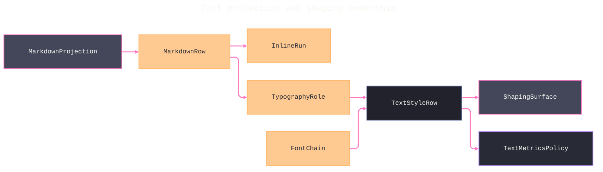

# [APPUI_TYPOGRAPHY_SHAPING]

One typographic law serves every AppUi surface: `TypographyRole` is the ten-row vocabulary every product text appearance traces to, `FontChain` rows make font admission deterministic per platform, and one HarfBuzz shaping rail places every Skia-rendered glyph. `MarkdownProjection` folds the Markdig AST into role-keyed rows so document panels ride the same vocabulary, and `TextMetricsPolicy` owns baseline-grid math and measurement. The package spine is Avalonia.Fonts.Inter for the embedded faces, SkiaSharp.HarfBuzz over the centrally pinned HarfBuzz natives for shaping, and Markdig for document structure; retained styles, chart paints, editor fonts, table columns, and shaped labels all consume one resolved `TextStyleRow`.

## [01]-[INDEX]

- [01]-[ROLE_AXIS]: Ten role rows; every text appearance literal traces here.
- [02]-[FONT_ADMISSION]: Deterministic embedded-Inter admission; ranked per-platform fallback chains.
- [03]-[SHAPING_RAIL]: One HarfBuzz shaping rail before every Skia glyph draw.
- [04]-[MARKDOWN_PROJECTION]: Markdig AST folds to role-keyed rows and inline runs.
- [05]-[TEXT_METRICS]: Baseline-grid math, measurement, trimming, tabular-numeral proof.

## [02]-[ROLE_AXIS]

- Owner: `TypographyRole`
- Cases: display, headline, title, subtitle, body, body-strong, caption, overline, code, numeric
- Entry: `public static TextStyleRow Resolve(TypographyRole role, FontChain chain)` — pure fold; the resolved row is the only typographic product any consumer reads.
- Auto: one role resolve yields retained styles, chart paints, editor fonts, table columns, and shaped Skia labels alike — per-label font, size, weight, and feature setup call sites are deleted.
- Packages: Thinktecture.Runtime.Extensions, LanguageExt.Core, BCL inbox
- Growth: a new text appearance is one `TypographyRole` row; zero new surface.
- Boundary: every size, weight, tracking, line-height, and OpenType-feature literal in AppUi traces to a role row — a bare font value at a call site is the named defect and the deleted pattern; numeric and temporal text arrives pre-formatted through the `ClockPolicy` NodaTime patterns and the `CompositeFormat` rail, and the numeric row guarantees tabular glyph geometry only; uppercase casing applies at presentation from the row flag; wrap behavior is a row column consumed by the metrics policy; the retained rail applies row values through `TextBlock.FontFeatures` (a `FontFeatureCollection`), `TextBlock.LetterSpacing`, `TextBlock.LineHeight`, and `TextBlock.TextTrimming`, and the shaping seam consumes the same tags through `TextShaperOptions.FontFeatures`.

```csharp signature

[SmartEnum<string>]
[KeyMemberEqualityComparer<ComparerAccessors.StringOrdinal, string>]
[KeyMemberComparer<ComparerAccessors.StringOrdinal, string>]
public sealed partial class TypographyRole {
    public static readonly TypographyRole Display = new("display", size: 32d, lineHeight: 40d, weight: 600, tracking: -0.02d, mono: false, uppercase: false, wraps: false, features: Seq("calt"));
    public static readonly TypographyRole Headline = new("headline", size: 24d, lineHeight: 32d, weight: 600, tracking: -0.01d, mono: false, uppercase: false, wraps: false, features: Seq("calt"));
    public static readonly TypographyRole Title = new("title", size: 18d, lineHeight: 24d, weight: 600, tracking: 0d, mono: false, uppercase: false, wraps: false, features: Seq("calt"));
    public static readonly TypographyRole Subtitle = new("subtitle", size: 16d, lineHeight: 22d, weight: 500, tracking: 0d, mono: false, uppercase: false, wraps: true, features: Seq("calt"));
    public static readonly TypographyRole Body = new("body", size: 14d, lineHeight: 20d, weight: 400, tracking: 0d, mono: false, uppercase: false, wraps: true, features: Seq("calt"));
    public static readonly TypographyRole BodyStrong = new("body-strong", size: 14d, lineHeight: 20d, weight: 600, tracking: 0d, mono: false, uppercase: false, wraps: true, features: Seq("calt"));
    public static readonly TypographyRole Caption = new("caption", size: 12d, lineHeight: 16d, weight: 400, tracking: 0d, mono: false, uppercase: false, wraps: true, features: Seq("calt"));
    public static readonly TypographyRole Overline = new("overline", size: 11d, lineHeight: 16d, weight: 500, tracking: 0.08d, mono: false, uppercase: true, wraps: false, features: Seq("calt"));
    public static readonly TypographyRole Code = new("code", size: 13d, lineHeight: 20d, weight: 400, tracking: 0d, mono: true, uppercase: false, wraps: false, features: Seq("calt"));
    public static readonly TypographyRole Numeric = new("numeric", size: 14d, lineHeight: 20d, weight: 400, tracking: 0d, mono: false, uppercase: false, wraps: false, features: Seq("tnum", "calt", "ss01"));

    public double Size { get; }

    public double LineHeight { get; }

    public int Weight { get; }

    public double Tracking { get; }

    public bool Mono { get; }

    public bool Uppercase { get; }

    public bool Wraps { get; }

    public Seq<string> Features { get; }
}

public sealed record TextStyleRow(string Family, double Size, int Weight, double Tracking, double LineHeight, Seq<string> Features, bool Uppercase, bool Wraps) {
    public static TextStyleRow Resolve(TypographyRole role, FontChain chain) =>
        new(
            Family: string.Join(", ", role.Mono ? chain.Mono : chain.Sans),
            Size: role.Size,
            Weight: role.Weight,
            Tracking: role.Tracking,
            LineHeight: role.LineHeight,
            Features: role.Features,
            Uppercase: role.Uppercase,
            Wraps: role.Wraps);
}
```

## [03]-[FONT_ADMISSION]

- Owner: `FontChain` `[SmartEnum<string>]`; `TypographyFault` the closed admission and shaping-failure family.
- Cases: MacOS | Windows | Linux
- Entry: `public static AppBuilder Admit(AppBuilder builder, FontChain chain)` — one boot-time admission on the application builder; no second font registration path exists.
- Packages: Avalonia.Fonts.Inter, Avalonia, SkiaSharp, LanguageExt.Core
- Growth: a new platform or script coverage is one `FontChain` row or one ranked family value on an existing row; zero new surface.
- Boundary: the chain row binds once at composition from the resolved profile — ambient OS probing and system-font assumptions are the deleted patterns; `WithInterFont` registers the embedded collection under the `fonts:Inter` key through the `ConfigureFonts(Action<FontManager>)` seam, `FontManagerOptions.DefaultFamilyName` pins the `fonts:Inter#Inter` family so embedded Inter resolves first on every surface, and the ranked host families plus the symbols terminator land as `FontFallbacks` rows; the mono ranks exist for the code role only and resolve through `SKFontManager.MatchFamily` on the Skia side; an uncovered codepoint routes through the `SKFontManager.MatchCharacter` tail — the interactive-only fallback probe — while evidence surfaces stay on the frozen chain so proof rendering never depends on host font inventory.

```csharp signature
[Union(ConversionFromValue = ConversionOperatorsGeneration.None)]
public abstract partial record TypographyFault : Expected {
    private TypographyFault(string detail, int code) : base(detail, code) { }
    public sealed record FaceUnresolved(string Detail) : TypographyFault($"typography/face: {Detail}", AppUiFaultBand.Theme.Code(3));
    public sealed record FaceAdmissionRejected(string Detail) : TypographyFault($"typography/harfbuzz-face: {Detail}", AppUiFaultBand.Theme.Code(4));
}

[SmartEnum<string>]
[KeyMemberEqualityComparer<ComparerAccessors.StringOrdinal, string>]
[KeyMemberComparer<ComparerAccessors.StringOrdinal, string>]
public sealed partial class FontChain {
    public static readonly FontChain MacOS = new("osx", sans: Seq("Inter", "SF Pro Text"), mono: Seq("SF Mono", "Menlo"), symbols: "Apple Color Emoji");
    public static readonly FontChain Windows = new("win", sans: Seq("Inter", "Segoe UI"), mono: Seq("Cascadia Mono", "Consolas"), symbols: "Segoe UI Emoji");
    public static readonly FontChain Linux = new("linux", sans: Seq("Inter", "Noto Sans"), mono: Seq("Noto Sans Mono", "DejaVu Sans Mono"), symbols: "Noto Color Emoji");

    public Seq<string> Sans { get; }

    public Seq<string> Mono { get; }

    public string Symbols { get; }

    public Fin<SKTypeface> Face(SKFontManager manager, bool mono, Option<Rune> demand) =>
        demand.Match(
            Some: rune => (mono ? Mono : Sans)
                .Choose(family => Optional(manager.MatchCharacter(
                    family, SKFontStyleWeight.Normal, SKFontStyleWidth.Normal, SKFontStyleSlant.Upright, null, rune.Value)))
                .HeadOrNone()
                .Match(
                    Some: Fin.Succ,
                    None: () => Optional(manager.MatchCharacter(
                            Symbols, SKFontStyleWeight.Normal, SKFontStyleWidth.Normal, SKFontStyleSlant.Upright, null, rune.Value))
                        .ToFin(new TypographyFault.FaceUnresolved($"{Key}/{rune}"))),
            None: () => (mono ? Mono : Sans)
                .Choose(family => Optional(manager.MatchFamily(family)))
                .HeadOrNone()
                .Match(
                    Some: Fin.Succ,
                    None: () => Optional(manager.MatchFamily(Symbols)).ToFin(new TypographyFault.FaceUnresolved(Key))));
}

public static class FontAdmission {
    public const string EmbeddedInter = "fonts:Inter#Inter";

    public static AppBuilder Admit(AppBuilder builder, FontChain chain) =>
        builder
            .WithInterFont()
            .With(new FontManagerOptions {
                DefaultFamilyName = EmbeddedInter,
                FontFallbacks = [
                    .. chain.Sans.Tail.Map(static family => new FontFallback { FontFamily = family }),
                    new FontFallback { FontFamily = chain.Symbols },
                ],
            });
}
```

## [04]-[SHAPING_RAIL]

- Owner: `RunSpec` — the pinned segment-property row; `FaceHandle` — the once-per-face HarfBuzz admission capsule; `ShapedRun` — the shaped product and single measurement authority; `ShapingSurface` — the one shape-then-draw rail.
- Entry: `public static ShapedRun Shape(string text, RunSpec spec, FaceHandle face, SKFont raster, params Feature[] features)` — the one shaping fold; `DrawLabel` draws a shaped run onto a caller-leased canvas, and the lease rail lives with the canvas owner.
- Receipt: the first shaped draw on a profile emits the libHarfBuzzSharp load identity — version, path, RID — as a `NativeAssetFact` riding the evidence union's `NativeAssetIdentity` case through `ReceiptSinkPort`.
- Packages: SkiaSharp.HarfBuzz, SkiaSharp, HarfBuzzSharp.NativeAssets.macOS, HarfBuzzSharp.NativeAssets.Linux, LanguageExt.Core
- Growth: a new script or feature requirement is one policy value on the role row riding the same shaping call; zero new surface.
- Boundary: shaping precedes drawing for every Skia-rendered glyph. `FaceHandle.Open` traps font-stream admission onto `Fin`, retains the `SKStreamAsset` for the complete HarfBuzz blob lifetime, and disposes font, face, blob, and stream in reverse ownership order. `ShapingSurface.Shape` drives `Font.Shape(Buffer, Feature[])` over a caller-pinned `RunSpec`, reads the zero-allocation glyph-info and glyph-position spans, projects both horizontal and vertical advances into canvas coordinates, and returns an owned `ShapedRun`. `ShapedRun.Advance` is the sole measurement product, `Clusters` preserves source indices for hit testing and caret placement, and disposing the run releases its `SKTextBlob`. String convenience shaping, unshaped measurement, caller-owned blob disposal, and a HarfBuzz blob outliving its backing stream are rejected forms.

```csharp signature
public readonly record struct RunSpec(Direction Direction, Script Script, Language Language, ClusterLevel Level);

public sealed class FaceHandle : IDisposable {
    public const int DesignScale = 512;

    private readonly Blob blob;
    private readonly Face face;
    private readonly SKStreamAsset stream;

    private FaceHandle(SKTypeface typeface) {
        stream = typeface.OpenStream(out int ttcIndex);
        blob = stream.ToHarfBuzzBlob();
        face = new Face(blob, ttcIndex);
        face.MakeImmutable();
        Font = new Font(face);
        Font.SetScale(DesignScale, DesignScale);
    }

    public Font Font { get; }

    public static Fin<FaceHandle> Open(SKTypeface typeface) =>
        Try.lift(() => new FaceHandle(typeface)).Run()
            .MapFail(error => new TypographyFault.FaceAdmissionRejected(error.Message));

    public void Dispose() { Font.Dispose(); face.Dispose(); blob.Dispose(); stream.Dispose(); }
}

public sealed class ShapedRun(SKTextBlob blob, SKPoint advance, ImmutableArray<int> clusters) : IDisposable {
    public SKTextBlob Blob { get; } = blob;

    public SKPoint Advance { get; } = advance;

    public ImmutableArray<int> Clusters { get; } = clusters;

    public void Dispose() => Blob.Dispose();
}

public static class ShapingSurface {
    public static ShapedRun Shape(string text, RunSpec spec, FaceHandle face, SKFont raster, params Feature[] features) {
        using Buffer buffer = new();
        buffer.AddUtf16(text);
        (buffer.Direction, buffer.Script, buffer.Language, buffer.ClusterLevel) = (spec.Direction, spec.Script, spec.Language, spec.Level);
        face.Font.Shape(buffer, features);
        ReadOnlySpan<GlyphInfo> infos = buffer.GetGlyphInfoSpan();
        ReadOnlySpan<GlyphPosition> positions = buffer.GetGlyphPositionSpan();
        float scale = raster.Size / FaceHandle.DesignScale;
        using SKTextBlobBuilder builder = new();
        SKRawRunBuffer<ushort> run = builder.AllocateRawPositionedRun(raster, infos.Length, null);
        Span<ushort> glyphs = run.Glyphs;
        Span<SKPoint> points = run.Positions;
        ImmutableArray<int>.Builder clusters = ImmutableArray.CreateBuilder<int>(infos.Length);
        SKPoint cursor = SKPoint.Empty;
        for (int i = 0; i < infos.Length; i++) {                          // Span-backed glyph fill prevents the array-copying property path.
            glyphs[i] = (ushort)infos[i].Codepoint;
            points[i] = new SKPoint(cursor.X + (positions[i].XOffset * scale), cursor.Y - (positions[i].YOffset * scale));
            clusters.Add((int)infos[i].Cluster);
            cursor = new SKPoint(cursor.X + (positions[i].XAdvance * scale), cursor.Y - (positions[i].YAdvance * scale));
        }
        return new ShapedRun(builder.Build(), cursor, clusters.MoveToImmutable());
    }

    public static Unit DrawLabel(SKCanvas canvas, ShapedRun run, SKPaint paint, float x, float y) =>
        fun(() => canvas.DrawTextBlob(run.Blob, x, y, paint))();
}
```

## [05]-[MARKDOWN_PROJECTION]

- Owner: `MarkdownProjection`
- Cases: Heading | Paragraph | Quote | Callout | ListRows | Definitions | Grid | CodeFence | Math | Rule | Opaque — the closed eleven-arm block fold; every arm carries its `SourceSpan`, grids retain header state and cell coordinates/spans, lists retain order and bullet grammar, and code fences retain language plus arguments. `InlineContent` closes text, code, math, break, task, and opaque payload modalities; `InlineStyle` composes strong, emphasis, and strike aspects; `LinkTarget` distinguishes hyperlinks from images.
- Entry: `public static MarkdownDocumentRows Project(string markdown)` — pure fold from document text to role-keyed rows plus the front-matter row; presentation consumes rows, never the AST.
- Auto: `TrackTrivia` plus `PreciseSourceLocation` make every `MarkdownRow` carry its source `Span`, so an editor round-trip maps a retained row back to its source range with zero second parse; the `UseYamlFrontMatter` and `UseFootnotes` builder rows admit the front-matter and footnote constructs into the pipeline, and the `MarkdownDocumentRows.FrontMatter` and `Footnotes` fields populate live — the front-matter block's raw line text and the label-keyed footnote definitions folded through the one `Runs` inline projection.
- Packages: Markdig, Thinktecture.Runtime.Extensions, LanguageExt.Core
- Growth: a new document construct is one `MarkdownRow` case plus one dispatch arm on the same fold; a new extension is one builder row on the one pipeline; zero new surface.
- Boundary: the pipeline admits only extensions with owned projection arms. Table structure lands as `GridRow` and `GridCell` values rather than nested anonymous sequences; task state, line breaks, code, math, and raw HTML land as distinct `InlineContent` cases; formatting composes through one flags value; and links preserve destination, title, and image modality through `LinkTarget`. `UseMathematics` projects engineering notation without typesetting it, `UseAdvancedExtensions` stays absent because no owner admits its diagram and container grammars, raw HTML becomes explicit opaque evidence rather than empty text, and every unmatched block carries its node identity and span. Retained materialization consumes the closed inline family and never infers modality from boolean combinations or sentinel text.

```csharp signature
[Union(ConversionFromValue = ConversionOperatorsGeneration.None)]
public abstract partial record MarkdownRow {
    private MarkdownRow() { }

    public sealed record Heading(TypographyRole Role, Seq<InlineRun> Runs, Option<string> Anchor, SourceSpan Span) : MarkdownRow;

    public sealed record Paragraph(Seq<InlineRun> Runs, SourceSpan Span) : MarkdownRow;

    public sealed record Quote(Seq<MarkdownRow> Children, SourceSpan Span) : MarkdownRow;

    public sealed record Callout(string Kind, Seq<MarkdownRow> Children, SourceSpan Span) : MarkdownRow;

    public sealed record ListRows(bool Ordered, int Order, char Bullet, Seq<Seq<MarkdownRow>> Items, SourceSpan Span) : MarkdownRow;

    public sealed record Definitions(Seq<(Seq<InlineRun> Term, Seq<MarkdownRow> Body)> Items, SourceSpan Span) : MarkdownRow;

    public sealed record Grid(Seq<GridRow> Rows, SourceSpan Span) : MarkdownRow;

    public sealed record CodeFence(string Language, string Arguments, string Source, SourceSpan Span) : MarkdownRow;

    public sealed record Math(string Source, SourceSpan Span) : MarkdownRow;

    public sealed record Rule(SourceSpan Span) : MarkdownRow;

    public sealed record Opaque(string Node, SourceSpan Span) : MarkdownRow;
}

public readonly record struct GridRow(bool IsHeader, Seq<GridCell> Cells, SourceSpan Span);

public readonly record struct GridCell(int ColumnIndex, int ColumnSpan, int RowSpan, Seq<InlineRun> Runs, SourceSpan Span);

[Flags]
public enum InlineStyle { None = 0, Strong = 1, Emphasis = 2, Strike = 4 }

[Union(ConversionFromValue = ConversionOperatorsGeneration.None)]
public abstract partial record InlineContent {
    private InlineContent() { }
    public sealed record Text(string Value) : InlineContent;
    public sealed record Code(string Value) : InlineContent;
    public sealed record Math(string Value) : InlineContent;
    public sealed record Break(bool Hard) : InlineContent;
    public sealed record Task(bool Checked) : InlineContent;
    public sealed record Opaque(string Node) : InlineContent;
}

[Union(ConversionFromValue = ConversionOperatorsGeneration.None)]
public abstract partial record LinkTarget {
    private LinkTarget() { }
    public sealed record Hyperlink(string Destination, Option<string> Title) : LinkTarget;
    public sealed record Image(string Destination, Option<string> Title) : LinkTarget;
}

public readonly record struct InlineRun(InlineContent Content, InlineStyle Style, Option<LinkTarget> Link, SourceSpan Span);

public sealed record MarkdownDocumentRows(Seq<MarkdownRow> Body, Option<string> FrontMatter, HashMap<string, Seq<InlineRun>> Footnotes);

public static class MarkdownProjection {
    public static readonly MarkdownPipeline Pipeline =
        new MarkdownPipelineBuilder { PreciseSourceLocation = true, TrackTrivia = true }
            .UsePipeTables()
            .UseGridTables()
            .UseEmphasisExtras()
            .UseDefinitionLists()
            .UseAlertBlocks()
            .UseTaskLists()
            .UseAutoIdentifiers()
            .UseMathematics()
            .UseYamlFrontMatter()
            .UseFootnotes()
            .Build();

    public static MarkdownDocumentRows Project(string markdown) =>
        Markdown.Parse(markdown, Pipeline) switch {
            var document => new MarkdownDocumentRows(
                Body: toSeq<Block>(document).Filter(static block =>
                    block is not (Markdig.Extensions.Yaml.YamlFrontMatterBlock or Markdig.Extensions.Footnotes.FootnoteGroup)).Map(Row),
                FrontMatter: toSeq<Block>(document)
                    .Find(static block => block is Markdig.Extensions.Yaml.YamlFrontMatterBlock)
                    .Map(static block => ((Markdig.Extensions.Yaml.YamlFrontMatterBlock)block).Lines.ToString()),
                Footnotes: Footnotes(document)),
        };

    // Footnote definitions key by label; content flattens each definition's leaf blocks through the one
    // Runs fold, so a footnote body and a paragraph share one inline projection.
    static HashMap<string, Seq<InlineRun>> Footnotes(MarkdownDocument document) =>
        toHashMap(toSeq(document.Descendants<Markdig.Extensions.Footnotes.Footnote>())
            .Bind(static note => Optional(note.Label)
                .Map(label => (label, toSeq(note.Descendants<LeafBlock>()).Bind(Runs)))
                .ToSeq()));

    public static TypographyRole HeadingRole(int level) =>
        level switch { 1 => TypographyRole.Headline, 2 => TypographyRole.Title, 3 => TypographyRole.Subtitle, _ => TypographyRole.BodyStrong };

    private static MarkdownRow Row(Block block) =>
        block switch {
            HeadingBlock heading => new MarkdownRow.Heading(HeadingRole(heading.Level), Runs(heading), Optional(heading.TryGetAttributes()?.Id), heading.Span),
            Markdig.Extensions.Mathematics.MathBlock math => new MarkdownRow.Math(math.Lines.ToString(), math.Span),
            FencedCodeBlock fence => new MarkdownRow.CodeFence(fence.Info ?? "", fence.Arguments ?? "", fence.Lines.ToString(), fence.Span),
            CodeBlock code => new MarkdownRow.CodeFence("", "", code.Lines.ToString(), code.Span),
            Markdig.Extensions.Alerts.AlertBlock alert => new MarkdownRow.Callout(alert.Kind.ToString(), toSeq<Block>(alert).Map(Row), alert.Span),
            QuoteBlock quote => new MarkdownRow.Quote(toSeq<Block>(quote).Map(Row), quote.Span),
            Markdig.Extensions.Tables.Table table => new MarkdownRow.Grid(
                toSeq<Block>(table).Map(static row => (Markdig.Extensions.Tables.TableRow)row).Map(static row => new GridRow(
                    row.IsHeader,
                    toSeq<Block>(row).Map(static cell => (Markdig.Extensions.Tables.TableCell)cell).Map(static cell => new GridCell(
                        cell.ColumnIndex,
                        cell.ColumnSpan,
                        cell.RowSpan,
                        toSeq<Block>(cell).Bind(static inner => inner is LeafBlock leaf ? Runs(leaf) : Seq<InlineRun>()),
                        cell.Span)),
                    row.Span)),
                table.Span),
            Markdig.Extensions.DefinitionLists.DefinitionList definitions => new MarkdownRow.Definitions(
                toSeq<Block>(definitions).Map(static item => (
                    toSeq<Block>((ContainerBlock)item).Bind(static child => child is Markdig.Extensions.DefinitionLists.DefinitionTerm term ? Runs(term) : Seq<InlineRun>()),
                    toSeq<Block>((ContainerBlock)item).Filter(static child => child is not Markdig.Extensions.DefinitionLists.DefinitionTerm).Map(Row))), definitions.Span),
            ListBlock list => new MarkdownRow.ListRows(list.IsOrdered, list.Order, list.BulletType, toSeq<Block>(list).Map(static item => toSeq<Block>((ListItemBlock)item).Map(Row)), list.Span),
            ThematicBreakBlock rule => new MarkdownRow.Rule(rule.Span),
            ParagraphBlock paragraph => new MarkdownRow.Paragraph(Runs(paragraph), paragraph.Span),
            LeafBlock leaf => new MarkdownRow.Paragraph(Runs(leaf), leaf.Span),
            var unmatched => new MarkdownRow.Opaque(unmatched.GetType().Name, unmatched.Span),
        };

    private static Seq<InlineRun> Runs(LeafBlock leaf) =>
        Optional(leaf.Inline)
            .Map(static inline => toSeq(inline.Descendants<LeafInline>()).Map(Flatten))
            .IfNone(Seq<InlineRun>());

    private static InlineRun Flatten(LeafInline node) =>
        node switch {
            CodeInline code => new InlineRun(new InlineContent.Code(code.Content), InlineStyle.None, None, code.Span),
            Markdig.Extensions.Mathematics.MathInline math => new InlineRun(new InlineContent.Math(math.Content.ToString()), InlineStyle.None, None, math.Span),
            TaskList task => new InlineRun(new InlineContent.Task(task.Checked), InlineStyle.None, None, task.Span),
            LiteralInline literal => new InlineRun(
                Content: new InlineContent.Text(literal.Content.ToString()),
                Style: Style(literal),
                Link: Link(literal),
                Span: literal.Span),
            AutolinkInline auto => new InlineRun(new InlineContent.Text(auto.Url), InlineStyle.None, Some<LinkTarget>(new LinkTarget.Hyperlink(auto.Url, None)), auto.Span),
            HtmlEntityInline entity => new InlineRun(new InlineContent.Text(entity.Transcoded.ToString()), InlineStyle.None, None, entity.Span),
            LineBreakInline brk => new InlineRun(new InlineContent.Break(brk.IsHard), InlineStyle.None, None, brk.Span),
            HtmlInline html => new InlineRun(new InlineContent.Opaque(nameof(HtmlInline)), InlineStyle.None, None, html.Span),
            _ => new InlineRun(new InlineContent.Opaque(node.GetType().Name), InlineStyle.None, None, node.Span),
        };

    private static InlineStyle Style(Inline node) =>
        Ancestry(node).Fold(InlineStyle.None, static (style, ancestor) => ancestor switch {
            EmphasisInline { DelimiterChar: '*' or '_', DelimiterCount: >= 2 } => style | InlineStyle.Strong,
            EmphasisInline { DelimiterChar: '*' or '_', DelimiterCount: 1 } => style | InlineStyle.Emphasis,
            EmphasisInline { DelimiterChar: '~', DelimiterCount: 2 } => style | InlineStyle.Strike,
            _ => style,
        });

    private static Option<LinkTarget> Link(Inline node) =>
        Ancestry(node).Choose(static ancestor => ancestor is LinkInline link
            ? Some<LinkTarget>(link.IsImage
                ? new LinkTarget.Image(link.Url ?? "", Optional(link.Title))
                : new LinkTarget.Hyperlink(link.Url ?? "", Optional(link.Title)))
            : None).HeadOrNone();

    private static Seq<Inline> Ancestry(Inline node) =>
        Optional(node.Parent)
            .Map(static parent => ((Inline)parent).Cons(Ancestry(parent)))
            .IfNone(Seq<Inline>());
}
```



## [06]-[TEXT_METRICS]

- Owner: `TextMetricsPolicy`
- Entry: `public double LineBox(SKFontMetrics metrics)` — pure value; the snapped line box every text container sizes against.
- Packages: SkiaSharp, BCL inbox
- Growth: a new metric rule is one policy value on `TextMetricsPolicy`; zero new surface.
- Boundary: measurement consumes `ShapedRun.Advance` and font metrics from the shaping rail — unshaped `MeasureText(string)` and hand-rolled width estimation are deleted patterns; the positive baseline unit snaps every text box so mixed-role layouts share one vertical rhythm; non-wrapping roles trim with character ellipsis at the retained layer per the role row's wrap column; tabular advance constancy for the numeric role is proven by equal shaped advances over digit permutations in headless evidence.

```csharp signature
public sealed record TextMetricsPolicy {
    private TextMetricsPolicy(double baselineUnit) => BaselineUnit = baselineUnit;

    public static readonly TextMetricsPolicy Grid = new(baselineUnit: 4d);

    public double BaselineUnit { get; }

    public double Snap(double height) => Math.Ceiling(height / BaselineUnit) * BaselineUnit;

    public double LineBox(SKFontMetrics metrics) => Snap(metrics.Descent - metrics.Ascent + metrics.Leading);

    public double CapCenter(SKFontMetrics metrics, double box) => (box + metrics.CapHeight) / 2d;

    public static SKPoint Advance(ShapedRun run) => run.Advance;
}
```

## [07]-[RESEARCH]

- [FRONT_MATTER_AST]: the front-matter and footnote AST node types and member accessors — the front-matter block and its line text, the footnote group and footnote label, and the typed descendant traversal that populates the `FrontMatter` and `Footnotes` fields from the parsed document, against the Markdig extension block families beyond the catalogued `UseYamlFrontMatter`/`UseFootnotes` builder rows.
- [EXTENSION_AST]: the extension AST node spellings the catalogued builder rows admit but the catalog's roster omits — `Markdig.Extensions.Alerts.AlertBlock` and its `Kind` slice, the `Markdig.Extensions.DefinitionLists.DefinitionList`/`DefinitionItem`/`DefinitionTerm` family, the `Markdig.Extensions.Mathematics.MathBlock`/`MathInline` pair and its `Content` slice, `AutolinkInline.Url`, and `HtmlEntityInline.Transcoded` — decompile-verified against the pinned Markdig assembly.
- [FEATURE_TAG_CTOR]: the exact `HarfBuzzSharp.Feature`/`Tag` construction spelling minting a `Feature` from a role's four-character OpenType tag string — the one tag-mint delegate the composition root binds for the shaping rail.
