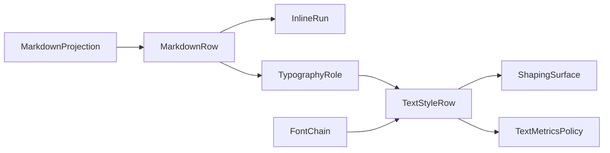

# [APPUI_TYPOGRAPHY_SHAPING]

One typographic law serves every AppUi surface: `TypographyRole` is the ten-row vocabulary every product text appearance traces to, `FontChain` rows make font admission deterministic per platform, and one HarfBuzz shaping rail places every Skia-rendered glyph. `MarkdownProjection` folds the Markdig AST into role-keyed rows so document panels ride the same vocabulary, and `TextMetricsPolicy` owns baseline-grid math and measurement. The package spine is Avalonia.Fonts.Inter for the embedded faces, SkiaSharp.HarfBuzz over the centrally pinned HarfBuzz natives for shaping, and Markdig for document structure; retained styles, chart paints, editor fonts, table columns, and shaped labels all consume one resolved `TextStyleRow`.

## [01]-[INDEX]

- [01]-[ROLE_AXIS]: Ten role rows; every text appearance literal traces here.
- [02]-[FONT_ADMISSION]: Deterministic embedded-Inter admission; ranked per-platform fallback chains.
- [03]-[SHAPING_RAIL]: One HarfBuzz shaping rail before every Skia glyph draw.
- [04]-[MARKDOWN_PROJECTION]: Markdig AST folds to role-keyed rows and inline runs.
- [05]-[TEXT_METRICS]: Baseline-grid math, measurement, trimming, tabular-numeral proof.

## [02]-[ROLE_AXIS]

- Owner: `TypographyRole`
- Cases: display, headline, title, subtitle, body, body-strong, caption, overline, code, numeric
- Entry: `public static TextStyleRow Resolve(TypographyRole role, FontChain chain)` — pure fold; the resolved row is the only typographic product any consumer reads.
- Auto: one role resolve yields retained styles, chart paints, editor fonts, table columns, and shaped Skia labels alike — per-label font, size, weight, and feature setup call sites are deleted.
- Packages: Thinktecture.Runtime.Extensions, LanguageExt.Core, BCL inbox
- Growth: a new text appearance is one `TypographyRole` row; zero new surface.
- Boundary: every size, weight, tracking, line-height, and OpenType-feature literal in AppUi traces to a role row — a bare font value at a call site is the named defect and the deleted pattern; numeric and temporal text arrives pre-formatted through the `ClockPolicy` NodaTime patterns and the `CompositeFormat` rail, and the numeric row guarantees tabular glyph geometry only; uppercase casing applies at presentation from the row flag; wrap behavior is a row column consumed by the metrics policy; the retained rail applies row values through `TextBlock.FontFeatures` (a `FontFeatureCollection`), `TextBlock.LetterSpacing`, `TextBlock.LineHeight`, and `TextBlock.TextTrimming`, and the shaping seam consumes the same tags through `TextShaperOptions.FontFeatures`.

```csharp signature

[SmartEnum<string>]
[KeyMemberEqualityComparer<ComparerAccessors.StringOrdinal, string>]
[KeyMemberComparer<ComparerAccessors.StringOrdinal, string>]
public sealed partial class TypographyRole {
    public static readonly TypographyRole Display = new("display", size: 32d, lineHeight: 40d, weight: 600, tracking: -0.02d, mono: false, uppercase: false, wraps: false, features: Seq("calt"));
    public static readonly TypographyRole Headline = new("headline", size: 24d, lineHeight: 32d, weight: 600, tracking: -0.01d, mono: false, uppercase: false, wraps: false, features: Seq("calt"));
    public static readonly TypographyRole Title = new("title", size: 18d, lineHeight: 24d, weight: 600, tracking: 0d, mono: false, uppercase: false, wraps: false, features: Seq("calt"));
    public static readonly TypographyRole Subtitle = new("subtitle", size: 16d, lineHeight: 22d, weight: 500, tracking: 0d, mono: false, uppercase: false, wraps: true, features: Seq("calt"));
    public static readonly TypographyRole Body = new("body", size: 14d, lineHeight: 20d, weight: 400, tracking: 0d, mono: false, uppercase: false, wraps: true, features: Seq("calt"));
    public static readonly TypographyRole BodyStrong = new("body-strong", size: 14d, lineHeight: 20d, weight: 600, tracking: 0d, mono: false, uppercase: false, wraps: true, features: Seq("calt"));
    public static readonly TypographyRole Caption = new("caption", size: 12d, lineHeight: 16d, weight: 400, tracking: 0d, mono: false, uppercase: false, wraps: true, features: Seq("calt"));
    public static readonly TypographyRole Overline = new("overline", size: 11d, lineHeight: 16d, weight: 500, tracking: 0.08d, mono: false, uppercase: true, wraps: false, features: Seq("calt"));
    public static readonly TypographyRole Code = new("code", size: 13d, lineHeight: 20d, weight: 400, tracking: 0d, mono: true, uppercase: false, wraps: false, features: Seq("calt"));
    public static readonly TypographyRole Numeric = new("numeric", size: 14d, lineHeight: 20d, weight: 400, tracking: 0d, mono: false, uppercase: false, wraps: false, features: Seq("tnum", "calt", "ss01"));

    public double Size { get; }

    public double LineHeight { get; }

    public int Weight { get; }

    public double Tracking { get; }

    public bool Mono { get; }

    public bool Uppercase { get; }

    public bool Wraps { get; }

    public Seq<string> Features { get; }
}

public sealed record TextStyleRow(string Family, double Size, int Weight, double Tracking, double LineHeight, Seq<string> Features, bool Uppercase, bool Wraps) {
    public static TextStyleRow Resolve(TypographyRole role, FontChain chain) =>
        new(
            Family: string.Join(", ", role.Mono ? chain.Mono : chain.Sans),
            Size: role.Size,
            Weight: role.Weight,
            Tracking: role.Tracking,
            LineHeight: role.LineHeight,
            Features: role.Features,
            Uppercase: role.Uppercase,
            Wraps: role.Wraps);
}
```

## [03]-[FONT_ADMISSION]

- Owner: `FontChain`
- Cases: MacOS | Windows | Linux
- Entry: `public static AppBuilder Admit(AppBuilder builder, FontChain chain)` — one boot-time admission on the application builder; no second font registration path exists.
- Packages: Avalonia.Fonts.Inter, Avalonia, SkiaSharp, LanguageExt.Core
- Growth: a new platform or script coverage is one `FontChain` row or one ranked family value on an existing row; zero new surface.
- Boundary: the chain row binds once at composition from the resolved profile — ambient OS probing and system-font assumptions are the deleted patterns; `WithInterFont` registers the embedded collection under the `fonts:Inter` key through the `ConfigureFonts(Action<FontManager>)` seam, `FontManagerOptions.DefaultFamilyName` pins the `fonts:Inter#Inter` family so embedded Inter resolves first on every surface, and the ranked host families plus the symbols terminator land as `FontFallbacks` rows; the mono ranks exist for the code role only and resolve through `SKFontManager.MatchFamily` on the Skia side.

```csharp signature
public sealed record FontChain(string Rid, Seq<string> Sans, Seq<string> Mono, string Symbols) {
    public static readonly FontChain MacOS = new("osx", Sans: Seq("Inter", "SF Pro Text"), Mono: Seq("SF Mono", "Menlo"), Symbols: "Apple Color Emoji");
    public static readonly FontChain Windows = new("win", Sans: Seq("Inter", "Segoe UI"), Mono: Seq("Cascadia Mono", "Consolas"), Symbols: "Segoe UI Emoji");
    public static readonly FontChain Linux = new("linux", Sans: Seq("Inter", "Noto Sans"), Mono: Seq("Noto Sans Mono", "DejaVu Sans Mono"), Symbols: "Noto Color Emoji");

    public SKTypeface Face(SKFontManager manager, bool mono) =>
        (mono ? Mono : Sans)
            .Map(family => manager.MatchFamily(family))
            .Filter(static face => face is not null)
            .HeadOrNone()
            .IfNone(() => manager.MatchFamily(Symbols));
}

public static class FontAdmission {
    public const string EmbeddedInter = "fonts:Inter#Inter";

    public static AppBuilder Admit(AppBuilder builder, FontChain chain) =>
        builder
            .WithInterFont()
            .With(new FontManagerOptions {
                DefaultFamilyName = EmbeddedInter,
                FontFallbacks = [
                    .. chain.Sans.Tail.Map(static family => new FontFallback { FontFamily = family }),
                    new FontFallback { FontFamily = chain.Symbols },
                ],
            });
}
```

## [04]-[SHAPING_RAIL]

- Owner: `ShapingSurface`
- Entry: `public static Unit DrawLabel(SKCanvas canvas, SKShaper shaper, SKFont font, SKPaint paint, string text, float x, float y)` — boundary write onto a caller-leased canvas; the lease rail lives with the canvas owner.
- Receipt: the first shaped draw on a profile emits the libHarfBuzzSharp load identity — version, path, RID — consumed as typography proof by the evidence stream.
- Packages: SkiaSharp.HarfBuzz, SkiaSharp, HarfBuzzSharp.NativeAssets.macOS, HarfBuzzSharp.NativeAssets.Linux, LanguageExt.Core
- Growth: a new script or feature requirement is one policy value on the role row riding the same shaping call; zero new surface.
- Boundary: shaping precedes drawing for every Skia-rendered glyph — manual glyph placement, per-script branches, and per-control glyph positioning are the deleted patterns; bidi and complex-script resolution happen inside the shaper; one central HarfBuzz native line serves the retained text stack and the shaped rail on every admitted macOS and headless-Linux profile; per-role feature tags enter the shaped rail as `HarfBuzzSharp.Feature` values through `Font.Shape(Buffer, params Feature[])`, and `SKShaper.Result` exposes `Codepoints`, `Clusters`, `Points`, and `Width` for direct glyph runs.

```csharp signature
public static class ShapingSurface {
    public static SKShaper Shaper(SKTypeface face) => new(face);

    public static Unit DrawLabel(SKCanvas canvas, SKShaper shaper, SKFont font, SKPaint paint, string text, float x, float y) =>
        fun(() => canvas.DrawShapedText(shaper, text, x, y, font, paint))();
}
```

## [05]-[MARKDOWN_PROJECTION]

- Owner: `MarkdownProjection`
- Cases: Heading | Paragraph | Quote | ListRows | Grid | CodeFence | Rule — the closed seven-arm fold; footnote, front-matter, task-list, and heading-anchor constructs ride existing arms and column slots, never an eighth case.
- Entry: `public static MarkdownDocumentRows Project(string markdown)` — pure fold from document text to role-keyed rows plus the front-matter row; presentation consumes rows, never the AST.
- Auto: `TrackTrivia` plus `PreciseSourceLocation` make every `MarkdownRow` carry its source `Span`, so an editor round-trip maps a retained row back to its byte range with zero second parse; the `UseYamlFrontMatter` and `UseFootnotes` builder rows admit the front-matter and footnote constructs into the pipeline, and the `MarkdownDocumentRows.FrontMatter` and `Footnotes` fields ride reserved on the document-rows product until their AST node-type traversal resolves.
- Packages: Markdig, Thinktecture.Runtime.Extensions, LanguageExt.Core
- Growth: a new document construct is one `MarkdownRow` case plus one dispatch arm on the same fold; a new extension is one builder row on the one pipeline; zero new surface.
- Boundary: the pipeline is built once with in-package extensions only, and `UseAdvancedExtensions` admits the pipe-table family whose `Table`/`TableRow`/`TableCell` blocks fold into the `Grid` arm and the `UseTaskLists` and `UseAutoIdentifiers` task-list and heading-anchor constructs while `UseYamlFrontMatter` and `UseFootnotes` admit the front-matter and footnote constructs into the pipeline and `TrackTrivia` plus `PreciseSourceLocation` admit the round-trip span fidelity; task-list checkboxes fold into the `InlineRun.Checked` column read from the `TaskList.Checked` inline state so a checklist item carries its toggle without an eighth row, and the `UseAutoIdentifiers` heading slug folds into the `Heading.Anchor` column read from the `HtmlAttributes.Id` set by `TryGetAttributes`, so an in-document link target rides the heading row; the front-matter and footnote AST node-type traversal that populates the `FrontMatter` and `Footnotes` fields is research-gated under FRONT_MATTER_AST; `UseMathematics` and `UseDiagrams` stay excluded by design — the seven-arm fold owns no math or diagram node and a math construct degrades to a `Paragraph` of its source runs; `CodeFence` payloads hand off to the code-editor surface with their language tag — the projection never highlights or renders code; `HtmlBlock` and `HtmlInline` payloads degrade to empty runs so raw HTML never enters the retained tree; document headings cap at `Headline` — `Display` is reserved for shell hero text; the `Descendants<T>` typed traversal is the one document-fold algebra shared with the inspector descriptor synthesis and the SVG scene-node walk, parameterized by node family; Markdown.Avalonia and any parallel Markdown node model are the deleted patterns; retained materialization renders `InlineRun` sequences through the `Avalonia.Controls.Documents` family — `Run` inside `Span`, `Bold`, and `Italic` with `LineBreak`, appended to one `InlineCollection`.

```csharp signature
[Union(ConversionFromValue = ConversionOperatorsGeneration.None)]
public abstract partial record MarkdownRow {
    private MarkdownRow() { }

    public sealed record Heading(TypographyRole Role, Seq<InlineRun> Runs, Option<string> Anchor) : MarkdownRow;

    public sealed record Paragraph(Seq<InlineRun> Runs) : MarkdownRow;

    public sealed record Quote(Seq<MarkdownRow> Children) : MarkdownRow;

    public sealed record ListRows(bool Ordered, Seq<Seq<MarkdownRow>> Items) : MarkdownRow;

    public sealed record Grid(Seq<Seq<Seq<InlineRun>>> Rows) : MarkdownRow;

    public sealed record CodeFence(string Language, string Source) : MarkdownRow;

    public sealed record Rule : MarkdownRow;
}

public readonly record struct InlineRun(string Text, bool Strong, bool Emphasis, bool Code, Option<string> Link, Option<bool> Checked, SourceSpan Span);

public sealed record MarkdownDocumentRows(Seq<MarkdownRow> Body, Option<string> FrontMatter, HashMap<string, Seq<InlineRun>> Footnotes);

public static class MarkdownProjection {
    public static readonly MarkdownPipeline Pipeline =
        new MarkdownPipelineBuilder { PreciseSourceLocation = true, TrackTrivia = true }
            .UseAdvancedExtensions()
            .UseTaskLists()
            .UseAutoIdentifiers()
            .UseYamlFrontMatter()
            .UseFootnotes()
            .Build();

    public static MarkdownDocumentRows Project(string markdown) =>
        Markdown.Parse(markdown, Pipeline) switch {
            var document => new MarkdownDocumentRows(
                Body: toSeq<Block>(document).Map(Row),
                FrontMatter: None,
                Footnotes: HashMap<string, Seq<InlineRun>>()),
        };

    public static TypographyRole HeadingRole(int level) =>
        level switch { 1 => TypographyRole.Headline, 2 => TypographyRole.Title, 3 => TypographyRole.Subtitle, _ => TypographyRole.BodyStrong };

    private static MarkdownRow Row(Block block) =>
        block switch {
            HeadingBlock heading => new MarkdownRow.Heading(HeadingRole(heading.Level), Runs(heading), Optional(heading.TryGetAttributes()?.Id)),
            FencedCodeBlock fence => new MarkdownRow.CodeFence(fence.Info ?? "", fence.Lines.ToString()),
            CodeBlock code => new MarkdownRow.CodeFence("", code.Lines.ToString()),
            QuoteBlock quote => new MarkdownRow.Quote(toSeq<Block>(quote).Map(Row)),
            Markdig.Extensions.Tables.Table table => new MarkdownRow.Grid(
                toSeq<Block>(table).Map(static row => toSeq<Block>((Markdig.Extensions.Tables.TableRow)row).Map(static cell =>
                    toSeq<Block>((Markdig.Extensions.Tables.TableCell)cell).Bind(static inner => inner is LeafBlock leaf ? Runs(leaf) : Seq<InlineRun>())))),
            ListBlock list => new MarkdownRow.ListRows(list.IsOrdered, toSeq<Block>(list).Map(static item => toSeq<Block>((ListItemBlock)item).Map(Row))),
            ThematicBreakBlock => new MarkdownRow.Rule(),
            ParagraphBlock paragraph => new MarkdownRow.Paragraph(Runs(paragraph)),
            LeafBlock leaf => new MarkdownRow.Paragraph(Runs(leaf)),
            ContainerBlock container => new MarkdownRow.Quote(toSeq<Block>(container).Map(Row)),
            _ => new MarkdownRow.Rule(),
        };

    private static Seq<InlineRun> Runs(LeafBlock leaf) =>
        Optional(leaf.Inline)
            .Map(static inline => toSeq(inline.Descendants<LeafInline>()).Map(Flatten))
            .IfNone(Seq<InlineRun>());

    private static InlineRun Flatten(LeafInline node) =>
        node switch {
            CodeInline code => new InlineRun(code.Content, Strong: false, Emphasis: false, Code: true, Link: None, Checked: None, Span: code.Span),
            TaskList task => new InlineRun("", Strong: false, Emphasis: false, Code: false, Link: None, Checked: Some(task.Checked), Span: task.Span),
            LiteralInline literal => new InlineRun(
                Text: literal.Content.ToString(),
                Strong: Ancestry(literal).Exists(static a => a is EmphasisInline { DelimiterCount: >= 2 }),
                Emphasis: Ancestry(literal).Exists(static a => a is EmphasisInline { DelimiterCount: 1 }),
                Code: false,
                Link: Ancestry(literal).Filter(static a => a is LinkInline).Map(static a => ((LinkInline)a).Url ?? "").HeadOrNone(),
                Checked: None,
                Span: literal.Span),
            LineBreakInline brk => new InlineRun(" ", Strong: false, Emphasis: false, Code: false, Link: None, Checked: None, Span: brk.Span),
            _ => new InlineRun("", Strong: false, Emphasis: false, Code: false, Link: None, Checked: None, Span: node.Span),
        };

    private static Seq<Inline> Ancestry(Inline node) =>
        Optional(node.Parent)
            .Map(static parent => ((Inline)parent).Cons(Ancestry(parent)))
            .IfNone(Seq<Inline>());
}
```



## [06]-[TEXT_METRICS]

- Owner: `TextMetricsPolicy`
- Entry: `public double LineBox(SKFontMetrics metrics)` — pure value; the snapped line box every text container sizes against.
- Packages: SkiaSharp, BCL inbox
- Growth: a new metric rule is one policy value on `TextMetricsPolicy`; zero new surface.
- Boundary: measurement uses `MeasureText` and the shaped rail only — hand-rolled width estimation is the deleted pattern; the baseline unit snaps every text box so mixed-role layouts share one vertical rhythm; non-wrapping roles trim with character ellipsis at the retained layer per the role row's wrap column; tabular advance constancy for the numeric role is proven by equal `Advance` results over digit permutations in headless evidence.

```csharp signature
public sealed record TextMetricsPolicy(double BaselineUnit) {
    public static readonly TextMetricsPolicy Grid = new(BaselineUnit: 4d);

    public double Snap(double height) => Math.Ceiling(height / BaselineUnit) * BaselineUnit;

    public double LineBox(SKFontMetrics metrics) => Snap(metrics.Descent - metrics.Ascent + metrics.Leading);

    public double CapCenter(SKFontMetrics metrics, double box) => (box + metrics.CapHeight) / 2d;

    public static float Advance(SKFont font, string text) => font.MeasureText(text);
}
```

## [07]-[RESEARCH]

- [FRONT_MATTER_AST]: the front-matter and footnote AST node types and member accessors — the front-matter block and its line text, the footnote group and footnote label, and the typed descendant traversal that populates the `FrontMatter` and `Footnotes` fields from the parsed document, against the Markdig extension block families beyond the catalogued `UseYamlFrontMatter`/`UseFootnotes` builder rows.

