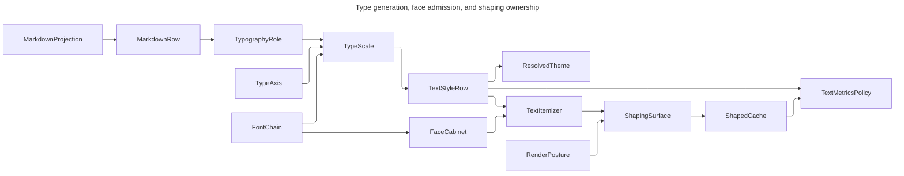

# [APPUI_TYPOGRAPHY_SHAPING]

Rasm.AppUi resolves every text appearance through one generated two-axis type table and renders every glyph through one itemizing shaping rail. `TypographyRole` authors eleven integer rungs on the four-pixel rhythm grid; `TypeAxis` carries the orthogonal emphasis, density, text-scale, and slant the role never spells; `TypeScale` is the one generation folding the two into a `TextStyleRow`, so a line height, a tracking value, or an emphasized weight is derived and an authored one is unrepresentable. `FontChain` ranks host families while face resolution keys on CAPABILITY — weight, width, slant, and codepoint coverage — and `FaceCabinet` holds one capsule per face instance with its variation coordinates, its palette election, its design scale read off the face's own units, and the discretionary features a shaped probe proved it implements. `TextItemizer` segments script, direction, and coverage before any shape, so mixed-script, bidirectional, or partially covered text becomes a run sequence and an uncovered codepoint is a refusal rather than a notdef box. `MarkdownProjection` folds the Markdig AST into role-keyed rows, and `TextMetricsPolicy` owns baseline rhythm, half-leading, decoration geometry, and caret folds. The spine is Avalonia.Fonts.Inter with the owned variable face, SkiaSharp with SkiaSharp.HarfBuzz over the centrally pinned HarfBuzz natives, HarfBuzzSharp for the control-altitude shaping surface, and Markdig for document structure.

Generation is the page's ruling shape, exactly as it is at `Theme/tokens`: a per-role line-height literal, a per-emphasis size column, and a per-density type table are all deleted forms. The token catalogue consumes the same generation — `ResolvedTheme.Types` carries the resolved rows and the Semi size and weight slots re-emit from them — so density and the host text-scale preference re-derive type and geometry together through one resolve.

## [01]-[INDEX]

- [02]-[ROLE_AXIS]: Eleven grid-snapped role rungs crossed with the emphasis, density, text-scale, and slant axis; the one generation and its token emission.
- [03]-[FONT_ADMISSION]: Capability-keyed face resolution, the owned variable face, per-instance capsules, probe-admitted features, and colour-palette election.
- [04]-[SHAPING_RAIL]: Itemization into script, direction, and coverage segments; the shaped fold; the leased shaped-run cache; declared render posture per surface class.
- [05]-[MARKDOWN_PROJECTION]: Markdig AST folds to role-keyed rows and inline runs.
- [06]-[TEXT_METRICS]: Baseline rhythm, half-leading and first-baseline law, decoration geometry, caret and selection folds, tabular proof.

## [02]-[ROLE_AXIS]

- Owner: `TypographyRole` `[SmartEnum<string>]` the eleven-rung role ladder; `TypeEmphasis`, `TypeSlant`, `TypeCasing`, `TrimPolicy`, `LeadingClass`, and `NumeralModality` `[SmartEnum<string>]` the orthogonal columns; `FeatureIntent` `[SmartEnum<string>]` the one OpenType-feature vocabulary; `WeightLadder` the shipped weight rungs; `TypeAxis` the resolution axis; `TypeScale` the generation; `TextStyleRow` the resolved product every consumer reads.
- Cases: `TypographyRole` = micro | caption | label | overline | body | code | numeric | section | title | headline | display; `TypeEmphasis` = quiet | regular | medium | strong; `TypeSlant` = upright | italic; `TypeCasing` = source | upper | small-caps; `TrimPolicy` = wrap | ellipsis | clip; `LeadingClass` = tight | snug | normal | loose; `NumeralModality` = proportional | tabular | slashed | disambiguated.
- Law: a role authors an INTEGER base size, a leading class, a weight rung, and the policy intrinsic to the role; everything else is generated. Emphasis is a STEP on the shipped weight ladder rather than an authored weight, so an emphasized row cannot name a weight the family never shipped. Line height is the leading factor snapped to the baseline unit and floored at the em, so an off-grid line box is unrepresentable. Tracking is the optical curve evaluated at the RESOLVED size under a declared em unit, projected to device pixels exactly once at the bind boundary, so a re-derived size carries its tracking with it. Density and the host text-scale multiply the base size before the snap, so the three axes compose in one fold and never as three tables.
- Entry: `public static TextStyleRow Resolve(TypographyRole role, FontChain chain, TypeAxis? axis = null)` — the one resolution, the absent axis resolving `TypeAxis.Baseline`; `public static TypeAxis Of(TypeEmphasis emphasis, DensityPolicy density, PreferenceCell preferences, TypeSlant slant)` mints the axis from the theme resolve; `public static FrozenDictionary<TokenKey, TextStyleRow> Expand(FontChain chain, DensityPolicy density, PreferenceCell preferences)` is the token-catalogue generation and `public static Seq<(TokenKey Key, object Value)> Emission(FrozenDictionary<TokenKey, TextStyleRow> rows)` its dictionary leaves.
- Auto: one resolve yields retained styles, chart paints, editor fonts, table columns, Semi size and weight slots, and shaped Skia labels alike — per-label font, size, weight, and feature setup call sites are deleted. `ResolvedTheme.Types` carries the expansion, so a density election or a text-scale flip re-derives every type surface inside the one theme resolve exactly as it re-derives every metric family.
- Packages: Thinktecture.Runtime.Extensions, LanguageExt.Core, Rasm (project — `UnitInterval`), Avalonia, BCL inbox
- Growth: a new text appearance is one `TypographyRole` row; a new emphasis is one ladder step; a new numeral posture is one `NumeralModality` row carrying its feature intents; a new face weight is one `WeightLadder` rung; zero new surface.
- Boundary: every size, weight, tracking, line-height, and OpenType-feature literal in AppUi traces to this generation — a bare font value at a call site is the named defect and the deleted pattern. The declared tracking unit is EM everywhere: `TextStyleRow.TrackingEm` is the generated value and `TrackingPx` the single projection a retained `LetterSpacing` or a shaped advance consumes, so a pixel tracking value never enters the table and never survives a size change. Emphasis moves the weight rung ALONE — size, leading, and tracking are emphasis-invariant, so the emission writes the geometric leaves once per role and the weight leaf once per emitted emphasis rather than four identical size keys that drift the moment one is edited. Casing applies at presentation from the row column and small-caps contributes its feature intent rather than a second string transform, trim behaviour is a row column the metrics policy consumes, and numeric and temporal text arrives pre-formatted through the `Theme/locale` temporal patterns and the `CompositeFormat` rail so the numeric row guarantees glyph geometry alone. The text-scale knob is a UNIT interval whose midpoint is the neutral reading, so the multiplier is two linear segments hinged at that midpoint — one lerp across the whole range would put the untouched default at a magnified estate. `Theme/tokens` owns the `TokenKey` mint and this owner addresses its emission through it, so a type key naming no generated row is unspellable.

```csharp signature
// --- [TYPES] ----------------------------------------------------------------------------

// The shipped face weights in ladder order. Emphasis is a STEP on this ladder rather than an authored weight,
// so an emphasized row cannot name a weight the family never shipped, and a new face weight enters the estate
// at exactly one place. The variable face interpolates between rungs; the static faces snap to them.
public static class WeightLadder {
    public static readonly ImmutableArray<int> Rungs = [300, 400, 500, 600, 700];

    public static int At(int rung) => Rungs[Math.Clamp(rung, 0, Rungs.Length - 1)];

    // The narrowest rung INTERVAL, derived from the ladder rather than authored beside it: a synthetic embolden
    // is earned by a face landing a full rung below the request, and a threshold spelled as the ladder's
    // lightest rung would compare a weight DIFFERENCE against a weight VALUE — a dimensional confusion that
    // reads plausibly and mis-triggers on every ladder edit.
    public static int Step => Rungs.Zip(Rungs.Skip(1), static (low, high) => high - low).Min();
}

// Leading is a CLASS, not a number on a role: display rungs set tight, reading rungs set normal, and the
// baseline snap turns the class into the grid-legal line box, so an off-grid line height cannot be authored.
[SmartEnum<string>]
[KeyMemberEqualityComparer<ComparerAccessors.StringOrdinal, string>]
[KeyMemberComparer<ComparerAccessors.StringOrdinal, string>]
public sealed partial class LeadingClass {
    public static readonly LeadingClass Tight = new("tight", factor: 1.25d);
    public static readonly LeadingClass Snug = new("snug", factor: 1.33d);
    public static readonly LeadingClass Normal = new("normal", factor: 1.45d);
    public static readonly LeadingClass Loose = new("loose", factor: 1.6d);

    public double Factor { get; }
}

// One OpenType feature INTENT: its registered tag, its value, whether the tag is a baseline shaping feature the
// shaper applies by default, and the probe text whose shaped output proves a face actually implements it. The
// managed binding exposes no GSUB feature enumeration, so a discretionary tag admits by SHAPING the probe twice
// and comparing glyph ids — a tag a face ignores would otherwise ride every shape call as a silent no-op the
// role row claims as capability. `zero` is the slashed zero, `tnum` the tabular figures, `ss01` Inter's
// alternate digit set, and the `cv` rows the per-character disambiguation forms; conflating any of them with
// another is the named defect this vocabulary closes.
[SmartEnum<string>]
[KeyMemberEqualityComparer<ComparerAccessors.StringOrdinal, string>]
[KeyMemberComparer<ComparerAccessors.StringOrdinal, string>]
public sealed partial class FeatureIntent {
    public static readonly FeatureIntent Contextual = new("calt", value: 1u, probe: "", baseline: true);
    public static readonly FeatureIntent Kerning = new("kern", value: 1u, probe: "", baseline: true);
    public static readonly FeatureIntent Ligatures = new("liga", value: 1u, probe: "", baseline: true);
    public static readonly FeatureIntent Tabular = new("tnum", value: 1u, probe: "0123456789", baseline: false);
    public static readonly FeatureIntent SlashedZero = new("zero", value: 1u, probe: "0", baseline: false);
    public static readonly FeatureIntent AlternateDigits = new("ss01", value: 1u, probe: "0123456789", baseline: false);
    public static readonly FeatureIntent DisambiguateEll = new("cv05", value: 1u, probe: "l", baseline: false);
    public static readonly FeatureIntent DisambiguateEye = new("cv08", value: 1u, probe: "I", baseline: false);
    public static readonly FeatureIntent SmallCaps = new("smcp", value: 1u, probe: "abcdefghijklmnopqrstuvwxyz", baseline: false);

    public uint Value { get; }

    // Empty on a baseline row: the shaper applies it whether or not the face carries a table for it, so there is
    // nothing to prove and a probe would only spend a shape.
    public string Probe { get; }

    public bool Baseline { get; }
}

// Numeral modality is FEATURE INTENT, never a glyph claim: tabular fixes advance width, slashed adds the
// disambiguated zero on top of it, and disambiguated adds the character-variant forms an identifier surface
// needs. A row that names a tag the elected face does not implement resolves to the subset the face proved.
[SmartEnum<string>]
[KeyMemberEqualityComparer<ComparerAccessors.StringOrdinal, string>]
[KeyMemberComparer<ComparerAccessors.StringOrdinal, string>]
public sealed partial class NumeralModality {
    public static readonly NumeralModality Proportional = new("proportional", Seq<FeatureIntent>());
    public static readonly NumeralModality Tabular = new("tabular", Seq(FeatureIntent.Tabular));
    public static readonly NumeralModality Slashed = new("slashed", Seq(FeatureIntent.Tabular, FeatureIntent.SlashedZero));
    public static readonly NumeralModality Disambiguated = new("disambiguated",
        Seq(FeatureIntent.Tabular, FeatureIntent.SlashedZero, FeatureIntent.DisambiguateEll, FeatureIntent.DisambiguateEye));

    public Seq<FeatureIntent> Intents { get; }
}

[SmartEnum<string>]
[KeyMemberEqualityComparer<ComparerAccessors.StringOrdinal, string>]
[KeyMemberComparer<ComparerAccessors.StringOrdinal, string>]
public sealed partial class TypeCasing {
    public static readonly TypeCasing Source = new("source", Seq<FeatureIntent>());
    public static readonly TypeCasing Upper = new("upper", Seq<FeatureIntent>());
    public static readonly TypeCasing SmallCaps = new("small-caps", Seq(FeatureIntent.SmallCaps));

    public Seq<FeatureIntent> Intents { get; }
}

// What a container does when the run exceeds it. Wrap is the only row the line breaker runs for; the two
// trimming rows are terminal, so the metrics policy decides once rather than probing a boolean pair.
[SmartEnum<string>]
[KeyMemberEqualityComparer<ComparerAccessors.StringOrdinal, string>]
[KeyMemberComparer<ComparerAccessors.StringOrdinal, string>]
public sealed partial class TrimPolicy {
    public static readonly TrimPolicy Wrap = new("wrap");
    public static readonly TrimPolicy Ellipsis = new("ellipsis");
    public static readonly TrimPolicy Clip = new("clip");
}

// Emphasis is the WEIGHT column: one step on the shipped ladder, clamped at both ends, so a quiet caption and a
// strong title move together when the ladder gains a rung and neither can name a weight off the ladder.
[SmartEnum<string>]
[KeyMemberEqualityComparer<ComparerAccessors.StringOrdinal, string>]
[KeyMemberComparer<ComparerAccessors.StringOrdinal, string>]
public sealed partial class TypeEmphasis {
    public static readonly TypeEmphasis Quiet = new("quiet", step: -1);
    public static readonly TypeEmphasis Regular = new("regular", step: 0);
    public static readonly TypeEmphasis Medium = new("medium", step: 1);
    public static readonly TypeEmphasis Strong = new("strong", step: 2);

    public int Step { get; }

    // The two emphases the token catalogue emits. The remaining rows resolve on demand at a call site that
    // states them; emitting four weight keys per role would write two the shipped slot vocabulary never binds.
    public static readonly Seq<TypeEmphasis> Emitted = Seq(Regular, Strong);
}

// Slant carries BOTH the variable axis value and the synthetic skew, so a face with a real `slnt` axis takes the
// true italic while a static face takes the declared skew — and the fallback is a stated row rather than a
// silent difference between two hosts.
[SmartEnum<string>]
[KeyMemberEqualityComparer<ComparerAccessors.StringOrdinal, string>]
[KeyMemberComparer<ComparerAccessors.StringOrdinal, string>]
public sealed partial class TypeSlant {
    public static readonly TypeSlant Upright = new("upright", axis: 0d, skew: 0f, slant: SKFontStyleSlant.Upright);
    public static readonly TypeSlant Italic = new("italic", axis: -10d, skew: -0.25f, slant: SKFontStyleSlant.Italic);

    public double Axis { get; }

    public float Skew { get; }

    public SKFontStyleSlant Slant { get; }
}

// Eleven rungs on the four-pixel rhythm grid. A row authors its INTEGER base size, its leading class, its base
// weight rung, and the policy intrinsic to the role — everything else is generated, so a per-role line height,
// a per-role tracking value, and an emphasized sibling row are all unrepresentable.
[SmartEnum<string>]
[KeyMemberEqualityComparer<ComparerAccessors.StringOrdinal, string>]
[KeyMemberComparer<ComparerAccessors.StringOrdinal, string>]
public sealed partial class TypographyRole {
    public static readonly TypographyRole Micro = new("micro", size: 10, leading: LeadingClass.Snug, rung: 1,
        numerals: NumeralModality.Proportional, casing: TypeCasing.Source, trim: TrimPolicy.Ellipsis, mono: false, trackingBias: 0d);
    public static readonly TypographyRole Caption = new("caption", size: 12, leading: LeadingClass.Snug, rung: 1,
        numerals: NumeralModality.Proportional, casing: TypeCasing.Source, trim: TrimPolicy.Wrap, mono: false, trackingBias: 0d);
    public static readonly TypographyRole Label = new("label", size: 12, leading: LeadingClass.Snug, rung: 2,
        numerals: NumeralModality.Proportional, casing: TypeCasing.Source, trim: TrimPolicy.Ellipsis, mono: false, trackingBias: 0d);
    // The one row carrying a tracking bias: uppercase counters need opening the optical curve never supplies,
    // because the curve is calibrated on mixed-case reading text.
    public static readonly TypographyRole Overline = new("overline", size: 11, leading: LeadingClass.Snug, rung: 2,
        numerals: NumeralModality.Proportional, casing: TypeCasing.Upper, trim: TrimPolicy.Clip, mono: false, trackingBias: 0.08d);
    public static readonly TypographyRole Body = new("body", size: 14, leading: LeadingClass.Normal, rung: 1,
        numerals: NumeralModality.Proportional, casing: TypeCasing.Source, trim: TrimPolicy.Wrap, mono: false, trackingBias: 0d);
    public static readonly TypographyRole Code = new("code", size: 13, leading: LeadingClass.Normal, rung: 1,
        numerals: NumeralModality.Disambiguated, casing: TypeCasing.Source, trim: TrimPolicy.Clip, mono: true, trackingBias: 0d);
    public static readonly TypographyRole Numeric = new("numeric", size: 14, leading: LeadingClass.Normal, rung: 1,
        numerals: NumeralModality.Slashed, casing: TypeCasing.Source, trim: TrimPolicy.Clip, mono: false, trackingBias: 0d);
    public static readonly TypographyRole Section = new("section", size: 16, leading: LeadingClass.Normal, rung: 3,
        numerals: NumeralModality.Proportional, casing: TypeCasing.Source, trim: TrimPolicy.Wrap, mono: false, trackingBias: 0d);
    public static readonly TypographyRole Title = new("title", size: 18, leading: LeadingClass.Snug, rung: 3,
        numerals: NumeralModality.Proportional, casing: TypeCasing.Source, trim: TrimPolicy.Ellipsis, mono: false, trackingBias: 0d);
    public static readonly TypographyRole Headline = new("headline", size: 24, leading: LeadingClass.Tight, rung: 3,
        numerals: NumeralModality.Proportional, casing: TypeCasing.Source, trim: TrimPolicy.Ellipsis, mono: false, trackingBias: 0d);
    public static readonly TypographyRole Display = new("display", size: 32, leading: LeadingClass.Tight, rung: 3,
        numerals: NumeralModality.Proportional, casing: TypeCasing.Source, trim: TrimPolicy.Ellipsis, mono: false, trackingBias: 0d);

    public int Size { get; }

    public LeadingClass Leading { get; }

    public int Rung { get; }

    public NumeralModality Numerals { get; }

    public TypeCasing Casing { get; }

    public TrimPolicy Trim { get; }

    public bool Mono { get; }

    public double TrackingBias { get; }
}

// The resolution axis: everything a role is NOT. Emphasis selects the weight rung, the density policy's type
// factor and the host text-scale multiplier scale the base size before the grid snap, and the slant row selects
// the face's italic axis or its declared synthetic fallback.
public readonly record struct TypeAxis(TypeEmphasis Emphasis, UnitInterval Density, double Scale, TypeSlant Slant) {
    public static readonly TypeAxis Baseline =
        new(TypeEmphasis.Regular, UnitInterval.Create(1d), 1d, TypeSlant.Upright);
}

// The resolved product. The declared tracking unit is EM and `TrackingPx` is the ONE projection into device
// pixels, so a retained `LetterSpacing` write and a shaped advance read one value and a pixel tracking constant
// never enters the table. `Family` is the ranked fallback list a retained Avalonia consumer binds; the shaped
// path elects its own face per segment through the cabinet.
public sealed record TextStyleRow(
    TypographyRole Role,
    TypeEmphasis Emphasis,
    string Family,
    double Size,
    int Weight,
    TypeSlant Slant,
    double TrackingEm,
    double LineBox,
    Seq<FeatureIntent> Features,
    TypeCasing Casing,
    TrimPolicy Trim,
    bool Mono) {
    public double TrackingPx => TrackingEm * Size;

    // The em box sits centred in the line box, so the leading splits evenly above and below and a first line and
    // an interior line share one baseline rule; the metrics policy consumes this rather than re-deriving it.
    public double HalfLeading => (LineBox - Size) / 2d;
}
```

```csharp signature
// --- [OPERATIONS] -----------------------------------------------------------------------

public static class TypeScale {
    // Inter's published dynamic-tracking curve, evaluated at the RESOLVED pixel size: a display rung tightens
    // and a micro rung opens with no per-role literal, and every re-derived size carries its tracking with it.
    // The product is em; the pixel projection is `TextStyleRow.TrackingPx` and happens exactly once.
    const double TrackingIntercept = -0.0223d;
    const double TrackingAmplitude = 0.185d;
    const double TrackingDecay = -0.1745d;

    // The host knob is a unit interval whose MIDPOINT is the neutral reading, so the multiplier is two linear
    // segments hinged there. A single lerp across the range would magnify the estate for a user who never moved
    // the slider, which is a silent regression no structural check would surface.
    const double ScaleNeutral = 0.5d;
    const double ScaleFloor = 0.875d;
    const double ScaleCeiling = 1.5d;

    public static TextStyleRow Resolve(TypographyRole role, FontChain chain, TypeAxis? axis = null) =>
        (Axis: axis ?? TypeAxis.Baseline, Role: role) switch {
            var cell => TextMetricsPolicy.Grid.Em(cell.Role.Size * cell.Axis.Density.Value * cell.Axis.Scale) switch {
                var size => new TextStyleRow(
                    Role: cell.Role,
                    Emphasis: cell.Axis.Emphasis,
                    Family: string.Join(", ", cell.Role.Mono ? chain.Mono : chain.Sans),
                    Size: size,
                    Weight: WeightLadder.At(cell.Role.Rung + cell.Axis.Emphasis.Step),
                    Slant: cell.Axis.Slant,
                    TrackingEm: Tracking(size, cell.Role.TrackingBias),
                    LineBox: TextMetricsPolicy.Grid.Line(size, cell.Role.Leading),
                    Features: Intents(cell.Role),
                    Casing: cell.Role.Casing,
                    Trim: cell.Role.Trim,
                    Mono: cell.Role.Mono),
            },
        };

    public static TypeAxis Of(TypeEmphasis emphasis, DensityPolicy density, PreferenceCell preferences, TypeSlant slant) =>
        new(emphasis, density.Type, Multiplier(preferences), slant);

    // The token-catalogue generation: every role crossed with every emitted emphasis, keyed through the one
    // `TokenKey` mint so a consumer cannot compose a type key by string and a key naming no generated row is
    // unspellable rather than a silent lookup miss. The generated roster is an `IReadOnlyList`, so it lifts into
    // the carrier before any rail combinator reads it — those combinators are the carrier's own instance members.
    public static FrozenDictionary<TokenKey, TextStyleRow> Expand(FontChain chain, DensityPolicy density, PreferenceCell preferences) =>
        toSeq(TypographyRole.Items)
            .Bind(role => TypeEmphasis.Emitted.Map(emphasis => (
                Key: Key(role, emphasis),
                Row: Resolve(role, chain, Of(emphasis, density, preferences, TypeSlant.Upright)))))
            .ToFrozenDictionary(static entry => entry.Key, static entry => entry.Row);

    public static TokenKey Key(TypographyRole role, TypeEmphasis emphasis) =>
        TokenKey.Named("type", emphasis == TypeEmphasis.Regular ? role.Key : $"{role.Key}-{emphasis.Key}");

    // Emphasis moves the weight rung ALONE, so the geometric leaves emit once per role off the regular row and
    // the weight leaf emits per emphasis; five leaves per emphasis would write duplicate size, line, and tracking
    // keys that drift the moment one of them is hand-edited.
    public static Seq<(TokenKey Key, object Value)> Emission(FrozenDictionary<TokenKey, TextStyleRow> rows) =>
        toSeq(rows).Bind(entry => entry.Value.Emphasis == TypeEmphasis.Regular
            ? Seq<(TokenKey, object)>(
                (Leaf(entry.Key, "family"), new FontFamily(entry.Value.Family)),
                (Leaf(entry.Key, "size"), entry.Value.Size),
                (Leaf(entry.Key, "line"), entry.Value.LineBox),
                (Leaf(entry.Key, "tracking"), entry.Value.TrackingPx),
                (Leaf(entry.Key, "weight"), (FontWeight)entry.Value.Weight))
            : Seq<(TokenKey, object)>((Leaf(entry.Key, "weight"), (FontWeight)entry.Value.Weight)));

    static TokenKey Leaf(TokenKey row, string slot) => TokenKey.Named(row.Value, slot);

    static double Tracking(double size, double bias) =>
        TrackingIntercept + (TrackingAmplitude * Math.Exp(TrackingDecay * size)) + bias;

    static double Multiplier(PreferenceCell preferences) =>
        preferences.Read(PreferenceRow.TextScale) switch {
            PreferenceValue.Scale scale when scale.Factor.Value <= ScaleNeutral =>
                ScaleFloor + ((1d - ScaleFloor) * (scale.Factor.Value / ScaleNeutral)),
            PreferenceValue.Scale scale =>
                1d + ((ScaleCeiling - 1d) * ((scale.Factor.Value - ScaleNeutral) / (1d - ScaleNeutral))),
            _ => 1d,
        };

    // Baseline shaping features ride every row; the role's numeral and casing intents ride on top, deduplicated
    // because the disambiguated modality and a small-caps casing can name one tag between them.
    static Seq<FeatureIntent> Intents(TypographyRole role) =>
        (toSeq(FeatureIntent.Items).Filter(static intent => intent.Baseline) + role.Numerals.Intents + role.Casing.Intents)
            .Distinct();
}
```

## [03]-[FONT_ADMISSION]

- Owner: `FontChain` `[SmartEnum<string>]` the ranked per-platform family chain; `EmbeddedFace` the owned asset rows; `FaceRequest` the capability key; `FaceInstance` the per-instance capsule; `FaceCabinet` the keyed capsule registry; `PalettePosture` the colour-glyph election; `FontAdmission` the boot-time builder pass; `TypographyFault` the closed admission, coverage, shaping, and draw failure family.
- Cases: `FontChain` = osx | win | linux; `EmbeddedFace` = variable | mono | symbols; `PalettePosture` = light | dark | unset; `TypographyFault` = FaceUnresolved | FaceAdmissionRejected | ShapingRejected | DrawRejected | CoverageRejected.
- Law: face resolution keys on CAPABILITY, never on a family name alone — the resolved weight, width, slant, and the demanded codepoint enter `SKFontManager.MatchFamily(family, SKFontStyle)` and `MatchCharacter(family, weight, width, slant, bcp47, codepoint)`, so a role's emphasis actually reaches the face instead of being applied as a synthetic afterwards. A variable face admits through its OWN axes: `wght` takes the resolved weight, `opsz` the resolved size, and `slnt` the slant row, cloned onto a face instance through the variation-position argument; an axis the face does not publish falls back to the nearest static rung plus the slant row's DECLARED synthetic skew or an embolden, so the substitute is a stated row rather than a silent per-host difference. A discretionary feature is admitted PER FACE by a shaped probe, because the managed binding exposes no feature enumeration and a tag the face ignores would otherwise ride every shape call as a claimed capability that does nothing.
- Entry: `public static AppBuilder Admit(AppBuilder builder, FontChain chain)` — one boot-time admission on the application builder, no second font registration path; `public Fin<FaceInstance> Face(FaceRequest request)` on `FaceCabinet` — the one face election and capsule lease; `public Fin<FaceInstance> Cover(FaceRequest request, Rune demand)` — the coverage-demanded election the itemizer drives.
- Receipt: the composition prerequisite is the `Shell/hosts.md` `NativeAssets.Identity` probe for `libHarfBuzzSharp` — version, path, RID — sealed as `NativeAssetFact`; face admission consumes the admitted runtime and mints no duplicate identity receipt.
- Packages: Avalonia.Fonts.Inter, Avalonia, SkiaSharp, SkiaSharp.HarfBuzz, HarfBuzzSharp, HarfBuzzSharp.NativeAssets.macOS, HarfBuzzSharp.NativeAssets.Linux, LanguageExt.Core
- Growth: a new platform or script coverage is one `FontChain` row or one ranked family on an existing row; a new owned asset is one `EmbeddedFace` row; a new capability axis is one `FaceRequest` column reaching the same election; zero new surface.
- Boundary: the chain row binds once at composition from the resolved profile — ambient OS probing and system-font assumptions are the deleted patterns. `WithInterFont` registers the shipped static collection under the `fonts:Inter` key, the owned variable face registers beside it through the `ConfigureFonts(Action<FontManager>)` seam as a second embedded collection, `FontManagerOptions.DefaultFamilyName` pins the embedded family so it resolves first on every surface, and the ranked host families plus the symbols terminator land as `FontFallbacks` rows; the mono ranks exist for the mono roles only. The shipped package carries STATIC faces alone, so optical sizing and true italics exist only through the owned variable asset — the admission is an explicit design decision here, never a package default inherited silently, and a host without the asset resolves the static ladder with the declared synthetics. The design scale is read off the face's own `UnitsPerEm` rather than a shared constant, so an advance rescales exactly instead of through a 512-unit approximation that quantizes a 1000-unit face. A face instance is keyed on `(typeface identity, variation coordinates, palette index)` and holds the stream, blob, face, font, and admitted feature set for the capsule's whole life; a per-draw face build reloads the font bytes at draw rate and is the rejected form. Admission is transactional — a throw after any native owner initialized releases the completed owners in reverse order before the fault surfaces, so a failed open never leaks a native owner and the instance `Dispose` is unreachable on a never-returned capsule. Colour-glyph faces elect their palette from the face's own `OpenTypeColorPaletteFlags`, matching the variant's background posture, and the elected index is CLONED onto the raster typeface rather than recorded beside it — Skia reads the palette off the typeface, so a held index re-tints nothing while the capsule reports a posture it never wore; a face carrying no palette resolves unset and renders its default layers. `SKFontArguments` is a `ref struct`, so it crosses as a construction argument and is never a stored capsule field.

```csharp signature
// --- [ERRORS] ---------------------------------------------------------------------------

// Details 3, 4, and 6-8 on the 6620 Theme band; `Theme/tokens` owns 0-2 and 5 in the same band; detail 9
// stays free. Feature refusal folds onto the shaping row rather than claiming a detail of its own, because a
// malformed tag and a refused native shape are two refusals of one rail.
[Union(ConversionFromValue = ConversionOperatorsGeneration.None)]
public abstract partial record TypographyFault : Expected {
    private TypographyFault(string detail, int code) : base(detail, code) { }
    public sealed record FaceUnresolved(string Detail) : TypographyFault($"typography/face: {Detail}", AppUiFaultBand.Theme.Code(3));
    public sealed record FaceAdmissionRejected(string Detail) : TypographyFault($"typography/harfbuzz-face: {Detail}", AppUiFaultBand.Theme.Code(4));
    public sealed record ShapingRejected(string Detail) : TypographyFault($"typography/shape: {Detail}", AppUiFaultBand.Theme.Code(6));
    public sealed record DrawRejected(string Detail) : TypographyFault($"typography/draw: {Detail}", AppUiFaultBand.Theme.Code(7));
    public sealed record CoverageRejected(string Detail) : TypographyFault($"typography/coverage: {Detail}", AppUiFaultBand.Theme.Code(8));
}
```

```csharp signature
// --- [MODELS] ---------------------------------------------------------------------------

// The CAPABILITY key. Family election reads the chain; everything else is what the resolved style asked for, so
// a weight, a width, or a slant reaches the platform matcher instead of being synthesized after the fact.
public readonly record struct FaceRequest(
    FontChain Chain,
    bool Mono,
    int Weight,
    SKFontStyleWidth Width,
    TypeSlant Slant,
    double Size,
    PalettePosture Palette,
    Seq<string> Bcp47) {
    public static FaceRequest Of(TextStyleRow row, FontChain chain, PalettePosture palette, Seq<string> bcp47) =>
        new(chain, row.Mono, row.Weight, SKFontStyleWidth.Normal, row.Slant, row.Size, palette, bcp47);

    // `SKFontStyle` is an owned native handle, so the style is MINTED per election and released with it; a
    // property handing back a fresh handle per read would leak one object per face lookup.
    public SKFontStyle Mint() => new(Weight, (int)Width, Slant.Slant);
}

// The variation position a variable face is cloned onto. Axes the face does not publish drop, so the request is
// a WISH and the instance carries what the face actually accepted — the difference is what selects the declared
// synthetic fallback rather than leaving two hosts silently unequal.
public readonly record struct VariationWish(double Weight, double OpticalSize, double Slant) {
    public static readonly SKFourByteTag WeightAxis = SKFourByteTag.Parse("wght");
    public static readonly SKFourByteTag OpticalAxis = SKFourByteTag.Parse("opsz");
    public static readonly SKFourByteTag SlantAxis = SKFourByteTag.Parse("slnt");

    public static VariationWish Of(FaceRequest request) => new(request.Weight, request.Size, request.Slant.Axis);

    public Option<float> For(SKFourByteTag axis) =>
        axis == WeightAxis ? Some((float)Weight)
        : axis == OpticalAxis ? Some((float)OpticalSize)
        : axis == SlantAxis ? Some((float)Slant)
        : None;
}

[SmartEnum<string>]
[KeyMemberEqualityComparer<ComparerAccessors.StringOrdinal, string>]
[KeyMemberComparer<ComparerAccessors.StringOrdinal, string>]
public sealed partial class PalettePosture {
    public static readonly PalettePosture Unset = new("unset", OpenTypeColorPaletteFlags.Default);
    public static readonly PalettePosture Light = new("light", OpenTypeColorPaletteFlags.UsableWithLightBackground);
    public static readonly PalettePosture Dark = new("dark", OpenTypeColorPaletteFlags.UsableWithDarkBackground);

    public OpenTypeColorPaletteFlags Flags { get; }

    // The variant projection's tone direction decides which palette a colour face wears, so an emoji or a
    // layered icon face reads against the surface it is actually drawn on rather than against a shipped guess.
    public static PalettePosture Of(VariantProjection projection) => projection.Ascending ? Light : Dark;
}

// The owned embedded assets. The shipped Inter package carries static faces alone, so the variable face is an
// asset this folder owns and registers beside it; a row states its family key, its resource URI, and whether the
// Skia lane reads it as a stream, so a face reaches the retained and the shaped lanes from ONE asset.
[SmartEnum<string>]
[KeyMemberEqualityComparer<ComparerAccessors.StringOrdinal, string>]
[KeyMemberComparer<ComparerAccessors.StringOrdinal, string>]
public sealed partial class EmbeddedFace {
    public static readonly EmbeddedFace Variable = new("variable", family: "fonts:RasmVariable#InterVariable",
        asset: "avares://Rasm.AppUi/Assets/Fonts/InterVariable.ttf");
    public static readonly EmbeddedFace Mono = new("mono", family: "fonts:RasmMono#RasmMono",
        asset: "avares://Rasm.AppUi/Assets/Fonts/RasmMono.ttf");
    public static readonly EmbeddedFace Symbols = new("symbols", family: "fonts:RasmSymbols#RasmSymbols",
        asset: "avares://Rasm.AppUi/Assets/Fonts/RasmSymbols.ttf");

    public string Family { get; }

    public string Asset { get; }

    public Uri Uri => new(Asset);
}
```

```csharp signature
// --- [SERVICES] -------------------------------------------------------------------------

[SmartEnum<string>]
[KeyMemberEqualityComparer<ComparerAccessors.StringOrdinal, string>]
[KeyMemberComparer<ComparerAccessors.StringOrdinal, string>]
public sealed partial class FontChain {
    public static readonly FontChain MacOS = new("osx",
        sans: Seq(EmbeddedFace.Variable.Family, FontAdmission.EmbeddedInter, "SF Pro Text"),
        mono: Seq(EmbeddedFace.Mono.Family, "SF Mono", "Menlo"),
        symbols: "Apple Color Emoji");
    public static readonly FontChain Windows = new("win",
        sans: Seq(EmbeddedFace.Variable.Family, FontAdmission.EmbeddedInter, "Segoe UI"),
        mono: Seq(EmbeddedFace.Mono.Family, "Cascadia Mono", "Consolas"),
        symbols: "Segoe UI Emoji");
    public static readonly FontChain Linux = new("linux",
        sans: Seq(EmbeddedFace.Variable.Family, FontAdmission.EmbeddedInter, "Noto Sans"),
        mono: Seq(EmbeddedFace.Mono.Family, "Noto Sans Mono", "DejaVu Sans Mono"),
        symbols: "Noto Color Emoji");

    public Seq<string> Sans { get; }

    public Seq<string> Mono { get; }

    public string Symbols { get; }

    public Seq<string> Ranked(bool mono) => (mono ? Mono : Sans) + Seq(Symbols);

    // Capability election: the style enters the platform matcher, so a strong rung resolves the face the family
    // ships for that weight instead of arriving as a synthetic embolden over the regular face. The symbols
    // terminator closes the chain, so the election is total or it refuses.
    public Fin<SKTypeface> Elect(SKFontManager manager, FaceRequest request) {
        using SKFontStyle style = request.Mint();
        return Ranked(request.Mono)
            .Choose(family => Optional(manager.MatchFamily(family, style)))
            .Head
            .ToFin(new TypographyFault.FaceUnresolved($"{Key}/{request.Weight}/{request.Slant.Key}"));
    }

    // Coverage election: the demanded codepoint enters the matcher beside the capability, so a run carrying a
    // script the ranked families do not cover resolves the host's own fallback for that codepoint — and a
    // codepoint nothing covers is a REFUSAL the itemizer surfaces, never a notdef box drawn as if it were text.
    public Fin<SKTypeface> Cover(SKFontManager manager, FaceRequest request, Rune demand) =>
        Ranked(request.Mono)
            .Choose(family => Optional(manager.MatchCharacter(
                family, request.Weight, (int)request.Width, request.Slant.Slant, [.. request.Bcp47], demand.Value)))
            .Head
            .ToFin(new TypographyFault.CoverageRejected($"{Key}/U+{demand.Value:X4}"));
}

// One capsule per face INSTANCE — the typeface at its variation coordinates and palette, its HarfBuzz chain, the
// design scale read off the face's own units, and the discretionary features a shaped probe proved. The capsule
// is the reuse unit across every draw; a per-draw build reloads the font bytes at draw rate.
public sealed class FaceInstance : IDisposable {
    readonly Blob blob;
    readonly Face face;
    readonly SKStreamAsset stream;
    // The variation-instanced typeface a palette clone supersedes. Held rather than dropped, because the clone
    // is a second owned native handle and a capsule that released only the winner would leak one face per
    // colour-glyph election.
    readonly Option<SKTypeface> superseded;

    FaceInstance(SKTypeface instanced, FaceRequest request) {
        SKTypeface? palettized = null;
        try {
            stream = instanced.OpenStream(out int ttcIndex);
            blob = stream.ToHarfBuzzBlob();
            face = new Face(blob, ttcIndex);
            face.MakeImmutable();
            // The design scale IS the face's unit square, so an advance rescales exactly through
            // `size / UnitsPerEm` rather than through a shared constant that quantizes a 1000-unit face.
            UnitsPerEm = face.UnitsPerEm;
            Font = new Font(face);
            Font.SetScale(UnitsPerEm, UnitsPerEm);
            Font.SetFunctionsOpenType();
            Palette = ElectPalette(face, request.Palette);
            // The election is APPLIED, never merely recorded. Skia reads a colour face's palette off the
            // TYPEFACE, so an index the capsule holds without cloning renders every layered glyph in the
            // shipped default while the capsule reports a posture it never wore; the palette table is a face
            // read, so the election can only follow the blob and the clone can only follow the election.
            palettized = Palette.Match(Some: index => instanced.Clone(index), None: () => instanced);
            superseded = ReferenceEquals(palettized, instanced) ? None : Some(instanced);
            Typeface = palettized;
            Admitted = Probe(Font);
        }
        catch {
            Font?.Dispose(); face?.Dispose(); blob?.Dispose(); stream?.Dispose();
            if (!ReferenceEquals(palettized, instanced)) { palettized?.Dispose(); }
            instanced.Dispose();
            throw;
        }
    }

    public SKTypeface Typeface { get; }

    public Font Font { get; }

    public int UnitsPerEm { get; }

    public Option<int> Palette { get; }

    // The tags this face PROVED it implements. Every feature request intersects this set, so a role naming a
    // discretionary tag the elected fallback face never carried resolves to the subset that actually changes
    // glyphs rather than shipping a silent no-op as capability.
    public FrozenSet<string> Admitted { get; }

    public bool Covers(Rune demand) => Typeface.ContainsGlyph(demand.Value);

    // The variable-axis election. Axes the face publishes take the wish; the rest keep their default, and the
    // caller reads what landed to decide whether the slant row's synthetic applies.
    public static Fin<FaceInstance> Open(SKTypeface resolved, FaceRequest request) =>
        Try.lift(() => new FaceInstance(Instanced(resolved, request), request)).Run()
            .MapFail(error => new TypographyFault.FaceAdmissionRejected(error.Message));

    static SKTypeface Instanced(SKTypeface resolved, FaceRequest request) =>
        VariationWish.Of(request) switch {
            var wish => resolved.VariationDesignParameters is { Length: > 0 } axes
                ? axes
                    .Choose(axis => wish.For(axis.Tag).Map(value => new SKFontVariationPositionCoordinate {
                        Axis = axis.Tag,
                        Value = Math.Clamp(value, axis.Min, axis.Max),
                    }))
                    .ToArray() switch {
                        { Length: > 0 } coordinates => resolved.Clone(coordinates),
                        _ => resolved,
                    }
                : resolved,
        };

    // The colour palette a face wears. The face's own palette flags decide, so an emoji or layered icon face
    // reads against the surface it is drawn on; a face with no palette table resolves absent and renders its
    // shipped layers.
    static Option<int> ElectPalette(Face face, PalettePosture posture) =>
        face.HasPalettes && posture != PalettePosture.Unset
            ? Enumerable.Range(0, face.PaletteCount).AsIterable().ToSeq()
                .Find(index => face.GetPaletteFlags(index) == posture.Flags)
            : None;

    // The probe: shape the intent's own text with the feature on and off, and admit the tag only when the glyph
    // stream differs. A baseline row admits unconditionally because the shaper applies it whether or not the
    // face carries a table, so a probe there would spend two shapes to learn nothing.
    static FrozenSet<string> Probe(Font font) =>
        toSeq(FeatureIntent.Items)
            .Filter(intent => intent.Baseline || Differs(font, intent))
            .Map(static intent => intent.Key)
            .ToFrozenSet(StringComparer.Ordinal);

    static bool Differs(Font font, FeatureIntent intent) =>
        FeatureAdmission.Admit(intent.Key, intent.Value).Match(
            Succ: feature => !Glyphs(font, intent.Probe, []).SequenceEqual(Glyphs(font, intent.Probe, [feature])),
            Fail: static _ => false);

    static ImmutableArray<uint> Glyphs(Font font, string probe, Feature[] features) {
        using Buffer buffer = new();
        buffer.AddUtf16(probe);
        buffer.GuessSegmentProperties();
        font.Shape(buffer, features);
        return [.. buffer.GetGlyphInfoSpan().ToArray().Select(static info => info.Codepoint)];
    }

    public void Dispose() {
        Font.Dispose(); face.Dispose(); blob.Dispose(); stream.Dispose();
        Typeface.Dispose(); superseded.Iter(static typeface => typeface.Dispose());
    }
}

// The keyed capsule registry: one instance per (family, weight, width, slant, variation, palette) cell, held for
// the cabinet's life. The cabinet is the only owner — a consumer leases and never disposes — so a face reached
// from two surfaces is one native chain rather than two.
public sealed class FaceCabinet(SKFontManager manager) : IDisposable {
    readonly Atom<HashMap<FaceKey, FaceInstance>> instances = Atom(HashMap<FaceKey, FaceInstance>());

    public readonly record struct FaceKey(string Family, int Weight, SKFontStyleWidth Width, TypeSlant Slant, double Size, PalettePosture Palette);

    public Fin<FaceInstance> Face(FaceRequest request) =>
        request.Chain.Elect(manager, request).Bind(typeface => Leased(typeface, request));

    public Fin<FaceInstance> Cover(FaceRequest request, Rune demand) =>
        request.Chain.Cover(manager, request, demand).Bind(typeface => Leased(typeface, request));

    // The optical-size axis makes the size part of the key, so a display rung and a caption rung of one variable
    // family are two instances by construction; a static face publishes no `opsz` and every size collapses onto
    // one cell, which is exactly the behaviour the key expresses rather than a special case.
    Fin<FaceInstance> Leased(SKTypeface typeface, FaceRequest request) =>
        new FaceKey(typeface.FamilyName, request.Weight, request.Width, request.Slant,
            typeface.VariationDesignParameterCount > 0 ? request.Size : 0d, request.Palette) switch {
            var key => instances.Value.Find(key).Match(
                Some: Fin.Succ,
                None: () => FaceInstance.Open(typeface, request).Map(opened => {
                    instances.Swap(map => map.AddOrUpdate(key, opened));
                    return opened;
                })),
        };

    public void Dispose() {
        instances.Value.Values.Iter(static instance => instance.Dispose());
        instances.Swap(static _ => HashMap<FaceKey, FaceInstance>());
    }
}

public static class FontAdmission {
    public const string EmbeddedInter = "fonts:Inter#Inter";

    // ONE builder pass. The shipped static collection, the owned variable and mono and symbol collections, the
    // pinned default family, and the ranked host fallbacks all land here; a second registration path elsewhere
    // is the deleted form.
    public static AppBuilder Admit(AppBuilder builder, FontChain chain) =>
        builder
            .WithInterFont()
            .ConfigureFonts(static manager => toSeq(EmbeddedFace.Items).Iter(row =>
                manager.AddFontCollection(new EmbeddedFontCollection(new Uri(row.Family.Split('#')[0]), row.Uri))))
            .With(new FontManagerOptions {
                DefaultFamilyName = EmbeddedFace.Variable.Family,
                FontFallbacks = [
                    .. chain.Ranked(mono: false).Tail.Map(static family => new FontFallback { FontFamily = family }),
                ],
            });
}
```

## [04]-[SHAPING_RAIL]

- Owner: `RunSpec` the paragraph-level segment policy; `TextSegment` the itemized run; `TextItemizer` the segmentation fold; `ClusterMark` the per-cluster source and break record; `ShapedRun` and `ShapedText` the shaped products; `FeatureAdmission` the one tag mint; `ShapedCache` the leased keyed cache; `RenderPosture` the declared per-surface-class font posture; `LineBreaker` the cluster-boundary wrap; `ShapingSurface` the one shape-then-draw rail.
- Cases: `RenderPosture` = live | golden | paged | layer; `BreakClass` = none | space | hyphen | ideograph | mandatory.
- Law: shaping precedes drawing for every Skia-rendered glyph, and itemization precedes shaping. A segment is a maximal run of one script, one direction, and one face instance, so a mixed-script or partially covered string becomes a run SEQUENCE and an uncovered codepoint is a refusal rather than output. A shaped text is a cache LEASE — the cache is the sole owner of every blob it holds and releases them on eviction, so disposing a leased text at a call site is the deleted form. Every host-variable font knob is pinned by a declared render posture per surface class, so a golden capture and a live frame differ by policy rather than by whatever the host defaults to.
- Entry: `public static Fin<ShapedText> Shape(string text, TextStyleRow style, RunSpec spec, FaceRequest request, FaceCabinet cabinet, RenderPosture posture, ShapedCache cache)` — the one shaping fold, itemizing then shaping then leasing; `public static Fin<Unit> DrawLabel(SKCanvas canvas, ShapedText text, SKPaint paint, float x, float y)` — the one draw; `public static Fin<Seq<TextSegment>> Itemize(string text, RunSpec spec, FaceRequest request, FaceCabinet cabinet)`; `public static Fin<Feature> Admit(string tag, uint value = 1u, Option<(uint Start, uint End)> range = default)`; `public static Seq<TextLine> Wrap(ShapedText text, string source, double width, TrimPolicy trim, Func<Rune, BreakClass>? oracle = null)`.
- Receipt: `Buffer.SerializeGlyphs(Font, SerializeFormat.Json, SerializeFlag.GlyphFlags)` is the shaping-evidence channel — the shaper-pinned glyph dump the proof lane diffs beside the frame hash, so a shaping regression reads as a glyph-stream diff rather than as an unexplained pixel delta.
- Packages: SkiaSharp.HarfBuzz, SkiaSharp, HarfBuzzSharp, LanguageExt.Core, BCL inbox
- Growth: a new script is one segmentation outcome on the same fold; a new surface class is one `RenderPosture` row; a new break rule is one `BreakClass` row or one composition-supplied opportunity delegate; zero new surface.
- Boundary: `FeatureAdmission.Admit` is the one `Feature` mint over both scopes — the whole-run form the role rows spell and the cluster-scoped form a range-valued feature takes are one call discriminated by the range, so a per-arity sibling and a raw `Feature` construction at a call site are rejected. `Tag.Parse` SILENTLY COERCES: a null or empty string yields the none tag and a longer string truncates to four characters, so the admission validates the four-character shape BEFORE the parse and refuses — trusting the parse would apply a padded tag the face resolves to nothing while the role row claims the feature. The itemizer resolves script through the HarfBuzz unicode functions and general category through the BCL rune classification, because script is the fact only the shaping surface publishes while category is inbox; a common or inherited codepoint takes the running script and the paragraph base direction, and runs reorder into visual order by that base direction. The carve is stated: no bidirectional algorithm with explicit embedding overrides is admitted, so directional isolates and overrides in source text resolve as ordinary neutrals — the two-level resolution is a declared posture, not an approximation of a fuller one. Segment ingress uses the windowed `AddUtf16(text, itemOffset, itemLength)` form with the edge flags set from the segment's position, so joining forms survive a segment boundary; pre-slicing the string is the rejected form. The shaped fold reads the zero-allocation glyph spans, never the recopying array properties; it carries `SKFont.ScaleX` through the horizontal projection so a condensed or expanded raster face places correctly, negates the vertical axis because HarfBuzz shaping space is y-up while the canvas is y-down, and rescales every advance through the face's own `UnitsPerEm`. `SKTextBlobBuilder.Build()` returns NULL for an empty builder, so the fold guards it and an empty segment refuses on the rail rather than dereferencing. `SKCanvas.DrawTextBlob` does not exist — the shaped blob draws through `SKCanvas.DrawText(SKTextBlob, x, y, SKPaint)`, and `SKCanvas.DrawText(string, …)` serves shaping-free diagnostics alone. The cache carries a BYTE ceiling with least-recently-touched release and a generation stamp per the folder's budgeted-cache ruling — a theme swap or a cabinet re-admission bumps the generation and no eviction releases a cell at or above the live one, so a cached run cannot be freed while the current draw holds it. Line breaking runs over CLUSTERS: only a cluster boundary whose glyph is safe to break is a candidate, so a break inside a ligature or a mark cluster is unrepresentable, and the opportunity vocabulary is the declared `BreakClass` set with a composition-supplied delegate as the locale row's widening seam. Unshaped `MeasureText(string)`, string convenience shaping, caller-owned blob disposal, an untyped native exception, and a blob outliving its backing stream are rejected forms.

```csharp signature
// --- [TYPES] ----------------------------------------------------------------------------

// The PARAGRAPH-level policy the locale row supplies: the base direction resolution runs against, the primary
// script hint, the language whose locale-sensitive substitutions apply, and the cluster-merge level. The
// itemizer overrides script and direction per segment; these are the values a neutral run falls back to.
public readonly record struct RunSpec(Direction Direction, Script Script, Language Language, ClusterLevel Level);

// One itemized run: a maximal span of one script, one direction, and one face instance, with the edge flags the
// windowed buffer ingress needs so a joining form survives the boundary.
public readonly record struct TextSegment(
    int Start, int Length, Script Script, Direction Direction, FaceInstance Face, BufferFlags Edges);

// Per-cluster record: the source index for caret and hit testing, the pen offset the caret draws at, and the
// shaper's own verdict on whether a break here would change the glyph stream.
public readonly record struct ClusterMark(int Source, float Offset, bool UnsafeToBreak);

// The declared break-opportunity vocabulary. Full line-break analysis is not admitted, so the classes are stated
// rather than approximated: spaces and hyphens open a break, ideographs break per character, and the mandatory
// row carries the hard terminators. A locale row widening this supplies its own oracle through the delegate.
[SmartEnum<string>]
[KeyMemberEqualityComparer<ComparerAccessors.StringOrdinal, string>]
[KeyMemberComparer<ComparerAccessors.StringOrdinal, string>]
public sealed partial class BreakClass {
    public static readonly BreakClass None = new("none", opens: false, mandatory: false);
    public static readonly BreakClass Space = new("space", opens: true, mandatory: false);
    public static readonly BreakClass Hyphen = new("hyphen", opens: true, mandatory: false);
    public static readonly BreakClass Ideograph = new("ideograph", opens: true, mandatory: false);
    public static readonly BreakClass Mandatory = new("mandatory", opens: true, mandatory: true);

    public bool Opens { get; }

    public bool Mandatory { get; }

    public static BreakClass Of(Rune rune) =>
        rune.Value switch {
            '\n' or '\r' or 0x0085 or 0x2028 or 0x2029 => Mandatory,
            _ => Rune.GetUnicodeCategory(rune) switch {
                UnicodeCategory.SpaceSeparator or UnicodeCategory.LineSeparator or UnicodeCategory.ParagraphSeparator => Space,
                UnicodeCategory.DashPunctuation => Hyphen,
                UnicodeCategory.OtherLetter when rune.Value >= 0x2E80 => Ideograph,
                _ => None,
            },
        };
}

// The declared posture per surface class. Every knob a host would otherwise default is pinned here, so a golden
// capture reproduces on any machine and a live frame keeps the platform's own text quality.
[SmartEnum<string>]
[KeyMemberEqualityComparer<ComparerAccessors.StringOrdinal, string>]
[KeyMemberComparer<ComparerAccessors.StringOrdinal, string>]
public sealed partial class RenderPosture {
    public static readonly RenderPosture Live = new("live", SKFontEdging.SubpixelAntialias, SKFontHinting.Slight,
        subpixel: true, linearMetrics: false, baselineSnap: true);
    // Golden capture pins grayscale coverage, zero hinting, and linear metrics: subpixel coverage and hinted
    // outlines are host-dependent, so a golden that admitted either would diff on the machine and not the change.
    public static readonly RenderPosture Golden = new("golden", SKFontEdging.Antialias, SKFontHinting.None,
        subpixel: false, linearMetrics: true, baselineSnap: false);
    // Paged export keeps linear metrics so text lays out at device resolution rather than at screen pixels, and
    // keeps subpixel positioning so an advance is not quantized into the page.
    public static readonly RenderPosture Paged = new("paged", SKFontEdging.Antialias, SKFontHinting.None,
        subpixel: true, linearMetrics: true, baselineSnap: false);
    // Subpixel coverage over a translucent or filtered layer is invalid — the three channels composite against
    // pixels that are not there — so a layer-hosted run drops to grayscale beside the Vfx text-preservation flag.
    public static readonly RenderPosture Layer = new("layer", SKFontEdging.Antialias, SKFontHinting.Slight,
        subpixel: true, linearMetrics: false, baselineSnap: false);

    public SKFontEdging Edging { get; }

    public SKFontHinting Hinting { get; }

    public bool Subpixel { get; }

    public bool LinearMetrics { get; }

    public bool BaselineSnap { get; }

    // The raster font a segment shapes and draws through. The slant row's synthetic applies only when the face
    // accepted no slant axis, so a true italic and a skewed upright never stack.
    public SKFont Raster(FaceInstance face, TextStyleRow style) =>
        new(face.Typeface, (float)style.Size) {
            Edging = Edging,
            Hinting = Hinting,
            Subpixel = Subpixel,
            LinearMetrics = LinearMetrics,
            BaselineSnap = BaselineSnap,
            SkewX = face.Typeface.FontSlant == style.Slant.Slant ? 0f : style.Slant.Skew,
            Embolden = face.Typeface.FontWeight <= style.Weight - WeightLadder.Step,
        };
}
```

```csharp signature
// --- [MODELS] ---------------------------------------------------------------------------

// One shaped segment. `Advance` is the segment's own pen travel, `Clusters` the source-index map every caret,
// hit test, and break candidate reads, and `Blob` the drawable product the CACHE owns.
public sealed class ShapedRun(SKTextBlob blob, SKPoint origin, SKPoint advance, ImmutableArray<ClusterMark> clusters, FaceInstance face) : IDisposable {
    public SKTextBlob Blob { get; } = blob;

    public SKPoint Origin { get; } = origin;

    public SKPoint Advance { get; } = advance;

    public ImmutableArray<ClusterMark> Clusters { get; } = clusters;

    public FaceInstance Face { get; } = face;

    public void Dispose() => Blob.Dispose();
}

// The shaped product of one string: its runs in VISUAL order, its total advance, and the style it resolved
// under. The cache owns it; a consumer leases and never disposes.
public sealed class ShapedText(Seq<ShapedRun> runs, SKPoint advance, TextStyleRow style) : IDisposable {
    public Seq<ShapedRun> Runs { get; } = runs;

    public SKPoint Advance { get; } = advance;

    public TextStyleRow Style { get; } = style;

    public int Glyphs => Runs.Sum(static run => run.Clusters.Length);

    public void Dispose() => Runs.Iter(static run => run.Dispose());
}

// One laid line: the cluster range it covers, its advance, and the baseline the metrics policy places it at.
public readonly record struct TextLine(int Start, int End, double Advance, double Baseline);
```

```csharp signature
// --- [OPERATIONS] -----------------------------------------------------------------------

// `Tag.Parse` is HarfBuzzSharp's only string admission and it does NOT report failure: a null or empty string
// yields the none tag and a longer string truncates, so the four-character shape validates HERE and a malformed
// tag refuses on the rail instead of riding the native call as a tag the face resolves to nothing. The range
// discriminant alone selects the constructor arity, so a cluster-scoped feature value and a whole-run one leave
// through one call.
public static class FeatureAdmission {
    public static Fin<Feature> Admit(string tag, uint value = 1u, Option<(uint Start, uint End)> range = default) =>
        tag.Length == 4 && tag.All(static character => character is >= ' ' and <= '~')
            ? Fin.Succ(Tag.Parse(tag)).Map(parsed => range.Match(
                Some: window => new Feature(parsed, value, window.Start, window.End),
                None: () => new Feature(parsed, value)))
            : Fin.Fail<Feature>(new TypographyFault.ShapingRejected($"tag {tag}: four printable characters required"));
}

// Segmentation before shaping. Script comes from the HarfBuzz unicode functions — the one surface that publishes
// it — general category from the BCL rune classification, and coverage from the elected face itself; a run
// breaks wherever any of the three changes, and a codepoint nothing covers refuses the whole itemization.
public static class TextItemizer {
    public static Fin<Seq<TextSegment>> Itemize(string text, RunSpec spec, FaceRequest request, FaceCabinet cabinet) =>
        Runes(text)
            .Traverse(cell => Resolve(cell, spec, request, cabinet))
            .As()
            .Map(marks => Merge(marks, text.Length))
            .Map(segments => Ordered(segments, spec.Direction));

    static Seq<(int Index, int Length, Rune Rune)> Runes(string text) =>
        toSeq(Enumerate(text));

    static IEnumerable<(int Index, int Length, Rune Rune)> Enumerate(string text) {
        for (int index = 0; index < text.Length;) {
            OperationStatus status = Rune.DecodeFromUtf16(text.AsSpan(index), out Rune rune, out int consumed);
            yield return (index, consumed, status is OperationStatus.Done ? rune : Rune.ReplacementChar);
            index += consumed;
        }
    }

    // Per-codepoint resolution. A common or inherited script defers to the paragraph hint, direction comes from
    // the resolved script's own horizontal direction with the paragraph base as the neutral fallback, and the
    // face election demands the codepoint so coverage is proven and never assumed.
    static Fin<(int Index, int Length, Script Script, Direction Direction, FaceInstance Face)> Resolve(
        (int Index, int Length, Rune Rune) cell, RunSpec spec, FaceRequest request, FaceCabinet cabinet) =>
        (UnicodeFunctions.Default.GetScript(cell.Rune.Value) switch {
            var script when script == Script.Common || script == Script.Inherited || script == Script.Unknown => spec.Script,
            var script => script,
        }) switch {
            var script => cabinet
                .Face(request)
                .Bind(primary => primary.Covers(cell.Rune) ? Fin.Succ(primary) : cabinet.Cover(request, cell.Rune))
                .Map(face => (
                    cell.Index,
                    cell.Length,
                    script,
                    script.HorizontalDirection is Direction.Invalid ? spec.Direction : script.HorizontalDirection,
                    face)),
        };

    // Maximal merge plus the edge flags: the first segment carries the beginning-of-text flag and the last the
    // end-of-text flag, so the windowed ingress preserves the joining context a pre-sliced string destroys.
    static Seq<TextSegment> Merge(Seq<(int Index, int Length, Script Script, Direction Direction, FaceInstance Face)> marks, int total) =>
        marks
            .Fold(Seq<TextSegment>(), static (segments, mark) => segments.Last switch {
                { IsSome: true } tail when tail.Case is TextSegment last
                    && last.Script == mark.Script && last.Direction == mark.Direction && ReferenceEquals(last.Face, mark.Face) =>
                    segments.Init.Add(last with { Length = last.Length + mark.Length }),
                _ => segments.Add(new TextSegment(mark.Index, mark.Length, mark.Script, mark.Direction, mark.Face, BufferFlags.Default)),
            })
            .Map(segment => segment with {
                Edges = (segment.Start is 0 ? BufferFlags.BeginningOfText : BufferFlags.Default)
                    | (segment.Start + segment.Length == total ? BufferFlags.EndOfText : BufferFlags.Default),
            });

    // Visual order under the paragraph base direction. This is the declared two-level resolution: runs reverse
    // wholesale under a right-to-left base and HarfBuzz mirrors and reorders inside each run itself.
    static Seq<TextSegment> Ordered(Seq<TextSegment> segments, Direction paragraph) =>
        paragraph is Direction.RightToLeft or Direction.BottomToTop ? segments.Rev() : segments;
}

public static class ShapingSurface {
    public static Fin<ShapedText> Shape(
        string text,
        TextStyleRow style,
        RunSpec spec,
        FaceRequest request,
        FaceCabinet cabinet,
        RenderPosture posture,
        ShapedCache cache) =>
        cache.Lease(
            new ShapeKey(text, TypeScale.Key(style.Role, style.Emphasis), spec, posture.Key, style.Size, style.Slant.Key),
            () => TextItemizer.Itemize(text, spec, request, cabinet).Bind(segments => Runs(text, style, spec, posture, segments)));

    static Fin<ShapedText> Runs(string text, TextStyleRow style, RunSpec spec, RenderPosture posture, Seq<TextSegment> segments) =>
        segments
            .Fold(
                Fin.Succ((Cursor: SKPoint.Empty, Runs: Seq<ShapedRun>())),
                (state, segment) => state.Bind(carried => Segment(text, style, spec, posture, segment, carried.Cursor)
                    .Map(run => (Cursor: new SKPoint(carried.Cursor.X + run.Advance.X, carried.Cursor.Y + run.Advance.Y), Runs: carried.Runs.Add(run)))))
            .Map(carried => new ShapedText(carried.Runs, carried.Cursor, style));

    // The one native shape. Features intersect the face's PROVEN set, the tracking rides the em-to-pixel
    // projection as a per-cluster advance addition because neither HarfBuzz nor Skia carries a tracking knob,
    // and every position rescales through the face's own unit square with `ScaleX` on the horizontal axis and a
    // negated vertical axis.
    static Fin<ShapedRun> Segment(
        string text, TextStyleRow style, RunSpec spec, RenderPosture posture, TextSegment segment, SKPoint origin) =>
        style.Features
            .Filter(intent => segment.Face.Admitted.Contains(intent.Key))
            .Traverse(intent => FeatureAdmission.Admit(intent.Key, intent.Value))
            .As()
            .Bind(features => Native(text, style, spec, posture, segment, origin, features.ToArray()));

    static Fin<ShapedRun> Native(
        string text, TextStyleRow style, RunSpec spec, RenderPosture posture, TextSegment segment, SKPoint origin, Feature[] features) =>
        Try.lift(() => {
            using SKFont raster = posture.Raster(segment.Face, style);
            using Buffer buffer = new();
            buffer.AddUtf16(text, segment.Start, segment.Length);
            (buffer.Direction, buffer.Script, buffer.Language, buffer.ClusterLevel, buffer.Flags) =
                (segment.Direction, segment.Script, spec.Language, spec.Level, segment.Edges);
            segment.Face.Font.Shape(buffer, features);
            ReadOnlySpan<GlyphInfo> infos = buffer.GetGlyphInfoSpan();
            ReadOnlySpan<GlyphPosition> positions = buffer.GetGlyphPositionSpan();
            float unit = raster.Size / segment.Face.UnitsPerEm;
            float horizontal = unit * raster.ScaleX;
            float tracking = (float)style.TrackingPx;
            using SKTextBlobBuilder builder = new();
            SKRawRunBuffer<SKPoint> run = builder.AllocateRawPositionedRun(raster, infos.Length, null);
            Span<ushort> glyphs = run.Glyphs;
            Span<SKPoint> points = run.Positions;
            ImmutableArray<ClusterMark>.Builder clusters = ImmutableArray.CreateBuilder<ClusterMark>(infos.Length);
            SKPoint cursor = SKPoint.Empty;
            for (int i = 0; i < infos.Length; i++) {          // Span-backed fill; the array properties recopy per access.
                glyphs[i] = (ushort)infos[i].Codepoint;
                points[i] = new SKPoint(cursor.X + (positions[i].XOffset * horizontal), cursor.Y - (positions[i].YOffset * unit));
                clusters.Add(new ClusterMark(
                    Source: (int)infos[i].Cluster,
                    Offset: cursor.X,
                    UnsafeToBreak: infos[i].GlyphFlags.HasFlag(GlyphFlags.UnsafeToBreak)));
                cursor = new SKPoint(
                    cursor.X + (positions[i].XAdvance * horizontal) + tracking,
                    cursor.Y - (positions[i].YAdvance * unit));
            }
            // `Build` hands back NULL for an empty builder, so an empty segment refuses on the rail rather than
            // dereferencing a null blob at the first draw.
            return Optional(builder.Build())
                .Map(blob => new ShapedRun(blob, origin, cursor, clusters.MoveToImmutable(), segment.Face))
                .IfNone(() => throw new InvalidOperationException($"empty run at {segment.Start}"));
        }).Run().MapFail(error => new TypographyFault.ShapingRejected(error.Message));

    // `SKCanvas.DrawTextBlob` does not exist; the shaped blob draws through the blob overload of `DrawText`, and
    // the string overloads serve shaping-free diagnostics alone.
    public static Fin<Unit> DrawLabel(SKCanvas canvas, ShapedText text, SKPaint paint, float x, float y) =>
        Try.lift(() => text.Runs.Iter(run => canvas.DrawText(run.Blob, x + run.Origin.X, y + run.Origin.Y, paint))).Run()
            .MapFail(error => new TypographyFault.DrawRejected(error.Message));

    // The shaping-evidence channel: the shaper's own glyph dump with flags, diffed beside the frame hash so a
    // shaping regression reads as a glyph-stream delta rather than as an unexplained pixel difference.
    public static string Evidence(string text, RunSpec spec, TextSegment segment) {
        using Buffer buffer = new();
        buffer.AddUtf16(text, segment.Start, segment.Length);
        (buffer.Direction, buffer.Script, buffer.Language, buffer.ClusterLevel) =
            (segment.Direction, segment.Script, spec.Language, spec.Level);
        segment.Face.Font.Shape(buffer);
        return buffer.SerializeGlyphs(segment.Face.Font, SerializeFormat.Json, SerializeFlag.GlyphFlags);
    }
}

// Cluster-boundary wrapping. Only a boundary the shaper marked SAFE to break is a candidate, so a break inside a
// ligature or a mark cluster is unrepresentable; the opportunity vocabulary is the declared class set, widened
// per locale through the supplied oracle rather than by a second breaker.
public static class LineBreaker {
    // The fold carries the open line's source start, the pen it began at, and the last candidate that still fit.
    // Overflow closes the line at that last candidate rather than at the overflowing one, so a word is never cut
    // mid-cluster; a mandatory class closes the line where it stands. The tail closes after the fold, because a
    // run with no overflow is still one line and a fold that only emitted on overflow would drop it.
    public static Seq<TextLine> Wrap(ShapedText text, string source, double width, TrimPolicy trim, Func<Rune, BreakClass>? oracle = null) =>
        trim == TrimPolicy.Wrap
            ? Candidates(text, source, oracle ?? BreakClass.Of)
                .Fold(
                    (Lines: Seq<TextLine>(), Start: 0, Pen: 0d, Fit: Option<(int Source, double Advance)>.None),
                    (state, candidate) => candidate.Class.Mandatory || candidate.Advance - state.Pen > width
                        ? state.Fit.Match(
                            Some: fit => (state.Lines.Add(new TextLine(state.Start, fit.Source, fit.Advance - state.Pen, 0d)), fit.Source, fit.Advance, Option<(int, double)>.None),
                            None: () => (state.Lines.Add(new TextLine(state.Start, candidate.Source, candidate.Advance - state.Pen, 0d)), candidate.Source, candidate.Advance, Option<(int, double)>.None))
                        : state with { Fit = Some((candidate.Source, candidate.Advance)) })
                switch {
                    var closed => closed.Lines.Add(new TextLine(closed.Start, source.Length, text.Advance.X - closed.Pen, 0d)),
                }
            : Seq(new TextLine(0, source.Length, text.Advance.X, 0d));

    // Only a SAFE-TO-BREAK cluster boundary is a candidate, so a break inside a ligature or a mark cluster is
    // structurally unrepresentable rather than filtered out afterwards.
    static Seq<(int Source, double Advance, BreakClass Class)> Candidates(ShapedText text, string source, Func<Rune, BreakClass> oracle) =>
        text.Runs.Bind(run => run.Clusters.ToSeq()
            .Filter(static mark => !mark.UnsafeToBreak)
            .Map(mark => (
                mark.Source,
                Advance: (double)(run.Origin.X + mark.Offset),
                Class: Rune.DecodeFromUtf16(source.AsSpan(mark.Source), out Rune rune, out _) is OperationStatus.Done
                    ? oracle(rune)
                    : BreakClass.None)))
            .Filter(static candidate => candidate.Class.Opens);
}
```

```csharp signature
// --- [TABLES] ---------------------------------------------------------------------------

// The cache key is the complete determinant of a glyph stream: the text, the resolved type row, the segment
// policy, the render posture, the resolved size, and the slant. Two surfaces asking the same question share one
// shaped result and a posture flip cannot serve a golden a live-shaped run.
public readonly record struct ShapeKey(string Text, TokenKey Style, RunSpec Spec, string Posture, double Size, string Slant);

public sealed record ShapedCell(ShapedText Text, long Bytes, long Touched, int Generation);

// The budgeted shaped-run cache under the folder's byte-ceiling ruling: a byte ceiling, least-recently-touched
// release, and a generation stamp a theme swap or a cabinet re-admission bumps. Eviction never releases a cell
// at or above the live generation, so a run the current draw holds cannot be freed under it, and the cache is
// the SOLE owner of every blob it holds — a leased text disposed at a call site is the deleted form.
public sealed class ShapedCache(long ceiling) {
    // A retained run costs its glyph payload plus the blob's own fixed overhead; a glyph count alone is not a
    // budget, because one paragraph outweighs a thousand labels.
    const long GlyphCost = 14L;
    const long RunOverhead = 256L;

    readonly Atom<(long Bytes, long Clock, int Generation, HashMap<ShapeKey, ShapedCell> Cells)> state =
        Atom((0L, 0L, 0, HashMap<ShapeKey, ShapedCell>()));

    public Fin<ShapedText> Lease(ShapeKey key, Func<Fin<ShapedText>> shape) =>
        state.Value.Cells.Find(key).Filter(cell => cell.Generation == state.Value.Generation).Match(
            Some: cell => { Touch(key, cell); return Fin.Succ(cell.Text); },
            None: () => shape().Map(text => { Admit(key, text); return text; }));

    // A generation bump is the theme-swap and cabinet-re-admission edge: every earlier cell becomes releasable
    // at the next trim while the live draw keeps whatever it already holds.
    public Unit Invalidate() {
        state.Swap(static current => current with { Generation = current.Generation + 1 });
        return Trim();
    }

    void Touch(ShapeKey key, ShapedCell cell) =>
        state.Swap(current => current with {
            Clock = current.Clock + 1,
            Cells = current.Cells.AddOrUpdate(key, cell with { Touched = current.Clock + 1 }),
        });

    void Admit(ShapeKey key, ShapedText text) {
        long bytes = (text.Glyphs * GlyphCost) + (text.Runs.Count * RunOverhead);
        state.Swap(current => current with {
            Bytes = current.Bytes + bytes,
            Clock = current.Clock + 1,
            Cells = current.Cells.AddOrUpdate(key, new ShapedCell(text, bytes, current.Clock + 1, current.Generation)),
        });
        ignore(Trim());
    }

    // Eviction walks least-recently-touched FIRST and stops at the ceiling, and it never considers a cell at or
    // above the live generation, so a run the current draw holds cannot be freed under it.
    Unit Trim() =>
        state.Value switch {
            var current when current.Bytes <= ceiling => unit,
            var current => current.Cells
                .Filter(cell => cell.Generation < current.Generation)
                .ToSeq()
                .OrderBy(static entry => entry.Value.Touched)
                .AsIterable()
                .ToSeq()
                .Fold(current.Bytes, (bytes, entry) => {
                    if (bytes <= ceiling) { return bytes; }
                    ignore(Release(entry.Key, entry.Value));
                    return bytes - entry.Value.Bytes;
                })
                switch { _ => unit },
        };

    Unit Release(ShapeKey key, ShapedCell cell) {
        state.Swap(current => current with { Bytes = current.Bytes - cell.Bytes, Cells = current.Cells.Remove(key) });
        cell.Text.Dispose();
        return unit;
    }
}
```

## [05]-[MARKDOWN_PROJECTION]

- Owner: `MarkdownProjection`
- Cases: Heading | Paragraph | Quote | Callout | ListRows | Definitions | Grid | CodeFence | Math | Rule | Opaque — the closed eleven-arm block fold; every arm carries its `SourceSpan`, grids retain header state and cell coordinates/spans, lists retain order and bullet grammar, and code fences retain language plus arguments. `InlineContent` closes text, code, math, break, task, and opaque payload modalities; keyless `InlineStyle` items compose strong, emphasis, and strike capabilities through a frozen set; `LinkTarget` distinguishes hyperlinks from images.
- Entry: `public static MarkdownDocumentRows Project(string markdown)` — pure fold from document text to role-keyed rows plus the front-matter row; presentation consumes rows, never the AST.
- Auto: `TrackTrivia` plus `PreciseSourceLocation` make every `MarkdownRow` carry its source `Span`, so an editor round-trip maps a retained row back to its source range with zero second parse; the `UseYamlFrontMatter` and `UseFootnotes` builder rows admit the front-matter and footnote constructs into the pipeline, and the `MarkdownDocumentRows.FrontMatter` and `Footnotes` fields populate live — the front-matter block's raw line text and the label-keyed footnote definitions folded through the one `Runs` inline projection.
- Packages: Markdig, Thinktecture.Runtime.Extensions, LanguageExt.Core
- Growth: a new document construct is one `MarkdownRow` case plus one dispatch arm on the same fold; a new extension is one builder row on the one pipeline; zero new surface.
- Boundary: the pipeline admits only extensions with owned projection arms. Heading level maps onto the role ladder's own rungs and depth past the ladder resolves the label rung, so a document heading is a role reference rather than a per-level size choice, and emphasis in a heading is the retained renderer's `TypeEmphasis` step over that same role. Table structure lands as `GridRow` and `GridCell` values rather than nested anonymous sequences; task state, line breaks, code, math, and raw HTML land as distinct `InlineContent` cases; formatting composes through `FrozenSet<InlineStyle>` membership; and links preserve destination, title, and image modality through `LinkTarget`. `UseMathematics` projects engineering notation without typesetting it, `UseAdvancedExtensions` stays absent because no owner admits its diagram and container grammars, raw HTML becomes explicit opaque evidence rather than empty text, and every unmatched block carries its node identity and span. Retained materialization consumes the closed inline family and never infers modality from boolean combinations or sentinel text.

```csharp signature
[Union(ConversionFromValue = ConversionOperatorsGeneration.None)]
public abstract partial record MarkdownRow {
    private MarkdownRow() { }

    public sealed record Heading(TypographyRole Role, Seq<InlineRun> Runs, Option<string> Anchor, SourceSpan Span) : MarkdownRow;

    public sealed record Paragraph(Seq<InlineRun> Runs, SourceSpan Span) : MarkdownRow;

    public sealed record Quote(Seq<MarkdownRow> Children, SourceSpan Span) : MarkdownRow;

    public sealed record Callout(string Kind, Seq<MarkdownRow> Children, SourceSpan Span) : MarkdownRow;

    public sealed record ListRows(bool Ordered, int Order, char Bullet, Seq<Seq<MarkdownRow>> Items, SourceSpan Span) : MarkdownRow;

    public sealed record Definitions(Seq<(Seq<InlineRun> Term, Seq<MarkdownRow> Body)> Items, SourceSpan Span) : MarkdownRow;

    public sealed record Grid(Seq<GridRow> Rows, SourceSpan Span) : MarkdownRow;

    public sealed record CodeFence(string Language, string Arguments, string Source, SourceSpan Span) : MarkdownRow;

    public sealed record Math(string Source, SourceSpan Span) : MarkdownRow;

    public sealed record Rule(SourceSpan Span) : MarkdownRow;

    public sealed record Opaque(string Node, SourceSpan Span) : MarkdownRow;
}

public readonly record struct GridRow(bool IsHeader, Seq<GridCell> Cells, SourceSpan Span);

public readonly record struct GridCell(int ColumnIndex, int ColumnSpan, int RowSpan, Seq<InlineRun> Runs, SourceSpan Span);

[SmartEnum]
public sealed partial class InlineStyle {
    public static readonly InlineStyle Strong = new();
    public static readonly InlineStyle Emphasis = new();
    public static readonly InlineStyle Strike = new();
    public static readonly FrozenSet<InlineStyle> Empty = Array.Empty<InlineStyle>().ToFrozenSet();
}

[Union(ConversionFromValue = ConversionOperatorsGeneration.None)]
public abstract partial record InlineContent {
    private InlineContent() { }
    public sealed record Text(string Value) : InlineContent;
    public sealed record Code(string Value) : InlineContent;
    public sealed record Math(string Value) : InlineContent;
    public sealed record Break(bool Hard) : InlineContent;
    public sealed record Task(bool Checked) : InlineContent;
    public sealed record Opaque(string Node) : InlineContent;
}

[Union(ConversionFromValue = ConversionOperatorsGeneration.None)]
public abstract partial record LinkTarget {
    private LinkTarget() { }
    public sealed record Hyperlink(string Destination, Option<string> Title) : LinkTarget;
    public sealed record Image(string Destination, Option<string> Title) : LinkTarget;
}

public readonly record struct InlineRun(InlineContent Content, FrozenSet<InlineStyle> Styles, Option<LinkTarget> Link, SourceSpan Span);

public sealed record MarkdownDocumentRows(Seq<MarkdownRow> Body, Option<string> FrontMatter, HashMap<string, Seq<InlineRun>> Footnotes);

public static class MarkdownProjection {
    public static readonly MarkdownPipeline Pipeline =
        new MarkdownPipelineBuilder { PreciseSourceLocation = true, TrackTrivia = true }
            .UsePipeTables()
            .UseGridTables()
            .UseEmphasisExtras()
            .UseDefinitionLists()
            .UseAlertBlocks()
            .UseTaskLists()
            .UseAutoIdentifiers()
            .UseMathematics()
            .UseYamlFrontMatter()
            .UseFootnotes()
            .Build();

    public static MarkdownDocumentRows Project(string markdown) =>
        Markdown.Parse(markdown, Pipeline) switch {
            var document => new MarkdownDocumentRows(
                Body: toSeq<Block>(document).Filter(static block =>
                    block is not (Markdig.Extensions.Yaml.YamlFrontMatterBlock or Markdig.Extensions.Footnotes.FootnoteGroup)).Map(Row),
                FrontMatter: toSeq<Block>(document)
                    .Find(static block => block is Markdig.Extensions.Yaml.YamlFrontMatterBlock)
                    .Map(static block => ((Markdig.Extensions.Yaml.YamlFrontMatterBlock)block).Lines.ToString()),
                Footnotes: Footnotes(document)),
        };

    // Footnote definitions key by label; content flattens each definition's leaf blocks through the one
    // Runs fold, so a footnote body and a paragraph share one inline projection.
    static HashMap<string, Seq<InlineRun>> Footnotes(MarkdownDocument document) =>
        toHashMap(toSeq(document.Descendants<Markdig.Extensions.Footnotes.Footnote>())
            .Bind(static note => Optional(note.Label)
                .Map(label => (label, toSeq(note.Descendants<LeafBlock>()).Bind(Runs)))
                .ToSeq()));

    // Heading depth walks the role ladder's own rungs, so a document heading is a role reference and depth past
    // the ladder lands on the label rung rather than inventing a size.
    public static TypographyRole HeadingRole(int level) =>
        level switch {
            1 => TypographyRole.Headline,
            2 => TypographyRole.Title,
            3 => TypographyRole.Section,
            4 => TypographyRole.Body,
            _ => TypographyRole.Label,
        };

    private static MarkdownRow Row(Block block) =>
        block switch {
            HeadingBlock heading => new MarkdownRow.Heading(HeadingRole(heading.Level), Runs(heading), Optional(heading.TryGetAttributes()?.Id), heading.Span),
            Markdig.Extensions.Mathematics.MathBlock math => new MarkdownRow.Math(math.Lines.ToString(), math.Span),
            FencedCodeBlock fence => new MarkdownRow.CodeFence(fence.Info ?? "", fence.Arguments ?? "", fence.Lines.ToString(), fence.Span),
            CodeBlock code => new MarkdownRow.CodeFence("", "", code.Lines.ToString(), code.Span),
            Markdig.Extensions.Alerts.AlertBlock alert => new MarkdownRow.Callout(alert.Kind.ToString(), toSeq<Block>(alert).Map(Row), alert.Span),
            QuoteBlock quote => new MarkdownRow.Quote(toSeq<Block>(quote).Map(Row), quote.Span),
            Markdig.Extensions.Tables.Table table => new MarkdownRow.Grid(
                toSeq<Block>(table).Map(static row => (Markdig.Extensions.Tables.TableRow)row).Map(static row => new GridRow(
                    row.IsHeader,
                    toSeq<Block>(row).Map(static cell => (Markdig.Extensions.Tables.TableCell)cell).Map(static cell => new GridCell(
                        cell.ColumnIndex,
                        cell.ColumnSpan,
                        cell.RowSpan,
                        toSeq<Block>(cell).Bind(static inner => inner is LeafBlock leaf ? Runs(leaf) : Seq<InlineRun>()),
                        cell.Span)),
                    row.Span)),
                table.Span),
            Markdig.Extensions.DefinitionLists.DefinitionList definitions => new MarkdownRow.Definitions(
                toSeq<Block>(definitions).Map(static item => (
                    toSeq<Block>((ContainerBlock)item).Bind(static child => child is Markdig.Extensions.DefinitionLists.DefinitionTerm term ? Runs(term) : Seq<InlineRun>()),
                    toSeq<Block>((ContainerBlock)item).Filter(static child => child is not Markdig.Extensions.DefinitionLists.DefinitionTerm).Map(Row))), definitions.Span),
            ListBlock list => new MarkdownRow.ListRows(list.IsOrdered, list.Order, list.BulletType, toSeq<Block>(list).Map(static item => toSeq<Block>((ListItemBlock)item).Map(Row)), list.Span),
            ThematicBreakBlock rule => new MarkdownRow.Rule(rule.Span),
            ParagraphBlock paragraph => new MarkdownRow.Paragraph(Runs(paragraph), paragraph.Span),
            LeafBlock leaf => new MarkdownRow.Paragraph(Runs(leaf), leaf.Span),
            var unmatched => new MarkdownRow.Opaque(unmatched.GetType().Name, unmatched.Span),
        };

    private static Seq<InlineRun> Runs(LeafBlock leaf) =>
        Optional(leaf.Inline)
            .Map(static inline => toSeq(inline.Descendants<LeafInline>()).Map(Flatten))
            .IfNone(Seq<InlineRun>());

    private static InlineRun Flatten(LeafInline node) =>
        node switch {
            CodeInline code => new InlineRun(new InlineContent.Code(code.Content), InlineStyle.Empty, None, code.Span),
            Markdig.Extensions.Mathematics.MathInline math => new InlineRun(new InlineContent.Math(math.Content.ToString()), InlineStyle.Empty, None, math.Span),
            TaskList task => new InlineRun(new InlineContent.Task(task.Checked), InlineStyle.Empty, None, task.Span),
            LiteralInline literal => new InlineRun(
                Content: new InlineContent.Text(literal.Content.ToString()),
                Styles: Styles(literal),
                Link: Link(literal),
                Span: literal.Span),
            AutolinkInline auto => new InlineRun(new InlineContent.Text(auto.Url), InlineStyle.Empty, Some<LinkTarget>(new LinkTarget.Hyperlink(auto.Url, None)), auto.Span),
            HtmlEntityInline entity => new InlineRun(new InlineContent.Text(entity.Transcoded.ToString()), InlineStyle.Empty, None, entity.Span),
            LineBreakInline brk => new InlineRun(new InlineContent.Break(brk.IsHard), InlineStyle.Empty, None, brk.Span),
            HtmlInline html => new InlineRun(new InlineContent.Opaque(nameof(HtmlInline)), InlineStyle.Empty, None, html.Span),
            _ => new InlineRun(new InlineContent.Opaque(node.GetType().Name), InlineStyle.Empty, None, node.Span),
        };

    private static FrozenSet<InlineStyle> Styles(Inline node) =>
        Ancestry(node).Choose(static ancestor => ancestor switch {
            EmphasisInline { DelimiterChar: '*' or '_', DelimiterCount: >= 2 } => Some(InlineStyle.Strong),
            EmphasisInline { DelimiterChar: '*' or '_', DelimiterCount: 1 } => Some(InlineStyle.Emphasis),
            EmphasisInline { DelimiterChar: '~', DelimiterCount: 2 } => Some(InlineStyle.Strike),
            _ => None,
        }).ToFrozenSet();

    private static Option<LinkTarget> Link(Inline node) =>
        Ancestry(node).Choose(static ancestor => ancestor is LinkInline link
            ? Some<LinkTarget>(link.IsImage
                ? new LinkTarget.Image(link.Url ?? "", Optional(link.Title))
                : new LinkTarget.Hyperlink(link.Url ?? "", Optional(link.Title)))
            : None).Head;

    private static Seq<Inline> Ancestry(Inline node) =>
        Optional(node.Parent)
            .Map(static parent => ((Inline)parent).Cons(Ancestry(parent)))
            .IfNone(Seq<Inline>());
}
```


```mermaid
---
title: Type generation, face admission, and shaping ownership
config:
  layout: elk
  htmlLabels: true
  markdownAutoWrap: false
  deterministicIds: true
  elk:
    nodePlacementStrategy: NETWORK_SIMPLEX
    considerModelOrder: NODES_AND_EDGES
  flowchart:
    curve: linear
    defaultRenderer: elk
    padding: 25
---
flowchart LR
    accTitle: Type generation, face admission, and shaping ownership
    accDescr: The role ladder crossed with the resolution axis generates one resolved style row that feeds the token catalogue, the itemizer, and the metrics policy, while the face cabinet supplies the capability-elected face instances the shaping rail draws through under a declared render posture.
    TypographyRole --> TypeScale
    TypeAxis --> TypeScale
    FontChain --> TypeScale
    TypeScale --> TextStyleRow
    TextStyleRow --> ResolvedTheme
    TextStyleRow --> TextItemizer
    TextStyleRow --> TextMetricsPolicy
    FontChain --> FaceCabinet
    FaceCabinet --> TextItemizer
    TextItemizer --> ShapingSurface
    RenderPosture --> ShapingSurface
    ShapingSurface --> ShapedCache
    ShapedCache --> TextMetricsPolicy
    MarkdownProjection --> MarkdownRow
    MarkdownRow --> TypographyRole
```

## [06]-[TEXT_METRICS]

- Owner: `TextMetricsPolicy` the rhythm owner; `DecorationGeometry` the underline and strikeout fold; `CaretGeometry` the caret and selection fold.
- Entry: `public double Line(double size, LeadingClass leading)` — the grid-snapped line box the generation calls; `public double Em(double raw)` — the integer em admission; `public double FirstBaseline(TextStyleRow row, SKFontMetrics metrics)` — the container's first baseline; `public double CapCenter(TextStyleRow row, SKFontMetrics metrics)` — the cap-height centre an icon box aligns to; `public static Fin<Seq<SKRect>> Underline(ShapedText text, TextStyleRow row, SKFontMetrics metrics, Option<FaceInstance> face)` and its `Strikeout` twin; `public static Option<double> Caret(ShapedText text, int source)`; `public static Seq<(double Start, double End)> Selection(ShapedText text, Range source)`.
- Packages: SkiaSharp, HarfBuzzSharp, LanguageExt.Core, BCL inbox
- Growth: a new metric rule is one policy value; a new decoration is one geometry fold on the same cluster substrate; zero new surface.
- Boundary: measurement consumes `ShapedText.Advance` and the shaped cluster marks — unshaped `MeasureText(string)` and hand-rolled width estimation are deleted patterns. The em admits as an INTEGER pixel value, because a fractional em size makes every derived rung fractional and the whole grid stops being a grid; the line box snaps to the baseline unit with round-to-even and floors at the em, so a leading class can never produce a line box smaller than the text it contains and a tight display rung stays legal. Half-leading distributes EVENLY above and below the em box, so a first line and an interior line share one baseline rule and a container's first baseline is the half-leading plus the ascent rather than a per-container adjustment. Icon boxes align to the cap-height CENTRE rather than to the line box centre, because the visual centre of Latin text is the cap band and an icon centred on the line box reads low beside it. Decoration geometry reads the face's own underline and strikeout metrics — `SKFontMetrics` publishes them as nullable values and the HarfBuzz OpenType metrics table is the fallback when a face omits them, so a hand-picked offset is the deleted form — and the underline breaks around descenders through the shaped blob's own intercept query rather than through a glyph outline walk. Caret and selection geometry fold over the cluster marks alone, so a caret lands on a cluster boundary by construction and never inside a ligature. Tabular advance constancy for the numeric row is proven by equal shaped advances over digit permutations in the headless evidence lane under the golden posture.

```csharp signature
public sealed record TextMetricsPolicy {
    private TextMetricsPolicy(double baselineUnit, double emUnit) => (BaselineUnit, EmUnit) = (baselineUnit, emUnit);

    public static readonly TextMetricsPolicy Grid = new(baselineUnit: 4d, emUnit: 1d);

    public double BaselineUnit { get; }

    public double EmUnit { get; }

    // The em admits as an INTEGER pixel value: a fractional size makes every derived rung fractional and the
    // grid stops being a grid, so the density and text-scale product snaps here before anything reads it.
    public double Em(double raw) => Math.Max(EmUnit, Math.Round(raw / EmUnit, MidpointRounding.ToEven) * EmUnit);

    public double Snap(double height) => Math.Round(height / BaselineUnit, MidpointRounding.ToEven) * BaselineUnit;

    // The line box is the leading class snapped to the grid and FLOORED at the em, so a tight class on a large
    // rung stays legal and no line box is ever smaller than the text it contains.
    public double Line(double size, LeadingClass leading) => Math.Max(size, Snap(size * leading.Factor));

    // Half-leading distributes evenly, so the first baseline of a container and every interior baseline follow
    // one rule and a container never needs a per-instance top adjustment.
    public double FirstBaseline(TextStyleRow row, SKFontMetrics metrics) => row.HalfLeading - metrics.Ascent;

    // Icons centre on the CAP BAND, not on the line box: the optical centre of Latin text is the cap height, and
    // an icon centred on the line box reads low beside the label it belongs to.
    public double CapCenter(TextStyleRow row, SKFontMetrics metrics) => FirstBaseline(row, metrics) - (metrics.CapHeight / 2d);

    public double LineBox(TextStyleRow row) => row.LineBox;
}

// Decoration geometry from the FACE. Skia publishes underline and strikeout as nullable metrics, so a face that
// omits them falls back to the OpenType metrics table on the shaping side and a hand-picked offset never enters.
// The underline breaks around descenders through the blob's own intercept query rather than a glyph outline walk.
public static class DecorationGeometry {
    // Skia's decoration metrics are already in device pixels; the face fallback reads FONT UNITS at the design
    // scale, so it divides by the instance's own em square rather than multiplying by the resolved size.
    public static Fin<Seq<SKRect>> Underline(ShapedText text, TextStyleRow row, SKFontMetrics metrics, Option<FaceInstance> face) =>
        Band(metrics.UnderlinePosition, metrics.UnderlineThickness, face, row,
            OpenTypeMetricsTag.UnderlineOffset, OpenTypeMetricsTag.UnderlineSize)
            .Map(band => Broken(text, band));

    public static Fin<Seq<SKRect>> Strikeout(ShapedText text, TextStyleRow row, SKFontMetrics metrics, Option<FaceInstance> face) =>
        Band(metrics.StrikeoutPosition, metrics.StrikeoutThickness, face, row,
            OpenTypeMetricsTag.StrikeoutOffset, OpenTypeMetricsTag.StrikeoutSize)
            .Map(band => Seq(new SKRect(0f, band.Offset, (float)text.Advance.X, band.Offset + band.Thickness)));

    static Fin<(float Offset, float Thickness)> Band(
        float? position, float? thickness, Option<FaceInstance> face, TextStyleRow row,
        OpenTypeMetricsTag offsetTag, OpenTypeMetricsTag sizeTag) =>
        (position, thickness) switch {
            ({ } offset, { } weight) => Fin.Succ((offset, weight)),
            _ => face
                .Bind(instance => From(instance, offsetTag, row).Bind(offset => From(instance, sizeTag, row).Map(weight => (offset, weight))))
                .ToFin(new TypographyFault.FaceUnresolved($"{row.Role.Key}/{offsetTag}")),
        };

    static Option<float> From(FaceInstance face, OpenTypeMetricsTag tag, TextStyleRow row) =>
        face.Font.OpenTypeMetrics.TryGetPosition(tag, out int position)
            ? Some((float)(position * row.Size / face.UnitsPerEm))
            : None;

    // Skip-ink: the blob's own intercept query returns the ordered horizontal spans where glyph ink crosses the
    // band, so the rule draws as the COMPLEMENT of those spans and a descender is never struck through. The
    // complement is the pen-start edge, each interior gap, and the pen-end edge, so an odd intercept count is
    // structurally impossible and no pairing branch is needed.
    static Seq<SKRect> Broken(ShapedText text, (float Offset, float Thickness) band) =>
        text.Runs.Bind(run => (toSeq(run.Blob.GetIntercepts(band.Offset, band.Offset + band.Thickness))
                .Prepend(run.Origin.X)
                .Add(run.Origin.X + run.Advance.X)) switch {
            var edges => Enumerable.Range(0, edges.Count / 2).AsIterable().ToSeq()
                .Map(index => (Start: edges[index * 2], End: edges[(index * 2) + 1]))
                .Filter(static span => span.End > span.Start)
                .Map(span => new SKRect(span.Start, band.Offset, span.End, band.Offset + band.Thickness)),
        });
}

// Caret and selection fold over the CLUSTER marks alone, so a caret lands on a cluster boundary by construction
// and a selection over a ligature covers the whole ligature rather than half a glyph.
public static class CaretGeometry {
    public static Option<double> Caret(ShapedText text, int source) =>
        text.Runs
            .Bind(run => run.Clusters.ToSeq().Map(mark => (mark.Source, Offset: (double)(run.Origin.X + mark.Offset))))
            .Find(cell => cell.Source == source)
            .Map(static cell => cell.Offset);

    // One band per run the range touches: the band opens at the first covered cluster and closes at the first
    // cluster past the range, or at the run's own pen end when the range runs to the run's tail — so a selection
    // crossing a script boundary draws as two bands rather than one rectangle spanning a reordered gap.
    public static Seq<(double Start, double End)> Selection(ShapedText text, Range source) =>
        text.Runs.Choose(run => run.Clusters.ToSeq().Map(mark => (mark.Source, Offset: (double)(run.Origin.X + mark.Offset))) switch {
            var marks => marks.Filter(mark => mark.Source >= source.Start.Value && mark.Source < source.End.Value) switch {
                var covered when covered.IsEmpty => None,
                var covered => Some((
                    covered.Head.Map(static mark => mark.Offset).IfNone(run.Origin.X),
                    marks.Find(mark => mark.Source >= source.End.Value)
                        .Map(static mark => mark.Offset)
                        .IfNone(run.Origin.X + run.Advance.X))),
            },
        });
}
```

## [07]-[RESEARCH]

(none)
